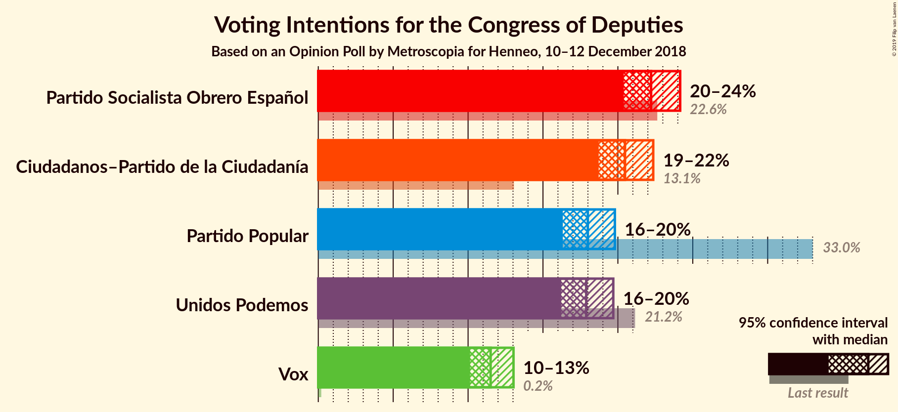
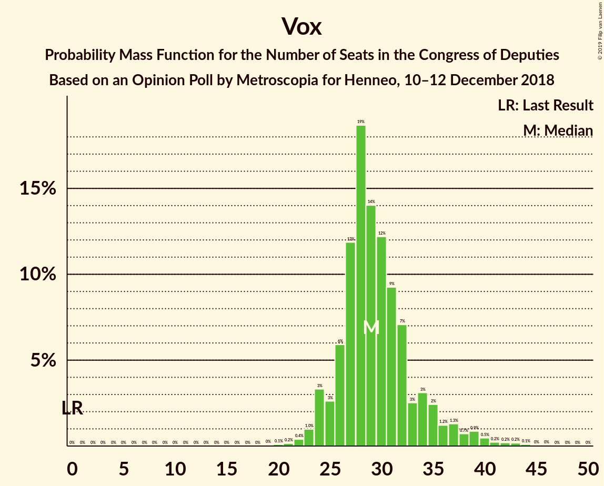
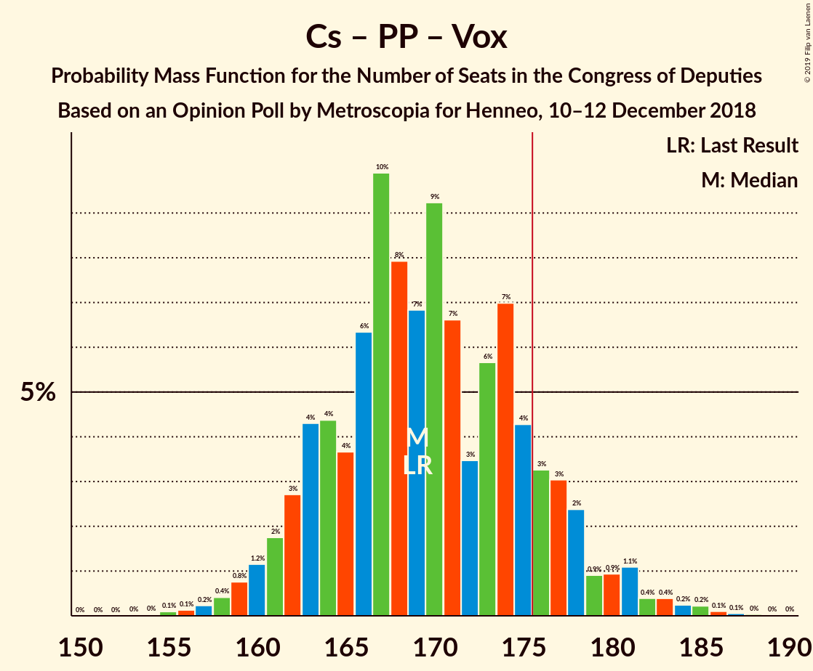

# Opinion Poll by Metroscopia for Henneo, 10–12 December 2018

<a href="#voting-intentions">Voting Intentions</a> | <a href="#seats">Seats</a> | <a href="#coalitions">Coalitions</a> | <a href="#technical-information">Technical Information</a>

## Voting Intentions

### Confidence Intervals

| Party | Last Result | Poll Result | 80% Confidence Interval | 90% Confidence Interval | 95% Confidence Interval | 99% Confidence Interval |
|:-----:|:-----------:|:-----------:|:-----------------------:|:-----------------------:|:-----------------------:|:-----------------------:|
| Partido Socialista Obrero Español | 22.6% | 22.2% | 21.0–23.5% |20.7–23.8% |20.4–24.2% |19.8–24.8% |
| Ciudadanos–Partido de la Ciudadanía | 13.1% | 20.5% | 19.3–21.7% |19.0–22.1% |18.7–22.4% |18.2–23.0% |
| Partido Popular | 33.0% | 18.0% | 16.9–19.2% |16.6–19.5% |16.3–19.8% |15.8–20.4% |
| Unidos Podemos | 21.2% | 17.9% | 16.8–19.1% |16.5–19.4% |16.2–19.7% |15.7–20.3% |
| Vox | 0.2% | 11.5% | 10.6–12.5% |10.3–12.8% |10.1–13.0% |9.7–13.5% |

*Note:* The poll result column reflects the actual value used in the calculations. Published results may vary slightly, and in addition be rounded to fewer digits.

## Seats

### Confidence Intervals

| Party | Last Result | Median | 80% Confidence Interval | 90% Confidence Interval | 95% Confidence Interval | 99% Confidence Interval |
|:-----:|:-----------:|:------:|:-----------------------:|:-----------------------:|:-----------------------:|:-----------------------:|
| <a href="#partido-socialista-obrero-español">Partido Socialista Obrero Español</a> | 85 | 91 | 88–93 |88–94 |86–95 |84–95 |
| <a href="#ciudadanos–partido-de-la-ciudadanía">Ciudadanos–Partido de la Ciudadanía</a> | 32 | 67 | 65–76 |65–76 |65–76 |65–79 |
| <a href="#partido-popular">Partido Popular</a> | 137 | 74 | 69–75 |69–75 |68–75 |58–83 |
| <a href="#unidos-podemos">Unidos Podemos</a> | 71 | 60 | 56–60 |56–61 |56–61 |54–70 |
| <a href="#vox">Vox</a> | 0 | 28 | 28–32 |28–33 |28–34 |22–37 |

### Partido Socialista Obrero Español

*For a full overview of the results for this party, see the [Partido Socialista Obrero Español](party-partidosocialistaobreroespañol.html) page.*

| Number of Seats | Probability | Accumulated | Special Marks |
|:---------------:|:-----------:|:-----------:|:-------------:|
| 82 | 0.2% | 100% |  |
| 83 | 0.2% | 99.8% |  |
| 84 | 0.3% | 99.6% |  |
| 85 | 0.1% | 99.3% | Last Result |
| 86 | 2% | 99.2% |  |
| 87 | 0.2% | 97% |  |
| 88 | 29% | 97% |  |
| 89 | 0.6% | 68% |  |
| 90 | 10% | 68% |  |
| 91 | 30% | 58% | Median |
| 92 | 0.1% | 28% |  |
| 93 | 19% | 28% |  |
| 94 | 6% | 9% |  |
| 95 | 3% | 3% |  |
| 96 | 0% | 0% |  |

### Ciudadanos–Partido de la Ciudadanía

*For a full overview of the results for this party, see the [Ciudadanos–Partido de la Ciudadanía](party-ciudadanos–partidodelaciudadanía.html) page.*

| Number of Seats | Probability | Accumulated | Special Marks |
|:---------------:|:-----------:|:-----------:|:-------------:|
| 32 | 0% | 100% | Last Result |
| 33 | 0% | 100% |  |
| 34 | 0% | 100% |  |
| 35 | 0% | 100% |  |
| 36 | 0% | 100% |  |
| 37 | 0% | 100% |  |
| 38 | 0% | 100% |  |
| 39 | 0% | 100% |  |
| 40 | 0% | 100% |  |
| 41 | 0% | 100% |  |
| 42 | 0% | 100% |  |
| 43 | 0% | 100% |  |
| 44 | 0% | 100% |  |
| 45 | 0% | 100% |  |
| 46 | 0% | 100% |  |
| 47 | 0% | 100% |  |
| 48 | 0% | 100% |  |
| 49 | 0% | 100% |  |
| 50 | 0% | 100% |  |
| 51 | 0% | 100% |  |
| 52 | 0% | 100% |  |
| 53 | 0% | 100% |  |
| 54 | 0% | 100% |  |
| 55 | 0% | 100% |  |
| 56 | 0% | 100% |  |
| 57 | 0% | 100% |  |
| 58 | 0% | 100% |  |
| 59 | 0% | 100% |  |
| 60 | 0% | 100% |  |
| 61 | 0% | 100% |  |
| 62 | 0% | 100% |  |
| 63 | 0% | 100% |  |
| 64 | 0.1% | 100% |  |
| 65 | 11% | 99.8% |  |
| 66 | 38% | 88% |  |
| 67 | 16% | 51% | Median |
| 68 | 0.8% | 35% |  |
| 69 | 0.5% | 34% |  |
| 70 | 1.1% | 33% |  |
| 71 | 0% | 32% |  |
| 72 | 0% | 32% |  |
| 73 | 0.4% | 32% |  |
| 74 | 0% | 32% |  |
| 75 | 2% | 32% |  |
| 76 | 29% | 30% |  |
| 77 | 0% | 1.1% |  |
| 78 | 0.2% | 1.1% |  |
| 79 | 0.5% | 0.9% |  |
| 80 | 0.1% | 0.4% |  |
| 81 | 0.1% | 0.3% |  |
| 82 | 0% | 0.2% |  |
| 83 | 0% | 0.2% |  |
| 84 | 0% | 0.2% |  |
| 85 | 0.2% | 0.2% |  |
| 86 | 0% | 0% |  |

### Partido Popular

*For a full overview of the results for this party, see the [Partido Popular](party-partidopopular.html) page.*

| Number of Seats | Probability | Accumulated | Special Marks |
|:---------------:|:-----------:|:-----------:|:-------------:|
| 56 | 0.1% | 100% |  |
| 57 | 0.3% | 99.9% |  |
| 58 | 0.4% | 99.6% |  |
| 59 | 0.1% | 99.3% |  |
| 60 | 0% | 99.2% |  |
| 61 | 0.2% | 99.1% |  |
| 62 | 0% | 98.9% |  |
| 63 | 0% | 98.9% |  |
| 64 | 0% | 98.9% |  |
| 65 | 0% | 98.9% |  |
| 66 | 0% | 98.9% |  |
| 67 | 0.3% | 98.9% |  |
| 68 | 2% | 98.7% |  |
| 69 | 9% | 97% |  |
| 70 | 0% | 88% |  |
| 71 | 0% | 88% |  |
| 72 | 0.1% | 88% |  |
| 73 | 0% | 88% |  |
| 74 | 45% | 88% | Median |
| 75 | 40% | 42% |  |
| 76 | 0.3% | 2% |  |
| 77 | 0% | 1.5% |  |
| 78 | 0% | 1.5% |  |
| 79 | 0% | 1.5% |  |
| 80 | 0% | 1.5% |  |
| 81 | 0% | 1.5% |  |
| 82 | 0% | 1.5% |  |
| 83 | 1.5% | 1.5% |  |
| 84 | 0% | 0% |  |
| 85 | 0% | 0% |  |
| 86 | 0% | 0% |  |
| 87 | 0% | 0% |  |
| 88 | 0% | 0% |  |
| 89 | 0% | 0% |  |
| 90 | 0% | 0% |  |
| 91 | 0% | 0% |  |
| 92 | 0% | 0% |  |
| 93 | 0% | 0% |  |
| 94 | 0% | 0% |  |
| 95 | 0% | 0% |  |
| 96 | 0% | 0% |  |
| 97 | 0% | 0% |  |
| 98 | 0% | 0% |  |
| 99 | 0% | 0% |  |
| 100 | 0% | 0% |  |
| 101 | 0% | 0% |  |
| 102 | 0% | 0% |  |
| 103 | 0% | 0% |  |
| 104 | 0% | 0% |  |
| 105 | 0% | 0% |  |
| 106 | 0% | 0% |  |
| 107 | 0% | 0% |  |
| 108 | 0% | 0% |  |
| 109 | 0% | 0% |  |
| 110 | 0% | 0% |  |
| 111 | 0% | 0% |  |
| 112 | 0% | 0% |  |
| 113 | 0% | 0% |  |
| 114 | 0% | 0% |  |
| 115 | 0% | 0% |  |
| 116 | 0% | 0% |  |
| 117 | 0% | 0% |  |
| 118 | 0% | 0% |  |
| 119 | 0% | 0% |  |
| 120 | 0% | 0% |  |
| 121 | 0% | 0% |  |
| 122 | 0% | 0% |  |
| 123 | 0% | 0% |  |
| 124 | 0% | 0% |  |
| 125 | 0% | 0% |  |
| 126 | 0% | 0% |  |
| 127 | 0% | 0% |  |
| 128 | 0% | 0% |  |
| 129 | 0% | 0% |  |
| 130 | 0% | 0% |  |
| 131 | 0% | 0% |  |
| 132 | 0% | 0% |  |
| 133 | 0% | 0% |  |
| 134 | 0% | 0% |  |
| 135 | 0% | 0% |  |
| 136 | 0% | 0% |  |
| 137 | 0% | 0% | Last Result |

### Unidos Podemos

*For a full overview of the results for this party, see the [Unidos Podemos](party-unidospodemos.html) page.*

| Number of Seats | Probability | Accumulated | Special Marks |
|:---------------:|:-----------:|:-----------:|:-------------:|
| 54 | 1.1% | 100% |  |
| 55 | 0.4% | 98.9% |  |
| 56 | 31% | 98.5% |  |
| 57 | 0.1% | 68% |  |
| 58 | 0% | 68% |  |
| 59 | 1.1% | 68% |  |
| 60 | 57% | 67% | Median |
| 61 | 8% | 10% |  |
| 62 | 0.2% | 1.3% |  |
| 63 | 0.4% | 1.1% |  |
| 64 | 0% | 0.7% |  |
| 65 | 0% | 0.7% |  |
| 66 | 0% | 0.7% |  |
| 67 | 0% | 0.7% |  |
| 68 | 0% | 0.7% |  |
| 69 | 0.1% | 0.7% |  |
| 70 | 0.2% | 0.6% |  |
| 71 | 0% | 0.3% | Last Result |
| 72 | 0% | 0.3% |  |
| 73 | 0.3% | 0.3% |  |
| 74 | 0% | 0% |  |

### Vox

*For a full overview of the results for this party, see the [Vox](party-vox.html) page.*

| Number of Seats | Probability | Accumulated | Special Marks |
|:---------------:|:-----------:|:-----------:|:-------------:|
| 0 | 0% | 100% | Last Result |
| 1 | 0% | 100% |  |
| 2 | 0% | 100% |  |
| 3 | 0% | 100% |  |
| 4 | 0% | 100% |  |
| 5 | 0% | 100% |  |
| 6 | 0% | 100% |  |
| 7 | 0% | 100% |  |
| 8 | 0% | 100% |  |
| 9 | 0% | 100% |  |
| 10 | 0% | 100% |  |
| 11 | 0% | 100% |  |
| 12 | 0% | 100% |  |
| 13 | 0% | 100% |  |
| 14 | 0% | 100% |  |
| 15 | 0% | 100% |  |
| 16 | 0% | 100% |  |
| 17 | 0% | 100% |  |
| 18 | 0% | 100% |  |
| 19 | 0% | 100% |  |
| 20 | 0.2% | 100% |  |
| 21 | 0% | 99.8% |  |
| 22 | 0.3% | 99.7% |  |
| 23 | 0% | 99.4% |  |
| 24 | 0.2% | 99.4% |  |
| 25 | 2% | 99.2% |  |
| 26 | 0% | 98% |  |
| 27 | 0% | 98% |  |
| 28 | 84% | 98% | Median |
| 29 | 2% | 14% |  |
| 30 | 0.2% | 12% |  |
| 31 | 0.1% | 12% |  |
| 32 | 3% | 12% |  |
| 33 | 6% | 9% |  |
| 34 | 2% | 3% |  |
| 35 | 0% | 0.5% |  |
| 36 | 0% | 0.5% |  |
| 37 | 0.1% | 0.5% |  |
| 38 | 0% | 0.4% |  |
| 39 | 0% | 0.4% |  |
| 40 | 0% | 0.4% |  |
| 41 | 0% | 0.4% |  |
| 42 | 0.2% | 0.3% |  |
| 43 | 0.1% | 0.1% |  |
| 44 | 0% | 0% |  |

## Coalitions

### Confidence Intervals

| Coalition | Last Result | Median | Majority? | 80% Confidence Interval | 90% Confidence Interval | 95% Confidence Interval | 99% Confidence Interval |
|:---------:|:-----------:|:------:|:---------:|:-----------------------:|:-----------------------:|:-----------------------:|:-----------------------:|
| Ciudadanos–Partido de la Ciudadanía – Partido Popular – Vox | 169 | 169 | 33% | 167–178 | 167–178 | 166–178 | 164–179 |
| Partido Socialista Obrero Español – Ciudadanos–Partido de la Ciudadanía | 117 | 160 | 0% | 157–164 | 156–164 | 156–164 | 156–166 |
| Partido Socialista Obrero Español – Unidos Podemos | 156 | 151 | 0% | 144–153 | 144–154 | 144–155 | 142–159 |
| Ciudadanos–Partido de la Ciudadanía – Partido Popular | 169 | 141 | 0% | 134–150 | 134–150 | 133–150 | 131–154 |
| Partido Popular – Vox | 137 | 102 | 0% | 102–103 | 102–103 | 101–104 | 88–108 |
| Partido Socialista Obrero Español | 85 | 91 | 0% | 88–93 | 88–94 | 86–95 | 84–95 |
| Partido Popular | 137 | 74 | 0% | 69–75 | 69–75 | 68–75 | 58–83 |

### Ciudadanos–Partido de la Ciudadanía – Partido Popular – Vox

| Number of Seats | Probability | Accumulated | Special Marks |
|:---------------:|:-----------:|:-----------:|:-------------:|
| 161 | 0.1% | 100% |  |
| 162 | 0% | 99.9% |  |
| 163 | 0% | 99.9% |  |
| 164 | 0.4% | 99.9% |  |
| 165 | 0% | 99.4% |  |
| 166 | 3% | 99.4% |  |
| 167 | 9% | 97% |  |
| 168 | 0.6% | 88% |  |
| 169 | 54% | 88% | Last Result, Median |
| 170 | 0.8% | 34% |  |
| 171 | 0% | 33% |  |
| 172 | 0.4% | 33% |  |
| 173 | 0% | 33% |  |
| 174 | 0% | 33% |  |
| 175 | 0% | 33% |  |
| 176 | 0% | 33% | Majority |
| 177 | 0.9% | 33% |  |
| 178 | 30% | 32% |  |
| 179 | 2% | 2% |  |
| 180 | 0% | 0% |  |

### Partido Socialista Obrero Español – Ciudadanos–Partido de la Ciudadanía

| Number of Seats | Probability | Accumulated | Special Marks |
|:---------------:|:-----------:|:-----------:|:-------------:|
| 117 | 0% | 100% | Last Result |
| 118 | 0% | 100% |  |
| 119 | 0% | 100% |  |
| 120 | 0% | 100% |  |
| 121 | 0% | 100% |  |
| 122 | 0% | 100% |  |
| 123 | 0% | 100% |  |
| 124 | 0% | 100% |  |
| 125 | 0% | 100% |  |
| 126 | 0% | 100% |  |
| 127 | 0% | 100% |  |
| 128 | 0% | 100% |  |
| 129 | 0% | 100% |  |
| 130 | 0% | 100% |  |
| 131 | 0% | 100% |  |
| 132 | 0% | 100% |  |
| 133 | 0% | 100% |  |
| 134 | 0% | 100% |  |
| 135 | 0% | 100% |  |
| 136 | 0% | 100% |  |
| 137 | 0% | 100% |  |
| 138 | 0% | 100% |  |
| 139 | 0% | 100% |  |
| 140 | 0% | 100% |  |
| 141 | 0% | 100% |  |
| 142 | 0% | 100% |  |
| 143 | 0% | 100% |  |
| 144 | 0% | 100% |  |
| 145 | 0% | 100% |  |
| 146 | 0% | 100% |  |
| 147 | 0% | 100% |  |
| 148 | 0% | 100% |  |
| 149 | 0% | 100% |  |
| 150 | 0% | 100% |  |
| 151 | 0% | 100% |  |
| 152 | 0% | 100% |  |
| 153 | 0% | 100% |  |
| 154 | 0.4% | 100% |  |
| 155 | 0% | 99.6% |  |
| 156 | 8% | 99.6% |  |
| 157 | 30% | 91% |  |
| 158 | 2% | 62% | Median |
| 159 | 7% | 59% |  |
| 160 | 19% | 53% |  |
| 161 | 3% | 33% |  |
| 162 | 0% | 30% |  |
| 163 | 0.4% | 30% |  |
| 164 | 29% | 30% |  |
| 165 | 0.3% | 0.8% |  |
| 166 | 0.2% | 0.5% |  |
| 167 | 0.1% | 0.3% |  |
| 168 | 0.2% | 0.3% |  |
| 169 | 0% | 0% |  |

### Partido Socialista Obrero Español – Unidos Podemos

| Number of Seats | Probability | Accumulated | Special Marks |
|:---------------:|:-----------:|:-----------:|:-------------:|
| 142 | 2% | 100% |  |
| 143 | 0.2% | 98% |  |
| 144 | 30% | 98% |  |
| 145 | 0.8% | 68% |  |
| 146 | 0% | 67% |  |
| 147 | 0% | 67% |  |
| 148 | 0% | 67% |  |
| 149 | 0% | 67% |  |
| 150 | 0.4% | 67% |  |
| 151 | 38% | 67% | Median |
| 152 | 1.4% | 29% |  |
| 153 | 18% | 27% |  |
| 154 | 6% | 10% |  |
| 155 | 3% | 3% |  |
| 156 | 0.1% | 0.7% | Last Result |
| 157 | 0% | 0.6% |  |
| 158 | 0% | 0.6% |  |
| 159 | 0.2% | 0.6% |  |
| 160 | 0.2% | 0.3% |  |
| 161 | 0% | 0.1% |  |
| 162 | 0% | 0.1% |  |
| 163 | 0% | 0.1% |  |
| 164 | 0% | 0% |  |

### Ciudadanos–Partido de la Ciudadanía – Partido Popular

| Number of Seats | Probability | Accumulated | Special Marks |
|:---------------:|:-----------:|:-----------:|:-------------:|
| 129 | 0.1% | 100% |  |
| 130 | 0.2% | 99.8% |  |
| 131 | 0.2% | 99.6% |  |
| 132 | 0% | 99.5% |  |
| 133 | 2% | 99.5% |  |
| 134 | 9% | 97% |  |
| 135 | 0% | 88% |  |
| 136 | 0% | 88% |  |
| 137 | 0% | 88% |  |
| 138 | 0% | 88% |  |
| 139 | 0.2% | 88% |  |
| 140 | 0.4% | 88% |  |
| 141 | 54% | 88% | Median |
| 142 | 0.8% | 34% |  |
| 143 | 0.2% | 33% |  |
| 144 | 0.1% | 33% |  |
| 145 | 0% | 33% |  |
| 146 | 0% | 33% |  |
| 147 | 0.1% | 33% |  |
| 148 | 0.1% | 33% |  |
| 149 | 0.1% | 33% |  |
| 150 | 31% | 33% |  |
| 151 | 0% | 2% |  |
| 152 | 0.4% | 2% |  |
| 153 | 1.0% | 2% |  |
| 154 | 0.2% | 0.5% |  |
| 155 | 0.3% | 0.3% |  |
| 156 | 0% | 0% |  |
| 157 | 0% | 0% |  |
| 158 | 0% | 0% |  |
| 159 | 0% | 0% |  |
| 160 | 0% | 0% |  |
| 161 | 0% | 0% |  |
| 162 | 0% | 0% |  |
| 163 | 0% | 0% |  |
| 164 | 0% | 0% |  |
| 165 | 0% | 0% |  |
| 166 | 0% | 0% |  |
| 167 | 0% | 0% |  |
| 168 | 0% | 0% |  |
| 169 | 0% | 0% | Last Result |

### Partido Popular – Vox

| Number of Seats | Probability | Accumulated | Special Marks |
|:---------------:|:-----------:|:-----------:|:-------------:|
| 86 | 0.2% | 100% |  |
| 87 | 0.1% | 99.8% |  |
| 88 | 0.2% | 99.6% |  |
| 89 | 0% | 99.4% |  |
| 90 | 0% | 99.4% |  |
| 91 | 0% | 99.4% |  |
| 92 | 0.2% | 99.4% |  |
| 93 | 0.1% | 99.1% |  |
| 94 | 0% | 99.1% |  |
| 95 | 0% | 99.1% |  |
| 96 | 0% | 99.1% |  |
| 97 | 0% | 99.1% |  |
| 98 | 0.3% | 99.0% |  |
| 99 | 0.5% | 98.7% |  |
| 100 | 0% | 98% |  |
| 101 | 3% | 98% |  |
| 102 | 54% | 96% | Median |
| 103 | 38% | 42% |  |
| 104 | 2% | 4% |  |
| 105 | 0% | 2% |  |
| 106 | 0% | 2% |  |
| 107 | 0% | 1.5% |  |
| 108 | 1.5% | 1.5% |  |
| 109 | 0% | 0% |  |
| 110 | 0% | 0% |  |
| 111 | 0% | 0% |  |
| 112 | 0% | 0% |  |
| 113 | 0% | 0% |  |
| 114 | 0% | 0% |  |
| 115 | 0% | 0% |  |
| 116 | 0% | 0% |  |
| 117 | 0% | 0% |  |
| 118 | 0% | 0% |  |
| 119 | 0% | 0% |  |
| 120 | 0% | 0% |  |
| 121 | 0% | 0% |  |
| 122 | 0% | 0% |  |
| 123 | 0% | 0% |  |
| 124 | 0% | 0% |  |
| 125 | 0% | 0% |  |
| 126 | 0% | 0% |  |
| 127 | 0% | 0% |  |
| 128 | 0% | 0% |  |
| 129 | 0% | 0% |  |
| 130 | 0% | 0% |  |
| 131 | 0% | 0% |  |
| 132 | 0% | 0% |  |
| 133 | 0% | 0% |  |
| 134 | 0% | 0% |  |
| 135 | 0% | 0% |  |
| 136 | 0% | 0% |  |
| 137 | 0% | 0% | Last Result |

### Partido Socialista Obrero Español

| Number of Seats | Probability | Accumulated | Special Marks |
|:---------------:|:-----------:|:-----------:|:-------------:|
| 82 | 0.2% | 100% |  |
| 83 | 0.2% | 99.8% |  |
| 84 | 0.3% | 99.6% |  |
| 85 | 0.1% | 99.3% | Last Result |
| 86 | 2% | 99.2% |  |
| 87 | 0.2% | 97% |  |
| 88 | 29% | 97% |  |
| 89 | 0.6% | 68% |  |
| 90 | 10% | 68% |  |
| 91 | 30% | 58% | Median |
| 92 | 0.1% | 28% |  |
| 93 | 19% | 28% |  |
| 94 | 6% | 9% |  |
| 95 | 3% | 3% |  |
| 96 | 0% | 0% |  |

### Partido Popular

| Number of Seats | Probability | Accumulated | Special Marks |
|:---------------:|:-----------:|:-----------:|:-------------:|
| 56 | 0.1% | 100% |  |
| 57 | 0.3% | 99.9% |  |
| 58 | 0.4% | 99.6% |  |
| 59 | 0.1% | 99.3% |  |
| 60 | 0% | 99.2% |  |
| 61 | 0.2% | 99.1% |  |
| 62 | 0% | 98.9% |  |
| 63 | 0% | 98.9% |  |
| 64 | 0% | 98.9% |  |
| 65 | 0% | 98.9% |  |
| 66 | 0% | 98.9% |  |
| 67 | 0.3% | 98.9% |  |
| 68 | 2% | 98.7% |  |
| 69 | 9% | 97% |  |
| 70 | 0% | 88% |  |
| 71 | 0% | 88% |  |
| 72 | 0.1% | 88% |  |
| 73 | 0% | 88% |  |
| 74 | 45% | 88% | Median |
| 75 | 40% | 42% |  |
| 76 | 0.3% | 2% |  |
| 77 | 0% | 1.5% |  |
| 78 | 0% | 1.5% |  |
| 79 | 0% | 1.5% |  |
| 80 | 0% | 1.5% |  |
| 81 | 0% | 1.5% |  |
| 82 | 0% | 1.5% |  |
| 83 | 1.5% | 1.5% |  |
| 84 | 0% | 0% |  |
| 85 | 0% | 0% |  |
| 86 | 0% | 0% |  |
| 87 | 0% | 0% |  |
| 88 | 0% | 0% |  |
| 89 | 0% | 0% |  |
| 90 | 0% | 0% |  |
| 91 | 0% | 0% |  |
| 92 | 0% | 0% |  |
| 93 | 0% | 0% |  |
| 94 | 0% | 0% |  |
| 95 | 0% | 0% |  |
| 96 | 0% | 0% |  |
| 97 | 0% | 0% |  |
| 98 | 0% | 0% |  |
| 99 | 0% | 0% |  |
| 100 | 0% | 0% |  |
| 101 | 0% | 0% |  |
| 102 | 0% | 0% |  |
| 103 | 0% | 0% |  |
| 104 | 0% | 0% |  |
| 105 | 0% | 0% |  |
| 106 | 0% | 0% |  |
| 107 | 0% | 0% |  |
| 108 | 0% | 0% |  |
| 109 | 0% | 0% |  |
| 110 | 0% | 0% |  |
| 111 | 0% | 0% |  |
| 112 | 0% | 0% |  |
| 113 | 0% | 0% |  |
| 114 | 0% | 0% |  |
| 115 | 0% | 0% |  |
| 116 | 0% | 0% |  |
| 117 | 0% | 0% |  |
| 118 | 0% | 0% |  |
| 119 | 0% | 0% |  |
| 120 | 0% | 0% |  |
| 121 | 0% | 0% |  |
| 122 | 0% | 0% |  |
| 123 | 0% | 0% |  |
| 124 | 0% | 0% |  |
| 125 | 0% | 0% |  |
| 126 | 0% | 0% |  |
| 127 | 0% | 0% |  |
| 128 | 0% | 0% |  |
| 129 | 0% | 0% |  |
| 130 | 0% | 0% |  |
| 131 | 0% | 0% |  |
| 132 | 0% | 0% |  |
| 133 | 0% | 0% |  |
| 134 | 0% | 0% |  |
| 135 | 0% | 0% |  |
| 136 | 0% | 0% |  |
| 137 | 0% | 0% | Last Result |

## Technical Information

### Opinion Poll

+ **Polling firm:** Metroscopia
+ **Commissioner(s):** Henneo
+ **Fieldwork period:** 10–12 December 2018

### Calculations

+ **Sample size:** 1895
+ **Simulations done:** 1,024
+ **Error estimate:** 2.33%

