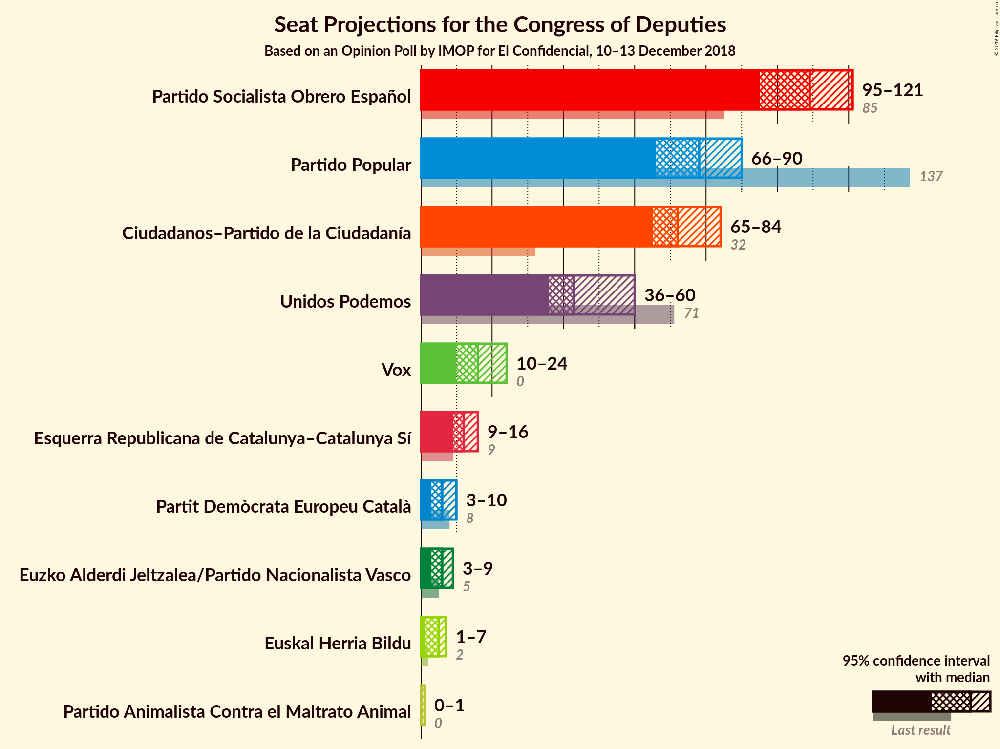
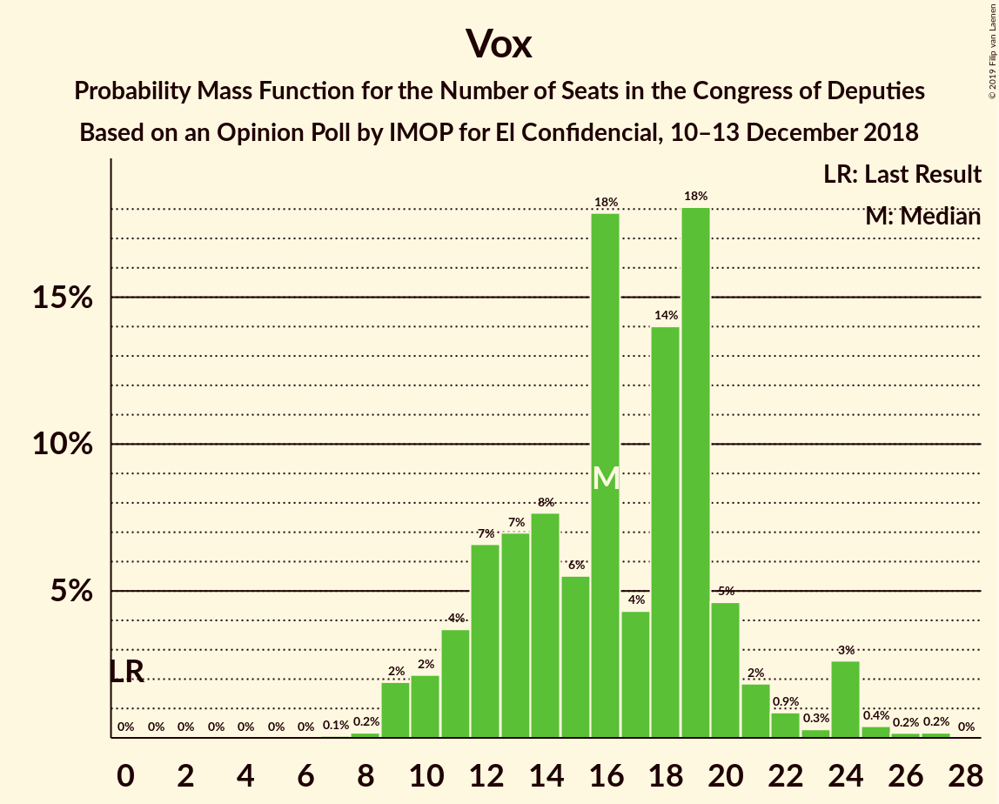
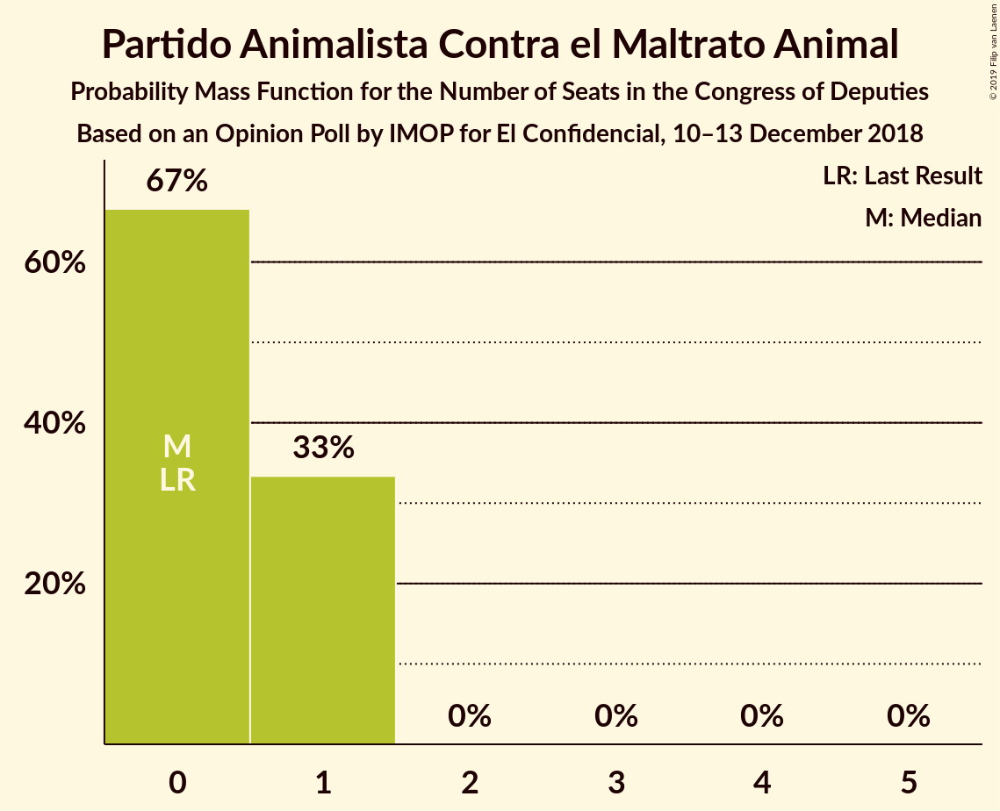

# Opinion Poll by IMOP for El Confidencial, 10–13 December 2018

<a href="#voting-intentions">Voting Intentions</a> | <a href="#seats">Seats</a> | <a href="#coalitions">Coalitions</a> | <a href="#technical-information">Technical Information</a>

## Voting Intentions

### Confidence Intervals

| Party | Last Result | Poll Result | 80% Confidence Interval | 90% Confidence Interval | 95% Confidence Interval | 99% Confidence Interval |
|:-----:|:-----------:|:-----------:|:-----------------------:|:-----------------------:|:-----------------------:|:-----------------------:|
| Partido Socialista Obrero Español | 22.6% | 25.8% | 24.1–27.6% |23.6–28.1% |23.2–28.5% |22.4–29.4% |
| Ciudadanos–Partido de la Ciudadanía | 13.1% | 20.6% | 19.0–22.2% |18.6–22.7% |18.2–23.1% |17.5–24.0% |
| Partido Popular | 33.0% | 19.6% | 18.1–21.2% |17.6–21.7% |17.3–22.1% |16.6–22.9% |
| Unidos Podemos | 21.2% | 15.5% | 14.2–17.1% |13.8–17.5% |13.5–17.9% |12.8–18.6% |
| Vox | 0.2% | 8.0% | 7.0–9.2% |6.7–9.5% |6.5–9.8% |6.1–10.4% |
| Esquerra Republicana de Catalunya–Catalunya Sí | 2.7% | 3.0% | 2.4–3.8% |2.2–4.0% |2.1–4.2% |1.9–4.6% |
| Partit Demòcrata Europeu Català | 2.0% | 1.6% | 1.2–2.3% |1.1–2.5% |1.0–2.6% |0.9–3.0% |
| Partido Animalista Contra el Maltrato Animal | 1.2% | 1.6% | 1.2–2.3% |1.1–2.5% |1.0–2.6% |0.9–3.0% |
| Euzko Alderdi Jeltzalea/Partido Nacionalista Vasco | 1.2% | 1.2% | 0.8–1.7% |0.7–1.9% |0.7–2.0% |0.5–2.3% |
| Euskal Herria Bildu | 0.8% | 0.9% | 0.6–1.4% |0.5–1.5% |0.5–1.6% |0.4–1.9% |

*Note:* The poll result column reflects the actual value used in the calculations. Published results may vary slightly, and in addition be rounded to fewer digits.

## Seats

### Confidence Intervals

| Party | Last Result | Median | 80% Confidence Interval | 90% Confidence Interval | 95% Confidence Interval | 99% Confidence Interval |
|:-----:|:-----------:|:------:|:-----------------------:|:-----------------------:|:-----------------------:|:-----------------------:|
| <a href="#partido-socialista-obrero-español">Partido Socialista Obrero Español</a> | 85 | 103 | 99–124 |99–124 |97–124 |92–129 |
| <a href="#ciudadanos–partido-de-la-ciudadanía">Ciudadanos–Partido de la Ciudadanía</a> | 32 | 76 | 66–87 |66–87 |64–87 |59–87 |
| <a href="#partido-popular">Partido Popular</a> | 137 | 78 | 67–89 |61–89 |61–89 |61–97 |
| <a href="#unidos-podemos">Unidos Podemos</a> | 71 | 48 | 42–55 |40–55 |36–61 |32–68 |
| <a href="#vox">Vox</a> | 0 | 12 | 10–22 |10–22 |10–22 |8–24 |
| <a href="#esquerra-republicana-de-catalunya–catalunya-sí">Esquerra Republicana de Catalunya–Catalunya Sí</a> | 9 | 12 | 9–13 |8–15 |7–15 |7–18 |
| <a href="#partit-demòcrata-europeu-català">Partit Demòcrata Europeu Català</a> | 8 | 6 | 4–10 |4–11 |4–11 |2–11 |
| <a href="#partido-animalista-contra-el-maltrato-animal">Partido Animalista Contra el Maltrato Animal</a> | 0 | 0 | 0 |0–1 |0–1 |0–1 |
| <a href="#euzko-alderdi-jeltzalea/partido-nacionalista-vasco">Euzko Alderdi Jeltzalea/Partido Nacionalista Vasco</a> | 5 | 4 | 3–9 |3–9 |3–9 |3–10 |
| <a href="#euskal-herria-bildu">Euskal Herria Bildu</a> | 2 | 6 | 2–6 |2–8 |1–8 |1–8 |

### Partido Socialista Obrero Español

*For a full overview of the results for this party, see the [Partido Socialista Obrero Español](party-partidosocialistaobreroespañol.html) page.*

| Number of Seats | Probability | Accumulated | Special Marks |
|:---------------:|:-----------:|:-----------:|:-------------:|
| 85 | 0% | 100% | Last Result |
| 86 | 0% | 100% |  |
| 87 | 0% | 100% |  |
| 88 | 0% | 100% |  |
| 89 | 0% | 100% |  |
| 90 | 0% | 100% |  |
| 91 | 0% | 99.9% |  |
| 92 | 0.8% | 99.9% |  |
| 93 | 0% | 99.1% |  |
| 94 | 0.1% | 99.1% |  |
| 95 | 0.5% | 98.9% |  |
| 96 | 0.6% | 98% |  |
| 97 | 0.6% | 98% |  |
| 98 | 0.7% | 97% |  |
| 99 | 11% | 97% |  |
| 100 | 1.2% | 86% |  |
| 101 | 1.3% | 85% |  |
| 102 | 33% | 83% |  |
| 103 | 2% | 50% | Median |
| 104 | 0% | 49% |  |
| 105 | 0.9% | 49% |  |
| 106 | 20% | 48% |  |
| 107 | 4% | 28% |  |
| 108 | 0.1% | 24% |  |
| 109 | 3% | 24% |  |
| 110 | 7% | 21% |  |
| 111 | 2% | 14% |  |
| 112 | 0.2% | 12% |  |
| 113 | 0.1% | 12% |  |
| 114 | 0% | 12% |  |
| 115 | 0% | 12% |  |
| 116 | 0% | 12% |  |
| 117 | 0.7% | 12% |  |
| 118 | 0% | 11% |  |
| 119 | 0% | 11% |  |
| 120 | 0% | 11% |  |
| 121 | 0% | 11% |  |
| 122 | 0% | 11% |  |
| 123 | 0% | 11% |  |
| 124 | 9% | 11% |  |
| 125 | 0.1% | 2% |  |
| 126 | 0% | 2% |  |
| 127 | 0% | 2% |  |
| 128 | 0.1% | 2% |  |
| 129 | 2% | 2% |  |
| 130 | 0.1% | 0.1% |  |
| 131 | 0% | 0% |  |

### Ciudadanos–Partido de la Ciudadanía

*For a full overview of the results for this party, see the [Ciudadanos–Partido de la Ciudadanía](party-ciudadanos–partidodelaciudadanía.html) page.*

| Number of Seats | Probability | Accumulated | Special Marks |
|:---------------:|:-----------:|:-----------:|:-------------:|
| 32 | 0% | 100% | Last Result |
| 33 | 0% | 100% |  |
| 34 | 0% | 100% |  |
| 35 | 0% | 100% |  |
| 36 | 0% | 100% |  |
| 37 | 0% | 100% |  |
| 38 | 0% | 100% |  |
| 39 | 0% | 100% |  |
| 40 | 0% | 100% |  |
| 41 | 0% | 100% |  |
| 42 | 0% | 100% |  |
| 43 | 0% | 100% |  |
| 44 | 0% | 100% |  |
| 45 | 0% | 100% |  |
| 46 | 0% | 100% |  |
| 47 | 0% | 100% |  |
| 48 | 0% | 100% |  |
| 49 | 0% | 100% |  |
| 50 | 0% | 100% |  |
| 51 | 0% | 100% |  |
| 52 | 0% | 100% |  |
| 53 | 0% | 100% |  |
| 54 | 0% | 100% |  |
| 55 | 0.2% | 100% |  |
| 56 | 0% | 99.8% |  |
| 57 | 0% | 99.8% |  |
| 58 | 0.1% | 99.7% |  |
| 59 | 0.7% | 99.7% |  |
| 60 | 0.2% | 99.0% |  |
| 61 | 0.1% | 98.8% |  |
| 62 | 0.3% | 98.8% |  |
| 63 | 0.5% | 98% |  |
| 64 | 0.6% | 98% |  |
| 65 | 0.2% | 97% |  |
| 66 | 10% | 97% |  |
| 67 | 3% | 87% |  |
| 68 | 3% | 84% |  |
| 69 | 2% | 81% |  |
| 70 | 0.2% | 79% |  |
| 71 | 0.3% | 79% |  |
| 72 | 10% | 79% |  |
| 73 | 8% | 68% |  |
| 74 | 0.8% | 60% |  |
| 75 | 6% | 60% |  |
| 76 | 34% | 54% | Median |
| 77 | 0% | 20% |  |
| 78 | 5% | 20% |  |
| 79 | 0% | 16% |  |
| 80 | 1.0% | 16% |  |
| 81 | 1.3% | 15% |  |
| 82 | 0.8% | 13% |  |
| 83 | 0.3% | 12% |  |
| 84 | 0.1% | 12% |  |
| 85 | 0% | 12% |  |
| 86 | 0% | 12% |  |
| 87 | 12% | 12% |  |
| 88 | 0% | 0.2% |  |
| 89 | 0% | 0.1% |  |
| 90 | 0% | 0.1% |  |
| 91 | 0% | 0.1% |  |
| 92 | 0.1% | 0.1% |  |
| 93 | 0% | 0% |  |

### Partido Popular

*For a full overview of the results for this party, see the [Partido Popular](party-partidopopular.html) page.*

| Number of Seats | Probability | Accumulated | Special Marks |
|:---------------:|:-----------:|:-----------:|:-------------:|
| 55 | 0.1% | 100% |  |
| 56 | 0% | 99.9% |  |
| 57 | 0% | 99.9% |  |
| 58 | 0% | 99.9% |  |
| 59 | 0% | 99.9% |  |
| 60 | 0% | 99.9% |  |
| 61 | 9% | 99.9% |  |
| 62 | 0% | 91% |  |
| 63 | 0% | 91% |  |
| 64 | 0% | 91% |  |
| 65 | 0% | 91% |  |
| 66 | 0.4% | 91% |  |
| 67 | 0.8% | 91% |  |
| 68 | 0% | 90% |  |
| 69 | 0.5% | 90% |  |
| 70 | 1.3% | 89% |  |
| 71 | 0.6% | 88% |  |
| 72 | 0.1% | 87% |  |
| 73 | 12% | 87% |  |
| 74 | 0% | 75% |  |
| 75 | 2% | 75% |  |
| 76 | 8% | 73% |  |
| 77 | 8% | 65% |  |
| 78 | 35% | 57% | Median |
| 79 | 0.8% | 22% |  |
| 80 | 4% | 21% |  |
| 81 | 0% | 17% |  |
| 82 | 0.2% | 17% |  |
| 83 | 1.2% | 17% |  |
| 84 | 0% | 15% |  |
| 85 | 1.4% | 15% |  |
| 86 | 0.3% | 14% |  |
| 87 | 0.8% | 14% |  |
| 88 | 0.2% | 13% |  |
| 89 | 11% | 13% |  |
| 90 | 0.1% | 1.4% |  |
| 91 | 0% | 1.3% |  |
| 92 | 0.3% | 1.3% |  |
| 93 | 0% | 1.0% |  |
| 94 | 0% | 1.0% |  |
| 95 | 0% | 1.0% |  |
| 96 | 0.3% | 0.9% |  |
| 97 | 0.6% | 0.6% |  |
| 98 | 0% | 0.1% |  |
| 99 | 0% | 0.1% |  |
| 100 | 0% | 0.1% |  |
| 101 | 0% | 0.1% |  |
| 102 | 0% | 0.1% |  |
| 103 | 0% | 0.1% |  |
| 104 | 0% | 0% |  |
| 105 | 0% | 0% |  |
| 106 | 0% | 0% |  |
| 107 | 0% | 0% |  |
| 108 | 0% | 0% |  |
| 109 | 0% | 0% |  |
| 110 | 0% | 0% |  |
| 111 | 0% | 0% |  |
| 112 | 0% | 0% |  |
| 113 | 0% | 0% |  |
| 114 | 0% | 0% |  |
| 115 | 0% | 0% |  |
| 116 | 0% | 0% |  |
| 117 | 0% | 0% |  |
| 118 | 0% | 0% |  |
| 119 | 0% | 0% |  |
| 120 | 0% | 0% |  |
| 121 | 0% | 0% |  |
| 122 | 0% | 0% |  |
| 123 | 0% | 0% |  |
| 124 | 0% | 0% |  |
| 125 | 0% | 0% |  |
| 126 | 0% | 0% |  |
| 127 | 0% | 0% |  |
| 128 | 0% | 0% |  |
| 129 | 0% | 0% |  |
| 130 | 0% | 0% |  |
| 131 | 0% | 0% |  |
| 132 | 0% | 0% |  |
| 133 | 0% | 0% |  |
| 134 | 0% | 0% |  |
| 135 | 0% | 0% |  |
| 136 | 0% | 0% |  |
| 137 | 0% | 0% | Last Result |

### Unidos Podemos

*For a full overview of the results for this party, see the [Unidos Podemos](party-unidospodemos.html) page.*

| Number of Seats | Probability | Accumulated | Special Marks |
|:---------------:|:-----------:|:-----------:|:-------------:|
| 31 | 0% | 100% |  |
| 32 | 1.2% | 99.9% |  |
| 33 | 0.2% | 98.7% |  |
| 34 | 0.1% | 98% |  |
| 35 | 0.2% | 98% |  |
| 36 | 2% | 98% |  |
| 37 | 0.5% | 96% |  |
| 38 | 0.1% | 96% |  |
| 39 | 0.1% | 96% |  |
| 40 | 4% | 96% |  |
| 41 | 2% | 92% |  |
| 42 | 8% | 91% |  |
| 43 | 12% | 83% |  |
| 44 | 11% | 70% |  |
| 45 | 1.1% | 59% |  |
| 46 | 0.5% | 58% |  |
| 47 | 0.3% | 57% |  |
| 48 | 11% | 57% | Median |
| 49 | 6% | 47% |  |
| 50 | 1.1% | 41% |  |
| 51 | 1.5% | 40% |  |
| 52 | 0.3% | 38% |  |
| 53 | 0% | 38% |  |
| 54 | 0% | 38% |  |
| 55 | 33% | 38% |  |
| 56 | 1.2% | 5% |  |
| 57 | 0% | 4% |  |
| 58 | 0.3% | 4% |  |
| 59 | 0.7% | 3% |  |
| 60 | 0.1% | 3% |  |
| 61 | 0.2% | 3% |  |
| 62 | 0.4% | 2% |  |
| 63 | 0% | 2% |  |
| 64 | 0% | 2% |  |
| 65 | 0.2% | 2% |  |
| 66 | 1.2% | 2% |  |
| 67 | 0% | 0.5% |  |
| 68 | 0.5% | 0.5% |  |
| 69 | 0% | 0% |  |
| 70 | 0% | 0% |  |
| 71 | 0% | 0% | Last Result |

### Vox

*For a full overview of the results for this party, see the [Vox](party-vox.html) page.*

| Number of Seats | Probability | Accumulated | Special Marks |
|:---------------:|:-----------:|:-----------:|:-------------:|
| 0 | 0% | 100% | Last Result |
| 1 | 0% | 100% |  |
| 2 | 0% | 100% |  |
| 3 | 0% | 100% |  |
| 4 | 0% | 100% |  |
| 5 | 0% | 100% |  |
| 6 | 0% | 100% |  |
| 7 | 0% | 100% |  |
| 8 | 1.5% | 100% |  |
| 9 | 0.8% | 98% |  |
| 10 | 35% | 98% |  |
| 11 | 0.4% | 63% |  |
| 12 | 19% | 62% | Median |
| 13 | 3% | 43% |  |
| 14 | 0.8% | 40% |  |
| 15 | 0.1% | 39% |  |
| 16 | 0.3% | 39% |  |
| 17 | 0.9% | 38% |  |
| 18 | 9% | 37% |  |
| 19 | 13% | 28% |  |
| 20 | 0.2% | 15% |  |
| 21 | 3% | 15% |  |
| 22 | 10% | 12% |  |
| 23 | 0.3% | 2% |  |
| 24 | 1.0% | 1.2% |  |
| 25 | 0.1% | 0.3% |  |
| 26 | 0.2% | 0.2% |  |
| 27 | 0% | 0% |  |

### Esquerra Republicana de Catalunya–Catalunya Sí

*For a full overview of the results for this party, see the [Esquerra Republicana de Catalunya–Catalunya Sí](party-esquerrarepublicanadecatalunya–catalunyasí.html) page.*

| Number of Seats | Probability | Accumulated | Special Marks |
|:---------------:|:-----------:|:-----------:|:-------------:|
| 6 | 0.5% | 100% |  |
| 7 | 4% | 99.5% |  |
| 8 | 1.5% | 96% |  |
| 9 | 12% | 94% | Last Result |
| 10 | 0.7% | 82% |  |
| 11 | 1.0% | 82% |  |
| 12 | 48% | 81% | Median |
| 13 | 24% | 32% |  |
| 14 | 1.5% | 9% |  |
| 15 | 6% | 7% |  |
| 16 | 0.3% | 1.1% |  |
| 17 | 0.1% | 0.7% |  |
| 18 | 0.4% | 0.6% |  |
| 19 | 0.1% | 0.2% |  |
| 20 | 0.1% | 0.1% |  |
| 21 | 0.1% | 0.1% |  |
| 22 | 0% | 0% |  |

### Partit Demòcrata Europeu Català

*For a full overview of the results for this party, see the [Partit Demòcrata Europeu Català](party-partitdemòcrataeuropeucatalà.html) page.*

| Number of Seats | Probability | Accumulated | Special Marks |
|:---------------:|:-----------:|:-----------:|:-------------:|
| 1 | 0.3% | 100% |  |
| 2 | 0.4% | 99.7% |  |
| 3 | 0.7% | 99.3% |  |
| 4 | 12% | 98.6% |  |
| 5 | 0.7% | 86% |  |
| 6 | 44% | 85% | Median |
| 7 | 21% | 42% |  |
| 8 | 8% | 21% | Last Result |
| 9 | 0.3% | 14% |  |
| 10 | 5% | 13% |  |
| 11 | 8% | 8% |  |
| 12 | 0.1% | 0.1% |  |
| 13 | 0% | 0% |  |

### Partido Animalista Contra el Maltrato Animal

*For a full overview of the results for this party, see the [Partido Animalista Contra el Maltrato Animal](party-partidoanimalistacontraelmaltratoanimal.html) page.*

| Number of Seats | Probability | Accumulated | Special Marks |
|:---------------:|:-----------:|:-----------:|:-------------:|
| 0 | 94% | 100% | Last Result, Median |
| 1 | 6% | 6% |  |
| 2 | 0% | 0% |  |

### Euzko Alderdi Jeltzalea/Partido Nacionalista Vasco

*For a full overview of the results for this party, see the [Euzko Alderdi Jeltzalea/Partido Nacionalista Vasco](party-euzkoalderdijeltzaleapartidonacionalistavasco.html) page.*

| Number of Seats | Probability | Accumulated | Special Marks |
|:---------------:|:-----------:|:-----------:|:-------------:|
| 3 | 26% | 100% |  |
| 4 | 54% | 74% | Median |
| 5 | 5% | 20% | Last Result |
| 6 | 3% | 14% |  |
| 7 | 0.5% | 11% |  |
| 8 | 0.1% | 11% |  |
| 9 | 9% | 11% |  |
| 10 | 1.5% | 1.5% |  |
| 11 | 0% | 0% |  |

### Euskal Herria Bildu

*For a full overview of the results for this party, see the [Euskal Herria Bildu](party-euskalherriabildu.html) page.*

| Number of Seats | Probability | Accumulated | Special Marks |
|:---------------:|:-----------:|:-----------:|:-------------:|
| 0 | 0.1% | 100% |  |
| 1 | 2% | 99.9% |  |
| 2 | 8% | 97% | Last Result |
| 3 | 11% | 90% |  |
| 4 | 0.5% | 79% |  |
| 5 | 12% | 78% |  |
| 6 | 57% | 66% | Median |
| 7 | 3% | 9% |  |
| 8 | 5% | 5% |  |
| 9 | 0.2% | 0.2% |  |
| 10 | 0% | 0% |  |

## Coalitions

### Confidence Intervals

| Coalition | Last Result | Median | Majority? | 80% Confidence Interval | 90% Confidence Interval | 95% Confidence Interval | 99% Confidence Interval |
|:---------:|:-----------:|:------:|:---------:|:-----------------------:|:-----------------------:|:-----------------------:|:-----------------------:|
| Partido Socialista Obrero Español – Ciudadanos–Partido de la Ciudadanía – Partido Popular | 254 | 256 | 100% | 254–266 | 252–266 | 246–270 | 238–274 |
| Partido Socialista Obrero Español – Ciudadanos–Partido de la Ciudadanía – Unidos Podemos | 188 | 233 | 100% | 213–239 | 213–239 | 213–239 | 205–245 |
| Partido Socialista Obrero Español – Unidos Podemos – Esquerra Republicana de Catalunya–Catalunya Sí – Partit Demòcrata Europeu Català – Euzko Alderdi Jeltzalea/Partido Nacionalista Vasco – Euskal Herria Bildu | 180 | 185 | 82% | 172–197 | 172–198 | 172–198 | 169–199 |
| Partido Socialista Obrero Español – Partido Popular | 222 | 180 | 97% | 179–188 | 178–195 | 172–198 | 159–203 |
| Partido Socialista Obrero Español – Ciudadanos–Partido de la Ciudadanía | 117 | 178 | 83% | 165–196 | 165–196 | 165–196 | 160–198 |
| Partido Socialista Obrero Español – Unidos Podemos – Esquerra Republicana de Catalunya–Catalunya Sí – Partit Demòcrata Europeu Català | 173 | 175 | 22% | 163–186 | 163–186 | 162–186 | 159–188 |
| Partido Socialista Obrero Español – Unidos Podemos – Esquerra Republicana de Catalunya–Catalunya Sí – Euskal Herria Bildu | 167 | 175 | 21% | 162–182 | 160–182 | 159–183 | 158–186 |
| Partido Socialista Obrero Español – Unidos Podemos – Euzko Alderdi Jeltzalea/Partido Nacionalista Vasco – Euskal Herria Bildu | 163 | 166 | 11% | 156–179 | 155–179 | 155–179 | 151–180 |
| Ciudadanos–Partido de la Ciudadanía – Partido Popular – Vox | 169 | 164 | 16% | 151–177 | 151–177 | 151–177 | 150–180 |
| Partido Socialista Obrero Español – Unidos Podemos | 156 | 157 | 0.3% | 147–167 | 147–167 | 144–167 | 141–170 |
| Ciudadanos–Partido de la Ciudadanía – Partido Popular | 169 | 154 | 0% | 138–160 | 133–160 | 133–160 | 133–163 |
| Partido Socialista Obrero Español | 85 | 103 | 0% | 99–124 | 99–124 | 97–124 | 92–129 |
| Partido Popular – Vox | 137 | 88 | 0% | 80–111 | 79–111 | 79–111 | 79–116 |
| Partido Popular | 137 | 78 | 0% | 67–89 | 61–89 | 61–89 | 61–97 |

### Partido Socialista Obrero Español – Ciudadanos–Partido de la Ciudadanía – Partido Popular

| Number of Seats | Probability | Accumulated | Special Marks |
|:---------------:|:-----------:|:-----------:|:-------------:|
| 235 | 0% | 100% |  |
| 236 | 0% | 99.9% |  |
| 237 | 0% | 99.9% |  |
| 238 | 0.6% | 99.9% |  |
| 239 | 0% | 99.3% |  |
| 240 | 0% | 99.3% |  |
| 241 | 0% | 99.3% |  |
| 242 | 0% | 99.3% |  |
| 243 | 0.1% | 99.3% |  |
| 244 | 1.2% | 99.1% |  |
| 245 | 0.3% | 98% |  |
| 246 | 1.1% | 98% |  |
| 247 | 0.1% | 96% |  |
| 248 | 0.1% | 96% |  |
| 249 | 0.1% | 96% |  |
| 250 | 0.2% | 96% |  |
| 251 | 0.3% | 96% |  |
| 252 | 3% | 96% |  |
| 253 | 0.1% | 93% |  |
| 254 | 11% | 93% | Last Result |
| 255 | 1.1% | 82% |  |
| 256 | 43% | 81% |  |
| 257 | 9% | 39% | Median |
| 258 | 1.2% | 30% |  |
| 259 | 1.3% | 29% |  |
| 260 | 0.2% | 27% |  |
| 261 | 6% | 27% |  |
| 262 | 1.2% | 22% |  |
| 263 | 0% | 20% |  |
| 264 | 0.4% | 20% |  |
| 265 | 4% | 20% |  |
| 266 | 12% | 16% |  |
| 267 | 0.2% | 4% |  |
| 268 | 0.1% | 4% |  |
| 269 | 0.6% | 4% |  |
| 270 | 1.2% | 3% |  |
| 271 | 0.5% | 2% |  |
| 272 | 0.1% | 2% |  |
| 273 | 0% | 1.5% |  |
| 274 | 1.3% | 1.5% |  |
| 275 | 0% | 0.2% |  |
| 276 | 0.1% | 0.2% |  |
| 277 | 0% | 0% |  |

### Partido Socialista Obrero Español – Ciudadanos–Partido de la Ciudadanía – Unidos Podemos

| Number of Seats | Probability | Accumulated | Special Marks |
|:---------------:|:-----------:|:-----------:|:-------------:|
| 188 | 0% | 100% | Last Result |
| 189 | 0% | 100% |  |
| 190 | 0% | 100% |  |
| 191 | 0% | 100% |  |
| 192 | 0% | 100% |  |
| 193 | 0% | 100% |  |
| 194 | 0% | 100% |  |
| 195 | 0% | 100% |  |
| 196 | 0% | 100% |  |
| 197 | 0% | 100% |  |
| 198 | 0% | 100% |  |
| 199 | 0% | 100% |  |
| 200 | 0% | 100% |  |
| 201 | 0% | 99.9% |  |
| 202 | 0% | 99.9% |  |
| 203 | 0% | 99.9% |  |
| 204 | 0% | 99.9% |  |
| 205 | 0.6% | 99.9% |  |
| 206 | 0.1% | 99.3% |  |
| 207 | 0.1% | 99.3% |  |
| 208 | 0.3% | 99.2% |  |
| 209 | 0% | 98.9% |  |
| 210 | 0.1% | 98.9% |  |
| 211 | 0% | 98.8% |  |
| 212 | 0.9% | 98.8% |  |
| 213 | 10% | 98% |  |
| 214 | 0% | 87% |  |
| 215 | 0.1% | 87% |  |
| 216 | 0.1% | 87% |  |
| 217 | 0.3% | 87% |  |
| 218 | 0.1% | 87% |  |
| 219 | 4% | 87% |  |
| 220 | 0% | 83% |  |
| 221 | 8% | 83% |  |
| 222 | 0% | 75% |  |
| 223 | 0% | 75% |  |
| 224 | 0.2% | 75% |  |
| 225 | 7% | 75% |  |
| 226 | 0.2% | 68% |  |
| 227 | 1.0% | 68% | Median |
| 228 | 0.1% | 67% |  |
| 229 | 1.3% | 67% |  |
| 230 | 0.3% | 66% |  |
| 231 | 0.8% | 65% |  |
| 232 | 0.2% | 64% |  |
| 233 | 33% | 64% |  |
| 234 | 7% | 31% |  |
| 235 | 0.4% | 24% |  |
| 236 | 0.5% | 24% |  |
| 237 | 13% | 23% |  |
| 238 | 0% | 11% |  |
| 239 | 9% | 11% |  |
| 240 | 0.1% | 1.4% |  |
| 241 | 0.5% | 1.4% |  |
| 242 | 0% | 0.9% |  |
| 243 | 0% | 0.9% |  |
| 244 | 0% | 0.9% |  |
| 245 | 0.8% | 0.8% |  |
| 246 | 0% | 0.1% |  |
| 247 | 0% | 0.1% |  |
| 248 | 0% | 0% |  |

### Partido Socialista Obrero Español – Unidos Podemos – Esquerra Republicana de Catalunya–Catalunya Sí – Partit Demòcrata Europeu Català – Euzko Alderdi Jeltzalea/Partido Nacionalista Vasco – Euskal Herria Bildu

| Number of Seats | Probability | Accumulated | Special Marks |
|:---------------:|:-----------:|:-----------:|:-------------:|
| 169 | 1.4% | 100% |  |
| 170 | 0.1% | 98.5% |  |
| 171 | 0.3% | 98% |  |
| 172 | 14% | 98% |  |
| 173 | 0.3% | 84% |  |
| 174 | 2% | 84% |  |
| 175 | 0.1% | 82% |  |
| 176 | 0.1% | 82% | Majority |
| 177 | 11% | 82% |  |
| 178 | 2% | 71% |  |
| 179 | 1.2% | 69% | Median |
| 180 | 8% | 68% | Last Result |
| 181 | 1.0% | 60% |  |
| 182 | 1.2% | 59% |  |
| 183 | 0.2% | 58% |  |
| 184 | 0.2% | 57% |  |
| 185 | 36% | 57% |  |
| 186 | 6% | 22% |  |
| 187 | 1.2% | 16% |  |
| 188 | 1.1% | 15% |  |
| 189 | 1.0% | 14% |  |
| 190 | 0% | 12% |  |
| 191 | 0.1% | 12% |  |
| 192 | 0.5% | 12% |  |
| 193 | 0% | 12% |  |
| 194 | 0% | 12% |  |
| 195 | 1.3% | 12% |  |
| 196 | 0.4% | 10% |  |
| 197 | 0.1% | 10% |  |
| 198 | 9% | 10% |  |
| 199 | 0.9% | 1.0% |  |
| 200 | 0% | 0.1% |  |
| 201 | 0% | 0.1% |  |
| 202 | 0% | 0.1% |  |
| 203 | 0% | 0.1% |  |
| 204 | 0% | 0.1% |  |
| 205 | 0% | 0% |  |

### Partido Socialista Obrero Español – Partido Popular

| Number of Seats | Probability | Accumulated | Special Marks |
|:---------------:|:-----------:|:-----------:|:-------------:|
| 159 | 0.8% | 100% |  |
| 160 | 0% | 99.2% |  |
| 161 | 0% | 99.2% |  |
| 162 | 0% | 99.2% |  |
| 163 | 0% | 99.2% |  |
| 164 | 0.4% | 99.2% |  |
| 165 | 0% | 98.7% |  |
| 166 | 0% | 98.7% |  |
| 167 | 0% | 98.7% |  |
| 168 | 0% | 98.7% |  |
| 169 | 0.5% | 98.7% |  |
| 170 | 0.1% | 98% |  |
| 171 | 0.4% | 98% |  |
| 172 | 0.8% | 98% |  |
| 173 | 0% | 97% |  |
| 174 | 0% | 97% |  |
| 175 | 0.1% | 97% |  |
| 176 | 0.7% | 97% | Majority |
| 177 | 0% | 96% |  |
| 178 | 2% | 96% |  |
| 179 | 11% | 95% |  |
| 180 | 34% | 83% |  |
| 181 | 0% | 49% | Median |
| 182 | 0% | 49% |  |
| 183 | 8% | 49% |  |
| 184 | 1.1% | 42% |  |
| 185 | 11% | 41% |  |
| 186 | 6% | 29% |  |
| 187 | 4% | 24% |  |
| 188 | 10% | 19% |  |
| 189 | 0.2% | 9% |  |
| 190 | 1.3% | 9% |  |
| 191 | 1.1% | 7% |  |
| 192 | 0.1% | 6% |  |
| 193 | 0.9% | 6% |  |
| 194 | 0.1% | 5% |  |
| 195 | 0.4% | 5% |  |
| 196 | 2% | 5% |  |
| 197 | 0.1% | 3% |  |
| 198 | 0.2% | 3% |  |
| 199 | 0% | 2% |  |
| 200 | 0.1% | 2% |  |
| 201 | 0% | 2% |  |
| 202 | 2% | 2% |  |
| 203 | 0% | 0.5% |  |
| 204 | 0.1% | 0.5% |  |
| 205 | 0% | 0.4% |  |
| 206 | 0.1% | 0.4% |  |
| 207 | 0.3% | 0.3% |  |
| 208 | 0% | 0% |  |
| 209 | 0% | 0% |  |
| 210 | 0% | 0% |  |
| 211 | 0% | 0% |  |
| 212 | 0% | 0% |  |
| 213 | 0% | 0% |  |
| 214 | 0% | 0% |  |
| 215 | 0% | 0% |  |
| 216 | 0% | 0% |  |
| 217 | 0% | 0% |  |
| 218 | 0% | 0% |  |
| 219 | 0% | 0% |  |
| 220 | 0% | 0% |  |
| 221 | 0% | 0% |  |
| 222 | 0% | 0% | Last Result |

### Partido Socialista Obrero Español – Ciudadanos–Partido de la Ciudadanía

| Number of Seats | Probability | Accumulated | Special Marks |
|:---------------:|:-----------:|:-----------:|:-------------:|
| 117 | 0% | 100% | Last Result |
| 118 | 0% | 100% |  |
| 119 | 0% | 100% |  |
| 120 | 0% | 100% |  |
| 121 | 0% | 100% |  |
| 122 | 0% | 100% |  |
| 123 | 0% | 100% |  |
| 124 | 0% | 100% |  |
| 125 | 0% | 100% |  |
| 126 | 0% | 100% |  |
| 127 | 0% | 100% |  |
| 128 | 0% | 100% |  |
| 129 | 0% | 100% |  |
| 130 | 0% | 100% |  |
| 131 | 0% | 100% |  |
| 132 | 0% | 100% |  |
| 133 | 0% | 100% |  |
| 134 | 0% | 100% |  |
| 135 | 0% | 100% |  |
| 136 | 0% | 100% |  |
| 137 | 0% | 100% |  |
| 138 | 0% | 100% |  |
| 139 | 0% | 100% |  |
| 140 | 0% | 100% |  |
| 141 | 0% | 100% |  |
| 142 | 0% | 100% |  |
| 143 | 0% | 100% |  |
| 144 | 0% | 100% |  |
| 145 | 0% | 100% |  |
| 146 | 0% | 100% |  |
| 147 | 0% | 100% |  |
| 148 | 0% | 100% |  |
| 149 | 0% | 100% |  |
| 150 | 0% | 100% |  |
| 151 | 0% | 100% |  |
| 152 | 0% | 100% |  |
| 153 | 0% | 100% |  |
| 154 | 0% | 100% |  |
| 155 | 0.1% | 100% |  |
| 156 | 0% | 99.9% |  |
| 157 | 0% | 99.8% |  |
| 158 | 0% | 99.8% |  |
| 159 | 0.3% | 99.8% |  |
| 160 | 0.1% | 99.5% |  |
| 161 | 0.3% | 99.4% |  |
| 162 | 0% | 99.1% |  |
| 163 | 0% | 99.1% |  |
| 164 | 0% | 99.1% |  |
| 165 | 10% | 99.1% |  |
| 166 | 0.7% | 89% |  |
| 167 | 0.1% | 88% |  |
| 168 | 0.9% | 88% |  |
| 169 | 3% | 87% |  |
| 170 | 0.2% | 84% |  |
| 171 | 0.3% | 84% |  |
| 172 | 0.1% | 84% |  |
| 173 | 0.1% | 84% |  |
| 174 | 0.1% | 84% |  |
| 175 | 0.4% | 84% |  |
| 176 | 3% | 83% | Majority |
| 177 | 0.2% | 80% |  |
| 178 | 34% | 80% |  |
| 179 | 9% | 46% | Median |
| 180 | 0.3% | 37% |  |
| 181 | 0.1% | 37% |  |
| 182 | 0% | 37% |  |
| 183 | 0.4% | 37% |  |
| 184 | 2% | 36% |  |
| 185 | 9% | 35% |  |
| 186 | 0.6% | 25% |  |
| 187 | 0.1% | 25% |  |
| 188 | 0% | 25% |  |
| 189 | 1.2% | 25% |  |
| 190 | 0.1% | 23% |  |
| 191 | 0.4% | 23% |  |
| 192 | 0.8% | 23% |  |
| 193 | 11% | 22% |  |
| 194 | 0% | 11% |  |
| 195 | 0% | 11% |  |
| 196 | 9% | 11% |  |
| 197 | 1.3% | 2% |  |
| 198 | 0.4% | 0.5% |  |
| 199 | 0% | 0.2% |  |
| 200 | 0.1% | 0.2% |  |
| 201 | 0% | 0% |  |

### Partido Socialista Obrero Español – Unidos Podemos – Esquerra Republicana de Catalunya–Catalunya Sí – Partit Demòcrata Europeu Català

| Number of Seats | Probability | Accumulated | Special Marks |
|:---------------:|:-----------:|:-----------:|:-------------:|
| 156 | 0% | 100% |  |
| 157 | 0% | 99.9% |  |
| 158 | 0.1% | 99.9% |  |
| 159 | 1.4% | 99.8% |  |
| 160 | 0% | 98% |  |
| 161 | 0.3% | 98% |  |
| 162 | 1.4% | 98% |  |
| 163 | 10% | 97% |  |
| 164 | 4% | 86% |  |
| 165 | 0.1% | 83% |  |
| 166 | 0.2% | 82% |  |
| 167 | 12% | 82% |  |
| 168 | 0.1% | 70% |  |
| 169 | 0.5% | 70% | Median |
| 170 | 0.5% | 69% |  |
| 171 | 1.3% | 69% |  |
| 172 | 10% | 67% |  |
| 173 | 1.3% | 57% | Last Result |
| 174 | 0.9% | 56% |  |
| 175 | 33% | 55% |  |
| 176 | 0.8% | 22% | Majority |
| 177 | 0.8% | 21% |  |
| 178 | 0.7% | 20% |  |
| 179 | 0% | 19% |  |
| 180 | 5% | 19% |  |
| 181 | 0.5% | 14% |  |
| 182 | 2% | 13% |  |
| 183 | 1.1% | 12% |  |
| 184 | 0% | 11% |  |
| 185 | 0.4% | 11% |  |
| 186 | 9% | 10% |  |
| 187 | 0.7% | 1.2% |  |
| 188 | 0.2% | 0.6% |  |
| 189 | 0% | 0.4% |  |
| 190 | 0% | 0.4% |  |
| 191 | 0% | 0.4% |  |
| 192 | 0% | 0.4% |  |
| 193 | 0.3% | 0.3% |  |
| 194 | 0% | 0% |  |

### Partido Socialista Obrero Español – Unidos Podemos – Esquerra Republicana de Catalunya–Catalunya Sí – Euskal Herria Bildu

| Number of Seats | Probability | Accumulated | Special Marks |
|:---------------:|:-----------:|:-----------:|:-------------:|
| 153 | 0% | 100% |  |
| 154 | 0% | 99.9% |  |
| 155 | 0.1% | 99.9% |  |
| 156 | 0.3% | 99.9% |  |
| 157 | 0.1% | 99.6% |  |
| 158 | 0% | 99.5% |  |
| 159 | 4% | 99.5% |  |
| 160 | 1.4% | 96% |  |
| 161 | 0.7% | 94% |  |
| 162 | 11% | 93% |  |
| 163 | 0.1% | 82% |  |
| 164 | 0.3% | 82% |  |
| 165 | 1.1% | 82% |  |
| 166 | 8% | 81% |  |
| 167 | 0.3% | 73% | Last Result |
| 168 | 1.4% | 73% |  |
| 169 | 12% | 71% | Median |
| 170 | 0.1% | 59% |  |
| 171 | 0% | 59% |  |
| 172 | 3% | 59% |  |
| 173 | 1.1% | 56% |  |
| 174 | 0.1% | 55% |  |
| 175 | 34% | 55% |  |
| 176 | 7% | 21% | Majority |
| 177 | 1.4% | 14% |  |
| 178 | 0.6% | 12% |  |
| 179 | 0.1% | 12% |  |
| 180 | 0.1% | 11% |  |
| 181 | 0% | 11% |  |
| 182 | 9% | 11% |  |
| 183 | 0.3% | 3% |  |
| 184 | 0.4% | 2% |  |
| 185 | 0.7% | 2% |  |
| 186 | 0.8% | 1.2% |  |
| 187 | 0% | 0.4% |  |
| 188 | 0.3% | 0.4% |  |
| 189 | 0.1% | 0.1% |  |
| 190 | 0% | 0.1% |  |
| 191 | 0% | 0% |  |

### Partido Socialista Obrero Español – Unidos Podemos – Euzko Alderdi Jeltzalea/Partido Nacionalista Vasco – Euskal Herria Bildu

| Number of Seats | Probability | Accumulated | Special Marks |
|:---------------:|:-----------:|:-----------:|:-------------:|
| 149 | 0% | 100% |  |
| 150 | 0.1% | 99.9% |  |
| 151 | 0.6% | 99.9% |  |
| 152 | 0.1% | 99.2% |  |
| 153 | 1.1% | 99.1% |  |
| 154 | 0.3% | 98% |  |
| 155 | 4% | 98% |  |
| 156 | 20% | 94% |  |
| 157 | 0.5% | 74% |  |
| 158 | 1.4% | 74% |  |
| 159 | 1.5% | 72% |  |
| 160 | 11% | 71% |  |
| 161 | 0.1% | 60% | Median |
| 162 | 0.1% | 60% |  |
| 163 | 0% | 60% | Last Result |
| 164 | 0.4% | 60% |  |
| 165 | 9% | 59% |  |
| 166 | 0.6% | 50% |  |
| 167 | 35% | 50% |  |
| 168 | 1.1% | 15% |  |
| 169 | 0.6% | 14% |  |
| 170 | 0.6% | 13% |  |
| 171 | 0.1% | 13% |  |
| 172 | 0% | 12% |  |
| 173 | 0% | 12% |  |
| 174 | 1.3% | 12% |  |
| 175 | 0.1% | 11% |  |
| 176 | 0% | 11% | Majority |
| 177 | 0.9% | 11% |  |
| 178 | 0.1% | 10% |  |
| 179 | 9% | 10% |  |
| 180 | 0.7% | 1.2% |  |
| 181 | 0.1% | 0.4% |  |
| 182 | 0.3% | 0.3% |  |
| 183 | 0.1% | 0.1% |  |
| 184 | 0% | 0% |  |

### Ciudadanos–Partido de la Ciudadanía – Partido Popular – Vox

| Number of Seats | Probability | Accumulated | Special Marks |
|:---------------:|:-----------:|:-----------:|:-------------:|
| 145 | 0% | 100% |  |
| 146 | 0% | 99.9% |  |
| 147 | 0% | 99.9% |  |
| 148 | 0% | 99.9% |  |
| 149 | 0% | 99.9% |  |
| 150 | 0.9% | 99.9% |  |
| 151 | 9% | 98.9% |  |
| 152 | 0.4% | 90% |  |
| 153 | 0% | 90% |  |
| 154 | 1.3% | 90% |  |
| 155 | 0% | 88% |  |
| 156 | 0% | 88% |  |
| 157 | 0.5% | 88% |  |
| 158 | 0.1% | 88% |  |
| 159 | 0.9% | 88% |  |
| 160 | 1.2% | 87% |  |
| 161 | 0.1% | 85% |  |
| 162 | 1.1% | 85% |  |
| 163 | 6% | 84% |  |
| 164 | 36% | 78% |  |
| 165 | 0.1% | 43% |  |
| 166 | 0.6% | 43% | Median |
| 167 | 1.0% | 42% |  |
| 168 | 0.8% | 41% |  |
| 169 | 9% | 40% | Last Result |
| 170 | 0.4% | 31% |  |
| 171 | 2% | 31% |  |
| 172 | 12% | 29% |  |
| 173 | 0% | 18% |  |
| 174 | 0.1% | 18% |  |
| 175 | 2% | 18% |  |
| 176 | 0.2% | 16% | Majority |
| 177 | 14% | 16% |  |
| 178 | 0.3% | 2% |  |
| 179 | 0.1% | 2% |  |
| 180 | 1.4% | 1.4% |  |
| 181 | 0% | 0% |  |

### Partido Socialista Obrero Español – Unidos Podemos

| Number of Seats | Probability | Accumulated | Special Marks |
|:---------------:|:-----------:|:-----------:|:-------------:|
| 136 | 0% | 100% |  |
| 137 | 0% | 99.9% |  |
| 138 | 0% | 99.9% |  |
| 139 | 0.1% | 99.9% |  |
| 140 | 0.2% | 99.9% |  |
| 141 | 0.7% | 99.7% |  |
| 142 | 0.1% | 99.0% |  |
| 143 | 1.0% | 98.9% |  |
| 144 | 2% | 98% |  |
| 145 | 0.2% | 96% |  |
| 146 | 0.4% | 96% |  |
| 147 | 15% | 96% |  |
| 148 | 8% | 81% |  |
| 149 | 0% | 73% |  |
| 150 | 11% | 73% |  |
| 151 | 1.1% | 61% | Median |
| 152 | 3% | 60% |  |
| 153 | 0% | 57% |  |
| 154 | 0.4% | 57% |  |
| 155 | 0.9% | 57% |  |
| 156 | 0.2% | 56% | Last Result |
| 157 | 34% | 56% |  |
| 158 | 0.8% | 22% |  |
| 159 | 6% | 21% |  |
| 160 | 0% | 15% |  |
| 161 | 2% | 15% |  |
| 162 | 1.1% | 12% |  |
| 163 | 0% | 11% |  |
| 164 | 0% | 11% |  |
| 165 | 0% | 11% |  |
| 166 | 0.4% | 11% |  |
| 167 | 9% | 11% |  |
| 168 | 0.7% | 1.3% |  |
| 169 | 0% | 0.5% |  |
| 170 | 0.1% | 0.5% |  |
| 171 | 0% | 0.4% |  |
| 172 | 0% | 0.4% |  |
| 173 | 0% | 0.4% |  |
| 174 | 0.1% | 0.4% |  |
| 175 | 0% | 0.3% |  |
| 176 | 0.2% | 0.3% | Majority |
| 177 | 0% | 0% |  |

### Ciudadanos–Partido de la Ciudadanía – Partido Popular

| Number of Seats | Probability | Accumulated | Special Marks |
|:---------------:|:-----------:|:-----------:|:-------------:|
| 127 | 0.1% | 100% |  |
| 128 | 0% | 99.8% |  |
| 129 | 0% | 99.8% |  |
| 130 | 0% | 99.8% |  |
| 131 | 0% | 99.8% |  |
| 132 | 0% | 99.8% |  |
| 133 | 9% | 99.8% |  |
| 134 | 0.1% | 91% |  |
| 135 | 0.4% | 91% |  |
| 136 | 0% | 91% |  |
| 137 | 0% | 91% |  |
| 138 | 1.0% | 90% |  |
| 139 | 0.5% | 89% |  |
| 140 | 0% | 89% |  |
| 141 | 1.3% | 89% |  |
| 142 | 0.1% | 88% |  |
| 143 | 3% | 88% |  |
| 144 | 0% | 85% |  |
| 145 | 0.1% | 85% |  |
| 146 | 0.7% | 85% |  |
| 147 | 0.1% | 84% |  |
| 148 | 0.2% | 84% |  |
| 149 | 1.4% | 84% |  |
| 150 | 9% | 83% |  |
| 151 | 6% | 74% |  |
| 152 | 1.0% | 68% |  |
| 153 | 0.1% | 67% |  |
| 154 | 35% | 67% | Median |
| 155 | 10% | 32% |  |
| 156 | 2% | 22% |  |
| 157 | 1.2% | 20% |  |
| 158 | 4% | 18% |  |
| 159 | 0.7% | 15% |  |
| 160 | 11% | 14% |  |
| 161 | 0.6% | 2% |  |
| 162 | 0% | 2% |  |
| 163 | 1.4% | 2% |  |
| 164 | 0.2% | 0.3% |  |
| 165 | 0% | 0.1% |  |
| 166 | 0% | 0% |  |
| 167 | 0% | 0% |  |
| 168 | 0% | 0% |  |
| 169 | 0% | 0% | Last Result |

### Partido Socialista Obrero Español

| Number of Seats | Probability | Accumulated | Special Marks |
|:---------------:|:-----------:|:-----------:|:-------------:|
| 85 | 0% | 100% | Last Result |
| 86 | 0% | 100% |  |
| 87 | 0% | 100% |  |
| 88 | 0% | 100% |  |
| 89 | 0% | 100% |  |
| 90 | 0% | 100% |  |
| 91 | 0% | 99.9% |  |
| 92 | 0.8% | 99.9% |  |
| 93 | 0% | 99.1% |  |
| 94 | 0.1% | 99.1% |  |
| 95 | 0.5% | 98.9% |  |
| 96 | 0.6% | 98% |  |
| 97 | 0.6% | 98% |  |
| 98 | 0.7% | 97% |  |
| 99 | 11% | 97% |  |
| 100 | 1.2% | 86% |  |
| 101 | 1.3% | 85% |  |
| 102 | 33% | 83% |  |
| 103 | 2% | 50% | Median |
| 104 | 0% | 49% |  |
| 105 | 0.9% | 49% |  |
| 106 | 20% | 48% |  |
| 107 | 4% | 28% |  |
| 108 | 0.1% | 24% |  |
| 109 | 3% | 24% |  |
| 110 | 7% | 21% |  |
| 111 | 2% | 14% |  |
| 112 | 0.2% | 12% |  |
| 113 | 0.1% | 12% |  |
| 114 | 0% | 12% |  |
| 115 | 0% | 12% |  |
| 116 | 0% | 12% |  |
| 117 | 0.7% | 12% |  |
| 118 | 0% | 11% |  |
| 119 | 0% | 11% |  |
| 120 | 0% | 11% |  |
| 121 | 0% | 11% |  |
| 122 | 0% | 11% |  |
| 123 | 0% | 11% |  |
| 124 | 9% | 11% |  |
| 125 | 0.1% | 2% |  |
| 126 | 0% | 2% |  |
| 127 | 0% | 2% |  |
| 128 | 0.1% | 2% |  |
| 129 | 2% | 2% |  |
| 130 | 0.1% | 0.1% |  |
| 131 | 0% | 0% |  |

### Partido Popular – Vox

| Number of Seats | Probability | Accumulated | Special Marks |
|:---------------:|:-----------:|:-----------:|:-------------:|
| 79 | 9% | 100% |  |
| 80 | 2% | 91% |  |
| 81 | 0% | 89% |  |
| 82 | 0% | 89% |  |
| 83 | 0.9% | 89% |  |
| 84 | 0.3% | 88% |  |
| 85 | 11% | 88% |  |
| 86 | 2% | 77% |  |
| 87 | 0% | 75% |  |
| 88 | 40% | 75% |  |
| 89 | 0.1% | 35% |  |
| 90 | 0.1% | 35% | Median |
| 91 | 2% | 35% |  |
| 92 | 1.3% | 33% |  |
| 93 | 1.4% | 32% |  |
| 94 | 1.3% | 30% |  |
| 95 | 0.3% | 29% |  |
| 96 | 8% | 29% |  |
| 97 | 3% | 21% |  |
| 98 | 0.2% | 18% |  |
| 99 | 4% | 18% |  |
| 100 | 0.2% | 14% |  |
| 101 | 1.2% | 14% |  |
| 102 | 0% | 13% |  |
| 103 | 0.1% | 13% |  |
| 104 | 0.1% | 13% |  |
| 105 | 0.3% | 13% |  |
| 106 | 0% | 13% |  |
| 107 | 0% | 13% |  |
| 108 | 0% | 12% |  |
| 109 | 0.4% | 12% |  |
| 110 | 0.1% | 12% |  |
| 111 | 11% | 12% |  |
| 112 | 0% | 1.0% |  |
| 113 | 0.4% | 1.0% |  |
| 114 | 0% | 0.6% |  |
| 115 | 0% | 0.6% |  |
| 116 | 0.6% | 0.6% |  |
| 117 | 0% | 0.1% |  |
| 118 | 0% | 0.1% |  |
| 119 | 0% | 0% |  |
| 120 | 0% | 0% |  |
| 121 | 0% | 0% |  |
| 122 | 0% | 0% |  |
| 123 | 0% | 0% |  |
| 124 | 0% | 0% |  |
| 125 | 0% | 0% |  |
| 126 | 0% | 0% |  |
| 127 | 0% | 0% |  |
| 128 | 0% | 0% |  |
| 129 | 0% | 0% |  |
| 130 | 0% | 0% |  |
| 131 | 0% | 0% |  |
| 132 | 0% | 0% |  |
| 133 | 0% | 0% |  |
| 134 | 0% | 0% |  |
| 135 | 0% | 0% |  |
| 136 | 0% | 0% |  |
| 137 | 0% | 0% | Last Result |

### Partido Popular

| Number of Seats | Probability | Accumulated | Special Marks |
|:---------------:|:-----------:|:-----------:|:-------------:|
| 55 | 0.1% | 100% |  |
| 56 | 0% | 99.9% |  |
| 57 | 0% | 99.9% |  |
| 58 | 0% | 99.9% |  |
| 59 | 0% | 99.9% |  |
| 60 | 0% | 99.9% |  |
| 61 | 9% | 99.9% |  |
| 62 | 0% | 91% |  |
| 63 | 0% | 91% |  |
| 64 | 0% | 91% |  |
| 65 | 0% | 91% |  |
| 66 | 0.4% | 91% |  |
| 67 | 0.8% | 91% |  |
| 68 | 0% | 90% |  |
| 69 | 0.5% | 90% |  |
| 70 | 1.3% | 89% |  |
| 71 | 0.6% | 88% |  |
| 72 | 0.1% | 87% |  |
| 73 | 12% | 87% |  |
| 74 | 0% | 75% |  |
| 75 | 2% | 75% |  |
| 76 | 8% | 73% |  |
| 77 | 8% | 65% |  |
| 78 | 35% | 57% | Median |
| 79 | 0.8% | 22% |  |
| 80 | 4% | 21% |  |
| 81 | 0% | 17% |  |
| 82 | 0.2% | 17% |  |
| 83 | 1.2% | 17% |  |
| 84 | 0% | 15% |  |
| 85 | 1.4% | 15% |  |
| 86 | 0.3% | 14% |  |
| 87 | 0.8% | 14% |  |
| 88 | 0.2% | 13% |  |
| 89 | 11% | 13% |  |
| 90 | 0.1% | 1.4% |  |
| 91 | 0% | 1.3% |  |
| 92 | 0.3% | 1.3% |  |
| 93 | 0% | 1.0% |  |
| 94 | 0% | 1.0% |  |
| 95 | 0% | 1.0% |  |
| 96 | 0.3% | 0.9% |  |
| 97 | 0.6% | 0.6% |  |
| 98 | 0% | 0.1% |  |
| 99 | 0% | 0.1% |  |
| 100 | 0% | 0.1% |  |
| 101 | 0% | 0.1% |  |
| 102 | 0% | 0.1% |  |
| 103 | 0% | 0.1% |  |
| 104 | 0% | 0% |  |
| 105 | 0% | 0% |  |
| 106 | 0% | 0% |  |
| 107 | 0% | 0% |  |
| 108 | 0% | 0% |  |
| 109 | 0% | 0% |  |
| 110 | 0% | 0% |  |
| 111 | 0% | 0% |  |
| 112 | 0% | 0% |  |
| 113 | 0% | 0% |  |
| 114 | 0% | 0% |  |
| 115 | 0% | 0% |  |
| 116 | 0% | 0% |  |
| 117 | 0% | 0% |  |
| 118 | 0% | 0% |  |
| 119 | 0% | 0% |  |
| 120 | 0% | 0% |  |
| 121 | 0% | 0% |  |
| 122 | 0% | 0% |  |
| 123 | 0% | 0% |  |
| 124 | 0% | 0% |  |
| 125 | 0% | 0% |  |
| 126 | 0% | 0% |  |
| 127 | 0% | 0% |  |
| 128 | 0% | 0% |  |
| 129 | 0% | 0% |  |
| 130 | 0% | 0% |  |
| 131 | 0% | 0% |  |
| 132 | 0% | 0% |  |
| 133 | 0% | 0% |  |
| 134 | 0% | 0% |  |
| 135 | 0% | 0% |  |
| 136 | 0% | 0% |  |
| 137 | 0% | 0% | Last Result |

## Technical Information

### Opinion Poll

+ **Polling firm:** IMOP
+ **Commissioner(s):** El Confidencial
+ **Fieldwork period:** 10–13 December 2018

### Calculations

+ **Sample size:** 1036
+ **Simulations done:** 32,768
+ **Error estimate:** 2.12%

