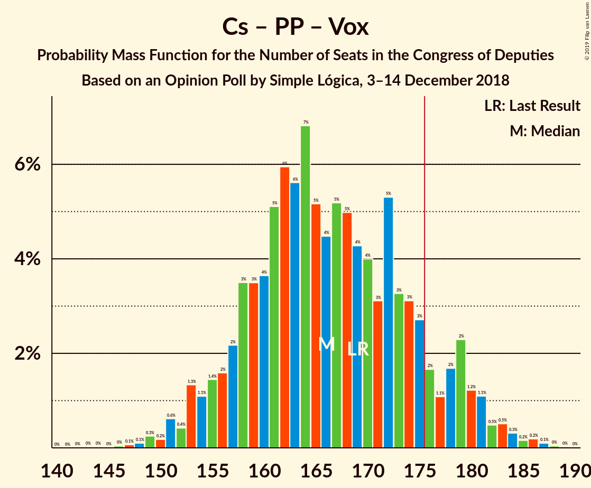
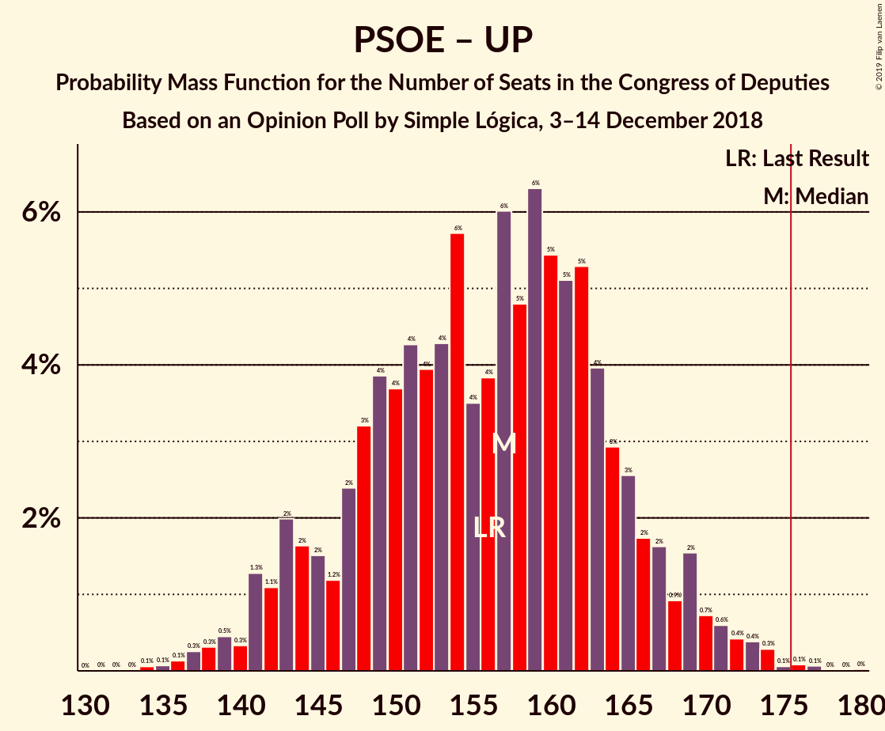

# Opinion Poll by Simple Lógica, 3–14 December 2018

<a href="#voting-intentions">Voting Intentions</a> | <a href="#seats">Seats</a> | <a href="#coalitions">Coalitions</a> | <a href="#technical-information">Technical Information</a>

## Voting Intentions

### Confidence Intervals

| Party | Last Result | Poll Result | 80% Confidence Interval | 90% Confidence Interval | 95% Confidence Interval | 99% Confidence Interval |
|:-----:|:-----------:|:-----------:|:-----------------------:|:-----------------------:|:-----------------------:|:-----------------------:|
| Partido Socialista Obrero Español | 22.6% | 23.2% | 21.7–24.8% |21.2–25.3% |20.9–25.7% |20.2–26.4% |
| Ciudadanos–Partido de la Ciudadanía | 13.1% | 20.4% | 19.0–22.0% |18.6–22.4% |18.2–22.8% |17.6–23.6% |
| Partido Popular | 33.0% | 18.8% | 17.4–20.3% |17.0–20.7% |16.7–21.1% |16.0–21.8% |
| Unidos Podemos | 21.2% | 17.7% | 16.3–19.2% |16.0–19.6% |15.6–20.0% |15.0–20.7% |
| Vox | 0.2% | 8.7% | 7.8–9.9% |7.5–10.2% |7.3–10.5% |6.8–11.0% |

*Note:* The poll result column reflects the actual value used in the calculations. Published results may vary slightly, and in addition be rounded to fewer digits.

## Seats

### Confidence Intervals

| Party | Last Result | Median | 80% Confidence Interval | 90% Confidence Interval | 95% Confidence Interval | 99% Confidence Interval |
|:-----:|:-----------:|:------:|:-----------------------:|:-----------------------:|:-----------------------:|:-----------------------:|
| <a href="#partido-socialista-obrero-español">Partido Socialista Obrero Español</a> | 85 | 77 | 65–79 |65–79 |63–79 |56–79 |
| <a href="#ciudadanos–partido-de-la-ciudadanía">Ciudadanos–Partido de la Ciudadanía</a> | 32 | 49 | 48–51 |48–51 |43–52 |42–56 |
| <a href="#partido-popular">Partido Popular</a> | 137 | 54 | 53–64 |52–64 |48–64 |43–64 |
| <a href="#unidos-podemos">Unidos Podemos</a> | 71 | 35 | 33–41 |33–41 |33–49 |33–50 |
| <a href="#vox">Vox</a> | 0 | 14 | 14–16 |11–17 |11–20 |11–29 |

### Partido Socialista Obrero Español

*For a full overview of the results for this party, see the [Partido Socialista Obrero Español](party-partidosocialistaobreroespañol.html) page.*

| Number of Seats | Probability | Accumulated | Special Marks |
|:---------------:|:-----------:|:-----------:|:-------------:|
| 55 | 0.1% | 100% |  |
| 56 | 0.5% | 99.9% |  |
| 57 | 0.1% | 99.4% |  |
| 58 | 0% | 99.3% |  |
| 59 | 0% | 99.3% |  |
| 60 | 0% | 99.3% |  |
| 61 | 0% | 99.3% |  |
| 62 | 0% | 99.3% |  |
| 63 | 2% | 99.3% |  |
| 64 | 0% | 97% |  |
| 65 | 26% | 97% |  |
| 66 | 2% | 71% |  |
| 67 | 0.2% | 70% |  |
| 68 | 0.6% | 69% |  |
| 69 | 3% | 69% |  |
| 70 | 0.4% | 66% |  |
| 71 | 0% | 65% |  |
| 72 | 0% | 65% |  |
| 73 | 9% | 65% |  |
| 74 | 0.3% | 56% |  |
| 75 | 0% | 56% |  |
| 76 | 1.0% | 56% |  |
| 77 | 6% | 55% | Median |
| 78 | 18% | 49% |  |
| 79 | 31% | 31% |  |
| 80 | 0% | 0.1% |  |
| 81 | 0% | 0% |  |
| 82 | 0% | 0% |  |
| 83 | 0% | 0% |  |
| 84 | 0% | 0% |  |
| 85 | 0% | 0% | Last Result |

### Ciudadanos–Partido de la Ciudadanía

*For a full overview of the results for this party, see the [Ciudadanos–Partido de la Ciudadanía](party-ciudadanos–partidodelaciudadanía.html) page.*

| Number of Seats | Probability | Accumulated | Special Marks |
|:---------------:|:-----------:|:-----------:|:-------------:|
| 32 | 0% | 100% | Last Result |
| 33 | 0% | 100% |  |
| 34 | 0% | 100% |  |
| 35 | 0% | 100% |  |
| 36 | 0% | 100% |  |
| 37 | 0% | 100% |  |
| 38 | 0% | 100% |  |
| 39 | 0% | 100% |  |
| 40 | 0.4% | 100% |  |
| 41 | 0% | 99.6% |  |
| 42 | 0.5% | 99.6% |  |
| 43 | 2% | 99.0% |  |
| 44 | 0.3% | 97% |  |
| 45 | 0.1% | 96% |  |
| 46 | 0% | 96% |  |
| 47 | 0.2% | 96% |  |
| 48 | 46% | 96% |  |
| 49 | 40% | 51% | Median |
| 50 | 0% | 11% |  |
| 51 | 7% | 11% |  |
| 52 | 2% | 4% |  |
| 53 | 0.1% | 1.5% |  |
| 54 | 0% | 1.4% |  |
| 55 | 0.7% | 1.4% |  |
| 56 | 0.5% | 0.7% |  |
| 57 | 0% | 0.2% |  |
| 58 | 0% | 0.2% |  |
| 59 | 0.1% | 0.2% |  |
| 60 | 0% | 0.1% |  |
| 61 | 0% | 0.1% |  |
| 62 | 0% | 0.1% |  |
| 63 | 0% | 0.1% |  |
| 64 | 0% | 0.1% |  |
| 65 | 0% | 0.1% |  |
| 66 | 0.1% | 0.1% |  |
| 67 | 0% | 0% |  |

### Partido Popular

*For a full overview of the results for this party, see the [Partido Popular](party-partidopopular.html) page.*

| Number of Seats | Probability | Accumulated | Special Marks |
|:---------------:|:-----------:|:-----------:|:-------------:|
| 43 | 0.6% | 100% |  |
| 44 | 0% | 99.4% |  |
| 45 | 0.1% | 99.4% |  |
| 46 | 0% | 99.4% |  |
| 47 | 2% | 99.4% |  |
| 48 | 1.5% | 98% |  |
| 49 | 0% | 96% |  |
| 50 | 0.1% | 96% |  |
| 51 | 0.8% | 96% |  |
| 52 | 0.5% | 95% |  |
| 53 | 9% | 95% |  |
| 54 | 56% | 86% | Median |
| 55 | 0.1% | 30% |  |
| 56 | 0% | 30% |  |
| 57 | 0% | 30% |  |
| 58 | 0% | 30% |  |
| 59 | 0% | 30% |  |
| 60 | 0% | 30% |  |
| 61 | 0% | 30% |  |
| 62 | 0% | 30% |  |
| 63 | 0.5% | 30% |  |
| 64 | 29% | 29% |  |
| 65 | 0% | 0% |  |
| 66 | 0% | 0% |  |
| 67 | 0% | 0% |  |
| 68 | 0% | 0% |  |
| 69 | 0% | 0% |  |
| 70 | 0% | 0% |  |
| 71 | 0% | 0% |  |
| 72 | 0% | 0% |  |
| 73 | 0% | 0% |  |
| 74 | 0% | 0% |  |
| 75 | 0% | 0% |  |
| 76 | 0% | 0% |  |
| 77 | 0% | 0% |  |
| 78 | 0% | 0% |  |
| 79 | 0% | 0% |  |
| 80 | 0% | 0% |  |
| 81 | 0% | 0% |  |
| 82 | 0% | 0% |  |
| 83 | 0% | 0% |  |
| 84 | 0% | 0% |  |
| 85 | 0% | 0% |  |
| 86 | 0% | 0% |  |
| 87 | 0% | 0% |  |
| 88 | 0% | 0% |  |
| 89 | 0% | 0% |  |
| 90 | 0% | 0% |  |
| 91 | 0% | 0% |  |
| 92 | 0% | 0% |  |
| 93 | 0% | 0% |  |
| 94 | 0% | 0% |  |
| 95 | 0% | 0% |  |
| 96 | 0% | 0% |  |
| 97 | 0% | 0% |  |
| 98 | 0% | 0% |  |
| 99 | 0% | 0% |  |
| 100 | 0% | 0% |  |
| 101 | 0% | 0% |  |
| 102 | 0% | 0% |  |
| 103 | 0% | 0% |  |
| 104 | 0% | 0% |  |
| 105 | 0% | 0% |  |
| 106 | 0% | 0% |  |
| 107 | 0% | 0% |  |
| 108 | 0% | 0% |  |
| 109 | 0% | 0% |  |
| 110 | 0% | 0% |  |
| 111 | 0% | 0% |  |
| 112 | 0% | 0% |  |
| 113 | 0% | 0% |  |
| 114 | 0% | 0% |  |
| 115 | 0% | 0% |  |
| 116 | 0% | 0% |  |
| 117 | 0% | 0% |  |
| 118 | 0% | 0% |  |
| 119 | 0% | 0% |  |
| 120 | 0% | 0% |  |
| 121 | 0% | 0% |  |
| 122 | 0% | 0% |  |
| 123 | 0% | 0% |  |
| 124 | 0% | 0% |  |
| 125 | 0% | 0% |  |
| 126 | 0% | 0% |  |
| 127 | 0% | 0% |  |
| 128 | 0% | 0% |  |
| 129 | 0% | 0% |  |
| 130 | 0% | 0% |  |
| 131 | 0% | 0% |  |
| 132 | 0% | 0% |  |
| 133 | 0% | 0% |  |
| 134 | 0% | 0% |  |
| 135 | 0% | 0% |  |
| 136 | 0% | 0% |  |
| 137 | 0% | 0% | Last Result |

### Unidos Podemos

*For a full overview of the results for this party, see the [Unidos Podemos](party-unidospodemos.html) page.*

| Number of Seats | Probability | Accumulated | Special Marks |
|:---------------:|:-----------:|:-----------:|:-------------:|
| 24 | 0.1% | 100% |  |
| 25 | 0% | 99.9% |  |
| 26 | 0% | 99.9% |  |
| 27 | 0% | 99.9% |  |
| 28 | 0% | 99.9% |  |
| 29 | 0% | 99.9% |  |
| 30 | 0% | 99.9% |  |
| 31 | 0% | 99.9% |  |
| 32 | 0.2% | 99.8% |  |
| 33 | 11% | 99.7% |  |
| 34 | 23% | 89% |  |
| 35 | 45% | 66% | Median |
| 36 | 6% | 21% |  |
| 37 | 0.9% | 15% |  |
| 38 | 0% | 14% |  |
| 39 | 0.1% | 14% |  |
| 40 | 0% | 14% |  |
| 41 | 9% | 14% |  |
| 42 | 0.4% | 4% |  |
| 43 | 0.1% | 4% |  |
| 44 | 0% | 4% |  |
| 45 | 0% | 4% |  |
| 46 | 0% | 4% |  |
| 47 | 0% | 4% |  |
| 48 | 0% | 4% |  |
| 49 | 1.4% | 4% |  |
| 50 | 2% | 2% |  |
| 51 | 0% | 0% |  |
| 52 | 0% | 0% |  |
| 53 | 0% | 0% |  |
| 54 | 0% | 0% |  |
| 55 | 0% | 0% |  |
| 56 | 0% | 0% |  |
| 57 | 0% | 0% |  |
| 58 | 0% | 0% |  |
| 59 | 0% | 0% |  |
| 60 | 0% | 0% |  |
| 61 | 0% | 0% |  |
| 62 | 0% | 0% |  |
| 63 | 0% | 0% |  |
| 64 | 0% | 0% |  |
| 65 | 0% | 0% |  |
| 66 | 0% | 0% |  |
| 67 | 0% | 0% |  |
| 68 | 0% | 0% |  |
| 69 | 0% | 0% |  |
| 70 | 0% | 0% |  |
| 71 | 0% | 0% | Last Result |

### Vox

*For a full overview of the results for this party, see the [Vox](party-vox.html) page.*

| Number of Seats | Probability | Accumulated | Special Marks |
|:---------------:|:-----------:|:-----------:|:-------------:|
| 0 | 0% | 100% | Last Result |
| 1 | 0% | 100% |  |
| 2 | 0% | 100% |  |
| 3 | 0% | 100% |  |
| 4 | 0% | 100% |  |
| 5 | 0% | 100% |  |
| 6 | 0% | 100% |  |
| 7 | 0% | 100% |  |
| 8 | 0.1% | 100% |  |
| 9 | 0% | 99.9% |  |
| 10 | 0.3% | 99.9% |  |
| 11 | 9% | 99.6% |  |
| 12 | 0% | 91% |  |
| 13 | 0% | 91% |  |
| 14 | 56% | 91% | Median |
| 15 | 0.1% | 35% |  |
| 16 | 28% | 35% |  |
| 17 | 2% | 7% |  |
| 18 | 0.5% | 5% |  |
| 19 | 0% | 4% |  |
| 20 | 3% | 4% |  |
| 21 | 0.1% | 2% |  |
| 22 | 0% | 1.4% |  |
| 23 | 0.2% | 1.4% |  |
| 24 | 0% | 1.2% |  |
| 25 | 0.5% | 1.2% |  |
| 26 | 0.1% | 0.6% |  |
| 27 | 0% | 0.6% |  |
| 28 | 0.1% | 0.6% |  |
| 29 | 0.4% | 0.5% |  |
| 30 | 0.1% | 0.1% |  |
| 31 | 0% | 0% |  |

## Coalitions

### Confidence Intervals

| Coalition | Last Result | Median | Majority? | 80% Confidence Interval | 90% Confidence Interval | 95% Confidence Interval | 99% Confidence Interval |
|:---------:|:-----------:|:------:|:---------:|:-----------------------:|:-----------------------:|:-----------------------:|:-----------------------:|
| Ciudadanos–Partido de la Ciudadanía – Partido Popular – Vox | 169 | 116 | 0% | 115–129 | 115–129 | 111–129 | 110–130 |
| Partido Socialista Obrero Español – Ciudadanos–Partido de la Ciudadanía | 117 | 125 | 0% | 114–128 | 112–128 | 112–128 | 109–128 |
| Partido Socialista Obrero Español – Unidos Podemos | 156 | 113 | 0% | 100–114 | 100–114 | 100–118 | 98–119 |
| Ciudadanos–Partido de la Ciudadanía – Partido Popular | 169 | 103 | 0% | 102–113 | 102–113 | 91–113 | 89–113 |
| Partido Popular – Vox | 137 | 68 | 0% | 67–80 | 64–80 | 64–80 | 63–81 |
| Partido Socialista Obrero Español | 85 | 77 | 0% | 65–79 | 65–79 | 63–79 | 56–79 |
| Partido Popular | 137 | 54 | 0% | 53–64 | 52–64 | 48–64 | 43–64 |

### Ciudadanos–Partido de la Ciudadanía – Partido Popular – Vox

| Number of Seats | Probability | Accumulated | Special Marks |
|:---------------:|:-----------:|:-----------:|:-------------:|
| 109 | 0.5% | 100% |  |
| 110 | 2% | 99.5% |  |
| 111 | 1.1% | 98% |  |
| 112 | 0% | 97% |  |
| 113 | 0.1% | 97% |  |
| 114 | 0.1% | 97% |  |
| 115 | 7% | 97% |  |
| 116 | 47% | 89% |  |
| 117 | 11% | 42% | Median |
| 118 | 0% | 31% |  |
| 119 | 0% | 31% |  |
| 120 | 0% | 31% |  |
| 121 | 0% | 31% |  |
| 122 | 0.1% | 31% |  |
| 123 | 0.6% | 31% |  |
| 124 | 0% | 30% |  |
| 125 | 0% | 30% |  |
| 126 | 0.1% | 30% |  |
| 127 | 0.1% | 30% |  |
| 128 | 0.4% | 30% |  |
| 129 | 28% | 30% |  |
| 130 | 2% | 2% |  |
| 131 | 0% | 0.4% |  |
| 132 | 0% | 0.4% |  |
| 133 | 0.3% | 0.4% |  |
| 134 | 0% | 0.1% |  |
| 135 | 0% | 0.1% |  |
| 136 | 0% | 0.1% |  |
| 137 | 0% | 0.1% |  |
| 138 | 0% | 0.1% |  |
| 139 | 0% | 0.1% |  |
| 140 | 0.1% | 0.1% |  |
| 141 | 0% | 0% |  |
| 142 | 0% | 0% |  |
| 143 | 0% | 0% |  |
| 144 | 0% | 0% |  |
| 145 | 0% | 0% |  |
| 146 | 0% | 0% |  |
| 147 | 0% | 0% |  |
| 148 | 0% | 0% |  |
| 149 | 0% | 0% |  |
| 150 | 0% | 0% |  |
| 151 | 0% | 0% |  |
| 152 | 0% | 0% |  |
| 153 | 0% | 0% |  |
| 154 | 0% | 0% |  |
| 155 | 0% | 0% |  |
| 156 | 0% | 0% |  |
| 157 | 0% | 0% |  |
| 158 | 0% | 0% |  |
| 159 | 0% | 0% |  |
| 160 | 0% | 0% |  |
| 161 | 0% | 0% |  |
| 162 | 0% | 0% |  |
| 163 | 0% | 0% |  |
| 164 | 0% | 0% |  |
| 165 | 0% | 0% |  |
| 166 | 0% | 0% |  |
| 167 | 0% | 0% |  |
| 168 | 0% | 0% |  |
| 169 | 0% | 0% | Last Result |

### Partido Socialista Obrero Español – Ciudadanos–Partido de la Ciudadanía

| Number of Seats | Probability | Accumulated | Special Marks |
|:---------------:|:-----------:|:-----------:|:-------------:|
| 108 | 0.1% | 100% |  |
| 109 | 0.4% | 99.9% |  |
| 110 | 0.4% | 99.5% |  |
| 111 | 1.0% | 99.1% |  |
| 112 | 4% | 98% |  |
| 113 | 0% | 94% |  |
| 114 | 26% | 94% |  |
| 115 | 2% | 68% |  |
| 116 | 0.1% | 66% |  |
| 117 | 0% | 66% | Last Result |
| 118 | 0% | 66% |  |
| 119 | 0% | 66% |  |
| 120 | 0.1% | 66% |  |
| 121 | 0% | 66% |  |
| 122 | 0.1% | 66% |  |
| 123 | 0% | 66% |  |
| 124 | 9% | 66% |  |
| 125 | 8% | 57% |  |
| 126 | 18% | 49% | Median |
| 127 | 21% | 31% |  |
| 128 | 10% | 10% |  |
| 129 | 0% | 0.1% |  |
| 130 | 0% | 0.1% |  |
| 131 | 0% | 0.1% |  |
| 132 | 0% | 0.1% |  |
| 133 | 0% | 0.1% |  |
| 134 | 0% | 0.1% |  |
| 135 | 0% | 0.1% |  |
| 136 | 0% | 0.1% |  |
| 137 | 0% | 0% |  |

### Partido Socialista Obrero Español – Unidos Podemos

| Number of Seats | Probability | Accumulated | Special Marks |
|:---------------:|:-----------:|:-----------:|:-------------:|
| 87 | 0.1% | 100% |  |
| 88 | 0% | 99.9% |  |
| 89 | 0% | 99.9% |  |
| 90 | 0% | 99.9% |  |
| 91 | 0% | 99.9% |  |
| 92 | 0% | 99.9% |  |
| 93 | 0% | 99.9% |  |
| 94 | 0% | 99.9% |  |
| 95 | 0.1% | 99.9% |  |
| 96 | 0.2% | 99.8% |  |
| 97 | 0% | 99.6% |  |
| 98 | 1.5% | 99.6% |  |
| 99 | 0% | 98% |  |
| 100 | 28% | 98% |  |
| 101 | 0.1% | 70% |  |
| 102 | 0.4% | 70% |  |
| 103 | 0.2% | 70% |  |
| 104 | 0% | 70% |  |
| 105 | 0.1% | 70% |  |
| 106 | 0.5% | 69% |  |
| 107 | 0.1% | 69% |  |
| 108 | 0% | 69% |  |
| 109 | 0% | 69% |  |
| 110 | 0% | 69% |  |
| 111 | 0.4% | 69% |  |
| 112 | 10% | 68% | Median |
| 113 | 46% | 58% |  |
| 114 | 9% | 13% |  |
| 115 | 0.4% | 4% |  |
| 116 | 0.1% | 3% |  |
| 117 | 0% | 3% |  |
| 118 | 1.2% | 3% |  |
| 119 | 2% | 2% |  |
| 120 | 0% | 0% |  |
| 121 | 0% | 0% |  |
| 122 | 0% | 0% |  |
| 123 | 0% | 0% |  |
| 124 | 0% | 0% |  |
| 125 | 0% | 0% |  |
| 126 | 0% | 0% |  |
| 127 | 0% | 0% |  |
| 128 | 0% | 0% |  |
| 129 | 0% | 0% |  |
| 130 | 0% | 0% |  |
| 131 | 0% | 0% |  |
| 132 | 0% | 0% |  |
| 133 | 0% | 0% |  |
| 134 | 0% | 0% |  |
| 135 | 0% | 0% |  |
| 136 | 0% | 0% |  |
| 137 | 0% | 0% |  |
| 138 | 0% | 0% |  |
| 139 | 0% | 0% |  |
| 140 | 0% | 0% |  |
| 141 | 0% | 0% |  |
| 142 | 0% | 0% |  |
| 143 | 0% | 0% |  |
| 144 | 0% | 0% |  |
| 145 | 0% | 0% |  |
| 146 | 0% | 0% |  |
| 147 | 0% | 0% |  |
| 148 | 0% | 0% |  |
| 149 | 0% | 0% |  |
| 150 | 0% | 0% |  |
| 151 | 0% | 0% |  |
| 152 | 0% | 0% |  |
| 153 | 0% | 0% |  |
| 154 | 0% | 0% |  |
| 155 | 0% | 0% |  |
| 156 | 0% | 0% | Last Result |

### Ciudadanos–Partido de la Ciudadanía – Partido Popular

| Number of Seats | Probability | Accumulated | Special Marks |
|:---------------:|:-----------:|:-----------:|:-------------:|
| 89 | 0.5% | 100% |  |
| 90 | 1.2% | 99.5% |  |
| 91 | 1.1% | 98% |  |
| 92 | 0.8% | 97% |  |
| 93 | 0% | 96% |  |
| 94 | 0% | 96% |  |
| 95 | 0% | 96% |  |
| 96 | 0.1% | 96% |  |
| 97 | 0% | 96% |  |
| 98 | 0% | 96% |  |
| 99 | 0.5% | 96% |  |
| 100 | 0.1% | 96% |  |
| 101 | 0% | 96% |  |
| 102 | 46% | 96% |  |
| 103 | 10% | 50% | Median |
| 104 | 7% | 40% |  |
| 105 | 2% | 33% |  |
| 106 | 0.7% | 31% |  |
| 107 | 0% | 30% |  |
| 108 | 0.1% | 30% |  |
| 109 | 0% | 30% |  |
| 110 | 0.2% | 30% |  |
| 111 | 0% | 30% |  |
| 112 | 0.2% | 30% |  |
| 113 | 29% | 29% |  |
| 114 | 0.1% | 0.2% |  |
| 115 | 0% | 0.1% |  |
| 116 | 0% | 0.1% |  |
| 117 | 0% | 0% |  |
| 118 | 0% | 0% |  |
| 119 | 0% | 0% |  |
| 120 | 0% | 0% |  |
| 121 | 0% | 0% |  |
| 122 | 0% | 0% |  |
| 123 | 0% | 0% |  |
| 124 | 0% | 0% |  |
| 125 | 0% | 0% |  |
| 126 | 0% | 0% |  |
| 127 | 0% | 0% |  |
| 128 | 0% | 0% |  |
| 129 | 0% | 0% |  |
| 130 | 0% | 0% |  |
| 131 | 0% | 0% |  |
| 132 | 0% | 0% |  |
| 133 | 0% | 0% |  |
| 134 | 0% | 0% |  |
| 135 | 0% | 0% |  |
| 136 | 0% | 0% |  |
| 137 | 0% | 0% |  |
| 138 | 0% | 0% |  |
| 139 | 0% | 0% |  |
| 140 | 0% | 0% |  |
| 141 | 0% | 0% |  |
| 142 | 0% | 0% |  |
| 143 | 0% | 0% |  |
| 144 | 0% | 0% |  |
| 145 | 0% | 0% |  |
| 146 | 0% | 0% |  |
| 147 | 0% | 0% |  |
| 148 | 0% | 0% |  |
| 149 | 0% | 0% |  |
| 150 | 0% | 0% |  |
| 151 | 0% | 0% |  |
| 152 | 0% | 0% |  |
| 153 | 0% | 0% |  |
| 154 | 0% | 0% |  |
| 155 | 0% | 0% |  |
| 156 | 0% | 0% |  |
| 157 | 0% | 0% |  |
| 158 | 0% | 0% |  |
| 159 | 0% | 0% |  |
| 160 | 0% | 0% |  |
| 161 | 0% | 0% |  |
| 162 | 0% | 0% |  |
| 163 | 0% | 0% |  |
| 164 | 0% | 0% |  |
| 165 | 0% | 0% |  |
| 166 | 0% | 0% |  |
| 167 | 0% | 0% |  |
| 168 | 0% | 0% |  |
| 169 | 0% | 0% | Last Result |

### Partido Popular – Vox

| Number of Seats | Probability | Accumulated | Special Marks |
|:---------------:|:-----------:|:-----------:|:-------------:|
| 58 | 0% | 100% |  |
| 59 | 0% | 99.9% |  |
| 60 | 0% | 99.9% |  |
| 61 | 0% | 99.9% |  |
| 62 | 0.1% | 99.9% |  |
| 63 | 0.3% | 99.8% |  |
| 64 | 9% | 99.4% |  |
| 65 | 0% | 91% |  |
| 66 | 0.4% | 91% |  |
| 67 | 2% | 90% |  |
| 68 | 58% | 88% | Median |
| 69 | 0% | 31% |  |
| 70 | 0% | 31% |  |
| 71 | 0.1% | 31% |  |
| 72 | 0.4% | 31% |  |
| 73 | 0.1% | 30% |  |
| 74 | 0% | 30% |  |
| 75 | 0% | 30% |  |
| 76 | 0% | 30% |  |
| 77 | 0.4% | 30% |  |
| 78 | 0% | 30% |  |
| 79 | 0% | 30% |  |
| 80 | 28% | 30% |  |
| 81 | 2% | 2% |  |
| 82 | 0% | 0.3% |  |
| 83 | 0% | 0.3% |  |
| 84 | 0% | 0.3% |  |
| 85 | 0% | 0.3% |  |
| 86 | 0.2% | 0.3% |  |
| 87 | 0% | 0.1% |  |
| 88 | 0.1% | 0.1% |  |
| 89 | 0% | 0% |  |
| 90 | 0% | 0% |  |
| 91 | 0% | 0% |  |
| 92 | 0% | 0% |  |
| 93 | 0% | 0% |  |
| 94 | 0% | 0% |  |
| 95 | 0% | 0% |  |
| 96 | 0% | 0% |  |
| 97 | 0% | 0% |  |
| 98 | 0% | 0% |  |
| 99 | 0% | 0% |  |
| 100 | 0% | 0% |  |
| 101 | 0% | 0% |  |
| 102 | 0% | 0% |  |
| 103 | 0% | 0% |  |
| 104 | 0% | 0% |  |
| 105 | 0% | 0% |  |
| 106 | 0% | 0% |  |
| 107 | 0% | 0% |  |
| 108 | 0% | 0% |  |
| 109 | 0% | 0% |  |
| 110 | 0% | 0% |  |
| 111 | 0% | 0% |  |
| 112 | 0% | 0% |  |
| 113 | 0% | 0% |  |
| 114 | 0% | 0% |  |
| 115 | 0% | 0% |  |
| 116 | 0% | 0% |  |
| 117 | 0% | 0% |  |
| 118 | 0% | 0% |  |
| 119 | 0% | 0% |  |
| 120 | 0% | 0% |  |
| 121 | 0% | 0% |  |
| 122 | 0% | 0% |  |
| 123 | 0% | 0% |  |
| 124 | 0% | 0% |  |
| 125 | 0% | 0% |  |
| 126 | 0% | 0% |  |
| 127 | 0% | 0% |  |
| 128 | 0% | 0% |  |
| 129 | 0% | 0% |  |
| 130 | 0% | 0% |  |
| 131 | 0% | 0% |  |
| 132 | 0% | 0% |  |
| 133 | 0% | 0% |  |
| 134 | 0% | 0% |  |
| 135 | 0% | 0% |  |
| 136 | 0% | 0% |  |
| 137 | 0% | 0% | Last Result |

### Partido Socialista Obrero Español

| Number of Seats | Probability | Accumulated | Special Marks |
|:---------------:|:-----------:|:-----------:|:-------------:|
| 55 | 0.1% | 100% |  |
| 56 | 0.5% | 99.9% |  |
| 57 | 0.1% | 99.4% |  |
| 58 | 0% | 99.3% |  |
| 59 | 0% | 99.3% |  |
| 60 | 0% | 99.3% |  |
| 61 | 0% | 99.3% |  |
| 62 | 0% | 99.3% |  |
| 63 | 2% | 99.3% |  |
| 64 | 0% | 97% |  |
| 65 | 26% | 97% |  |
| 66 | 2% | 71% |  |
| 67 | 0.2% | 70% |  |
| 68 | 0.6% | 69% |  |
| 69 | 3% | 69% |  |
| 70 | 0.4% | 66% |  |
| 71 | 0% | 65% |  |
| 72 | 0% | 65% |  |
| 73 | 9% | 65% |  |
| 74 | 0.3% | 56% |  |
| 75 | 0% | 56% |  |
| 76 | 1.0% | 56% |  |
| 77 | 6% | 55% | Median |
| 78 | 18% | 49% |  |
| 79 | 31% | 31% |  |
| 80 | 0% | 0.1% |  |
| 81 | 0% | 0% |  |
| 82 | 0% | 0% |  |
| 83 | 0% | 0% |  |
| 84 | 0% | 0% |  |
| 85 | 0% | 0% | Last Result |

### Partido Popular

| Number of Seats | Probability | Accumulated | Special Marks |
|:---------------:|:-----------:|:-----------:|:-------------:|
| 43 | 0.6% | 100% |  |
| 44 | 0% | 99.4% |  |
| 45 | 0.1% | 99.4% |  |
| 46 | 0% | 99.4% |  |
| 47 | 2% | 99.4% |  |
| 48 | 1.5% | 98% |  |
| 49 | 0% | 96% |  |
| 50 | 0.1% | 96% |  |
| 51 | 0.8% | 96% |  |
| 52 | 0.5% | 95% |  |
| 53 | 9% | 95% |  |
| 54 | 56% | 86% | Median |
| 55 | 0.1% | 30% |  |
| 56 | 0% | 30% |  |
| 57 | 0% | 30% |  |
| 58 | 0% | 30% |  |
| 59 | 0% | 30% |  |
| 60 | 0% | 30% |  |
| 61 | 0% | 30% |  |
| 62 | 0% | 30% |  |
| 63 | 0.5% | 30% |  |
| 64 | 29% | 29% |  |
| 65 | 0% | 0% |  |
| 66 | 0% | 0% |  |
| 67 | 0% | 0% |  |
| 68 | 0% | 0% |  |
| 69 | 0% | 0% |  |
| 70 | 0% | 0% |  |
| 71 | 0% | 0% |  |
| 72 | 0% | 0% |  |
| 73 | 0% | 0% |  |
| 74 | 0% | 0% |  |
| 75 | 0% | 0% |  |
| 76 | 0% | 0% |  |
| 77 | 0% | 0% |  |
| 78 | 0% | 0% |  |
| 79 | 0% | 0% |  |
| 80 | 0% | 0% |  |
| 81 | 0% | 0% |  |
| 82 | 0% | 0% |  |
| 83 | 0% | 0% |  |
| 84 | 0% | 0% |  |
| 85 | 0% | 0% |  |
| 86 | 0% | 0% |  |
| 87 | 0% | 0% |  |
| 88 | 0% | 0% |  |
| 89 | 0% | 0% |  |
| 90 | 0% | 0% |  |
| 91 | 0% | 0% |  |
| 92 | 0% | 0% |  |
| 93 | 0% | 0% |  |
| 94 | 0% | 0% |  |
| 95 | 0% | 0% |  |
| 96 | 0% | 0% |  |
| 97 | 0% | 0% |  |
| 98 | 0% | 0% |  |
| 99 | 0% | 0% |  |
| 100 | 0% | 0% |  |
| 101 | 0% | 0% |  |
| 102 | 0% | 0% |  |
| 103 | 0% | 0% |  |
| 104 | 0% | 0% |  |
| 105 | 0% | 0% |  |
| 106 | 0% | 0% |  |
| 107 | 0% | 0% |  |
| 108 | 0% | 0% |  |
| 109 | 0% | 0% |  |
| 110 | 0% | 0% |  |
| 111 | 0% | 0% |  |
| 112 | 0% | 0% |  |
| 113 | 0% | 0% |  |
| 114 | 0% | 0% |  |
| 115 | 0% | 0% |  |
| 116 | 0% | 0% |  |
| 117 | 0% | 0% |  |
| 118 | 0% | 0% |  |
| 119 | 0% | 0% |  |
| 120 | 0% | 0% |  |
| 121 | 0% | 0% |  |
| 122 | 0% | 0% |  |
| 123 | 0% | 0% |  |
| 124 | 0% | 0% |  |
| 125 | 0% | 0% |  |
| 126 | 0% | 0% |  |
| 127 | 0% | 0% |  |
| 128 | 0% | 0% |  |
| 129 | 0% | 0% |  |
| 130 | 0% | 0% |  |
| 131 | 0% | 0% |  |
| 132 | 0% | 0% |  |
| 133 | 0% | 0% |  |
| 134 | 0% | 0% |  |
| 135 | 0% | 0% |  |
| 136 | 0% | 0% |  |
| 137 | 0% | 0% | Last Result |

## Technical Information

### Opinion Poll

+ **Polling firm:** Simple Lógica
+ **Commissioner(s):** —
+ **Fieldwork period:** 3–14 December 2018

### Calculations

+ **Sample size:** 1204
+ **Simulations done:** 1,024
+ **Error estimate:** 3.08%

