# Opinion Poll by Sigma Dos for Antena 3, 16 December 2018

<a href="#voting-intentions">Voting Intentions</a> | <a href="#seats">Seats</a> | <a href="#coalitions">Coalitions</a> | <a href="#technical-information">Technical Information</a>

## Voting Intentions

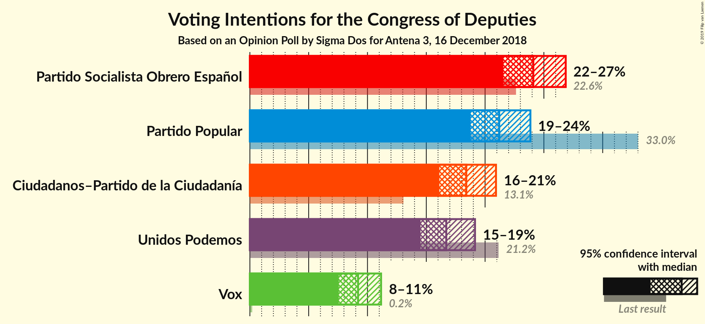

### Confidence Intervals

| Party | Last Result | Poll Result | 80% Confidence Interval | 90% Confidence Interval | 95% Confidence Interval | 99% Confidence Interval |
|:-----:|:-----------:|:-----------:|:-----------------------:|:-----------------------:|:-----------------------:|:-----------------------:|
| Partido Socialista Obrero Español | 22.6% | 24.1% | 22.4–25.9% |21.9–26.4% |21.6–26.9% |20.8–27.7% |
| Partido Popular | 33.0% | 21.2% | 19.6–22.9% |19.2–23.4% |18.8–23.9% |18.0–24.7% |
| Ciudadanos–Partido de la Ciudadanía | 13.1% | 18.4% | 16.9–20.1% |16.5–20.5% |16.1–20.9% |15.4–21.7% |
| Unidos Podemos | 21.2% | 16.7% | 15.3–18.3% |14.9–18.7% |14.5–19.1% |13.9–19.9% |
| Vox | 0.2% | 9.2% | 8.1–10.5% |7.8–10.8% |7.6–11.2% |7.1–11.8% |

*Note:* The poll result column reflects the actual value used in the calculations. Published results may vary slightly, and in addition be rounded to fewer digits.

## Seats

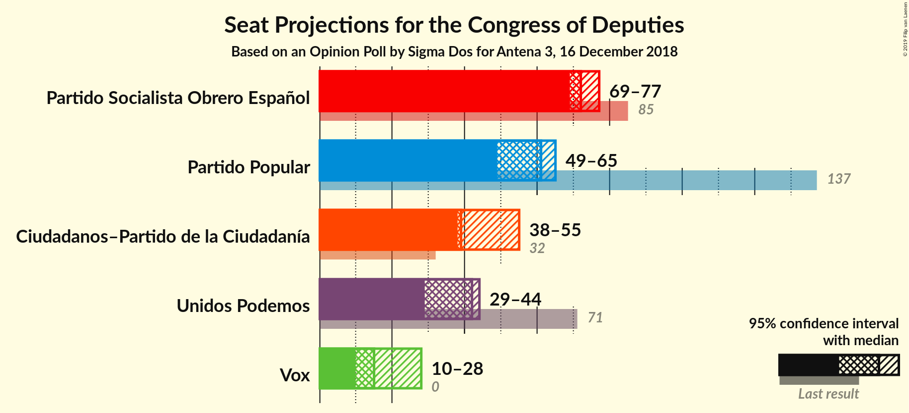

### Confidence Intervals

| Party | Last Result | Median | 80% Confidence Interval | 90% Confidence Interval | 95% Confidence Interval | 99% Confidence Interval |
|:-----:|:-----------:|:------:|:-----------------------:|:-----------------------:|:-----------------------:|:-----------------------:|
| <a href="#partido-socialista-obrero-español">Partido Socialista Obrero Español</a> | 85 | 99 | 90–108 |88–112 |86–114 |83–117 |
| <a href="#partido-popular">Partido Popular</a> | 137 | 87 | 77–96 |76–98 |75–101 |71–107 |
| <a href="#ciudadanos–partido-de-la-ciudadanía">Ciudadanos–Partido de la Ciudadanía</a> | 32 | 63 | 58–69 |56–71 |54–72 |51–76 |
| <a href="#unidos-podemos">Unidos Podemos</a> | 71 | 52 | 44–62 |42–64 |41–66 |37–70 |
| <a href="#vox">Vox</a> | 0 | 20 | 16–25 |15–26 |13–27 |12–29 |

### Partido Socialista Obrero Español

*For a full overview of the results for this party, see the [Partido Socialista Obrero Español](party-partidosocialistaobreroespañol.html) page.*

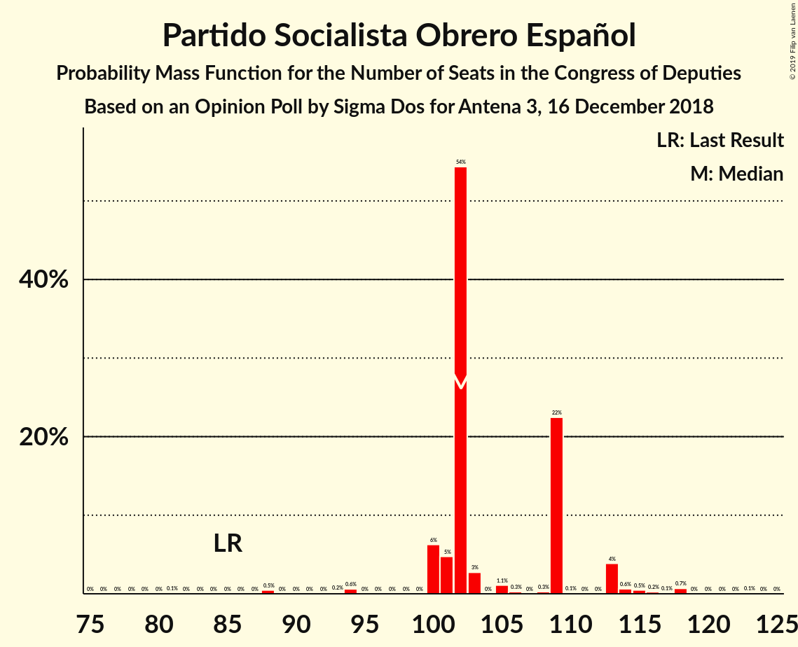

| Number of Seats | Probability | Accumulated | Special Marks |
|:---------------:|:-----------:|:-----------:|:-------------:|
| 79 | 0% | 100% |  |
| 80 | 0% | 99.9% |  |
| 81 | 0.1% | 99.9% |  |
| 82 | 0.2% | 99.8% |  |
| 83 | 0.2% | 99.7% |  |
| 84 | 0.5% | 99.5% |  |
| 85 | 0.6% | 99.0% | Last Result |
| 86 | 1.2% | 98% |  |
| 87 | 0.9% | 97% |  |
| 88 | 2% | 96% |  |
| 89 | 3% | 94% |  |
| 90 | 3% | 91% |  |
| 91 | 3% | 88% |  |
| 92 | 4% | 85% |  |
| 93 | 4% | 81% |  |
| 94 | 5% | 77% |  |
| 95 | 6% | 72% |  |
| 96 | 3% | 67% |  |
| 97 | 7% | 64% |  |
| 98 | 7% | 57% |  |
| 99 | 5% | 50% | Median |
| 100 | 6% | 45% |  |
| 101 | 7% | 39% |  |
| 102 | 3% | 33% |  |
| 103 | 3% | 29% |  |
| 104 | 5% | 27% |  |
| 105 | 5% | 22% |  |
| 106 | 3% | 17% |  |
| 107 | 2% | 14% |  |
| 108 | 2% | 12% |  |
| 109 | 2% | 10% |  |
| 110 | 1.3% | 8% |  |
| 111 | 1.2% | 7% |  |
| 112 | 0.6% | 5% |  |
| 113 | 1.1% | 5% |  |
| 114 | 1.5% | 4% |  |
| 115 | 1.0% | 2% |  |
| 116 | 0.6% | 1.3% |  |
| 117 | 0.3% | 0.8% |  |
| 118 | 0.2% | 0.4% |  |
| 119 | 0% | 0.2% |  |
| 120 | 0.1% | 0.2% |  |
| 121 | 0.1% | 0.1% |  |
| 122 | 0% | 0.1% |  |
| 123 | 0% | 0% |  |

### Partido Popular

*For a full overview of the results for this party, see the [Partido Popular](party-partidopopular.html) page.*

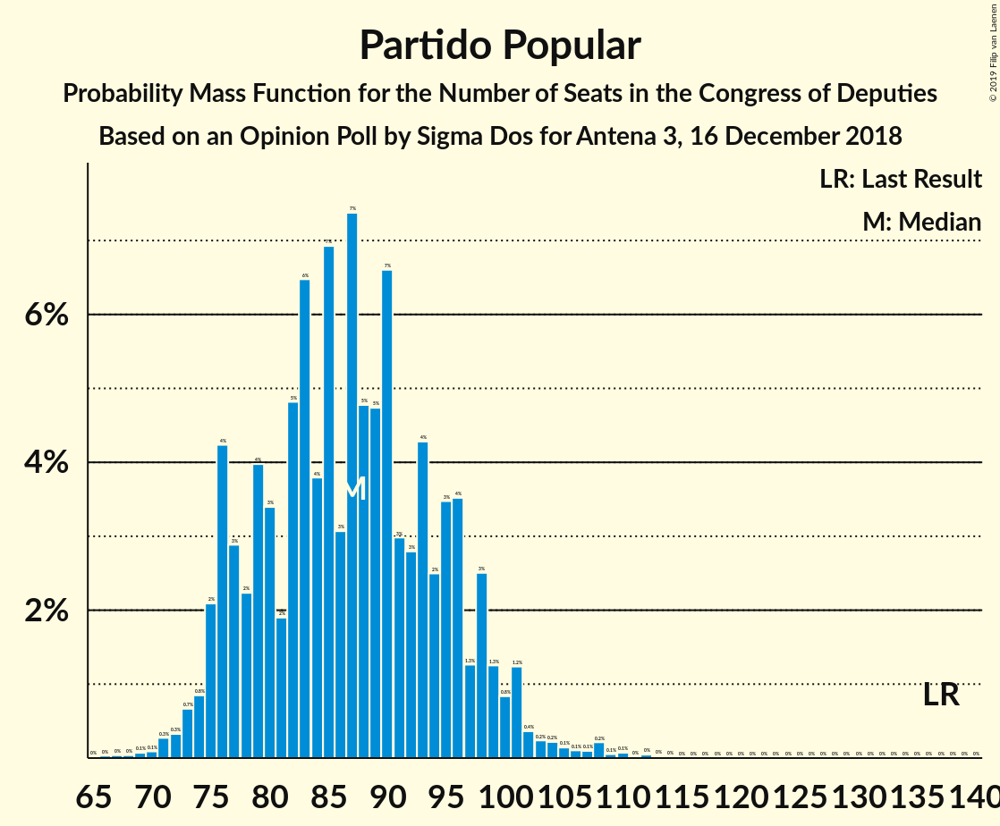

| Number of Seats | Probability | Accumulated | Special Marks |
|:---------------:|:-----------:|:-----------:|:-------------:|
| 65 | 0% | 100% |  |
| 66 | 0% | 99.9% |  |
| 67 | 0% | 99.9% |  |
| 68 | 0% | 99.9% |  |
| 69 | 0.1% | 99.8% |  |
| 70 | 0.1% | 99.8% |  |
| 71 | 0.3% | 99.7% |  |
| 72 | 0.3% | 99.4% |  |
| 73 | 0.7% | 99.1% |  |
| 74 | 0.8% | 98% |  |
| 75 | 2% | 98% |  |
| 76 | 4% | 95% |  |
| 77 | 3% | 91% |  |
| 78 | 2% | 88% |  |
| 79 | 4% | 86% |  |
| 80 | 3% | 82% |  |
| 81 | 2% | 79% |  |
| 82 | 5% | 77% |  |
| 83 | 6% | 72% |  |
| 84 | 4% | 66% |  |
| 85 | 7% | 62% |  |
| 86 | 3% | 55% |  |
| 87 | 7% | 52% | Median |
| 88 | 5% | 44% |  |
| 89 | 5% | 40% |  |
| 90 | 7% | 35% |  |
| 91 | 3% | 28% |  |
| 92 | 3% | 25% |  |
| 93 | 4% | 22% |  |
| 94 | 2% | 18% |  |
| 95 | 3% | 16% |  |
| 96 | 4% | 12% |  |
| 97 | 1.3% | 9% |  |
| 98 | 3% | 7% |  |
| 99 | 1.3% | 5% |  |
| 100 | 0.8% | 4% |  |
| 101 | 1.2% | 3% |  |
| 102 | 0.4% | 2% |  |
| 103 | 0.2% | 1.2% |  |
| 104 | 0.2% | 1.0% |  |
| 105 | 0.1% | 0.8% |  |
| 106 | 0.1% | 0.6% |  |
| 107 | 0.1% | 0.5% |  |
| 108 | 0.2% | 0.4% |  |
| 109 | 0.1% | 0.2% |  |
| 110 | 0.1% | 0.2% |  |
| 111 | 0% | 0.1% |  |
| 112 | 0% | 0.1% |  |
| 113 | 0% | 0% |  |
| 114 | 0% | 0% |  |
| 115 | 0% | 0% |  |
| 116 | 0% | 0% |  |
| 117 | 0% | 0% |  |
| 118 | 0% | 0% |  |
| 119 | 0% | 0% |  |
| 120 | 0% | 0% |  |
| 121 | 0% | 0% |  |
| 122 | 0% | 0% |  |
| 123 | 0% | 0% |  |
| 124 | 0% | 0% |  |
| 125 | 0% | 0% |  |
| 126 | 0% | 0% |  |
| 127 | 0% | 0% |  |
| 128 | 0% | 0% |  |
| 129 | 0% | 0% |  |
| 130 | 0% | 0% |  |
| 131 | 0% | 0% |  |
| 132 | 0% | 0% |  |
| 133 | 0% | 0% |  |
| 134 | 0% | 0% |  |
| 135 | 0% | 0% |  |
| 136 | 0% | 0% |  |
| 137 | 0% | 0% | Last Result |

### Ciudadanos–Partido de la Ciudadanía

*For a full overview of the results for this party, see the [Ciudadanos–Partido de la Ciudadanía](party-ciudadanos–partidodelaciudadanía.html) page.*

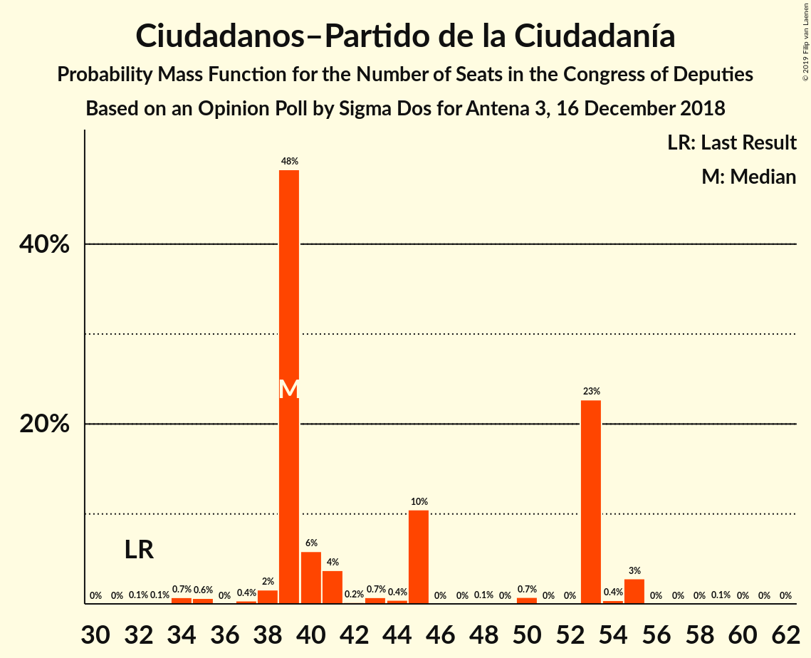

| Number of Seats | Probability | Accumulated | Special Marks |
|:---------------:|:-----------:|:-----------:|:-------------:|
| 32 | 0% | 100% | Last Result |
| 33 | 0% | 100% |  |
| 34 | 0% | 100% |  |
| 35 | 0% | 100% |  |
| 36 | 0% | 100% |  |
| 37 | 0% | 100% |  |
| 38 | 0% | 100% |  |
| 39 | 0% | 100% |  |
| 40 | 0% | 100% |  |
| 41 | 0% | 100% |  |
| 42 | 0% | 100% |  |
| 43 | 0% | 100% |  |
| 44 | 0% | 100% |  |
| 45 | 0% | 100% |  |
| 46 | 0% | 100% |  |
| 47 | 0% | 99.9% |  |
| 48 | 0% | 99.9% |  |
| 49 | 0.1% | 99.9% |  |
| 50 | 0.1% | 99.8% |  |
| 51 | 0.2% | 99.7% |  |
| 52 | 0.3% | 99.5% |  |
| 53 | 0.6% | 99.2% |  |
| 54 | 1.3% | 98.6% |  |
| 55 | 0.8% | 97% |  |
| 56 | 2% | 96% |  |
| 57 | 3% | 95% |  |
| 58 | 3% | 92% |  |
| 59 | 7% | 89% |  |
| 60 | 7% | 81% |  |
| 61 | 7% | 74% |  |
| 62 | 8% | 67% |  |
| 63 | 17% | 59% | Median |
| 64 | 8% | 42% |  |
| 65 | 5% | 35% |  |
| 66 | 9% | 29% |  |
| 67 | 4% | 21% |  |
| 68 | 5% | 16% |  |
| 69 | 3% | 12% |  |
| 70 | 3% | 9% |  |
| 71 | 2% | 5% |  |
| 72 | 0.9% | 3% |  |
| 73 | 0.4% | 2% |  |
| 74 | 0.5% | 2% |  |
| 75 | 0.9% | 2% |  |
| 76 | 0.3% | 0.6% |  |
| 77 | 0.1% | 0.3% |  |
| 78 | 0.1% | 0.2% |  |
| 79 | 0% | 0.2% |  |
| 80 | 0% | 0.1% |  |
| 81 | 0% | 0.1% |  |
| 82 | 0% | 0% |  |

### Unidos Podemos

*For a full overview of the results for this party, see the [Unidos Podemos](party-unidospodemos.html) page.*

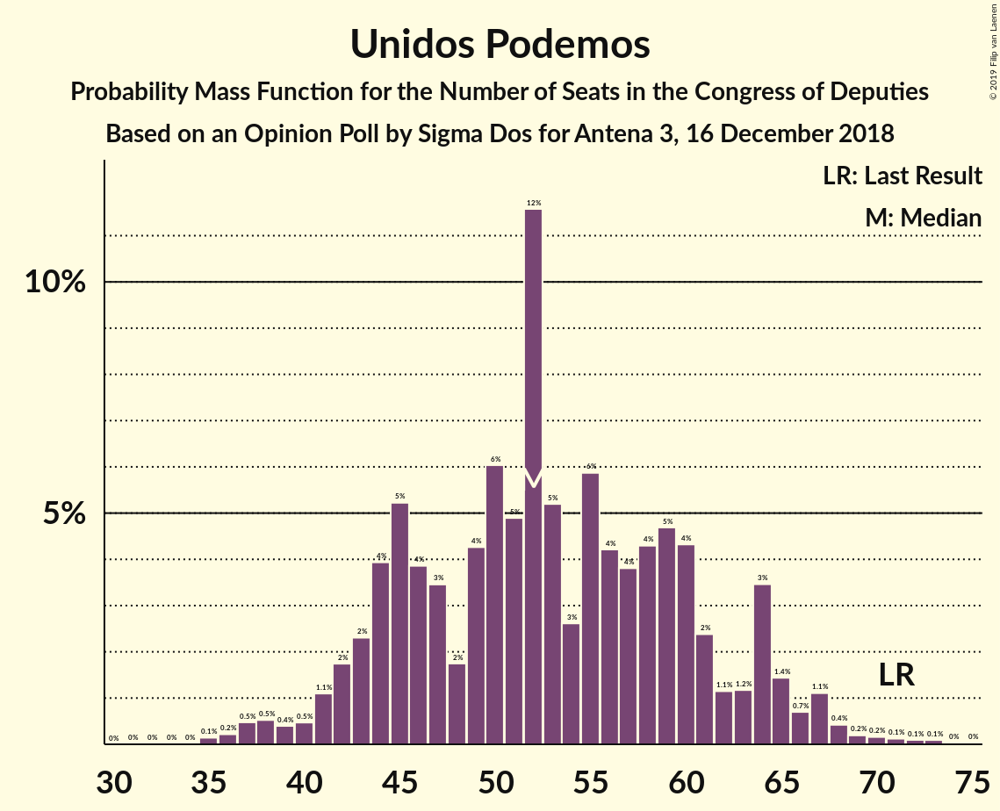

| Number of Seats | Probability | Accumulated | Special Marks |
|:---------------:|:-----------:|:-----------:|:-------------:|
| 35 | 0.1% | 100% |  |
| 36 | 0.2% | 99.8% |  |
| 37 | 0.5% | 99.6% |  |
| 38 | 0.5% | 99.1% |  |
| 39 | 0.4% | 98.6% |  |
| 40 | 0.5% | 98% |  |
| 41 | 1.1% | 98% |  |
| 42 | 2% | 97% |  |
| 43 | 2% | 95% |  |
| 44 | 4% | 93% |  |
| 45 | 5% | 89% |  |
| 46 | 4% | 83% |  |
| 47 | 3% | 80% |  |
| 48 | 2% | 76% |  |
| 49 | 4% | 74% |  |
| 50 | 6% | 70% |  |
| 51 | 5% | 64% |  |
| 52 | 12% | 59% | Median |
| 53 | 5% | 48% |  |
| 54 | 3% | 42% |  |
| 55 | 6% | 40% |  |
| 56 | 4% | 34% |  |
| 57 | 4% | 30% |  |
| 58 | 4% | 26% |  |
| 59 | 5% | 22% |  |
| 60 | 4% | 17% |  |
| 61 | 2% | 13% |  |
| 62 | 1.1% | 10% |  |
| 63 | 1.2% | 9% |  |
| 64 | 3% | 8% |  |
| 65 | 1.4% | 4% |  |
| 66 | 0.7% | 3% |  |
| 67 | 1.1% | 2% |  |
| 68 | 0.4% | 1.1% |  |
| 69 | 0.2% | 0.7% |  |
| 70 | 0.2% | 0.5% |  |
| 71 | 0.1% | 0.4% | Last Result |
| 72 | 0.1% | 0.2% |  |
| 73 | 0.1% | 0.2% |  |
| 74 | 0% | 0.1% |  |
| 75 | 0% | 0% |  |

### Vox

*For a full overview of the results for this party, see the [Vox](party-vox.html) page.*

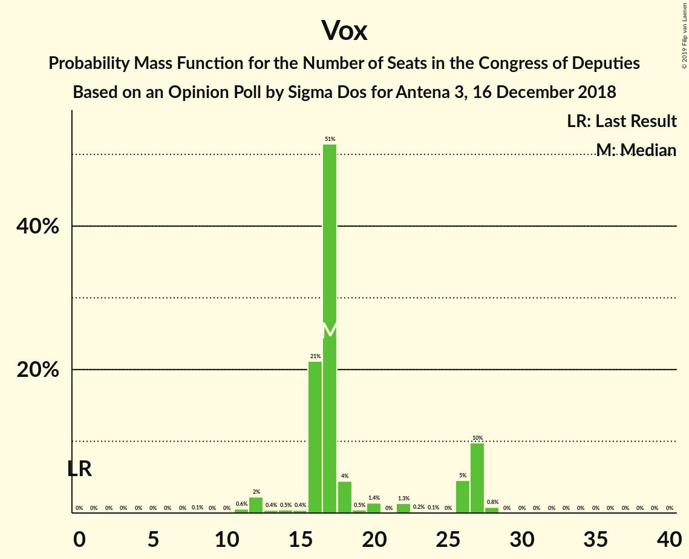

| Number of Seats | Probability | Accumulated | Special Marks |
|:---------------:|:-----------:|:-----------:|:-------------:|
| 0 | 0% | 100% | Last Result |
| 1 | 0% | 100% |  |
| 2 | 0% | 100% |  |
| 3 | 0% | 100% |  |
| 4 | 0% | 100% |  |
| 5 | 0% | 100% |  |
| 6 | 0% | 100% |  |
| 7 | 0% | 100% |  |
| 8 | 0% | 100% |  |
| 9 | 0% | 100% |  |
| 10 | 0.1% | 100% |  |
| 11 | 0.3% | 99.9% |  |
| 12 | 0.9% | 99.5% |  |
| 13 | 2% | 98.6% |  |
| 14 | 1.3% | 96% |  |
| 15 | 2% | 95% |  |
| 16 | 4% | 93% |  |
| 17 | 8% | 89% |  |
| 18 | 8% | 81% |  |
| 19 | 11% | 73% |  |
| 20 | 13% | 62% | Median |
| 21 | 18% | 49% |  |
| 22 | 9% | 31% |  |
| 23 | 6% | 22% |  |
| 24 | 6% | 16% |  |
| 25 | 3% | 10% |  |
| 26 | 3% | 7% |  |
| 27 | 3% | 4% |  |
| 28 | 0.5% | 1.1% |  |
| 29 | 0.3% | 0.6% |  |
| 30 | 0.1% | 0.4% |  |
| 31 | 0.1% | 0.3% |  |
| 32 | 0% | 0.2% |  |
| 33 | 0.1% | 0.1% |  |
| 34 | 0% | 0.1% |  |
| 35 | 0% | 0.1% |  |
| 36 | 0% | 0% |  |

## Coalitions

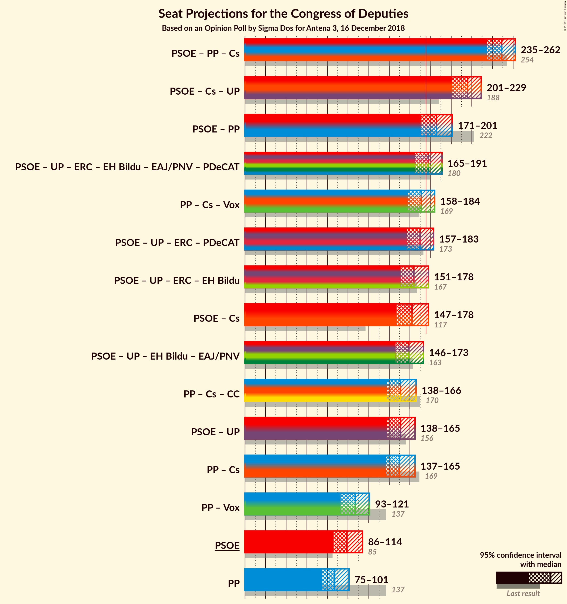

### Confidence Intervals

| Coalition | Last Result | Median | Majority? | 80% Confidence Interval | 90% Confidence Interval | 95% Confidence Interval | 99% Confidence Interval |
|:---------:|:-----------:|:------:|:---------:|:-----------------------:|:-----------------------:|:-----------------------:|:-----------------------:|
| Partido Socialista Obrero Español – Partido Popular – Ciudadanos–Partido de la Ciudadanía | 254 | 249 | 100% | 240–258 | 237–260 | 235–262 | 231–265 |
| Partido Socialista Obrero Español – Ciudadanos–Partido de la Ciudadanía – Unidos Podemos | 188 | 216 | 100% | 205–225 | 203–227 | 201–229 | 195–233 |
| Partido Socialista Obrero Español – Partido Popular | 222 | 186 | 91% | 176–195 | 173–198 | 171–201 | 166–205 |
| Partido Popular – Ciudadanos–Partido de la Ciudadanía – Vox | 169 | 171 | 22% | 161–179 | 159–181 | 158–184 | 153–189 |
| Partido Socialista Obrero Español – Ciudadanos–Partido de la Ciudadanía | 117 | 162 | 5% | 152–173 | 149–176 | 147–178 | 143–182 |
| Partido Socialista Obrero Español – Unidos Podemos | 156 | 151 | 0.1% | 142–161 | 140–164 | 138–165 | 133–170 |
| Partido Popular – Ciudadanos–Partido de la Ciudadanía | 169 | 150 | 0% | 141–160 | 138–162 | 137–165 | 132–169 |
| Partido Popular – Vox | 137 | 107 | 0% | 97–117 | 96–119 | 93–121 | 90–126 |
| Partido Socialista Obrero Español | 85 | 99 | 0% | 90–108 | 88–112 | 86–114 | 83–117 |
| Partido Popular | 137 | 87 | 0% | 77–96 | 76–98 | 75–101 | 71–107 |

### Partido Socialista Obrero Español – Partido Popular – Ciudadanos–Partido de la Ciudadanía

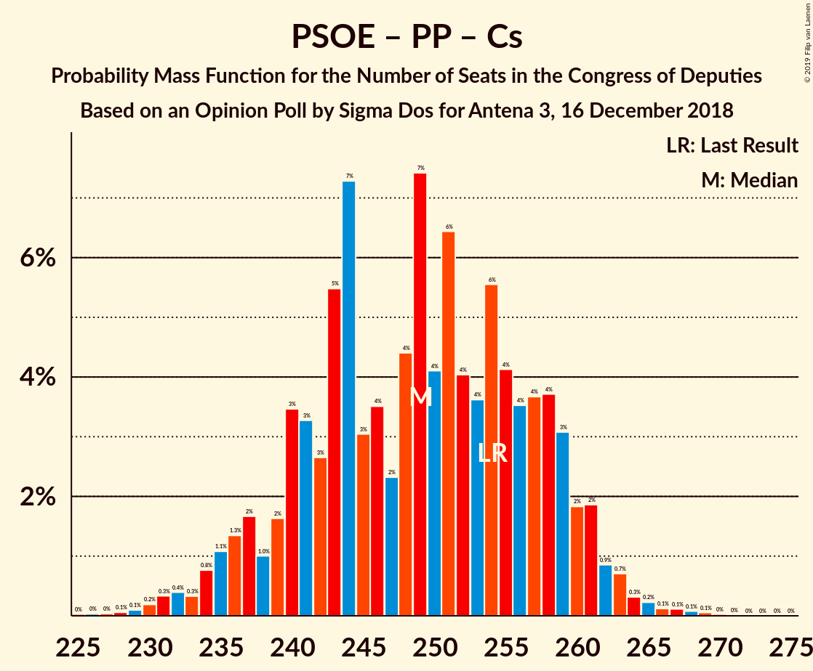

| Number of Seats | Probability | Accumulated | Special Marks |
|:---------------:|:-----------:|:-----------:|:-------------:|
| 225 | 0% | 100% |  |
| 226 | 0% | 99.9% |  |
| 227 | 0% | 99.9% |  |
| 228 | 0.1% | 99.9% |  |
| 229 | 0.1% | 99.8% |  |
| 230 | 0.2% | 99.7% |  |
| 231 | 0.3% | 99.5% |  |
| 232 | 0.4% | 99.2% |  |
| 233 | 0.3% | 98.8% |  |
| 234 | 0.8% | 98% |  |
| 235 | 1.1% | 98% |  |
| 236 | 1.3% | 97% |  |
| 237 | 2% | 95% |  |
| 238 | 1.0% | 94% |  |
| 239 | 2% | 93% |  |
| 240 | 3% | 91% |  |
| 241 | 3% | 87% |  |
| 242 | 3% | 84% |  |
| 243 | 5% | 82% |  |
| 244 | 7% | 76% |  |
| 245 | 3% | 69% |  |
| 246 | 4% | 66% |  |
| 247 | 2% | 62% |  |
| 248 | 4% | 60% |  |
| 249 | 7% | 56% | Median |
| 250 | 4% | 48% |  |
| 251 | 6% | 44% |  |
| 252 | 4% | 38% |  |
| 253 | 4% | 34% |  |
| 254 | 6% | 30% | Last Result |
| 255 | 4% | 24% |  |
| 256 | 4% | 20% |  |
| 257 | 4% | 17% |  |
| 258 | 4% | 13% |  |
| 259 | 3% | 9% |  |
| 260 | 2% | 6% |  |
| 261 | 2% | 4% |  |
| 262 | 0.9% | 3% |  |
| 263 | 0.7% | 2% |  |
| 264 | 0.3% | 1.0% |  |
| 265 | 0.2% | 0.7% |  |
| 266 | 0.1% | 0.4% |  |
| 267 | 0.1% | 0.3% |  |
| 268 | 0.1% | 0.2% |  |
| 269 | 0.1% | 0.1% |  |
| 270 | 0% | 0.1% |  |
| 271 | 0% | 0% |  |

### Partido Socialista Obrero Español – Ciudadanos–Partido de la Ciudadanía – Unidos Podemos

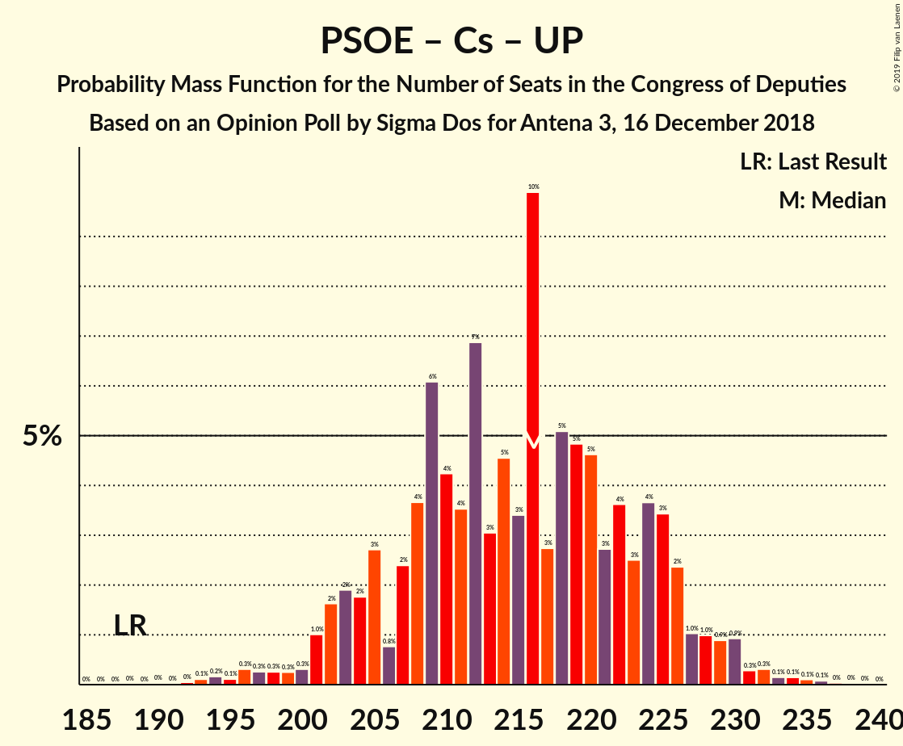

| Number of Seats | Probability | Accumulated | Special Marks |
|:---------------:|:-----------:|:-----------:|:-------------:|
| 188 | 0% | 100% | Last Result |
| 189 | 0% | 100% |  |
| 190 | 0% | 100% |  |
| 191 | 0% | 99.9% |  |
| 192 | 0% | 99.9% |  |
| 193 | 0.1% | 99.9% |  |
| 194 | 0.2% | 99.7% |  |
| 195 | 0.1% | 99.6% |  |
| 196 | 0.3% | 99.5% |  |
| 197 | 0.3% | 99.2% |  |
| 198 | 0.3% | 98.9% |  |
| 199 | 0.3% | 98.6% |  |
| 200 | 0.3% | 98% |  |
| 201 | 1.0% | 98% |  |
| 202 | 2% | 97% |  |
| 203 | 2% | 95% |  |
| 204 | 2% | 94% |  |
| 205 | 3% | 92% |  |
| 206 | 0.8% | 89% |  |
| 207 | 2% | 88% |  |
| 208 | 4% | 86% |  |
| 209 | 6% | 82% |  |
| 210 | 4% | 76% |  |
| 211 | 4% | 72% |  |
| 212 | 7% | 68% |  |
| 213 | 3% | 62% |  |
| 214 | 5% | 58% | Median |
| 215 | 3% | 54% |  |
| 216 | 10% | 51% |  |
| 217 | 3% | 41% |  |
| 218 | 5% | 38% |  |
| 219 | 5% | 33% |  |
| 220 | 5% | 28% |  |
| 221 | 3% | 23% |  |
| 222 | 4% | 21% |  |
| 223 | 3% | 17% |  |
| 224 | 4% | 14% |  |
| 225 | 3% | 11% |  |
| 226 | 2% | 7% |  |
| 227 | 1.0% | 5% |  |
| 228 | 1.0% | 4% |  |
| 229 | 0.9% | 3% |  |
| 230 | 0.9% | 2% |  |
| 231 | 0.3% | 1.2% |  |
| 232 | 0.3% | 0.9% |  |
| 233 | 0.1% | 0.6% |  |
| 234 | 0.1% | 0.4% |  |
| 235 | 0.1% | 0.3% |  |
| 236 | 0.1% | 0.2% |  |
| 237 | 0% | 0.1% |  |
| 238 | 0% | 0.1% |  |
| 239 | 0% | 0% |  |

### Partido Socialista Obrero Español – Partido Popular

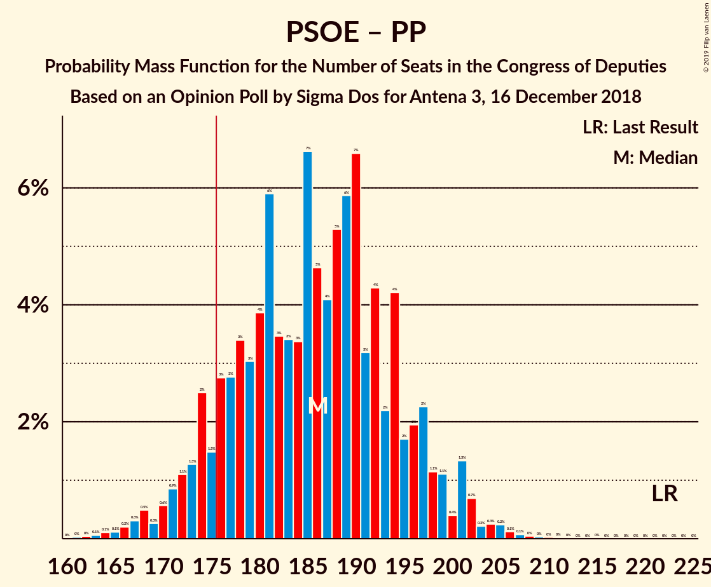

| Number of Seats | Probability | Accumulated | Special Marks |
|:---------------:|:-----------:|:-----------:|:-------------:|
| 161 | 0% | 100% |  |
| 162 | 0% | 99.9% |  |
| 163 | 0.1% | 99.9% |  |
| 164 | 0.1% | 99.8% |  |
| 165 | 0.1% | 99.7% |  |
| 166 | 0.2% | 99.6% |  |
| 167 | 0.3% | 99.4% |  |
| 168 | 0.5% | 99.1% |  |
| 169 | 0.3% | 98.6% |  |
| 170 | 0.6% | 98% |  |
| 171 | 0.9% | 98% |  |
| 172 | 1.1% | 97% |  |
| 173 | 1.3% | 96% |  |
| 174 | 2% | 95% |  |
| 175 | 1.5% | 92% |  |
| 176 | 3% | 91% | Majority |
| 177 | 3% | 88% |  |
| 178 | 3% | 85% |  |
| 179 | 3% | 82% |  |
| 180 | 4% | 79% |  |
| 181 | 6% | 75% |  |
| 182 | 3% | 69% |  |
| 183 | 3% | 65% |  |
| 184 | 3% | 62% |  |
| 185 | 7% | 59% |  |
| 186 | 5% | 52% | Median |
| 187 | 4% | 47% |  |
| 188 | 5% | 43% |  |
| 189 | 6% | 38% |  |
| 190 | 7% | 32% |  |
| 191 | 3% | 26% |  |
| 192 | 4% | 22% |  |
| 193 | 2% | 18% |  |
| 194 | 4% | 16% |  |
| 195 | 2% | 12% |  |
| 196 | 2% | 10% |  |
| 197 | 2% | 8% |  |
| 198 | 1.1% | 6% |  |
| 199 | 1.1% | 5% |  |
| 200 | 0.4% | 3% |  |
| 201 | 1.3% | 3% |  |
| 202 | 0.7% | 2% |  |
| 203 | 0.2% | 1.0% |  |
| 204 | 0.3% | 0.8% |  |
| 205 | 0.2% | 0.6% |  |
| 206 | 0.1% | 0.3% |  |
| 207 | 0.1% | 0.2% |  |
| 208 | 0% | 0.1% |  |
| 209 | 0% | 0.1% |  |
| 210 | 0% | 0.1% |  |
| 211 | 0% | 0% |  |
| 212 | 0% | 0% |  |
| 213 | 0% | 0% |  |
| 214 | 0% | 0% |  |
| 215 | 0% | 0% |  |
| 216 | 0% | 0% |  |
| 217 | 0% | 0% |  |
| 218 | 0% | 0% |  |
| 219 | 0% | 0% |  |
| 220 | 0% | 0% |  |
| 221 | 0% | 0% |  |
| 222 | 0% | 0% | Last Result |

### Partido Popular – Ciudadanos–Partido de la Ciudadanía – Vox

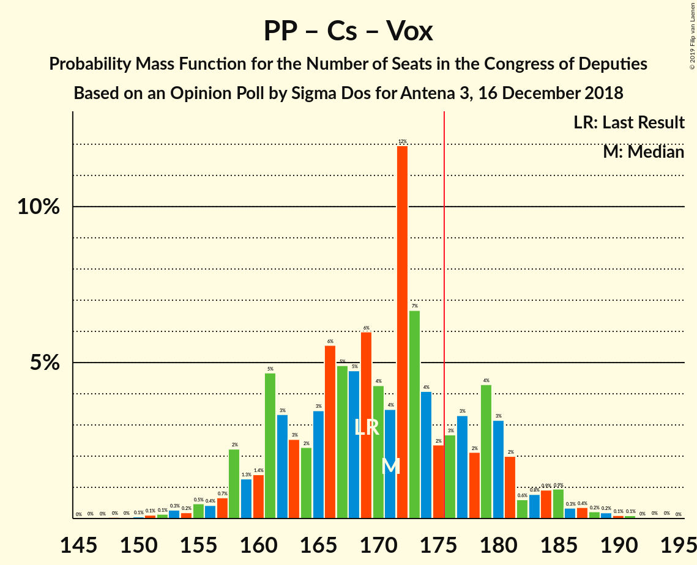

| Number of Seats | Probability | Accumulated | Special Marks |
|:---------------:|:-----------:|:-----------:|:-------------:|
| 147 | 0% | 100% |  |
| 148 | 0% | 99.9% |  |
| 149 | 0% | 99.9% |  |
| 150 | 0.1% | 99.9% |  |
| 151 | 0.1% | 99.8% |  |
| 152 | 0.1% | 99.7% |  |
| 153 | 0.3% | 99.5% |  |
| 154 | 0.2% | 99.3% |  |
| 155 | 0.5% | 99.1% |  |
| 156 | 0.4% | 98.6% |  |
| 157 | 0.7% | 98% |  |
| 158 | 2% | 98% |  |
| 159 | 1.3% | 95% |  |
| 160 | 1.4% | 94% |  |
| 161 | 5% | 93% |  |
| 162 | 3% | 88% |  |
| 163 | 3% | 85% |  |
| 164 | 2% | 82% |  |
| 165 | 3% | 80% |  |
| 166 | 6% | 76% |  |
| 167 | 5% | 71% |  |
| 168 | 5% | 66% |  |
| 169 | 6% | 61% | Last Result |
| 170 | 4% | 55% | Median |
| 171 | 4% | 51% |  |
| 172 | 12% | 47% |  |
| 173 | 7% | 35% |  |
| 174 | 4% | 29% |  |
| 175 | 2% | 25% |  |
| 176 | 3% | 22% | Majority |
| 177 | 3% | 20% |  |
| 178 | 2% | 16% |  |
| 179 | 4% | 14% |  |
| 180 | 3% | 10% |  |
| 181 | 2% | 7% |  |
| 182 | 0.6% | 5% |  |
| 183 | 0.8% | 4% |  |
| 184 | 0.9% | 3% |  |
| 185 | 0.9% | 2% |  |
| 186 | 0.3% | 1.4% |  |
| 187 | 0.4% | 1.1% |  |
| 188 | 0.2% | 0.7% |  |
| 189 | 0.2% | 0.5% |  |
| 190 | 0.1% | 0.3% |  |
| 191 | 0.1% | 0.2% |  |
| 192 | 0% | 0.1% |  |
| 193 | 0% | 0.1% |  |
| 194 | 0% | 0.1% |  |
| 195 | 0% | 0% |  |

### Partido Socialista Obrero Español – Ciudadanos–Partido de la Ciudadanía

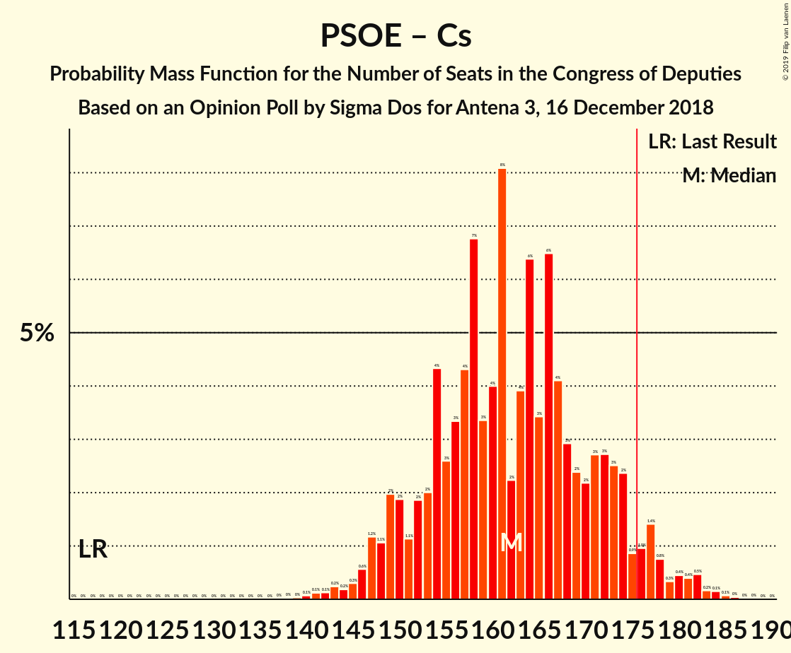

| Number of Seats | Probability | Accumulated | Special Marks |
|:---------------:|:-----------:|:-----------:|:-------------:|
| 117 | 0% | 100% | Last Result |
| 118 | 0% | 100% |  |
| 119 | 0% | 100% |  |
| 120 | 0% | 100% |  |
| 121 | 0% | 100% |  |
| 122 | 0% | 100% |  |
| 123 | 0% | 100% |  |
| 124 | 0% | 100% |  |
| 125 | 0% | 100% |  |
| 126 | 0% | 100% |  |
| 127 | 0% | 100% |  |
| 128 | 0% | 100% |  |
| 129 | 0% | 100% |  |
| 130 | 0% | 100% |  |
| 131 | 0% | 100% |  |
| 132 | 0% | 100% |  |
| 133 | 0% | 100% |  |
| 134 | 0% | 100% |  |
| 135 | 0% | 100% |  |
| 136 | 0% | 100% |  |
| 137 | 0% | 100% |  |
| 138 | 0% | 100% |  |
| 139 | 0% | 99.9% |  |
| 140 | 0.1% | 99.9% |  |
| 141 | 0.1% | 99.8% |  |
| 142 | 0.1% | 99.7% |  |
| 143 | 0.2% | 99.6% |  |
| 144 | 0.2% | 99.4% |  |
| 145 | 0.3% | 99.2% |  |
| 146 | 0.6% | 98.9% |  |
| 147 | 1.2% | 98% |  |
| 148 | 1.1% | 97% |  |
| 149 | 2% | 96% |  |
| 150 | 2% | 94% |  |
| 151 | 1.1% | 92% |  |
| 152 | 2% | 91% |  |
| 153 | 2% | 89% |  |
| 154 | 4% | 87% |  |
| 155 | 3% | 83% |  |
| 156 | 3% | 80% |  |
| 157 | 4% | 77% |  |
| 158 | 7% | 73% |  |
| 159 | 3% | 66% |  |
| 160 | 4% | 63% |  |
| 161 | 8% | 59% |  |
| 162 | 2% | 50% | Median |
| 163 | 4% | 48% |  |
| 164 | 6% | 44% |  |
| 165 | 3% | 38% |  |
| 166 | 6% | 34% |  |
| 167 | 4% | 28% |  |
| 168 | 3% | 24% |  |
| 169 | 2% | 21% |  |
| 170 | 2% | 19% |  |
| 171 | 3% | 16% |  |
| 172 | 3% | 14% |  |
| 173 | 3% | 11% |  |
| 174 | 2% | 8% |  |
| 175 | 0.9% | 6% |  |
| 176 | 1.0% | 5% | Majority |
| 177 | 1.4% | 4% |  |
| 178 | 0.8% | 3% |  |
| 179 | 0.3% | 2% |  |
| 180 | 0.4% | 2% |  |
| 181 | 0.4% | 1.3% |  |
| 182 | 0.5% | 0.9% |  |
| 183 | 0.2% | 0.5% |  |
| 184 | 0.1% | 0.3% |  |
| 185 | 0.1% | 0.2% |  |
| 186 | 0% | 0.1% |  |
| 187 | 0% | 0.1% |  |
| 188 | 0% | 0% |  |

### Partido Socialista Obrero Español – Unidos Podemos

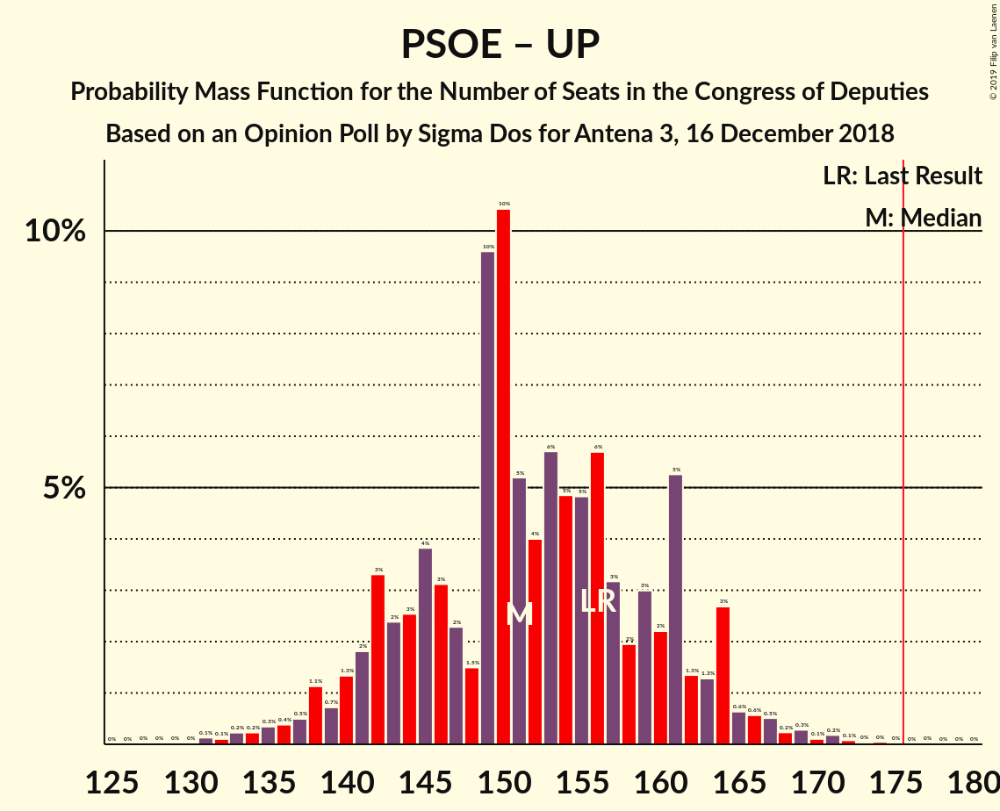

| Number of Seats | Probability | Accumulated | Special Marks |
|:---------------:|:-----------:|:-----------:|:-------------:|
| 127 | 0% | 100% |  |
| 128 | 0% | 99.9% |  |
| 129 | 0% | 99.9% |  |
| 130 | 0% | 99.9% |  |
| 131 | 0.1% | 99.9% |  |
| 132 | 0.1% | 99.7% |  |
| 133 | 0.2% | 99.6% |  |
| 134 | 0.2% | 99.4% |  |
| 135 | 0.3% | 99.2% |  |
| 136 | 0.4% | 98.8% |  |
| 137 | 0.5% | 98% |  |
| 138 | 1.1% | 98% |  |
| 139 | 0.7% | 97% |  |
| 140 | 1.3% | 96% |  |
| 141 | 2% | 95% |  |
| 142 | 3% | 93% |  |
| 143 | 2% | 90% |  |
| 144 | 3% | 87% |  |
| 145 | 4% | 85% |  |
| 146 | 3% | 81% |  |
| 147 | 2% | 78% |  |
| 148 | 1.5% | 75% |  |
| 149 | 10% | 74% |  |
| 150 | 10% | 64% |  |
| 151 | 5% | 54% | Median |
| 152 | 4% | 49% |  |
| 153 | 6% | 45% |  |
| 154 | 5% | 39% |  |
| 155 | 5% | 34% |  |
| 156 | 6% | 29% | Last Result |
| 157 | 3% | 24% |  |
| 158 | 2% | 20% |  |
| 159 | 3% | 19% |  |
| 160 | 2% | 16% |  |
| 161 | 5% | 13% |  |
| 162 | 1.3% | 8% |  |
| 163 | 1.3% | 7% |  |
| 164 | 3% | 5% |  |
| 165 | 0.6% | 3% |  |
| 166 | 0.6% | 2% |  |
| 167 | 0.5% | 2% |  |
| 168 | 0.2% | 1.1% |  |
| 169 | 0.3% | 0.8% |  |
| 170 | 0.1% | 0.5% |  |
| 171 | 0.2% | 0.4% |  |
| 172 | 0.1% | 0.3% |  |
| 173 | 0% | 0.2% |  |
| 174 | 0% | 0.1% |  |
| 175 | 0% | 0.1% |  |
| 176 | 0% | 0.1% | Majority |
| 177 | 0% | 0% |  |

### Partido Popular – Ciudadanos–Partido de la Ciudadanía

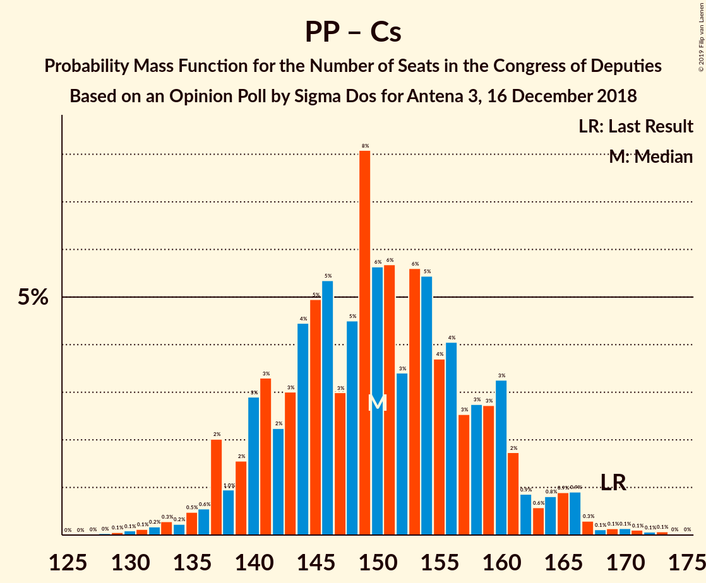

| Number of Seats | Probability | Accumulated | Special Marks |
|:---------------:|:-----------:|:-----------:|:-------------:|
| 127 | 0% | 100% |  |
| 128 | 0% | 99.9% |  |
| 129 | 0.1% | 99.9% |  |
| 130 | 0.1% | 99.8% |  |
| 131 | 0.1% | 99.7% |  |
| 132 | 0.2% | 99.6% |  |
| 133 | 0.3% | 99.4% |  |
| 134 | 0.2% | 99.2% |  |
| 135 | 0.5% | 98.9% |  |
| 136 | 0.6% | 98% |  |
| 137 | 2% | 98% |  |
| 138 | 1.0% | 96% |  |
| 139 | 2% | 95% |  |
| 140 | 3% | 93% |  |
| 141 | 3% | 90% |  |
| 142 | 2% | 87% |  |
| 143 | 3% | 85% |  |
| 144 | 4% | 82% |  |
| 145 | 5% | 77% |  |
| 146 | 5% | 73% |  |
| 147 | 3% | 67% |  |
| 148 | 5% | 64% |  |
| 149 | 8% | 60% |  |
| 150 | 6% | 52% | Median |
| 151 | 6% | 46% |  |
| 152 | 3% | 40% |  |
| 153 | 6% | 37% |  |
| 154 | 5% | 31% |  |
| 155 | 4% | 26% |  |
| 156 | 4% | 22% |  |
| 157 | 3% | 18% |  |
| 158 | 3% | 16% |  |
| 159 | 3% | 13% |  |
| 160 | 3% | 10% |  |
| 161 | 2% | 7% |  |
| 162 | 0.9% | 5% |  |
| 163 | 0.6% | 4% |  |
| 164 | 0.8% | 4% |  |
| 165 | 0.9% | 3% |  |
| 166 | 0.9% | 2% |  |
| 167 | 0.3% | 1.0% |  |
| 168 | 0.1% | 0.7% |  |
| 169 | 0.1% | 0.6% | Last Result |
| 170 | 0.1% | 0.5% |  |
| 171 | 0.1% | 0.3% |  |
| 172 | 0.1% | 0.2% |  |
| 173 | 0.1% | 0.1% |  |
| 174 | 0% | 0.1% |  |
| 175 | 0% | 0% |  |

### Partido Popular – Vox

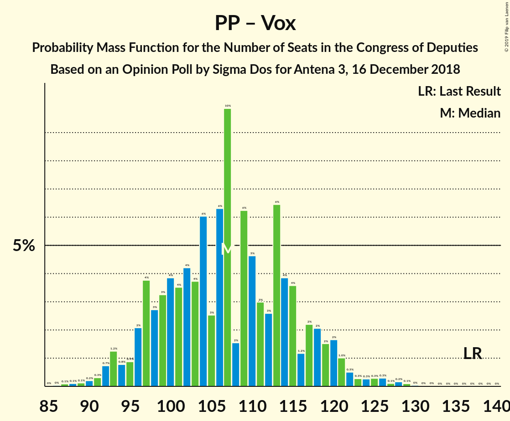

| Number of Seats | Probability | Accumulated | Special Marks |
|:---------------:|:-----------:|:-----------:|:-------------:|
| 85 | 0% | 100% |  |
| 86 | 0% | 99.9% |  |
| 87 | 0.1% | 99.9% |  |
| 88 | 0.1% | 99.8% |  |
| 89 | 0.1% | 99.7% |  |
| 90 | 0.2% | 99.6% |  |
| 91 | 0.3% | 99.4% |  |
| 92 | 0.7% | 99.1% |  |
| 93 | 1.2% | 98% |  |
| 94 | 0.8% | 97% |  |
| 95 | 0.9% | 96% |  |
| 96 | 2% | 95% |  |
| 97 | 4% | 93% |  |
| 98 | 3% | 90% |  |
| 99 | 3% | 87% |  |
| 100 | 4% | 84% |  |
| 101 | 4% | 80% |  |
| 102 | 4% | 76% |  |
| 103 | 4% | 72% |  |
| 104 | 6% | 68% |  |
| 105 | 3% | 62% |  |
| 106 | 6% | 60% |  |
| 107 | 10% | 53% | Median |
| 108 | 2% | 44% |  |
| 109 | 6% | 42% |  |
| 110 | 5% | 36% |  |
| 111 | 3% | 31% |  |
| 112 | 3% | 28% |  |
| 113 | 6% | 26% |  |
| 114 | 4% | 19% |  |
| 115 | 4% | 15% |  |
| 116 | 1.2% | 12% |  |
| 117 | 2% | 11% |  |
| 118 | 2% | 8% |  |
| 119 | 2% | 6% |  |
| 120 | 2% | 5% |  |
| 121 | 1.0% | 3% |  |
| 122 | 0.5% | 2% |  |
| 123 | 0.3% | 2% |  |
| 124 | 0.3% | 1.3% |  |
| 125 | 0.3% | 1.1% |  |
| 126 | 0.3% | 0.8% |  |
| 127 | 0.1% | 0.5% |  |
| 128 | 0.2% | 0.4% |  |
| 129 | 0.1% | 0.2% |  |
| 130 | 0% | 0.1% |  |
| 131 | 0% | 0.1% |  |
| 132 | 0% | 0.1% |  |
| 133 | 0% | 0% |  |
| 134 | 0% | 0% |  |
| 135 | 0% | 0% |  |
| 136 | 0% | 0% |  |
| 137 | 0% | 0% | Last Result |

### Partido Socialista Obrero Español

| Number of Seats | Probability | Accumulated | Special Marks |
|:---------------:|:-----------:|:-----------:|:-------------:|
| 79 | 0% | 100% |  |
| 80 | 0% | 99.9% |  |
| 81 | 0.1% | 99.9% |  |
| 82 | 0.2% | 99.8% |  |
| 83 | 0.2% | 99.7% |  |
| 84 | 0.5% | 99.5% |  |
| 85 | 0.6% | 99.0% | Last Result |
| 86 | 1.2% | 98% |  |
| 87 | 0.9% | 97% |  |
| 88 | 2% | 96% |  |
| 89 | 3% | 94% |  |
| 90 | 3% | 91% |  |
| 91 | 3% | 88% |  |
| 92 | 4% | 85% |  |
| 93 | 4% | 81% |  |
| 94 | 5% | 77% |  |
| 95 | 6% | 72% |  |
| 96 | 3% | 67% |  |
| 97 | 7% | 64% |  |
| 98 | 7% | 57% |  |
| 99 | 5% | 50% | Median |
| 100 | 6% | 45% |  |
| 101 | 7% | 39% |  |
| 102 | 3% | 33% |  |
| 103 | 3% | 29% |  |
| 104 | 5% | 27% |  |
| 105 | 5% | 22% |  |
| 106 | 3% | 17% |  |
| 107 | 2% | 14% |  |
| 108 | 2% | 12% |  |
| 109 | 2% | 10% |  |
| 110 | 1.3% | 8% |  |
| 111 | 1.2% | 7% |  |
| 112 | 0.6% | 5% |  |
| 113 | 1.1% | 5% |  |
| 114 | 1.5% | 4% |  |
| 115 | 1.0% | 2% |  |
| 116 | 0.6% | 1.3% |  |
| 117 | 0.3% | 0.8% |  |
| 118 | 0.2% | 0.4% |  |
| 119 | 0% | 0.2% |  |
| 120 | 0.1% | 0.2% |  |
| 121 | 0.1% | 0.1% |  |
| 122 | 0% | 0.1% |  |
| 123 | 0% | 0% |  |

### Partido Popular

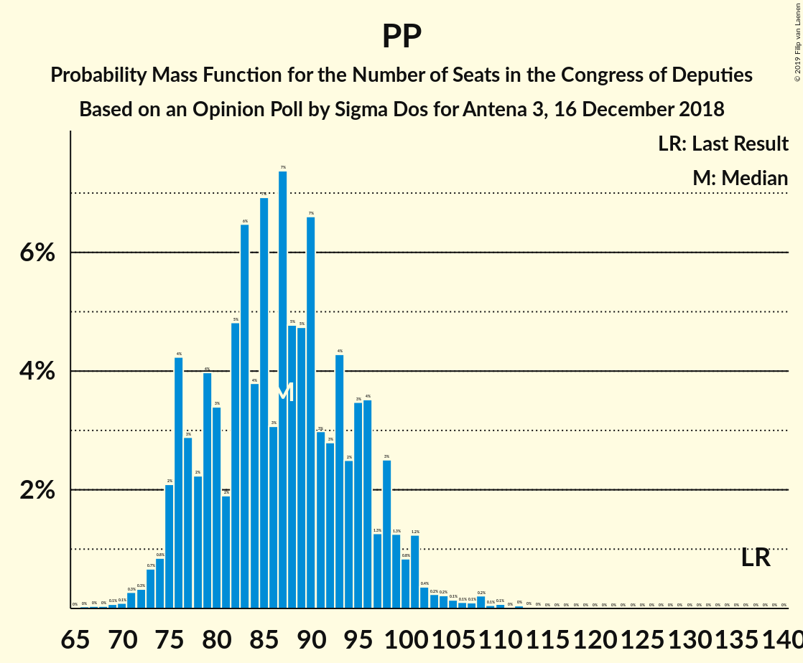

| Number of Seats | Probability | Accumulated | Special Marks |
|:---------------:|:-----------:|:-----------:|:-------------:|
| 65 | 0% | 100% |  |
| 66 | 0% | 99.9% |  |
| 67 | 0% | 99.9% |  |
| 68 | 0% | 99.9% |  |
| 69 | 0.1% | 99.8% |  |
| 70 | 0.1% | 99.8% |  |
| 71 | 0.3% | 99.7% |  |
| 72 | 0.3% | 99.4% |  |
| 73 | 0.7% | 99.1% |  |
| 74 | 0.8% | 98% |  |
| 75 | 2% | 98% |  |
| 76 | 4% | 95% |  |
| 77 | 3% | 91% |  |
| 78 | 2% | 88% |  |
| 79 | 4% | 86% |  |
| 80 | 3% | 82% |  |
| 81 | 2% | 79% |  |
| 82 | 5% | 77% |  |
| 83 | 6% | 72% |  |
| 84 | 4% | 66% |  |
| 85 | 7% | 62% |  |
| 86 | 3% | 55% |  |
| 87 | 7% | 52% | Median |
| 88 | 5% | 44% |  |
| 89 | 5% | 40% |  |
| 90 | 7% | 35% |  |
| 91 | 3% | 28% |  |
| 92 | 3% | 25% |  |
| 93 | 4% | 22% |  |
| 94 | 2% | 18% |  |
| 95 | 3% | 16% |  |
| 96 | 4% | 12% |  |
| 97 | 1.3% | 9% |  |
| 98 | 3% | 7% |  |
| 99 | 1.3% | 5% |  |
| 100 | 0.8% | 4% |  |
| 101 | 1.2% | 3% |  |
| 102 | 0.4% | 2% |  |
| 103 | 0.2% | 1.2% |  |
| 104 | 0.2% | 1.0% |  |
| 105 | 0.1% | 0.8% |  |
| 106 | 0.1% | 0.6% |  |
| 107 | 0.1% | 0.5% |  |
| 108 | 0.2% | 0.4% |  |
| 109 | 0.1% | 0.2% |  |
| 110 | 0.1% | 0.2% |  |
| 111 | 0% | 0.1% |  |
| 112 | 0% | 0.1% |  |
| 113 | 0% | 0% |  |
| 114 | 0% | 0% |  |
| 115 | 0% | 0% |  |
| 116 | 0% | 0% |  |
| 117 | 0% | 0% |  |
| 118 | 0% | 0% |  |
| 119 | 0% | 0% |  |
| 120 | 0% | 0% |  |
| 121 | 0% | 0% |  |
| 122 | 0% | 0% |  |
| 123 | 0% | 0% |  |
| 124 | 0% | 0% |  |
| 125 | 0% | 0% |  |
| 126 | 0% | 0% |  |
| 127 | 0% | 0% |  |
| 128 | 0% | 0% |  |
| 129 | 0% | 0% |  |
| 130 | 0% | 0% |  |
| 131 | 0% | 0% |  |
| 132 | 0% | 0% |  |
| 133 | 0% | 0% |  |
| 134 | 0% | 0% |  |
| 135 | 0% | 0% |  |
| 136 | 0% | 0% |  |
| 137 | 0% | 0% | Last Result |

## Technical Information

### Opinion Poll

+ **Polling firm:** Sigma Dos
+ **Commissioner(s):** Antena 3
+ **Fieldwork period:** 16 December 2018

### Calculations

+ **Sample size:** 1000
+ **Simulations done:** 131,072
+ **Error estimate:** 1.94%

