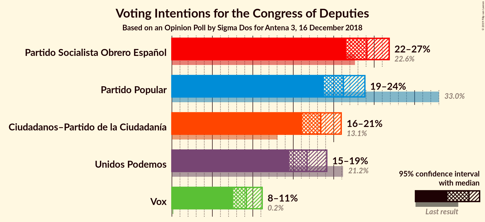
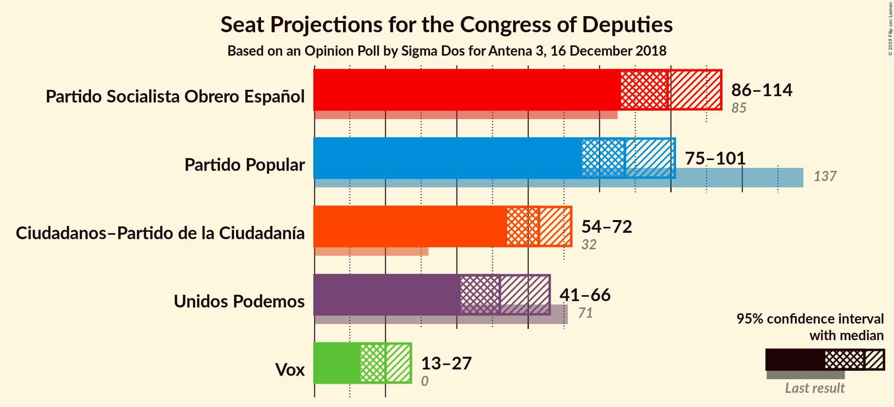
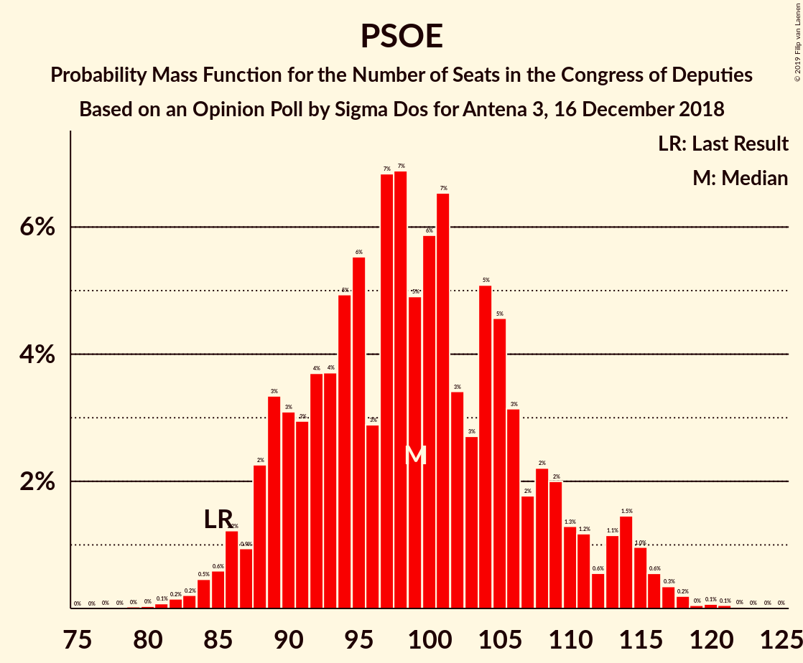

# Opinion Poll by Sigma Dos for Antena 3, 16 December 2018

<a href="#voting-intentions">Voting Intentions</a> | <a href="#seats">Seats</a> | <a href="#coalitions">Coalitions</a> | <a href="#technical-information">Technical Information</a>

## Voting Intentions

### Confidence Intervals

| Party | Last Result | Poll Result | 80% Confidence Interval | 90% Confidence Interval | 95% Confidence Interval | 99% Confidence Interval |
|:-----:|:-----------:|:-----------:|:-----------------------:|:-----------------------:|:-----------------------:|:-----------------------:|
| Partido Socialista Obrero Español | 22.6% | 24.1% | 22.4–25.9% |21.9–26.4% |21.6–26.9% |20.8–27.7% |
| Partido Popular | 33.0% | 21.2% | 19.6–22.9% |19.2–23.4% |18.8–23.9% |18.0–24.7% |
| Ciudadanos–Partido de la Ciudadanía | 13.1% | 18.4% | 16.9–20.1% |16.5–20.5% |16.1–20.9% |15.4–21.7% |
| Unidos Podemos | 21.2% | 16.7% | 15.3–18.3% |14.9–18.7% |14.5–19.1% |13.9–19.9% |
| Vox | 0.2% | 9.2% | 8.1–10.5% |7.8–10.8% |7.6–11.2% |7.1–11.8% |

*Note:* The poll result column reflects the actual value used in the calculations. Published results may vary slightly, and in addition be rounded to fewer digits.

## Seats

### Confidence Intervals

| Party | Last Result | Median | 80% Confidence Interval | 90% Confidence Interval | 95% Confidence Interval | 99% Confidence Interval |
|:-----:|:-----------:|:------:|:-----------------------:|:-----------------------:|:-----------------------:|:-----------------------:|
| <a href="#partido-socialista-obrero-español">Partido Socialista Obrero Español</a> | 85 | 102 | 101–109 |100–113 |100–113 |88–118 |
| <a href="#partido-popular">Partido Popular</a> | 137 | 84 | 68–84 |67–89 |67–91 |67–102 |
| <a href="#ciudadanos–partido-de-la-ciudadanía">Ciudadanos–Partido de la Ciudadanía</a> | 32 | 55 | 55–73 |55–73 |54–77 |48–77 |
| <a href="#unidos-podemos">Unidos Podemos</a> | 71 | 65 | 46–65 |45–65 |41–66 |34–77 |
| <a href="#vox">Vox</a> | 0 | 17 | 16–27 |16–27 |12–27 |11–28 |

### Partido Socialista Obrero Español

*For a full overview of the results for this party, see the [Partido Socialista Obrero Español](party-partidosocialistaobreroespañol.html) page.*

| Number of Seats | Probability | Accumulated | Special Marks |
|:---------------:|:-----------:|:-----------:|:-------------:|
| 78 | 0% | 100% |  |
| 79 | 0% | 99.9% |  |
| 80 | 0% | 99.9% |  |
| 81 | 0.1% | 99.9% |  |
| 82 | 0% | 99.8% |  |
| 83 | 0% | 99.8% |  |
| 84 | 0% | 99.8% |  |
| 85 | 0% | 99.8% | Last Result |
| 86 | 0% | 99.8% |  |
| 87 | 0% | 99.8% |  |
| 88 | 0.5% | 99.8% |  |
| 89 | 0% | 99.3% |  |
| 90 | 0% | 99.3% |  |
| 91 | 0% | 99.3% |  |
| 92 | 0% | 99.3% |  |
| 93 | 0.2% | 99.3% |  |
| 94 | 0.6% | 99.1% |  |
| 95 | 0% | 98% |  |
| 96 | 0% | 98% |  |
| 97 | 0% | 98% |  |
| 98 | 0% | 98% |  |
| 99 | 0% | 98% |  |
| 100 | 6% | 98% |  |
| 101 | 5% | 92% |  |
| 102 | 54% | 87% | Median |
| 103 | 3% | 33% |  |
| 104 | 0% | 30% |  |
| 105 | 1.1% | 30% |  |
| 106 | 0.3% | 29% |  |
| 107 | 0% | 29% |  |
| 108 | 0.3% | 29% |  |
| 109 | 22% | 29% |  |
| 110 | 0.1% | 6% |  |
| 111 | 0% | 6% |  |
| 112 | 0% | 6% |  |
| 113 | 4% | 6% |  |
| 114 | 0.6% | 2% |  |
| 115 | 0.5% | 2% |  |
| 116 | 0.2% | 1.1% |  |
| 117 | 0.1% | 0.9% |  |
| 118 | 0.7% | 0.8% |  |
| 119 | 0% | 0.1% |  |
| 120 | 0% | 0.1% |  |
| 121 | 0% | 0.1% |  |
| 122 | 0% | 0.1% |  |
| 123 | 0.1% | 0.1% |  |
| 124 | 0% | 0% |  |

### Partido Popular

*For a full overview of the results for this party, see the [Partido Popular](party-partidopopular.html) page.*

| Number of Seats | Probability | Accumulated | Special Marks |
|:---------------:|:-----------:|:-----------:|:-------------:|
| 66 | 0.4% | 100% |  |
| 67 | 6% | 99.6% |  |
| 68 | 4% | 94% |  |
| 69 | 0.1% | 89% |  |
| 70 | 0% | 89% |  |
| 71 | 1.4% | 89% |  |
| 72 | 0% | 88% |  |
| 73 | 0% | 88% |  |
| 74 | 0.1% | 88% |  |
| 75 | 4% | 88% |  |
| 76 | 2% | 84% |  |
| 77 | 20% | 82% |  |
| 78 | 1.3% | 62% |  |
| 79 | 0% | 60% |  |
| 80 | 0% | 60% |  |
| 81 | 0% | 60% |  |
| 82 | 0.2% | 60% |  |
| 83 | 3% | 60% |  |
| 84 | 52% | 57% | Median |
| 85 | 0% | 5% |  |
| 86 | 0.1% | 5% |  |
| 87 | 0% | 5% |  |
| 88 | 0% | 5% |  |
| 89 | 3% | 5% |  |
| 90 | 0% | 3% |  |
| 91 | 1.3% | 3% |  |
| 92 | 0.6% | 1.4% |  |
| 93 | 0% | 0.7% |  |
| 94 | 0.1% | 0.7% |  |
| 95 | 0% | 0.6% |  |
| 96 | 0.1% | 0.6% |  |
| 97 | 0% | 0.5% |  |
| 98 | 0% | 0.5% |  |
| 99 | 0% | 0.5% |  |
| 100 | 0% | 0.5% |  |
| 101 | 0% | 0.5% |  |
| 102 | 0.5% | 0.5% |  |
| 103 | 0% | 0% |  |
| 104 | 0% | 0% |  |
| 105 | 0% | 0% |  |
| 106 | 0% | 0% |  |
| 107 | 0% | 0% |  |
| 108 | 0% | 0% |  |
| 109 | 0% | 0% |  |
| 110 | 0% | 0% |  |
| 111 | 0% | 0% |  |
| 112 | 0% | 0% |  |
| 113 | 0% | 0% |  |
| 114 | 0% | 0% |  |
| 115 | 0% | 0% |  |
| 116 | 0% | 0% |  |
| 117 | 0% | 0% |  |
| 118 | 0% | 0% |  |
| 119 | 0% | 0% |  |
| 120 | 0% | 0% |  |
| 121 | 0% | 0% |  |
| 122 | 0% | 0% |  |
| 123 | 0% | 0% |  |
| 124 | 0% | 0% |  |
| 125 | 0% | 0% |  |
| 126 | 0% | 0% |  |
| 127 | 0% | 0% |  |
| 128 | 0% | 0% |  |
| 129 | 0% | 0% |  |
| 130 | 0% | 0% |  |
| 131 | 0% | 0% |  |
| 132 | 0% | 0% |  |
| 133 | 0% | 0% |  |
| 134 | 0% | 0% |  |
| 135 | 0% | 0% |  |
| 136 | 0% | 0% |  |
| 137 | 0% | 0% | Last Result |

### Ciudadanos–Partido de la Ciudadanía

*For a full overview of the results for this party, see the [Ciudadanos–Partido de la Ciudadanía](party-ciudadanos–partidodelaciudadanía.html) page.*

| Number of Seats | Probability | Accumulated | Special Marks |
|:---------------:|:-----------:|:-----------:|:-------------:|
| 32 | 0% | 100% | Last Result |
| 33 | 0% | 100% |  |
| 34 | 0% | 100% |  |
| 35 | 0% | 100% |  |
| 36 | 0% | 100% |  |
| 37 | 0% | 100% |  |
| 38 | 0% | 100% |  |
| 39 | 0% | 100% |  |
| 40 | 0% | 100% |  |
| 41 | 0% | 100% |  |
| 42 | 0% | 100% |  |
| 43 | 0% | 100% |  |
| 44 | 0% | 100% |  |
| 45 | 0.1% | 100% |  |
| 46 | 0% | 99.9% |  |
| 47 | 0.2% | 99.9% |  |
| 48 | 0.5% | 99.6% |  |
| 49 | 0.6% | 99.1% |  |
| 50 | 0% | 98.5% |  |
| 51 | 0% | 98.5% |  |
| 52 | 0.5% | 98% |  |
| 53 | 0.2% | 98% |  |
| 54 | 2% | 98% |  |
| 55 | 51% | 96% | Median |
| 56 | 2% | 44% |  |
| 57 | 0% | 42% |  |
| 58 | 0% | 42% |  |
| 59 | 0.1% | 42% |  |
| 60 | 0.8% | 42% |  |
| 61 | 4% | 42% |  |
| 62 | 0% | 38% |  |
| 63 | 10% | 38% |  |
| 64 | 1.1% | 28% |  |
| 65 | 0% | 27% |  |
| 66 | 0% | 27% |  |
| 67 | 0.7% | 27% |  |
| 68 | 0% | 26% |  |
| 69 | 0% | 26% |  |
| 70 | 0% | 26% |  |
| 71 | 0% | 26% |  |
| 72 | 0% | 26% |  |
| 73 | 22% | 26% |  |
| 74 | 0.3% | 4% |  |
| 75 | 0% | 3% |  |
| 76 | 0.1% | 3% |  |
| 77 | 3% | 3% |  |
| 78 | 0% | 0.1% |  |
| 79 | 0% | 0.1% |  |
| 80 | 0% | 0.1% |  |
| 81 | 0% | 0.1% |  |
| 82 | 0% | 0.1% |  |
| 83 | 0% | 0.1% |  |
| 84 | 0% | 0% |  |

### Unidos Podemos

*For a full overview of the results for this party, see the [Unidos Podemos](party-unidospodemos.html) page.*

| Number of Seats | Probability | Accumulated | Special Marks |
|:---------------:|:-----------:|:-----------:|:-------------:|
| 34 | 0.7% | 100% |  |
| 35 | 0% | 99.3% |  |
| 36 | 0% | 99.2% |  |
| 37 | 0% | 99.2% |  |
| 38 | 0% | 99.2% |  |
| 39 | 0.1% | 99.2% |  |
| 40 | 0% | 99.1% |  |
| 41 | 3% | 99.1% |  |
| 42 | 0% | 96% |  |
| 43 | 0% | 96% |  |
| 44 | 0.1% | 96% |  |
| 45 | 4% | 96% |  |
| 46 | 4% | 92% |  |
| 47 | 20% | 88% |  |
| 48 | 0.1% | 68% |  |
| 49 | 0.1% | 68% |  |
| 50 | 0% | 68% |  |
| 51 | 0% | 68% |  |
| 52 | 0.1% | 68% |  |
| 53 | 0.6% | 68% |  |
| 54 | 0% | 67% |  |
| 55 | 0% | 67% |  |
| 56 | 0% | 67% |  |
| 57 | 0% | 67% |  |
| 58 | 0% | 67% |  |
| 59 | 0% | 67% |  |
| 60 | 0% | 67% |  |
| 61 | 0% | 67% |  |
| 62 | 0.1% | 67% |  |
| 63 | 0.1% | 67% |  |
| 64 | 10% | 67% |  |
| 65 | 54% | 57% | Median |
| 66 | 0.7% | 3% |  |
| 67 | 0% | 2% |  |
| 68 | 0% | 2% |  |
| 69 | 0% | 2% |  |
| 70 | 0% | 2% |  |
| 71 | 1.4% | 2% | Last Result |
| 72 | 0% | 0.7% |  |
| 73 | 0% | 0.7% |  |
| 74 | 0% | 0.7% |  |
| 75 | 0% | 0.7% |  |
| 76 | 0% | 0.7% |  |
| 77 | 0.4% | 0.7% |  |
| 78 | 0.2% | 0.2% |  |
| 79 | 0% | 0% |  |

### Vox

*For a full overview of the results for this party, see the [Vox](party-vox.html) page.*

| Number of Seats | Probability | Accumulated | Special Marks |
|:---------------:|:-----------:|:-----------:|:-------------:|
| 0 | 0% | 100% | Last Result |
| 1 | 0% | 100% |  |
| 2 | 0% | 100% |  |
| 3 | 0% | 100% |  |
| 4 | 0% | 100% |  |
| 5 | 0% | 100% |  |
| 6 | 0% | 100% |  |
| 7 | 0% | 100% |  |
| 8 | 0.1% | 100% |  |
| 9 | 0% | 99.9% |  |
| 10 | 0% | 99.9% |  |
| 11 | 0.6% | 99.8% |  |
| 12 | 2% | 99.3% |  |
| 13 | 0.4% | 97% |  |
| 14 | 0.5% | 97% |  |
| 15 | 0.4% | 96% |  |
| 16 | 21% | 96% |  |
| 17 | 51% | 75% | Median |
| 18 | 4% | 23% |  |
| 19 | 0.5% | 19% |  |
| 20 | 1.4% | 18% |  |
| 21 | 0% | 17% |  |
| 22 | 1.3% | 17% |  |
| 23 | 0.2% | 16% |  |
| 24 | 0.1% | 15% |  |
| 25 | 0% | 15% |  |
| 26 | 5% | 15% |  |
| 27 | 10% | 11% |  |
| 28 | 0.8% | 0.9% |  |
| 29 | 0% | 0.1% |  |
| 30 | 0% | 0.1% |  |
| 31 | 0% | 0.1% |  |
| 32 | 0% | 0.1% |  |
| 33 | 0% | 0.1% |  |
| 34 | 0% | 0.1% |  |
| 35 | 0% | 0.1% |  |
| 36 | 0% | 0.1% |  |
| 37 | 0% | 0.1% |  |
| 38 | 0% | 0.1% |  |
| 39 | 0% | 0.1% |  |
| 40 | 0% | 0% |  |

## Coalitions

### Confidence Intervals

| Coalition | Last Result | Median | Majority? | 80% Confidence Interval | 90% Confidence Interval | 95% Confidence Interval | 99% Confidence Interval |
|:---------:|:-----------:|:------:|:---------:|:-----------------------:|:-----------------------:|:-----------------------:|:-----------------------:|
| Partido Socialista Obrero Español – Ciudadanos–Partido de la Ciudadanía | 117 | 157 | 27% | 157–182 | 157–182 | 156–182 | 140–185 |
| Partido Popular – Ciudadanos–Partido de la Ciudadanía – Vox | 169 | 156 | 4% | 156–166 | 156–168 | 155–178 | 147–181 |
| Partido Socialista Obrero Español – Unidos Podemos | 156 | 167 | 2% | 156–167 | 155–167 | 144–168 | 141–176 |
| Partido Popular – Ciudadanos–Partido de la Ciudadanía | 169 | 139 | 0% | 131–150 | 130–151 | 130–166 | 127–168 |
| Partido Socialista Obrero Español | 85 | 102 | 0% | 101–109 | 100–113 | 100–113 | 88–118 |
| Partido Popular – Vox | 137 | 101 | 0% | 93–101 | 93–102 | 93–103 | 91–129 |
| Partido Popular | 137 | 84 | 0% | 68–84 | 67–89 | 67–91 | 67–102 |

### Partido Socialista Obrero Español – Ciudadanos–Partido de la Ciudadanía

| Number of Seats | Probability | Accumulated | Special Marks |
|:---------------:|:-----------:|:-----------:|:-------------:|
| 117 | 0% | 100% | Last Result |
| 118 | 0% | 100% |  |
| 119 | 0% | 100% |  |
| 120 | 0% | 100% |  |
| 121 | 0% | 100% |  |
| 122 | 0% | 100% |  |
| 123 | 0% | 100% |  |
| 124 | 0% | 100% |  |
| 125 | 0% | 100% |  |
| 126 | 0% | 100% |  |
| 127 | 0% | 100% |  |
| 128 | 0% | 100% |  |
| 129 | 0% | 100% |  |
| 130 | 0% | 100% |  |
| 131 | 0% | 100% |  |
| 132 | 0% | 100% |  |
| 133 | 0% | 100% |  |
| 134 | 0% | 100% |  |
| 135 | 0% | 100% |  |
| 136 | 0% | 100% |  |
| 137 | 0% | 99.9% |  |
| 138 | 0% | 99.9% |  |
| 139 | 0% | 99.9% |  |
| 140 | 0.5% | 99.9% |  |
| 141 | 0% | 99.4% |  |
| 142 | 0% | 99.4% |  |
| 143 | 0% | 99.4% |  |
| 144 | 0.1% | 99.4% |  |
| 145 | 0% | 99.3% |  |
| 146 | 0% | 99.3% |  |
| 147 | 0% | 99.3% |  |
| 148 | 0% | 99.3% |  |
| 149 | 0% | 99.3% |  |
| 150 | 0% | 99.3% |  |
| 151 | 0% | 99.3% |  |
| 152 | 0% | 99.3% |  |
| 153 | 0% | 99.3% |  |
| 154 | 0.4% | 99.3% |  |
| 155 | 0.6% | 98.9% |  |
| 156 | 2% | 98% |  |
| 157 | 51% | 96% | Median |
| 158 | 0.5% | 45% |  |
| 159 | 0% | 44% |  |
| 160 | 0% | 44% |  |
| 161 | 1.1% | 44% |  |
| 162 | 0.3% | 43% |  |
| 163 | 8% | 43% |  |
| 164 | 3% | 35% |  |
| 165 | 1.1% | 32% |  |
| 166 | 0% | 31% |  |
| 167 | 0% | 31% |  |
| 168 | 0.1% | 31% |  |
| 169 | 0.1% | 31% |  |
| 170 | 0% | 31% |  |
| 171 | 0% | 31% |  |
| 172 | 0.1% | 31% |  |
| 173 | 0.8% | 31% |  |
| 174 | 3% | 30% |  |
| 175 | 0% | 27% |  |
| 176 | 0.1% | 27% | Majority |
| 177 | 0% | 27% |  |
| 178 | 0.1% | 27% |  |
| 179 | 0.4% | 27% |  |
| 180 | 3% | 26% |  |
| 181 | 0% | 23% |  |
| 182 | 23% | 23% |  |
| 183 | 0.1% | 0.8% |  |
| 184 | 0.1% | 0.8% |  |
| 185 | 0.7% | 0.7% |  |
| 186 | 0% | 0% |  |

### Partido Popular – Ciudadanos–Partido de la Ciudadanía – Vox

| Number of Seats | Probability | Accumulated | Special Marks |
|:---------------:|:-----------:|:-----------:|:-------------:|
| 146 | 0.2% | 100% |  |
| 147 | 1.4% | 99.8% |  |
| 148 | 0% | 98% |  |
| 149 | 0% | 98% |  |
| 150 | 0% | 98% |  |
| 151 | 0% | 98% |  |
| 152 | 0.2% | 98% |  |
| 153 | 0.5% | 98% |  |
| 154 | 0% | 98% |  |
| 155 | 2% | 98% |  |
| 156 | 52% | 96% | Median |
| 157 | 9% | 43% |  |
| 158 | 1.0% | 34% |  |
| 159 | 0.1% | 33% |  |
| 160 | 0.2% | 33% |  |
| 161 | 0.5% | 33% |  |
| 162 | 0% | 32% |  |
| 163 | 4% | 32% |  |
| 164 | 0% | 28% |  |
| 165 | 0.2% | 28% |  |
| 166 | 20% | 27% |  |
| 167 | 3% | 8% |  |
| 168 | 1.0% | 5% |  |
| 169 | 0.1% | 4% | Last Result |
| 170 | 0% | 4% |  |
| 171 | 0% | 4% |  |
| 172 | 0% | 4% |  |
| 173 | 0% | 4% |  |
| 174 | 0% | 4% |  |
| 175 | 0% | 4% |  |
| 176 | 0% | 4% | Majority |
| 177 | 0% | 4% |  |
| 178 | 2% | 4% |  |
| 179 | 1.1% | 2% |  |
| 180 | 0% | 0.7% |  |
| 181 | 0.5% | 0.7% |  |
| 182 | 0% | 0.2% |  |
| 183 | 0% | 0.2% |  |
| 184 | 0% | 0.2% |  |
| 185 | 0% | 0.2% |  |
| 186 | 0% | 0.1% |  |
| 187 | 0% | 0.1% |  |
| 188 | 0.1% | 0.1% |  |
| 189 | 0% | 0.1% |  |
| 190 | 0% | 0% |  |

### Partido Socialista Obrero Español – Unidos Podemos

| Number of Seats | Probability | Accumulated | Special Marks |
|:---------------:|:-----------:|:-----------:|:-------------:|
| 132 | 0% | 100% |  |
| 133 | 0.1% | 99.9% |  |
| 134 | 0% | 99.9% |  |
| 135 | 0% | 99.9% |  |
| 136 | 0% | 99.9% |  |
| 137 | 0% | 99.9% |  |
| 138 | 0% | 99.9% |  |
| 139 | 0% | 99.8% |  |
| 140 | 0% | 99.8% |  |
| 141 | 0.6% | 99.8% |  |
| 142 | 0% | 99.3% |  |
| 143 | 0.5% | 99.2% |  |
| 144 | 3% | 98.8% |  |
| 145 | 0% | 96% |  |
| 146 | 0% | 96% |  |
| 147 | 0% | 96% |  |
| 148 | 0% | 96% |  |
| 149 | 0% | 96% |  |
| 150 | 0% | 96% |  |
| 151 | 0.1% | 96% |  |
| 152 | 0.7% | 96% |  |
| 153 | 0% | 95% |  |
| 154 | 0.3% | 95% |  |
| 155 | 3% | 95% |  |
| 156 | 20% | 92% | Last Result |
| 157 | 0% | 73% |  |
| 158 | 4% | 73% |  |
| 159 | 0% | 69% |  |
| 160 | 0.7% | 69% |  |
| 161 | 0.7% | 68% |  |
| 162 | 0% | 67% |  |
| 163 | 0% | 67% |  |
| 164 | 6% | 67% |  |
| 165 | 5% | 61% |  |
| 166 | 0% | 56% |  |
| 167 | 54% | 56% | Median |
| 168 | 0.5% | 3% |  |
| 169 | 0% | 2% |  |
| 170 | 0.1% | 2% |  |
| 171 | 0.3% | 2% |  |
| 172 | 0.2% | 2% |  |
| 173 | 0% | 2% |  |
| 174 | 0% | 2% |  |
| 175 | 0% | 2% |  |
| 176 | 1.2% | 2% | Majority |
| 177 | 0.3% | 0.3% |  |
| 178 | 0% | 0% |  |

### Partido Popular – Ciudadanos–Partido de la Ciudadanía

| Number of Seats | Probability | Accumulated | Special Marks |
|:---------------:|:-----------:|:-----------:|:-------------:|
| 123 | 0.1% | 100% |  |
| 124 | 0% | 99.9% |  |
| 125 | 0% | 99.9% |  |
| 126 | 0% | 99.8% |  |
| 127 | 1.4% | 99.8% |  |
| 128 | 0% | 98% |  |
| 129 | 0.4% | 98% |  |
| 130 | 6% | 98% |  |
| 131 | 3% | 92% |  |
| 132 | 1.0% | 89% |  |
| 133 | 0.1% | 88% |  |
| 134 | 0% | 88% |  |
| 135 | 0.8% | 88% |  |
| 136 | 3% | 87% |  |
| 137 | 2% | 84% |  |
| 138 | 0.9% | 82% |  |
| 139 | 52% | 81% | Median |
| 140 | 0.5% | 29% |  |
| 141 | 0.6% | 28% |  |
| 142 | 0% | 28% |  |
| 143 | 0% | 28% |  |
| 144 | 0% | 28% |  |
| 145 | 0% | 28% |  |
| 146 | 0% | 28% |  |
| 147 | 0% | 28% |  |
| 148 | 0% | 28% |  |
| 149 | 2% | 28% |  |
| 150 | 20% | 26% |  |
| 151 | 1.1% | 5% |  |
| 152 | 0% | 4% |  |
| 153 | 0% | 4% |  |
| 154 | 0.5% | 4% |  |
| 155 | 0.1% | 4% |  |
| 156 | 0.1% | 4% |  |
| 157 | 0.1% | 3% |  |
| 158 | 0% | 3% |  |
| 159 | 0% | 3% |  |
| 160 | 0% | 3% |  |
| 161 | 0% | 3% |  |
| 162 | 0% | 3% |  |
| 163 | 0% | 3% |  |
| 164 | 0% | 3% |  |
| 165 | 0.1% | 3% |  |
| 166 | 3% | 3% |  |
| 167 | 0% | 0.6% |  |
| 168 | 0.6% | 0.6% |  |
| 169 | 0% | 0% | Last Result |

### Partido Socialista Obrero Español

| Number of Seats | Probability | Accumulated | Special Marks |
|:---------------:|:-----------:|:-----------:|:-------------:|
| 78 | 0% | 100% |  |
| 79 | 0% | 99.9% |  |
| 80 | 0% | 99.9% |  |
| 81 | 0.1% | 99.9% |  |
| 82 | 0% | 99.8% |  |
| 83 | 0% | 99.8% |  |
| 84 | 0% | 99.8% |  |
| 85 | 0% | 99.8% | Last Result |
| 86 | 0% | 99.8% |  |
| 87 | 0% | 99.8% |  |
| 88 | 0.5% | 99.8% |  |
| 89 | 0% | 99.3% |  |
| 90 | 0% | 99.3% |  |
| 91 | 0% | 99.3% |  |
| 92 | 0% | 99.3% |  |
| 93 | 0.2% | 99.3% |  |
| 94 | 0.6% | 99.1% |  |
| 95 | 0% | 98% |  |
| 96 | 0% | 98% |  |
| 97 | 0% | 98% |  |
| 98 | 0% | 98% |  |
| 99 | 0% | 98% |  |
| 100 | 6% | 98% |  |
| 101 | 5% | 92% |  |
| 102 | 54% | 87% | Median |
| 103 | 3% | 33% |  |
| 104 | 0% | 30% |  |
| 105 | 1.1% | 30% |  |
| 106 | 0.3% | 29% |  |
| 107 | 0% | 29% |  |
| 108 | 0.3% | 29% |  |
| 109 | 22% | 29% |  |
| 110 | 0.1% | 6% |  |
| 111 | 0% | 6% |  |
| 112 | 0% | 6% |  |
| 113 | 4% | 6% |  |
| 114 | 0.6% | 2% |  |
| 115 | 0.5% | 2% |  |
| 116 | 0.2% | 1.1% |  |
| 117 | 0.1% | 0.9% |  |
| 118 | 0.7% | 0.8% |  |
| 119 | 0% | 0.1% |  |
| 120 | 0% | 0.1% |  |
| 121 | 0% | 0.1% |  |
| 122 | 0% | 0.1% |  |
| 123 | 0.1% | 0.1% |  |
| 124 | 0% | 0% |  |

### Partido Popular – Vox

| Number of Seats | Probability | Accumulated | Special Marks |
|:---------------:|:-----------:|:-----------:|:-------------:|
| 86 | 0.1% | 100% |  |
| 87 | 0% | 99.9% |  |
| 88 | 0% | 99.9% |  |
| 89 | 0% | 99.9% |  |
| 90 | 0% | 99.9% |  |
| 91 | 2% | 99.9% |  |
| 92 | 0.6% | 98% |  |
| 93 | 20% | 98% |  |
| 94 | 13% | 78% |  |
| 95 | 0.1% | 64% |  |
| 96 | 0% | 64% |  |
| 97 | 0% | 64% |  |
| 98 | 0% | 64% |  |
| 99 | 0% | 64% |  |
| 100 | 0.5% | 64% |  |
| 101 | 56% | 64% | Median |
| 102 | 4% | 7% |  |
| 103 | 0.9% | 3% |  |
| 104 | 0% | 2% |  |
| 105 | 0% | 2% |  |
| 106 | 0% | 2% |  |
| 107 | 0% | 2% |  |
| 108 | 0% | 2% |  |
| 109 | 0% | 2% |  |
| 110 | 0% | 2% |  |
| 111 | 0% | 2% |  |
| 112 | 0% | 2% |  |
| 113 | 0.7% | 2% |  |
| 114 | 0.7% | 1.4% |  |
| 115 | 0% | 0.7% |  |
| 116 | 0% | 0.7% |  |
| 117 | 0% | 0.7% |  |
| 118 | 0% | 0.7% |  |
| 119 | 0% | 0.7% |  |
| 120 | 0.1% | 0.7% |  |
| 121 | 0% | 0.6% |  |
| 122 | 0% | 0.6% |  |
| 123 | 0% | 0.6% |  |
| 124 | 0% | 0.6% |  |
| 125 | 0.1% | 0.6% |  |
| 126 | 0% | 0.6% |  |
| 127 | 0% | 0.5% |  |
| 128 | 0% | 0.5% |  |
| 129 | 0.5% | 0.5% |  |
| 130 | 0% | 0% |  |
| 131 | 0% | 0% |  |
| 132 | 0% | 0% |  |
| 133 | 0% | 0% |  |
| 134 | 0% | 0% |  |
| 135 | 0% | 0% |  |
| 136 | 0% | 0% |  |
| 137 | 0% | 0% | Last Result |

### Partido Popular

| Number of Seats | Probability | Accumulated | Special Marks |
|:---------------:|:-----------:|:-----------:|:-------------:|
| 66 | 0.4% | 100% |  |
| 67 | 6% | 99.6% |  |
| 68 | 4% | 94% |  |
| 69 | 0.1% | 89% |  |
| 70 | 0% | 89% |  |
| 71 | 1.4% | 89% |  |
| 72 | 0% | 88% |  |
| 73 | 0% | 88% |  |
| 74 | 0.1% | 88% |  |
| 75 | 4% | 88% |  |
| 76 | 2% | 84% |  |
| 77 | 20% | 82% |  |
| 78 | 1.3% | 62% |  |
| 79 | 0% | 60% |  |
| 80 | 0% | 60% |  |
| 81 | 0% | 60% |  |
| 82 | 0.2% | 60% |  |
| 83 | 3% | 60% |  |
| 84 | 52% | 57% | Median |
| 85 | 0% | 5% |  |
| 86 | 0.1% | 5% |  |
| 87 | 0% | 5% |  |
| 88 | 0% | 5% |  |
| 89 | 3% | 5% |  |
| 90 | 0% | 3% |  |
| 91 | 1.3% | 3% |  |
| 92 | 0.6% | 1.4% |  |
| 93 | 0% | 0.7% |  |
| 94 | 0.1% | 0.7% |  |
| 95 | 0% | 0.6% |  |
| 96 | 0.1% | 0.6% |  |
| 97 | 0% | 0.5% |  |
| 98 | 0% | 0.5% |  |
| 99 | 0% | 0.5% |  |
| 100 | 0% | 0.5% |  |
| 101 | 0% | 0.5% |  |
| 102 | 0.5% | 0.5% |  |
| 103 | 0% | 0% |  |
| 104 | 0% | 0% |  |
| 105 | 0% | 0% |  |
| 106 | 0% | 0% |  |
| 107 | 0% | 0% |  |
| 108 | 0% | 0% |  |
| 109 | 0% | 0% |  |
| 110 | 0% | 0% |  |
| 111 | 0% | 0% |  |
| 112 | 0% | 0% |  |
| 113 | 0% | 0% |  |
| 114 | 0% | 0% |  |
| 115 | 0% | 0% |  |
| 116 | 0% | 0% |  |
| 117 | 0% | 0% |  |
| 118 | 0% | 0% |  |
| 119 | 0% | 0% |  |
| 120 | 0% | 0% |  |
| 121 | 0% | 0% |  |
| 122 | 0% | 0% |  |
| 123 | 0% | 0% |  |
| 124 | 0% | 0% |  |
| 125 | 0% | 0% |  |
| 126 | 0% | 0% |  |
| 127 | 0% | 0% |  |
| 128 | 0% | 0% |  |
| 129 | 0% | 0% |  |
| 130 | 0% | 0% |  |
| 131 | 0% | 0% |  |
| 132 | 0% | 0% |  |
| 133 | 0% | 0% |  |
| 134 | 0% | 0% |  |
| 135 | 0% | 0% |  |
| 136 | 0% | 0% |  |
| 137 | 0% | 0% | Last Result |

## Technical Information

### Opinion Poll

+ **Polling firm:** Sigma Dos
+ **Commissioner(s):** Antena 3
+ **Fieldwork period:** 16 December 2018

### Calculations

+ **Sample size:** 1000
+ **Simulations done:** 1,024
+ **Error estimate:** 5.23%

