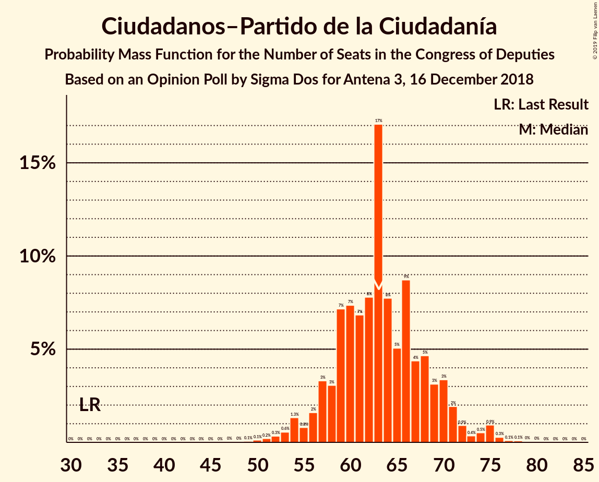
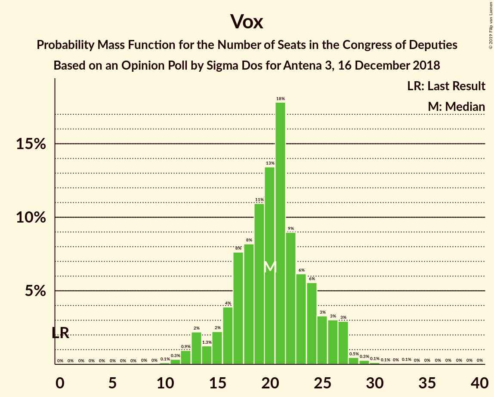
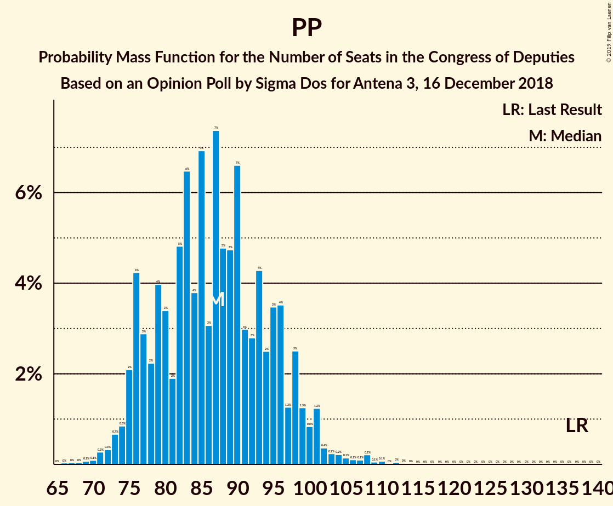

# Opinion Poll by Sigma Dos for Antena 3, 16 December 2018

<a href="#voting-intentions">Voting Intentions</a> | <a href="#seats">Seats</a> | <a href="#coalitions">Coalitions</a> | <a href="#technical-information">Technical Information</a>

## Voting Intentions

### Confidence Intervals

| Party | Last Result | Poll Result | 80% Confidence Interval | 90% Confidence Interval | 95% Confidence Interval | 99% Confidence Interval |
|:-----:|:-----------:|:-----------:|:-----------------------:|:-----------------------:|:-----------------------:|:-----------------------:|
| Partido Socialista Obrero Español | 22.6% | 24.1% | 22.4–25.9% |21.9–26.4% |21.6–26.9% |20.8–27.7% |
| Partido Popular | 33.0% | 21.2% | 19.6–22.9% |19.2–23.4% |18.8–23.9% |18.0–24.7% |
| Ciudadanos–Partido de la Ciudadanía | 13.1% | 18.4% | 16.9–20.1% |16.5–20.5% |16.1–20.9% |15.4–21.7% |
| Unidos Podemos | 21.2% | 16.7% | 15.3–18.3% |14.9–18.7% |14.5–19.1% |13.9–19.9% |
| Vox | 0.2% | 9.2% | 8.1–10.5% |7.8–10.8% |7.6–11.2% |7.1–11.8% |

*Note:* The poll result column reflects the actual value used in the calculations. Published results may vary slightly, and in addition be rounded to fewer digits.

## Seats

### Confidence Intervals

| Party | Last Result | Median | 80% Confidence Interval | 90% Confidence Interval | 95% Confidence Interval | 99% Confidence Interval |
|:-----:|:-----------:|:------:|:-----------------------:|:-----------------------:|:-----------------------:|:-----------------------:|
| <a href="#partido-socialista-obrero-español">Partido Socialista Obrero Español</a> | 85 | 72 | 69–77 |69–77 |69–77 |59–82 |
| <a href="#partido-popular">Partido Popular</a> | 137 | 61 | 49–61 |49–65 |49–65 |49–73 |
| <a href="#ciudadanos–partido-de-la-ciudadanía">Ciudadanos–Partido de la Ciudadanía</a> | 32 | 39 | 39–53 |39–53 |38–55 |34–55 |
| <a href="#unidos-podemos">Unidos Podemos</a> | 71 | 42 | 31–42 |30–42 |29–44 |21–53 |
| <a href="#vox">Vox</a> | 0 | 15 | 13–25 |13–25 |10–28 |10–29 |

### Partido Socialista Obrero Español

*For a full overview of the results for this party, see the [Partido Socialista Obrero Español](party-partidosocialistaobreroespañol.html) page.*

| Number of Seats | Probability | Accumulated | Special Marks |
|:---------------:|:-----------:|:-----------:|:-------------:|
| 50 | 0% | 100% |  |
| 51 | 0% | 99.9% |  |
| 52 | 0% | 99.9% |  |
| 53 | 0% | 99.9% |  |
| 54 | 0% | 99.9% |  |
| 55 | 0% | 99.9% |  |
| 56 | 0.1% | 99.9% |  |
| 57 | 0% | 99.8% |  |
| 58 | 0% | 99.8% |  |
| 59 | 0.3% | 99.8% |  |
| 60 | 0.1% | 99.5% |  |
| 61 | 0% | 99.3% |  |
| 62 | 0% | 99.3% |  |
| 63 | 0.7% | 99.3% |  |
| 64 | 0% | 98.6% |  |
| 65 | 0% | 98.6% |  |
| 66 | 0% | 98.6% |  |
| 67 | 0.1% | 98.6% |  |
| 68 | 0% | 98% |  |
| 69 | 10% | 98% |  |
| 70 | 1.1% | 89% |  |
| 71 | 3% | 88% |  |
| 72 | 54% | 84% | Median |
| 73 | 0% | 30% |  |
| 74 | 0% | 30% |  |
| 75 | 2% | 30% |  |
| 76 | 2% | 29% |  |
| 77 | 24% | 27% |  |
| 78 | 0% | 2% |  |
| 79 | 0% | 2% |  |
| 80 | 0% | 2% |  |
| 81 | 1.3% | 2% |  |
| 82 | 0.8% | 0.9% |  |
| 83 | 0% | 0.1% |  |
| 84 | 0% | 0.1% |  |
| 85 | 0% | 0.1% | Last Result |
| 86 | 0% | 0.1% |  |
| 87 | 0% | 0.1% |  |
| 88 | 0.1% | 0.1% |  |
| 89 | 0% | 0% |  |

### Partido Popular

*For a full overview of the results for this party, see the [Partido Popular](party-partidopopular.html) page.*

| Number of Seats | Probability | Accumulated | Special Marks |
|:---------------:|:-----------:|:-----------:|:-------------:|
| 48 | 0% | 100% |  |
| 49 | 11% | 99.9% |  |
| 50 | 0.1% | 89% |  |
| 51 | 0.2% | 89% |  |
| 52 | 5% | 89% |  |
| 53 | 0.1% | 84% |  |
| 54 | 0% | 84% |  |
| 55 | 8% | 84% |  |
| 56 | 16% | 76% |  |
| 57 | 0.1% | 60% |  |
| 58 | 0.3% | 60% |  |
| 59 | 2% | 60% |  |
| 60 | 0.8% | 58% |  |
| 61 | 52% | 57% | Median |
| 62 | 0% | 5% |  |
| 63 | 0% | 5% |  |
| 64 | 0% | 5% |  |
| 65 | 5% | 5% |  |
| 66 | 0% | 0.6% |  |
| 67 | 0% | 0.6% |  |
| 68 | 0% | 0.6% |  |
| 69 | 0% | 0.6% |  |
| 70 | 0.1% | 0.6% |  |
| 71 | 0% | 0.5% |  |
| 72 | 0% | 0.5% |  |
| 73 | 0% | 0.5% |  |
| 74 | 0.3% | 0.5% |  |
| 75 | 0.1% | 0.1% |  |
| 76 | 0% | 0% |  |
| 77 | 0% | 0% |  |
| 78 | 0% | 0% |  |
| 79 | 0% | 0% |  |
| 80 | 0% | 0% |  |
| 81 | 0% | 0% |  |
| 82 | 0% | 0% |  |
| 83 | 0% | 0% |  |
| 84 | 0% | 0% |  |
| 85 | 0% | 0% |  |
| 86 | 0% | 0% |  |
| 87 | 0% | 0% |  |
| 88 | 0% | 0% |  |
| 89 | 0% | 0% |  |
| 90 | 0% | 0% |  |
| 91 | 0% | 0% |  |
| 92 | 0% | 0% |  |
| 93 | 0% | 0% |  |
| 94 | 0% | 0% |  |
| 95 | 0% | 0% |  |
| 96 | 0% | 0% |  |
| 97 | 0% | 0% |  |
| 98 | 0% | 0% |  |
| 99 | 0% | 0% |  |
| 100 | 0% | 0% |  |
| 101 | 0% | 0% |  |
| 102 | 0% | 0% |  |
| 103 | 0% | 0% |  |
| 104 | 0% | 0% |  |
| 105 | 0% | 0% |  |
| 106 | 0% | 0% |  |
| 107 | 0% | 0% |  |
| 108 | 0% | 0% |  |
| 109 | 0% | 0% |  |
| 110 | 0% | 0% |  |
| 111 | 0% | 0% |  |
| 112 | 0% | 0% |  |
| 113 | 0% | 0% |  |
| 114 | 0% | 0% |  |
| 115 | 0% | 0% |  |
| 116 | 0% | 0% |  |
| 117 | 0% | 0% |  |
| 118 | 0% | 0% |  |
| 119 | 0% | 0% |  |
| 120 | 0% | 0% |  |
| 121 | 0% | 0% |  |
| 122 | 0% | 0% |  |
| 123 | 0% | 0% |  |
| 124 | 0% | 0% |  |
| 125 | 0% | 0% |  |
| 126 | 0% | 0% |  |
| 127 | 0% | 0% |  |
| 128 | 0% | 0% |  |
| 129 | 0% | 0% |  |
| 130 | 0% | 0% |  |
| 131 | 0% | 0% |  |
| 132 | 0% | 0% |  |
| 133 | 0% | 0% |  |
| 134 | 0% | 0% |  |
| 135 | 0% | 0% |  |
| 136 | 0% | 0% |  |
| 137 | 0% | 0% | Last Result |

### Ciudadanos–Partido de la Ciudadanía

*For a full overview of the results for this party, see the [Ciudadanos–Partido de la Ciudadanía](party-ciudadanos–partidodelaciudadanía.html) page.*

| Number of Seats | Probability | Accumulated | Special Marks |
|:---------------:|:-----------:|:-----------:|:-------------:|
| 32 | 0.1% | 100% | Last Result |
| 33 | 0.1% | 99.9% |  |
| 34 | 0.7% | 99.9% |  |
| 35 | 0.6% | 99.2% |  |
| 36 | 0% | 98.5% |  |
| 37 | 0.4% | 98.5% |  |
| 38 | 2% | 98% |  |
| 39 | 48% | 97% | Median |
| 40 | 6% | 48% |  |
| 41 | 4% | 42% |  |
| 42 | 0.2% | 39% |  |
| 43 | 0.7% | 39% |  |
| 44 | 0.4% | 38% |  |
| 45 | 10% | 37% |  |
| 46 | 0% | 27% |  |
| 47 | 0% | 27% |  |
| 48 | 0.1% | 27% |  |
| 49 | 0% | 27% |  |
| 50 | 0.7% | 27% |  |
| 51 | 0% | 26% |  |
| 52 | 0% | 26% |  |
| 53 | 23% | 26% |  |
| 54 | 0.4% | 3% |  |
| 55 | 3% | 3% |  |
| 56 | 0% | 0.1% |  |
| 57 | 0% | 0.1% |  |
| 58 | 0% | 0.1% |  |
| 59 | 0.1% | 0.1% |  |
| 60 | 0% | 0.1% |  |
| 61 | 0% | 0% |  |

### Unidos Podemos

*For a full overview of the results for this party, see the [Unidos Podemos](party-unidospodemos.html) page.*

| Number of Seats | Probability | Accumulated | Special Marks |
|:---------------:|:-----------:|:-----------:|:-------------:|
| 21 | 0.7% | 100% |  |
| 22 | 0% | 99.3% |  |
| 23 | 0% | 99.3% |  |
| 24 | 0% | 99.2% |  |
| 25 | 0% | 99.2% |  |
| 26 | 0.1% | 99.2% |  |
| 27 | 1.4% | 99.1% |  |
| 28 | 0% | 98% |  |
| 29 | 2% | 98% |  |
| 30 | 4% | 96% |  |
| 31 | 24% | 92% |  |
| 32 | 0.6% | 68% |  |
| 33 | 0.1% | 67% |  |
| 34 | 0% | 67% |  |
| 35 | 0% | 67% |  |
| 36 | 0% | 67% |  |
| 37 | 0% | 67% |  |
| 38 | 0% | 67% |  |
| 39 | 0% | 67% |  |
| 40 | 0% | 67% |  |
| 41 | 6% | 67% |  |
| 42 | 56% | 61% | Median |
| 43 | 0.2% | 4% |  |
| 44 | 2% | 4% |  |
| 45 | 0% | 2% |  |
| 46 | 1.4% | 2% |  |
| 47 | 0% | 0.7% |  |
| 48 | 0% | 0.7% |  |
| 49 | 0% | 0.7% |  |
| 50 | 0% | 0.7% |  |
| 51 | 0% | 0.7% |  |
| 52 | 0% | 0.7% |  |
| 53 | 0.7% | 0.7% |  |
| 54 | 0% | 0% |  |
| 55 | 0% | 0% |  |
| 56 | 0% | 0% |  |
| 57 | 0% | 0% |  |
| 58 | 0% | 0% |  |
| 59 | 0% | 0% |  |
| 60 | 0% | 0% |  |
| 61 | 0% | 0% |  |
| 62 | 0% | 0% |  |
| 63 | 0% | 0% |  |
| 64 | 0% | 0% |  |
| 65 | 0% | 0% |  |
| 66 | 0% | 0% |  |
| 67 | 0% | 0% |  |
| 68 | 0% | 0% |  |
| 69 | 0% | 0% |  |
| 70 | 0% | 0% |  |
| 71 | 0% | 0% | Last Result |

### Vox

*For a full overview of the results for this party, see the [Vox](party-vox.html) page.*

| Number of Seats | Probability | Accumulated | Special Marks |
|:---------------:|:-----------:|:-----------:|:-------------:|
| 0 | 0% | 100% | Last Result |
| 1 | 0% | 100% |  |
| 2 | 0% | 100% |  |
| 3 | 0% | 100% |  |
| 4 | 0% | 100% |  |
| 5 | 0% | 100% |  |
| 6 | 0% | 100% |  |
| 7 | 0% | 100% |  |
| 8 | 0.1% | 100% |  |
| 9 | 0% | 99.9% |  |
| 10 | 3% | 99.8% |  |
| 11 | 0.5% | 97% |  |
| 12 | 0% | 97% |  |
| 13 | 23% | 97% |  |
| 14 | 7% | 74% |  |
| 15 | 48% | 67% | Median |
| 16 | 0.2% | 19% |  |
| 17 | 3% | 18% |  |
| 18 | 0% | 16% |  |
| 19 | 0% | 16% |  |
| 20 | 0.1% | 15% |  |
| 21 | 0.1% | 15% |  |
| 22 | 0.1% | 15% |  |
| 23 | 0% | 15% |  |
| 24 | 1.2% | 15% |  |
| 25 | 10% | 14% |  |
| 26 | 0.3% | 4% |  |
| 27 | 0% | 4% |  |
| 28 | 2% | 4% |  |
| 29 | 2% | 2% |  |
| 30 | 0.1% | 0.3% |  |
| 31 | 0% | 0.1% |  |
| 32 | 0% | 0.1% |  |
| 33 | 0% | 0.1% |  |
| 34 | 0.1% | 0.1% |  |
| 35 | 0% | 0% |  |

## Coalitions

### Confidence Intervals

| Coalition | Last Result | Median | Majority? | 80% Confidence Interval | 90% Confidence Interval | 95% Confidence Interval | 99% Confidence Interval |
|:---------:|:-----------:|:------:|:---------:|:-----------------------:|:-----------------------:|:-----------------------:|:-----------------------:|
| Partido Popular – Ciudadanos–Partido de la Ciudadanía – Vox | 169 | 115 | 0% | 115–122 | 115–122 | 113–130 | 107–137 |
| Partido Socialista Obrero Español – Ciudadanos–Partido de la Ciudadanía | 117 | 112 | 0% | 111–130 | 111–130 | 111–130 | 98–132 |
| Partido Popular – Ciudadanos–Partido de la Ciudadanía | 169 | 100 | 0% | 94–109 | 93–109 | 93–120 | 90–120 |
| Partido Socialista Obrero Español – Unidos Podemos | 156 | 114 | 0% | 108–114 | 106–114 | 100–116 | 91–121 |
| Partido Popular – Vox | 137 | 76 | 0% | 69–76 | 68–80 | 68–81 | 68–99 |
| Partido Socialista Obrero Español | 85 | 72 | 0% | 69–77 | 69–77 | 69–77 | 59–82 |
| Partido Popular | 137 | 61 | 0% | 49–61 | 49–65 | 49–65 | 49–73 |

### Partido Popular – Ciudadanos–Partido de la Ciudadanía – Vox

| Number of Seats | Probability | Accumulated | Special Marks |
|:---------------:|:-----------:|:-----------:|:-------------:|
| 107 | 1.4% | 100% |  |
| 108 | 0.1% | 98.6% |  |
| 109 | 0% | 98% |  |
| 110 | 0% | 98% |  |
| 111 | 0% | 98% |  |
| 112 | 0.1% | 98% |  |
| 113 | 3% | 98% |  |
| 114 | 0% | 96% |  |
| 115 | 52% | 96% | Median |
| 116 | 0.7% | 44% |  |
| 117 | 0.7% | 43% |  |
| 118 | 1.4% | 42% |  |
| 119 | 9% | 41% |  |
| 120 | 0% | 31% |  |
| 121 | 9% | 31% |  |
| 122 | 17% | 22% |  |
| 123 | 0.2% | 5% |  |
| 124 | 0.7% | 5% |  |
| 125 | 0% | 4% |  |
| 126 | 0% | 4% |  |
| 127 | 0% | 4% |  |
| 128 | 0% | 4% |  |
| 129 | 0% | 4% |  |
| 130 | 3% | 4% |  |
| 131 | 0.1% | 0.8% |  |
| 132 | 0% | 0.7% |  |
| 133 | 0% | 0.7% |  |
| 134 | 0% | 0.7% |  |
| 135 | 0.1% | 0.7% |  |
| 136 | 0% | 0.6% |  |
| 137 | 0.5% | 0.6% |  |
| 138 | 0% | 0.1% |  |
| 139 | 0.1% | 0.1% |  |
| 140 | 0% | 0% |  |
| 141 | 0% | 0% |  |
| 142 | 0% | 0% |  |
| 143 | 0% | 0% |  |
| 144 | 0% | 0% |  |
| 145 | 0% | 0% |  |
| 146 | 0% | 0% |  |
| 147 | 0% | 0% |  |
| 148 | 0% | 0% |  |
| 149 | 0% | 0% |  |
| 150 | 0% | 0% |  |
| 151 | 0% | 0% |  |
| 152 | 0% | 0% |  |
| 153 | 0% | 0% |  |
| 154 | 0% | 0% |  |
| 155 | 0% | 0% |  |
| 156 | 0% | 0% |  |
| 157 | 0% | 0% |  |
| 158 | 0% | 0% |  |
| 159 | 0% | 0% |  |
| 160 | 0% | 0% |  |
| 161 | 0% | 0% |  |
| 162 | 0% | 0% |  |
| 163 | 0% | 0% |  |
| 164 | 0% | 0% |  |
| 165 | 0% | 0% |  |
| 166 | 0% | 0% |  |
| 167 | 0% | 0% |  |
| 168 | 0% | 0% |  |
| 169 | 0% | 0% | Last Result |

### Partido Socialista Obrero Español – Ciudadanos–Partido de la Ciudadanía

| Number of Seats | Probability | Accumulated | Special Marks |
|:---------------:|:-----------:|:-----------:|:-------------:|
| 92 | 0.1% | 100% |  |
| 93 | 0% | 99.9% |  |
| 94 | 0% | 99.9% |  |
| 95 | 0% | 99.9% |  |
| 96 | 0.4% | 99.9% |  |
| 97 | 0% | 99.6% |  |
| 98 | 0.1% | 99.6% |  |
| 99 | 0% | 99.4% |  |
| 100 | 0% | 99.4% |  |
| 101 | 0.1% | 99.4% |  |
| 102 | 0% | 99.3% |  |
| 103 | 0% | 99.3% |  |
| 104 | 0% | 99.3% |  |
| 105 | 0% | 99.3% |  |
| 106 | 0.7% | 99.3% |  |
| 107 | 0% | 98.6% |  |
| 108 | 0% | 98.6% |  |
| 109 | 0% | 98.6% |  |
| 110 | 0% | 98.6% |  |
| 111 | 48% | 98.6% | Median |
| 112 | 6% | 50% |  |
| 113 | 2% | 44% |  |
| 114 | 9% | 43% |  |
| 115 | 2% | 33% |  |
| 116 | 0.6% | 32% |  |
| 117 | 2% | 31% | Last Result |
| 118 | 2% | 29% |  |
| 119 | 0% | 27% |  |
| 120 | 0.1% | 27% |  |
| 121 | 0.1% | 27% |  |
| 122 | 0% | 27% |  |
| 123 | 0% | 27% |  |
| 124 | 0% | 27% |  |
| 125 | 0.5% | 27% |  |
| 126 | 3% | 26% |  |
| 127 | 0% | 23% |  |
| 128 | 0% | 23% |  |
| 129 | 0% | 23% |  |
| 130 | 23% | 23% |  |
| 131 | 0% | 0.8% |  |
| 132 | 0.7% | 0.8% |  |
| 133 | 0% | 0% |  |

### Partido Popular – Ciudadanos–Partido de la Ciudadanía

| Number of Seats | Probability | Accumulated | Special Marks |
|:---------------:|:-----------:|:-----------:|:-------------:|
| 87 | 0.1% | 100% |  |
| 88 | 0.1% | 99.9% |  |
| 89 | 0% | 99.9% |  |
| 90 | 1.4% | 99.9% |  |
| 91 | 0% | 98% |  |
| 92 | 0.1% | 98% |  |
| 93 | 4% | 98% |  |
| 94 | 10% | 94% |  |
| 95 | 0.1% | 84% |  |
| 96 | 0% | 84% |  |
| 97 | 0.2% | 84% |  |
| 98 | 2% | 84% |  |
| 99 | 1.3% | 81% |  |
| 100 | 47% | 80% | Median |
| 101 | 6% | 33% |  |
| 102 | 0% | 28% |  |
| 103 | 0% | 28% |  |
| 104 | 0% | 28% |  |
| 105 | 0.1% | 28% |  |
| 106 | 0% | 28% |  |
| 107 | 0% | 28% |  |
| 108 | 8% | 28% |  |
| 109 | 15% | 20% |  |
| 110 | 0.8% | 5% |  |
| 111 | 0.3% | 4% |  |
| 112 | 0.2% | 4% |  |
| 113 | 0.2% | 4% |  |
| 114 | 0% | 3% |  |
| 115 | 0% | 3% |  |
| 116 | 0% | 3% |  |
| 117 | 0% | 3% |  |
| 118 | 0% | 3% |  |
| 119 | 0.4% | 3% |  |
| 120 | 3% | 3% |  |
| 121 | 0% | 0% |  |
| 122 | 0% | 0% |  |
| 123 | 0% | 0% |  |
| 124 | 0% | 0% |  |
| 125 | 0% | 0% |  |
| 126 | 0% | 0% |  |
| 127 | 0% | 0% |  |
| 128 | 0% | 0% |  |
| 129 | 0% | 0% |  |
| 130 | 0% | 0% |  |
| 131 | 0% | 0% |  |
| 132 | 0% | 0% |  |
| 133 | 0% | 0% |  |
| 134 | 0% | 0% |  |
| 135 | 0% | 0% |  |
| 136 | 0% | 0% |  |
| 137 | 0% | 0% |  |
| 138 | 0% | 0% |  |
| 139 | 0% | 0% |  |
| 140 | 0% | 0% |  |
| 141 | 0% | 0% |  |
| 142 | 0% | 0% |  |
| 143 | 0% | 0% |  |
| 144 | 0% | 0% |  |
| 145 | 0% | 0% |  |
| 146 | 0% | 0% |  |
| 147 | 0% | 0% |  |
| 148 | 0% | 0% |  |
| 149 | 0% | 0% |  |
| 150 | 0% | 0% |  |
| 151 | 0% | 0% |  |
| 152 | 0% | 0% |  |
| 153 | 0% | 0% |  |
| 154 | 0% | 0% |  |
| 155 | 0% | 0% |  |
| 156 | 0% | 0% |  |
| 157 | 0% | 0% |  |
| 158 | 0% | 0% |  |
| 159 | 0% | 0% |  |
| 160 | 0% | 0% |  |
| 161 | 0% | 0% |  |
| 162 | 0% | 0% |  |
| 163 | 0% | 0% |  |
| 164 | 0% | 0% |  |
| 165 | 0% | 0% |  |
| 166 | 0% | 0% |  |
| 167 | 0% | 0% |  |
| 168 | 0% | 0% |  |
| 169 | 0% | 0% | Last Result |

### Partido Socialista Obrero Español – Unidos Podemos

| Number of Seats | Probability | Accumulated | Special Marks |
|:---------------:|:-----------:|:-----------:|:-------------:|
| 89 | 0.1% | 100% |  |
| 90 | 0% | 99.9% |  |
| 91 | 0.5% | 99.9% |  |
| 92 | 0% | 99.4% |  |
| 93 | 0% | 99.4% |  |
| 94 | 0% | 99.3% |  |
| 95 | 0% | 99.3% |  |
| 96 | 0% | 99.3% |  |
| 97 | 0.1% | 99.3% |  |
| 98 | 1.4% | 99.2% |  |
| 99 | 0% | 98% |  |
| 100 | 2% | 98% |  |
| 101 | 0% | 96% |  |
| 102 | 0% | 96% |  |
| 103 | 0.8% | 96% |  |
| 104 | 0% | 95% |  |
| 105 | 0.2% | 95% |  |
| 106 | 2% | 95% |  |
| 107 | 2% | 93% |  |
| 108 | 23% | 91% |  |
| 109 | 0.1% | 69% |  |
| 110 | 6% | 69% |  |
| 111 | 4% | 62% |  |
| 112 | 2% | 59% |  |
| 113 | 0% | 56% |  |
| 114 | 52% | 56% | Median |
| 115 | 0.2% | 4% |  |
| 116 | 3% | 4% |  |
| 117 | 0% | 2% |  |
| 118 | 0% | 2% |  |
| 119 | 0% | 2% |  |
| 120 | 0.1% | 2% |  |
| 121 | 1.4% | 1.4% |  |
| 122 | 0% | 0% |  |
| 123 | 0% | 0% |  |
| 124 | 0% | 0% |  |
| 125 | 0% | 0% |  |
| 126 | 0% | 0% |  |
| 127 | 0% | 0% |  |
| 128 | 0% | 0% |  |
| 129 | 0% | 0% |  |
| 130 | 0% | 0% |  |
| 131 | 0% | 0% |  |
| 132 | 0% | 0% |  |
| 133 | 0% | 0% |  |
| 134 | 0% | 0% |  |
| 135 | 0% | 0% |  |
| 136 | 0% | 0% |  |
| 137 | 0% | 0% |  |
| 138 | 0% | 0% |  |
| 139 | 0% | 0% |  |
| 140 | 0% | 0% |  |
| 141 | 0% | 0% |  |
| 142 | 0% | 0% |  |
| 143 | 0% | 0% |  |
| 144 | 0% | 0% |  |
| 145 | 0% | 0% |  |
| 146 | 0% | 0% |  |
| 147 | 0% | 0% |  |
| 148 | 0% | 0% |  |
| 149 | 0% | 0% |  |
| 150 | 0% | 0% |  |
| 151 | 0% | 0% |  |
| 152 | 0% | 0% |  |
| 153 | 0% | 0% |  |
| 154 | 0% | 0% |  |
| 155 | 0% | 0% |  |
| 156 | 0% | 0% | Last Result |

### Partido Popular – Vox

| Number of Seats | Probability | Accumulated | Special Marks |
|:---------------:|:-----------:|:-----------:|:-------------:|
| 63 | 0.1% | 100% |  |
| 64 | 0% | 99.9% |  |
| 65 | 0% | 99.9% |  |
| 66 | 0% | 99.9% |  |
| 67 | 0% | 99.9% |  |
| 68 | 8% | 99.9% |  |
| 69 | 16% | 92% |  |
| 70 | 0.6% | 76% |  |
| 71 | 0% | 75% |  |
| 72 | 0% | 75% |  |
| 73 | 1.1% | 75% |  |
| 74 | 13% | 74% |  |
| 75 | 9% | 61% |  |
| 76 | 47% | 53% | Median |
| 77 | 0% | 6% |  |
| 78 | 0% | 6% |  |
| 79 | 0% | 6% |  |
| 80 | 2% | 6% |  |
| 81 | 2% | 4% |  |
| 82 | 1.4% | 2% |  |
| 83 | 0% | 0.7% |  |
| 84 | 0% | 0.7% |  |
| 85 | 0% | 0.7% |  |
| 86 | 0% | 0.7% |  |
| 87 | 0% | 0.7% |  |
| 88 | 0% | 0.7% |  |
| 89 | 0% | 0.7% |  |
| 90 | 0% | 0.7% |  |
| 91 | 0% | 0.7% |  |
| 92 | 0.1% | 0.7% |  |
| 93 | 0% | 0.6% |  |
| 94 | 0.1% | 0.6% |  |
| 95 | 0% | 0.5% |  |
| 96 | 0% | 0.5% |  |
| 97 | 0% | 0.5% |  |
| 98 | 0% | 0.5% |  |
| 99 | 0.1% | 0.5% |  |
| 100 | 0.4% | 0.4% |  |
| 101 | 0% | 0% |  |
| 102 | 0% | 0% |  |
| 103 | 0% | 0% |  |
| 104 | 0% | 0% |  |
| 105 | 0% | 0% |  |
| 106 | 0% | 0% |  |
| 107 | 0% | 0% |  |
| 108 | 0% | 0% |  |
| 109 | 0% | 0% |  |
| 110 | 0% | 0% |  |
| 111 | 0% | 0% |  |
| 112 | 0% | 0% |  |
| 113 | 0% | 0% |  |
| 114 | 0% | 0% |  |
| 115 | 0% | 0% |  |
| 116 | 0% | 0% |  |
| 117 | 0% | 0% |  |
| 118 | 0% | 0% |  |
| 119 | 0% | 0% |  |
| 120 | 0% | 0% |  |
| 121 | 0% | 0% |  |
| 122 | 0% | 0% |  |
| 123 | 0% | 0% |  |
| 124 | 0% | 0% |  |
| 125 | 0% | 0% |  |
| 126 | 0% | 0% |  |
| 127 | 0% | 0% |  |
| 128 | 0% | 0% |  |
| 129 | 0% | 0% |  |
| 130 | 0% | 0% |  |
| 131 | 0% | 0% |  |
| 132 | 0% | 0% |  |
| 133 | 0% | 0% |  |
| 134 | 0% | 0% |  |
| 135 | 0% | 0% |  |
| 136 | 0% | 0% |  |
| 137 | 0% | 0% | Last Result |

### Partido Socialista Obrero Español

| Number of Seats | Probability | Accumulated | Special Marks |
|:---------------:|:-----------:|:-----------:|:-------------:|
| 50 | 0% | 100% |  |
| 51 | 0% | 99.9% |  |
| 52 | 0% | 99.9% |  |
| 53 | 0% | 99.9% |  |
| 54 | 0% | 99.9% |  |
| 55 | 0% | 99.9% |  |
| 56 | 0.1% | 99.9% |  |
| 57 | 0% | 99.8% |  |
| 58 | 0% | 99.8% |  |
| 59 | 0.3% | 99.8% |  |
| 60 | 0.1% | 99.5% |  |
| 61 | 0% | 99.3% |  |
| 62 | 0% | 99.3% |  |
| 63 | 0.7% | 99.3% |  |
| 64 | 0% | 98.6% |  |
| 65 | 0% | 98.6% |  |
| 66 | 0% | 98.6% |  |
| 67 | 0.1% | 98.6% |  |
| 68 | 0% | 98% |  |
| 69 | 10% | 98% |  |
| 70 | 1.1% | 89% |  |
| 71 | 3% | 88% |  |
| 72 | 54% | 84% | Median |
| 73 | 0% | 30% |  |
| 74 | 0% | 30% |  |
| 75 | 2% | 30% |  |
| 76 | 2% | 29% |  |
| 77 | 24% | 27% |  |
| 78 | 0% | 2% |  |
| 79 | 0% | 2% |  |
| 80 | 0% | 2% |  |
| 81 | 1.3% | 2% |  |
| 82 | 0.8% | 0.9% |  |
| 83 | 0% | 0.1% |  |
| 84 | 0% | 0.1% |  |
| 85 | 0% | 0.1% | Last Result |
| 86 | 0% | 0.1% |  |
| 87 | 0% | 0.1% |  |
| 88 | 0.1% | 0.1% |  |
| 89 | 0% | 0% |  |

### Partido Popular

| Number of Seats | Probability | Accumulated | Special Marks |
|:---------------:|:-----------:|:-----------:|:-------------:|
| 48 | 0% | 100% |  |
| 49 | 11% | 99.9% |  |
| 50 | 0.1% | 89% |  |
| 51 | 0.2% | 89% |  |
| 52 | 5% | 89% |  |
| 53 | 0.1% | 84% |  |
| 54 | 0% | 84% |  |
| 55 | 8% | 84% |  |
| 56 | 16% | 76% |  |
| 57 | 0.1% | 60% |  |
| 58 | 0.3% | 60% |  |
| 59 | 2% | 60% |  |
| 60 | 0.8% | 58% |  |
| 61 | 52% | 57% | Median |
| 62 | 0% | 5% |  |
| 63 | 0% | 5% |  |
| 64 | 0% | 5% |  |
| 65 | 5% | 5% |  |
| 66 | 0% | 0.6% |  |
| 67 | 0% | 0.6% |  |
| 68 | 0% | 0.6% |  |
| 69 | 0% | 0.6% |  |
| 70 | 0.1% | 0.6% |  |
| 71 | 0% | 0.5% |  |
| 72 | 0% | 0.5% |  |
| 73 | 0% | 0.5% |  |
| 74 | 0.3% | 0.5% |  |
| 75 | 0.1% | 0.1% |  |
| 76 | 0% | 0% |  |
| 77 | 0% | 0% |  |
| 78 | 0% | 0% |  |
| 79 | 0% | 0% |  |
| 80 | 0% | 0% |  |
| 81 | 0% | 0% |  |
| 82 | 0% | 0% |  |
| 83 | 0% | 0% |  |
| 84 | 0% | 0% |  |
| 85 | 0% | 0% |  |
| 86 | 0% | 0% |  |
| 87 | 0% | 0% |  |
| 88 | 0% | 0% |  |
| 89 | 0% | 0% |  |
| 90 | 0% | 0% |  |
| 91 | 0% | 0% |  |
| 92 | 0% | 0% |  |
| 93 | 0% | 0% |  |
| 94 | 0% | 0% |  |
| 95 | 0% | 0% |  |
| 96 | 0% | 0% |  |
| 97 | 0% | 0% |  |
| 98 | 0% | 0% |  |
| 99 | 0% | 0% |  |
| 100 | 0% | 0% |  |
| 101 | 0% | 0% |  |
| 102 | 0% | 0% |  |
| 103 | 0% | 0% |  |
| 104 | 0% | 0% |  |
| 105 | 0% | 0% |  |
| 106 | 0% | 0% |  |
| 107 | 0% | 0% |  |
| 108 | 0% | 0% |  |
| 109 | 0% | 0% |  |
| 110 | 0% | 0% |  |
| 111 | 0% | 0% |  |
| 112 | 0% | 0% |  |
| 113 | 0% | 0% |  |
| 114 | 0% | 0% |  |
| 115 | 0% | 0% |  |
| 116 | 0% | 0% |  |
| 117 | 0% | 0% |  |
| 118 | 0% | 0% |  |
| 119 | 0% | 0% |  |
| 120 | 0% | 0% |  |
| 121 | 0% | 0% |  |
| 122 | 0% | 0% |  |
| 123 | 0% | 0% |  |
| 124 | 0% | 0% |  |
| 125 | 0% | 0% |  |
| 126 | 0% | 0% |  |
| 127 | 0% | 0% |  |
| 128 | 0% | 0% |  |
| 129 | 0% | 0% |  |
| 130 | 0% | 0% |  |
| 131 | 0% | 0% |  |
| 132 | 0% | 0% |  |
| 133 | 0% | 0% |  |
| 134 | 0% | 0% |  |
| 135 | 0% | 0% |  |
| 136 | 0% | 0% |  |
| 137 | 0% | 0% | Last Result |

## Technical Information

### Opinion Poll

+ **Polling firm:** Sigma Dos
+ **Commissioner(s):** Antena 3
+ **Fieldwork period:** 16 December 2018

### Calculations

+ **Sample size:** 1000
+ **Simulations done:** 1,024
+ **Error estimate:** 5.23%

