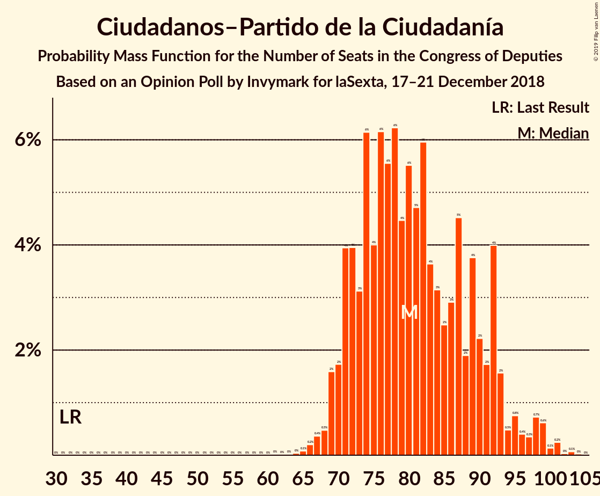
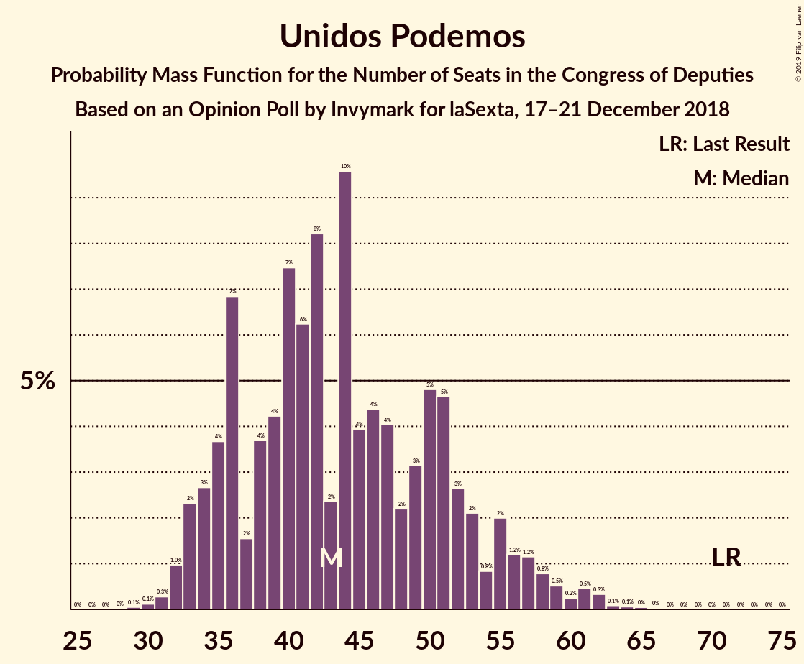
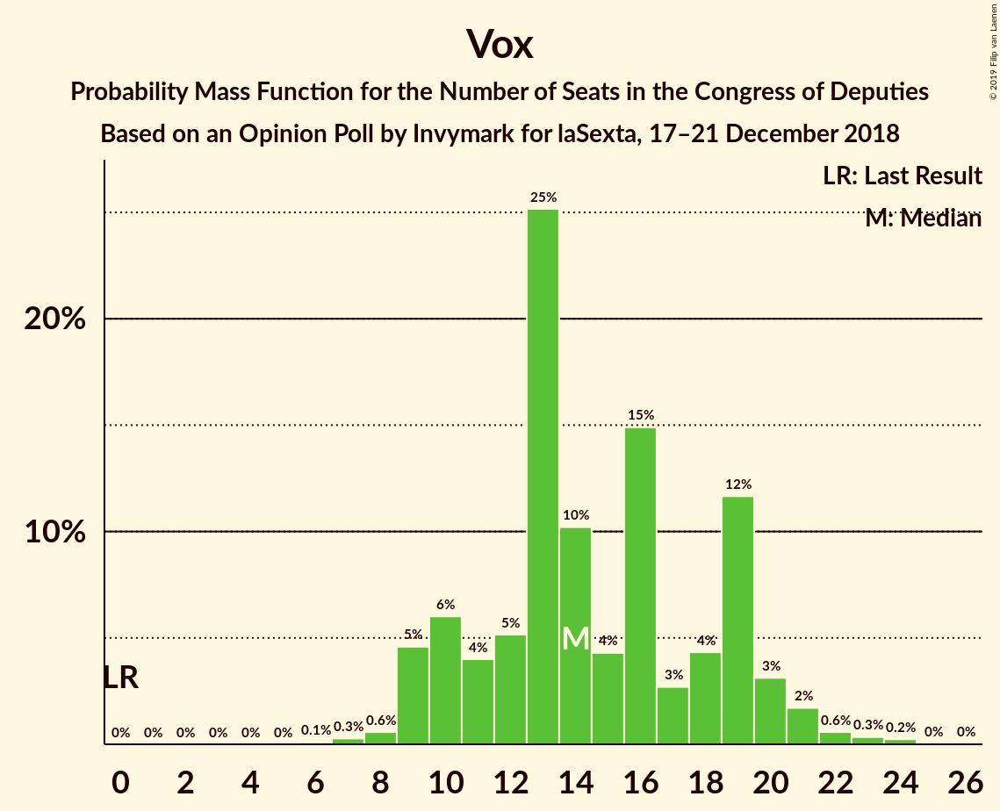
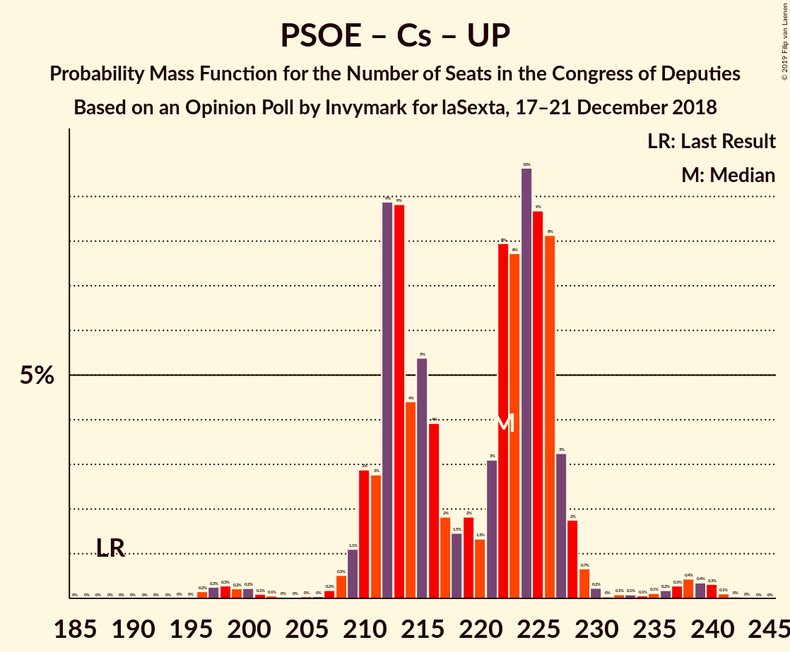

# Opinion Poll by Invymark for laSexta, 17–21 December 2018

<a href="#voting-intentions">Voting Intentions</a> | <a href="#seats">Seats</a> | <a href="#coalitions">Coalitions</a> | <a href="#technical-information">Technical Information</a>

## Voting Intentions

### Confidence Intervals

| Party | Last Result | Poll Result | 80% Confidence Interval | 90% Confidence Interval | 95% Confidence Interval | 99% Confidence Interval |
|:-----:|:-----------:|:-----------:|:-----------------------:|:-----------------------:|:-----------------------:|:-----------------------:|
| Partido Socialista Obrero Español | 22.6% | 23.5% | 22.0–25.1% |21.6–25.6% |21.2–26.0% |20.5–26.8% |
| Ciudadanos–Partido de la Ciudadanía | 13.1% | 22.7% | 21.2–24.3% |20.7–24.7% |20.4–25.1% |19.7–25.9% |
| Partido Popular | 33.0% | 21.8% | 20.3–23.4% |19.9–23.9% |19.6–24.3% |18.9–25.0% |
| Unidos Podemos | 21.2% | 15.2% | 13.9–16.6% |13.5–17.0% |13.2–17.3% |12.7–18.0% |
| Vox | 0.2% | 7.8% | 6.9–8.9% |6.7–9.2% |6.4–9.5% |6.0–10.0% |

*Note:* The poll result column reflects the actual value used in the calculations. Published results may vary slightly, and in addition be rounded to fewer digits.

## Seats

### Confidence Intervals

| Party | Last Result | Median | 80% Confidence Interval | 90% Confidence Interval | 95% Confidence Interval | 99% Confidence Interval |
|:-----:|:-----------:|:------:|:-----------------------:|:-----------------------:|:-----------------------:|:-----------------------:|
| <a href="#partido-socialista-obrero-español">Partido Socialista Obrero Español</a> | 85 | 90 | 90–91 |89–91 |88–91 |84–109 |
| <a href="#ciudadanos–partido-de-la-ciudadanía">Ciudadanos–Partido de la Ciudadanía</a> | 32 | 78 | 78 |78–86 |65–92 |65–92 |
| <a href="#partido-popular">Partido Popular</a> | 137 | 91 | 91–92 |90–92 |74–99 |73–106 |
| <a href="#unidos-podemos">Unidos Podemos</a> | 71 | 44 | 44 |44–54 |44–59 |34–59 |
| <a href="#vox">Vox</a> | 0 | 20 | 19–20 |12–20 |12–20 |8–20 |

### Partido Socialista Obrero Español

*For a full overview of the results for this party, see the [Partido Socialista Obrero Español](party-partidosocialistaobreroespañol.html) page.*

| Number of Seats | Probability | Accumulated | Special Marks |
|:---------------:|:-----------:|:-----------:|:-------------:|
| 82 | 0% | 100% |  |
| 83 | 0.4% | 99.9% |  |
| 84 | 0.4% | 99.6% |  |
| 85 | 0.3% | 99.2% | Last Result |
| 86 | 0% | 98.9% |  |
| 87 | 0.7% | 98.9% |  |
| 88 | 3% | 98% |  |
| 89 | 2% | 96% |  |
| 90 | 71% | 93% | Median |
| 91 | 20% | 22% |  |
| 92 | 0.6% | 2% |  |
| 93 | 0% | 1.3% |  |
| 94 | 0% | 1.3% |  |
| 95 | 0% | 1.3% |  |
| 96 | 0% | 1.3% |  |
| 97 | 0% | 1.3% |  |
| 98 | 0% | 1.3% |  |
| 99 | 0% | 1.3% |  |
| 100 | 0% | 1.3% |  |
| 101 | 0% | 1.3% |  |
| 102 | 0% | 1.3% |  |
| 103 | 0% | 1.3% |  |
| 104 | 0.5% | 1.3% |  |
| 105 | 0.1% | 0.8% |  |
| 106 | 0% | 0.7% |  |
| 107 | 0% | 0.6% |  |
| 108 | 0% | 0.6% |  |
| 109 | 0.1% | 0.6% |  |
| 110 | 0.1% | 0.5% |  |
| 111 | 0.1% | 0.3% |  |
| 112 | 0.2% | 0.2% |  |
| 113 | 0.1% | 0.1% |  |
| 114 | 0% | 0% |  |

### Ciudadanos–Partido de la Ciudadanía

*For a full overview of the results for this party, see the [Ciudadanos–Partido de la Ciudadanía](party-ciudadanos–partidodelaciudadanía.html) page.*

| Number of Seats | Probability | Accumulated | Special Marks |
|:---------------:|:-----------:|:-----------:|:-------------:|
| 32 | 0% | 100% | Last Result |
| 33 | 0% | 100% |  |
| 34 | 0% | 100% |  |
| 35 | 0% | 100% |  |
| 36 | 0% | 100% |  |
| 37 | 0% | 100% |  |
| 38 | 0% | 100% |  |
| 39 | 0% | 100% |  |
| 40 | 0% | 100% |  |
| 41 | 0% | 100% |  |
| 42 | 0% | 100% |  |
| 43 | 0% | 100% |  |
| 44 | 0% | 100% |  |
| 45 | 0% | 100% |  |
| 46 | 0% | 100% |  |
| 47 | 0% | 100% |  |
| 48 | 0% | 100% |  |
| 49 | 0% | 100% |  |
| 50 | 0% | 100% |  |
| 51 | 0% | 100% |  |
| 52 | 0% | 100% |  |
| 53 | 0% | 100% |  |
| 54 | 0% | 100% |  |
| 55 | 0% | 100% |  |
| 56 | 0% | 100% |  |
| 57 | 0% | 100% |  |
| 58 | 0% | 100% |  |
| 59 | 0% | 100% |  |
| 60 | 0% | 100% |  |
| 61 | 0% | 100% |  |
| 62 | 0% | 100% |  |
| 63 | 0% | 100% |  |
| 64 | 0.3% | 100% |  |
| 65 | 3% | 99.6% |  |
| 66 | 0% | 97% |  |
| 67 | 0.3% | 97% |  |
| 68 | 0% | 96% |  |
| 69 | 0.6% | 96% |  |
| 70 | 0% | 96% |  |
| 71 | 0.2% | 96% |  |
| 72 | 0% | 96% |  |
| 73 | 0% | 96% |  |
| 74 | 0% | 96% |  |
| 75 | 0% | 96% |  |
| 76 | 0% | 96% |  |
| 77 | 0% | 96% |  |
| 78 | 90% | 96% | Median |
| 79 | 0% | 5% |  |
| 80 | 0% | 5% |  |
| 81 | 0% | 5% |  |
| 82 | 0% | 5% |  |
| 83 | 0% | 5% |  |
| 84 | 0% | 5% |  |
| 85 | 0% | 5% |  |
| 86 | 0.3% | 5% |  |
| 87 | 0.6% | 5% |  |
| 88 | 0% | 4% |  |
| 89 | 0% | 4% |  |
| 90 | 0% | 4% |  |
| 91 | 0% | 4% |  |
| 92 | 4% | 4% |  |
| 93 | 0% | 0.1% |  |
| 94 | 0% | 0.1% |  |
| 95 | 0% | 0.1% |  |
| 96 | 0% | 0.1% |  |
| 97 | 0% | 0.1% |  |
| 98 | 0% | 0.1% |  |
| 99 | 0% | 0.1% |  |
| 100 | 0% | 0.1% |  |
| 101 | 0% | 0.1% |  |
| 102 | 0% | 0.1% |  |
| 103 | 0% | 0.1% |  |
| 104 | 0% | 0.1% |  |
| 105 | 0% | 0.1% |  |
| 106 | 0% | 0.1% |  |
| 107 | 0% | 0% |  |

### Partido Popular

*For a full overview of the results for this party, see the [Partido Popular](party-partidopopular.html) page.*

| Number of Seats | Probability | Accumulated | Special Marks |
|:---------------:|:-----------:|:-----------:|:-------------:|
| 70 | 0.1% | 100% |  |
| 71 | 0% | 99.9% |  |
| 72 | 0% | 99.9% |  |
| 73 | 1.0% | 99.9% |  |
| 74 | 3% | 99.0% |  |
| 75 | 0% | 96% |  |
| 76 | 0% | 96% |  |
| 77 | 0% | 96% |  |
| 78 | 0% | 96% |  |
| 79 | 0% | 96% |  |
| 80 | 0% | 96% |  |
| 81 | 0% | 96% |  |
| 82 | 0% | 96% |  |
| 83 | 0% | 96% |  |
| 84 | 0.3% | 96% |  |
| 85 | 0.2% | 95% |  |
| 86 | 0% | 95% |  |
| 87 | 0% | 95% |  |
| 88 | 0% | 95% |  |
| 89 | 0% | 95% |  |
| 90 | 2% | 95% |  |
| 91 | 68% | 93% | Median |
| 92 | 20% | 25% |  |
| 93 | 0% | 5% |  |
| 94 | 0% | 5% |  |
| 95 | 0% | 5% |  |
| 96 | 0.1% | 5% |  |
| 97 | 0.5% | 5% |  |
| 98 | 2% | 4% |  |
| 99 | 2% | 3% |  |
| 100 | 0% | 1.2% |  |
| 101 | 0% | 1.2% |  |
| 102 | 0% | 1.2% |  |
| 103 | 0% | 1.1% |  |
| 104 | 0% | 1.1% |  |
| 105 | 0.3% | 1.1% |  |
| 106 | 0.6% | 0.8% |  |
| 107 | 0% | 0.2% |  |
| 108 | 0% | 0.2% |  |
| 109 | 0% | 0.2% |  |
| 110 | 0% | 0.2% |  |
| 111 | 0% | 0.2% |  |
| 112 | 0% | 0.2% |  |
| 113 | 0% | 0.2% |  |
| 114 | 0.1% | 0.2% |  |
| 115 | 0% | 0% |  |
| 116 | 0% | 0% |  |
| 117 | 0% | 0% |  |
| 118 | 0% | 0% |  |
| 119 | 0% | 0% |  |
| 120 | 0% | 0% |  |
| 121 | 0% | 0% |  |
| 122 | 0% | 0% |  |
| 123 | 0% | 0% |  |
| 124 | 0% | 0% |  |
| 125 | 0% | 0% |  |
| 126 | 0% | 0% |  |
| 127 | 0% | 0% |  |
| 128 | 0% | 0% |  |
| 129 | 0% | 0% |  |
| 130 | 0% | 0% |  |
| 131 | 0% | 0% |  |
| 132 | 0% | 0% |  |
| 133 | 0% | 0% |  |
| 134 | 0% | 0% |  |
| 135 | 0% | 0% |  |
| 136 | 0% | 0% |  |
| 137 | 0% | 0% | Last Result |

### Unidos Podemos

*For a full overview of the results for this party, see the [Unidos Podemos](party-unidospodemos.html) page.*

| Number of Seats | Probability | Accumulated | Special Marks |
|:---------------:|:-----------:|:-----------:|:-------------:|
| 30 | 0% | 100% |  |
| 31 | 0% | 99.9% |  |
| 32 | 0% | 99.9% |  |
| 33 | 0% | 99.9% |  |
| 34 | 0.9% | 99.9% |  |
| 35 | 0.2% | 99.0% |  |
| 36 | 0% | 98.8% |  |
| 37 | 0% | 98.7% |  |
| 38 | 0% | 98.7% |  |
| 39 | 0% | 98.7% |  |
| 40 | 0% | 98.7% |  |
| 41 | 0% | 98.7% |  |
| 42 | 0.1% | 98.7% |  |
| 43 | 0.6% | 98.6% |  |
| 44 | 90% | 98% | Median |
| 45 | 0% | 7% |  |
| 46 | 0% | 7% |  |
| 47 | 0% | 7% |  |
| 48 | 0% | 7% |  |
| 49 | 0% | 7% |  |
| 50 | 0.2% | 7% |  |
| 51 | 0.2% | 7% |  |
| 52 | 0% | 7% |  |
| 53 | 2% | 7% |  |
| 54 | 1.0% | 5% |  |
| 55 | 0% | 4% |  |
| 56 | 0% | 4% |  |
| 57 | 0% | 4% |  |
| 58 | 0.2% | 4% |  |
| 59 | 4% | 4% |  |
| 60 | 0% | 0% |  |
| 61 | 0% | 0% |  |
| 62 | 0% | 0% |  |
| 63 | 0% | 0% |  |
| 64 | 0% | 0% |  |
| 65 | 0% | 0% |  |
| 66 | 0% | 0% |  |
| 67 | 0% | 0% |  |
| 68 | 0% | 0% |  |
| 69 | 0% | 0% |  |
| 70 | 0% | 0% |  |
| 71 | 0% | 0% | Last Result |

### Vox

*For a full overview of the results for this party, see the [Vox](party-vox.html) page.*

| Number of Seats | Probability | Accumulated | Special Marks |
|:---------------:|:-----------:|:-----------:|:-------------:|
| 0 | 0% | 100% | Last Result |
| 1 | 0% | 100% |  |
| 2 | 0% | 100% |  |
| 3 | 0% | 100% |  |
| 4 | 0% | 100% |  |
| 5 | 0% | 100% |  |
| 6 | 0% | 100% |  |
| 7 | 0% | 100% |  |
| 8 | 0.6% | 100% |  |
| 9 | 0.2% | 99.3% |  |
| 10 | 0.5% | 99.2% |  |
| 11 | 0% | 98.6% |  |
| 12 | 5% | 98.6% |  |
| 13 | 0% | 94% |  |
| 14 | 0.3% | 94% |  |
| 15 | 0.1% | 94% |  |
| 16 | 0.6% | 94% |  |
| 17 | 2% | 93% |  |
| 18 | 0% | 91% |  |
| 19 | 20% | 91% |  |
| 20 | 70% | 70% | Median |
| 21 | 0.1% | 0.2% |  |
| 22 | 0% | 0% |  |

## Coalitions

### Confidence Intervals

| Coalition | Last Result | Median | Majority? | 80% Confidence Interval | 90% Confidence Interval | 95% Confidence Interval | 99% Confidence Interval |
|:---------:|:-----------:|:------:|:---------:|:-----------------------:|:-----------------------:|:-----------------------:|:-----------------------:|
| Partido Socialista Obrero Español – Ciudadanos–Partido de la Ciudadanía – Partido Popular | 254 | 259 | 100% | 259–261 | 254–261 | 253–261 | 253–277 |
| Partido Socialista Obrero Español – Ciudadanos–Partido de la Ciudadanía – Unidos Podemos | 188 | 212 | 100% | 212–213 | 212–216 | 208–239 | 204–240 |
| Ciudadanos–Partido de la Ciudadanía – Partido Popular – Vox | 169 | 189 | 99.3% | 188–189 | 178–189 | 178–189 | 173–203 |
| Partido Socialista Obrero Español – Partido Popular | 222 | 181 | 96% | 181–183 | 180–187 | 162–189 | 161–203 |
| Partido Socialista Obrero Español – Ciudadanos–Partido de la Ciudadanía | 117 | 168 | 5% | 168–169 | 168–173 | 156–180 | 154–181 |
| Ciudadanos–Partido de la Ciudadanía – Partido Popular | 169 | 169 | 1.2% | 168–170 | 166–170 | 163–170 | 152–192 |
| Partido Socialista Obrero Español – Unidos Podemos | 156 | 134 | 0% | 134–135 | 134–146 | 134–147 | 118–148 |
| Partido Popular – Vox | 137 | 111 | 0% | 111 | 107–111 | 86–115 | 85–117 |
| Partido Popular | 137 | 91 | 0% | 91–92 | 90–92 | 74–99 | 73–106 |
| Partido Socialista Obrero Español | 85 | 90 | 0% | 90–91 | 89–91 | 88–91 | 84–109 |

### Partido Socialista Obrero Español – Ciudadanos–Partido de la Ciudadanía – Partido Popular

| Number of Seats | Probability | Accumulated | Special Marks |
|:---------------:|:-----------:|:-----------:|:-------------:|
| 251 | 0.1% | 100% |  |
| 252 | 0.4% | 99.9% |  |
| 253 | 3% | 99.5% |  |
| 254 | 4% | 97% | Last Result |
| 255 | 0.2% | 93% |  |
| 256 | 0% | 93% |  |
| 257 | 0.1% | 93% |  |
| 258 | 2% | 93% |  |
| 259 | 68% | 91% | Median |
| 260 | 0% | 23% |  |
| 261 | 20% | 23% |  |
| 262 | 0% | 2% |  |
| 263 | 0% | 2% |  |
| 264 | 0.1% | 2% |  |
| 265 | 0.1% | 2% |  |
| 266 | 0% | 2% |  |
| 267 | 0% | 2% |  |
| 268 | 0% | 2% |  |
| 269 | 0% | 2% |  |
| 270 | 0.1% | 2% |  |
| 271 | 0% | 2% |  |
| 272 | 0.6% | 2% |  |
| 273 | 0% | 1.1% |  |
| 274 | 0.1% | 1.1% |  |
| 275 | 0.4% | 1.0% |  |
| 276 | 0% | 0.6% |  |
| 277 | 0.5% | 0.6% |  |
| 278 | 0% | 0.1% |  |
| 279 | 0% | 0.1% |  |
| 280 | 0% | 0% |  |

### Partido Socialista Obrero Español – Ciudadanos–Partido de la Ciudadanía – Unidos Podemos

| Number of Seats | Probability | Accumulated | Special Marks |
|:---------------:|:-----------:|:-----------:|:-------------:|
| 188 | 0% | 100% | Last Result |
| 189 | 0% | 100% |  |
| 190 | 0% | 100% |  |
| 191 | 0% | 100% |  |
| 192 | 0% | 100% |  |
| 193 | 0% | 100% |  |
| 194 | 0% | 100% |  |
| 195 | 0% | 100% |  |
| 196 | 0% | 100% |  |
| 197 | 0% | 100% |  |
| 198 | 0% | 100% |  |
| 199 | 0% | 100% |  |
| 200 | 0.1% | 99.9% |  |
| 201 | 0% | 99.8% |  |
| 202 | 0% | 99.8% |  |
| 203 | 0.1% | 99.8% |  |
| 204 | 0.3% | 99.7% |  |
| 205 | 0.5% | 99.4% |  |
| 206 | 0.1% | 98.9% |  |
| 207 | 0.9% | 98.8% |  |
| 208 | 1.5% | 98% |  |
| 209 | 0% | 96% |  |
| 210 | 0% | 96% |  |
| 211 | 0.7% | 96% |  |
| 212 | 70% | 96% | Median |
| 213 | 21% | 26% |  |
| 214 | 0.1% | 5% |  |
| 215 | 0.1% | 5% |  |
| 216 | 0.5% | 5% |  |
| 217 | 0.1% | 5% |  |
| 218 | 0% | 5% |  |
| 219 | 0% | 5% |  |
| 220 | 0% | 5% |  |
| 221 | 0% | 5% |  |
| 222 | 0% | 5% |  |
| 223 | 0.1% | 5% |  |
| 224 | 0% | 4% |  |
| 225 | 0.2% | 4% |  |
| 226 | 0% | 4% |  |
| 227 | 0% | 4% |  |
| 228 | 0% | 4% |  |
| 229 | 0% | 4% |  |
| 230 | 0% | 4% |  |
| 231 | 0% | 4% |  |
| 232 | 0% | 4% |  |
| 233 | 0% | 4% |  |
| 234 | 0% | 4% |  |
| 235 | 0% | 4% |  |
| 236 | 0% | 4% |  |
| 237 | 0% | 4% |  |
| 238 | 0.6% | 4% |  |
| 239 | 3% | 4% |  |
| 240 | 0.9% | 0.9% |  |
| 241 | 0% | 0% |  |

### Ciudadanos–Partido de la Ciudadanía – Partido Popular – Vox

| Number of Seats | Probability | Accumulated | Special Marks |
|:---------------:|:-----------:|:-----------:|:-------------:|
| 162 | 0.2% | 100% |  |
| 163 | 0.1% | 99.8% |  |
| 164 | 0% | 99.6% |  |
| 165 | 0% | 99.6% |  |
| 166 | 0% | 99.6% |  |
| 167 | 0% | 99.6% |  |
| 168 | 0% | 99.6% |  |
| 169 | 0% | 99.6% | Last Result |
| 170 | 0% | 99.6% |  |
| 171 | 0% | 99.6% |  |
| 172 | 0.1% | 99.6% |  |
| 173 | 0.1% | 99.6% |  |
| 174 | 0% | 99.4% |  |
| 175 | 0.1% | 99.4% |  |
| 176 | 0.6% | 99.3% | Majority |
| 177 | 0.9% | 98.7% |  |
| 178 | 4% | 98% |  |
| 179 | 0.1% | 94% |  |
| 180 | 1.4% | 94% |  |
| 181 | 1.0% | 93% |  |
| 182 | 0% | 92% |  |
| 183 | 0% | 92% |  |
| 184 | 0% | 92% |  |
| 185 | 0% | 92% |  |
| 186 | 0% | 92% |  |
| 187 | 0% | 92% |  |
| 188 | 2% | 92% |  |
| 189 | 89% | 90% | Median |
| 190 | 0% | 1.2% |  |
| 191 | 0% | 1.2% |  |
| 192 | 0% | 1.2% |  |
| 193 | 0% | 1.2% |  |
| 194 | 0.1% | 1.2% |  |
| 195 | 0% | 1.0% |  |
| 196 | 0% | 1.0% |  |
| 197 | 0% | 1.0% |  |
| 198 | 0% | 1.0% |  |
| 199 | 0% | 1.0% |  |
| 200 | 0% | 1.0% |  |
| 201 | 0% | 1.0% |  |
| 202 | 0.2% | 1.0% |  |
| 203 | 0.3% | 0.8% |  |
| 204 | 0.4% | 0.4% |  |
| 205 | 0% | 0.1% |  |
| 206 | 0% | 0% |  |

### Partido Socialista Obrero Español – Partido Popular

| Number of Seats | Probability | Accumulated | Special Marks |
|:---------------:|:-----------:|:-----------:|:-------------:|
| 161 | 0.6% | 100% |  |
| 162 | 3% | 99.4% |  |
| 163 | 0.1% | 96% |  |
| 164 | 0% | 96% |  |
| 165 | 0% | 96% |  |
| 166 | 0% | 96% |  |
| 167 | 0% | 96% |  |
| 168 | 0% | 96% |  |
| 169 | 0% | 96% |  |
| 170 | 0% | 96% |  |
| 171 | 0% | 96% |  |
| 172 | 0% | 96% |  |
| 173 | 0% | 96% |  |
| 174 | 0% | 96% |  |
| 175 | 0% | 96% |  |
| 176 | 0% | 96% | Majority |
| 177 | 0% | 96% |  |
| 178 | 0% | 96% |  |
| 179 | 0% | 96% |  |
| 180 | 2% | 96% |  |
| 181 | 68% | 94% | Median |
| 182 | 0.1% | 26% |  |
| 183 | 20% | 26% |  |
| 184 | 0% | 5% |  |
| 185 | 0% | 5% |  |
| 186 | 0.1% | 5% |  |
| 187 | 0.4% | 5% |  |
| 188 | 2% | 5% |  |
| 189 | 0.6% | 3% |  |
| 190 | 0.3% | 2% |  |
| 191 | 0.2% | 2% |  |
| 192 | 0% | 1.4% |  |
| 193 | 0.1% | 1.4% |  |
| 194 | 0.1% | 1.3% |  |
| 195 | 0.1% | 1.1% |  |
| 196 | 0% | 1.0% |  |
| 197 | 0.1% | 1.0% |  |
| 198 | 0.1% | 0.9% |  |
| 199 | 0.2% | 0.9% |  |
| 200 | 0% | 0.7% |  |
| 201 | 0% | 0.7% |  |
| 202 | 0% | 0.7% |  |
| 203 | 0.6% | 0.7% |  |
| 204 | 0% | 0% |  |
| 205 | 0% | 0% |  |
| 206 | 0% | 0% |  |
| 207 | 0% | 0% |  |
| 208 | 0% | 0% |  |
| 209 | 0% | 0% |  |
| 210 | 0% | 0% |  |
| 211 | 0% | 0% |  |
| 212 | 0% | 0% |  |
| 213 | 0% | 0% |  |
| 214 | 0% | 0% |  |
| 215 | 0% | 0% |  |
| 216 | 0% | 0% |  |
| 217 | 0% | 0% |  |
| 218 | 0% | 0% |  |
| 219 | 0% | 0% |  |
| 220 | 0% | 0% |  |
| 221 | 0% | 0% |  |
| 222 | 0% | 0% | Last Result |

### Partido Socialista Obrero Español – Ciudadanos–Partido de la Ciudadanía

| Number of Seats | Probability | Accumulated | Special Marks |
|:---------------:|:-----------:|:-----------:|:-------------:|
| 117 | 0% | 100% | Last Result |
| 118 | 0% | 100% |  |
| 119 | 0% | 100% |  |
| 120 | 0% | 100% |  |
| 121 | 0% | 100% |  |
| 122 | 0% | 100% |  |
| 123 | 0% | 100% |  |
| 124 | 0% | 100% |  |
| 125 | 0% | 100% |  |
| 126 | 0% | 100% |  |
| 127 | 0% | 100% |  |
| 128 | 0% | 100% |  |
| 129 | 0% | 100% |  |
| 130 | 0% | 100% |  |
| 131 | 0% | 100% |  |
| 132 | 0% | 100% |  |
| 133 | 0% | 100% |  |
| 134 | 0% | 100% |  |
| 135 | 0% | 100% |  |
| 136 | 0% | 100% |  |
| 137 | 0% | 100% |  |
| 138 | 0% | 100% |  |
| 139 | 0% | 100% |  |
| 140 | 0% | 100% |  |
| 141 | 0% | 100% |  |
| 142 | 0% | 100% |  |
| 143 | 0% | 100% |  |
| 144 | 0% | 100% |  |
| 145 | 0% | 100% |  |
| 146 | 0% | 100% |  |
| 147 | 0% | 100% |  |
| 148 | 0% | 100% |  |
| 149 | 0% | 100% |  |
| 150 | 0% | 100% |  |
| 151 | 0% | 100% |  |
| 152 | 0.1% | 100% |  |
| 153 | 0% | 99.9% |  |
| 154 | 1.3% | 99.9% |  |
| 155 | 1.1% | 98.6% |  |
| 156 | 0.1% | 98% |  |
| 157 | 0.5% | 97% |  |
| 158 | 0% | 97% |  |
| 159 | 0.1% | 97% |  |
| 160 | 0% | 97% |  |
| 161 | 0% | 97% |  |
| 162 | 0% | 97% |  |
| 163 | 0% | 97% |  |
| 164 | 0% | 97% |  |
| 165 | 0% | 97% |  |
| 166 | 0% | 97% |  |
| 167 | 0.2% | 97% |  |
| 168 | 70% | 97% | Median |
| 169 | 21% | 27% |  |
| 170 | 0.3% | 6% |  |
| 171 | 0.5% | 6% |  |
| 172 | 0% | 5% |  |
| 173 | 0.6% | 5% |  |
| 174 | 0.2% | 5% |  |
| 175 | 0.1% | 5% |  |
| 176 | 0% | 5% | Majority |
| 177 | 0% | 4% |  |
| 178 | 0% | 4% |  |
| 179 | 0.7% | 4% |  |
| 180 | 3% | 4% |  |
| 181 | 0.8% | 1.1% |  |
| 182 | 0.1% | 0.3% |  |
| 183 | 0% | 0.2% |  |
| 184 | 0% | 0.2% |  |
| 185 | 0% | 0.2% |  |
| 186 | 0% | 0.2% |  |
| 187 | 0% | 0.2% |  |
| 188 | 0% | 0.2% |  |
| 189 | 0% | 0.2% |  |
| 190 | 0% | 0.2% |  |
| 191 | 0% | 0.1% |  |
| 192 | 0% | 0.1% |  |
| 193 | 0% | 0.1% |  |
| 194 | 0.1% | 0.1% |  |
| 195 | 0% | 0.1% |  |
| 196 | 0% | 0.1% |  |
| 197 | 0% | 0.1% |  |
| 198 | 0% | 0.1% |  |
| 199 | 0% | 0.1% |  |
| 200 | 0% | 0.1% |  |
| 201 | 0% | 0.1% |  |
| 202 | 0% | 0.1% |  |
| 203 | 0% | 0.1% |  |
| 204 | 0.1% | 0.1% |  |
| 205 | 0% | 0% |  |

### Ciudadanos–Partido de la Ciudadanía – Partido Popular

| Number of Seats | Probability | Accumulated | Special Marks |
|:---------------:|:-----------:|:-----------:|:-------------:|
| 147 | 0.1% | 100% |  |
| 148 | 0.3% | 99.9% |  |
| 149 | 0% | 99.6% |  |
| 150 | 0% | 99.6% |  |
| 151 | 0% | 99.6% |  |
| 152 | 0.2% | 99.6% |  |
| 153 | 0% | 99.5% |  |
| 154 | 0% | 99.4% |  |
| 155 | 0% | 99.4% |  |
| 156 | 0% | 99.4% |  |
| 157 | 0% | 99.4% |  |
| 158 | 0% | 99.4% |  |
| 159 | 0% | 99.4% |  |
| 160 | 0% | 99.4% |  |
| 161 | 0% | 99.4% |  |
| 162 | 0.6% | 99.4% |  |
| 163 | 2% | 98.9% |  |
| 164 | 1.0% | 97% |  |
| 165 | 0.9% | 96% |  |
| 166 | 3% | 95% |  |
| 167 | 0.1% | 92% |  |
| 168 | 2% | 92% |  |
| 169 | 68% | 90% | Last Result, Median |
| 170 | 20% | 22% |  |
| 171 | 0% | 1.3% |  |
| 172 | 0% | 1.3% |  |
| 173 | 0% | 1.3% |  |
| 174 | 0% | 1.2% |  |
| 175 | 0% | 1.2% |  |
| 176 | 0% | 1.2% | Majority |
| 177 | 0% | 1.2% |  |
| 178 | 0% | 1.2% |  |
| 179 | 0% | 1.2% |  |
| 180 | 0% | 1.2% |  |
| 181 | 0% | 1.1% |  |
| 182 | 0% | 1.1% |  |
| 183 | 0% | 1.1% |  |
| 184 | 0% | 1.1% |  |
| 185 | 0.2% | 1.1% |  |
| 186 | 0% | 1.0% |  |
| 187 | 0% | 1.0% |  |
| 188 | 0% | 1.0% |  |
| 189 | 0% | 1.0% |  |
| 190 | 0% | 1.0% |  |
| 191 | 0% | 0.9% |  |
| 192 | 0.6% | 0.9% |  |
| 193 | 0.4% | 0.4% |  |
| 194 | 0% | 0% |  |

### Partido Socialista Obrero Español – Unidos Podemos

| Number of Seats | Probability | Accumulated | Special Marks |
|:---------------:|:-----------:|:-----------:|:-------------:|
| 117 | 0.4% | 100% |  |
| 118 | 0.3% | 99.6% |  |
| 119 | 0.2% | 99.2% |  |
| 120 | 0% | 99.0% |  |
| 121 | 0% | 99.0% |  |
| 122 | 0% | 99.0% |  |
| 123 | 0% | 99.0% |  |
| 124 | 0% | 99.0% |  |
| 125 | 0% | 99.0% |  |
| 126 | 0% | 99.0% |  |
| 127 | 0% | 99.0% |  |
| 128 | 0% | 99.0% |  |
| 129 | 0.1% | 99.0% |  |
| 130 | 0% | 98.8% |  |
| 131 | 0% | 98.8% |  |
| 132 | 0% | 98.8% |  |
| 133 | 0.2% | 98.8% |  |
| 134 | 70% | 98.6% | Median |
| 135 | 20% | 29% |  |
| 136 | 0% | 8% |  |
| 137 | 0% | 8% |  |
| 138 | 0% | 8% |  |
| 139 | 0% | 8% |  |
| 140 | 0% | 8% |  |
| 141 | 0.1% | 8% |  |
| 142 | 0.9% | 8% |  |
| 143 | 1.4% | 7% |  |
| 144 | 0% | 6% |  |
| 145 | 0% | 6% |  |
| 146 | 1.1% | 6% |  |
| 147 | 3% | 5% |  |
| 148 | 1.1% | 2% |  |
| 149 | 0% | 0.4% |  |
| 150 | 0% | 0.4% |  |
| 151 | 0% | 0.4% |  |
| 152 | 0% | 0.4% |  |
| 153 | 0% | 0.4% |  |
| 154 | 0% | 0.4% |  |
| 155 | 0% | 0.4% |  |
| 156 | 0% | 0.4% | Last Result |
| 157 | 0% | 0.4% |  |
| 158 | 0% | 0.4% |  |
| 159 | 0.1% | 0.4% |  |
| 160 | 0.1% | 0.3% |  |
| 161 | 0.2% | 0.2% |  |
| 162 | 0% | 0% |  |

### Partido Popular – Vox

| Number of Seats | Probability | Accumulated | Special Marks |
|:---------------:|:-----------:|:-----------:|:-------------:|
| 84 | 0.1% | 100% |  |
| 85 | 0.9% | 99.9% |  |
| 86 | 3% | 99.0% |  |
| 87 | 0% | 96% |  |
| 88 | 0% | 96% |  |
| 89 | 0% | 96% |  |
| 90 | 0% | 96% |  |
| 91 | 0% | 96% |  |
| 92 | 0% | 96% |  |
| 93 | 0% | 96% |  |
| 94 | 0% | 96% |  |
| 95 | 0% | 96% |  |
| 96 | 0% | 96% |  |
| 97 | 0% | 96% |  |
| 98 | 0.2% | 96% |  |
| 99 | 0.2% | 96% |  |
| 100 | 0% | 95% |  |
| 101 | 0% | 95% |  |
| 102 | 0% | 95% |  |
| 103 | 0% | 95% |  |
| 104 | 0% | 95% |  |
| 105 | 0.1% | 95% |  |
| 106 | 0.2% | 95% |  |
| 107 | 0.5% | 95% |  |
| 108 | 0% | 95% |  |
| 109 | 0% | 95% |  |
| 110 | 2% | 95% |  |
| 111 | 89% | 93% | Median |
| 112 | 0.1% | 4% |  |
| 113 | 0.5% | 4% |  |
| 114 | 0% | 4% |  |
| 115 | 1.4% | 4% |  |
| 116 | 2% | 2% |  |
| 117 | 0.3% | 0.6% |  |
| 118 | 0.1% | 0.3% |  |
| 119 | 0% | 0.2% |  |
| 120 | 0% | 0.2% |  |
| 121 | 0% | 0.2% |  |
| 122 | 0% | 0.2% |  |
| 123 | 0.1% | 0.2% |  |
| 124 | 0% | 0.1% |  |
| 125 | 0% | 0% |  |
| 126 | 0% | 0% |  |
| 127 | 0% | 0% |  |
| 128 | 0% | 0% |  |
| 129 | 0% | 0% |  |
| 130 | 0% | 0% |  |
| 131 | 0% | 0% |  |
| 132 | 0% | 0% |  |
| 133 | 0% | 0% |  |
| 134 | 0% | 0% |  |
| 135 | 0% | 0% |  |
| 136 | 0% | 0% |  |
| 137 | 0% | 0% | Last Result |

### Partido Popular

| Number of Seats | Probability | Accumulated | Special Marks |
|:---------------:|:-----------:|:-----------:|:-------------:|
| 70 | 0.1% | 100% |  |
| 71 | 0% | 99.9% |  |
| 72 | 0% | 99.9% |  |
| 73 | 1.0% | 99.9% |  |
| 74 | 3% | 99.0% |  |
| 75 | 0% | 96% |  |
| 76 | 0% | 96% |  |
| 77 | 0% | 96% |  |
| 78 | 0% | 96% |  |
| 79 | 0% | 96% |  |
| 80 | 0% | 96% |  |
| 81 | 0% | 96% |  |
| 82 | 0% | 96% |  |
| 83 | 0% | 96% |  |
| 84 | 0.3% | 96% |  |
| 85 | 0.2% | 95% |  |
| 86 | 0% | 95% |  |
| 87 | 0% | 95% |  |
| 88 | 0% | 95% |  |
| 89 | 0% | 95% |  |
| 90 | 2% | 95% |  |
| 91 | 68% | 93% | Median |
| 92 | 20% | 25% |  |
| 93 | 0% | 5% |  |
| 94 | 0% | 5% |  |
| 95 | 0% | 5% |  |
| 96 | 0.1% | 5% |  |
| 97 | 0.5% | 5% |  |
| 98 | 2% | 4% |  |
| 99 | 2% | 3% |  |
| 100 | 0% | 1.2% |  |
| 101 | 0% | 1.2% |  |
| 102 | 0% | 1.2% |  |
| 103 | 0% | 1.1% |  |
| 104 | 0% | 1.1% |  |
| 105 | 0.3% | 1.1% |  |
| 106 | 0.6% | 0.8% |  |
| 107 | 0% | 0.2% |  |
| 108 | 0% | 0.2% |  |
| 109 | 0% | 0.2% |  |
| 110 | 0% | 0.2% |  |
| 111 | 0% | 0.2% |  |
| 112 | 0% | 0.2% |  |
| 113 | 0% | 0.2% |  |
| 114 | 0.1% | 0.2% |  |
| 115 | 0% | 0% |  |
| 116 | 0% | 0% |  |
| 117 | 0% | 0% |  |
| 118 | 0% | 0% |  |
| 119 | 0% | 0% |  |
| 120 | 0% | 0% |  |
| 121 | 0% | 0% |  |
| 122 | 0% | 0% |  |
| 123 | 0% | 0% |  |
| 124 | 0% | 0% |  |
| 125 | 0% | 0% |  |
| 126 | 0% | 0% |  |
| 127 | 0% | 0% |  |
| 128 | 0% | 0% |  |
| 129 | 0% | 0% |  |
| 130 | 0% | 0% |  |
| 131 | 0% | 0% |  |
| 132 | 0% | 0% |  |
| 133 | 0% | 0% |  |
| 134 | 0% | 0% |  |
| 135 | 0% | 0% |  |
| 136 | 0% | 0% |  |
| 137 | 0% | 0% | Last Result |

### Partido Socialista Obrero Español

| Number of Seats | Probability | Accumulated | Special Marks |
|:---------------:|:-----------:|:-----------:|:-------------:|
| 82 | 0% | 100% |  |
| 83 | 0.4% | 99.9% |  |
| 84 | 0.4% | 99.6% |  |
| 85 | 0.3% | 99.2% | Last Result |
| 86 | 0% | 98.9% |  |
| 87 | 0.7% | 98.9% |  |
| 88 | 3% | 98% |  |
| 89 | 2% | 96% |  |
| 90 | 71% | 93% | Median |
| 91 | 20% | 22% |  |
| 92 | 0.6% | 2% |  |
| 93 | 0% | 1.3% |  |
| 94 | 0% | 1.3% |  |
| 95 | 0% | 1.3% |  |
| 96 | 0% | 1.3% |  |
| 97 | 0% | 1.3% |  |
| 98 | 0% | 1.3% |  |
| 99 | 0% | 1.3% |  |
| 100 | 0% | 1.3% |  |
| 101 | 0% | 1.3% |  |
| 102 | 0% | 1.3% |  |
| 103 | 0% | 1.3% |  |
| 104 | 0.5% | 1.3% |  |
| 105 | 0.1% | 0.8% |  |
| 106 | 0% | 0.7% |  |
| 107 | 0% | 0.6% |  |
| 108 | 0% | 0.6% |  |
| 109 | 0.1% | 0.6% |  |
| 110 | 0.1% | 0.5% |  |
| 111 | 0.1% | 0.3% |  |
| 112 | 0.2% | 0.2% |  |
| 113 | 0.1% | 0.1% |  |
| 114 | 0% | 0% |  |

## Technical Information

### Opinion Poll

+ **Polling firm:** Invymark
+ **Commissioner(s):** laSexta
+ **Fieldwork period:** 17–21 December 2018

### Calculations

+ **Sample size:** 1200
+ **Simulations done:** 1,024
+ **Error estimate:** 3.00%

