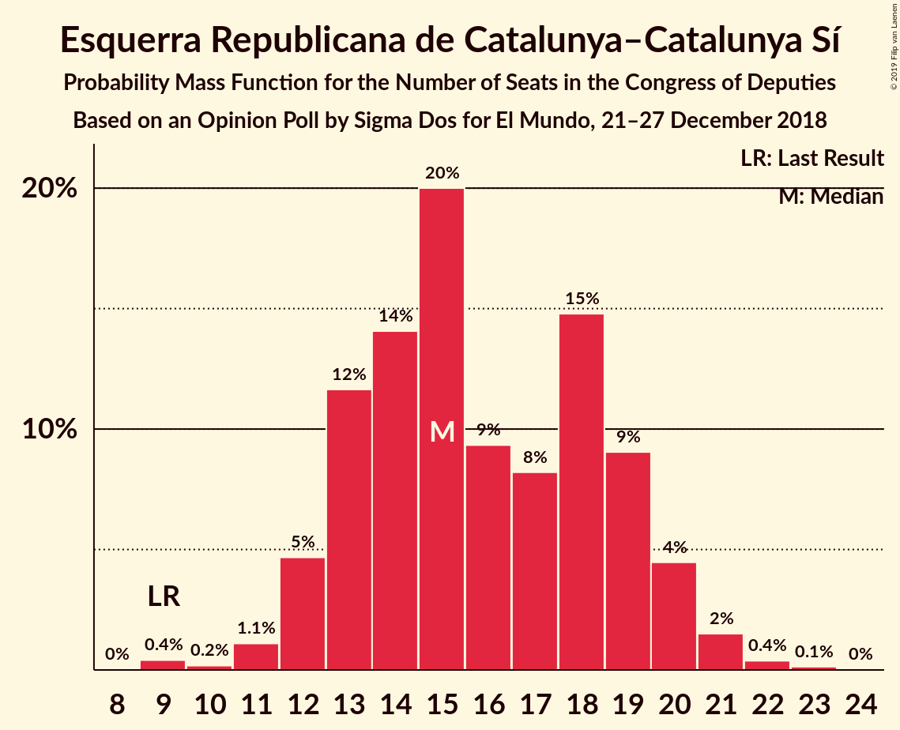
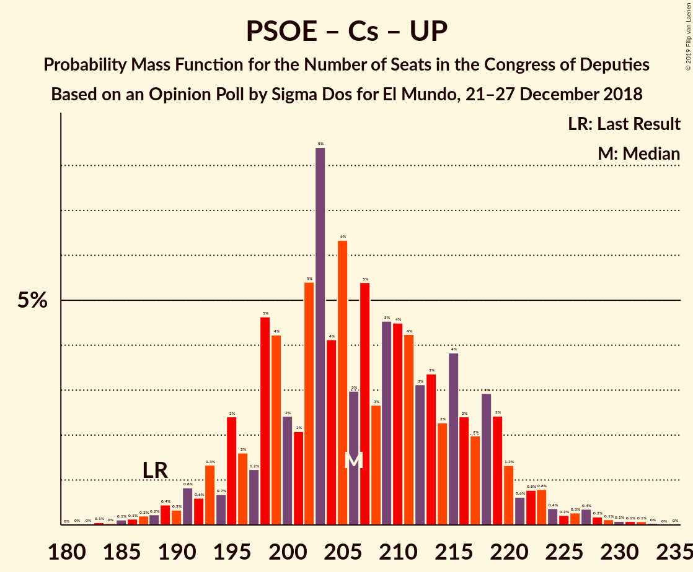
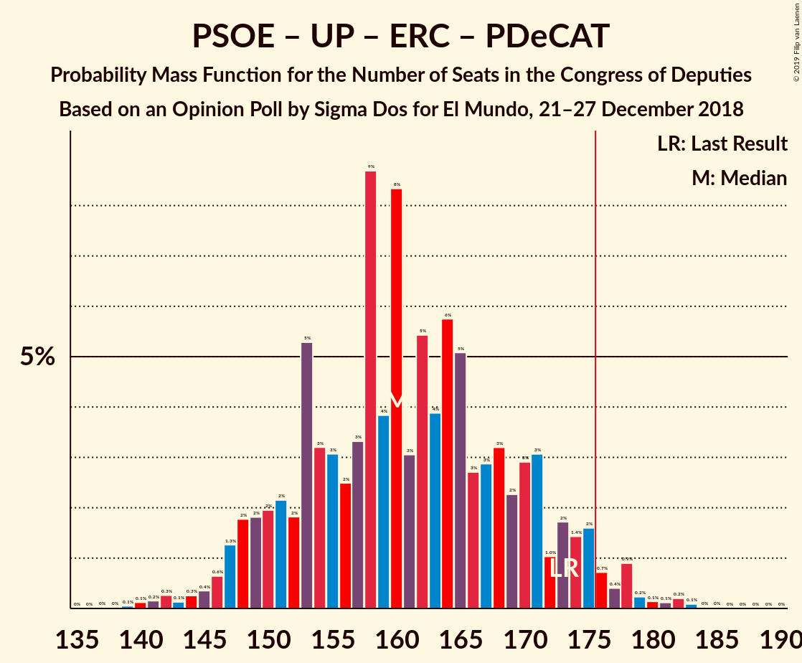

# Opinion Poll by Sigma Dos for El Mundo, 21–27 December 2018

<a href="#voting-intentions">Voting Intentions</a> | <a href="#seats">Seats</a> | <a href="#coalitions">Coalitions</a> | <a href="#technical-information">Technical Information</a>

## Voting Intentions

### Confidence Intervals

| Party | Last Result | Poll Result | 80% Confidence Interval | 90% Confidence Interval | 95% Confidence Interval | 99% Confidence Interval |
|:-----:|:-----------:|:-----------:|:-----------------------:|:-----------------------:|:-----------------------:|:-----------------------:|
| Partido Socialista Obrero Español | 22.6% | 22.6% | 21.0–24.4% |20.5–24.9% |20.1–25.3% |19.3–26.2% |
| Partido Popular | 33.0% | 19.2% | 17.7–20.9% |17.2–21.4% |16.9–21.8% |16.2–22.6% |
| Ciudadanos–Partido de la Ciudadanía | 13.1% | 18.8% | 17.3–20.5% |16.9–20.9% |16.5–21.4% |15.8–22.2% |
| Unidos Podemos | 21.2% | 15.8% | 14.4–17.4% |14.0–17.8% |13.7–18.2% |13.0–19.0% |
| Vox | 0.2% | 12.9% | 11.6–14.4% |11.3–14.8% |11.0–15.1% |10.4–15.9% |
| Esquerra Republicana de Catalunya–Catalunya Sí | 2.7% | 3.6% | 2.9–4.5% |2.8–4.7% |2.6–5.0% |2.3–5.4% |
| Euzko Alderdi Jeltzalea/Partido Nacionalista Vasco | 1.2% | 1.2% | 0.9–1.8% |0.8–1.9% |0.7–2.1% |0.5–2.4% |
| Partit Demòcrata Europeu Català | 2.0% | 1.0% | 0.7–1.5% |0.6–1.7% |0.5–1.8% |0.4–2.1% |

*Note:* The poll result column reflects the actual value used in the calculations. Published results may vary slightly, and in addition be rounded to fewer digits.

## Seats

### Confidence Intervals

| Party | Last Result | Median | 80% Confidence Interval | 90% Confidence Interval | 95% Confidence Interval | 99% Confidence Interval |
|:-----:|:-----------:|:------:|:-----------------------:|:-----------------------:|:-----------------------:|:-----------------------:|
| <a href="#partido-socialista-obrero-español">Partido Socialista Obrero Español</a> | 85 | 92 | 84–102 |82–105 |80–109 |78–113 |
| <a href="#partido-popular">Partido Popular</a> | 137 | 75 | 68–85 |66–89 |64–90 |59–95 |
| <a href="#ciudadanos–partido-de-la-ciudadanía">Ciudadanos–Partido de la Ciudadanía</a> | 32 | 65 | 57–71 |55–74 |55–76 |52–80 |
| <a href="#unidos-podemos">Unidos Podemos</a> | 71 | 50 | 41–59 |39–61 |37–65 |35–68 |
| <a href="#vox">Vox</a> | 0 | 37 | 28–46 |27–48 |27–51 |25–52 |
| <a href="#esquerra-republicana-de-catalunya–catalunya-sí">Esquerra Republicana de Catalunya–Catalunya Sí</a> | 9 | 15 | 13–19 |12–20 |11–20 |10–21 |
| <a href="#euzko-alderdi-jeltzalea/partido-nacionalista-vasco">Euzko Alderdi Jeltzalea/Partido Nacionalista Vasco</a> | 5 | 6 | 3–8 |3–9 |3–9 |3–10 |
| <a href="#partit-demòcrata-europeu-català">Partit Demòcrata Europeu Català</a> | 8 | 4 | 1–6 |1–6 |1–7 |0–8 |

### Partido Socialista Obrero Español

*For a full overview of the results for this party, see the [Partido Socialista Obrero Español](party-partidosocialistaobreroespañol.html) page.*

| Number of Seats | Probability | Accumulated | Special Marks |
|:---------------:|:-----------:|:-----------:|:-------------:|
| 73 | 0% | 100% |  |
| 74 | 0% | 99.9% |  |
| 75 | 0% | 99.9% |  |
| 76 | 0% | 99.9% |  |
| 77 | 0.3% | 99.8% |  |
| 78 | 0.4% | 99.5% |  |
| 79 | 0.6% | 99.1% |  |
| 80 | 1.2% | 98% |  |
| 81 | 1.4% | 97% |  |
| 82 | 2% | 96% |  |
| 83 | 3% | 94% |  |
| 84 | 6% | 91% |  |
| 85 | 1.2% | 85% | Last Result |
| 86 | 4% | 84% |  |
| 87 | 5% | 80% |  |
| 88 | 5% | 75% |  |
| 89 | 5% | 70% |  |
| 90 | 8% | 65% |  |
| 91 | 4% | 56% |  |
| 92 | 7% | 52% | Median |
| 93 | 2% | 45% |  |
| 94 | 8% | 44% |  |
| 95 | 3% | 36% |  |
| 96 | 4% | 33% |  |
| 97 | 8% | 28% |  |
| 98 | 5% | 20% |  |
| 99 | 1.2% | 16% |  |
| 100 | 1.3% | 14% |  |
| 101 | 1.5% | 13% |  |
| 102 | 2% | 12% |  |
| 103 | 0.8% | 9% |  |
| 104 | 1.0% | 8% |  |
| 105 | 3% | 7% |  |
| 106 | 0.7% | 4% |  |
| 107 | 0.5% | 4% |  |
| 108 | 0.4% | 3% |  |
| 109 | 0.8% | 3% |  |
| 110 | 0.3% | 2% |  |
| 111 | 0.4% | 2% |  |
| 112 | 0.5% | 1.2% |  |
| 113 | 0.3% | 0.7% |  |
| 114 | 0.1% | 0.3% |  |
| 115 | 0.1% | 0.3% |  |
| 116 | 0.1% | 0.2% |  |
| 117 | 0.1% | 0.1% |  |
| 118 | 0% | 0% |  |

### Partido Popular

*For a full overview of the results for this party, see the [Partido Popular](party-partidopopular.html) page.*

| Number of Seats | Probability | Accumulated | Special Marks |
|:---------------:|:-----------:|:-----------:|:-------------:|
| 54 | 0% | 100% |  |
| 55 | 0% | 99.9% |  |
| 56 | 0% | 99.9% |  |
| 57 | 0.1% | 99.9% |  |
| 58 | 0.1% | 99.8% |  |
| 59 | 0.3% | 99.8% |  |
| 60 | 0.1% | 99.5% |  |
| 61 | 0.3% | 99.4% |  |
| 62 | 0.6% | 99.1% |  |
| 63 | 0.5% | 98% |  |
| 64 | 1.3% | 98% |  |
| 65 | 0.8% | 97% |  |
| 66 | 2% | 96% |  |
| 67 | 3% | 94% |  |
| 68 | 3% | 91% |  |
| 69 | 4% | 87% |  |
| 70 | 7% | 84% |  |
| 71 | 2% | 77% |  |
| 72 | 7% | 75% |  |
| 73 | 7% | 68% |  |
| 74 | 4% | 61% |  |
| 75 | 11% | 57% | Median |
| 76 | 3% | 47% |  |
| 77 | 5% | 44% |  |
| 78 | 4% | 39% |  |
| 79 | 4% | 35% |  |
| 80 | 2% | 31% |  |
| 81 | 4% | 29% |  |
| 82 | 6% | 25% |  |
| 83 | 2% | 19% |  |
| 84 | 3% | 16% |  |
| 85 | 4% | 14% |  |
| 86 | 0.6% | 10% |  |
| 87 | 1.1% | 9% |  |
| 88 | 3% | 8% |  |
| 89 | 2% | 5% |  |
| 90 | 1.3% | 4% |  |
| 91 | 0.5% | 2% |  |
| 92 | 0.6% | 2% |  |
| 93 | 0.3% | 1.3% |  |
| 94 | 0.4% | 1.0% |  |
| 95 | 0.2% | 0.6% |  |
| 96 | 0.2% | 0.4% |  |
| 97 | 0% | 0.3% |  |
| 98 | 0% | 0.2% |  |
| 99 | 0.1% | 0.2% |  |
| 100 | 0% | 0.2% |  |
| 101 | 0.1% | 0.2% |  |
| 102 | 0% | 0% |  |
| 103 | 0% | 0% |  |
| 104 | 0% | 0% |  |
| 105 | 0% | 0% |  |
| 106 | 0% | 0% |  |
| 107 | 0% | 0% |  |
| 108 | 0% | 0% |  |
| 109 | 0% | 0% |  |
| 110 | 0% | 0% |  |
| 111 | 0% | 0% |  |
| 112 | 0% | 0% |  |
| 113 | 0% | 0% |  |
| 114 | 0% | 0% |  |
| 115 | 0% | 0% |  |
| 116 | 0% | 0% |  |
| 117 | 0% | 0% |  |
| 118 | 0% | 0% |  |
| 119 | 0% | 0% |  |
| 120 | 0% | 0% |  |
| 121 | 0% | 0% |  |
| 122 | 0% | 0% |  |
| 123 | 0% | 0% |  |
| 124 | 0% | 0% |  |
| 125 | 0% | 0% |  |
| 126 | 0% | 0% |  |
| 127 | 0% | 0% |  |
| 128 | 0% | 0% |  |
| 129 | 0% | 0% |  |
| 130 | 0% | 0% |  |
| 131 | 0% | 0% |  |
| 132 | 0% | 0% |  |
| 133 | 0% | 0% |  |
| 134 | 0% | 0% |  |
| 135 | 0% | 0% |  |
| 136 | 0% | 0% |  |
| 137 | 0% | 0% | Last Result |

### Ciudadanos–Partido de la Ciudadanía

*For a full overview of the results for this party, see the [Ciudadanos–Partido de la Ciudadanía](party-ciudadanos–partidodelaciudadanía.html) page.*

| Number of Seats | Probability | Accumulated | Special Marks |
|:---------------:|:-----------:|:-----------:|:-------------:|
| 32 | 0% | 100% | Last Result |
| 33 | 0% | 100% |  |
| 34 | 0% | 100% |  |
| 35 | 0% | 100% |  |
| 36 | 0% | 100% |  |
| 37 | 0% | 100% |  |
| 38 | 0% | 100% |  |
| 39 | 0% | 100% |  |
| 40 | 0% | 100% |  |
| 41 | 0% | 100% |  |
| 42 | 0% | 100% |  |
| 43 | 0% | 100% |  |
| 44 | 0% | 100% |  |
| 45 | 0% | 100% |  |
| 46 | 0% | 100% |  |
| 47 | 0% | 100% |  |
| 48 | 0% | 100% |  |
| 49 | 0% | 100% |  |
| 50 | 0.1% | 99.9% |  |
| 51 | 0.2% | 99.9% |  |
| 52 | 0.2% | 99.7% |  |
| 53 | 0.5% | 99.5% |  |
| 54 | 1.4% | 99.0% |  |
| 55 | 3% | 98% |  |
| 56 | 3% | 94% |  |
| 57 | 2% | 92% |  |
| 58 | 2% | 89% |  |
| 59 | 2% | 88% |  |
| 60 | 3% | 86% |  |
| 61 | 8% | 83% |  |
| 62 | 5% | 75% |  |
| 63 | 6% | 70% |  |
| 64 | 7% | 64% |  |
| 65 | 12% | 57% | Median |
| 66 | 3% | 45% |  |
| 67 | 11% | 41% |  |
| 68 | 5% | 30% |  |
| 69 | 8% | 25% |  |
| 70 | 6% | 17% |  |
| 71 | 2% | 11% |  |
| 72 | 3% | 10% |  |
| 73 | 1.2% | 7% |  |
| 74 | 1.4% | 6% |  |
| 75 | 1.5% | 4% |  |
| 76 | 0.6% | 3% |  |
| 77 | 0.7% | 2% |  |
| 78 | 0.5% | 1.3% |  |
| 79 | 0.1% | 0.8% |  |
| 80 | 0.2% | 0.7% |  |
| 81 | 0.1% | 0.5% |  |
| 82 | 0.1% | 0.3% |  |
| 83 | 0% | 0.2% |  |
| 84 | 0% | 0.2% |  |
| 85 | 0% | 0.1% |  |
| 86 | 0% | 0.1% |  |
| 87 | 0% | 0.1% |  |
| 88 | 0% | 0% |  |

### Unidos Podemos

*For a full overview of the results for this party, see the [Unidos Podemos](party-unidospodemos.html) page.*

| Number of Seats | Probability | Accumulated | Special Marks |
|:---------------:|:-----------:|:-----------:|:-------------:|
| 31 | 0.1% | 100% |  |
| 32 | 0% | 99.9% |  |
| 33 | 0.1% | 99.9% |  |
| 34 | 0.1% | 99.8% |  |
| 35 | 0.9% | 99.7% |  |
| 36 | 0.8% | 98.8% |  |
| 37 | 2% | 98% |  |
| 38 | 0.8% | 96% |  |
| 39 | 1.1% | 95% |  |
| 40 | 4% | 94% |  |
| 41 | 3% | 90% |  |
| 42 | 4% | 87% |  |
| 43 | 4% | 82% |  |
| 44 | 4% | 79% |  |
| 45 | 4% | 75% |  |
| 46 | 4% | 71% |  |
| 47 | 5% | 67% |  |
| 48 | 6% | 62% |  |
| 49 | 4% | 56% |  |
| 50 | 7% | 51% | Median |
| 51 | 6% | 44% |  |
| 52 | 2% | 39% |  |
| 53 | 3% | 36% |  |
| 54 | 8% | 34% |  |
| 55 | 6% | 26% |  |
| 56 | 3% | 20% |  |
| 57 | 3% | 17% |  |
| 58 | 3% | 13% |  |
| 59 | 1.1% | 11% |  |
| 60 | 3% | 10% |  |
| 61 | 2% | 7% |  |
| 62 | 1.1% | 5% |  |
| 63 | 0.7% | 4% |  |
| 64 | 0.5% | 3% |  |
| 65 | 0.7% | 3% |  |
| 66 | 1.1% | 2% |  |
| 67 | 0.2% | 0.8% |  |
| 68 | 0.4% | 0.5% |  |
| 69 | 0% | 0.2% |  |
| 70 | 0.1% | 0.1% |  |
| 71 | 0% | 0% | Last Result |

### Vox

*For a full overview of the results for this party, see the [Vox](party-vox.html) page.*

| Number of Seats | Probability | Accumulated | Special Marks |
|:---------------:|:-----------:|:-----------:|:-------------:|
| 0 | 0% | 100% | Last Result |
| 1 | 0% | 100% |  |
| 2 | 0% | 100% |  |
| 3 | 0% | 100% |  |
| 4 | 0% | 100% |  |
| 5 | 0% | 100% |  |
| 6 | 0% | 100% |  |
| 7 | 0% | 100% |  |
| 8 | 0% | 100% |  |
| 9 | 0% | 100% |  |
| 10 | 0% | 100% |  |
| 11 | 0% | 100% |  |
| 12 | 0% | 100% |  |
| 13 | 0% | 100% |  |
| 14 | 0% | 100% |  |
| 15 | 0% | 100% |  |
| 16 | 0% | 100% |  |
| 17 | 0% | 100% |  |
| 18 | 0% | 100% |  |
| 19 | 0% | 100% |  |
| 20 | 0% | 100% |  |
| 21 | 0% | 100% |  |
| 22 | 0% | 100% |  |
| 23 | 0.1% | 99.9% |  |
| 24 | 0.1% | 99.8% |  |
| 25 | 0.7% | 99.7% |  |
| 26 | 1.5% | 99.0% |  |
| 27 | 5% | 98% |  |
| 28 | 5% | 92% |  |
| 29 | 5% | 87% |  |
| 30 | 2% | 82% |  |
| 31 | 3% | 80% |  |
| 32 | 4% | 77% |  |
| 33 | 2% | 73% |  |
| 34 | 5% | 70% |  |
| 35 | 8% | 65% |  |
| 36 | 5% | 57% |  |
| 37 | 4% | 52% | Median |
| 38 | 5% | 48% |  |
| 39 | 5% | 42% |  |
| 40 | 4% | 37% |  |
| 41 | 3% | 34% |  |
| 42 | 8% | 30% |  |
| 43 | 4% | 22% |  |
| 44 | 4% | 18% |  |
| 45 | 4% | 14% |  |
| 46 | 2% | 11% |  |
| 47 | 2% | 8% |  |
| 48 | 2% | 7% |  |
| 49 | 0.5% | 5% |  |
| 50 | 1.3% | 4% |  |
| 51 | 1.4% | 3% |  |
| 52 | 1.1% | 2% |  |
| 53 | 0.3% | 0.4% |  |
| 54 | 0.1% | 0.1% |  |
| 55 | 0% | 0% |  |

### Esquerra Republicana de Catalunya–Catalunya Sí

*For a full overview of the results for this party, see the [Esquerra Republicana de Catalunya–Catalunya Sí](party-esquerrarepublicanadecatalunya–catalunyasí.html) page.*

| Number of Seats | Probability | Accumulated | Special Marks |
|:---------------:|:-----------:|:-----------:|:-------------:|
| 9 | 0.4% | 100% | Last Result |
| 10 | 0.1% | 99.6% |  |
| 11 | 2% | 99.4% |  |
| 12 | 4% | 97% |  |
| 13 | 13% | 94% |  |
| 14 | 14% | 81% |  |
| 15 | 18% | 67% | Median |
| 16 | 9% | 49% |  |
| 17 | 10% | 40% |  |
| 18 | 16% | 30% |  |
| 19 | 8% | 14% |  |
| 20 | 4% | 6% |  |
| 21 | 2% | 2% |  |
| 22 | 0.2% | 0.4% |  |
| 23 | 0.1% | 0.2% |  |
| 24 | 0% | 0% |  |

### Euzko Alderdi Jeltzalea/Partido Nacionalista Vasco

*For a full overview of the results for this party, see the [Euzko Alderdi Jeltzalea/Partido Nacionalista Vasco](party-euzkoalderdijeltzaleapartidonacionalistavasco.html) page.*

| Number of Seats | Probability | Accumulated | Special Marks |
|:---------------:|:-----------:|:-----------:|:-------------:|
| 2 | 0.5% | 100% |  |
| 3 | 11% | 99.5% |  |
| 4 | 2% | 89% |  |
| 5 | 7% | 87% | Last Result |
| 6 | 35% | 80% | Median |
| 7 | 25% | 45% |  |
| 8 | 12% | 20% |  |
| 9 | 6% | 8% |  |
| 10 | 2% | 2% |  |
| 11 | 0% | 0.1% |  |
| 12 | 0% | 0% |  |

### Partit Demòcrata Europeu Català

*For a full overview of the results for this party, see the [Partit Demòcrata Europeu Català](party-partitdemòcrataeuropeucatalà.html) page.*

| Number of Seats | Probability | Accumulated | Special Marks |
|:---------------:|:-----------:|:-----------:|:-------------:|
| 0 | 0.6% | 100% |  |
| 1 | 22% | 99.4% |  |
| 2 | 8% | 78% |  |
| 3 | 14% | 70% |  |
| 4 | 30% | 56% | Median |
| 5 | 9% | 26% |  |
| 6 | 14% | 17% |  |
| 7 | 2% | 3% |  |
| 8 | 0.8% | 1.0% | Last Result |
| 9 | 0% | 0.2% |  |
| 10 | 0.2% | 0.2% |  |
| 11 | 0% | 0% |  |

## Coalitions

### Confidence Intervals

| Coalition | Last Result | Median | Majority? | 80% Confidence Interval | 90% Confidence Interval | 95% Confidence Interval | 99% Confidence Interval |
|:---------:|:-----------:|:------:|:---------:|:-----------------------:|:-----------------------:|:-----------------------:|:-----------------------:|
| Partido Socialista Obrero Español – Partido Popular – Ciudadanos–Partido de la Ciudadanía | 254 | 234 | 100% | 222–246 | 220–249 | 218–251 | 213–256 |
| Partido Socialista Obrero Español – Ciudadanos–Partido de la Ciudadanía – Unidos Podemos | 188 | 206 | 100% | 198–219 | 195–220 | 192–223 | 187–228 |
| Partido Popular – Ciudadanos–Partido de la Ciudadanía – Vox | 169 | 179 | 65% | 168–188 | 165–191 | 164–194 | 160–198 |
| Partido Socialista Obrero Español – Partido Popular | 222 | 168 | 25% | 157–181 | 156–183 | 153–187 | 149–192 |
| Partido Socialista Obrero Español – Unidos Podemos – Esquerra Republicana de Catalunya–Catalunya Sí – Partit Demòcrata Europeu Català | 173 | 162 | 4% | 152–172 | 149–175 | 147–177 | 142–181 |
| Partido Socialista Obrero Español – Ciudadanos–Partido de la Ciudadanía | 117 | 157 | 2% | 147–169 | 144–172 | 142–175 | 139–180 |
| Partido Socialista Obrero Español – Unidos Podemos | 156 | 143 | 0% | 133–153 | 129–156 | 127–158 | 123–162 |
| Partido Popular – Ciudadanos–Partido de la Ciudadanía | 169 | 141 | 0% | 131–152 | 129–154 | 127–157 | 123–163 |
| Partido Popular – Vox | 137 | 114 | 0% | 103–123 | 101–126 | 100–129 | 94–133 |
| Partido Socialista Obrero Español | 85 | 92 | 0% | 84–102 | 82–105 | 80–109 | 78–113 |
| Partido Popular | 137 | 75 | 0% | 68–85 | 66–89 | 64–90 | 59–95 |

### Partido Socialista Obrero Español – Partido Popular – Ciudadanos–Partido de la Ciudadanía

| Number of Seats | Probability | Accumulated | Special Marks |
|:---------------:|:-----------:|:-----------:|:-------------:|
| 210 | 0% | 100% |  |
| 211 | 0.1% | 99.9% |  |
| 212 | 0.1% | 99.9% |  |
| 213 | 0.3% | 99.8% |  |
| 214 | 0.3% | 99.4% |  |
| 215 | 0.2% | 99.1% |  |
| 216 | 0.3% | 98.9% |  |
| 217 | 1.0% | 98.6% |  |
| 218 | 1.3% | 98% |  |
| 219 | 1.0% | 96% |  |
| 220 | 2% | 95% |  |
| 221 | 3% | 94% |  |
| 222 | 2% | 91% |  |
| 223 | 4% | 89% |  |
| 224 | 2% | 85% |  |
| 225 | 6% | 83% |  |
| 226 | 3% | 77% |  |
| 227 | 2% | 75% |  |
| 228 | 3% | 73% |  |
| 229 | 2% | 70% |  |
| 230 | 3% | 68% |  |
| 231 | 3% | 64% |  |
| 232 | 4% | 61% | Median |
| 233 | 5% | 57% |  |
| 234 | 6% | 52% |  |
| 235 | 6% | 47% |  |
| 236 | 3% | 40% |  |
| 237 | 6% | 37% |  |
| 238 | 3% | 31% |  |
| 239 | 2% | 28% |  |
| 240 | 2% | 26% |  |
| 241 | 2% | 24% |  |
| 242 | 4% | 22% |  |
| 243 | 2% | 18% |  |
| 244 | 3% | 16% |  |
| 245 | 2% | 13% |  |
| 246 | 2% | 10% |  |
| 247 | 1.3% | 9% |  |
| 248 | 2% | 7% |  |
| 249 | 2% | 5% |  |
| 250 | 0.9% | 4% |  |
| 251 | 0.9% | 3% |  |
| 252 | 0.3% | 2% |  |
| 253 | 0.4% | 2% |  |
| 254 | 0.4% | 1.2% | Last Result |
| 255 | 0.3% | 0.8% |  |
| 256 | 0.2% | 0.5% |  |
| 257 | 0.2% | 0.3% |  |
| 258 | 0% | 0.1% |  |
| 259 | 0% | 0.1% |  |
| 260 | 0% | 0.1% |  |
| 261 | 0% | 0% |  |

### Partido Socialista Obrero Español – Ciudadanos–Partido de la Ciudadanía – Unidos Podemos

| Number of Seats | Probability | Accumulated | Special Marks |
|:---------------:|:-----------:|:-----------:|:-------------:|
| 181 | 0% | 100% |  |
| 182 | 0% | 99.9% |  |
| 183 | 0.1% | 99.9% |  |
| 184 | 0% | 99.9% |  |
| 185 | 0.1% | 99.8% |  |
| 186 | 0% | 99.7% |  |
| 187 | 0.2% | 99.7% |  |
| 188 | 0.1% | 99.4% | Last Result |
| 189 | 0.4% | 99.3% |  |
| 190 | 0.4% | 98.9% |  |
| 191 | 0.5% | 98% |  |
| 192 | 0.6% | 98% |  |
| 193 | 1.4% | 97% |  |
| 194 | 0.6% | 96% |  |
| 195 | 1.5% | 95% |  |
| 196 | 2% | 94% |  |
| 197 | 1.2% | 92% |  |
| 198 | 4% | 90% |  |
| 199 | 3% | 86% |  |
| 200 | 3% | 84% |  |
| 201 | 3% | 81% |  |
| 202 | 6% | 78% |  |
| 203 | 6% | 72% |  |
| 204 | 5% | 66% |  |
| 205 | 9% | 60% |  |
| 206 | 3% | 51% |  |
| 207 | 3% | 48% | Median |
| 208 | 3% | 45% |  |
| 209 | 4% | 42% |  |
| 210 | 2% | 38% |  |
| 211 | 6% | 36% |  |
| 212 | 5% | 30% |  |
| 213 | 3% | 25% |  |
| 214 | 3% | 22% |  |
| 215 | 1.3% | 19% |  |
| 216 | 3% | 17% |  |
| 217 | 3% | 15% |  |
| 218 | 1.3% | 12% |  |
| 219 | 3% | 10% |  |
| 220 | 2% | 7% |  |
| 221 | 0.9% | 5% |  |
| 222 | 1.3% | 4% |  |
| 223 | 0.4% | 3% |  |
| 224 | 0.4% | 2% |  |
| 225 | 0.3% | 2% |  |
| 226 | 0.2% | 2% |  |
| 227 | 0.6% | 1.3% |  |
| 228 | 0.2% | 0.7% |  |
| 229 | 0.1% | 0.5% |  |
| 230 | 0.1% | 0.4% |  |
| 231 | 0.1% | 0.3% |  |
| 232 | 0.1% | 0.2% |  |
| 233 | 0% | 0.1% |  |
| 234 | 0% | 0.1% |  |
| 235 | 0% | 0% |  |

### Partido Popular – Ciudadanos–Partido de la Ciudadanía – Vox

| Number of Seats | Probability | Accumulated | Special Marks |
|:---------------:|:-----------:|:-----------:|:-------------:|
| 155 | 0% | 100% |  |
| 156 | 0% | 99.9% |  |
| 157 | 0% | 99.9% |  |
| 158 | 0.1% | 99.9% |  |
| 159 | 0.3% | 99.8% |  |
| 160 | 0.2% | 99.5% |  |
| 161 | 0.2% | 99.4% |  |
| 162 | 1.2% | 99.1% |  |
| 163 | 0.3% | 98% |  |
| 164 | 1.3% | 98% |  |
| 165 | 2% | 96% |  |
| 166 | 2% | 94% |  |
| 167 | 2% | 92% |  |
| 168 | 2% | 90% |  |
| 169 | 2% | 89% | Last Result |
| 170 | 4% | 87% |  |
| 171 | 2% | 83% |  |
| 172 | 4% | 81% |  |
| 173 | 3% | 77% |  |
| 174 | 5% | 74% |  |
| 175 | 4% | 69% |  |
| 176 | 9% | 65% | Majority |
| 177 | 4% | 57% | Median |
| 178 | 2% | 53% |  |
| 179 | 10% | 51% |  |
| 180 | 2% | 41% |  |
| 181 | 6% | 39% |  |
| 182 | 4% | 33% |  |
| 183 | 3% | 30% |  |
| 184 | 2% | 26% |  |
| 185 | 3% | 25% |  |
| 186 | 4% | 22% |  |
| 187 | 4% | 18% |  |
| 188 | 4% | 14% |  |
| 189 | 2% | 10% |  |
| 190 | 1.1% | 8% |  |
| 191 | 2% | 7% |  |
| 192 | 1.0% | 4% |  |
| 193 | 0.8% | 3% |  |
| 194 | 1.3% | 3% |  |
| 195 | 0.4% | 1.3% |  |
| 196 | 0.2% | 1.0% |  |
| 197 | 0.1% | 0.8% |  |
| 198 | 0.2% | 0.7% |  |
| 199 | 0.2% | 0.5% |  |
| 200 | 0.1% | 0.3% |  |
| 201 | 0.1% | 0.2% |  |
| 202 | 0% | 0.1% |  |
| 203 | 0% | 0% |  |

### Partido Socialista Obrero Español – Partido Popular

| Number of Seats | Probability | Accumulated | Special Marks |
|:---------------:|:-----------:|:-----------:|:-------------:|
| 144 | 0% | 100% |  |
| 145 | 0% | 99.9% |  |
| 146 | 0.1% | 99.9% |  |
| 147 | 0% | 99.8% |  |
| 148 | 0.2% | 99.8% |  |
| 149 | 0.2% | 99.6% |  |
| 150 | 0.3% | 99.4% |  |
| 151 | 0.6% | 99.1% |  |
| 152 | 0.4% | 98.5% |  |
| 153 | 0.8% | 98% |  |
| 154 | 0.8% | 97% |  |
| 155 | 1.4% | 96% |  |
| 156 | 3% | 95% |  |
| 157 | 2% | 92% |  |
| 158 | 2% | 90% |  |
| 159 | 4% | 88% |  |
| 160 | 2% | 83% |  |
| 161 | 4% | 81% |  |
| 162 | 4% | 78% |  |
| 163 | 3% | 74% |  |
| 164 | 3% | 70% |  |
| 165 | 5% | 68% |  |
| 166 | 3% | 62% |  |
| 167 | 7% | 59% | Median |
| 168 | 5% | 52% |  |
| 169 | 3% | 47% |  |
| 170 | 3% | 43% |  |
| 171 | 3% | 41% |  |
| 172 | 1.4% | 38% |  |
| 173 | 5% | 36% |  |
| 174 | 5% | 31% |  |
| 175 | 2% | 26% |  |
| 176 | 7% | 25% | Majority |
| 177 | 2% | 17% |  |
| 178 | 2% | 15% |  |
| 179 | 1.2% | 13% |  |
| 180 | 1.2% | 12% |  |
| 181 | 3% | 10% |  |
| 182 | 0.6% | 8% |  |
| 183 | 2% | 7% |  |
| 184 | 0.8% | 5% |  |
| 185 | 0.6% | 4% |  |
| 186 | 0.8% | 4% |  |
| 187 | 1.0% | 3% |  |
| 188 | 0.4% | 2% |  |
| 189 | 0.3% | 1.3% |  |
| 190 | 0.2% | 1.0% |  |
| 191 | 0.4% | 0.9% |  |
| 192 | 0.2% | 0.5% |  |
| 193 | 0.2% | 0.3% |  |
| 194 | 0% | 0.2% |  |
| 195 | 0.1% | 0.1% |  |
| 196 | 0% | 0% |  |
| 197 | 0% | 0% |  |
| 198 | 0% | 0% |  |
| 199 | 0% | 0% |  |
| 200 | 0% | 0% |  |
| 201 | 0% | 0% |  |
| 202 | 0% | 0% |  |
| 203 | 0% | 0% |  |
| 204 | 0% | 0% |  |
| 205 | 0% | 0% |  |
| 206 | 0% | 0% |  |
| 207 | 0% | 0% |  |
| 208 | 0% | 0% |  |
| 209 | 0% | 0% |  |
| 210 | 0% | 0% |  |
| 211 | 0% | 0% |  |
| 212 | 0% | 0% |  |
| 213 | 0% | 0% |  |
| 214 | 0% | 0% |  |
| 215 | 0% | 0% |  |
| 216 | 0% | 0% |  |
| 217 | 0% | 0% |  |
| 218 | 0% | 0% |  |
| 219 | 0% | 0% |  |
| 220 | 0% | 0% |  |
| 221 | 0% | 0% |  |
| 222 | 0% | 0% | Last Result |

### Partido Socialista Obrero Español – Unidos Podemos – Esquerra Republicana de Catalunya–Catalunya Sí – Partit Demòcrata Europeu Català

| Number of Seats | Probability | Accumulated | Special Marks |
|:---------------:|:-----------:|:-----------:|:-------------:|
| 138 | 0% | 100% |  |
| 139 | 0.1% | 99.9% |  |
| 140 | 0.1% | 99.9% |  |
| 141 | 0.2% | 99.8% |  |
| 142 | 0.2% | 99.6% |  |
| 143 | 0.1% | 99.4% |  |
| 144 | 0.4% | 99.3% |  |
| 145 | 0.4% | 98.9% |  |
| 146 | 0.6% | 98.5% |  |
| 147 | 1.2% | 98% |  |
| 148 | 2% | 97% |  |
| 149 | 2% | 95% |  |
| 150 | 1.4% | 94% |  |
| 151 | 1.5% | 92% |  |
| 152 | 3% | 91% |  |
| 153 | 4% | 88% |  |
| 154 | 4% | 83% |  |
| 155 | 0.9% | 79% |  |
| 156 | 3% | 78% |  |
| 157 | 6% | 75% |  |
| 158 | 7% | 69% |  |
| 159 | 4% | 62% |  |
| 160 | 4% | 59% |  |
| 161 | 4% | 55% | Median |
| 162 | 6% | 51% |  |
| 163 | 4% | 46% |  |
| 164 | 9% | 41% |  |
| 165 | 3% | 32% |  |
| 166 | 3% | 30% |  |
| 167 | 3% | 27% |  |
| 168 | 4% | 24% |  |
| 169 | 4% | 19% |  |
| 170 | 3% | 15% |  |
| 171 | 2% | 12% |  |
| 172 | 1.2% | 11% |  |
| 173 | 2% | 9% | Last Result |
| 174 | 2% | 7% |  |
| 175 | 2% | 5% |  |
| 176 | 0.9% | 4% | Majority |
| 177 | 0.5% | 3% |  |
| 178 | 1.3% | 2% |  |
| 179 | 0.2% | 0.9% |  |
| 180 | 0.2% | 0.7% |  |
| 181 | 0.2% | 0.5% |  |
| 182 | 0.2% | 0.4% |  |
| 183 | 0% | 0.1% |  |
| 184 | 0% | 0.1% |  |
| 185 | 0% | 0.1% |  |
| 186 | 0% | 0% |  |

### Partido Socialista Obrero Español – Ciudadanos–Partido de la Ciudadanía

| Number of Seats | Probability | Accumulated | Special Marks |
|:---------------:|:-----------:|:-----------:|:-------------:|
| 117 | 0% | 100% | Last Result |
| 118 | 0% | 100% |  |
| 119 | 0% | 100% |  |
| 120 | 0% | 100% |  |
| 121 | 0% | 100% |  |
| 122 | 0% | 100% |  |
| 123 | 0% | 100% |  |
| 124 | 0% | 100% |  |
| 125 | 0% | 100% |  |
| 126 | 0% | 100% |  |
| 127 | 0% | 100% |  |
| 128 | 0% | 100% |  |
| 129 | 0% | 100% |  |
| 130 | 0% | 100% |  |
| 131 | 0% | 100% |  |
| 132 | 0% | 100% |  |
| 133 | 0% | 100% |  |
| 134 | 0% | 100% |  |
| 135 | 0% | 100% |  |
| 136 | 0.1% | 100% |  |
| 137 | 0.1% | 99.9% |  |
| 138 | 0.1% | 99.8% |  |
| 139 | 0.3% | 99.7% |  |
| 140 | 0.3% | 99.5% |  |
| 141 | 1.4% | 99.2% |  |
| 142 | 1.0% | 98% |  |
| 143 | 0.9% | 97% |  |
| 144 | 1.1% | 96% |  |
| 145 | 0.7% | 95% |  |
| 146 | 3% | 94% |  |
| 147 | 2% | 91% |  |
| 148 | 5% | 89% |  |
| 149 | 2% | 84% |  |
| 150 | 5% | 82% |  |
| 151 | 2% | 77% |  |
| 152 | 5% | 75% |  |
| 153 | 3% | 71% |  |
| 154 | 3% | 67% |  |
| 155 | 9% | 64% |  |
| 156 | 4% | 55% |  |
| 157 | 5% | 51% | Median |
| 158 | 3% | 46% |  |
| 159 | 4% | 43% |  |
| 160 | 2% | 40% |  |
| 161 | 5% | 38% |  |
| 162 | 8% | 33% |  |
| 163 | 3% | 25% |  |
| 164 | 3% | 22% |  |
| 165 | 3% | 19% |  |
| 166 | 0.9% | 16% |  |
| 167 | 2% | 15% |  |
| 168 | 2% | 13% |  |
| 169 | 2% | 11% |  |
| 170 | 0.5% | 9% |  |
| 171 | 1.3% | 8% |  |
| 172 | 3% | 7% |  |
| 173 | 0.4% | 4% |  |
| 174 | 0.9% | 3% |  |
| 175 | 1.0% | 3% |  |
| 176 | 0.4% | 2% | Majority |
| 177 | 0.2% | 1.2% |  |
| 178 | 0.1% | 1.0% |  |
| 179 | 0.4% | 0.9% |  |
| 180 | 0.1% | 0.5% |  |
| 181 | 0.1% | 0.4% |  |
| 182 | 0.2% | 0.4% |  |
| 183 | 0.1% | 0.2% |  |
| 184 | 0% | 0.1% |  |
| 185 | 0% | 0.1% |  |
| 186 | 0% | 0.1% |  |
| 187 | 0% | 0% |  |

### Partido Socialista Obrero Español – Unidos Podemos

| Number of Seats | Probability | Accumulated | Special Marks |
|:---------------:|:-----------:|:-----------:|:-------------:|
| 116 | 0% | 100% |  |
| 117 | 0% | 99.9% |  |
| 118 | 0% | 99.9% |  |
| 119 | 0% | 99.9% |  |
| 120 | 0% | 99.9% |  |
| 121 | 0% | 99.8% |  |
| 122 | 0.1% | 99.8% |  |
| 123 | 0.2% | 99.7% |  |
| 124 | 0.6% | 99.5% |  |
| 125 | 0.3% | 98.9% |  |
| 126 | 0.5% | 98.6% |  |
| 127 | 1.0% | 98% |  |
| 128 | 0.5% | 97% |  |
| 129 | 2% | 97% |  |
| 130 | 1.2% | 95% |  |
| 131 | 2% | 94% |  |
| 132 | 2% | 92% |  |
| 133 | 5% | 90% |  |
| 134 | 4% | 86% |  |
| 135 | 3% | 82% |  |
| 136 | 5% | 79% |  |
| 137 | 2% | 74% |  |
| 138 | 8% | 72% |  |
| 139 | 2% | 65% |  |
| 140 | 2% | 63% |  |
| 141 | 6% | 61% |  |
| 142 | 5% | 55% | Median |
| 143 | 6% | 50% |  |
| 144 | 8% | 44% |  |
| 145 | 4% | 36% |  |
| 146 | 3% | 32% |  |
| 147 | 4% | 29% |  |
| 148 | 4% | 25% |  |
| 149 | 5% | 21% |  |
| 150 | 2% | 16% |  |
| 151 | 2% | 14% |  |
| 152 | 2% | 12% |  |
| 153 | 1.1% | 11% |  |
| 154 | 1.4% | 9% |  |
| 155 | 3% | 8% |  |
| 156 | 0.8% | 5% | Last Result |
| 157 | 1.0% | 4% |  |
| 158 | 1.3% | 3% |  |
| 159 | 0.7% | 2% |  |
| 160 | 0.4% | 1.3% |  |
| 161 | 0.4% | 0.9% |  |
| 162 | 0.2% | 0.5% |  |
| 163 | 0.1% | 0.3% |  |
| 164 | 0% | 0.2% |  |
| 165 | 0% | 0.2% |  |
| 166 | 0.1% | 0.2% |  |
| 167 | 0% | 0.1% |  |
| 168 | 0% | 0% |  |

### Partido Popular – Ciudadanos–Partido de la Ciudadanía

| Number of Seats | Probability | Accumulated | Special Marks |
|:---------------:|:-----------:|:-----------:|:-------------:|
| 118 | 0% | 100% |  |
| 119 | 0% | 99.9% |  |
| 120 | 0% | 99.9% |  |
| 121 | 0% | 99.9% |  |
| 122 | 0.1% | 99.9% |  |
| 123 | 0.4% | 99.7% |  |
| 124 | 0.3% | 99.4% |  |
| 125 | 0.5% | 99.1% |  |
| 126 | 0.4% | 98.6% |  |
| 127 | 2% | 98% |  |
| 128 | 1.4% | 97% |  |
| 129 | 1.0% | 95% |  |
| 130 | 2% | 94% |  |
| 131 | 3% | 92% |  |
| 132 | 3% | 89% |  |
| 133 | 3% | 86% |  |
| 134 | 3% | 83% |  |
| 135 | 3% | 80% |  |
| 136 | 3% | 77% |  |
| 137 | 9% | 74% |  |
| 138 | 4% | 65% |  |
| 139 | 5% | 61% |  |
| 140 | 4% | 56% | Median |
| 141 | 4% | 52% |  |
| 142 | 4% | 48% |  |
| 143 | 10% | 44% |  |
| 144 | 4% | 34% |  |
| 145 | 2% | 31% |  |
| 146 | 5% | 28% |  |
| 147 | 2% | 23% |  |
| 148 | 4% | 21% |  |
| 149 | 0.7% | 17% |  |
| 150 | 3% | 17% |  |
| 151 | 3% | 14% |  |
| 152 | 2% | 11% |  |
| 153 | 1.0% | 9% |  |
| 154 | 4% | 8% |  |
| 155 | 0.4% | 4% |  |
| 156 | 0.8% | 4% |  |
| 157 | 0.6% | 3% |  |
| 158 | 0.3% | 2% |  |
| 159 | 0.5% | 2% |  |
| 160 | 0.5% | 1.5% |  |
| 161 | 0.1% | 1.0% |  |
| 162 | 0.1% | 0.9% |  |
| 163 | 0.4% | 0.8% |  |
| 164 | 0.2% | 0.4% |  |
| 165 | 0% | 0.2% |  |
| 166 | 0.1% | 0.2% |  |
| 167 | 0.1% | 0.2% |  |
| 168 | 0% | 0% |  |
| 169 | 0% | 0% | Last Result |

### Partido Popular – Vox

| Number of Seats | Probability | Accumulated | Special Marks |
|:---------------:|:-----------:|:-----------:|:-------------:|
| 89 | 0.1% | 100% |  |
| 90 | 0% | 99.9% |  |
| 91 | 0% | 99.9% |  |
| 92 | 0.1% | 99.9% |  |
| 93 | 0.2% | 99.8% |  |
| 94 | 0.1% | 99.5% |  |
| 95 | 0.2% | 99.5% |  |
| 96 | 0.2% | 99.2% |  |
| 97 | 0.4% | 99.0% |  |
| 98 | 0.3% | 98.5% |  |
| 99 | 0.7% | 98% |  |
| 100 | 2% | 98% |  |
| 101 | 1.5% | 96% |  |
| 102 | 4% | 94% |  |
| 103 | 3% | 90% |  |
| 104 | 2% | 87% |  |
| 105 | 4% | 85% |  |
| 106 | 3% | 81% |  |
| 107 | 4% | 78% |  |
| 108 | 2% | 74% |  |
| 109 | 5% | 72% |  |
| 110 | 3% | 68% |  |
| 111 | 4% | 65% |  |
| 112 | 3% | 60% | Median |
| 113 | 5% | 57% |  |
| 114 | 6% | 52% |  |
| 115 | 3% | 46% |  |
| 116 | 6% | 43% |  |
| 117 | 5% | 38% |  |
| 118 | 6% | 33% |  |
| 119 | 5% | 26% |  |
| 120 | 3% | 22% |  |
| 121 | 3% | 19% |  |
| 122 | 4% | 16% |  |
| 123 | 2% | 11% |  |
| 124 | 3% | 10% |  |
| 125 | 1.2% | 7% |  |
| 126 | 2% | 5% |  |
| 127 | 0.3% | 4% |  |
| 128 | 0.6% | 3% |  |
| 129 | 1.2% | 3% |  |
| 130 | 0.4% | 1.5% |  |
| 131 | 0.1% | 1.1% |  |
| 132 | 0.2% | 0.9% |  |
| 133 | 0.2% | 0.7% |  |
| 134 | 0.1% | 0.5% |  |
| 135 | 0.1% | 0.4% |  |
| 136 | 0.2% | 0.3% |  |
| 137 | 0% | 0.1% | Last Result |
| 138 | 0% | 0.1% |  |
| 139 | 0% | 0% |  |

### Partido Socialista Obrero Español

| Number of Seats | Probability | Accumulated | Special Marks |
|:---------------:|:-----------:|:-----------:|:-------------:|
| 73 | 0% | 100% |  |
| 74 | 0% | 99.9% |  |
| 75 | 0% | 99.9% |  |
| 76 | 0% | 99.9% |  |
| 77 | 0.3% | 99.8% |  |
| 78 | 0.4% | 99.5% |  |
| 79 | 0.6% | 99.1% |  |
| 80 | 1.2% | 98% |  |
| 81 | 1.4% | 97% |  |
| 82 | 2% | 96% |  |
| 83 | 3% | 94% |  |
| 84 | 6% | 91% |  |
| 85 | 1.2% | 85% | Last Result |
| 86 | 4% | 84% |  |
| 87 | 5% | 80% |  |
| 88 | 5% | 75% |  |
| 89 | 5% | 70% |  |
| 90 | 8% | 65% |  |
| 91 | 4% | 56% |  |
| 92 | 7% | 52% | Median |
| 93 | 2% | 45% |  |
| 94 | 8% | 44% |  |
| 95 | 3% | 36% |  |
| 96 | 4% | 33% |  |
| 97 | 8% | 28% |  |
| 98 | 5% | 20% |  |
| 99 | 1.2% | 16% |  |
| 100 | 1.3% | 14% |  |
| 101 | 1.5% | 13% |  |
| 102 | 2% | 12% |  |
| 103 | 0.8% | 9% |  |
| 104 | 1.0% | 8% |  |
| 105 | 3% | 7% |  |
| 106 | 0.7% | 4% |  |
| 107 | 0.5% | 4% |  |
| 108 | 0.4% | 3% |  |
| 109 | 0.8% | 3% |  |
| 110 | 0.3% | 2% |  |
| 111 | 0.4% | 2% |  |
| 112 | 0.5% | 1.2% |  |
| 113 | 0.3% | 0.7% |  |
| 114 | 0.1% | 0.3% |  |
| 115 | 0.1% | 0.3% |  |
| 116 | 0.1% | 0.2% |  |
| 117 | 0.1% | 0.1% |  |
| 118 | 0% | 0% |  |

### Partido Popular

| Number of Seats | Probability | Accumulated | Special Marks |
|:---------------:|:-----------:|:-----------:|:-------------:|
| 54 | 0% | 100% |  |
| 55 | 0% | 99.9% |  |
| 56 | 0% | 99.9% |  |
| 57 | 0.1% | 99.9% |  |
| 58 | 0.1% | 99.8% |  |
| 59 | 0.3% | 99.8% |  |
| 60 | 0.1% | 99.5% |  |
| 61 | 0.3% | 99.4% |  |
| 62 | 0.6% | 99.1% |  |
| 63 | 0.5% | 98% |  |
| 64 | 1.3% | 98% |  |
| 65 | 0.8% | 97% |  |
| 66 | 2% | 96% |  |
| 67 | 3% | 94% |  |
| 68 | 3% | 91% |  |
| 69 | 4% | 87% |  |
| 70 | 7% | 84% |  |
| 71 | 2% | 77% |  |
| 72 | 7% | 75% |  |
| 73 | 7% | 68% |  |
| 74 | 4% | 61% |  |
| 75 | 11% | 57% | Median |
| 76 | 3% | 47% |  |
| 77 | 5% | 44% |  |
| 78 | 4% | 39% |  |
| 79 | 4% | 35% |  |
| 80 | 2% | 31% |  |
| 81 | 4% | 29% |  |
| 82 | 6% | 25% |  |
| 83 | 2% | 19% |  |
| 84 | 3% | 16% |  |
| 85 | 4% | 14% |  |
| 86 | 0.6% | 10% |  |
| 87 | 1.1% | 9% |  |
| 88 | 3% | 8% |  |
| 89 | 2% | 5% |  |
| 90 | 1.3% | 4% |  |
| 91 | 0.5% | 2% |  |
| 92 | 0.6% | 2% |  |
| 93 | 0.3% | 1.3% |  |
| 94 | 0.4% | 1.0% |  |
| 95 | 0.2% | 0.6% |  |
| 96 | 0.2% | 0.4% |  |
| 97 | 0% | 0.3% |  |
| 98 | 0% | 0.2% |  |
| 99 | 0.1% | 0.2% |  |
| 100 | 0% | 0.2% |  |
| 101 | 0.1% | 0.2% |  |
| 102 | 0% | 0% |  |
| 103 | 0% | 0% |  |
| 104 | 0% | 0% |  |
| 105 | 0% | 0% |  |
| 106 | 0% | 0% |  |
| 107 | 0% | 0% |  |
| 108 | 0% | 0% |  |
| 109 | 0% | 0% |  |
| 110 | 0% | 0% |  |
| 111 | 0% | 0% |  |
| 112 | 0% | 0% |  |
| 113 | 0% | 0% |  |
| 114 | 0% | 0% |  |
| 115 | 0% | 0% |  |
| 116 | 0% | 0% |  |
| 117 | 0% | 0% |  |
| 118 | 0% | 0% |  |
| 119 | 0% | 0% |  |
| 120 | 0% | 0% |  |
| 121 | 0% | 0% |  |
| 122 | 0% | 0% |  |
| 123 | 0% | 0% |  |
| 124 | 0% | 0% |  |
| 125 | 0% | 0% |  |
| 126 | 0% | 0% |  |
| 127 | 0% | 0% |  |
| 128 | 0% | 0% |  |
| 129 | 0% | 0% |  |
| 130 | 0% | 0% |  |
| 131 | 0% | 0% |  |
| 132 | 0% | 0% |  |
| 133 | 0% | 0% |  |
| 134 | 0% | 0% |  |
| 135 | 0% | 0% |  |
| 136 | 0% | 0% |  |
| 137 | 0% | 0% | Last Result |

## Technical Information

### Opinion Poll

+ **Polling firm:** Sigma Dos
+ **Commissioner(s):** El Mundo
+ **Fieldwork period:** 21–27 December 2018

### Calculations

+ **Sample size:** 1000
+ **Simulations done:** 524,288
+ **Error estimate:** 2.21%

