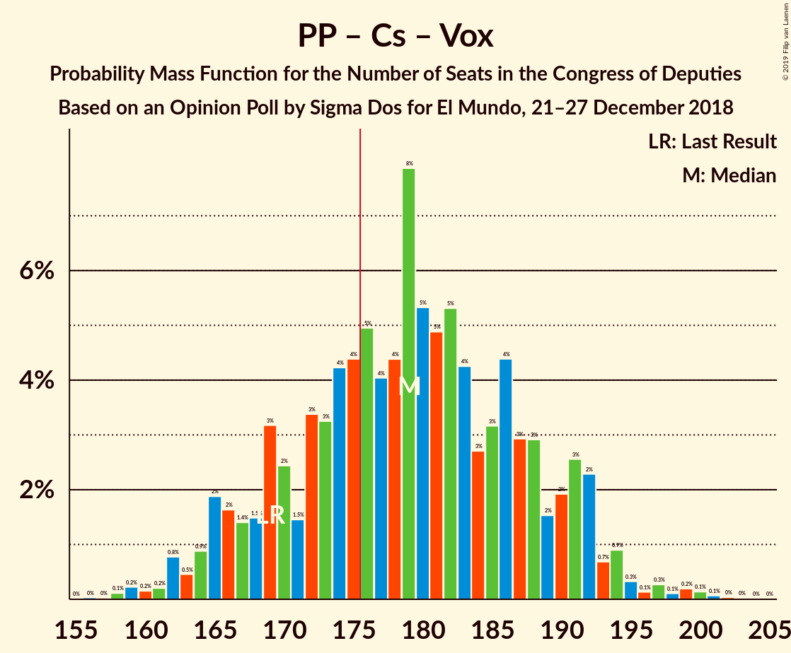

# Opinion Poll by Sigma Dos for El Mundo, 21–27 December 2018

<a href="#voting-intentions">Voting Intentions</a> | <a href="#seats">Seats</a> | <a href="#coalitions">Coalitions</a> | <a href="#technical-information">Technical Information</a>

## Voting Intentions

### Confidence Intervals

| Party | Last Result | Poll Result | 80% Confidence Interval | 90% Confidence Interval | 95% Confidence Interval | 99% Confidence Interval |
|:-----:|:-----------:|:-----------:|:-----------------------:|:-----------------------:|:-----------------------:|:-----------------------:|
| Partido Socialista Obrero Español | 22.6% | 22.6% | 21.0–24.4% |20.5–24.9% |20.1–25.3% |19.3–26.2% |
| Partido Popular | 33.0% | 19.2% | 17.7–20.9% |17.2–21.4% |16.9–21.8% |16.2–22.6% |
| Ciudadanos–Partido de la Ciudadanía | 13.1% | 18.8% | 17.3–20.5% |16.9–20.9% |16.5–21.4% |15.8–22.2% |
| Unidos Podemos | 21.2% | 15.8% | 14.4–17.4% |14.0–17.8% |13.7–18.2% |13.0–19.0% |
| Vox | 0.2% | 12.9% | 11.6–14.4% |11.3–14.8% |11.0–15.1% |10.4–15.9% |
| Esquerra Republicana de Catalunya | 2.7% | 3.6% | 2.9–4.5% |2.8–4.7% |2.6–5.0% |2.3–5.4% |
| Euzko Alderdi Jeltzalea/Partido Nacionalista Vasco | 1.2% | 1.2% | 0.9–1.8% |0.8–1.9% |0.7–2.1% |0.5–2.4% |
| Partit Demòcrata Europeu Català | 2.0% | 1.0% | 0.7–1.5% |0.6–1.7% |0.5–1.8% |0.4–2.1% |

*Note:* The poll result column reflects the actual value used in the calculations. Published results may vary slightly, and in addition be rounded to fewer digits.

## Seats

### Confidence Intervals

| Party | Last Result | Median | 80% Confidence Interval | 90% Confidence Interval | 95% Confidence Interval | 99% Confidence Interval |
|:-----:|:-----------:|:------:|:-----------------------:|:-----------------------:|:-----------------------:|:-----------------------:|
| <a href="#partido-socialista-obrero-español">Partido Socialista Obrero Español</a> | 85 | 61 | 56–68 |50–73 |50–76 |50–76 |
| <a href="#partido-popular">Partido Popular</a> | 137 | 56 | 46–62 |46–66 |46–66 |46–70 |
| <a href="#ciudadanos–partido-de-la-ciudadanía">Ciudadanos–Partido de la Ciudadanía</a> | 32 | 48 | 38–59 |37–59 |37–59 |37–59 |
| <a href="#unidos-podemos">Unidos Podemos</a> | 71 | 26 | 22–37 |22–37 |20–37 |19–38 |
| <a href="#vox">Vox</a> | 0 | 33 | 27–36 |27–36 |27–39 |27–40 |
| <a href="#esquerra-republicana-de-catalunya">Esquerra Republicana de Catalunya</a> | 9 | 0 | 0 |0 |0 |0 |
| <a href="#euzko-alderdi-jeltzalea/partido-nacionalista-vasco">Euzko Alderdi Jeltzalea/Partido Nacionalista Vasco</a> | 5 | 5 | 2–6 |2–7 |2–8 |2–8 |
| <a href="#partit-demòcrata-europeu-català">Partit Demòcrata Europeu Català</a> | 8 | 0 | 0 |0 |0 |0 |

### Partido Socialista Obrero Español

*For a full overview of the results for this party, see the [Partido Socialista Obrero Español](party-partidosocialistaobreroespañol.html) page.*

| Number of Seats | Probability | Accumulated | Special Marks |
|:---------------:|:-----------:|:-----------:|:-------------:|
| 50 | 8% | 100% |  |
| 51 | 0% | 92% |  |
| 52 | 0% | 92% |  |
| 53 | 0.1% | 92% |  |
| 54 | 0% | 92% |  |
| 55 | 0% | 92% |  |
| 56 | 2% | 92% |  |
| 57 | 0.1% | 90% |  |
| 58 | 0% | 90% |  |
| 59 | 37% | 90% |  |
| 60 | 0.6% | 53% |  |
| 61 | 15% | 52% | Median |
| 62 | 0% | 38% |  |
| 63 | 0.1% | 38% |  |
| 64 | 16% | 37% |  |
| 65 | 8% | 21% |  |
| 66 | 0.2% | 14% |  |
| 67 | 0.6% | 13% |  |
| 68 | 5% | 13% |  |
| 69 | 1.5% | 8% |  |
| 70 | 1.0% | 6% |  |
| 71 | 0.1% | 5% |  |
| 72 | 0% | 5% |  |
| 73 | 0.7% | 5% |  |
| 74 | 0% | 4% |  |
| 75 | 0.2% | 4% |  |
| 76 | 4% | 4% |  |
| 77 | 0% | 0% |  |
| 78 | 0% | 0% |  |
| 79 | 0% | 0% |  |
| 80 | 0% | 0% |  |
| 81 | 0% | 0% |  |
| 82 | 0% | 0% |  |
| 83 | 0% | 0% |  |
| 84 | 0% | 0% |  |
| 85 | 0% | 0% | Last Result |

### Partido Popular

*For a full overview of the results for this party, see the [Partido Popular](party-partidopopular.html) page.*

| Number of Seats | Probability | Accumulated | Special Marks |
|:---------------:|:-----------:|:-----------:|:-------------:|
| 42 | 0% | 100% |  |
| 43 | 0% | 99.9% |  |
| 44 | 0% | 99.9% |  |
| 45 | 0.1% | 99.9% |  |
| 46 | 15% | 99.8% |  |
| 47 | 0.7% | 85% |  |
| 48 | 0% | 85% |  |
| 49 | 0.1% | 85% |  |
| 50 | 0.1% | 84% |  |
| 51 | 13% | 84% |  |
| 52 | 4% | 71% |  |
| 53 | 2% | 67% |  |
| 54 | 0% | 65% |  |
| 55 | 0% | 65% |  |
| 56 | 30% | 65% | Median |
| 57 | 0% | 35% |  |
| 58 | 1.2% | 35% |  |
| 59 | 0% | 34% |  |
| 60 | 7% | 34% |  |
| 61 | 1.0% | 26% |  |
| 62 | 17% | 25% |  |
| 63 | 0.1% | 9% |  |
| 64 | 0% | 8% |  |
| 65 | 0% | 8% |  |
| 66 | 8% | 8% |  |
| 67 | 0% | 0.6% |  |
| 68 | 0% | 0.6% |  |
| 69 | 0% | 0.6% |  |
| 70 | 0.6% | 0.6% |  |
| 71 | 0% | 0% |  |
| 72 | 0% | 0% |  |
| 73 | 0% | 0% |  |
| 74 | 0% | 0% |  |
| 75 | 0% | 0% |  |
| 76 | 0% | 0% |  |
| 77 | 0% | 0% |  |
| 78 | 0% | 0% |  |
| 79 | 0% | 0% |  |
| 80 | 0% | 0% |  |
| 81 | 0% | 0% |  |
| 82 | 0% | 0% |  |
| 83 | 0% | 0% |  |
| 84 | 0% | 0% |  |
| 85 | 0% | 0% |  |
| 86 | 0% | 0% |  |
| 87 | 0% | 0% |  |
| 88 | 0% | 0% |  |
| 89 | 0% | 0% |  |
| 90 | 0% | 0% |  |
| 91 | 0% | 0% |  |
| 92 | 0% | 0% |  |
| 93 | 0% | 0% |  |
| 94 | 0% | 0% |  |
| 95 | 0% | 0% |  |
| 96 | 0% | 0% |  |
| 97 | 0% | 0% |  |
| 98 | 0% | 0% |  |
| 99 | 0% | 0% |  |
| 100 | 0% | 0% |  |
| 101 | 0% | 0% |  |
| 102 | 0% | 0% |  |
| 103 | 0% | 0% |  |
| 104 | 0% | 0% |  |
| 105 | 0% | 0% |  |
| 106 | 0% | 0% |  |
| 107 | 0% | 0% |  |
| 108 | 0% | 0% |  |
| 109 | 0% | 0% |  |
| 110 | 0% | 0% |  |
| 111 | 0% | 0% |  |
| 112 | 0% | 0% |  |
| 113 | 0% | 0% |  |
| 114 | 0% | 0% |  |
| 115 | 0% | 0% |  |
| 116 | 0% | 0% |  |
| 117 | 0% | 0% |  |
| 118 | 0% | 0% |  |
| 119 | 0% | 0% |  |
| 120 | 0% | 0% |  |
| 121 | 0% | 0% |  |
| 122 | 0% | 0% |  |
| 123 | 0% | 0% |  |
| 124 | 0% | 0% |  |
| 125 | 0% | 0% |  |
| 126 | 0% | 0% |  |
| 127 | 0% | 0% |  |
| 128 | 0% | 0% |  |
| 129 | 0% | 0% |  |
| 130 | 0% | 0% |  |
| 131 | 0% | 0% |  |
| 132 | 0% | 0% |  |
| 133 | 0% | 0% |  |
| 134 | 0% | 0% |  |
| 135 | 0% | 0% |  |
| 136 | 0% | 0% |  |
| 137 | 0% | 0% | Last Result |

### Ciudadanos–Partido de la Ciudadanía

*For a full overview of the results for this party, see the [Ciudadanos–Partido de la Ciudadanía](party-ciudadanos–partidodelaciudadanía.html) page.*

| Number of Seats | Probability | Accumulated | Special Marks |
|:---------------:|:-----------:|:-----------:|:-------------:|
| 32 | 0% | 100% | Last Result |
| 33 | 0% | 100% |  |
| 34 | 0% | 100% |  |
| 35 | 0% | 100% |  |
| 36 | 0% | 100% |  |
| 37 | 9% | 100% |  |
| 38 | 3% | 91% |  |
| 39 | 0.2% | 88% |  |
| 40 | 0% | 88% |  |
| 41 | 0.6% | 88% |  |
| 42 | 0% | 87% |  |
| 43 | 0.6% | 87% |  |
| 44 | 1.1% | 87% |  |
| 45 | 17% | 86% |  |
| 46 | 7% | 69% |  |
| 47 | 2% | 63% |  |
| 48 | 13% | 60% | Median |
| 49 | 0% | 48% |  |
| 50 | 0% | 48% |  |
| 51 | 0% | 48% |  |
| 52 | 0% | 48% |  |
| 53 | 0% | 47% |  |
| 54 | 8% | 47% |  |
| 55 | 23% | 40% |  |
| 56 | 1.1% | 17% |  |
| 57 | 1.1% | 16% |  |
| 58 | 0.1% | 15% |  |
| 59 | 15% | 15% |  |
| 60 | 0% | 0.1% |  |
| 61 | 0% | 0.1% |  |
| 62 | 0.1% | 0.1% |  |
| 63 | 0% | 0% |  |

### Unidos Podemos

*For a full overview of the results for this party, see the [Unidos Podemos](party-unidospodemos.html) page.*

| Number of Seats | Probability | Accumulated | Special Marks |
|:---------------:|:-----------:|:-----------:|:-------------:|
| 19 | 0.6% | 100% |  |
| 20 | 3% | 99.4% |  |
| 21 | 0.1% | 97% |  |
| 22 | 24% | 97% |  |
| 23 | 8% | 73% |  |
| 24 | 0% | 65% |  |
| 25 | 1.0% | 65% |  |
| 26 | 15% | 64% | Median |
| 27 | 0.1% | 49% |  |
| 28 | 0% | 49% |  |
| 29 | 2% | 49% |  |
| 30 | 0.2% | 47% |  |
| 31 | 0% | 47% |  |
| 32 | 4% | 47% |  |
| 33 | 5% | 42% |  |
| 34 | 0.4% | 37% |  |
| 35 | 21% | 37% |  |
| 36 | 0% | 16% |  |
| 37 | 13% | 16% |  |
| 38 | 2% | 2% |  |
| 39 | 0% | 0.1% |  |
| 40 | 0% | 0.1% |  |
| 41 | 0% | 0.1% |  |
| 42 | 0% | 0.1% |  |
| 43 | 0% | 0.1% |  |
| 44 | 0% | 0.1% |  |
| 45 | 0% | 0.1% |  |
| 46 | 0% | 0% |  |
| 47 | 0% | 0% |  |
| 48 | 0% | 0% |  |
| 49 | 0% | 0% |  |
| 50 | 0% | 0% |  |
| 51 | 0% | 0% |  |
| 52 | 0% | 0% |  |
| 53 | 0% | 0% |  |
| 54 | 0% | 0% |  |
| 55 | 0% | 0% |  |
| 56 | 0% | 0% |  |
| 57 | 0% | 0% |  |
| 58 | 0% | 0% |  |
| 59 | 0% | 0% |  |
| 60 | 0% | 0% |  |
| 61 | 0% | 0% |  |
| 62 | 0% | 0% |  |
| 63 | 0% | 0% |  |
| 64 | 0% | 0% |  |
| 65 | 0% | 0% |  |
| 66 | 0% | 0% |  |
| 67 | 0% | 0% |  |
| 68 | 0% | 0% |  |
| 69 | 0% | 0% |  |
| 70 | 0% | 0% |  |
| 71 | 0% | 0% | Last Result |

### Vox

*For a full overview of the results for this party, see the [Vox](party-vox.html) page.*

| Number of Seats | Probability | Accumulated | Special Marks |
|:---------------:|:-----------:|:-----------:|:-------------:|
| 0 | 0% | 100% | Last Result |
| 1 | 0% | 100% |  |
| 2 | 0% | 100% |  |
| 3 | 0% | 100% |  |
| 4 | 0% | 100% |  |
| 5 | 0% | 100% |  |
| 6 | 0% | 100% |  |
| 7 | 0% | 100% |  |
| 8 | 0% | 100% |  |
| 9 | 0% | 100% |  |
| 10 | 0% | 100% |  |
| 11 | 0% | 100% |  |
| 12 | 0% | 100% |  |
| 13 | 0% | 100% |  |
| 14 | 0% | 100% |  |
| 15 | 0% | 100% |  |
| 16 | 0% | 100% |  |
| 17 | 0% | 100% |  |
| 18 | 0% | 100% |  |
| 19 | 0% | 100% |  |
| 20 | 0% | 100% |  |
| 21 | 0% | 100% |  |
| 22 | 0% | 100% |  |
| 23 | 0% | 100% |  |
| 24 | 0% | 100% |  |
| 25 | 0% | 100% |  |
| 26 | 0% | 100% |  |
| 27 | 15% | 100% |  |
| 28 | 1.1% | 85% |  |
| 29 | 6% | 84% |  |
| 30 | 7% | 78% |  |
| 31 | 6% | 71% |  |
| 32 | 15% | 65% |  |
| 33 | 14% | 50% | Median |
| 34 | 0% | 37% |  |
| 35 | 8% | 36% |  |
| 36 | 24% | 29% |  |
| 37 | 2% | 5% |  |
| 38 | 0.1% | 3% |  |
| 39 | 2% | 3% |  |
| 40 | 0.6% | 0.6% |  |
| 41 | 0% | 0.1% |  |
| 42 | 0% | 0% |  |

### Esquerra Republicana de Catalunya

*For a full overview of the results for this party, see the [Esquerra Republicana de Catalunya](party-esquerrarepublicanadecatalunya.html) page.*

| Number of Seats | Probability | Accumulated | Special Marks |
|:---------------:|:-----------:|:-----------:|:-------------:|
| 0 | 100% | 100% | Median |
| 1 | 0% | 0% |  |
| 2 | 0% | 0% |  |
| 3 | 0% | 0% |  |
| 4 | 0% | 0% |  |
| 5 | 0% | 0% |  |
| 6 | 0% | 0% |  |
| 7 | 0% | 0% |  |
| 8 | 0% | 0% |  |
| 9 | 0% | 0% | Last Result |

### Euzko Alderdi Jeltzalea/Partido Nacionalista Vasco

*For a full overview of the results for this party, see the [Euzko Alderdi Jeltzalea/Partido Nacionalista Vasco](party-euzkoalderdijeltzaleapartidonacionalistavasco.html) page.*

| Number of Seats | Probability | Accumulated | Special Marks |
|:---------------:|:-----------:|:-----------:|:-------------:|
| 2 | 11% | 100% |  |
| 3 | 16% | 89% |  |
| 4 | 2% | 73% |  |
| 5 | 30% | 71% | Last Result, Median |
| 6 | 33% | 41% |  |
| 7 | 5% | 8% |  |
| 8 | 3% | 3% |  |
| 9 | 0% | 0% |  |

### Partit Demòcrata Europeu Català

*For a full overview of the results for this party, see the [Partit Demòcrata Europeu Català](party-partitdemòcrataeuropeucatalà.html) page.*

| Number of Seats | Probability | Accumulated | Special Marks |
|:---------------:|:-----------:|:-----------:|:-------------:|
| 0 | 100% | 100% | Median |
| 1 | 0% | 0% |  |
| 2 | 0% | 0% |  |
| 3 | 0% | 0% |  |
| 4 | 0% | 0% |  |
| 5 | 0% | 0% |  |
| 6 | 0% | 0% |  |
| 7 | 0% | 0% |  |
| 8 | 0% | 0% | Last Result |

## Coalitions

### Confidence Intervals

| Coalition | Last Result | Median | Majority? | 80% Confidence Interval | 90% Confidence Interval | 95% Confidence Interval | 99% Confidence Interval |
|:---------:|:-----------:|:------:|:---------:|:-----------------------:|:-----------------------:|:-----------------------:|:-----------------------:|
| Partido Popular – Ciudadanos–Partido de la Ciudadanía – Vox | 169 | 137 | 0% | 127–147 | 126–155 | 120–155 | 120–155 |
| Partido Socialista Obrero Español – Ciudadanos–Partido de la Ciudadanía | 117 | 111 | 0% | 104–123 | 104–123 | 101–123 | 94–123 |
| Partido Popular – Ciudadanos–Partido de la Ciudadanía | 169 | 107 | 0% | 97–113 | 94–120 | 89–120 | 89–120 |
| Partido Socialista Obrero Español – Unidos Podemos | 156 | 93 | 0% | 81–100 | 73–101 | 73–108 | 73–108 |
| Partido Popular – Vox | 137 | 89 | 0% | 78–99 | 78–101 | 78–101 | 78–101 |
| Partido Socialista Obrero Español | 85 | 61 | 0% | 56–68 | 50–73 | 50–76 | 50–76 |
| Partido Popular | 137 | 56 | 0% | 46–62 | 46–66 | 46–66 | 46–70 |

### Partido Popular – Ciudadanos–Partido de la Ciudadanía – Vox

| Number of Seats | Probability | Accumulated | Special Marks |
|:---------------:|:-----------:|:-----------:|:-------------:|
| 120 | 4% | 100% |  |
| 121 | 0.3% | 96% |  |
| 122 | 0% | 96% |  |
| 123 | 0% | 96% |  |
| 124 | 0.2% | 96% |  |
| 125 | 0% | 95% |  |
| 126 | 5% | 95% |  |
| 127 | 0.7% | 90% |  |
| 128 | 0% | 90% |  |
| 129 | 0% | 90% |  |
| 130 | 0% | 90% |  |
| 131 | 0.2% | 90% |  |
| 132 | 19% | 89% |  |
| 133 | 0% | 70% |  |
| 134 | 16% | 70% |  |
| 135 | 0% | 54% |  |
| 136 | 0% | 54% |  |
| 137 | 18% | 54% | Median |
| 138 | 2% | 35% |  |
| 139 | 0% | 34% |  |
| 140 | 0% | 34% |  |
| 141 | 0% | 34% |  |
| 142 | 1.2% | 34% |  |
| 143 | 0.6% | 32% |  |
| 144 | 0.1% | 32% |  |
| 145 | 0% | 32% |  |
| 146 | 0.1% | 32% |  |
| 147 | 23% | 32% |  |
| 148 | 0% | 9% |  |
| 149 | 1.1% | 9% |  |
| 150 | 0% | 8% |  |
| 151 | 0% | 8% |  |
| 152 | 0% | 8% |  |
| 153 | 0% | 8% |  |
| 154 | 0% | 8% |  |
| 155 | 8% | 8% |  |
| 156 | 0% | 0% |  |
| 157 | 0% | 0% |  |
| 158 | 0% | 0% |  |
| 159 | 0% | 0% |  |
| 160 | 0% | 0% |  |
| 161 | 0% | 0% |  |
| 162 | 0% | 0% |  |
| 163 | 0% | 0% |  |
| 164 | 0% | 0% |  |
| 165 | 0% | 0% |  |
| 166 | 0% | 0% |  |
| 167 | 0% | 0% |  |
| 168 | 0% | 0% |  |
| 169 | 0% | 0% | Last Result |

### Partido Socialista Obrero Español – Ciudadanos–Partido de la Ciudadanía

| Number of Seats | Probability | Accumulated | Special Marks |
|:---------------:|:-----------:|:-----------:|:-------------:|
| 94 | 2% | 100% |  |
| 95 | 0% | 98% |  |
| 96 | 0% | 98% |  |
| 97 | 0% | 98% |  |
| 98 | 0% | 98% |  |
| 99 | 0% | 98% |  |
| 100 | 0% | 98% |  |
| 101 | 0.6% | 98% |  |
| 102 | 0% | 97% |  |
| 103 | 0% | 97% |  |
| 104 | 8% | 97% |  |
| 105 | 5% | 89% |  |
| 106 | 15% | 84% |  |
| 107 | 13% | 69% |  |
| 108 | 0% | 56% |  |
| 109 | 2% | 56% | Median |
| 110 | 0.7% | 54% |  |
| 111 | 6% | 54% |  |
| 112 | 0.1% | 47% |  |
| 113 | 4% | 47% |  |
| 114 | 24% | 43% |  |
| 115 | 0% | 19% |  |
| 116 | 3% | 19% |  |
| 117 | 0% | 17% | Last Result |
| 118 | 0% | 17% |  |
| 119 | 0% | 17% |  |
| 120 | 0.7% | 17% |  |
| 121 | 1.2% | 16% |  |
| 122 | 0% | 15% |  |
| 123 | 15% | 15% |  |
| 124 | 0% | 0.1% |  |
| 125 | 0% | 0.1% |  |
| 126 | 0% | 0.1% |  |
| 127 | 0% | 0.1% |  |
| 128 | 0.1% | 0.1% |  |
| 129 | 0% | 0% |  |

### Partido Popular – Ciudadanos–Partido de la Ciudadanía

| Number of Seats | Probability | Accumulated | Special Marks |
|:---------------:|:-----------:|:-----------:|:-------------:|
| 88 | 0.1% | 100% |  |
| 89 | 4% | 99.8% |  |
| 90 | 0.3% | 96% |  |
| 91 | 0% | 95% |  |
| 92 | 0% | 95% |  |
| 93 | 0% | 95% |  |
| 94 | 1.3% | 95% |  |
| 95 | 0% | 94% |  |
| 96 | 0% | 94% |  |
| 97 | 5% | 94% |  |
| 98 | 2% | 89% |  |
| 99 | 13% | 87% |  |
| 100 | 1.5% | 74% |  |
| 101 | 0.1% | 72% |  |
| 102 | 6% | 72% |  |
| 103 | 0% | 66% |  |
| 104 | 0% | 66% | Median |
| 105 | 16% | 66% |  |
| 106 | 0% | 50% |  |
| 107 | 17% | 50% |  |
| 108 | 0.1% | 33% |  |
| 109 | 0% | 33% |  |
| 110 | 0% | 33% |  |
| 111 | 23% | 33% |  |
| 112 | 0% | 11% |  |
| 113 | 2% | 11% |  |
| 114 | 1.1% | 9% |  |
| 115 | 0% | 8% |  |
| 116 | 0% | 8% |  |
| 117 | 0% | 8% |  |
| 118 | 0% | 8% |  |
| 119 | 0% | 8% |  |
| 120 | 8% | 8% |  |
| 121 | 0% | 0% |  |
| 122 | 0% | 0% |  |
| 123 | 0% | 0% |  |
| 124 | 0% | 0% |  |
| 125 | 0% | 0% |  |
| 126 | 0% | 0% |  |
| 127 | 0% | 0% |  |
| 128 | 0% | 0% |  |
| 129 | 0% | 0% |  |
| 130 | 0% | 0% |  |
| 131 | 0% | 0% |  |
| 132 | 0% | 0% |  |
| 133 | 0% | 0% |  |
| 134 | 0% | 0% |  |
| 135 | 0% | 0% |  |
| 136 | 0% | 0% |  |
| 137 | 0% | 0% |  |
| 138 | 0% | 0% |  |
| 139 | 0% | 0% |  |
| 140 | 0% | 0% |  |
| 141 | 0% | 0% |  |
| 142 | 0% | 0% |  |
| 143 | 0% | 0% |  |
| 144 | 0% | 0% |  |
| 145 | 0% | 0% |  |
| 146 | 0% | 0% |  |
| 147 | 0% | 0% |  |
| 148 | 0% | 0% |  |
| 149 | 0% | 0% |  |
| 150 | 0% | 0% |  |
| 151 | 0% | 0% |  |
| 152 | 0% | 0% |  |
| 153 | 0% | 0% |  |
| 154 | 0% | 0% |  |
| 155 | 0% | 0% |  |
| 156 | 0% | 0% |  |
| 157 | 0% | 0% |  |
| 158 | 0% | 0% |  |
| 159 | 0% | 0% |  |
| 160 | 0% | 0% |  |
| 161 | 0% | 0% |  |
| 162 | 0% | 0% |  |
| 163 | 0% | 0% |  |
| 164 | 0% | 0% |  |
| 165 | 0% | 0% |  |
| 166 | 0% | 0% |  |
| 167 | 0% | 0% |  |
| 168 | 0% | 0% |  |
| 169 | 0% | 0% | Last Result |

### Partido Socialista Obrero Español – Unidos Podemos

| Number of Seats | Probability | Accumulated | Special Marks |
|:---------------:|:-----------:|:-----------:|:-------------:|
| 73 | 8% | 100% |  |
| 74 | 0% | 92% |  |
| 75 | 0% | 92% |  |
| 76 | 0% | 92% |  |
| 77 | 0% | 92% |  |
| 78 | 0% | 92% |  |
| 79 | 0% | 92% |  |
| 80 | 0.1% | 92% |  |
| 81 | 24% | 92% |  |
| 82 | 0% | 68% |  |
| 83 | 0% | 68% |  |
| 84 | 0.1% | 68% |  |
| 85 | 1.2% | 68% |  |
| 86 | 0.6% | 67% |  |
| 87 | 0% | 66% | Median |
| 88 | 0% | 66% |  |
| 89 | 1.5% | 66% |  |
| 90 | 15% | 65% |  |
| 91 | 0% | 50% |  |
| 92 | 0% | 50% |  |
| 93 | 2% | 50% |  |
| 94 | 2% | 49% |  |
| 95 | 1.0% | 46% |  |
| 96 | 28% | 45% |  |
| 97 | 0.6% | 17% |  |
| 98 | 0.1% | 17% |  |
| 99 | 1.0% | 17% |  |
| 100 | 6% | 16% |  |
| 101 | 5% | 10% |  |
| 102 | 0% | 5% |  |
| 103 | 0% | 5% |  |
| 104 | 0.1% | 5% |  |
| 105 | 0% | 4% |  |
| 106 | 0% | 4% |  |
| 107 | 0.2% | 4% |  |
| 108 | 4% | 4% |  |
| 109 | 0% | 0% |  |
| 110 | 0% | 0% |  |
| 111 | 0% | 0% |  |
| 112 | 0% | 0% |  |
| 113 | 0% | 0% |  |
| 114 | 0% | 0% |  |
| 115 | 0% | 0% |  |
| 116 | 0% | 0% |  |
| 117 | 0% | 0% |  |
| 118 | 0% | 0% |  |
| 119 | 0% | 0% |  |
| 120 | 0% | 0% |  |
| 121 | 0% | 0% |  |
| 122 | 0% | 0% |  |
| 123 | 0% | 0% |  |
| 124 | 0% | 0% |  |
| 125 | 0% | 0% |  |
| 126 | 0% | 0% |  |
| 127 | 0% | 0% |  |
| 128 | 0% | 0% |  |
| 129 | 0% | 0% |  |
| 130 | 0% | 0% |  |
| 131 | 0% | 0% |  |
| 132 | 0% | 0% |  |
| 133 | 0% | 0% |  |
| 134 | 0% | 0% |  |
| 135 | 0% | 0% |  |
| 136 | 0% | 0% |  |
| 137 | 0% | 0% |  |
| 138 | 0% | 0% |  |
| 139 | 0% | 0% |  |
| 140 | 0% | 0% |  |
| 141 | 0% | 0% |  |
| 142 | 0% | 0% |  |
| 143 | 0% | 0% |  |
| 144 | 0% | 0% |  |
| 145 | 0% | 0% |  |
| 146 | 0% | 0% |  |
| 147 | 0% | 0% |  |
| 148 | 0% | 0% |  |
| 149 | 0% | 0% |  |
| 150 | 0% | 0% |  |
| 151 | 0% | 0% |  |
| 152 | 0% | 0% |  |
| 153 | 0% | 0% |  |
| 154 | 0% | 0% |  |
| 155 | 0% | 0% |  |
| 156 | 0% | 0% | Last Result |

### Partido Popular – Vox

| Number of Seats | Probability | Accumulated | Special Marks |
|:---------------:|:-----------:|:-----------:|:-------------:|
| 75 | 0.1% | 100% |  |
| 76 | 0% | 99.9% |  |
| 77 | 0% | 99.9% |  |
| 78 | 15% | 99.9% |  |
| 79 | 0% | 85% |  |
| 80 | 0.7% | 85% |  |
| 81 | 0% | 85% |  |
| 82 | 0.1% | 85% |  |
| 83 | 4% | 85% |  |
| 84 | 13% | 80% |  |
| 85 | 0.3% | 67% |  |
| 86 | 8% | 67% |  |
| 87 | 0% | 60% |  |
| 88 | 0.1% | 59% |  |
| 89 | 20% | 59% | Median |
| 90 | 2% | 39% |  |
| 91 | 0% | 37% |  |
| 92 | 24% | 37% |  |
| 93 | 2% | 13% |  |
| 94 | 0% | 11% |  |
| 95 | 0% | 11% |  |
| 96 | 0% | 11% |  |
| 97 | 0% | 11% |  |
| 98 | 0.1% | 11% |  |
| 99 | 2% | 11% |  |
| 100 | 0.6% | 8% |  |
| 101 | 8% | 8% |  |
| 102 | 0% | 0% |  |
| 103 | 0% | 0% |  |
| 104 | 0% | 0% |  |
| 105 | 0% | 0% |  |
| 106 | 0% | 0% |  |
| 107 | 0% | 0% |  |
| 108 | 0% | 0% |  |
| 109 | 0% | 0% |  |
| 110 | 0% | 0% |  |
| 111 | 0% | 0% |  |
| 112 | 0% | 0% |  |
| 113 | 0% | 0% |  |
| 114 | 0% | 0% |  |
| 115 | 0% | 0% |  |
| 116 | 0% | 0% |  |
| 117 | 0% | 0% |  |
| 118 | 0% | 0% |  |
| 119 | 0% | 0% |  |
| 120 | 0% | 0% |  |
| 121 | 0% | 0% |  |
| 122 | 0% | 0% |  |
| 123 | 0% | 0% |  |
| 124 | 0% | 0% |  |
| 125 | 0% | 0% |  |
| 126 | 0% | 0% |  |
| 127 | 0% | 0% |  |
| 128 | 0% | 0% |  |
| 129 | 0% | 0% |  |
| 130 | 0% | 0% |  |
| 131 | 0% | 0% |  |
| 132 | 0% | 0% |  |
| 133 | 0% | 0% |  |
| 134 | 0% | 0% |  |
| 135 | 0% | 0% |  |
| 136 | 0% | 0% |  |
| 137 | 0% | 0% | Last Result |

### Partido Socialista Obrero Español

| Number of Seats | Probability | Accumulated | Special Marks |
|:---------------:|:-----------:|:-----------:|:-------------:|
| 50 | 8% | 100% |  |
| 51 | 0% | 92% |  |
| 52 | 0% | 92% |  |
| 53 | 0.1% | 92% |  |
| 54 | 0% | 92% |  |
| 55 | 0% | 92% |  |
| 56 | 2% | 92% |  |
| 57 | 0.1% | 90% |  |
| 58 | 0% | 90% |  |
| 59 | 37% | 90% |  |
| 60 | 0.6% | 53% |  |
| 61 | 15% | 52% | Median |
| 62 | 0% | 38% |  |
| 63 | 0.1% | 38% |  |
| 64 | 16% | 37% |  |
| 65 | 8% | 21% |  |
| 66 | 0.2% | 14% |  |
| 67 | 0.6% | 13% |  |
| 68 | 5% | 13% |  |
| 69 | 1.5% | 8% |  |
| 70 | 1.0% | 6% |  |
| 71 | 0.1% | 5% |  |
| 72 | 0% | 5% |  |
| 73 | 0.7% | 5% |  |
| 74 | 0% | 4% |  |
| 75 | 0.2% | 4% |  |
| 76 | 4% | 4% |  |
| 77 | 0% | 0% |  |
| 78 | 0% | 0% |  |
| 79 | 0% | 0% |  |
| 80 | 0% | 0% |  |
| 81 | 0% | 0% |  |
| 82 | 0% | 0% |  |
| 83 | 0% | 0% |  |
| 84 | 0% | 0% |  |
| 85 | 0% | 0% | Last Result |

### Partido Popular

| Number of Seats | Probability | Accumulated | Special Marks |
|:---------------:|:-----------:|:-----------:|:-------------:|
| 42 | 0% | 100% |  |
| 43 | 0% | 99.9% |  |
| 44 | 0% | 99.9% |  |
| 45 | 0.1% | 99.9% |  |
| 46 | 15% | 99.8% |  |
| 47 | 0.7% | 85% |  |
| 48 | 0% | 85% |  |
| 49 | 0.1% | 85% |  |
| 50 | 0.1% | 84% |  |
| 51 | 13% | 84% |  |
| 52 | 4% | 71% |  |
| 53 | 2% | 67% |  |
| 54 | 0% | 65% |  |
| 55 | 0% | 65% |  |
| 56 | 30% | 65% | Median |
| 57 | 0% | 35% |  |
| 58 | 1.2% | 35% |  |
| 59 | 0% | 34% |  |
| 60 | 7% | 34% |  |
| 61 | 1.0% | 26% |  |
| 62 | 17% | 25% |  |
| 63 | 0.1% | 9% |  |
| 64 | 0% | 8% |  |
| 65 | 0% | 8% |  |
| 66 | 8% | 8% |  |
| 67 | 0% | 0.6% |  |
| 68 | 0% | 0.6% |  |
| 69 | 0% | 0.6% |  |
| 70 | 0.6% | 0.6% |  |
| 71 | 0% | 0% |  |
| 72 | 0% | 0% |  |
| 73 | 0% | 0% |  |
| 74 | 0% | 0% |  |
| 75 | 0% | 0% |  |
| 76 | 0% | 0% |  |
| 77 | 0% | 0% |  |
| 78 | 0% | 0% |  |
| 79 | 0% | 0% |  |
| 80 | 0% | 0% |  |
| 81 | 0% | 0% |  |
| 82 | 0% | 0% |  |
| 83 | 0% | 0% |  |
| 84 | 0% | 0% |  |
| 85 | 0% | 0% |  |
| 86 | 0% | 0% |  |
| 87 | 0% | 0% |  |
| 88 | 0% | 0% |  |
| 89 | 0% | 0% |  |
| 90 | 0% | 0% |  |
| 91 | 0% | 0% |  |
| 92 | 0% | 0% |  |
| 93 | 0% | 0% |  |
| 94 | 0% | 0% |  |
| 95 | 0% | 0% |  |
| 96 | 0% | 0% |  |
| 97 | 0% | 0% |  |
| 98 | 0% | 0% |  |
| 99 | 0% | 0% |  |
| 100 | 0% | 0% |  |
| 101 | 0% | 0% |  |
| 102 | 0% | 0% |  |
| 103 | 0% | 0% |  |
| 104 | 0% | 0% |  |
| 105 | 0% | 0% |  |
| 106 | 0% | 0% |  |
| 107 | 0% | 0% |  |
| 108 | 0% | 0% |  |
| 109 | 0% | 0% |  |
| 110 | 0% | 0% |  |
| 111 | 0% | 0% |  |
| 112 | 0% | 0% |  |
| 113 | 0% | 0% |  |
| 114 | 0% | 0% |  |
| 115 | 0% | 0% |  |
| 116 | 0% | 0% |  |
| 117 | 0% | 0% |  |
| 118 | 0% | 0% |  |
| 119 | 0% | 0% |  |
| 120 | 0% | 0% |  |
| 121 | 0% | 0% |  |
| 122 | 0% | 0% |  |
| 123 | 0% | 0% |  |
| 124 | 0% | 0% |  |
| 125 | 0% | 0% |  |
| 126 | 0% | 0% |  |
| 127 | 0% | 0% |  |
| 128 | 0% | 0% |  |
| 129 | 0% | 0% |  |
| 130 | 0% | 0% |  |
| 131 | 0% | 0% |  |
| 132 | 0% | 0% |  |
| 133 | 0% | 0% |  |
| 134 | 0% | 0% |  |
| 135 | 0% | 0% |  |
| 136 | 0% | 0% |  |
| 137 | 0% | 0% | Last Result |

## Technical Information

### Opinion Poll

+ **Polling firm:** Sigma Dos
+ **Commissioner(s):** El Mundo
+ **Fieldwork period:** 21–27 December 2018

### Calculations

+ **Sample size:** 1000
+ **Simulations done:** 1,024
+ **Error estimate:** 5.01%

