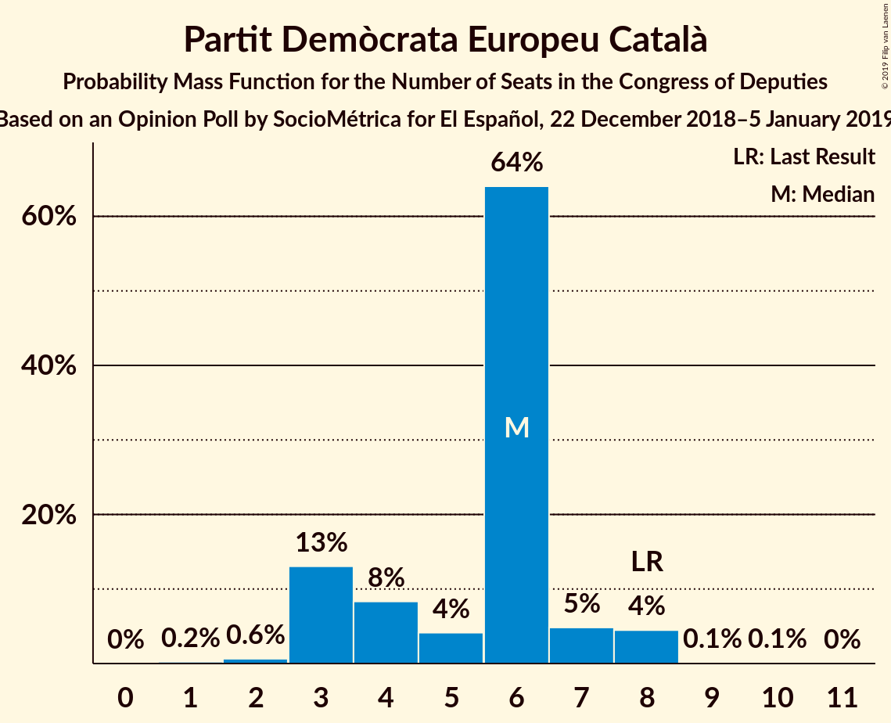
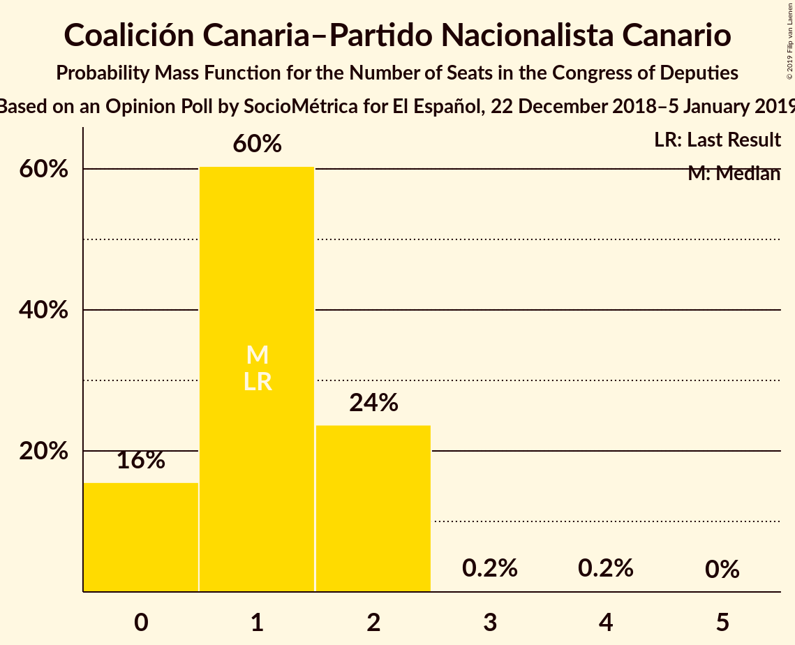
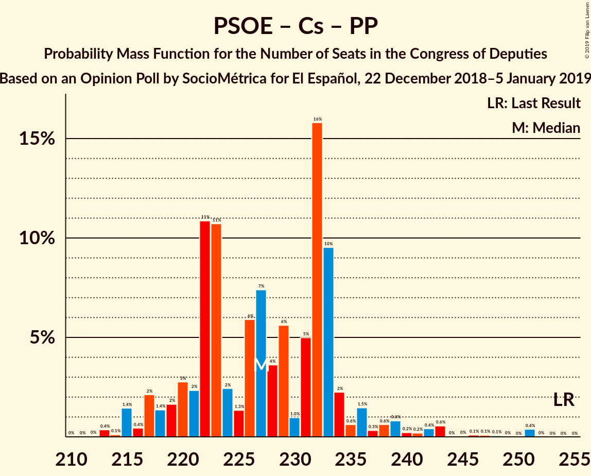
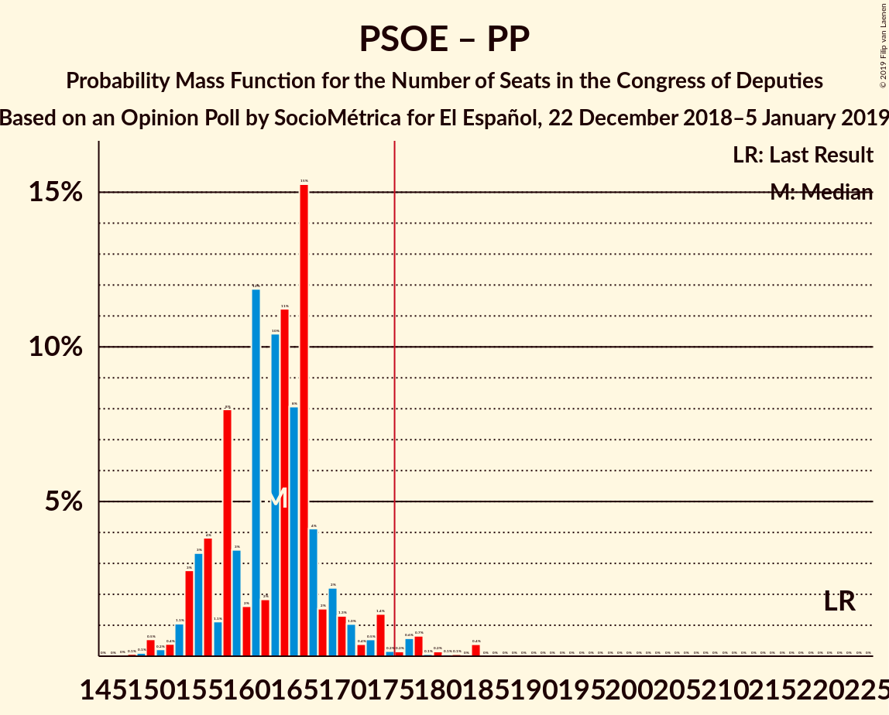
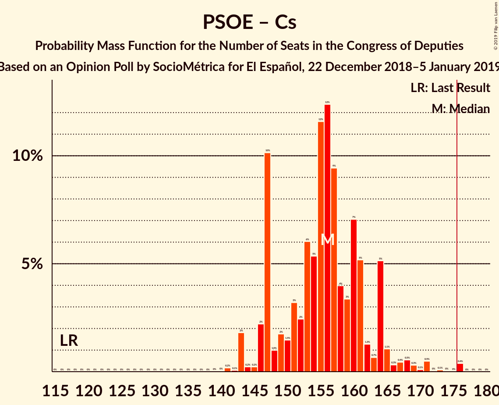

# Opinion Poll by SocioMétrica for El Español, 22 December 2018–5 January 2019

<a href="#voting-intentions">Voting Intentions</a> | <a href="#seats">Seats</a> | <a href="#coalitions">Coalitions</a> | <a href="#technical-information">Technical Information</a>

## Voting Intentions

### Confidence Intervals

| Party | Last Result | Poll Result | 80% Confidence Interval | 90% Confidence Interval | 95% Confidence Interval | 99% Confidence Interval |
|:-----:|:-----------:|:-----------:|:-----------------------:|:-----------------------:|:-----------------------:|:-----------------------:|
| Partido Socialista Obrero Español | 22.6% | 22.4% | 21.3–23.6% |21.0–23.9% |20.7–24.2% |20.2–24.8% |
| Ciudadanos–Partido de la Ciudadanía | 13.1% | 18.5% | 17.5–19.6% |17.2–19.9% |16.9–20.2% |16.4–20.7% |
| Partido Popular | 33.0% | 18.3% | 17.3–19.4% |17.0–19.7% |16.8–20.0% |16.3–20.5% |
| Unidos Podemos | 21.2% | 17.1% | 16.1–18.2% |15.8–18.5% |15.6–18.7% |15.1–19.3% |
| Vox | 0.2% | 12.5% | 11.6–13.5% |11.4–13.7% |11.2–14.0% |10.8–14.4% |
| Esquerra Republicana de Catalunya–Catalunya Sí | 2.7% | 3.2% | 2.7–3.7% |2.6–3.9% |2.5–4.0% |2.3–4.3% |
| Partit Demòcrata Europeu Català | 2.0% | 1.4% | 1.1–1.8% |1.1–1.9% |1.0–2.0% |0.9–2.2% |
| Euzko Alderdi Jeltzalea/Partido Nacionalista Vasco | 1.2% | 1.2% | 0.9–1.5% |0.9–1.6% |0.8–1.7% |0.7–1.9% |
| Euskal Herria Bildu | 0.8% | 0.9% | 0.7–1.2% |0.6–1.3% |0.6–1.4% |0.5–1.6% |
| Coalición Canaria–Partido Nacionalista Canario | 0.3% | 0.3% | 0.2–0.5% |0.2–0.6% |0.2–0.7% |0.1–0.8% |

*Note:* The poll result column reflects the actual value used in the calculations. Published results may vary slightly, and in addition be rounded to fewer digits.

## Seats

### Confidence Intervals

| Party | Last Result | Median | 80% Confidence Interval | 90% Confidence Interval | 95% Confidence Interval | 99% Confidence Interval |
|:-----:|:-----------:|:------:|:-----------------------:|:-----------------------:|:-----------------------:|:-----------------------:|
| <a href="#partido-socialista-obrero-español">Partido Socialista Obrero Español</a> | 85 | 90 | 87–95 |85–98 |82–101 |80–107 |
| <a href="#ciudadanos–partido-de-la-ciudadanía">Ciudadanos–Partido de la Ciudadanía</a> | 32 | 65 | 58–69 |58–69 |57–71 |56–73 |
| <a href="#partido-popular">Partido Popular</a> | 137 | 72 | 66–77 |65–78 |63–79 |60–84 |
| <a href="#unidos-podemos">Unidos Podemos</a> | 71 | 56 | 51–63 |50–65 |48–66 |45–68 |
| <a href="#vox">Vox</a> | 0 | 35 | 30–42 |28–43 |28–44 |27–47 |
| <a href="#esquerra-republicana-de-catalunya–catalunya-sí">Esquerra Republicana de Catalunya–Catalunya Sí</a> | 9 | 13 | 12–16 |12–16 |11–16 |9–18 |
| <a href="#partit-demòcrata-europeu-català">Partit Demòcrata Europeu Català</a> | 8 | 6 | 3–6 |3–7 |3–8 |2–8 |
| <a href="#euzko-alderdi-jeltzalea/partido-nacionalista-vasco">Euzko Alderdi Jeltzalea/Partido Nacionalista Vasco</a> | 5 | 6 | 5–7 |3–7 |3–7 |3–8 |
| <a href="#euskal-herria-bildu">Euskal Herria Bildu</a> | 2 | 4 | 2–6 |2–6 |2–6 |1–7 |
| <a href="#coalición-canaria–partido-nacionalista-canario">Coalición Canaria–Partido Nacionalista Canario</a> | 1 | 1 | 0–2 |0–2 |0–2 |0–2 |

### Partido Socialista Obrero Español

*For a full overview of the results for this party, see the [Partido Socialista Obrero Español](party-partidosocialistaobreroespañol.html) page.*

| Number of Seats | Probability | Accumulated | Special Marks |
|:---------------:|:-----------:|:-----------:|:-------------:|
| 78 | 0% | 100% |  |
| 79 | 0.1% | 99.9% |  |
| 80 | 1.3% | 99.9% |  |
| 81 | 0.4% | 98.6% |  |
| 82 | 0.9% | 98% |  |
| 83 | 2% | 97% |  |
| 84 | 0.7% | 96% |  |
| 85 | 0.8% | 95% | Last Result |
| 86 | 3% | 94% |  |
| 87 | 3% | 91% |  |
| 88 | 3% | 87% |  |
| 89 | 26% | 84% |  |
| 90 | 10% | 58% | Median |
| 91 | 14% | 48% |  |
| 92 | 7% | 34% |  |
| 93 | 5% | 27% |  |
| 94 | 1.2% | 22% |  |
| 95 | 12% | 21% |  |
| 96 | 3% | 9% |  |
| 97 | 1.2% | 7% |  |
| 98 | 0.4% | 5% |  |
| 99 | 2% | 5% |  |
| 100 | 0.7% | 3% |  |
| 101 | 0.4% | 3% |  |
| 102 | 0.7% | 2% |  |
| 103 | 0.4% | 1.4% |  |
| 104 | 0.1% | 0.9% |  |
| 105 | 0.1% | 0.9% |  |
| 106 | 0.2% | 0.8% |  |
| 107 | 0.1% | 0.6% |  |
| 108 | 0% | 0.5% |  |
| 109 | 0.4% | 0.5% |  |
| 110 | 0% | 0% |  |

### Ciudadanos–Partido de la Ciudadanía

*For a full overview of the results for this party, see the [Ciudadanos–Partido de la Ciudadanía](party-ciudadanos–partidodelaciudadanía.html) page.*

| Number of Seats | Probability | Accumulated | Special Marks |
|:---------------:|:-----------:|:-----------:|:-------------:|
| 32 | 0% | 100% | Last Result |
| 33 | 0% | 100% |  |
| 34 | 0% | 100% |  |
| 35 | 0% | 100% |  |
| 36 | 0% | 100% |  |
| 37 | 0% | 100% |  |
| 38 | 0% | 100% |  |
| 39 | 0% | 100% |  |
| 40 | 0% | 100% |  |
| 41 | 0% | 100% |  |
| 42 | 0% | 100% |  |
| 43 | 0% | 100% |  |
| 44 | 0% | 100% |  |
| 45 | 0% | 100% |  |
| 46 | 0% | 100% |  |
| 47 | 0% | 100% |  |
| 48 | 0% | 100% |  |
| 49 | 0% | 100% |  |
| 50 | 0% | 100% |  |
| 51 | 0% | 100% |  |
| 52 | 0% | 100% |  |
| 53 | 0% | 100% |  |
| 54 | 0.1% | 100% |  |
| 55 | 0.3% | 99.9% |  |
| 56 | 1.4% | 99.5% |  |
| 57 | 1.0% | 98% |  |
| 58 | 10% | 97% |  |
| 59 | 0.6% | 87% |  |
| 60 | 5% | 87% |  |
| 61 | 3% | 81% |  |
| 62 | 6% | 79% |  |
| 63 | 6% | 73% |  |
| 64 | 5% | 67% |  |
| 65 | 17% | 62% | Median |
| 66 | 13% | 46% |  |
| 67 | 13% | 32% |  |
| 68 | 7% | 19% |  |
| 69 | 9% | 12% |  |
| 70 | 1.1% | 4% |  |
| 71 | 2% | 3% |  |
| 72 | 0.3% | 1.1% |  |
| 73 | 0.3% | 0.7% |  |
| 74 | 0.2% | 0.4% |  |
| 75 | 0.1% | 0.2% |  |
| 76 | 0.1% | 0.1% |  |
| 77 | 0.1% | 0.1% |  |
| 78 | 0% | 0% |  |

### Partido Popular

*For a full overview of the results for this party, see the [Partido Popular](party-partidopopular.html) page.*

| Number of Seats | Probability | Accumulated | Special Marks |
|:---------------:|:-----------:|:-----------:|:-------------:|
| 58 | 0.2% | 100% |  |
| 59 | 0.2% | 99.8% |  |
| 60 | 0.3% | 99.6% |  |
| 61 | 0.6% | 99.3% |  |
| 62 | 1.0% | 98.7% |  |
| 63 | 0.4% | 98% |  |
| 64 | 2% | 97% |  |
| 65 | 2% | 96% |  |
| 66 | 5% | 94% |  |
| 67 | 8% | 89% |  |
| 68 | 8% | 81% |  |
| 69 | 4% | 72% |  |
| 70 | 4% | 69% |  |
| 71 | 8% | 64% |  |
| 72 | 9% | 56% | Median |
| 73 | 4% | 47% |  |
| 74 | 3% | 43% |  |
| 75 | 14% | 40% |  |
| 76 | 13% | 26% |  |
| 77 | 8% | 13% |  |
| 78 | 1.2% | 5% |  |
| 79 | 1.4% | 4% |  |
| 80 | 0.5% | 2% |  |
| 81 | 0.4% | 2% |  |
| 82 | 0.1% | 2% |  |
| 83 | 1.0% | 2% |  |
| 84 | 0.2% | 0.6% |  |
| 85 | 0.2% | 0.4% |  |
| 86 | 0.1% | 0.2% |  |
| 87 | 0.1% | 0.1% |  |
| 88 | 0% | 0.1% |  |
| 89 | 0.1% | 0.1% |  |
| 90 | 0% | 0% |  |
| 91 | 0% | 0% |  |
| 92 | 0% | 0% |  |
| 93 | 0% | 0% |  |
| 94 | 0% | 0% |  |
| 95 | 0% | 0% |  |
| 96 | 0% | 0% |  |
| 97 | 0% | 0% |  |
| 98 | 0% | 0% |  |
| 99 | 0% | 0% |  |
| 100 | 0% | 0% |  |
| 101 | 0% | 0% |  |
| 102 | 0% | 0% |  |
| 103 | 0% | 0% |  |
| 104 | 0% | 0% |  |
| 105 | 0% | 0% |  |
| 106 | 0% | 0% |  |
| 107 | 0% | 0% |  |
| 108 | 0% | 0% |  |
| 109 | 0% | 0% |  |
| 110 | 0% | 0% |  |
| 111 | 0% | 0% |  |
| 112 | 0% | 0% |  |
| 113 | 0% | 0% |  |
| 114 | 0% | 0% |  |
| 115 | 0% | 0% |  |
| 116 | 0% | 0% |  |
| 117 | 0% | 0% |  |
| 118 | 0% | 0% |  |
| 119 | 0% | 0% |  |
| 120 | 0% | 0% |  |
| 121 | 0% | 0% |  |
| 122 | 0% | 0% |  |
| 123 | 0% | 0% |  |
| 124 | 0% | 0% |  |
| 125 | 0% | 0% |  |
| 126 | 0% | 0% |  |
| 127 | 0% | 0% |  |
| 128 | 0% | 0% |  |
| 129 | 0% | 0% |  |
| 130 | 0% | 0% |  |
| 131 | 0% | 0% |  |
| 132 | 0% | 0% |  |
| 133 | 0% | 0% |  |
| 134 | 0% | 0% |  |
| 135 | 0% | 0% |  |
| 136 | 0% | 0% |  |
| 137 | 0% | 0% | Last Result |

### Unidos Podemos

*For a full overview of the results for this party, see the [Unidos Podemos](party-unidospodemos.html) page.*

| Number of Seats | Probability | Accumulated | Special Marks |
|:---------------:|:-----------:|:-----------:|:-------------:|
| 42 | 0.1% | 100% |  |
| 43 | 0.1% | 99.9% |  |
| 44 | 0.2% | 99.8% |  |
| 45 | 1.4% | 99.5% |  |
| 46 | 0.3% | 98% |  |
| 47 | 0.2% | 98% |  |
| 48 | 0.8% | 98% |  |
| 49 | 1.0% | 97% |  |
| 50 | 2% | 96% |  |
| 51 | 7% | 94% |  |
| 52 | 7% | 87% |  |
| 53 | 6% | 81% |  |
| 54 | 6% | 75% |  |
| 55 | 10% | 69% |  |
| 56 | 11% | 59% | Median |
| 57 | 9% | 47% |  |
| 58 | 10% | 39% |  |
| 59 | 4% | 28% |  |
| 60 | 2% | 24% |  |
| 61 | 3% | 22% |  |
| 62 | 2% | 18% |  |
| 63 | 8% | 16% |  |
| 64 | 3% | 9% |  |
| 65 | 2% | 6% |  |
| 66 | 2% | 3% |  |
| 67 | 0.4% | 1.4% |  |
| 68 | 0.8% | 1.1% |  |
| 69 | 0.1% | 0.3% |  |
| 70 | 0.1% | 0.1% |  |
| 71 | 0% | 0% | Last Result |

### Vox

*For a full overview of the results for this party, see the [Vox](party-vox.html) page.*

| Number of Seats | Probability | Accumulated | Special Marks |
|:---------------:|:-----------:|:-----------:|:-------------:|
| 0 | 0% | 100% | Last Result |
| 1 | 0% | 100% |  |
| 2 | 0% | 100% |  |
| 3 | 0% | 100% |  |
| 4 | 0% | 100% |  |
| 5 | 0% | 100% |  |
| 6 | 0% | 100% |  |
| 7 | 0% | 100% |  |
| 8 | 0% | 100% |  |
| 9 | 0% | 100% |  |
| 10 | 0% | 100% |  |
| 11 | 0% | 100% |  |
| 12 | 0% | 100% |  |
| 13 | 0% | 100% |  |
| 14 | 0% | 100% |  |
| 15 | 0% | 100% |  |
| 16 | 0% | 100% |  |
| 17 | 0% | 100% |  |
| 18 | 0% | 100% |  |
| 19 | 0% | 100% |  |
| 20 | 0% | 100% |  |
| 21 | 0% | 100% |  |
| 22 | 0% | 100% |  |
| 23 | 0% | 100% |  |
| 24 | 0.1% | 100% |  |
| 25 | 0% | 99.9% |  |
| 26 | 0.2% | 99.9% |  |
| 27 | 1.3% | 99.6% |  |
| 28 | 5% | 98% |  |
| 29 | 3% | 94% |  |
| 30 | 9% | 91% |  |
| 31 | 1.1% | 82% |  |
| 32 | 10% | 81% |  |
| 33 | 4% | 71% |  |
| 34 | 10% | 67% |  |
| 35 | 8% | 57% | Median |
| 36 | 1.5% | 49% |  |
| 37 | 2% | 47% |  |
| 38 | 8% | 45% |  |
| 39 | 7% | 37% |  |
| 40 | 2% | 31% |  |
| 41 | 18% | 29% |  |
| 42 | 1.3% | 11% |  |
| 43 | 7% | 10% |  |
| 44 | 1.0% | 3% |  |
| 45 | 1.1% | 2% |  |
| 46 | 0.3% | 1.1% |  |
| 47 | 0.6% | 0.7% |  |
| 48 | 0.1% | 0.2% |  |
| 49 | 0% | 0.1% |  |
| 50 | 0% | 0.1% |  |
| 51 | 0% | 0% |  |

### Esquerra Republicana de Catalunya–Catalunya Sí

*For a full overview of the results for this party, see the [Esquerra Republicana de Catalunya–Catalunya Sí](party-esquerrarepublicanadecatalunya–catalunyasí.html) page.*

| Number of Seats | Probability | Accumulated | Special Marks |
|:---------------:|:-----------:|:-----------:|:-------------:|
| 9 | 0.5% | 100% | Last Result |
| 10 | 0.9% | 99.5% |  |
| 11 | 2% | 98.6% |  |
| 12 | 24% | 96% |  |
| 13 | 30% | 72% | Median |
| 14 | 16% | 43% |  |
| 15 | 16% | 26% |  |
| 16 | 8% | 10% |  |
| 17 | 1.0% | 2% |  |
| 18 | 1.0% | 1.1% |  |
| 19 | 0.1% | 0.1% |  |
| 20 | 0% | 0% |  |

### Partit Demòcrata Europeu Català

*For a full overview of the results for this party, see the [Partit Demòcrata Europeu Català](party-partitdemòcrataeuropeucatalà.html) page.*

| Number of Seats | Probability | Accumulated | Special Marks |
|:---------------:|:-----------:|:-----------:|:-------------:|
| 1 | 0.2% | 100% |  |
| 2 | 0.6% | 99.8% |  |
| 3 | 13% | 99.1% |  |
| 4 | 8% | 86% |  |
| 5 | 4% | 78% |  |
| 6 | 64% | 74% | Median |
| 7 | 5% | 10% |  |
| 8 | 4% | 5% | Last Result |
| 9 | 0.1% | 0.2% |  |
| 10 | 0.1% | 0.1% |  |
| 11 | 0% | 0% |  |

### Euzko Alderdi Jeltzalea/Partido Nacionalista Vasco

*For a full overview of the results for this party, see the [Euzko Alderdi Jeltzalea/Partido Nacionalista Vasco](party-euzkoalderdijeltzaleapartidonacionalistavasco.html) page.*

| Number of Seats | Probability | Accumulated | Special Marks |
|:---------------:|:-----------:|:-----------:|:-------------:|
| 2 | 0.2% | 100% |  |
| 3 | 6% | 99.8% |  |
| 4 | 2% | 93% |  |
| 5 | 12% | 91% | Last Result |
| 6 | 50% | 79% | Median |
| 7 | 28% | 29% |  |
| 8 | 0.7% | 1.1% |  |
| 9 | 0.4% | 0.4% |  |
| 10 | 0% | 0% |  |

### Euskal Herria Bildu

*For a full overview of the results for this party, see the [Euskal Herria Bildu](party-euskalherriabildu.html) page.*

| Number of Seats | Probability | Accumulated | Special Marks |
|:---------------:|:-----------:|:-----------:|:-------------:|
| 1 | 0.7% | 100% |  |
| 2 | 22% | 99.3% | Last Result |
| 3 | 25% | 77% |  |
| 4 | 19% | 52% | Median |
| 5 | 12% | 33% |  |
| 6 | 20% | 21% |  |
| 7 | 1.0% | 1.0% |  |
| 8 | 0% | 0% |  |

### Coalición Canaria–Partido Nacionalista Canario

*For a full overview of the results for this party, see the [Coalición Canaria–Partido Nacionalista Canario](party-coalicióncanaria–partidonacionalistacanario.html) page.*

| Number of Seats | Probability | Accumulated | Special Marks |
|:---------------:|:-----------:|:-----------:|:-------------:|
| 0 | 16% | 100% |  |
| 1 | 60% | 84% | Last Result, Median |
| 2 | 24% | 24% |  |
| 3 | 0.2% | 0.3% |  |
| 4 | 0.2% | 0.2% |  |
| 5 | 0% | 0% |  |

## Coalitions

### Confidence Intervals

| Coalition | Last Result | Median | Majority? | 80% Confidence Interval | 90% Confidence Interval | 95% Confidence Interval | 99% Confidence Interval |
|:---------:|:-----------:|:------:|:---------:|:-----------------------:|:-----------------------:|:-----------------------:|:-----------------------:|
| Partido Socialista Obrero Español – Ciudadanos–Partido de la Ciudadanía – Partido Popular | 254 | 227 | 100% | 220–233 | 218–236 | 217–239 | 214–247 |
| Partido Socialista Obrero Español – Ciudadanos–Partido de la Ciudadanía – Unidos Podemos | 188 | 212 | 100% | 203–222 | 203–226 | 203–227 | 200–230 |
| Partido Socialista Obrero Español – Unidos Podemos – Esquerra Republicana de Catalunya–Catalunya Sí – Partit Demòcrata Europeu Català – Euzko Alderdi Jeltzalea/Partido Nacionalista Vasco – Euskal Herria Bildu | 180 | 175 | 44% | 171–183 | 170–186 | 168–187 | 164–190 |
| Ciudadanos–Partido de la Ciudadanía – Partido Popular – Vox | 169 | 174 | 33% | 165–178 | 163–179 | 162–181 | 158–186 |
| Partido Socialista Obrero Español – Unidos Podemos – Esquerra Republicana de Catalunya–Catalunya Sí – Euskal Herria Bildu | 167 | 162 | 4% | 160–173 | 156–175 | 155–179 | 153–180 |
| Partido Socialista Obrero Español – Unidos Podemos – Esquerra Republicana de Catalunya–Catalunya Sí – Partit Demòcrata Europeu Català | 173 | 165 | 6% | 160–174 | 159–176 | 157–178 | 154–181 |
| Partido Socialista Obrero Español – Partido Popular | 222 | 163 | 2% | 156–168 | 154–171 | 154–174 | 150–181 |
| Partido Socialista Obrero Español – Unidos Podemos – Euzko Alderdi Jeltzalea/Partido Nacionalista Vasco – Euskal Herria Bildu | 163 | 156 | 0% | 152–166 | 149–167 | 149–169 | 145–173 |
| Partido Socialista Obrero Español – Ciudadanos–Partido de la Ciudadanía | 117 | 156 | 0.4% | 147–162 | 147–164 | 145–166 | 143–173 |
| Partido Socialista Obrero Español – Unidos Podemos – Euzko Alderdi Jeltzalea/Partido Nacionalista Vasco | 161 | 152 | 0% | 147–162 | 146–164 | 143–164 | 141–169 |
| Partido Socialista Obrero Español – Unidos Podemos | 156 | 146 | 0% | 141–157 | 140–158 | 137–159 | 135–164 |
| Ciudadanos–Partido de la Ciudadanía – Partido Popular – Euzko Alderdi Jeltzalea/Partido Nacionalista Vasco | 174 | 142 | 0% | 137–150 | 134–150 | 132–151 | 127–154 |
| Ciudadanos–Partido de la Ciudadanía – Partido Popular – Coalición Canaria–Partido Nacionalista Canario | 170 | 138 | 0% | 132–144 | 130–144 | 128–146 | 123–150 |
| Ciudadanos–Partido de la Ciudadanía – Partido Popular | 169 | 137 | 0% | 131–143 | 129–144 | 127–145 | 122–149 |
| Partido Popular – Vox | 137 | 109 | 0% | 99–116 | 98–116 | 97–116 | 92–121 |
| Partido Socialista Obrero Español | 85 | 90 | 0% | 87–95 | 85–98 | 82–101 | 80–107 |
| Partido Popular | 137 | 72 | 0% | 66–77 | 65–78 | 63–79 | 60–84 |

### Partido Socialista Obrero Español – Ciudadanos–Partido de la Ciudadanía – Partido Popular

| Number of Seats | Probability | Accumulated | Special Marks |
|:---------------:|:-----------:|:-----------:|:-------------:|
| 212 | 0% | 100% |  |
| 213 | 0.4% | 99.9% |  |
| 214 | 0.1% | 99.6% |  |
| 215 | 1.4% | 99.5% |  |
| 216 | 0.4% | 98% |  |
| 217 | 2% | 98% |  |
| 218 | 1.4% | 95% |  |
| 219 | 2% | 94% |  |
| 220 | 3% | 92% |  |
| 221 | 2% | 90% |  |
| 222 | 11% | 87% |  |
| 223 | 11% | 76% |  |
| 224 | 2% | 66% |  |
| 225 | 1.3% | 63% |  |
| 226 | 6% | 62% |  |
| 227 | 7% | 56% | Median |
| 228 | 4% | 49% |  |
| 229 | 6% | 45% |  |
| 230 | 1.0% | 39% |  |
| 231 | 5% | 38% |  |
| 232 | 16% | 33% |  |
| 233 | 10% | 18% |  |
| 234 | 2% | 8% |  |
| 235 | 0.6% | 6% |  |
| 236 | 1.5% | 5% |  |
| 237 | 0.3% | 4% |  |
| 238 | 0.6% | 4% |  |
| 239 | 0.8% | 3% |  |
| 240 | 0.2% | 2% |  |
| 241 | 0.2% | 2% |  |
| 242 | 0.4% | 2% |  |
| 243 | 0.6% | 1.3% |  |
| 244 | 0% | 0.7% |  |
| 245 | 0% | 0.7% |  |
| 246 | 0.1% | 0.6% |  |
| 247 | 0.1% | 0.5% |  |
| 248 | 0.1% | 0.5% |  |
| 249 | 0% | 0.4% |  |
| 250 | 0% | 0.4% |  |
| 251 | 0.4% | 0.4% |  |
| 252 | 0% | 0% |  |
| 253 | 0% | 0% |  |
| 254 | 0% | 0% | Last Result |

### Partido Socialista Obrero Español – Ciudadanos–Partido de la Ciudadanía – Unidos Podemos

| Number of Seats | Probability | Accumulated | Special Marks |
|:---------------:|:-----------:|:-----------:|:-------------:|
| 188 | 0% | 100% | Last Result |
| 189 | 0% | 100% |  |
| 190 | 0% | 100% |  |
| 191 | 0% | 100% |  |
| 192 | 0% | 100% |  |
| 193 | 0% | 100% |  |
| 194 | 0% | 100% |  |
| 195 | 0% | 100% |  |
| 196 | 0% | 100% |  |
| 197 | 0.1% | 99.9% |  |
| 198 | 0.1% | 99.8% |  |
| 199 | 0.2% | 99.8% |  |
| 200 | 0.2% | 99.5% |  |
| 201 | 0.9% | 99.4% |  |
| 202 | 0.4% | 98% |  |
| 203 | 10% | 98% |  |
| 204 | 1.1% | 88% |  |
| 205 | 1.4% | 86% |  |
| 206 | 6% | 85% |  |
| 207 | 6% | 79% |  |
| 208 | 3% | 73% |  |
| 209 | 8% | 70% |  |
| 210 | 3% | 63% |  |
| 211 | 5% | 60% | Median |
| 212 | 16% | 55% |  |
| 213 | 3% | 39% |  |
| 214 | 9% | 36% |  |
| 215 | 4% | 27% |  |
| 216 | 2% | 23% |  |
| 217 | 3% | 21% |  |
| 218 | 2% | 19% |  |
| 219 | 2% | 16% |  |
| 220 | 3% | 15% |  |
| 221 | 2% | 12% |  |
| 222 | 1.1% | 10% |  |
| 223 | 3% | 9% |  |
| 224 | 0.8% | 6% |  |
| 225 | 0.2% | 5% |  |
| 226 | 0.2% | 5% |  |
| 227 | 4% | 5% |  |
| 228 | 0.1% | 0.7% |  |
| 229 | 0% | 0.6% |  |
| 230 | 0.3% | 0.6% |  |
| 231 | 0.1% | 0.3% |  |
| 232 | 0.2% | 0.2% |  |
| 233 | 0% | 0% |  |

### Partido Socialista Obrero Español – Unidos Podemos – Esquerra Republicana de Catalunya–Catalunya Sí – Partit Demòcrata Europeu Català – Euzko Alderdi Jeltzalea/Partido Nacionalista Vasco – Euskal Herria Bildu

| Number of Seats | Probability | Accumulated | Special Marks |
|:---------------:|:-----------:|:-----------:|:-------------:|
| 159 | 0% | 100% |  |
| 160 | 0% | 99.9% |  |
| 161 | 0% | 99.9% |  |
| 162 | 0.1% | 99.9% |  |
| 163 | 0.2% | 99.8% |  |
| 164 | 0.5% | 99.7% |  |
| 165 | 0.2% | 99.2% |  |
| 166 | 0.5% | 98.9% |  |
| 167 | 0.2% | 98% |  |
| 168 | 1.3% | 98% |  |
| 169 | 2% | 97% |  |
| 170 | 3% | 95% |  |
| 171 | 6% | 92% |  |
| 172 | 12% | 86% |  |
| 173 | 5% | 74% |  |
| 174 | 16% | 69% |  |
| 175 | 8% | 53% | Median |
| 176 | 9% | 44% | Majority |
| 177 | 2% | 35% |  |
| 178 | 2% | 34% |  |
| 179 | 3% | 32% |  |
| 180 | 2% | 29% | Last Result |
| 181 | 2% | 27% |  |
| 182 | 8% | 25% |  |
| 183 | 8% | 17% |  |
| 184 | 2% | 9% |  |
| 185 | 0.6% | 7% |  |
| 186 | 3% | 6% |  |
| 187 | 0.2% | 3% |  |
| 188 | 0.4% | 2% |  |
| 189 | 0.3% | 2% |  |
| 190 | 1.2% | 2% |  |
| 191 | 0.2% | 0.5% |  |
| 192 | 0% | 0.2% |  |
| 193 | 0.1% | 0.2% |  |
| 194 | 0% | 0% |  |

### Ciudadanos–Partido de la Ciudadanía – Partido Popular – Vox

| Number of Seats | Probability | Accumulated | Special Marks |
|:---------------:|:-----------:|:-----------:|:-------------:|
| 156 | 0.1% | 100% |  |
| 157 | 0.1% | 99.8% |  |
| 158 | 0.5% | 99.7% |  |
| 159 | 1.0% | 99.2% |  |
| 160 | 0.2% | 98% |  |
| 161 | 0.3% | 98% |  |
| 162 | 0.9% | 98% |  |
| 163 | 3% | 97% |  |
| 164 | 0.9% | 94% |  |
| 165 | 4% | 93% |  |
| 166 | 6% | 89% |  |
| 167 | 8% | 83% |  |
| 168 | 2% | 75% |  |
| 169 | 3% | 73% | Last Result |
| 170 | 3% | 70% |  |
| 171 | 2% | 67% |  |
| 172 | 1.3% | 66% | Median |
| 173 | 9% | 64% |  |
| 174 | 10% | 55% |  |
| 175 | 12% | 45% |  |
| 176 | 6% | 33% | Majority |
| 177 | 13% | 26% |  |
| 178 | 6% | 13% |  |
| 179 | 3% | 8% |  |
| 180 | 2% | 5% |  |
| 181 | 1.2% | 3% |  |
| 182 | 0.1% | 2% |  |
| 183 | 0.5% | 2% |  |
| 184 | 0.2% | 1.1% |  |
| 185 | 0.1% | 0.8% |  |
| 186 | 0.5% | 0.7% |  |
| 187 | 0.1% | 0.2% |  |
| 188 | 0.1% | 0.1% |  |
| 189 | 0% | 0.1% |  |
| 190 | 0% | 0% |  |

### Partido Socialista Obrero Español – Unidos Podemos – Esquerra Republicana de Catalunya–Catalunya Sí – Euskal Herria Bildu

| Number of Seats | Probability | Accumulated | Special Marks |
|:---------------:|:-----------:|:-----------:|:-------------:|
| 149 | 0% | 100% |  |
| 150 | 0.1% | 99.9% |  |
| 151 | 0.1% | 99.8% |  |
| 152 | 0.1% | 99.7% |  |
| 153 | 0.2% | 99.6% |  |
| 154 | 0.8% | 99.4% |  |
| 155 | 1.1% | 98.6% |  |
| 156 | 3% | 97% |  |
| 157 | 0.5% | 94% |  |
| 158 | 0.4% | 94% |  |
| 159 | 2% | 94% |  |
| 160 | 17% | 92% |  |
| 161 | 4% | 75% |  |
| 162 | 21% | 71% |  |
| 163 | 3% | 50% | Median |
| 164 | 10% | 47% |  |
| 165 | 1.4% | 37% |  |
| 166 | 3% | 36% |  |
| 167 | 1.3% | 33% | Last Result |
| 168 | 3% | 32% |  |
| 169 | 2% | 29% |  |
| 170 | 5% | 26% |  |
| 171 | 4% | 21% |  |
| 172 | 2% | 17% |  |
| 173 | 7% | 16% |  |
| 174 | 2% | 9% |  |
| 175 | 3% | 7% |  |
| 176 | 0.3% | 4% | Majority |
| 177 | 0.9% | 4% |  |
| 178 | 0.4% | 3% |  |
| 179 | 2% | 3% |  |
| 180 | 0.4% | 0.9% |  |
| 181 | 0.3% | 0.4% |  |
| 182 | 0.1% | 0.2% |  |
| 183 | 0% | 0.1% |  |
| 184 | 0.1% | 0.1% |  |
| 185 | 0% | 0% |  |

### Partido Socialista Obrero Español – Unidos Podemos – Esquerra Republicana de Catalunya–Catalunya Sí – Partit Demòcrata Europeu Català

| Number of Seats | Probability | Accumulated | Special Marks |
|:---------------:|:-----------:|:-----------:|:-------------:|
| 151 | 0.1% | 100% |  |
| 152 | 0.2% | 99.9% |  |
| 153 | 0.1% | 99.6% |  |
| 154 | 0.2% | 99.5% |  |
| 155 | 0.2% | 99.3% |  |
| 156 | 0.6% | 99.1% |  |
| 157 | 2% | 98% |  |
| 158 | 0.6% | 97% |  |
| 159 | 2% | 96% |  |
| 160 | 8% | 94% |  |
| 161 | 3% | 87% |  |
| 162 | 6% | 84% |  |
| 163 | 3% | 78% |  |
| 164 | 16% | 75% |  |
| 165 | 12% | 58% | Median |
| 166 | 5% | 47% |  |
| 167 | 9% | 42% |  |
| 168 | 2% | 33% |  |
| 169 | 1.3% | 31% |  |
| 170 | 5% | 30% |  |
| 171 | 3% | 25% |  |
| 172 | 2% | 22% |  |
| 173 | 6% | 20% | Last Result |
| 174 | 8% | 14% |  |
| 175 | 0.5% | 6% |  |
| 176 | 0.6% | 6% | Majority |
| 177 | 0.6% | 5% |  |
| 178 | 2% | 4% |  |
| 179 | 0.4% | 2% |  |
| 180 | 0.9% | 2% |  |
| 181 | 0.3% | 0.7% |  |
| 182 | 0.1% | 0.4% |  |
| 183 | 0.1% | 0.3% |  |
| 184 | 0.2% | 0.2% |  |
| 185 | 0% | 0% |  |

### Partido Socialista Obrero Español – Partido Popular

| Number of Seats | Probability | Accumulated | Special Marks |
|:---------------:|:-----------:|:-----------:|:-------------:|
| 147 | 0% | 100% |  |
| 148 | 0.1% | 99.9% |  |
| 149 | 0.1% | 99.9% |  |
| 150 | 0.5% | 99.8% |  |
| 151 | 0.2% | 99.2% |  |
| 152 | 0.4% | 99.0% |  |
| 153 | 1.1% | 98.6% |  |
| 154 | 3% | 98% |  |
| 155 | 3% | 95% |  |
| 156 | 4% | 91% |  |
| 157 | 1.1% | 88% |  |
| 158 | 8% | 87% |  |
| 159 | 3% | 79% |  |
| 160 | 2% | 75% |  |
| 161 | 12% | 73% |  |
| 162 | 2% | 62% | Median |
| 163 | 10% | 60% |  |
| 164 | 11% | 49% |  |
| 165 | 8% | 38% |  |
| 166 | 15% | 30% |  |
| 167 | 4% | 15% |  |
| 168 | 2% | 11% |  |
| 169 | 2% | 9% |  |
| 170 | 1.3% | 7% |  |
| 171 | 1.0% | 6% |  |
| 172 | 0.4% | 5% |  |
| 173 | 0.5% | 4% |  |
| 174 | 1.4% | 4% |  |
| 175 | 0.2% | 2% |  |
| 176 | 0.2% | 2% | Majority |
| 177 | 0.6% | 2% |  |
| 178 | 0.7% | 1.4% |  |
| 179 | 0.1% | 0.7% |  |
| 180 | 0.2% | 0.7% |  |
| 181 | 0.1% | 0.5% |  |
| 182 | 0.1% | 0.5% |  |
| 183 | 0% | 0.4% |  |
| 184 | 0.4% | 0.4% |  |
| 185 | 0% | 0% |  |
| 186 | 0% | 0% |  |
| 187 | 0% | 0% |  |
| 188 | 0% | 0% |  |
| 189 | 0% | 0% |  |
| 190 | 0% | 0% |  |
| 191 | 0% | 0% |  |
| 192 | 0% | 0% |  |
| 193 | 0% | 0% |  |
| 194 | 0% | 0% |  |
| 195 | 0% | 0% |  |
| 196 | 0% | 0% |  |
| 197 | 0% | 0% |  |
| 198 | 0% | 0% |  |
| 199 | 0% | 0% |  |
| 200 | 0% | 0% |  |
| 201 | 0% | 0% |  |
| 202 | 0% | 0% |  |
| 203 | 0% | 0% |  |
| 204 | 0% | 0% |  |
| 205 | 0% | 0% |  |
| 206 | 0% | 0% |  |
| 207 | 0% | 0% |  |
| 208 | 0% | 0% |  |
| 209 | 0% | 0% |  |
| 210 | 0% | 0% |  |
| 211 | 0% | 0% |  |
| 212 | 0% | 0% |  |
| 213 | 0% | 0% |  |
| 214 | 0% | 0% |  |
| 215 | 0% | 0% |  |
| 216 | 0% | 0% |  |
| 217 | 0% | 0% |  |
| 218 | 0% | 0% |  |
| 219 | 0% | 0% |  |
| 220 | 0% | 0% |  |
| 221 | 0% | 0% |  |
| 222 | 0% | 0% | Last Result |

### Partido Socialista Obrero Español – Unidos Podemos – Euzko Alderdi Jeltzalea/Partido Nacionalista Vasco – Euskal Herria Bildu

| Number of Seats | Probability | Accumulated | Special Marks |
|:---------------:|:-----------:|:-----------:|:-------------:|
| 141 | 0% | 100% |  |
| 142 | 0.1% | 99.9% |  |
| 143 | 0.1% | 99.8% |  |
| 144 | 0.1% | 99.7% |  |
| 145 | 0.4% | 99.6% |  |
| 146 | 0.2% | 99.2% |  |
| 147 | 0.3% | 99.0% |  |
| 148 | 0.4% | 98.7% |  |
| 149 | 4% | 98% |  |
| 150 | 0.6% | 94% |  |
| 151 | 0.8% | 93% |  |
| 152 | 3% | 92% |  |
| 153 | 12% | 89% |  |
| 154 | 22% | 78% |  |
| 155 | 2% | 56% |  |
| 156 | 8% | 54% | Median |
| 157 | 3% | 45% |  |
| 158 | 10% | 42% |  |
| 159 | 2% | 32% |  |
| 160 | 2% | 30% |  |
| 161 | 3% | 29% |  |
| 162 | 5% | 26% |  |
| 163 | 3% | 21% | Last Result |
| 164 | 4% | 18% |  |
| 165 | 2% | 14% |  |
| 166 | 6% | 12% |  |
| 167 | 2% | 6% |  |
| 168 | 1.2% | 4% |  |
| 169 | 1.1% | 3% |  |
| 170 | 0.5% | 1.5% |  |
| 171 | 0.1% | 1.0% |  |
| 172 | 0.2% | 0.8% |  |
| 173 | 0.4% | 0.6% |  |
| 174 | 0.1% | 0.2% |  |
| 175 | 0% | 0.1% |  |
| 176 | 0% | 0% | Majority |

### Partido Socialista Obrero Español – Ciudadanos–Partido de la Ciudadanía

| Number of Seats | Probability | Accumulated | Special Marks |
|:---------------:|:-----------:|:-----------:|:-------------:|
| 117 | 0% | 100% | Last Result |
| 118 | 0% | 100% |  |
| 119 | 0% | 100% |  |
| 120 | 0% | 100% |  |
| 121 | 0% | 100% |  |
| 122 | 0% | 100% |  |
| 123 | 0% | 100% |  |
| 124 | 0% | 100% |  |
| 125 | 0% | 100% |  |
| 126 | 0% | 100% |  |
| 127 | 0% | 100% |  |
| 128 | 0% | 100% |  |
| 129 | 0% | 100% |  |
| 130 | 0% | 100% |  |
| 131 | 0% | 100% |  |
| 132 | 0% | 100% |  |
| 133 | 0% | 100% |  |
| 134 | 0% | 100% |  |
| 135 | 0% | 100% |  |
| 136 | 0% | 100% |  |
| 137 | 0% | 100% |  |
| 138 | 0% | 100% |  |
| 139 | 0% | 100% |  |
| 140 | 0% | 100% |  |
| 141 | 0.2% | 99.9% |  |
| 142 | 0.1% | 99.8% |  |
| 143 | 2% | 99.7% |  |
| 144 | 0.2% | 98% |  |
| 145 | 0.2% | 98% |  |
| 146 | 2% | 97% |  |
| 147 | 10% | 95% |  |
| 148 | 1.0% | 85% |  |
| 149 | 2% | 84% |  |
| 150 | 1.5% | 82% |  |
| 151 | 3% | 81% |  |
| 152 | 2% | 78% |  |
| 153 | 6% | 75% |  |
| 154 | 5% | 69% |  |
| 155 | 12% | 64% | Median |
| 156 | 12% | 52% |  |
| 157 | 9% | 40% |  |
| 158 | 4% | 30% |  |
| 159 | 3% | 26% |  |
| 160 | 7% | 23% |  |
| 161 | 5% | 16% |  |
| 162 | 1.3% | 11% |  |
| 163 | 0.7% | 10% |  |
| 164 | 5% | 9% |  |
| 165 | 1.1% | 4% |  |
| 166 | 0.3% | 3% |  |
| 167 | 0.4% | 2% |  |
| 168 | 0.5% | 2% |  |
| 169 | 0.3% | 1.5% |  |
| 170 | 0.1% | 1.2% |  |
| 171 | 0.5% | 1.1% |  |
| 172 | 0% | 0.6% |  |
| 173 | 0.1% | 0.5% |  |
| 174 | 0% | 0.4% |  |
| 175 | 0% | 0.4% |  |
| 176 | 0.4% | 0.4% | Majority |
| 177 | 0% | 0% |  |

### Partido Socialista Obrero Español – Unidos Podemos – Euzko Alderdi Jeltzalea/Partido Nacionalista Vasco

| Number of Seats | Probability | Accumulated | Special Marks |
|:---------------:|:-----------:|:-----------:|:-------------:|
| 137 | 0.1% | 100% |  |
| 138 | 0% | 99.9% |  |
| 139 | 0.1% | 99.8% |  |
| 140 | 0.2% | 99.7% |  |
| 141 | 0.2% | 99.5% |  |
| 142 | 0.3% | 99.3% |  |
| 143 | 2% | 99.0% |  |
| 144 | 0.4% | 97% |  |
| 145 | 0.6% | 96% |  |
| 146 | 3% | 96% |  |
| 147 | 10% | 93% |  |
| 148 | 1.1% | 83% |  |
| 149 | 2% | 82% |  |
| 150 | 5% | 80% |  |
| 151 | 15% | 75% |  |
| 152 | 16% | 60% | Median |
| 153 | 2% | 44% |  |
| 154 | 4% | 42% |  |
| 155 | 10% | 39% |  |
| 156 | 1.2% | 28% |  |
| 157 | 5% | 27% |  |
| 158 | 2% | 23% |  |
| 159 | 2% | 20% |  |
| 160 | 3% | 18% |  |
| 161 | 4% | 15% | Last Result |
| 162 | 3% | 12% |  |
| 163 | 1.3% | 9% |  |
| 164 | 5% | 8% |  |
| 165 | 0.2% | 2% |  |
| 166 | 1.1% | 2% |  |
| 167 | 0.2% | 0.9% |  |
| 168 | 0.2% | 0.8% |  |
| 169 | 0.3% | 0.6% |  |
| 170 | 0.1% | 0.3% |  |
| 171 | 0.1% | 0.2% |  |
| 172 | 0% | 0.1% |  |
| 173 | 0% | 0% |  |

### Partido Socialista Obrero Español – Unidos Podemos

| Number of Seats | Probability | Accumulated | Special Marks |
|:---------------:|:-----------:|:-----------:|:-------------:|
| 130 | 0.1% | 100% |  |
| 131 | 0% | 99.9% |  |
| 132 | 0% | 99.9% |  |
| 133 | 0.1% | 99.8% |  |
| 134 | 0.1% | 99.8% |  |
| 135 | 0.3% | 99.7% |  |
| 136 | 0.3% | 99.3% |  |
| 137 | 2% | 99.0% |  |
| 138 | 0.3% | 97% |  |
| 139 | 0.6% | 97% |  |
| 140 | 3% | 96% |  |
| 141 | 5% | 93% |  |
| 142 | 4% | 88% |  |
| 143 | 5% | 84% |  |
| 144 | 5% | 79% |  |
| 145 | 22% | 74% |  |
| 146 | 9% | 53% | Median |
| 147 | 2% | 44% |  |
| 148 | 2% | 42% |  |
| 149 | 11% | 40% |  |
| 150 | 3% | 29% |  |
| 151 | 3% | 26% |  |
| 152 | 3% | 24% |  |
| 153 | 2% | 21% |  |
| 154 | 5% | 19% |  |
| 155 | 2% | 14% |  |
| 156 | 1.4% | 12% | Last Result |
| 157 | 0.6% | 10% |  |
| 158 | 6% | 10% |  |
| 159 | 3% | 4% |  |
| 160 | 0.4% | 1.3% |  |
| 161 | 0.1% | 0.9% |  |
| 162 | 0.1% | 0.8% |  |
| 163 | 0.2% | 0.7% |  |
| 164 | 0.4% | 0.6% |  |
| 165 | 0.1% | 0.2% |  |
| 166 | 0.1% | 0.1% |  |
| 167 | 0% | 0% |  |

### Ciudadanos–Partido de la Ciudadanía – Partido Popular – Euzko Alderdi Jeltzalea/Partido Nacionalista Vasco

| Number of Seats | Probability | Accumulated | Special Marks |
|:---------------:|:-----------:|:-----------:|:-------------:|
| 126 | 0.1% | 100% |  |
| 127 | 0.5% | 99.9% |  |
| 128 | 0.2% | 99.4% |  |
| 129 | 0.1% | 99.2% |  |
| 130 | 0.7% | 99.1% |  |
| 131 | 0.5% | 98% |  |
| 132 | 1.2% | 98% |  |
| 133 | 0.7% | 97% |  |
| 134 | 2% | 96% |  |
| 135 | 0.4% | 94% |  |
| 136 | 4% | 94% |  |
| 137 | 2% | 90% |  |
| 138 | 16% | 88% |  |
| 139 | 14% | 73% |  |
| 140 | 3% | 59% |  |
| 141 | 3% | 56% |  |
| 142 | 3% | 52% |  |
| 143 | 10% | 49% | Median |
| 144 | 2% | 39% |  |
| 145 | 2% | 37% |  |
| 146 | 8% | 35% |  |
| 147 | 3% | 27% |  |
| 148 | 6% | 24% |  |
| 149 | 7% | 19% |  |
| 150 | 9% | 12% |  |
| 151 | 0.6% | 3% |  |
| 152 | 0.5% | 2% |  |
| 153 | 1.2% | 2% |  |
| 154 | 0.2% | 0.7% |  |
| 155 | 0.2% | 0.5% |  |
| 156 | 0.1% | 0.3% |  |
| 157 | 0.1% | 0.2% |  |
| 158 | 0% | 0.1% |  |
| 159 | 0% | 0.1% |  |
| 160 | 0.1% | 0.1% |  |
| 161 | 0% | 0% |  |
| 162 | 0% | 0% |  |
| 163 | 0% | 0% |  |
| 164 | 0% | 0% |  |
| 165 | 0% | 0% |  |
| 166 | 0% | 0% |  |
| 167 | 0% | 0% |  |
| 168 | 0% | 0% |  |
| 169 | 0% | 0% |  |
| 170 | 0% | 0% |  |
| 171 | 0% | 0% |  |
| 172 | 0% | 0% |  |
| 173 | 0% | 0% |  |
| 174 | 0% | 0% | Last Result |

### Ciudadanos–Partido de la Ciudadanía – Partido Popular – Coalición Canaria–Partido Nacionalista Canario

| Number of Seats | Probability | Accumulated | Special Marks |
|:---------------:|:-----------:|:-----------:|:-------------:|
| 122 | 0.1% | 100% |  |
| 123 | 0.6% | 99.9% |  |
| 124 | 0.1% | 99.3% |  |
| 125 | 0.1% | 99.2% |  |
| 126 | 0.7% | 99.1% |  |
| 127 | 0.4% | 98% |  |
| 128 | 1.1% | 98% |  |
| 129 | 2% | 97% |  |
| 130 | 2% | 95% |  |
| 131 | 1.0% | 93% |  |
| 132 | 3% | 92% |  |
| 133 | 14% | 89% |  |
| 134 | 6% | 75% |  |
| 135 | 12% | 69% |  |
| 136 | 3% | 57% |  |
| 137 | 4% | 54% |  |
| 138 | 7% | 50% | Median |
| 139 | 7% | 43% |  |
| 140 | 3% | 36% |  |
| 141 | 6% | 32% |  |
| 142 | 1.2% | 26% |  |
| 143 | 9% | 25% |  |
| 144 | 11% | 16% |  |
| 145 | 2% | 5% |  |
| 146 | 1.0% | 3% |  |
| 147 | 0.2% | 2% |  |
| 148 | 0.3% | 2% |  |
| 149 | 0.4% | 2% |  |
| 150 | 0.9% | 1.2% |  |
| 151 | 0.2% | 0.3% |  |
| 152 | 0% | 0.2% |  |
| 153 | 0% | 0.2% |  |
| 154 | 0% | 0.1% |  |
| 155 | 0.1% | 0.1% |  |
| 156 | 0% | 0% |  |
| 157 | 0% | 0% |  |
| 158 | 0% | 0% |  |
| 159 | 0% | 0% |  |
| 160 | 0% | 0% |  |
| 161 | 0% | 0% |  |
| 162 | 0% | 0% |  |
| 163 | 0% | 0% |  |
| 164 | 0% | 0% |  |
| 165 | 0% | 0% |  |
| 166 | 0% | 0% |  |
| 167 | 0% | 0% |  |
| 168 | 0% | 0% |  |
| 169 | 0% | 0% |  |
| 170 | 0% | 0% | Last Result |

### Ciudadanos–Partido de la Ciudadanía – Partido Popular

| Number of Seats | Probability | Accumulated | Special Marks |
|:---------------:|:-----------:|:-----------:|:-------------:|
| 120 | 0.1% | 100% |  |
| 121 | 0% | 99.9% |  |
| 122 | 0.6% | 99.9% |  |
| 123 | 0.1% | 99.3% |  |
| 124 | 0.2% | 99.2% |  |
| 125 | 0.5% | 99.0% |  |
| 126 | 0.7% | 98.5% |  |
| 127 | 1.3% | 98% |  |
| 128 | 1.4% | 96% |  |
| 129 | 2% | 95% |  |
| 130 | 1.2% | 93% |  |
| 131 | 3% | 92% |  |
| 132 | 16% | 89% |  |
| 133 | 14% | 73% |  |
| 134 | 3% | 59% |  |
| 135 | 3% | 56% |  |
| 136 | 3% | 53% |  |
| 137 | 10% | 50% | Median |
| 138 | 2% | 40% |  |
| 139 | 6% | 38% |  |
| 140 | 6% | 32% |  |
| 141 | 2% | 26% |  |
| 142 | 3% | 24% |  |
| 143 | 17% | 22% |  |
| 144 | 2% | 5% |  |
| 145 | 0.7% | 3% |  |
| 146 | 0.3% | 2% |  |
| 147 | 0.4% | 2% |  |
| 148 | 0.4% | 2% |  |
| 149 | 0.8% | 1.2% |  |
| 150 | 0.2% | 0.3% |  |
| 151 | 0% | 0.2% |  |
| 152 | 0% | 0.1% |  |
| 153 | 0% | 0.1% |  |
| 154 | 0.1% | 0.1% |  |
| 155 | 0% | 0% |  |
| 156 | 0% | 0% |  |
| 157 | 0% | 0% |  |
| 158 | 0% | 0% |  |
| 159 | 0% | 0% |  |
| 160 | 0% | 0% |  |
| 161 | 0% | 0% |  |
| 162 | 0% | 0% |  |
| 163 | 0% | 0% |  |
| 164 | 0% | 0% |  |
| 165 | 0% | 0% |  |
| 166 | 0% | 0% |  |
| 167 | 0% | 0% |  |
| 168 | 0% | 0% |  |
| 169 | 0% | 0% | Last Result |

### Partido Popular – Vox

| Number of Seats | Probability | Accumulated | Special Marks |
|:---------------:|:-----------:|:-----------:|:-------------:|
| 90 | 0.2% | 100% |  |
| 91 | 0% | 99.8% |  |
| 92 | 0.3% | 99.8% |  |
| 93 | 0.2% | 99.5% |  |
| 94 | 0.2% | 99.3% |  |
| 95 | 0.2% | 99.1% |  |
| 96 | 1.0% | 98.9% |  |
| 97 | 1.3% | 98% |  |
| 98 | 5% | 97% |  |
| 99 | 5% | 92% |  |
| 100 | 1.3% | 87% |  |
| 101 | 3% | 85% |  |
| 102 | 3% | 83% |  |
| 103 | 2% | 79% |  |
| 104 | 2% | 77% |  |
| 105 | 4% | 75% |  |
| 106 | 3% | 71% |  |
| 107 | 3% | 68% | Median |
| 108 | 14% | 65% |  |
| 109 | 7% | 51% |  |
| 110 | 3% | 45% |  |
| 111 | 18% | 41% |  |
| 112 | 0.7% | 24% |  |
| 113 | 6% | 23% |  |
| 114 | 3% | 17% |  |
| 115 | 1.0% | 14% |  |
| 116 | 11% | 13% |  |
| 117 | 0.6% | 2% |  |
| 118 | 0.3% | 1.3% |  |
| 119 | 0.2% | 1.0% |  |
| 120 | 0.2% | 0.7% |  |
| 121 | 0.2% | 0.6% |  |
| 122 | 0.3% | 0.4% |  |
| 123 | 0% | 0.1% |  |
| 124 | 0% | 0.1% |  |
| 125 | 0% | 0% |  |
| 126 | 0% | 0% |  |
| 127 | 0% | 0% |  |
| 128 | 0% | 0% |  |
| 129 | 0% | 0% |  |
| 130 | 0% | 0% |  |
| 131 | 0% | 0% |  |
| 132 | 0% | 0% |  |
| 133 | 0% | 0% |  |
| 134 | 0% | 0% |  |
| 135 | 0% | 0% |  |
| 136 | 0% | 0% |  |
| 137 | 0% | 0% | Last Result |

### Partido Socialista Obrero Español

| Number of Seats | Probability | Accumulated | Special Marks |
|:---------------:|:-----------:|:-----------:|:-------------:|
| 78 | 0% | 100% |  |
| 79 | 0.1% | 99.9% |  |
| 80 | 1.3% | 99.9% |  |
| 81 | 0.4% | 98.6% |  |
| 82 | 0.9% | 98% |  |
| 83 | 2% | 97% |  |
| 84 | 0.7% | 96% |  |
| 85 | 0.8% | 95% | Last Result |
| 86 | 3% | 94% |  |
| 87 | 3% | 91% |  |
| 88 | 3% | 87% |  |
| 89 | 26% | 84% |  |
| 90 | 10% | 58% | Median |
| 91 | 14% | 48% |  |
| 92 | 7% | 34% |  |
| 93 | 5% | 27% |  |
| 94 | 1.2% | 22% |  |
| 95 | 12% | 21% |  |
| 96 | 3% | 9% |  |
| 97 | 1.2% | 7% |  |
| 98 | 0.4% | 5% |  |
| 99 | 2% | 5% |  |
| 100 | 0.7% | 3% |  |
| 101 | 0.4% | 3% |  |
| 102 | 0.7% | 2% |  |
| 103 | 0.4% | 1.4% |  |
| 104 | 0.1% | 0.9% |  |
| 105 | 0.1% | 0.9% |  |
| 106 | 0.2% | 0.8% |  |
| 107 | 0.1% | 0.6% |  |
| 108 | 0% | 0.5% |  |
| 109 | 0.4% | 0.5% |  |
| 110 | 0% | 0% |  |

### Partido Popular

| Number of Seats | Probability | Accumulated | Special Marks |
|:---------------:|:-----------:|:-----------:|:-------------:|
| 58 | 0.2% | 100% |  |
| 59 | 0.2% | 99.8% |  |
| 60 | 0.3% | 99.6% |  |
| 61 | 0.6% | 99.3% |  |
| 62 | 1.0% | 98.7% |  |
| 63 | 0.4% | 98% |  |
| 64 | 2% | 97% |  |
| 65 | 2% | 96% |  |
| 66 | 5% | 94% |  |
| 67 | 8% | 89% |  |
| 68 | 8% | 81% |  |
| 69 | 4% | 72% |  |
| 70 | 4% | 69% |  |
| 71 | 8% | 64% |  |
| 72 | 9% | 56% | Median |
| 73 | 4% | 47% |  |
| 74 | 3% | 43% |  |
| 75 | 14% | 40% |  |
| 76 | 13% | 26% |  |
| 77 | 8% | 13% |  |
| 78 | 1.2% | 5% |  |
| 79 | 1.4% | 4% |  |
| 80 | 0.5% | 2% |  |
| 81 | 0.4% | 2% |  |
| 82 | 0.1% | 2% |  |
| 83 | 1.0% | 2% |  |
| 84 | 0.2% | 0.6% |  |
| 85 | 0.2% | 0.4% |  |
| 86 | 0.1% | 0.2% |  |
| 87 | 0.1% | 0.1% |  |
| 88 | 0% | 0.1% |  |
| 89 | 0.1% | 0.1% |  |
| 90 | 0% | 0% |  |
| 91 | 0% | 0% |  |
| 92 | 0% | 0% |  |
| 93 | 0% | 0% |  |
| 94 | 0% | 0% |  |
| 95 | 0% | 0% |  |
| 96 | 0% | 0% |  |
| 97 | 0% | 0% |  |
| 98 | 0% | 0% |  |
| 99 | 0% | 0% |  |
| 100 | 0% | 0% |  |
| 101 | 0% | 0% |  |
| 102 | 0% | 0% |  |
| 103 | 0% | 0% |  |
| 104 | 0% | 0% |  |
| 105 | 0% | 0% |  |
| 106 | 0% | 0% |  |
| 107 | 0% | 0% |  |
| 108 | 0% | 0% |  |
| 109 | 0% | 0% |  |
| 110 | 0% | 0% |  |
| 111 | 0% | 0% |  |
| 112 | 0% | 0% |  |
| 113 | 0% | 0% |  |
| 114 | 0% | 0% |  |
| 115 | 0% | 0% |  |
| 116 | 0% | 0% |  |
| 117 | 0% | 0% |  |
| 118 | 0% | 0% |  |
| 119 | 0% | 0% |  |
| 120 | 0% | 0% |  |
| 121 | 0% | 0% |  |
| 122 | 0% | 0% |  |
| 123 | 0% | 0% |  |
| 124 | 0% | 0% |  |
| 125 | 0% | 0% |  |
| 126 | 0% | 0% |  |
| 127 | 0% | 0% |  |
| 128 | 0% | 0% |  |
| 129 | 0% | 0% |  |
| 130 | 0% | 0% |  |
| 131 | 0% | 0% |  |
| 132 | 0% | 0% |  |
| 133 | 0% | 0% |  |
| 134 | 0% | 0% |  |
| 135 | 0% | 0% |  |
| 136 | 0% | 0% |  |
| 137 | 0% | 0% | Last Result |

## Technical Information

### Opinion Poll

+ **Polling firm:** SocioMétrica
+ **Commissioner(s):** El Español
+ **Fieldwork period:** 22 December 2018–5 January 2019

### Calculations

+ **Sample size:** 2200
+ **Simulations done:** 1,048,576
+ **Error estimate:** 1.10%

