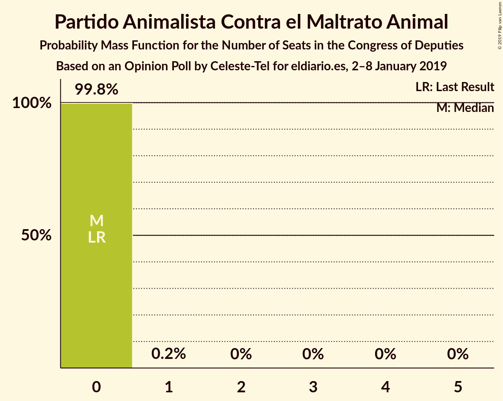
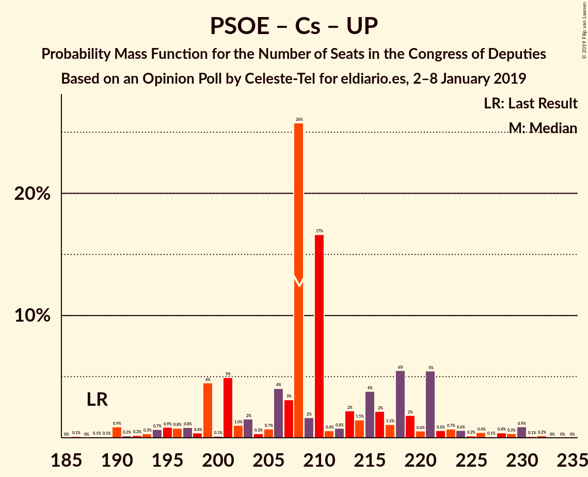
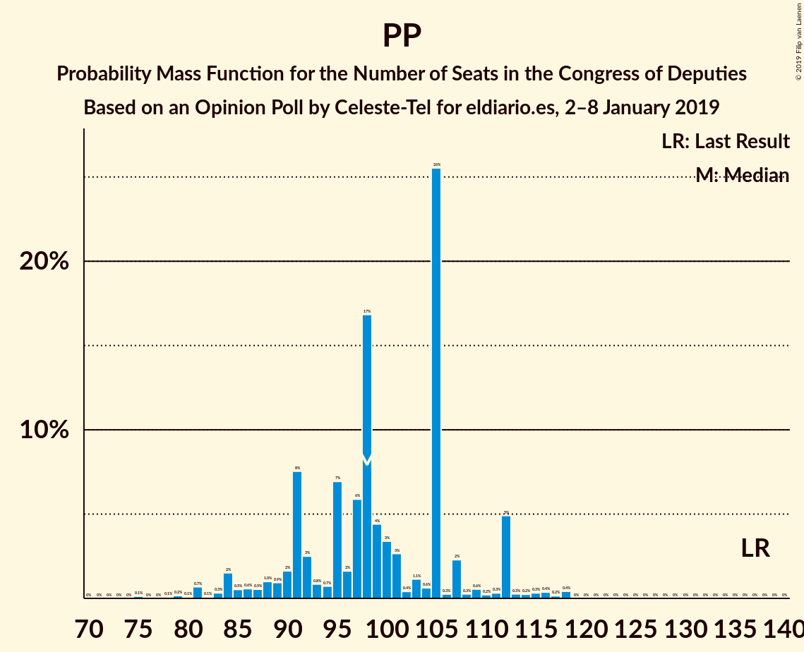
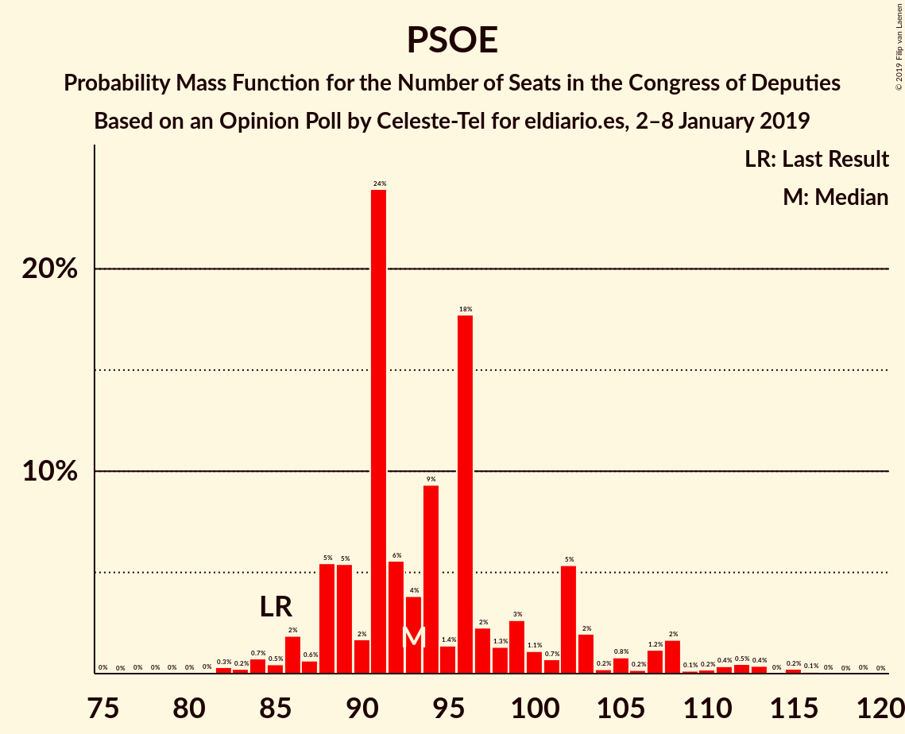

# Opinion Poll by Celeste-Tel for eldiario.es, 2–8 January 2019

<a href="#voting-intentions">Voting Intentions</a> | <a href="#seats">Seats</a> | <a href="#coalitions">Coalitions</a> | <a href="#technical-information">Technical Information</a>

## Voting Intentions

### Confidence Intervals

| Party | Last Result | Poll Result | 80% Confidence Interval | 90% Confidence Interval | 95% Confidence Interval | 99% Confidence Interval |
|:-----:|:-----------:|:-----------:|:-----------------------:|:-----------------------:|:-----------------------:|:-----------------------:|
| Partido Socialista Obrero Español | 22.6% | 24.1% | 22.5–25.8% |22.0–26.3% |21.6–26.7% |20.9–27.6% |
| Partido Popular | 33.0% | 23.8% | 22.2–25.5% |21.8–26.0% |21.4–26.4% |20.6–27.3% |
| Ciudadanos–Partido de la Ciudadanía | 13.1% | 19.6% | 18.2–21.2% |17.7–21.7% |17.4–22.1% |16.7–22.9% |
| Unidos Podemos | 21.2% | 16.1% | 14.7–17.6% |14.4–18.0% |14.0–18.4% |13.4–19.1% |
| Vox | 0.2% | 8.1% | 7.1–9.3% |6.8–9.6% |6.6–9.9% |6.2–10.4% |
| Esquerra Republicana de Catalunya–Catalunya Sí | 2.7% | 2.8% | 2.3–3.6% |2.1–3.8% |2.0–4.0% |1.8–4.4% |
| Partit Demòcrata Europeu Català | 2.0% | 1.5% | 1.2–2.1% |1.1–2.3% |1.0–2.5% |0.8–2.8% |
| Euzko Alderdi Jeltzalea/Partido Nacionalista Vasco | 1.2% | 1.0% | 0.7–1.5% |0.6–1.7% |0.6–1.8% |0.4–2.1% |
| Partido Animalista Contra el Maltrato Animal | 1.2% | 0.8% | 0.6–1.3% |0.5–1.4% |0.4–1.6% |0.3–1.8% |
| Euskal Herria Bildu | 0.8% | 0.7% | 0.5–1.2% |0.4–1.3% |0.4–1.4% |0.3–1.7% |
| Coalición Canaria–Partido Nacionalista Canario | 0.3% | 0.3% | 0.2–0.6% |0.1–0.7% |0.1–0.8% |0.1–1.0% |

*Note:* The poll result column reflects the actual value used in the calculations. Published results may vary slightly, and in addition be rounded to fewer digits.

## Seats

### Confidence Intervals

| Party | Last Result | Median | 80% Confidence Interval | 90% Confidence Interval | 95% Confidence Interval | 99% Confidence Interval |
|:-----:|:-----------:|:------:|:-----------------------:|:-----------------------:|:-----------------------:|:-----------------------:|
| <a href="#partido-socialista-obrero-español">Partido Socialista Obrero Español</a> | 85 | 96 | 89–99 |86–100 |86–107 |84–107 |
| <a href="#partido-popular">Partido Popular</a> | 137 | 98 | 92–104 |92–107 |90–111 |86–115 |
| <a href="#ciudadanos–partido-de-la-ciudadanía">Ciudadanos–Partido de la Ciudadanía</a> | 32 | 65 | 65–69 |61–69 |59–73 |55–80 |
| <a href="#unidos-podemos">Unidos Podemos</a> | 71 | 49 | 45–49 |42–53 |42–55 |35–61 |
| <a href="#vox">Vox</a> | 0 | 13 | 13–17 |12–21 |11–21 |9–23 |
| <a href="#esquerra-republicana-de-catalunya–catalunya-sí">Esquerra Republicana de Catalunya–Catalunya Sí</a> | 9 | 15 | 11–15 |9–15 |7–15 |7–16 |
| <a href="#partit-demòcrata-europeu-català">Partit Demòcrata Europeu Català</a> | 8 | 6 | 5–8 |4–10 |3–10 |1–10 |
| <a href="#euzko-alderdi-jeltzalea/partido-nacionalista-vasco">Euzko Alderdi Jeltzalea/Partido Nacionalista Vasco</a> | 5 | 3 | 3–6 |3–7 |3–7 |2–9 |
| <a href="#partido-animalista-contra-el-maltrato-animal">Partido Animalista Contra el Maltrato Animal</a> | 0 | 0 | 0 |0 |0 |0 |
| <a href="#euskal-herria-bildu">Euskal Herria Bildu</a> | 2 | 3 | 1–6 |1–7 |0–8 |0–8 |
| <a href="#coalición-canaria–partido-nacionalista-canario">Coalición Canaria–Partido Nacionalista Canario</a> | 1 | 2 | 1–2 |1–2 |0–2 |0–4 |

### Partido Socialista Obrero Español

*For a full overview of the results for this party, see the [Partido Socialista Obrero Español](party-partidosocialistaobreroespañol.html) page.*

| Number of Seats | Probability | Accumulated | Special Marks |
|:---------------:|:-----------:|:-----------:|:-------------:|
| 82 | 0.2% | 100% |  |
| 83 | 0% | 99.8% |  |
| 84 | 0.3% | 99.7% |  |
| 85 | 0.1% | 99.5% | Last Result |
| 86 | 5% | 99.4% |  |
| 87 | 0.2% | 95% |  |
| 88 | 0.7% | 94% |  |
| 89 | 5% | 94% |  |
| 90 | 1.3% | 88% |  |
| 91 | 0.6% | 87% |  |
| 92 | 1.2% | 86% |  |
| 93 | 0.2% | 85% |  |
| 94 | 0.9% | 85% |  |
| 95 | 2% | 84% |  |
| 96 | 71% | 82% | Median |
| 97 | 0.6% | 12% |  |
| 98 | 0% | 11% |  |
| 99 | 5% | 11% |  |
| 100 | 1.2% | 6% |  |
| 101 | 0.6% | 5% |  |
| 102 | 0.2% | 4% |  |
| 103 | 0% | 4% |  |
| 104 | 0.2% | 4% |  |
| 105 | 0% | 4% |  |
| 106 | 0% | 4% |  |
| 107 | 4% | 4% |  |
| 108 | 0% | 0.4% |  |
| 109 | 0% | 0.4% |  |
| 110 | 0% | 0.4% |  |
| 111 | 0.1% | 0.3% |  |
| 112 | 0% | 0.3% |  |
| 113 | 0.2% | 0.3% |  |
| 114 | 0% | 0.1% |  |
| 115 | 0% | 0% |  |

### Partido Popular

*For a full overview of the results for this party, see the [Partido Popular](party-partidopopular.html) page.*

| Number of Seats | Probability | Accumulated | Special Marks |
|:---------------:|:-----------:|:-----------:|:-------------:|
| 79 | 0.3% | 100% |  |
| 80 | 0% | 99.7% |  |
| 81 | 0.1% | 99.7% |  |
| 82 | 0% | 99.6% |  |
| 83 | 0% | 99.6% |  |
| 84 | 0% | 99.6% |  |
| 85 | 0% | 99.6% |  |
| 86 | 0.2% | 99.5% |  |
| 87 | 0% | 99.3% |  |
| 88 | 0.6% | 99.3% |  |
| 89 | 0.9% | 98.7% |  |
| 90 | 0.3% | 98% |  |
| 91 | 0% | 97% |  |
| 92 | 8% | 97% |  |
| 93 | 2% | 89% |  |
| 94 | 1.2% | 88% |  |
| 95 | 0.9% | 86% |  |
| 96 | 0.2% | 86% |  |
| 97 | 0.3% | 85% |  |
| 98 | 71% | 85% | Median |
| 99 | 0.5% | 14% |  |
| 100 | 0.3% | 14% |  |
| 101 | 0% | 14% |  |
| 102 | 0% | 14% |  |
| 103 | 3% | 13% |  |
| 104 | 1.1% | 10% |  |
| 105 | 1.1% | 9% |  |
| 106 | 0.2% | 8% |  |
| 107 | 4% | 8% |  |
| 108 | 0.1% | 4% |  |
| 109 | 0.6% | 3% |  |
| 110 | 0% | 3% |  |
| 111 | 0.9% | 3% |  |
| 112 | 0% | 2% |  |
| 113 | 1.0% | 2% |  |
| 114 | 0.3% | 0.9% |  |
| 115 | 0.3% | 0.6% |  |
| 116 | 0% | 0.3% |  |
| 117 | 0.2% | 0.2% |  |
| 118 | 0% | 0% |  |
| 119 | 0% | 0% |  |
| 120 | 0% | 0% |  |
| 121 | 0% | 0% |  |
| 122 | 0% | 0% |  |
| 123 | 0% | 0% |  |
| 124 | 0% | 0% |  |
| 125 | 0% | 0% |  |
| 126 | 0% | 0% |  |
| 127 | 0% | 0% |  |
| 128 | 0% | 0% |  |
| 129 | 0% | 0% |  |
| 130 | 0% | 0% |  |
| 131 | 0% | 0% |  |
| 132 | 0% | 0% |  |
| 133 | 0% | 0% |  |
| 134 | 0% | 0% |  |
| 135 | 0% | 0% |  |
| 136 | 0% | 0% |  |
| 137 | 0% | 0% | Last Result |

### Ciudadanos–Partido de la Ciudadanía

*For a full overview of the results for this party, see the [Ciudadanos–Partido de la Ciudadanía](party-ciudadanos–partidodelaciudadanía.html) page.*

| Number of Seats | Probability | Accumulated | Special Marks |
|:---------------:|:-----------:|:-----------:|:-------------:|
| 32 | 0% | 100% | Last Result |
| 33 | 0% | 100% |  |
| 34 | 0% | 100% |  |
| 35 | 0% | 100% |  |
| 36 | 0% | 100% |  |
| 37 | 0% | 100% |  |
| 38 | 0% | 100% |  |
| 39 | 0% | 100% |  |
| 40 | 0% | 100% |  |
| 41 | 0% | 100% |  |
| 42 | 0% | 100% |  |
| 43 | 0% | 100% |  |
| 44 | 0% | 100% |  |
| 45 | 0% | 100% |  |
| 46 | 0% | 100% |  |
| 47 | 0% | 100% |  |
| 48 | 0% | 100% |  |
| 49 | 0% | 100% |  |
| 50 | 0% | 100% |  |
| 51 | 0% | 100% |  |
| 52 | 0% | 100% |  |
| 53 | 0% | 100% |  |
| 54 | 0% | 100% |  |
| 55 | 0.5% | 99.9% |  |
| 56 | 0% | 99.5% |  |
| 57 | 0% | 99.4% |  |
| 58 | 0.1% | 99.4% |  |
| 59 | 4% | 99.3% |  |
| 60 | 0% | 95% |  |
| 61 | 1.0% | 95% |  |
| 62 | 1.5% | 94% |  |
| 63 | 0.2% | 93% |  |
| 64 | 0.3% | 93% |  |
| 65 | 72% | 92% | Median |
| 66 | 0.5% | 20% |  |
| 67 | 6% | 20% |  |
| 68 | 4% | 14% |  |
| 69 | 6% | 10% |  |
| 70 | 0.8% | 4% |  |
| 71 | 0.1% | 3% |  |
| 72 | 0.2% | 3% |  |
| 73 | 1.2% | 3% |  |
| 74 | 0.2% | 2% |  |
| 75 | 0.1% | 1.5% |  |
| 76 | 0.8% | 1.4% |  |
| 77 | 0% | 0.6% |  |
| 78 | 0% | 0.6% |  |
| 79 | 0% | 0.6% |  |
| 80 | 0.5% | 0.6% |  |
| 81 | 0% | 0% |  |

### Unidos Podemos

*For a full overview of the results for this party, see the [Unidos Podemos](party-unidospodemos.html) page.*

| Number of Seats | Probability | Accumulated | Special Marks |
|:---------------:|:-----------:|:-----------:|:-------------:|
| 34 | 0% | 100% |  |
| 35 | 0.5% | 99.9% |  |
| 36 | 0% | 99.4% |  |
| 37 | 0.1% | 99.4% |  |
| 38 | 0.2% | 99.3% |  |
| 39 | 0.4% | 99.1% |  |
| 40 | 0.3% | 98.7% |  |
| 41 | 0.2% | 98% |  |
| 42 | 4% | 98% |  |
| 43 | 1.1% | 94% |  |
| 44 | 0.7% | 93% |  |
| 45 | 3% | 92% |  |
| 46 | 1.3% | 89% |  |
| 47 | 5% | 88% |  |
| 48 | 0.4% | 83% |  |
| 49 | 75% | 83% | Median |
| 50 | 1.2% | 8% |  |
| 51 | 0% | 7% |  |
| 52 | 1.3% | 7% |  |
| 53 | 0.9% | 6% |  |
| 54 | 0% | 5% |  |
| 55 | 3% | 5% |  |
| 56 | 0.1% | 1.3% |  |
| 57 | 0% | 1.2% |  |
| 58 | 0.1% | 1.2% |  |
| 59 | 0% | 1.1% |  |
| 60 | 0.3% | 1.1% |  |
| 61 | 0.4% | 0.8% |  |
| 62 | 0.3% | 0.4% |  |
| 63 | 0% | 0.1% |  |
| 64 | 0% | 0% |  |
| 65 | 0% | 0% |  |
| 66 | 0% | 0% |  |
| 67 | 0% | 0% |  |
| 68 | 0% | 0% |  |
| 69 | 0% | 0% |  |
| 70 | 0% | 0% |  |
| 71 | 0% | 0% | Last Result |

### Vox

*For a full overview of the results for this party, see the [Vox](party-vox.html) page.*

| Number of Seats | Probability | Accumulated | Special Marks |
|:---------------:|:-----------:|:-----------:|:-------------:|
| 0 | 0% | 100% | Last Result |
| 1 | 0% | 100% |  |
| 2 | 0% | 100% |  |
| 3 | 0% | 100% |  |
| 4 | 0% | 100% |  |
| 5 | 0% | 100% |  |
| 6 | 0% | 100% |  |
| 7 | 0% | 100% |  |
| 8 | 0% | 99.9% |  |
| 9 | 1.2% | 99.9% |  |
| 10 | 0.3% | 98.8% |  |
| 11 | 3% | 98% |  |
| 12 | 2% | 96% |  |
| 13 | 72% | 94% | Median |
| 14 | 9% | 21% |  |
| 15 | 0% | 12% |  |
| 16 | 2% | 12% |  |
| 17 | 2% | 10% |  |
| 18 | 2% | 9% |  |
| 19 | 0.5% | 7% |  |
| 20 | 1.1% | 6% |  |
| 21 | 4% | 5% |  |
| 22 | 0.8% | 1.4% |  |
| 23 | 0.5% | 0.6% |  |
| 24 | 0% | 0.1% |  |
| 25 | 0% | 0% |  |

### Esquerra Republicana de Catalunya–Catalunya Sí

*For a full overview of the results for this party, see the [Esquerra Republicana de Catalunya–Catalunya Sí](party-esquerrarepublicanadecatalunya–catalunyasí.html) page.*

| Number of Seats | Probability | Accumulated | Special Marks |
|:---------------:|:-----------:|:-----------:|:-------------:|
| 7 | 3% | 100% |  |
| 8 | 1.4% | 97% |  |
| 9 | 2% | 95% | Last Result |
| 10 | 0.4% | 94% |  |
| 11 | 10% | 93% |  |
| 12 | 2% | 83% |  |
| 13 | 7% | 81% |  |
| 14 | 2% | 74% |  |
| 15 | 71% | 72% | Median |
| 16 | 0.8% | 1.1% |  |
| 17 | 0.3% | 0.3% |  |
| 18 | 0% | 0% |  |

### Partit Demòcrata Europeu Català

*For a full overview of the results for this party, see the [Partit Demòcrata Europeu Català](party-partitdemòcrataeuropeucatalà.html) page.*

| Number of Seats | Probability | Accumulated | Special Marks |
|:---------------:|:-----------:|:-----------:|:-------------:|
| 1 | 1.4% | 100% |  |
| 2 | 0.1% | 98.6% |  |
| 3 | 1.2% | 98% |  |
| 4 | 4% | 97% |  |
| 5 | 5% | 93% |  |
| 6 | 76% | 88% | Median |
| 7 | 1.0% | 12% |  |
| 8 | 5% | 11% | Last Result |
| 9 | 0% | 5% |  |
| 10 | 5% | 5% |  |
| 11 | 0% | 0% |  |

### Euzko Alderdi Jeltzalea/Partido Nacionalista Vasco

*For a full overview of the results for this party, see the [Euzko Alderdi Jeltzalea/Partido Nacionalista Vasco](party-euzkoalderdijeltzaleapartidonacionalistavasco.html) page.*

| Number of Seats | Probability | Accumulated | Special Marks |
|:---------------:|:-----------:|:-----------:|:-------------:|
| 2 | 2% | 100% |  |
| 3 | 79% | 98% | Median |
| 4 | 8% | 19% |  |
| 5 | 0.2% | 12% | Last Result |
| 6 | 6% | 12% |  |
| 7 | 4% | 6% |  |
| 8 | 0.8% | 2% |  |
| 9 | 0.9% | 0.9% |  |
| 10 | 0% | 0% |  |

### Partido Animalista Contra el Maltrato Animal

*For a full overview of the results for this party, see the [Partido Animalista Contra el Maltrato Animal](party-partidoanimalistacontraelmaltratoanimal.html) page.*

| Number of Seats | Probability | Accumulated | Special Marks |
|:---------------:|:-----------:|:-----------:|:-------------:|
| 0 | 99.9% | 100% | Last Result, Median |
| 1 | 0.1% | 0.1% |  |
| 2 | 0% | 0% |  |

### Euskal Herria Bildu

*For a full overview of the results for this party, see the [Euskal Herria Bildu](party-euskalherriabildu.html) page.*

| Number of Seats | Probability | Accumulated | Special Marks |
|:---------------:|:-----------:|:-----------:|:-------------:|
| 0 | 4% | 100% |  |
| 1 | 6% | 96% |  |
| 2 | 4% | 90% | Last Result |
| 3 | 71% | 86% | Median |
| 4 | 2% | 15% |  |
| 5 | 0.6% | 13% |  |
| 6 | 6% | 12% |  |
| 7 | 2% | 6% |  |
| 8 | 5% | 5% |  |
| 9 | 0% | 0% |  |

### Coalición Canaria–Partido Nacionalista Canario

*For a full overview of the results for this party, see the [Coalición Canaria–Partido Nacionalista Canario](party-coalicióncanaria–partidonacionalistacanario.html) page.*

| Number of Seats | Probability | Accumulated | Special Marks |
|:---------------:|:-----------:|:-----------:|:-------------:|
| 0 | 5% | 100% |  |
| 1 | 17% | 95% | Last Result |
| 2 | 77% | 78% | Median |
| 3 | 0.4% | 2% |  |
| 4 | 1.3% | 1.3% |  |
| 5 | 0% | 0% |  |

## Coalitions

### Confidence Intervals

| Coalition | Last Result | Median | Majority? | 80% Confidence Interval | 90% Confidence Interval | 95% Confidence Interval | 99% Confidence Interval |
|:---------:|:-----------:|:------:|:---------:|:-----------------------:|:-----------------------:|:-----------------------:|:-----------------------:|
| Partido Socialista Obrero Español – Partido Popular – Ciudadanos–Partido de la Ciudadanía | 254 | 259 | 100% | 257–261 | 255–266 | 254–269 | 245–274 |
| Partido Socialista Obrero Español – Ciudadanos–Partido de la Ciudadanía – Unidos Podemos | 188 | 210 | 100% | 206–215 | 194–222 | 190–223 | 190–226 |
| Partido Socialista Obrero Español – Partido Popular | 222 | 194 | 99.7% | 191–196 | 189–199 | 186–201 | 179–207 |
| Partido Popular – Ciudadanos–Partido de la Ciudadanía – Vox | 169 | 176 | 88% | 175–185 | 174–187 | 170–189 | 170–197 |
| Partido Socialista Obrero Español – Unidos Podemos – Esquerra Republicana de Catalunya–Catalunya Sí – Partit Demòcrata Europeu Català – Euzko Alderdi Jeltzalea/Partido Nacionalista Vasco – Euskal Herria Bildu | 180 | 172 | 4% | 163–174 | 162–175 | 160–179 | 152–179 |
| Partido Popular – Ciudadanos–Partido de la Ciudadanía – Coalición Canaria–Partido Nacionalista Canario | 170 | 165 | 3% | 162–168 | 161–173 | 160–177 | 152–182 |
| Partido Popular – Ciudadanos–Partido de la Ciudadanía | 169 | 163 | 3% | 161–167 | 160–171 | 159–176 | 151–181 |
| Partido Socialista Obrero Español – Ciudadanos–Partido de la Ciudadanía | 117 | 161 | 2% | 154–168 | 149–171 | 148–174 | 148–181 |
| Partido Socialista Obrero Español – Unidos Podemos – Esquerra Republicana de Catalunya–Catalunya Sí – Partit Demòcrata Europeu Català | 173 | 166 | 0.2% | 155–166 | 152–167 | 149–171 | 142–171 |
| Partido Socialista Obrero Español – Unidos Podemos – Esquerra Republicana de Catalunya–Catalunya Sí – Euskal Herria Bildu | 167 | 163 | 0.2% | 153–164 | 148–165 | 148–165 | 141–170 |
| Partido Socialista Obrero Español – Unidos Podemos – Euzko Alderdi Jeltzalea/Partido Nacionalista Vasco – Euskal Herria Bildu | 163 | 151 | 0% | 145–157 | 141–158 | 140–164 | 135–164 |
| Partido Socialista Obrero Español – Unidos Podemos | 156 | 145 | 0% | 138–146 | 131–150 | 131–156 | 125–157 |
| Partido Popular – Vox | 137 | 111 | 0% | 106–121 | 104–127 | 103–128 | 99–132 |
| Partido Popular | 137 | 98 | 0% | 92–104 | 92–107 | 90–111 | 86–115 |
| Partido Socialista Obrero Español | 85 | 96 | 0% | 89–99 | 86–100 | 86–107 | 84–107 |

### Partido Socialista Obrero Español – Partido Popular – Ciudadanos–Partido de la Ciudadanía

| Number of Seats | Probability | Accumulated | Special Marks |
|:---------------:|:-----------:|:-----------:|:-------------:|
| 240 | 0.3% | 100% |  |
| 241 | 0% | 99.7% |  |
| 242 | 0% | 99.7% |  |
| 243 | 0% | 99.7% |  |
| 244 | 0% | 99.7% |  |
| 245 | 0.2% | 99.6% |  |
| 246 | 0% | 99.4% |  |
| 247 | 0% | 99.4% |  |
| 248 | 0% | 99.4% |  |
| 249 | 0% | 99.4% |  |
| 250 | 1.0% | 99.3% |  |
| 251 | 0% | 98% |  |
| 252 | 0% | 98% |  |
| 253 | 0.6% | 98% |  |
| 254 | 0.2% | 98% | Last Result |
| 255 | 4% | 97% |  |
| 256 | 0.5% | 93% |  |
| 257 | 3% | 93% |  |
| 258 | 0.2% | 89% |  |
| 259 | 73% | 89% | Median |
| 260 | 6% | 16% |  |
| 261 | 3% | 11% |  |
| 262 | 2% | 8% |  |
| 263 | 0% | 6% |  |
| 264 | 0% | 6% |  |
| 265 | 0.6% | 6% |  |
| 266 | 3% | 6% |  |
| 267 | 0% | 3% |  |
| 268 | 0.1% | 3% |  |
| 269 | 1.5% | 3% |  |
| 270 | 0% | 1.3% |  |
| 271 | 0.2% | 1.3% |  |
| 272 | 0% | 1.1% |  |
| 273 | 0.3% | 1.1% |  |
| 274 | 0.5% | 0.8% |  |
| 275 | 0% | 0.2% |  |
| 276 | 0% | 0.2% |  |
| 277 | 0% | 0.2% |  |
| 278 | 0.2% | 0.2% |  |
| 279 | 0% | 0% |  |

### Partido Socialista Obrero Español – Ciudadanos–Partido de la Ciudadanía – Unidos Podemos

| Number of Seats | Probability | Accumulated | Special Marks |
|:---------------:|:-----------:|:-----------:|:-------------:|
| 186 | 0.4% | 100% |  |
| 187 | 0% | 99.5% |  |
| 188 | 0% | 99.5% | Last Result |
| 189 | 0% | 99.5% |  |
| 190 | 4% | 99.5% |  |
| 191 | 0% | 96% |  |
| 192 | 0.2% | 96% |  |
| 193 | 0.3% | 95% |  |
| 194 | 0.9% | 95% |  |
| 195 | 0.5% | 94% |  |
| 196 | 0% | 94% |  |
| 197 | 0% | 94% |  |
| 198 | 0.8% | 94% |  |
| 199 | 0% | 93% |  |
| 200 | 0% | 93% |  |
| 201 | 1.2% | 93% |  |
| 202 | 0.7% | 92% |  |
| 203 | 0% | 91% |  |
| 204 | 0% | 91% |  |
| 205 | 0.2% | 91% |  |
| 206 | 2% | 91% |  |
| 207 | 0% | 89% |  |
| 208 | 0% | 89% |  |
| 209 | 3% | 89% |  |
| 210 | 72% | 86% | Median |
| 211 | 1.3% | 14% |  |
| 212 | 0.1% | 13% |  |
| 213 | 0% | 13% |  |
| 214 | 0.7% | 13% |  |
| 215 | 5% | 12% |  |
| 216 | 0% | 6% |  |
| 217 | 0.8% | 6% |  |
| 218 | 0% | 6% |  |
| 219 | 0% | 6% |  |
| 220 | 0.2% | 6% |  |
| 221 | 0.3% | 5% |  |
| 222 | 0.9% | 5% |  |
| 223 | 3% | 4% |  |
| 224 | 0.1% | 2% |  |
| 225 | 0% | 1.4% |  |
| 226 | 1.3% | 1.4% |  |
| 227 | 0% | 0.1% |  |
| 228 | 0% | 0.1% |  |
| 229 | 0% | 0% |  |

### Partido Socialista Obrero Español – Partido Popular

| Number of Seats | Probability | Accumulated | Special Marks |
|:---------------:|:-----------:|:-----------:|:-------------:|
| 174 | 0.3% | 100% |  |
| 175 | 0% | 99.7% |  |
| 176 | 0% | 99.7% | Majority |
| 177 | 0% | 99.6% |  |
| 178 | 0.1% | 99.6% |  |
| 179 | 0.3% | 99.5% |  |
| 180 | 0% | 99.2% |  |
| 181 | 0% | 99.2% |  |
| 182 | 0.1% | 99.2% |  |
| 183 | 1.0% | 99.1% |  |
| 184 | 0% | 98% |  |
| 185 | 0.5% | 98% |  |
| 186 | 1.2% | 98% |  |
| 187 | 0.1% | 96% |  |
| 188 | 0.5% | 96% |  |
| 189 | 5% | 96% |  |
| 190 | 0% | 91% |  |
| 191 | 5% | 91% |  |
| 192 | 0.5% | 86% |  |
| 193 | 0% | 85% |  |
| 194 | 72% | 85% | Median |
| 195 | 0.4% | 13% |  |
| 196 | 4% | 12% |  |
| 197 | 1.1% | 9% |  |
| 198 | 0.2% | 7% |  |
| 199 | 4% | 7% |  |
| 200 | 0.8% | 3% |  |
| 201 | 0.1% | 3% |  |
| 202 | 0% | 2% |  |
| 203 | 0.2% | 2% |  |
| 204 | 1.1% | 2% |  |
| 205 | 0.3% | 1.2% |  |
| 206 | 0% | 0.8% |  |
| 207 | 0.6% | 0.8% |  |
| 208 | 0% | 0.2% |  |
| 209 | 0% | 0.2% |  |
| 210 | 0% | 0.2% |  |
| 211 | 0% | 0.2% |  |
| 212 | 0.2% | 0.2% |  |
| 213 | 0% | 0% |  |
| 214 | 0% | 0% |  |
| 215 | 0% | 0% |  |
| 216 | 0% | 0% |  |
| 217 | 0% | 0% |  |
| 218 | 0% | 0% |  |
| 219 | 0% | 0% |  |
| 220 | 0% | 0% |  |
| 221 | 0% | 0% |  |
| 222 | 0% | 0% | Last Result |

### Partido Popular – Ciudadanos–Partido de la Ciudadanía – Vox

| Number of Seats | Probability | Accumulated | Special Marks |
|:---------------:|:-----------:|:-----------:|:-------------:|
| 162 | 0.1% | 100% |  |
| 163 | 0% | 99.8% |  |
| 164 | 0% | 99.8% |  |
| 165 | 0% | 99.8% |  |
| 166 | 0% | 99.8% |  |
| 167 | 0% | 99.8% |  |
| 168 | 0.1% | 99.8% |  |
| 169 | 0% | 99.7% | Last Result |
| 170 | 3% | 99.7% |  |
| 171 | 0.1% | 97% |  |
| 172 | 0.4% | 97% |  |
| 173 | 0.9% | 96% |  |
| 174 | 1.5% | 95% |  |
| 175 | 6% | 94% |  |
| 176 | 71% | 88% | Median, Majority |
| 177 | 0.5% | 18% |  |
| 178 | 0.8% | 17% |  |
| 179 | 0.1% | 16% |  |
| 180 | 0% | 16% |  |
| 181 | 0.5% | 16% |  |
| 182 | 0.6% | 16% |  |
| 183 | 1.3% | 15% |  |
| 184 | 0.5% | 14% |  |
| 185 | 4% | 13% |  |
| 186 | 1.1% | 10% |  |
| 187 | 4% | 9% |  |
| 188 | 0.6% | 5% |  |
| 189 | 2% | 4% |  |
| 190 | 0.7% | 2% |  |
| 191 | 0% | 1.3% |  |
| 192 | 0.3% | 1.2% |  |
| 193 | 0% | 0.9% |  |
| 194 | 0% | 0.9% |  |
| 195 | 0.1% | 0.9% |  |
| 196 | 0.2% | 0.8% |  |
| 197 | 0.3% | 0.6% |  |
| 198 | 0% | 0.3% |  |
| 199 | 0.2% | 0.2% |  |
| 200 | 0% | 0% |  |

### Partido Socialista Obrero Español – Unidos Podemos – Esquerra Republicana de Catalunya–Catalunya Sí – Partit Demòcrata Europeu Català – Euzko Alderdi Jeltzalea/Partido Nacionalista Vasco – Euskal Herria Bildu

| Number of Seats | Probability | Accumulated | Special Marks |
|:---------------:|:-----------:|:-----------:|:-------------:|
| 151 | 0.2% | 100% |  |
| 152 | 0.5% | 99.7% |  |
| 153 | 0.1% | 99.2% |  |
| 154 | 0% | 99.1% |  |
| 155 | 0% | 99.1% |  |
| 156 | 0% | 99.1% |  |
| 157 | 0.3% | 99.0% |  |
| 158 | 0.6% | 98.7% |  |
| 159 | 0.2% | 98% |  |
| 160 | 1.5% | 98% |  |
| 161 | 1.1% | 97% |  |
| 162 | 4% | 95% |  |
| 163 | 5% | 91% |  |
| 164 | 1.1% | 87% |  |
| 165 | 0.5% | 86% |  |
| 166 | 0.1% | 85% |  |
| 167 | 0.7% | 85% |  |
| 168 | 0.5% | 84% |  |
| 169 | 0.1% | 84% |  |
| 170 | 0.1% | 84% |  |
| 171 | 0.4% | 84% |  |
| 172 | 71% | 83% | Median |
| 173 | 0.6% | 12% |  |
| 174 | 5% | 11% |  |
| 175 | 1.5% | 6% |  |
| 176 | 0.9% | 4% | Majority |
| 177 | 0.4% | 4% |  |
| 178 | 0.1% | 3% |  |
| 179 | 3% | 3% |  |
| 180 | 0.1% | 0.3% | Last Result |
| 181 | 0% | 0.3% |  |
| 182 | 0% | 0.2% |  |
| 183 | 0% | 0.2% |  |
| 184 | 0% | 0.2% |  |
| 185 | 0% | 0.2% |  |
| 186 | 0% | 0.2% |  |
| 187 | 0.1% | 0.2% |  |
| 188 | 0% | 0% |  |

### Partido Popular – Ciudadanos–Partido de la Ciudadanía – Coalición Canaria–Partido Nacionalista Canario

| Number of Seats | Probability | Accumulated | Special Marks |
|:---------------:|:-----------:|:-----------:|:-------------:|
| 148 | 0% | 100% |  |
| 149 | 0% | 99.9% |  |
| 150 | 0.1% | 99.9% |  |
| 151 | 0% | 99.8% |  |
| 152 | 0.3% | 99.8% |  |
| 153 | 0% | 99.5% |  |
| 154 | 0% | 99.5% |  |
| 155 | 0.1% | 99.4% |  |
| 156 | 0.3% | 99.4% |  |
| 157 | 0.1% | 99.1% |  |
| 158 | 0.2% | 99.0% |  |
| 159 | 0.1% | 98.8% |  |
| 160 | 3% | 98.7% |  |
| 161 | 1.3% | 95% |  |
| 162 | 6% | 94% |  |
| 163 | 0.9% | 89% |  |
| 164 | 0.1% | 88% |  |
| 165 | 71% | 87% | Median |
| 166 | 2% | 16% |  |
| 167 | 4% | 15% |  |
| 168 | 0.7% | 11% |  |
| 169 | 0.2% | 10% |  |
| 170 | 0% | 10% | Last Result |
| 171 | 1.2% | 10% |  |
| 172 | 2% | 8% |  |
| 173 | 3% | 7% |  |
| 174 | 0.8% | 4% |  |
| 175 | 0% | 3% |  |
| 176 | 0.2% | 3% | Majority |
| 177 | 1.2% | 3% |  |
| 178 | 0% | 1.4% |  |
| 179 | 0.1% | 1.4% |  |
| 180 | 0.7% | 1.3% |  |
| 181 | 0% | 0.5% |  |
| 182 | 0.2% | 0.5% |  |
| 183 | 0% | 0.3% |  |
| 184 | 0.3% | 0.3% |  |
| 185 | 0% | 0% |  |

### Partido Popular – Ciudadanos–Partido de la Ciudadanía

| Number of Seats | Probability | Accumulated | Special Marks |
|:---------------:|:-----------:|:-----------:|:-------------:|
| 147 | 0% | 100% |  |
| 148 | 0% | 99.9% |  |
| 149 | 0.1% | 99.9% |  |
| 150 | 0% | 99.8% |  |
| 151 | 0.3% | 99.8% |  |
| 152 | 0% | 99.5% |  |
| 153 | 0% | 99.5% |  |
| 154 | 0.1% | 99.4% |  |
| 155 | 0.4% | 99.3% |  |
| 156 | 0% | 98.9% |  |
| 157 | 0.2% | 98.9% |  |
| 158 | 0% | 98.7% |  |
| 159 | 4% | 98.7% |  |
| 160 | 0.9% | 95% |  |
| 161 | 5% | 94% |  |
| 162 | 2% | 89% |  |
| 163 | 71% | 88% | Median |
| 164 | 0.5% | 17% |  |
| 165 | 0.8% | 16% |  |
| 166 | 5% | 15% |  |
| 167 | 1.2% | 10% |  |
| 168 | 0.4% | 9% |  |
| 169 | 0.2% | 9% | Last Result |
| 170 | 0.4% | 8% |  |
| 171 | 3% | 8% |  |
| 172 | 1.4% | 5% |  |
| 173 | 0.5% | 3% |  |
| 174 | 0% | 3% |  |
| 175 | 0% | 3% |  |
| 176 | 1.4% | 3% | Majority |
| 177 | 0.1% | 1.4% |  |
| 178 | 0.7% | 1.3% |  |
| 179 | 0% | 0.5% |  |
| 180 | 0% | 0.5% |  |
| 181 | 0.2% | 0.5% |  |
| 182 | 0% | 0.3% |  |
| 183 | 0.3% | 0.3% |  |
| 184 | 0% | 0% |  |

### Partido Socialista Obrero Español – Ciudadanos–Partido de la Ciudadanía

| Number of Seats | Probability | Accumulated | Special Marks |
|:---------------:|:-----------:|:-----------:|:-------------:|
| 117 | 0% | 100% | Last Result |
| 118 | 0% | 100% |  |
| 119 | 0% | 100% |  |
| 120 | 0% | 100% |  |
| 121 | 0% | 100% |  |
| 122 | 0% | 100% |  |
| 123 | 0% | 100% |  |
| 124 | 0% | 100% |  |
| 125 | 0% | 100% |  |
| 126 | 0% | 100% |  |
| 127 | 0% | 100% |  |
| 128 | 0% | 100% |  |
| 129 | 0% | 100% |  |
| 130 | 0% | 100% |  |
| 131 | 0% | 100% |  |
| 132 | 0% | 100% |  |
| 133 | 0% | 100% |  |
| 134 | 0% | 100% |  |
| 135 | 0% | 100% |  |
| 136 | 0% | 100% |  |
| 137 | 0% | 100% |  |
| 138 | 0% | 100% |  |
| 139 | 0% | 100% |  |
| 140 | 0% | 100% |  |
| 141 | 0% | 100% |  |
| 142 | 0% | 100% |  |
| 143 | 0% | 100% |  |
| 144 | 0% | 99.9% |  |
| 145 | 0% | 99.9% |  |
| 146 | 0.3% | 99.9% |  |
| 147 | 0% | 99.7% |  |
| 148 | 4% | 99.6% |  |
| 149 | 0.4% | 95% |  |
| 150 | 0.3% | 95% |  |
| 151 | 0.9% | 95% |  |
| 152 | 0.2% | 94% |  |
| 153 | 0.6% | 93% |  |
| 154 | 4% | 93% |  |
| 155 | 0.3% | 89% |  |
| 156 | 2% | 89% |  |
| 157 | 2% | 87% |  |
| 158 | 0.5% | 85% |  |
| 159 | 0.1% | 85% |  |
| 160 | 0.1% | 85% |  |
| 161 | 71% | 85% | Median |
| 162 | 0.2% | 14% |  |
| 163 | 0.1% | 13% |  |
| 164 | 0.2% | 13% |  |
| 165 | 1.3% | 13% |  |
| 166 | 0.2% | 12% |  |
| 167 | 0% | 12% |  |
| 168 | 5% | 12% |  |
| 169 | 0.1% | 6% |  |
| 170 | 0.8% | 6% |  |
| 171 | 0.3% | 5% |  |
| 172 | 0% | 5% |  |
| 173 | 0.5% | 5% |  |
| 174 | 3% | 4% |  |
| 175 | 0% | 2% |  |
| 176 | 0.8% | 2% | Majority |
| 177 | 0% | 0.9% |  |
| 178 | 0% | 0.9% |  |
| 179 | 0.2% | 0.8% |  |
| 180 | 0% | 0.6% |  |
| 181 | 0.5% | 0.6% |  |
| 182 | 0% | 0.1% |  |
| 183 | 0% | 0.1% |  |
| 184 | 0% | 0.1% |  |
| 185 | 0% | 0.1% |  |
| 186 | 0% | 0.1% |  |
| 187 | 0% | 0.1% |  |
| 188 | 0% | 0% |  |

### Partido Socialista Obrero Español – Unidos Podemos – Esquerra Republicana de Catalunya–Catalunya Sí – Partit Demòcrata Europeu Català

| Number of Seats | Probability | Accumulated | Special Marks |
|:---------------:|:-----------:|:-----------:|:-------------:|
| 142 | 0.8% | 100% |  |
| 143 | 0% | 99.2% |  |
| 144 | 0% | 99.2% |  |
| 145 | 0.1% | 99.2% |  |
| 146 | 0% | 99.1% |  |
| 147 | 0% | 99.1% |  |
| 148 | 0.5% | 99.1% |  |
| 149 | 2% | 98.5% |  |
| 150 | 1.3% | 97% |  |
| 151 | 0% | 96% |  |
| 152 | 4% | 96% |  |
| 153 | 0% | 92% |  |
| 154 | 0% | 91% |  |
| 155 | 2% | 91% |  |
| 156 | 0.7% | 90% |  |
| 157 | 0.1% | 89% |  |
| 158 | 0.3% | 89% |  |
| 159 | 3% | 89% |  |
| 160 | 1.1% | 85% |  |
| 161 | 0.2% | 84% |  |
| 162 | 0.3% | 84% |  |
| 163 | 5% | 84% |  |
| 164 | 0.5% | 78% |  |
| 165 | 0.9% | 78% |  |
| 166 | 71% | 77% | Median |
| 167 | 0.7% | 6% |  |
| 168 | 0.1% | 5% |  |
| 169 | 0.8% | 5% |  |
| 170 | 0.8% | 4% |  |
| 171 | 3% | 3% |  |
| 172 | 0% | 0.3% |  |
| 173 | 0% | 0.3% | Last Result |
| 174 | 0% | 0.2% |  |
| 175 | 0% | 0.2% |  |
| 176 | 0.1% | 0.2% | Majority |
| 177 | 0% | 0.1% |  |
| 178 | 0% | 0.1% |  |
| 179 | 0% | 0.1% |  |
| 180 | 0% | 0% |  |

### Partido Socialista Obrero Español – Unidos Podemos – Esquerra Republicana de Catalunya–Catalunya Sí – Euskal Herria Bildu

| Number of Seats | Probability | Accumulated | Special Marks |
|:---------------:|:-----------:|:-----------:|:-------------:|
| 139 | 0.2% | 100% |  |
| 140 | 0.2% | 99.7% |  |
| 141 | 1.2% | 99.5% |  |
| 142 | 0% | 98% |  |
| 143 | 0% | 98% |  |
| 144 | 0% | 98% |  |
| 145 | 0.1% | 98% |  |
| 146 | 0% | 98% |  |
| 147 | 0.4% | 98% |  |
| 148 | 4% | 98% |  |
| 149 | 0% | 94% |  |
| 150 | 0% | 94% |  |
| 151 | 0.2% | 93% |  |
| 152 | 0.8% | 93% |  |
| 153 | 3% | 93% |  |
| 154 | 5% | 90% |  |
| 155 | 0.7% | 85% |  |
| 156 | 0.1% | 84% |  |
| 157 | 0.1% | 84% |  |
| 158 | 0.5% | 84% |  |
| 159 | 0.3% | 84% |  |
| 160 | 0.7% | 83% |  |
| 161 | 0.7% | 82% |  |
| 162 | 0.6% | 82% |  |
| 163 | 71% | 81% | Median |
| 164 | 3% | 11% |  |
| 165 | 6% | 8% |  |
| 166 | 0% | 2% |  |
| 167 | 0% | 2% | Last Result |
| 168 | 0% | 2% |  |
| 169 | 0.9% | 2% |  |
| 170 | 0.8% | 1.1% |  |
| 171 | 0% | 0.2% |  |
| 172 | 0% | 0.2% |  |
| 173 | 0% | 0.2% |  |
| 174 | 0% | 0.2% |  |
| 175 | 0% | 0.2% |  |
| 176 | 0% | 0.2% | Majority |
| 177 | 0% | 0.2% |  |
| 178 | 0% | 0.1% |  |
| 179 | 0.1% | 0.1% |  |
| 180 | 0% | 0% |  |

### Partido Socialista Obrero Español – Unidos Podemos – Euzko Alderdi Jeltzalea/Partido Nacionalista Vasco – Euskal Herria Bildu

| Number of Seats | Probability | Accumulated | Special Marks |
|:---------------:|:-----------:|:-----------:|:-------------:|
| 133 | 0.2% | 100% |  |
| 134 | 0% | 99.8% |  |
| 135 | 0.5% | 99.7% |  |
| 136 | 0% | 99.2% |  |
| 137 | 0.2% | 99.2% |  |
| 138 | 0.2% | 99.0% |  |
| 139 | 1.2% | 98.8% |  |
| 140 | 0.1% | 98% |  |
| 141 | 4% | 97% |  |
| 142 | 0% | 94% |  |
| 143 | 0.8% | 94% |  |
| 144 | 0.4% | 93% |  |
| 145 | 3% | 92% |  |
| 146 | 2% | 89% |  |
| 147 | 0% | 87% |  |
| 148 | 1.1% | 87% |  |
| 149 | 0.5% | 85% |  |
| 150 | 0.7% | 85% |  |
| 151 | 71% | 84% | Median |
| 152 | 0% | 13% |  |
| 153 | 0.7% | 13% |  |
| 154 | 0.9% | 12% |  |
| 155 | 0.3% | 11% |  |
| 156 | 0.3% | 11% |  |
| 157 | 5% | 11% |  |
| 158 | 1.2% | 6% |  |
| 159 | 0.3% | 4% |  |
| 160 | 0.1% | 4% |  |
| 161 | 0.1% | 4% |  |
| 162 | 0% | 4% |  |
| 163 | 0.8% | 4% | Last Result |
| 164 | 3% | 3% |  |
| 165 | 0% | 0.2% |  |
| 166 | 0% | 0.2% |  |
| 167 | 0% | 0.2% |  |
| 168 | 0.1% | 0.2% |  |
| 169 | 0% | 0% |  |

### Partido Socialista Obrero Español – Unidos Podemos

| Number of Seats | Probability | Accumulated | Special Marks |
|:---------------:|:-----------:|:-----------:|:-------------:|
| 124 | 0.3% | 100% |  |
| 125 | 0.5% | 99.7% |  |
| 126 | 0.2% | 99.2% |  |
| 127 | 0% | 99.0% |  |
| 128 | 0% | 99.0% |  |
| 129 | 0.9% | 99.0% |  |
| 130 | 0% | 98% |  |
| 131 | 4% | 98% |  |
| 132 | 0.1% | 94% |  |
| 133 | 0.6% | 94% |  |
| 134 | 2% | 93% |  |
| 135 | 0% | 91% |  |
| 136 | 0% | 91% |  |
| 137 | 0% | 91% |  |
| 138 | 2% | 91% |  |
| 139 | 0.5% | 90% |  |
| 140 | 0.2% | 89% |  |
| 141 | 4% | 89% |  |
| 142 | 0% | 85% |  |
| 143 | 0.5% | 85% |  |
| 144 | 1.1% | 85% |  |
| 145 | 71% | 84% | Median |
| 146 | 5% | 13% |  |
| 147 | 0.8% | 7% |  |
| 148 | 0.4% | 6% |  |
| 149 | 0.6% | 6% |  |
| 150 | 0.5% | 5% |  |
| 151 | 0% | 5% |  |
| 152 | 0.8% | 5% |  |
| 153 | 0% | 4% |  |
| 154 | 0% | 4% |  |
| 155 | 0% | 4% |  |
| 156 | 3% | 4% | Last Result |
| 157 | 0.9% | 1.0% |  |
| 158 | 0% | 0.1% |  |
| 159 | 0% | 0.1% |  |
| 160 | 0% | 0% |  |

### Partido Popular – Vox

| Number of Seats | Probability | Accumulated | Special Marks |
|:---------------:|:-----------:|:-----------:|:-------------:|
| 95 | 0% | 100% |  |
| 96 | 0% | 99.9% |  |
| 97 | 0% | 99.9% |  |
| 98 | 0.3% | 99.9% |  |
| 99 | 0.2% | 99.6% |  |
| 100 | 0% | 99.5% |  |
| 101 | 0.1% | 99.4% |  |
| 102 | 0.6% | 99.3% |  |
| 103 | 4% | 98.8% |  |
| 104 | 0.3% | 95% |  |
| 105 | 1.3% | 95% |  |
| 106 | 5% | 94% |  |
| 107 | 0.1% | 89% |  |
| 108 | 0.4% | 88% |  |
| 109 | 0.3% | 88% |  |
| 110 | 2% | 88% |  |
| 111 | 71% | 86% | Median |
| 112 | 0.3% | 15% |  |
| 113 | 0.3% | 15% |  |
| 114 | 0.1% | 15% |  |
| 115 | 0.2% | 15% |  |
| 116 | 0.3% | 14% |  |
| 117 | 4% | 14% |  |
| 118 | 0% | 10% |  |
| 119 | 0% | 10% |  |
| 120 | 0% | 10% |  |
| 121 | 0.4% | 10% |  |
| 122 | 2% | 10% |  |
| 123 | 0% | 8% |  |
| 124 | 2% | 8% |  |
| 125 | 0.8% | 6% |  |
| 126 | 0% | 5% |  |
| 127 | 0.4% | 5% |  |
| 128 | 4% | 5% |  |
| 129 | 0.3% | 1.0% |  |
| 130 | 0% | 0.6% |  |
| 131 | 0% | 0.6% |  |
| 132 | 0.1% | 0.6% |  |
| 133 | 0% | 0.5% |  |
| 134 | 0% | 0.5% |  |
| 135 | 0.2% | 0.4% |  |
| 136 | 0% | 0.2% |  |
| 137 | 0.2% | 0.2% | Last Result |
| 138 | 0% | 0% |  |

### Partido Popular

| Number of Seats | Probability | Accumulated | Special Marks |
|:---------------:|:-----------:|:-----------:|:-------------:|
| 79 | 0.3% | 100% |  |
| 80 | 0% | 99.7% |  |
| 81 | 0.1% | 99.7% |  |
| 82 | 0% | 99.6% |  |
| 83 | 0% | 99.6% |  |
| 84 | 0% | 99.6% |  |
| 85 | 0% | 99.6% |  |
| 86 | 0.2% | 99.5% |  |
| 87 | 0% | 99.3% |  |
| 88 | 0.6% | 99.3% |  |
| 89 | 0.9% | 98.7% |  |
| 90 | 0.3% | 98% |  |
| 91 | 0% | 97% |  |
| 92 | 8% | 97% |  |
| 93 | 2% | 89% |  |
| 94 | 1.2% | 88% |  |
| 95 | 0.9% | 86% |  |
| 96 | 0.2% | 86% |  |
| 97 | 0.3% | 85% |  |
| 98 | 71% | 85% | Median |
| 99 | 0.5% | 14% |  |
| 100 | 0.3% | 14% |  |
| 101 | 0% | 14% |  |
| 102 | 0% | 14% |  |
| 103 | 3% | 13% |  |
| 104 | 1.1% | 10% |  |
| 105 | 1.1% | 9% |  |
| 106 | 0.2% | 8% |  |
| 107 | 4% | 8% |  |
| 108 | 0.1% | 4% |  |
| 109 | 0.6% | 3% |  |
| 110 | 0% | 3% |  |
| 111 | 0.9% | 3% |  |
| 112 | 0% | 2% |  |
| 113 | 1.0% | 2% |  |
| 114 | 0.3% | 0.9% |  |
| 115 | 0.3% | 0.6% |  |
| 116 | 0% | 0.3% |  |
| 117 | 0.2% | 0.2% |  |
| 118 | 0% | 0% |  |
| 119 | 0% | 0% |  |
| 120 | 0% | 0% |  |
| 121 | 0% | 0% |  |
| 122 | 0% | 0% |  |
| 123 | 0% | 0% |  |
| 124 | 0% | 0% |  |
| 125 | 0% | 0% |  |
| 126 | 0% | 0% |  |
| 127 | 0% | 0% |  |
| 128 | 0% | 0% |  |
| 129 | 0% | 0% |  |
| 130 | 0% | 0% |  |
| 131 | 0% | 0% |  |
| 132 | 0% | 0% |  |
| 133 | 0% | 0% |  |
| 134 | 0% | 0% |  |
| 135 | 0% | 0% |  |
| 136 | 0% | 0% |  |
| 137 | 0% | 0% | Last Result |

### Partido Socialista Obrero Español

| Number of Seats | Probability | Accumulated | Special Marks |
|:---------------:|:-----------:|:-----------:|:-------------:|
| 82 | 0.2% | 100% |  |
| 83 | 0% | 99.8% |  |
| 84 | 0.3% | 99.7% |  |
| 85 | 0.1% | 99.5% | Last Result |
| 86 | 5% | 99.4% |  |
| 87 | 0.2% | 95% |  |
| 88 | 0.7% | 94% |  |
| 89 | 5% | 94% |  |
| 90 | 1.3% | 88% |  |
| 91 | 0.6% | 87% |  |
| 92 | 1.2% | 86% |  |
| 93 | 0.2% | 85% |  |
| 94 | 0.9% | 85% |  |
| 95 | 2% | 84% |  |
| 96 | 71% | 82% | Median |
| 97 | 0.6% | 12% |  |
| 98 | 0% | 11% |  |
| 99 | 5% | 11% |  |
| 100 | 1.2% | 6% |  |
| 101 | 0.6% | 5% |  |
| 102 | 0.2% | 4% |  |
| 103 | 0% | 4% |  |
| 104 | 0.2% | 4% |  |
| 105 | 0% | 4% |  |
| 106 | 0% | 4% |  |
| 107 | 4% | 4% |  |
| 108 | 0% | 0.4% |  |
| 109 | 0% | 0.4% |  |
| 110 | 0% | 0.4% |  |
| 111 | 0.1% | 0.3% |  |
| 112 | 0% | 0.3% |  |
| 113 | 0.2% | 0.3% |  |
| 114 | 0% | 0.1% |  |
| 115 | 0% | 0% |  |

## Technical Information

### Opinion Poll

+ **Polling firm:** Celeste-Tel
+ **Commissioner(s):** eldiario.es
+ **Fieldwork period:** 2–8 January 2019

### Calculations

+ **Sample size:** 1100
+ **Simulations done:** 131,072
+ **Error estimate:** 1.05%

