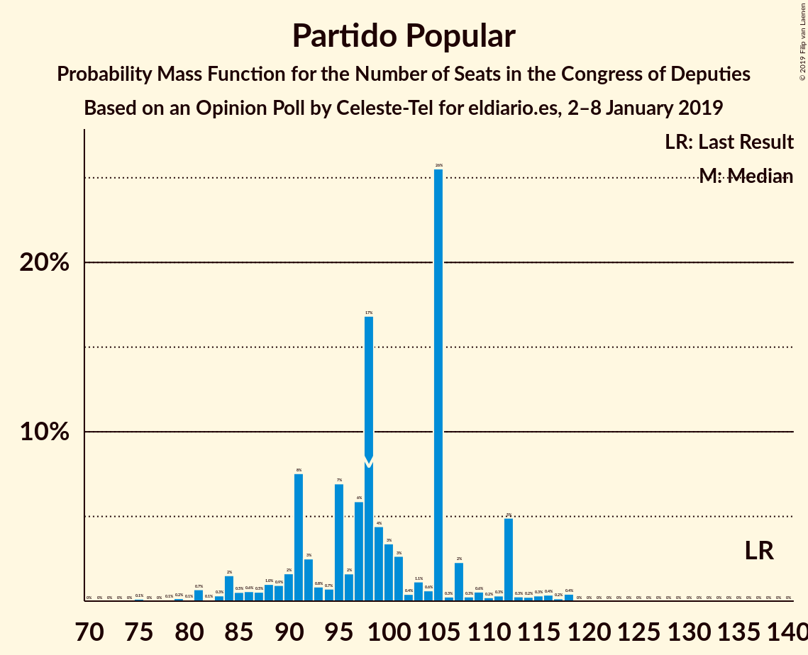
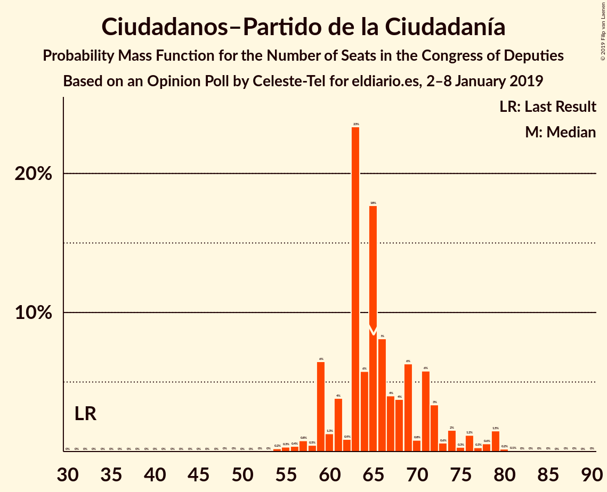
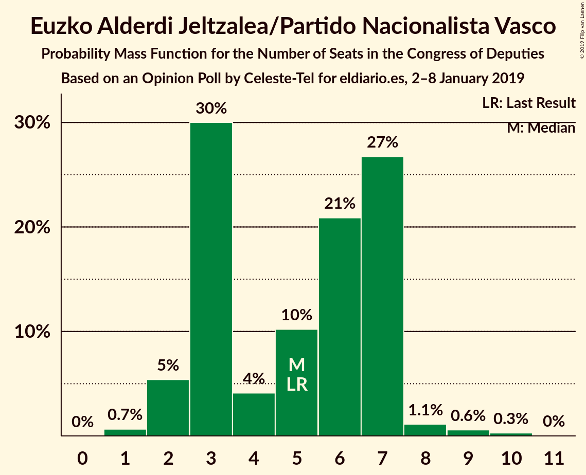
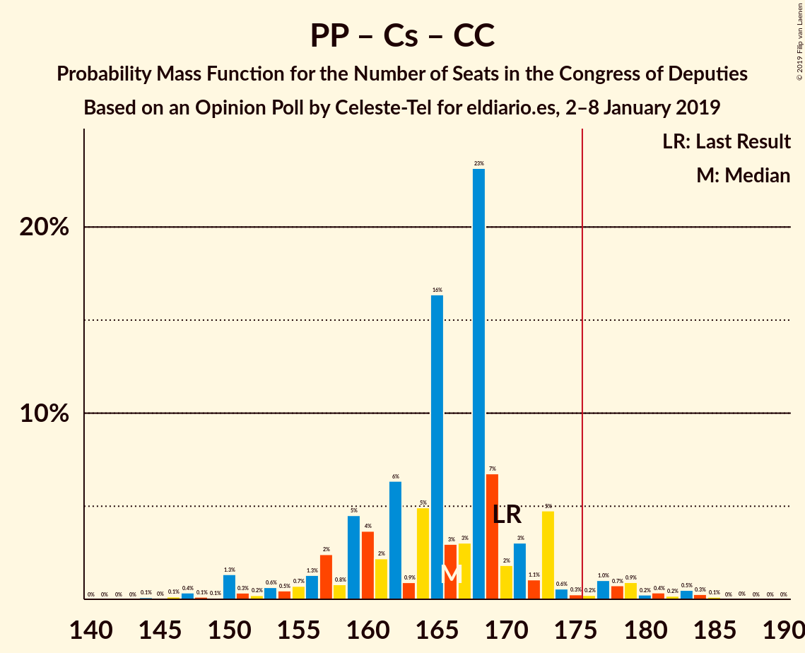
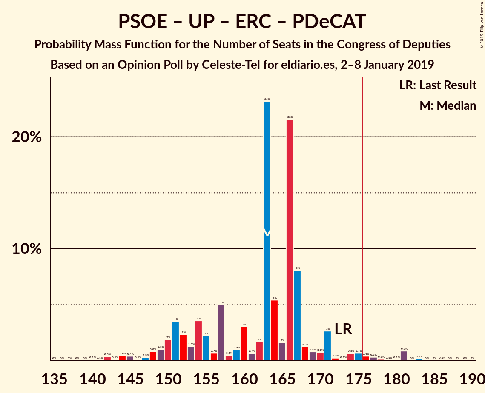

# Opinion Poll by Celeste-Tel for eldiario.es, 2–8 January 2019

<a href="#voting-intentions">Voting Intentions</a> | <a href="#seats">Seats</a> | <a href="#coalitions">Coalitions</a> | <a href="#technical-information">Technical Information</a>

## Voting Intentions

### Confidence Intervals

| Party | Last Result | Poll Result | 80% Confidence Interval | 90% Confidence Interval | 95% Confidence Interval | 99% Confidence Interval |
|:-----:|:-----------:|:-----------:|:-----------------------:|:-----------------------:|:-----------------------:|:-----------------------:|
| Partido Socialista Obrero Español | 22.6% | 24.1% | 22.5–25.8% |22.0–26.3% |21.6–26.7% |20.9–27.6% |
| Partido Popular | 33.0% | 23.8% | 22.2–25.5% |21.8–26.0% |21.4–26.4% |20.6–27.3% |
| Ciudadanos–Partido de la Ciudadanía | 13.1% | 19.6% | 18.2–21.2% |17.7–21.7% |17.4–22.1% |16.7–22.9% |
| Unidos Podemos | 21.2% | 16.1% | 14.7–17.6% |14.4–18.0% |14.0–18.4% |13.4–19.1% |
| Vox | 0.2% | 8.1% | 7.1–9.3% |6.8–9.6% |6.6–9.9% |6.2–10.4% |
| Esquerra Republicana de Catalunya–Catalunya Sí | 2.7% | 2.8% | 2.3–3.6% |2.1–3.8% |2.0–4.0% |1.8–4.4% |
| Partit Demòcrata Europeu Català | 2.0% | 1.5% | 1.2–2.1% |1.1–2.3% |1.0–2.5% |0.8–2.8% |
| Euzko Alderdi Jeltzalea/Partido Nacionalista Vasco | 1.2% | 1.0% | 0.7–1.5% |0.6–1.7% |0.6–1.8% |0.4–2.1% |
| Partido Animalista Contra el Maltrato Animal | 1.2% | 0.8% | 0.6–1.3% |0.5–1.4% |0.4–1.6% |0.3–1.8% |
| Euskal Herria Bildu | 0.8% | 0.7% | 0.5–1.2% |0.4–1.3% |0.4–1.4% |0.3–1.7% |
| Coalición Canaria–Partido Nacionalista Canario | 0.3% | 0.3% | 0.2–0.6% |0.1–0.7% |0.1–0.8% |0.1–1.0% |

*Note:* The poll result column reflects the actual value used in the calculations. Published results may vary slightly, and in addition be rounded to fewer digits.

## Seats

### Confidence Intervals

| Party | Last Result | Median | 80% Confidence Interval | 90% Confidence Interval | 95% Confidence Interval | 99% Confidence Interval |
|:-----:|:-----------:|:------:|:-----------------------:|:-----------------------:|:-----------------------:|:-----------------------:|
| <a href="#partido-socialista-obrero-español">Partido Socialista Obrero Español</a> | 85 | 101 | 88–101 |86–101 |86–101 |86–101 |
| <a href="#partido-popular">Partido Popular</a> | 137 | 108 | 85–108 |85–110 |83–115 |83–115 |
| <a href="#ciudadanos–partido-de-la-ciudadanía">Ciudadanos–Partido de la Ciudadanía</a> | 32 | 55 | 55–76 |55–76 |52–76 |52–76 |
| <a href="#unidos-podemos">Unidos Podemos</a> | 71 | 43 | 43–61 |43–61 |43–61 |43–61 |
| <a href="#vox">Vox</a> | 0 | 14 | 10–18 |10–19 |7–19 |7–19 |
| <a href="#esquerra-republicana-de-catalunya–catalunya-sí">Esquerra Republicana de Catalunya–Catalunya Sí</a> | 9 | 9 | 9–13 |9–13 |9–13 |9–16 |
| <a href="#partit-demòcrata-europeu-català">Partit Demòcrata Europeu Català</a> | 8 | 0 | 0 |0 |0 |0 |
| <a href="#euzko-alderdi-jeltzalea/partido-nacionalista-vasco">Euzko Alderdi Jeltzalea/Partido Nacionalista Vasco</a> | 5 | 8 | 3–8 |3–8 |3–8 |3–8 |
| <a href="#partido-animalista-contra-el-maltrato-animal">Partido Animalista Contra el Maltrato Animal</a> | 0 | 0 | 0 |0 |0 |0 |
| <a href="#euskal-herria-bildu">Euskal Herria Bildu</a> | 2 | 0 | 0–4 |0–4 |0–7 |0–7 |
| <a href="#coalición-canaria–partido-nacionalista-canario">Coalición Canaria–Partido Nacionalista Canario</a> | 1 | 4 | 0–4 |0–4 |0–4 |0–4 |

### Partido Socialista Obrero Español

*For a full overview of the results for this party, see the [Partido Socialista Obrero Español](party-partidosocialistaobreroespañol.html) page.*

| Number of Seats | Probability | Accumulated | Special Marks |
|:---------------:|:-----------:|:-----------:|:-------------:|
| 85 | 0.3% | 100% | Last Result |
| 86 | 8% | 99.7% |  |
| 87 | 0.1% | 92% |  |
| 88 | 3% | 92% |  |
| 89 | 0% | 89% |  |
| 90 | 12% | 89% |  |
| 91 | 0% | 78% |  |
| 92 | 0% | 78% |  |
| 93 | 0.9% | 78% |  |
| 94 | 0% | 77% |  |
| 95 | 0% | 77% |  |
| 96 | 8% | 77% |  |
| 97 | 0% | 69% |  |
| 98 | 0% | 69% |  |
| 99 | 0% | 69% |  |
| 100 | 0% | 69% |  |
| 101 | 69% | 69% | Median |
| 102 | 0% | 0.1% |  |
| 103 | 0% | 0.1% |  |
| 104 | 0% | 0.1% |  |
| 105 | 0% | 0.1% |  |
| 106 | 0.1% | 0.1% |  |
| 107 | 0% | 0% |  |

### Partido Popular

*For a full overview of the results for this party, see the [Partido Popular](party-partidopopular.html) page.*

| Number of Seats | Probability | Accumulated | Special Marks |
|:---------------:|:-----------:|:-----------:|:-------------:|
| 83 | 4% | 100% |  |
| 84 | 0% | 96% |  |
| 85 | 11% | 96% |  |
| 86 | 0% | 85% |  |
| 87 | 0% | 85% |  |
| 88 | 0% | 85% |  |
| 89 | 0.1% | 85% |  |
| 90 | 0% | 85% |  |
| 91 | 0% | 85% |  |
| 92 | 0.1% | 85% |  |
| 93 | 0% | 85% |  |
| 94 | 8% | 85% |  |
| 95 | 0% | 77% |  |
| 96 | 0% | 77% |  |
| 97 | 0% | 77% |  |
| 98 | 0.4% | 77% |  |
| 99 | 0% | 77% |  |
| 100 | 0.9% | 77% |  |
| 101 | 0% | 76% |  |
| 102 | 0.2% | 76% |  |
| 103 | 0.3% | 76% |  |
| 104 | 0% | 75% |  |
| 105 | 0% | 75% |  |
| 106 | 0% | 75% |  |
| 107 | 0% | 75% |  |
| 108 | 69% | 75% | Median |
| 109 | 0% | 6% |  |
| 110 | 4% | 6% |  |
| 111 | 0% | 3% |  |
| 112 | 0% | 3% |  |
| 113 | 0% | 3% |  |
| 114 | 0% | 3% |  |
| 115 | 3% | 3% |  |
| 116 | 0% | 0.3% |  |
| 117 | 0% | 0.3% |  |
| 118 | 0% | 0.3% |  |
| 119 | 0% | 0.3% |  |
| 120 | 0.3% | 0.3% |  |
| 121 | 0% | 0% |  |
| 122 | 0% | 0% |  |
| 123 | 0% | 0% |  |
| 124 | 0% | 0% |  |
| 125 | 0% | 0% |  |
| 126 | 0% | 0% |  |
| 127 | 0% | 0% |  |
| 128 | 0% | 0% |  |
| 129 | 0% | 0% |  |
| 130 | 0% | 0% |  |
| 131 | 0% | 0% |  |
| 132 | 0% | 0% |  |
| 133 | 0% | 0% |  |
| 134 | 0% | 0% |  |
| 135 | 0% | 0% |  |
| 136 | 0% | 0% |  |
| 137 | 0% | 0% | Last Result |

### Ciudadanos–Partido de la Ciudadanía

*For a full overview of the results for this party, see the [Ciudadanos–Partido de la Ciudadanía](party-ciudadanos–partidodelaciudadanía.html) page.*

| Number of Seats | Probability | Accumulated | Special Marks |
|:---------------:|:-----------:|:-----------:|:-------------:|
| 32 | 0% | 100% | Last Result |
| 33 | 0% | 100% |  |
| 34 | 0% | 100% |  |
| 35 | 0% | 100% |  |
| 36 | 0% | 100% |  |
| 37 | 0% | 100% |  |
| 38 | 0% | 100% |  |
| 39 | 0% | 100% |  |
| 40 | 0% | 100% |  |
| 41 | 0% | 100% |  |
| 42 | 0% | 100% |  |
| 43 | 0% | 100% |  |
| 44 | 0% | 100% |  |
| 45 | 0% | 100% |  |
| 46 | 0% | 100% |  |
| 47 | 0% | 100% |  |
| 48 | 0% | 100% |  |
| 49 | 0% | 100% |  |
| 50 | 0% | 100% |  |
| 51 | 0% | 100% |  |
| 52 | 3% | 100% |  |
| 53 | 0.7% | 97% |  |
| 54 | 0% | 97% |  |
| 55 | 69% | 97% | Median |
| 56 | 4% | 28% |  |
| 57 | 0.1% | 24% |  |
| 58 | 0% | 24% |  |
| 59 | 0% | 24% |  |
| 60 | 0% | 24% |  |
| 61 | 1.0% | 24% |  |
| 62 | 0% | 23% |  |
| 63 | 0% | 23% |  |
| 64 | 0% | 23% |  |
| 65 | 0% | 23% |  |
| 66 | 0% | 23% |  |
| 67 | 0.3% | 23% |  |
| 68 | 8% | 23% |  |
| 69 | 0% | 15% |  |
| 70 | 0% | 15% |  |
| 71 | 0% | 15% |  |
| 72 | 0% | 15% |  |
| 73 | 0% | 15% |  |
| 74 | 0% | 15% |  |
| 75 | 0% | 15% |  |
| 76 | 15% | 15% |  |
| 77 | 0% | 0.1% |  |
| 78 | 0% | 0.1% |  |
| 79 | 0% | 0.1% |  |
| 80 | 0% | 0.1% |  |
| 81 | 0% | 0.1% |  |
| 82 | 0% | 0.1% |  |
| 83 | 0% | 0% |  |

### Unidos Podemos

*For a full overview of the results for this party, see the [Unidos Podemos](party-unidospodemos.html) page.*

| Number of Seats | Probability | Accumulated | Special Marks |
|:---------------:|:-----------:|:-----------:|:-------------:|
| 40 | 0% | 100% |  |
| 41 | 0% | 99.9% |  |
| 42 | 0% | 99.9% |  |
| 43 | 69% | 99.9% | Median |
| 44 | 0% | 31% |  |
| 45 | 0.3% | 31% |  |
| 46 | 0.1% | 31% |  |
| 47 | 4% | 31% |  |
| 48 | 3% | 27% |  |
| 49 | 4% | 24% |  |
| 50 | 0% | 21% |  |
| 51 | 0.9% | 21% |  |
| 52 | 0% | 20% |  |
| 53 | 0% | 20% |  |
| 54 | 0% | 20% |  |
| 55 | 0.2% | 20% |  |
| 56 | 8% | 19% |  |
| 57 | 0% | 11% |  |
| 58 | 0.3% | 11% |  |
| 59 | 0% | 11% |  |
| 60 | 0% | 11% |  |
| 61 | 11% | 11% |  |
| 62 | 0% | 0.2% |  |
| 63 | 0% | 0.2% |  |
| 64 | 0% | 0.1% |  |
| 65 | 0% | 0.1% |  |
| 66 | 0% | 0.1% |  |
| 67 | 0% | 0.1% |  |
| 68 | 0% | 0.1% |  |
| 69 | 0% | 0.1% |  |
| 70 | 0.1% | 0.1% |  |
| 71 | 0% | 0% | Last Result |

### Vox

*For a full overview of the results for this party, see the [Vox](party-vox.html) page.*

| Number of Seats | Probability | Accumulated | Special Marks |
|:---------------:|:-----------:|:-----------:|:-------------:|
| 0 | 0% | 100% | Last Result |
| 1 | 0% | 100% |  |
| 2 | 0% | 100% |  |
| 3 | 0% | 100% |  |
| 4 | 0% | 100% |  |
| 5 | 0% | 100% |  |
| 6 | 0% | 100% |  |
| 7 | 4% | 100% |  |
| 8 | 0% | 96% |  |
| 9 | 0.9% | 96% |  |
| 10 | 11% | 95% |  |
| 11 | 0% | 84% |  |
| 12 | 0.3% | 84% |  |
| 13 | 0.1% | 84% |  |
| 14 | 69% | 84% | Median |
| 15 | 0.4% | 15% |  |
| 16 | 4% | 15% |  |
| 17 | 0% | 11% |  |
| 18 | 3% | 11% |  |
| 19 | 8% | 8% |  |
| 20 | 0% | 0% |  |

### Esquerra Republicana de Catalunya–Catalunya Sí

*For a full overview of the results for this party, see the [Esquerra Republicana de Catalunya–Catalunya Sí](party-esquerrarepublicanadecatalunya–catalunyasí.html) page.*

| Number of Seats | Probability | Accumulated | Special Marks |
|:---------------:|:-----------:|:-----------:|:-------------:|
| 6 | 0.3% | 100% |  |
| 7 | 0% | 99.7% |  |
| 8 | 0.1% | 99.7% |  |
| 9 | 77% | 99.6% | Last Result, Median |
| 10 | 0% | 23% |  |
| 11 | 4% | 23% |  |
| 12 | 7% | 19% |  |
| 13 | 11% | 13% |  |
| 14 | 0.1% | 1.4% |  |
| 15 | 0.3% | 1.4% |  |
| 16 | 0.9% | 1.1% |  |
| 17 | 0% | 0.1% |  |
| 18 | 0% | 0.1% |  |
| 19 | 0.1% | 0.1% |  |
| 20 | 0% | 0% |  |

### Partit Demòcrata Europeu Català

*For a full overview of the results for this party, see the [Partit Demòcrata Europeu Català](party-partitdemòcrataeuropeucatalà.html) page.*

| Number of Seats | Probability | Accumulated | Special Marks |
|:---------------:|:-----------:|:-----------:|:-------------:|
| 0 | 100% | 100% | Median |
| 1 | 0% | 0% |  |
| 2 | 0% | 0% |  |
| 3 | 0% | 0% |  |
| 4 | 0% | 0% |  |
| 5 | 0% | 0% |  |
| 6 | 0% | 0% |  |
| 7 | 0% | 0% |  |
| 8 | 0% | 0% | Last Result |

### Euzko Alderdi Jeltzalea/Partido Nacionalista Vasco

*For a full overview of the results for this party, see the [Euzko Alderdi Jeltzalea/Partido Nacionalista Vasco](party-euzkoalderdijeltzaleapartidonacionalistavasco.html) page.*

| Number of Seats | Probability | Accumulated | Special Marks |
|:---------------:|:-----------:|:-----------:|:-------------:|
| 3 | 12% | 100% |  |
| 4 | 11% | 88% |  |
| 5 | 0% | 78% | Last Result |
| 6 | 7% | 78% |  |
| 7 | 0.4% | 71% |  |
| 8 | 70% | 71% | Median |
| 9 | 0% | 0.3% |  |
| 10 | 0.2% | 0.2% |  |
| 11 | 0% | 0.1% |  |
| 12 | 0.1% | 0.1% |  |
| 13 | 0% | 0% |  |

### Partido Animalista Contra el Maltrato Animal

*For a full overview of the results for this party, see the [Partido Animalista Contra el Maltrato Animal](party-partidoanimalistacontraelmaltratoanimal.html) page.*

| Number of Seats | Probability | Accumulated | Special Marks |
|:---------------:|:-----------:|:-----------:|:-------------:|
| 0 | 100% | 100% | Last Result, Median |

### Euskal Herria Bildu

*For a full overview of the results for this party, see the [Euskal Herria Bildu](party-euskalherriabildu.html) page.*

| Number of Seats | Probability | Accumulated | Special Marks |
|:---------------:|:-----------:|:-----------:|:-------------:|
| 0 | 69% | 100% | Median |
| 1 | 1.4% | 31% |  |
| 2 | 3% | 30% | Last Result |
| 3 | 4% | 27% |  |
| 4 | 19% | 23% |  |
| 5 | 0.7% | 4% |  |
| 6 | 0% | 4% |  |
| 7 | 4% | 4% |  |
| 8 | 0% | 0% |  |

### Coalición Canaria–Partido Nacionalista Canario

*For a full overview of the results for this party, see the [Coalición Canaria–Partido Nacionalista Canario](party-coalicióncanaria–partidonacionalistacanario.html) page.*

| Number of Seats | Probability | Accumulated | Special Marks |
|:---------------:|:-----------:|:-----------:|:-------------:|
| 0 | 11% | 100% |  |
| 1 | 3% | 89% | Last Result |
| 2 | 0.3% | 86% |  |
| 3 | 4% | 86% |  |
| 4 | 82% | 82% | Median |
| 5 | 0% | 0% |  |

## Coalitions

### Confidence Intervals

| Coalition | Last Result | Median | Majority? | 80% Confidence Interval | 90% Confidence Interval | 95% Confidence Interval | 99% Confidence Interval |
|:---------:|:-----------:|:------:|:---------:|:-----------------------:|:-----------------------:|:-----------------------:|:-----------------------:|
| Partido Popular – Ciudadanos–Partido de la Ciudadanía – Vox | 169 | 177 | 80% | 171–181 | 171–181 | 171–185 | 166–185 |
| Partido Socialista Obrero Español – Unidos Podemos – Esquerra Republicana de Catalunya–Catalunya Sí – Partit Demòcrata Europeu Català – Euzko Alderdi Jeltzalea/Partido Nacionalista Vasco – Euskal Herria Bildu | 180 | 161 | 0.2% | 158–172 | 158–172 | 156–172 | 156–172 |
| Partido Socialista Obrero Español – Ciudadanos–Partido de la Ciudadanía | 117 | 156 | 0% | 154–166 | 152–166 | 140–172 | 140–172 |
| Partido Popular – Ciudadanos–Partido de la Ciudadanía – Coalición Canaria–Partido Nacionalista Canario | 170 | 167 | 0.3% | 161–167 | 161–168 | 161–169 | 155–169 |
| Partido Socialista Obrero Español – Unidos Podemos – Esquerra Republicana de Catalunya–Catalunya Sí – Euskal Herria Bildu | 167 | 153 | 0.1% | 153–168 | 153–168 | 150–168 | 150–168 |
| Partido Popular – Ciudadanos–Partido de la Ciudadanía | 169 | 163 | 0.3% | 161–163 | 159–166 | 159–167 | 151–167 |
| Partido Socialista Obrero Español – Unidos Podemos – Esquerra Republicana de Catalunya–Catalunya Sí – Partit Demòcrata Europeu Català | 173 | 153 | 0.1% | 151–164 | 151–164 | 148–164 | 148–164 |
| Partido Socialista Obrero Español – Unidos Podemos – Euzko Alderdi Jeltzalea/Partido Nacionalista Vasco – Euskal Herria Bildu | 163 | 152 | 0% | 149–159 | 149–159 | 144–159 | 144–160 |
| Partido Socialista Obrero Español – Unidos Podemos | 156 | 144 | 0% | 142–151 | 142–151 | 136–151 | 136–151 |
| Partido Popular – Vox | 137 | 122 | 0% | 95–122 | 95–122 | 95–133 | 95–133 |
| Partido Popular | 137 | 108 | 0% | 85–108 | 85–110 | 83–115 | 83–115 |
| Partido Socialista Obrero Español | 85 | 101 | 0% | 88–101 | 86–101 | 86–101 | 86–101 |

### Partido Popular – Ciudadanos–Partido de la Ciudadanía – Vox

| Number of Seats | Probability | Accumulated | Special Marks |
|:---------------:|:-----------:|:-----------:|:-------------:|
| 162 | 0.1% | 100% |  |
| 163 | 0% | 99.9% |  |
| 164 | 0% | 99.9% |  |
| 165 | 0.1% | 99.9% |  |
| 166 | 0.4% | 99.8% |  |
| 167 | 0% | 99.4% |  |
| 168 | 0.3% | 99.4% |  |
| 169 | 0.1% | 99.1% | Last Result |
| 170 | 0.9% | 99.0% |  |
| 171 | 11% | 98% |  |
| 172 | 0.2% | 87% |  |
| 173 | 4% | 87% |  |
| 174 | 0% | 84% |  |
| 175 | 4% | 84% |  |
| 176 | 0% | 80% | Majority |
| 177 | 69% | 80% | Median |
| 178 | 0% | 11% |  |
| 179 | 0% | 11% |  |
| 180 | 0% | 11% |  |
| 181 | 8% | 11% |  |
| 182 | 0% | 3% |  |
| 183 | 0% | 3% |  |
| 184 | 0% | 3% |  |
| 185 | 3% | 3% |  |
| 186 | 0% | 0.3% |  |
| 187 | 0% | 0.3% |  |
| 188 | 0% | 0.3% |  |
| 189 | 0% | 0.3% |  |
| 190 | 0% | 0.3% |  |
| 191 | 0% | 0.3% |  |
| 192 | 0% | 0.3% |  |
| 193 | 0% | 0.3% |  |
| 194 | 0% | 0.3% |  |
| 195 | 0% | 0.3% |  |
| 196 | 0% | 0.3% |  |
| 197 | 0.3% | 0.3% |  |
| 198 | 0% | 0% |  |

### Partido Socialista Obrero Español – Unidos Podemos – Esquerra Republicana de Catalunya–Catalunya Sí – Partit Demòcrata Europeu Català – Euzko Alderdi Jeltzalea/Partido Nacionalista Vasco – Euskal Herria Bildu

| Number of Seats | Probability | Accumulated | Special Marks |
|:---------------:|:-----------:|:-----------:|:-------------:|
| 143 | 0.3% | 100% |  |
| 144 | 0% | 99.7% |  |
| 145 | 0% | 99.7% |  |
| 146 | 0% | 99.7% |  |
| 147 | 0% | 99.7% |  |
| 148 | 0% | 99.7% |  |
| 149 | 0% | 99.7% |  |
| 150 | 0% | 99.7% |  |
| 151 | 0% | 99.7% |  |
| 152 | 0% | 99.7% |  |
| 153 | 0% | 99.7% |  |
| 154 | 0% | 99.7% |  |
| 155 | 0% | 99.7% |  |
| 156 | 3% | 99.7% |  |
| 157 | 0% | 97% |  |
| 158 | 8% | 97% |  |
| 159 | 0% | 89% |  |
| 160 | 0% | 89% |  |
| 161 | 69% | 89% | Median |
| 162 | 0% | 20% |  |
| 163 | 0% | 20% |  |
| 164 | 4% | 20% |  |
| 165 | 0% | 16% |  |
| 166 | 4% | 16% |  |
| 167 | 0% | 13% |  |
| 168 | 0% | 13% |  |
| 169 | 1.1% | 13% |  |
| 170 | 0% | 12% |  |
| 171 | 0% | 12% |  |
| 172 | 11% | 12% |  |
| 173 | 0% | 0.5% |  |
| 174 | 0% | 0.5% |  |
| 175 | 0.3% | 0.5% |  |
| 176 | 0% | 0.2% | Majority |
| 177 | 0% | 0.2% |  |
| 178 | 0.1% | 0.1% |  |
| 179 | 0% | 0.1% |  |
| 180 | 0% | 0.1% | Last Result |
| 181 | 0.1% | 0.1% |  |
| 182 | 0% | 0% |  |

### Partido Socialista Obrero Español – Ciudadanos–Partido de la Ciudadanía

| Number of Seats | Probability | Accumulated | Special Marks |
|:---------------:|:-----------:|:-----------:|:-------------:|
| 117 | 0% | 100% | Last Result |
| 118 | 0% | 100% |  |
| 119 | 0% | 100% |  |
| 120 | 0% | 100% |  |
| 121 | 0% | 100% |  |
| 122 | 0% | 100% |  |
| 123 | 0% | 100% |  |
| 124 | 0% | 100% |  |
| 125 | 0% | 100% |  |
| 126 | 0% | 100% |  |
| 127 | 0% | 100% |  |
| 128 | 0% | 100% |  |
| 129 | 0% | 100% |  |
| 130 | 0% | 100% |  |
| 131 | 0% | 100% |  |
| 132 | 0% | 100% |  |
| 133 | 0% | 100% |  |
| 134 | 0% | 100% |  |
| 135 | 0% | 100% |  |
| 136 | 0% | 100% |  |
| 137 | 0% | 100% |  |
| 138 | 0% | 100% |  |
| 139 | 0% | 100% |  |
| 140 | 3% | 100% |  |
| 141 | 0% | 97% |  |
| 142 | 0.2% | 97% |  |
| 143 | 0.7% | 97% |  |
| 144 | 0.1% | 97% |  |
| 145 | 0% | 97% |  |
| 146 | 0% | 97% |  |
| 147 | 0% | 97% |  |
| 148 | 0% | 97% |  |
| 149 | 0% | 97% |  |
| 150 | 0% | 97% |  |
| 151 | 0% | 97% |  |
| 152 | 4% | 97% |  |
| 153 | 0% | 93% |  |
| 154 | 9% | 93% |  |
| 155 | 0% | 84% |  |
| 156 | 69% | 84% | Median |
| 157 | 0% | 15% |  |
| 158 | 0% | 15% |  |
| 159 | 0% | 15% |  |
| 160 | 0% | 15% |  |
| 161 | 0% | 15% |  |
| 162 | 0% | 15% |  |
| 163 | 0% | 15% |  |
| 164 | 0% | 15% |  |
| 165 | 0% | 15% |  |
| 166 | 11% | 15% |  |
| 167 | 0.1% | 4% |  |
| 168 | 0% | 4% |  |
| 169 | 0% | 4% |  |
| 170 | 0% | 4% |  |
| 171 | 0% | 4% |  |
| 172 | 4% | 4% |  |
| 173 | 0% | 0% |  |

### Partido Popular – Ciudadanos–Partido de la Ciudadanía – Coalición Canaria–Partido Nacionalista Canario

| Number of Seats | Probability | Accumulated | Special Marks |
|:---------------:|:-----------:|:-----------:|:-------------:|
| 148 | 0.1% | 100% |  |
| 149 | 0% | 99.9% |  |
| 150 | 0.1% | 99.9% |  |
| 151 | 0% | 99.8% |  |
| 152 | 0% | 99.8% |  |
| 153 | 0% | 99.8% |  |
| 154 | 0% | 99.8% |  |
| 155 | 0.6% | 99.8% |  |
| 156 | 0.3% | 99.2% |  |
| 157 | 0% | 98.9% |  |
| 158 | 0% | 98.9% |  |
| 159 | 0% | 98.9% |  |
| 160 | 0% | 98.9% |  |
| 161 | 11% | 98.9% |  |
| 162 | 0% | 88% |  |
| 163 | 4% | 88% |  |
| 164 | 0% | 84% |  |
| 165 | 0.9% | 84% |  |
| 166 | 8% | 83% |  |
| 167 | 69% | 75% | Median |
| 168 | 3% | 6% |  |
| 169 | 4% | 4% |  |
| 170 | 0% | 0.3% | Last Result |
| 171 | 0% | 0.3% |  |
| 172 | 0% | 0.3% |  |
| 173 | 0% | 0.3% |  |
| 174 | 0% | 0.3% |  |
| 175 | 0% | 0.3% |  |
| 176 | 0% | 0.3% | Majority |
| 177 | 0% | 0.3% |  |
| 178 | 0% | 0.3% |  |
| 179 | 0% | 0.3% |  |
| 180 | 0% | 0.3% |  |
| 181 | 0% | 0.3% |  |
| 182 | 0% | 0.3% |  |
| 183 | 0% | 0.3% |  |
| 184 | 0% | 0.3% |  |
| 185 | 0% | 0.3% |  |
| 186 | 0% | 0.3% |  |
| 187 | 0% | 0.3% |  |
| 188 | 0% | 0.3% |  |
| 189 | 0.3% | 0.3% |  |
| 190 | 0% | 0% |  |

### Partido Socialista Obrero Español – Unidos Podemos – Esquerra Republicana de Catalunya–Catalunya Sí – Euskal Herria Bildu

| Number of Seats | Probability | Accumulated | Special Marks |
|:---------------:|:-----------:|:-----------:|:-------------:|
| 137 | 0.3% | 100% |  |
| 138 | 0% | 99.7% |  |
| 139 | 0% | 99.7% |  |
| 140 | 0% | 99.7% |  |
| 141 | 0% | 99.7% |  |
| 142 | 0% | 99.7% |  |
| 143 | 0% | 99.7% |  |
| 144 | 0% | 99.7% |  |
| 145 | 0% | 99.7% |  |
| 146 | 0% | 99.7% |  |
| 147 | 0% | 99.7% |  |
| 148 | 0% | 99.7% |  |
| 149 | 0% | 99.7% |  |
| 150 | 3% | 99.7% |  |
| 151 | 0% | 97% |  |
| 152 | 0% | 97% |  |
| 153 | 69% | 97% | Median |
| 154 | 0% | 28% |  |
| 155 | 8% | 28% |  |
| 156 | 0% | 20% |  |
| 157 | 0% | 20% |  |
| 158 | 4% | 20% |  |
| 159 | 0.2% | 16% |  |
| 160 | 0% | 16% |  |
| 161 | 0.9% | 16% |  |
| 162 | 0% | 15% |  |
| 163 | 4% | 15% |  |
| 164 | 0.4% | 12% |  |
| 165 | 0% | 11% |  |
| 166 | 0.1% | 11% |  |
| 167 | 0% | 11% | Last Result |
| 168 | 11% | 11% |  |
| 169 | 0% | 0.2% |  |
| 170 | 0% | 0.2% |  |
| 171 | 0% | 0.2% |  |
| 172 | 0% | 0.2% |  |
| 173 | 0% | 0.1% |  |
| 174 | 0% | 0.1% |  |
| 175 | 0% | 0.1% |  |
| 176 | 0% | 0.1% | Majority |
| 177 | 0% | 0.1% |  |
| 178 | 0.1% | 0.1% |  |
| 179 | 0% | 0% |  |

### Partido Popular – Ciudadanos–Partido de la Ciudadanía

| Number of Seats | Probability | Accumulated | Special Marks |
|:---------------:|:-----------:|:-----------:|:-------------:|
| 147 | 0% | 100% |  |
| 148 | 0% | 99.9% |  |
| 149 | 0.1% | 99.9% |  |
| 150 | 0.1% | 99.8% |  |
| 151 | 0.4% | 99.8% |  |
| 152 | 0% | 99.3% |  |
| 153 | 0% | 99.3% |  |
| 154 | 0.2% | 99.3% |  |
| 155 | 0% | 99.2% |  |
| 156 | 0.3% | 99.2% |  |
| 157 | 0% | 98.9% |  |
| 158 | 0% | 98.8% |  |
| 159 | 4% | 98.8% |  |
| 160 | 0% | 95% |  |
| 161 | 12% | 95% |  |
| 162 | 8% | 83% |  |
| 163 | 69% | 75% | Median |
| 164 | 0% | 6% |  |
| 165 | 0% | 6% |  |
| 166 | 4% | 6% |  |
| 167 | 3% | 3% |  |
| 168 | 0% | 0.3% |  |
| 169 | 0% | 0.3% | Last Result |
| 170 | 0% | 0.3% |  |
| 171 | 0% | 0.3% |  |
| 172 | 0% | 0.3% |  |
| 173 | 0% | 0.3% |  |
| 174 | 0% | 0.3% |  |
| 175 | 0% | 0.3% |  |
| 176 | 0% | 0.3% | Majority |
| 177 | 0% | 0.3% |  |
| 178 | 0% | 0.3% |  |
| 179 | 0% | 0.3% |  |
| 180 | 0% | 0.3% |  |
| 181 | 0% | 0.3% |  |
| 182 | 0% | 0.3% |  |
| 183 | 0% | 0.3% |  |
| 184 | 0% | 0.3% |  |
| 185 | 0% | 0.3% |  |
| 186 | 0% | 0.3% |  |
| 187 | 0.3% | 0.3% |  |
| 188 | 0% | 0% |  |

### Partido Socialista Obrero Español – Unidos Podemos – Esquerra Republicana de Catalunya–Catalunya Sí – Partit Demòcrata Europeu Català

| Number of Seats | Probability | Accumulated | Special Marks |
|:---------------:|:-----------:|:-----------:|:-------------:|
| 136 | 0.3% | 100% |  |
| 137 | 0% | 99.7% |  |
| 138 | 0% | 99.7% |  |
| 139 | 0% | 99.7% |  |
| 140 | 0% | 99.7% |  |
| 141 | 0% | 99.7% |  |
| 142 | 0% | 99.7% |  |
| 143 | 0% | 99.7% |  |
| 144 | 0% | 99.7% |  |
| 145 | 0% | 99.7% |  |
| 146 | 0% | 99.7% |  |
| 147 | 0% | 99.7% |  |
| 148 | 3% | 99.7% |  |
| 149 | 0% | 97% |  |
| 150 | 0% | 97% |  |
| 151 | 8% | 97% |  |
| 152 | 0% | 89% |  |
| 153 | 69% | 89% | Median |
| 154 | 0% | 20% |  |
| 155 | 4% | 20% |  |
| 156 | 4% | 16% |  |
| 157 | 0% | 13% |  |
| 158 | 0.2% | 13% |  |
| 159 | 0.4% | 13% |  |
| 160 | 1.0% | 12% |  |
| 161 | 0% | 11% |  |
| 162 | 0% | 11% |  |
| 163 | 0.3% | 11% |  |
| 164 | 11% | 11% |  |
| 165 | 0% | 0.2% |  |
| 166 | 0.1% | 0.2% |  |
| 167 | 0% | 0.1% |  |
| 168 | 0% | 0.1% |  |
| 169 | 0% | 0.1% |  |
| 170 | 0% | 0.1% |  |
| 171 | 0% | 0.1% |  |
| 172 | 0% | 0.1% |  |
| 173 | 0% | 0.1% | Last Result |
| 174 | 0% | 0.1% |  |
| 175 | 0% | 0.1% |  |
| 176 | 0.1% | 0.1% | Majority |
| 177 | 0% | 0% |  |

### Partido Socialista Obrero Español – Unidos Podemos – Euzko Alderdi Jeltzalea/Partido Nacionalista Vasco – Euskal Herria Bildu

| Number of Seats | Probability | Accumulated | Special Marks |
|:---------------:|:-----------:|:-----------:|:-------------:|
| 137 | 0.3% | 100% |  |
| 138 | 0% | 99.7% |  |
| 139 | 0% | 99.7% |  |
| 140 | 0% | 99.7% |  |
| 141 | 0% | 99.7% |  |
| 142 | 0% | 99.7% |  |
| 143 | 0% | 99.7% |  |
| 144 | 3% | 99.7% |  |
| 145 | 0% | 97% |  |
| 146 | 0% | 97% |  |
| 147 | 0% | 97% |  |
| 148 | 0% | 97% |  |
| 149 | 8% | 97% |  |
| 150 | 0% | 89% |  |
| 151 | 0% | 89% |  |
| 152 | 73% | 89% | Median |
| 153 | 0.9% | 16% |  |
| 154 | 0% | 15% |  |
| 155 | 4% | 15% |  |
| 156 | 0.2% | 12% |  |
| 157 | 0% | 12% |  |
| 158 | 0% | 12% |  |
| 159 | 11% | 12% |  |
| 160 | 0.3% | 0.5% |  |
| 161 | 0% | 0.2% |  |
| 162 | 0.1% | 0.1% |  |
| 163 | 0% | 0.1% | Last Result |
| 164 | 0.1% | 0.1% |  |
| 165 | 0% | 0% |  |

### Partido Socialista Obrero Español – Unidos Podemos

| Number of Seats | Probability | Accumulated | Special Marks |
|:---------------:|:-----------:|:-----------:|:-------------:|
| 130 | 0.3% | 100% |  |
| 131 | 0% | 99.7% |  |
| 132 | 0% | 99.7% |  |
| 133 | 0% | 99.7% |  |
| 134 | 0% | 99.7% |  |
| 135 | 0% | 99.7% |  |
| 136 | 3% | 99.7% |  |
| 137 | 0% | 97% |  |
| 138 | 0% | 97% |  |
| 139 | 0% | 97% |  |
| 140 | 0% | 97% |  |
| 141 | 0% | 97% |  |
| 142 | 8% | 97% |  |
| 143 | 4% | 89% |  |
| 144 | 70% | 85% | Median |
| 145 | 4% | 15% |  |
| 146 | 0.4% | 12% |  |
| 147 | 0% | 11% |  |
| 148 | 0.3% | 11% |  |
| 149 | 0% | 11% |  |
| 150 | 0% | 11% |  |
| 151 | 11% | 11% |  |
| 152 | 0.1% | 0.2% |  |
| 153 | 0% | 0.1% |  |
| 154 | 0% | 0.1% |  |
| 155 | 0% | 0.1% |  |
| 156 | 0% | 0.1% | Last Result |
| 157 | 0.1% | 0.1% |  |
| 158 | 0% | 0% |  |

### Partido Popular – Vox

| Number of Seats | Probability | Accumulated | Special Marks |
|:---------------:|:-----------:|:-----------:|:-------------:|
| 95 | 11% | 100% |  |
| 96 | 0% | 89% |  |
| 97 | 0% | 89% |  |
| 98 | 0% | 89% |  |
| 99 | 4% | 89% |  |
| 100 | 0% | 85% |  |
| 101 | 0% | 85% |  |
| 102 | 0% | 85% |  |
| 103 | 0% | 85% |  |
| 104 | 0.1% | 85% |  |
| 105 | 0.1% | 85% |  |
| 106 | 0% | 85% |  |
| 107 | 0% | 85% |  |
| 108 | 0% | 85% |  |
| 109 | 0.9% | 85% |  |
| 110 | 0% | 84% |  |
| 111 | 0% | 84% |  |
| 112 | 0% | 84% |  |
| 113 | 8% | 84% |  |
| 114 | 0% | 76% |  |
| 115 | 0.3% | 76% |  |
| 116 | 0% | 75% |  |
| 117 | 4% | 75% |  |
| 118 | 0% | 72% |  |
| 119 | 0% | 72% |  |
| 120 | 0.2% | 72% |  |
| 121 | 0% | 72% |  |
| 122 | 69% | 72% | Median |
| 123 | 0% | 3% |  |
| 124 | 0% | 3% |  |
| 125 | 0% | 3% |  |
| 126 | 0% | 3% |  |
| 127 | 0% | 3% |  |
| 128 | 0% | 3% |  |
| 129 | 0% | 3% |  |
| 130 | 0.3% | 3% |  |
| 131 | 0% | 3% |  |
| 132 | 0% | 3% |  |
| 133 | 3% | 3% |  |
| 134 | 0% | 0% |  |
| 135 | 0% | 0% |  |
| 136 | 0% | 0% |  |
| 137 | 0% | 0% | Last Result |

### Partido Popular

| Number of Seats | Probability | Accumulated | Special Marks |
|:---------------:|:-----------:|:-----------:|:-------------:|
| 83 | 4% | 100% |  |
| 84 | 0% | 96% |  |
| 85 | 11% | 96% |  |
| 86 | 0% | 85% |  |
| 87 | 0% | 85% |  |
| 88 | 0% | 85% |  |
| 89 | 0.1% | 85% |  |
| 90 | 0% | 85% |  |
| 91 | 0% | 85% |  |
| 92 | 0.1% | 85% |  |
| 93 | 0% | 85% |  |
| 94 | 8% | 85% |  |
| 95 | 0% | 77% |  |
| 96 | 0% | 77% |  |
| 97 | 0% | 77% |  |
| 98 | 0.4% | 77% |  |
| 99 | 0% | 77% |  |
| 100 | 0.9% | 77% |  |
| 101 | 0% | 76% |  |
| 102 | 0.2% | 76% |  |
| 103 | 0.3% | 76% |  |
| 104 | 0% | 75% |  |
| 105 | 0% | 75% |  |
| 106 | 0% | 75% |  |
| 107 | 0% | 75% |  |
| 108 | 69% | 75% | Median |
| 109 | 0% | 6% |  |
| 110 | 4% | 6% |  |
| 111 | 0% | 3% |  |
| 112 | 0% | 3% |  |
| 113 | 0% | 3% |  |
| 114 | 0% | 3% |  |
| 115 | 3% | 3% |  |
| 116 | 0% | 0.3% |  |
| 117 | 0% | 0.3% |  |
| 118 | 0% | 0.3% |  |
| 119 | 0% | 0.3% |  |
| 120 | 0.3% | 0.3% |  |
| 121 | 0% | 0% |  |
| 122 | 0% | 0% |  |
| 123 | 0% | 0% |  |
| 124 | 0% | 0% |  |
| 125 | 0% | 0% |  |
| 126 | 0% | 0% |  |
| 127 | 0% | 0% |  |
| 128 | 0% | 0% |  |
| 129 | 0% | 0% |  |
| 130 | 0% | 0% |  |
| 131 | 0% | 0% |  |
| 132 | 0% | 0% |  |
| 133 | 0% | 0% |  |
| 134 | 0% | 0% |  |
| 135 | 0% | 0% |  |
| 136 | 0% | 0% |  |
| 137 | 0% | 0% | Last Result |

### Partido Socialista Obrero Español

| Number of Seats | Probability | Accumulated | Special Marks |
|:---------------:|:-----------:|:-----------:|:-------------:|
| 85 | 0.3% | 100% | Last Result |
| 86 | 8% | 99.7% |  |
| 87 | 0.1% | 92% |  |
| 88 | 3% | 92% |  |
| 89 | 0% | 89% |  |
| 90 | 12% | 89% |  |
| 91 | 0% | 78% |  |
| 92 | 0% | 78% |  |
| 93 | 0.9% | 78% |  |
| 94 | 0% | 77% |  |
| 95 | 0% | 77% |  |
| 96 | 8% | 77% |  |
| 97 | 0% | 69% |  |
| 98 | 0% | 69% |  |
| 99 | 0% | 69% |  |
| 100 | 0% | 69% |  |
| 101 | 69% | 69% | Median |
| 102 | 0% | 0.1% |  |
| 103 | 0% | 0.1% |  |
| 104 | 0% | 0.1% |  |
| 105 | 0% | 0.1% |  |
| 106 | 0.1% | 0.1% |  |
| 107 | 0% | 0% |  |

## Technical Information

### Opinion Poll

+ **Polling firm:** Celeste-Tel
+ **Commissioner(s):** eldiario.es
+ **Fieldwork period:** 2–8 January 2019

### Calculations

+ **Sample size:** 1100
+ **Simulations done:** 1,024
+ **Error estimate:** 5.11%

