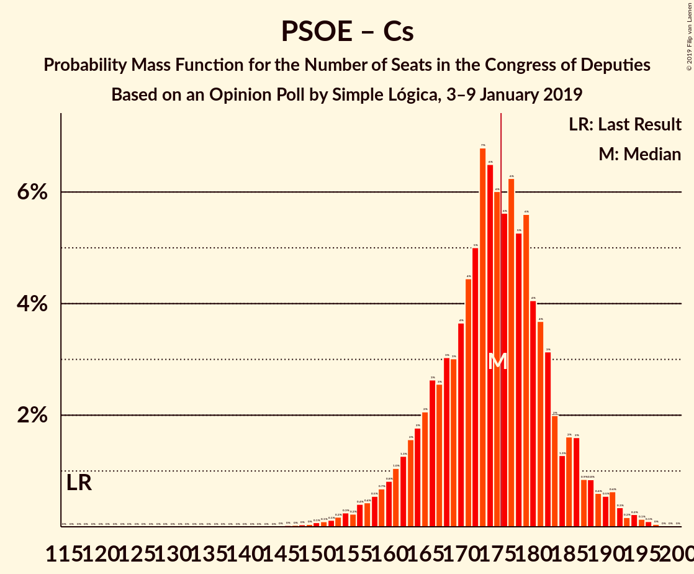

# Opinion Poll by Simple Lógica, 3–9 January 2019

<a href="#voting-intentions">Voting Intentions</a> | <a href="#seats">Seats</a> | <a href="#coalitions">Coalitions</a> | <a href="#technical-information">Technical Information</a>

## Voting Intentions

### Confidence Intervals

| Party | Last Result | Poll Result | 80% Confidence Interval | 90% Confidence Interval | 95% Confidence Interval | 99% Confidence Interval |
|:-----:|:-----------:|:-----------:|:-----------------------:|:-----------------------:|:-----------------------:|:-----------------------:|
| Partido Socialista Obrero Español | 22.6% | 25.1% | 23.5–26.9% |23.0–27.4% |22.6–27.9% |21.8–28.7% |
| Partido Popular | 33.0% | 18.2% | 16.8–19.8% |16.4–20.3% |16.0–20.7% |15.3–21.5% |
| Ciudadanos–Partido de la Ciudadanía | 13.1% | 17.9% | 16.5–19.6% |16.1–20.0% |15.7–20.4% |15.1–21.2% |
| Unidos Podemos | 21.2% | 14.0% | 12.7–15.5% |12.3–15.9% |12.0–16.3% |11.4–17.0% |
| Vox | 0.2% | 11.5% | 10.3–12.9% |10.0–13.3% |9.7–13.6% |9.2–14.3% |

*Note:* The poll result column reflects the actual value used in the calculations. Published results may vary slightly, and in addition be rounded to fewer digits.

## Seats

### Confidence Intervals

| Party | Last Result | Median | 80% Confidence Interval | 90% Confidence Interval | 95% Confidence Interval | 99% Confidence Interval |
|:-----:|:-----------:|:------:|:-----------------------:|:-----------------------:|:-----------------------:|:-----------------------:|
| <a href="#partido-socialista-obrero-español">Partido Socialista Obrero Español</a> | 85 | 109 | 106–118 |105–119 |103–119 |92–128 |
| <a href="#partido-popular">Partido Popular</a> | 137 | 82 | 58–90 |58–90 |58–90 |58–90 |
| <a href="#ciudadanos–partido-de-la-ciudadanía">Ciudadanos–Partido de la Ciudadanía</a> | 32 | 55 | 55–70 |52–73 |52–75 |51–77 |
| <a href="#unidos-podemos">Unidos Podemos</a> | 71 | 37 | 37–46 |35–46 |35–47 |34–48 |
| <a href="#vox">Vox</a> | 0 | 30 | 29–38 |26–43 |23–43 |20–44 |

### Partido Socialista Obrero Español

*For a full overview of the results for this party, see the [Partido Socialista Obrero Español](party-partidosocialistaobreroespañol.html) page.*

| Number of Seats | Probability | Accumulated | Special Marks |
|:---------------:|:-----------:|:-----------:|:-------------:|
| 85 | 0% | 100% | Last Result |
| 86 | 0% | 100% |  |
| 87 | 0% | 100% |  |
| 88 | 0% | 100% |  |
| 89 | 0% | 100% |  |
| 90 | 0% | 100% |  |
| 91 | 0.4% | 100% |  |
| 92 | 1.0% | 99.5% |  |
| 93 | 0% | 98.6% |  |
| 94 | 0% | 98.5% |  |
| 95 | 0.9% | 98.5% |  |
| 96 | 0% | 98% |  |
| 97 | 0% | 98% |  |
| 98 | 0% | 98% |  |
| 99 | 0% | 98% |  |
| 100 | 0% | 98% |  |
| 101 | 0% | 98% |  |
| 102 | 0% | 98% |  |
| 103 | 0.7% | 98% |  |
| 104 | 1.1% | 97% |  |
| 105 | 4% | 96% |  |
| 106 | 9% | 91% |  |
| 107 | 14% | 82% |  |
| 108 | 19% | 69% |  |
| 109 | 3% | 50% | Median |
| 110 | 0% | 47% |  |
| 111 | 0% | 47% |  |
| 112 | 5% | 47% |  |
| 113 | 0.4% | 42% |  |
| 114 | 0% | 42% |  |
| 115 | 0.2% | 42% |  |
| 116 | 0.8% | 42% |  |
| 117 | 10% | 41% |  |
| 118 | 23% | 31% |  |
| 119 | 5% | 8% |  |
| 120 | 0.1% | 2% |  |
| 121 | 0% | 2% |  |
| 122 | 0% | 2% |  |
| 123 | 0% | 2% |  |
| 124 | 0% | 2% |  |
| 125 | 0% | 2% |  |
| 126 | 0% | 2% |  |
| 127 | 1.5% | 2% |  |
| 128 | 0.7% | 0.8% |  |
| 129 | 0% | 0.1% |  |
| 130 | 0% | 0% |  |

### Partido Popular

*For a full overview of the results for this party, see the [Partido Popular](party-partidopopular.html) page.*

| Number of Seats | Probability | Accumulated | Special Marks |
|:---------------:|:-----------:|:-----------:|:-------------:|
| 58 | 29% | 100% |  |
| 59 | 0% | 71% |  |
| 60 | 4% | 71% |  |
| 61 | 5% | 67% |  |
| 62 | 0% | 62% |  |
| 63 | 0% | 62% |  |
| 64 | 0% | 62% |  |
| 65 | 0.2% | 62% |  |
| 66 | 0.1% | 62% |  |
| 67 | 1.4% | 61% |  |
| 68 | 6% | 60% |  |
| 69 | 1.5% | 54% |  |
| 70 | 0% | 52% |  |
| 71 | 0% | 52% |  |
| 72 | 0% | 52% |  |
| 73 | 0% | 52% |  |
| 74 | 0% | 52% |  |
| 75 | 0% | 52% |  |
| 76 | 0% | 52% |  |
| 77 | 0% | 52% |  |
| 78 | 0% | 52% |  |
| 79 | 0.4% | 52% |  |
| 80 | 1.1% | 52% |  |
| 81 | 0.1% | 51% |  |
| 82 | 2% | 51% | Median |
| 83 | 0% | 49% |  |
| 84 | 0% | 49% |  |
| 85 | 0% | 49% |  |
| 86 | 0% | 49% |  |
| 87 | 0% | 49% |  |
| 88 | 2% | 49% |  |
| 89 | 1.0% | 47% |  |
| 90 | 46% | 46% |  |
| 91 | 0% | 0% |  |
| 92 | 0% | 0% |  |
| 93 | 0% | 0% |  |
| 94 | 0% | 0% |  |
| 95 | 0% | 0% |  |
| 96 | 0% | 0% |  |
| 97 | 0% | 0% |  |
| 98 | 0% | 0% |  |
| 99 | 0% | 0% |  |
| 100 | 0% | 0% |  |
| 101 | 0% | 0% |  |
| 102 | 0% | 0% |  |
| 103 | 0% | 0% |  |
| 104 | 0% | 0% |  |
| 105 | 0% | 0% |  |
| 106 | 0% | 0% |  |
| 107 | 0% | 0% |  |
| 108 | 0% | 0% |  |
| 109 | 0% | 0% |  |
| 110 | 0% | 0% |  |
| 111 | 0% | 0% |  |
| 112 | 0% | 0% |  |
| 113 | 0% | 0% |  |
| 114 | 0% | 0% |  |
| 115 | 0% | 0% |  |
| 116 | 0% | 0% |  |
| 117 | 0% | 0% |  |
| 118 | 0% | 0% |  |
| 119 | 0% | 0% |  |
| 120 | 0% | 0% |  |
| 121 | 0% | 0% |  |
| 122 | 0% | 0% |  |
| 123 | 0% | 0% |  |
| 124 | 0% | 0% |  |
| 125 | 0% | 0% |  |
| 126 | 0% | 0% |  |
| 127 | 0% | 0% |  |
| 128 | 0% | 0% |  |
| 129 | 0% | 0% |  |
| 130 | 0% | 0% |  |
| 131 | 0% | 0% |  |
| 132 | 0% | 0% |  |
| 133 | 0% | 0% |  |
| 134 | 0% | 0% |  |
| 135 | 0% | 0% |  |
| 136 | 0% | 0% |  |
| 137 | 0% | 0% | Last Result |

### Ciudadanos–Partido de la Ciudadanía

*For a full overview of the results for this party, see the [Ciudadanos–Partido de la Ciudadanía](party-ciudadanos–partidodelaciudadanía.html) page.*

| Number of Seats | Probability | Accumulated | Special Marks |
|:---------------:|:-----------:|:-----------:|:-------------:|
| 32 | 0% | 100% | Last Result |
| 33 | 0% | 100% |  |
| 34 | 0% | 100% |  |
| 35 | 0% | 100% |  |
| 36 | 0% | 100% |  |
| 37 | 0% | 100% |  |
| 38 | 0% | 100% |  |
| 39 | 0% | 100% |  |
| 40 | 0% | 100% |  |
| 41 | 0% | 100% |  |
| 42 | 0% | 100% |  |
| 43 | 0% | 100% |  |
| 44 | 0% | 100% |  |
| 45 | 0% | 100% |  |
| 46 | 0% | 100% |  |
| 47 | 0% | 100% |  |
| 48 | 0% | 100% |  |
| 49 | 0% | 100% |  |
| 50 | 0% | 100% |  |
| 51 | 2% | 100% |  |
| 52 | 6% | 98% |  |
| 53 | 0.4% | 92% |  |
| 54 | 0.2% | 91% |  |
| 55 | 45% | 91% | Median |
| 56 | 3% | 46% |  |
| 57 | 0.2% | 42% |  |
| 58 | 0% | 42% |  |
| 59 | 0.2% | 42% |  |
| 60 | 0.2% | 42% |  |
| 61 | 0% | 42% |  |
| 62 | 0% | 42% |  |
| 63 | 0% | 42% |  |
| 64 | 0% | 42% |  |
| 65 | 0% | 42% |  |
| 66 | 0% | 42% |  |
| 67 | 0.1% | 42% |  |
| 68 | 0% | 42% |  |
| 69 | 0% | 42% |  |
| 70 | 33% | 42% |  |
| 71 | 0.1% | 9% |  |
| 72 | 2% | 8% |  |
| 73 | 2% | 7% |  |
| 74 | 2% | 5% |  |
| 75 | 1.3% | 3% |  |
| 76 | 1.1% | 2% |  |
| 77 | 0.8% | 0.8% |  |
| 78 | 0% | 0% |  |

### Unidos Podemos

*For a full overview of the results for this party, see the [Unidos Podemos](party-unidospodemos.html) page.*

| Number of Seats | Probability | Accumulated | Special Marks |
|:---------------:|:-----------:|:-----------:|:-------------:|
| 26 | 0.1% | 100% |  |
| 27 | 0% | 99.9% |  |
| 28 | 0% | 99.9% |  |
| 29 | 0% | 99.9% |  |
| 30 | 0% | 99.9% |  |
| 31 | 0% | 99.9% |  |
| 32 | 0% | 99.9% |  |
| 33 | 0% | 99.9% |  |
| 34 | 2% | 99.9% |  |
| 35 | 5% | 98% |  |
| 36 | 0% | 93% |  |
| 37 | 47% | 93% | Median |
| 38 | 5% | 45% |  |
| 39 | 0% | 41% |  |
| 40 | 0% | 41% |  |
| 41 | 0% | 41% |  |
| 42 | 0% | 41% |  |
| 43 | 0.9% | 41% |  |
| 44 | 1.4% | 40% |  |
| 45 | 7% | 38% |  |
| 46 | 28% | 32% |  |
| 47 | 2% | 4% |  |
| 48 | 0.8% | 1.3% |  |
| 49 | 0% | 0.5% |  |
| 50 | 0% | 0.5% |  |
| 51 | 0% | 0.5% |  |
| 52 | 0% | 0.5% |  |
| 53 | 0% | 0.5% |  |
| 54 | 0% | 0.5% |  |
| 55 | 0% | 0.5% |  |
| 56 | 0% | 0.5% |  |
| 57 | 0% | 0.5% |  |
| 58 | 0% | 0.5% |  |
| 59 | 0% | 0.5% |  |
| 60 | 0% | 0.5% |  |
| 61 | 0% | 0.5% |  |
| 62 | 0.3% | 0.5% |  |
| 63 | 0.2% | 0.2% |  |
| 64 | 0% | 0% |  |
| 65 | 0% | 0% |  |
| 66 | 0% | 0% |  |
| 67 | 0% | 0% |  |
| 68 | 0% | 0% |  |
| 69 | 0% | 0% |  |
| 70 | 0% | 0% |  |
| 71 | 0% | 0% | Last Result |

### Vox

*For a full overview of the results for this party, see the [Vox](party-vox.html) page.*

| Number of Seats | Probability | Accumulated | Special Marks |
|:---------------:|:-----------:|:-----------:|:-------------:|
| 0 | 0% | 100% | Last Result |
| 1 | 0% | 100% |  |
| 2 | 0% | 100% |  |
| 3 | 0% | 100% |  |
| 4 | 0% | 100% |  |
| 5 | 0% | 100% |  |
| 6 | 0% | 100% |  |
| 7 | 0% | 100% |  |
| 8 | 0% | 100% |  |
| 9 | 0% | 100% |  |
| 10 | 0% | 100% |  |
| 11 | 0% | 100% |  |
| 12 | 0% | 100% |  |
| 13 | 0% | 100% |  |
| 14 | 0% | 100% |  |
| 15 | 0% | 100% |  |
| 16 | 0% | 100% |  |
| 17 | 0% | 100% |  |
| 18 | 0% | 100% |  |
| 19 | 0% | 100% |  |
| 20 | 1.5% | 100% |  |
| 21 | 0.1% | 98% |  |
| 22 | 0% | 98% |  |
| 23 | 3% | 98% |  |
| 24 | 0.2% | 95% |  |
| 25 | 0% | 95% |  |
| 26 | 0% | 95% |  |
| 27 | 2% | 95% |  |
| 28 | 0.2% | 93% |  |
| 29 | 22% | 93% |  |
| 30 | 43% | 70% | Median |
| 31 | 13% | 28% |  |
| 32 | 0.9% | 15% |  |
| 33 | 0.6% | 14% |  |
| 34 | 0.5% | 14% |  |
| 35 | 0% | 13% |  |
| 36 | 0.9% | 13% |  |
| 37 | 1.3% | 12% |  |
| 38 | 2% | 11% |  |
| 39 | 2% | 9% |  |
| 40 | 0.1% | 7% |  |
| 41 | 0.1% | 7% |  |
| 42 | 0.5% | 7% |  |
| 43 | 5% | 6% |  |
| 44 | 1.3% | 1.3% |  |
| 45 | 0.1% | 0.1% |  |
| 46 | 0% | 0% |  |

## Coalitions

### Confidence Intervals

| Coalition | Last Result | Median | Majority? | 80% Confidence Interval | 90% Confidence Interval | 95% Confidence Interval | 99% Confidence Interval |
|:---------:|:-----------:|:------:|:---------:|:-----------------------:|:-----------------------:|:-----------------------:|:-----------------------:|
| Partido Socialista Obrero Español – Ciudadanos–Partido de la Ciudadanía | 117 | 169 | 42% | 161–188 | 160–188 | 160–188 | 157–188 |
| Partido Popular – Ciudadanos–Partido de la Ciudadanía – Vox | 169 | 173 | 16% | 157–176 | 157–176 | 157–177 | 146–193 |
| Partido Socialista Obrero Español – Unidos Podemos | 156 | 147 | 0% | 143–164 | 143–164 | 142–164 | 126–175 |
| Partido Popular – Ciudadanos–Partido de la Ciudadanía | 169 | 144 | 0% | 128–145 | 120–145 | 120–154 | 119–157 |
| Partido Popular – Vox | 137 | 111 | 0% | 87–121 | 87–121 | 87–121 | 87–122 |
| Partido Socialista Obrero Español | 85 | 109 | 0% | 106–118 | 105–119 | 103–119 | 92–128 |
| Partido Popular | 137 | 82 | 0% | 58–90 | 58–90 | 58–90 | 58–90 |

### Partido Socialista Obrero Español – Ciudadanos–Partido de la Ciudadanía

| Number of Seats | Probability | Accumulated | Special Marks |
|:---------------:|:-----------:|:-----------:|:-------------:|
| 117 | 0% | 100% | Last Result |
| 118 | 0% | 100% |  |
| 119 | 0% | 100% |  |
| 120 | 0% | 100% |  |
| 121 | 0% | 100% |  |
| 122 | 0% | 100% |  |
| 123 | 0% | 100% |  |
| 124 | 0% | 100% |  |
| 125 | 0% | 100% |  |
| 126 | 0% | 100% |  |
| 127 | 0% | 100% |  |
| 128 | 0% | 100% |  |
| 129 | 0% | 100% |  |
| 130 | 0% | 100% |  |
| 131 | 0% | 100% |  |
| 132 | 0% | 100% |  |
| 133 | 0% | 100% |  |
| 134 | 0% | 100% |  |
| 135 | 0% | 100% |  |
| 136 | 0% | 100% |  |
| 137 | 0% | 100% |  |
| 138 | 0% | 100% |  |
| 139 | 0% | 100% |  |
| 140 | 0% | 100% |  |
| 141 | 0% | 100% |  |
| 142 | 0% | 100% |  |
| 143 | 0% | 100% |  |
| 144 | 0% | 100% |  |
| 145 | 0% | 100% |  |
| 146 | 0% | 100% |  |
| 147 | 0% | 100% |  |
| 148 | 0% | 100% |  |
| 149 | 0% | 100% |  |
| 150 | 0.2% | 100% |  |
| 151 | 0.2% | 99.8% |  |
| 152 | 0% | 99.5% |  |
| 153 | 0% | 99.5% |  |
| 154 | 0% | 99.5% |  |
| 155 | 0% | 99.5% |  |
| 156 | 0% | 99.5% |  |
| 157 | 0% | 99.5% |  |
| 158 | 0.2% | 99.5% |  |
| 159 | 0.9% | 99.3% |  |
| 160 | 4% | 98% |  |
| 161 | 9% | 95% |  |
| 162 | 13% | 86% |  |
| 163 | 19% | 72% |  |
| 164 | 0% | 54% | Median |
| 165 | 3% | 54% |  |
| 166 | 0% | 51% |  |
| 167 | 0% | 51% |  |
| 168 | 0.1% | 51% |  |
| 169 | 0.9% | 51% |  |
| 170 | 1.3% | 50% |  |
| 171 | 6% | 48% |  |
| 172 | 0.4% | 43% |  |
| 173 | 0% | 42% |  |
| 174 | 0% | 42% |  |
| 175 | 0.3% | 42% |  |
| 176 | 0.4% | 42% | Majority |
| 177 | 0.9% | 41% |  |
| 178 | 1.5% | 41% |  |
| 179 | 0.7% | 39% |  |
| 180 | 0% | 38% |  |
| 181 | 0% | 38% |  |
| 182 | 0% | 38% |  |
| 183 | 0% | 38% |  |
| 184 | 0.7% | 38% |  |
| 185 | 2% | 38% |  |
| 186 | 2% | 36% |  |
| 187 | 11% | 34% |  |
| 188 | 22% | 22% |  |
| 189 | 0% | 0% |  |

### Partido Popular – Ciudadanos–Partido de la Ciudadanía – Vox

| Number of Seats | Probability | Accumulated | Special Marks |
|:---------------:|:-----------:|:-----------:|:-------------:|
| 146 | 0.9% | 100% |  |
| 147 | 1.4% | 99.1% |  |
| 148 | 0% | 98% |  |
| 149 | 0% | 98% |  |
| 150 | 0% | 98% |  |
| 151 | 0% | 98% |  |
| 152 | 0% | 98% |  |
| 153 | 0% | 98% |  |
| 154 | 0% | 98% |  |
| 155 | 0% | 98% |  |
| 156 | 0% | 98% |  |
| 157 | 18% | 98% |  |
| 158 | 11% | 80% |  |
| 159 | 4% | 69% |  |
| 160 | 0% | 65% |  |
| 161 | 0% | 65% |  |
| 162 | 0% | 65% |  |
| 163 | 7% | 65% |  |
| 164 | 0% | 58% |  |
| 165 | 0% | 58% |  |
| 166 | 0.1% | 58% |  |
| 167 | 3% | 58% | Median |
| 168 | 0.8% | 55% |  |
| 169 | 0.2% | 54% | Last Result |
| 170 | 0% | 54% |  |
| 171 | 0% | 54% |  |
| 172 | 1.2% | 54% |  |
| 173 | 4% | 53% |  |
| 174 | 1.1% | 49% |  |
| 175 | 32% | 48% |  |
| 176 | 13% | 16% | Majority |
| 177 | 1.1% | 3% |  |
| 178 | 0% | 2% |  |
| 179 | 0% | 2% |  |
| 180 | 0% | 2% |  |
| 181 | 0% | 2% |  |
| 182 | 0% | 2% |  |
| 183 | 0% | 2% |  |
| 184 | 0% | 2% |  |
| 185 | 0% | 2% |  |
| 186 | 0% | 2% |  |
| 187 | 0% | 2% |  |
| 188 | 0% | 2% |  |
| 189 | 0% | 2% |  |
| 190 | 0.5% | 2% |  |
| 191 | 0.4% | 1.4% |  |
| 192 | 0% | 1.0% |  |
| 193 | 1.0% | 1.0% |  |
| 194 | 0% | 0% |  |

### Partido Socialista Obrero Español – Unidos Podemos

| Number of Seats | Probability | Accumulated | Special Marks |
|:---------------:|:-----------:|:-----------:|:-------------:|
| 126 | 1.0% | 100% |  |
| 127 | 0% | 99.0% |  |
| 128 | 0% | 99.0% |  |
| 129 | 0.9% | 99.0% |  |
| 130 | 0% | 98% |  |
| 131 | 0% | 98% |  |
| 132 | 0% | 98% |  |
| 133 | 0% | 98% |  |
| 134 | 0% | 98% |  |
| 135 | 0% | 98% |  |
| 136 | 0% | 98% |  |
| 137 | 0% | 98% |  |
| 138 | 0% | 98% |  |
| 139 | 0% | 98% |  |
| 140 | 0% | 98% |  |
| 141 | 0% | 98% |  |
| 142 | 1.1% | 98% |  |
| 143 | 13% | 97% |  |
| 144 | 13% | 84% |  |
| 145 | 19% | 71% |  |
| 146 | 0.2% | 52% | Median |
| 147 | 5% | 52% |  |
| 148 | 1.1% | 47% |  |
| 149 | 0.1% | 46% |  |
| 150 | 0% | 46% |  |
| 151 | 0% | 46% |  |
| 152 | 0.2% | 46% |  |
| 153 | 1.1% | 46% |  |
| 154 | 2% | 44% |  |
| 155 | 1.3% | 42% |  |
| 156 | 5% | 41% | Last Result |
| 157 | 0% | 35% |  |
| 158 | 0% | 35% |  |
| 159 | 0% | 35% |  |
| 160 | 0% | 35% |  |
| 161 | 0% | 35% |  |
| 162 | 0.2% | 35% |  |
| 163 | 15% | 35% |  |
| 164 | 18% | 20% |  |
| 165 | 0% | 2% |  |
| 166 | 0% | 2% |  |
| 167 | 0% | 2% |  |
| 168 | 0% | 2% |  |
| 169 | 0% | 2% |  |
| 170 | 0% | 2% |  |
| 171 | 0% | 2% |  |
| 172 | 0% | 2% |  |
| 173 | 0% | 2% |  |
| 174 | 0.7% | 2% |  |
| 175 | 2% | 2% |  |
| 176 | 0% | 0% | Majority |

### Partido Popular – Ciudadanos–Partido de la Ciudadanía

| Number of Seats | Probability | Accumulated | Special Marks |
|:---------------:|:-----------:|:-----------:|:-------------:|
| 118 | 0.1% | 100% |  |
| 119 | 2% | 99.9% |  |
| 120 | 6% | 98% |  |
| 121 | 0.4% | 92% |  |
| 122 | 0% | 91% |  |
| 123 | 0% | 91% |  |
| 124 | 0.2% | 91% |  |
| 125 | 0% | 91% |  |
| 126 | 0.1% | 91% |  |
| 127 | 0.1% | 91% |  |
| 128 | 29% | 91% |  |
| 129 | 0% | 62% |  |
| 130 | 4% | 62% |  |
| 131 | 0% | 58% |  |
| 132 | 0% | 58% |  |
| 133 | 0.9% | 58% |  |
| 134 | 1.3% | 57% |  |
| 135 | 2% | 55% |  |
| 136 | 1.3% | 54% |  |
| 137 | 0% | 52% | Median |
| 138 | 0% | 52% |  |
| 139 | 0% | 52% |  |
| 140 | 0% | 52% |  |
| 141 | 0% | 52% |  |
| 142 | 0% | 52% |  |
| 143 | 0% | 52% |  |
| 144 | 2% | 52% |  |
| 145 | 46% | 50% |  |
| 146 | 0% | 4% |  |
| 147 | 0.2% | 4% |  |
| 148 | 0% | 4% |  |
| 149 | 0% | 4% |  |
| 150 | 0% | 4% |  |
| 151 | 0% | 4% |  |
| 152 | 0% | 4% |  |
| 153 | 0.2% | 3% |  |
| 154 | 1.0% | 3% |  |
| 155 | 0.5% | 2% |  |
| 156 | 0.8% | 2% |  |
| 157 | 0.5% | 0.9% |  |
| 158 | 0.4% | 0.4% |  |
| 159 | 0% | 0% |  |
| 160 | 0% | 0% |  |
| 161 | 0% | 0% |  |
| 162 | 0% | 0% |  |
| 163 | 0% | 0% |  |
| 164 | 0% | 0% |  |
| 165 | 0% | 0% |  |
| 166 | 0% | 0% |  |
| 167 | 0% | 0% |  |
| 168 | 0% | 0% |  |
| 169 | 0% | 0% | Last Result |

### Partido Popular – Vox

| Number of Seats | Probability | Accumulated | Special Marks |
|:---------------:|:-----------:|:-----------:|:-------------:|
| 87 | 18% | 100% |  |
| 88 | 11% | 82% |  |
| 89 | 4% | 71% |  |
| 90 | 0% | 67% |  |
| 91 | 0% | 67% |  |
| 92 | 0% | 67% |  |
| 93 | 0% | 67% |  |
| 94 | 0% | 67% |  |
| 95 | 0.9% | 67% |  |
| 96 | 1.4% | 66% |  |
| 97 | 0.4% | 65% |  |
| 98 | 1.0% | 64% |  |
| 99 | 2% | 63% |  |
| 100 | 2% | 61% |  |
| 101 | 0% | 59% |  |
| 102 | 2% | 59% |  |
| 103 | 0% | 58% |  |
| 104 | 0% | 58% |  |
| 105 | 0% | 58% |  |
| 106 | 0% | 58% |  |
| 107 | 0.4% | 58% |  |
| 108 | 0.1% | 57% |  |
| 109 | 0% | 57% |  |
| 110 | 0.4% | 57% |  |
| 111 | 8% | 57% |  |
| 112 | 0.9% | 49% | Median |
| 113 | 0.2% | 48% |  |
| 114 | 0.6% | 47% |  |
| 115 | 0.4% | 47% |  |
| 116 | 0.9% | 47% |  |
| 117 | 0.1% | 46% |  |
| 118 | 0.1% | 46% |  |
| 119 | 0% | 45% |  |
| 120 | 32% | 45% |  |
| 121 | 13% | 14% |  |
| 122 | 0.9% | 1.1% |  |
| 123 | 0.2% | 0.2% |  |
| 124 | 0% | 0% |  |
| 125 | 0% | 0% |  |
| 126 | 0% | 0% |  |
| 127 | 0% | 0% |  |
| 128 | 0% | 0% |  |
| 129 | 0% | 0% |  |
| 130 | 0% | 0% |  |
| 131 | 0% | 0% |  |
| 132 | 0% | 0% |  |
| 133 | 0% | 0% |  |
| 134 | 0% | 0% |  |
| 135 | 0% | 0% |  |
| 136 | 0% | 0% |  |
| 137 | 0% | 0% | Last Result |

### Partido Socialista Obrero Español

| Number of Seats | Probability | Accumulated | Special Marks |
|:---------------:|:-----------:|:-----------:|:-------------:|
| 85 | 0% | 100% | Last Result |
| 86 | 0% | 100% |  |
| 87 | 0% | 100% |  |
| 88 | 0% | 100% |  |
| 89 | 0% | 100% |  |
| 90 | 0% | 100% |  |
| 91 | 0.4% | 100% |  |
| 92 | 1.0% | 99.5% |  |
| 93 | 0% | 98.6% |  |
| 94 | 0% | 98.5% |  |
| 95 | 0.9% | 98.5% |  |
| 96 | 0% | 98% |  |
| 97 | 0% | 98% |  |
| 98 | 0% | 98% |  |
| 99 | 0% | 98% |  |
| 100 | 0% | 98% |  |
| 101 | 0% | 98% |  |
| 102 | 0% | 98% |  |
| 103 | 0.7% | 98% |  |
| 104 | 1.1% | 97% |  |
| 105 | 4% | 96% |  |
| 106 | 9% | 91% |  |
| 107 | 14% | 82% |  |
| 108 | 19% | 69% |  |
| 109 | 3% | 50% | Median |
| 110 | 0% | 47% |  |
| 111 | 0% | 47% |  |
| 112 | 5% | 47% |  |
| 113 | 0.4% | 42% |  |
| 114 | 0% | 42% |  |
| 115 | 0.2% | 42% |  |
| 116 | 0.8% | 42% |  |
| 117 | 10% | 41% |  |
| 118 | 23% | 31% |  |
| 119 | 5% | 8% |  |
| 120 | 0.1% | 2% |  |
| 121 | 0% | 2% |  |
| 122 | 0% | 2% |  |
| 123 | 0% | 2% |  |
| 124 | 0% | 2% |  |
| 125 | 0% | 2% |  |
| 126 | 0% | 2% |  |
| 127 | 1.5% | 2% |  |
| 128 | 0.7% | 0.8% |  |
| 129 | 0% | 0.1% |  |
| 130 | 0% | 0% |  |

### Partido Popular

| Number of Seats | Probability | Accumulated | Special Marks |
|:---------------:|:-----------:|:-----------:|:-------------:|
| 58 | 29% | 100% |  |
| 59 | 0% | 71% |  |
| 60 | 4% | 71% |  |
| 61 | 5% | 67% |  |
| 62 | 0% | 62% |  |
| 63 | 0% | 62% |  |
| 64 | 0% | 62% |  |
| 65 | 0.2% | 62% |  |
| 66 | 0.1% | 62% |  |
| 67 | 1.4% | 61% |  |
| 68 | 6% | 60% |  |
| 69 | 1.5% | 54% |  |
| 70 | 0% | 52% |  |
| 71 | 0% | 52% |  |
| 72 | 0% | 52% |  |
| 73 | 0% | 52% |  |
| 74 | 0% | 52% |  |
| 75 | 0% | 52% |  |
| 76 | 0% | 52% |  |
| 77 | 0% | 52% |  |
| 78 | 0% | 52% |  |
| 79 | 0.4% | 52% |  |
| 80 | 1.1% | 52% |  |
| 81 | 0.1% | 51% |  |
| 82 | 2% | 51% | Median |
| 83 | 0% | 49% |  |
| 84 | 0% | 49% |  |
| 85 | 0% | 49% |  |
| 86 | 0% | 49% |  |
| 87 | 0% | 49% |  |
| 88 | 2% | 49% |  |
| 89 | 1.0% | 47% |  |
| 90 | 46% | 46% |  |
| 91 | 0% | 0% |  |
| 92 | 0% | 0% |  |
| 93 | 0% | 0% |  |
| 94 | 0% | 0% |  |
| 95 | 0% | 0% |  |
| 96 | 0% | 0% |  |
| 97 | 0% | 0% |  |
| 98 | 0% | 0% |  |
| 99 | 0% | 0% |  |
| 100 | 0% | 0% |  |
| 101 | 0% | 0% |  |
| 102 | 0% | 0% |  |
| 103 | 0% | 0% |  |
| 104 | 0% | 0% |  |
| 105 | 0% | 0% |  |
| 106 | 0% | 0% |  |
| 107 | 0% | 0% |  |
| 108 | 0% | 0% |  |
| 109 | 0% | 0% |  |
| 110 | 0% | 0% |  |
| 111 | 0% | 0% |  |
| 112 | 0% | 0% |  |
| 113 | 0% | 0% |  |
| 114 | 0% | 0% |  |
| 115 | 0% | 0% |  |
| 116 | 0% | 0% |  |
| 117 | 0% | 0% |  |
| 118 | 0% | 0% |  |
| 119 | 0% | 0% |  |
| 120 | 0% | 0% |  |
| 121 | 0% | 0% |  |
| 122 | 0% | 0% |  |
| 123 | 0% | 0% |  |
| 124 | 0% | 0% |  |
| 125 | 0% | 0% |  |
| 126 | 0% | 0% |  |
| 127 | 0% | 0% |  |
| 128 | 0% | 0% |  |
| 129 | 0% | 0% |  |
| 130 | 0% | 0% |  |
| 131 | 0% | 0% |  |
| 132 | 0% | 0% |  |
| 133 | 0% | 0% |  |
| 134 | 0% | 0% |  |
| 135 | 0% | 0% |  |
| 136 | 0% | 0% |  |
| 137 | 0% | 0% | Last Result |

## Technical Information

### Opinion Poll

+ **Polling firm:** Simple Lógica
+ **Commissioner(s):** —
+ **Fieldwork period:** 3–9 January 2019

### Calculations

+ **Sample size:** 1042
+ **Simulations done:** 1,024
+ **Error estimate:** 5.29%

