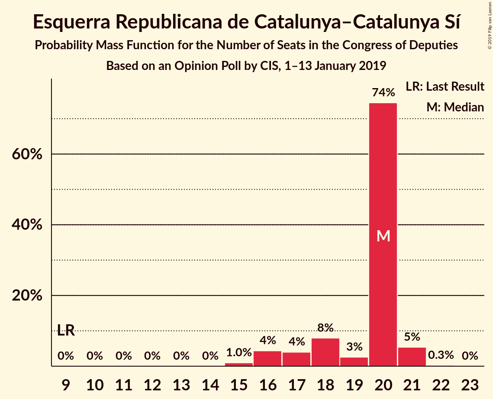
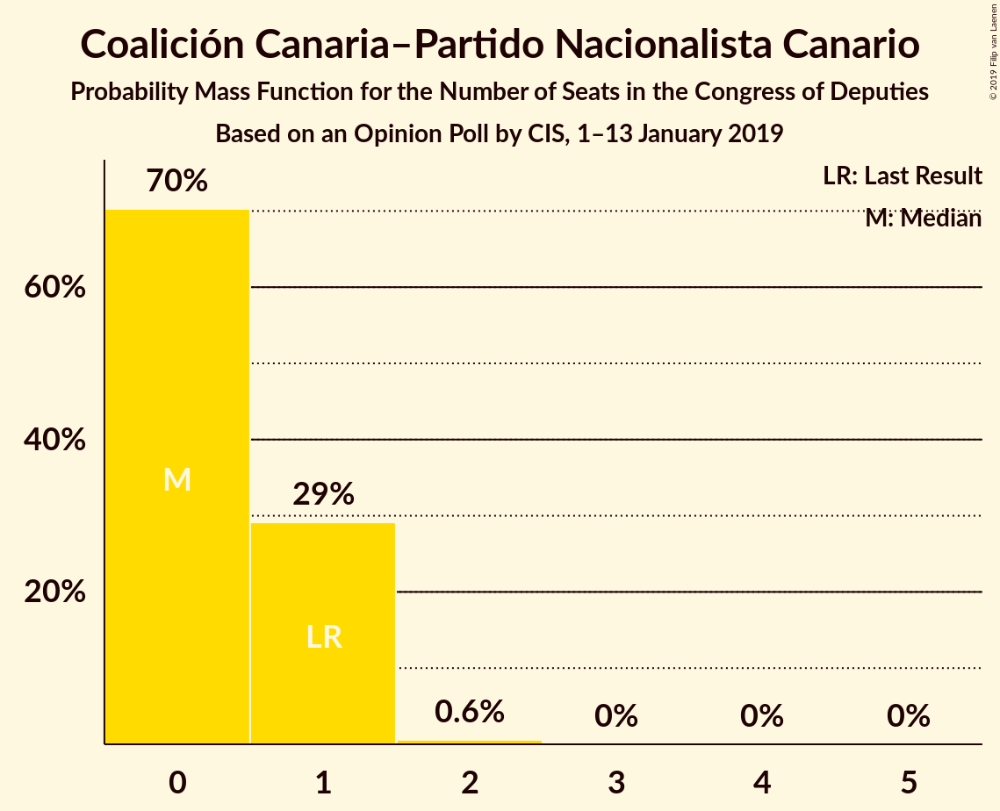
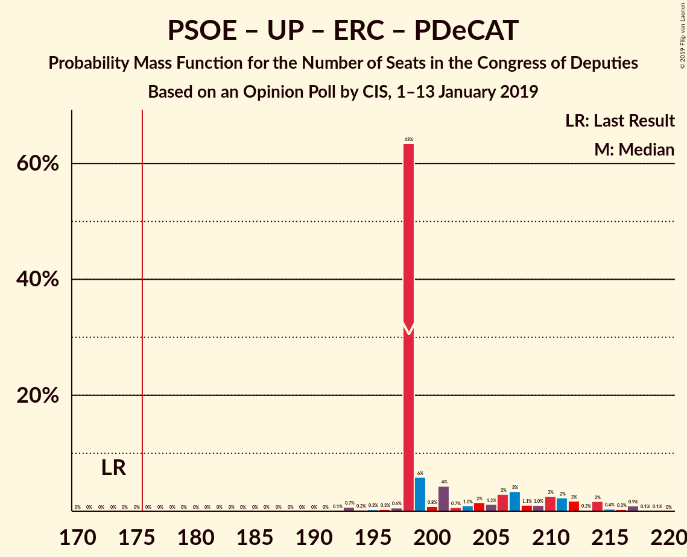
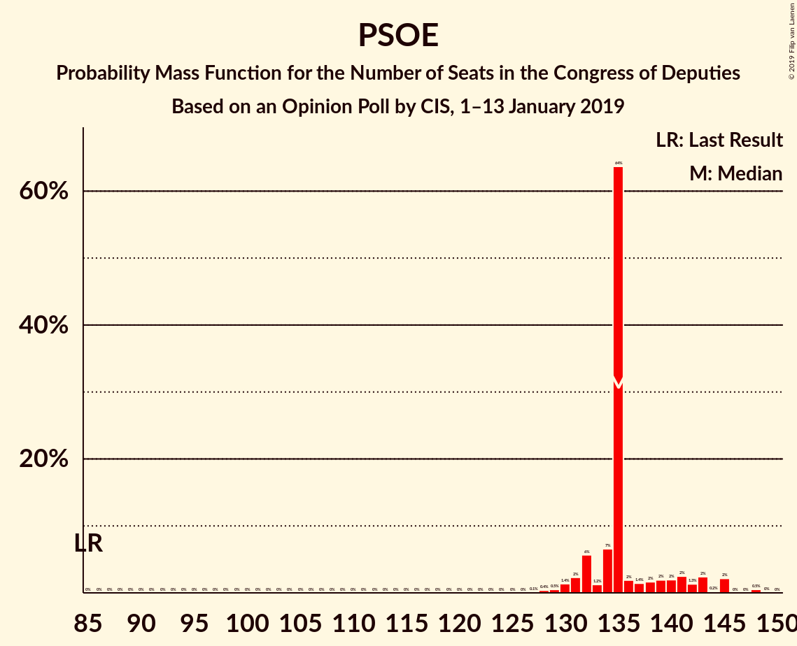

# Opinion Poll by CIS, 1–13 January 2019

<a href="#voting-intentions">Voting Intentions</a> | <a href="#seats">Seats</a> | <a href="#coalitions">Coalitions</a> | <a href="#technical-information">Technical Information</a>

## Voting Intentions

### Confidence Intervals

| Party | Last Result | Poll Result | 80% Confidence Interval | 90% Confidence Interval | 95% Confidence Interval | 99% Confidence Interval |
|:-----:|:-----------:|:-----------:|:-----------------------:|:-----------------------:|:-----------------------:|:-----------------------:|
| Partido Socialista Obrero Español | 22.6% | 29.9% | 28.9–31.0% |28.5–31.3% |28.3–31.6% |27.8–32.1% |
| Ciudadanos–Partido de la Ciudadanía | 13.1% | 17.7% | 16.8–18.6% |16.6–18.9% |16.4–19.1% |16.0–19.6% |
| Unidos Podemos | 21.2% | 15.4% | 14.6–16.3% |14.3–16.5% |14.1–16.7% |13.7–17.2% |
| Partido Popular | 33.0% | 14.9% | 14.1–15.8% |13.8–16.0% |13.7–16.2% |13.3–16.6% |
| Vox | 0.2% | 6.5% | 5.9–7.1% |5.8–7.3% |5.7–7.4% |5.4–7.7% |
| Esquerra Republicana de Catalunya–Catalunya Sí | 2.7% | 4.7% | 4.2–5.2% |4.1–5.4% |4.0–5.5% |3.8–5.8% |
| Partido Animalista Contra el Maltrato Animal | 1.2% | 1.7% | 1.4–2.1% |1.4–2.1% |1.3–2.2% |1.2–2.4% |
| Euzko Alderdi Jeltzalea/Partido Nacionalista Vasco | 1.2% | 1.3% | 1.1–1.6% |1.0–1.7% |0.9–1.8% |0.9–2.0% |
| Euskal Herria Bildu | 0.8% | 1.1% | 0.9–1.4% |0.8–1.5% |0.8–1.6% |0.7–1.7% |
| Partit Demòcrata Europeu Català | 2.0% | 1.0% | 0.8–1.3% |0.7–1.4% |0.7–1.4% |0.6–1.6% |
| Coalición Canaria–Partido Nacionalista Canario | 0.3% | 0.2% | 0.1–0.4% |0.1–0.4% |0.1–0.4% |0.1–0.5% |

*Note:* The poll result column reflects the actual value used in the calculations. Published results may vary slightly, and in addition be rounded to fewer digits.

## Seats

### Confidence Intervals

| Party | Last Result | Median | 80% Confidence Interval | 90% Confidence Interval | 95% Confidence Interval | 99% Confidence Interval |
|:-----:|:-----------:|:------:|:-----------------------:|:-----------------------:|:-----------------------:|:-----------------------:|
| <a href="#partido-socialista-obrero-español">Partido Socialista Obrero Español</a> | 85 | 134 | 131–143 |131–143 |130–143 |128–145 |
| <a href="#ciudadanos–partido-de-la-ciudadanía">Ciudadanos–Partido de la Ciudadanía</a> | 32 | 62 | 59–66 |58–70 |56–71 |55–73 |
| <a href="#unidos-podemos">Unidos Podemos</a> | 71 | 46 | 46–53 |43–53 |42–55 |40–56 |
| <a href="#partido-popular">Partido Popular</a> | 137 | 60 | 53–62 |53–64 |52–64 |51–67 |
| <a href="#vox">Vox</a> | 0 | 12 | 9–14 |8–16 |8–16 |8–18 |
| <a href="#esquerra-republicana-de-catalunya–catalunya-sí">Esquerra Republicana de Catalunya–Catalunya Sí</a> | 9 | 20 | 18–21 |17–21 |16–21 |15–21 |
| <a href="#partido-animalista-contra-el-maltrato-animal">Partido Animalista Contra el Maltrato Animal</a> | 0 | 0 | 0–1 |0–1 |0–1 |0–1 |
| <a href="#euzko-alderdi-jeltzalea/partido-nacionalista-vasco">Euzko Alderdi Jeltzalea/Partido Nacionalista Vasco</a> | 5 | 6 | 6–7 |5–7 |4–7 |4–9 |
| <a href="#euskal-herria-bildu">Euskal Herria Bildu</a> | 2 | 5 | 2–6 |2–7 |2–7 |1–7 |
| <a href="#partit-demòcrata-europeu-català">Partit Demòcrata Europeu Català</a> | 8 | 1 | 1–3 |1–4 |1–5 |1–6 |
| <a href="#coalición-canaria–partido-nacionalista-canario">Coalición Canaria–Partido Nacionalista Canario</a> | 1 | 1 | 0–1 |0–1 |0–1 |0–1 |

### Partido Socialista Obrero Español

*For a full overview of the results for this party, see the [Partido Socialista Obrero Español](party-partidosocialistaobreroespañol.html) page.*

| Number of Seats | Probability | Accumulated | Special Marks |
|:---------------:|:-----------:|:-----------:|:-------------:|
| 85 | 0% | 100% | Last Result |
| 86 | 0% | 100% |  |
| 87 | 0% | 100% |  |
| 88 | 0% | 100% |  |
| 89 | 0% | 100% |  |
| 90 | 0% | 100% |  |
| 91 | 0% | 100% |  |
| 92 | 0% | 100% |  |
| 93 | 0% | 100% |  |
| 94 | 0% | 100% |  |
| 95 | 0% | 100% |  |
| 96 | 0% | 100% |  |
| 97 | 0% | 100% |  |
| 98 | 0% | 100% |  |
| 99 | 0% | 100% |  |
| 100 | 0% | 100% |  |
| 101 | 0% | 100% |  |
| 102 | 0% | 100% |  |
| 103 | 0% | 100% |  |
| 104 | 0% | 100% |  |
| 105 | 0% | 100% |  |
| 106 | 0% | 100% |  |
| 107 | 0% | 100% |  |
| 108 | 0% | 100% |  |
| 109 | 0% | 100% |  |
| 110 | 0% | 100% |  |
| 111 | 0% | 100% |  |
| 112 | 0% | 100% |  |
| 113 | 0% | 100% |  |
| 114 | 0% | 100% |  |
| 115 | 0% | 100% |  |
| 116 | 0% | 100% |  |
| 117 | 0% | 100% |  |
| 118 | 0% | 100% |  |
| 119 | 0% | 100% |  |
| 120 | 0% | 100% |  |
| 121 | 0% | 100% |  |
| 122 | 0% | 100% |  |
| 123 | 0% | 100% |  |
| 124 | 0% | 100% |  |
| 125 | 0.1% | 100% |  |
| 126 | 0% | 99.9% |  |
| 127 | 0.3% | 99.9% |  |
| 128 | 0.1% | 99.5% |  |
| 129 | 0.6% | 99.4% |  |
| 130 | 3% | 98.8% |  |
| 131 | 6% | 95% |  |
| 132 | 37% | 89% |  |
| 133 | 2% | 52% |  |
| 134 | 3% | 50% | Median |
| 135 | 9% | 48% |  |
| 136 | 1.0% | 38% |  |
| 137 | 0.7% | 37% |  |
| 138 | 4% | 37% |  |
| 139 | 10% | 32% |  |
| 140 | 3% | 22% |  |
| 141 | 2% | 19% |  |
| 142 | 0.2% | 18% |  |
| 143 | 16% | 17% |  |
| 144 | 0.1% | 2% |  |
| 145 | 1.1% | 2% |  |
| 146 | 0.1% | 0.4% |  |
| 147 | 0% | 0.4% |  |
| 148 | 0.2% | 0.4% |  |
| 149 | 0% | 0.2% |  |
| 150 | 0.1% | 0.1% |  |
| 151 | 0% | 0% |  |

### Ciudadanos–Partido de la Ciudadanía

*For a full overview of the results for this party, see the [Ciudadanos–Partido de la Ciudadanía](party-ciudadanos–partidodelaciudadanía.html) page.*

| Number of Seats | Probability | Accumulated | Special Marks |
|:---------------:|:-----------:|:-----------:|:-------------:|
| 32 | 0% | 100% | Last Result |
| 33 | 0% | 100% |  |
| 34 | 0% | 100% |  |
| 35 | 0% | 100% |  |
| 36 | 0% | 100% |  |
| 37 | 0% | 100% |  |
| 38 | 0% | 100% |  |
| 39 | 0% | 100% |  |
| 40 | 0% | 100% |  |
| 41 | 0% | 100% |  |
| 42 | 0% | 100% |  |
| 43 | 0% | 100% |  |
| 44 | 0% | 100% |  |
| 45 | 0% | 100% |  |
| 46 | 0% | 100% |  |
| 47 | 0% | 100% |  |
| 48 | 0% | 100% |  |
| 49 | 0% | 100% |  |
| 50 | 0% | 100% |  |
| 51 | 0% | 100% |  |
| 52 | 0% | 100% |  |
| 53 | 0% | 100% |  |
| 54 | 0.1% | 100% |  |
| 55 | 0.9% | 99.9% |  |
| 56 | 3% | 99.1% |  |
| 57 | 0.7% | 96% |  |
| 58 | 0.7% | 95% |  |
| 59 | 10% | 95% |  |
| 60 | 2% | 85% |  |
| 61 | 15% | 83% |  |
| 62 | 35% | 68% | Median |
| 63 | 3% | 32% |  |
| 64 | 16% | 30% |  |
| 65 | 0.9% | 14% |  |
| 66 | 4% | 13% |  |
| 67 | 1.3% | 9% |  |
| 68 | 2% | 8% |  |
| 69 | 0.8% | 6% |  |
| 70 | 2% | 5% |  |
| 71 | 2% | 3% |  |
| 72 | 0.1% | 1.3% |  |
| 73 | 1.1% | 1.2% |  |
| 74 | 0% | 0% |  |

### Unidos Podemos

*For a full overview of the results for this party, see the [Unidos Podemos](party-unidospodemos.html) page.*

| Number of Seats | Probability | Accumulated | Special Marks |
|:---------------:|:-----------:|:-----------:|:-------------:|
| 36 | 0.1% | 100% |  |
| 37 | 0% | 99.9% |  |
| 38 | 0.2% | 99.9% |  |
| 39 | 0.1% | 99.7% |  |
| 40 | 0.5% | 99.5% |  |
| 41 | 0.4% | 99.0% |  |
| 42 | 2% | 98.6% |  |
| 43 | 2% | 96% |  |
| 44 | 0.4% | 94% |  |
| 45 | 3% | 94% |  |
| 46 | 58% | 91% | Median |
| 47 | 2% | 32% |  |
| 48 | 0.7% | 30% |  |
| 49 | 2% | 30% |  |
| 50 | 3% | 28% |  |
| 51 | 7% | 25% |  |
| 52 | 4% | 18% |  |
| 53 | 11% | 14% |  |
| 54 | 0.7% | 4% |  |
| 55 | 1.1% | 3% |  |
| 56 | 2% | 2% |  |
| 57 | 0.1% | 0.2% |  |
| 58 | 0% | 0.1% |  |
| 59 | 0% | 0% |  |
| 60 | 0% | 0% |  |
| 61 | 0% | 0% |  |
| 62 | 0% | 0% |  |
| 63 | 0% | 0% |  |
| 64 | 0% | 0% |  |
| 65 | 0% | 0% |  |
| 66 | 0% | 0% |  |
| 67 | 0% | 0% |  |
| 68 | 0% | 0% |  |
| 69 | 0% | 0% |  |
| 70 | 0% | 0% |  |
| 71 | 0% | 0% | Last Result |

### Partido Popular

*For a full overview of the results for this party, see the [Partido Popular](party-partidopopular.html) page.*

| Number of Seats | Probability | Accumulated | Special Marks |
|:---------------:|:-----------:|:-----------:|:-------------:|
| 50 | 0.1% | 100% |  |
| 51 | 2% | 99.9% |  |
| 52 | 0.1% | 98% |  |
| 53 | 10% | 97% |  |
| 54 | 4% | 87% |  |
| 55 | 4% | 84% |  |
| 56 | 5% | 79% |  |
| 57 | 7% | 74% |  |
| 58 | 3% | 67% |  |
| 59 | 7% | 64% |  |
| 60 | 17% | 57% | Median |
| 61 | 0.3% | 41% |  |
| 62 | 34% | 40% |  |
| 63 | 0.1% | 7% |  |
| 64 | 5% | 6% |  |
| 65 | 0.2% | 2% |  |
| 66 | 0.5% | 2% |  |
| 67 | 0.7% | 1.1% |  |
| 68 | 0.2% | 0.4% |  |
| 69 | 0.2% | 0.2% |  |
| 70 | 0% | 0% |  |
| 71 | 0% | 0% |  |
| 72 | 0% | 0% |  |
| 73 | 0% | 0% |  |
| 74 | 0% | 0% |  |
| 75 | 0% | 0% |  |
| 76 | 0% | 0% |  |
| 77 | 0% | 0% |  |
| 78 | 0% | 0% |  |
| 79 | 0% | 0% |  |
| 80 | 0% | 0% |  |
| 81 | 0% | 0% |  |
| 82 | 0% | 0% |  |
| 83 | 0% | 0% |  |
| 84 | 0% | 0% |  |
| 85 | 0% | 0% |  |
| 86 | 0% | 0% |  |
| 87 | 0% | 0% |  |
| 88 | 0% | 0% |  |
| 89 | 0% | 0% |  |
| 90 | 0% | 0% |  |
| 91 | 0% | 0% |  |
| 92 | 0% | 0% |  |
| 93 | 0% | 0% |  |
| 94 | 0% | 0% |  |
| 95 | 0% | 0% |  |
| 96 | 0% | 0% |  |
| 97 | 0% | 0% |  |
| 98 | 0% | 0% |  |
| 99 | 0% | 0% |  |
| 100 | 0% | 0% |  |
| 101 | 0% | 0% |  |
| 102 | 0% | 0% |  |
| 103 | 0% | 0% |  |
| 104 | 0% | 0% |  |
| 105 | 0% | 0% |  |
| 106 | 0% | 0% |  |
| 107 | 0% | 0% |  |
| 108 | 0% | 0% |  |
| 109 | 0% | 0% |  |
| 110 | 0% | 0% |  |
| 111 | 0% | 0% |  |
| 112 | 0% | 0% |  |
| 113 | 0% | 0% |  |
| 114 | 0% | 0% |  |
| 115 | 0% | 0% |  |
| 116 | 0% | 0% |  |
| 117 | 0% | 0% |  |
| 118 | 0% | 0% |  |
| 119 | 0% | 0% |  |
| 120 | 0% | 0% |  |
| 121 | 0% | 0% |  |
| 122 | 0% | 0% |  |
| 123 | 0% | 0% |  |
| 124 | 0% | 0% |  |
| 125 | 0% | 0% |  |
| 126 | 0% | 0% |  |
| 127 | 0% | 0% |  |
| 128 | 0% | 0% |  |
| 129 | 0% | 0% |  |
| 130 | 0% | 0% |  |
| 131 | 0% | 0% |  |
| 132 | 0% | 0% |  |
| 133 | 0% | 0% |  |
| 134 | 0% | 0% |  |
| 135 | 0% | 0% |  |
| 136 | 0% | 0% |  |
| 137 | 0% | 0% | Last Result |

### Vox

*For a full overview of the results for this party, see the [Vox](party-vox.html) page.*

| Number of Seats | Probability | Accumulated | Special Marks |
|:---------------:|:-----------:|:-----------:|:-------------:|
| 0 | 0% | 100% | Last Result |
| 1 | 0% | 100% |  |
| 2 | 0% | 100% |  |
| 3 | 0% | 100% |  |
| 4 | 0% | 100% |  |
| 5 | 0% | 100% |  |
| 6 | 0% | 100% |  |
| 7 | 0.1% | 100% |  |
| 8 | 7% | 99.9% |  |
| 9 | 11% | 93% |  |
| 10 | 18% | 83% |  |
| 11 | 2% | 65% |  |
| 12 | 13% | 63% | Median |
| 13 | 4% | 50% |  |
| 14 | 36% | 46% |  |
| 15 | 2% | 10% |  |
| 16 | 7% | 8% |  |
| 17 | 0.2% | 0.9% |  |
| 18 | 0.5% | 0.6% |  |
| 19 | 0.1% | 0.1% |  |
| 20 | 0% | 0% |  |

### Esquerra Republicana de Catalunya–Catalunya Sí

*For a full overview of the results for this party, see the [Esquerra Republicana de Catalunya–Catalunya Sí](party-esquerrarepublicanadecatalunya–catalunyasí.html) page.*

| Number of Seats | Probability | Accumulated | Special Marks |
|:---------------:|:-----------:|:-----------:|:-------------:|
| 9 | 0% | 100% | Last Result |
| 10 | 0% | 100% |  |
| 11 | 0% | 100% |  |
| 12 | 0% | 100% |  |
| 13 | 0% | 100% |  |
| 14 | 0.2% | 100% |  |
| 15 | 2% | 99.8% |  |
| 16 | 2% | 98% |  |
| 17 | 5% | 96% |  |
| 18 | 22% | 90% |  |
| 19 | 2% | 69% |  |
| 20 | 55% | 67% | Median |
| 21 | 12% | 12% |  |
| 22 | 0.2% | 0.3% |  |
| 23 | 0.1% | 0.1% |  |
| 24 | 0% | 0% |  |

### Partido Animalista Contra el Maltrato Animal

*For a full overview of the results for this party, see the [Partido Animalista Contra el Maltrato Animal](party-partidoanimalistacontraelmaltratoanimal.html) page.*

| Number of Seats | Probability | Accumulated | Special Marks |
|:---------------:|:-----------:|:-----------:|:-------------:|
| 0 | 86% | 100% | Last Result, Median |
| 1 | 14% | 14% |  |
| 2 | 0% | 0% |  |

### Euzko Alderdi Jeltzalea/Partido Nacionalista Vasco

*For a full overview of the results for this party, see the [Euzko Alderdi Jeltzalea/Partido Nacionalista Vasco](party-euzkoalderdijeltzaleapartidonacionalistavasco.html) page.*

| Number of Seats | Probability | Accumulated | Special Marks |
|:---------------:|:-----------:|:-----------:|:-------------:|
| 3 | 0.3% | 100% |  |
| 4 | 2% | 99.7% |  |
| 5 | 4% | 97% | Last Result |
| 6 | 79% | 93% | Median |
| 7 | 13% | 14% |  |
| 8 | 0.2% | 2% |  |
| 9 | 2% | 2% |  |
| 10 | 0% | 0% |  |

### Euskal Herria Bildu

*For a full overview of the results for this party, see the [Euskal Herria Bildu](party-euskalherriabildu.html) page.*

| Number of Seats | Probability | Accumulated | Special Marks |
|:---------------:|:-----------:|:-----------:|:-------------:|
| 1 | 0.7% | 100% |  |
| 2 | 18% | 99.3% | Last Result |
| 3 | 2% | 81% |  |
| 4 | 1.0% | 80% |  |
| 5 | 31% | 79% | Median |
| 6 | 42% | 47% |  |
| 7 | 5% | 6% |  |
| 8 | 0.3% | 0.3% |  |
| 9 | 0% | 0% |  |

### Partit Demòcrata Europeu Català

*For a full overview of the results for this party, see the [Partit Demòcrata Europeu Català](party-partitdemòcrataeuropeucatalà.html) page.*

| Number of Seats | Probability | Accumulated | Special Marks |
|:---------------:|:-----------:|:-----------:|:-------------:|
| 0 | 0.1% | 100% |  |
| 1 | 62% | 99.9% | Median |
| 2 | 2% | 38% |  |
| 3 | 27% | 36% |  |
| 4 | 4% | 8% |  |
| 5 | 3% | 4% |  |
| 6 | 1.1% | 1.2% |  |
| 7 | 0% | 0% |  |
| 8 | 0% | 0% | Last Result |

### Coalición Canaria–Partido Nacionalista Canario

*For a full overview of the results for this party, see the [Coalición Canaria–Partido Nacionalista Canario](party-coalicióncanaria–partidonacionalistacanario.html) page.*

| Number of Seats | Probability | Accumulated | Special Marks |
|:---------------:|:-----------:|:-----------:|:-------------:|
| 0 | 20% | 100% |  |
| 1 | 79% | 80% | Last Result, Median |
| 2 | 0.4% | 0.4% |  |
| 3 | 0% | 0% |  |

## Coalitions

### Confidence Intervals

| Coalition | Last Result | Median | Majority? | 80% Confidence Interval | 90% Confidence Interval | 95% Confidence Interval | 99% Confidence Interval |
|:---------:|:-----------:|:------:|:---------:|:-----------------------:|:-----------------------:|:-----------------------:|:-----------------------:|
| Partido Socialista Obrero Español – Ciudadanos–Partido de la Ciudadanía – Partido Popular | 254 | 256 | 100% | 251–264 | 251–264 | 250–264 | 248–266 |
| Partido Socialista Obrero Español – Ciudadanos–Partido de la Ciudadanía – Unidos Podemos | 188 | 246 | 100% | 240–251 | 240–254 | 240–257 | 235–258 |
| Partido Socialista Obrero Español – Unidos Podemos – Esquerra Republicana de Catalunya–Catalunya Sí – Euzko Alderdi Jeltzalea/Partido Nacionalista Vasco – Euskal Herria Bildu – Partit Demòcrata Europeu Català | 180 | 213 | 100% | 210–225 | 210–225 | 208–225 | 203–228 |
| Partido Socialista Obrero Español – Unidos Podemos – Esquerra Republicana de Catalunya–Catalunya Sí – Euskal Herria Bildu | 167 | 204 | 100% | 202–218 | 202–218 | 198–218 | 193–220 |
| Partido Socialista Obrero Español – Unidos Podemos – Esquerra Republicana de Catalunya–Catalunya Sí – Partit Demòcrata Europeu Català | 173 | 203 | 100% | 198–214 | 198–214 | 197–214 | 192–218 |
| Partido Socialista Obrero Español – Ciudadanos–Partido de la Ciudadanía | 117 | 198 | 100% | 194–204 | 194–204 | 194–206 | 191–211 |
| Partido Socialista Obrero Español – Unidos Podemos – Euzko Alderdi Jeltzalea/Partido Nacionalista Vasco – Euskal Herria Bildu | 163 | 193 | 100% | 189–203 | 188–203 | 187–204 | 182–206 |
| Partido Socialista Obrero Español – Partido Popular | 222 | 194 | 100% | 190–203 | 186–203 | 186–203 | 183–209 |
| Partido Socialista Obrero Español – Unidos Podemos | 156 | 181 | 98% | 177–192 | 177–192 | 176–193 | 170–197 |
| Partido Socialista Obrero Español | 85 | 134 | 0% | 131–143 | 131–143 | 130–143 | 128–145 |
| Ciudadanos–Partido de la Ciudadanía – Partido Popular – Vox | 169 | 136 | 0% | 124–139 | 124–139 | 124–142 | 121–146 |
| Ciudadanos–Partido de la Ciudadanía – Partido Popular – Coalición Canaria–Partido Nacionalista Canario | 170 | 124 | 0% | 112–126 | 112–128 | 112–131 | 111–134 |
| Ciudadanos–Partido de la Ciudadanía – Partido Popular | 169 | 123 | 0% | 112–126 | 112–127 | 112–130 | 110–133 |
| Partido Popular – Vox | 137 | 71 | 0% | 65–76 | 63–76 | 62–76 | 60–80 |
| Partido Popular | 137 | 60 | 0% | 53–62 | 53–64 | 52–64 | 51–67 |

### Partido Socialista Obrero Español – Ciudadanos–Partido de la Ciudadanía – Partido Popular

| Number of Seats | Probability | Accumulated | Special Marks |
|:---------------:|:-----------:|:-----------:|:-------------:|
| 246 | 0% | 100% |  |
| 247 | 0.4% | 99.9% |  |
| 248 | 0.5% | 99.5% |  |
| 249 | 0.6% | 99.0% |  |
| 250 | 1.4% | 98% |  |
| 251 | 10% | 97% |  |
| 252 | 2% | 87% |  |
| 253 | 2% | 85% |  |
| 254 | 6% | 83% | Last Result |
| 255 | 1.3% | 78% |  |
| 256 | 43% | 76% | Median |
| 257 | 5% | 34% |  |
| 258 | 2% | 29% |  |
| 259 | 1.2% | 27% |  |
| 260 | 0.4% | 26% |  |
| 261 | 2% | 25% |  |
| 262 | 6% | 24% |  |
| 263 | 0.2% | 18% |  |
| 264 | 16% | 18% |  |
| 265 | 1.1% | 2% |  |
| 266 | 0.5% | 1.0% |  |
| 267 | 0.1% | 0.5% |  |
| 268 | 0.2% | 0.4% |  |
| 269 | 0.2% | 0.2% |  |
| 270 | 0% | 0.1% |  |
| 271 | 0.1% | 0.1% |  |
| 272 | 0% | 0% |  |

### Partido Socialista Obrero Español – Ciudadanos–Partido de la Ciudadanía – Unidos Podemos

| Number of Seats | Probability | Accumulated | Special Marks |
|:---------------:|:-----------:|:-----------:|:-------------:|
| 188 | 0% | 100% | Last Result |
| 189 | 0% | 100% |  |
| 190 | 0% | 100% |  |
| 191 | 0% | 100% |  |
| 192 | 0% | 100% |  |
| 193 | 0% | 100% |  |
| 194 | 0% | 100% |  |
| 195 | 0% | 100% |  |
| 196 | 0% | 100% |  |
| 197 | 0% | 100% |  |
| 198 | 0% | 100% |  |
| 199 | 0% | 100% |  |
| 200 | 0% | 100% |  |
| 201 | 0% | 100% |  |
| 202 | 0% | 100% |  |
| 203 | 0% | 100% |  |
| 204 | 0% | 100% |  |
| 205 | 0% | 100% |  |
| 206 | 0% | 100% |  |
| 207 | 0% | 100% |  |
| 208 | 0% | 100% |  |
| 209 | 0% | 100% |  |
| 210 | 0% | 100% |  |
| 211 | 0% | 100% |  |
| 212 | 0% | 100% |  |
| 213 | 0% | 100% |  |
| 214 | 0% | 100% |  |
| 215 | 0% | 100% |  |
| 216 | 0% | 100% |  |
| 217 | 0% | 100% |  |
| 218 | 0% | 100% |  |
| 219 | 0% | 100% |  |
| 220 | 0% | 100% |  |
| 221 | 0% | 100% |  |
| 222 | 0% | 100% |  |
| 223 | 0% | 100% |  |
| 224 | 0% | 100% |  |
| 225 | 0% | 100% |  |
| 226 | 0% | 100% |  |
| 227 | 0% | 100% |  |
| 228 | 0% | 100% |  |
| 229 | 0% | 100% |  |
| 230 | 0% | 100% |  |
| 231 | 0% | 100% |  |
| 232 | 0% | 100% |  |
| 233 | 0.1% | 100% |  |
| 234 | 0.1% | 99.9% |  |
| 235 | 0.5% | 99.8% |  |
| 236 | 0.4% | 99.4% |  |
| 237 | 0% | 99.0% |  |
| 238 | 0.3% | 99.0% |  |
| 239 | 0.2% | 98.7% |  |
| 240 | 34% | 98.5% |  |
| 241 | 6% | 64% |  |
| 242 | 0% | 59% | Median |
| 243 | 3% | 59% |  |
| 244 | 4% | 56% |  |
| 245 | 2% | 52% |  |
| 246 | 2% | 50% |  |
| 247 | 3% | 48% |  |
| 248 | 2% | 45% |  |
| 249 | 0.6% | 42% |  |
| 250 | 23% | 42% |  |
| 251 | 11% | 19% |  |
| 252 | 1.0% | 8% |  |
| 253 | 0.8% | 7% |  |
| 254 | 2% | 6% |  |
| 255 | 1.3% | 4% |  |
| 256 | 0.1% | 3% |  |
| 257 | 1.1% | 3% |  |
| 258 | 1.0% | 1.5% |  |
| 259 | 0.1% | 0.5% |  |
| 260 | 0.4% | 0.4% |  |
| 261 | 0% | 0% |  |

### Partido Socialista Obrero Español – Unidos Podemos – Esquerra Republicana de Catalunya–Catalunya Sí – Euzko Alderdi Jeltzalea/Partido Nacionalista Vasco – Euskal Herria Bildu – Partit Demòcrata Europeu Català

| Number of Seats | Probability | Accumulated | Special Marks |
|:---------------:|:-----------:|:-----------:|:-------------:|
| 180 | 0% | 100% | Last Result |
| 181 | 0% | 100% |  |
| 182 | 0% | 100% |  |
| 183 | 0% | 100% |  |
| 184 | 0% | 100% |  |
| 185 | 0% | 100% |  |
| 186 | 0% | 100% |  |
| 187 | 0% | 100% |  |
| 188 | 0% | 100% |  |
| 189 | 0% | 100% |  |
| 190 | 0% | 100% |  |
| 191 | 0% | 100% |  |
| 192 | 0% | 100% |  |
| 193 | 0% | 100% |  |
| 194 | 0% | 100% |  |
| 195 | 0% | 100% |  |
| 196 | 0% | 100% |  |
| 197 | 0% | 100% |  |
| 198 | 0% | 100% |  |
| 199 | 0% | 100% |  |
| 200 | 0% | 100% |  |
| 201 | 0% | 100% |  |
| 202 | 0.4% | 100% |  |
| 203 | 0.1% | 99.6% |  |
| 204 | 0.2% | 99.5% |  |
| 205 | 0.1% | 99.3% |  |
| 206 | 0% | 99.2% |  |
| 207 | 0.2% | 99.2% |  |
| 208 | 2% | 99.0% |  |
| 209 | 0.7% | 97% |  |
| 210 | 8% | 96% |  |
| 211 | 36% | 88% |  |
| 212 | 0.5% | 53% | Median |
| 213 | 2% | 52% |  |
| 214 | 2% | 50% |  |
| 215 | 2% | 48% |  |
| 216 | 0.3% | 46% |  |
| 217 | 0.3% | 45% |  |
| 218 | 17% | 45% |  |
| 219 | 10% | 28% |  |
| 220 | 0.7% | 18% |  |
| 221 | 2% | 18% |  |
| 222 | 2% | 16% |  |
| 223 | 2% | 14% |  |
| 224 | 0.1% | 12% |  |
| 225 | 9% | 12% |  |
| 226 | 2% | 2% |  |
| 227 | 0.1% | 0.6% |  |
| 228 | 0.1% | 0.5% |  |
| 229 | 0.4% | 0.5% |  |
| 230 | 0% | 0% |  |

### Partido Socialista Obrero Español – Unidos Podemos – Esquerra Republicana de Catalunya–Catalunya Sí – Euskal Herria Bildu

| Number of Seats | Probability | Accumulated | Special Marks |
|:---------------:|:-----------:|:-----------:|:-------------:|
| 167 | 0% | 100% | Last Result |
| 168 | 0% | 100% |  |
| 169 | 0% | 100% |  |
| 170 | 0% | 100% |  |
| 171 | 0% | 100% |  |
| 172 | 0% | 100% |  |
| 173 | 0% | 100% |  |
| 174 | 0% | 100% |  |
| 175 | 0% | 100% |  |
| 176 | 0% | 100% | Majority |
| 177 | 0% | 100% |  |
| 178 | 0% | 100% |  |
| 179 | 0% | 100% |  |
| 180 | 0% | 100% |  |
| 181 | 0% | 100% |  |
| 182 | 0% | 100% |  |
| 183 | 0% | 100% |  |
| 184 | 0% | 100% |  |
| 185 | 0% | 100% |  |
| 186 | 0% | 100% |  |
| 187 | 0% | 100% |  |
| 188 | 0% | 100% |  |
| 189 | 0% | 100% |  |
| 190 | 0% | 100% |  |
| 191 | 0% | 100% |  |
| 192 | 0% | 100% |  |
| 193 | 0.5% | 100% |  |
| 194 | 0.1% | 99.4% |  |
| 195 | 0% | 99.3% |  |
| 196 | 0.4% | 99.3% |  |
| 197 | 0.2% | 98.9% |  |
| 198 | 1.2% | 98.7% |  |
| 199 | 0.1% | 97% |  |
| 200 | 0.2% | 97% |  |
| 201 | 2% | 97% |  |
| 202 | 9% | 95% |  |
| 203 | 1.4% | 86% |  |
| 204 | 36% | 85% |  |
| 205 | 0.6% | 48% | Median |
| 206 | 0.8% | 48% |  |
| 207 | 2% | 47% |  |
| 208 | 0.6% | 45% |  |
| 209 | 17% | 45% |  |
| 210 | 3% | 28% |  |
| 211 | 0.3% | 25% |  |
| 212 | 8% | 25% |  |
| 213 | 3% | 17% |  |
| 214 | 0.1% | 14% |  |
| 215 | 2% | 14% |  |
| 216 | 1.1% | 12% |  |
| 217 | 0.2% | 11% |  |
| 218 | 10% | 11% |  |
| 219 | 0% | 0.6% |  |
| 220 | 0.3% | 0.6% |  |
| 221 | 0% | 0.2% |  |
| 222 | 0% | 0.2% |  |
| 223 | 0% | 0.2% |  |
| 224 | 0% | 0.2% |  |
| 225 | 0.2% | 0.2% |  |
| 226 | 0% | 0% |  |

### Partido Socialista Obrero Español – Unidos Podemos – Esquerra Republicana de Catalunya–Catalunya Sí – Partit Demòcrata Europeu Català

| Number of Seats | Probability | Accumulated | Special Marks |
|:---------------:|:-----------:|:-----------:|:-------------:|
| 173 | 0% | 100% | Last Result |
| 174 | 0% | 100% |  |
| 175 | 0% | 100% |  |
| 176 | 0% | 100% | Majority |
| 177 | 0% | 100% |  |
| 178 | 0% | 100% |  |
| 179 | 0% | 100% |  |
| 180 | 0% | 100% |  |
| 181 | 0% | 100% |  |
| 182 | 0% | 100% |  |
| 183 | 0% | 100% |  |
| 184 | 0% | 100% |  |
| 185 | 0% | 100% |  |
| 186 | 0% | 100% |  |
| 187 | 0% | 100% |  |
| 188 | 0% | 100% |  |
| 189 | 0% | 100% |  |
| 190 | 0.1% | 100% |  |
| 191 | 0.1% | 99.9% |  |
| 192 | 0.3% | 99.8% |  |
| 193 | 0.1% | 99.4% |  |
| 194 | 0.1% | 99.3% |  |
| 195 | 0.1% | 99.2% |  |
| 196 | 0.7% | 99.1% |  |
| 197 | 2% | 98% |  |
| 198 | 8% | 96% |  |
| 199 | 34% | 88% |  |
| 200 | 2% | 55% |  |
| 201 | 2% | 53% | Median |
| 202 | 0.2% | 50% |  |
| 203 | 2% | 50% |  |
| 204 | 1.4% | 48% |  |
| 205 | 0.9% | 47% |  |
| 206 | 2% | 46% |  |
| 207 | 8% | 44% |  |
| 208 | 2% | 36% |  |
| 209 | 2% | 34% |  |
| 210 | 16% | 32% |  |
| 211 | 1.0% | 16% |  |
| 212 | 2% | 15% |  |
| 213 | 0.3% | 12% |  |
| 214 | 10% | 12% |  |
| 215 | 0.7% | 2% |  |
| 216 | 0.1% | 2% |  |
| 217 | 1.0% | 2% |  |
| 218 | 0% | 0.5% |  |
| 219 | 0.3% | 0.5% |  |
| 220 | 0.2% | 0.2% |  |
| 221 | 0% | 0% |  |

### Partido Socialista Obrero Español – Ciudadanos–Partido de la Ciudadanía

| Number of Seats | Probability | Accumulated | Special Marks |
|:---------------:|:-----------:|:-----------:|:-------------:|
| 117 | 0% | 100% | Last Result |
| 118 | 0% | 100% |  |
| 119 | 0% | 100% |  |
| 120 | 0% | 100% |  |
| 121 | 0% | 100% |  |
| 122 | 0% | 100% |  |
| 123 | 0% | 100% |  |
| 124 | 0% | 100% |  |
| 125 | 0% | 100% |  |
| 126 | 0% | 100% |  |
| 127 | 0% | 100% |  |
| 128 | 0% | 100% |  |
| 129 | 0% | 100% |  |
| 130 | 0% | 100% |  |
| 131 | 0% | 100% |  |
| 132 | 0% | 100% |  |
| 133 | 0% | 100% |  |
| 134 | 0% | 100% |  |
| 135 | 0% | 100% |  |
| 136 | 0% | 100% |  |
| 137 | 0% | 100% |  |
| 138 | 0% | 100% |  |
| 139 | 0% | 100% |  |
| 140 | 0% | 100% |  |
| 141 | 0% | 100% |  |
| 142 | 0% | 100% |  |
| 143 | 0% | 100% |  |
| 144 | 0% | 100% |  |
| 145 | 0% | 100% |  |
| 146 | 0% | 100% |  |
| 147 | 0% | 100% |  |
| 148 | 0% | 100% |  |
| 149 | 0% | 100% |  |
| 150 | 0% | 100% |  |
| 151 | 0% | 100% |  |
| 152 | 0% | 100% |  |
| 153 | 0% | 100% |  |
| 154 | 0% | 100% |  |
| 155 | 0% | 100% |  |
| 156 | 0% | 100% |  |
| 157 | 0% | 100% |  |
| 158 | 0% | 100% |  |
| 159 | 0% | 100% |  |
| 160 | 0% | 100% |  |
| 161 | 0% | 100% |  |
| 162 | 0% | 100% |  |
| 163 | 0% | 100% |  |
| 164 | 0% | 100% |  |
| 165 | 0% | 100% |  |
| 166 | 0% | 100% |  |
| 167 | 0% | 100% |  |
| 168 | 0% | 100% |  |
| 169 | 0% | 100% |  |
| 170 | 0% | 100% |  |
| 171 | 0% | 100% |  |
| 172 | 0% | 100% |  |
| 173 | 0% | 100% |  |
| 174 | 0% | 100% |  |
| 175 | 0% | 100% |  |
| 176 | 0% | 100% | Majority |
| 177 | 0% | 100% |  |
| 178 | 0% | 100% |  |
| 179 | 0% | 100% |  |
| 180 | 0% | 100% |  |
| 181 | 0% | 100% |  |
| 182 | 0% | 100% |  |
| 183 | 0% | 100% |  |
| 184 | 0% | 100% |  |
| 185 | 0% | 100% |  |
| 186 | 0% | 100% |  |
| 187 | 0% | 100% |  |
| 188 | 0% | 100% |  |
| 189 | 0% | 100% |  |
| 190 | 0.1% | 100% |  |
| 191 | 0.6% | 99.8% |  |
| 192 | 0.1% | 99.3% |  |
| 193 | 1.1% | 99.1% |  |
| 194 | 36% | 98% |  |
| 195 | 7% | 62% |  |
| 196 | 0.2% | 55% | Median |
| 197 | 2% | 55% |  |
| 198 | 14% | 53% |  |
| 199 | 7% | 39% |  |
| 200 | 3% | 32% |  |
| 201 | 4% | 30% |  |
| 202 | 5% | 25% |  |
| 203 | 0.8% | 21% |  |
| 204 | 16% | 20% |  |
| 205 | 0.8% | 4% |  |
| 206 | 1.2% | 4% |  |
| 207 | 0.1% | 2% |  |
| 208 | 2% | 2% |  |
| 209 | 0.1% | 0.7% |  |
| 210 | 0% | 0.6% |  |
| 211 | 0.5% | 0.6% |  |
| 212 | 0% | 0% |  |

### Partido Socialista Obrero Español – Unidos Podemos – Euzko Alderdi Jeltzalea/Partido Nacionalista Vasco – Euskal Herria Bildu

| Number of Seats | Probability | Accumulated | Special Marks |
|:---------------:|:-----------:|:-----------:|:-------------:|
| 163 | 0% | 100% | Last Result |
| 164 | 0% | 100% |  |
| 165 | 0% | 100% |  |
| 166 | 0% | 100% |  |
| 167 | 0% | 100% |  |
| 168 | 0% | 100% |  |
| 169 | 0% | 100% |  |
| 170 | 0% | 100% |  |
| 171 | 0% | 100% |  |
| 172 | 0% | 100% |  |
| 173 | 0% | 100% |  |
| 174 | 0% | 100% |  |
| 175 | 0% | 100% |  |
| 176 | 0% | 100% | Majority |
| 177 | 0% | 100% |  |
| 178 | 0% | 100% |  |
| 179 | 0.3% | 100% |  |
| 180 | 0% | 99.7% |  |
| 181 | 0.1% | 99.7% |  |
| 182 | 0.2% | 99.5% |  |
| 183 | 0.1% | 99.3% |  |
| 184 | 0.5% | 99.2% |  |
| 185 | 0.1% | 98.7% |  |
| 186 | 0.2% | 98.7% |  |
| 187 | 2% | 98% |  |
| 188 | 2% | 97% |  |
| 189 | 8% | 95% |  |
| 190 | 34% | 87% |  |
| 191 | 0.7% | 53% | Median |
| 192 | 0.6% | 52% |  |
| 193 | 3% | 51% |  |
| 194 | 1.2% | 48% |  |
| 195 | 2% | 47% |  |
| 196 | 2% | 45% |  |
| 197 | 16% | 43% |  |
| 198 | 7% | 26% |  |
| 199 | 2% | 20% |  |
| 200 | 2% | 18% |  |
| 201 | 2% | 15% |  |
| 202 | 0.8% | 13% |  |
| 203 | 10% | 12% |  |
| 204 | 1.0% | 3% |  |
| 205 | 1.1% | 2% |  |
| 206 | 0.2% | 0.6% |  |
| 207 | 0.3% | 0.4% |  |
| 208 | 0% | 0% |  |

### Partido Socialista Obrero Español – Partido Popular

| Number of Seats | Probability | Accumulated | Special Marks |
|:---------------:|:-----------:|:-----------:|:-------------:|
| 181 | 0% | 100% |  |
| 182 | 0.1% | 99.9% |  |
| 183 | 0.3% | 99.8% |  |
| 184 | 0.1% | 99.5% |  |
| 185 | 0.2% | 99.4% |  |
| 186 | 4% | 99.2% |  |
| 187 | 0.3% | 95% |  |
| 188 | 0.5% | 95% |  |
| 189 | 2% | 94% |  |
| 190 | 7% | 92% |  |
| 191 | 3% | 85% |  |
| 192 | 17% | 82% |  |
| 193 | 2% | 65% |  |
| 194 | 35% | 63% | Median |
| 195 | 2% | 28% |  |
| 196 | 3% | 27% |  |
| 197 | 1.4% | 23% |  |
| 198 | 0.5% | 22% |  |
| 199 | 3% | 21% |  |
| 200 | 0.2% | 18% |  |
| 201 | 1.5% | 18% |  |
| 202 | 0.1% | 17% |  |
| 203 | 15% | 17% |  |
| 204 | 0.2% | 1.2% |  |
| 205 | 0.1% | 1.0% |  |
| 206 | 0% | 0.9% |  |
| 207 | 0% | 0.9% |  |
| 208 | 0.2% | 0.9% |  |
| 209 | 0.7% | 0.7% |  |
| 210 | 0% | 0% |  |
| 211 | 0% | 0% |  |
| 212 | 0% | 0% |  |
| 213 | 0% | 0% |  |
| 214 | 0% | 0% |  |
| 215 | 0% | 0% |  |
| 216 | 0% | 0% |  |
| 217 | 0% | 0% |  |
| 218 | 0% | 0% |  |
| 219 | 0% | 0% |  |
| 220 | 0% | 0% |  |
| 221 | 0% | 0% |  |
| 222 | 0% | 0% | Last Result |

### Partido Socialista Obrero Español – Unidos Podemos

| Number of Seats | Probability | Accumulated | Special Marks |
|:---------------:|:-----------:|:-----------:|:-------------:|
| 156 | 0% | 100% | Last Result |
| 157 | 0% | 100% |  |
| 158 | 0% | 100% |  |
| 159 | 0% | 100% |  |
| 160 | 0% | 100% |  |
| 161 | 0% | 100% |  |
| 162 | 0% | 100% |  |
| 163 | 0% | 100% |  |
| 164 | 0% | 100% |  |
| 165 | 0% | 100% |  |
| 166 | 0% | 100% |  |
| 167 | 0% | 100% |  |
| 168 | 0% | 100% |  |
| 169 | 0.4% | 99.9% |  |
| 170 | 0.1% | 99.5% |  |
| 171 | 0.2% | 99.5% |  |
| 172 | 0.5% | 99.3% |  |
| 173 | 0% | 98.9% |  |
| 174 | 0.2% | 98.8% |  |
| 175 | 0.4% | 98.6% |  |
| 176 | 2% | 98% | Majority |
| 177 | 9% | 96% |  |
| 178 | 34% | 87% |  |
| 179 | 0.7% | 53% |  |
| 180 | 0.5% | 52% | Median |
| 181 | 3% | 52% |  |
| 182 | 0.1% | 49% |  |
| 183 | 3% | 49% |  |
| 184 | 2% | 46% |  |
| 185 | 2% | 44% |  |
| 186 | 7% | 43% |  |
| 187 | 1.4% | 35% |  |
| 188 | 2% | 34% |  |
| 189 | 16% | 32% |  |
| 190 | 2% | 16% |  |
| 191 | 1.3% | 14% |  |
| 192 | 10% | 13% |  |
| 193 | 1.0% | 3% |  |
| 194 | 0.4% | 2% |  |
| 195 | 0.1% | 2% |  |
| 196 | 1.0% | 2% |  |
| 197 | 0.5% | 0.5% |  |
| 198 | 0% | 0% |  |

### Partido Socialista Obrero Español

| Number of Seats | Probability | Accumulated | Special Marks |
|:---------------:|:-----------:|:-----------:|:-------------:|
| 85 | 0% | 100% | Last Result |
| 86 | 0% | 100% |  |
| 87 | 0% | 100% |  |
| 88 | 0% | 100% |  |
| 89 | 0% | 100% |  |
| 90 | 0% | 100% |  |
| 91 | 0% | 100% |  |
| 92 | 0% | 100% |  |
| 93 | 0% | 100% |  |
| 94 | 0% | 100% |  |
| 95 | 0% | 100% |  |
| 96 | 0% | 100% |  |
| 97 | 0% | 100% |  |
| 98 | 0% | 100% |  |
| 99 | 0% | 100% |  |
| 100 | 0% | 100% |  |
| 101 | 0% | 100% |  |
| 102 | 0% | 100% |  |
| 103 | 0% | 100% |  |
| 104 | 0% | 100% |  |
| 105 | 0% | 100% |  |
| 106 | 0% | 100% |  |
| 107 | 0% | 100% |  |
| 108 | 0% | 100% |  |
| 109 | 0% | 100% |  |
| 110 | 0% | 100% |  |
| 111 | 0% | 100% |  |
| 112 | 0% | 100% |  |
| 113 | 0% | 100% |  |
| 114 | 0% | 100% |  |
| 115 | 0% | 100% |  |
| 116 | 0% | 100% |  |
| 117 | 0% | 100% |  |
| 118 | 0% | 100% |  |
| 119 | 0% | 100% |  |
| 120 | 0% | 100% |  |
| 121 | 0% | 100% |  |
| 122 | 0% | 100% |  |
| 123 | 0% | 100% |  |
| 124 | 0% | 100% |  |
| 125 | 0.1% | 100% |  |
| 126 | 0% | 99.9% |  |
| 127 | 0.3% | 99.9% |  |
| 128 | 0.1% | 99.5% |  |
| 129 | 0.6% | 99.4% |  |
| 130 | 3% | 98.8% |  |
| 131 | 6% | 95% |  |
| 132 | 37% | 89% |  |
| 133 | 2% | 52% |  |
| 134 | 3% | 50% | Median |
| 135 | 9% | 48% |  |
| 136 | 1.0% | 38% |  |
| 137 | 0.7% | 37% |  |
| 138 | 4% | 37% |  |
| 139 | 10% | 32% |  |
| 140 | 3% | 22% |  |
| 141 | 2% | 19% |  |
| 142 | 0.2% | 18% |  |
| 143 | 16% | 17% |  |
| 144 | 0.1% | 2% |  |
| 145 | 1.1% | 2% |  |
| 146 | 0.1% | 0.4% |  |
| 147 | 0% | 0.4% |  |
| 148 | 0.2% | 0.4% |  |
| 149 | 0% | 0.2% |  |
| 150 | 0.1% | 0.1% |  |
| 151 | 0% | 0% |  |

### Ciudadanos–Partido de la Ciudadanía – Partido Popular – Vox

| Number of Seats | Probability | Accumulated | Special Marks |
|:---------------:|:-----------:|:-----------:|:-------------:|
| 120 | 0.4% | 100% |  |
| 121 | 0.1% | 99.5% |  |
| 122 | 2% | 99.4% |  |
| 123 | 0% | 98% |  |
| 124 | 9% | 98% |  |
| 125 | 0.1% | 88% |  |
| 126 | 1.0% | 88% |  |
| 127 | 4% | 87% |  |
| 128 | 0.8% | 83% |  |
| 129 | 0.6% | 82% |  |
| 130 | 8% | 82% |  |
| 131 | 18% | 73% |  |
| 132 | 0.7% | 56% |  |
| 133 | 0.4% | 55% |  |
| 134 | 1.3% | 54% | Median |
| 135 | 2% | 53% |  |
| 136 | 3% | 51% |  |
| 137 | 0.5% | 48% |  |
| 138 | 36% | 48% |  |
| 139 | 8% | 12% |  |
| 140 | 0.3% | 4% |  |
| 141 | 0.8% | 4% |  |
| 142 | 2% | 3% |  |
| 143 | 0.1% | 0.9% |  |
| 144 | 0.1% | 0.8% |  |
| 145 | 0.1% | 0.7% |  |
| 146 | 0.1% | 0.6% |  |
| 147 | 0.5% | 0.5% |  |
| 148 | 0% | 0% |  |
| 149 | 0% | 0% |  |
| 150 | 0% | 0% |  |
| 151 | 0% | 0% |  |
| 152 | 0% | 0% |  |
| 153 | 0% | 0% |  |
| 154 | 0% | 0% |  |
| 155 | 0% | 0% |  |
| 156 | 0% | 0% |  |
| 157 | 0% | 0% |  |
| 158 | 0% | 0% |  |
| 159 | 0% | 0% |  |
| 160 | 0% | 0% |  |
| 161 | 0% | 0% |  |
| 162 | 0% | 0% |  |
| 163 | 0% | 0% |  |
| 164 | 0% | 0% |  |
| 165 | 0% | 0% |  |
| 166 | 0% | 0% |  |
| 167 | 0% | 0% |  |
| 168 | 0% | 0% |  |
| 169 | 0% | 0% | Last Result |

### Ciudadanos–Partido de la Ciudadanía – Partido Popular – Coalición Canaria–Partido Nacionalista Canario

| Number of Seats | Probability | Accumulated | Special Marks |
|:---------------:|:-----------:|:-----------:|:-------------:|
| 109 | 0% | 100% |  |
| 110 | 0.2% | 99.9% |  |
| 111 | 0.9% | 99.7% |  |
| 112 | 9% | 98.9% |  |
| 113 | 0.5% | 89% |  |
| 114 | 2% | 89% |  |
| 115 | 2% | 87% |  |
| 116 | 0.4% | 85% |  |
| 117 | 2% | 85% |  |
| 118 | 0.4% | 83% |  |
| 119 | 4% | 83% |  |
| 120 | 0.7% | 79% |  |
| 121 | 2% | 78% |  |
| 122 | 21% | 76% |  |
| 123 | 0.4% | 55% | Median |
| 124 | 7% | 54% |  |
| 125 | 36% | 47% |  |
| 126 | 2% | 11% |  |
| 127 | 1.4% | 9% |  |
| 128 | 4% | 7% |  |
| 129 | 0.5% | 4% |  |
| 130 | 0.4% | 3% |  |
| 131 | 2% | 3% |  |
| 132 | 0.4% | 1.1% |  |
| 133 | 0.1% | 0.7% |  |
| 134 | 0.2% | 0.6% |  |
| 135 | 0.4% | 0.4% |  |
| 136 | 0% | 0% |  |
| 137 | 0% | 0% |  |
| 138 | 0% | 0% |  |
| 139 | 0% | 0% |  |
| 140 | 0% | 0% |  |
| 141 | 0% | 0% |  |
| 142 | 0% | 0% |  |
| 143 | 0% | 0% |  |
| 144 | 0% | 0% |  |
| 145 | 0% | 0% |  |
| 146 | 0% | 0% |  |
| 147 | 0% | 0% |  |
| 148 | 0% | 0% |  |
| 149 | 0% | 0% |  |
| 150 | 0% | 0% |  |
| 151 | 0% | 0% |  |
| 152 | 0% | 0% |  |
| 153 | 0% | 0% |  |
| 154 | 0% | 0% |  |
| 155 | 0% | 0% |  |
| 156 | 0% | 0% |  |
| 157 | 0% | 0% |  |
| 158 | 0% | 0% |  |
| 159 | 0% | 0% |  |
| 160 | 0% | 0% |  |
| 161 | 0% | 0% |  |
| 162 | 0% | 0% |  |
| 163 | 0% | 0% |  |
| 164 | 0% | 0% |  |
| 165 | 0% | 0% |  |
| 166 | 0% | 0% |  |
| 167 | 0% | 0% |  |
| 168 | 0% | 0% |  |
| 169 | 0% | 0% |  |
| 170 | 0% | 0% | Last Result |

### Ciudadanos–Partido de la Ciudadanía – Partido Popular

| Number of Seats | Probability | Accumulated | Special Marks |
|:---------------:|:-----------:|:-----------:|:-------------:|
| 108 | 0% | 100% |  |
| 109 | 0.2% | 99.9% |  |
| 110 | 0.9% | 99.7% |  |
| 111 | 0.1% | 98.9% |  |
| 112 | 10% | 98.8% |  |
| 113 | 2% | 89% |  |
| 114 | 2% | 87% |  |
| 115 | 0.4% | 85% |  |
| 116 | 0.6% | 85% |  |
| 117 | 1.4% | 84% |  |
| 118 | 0.5% | 83% |  |
| 119 | 4% | 83% |  |
| 120 | 3% | 79% |  |
| 121 | 21% | 76% |  |
| 122 | 0.5% | 55% | Median |
| 123 | 7% | 54% |  |
| 124 | 36% | 48% |  |
| 125 | 1.2% | 12% |  |
| 126 | 2% | 11% |  |
| 127 | 5% | 8% |  |
| 128 | 0.4% | 4% |  |
| 129 | 0.1% | 3% |  |
| 130 | 2% | 3% |  |
| 131 | 0% | 1.0% |  |
| 132 | 0.4% | 1.0% |  |
| 133 | 0.2% | 0.6% |  |
| 134 | 0.3% | 0.4% |  |
| 135 | 0.1% | 0.1% |  |
| 136 | 0% | 0% |  |
| 137 | 0% | 0% |  |
| 138 | 0% | 0% |  |
| 139 | 0% | 0% |  |
| 140 | 0% | 0% |  |
| 141 | 0% | 0% |  |
| 142 | 0% | 0% |  |
| 143 | 0% | 0% |  |
| 144 | 0% | 0% |  |
| 145 | 0% | 0% |  |
| 146 | 0% | 0% |  |
| 147 | 0% | 0% |  |
| 148 | 0% | 0% |  |
| 149 | 0% | 0% |  |
| 150 | 0% | 0% |  |
| 151 | 0% | 0% |  |
| 152 | 0% | 0% |  |
| 153 | 0% | 0% |  |
| 154 | 0% | 0% |  |
| 155 | 0% | 0% |  |
| 156 | 0% | 0% |  |
| 157 | 0% | 0% |  |
| 158 | 0% | 0% |  |
| 159 | 0% | 0% |  |
| 160 | 0% | 0% |  |
| 161 | 0% | 0% |  |
| 162 | 0% | 0% |  |
| 163 | 0% | 0% |  |
| 164 | 0% | 0% |  |
| 165 | 0% | 0% |  |
| 166 | 0% | 0% |  |
| 167 | 0% | 0% |  |
| 168 | 0% | 0% |  |
| 169 | 0% | 0% | Last Result |

### Partido Popular – Vox

| Number of Seats | Probability | Accumulated | Special Marks |
|:---------------:|:-----------:|:-----------:|:-------------:|
| 59 | 0% | 100% |  |
| 60 | 1.0% | 99.9% |  |
| 61 | 0.2% | 98.9% |  |
| 62 | 2% | 98.7% |  |
| 63 | 2% | 97% |  |
| 64 | 0.5% | 94% |  |
| 65 | 11% | 94% |  |
| 66 | 7% | 83% |  |
| 67 | 3% | 76% |  |
| 68 | 1.4% | 73% |  |
| 69 | 2% | 72% |  |
| 70 | 18% | 70% |  |
| 71 | 3% | 52% |  |
| 72 | 4% | 49% | Median |
| 73 | 3% | 45% |  |
| 74 | 0.8% | 42% |  |
| 75 | 6% | 41% |  |
| 76 | 34% | 35% |  |
| 77 | 0.2% | 1.5% |  |
| 78 | 0.4% | 1.3% |  |
| 79 | 0.2% | 0.9% |  |
| 80 | 0.3% | 0.7% |  |
| 81 | 0.2% | 0.3% |  |
| 82 | 0% | 0.1% |  |
| 83 | 0.1% | 0.1% |  |
| 84 | 0% | 0% |  |
| 85 | 0% | 0% |  |
| 86 | 0% | 0% |  |
| 87 | 0% | 0% |  |
| 88 | 0% | 0% |  |
| 89 | 0% | 0% |  |
| 90 | 0% | 0% |  |
| 91 | 0% | 0% |  |
| 92 | 0% | 0% |  |
| 93 | 0% | 0% |  |
| 94 | 0% | 0% |  |
| 95 | 0% | 0% |  |
| 96 | 0% | 0% |  |
| 97 | 0% | 0% |  |
| 98 | 0% | 0% |  |
| 99 | 0% | 0% |  |
| 100 | 0% | 0% |  |
| 101 | 0% | 0% |  |
| 102 | 0% | 0% |  |
| 103 | 0% | 0% |  |
| 104 | 0% | 0% |  |
| 105 | 0% | 0% |  |
| 106 | 0% | 0% |  |
| 107 | 0% | 0% |  |
| 108 | 0% | 0% |  |
| 109 | 0% | 0% |  |
| 110 | 0% | 0% |  |
| 111 | 0% | 0% |  |
| 112 | 0% | 0% |  |
| 113 | 0% | 0% |  |
| 114 | 0% | 0% |  |
| 115 | 0% | 0% |  |
| 116 | 0% | 0% |  |
| 117 | 0% | 0% |  |
| 118 | 0% | 0% |  |
| 119 | 0% | 0% |  |
| 120 | 0% | 0% |  |
| 121 | 0% | 0% |  |
| 122 | 0% | 0% |  |
| 123 | 0% | 0% |  |
| 124 | 0% | 0% |  |
| 125 | 0% | 0% |  |
| 126 | 0% | 0% |  |
| 127 | 0% | 0% |  |
| 128 | 0% | 0% |  |
| 129 | 0% | 0% |  |
| 130 | 0% | 0% |  |
| 131 | 0% | 0% |  |
| 132 | 0% | 0% |  |
| 133 | 0% | 0% |  |
| 134 | 0% | 0% |  |
| 135 | 0% | 0% |  |
| 136 | 0% | 0% |  |
| 137 | 0% | 0% | Last Result |

### Partido Popular

| Number of Seats | Probability | Accumulated | Special Marks |
|:---------------:|:-----------:|:-----------:|:-------------:|
| 50 | 0.1% | 100% |  |
| 51 | 2% | 99.9% |  |
| 52 | 0.1% | 98% |  |
| 53 | 10% | 97% |  |
| 54 | 4% | 87% |  |
| 55 | 4% | 84% |  |
| 56 | 5% | 79% |  |
| 57 | 7% | 74% |  |
| 58 | 3% | 67% |  |
| 59 | 7% | 64% |  |
| 60 | 17% | 57% | Median |
| 61 | 0.3% | 41% |  |
| 62 | 34% | 40% |  |
| 63 | 0.1% | 7% |  |
| 64 | 5% | 6% |  |
| 65 | 0.2% | 2% |  |
| 66 | 0.5% | 2% |  |
| 67 | 0.7% | 1.1% |  |
| 68 | 0.2% | 0.4% |  |
| 69 | 0.2% | 0.2% |  |
| 70 | 0% | 0% |  |
| 71 | 0% | 0% |  |
| 72 | 0% | 0% |  |
| 73 | 0% | 0% |  |
| 74 | 0% | 0% |  |
| 75 | 0% | 0% |  |
| 76 | 0% | 0% |  |
| 77 | 0% | 0% |  |
| 78 | 0% | 0% |  |
| 79 | 0% | 0% |  |
| 80 | 0% | 0% |  |
| 81 | 0% | 0% |  |
| 82 | 0% | 0% |  |
| 83 | 0% | 0% |  |
| 84 | 0% | 0% |  |
| 85 | 0% | 0% |  |
| 86 | 0% | 0% |  |
| 87 | 0% | 0% |  |
| 88 | 0% | 0% |  |
| 89 | 0% | 0% |  |
| 90 | 0% | 0% |  |
| 91 | 0% | 0% |  |
| 92 | 0% | 0% |  |
| 93 | 0% | 0% |  |
| 94 | 0% | 0% |  |
| 95 | 0% | 0% |  |
| 96 | 0% | 0% |  |
| 97 | 0% | 0% |  |
| 98 | 0% | 0% |  |
| 99 | 0% | 0% |  |
| 100 | 0% | 0% |  |
| 101 | 0% | 0% |  |
| 102 | 0% | 0% |  |
| 103 | 0% | 0% |  |
| 104 | 0% | 0% |  |
| 105 | 0% | 0% |  |
| 106 | 0% | 0% |  |
| 107 | 0% | 0% |  |
| 108 | 0% | 0% |  |
| 109 | 0% | 0% |  |
| 110 | 0% | 0% |  |
| 111 | 0% | 0% |  |
| 112 | 0% | 0% |  |
| 113 | 0% | 0% |  |
| 114 | 0% | 0% |  |
| 115 | 0% | 0% |  |
| 116 | 0% | 0% |  |
| 117 | 0% | 0% |  |
| 118 | 0% | 0% |  |
| 119 | 0% | 0% |  |
| 120 | 0% | 0% |  |
| 121 | 0% | 0% |  |
| 122 | 0% | 0% |  |
| 123 | 0% | 0% |  |
| 124 | 0% | 0% |  |
| 125 | 0% | 0% |  |
| 126 | 0% | 0% |  |
| 127 | 0% | 0% |  |
| 128 | 0% | 0% |  |
| 129 | 0% | 0% |  |
| 130 | 0% | 0% |  |
| 131 | 0% | 0% |  |
| 132 | 0% | 0% |  |
| 133 | 0% | 0% |  |
| 134 | 0% | 0% |  |
| 135 | 0% | 0% |  |
| 136 | 0% | 0% |  |
| 137 | 0% | 0% | Last Result |

## Technical Information

### Opinion Poll

+ **Polling firm:** CIS
+ **Commissioner(s):** —
+ **Fieldwork period:** 1–13 January 2019

### Calculations

+ **Sample size:** 2989
+ **Simulations done:** 262,144
+ **Error estimate:** 0.78%

