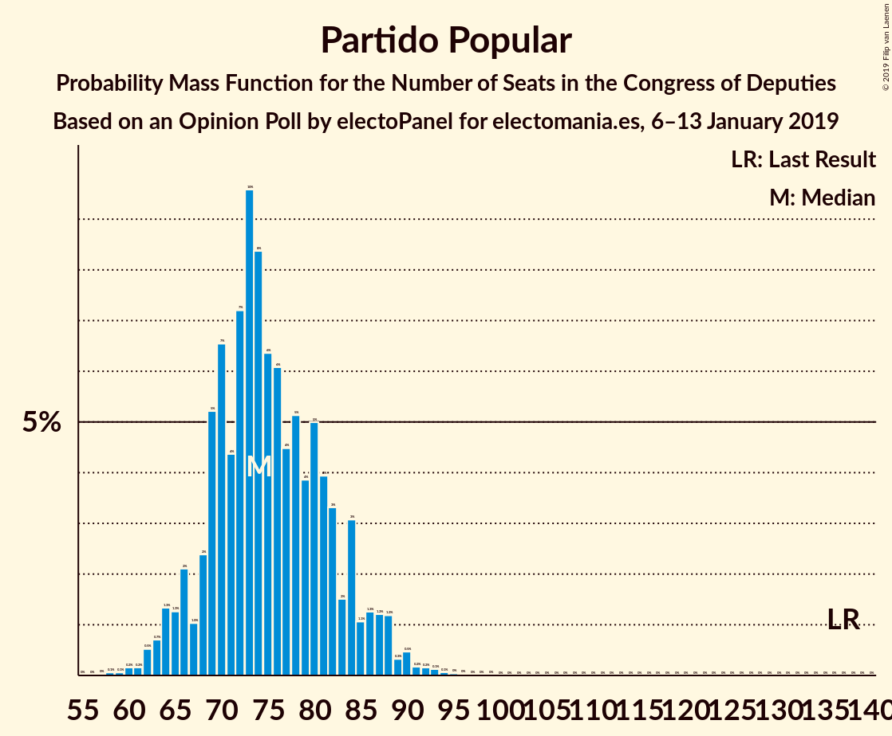
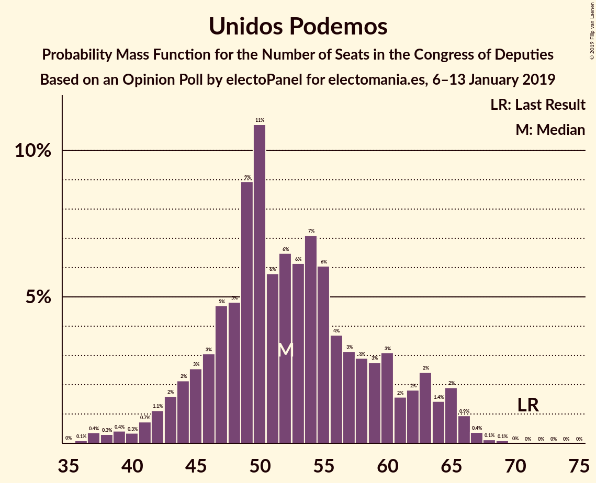
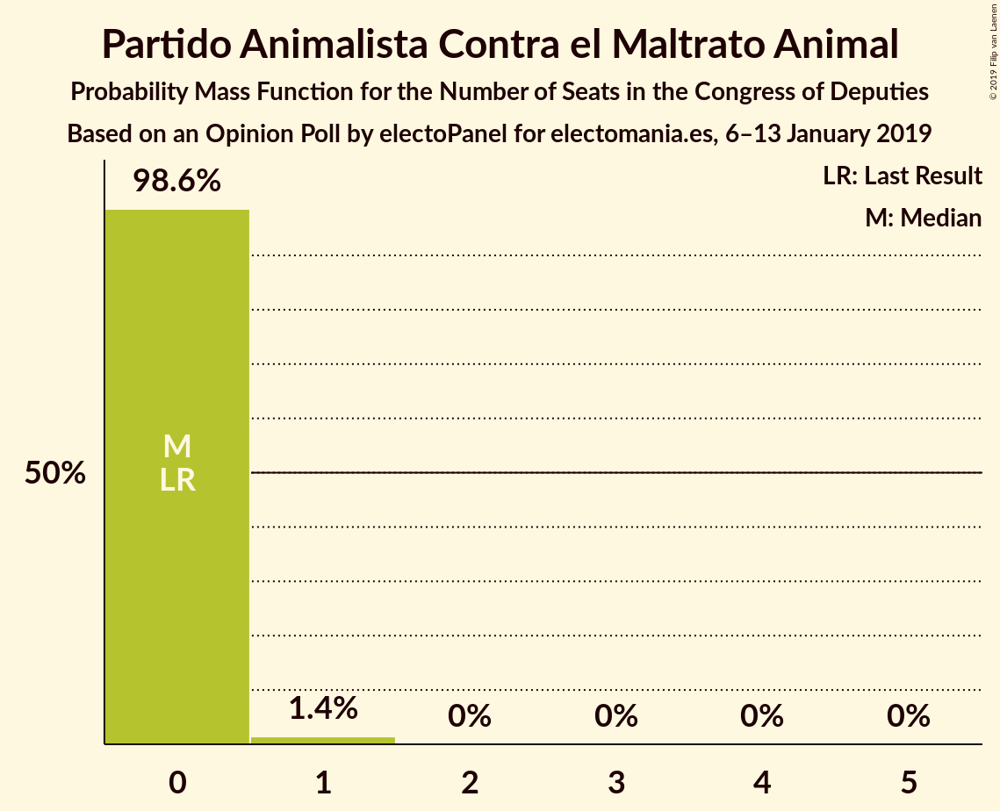
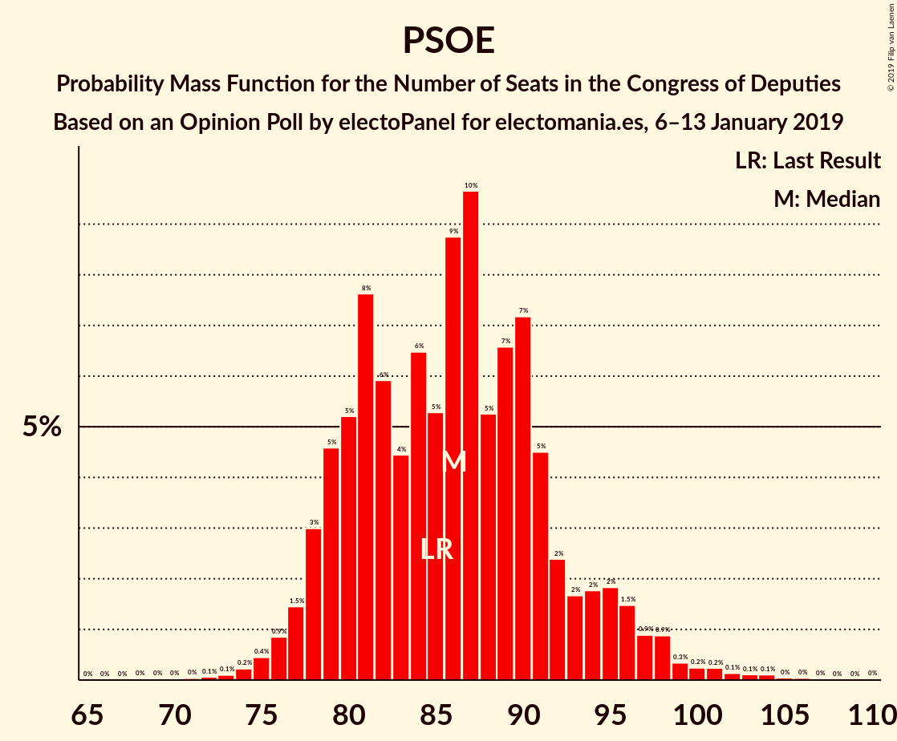
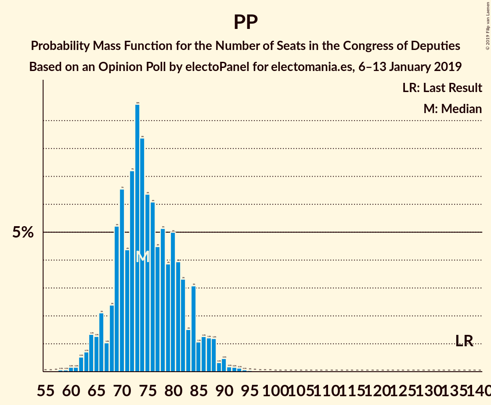

# Opinion Poll by electoPanel for electomania.es, 6–13 January 2019

<a href="#voting-intentions">Voting Intentions</a> | <a href="#seats">Seats</a> | <a href="#coalitions">Coalitions</a> | <a href="#technical-information">Technical Information</a>

## Voting Intentions

### Confidence Intervals

| Party | Last Result | Poll Result | 80% Confidence Interval | 90% Confidence Interval | 95% Confidence Interval | 99% Confidence Interval |
|:-----:|:-----------:|:-----------:|:-----------------------:|:-----------------------:|:-----------------------:|:-----------------------:|
| Partido Socialista Obrero Español | 22.6% | 21.3% | 19.9–22.8% |19.6–23.2% |19.2–23.5% |18.6–24.2% |
| Ciudadanos–Partido de la Ciudadanía | 13.1% | 19.9% | 18.5–21.3% |18.2–21.7% |17.9–22.1% |17.2–22.7% |
| Partido Popular | 33.0% | 19.1% | 17.8–20.5% |17.4–20.9% |17.1–21.2% |16.5–21.9% |
| Unidos Podemos | 21.2% | 16.3% | 15.1–17.6% |14.7–18.0% |14.4–18.3% |13.9–19.0% |
| Vox | 0.2% | 13.0% | 11.9–14.2% |11.6–14.6% |11.3–14.9% |10.8–15.5% |
| Partido Animalista Contra el Maltrato Animal | 1.2% | 1.1% | 0.8–1.5% |0.7–1.6% |0.6–1.8% |0.5–2.0% |

*Note:* The poll result column reflects the actual value used in the calculations. Published results may vary slightly, and in addition be rounded to fewer digits.

## Seats

### Confidence Intervals

| Party | Last Result | Median | 80% Confidence Interval | 90% Confidence Interval | 95% Confidence Interval | 99% Confidence Interval |
|:-----:|:-----------:|:------:|:-----------------------:|:-----------------------:|:-----------------------:|:-----------------------:|
| <a href="#partido-socialista-obrero-español">Partido Socialista Obrero Español</a> | 85 | 91 | 91–93 |84–102 |83–102 |79–103 |
| <a href="#ciudadanos–partido-de-la-ciudadanía">Ciudadanos–Partido de la Ciudadanía</a> | 32 | 72 | 71–72 |69–72 |62–72 |61–72 |
| <a href="#partido-popular">Partido Popular</a> | 137 | 74 | 74–76 |74–76 |72–79 |72–91 |
| <a href="#unidos-podemos">Unidos Podemos</a> | 71 | 47 | 45–47 |45–49 |45–49 |39–63 |
| <a href="#vox">Vox</a> | 0 | 38 | 27–38 |27–44 |27–47 |25–49 |
| <a href="#partido-animalista-contra-el-maltrato-animal">Partido Animalista Contra el Maltrato Animal</a> | 0 | 0 | 0 |0 |0 |0 |

### Partido Socialista Obrero Español

*For a full overview of the results for this party, see the [Partido Socialista Obrero Español](party-partidosocialistaobreroespañol.html) page.*

| Number of Seats | Probability | Accumulated | Special Marks |
|:---------------:|:-----------:|:-----------:|:-------------:|
| 79 | 1.4% | 100% |  |
| 80 | 0.2% | 98.6% |  |
| 81 | 0% | 98% |  |
| 82 | 0.4% | 98% |  |
| 83 | 1.4% | 98% |  |
| 84 | 3% | 97% |  |
| 85 | 0.7% | 94% | Last Result |
| 86 | 0% | 93% |  |
| 87 | 0% | 93% |  |
| 88 | 0% | 93% |  |
| 89 | 0% | 93% |  |
| 90 | 0.3% | 93% |  |
| 91 | 54% | 93% | Median |
| 92 | 0% | 39% |  |
| 93 | 29% | 39% |  |
| 94 | 0% | 10% |  |
| 95 | 0% | 10% |  |
| 96 | 0% | 10% |  |
| 97 | 0.4% | 10% |  |
| 98 | 0% | 9% |  |
| 99 | 0% | 9% |  |
| 100 | 0% | 9% |  |
| 101 | 0% | 9% |  |
| 102 | 8% | 9% |  |
| 103 | 2% | 2% |  |
| 104 | 0% | 0% |  |

### Ciudadanos–Partido de la Ciudadanía

*For a full overview of the results for this party, see the [Ciudadanos–Partido de la Ciudadanía](party-ciudadanos–partidodelaciudadanía.html) page.*

| Number of Seats | Probability | Accumulated | Special Marks |
|:---------------:|:-----------:|:-----------:|:-------------:|
| 32 | 0% | 100% | Last Result |
| 33 | 0% | 100% |  |
| 34 | 0% | 100% |  |
| 35 | 0% | 100% |  |
| 36 | 0% | 100% |  |
| 37 | 0% | 100% |  |
| 38 | 0% | 100% |  |
| 39 | 0% | 100% |  |
| 40 | 0% | 100% |  |
| 41 | 0% | 100% |  |
| 42 | 0% | 100% |  |
| 43 | 0% | 100% |  |
| 44 | 0% | 100% |  |
| 45 | 0% | 100% |  |
| 46 | 0% | 100% |  |
| 47 | 0% | 100% |  |
| 48 | 0% | 100% |  |
| 49 | 0% | 100% |  |
| 50 | 0% | 100% |  |
| 51 | 0% | 100% |  |
| 52 | 0% | 100% |  |
| 53 | 0% | 100% |  |
| 54 | 0% | 100% |  |
| 55 | 0% | 100% |  |
| 56 | 0% | 100% |  |
| 57 | 0% | 100% |  |
| 58 | 0.3% | 100% |  |
| 59 | 0% | 99.7% |  |
| 60 | 0.1% | 99.7% |  |
| 61 | 0.7% | 99.6% |  |
| 62 | 2% | 98.9% |  |
| 63 | 0.1% | 97% |  |
| 64 | 0% | 97% |  |
| 65 | 0% | 97% |  |
| 66 | 0% | 97% |  |
| 67 | 0% | 97% |  |
| 68 | 0.4% | 97% |  |
| 69 | 3% | 97% |  |
| 70 | 1.0% | 93% |  |
| 71 | 21% | 92% |  |
| 72 | 71% | 71% | Median |
| 73 | 0% | 0.3% |  |
| 74 | 0% | 0.3% |  |
| 75 | 0% | 0.3% |  |
| 76 | 0% | 0.3% |  |
| 77 | 0% | 0.2% |  |
| 78 | 0.2% | 0.2% |  |
| 79 | 0% | 0% |  |

### Partido Popular

*For a full overview of the results for this party, see the [Partido Popular](party-partidopopular.html) page.*

| Number of Seats | Probability | Accumulated | Special Marks |
|:---------------:|:-----------:|:-----------:|:-------------:|
| 64 | 0.2% | 100% |  |
| 65 | 0% | 99.8% |  |
| 66 | 0% | 99.7% |  |
| 67 | 0% | 99.7% |  |
| 68 | 0% | 99.7% |  |
| 69 | 0% | 99.7% |  |
| 70 | 0% | 99.7% |  |
| 71 | 0% | 99.7% |  |
| 72 | 4% | 99.7% |  |
| 73 | 0.2% | 95% |  |
| 74 | 83% | 95% | Median |
| 75 | 0% | 12% |  |
| 76 | 9% | 12% |  |
| 77 | 0% | 3% |  |
| 78 | 0% | 3% |  |
| 79 | 0.3% | 3% |  |
| 80 | 0.3% | 2% |  |
| 81 | 0% | 2% |  |
| 82 | 0% | 2% |  |
| 83 | 0% | 2% |  |
| 84 | 0% | 2% |  |
| 85 | 0% | 2% |  |
| 86 | 0% | 2% |  |
| 87 | 1.0% | 2% |  |
| 88 | 0.4% | 1.2% |  |
| 89 | 0.1% | 0.8% |  |
| 90 | 0% | 0.7% |  |
| 91 | 0.6% | 0.7% |  |
| 92 | 0.1% | 0.1% |  |
| 93 | 0% | 0% |  |
| 94 | 0% | 0% |  |
| 95 | 0% | 0% |  |
| 96 | 0% | 0% |  |
| 97 | 0% | 0% |  |
| 98 | 0% | 0% |  |
| 99 | 0% | 0% |  |
| 100 | 0% | 0% |  |
| 101 | 0% | 0% |  |
| 102 | 0% | 0% |  |
| 103 | 0% | 0% |  |
| 104 | 0% | 0% |  |
| 105 | 0% | 0% |  |
| 106 | 0% | 0% |  |
| 107 | 0% | 0% |  |
| 108 | 0% | 0% |  |
| 109 | 0% | 0% |  |
| 110 | 0% | 0% |  |
| 111 | 0% | 0% |  |
| 112 | 0% | 0% |  |
| 113 | 0% | 0% |  |
| 114 | 0% | 0% |  |
| 115 | 0% | 0% |  |
| 116 | 0% | 0% |  |
| 117 | 0% | 0% |  |
| 118 | 0% | 0% |  |
| 119 | 0% | 0% |  |
| 120 | 0% | 0% |  |
| 121 | 0% | 0% |  |
| 122 | 0% | 0% |  |
| 123 | 0% | 0% |  |
| 124 | 0% | 0% |  |
| 125 | 0% | 0% |  |
| 126 | 0% | 0% |  |
| 127 | 0% | 0% |  |
| 128 | 0% | 0% |  |
| 129 | 0% | 0% |  |
| 130 | 0% | 0% |  |
| 131 | 0% | 0% |  |
| 132 | 0% | 0% |  |
| 133 | 0% | 0% |  |
| 134 | 0% | 0% |  |
| 135 | 0% | 0% |  |
| 136 | 0% | 0% |  |
| 137 | 0% | 0% | Last Result |

### Unidos Podemos

*For a full overview of the results for this party, see the [Unidos Podemos](party-unidospodemos.html) page.*

| Number of Seats | Probability | Accumulated | Special Marks |
|:---------------:|:-----------:|:-----------:|:-------------:|
| 37 | 0.4% | 100% |  |
| 38 | 0% | 99.6% |  |
| 39 | 0.3% | 99.6% |  |
| 40 | 0% | 99.3% |  |
| 41 | 0% | 99.3% |  |
| 42 | 0% | 99.3% |  |
| 43 | 0% | 99.3% |  |
| 44 | 0% | 99.3% |  |
| 45 | 9% | 99.3% |  |
| 46 | 29% | 90% |  |
| 47 | 54% | 61% | Median |
| 48 | 0% | 7% |  |
| 49 | 4% | 7% |  |
| 50 | 0% | 2% |  |
| 51 | 0% | 2% |  |
| 52 | 0% | 2% |  |
| 53 | 0% | 2% |  |
| 54 | 0% | 2% |  |
| 55 | 0% | 2% |  |
| 56 | 0% | 2% |  |
| 57 | 0.1% | 2% |  |
| 58 | 0.6% | 2% |  |
| 59 | 0% | 2% |  |
| 60 | 0% | 2% |  |
| 61 | 0% | 2% |  |
| 62 | 0% | 2% |  |
| 63 | 1.4% | 2% |  |
| 64 | 0.2% | 0.2% |  |
| 65 | 0% | 0% |  |
| 66 | 0% | 0% |  |
| 67 | 0% | 0% |  |
| 68 | 0% | 0% |  |
| 69 | 0% | 0% |  |
| 70 | 0% | 0% |  |
| 71 | 0% | 0% | Last Result |

### Vox

*For a full overview of the results for this party, see the [Vox](party-vox.html) page.*

| Number of Seats | Probability | Accumulated | Special Marks |
|:---------------:|:-----------:|:-----------:|:-------------:|
| 0 | 0% | 100% | Last Result |
| 1 | 0% | 100% |  |
| 2 | 0% | 100% |  |
| 3 | 0% | 100% |  |
| 4 | 0% | 100% |  |
| 5 | 0% | 100% |  |
| 6 | 0% | 100% |  |
| 7 | 0% | 100% |  |
| 8 | 0% | 100% |  |
| 9 | 0% | 100% |  |
| 10 | 0% | 100% |  |
| 11 | 0% | 100% |  |
| 12 | 0% | 100% |  |
| 13 | 0% | 100% |  |
| 14 | 0% | 100% |  |
| 15 | 0% | 100% |  |
| 16 | 0% | 100% |  |
| 17 | 0% | 100% |  |
| 18 | 0% | 100% |  |
| 19 | 0% | 100% |  |
| 20 | 0% | 100% |  |
| 21 | 0% | 100% |  |
| 22 | 0% | 100% |  |
| 23 | 0% | 100% |  |
| 24 | 0% | 100% |  |
| 25 | 0.7% | 100% |  |
| 26 | 0% | 99.3% |  |
| 27 | 9% | 99.3% |  |
| 28 | 0% | 90% |  |
| 29 | 0% | 90% |  |
| 30 | 1.4% | 90% |  |
| 31 | 0% | 88% |  |
| 32 | 0% | 88% |  |
| 33 | 0% | 88% |  |
| 34 | 0.2% | 88% |  |
| 35 | 0% | 88% |  |
| 36 | 0% | 88% |  |
| 37 | 29% | 88% |  |
| 38 | 54% | 59% | Median |
| 39 | 0% | 5% |  |
| 40 | 0% | 5% |  |
| 41 | 0% | 5% |  |
| 42 | 0% | 5% |  |
| 43 | 0% | 5% |  |
| 44 | 0.3% | 5% |  |
| 45 | 0.1% | 5% |  |
| 46 | 0% | 5% |  |
| 47 | 3% | 5% |  |
| 48 | 1.4% | 2% |  |
| 49 | 0.4% | 0.7% |  |
| 50 | 0% | 0.3% |  |
| 51 | 0% | 0.3% |  |
| 52 | 0% | 0.3% |  |
| 53 | 0.3% | 0.3% |  |
| 54 | 0% | 0% |  |

### Partido Animalista Contra el Maltrato Animal

*For a full overview of the results for this party, see the [Partido Animalista Contra el Maltrato Animal](party-partidoanimalistacontraelmaltratoanimal.html) page.*

| Number of Seats | Probability | Accumulated | Special Marks |
|:---------------:|:-----------:|:-----------:|:-------------:|
| 0 | 99.8% | 100% | Last Result, Median |
| 1 | 0.2% | 0.2% |  |
| 2 | 0% | 0% |  |

## Coalitions

### Confidence Intervals

| Coalition | Last Result | Median | Majority? | 80% Confidence Interval | 90% Confidence Interval | 95% Confidence Interval | 99% Confidence Interval |
|:---------:|:-----------:|:------:|:---------:|:-----------------------:|:-----------------------:|:-----------------------:|:-----------------------:|
| Ciudadanos–Partido de la Ciudadanía – Partido Popular – Vox | 169 | 183 | 90% | 178–184 | 175–185 | 175–189 | 174–189 |
| Partido Socialista Obrero Español – Ciudadanos–Partido de la Ciudadanía | 117 | 163 | 0% | 162–165 | 153–174 | 150–174 | 141–174 |
| Ciudadanos–Partido de la Ciudadanía – Partido Popular | 169 | 146 | 0% | 145–147 | 142–148 | 141–148 | 140–153 |
| Partido Socialista Obrero Español – Unidos Podemos | 156 | 138 | 0% | 138–143 | 134–147 | 133–147 | 131–148 |
| Partido Popular – Vox | 137 | 112 | 0% | 111–112 | 103–119 | 103–119 | 103–124 |
| Partido Socialista Obrero Español | 85 | 91 | 0% | 91–93 | 84–102 | 83–102 | 79–103 |
| Partido Popular | 137 | 74 | 0% | 74–76 | 74–76 | 72–79 | 72–91 |

### Ciudadanos–Partido de la Ciudadanía – Partido Popular – Vox

| Number of Seats | Probability | Accumulated | Special Marks |
|:---------------:|:-----------:|:-----------:|:-------------:|
| 169 | 0% | 100% | Last Result |
| 170 | 0% | 100% |  |
| 171 | 0% | 100% |  |
| 172 | 0% | 100% |  |
| 173 | 0% | 100% |  |
| 174 | 2% | 100% |  |
| 175 | 8% | 98% |  |
| 176 | 0.2% | 90% | Majority |
| 177 | 0% | 90% |  |
| 178 | 0.6% | 90% |  |
| 179 | 1.4% | 90% |  |
| 180 | 0.1% | 88% |  |
| 181 | 0.2% | 88% |  |
| 182 | 0% | 88% |  |
| 183 | 48% | 88% |  |
| 184 | 35% | 40% | Median |
| 185 | 0.4% | 5% |  |
| 186 | 0% | 5% |  |
| 187 | 0% | 5% |  |
| 188 | 2% | 5% |  |
| 189 | 3% | 3% |  |
| 190 | 0.3% | 0.3% |  |
| 191 | 0% | 0% |  |

### Partido Socialista Obrero Español – Ciudadanos–Partido de la Ciudadanía

| Number of Seats | Probability | Accumulated | Special Marks |
|:---------------:|:-----------:|:-----------:|:-------------:|
| 117 | 0% | 100% | Last Result |
| 118 | 0% | 100% |  |
| 119 | 0% | 100% |  |
| 120 | 0% | 100% |  |
| 121 | 0% | 100% |  |
| 122 | 0% | 100% |  |
| 123 | 0% | 100% |  |
| 124 | 0% | 100% |  |
| 125 | 0% | 100% |  |
| 126 | 0% | 100% |  |
| 127 | 0% | 100% |  |
| 128 | 0% | 100% |  |
| 129 | 0% | 100% |  |
| 130 | 0% | 100% |  |
| 131 | 0% | 100% |  |
| 132 | 0% | 100% |  |
| 133 | 0% | 100% |  |
| 134 | 0% | 100% |  |
| 135 | 0% | 100% |  |
| 136 | 0% | 100% |  |
| 137 | 0% | 100% |  |
| 138 | 0% | 100% |  |
| 139 | 0.1% | 100% |  |
| 140 | 0.3% | 99.9% |  |
| 141 | 1.0% | 99.6% |  |
| 142 | 0.1% | 98.6% |  |
| 143 | 0% | 98.6% |  |
| 144 | 0% | 98.6% |  |
| 145 | 0% | 98.6% |  |
| 146 | 0% | 98.6% |  |
| 147 | 0.6% | 98.5% |  |
| 148 | 0.3% | 98% |  |
| 149 | 0% | 98% |  |
| 150 | 0.4% | 98% |  |
| 151 | 0% | 97% |  |
| 152 | 1.4% | 97% |  |
| 153 | 2% | 96% |  |
| 154 | 0.8% | 94% |  |
| 155 | 0% | 93% |  |
| 156 | 0% | 93% |  |
| 157 | 0% | 93% |  |
| 158 | 0.6% | 93% |  |
| 159 | 0% | 92% |  |
| 160 | 0% | 92% |  |
| 161 | 0.2% | 92% |  |
| 162 | 19% | 92% |  |
| 163 | 35% | 73% | Median |
| 164 | 0% | 39% |  |
| 165 | 29% | 39% |  |
| 166 | 0% | 9% |  |
| 167 | 0% | 9% |  |
| 168 | 0% | 9% |  |
| 169 | 0% | 9% |  |
| 170 | 0% | 9% |  |
| 171 | 0% | 9% |  |
| 172 | 0% | 9% |  |
| 173 | 0% | 9% |  |
| 174 | 9% | 9% |  |
| 175 | 0% | 0% |  |

### Ciudadanos–Partido de la Ciudadanía – Partido Popular

| Number of Seats | Probability | Accumulated | Special Marks |
|:---------------:|:-----------:|:-----------:|:-------------:|
| 137 | 0.3% | 100% |  |
| 138 | 0% | 99.7% |  |
| 139 | 0% | 99.7% |  |
| 140 | 0.5% | 99.7% |  |
| 141 | 4% | 99.2% |  |
| 142 | 1.0% | 96% |  |
| 143 | 0.2% | 95% |  |
| 144 | 0% | 94% |  |
| 145 | 19% | 94% |  |
| 146 | 64% | 75% | Median |
| 147 | 2% | 12% |  |
| 148 | 8% | 10% |  |
| 149 | 1.4% | 2% |  |
| 150 | 0% | 0.8% |  |
| 151 | 0% | 0.7% |  |
| 152 | 0% | 0.7% |  |
| 153 | 0.6% | 0.7% |  |
| 154 | 0% | 0.1% |  |
| 155 | 0.1% | 0.1% |  |
| 156 | 0% | 0% |  |
| 157 | 0% | 0% |  |
| 158 | 0% | 0% |  |
| 159 | 0% | 0% |  |
| 160 | 0% | 0% |  |
| 161 | 0% | 0% |  |
| 162 | 0% | 0% |  |
| 163 | 0% | 0% |  |
| 164 | 0% | 0% |  |
| 165 | 0% | 0% |  |
| 166 | 0% | 0% |  |
| 167 | 0% | 0% |  |
| 168 | 0% | 0% |  |
| 169 | 0% | 0% | Last Result |

### Partido Socialista Obrero Español – Unidos Podemos

| Number of Seats | Probability | Accumulated | Special Marks |
|:---------------:|:-----------:|:-----------:|:-------------:|
| 129 | 0.3% | 100% |  |
| 130 | 0% | 99.7% |  |
| 131 | 0.4% | 99.7% |  |
| 132 | 1.4% | 99.3% |  |
| 133 | 3% | 98% |  |
| 134 | 0.4% | 95% |  |
| 135 | 0% | 95% |  |
| 136 | 0% | 95% |  |
| 137 | 0% | 95% |  |
| 138 | 54% | 95% | Median |
| 139 | 29% | 41% |  |
| 140 | 0% | 12% |  |
| 141 | 0% | 12% |  |
| 142 | 1.5% | 12% |  |
| 143 | 0.7% | 10% |  |
| 144 | 0.2% | 10% |  |
| 145 | 0% | 10% |  |
| 146 | 0% | 10% |  |
| 147 | 8% | 9% |  |
| 148 | 2% | 2% |  |
| 149 | 0% | 0% |  |
| 150 | 0% | 0% |  |
| 151 | 0% | 0% |  |
| 152 | 0% | 0% |  |
| 153 | 0% | 0% |  |
| 154 | 0% | 0% |  |
| 155 | 0% | 0% |  |
| 156 | 0% | 0% | Last Result |

### Partido Popular – Vox

| Number of Seats | Probability | Accumulated | Special Marks |
|:---------------:|:-----------:|:-----------:|:-------------:|
| 98 | 0.2% | 100% |  |
| 99 | 0% | 99.8% |  |
| 100 | 0% | 99.8% |  |
| 101 | 0% | 99.8% |  |
| 102 | 0% | 99.8% |  |
| 103 | 9% | 99.8% |  |
| 104 | 0% | 90% |  |
| 105 | 0% | 90% |  |
| 106 | 0% | 90% |  |
| 107 | 0% | 90% |  |
| 108 | 0% | 90% |  |
| 109 | 0% | 90% |  |
| 110 | 0% | 90% |  |
| 111 | 29% | 90% |  |
| 112 | 54% | 61% | Median |
| 113 | 0% | 7% |  |
| 114 | 0% | 7% |  |
| 115 | 0% | 7% |  |
| 116 | 0.6% | 7% |  |
| 117 | 1.1% | 7% |  |
| 118 | 0.4% | 6% |  |
| 119 | 3% | 5% |  |
| 120 | 1.4% | 2% |  |
| 121 | 0.4% | 1.1% |  |
| 122 | 0% | 0.7% |  |
| 123 | 0% | 0.7% |  |
| 124 | 0.4% | 0.7% |  |
| 125 | 0% | 0.3% |  |
| 126 | 0% | 0.3% |  |
| 127 | 0% | 0.3% |  |
| 128 | 0% | 0.3% |  |
| 129 | 0% | 0.3% |  |
| 130 | 0% | 0.3% |  |
| 131 | 0% | 0.3% |  |
| 132 | 0.3% | 0.3% |  |
| 133 | 0% | 0% |  |
| 134 | 0% | 0% |  |
| 135 | 0% | 0% |  |
| 136 | 0% | 0% |  |
| 137 | 0% | 0% | Last Result |

### Partido Socialista Obrero Español

| Number of Seats | Probability | Accumulated | Special Marks |
|:---------------:|:-----------:|:-----------:|:-------------:|
| 79 | 1.4% | 100% |  |
| 80 | 0.2% | 98.6% |  |
| 81 | 0% | 98% |  |
| 82 | 0.4% | 98% |  |
| 83 | 1.4% | 98% |  |
| 84 | 3% | 97% |  |
| 85 | 0.7% | 94% | Last Result |
| 86 | 0% | 93% |  |
| 87 | 0% | 93% |  |
| 88 | 0% | 93% |  |
| 89 | 0% | 93% |  |
| 90 | 0.3% | 93% |  |
| 91 | 54% | 93% | Median |
| 92 | 0% | 39% |  |
| 93 | 29% | 39% |  |
| 94 | 0% | 10% |  |
| 95 | 0% | 10% |  |
| 96 | 0% | 10% |  |
| 97 | 0.4% | 10% |  |
| 98 | 0% | 9% |  |
| 99 | 0% | 9% |  |
| 100 | 0% | 9% |  |
| 101 | 0% | 9% |  |
| 102 | 8% | 9% |  |
| 103 | 2% | 2% |  |
| 104 | 0% | 0% |  |

### Partido Popular

| Number of Seats | Probability | Accumulated | Special Marks |
|:---------------:|:-----------:|:-----------:|:-------------:|
| 64 | 0.2% | 100% |  |
| 65 | 0% | 99.8% |  |
| 66 | 0% | 99.7% |  |
| 67 | 0% | 99.7% |  |
| 68 | 0% | 99.7% |  |
| 69 | 0% | 99.7% |  |
| 70 | 0% | 99.7% |  |
| 71 | 0% | 99.7% |  |
| 72 | 4% | 99.7% |  |
| 73 | 0.2% | 95% |  |
| 74 | 83% | 95% | Median |
| 75 | 0% | 12% |  |
| 76 | 9% | 12% |  |
| 77 | 0% | 3% |  |
| 78 | 0% | 3% |  |
| 79 | 0.3% | 3% |  |
| 80 | 0.3% | 2% |  |
| 81 | 0% | 2% |  |
| 82 | 0% | 2% |  |
| 83 | 0% | 2% |  |
| 84 | 0% | 2% |  |
| 85 | 0% | 2% |  |
| 86 | 0% | 2% |  |
| 87 | 1.0% | 2% |  |
| 88 | 0.4% | 1.2% |  |
| 89 | 0.1% | 0.8% |  |
| 90 | 0% | 0.7% |  |
| 91 | 0.6% | 0.7% |  |
| 92 | 0.1% | 0.1% |  |
| 93 | 0% | 0% |  |
| 94 | 0% | 0% |  |
| 95 | 0% | 0% |  |
| 96 | 0% | 0% |  |
| 97 | 0% | 0% |  |
| 98 | 0% | 0% |  |
| 99 | 0% | 0% |  |
| 100 | 0% | 0% |  |
| 101 | 0% | 0% |  |
| 102 | 0% | 0% |  |
| 103 | 0% | 0% |  |
| 104 | 0% | 0% |  |
| 105 | 0% | 0% |  |
| 106 | 0% | 0% |  |
| 107 | 0% | 0% |  |
| 108 | 0% | 0% |  |
| 109 | 0% | 0% |  |
| 110 | 0% | 0% |  |
| 111 | 0% | 0% |  |
| 112 | 0% | 0% |  |
| 113 | 0% | 0% |  |
| 114 | 0% | 0% |  |
| 115 | 0% | 0% |  |
| 116 | 0% | 0% |  |
| 117 | 0% | 0% |  |
| 118 | 0% | 0% |  |
| 119 | 0% | 0% |  |
| 120 | 0% | 0% |  |
| 121 | 0% | 0% |  |
| 122 | 0% | 0% |  |
| 123 | 0% | 0% |  |
| 124 | 0% | 0% |  |
| 125 | 0% | 0% |  |
| 126 | 0% | 0% |  |
| 127 | 0% | 0% |  |
| 128 | 0% | 0% |  |
| 129 | 0% | 0% |  |
| 130 | 0% | 0% |  |
| 131 | 0% | 0% |  |
| 132 | 0% | 0% |  |
| 133 | 0% | 0% |  |
| 134 | 0% | 0% |  |
| 135 | 0% | 0% |  |
| 136 | 0% | 0% |  |
| 137 | 0% | 0% | Last Result |

## Technical Information

### Opinion Poll

+ **Polling firm:** electoPanel
+ **Commissioner(s):** electomania.es
+ **Fieldwork period:** 6–13 January 2019

### Calculations

+ **Sample size:** 1399
+ **Simulations done:** 1,024
+ **Error estimate:** 1.59%

