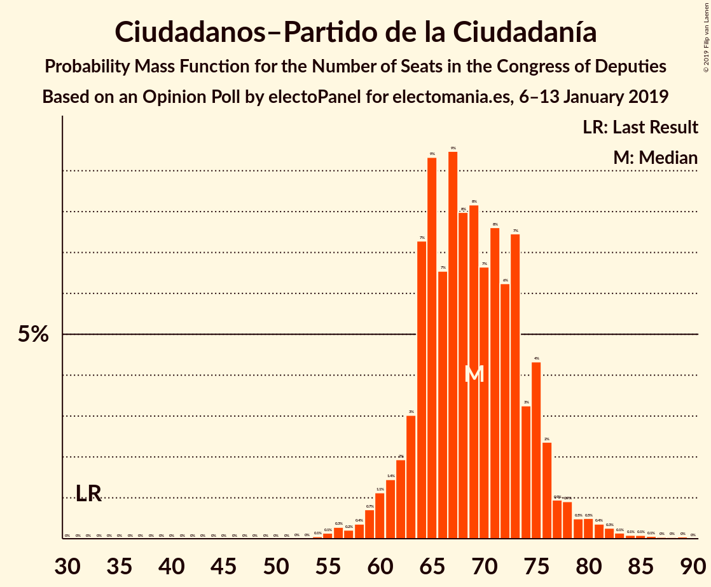

# Opinion Poll by electoPanel for electomania.es, 6–13 January 2019

<a href="#voting-intentions">Voting Intentions</a> | <a href="#seats">Seats</a> | <a href="#coalitions">Coalitions</a> | <a href="#technical-information">Technical Information</a>

## Voting Intentions

### Confidence Intervals

| Party | Last Result | Poll Result | 80% Confidence Interval | 90% Confidence Interval | 95% Confidence Interval | 99% Confidence Interval |
|:-----:|:-----------:|:-----------:|:-----------------------:|:-----------------------:|:-----------------------:|:-----------------------:|
| Partido Socialista Obrero Español | 22.6% | 21.3% | 19.9–22.8% |19.6–23.2% |19.2–23.5% |18.6–24.2% |
| Ciudadanos–Partido de la Ciudadanía | 13.1% | 19.9% | 18.5–21.3% |18.2–21.7% |17.9–22.1% |17.2–22.7% |
| Partido Popular | 33.0% | 19.1% | 17.8–20.5% |17.4–20.9% |17.1–21.2% |16.5–21.9% |
| Unidos Podemos | 21.2% | 16.3% | 15.1–17.6% |14.7–18.0% |14.4–18.3% |13.9–19.0% |
| Vox | 0.2% | 13.0% | 11.9–14.2% |11.6–14.6% |11.3–14.9% |10.8–15.5% |
| Partido Animalista Contra el Maltrato Animal | 1.2% | 1.1% | 0.8–1.5% |0.7–1.6% |0.6–1.8% |0.5–2.0% |

*Note:* The poll result column reflects the actual value used in the calculations. Published results may vary slightly, and in addition be rounded to fewer digits.

## Seats

### Confidence Intervals

| Party | Last Result | Median | 80% Confidence Interval | 90% Confidence Interval | 95% Confidence Interval | 99% Confidence Interval |
|:-----:|:-----------:|:------:|:-----------------------:|:-----------------------:|:-----------------------:|:-----------------------:|
| <a href="#partido-socialista-obrero-español">Partido Socialista Obrero Español</a> | 85 | 86 | 79–93 |78–95 |77–97 |74–101 |
| <a href="#ciudadanos–partido-de-la-ciudadanía">Ciudadanos–Partido de la Ciudadanía</a> | 32 | 69 | 64–75 |63–76 |61–78 |56–83 |
| <a href="#partido-popular">Partido Popular</a> | 137 | 74 | 69–83 |66–86 |64–88 |62–91 |
| <a href="#unidos-podemos">Unidos Podemos</a> | 71 | 51 | 45–61 |43–63 |41–65 |38–67 |
| <a href="#vox">Vox</a> | 0 | 39 | 32–46 |29–48 |27–49 |26–52 |
| <a href="#partido-animalista-contra-el-maltrato-animal">Partido Animalista Contra el Maltrato Animal</a> | 0 | 0 | 0 |0 |0 |0–1 |

### Partido Socialista Obrero Español

*For a full overview of the results for this party, see the [Partido Socialista Obrero Español](party-partidosocialistaobreroespañol.html) page.*

| Number of Seats | Probability | Accumulated | Special Marks |
|:---------------:|:-----------:|:-----------:|:-------------:|
| 69 | 0% | 100% |  |
| 70 | 0% | 99.9% |  |
| 71 | 0% | 99.9% |  |
| 72 | 0.1% | 99.9% |  |
| 73 | 0.1% | 99.8% |  |
| 74 | 0.2% | 99.7% |  |
| 75 | 0.4% | 99.5% |  |
| 76 | 1.1% | 99.1% |  |
| 77 | 2% | 98% |  |
| 78 | 3% | 96% |  |
| 79 | 4% | 94% |  |
| 80 | 4% | 90% |  |
| 81 | 8% | 85% |  |
| 82 | 9% | 77% |  |
| 83 | 4% | 68% |  |
| 84 | 7% | 64% |  |
| 85 | 5% | 57% | Last Result |
| 86 | 9% | 52% | Median |
| 87 | 11% | 43% |  |
| 88 | 4% | 33% |  |
| 89 | 4% | 28% |  |
| 90 | 8% | 24% |  |
| 91 | 3% | 16% |  |
| 92 | 2% | 13% |  |
| 93 | 2% | 11% |  |
| 94 | 2% | 9% |  |
| 95 | 2% | 7% |  |
| 96 | 2% | 5% |  |
| 97 | 2% | 3% |  |
| 98 | 0.3% | 1.4% |  |
| 99 | 0.2% | 1.1% |  |
| 100 | 0.1% | 0.8% |  |
| 101 | 0.2% | 0.7% |  |
| 102 | 0.2% | 0.5% |  |
| 103 | 0.1% | 0.3% |  |
| 104 | 0.1% | 0.2% |  |
| 105 | 0% | 0.2% |  |
| 106 | 0% | 0.1% |  |
| 107 | 0% | 0.1% |  |
| 108 | 0% | 0.1% |  |
| 109 | 0% | 0.1% |  |
| 110 | 0% | 0% |  |

### Ciudadanos–Partido de la Ciudadanía

*For a full overview of the results for this party, see the [Ciudadanos–Partido de la Ciudadanía](party-ciudadanos–partidodelaciudadanía.html) page.*

| Number of Seats | Probability | Accumulated | Special Marks |
|:---------------:|:-----------:|:-----------:|:-------------:|
| 32 | 0% | 100% | Last Result |
| 33 | 0% | 100% |  |
| 34 | 0% | 100% |  |
| 35 | 0% | 100% |  |
| 36 | 0% | 100% |  |
| 37 | 0% | 100% |  |
| 38 | 0% | 100% |  |
| 39 | 0% | 100% |  |
| 40 | 0% | 100% |  |
| 41 | 0% | 100% |  |
| 42 | 0% | 100% |  |
| 43 | 0% | 100% |  |
| 44 | 0% | 100% |  |
| 45 | 0% | 100% |  |
| 46 | 0% | 100% |  |
| 47 | 0% | 100% |  |
| 48 | 0% | 100% |  |
| 49 | 0% | 100% |  |
| 50 | 0% | 100% |  |
| 51 | 0% | 100% |  |
| 52 | 0% | 100% |  |
| 53 | 0% | 100% |  |
| 54 | 0% | 100% |  |
| 55 | 0.1% | 99.9% |  |
| 56 | 0.5% | 99.9% |  |
| 57 | 0.1% | 99.3% |  |
| 58 | 0.3% | 99.3% |  |
| 59 | 0.4% | 99.0% |  |
| 60 | 0.7% | 98.6% |  |
| 61 | 1.2% | 98% |  |
| 62 | 1.0% | 97% |  |
| 63 | 3% | 96% |  |
| 64 | 7% | 92% |  |
| 65 | 8% | 85% |  |
| 66 | 5% | 77% |  |
| 67 | 7% | 72% |  |
| 68 | 9% | 65% |  |
| 69 | 11% | 56% | Median |
| 70 | 8% | 46% |  |
| 71 | 5% | 37% |  |
| 72 | 8% | 32% |  |
| 73 | 8% | 24% |  |
| 74 | 4% | 16% |  |
| 75 | 6% | 12% |  |
| 76 | 2% | 6% |  |
| 77 | 1.4% | 4% |  |
| 78 | 0.7% | 3% |  |
| 79 | 0.8% | 2% |  |
| 80 | 0.3% | 1.4% |  |
| 81 | 0.4% | 1.1% |  |
| 82 | 0.2% | 0.8% |  |
| 83 | 0.2% | 0.6% |  |
| 84 | 0.1% | 0.4% |  |
| 85 | 0.1% | 0.3% |  |
| 86 | 0% | 0.2% |  |
| 87 | 0% | 0.2% |  |
| 88 | 0% | 0.1% |  |
| 89 | 0% | 0.1% |  |
| 90 | 0% | 0% |  |

### Partido Popular

*For a full overview of the results for this party, see the [Partido Popular](party-partidopopular.html) page.*

| Number of Seats | Probability | Accumulated | Special Marks |
|:---------------:|:-----------:|:-----------:|:-------------:|
| 57 | 0% | 100% |  |
| 58 | 0.1% | 99.9% |  |
| 59 | 0% | 99.9% |  |
| 60 | 0% | 99.8% |  |
| 61 | 0.1% | 99.8% |  |
| 62 | 1.1% | 99.7% |  |
| 63 | 0.4% | 98.7% |  |
| 64 | 1.0% | 98% |  |
| 65 | 2% | 97% |  |
| 66 | 1.4% | 95% |  |
| 67 | 0.8% | 94% |  |
| 68 | 2% | 93% |  |
| 69 | 4% | 91% |  |
| 70 | 13% | 87% |  |
| 71 | 3% | 74% |  |
| 72 | 3% | 72% |  |
| 73 | 11% | 69% |  |
| 74 | 10% | 59% | Median |
| 75 | 9% | 49% |  |
| 76 | 2% | 40% |  |
| 77 | 3% | 38% |  |
| 78 | 5% | 35% |  |
| 79 | 1.0% | 30% |  |
| 80 | 7% | 29% |  |
| 81 | 1.3% | 22% |  |
| 82 | 10% | 21% |  |
| 83 | 1.0% | 11% |  |
| 84 | 3% | 10% |  |
| 85 | 0.6% | 7% |  |
| 86 | 2% | 6% |  |
| 87 | 0.8% | 4% |  |
| 88 | 1.5% | 3% |  |
| 89 | 0.3% | 2% |  |
| 90 | 0.6% | 1.3% |  |
| 91 | 0.2% | 0.6% |  |
| 92 | 0.2% | 0.4% |  |
| 93 | 0.1% | 0.2% |  |
| 94 | 0.1% | 0.1% |  |
| 95 | 0% | 0.1% |  |
| 96 | 0% | 0.1% |  |
| 97 | 0% | 0% |  |
| 98 | 0% | 0% |  |
| 99 | 0% | 0% |  |
| 100 | 0% | 0% |  |
| 101 | 0% | 0% |  |
| 102 | 0% | 0% |  |
| 103 | 0% | 0% |  |
| 104 | 0% | 0% |  |
| 105 | 0% | 0% |  |
| 106 | 0% | 0% |  |
| 107 | 0% | 0% |  |
| 108 | 0% | 0% |  |
| 109 | 0% | 0% |  |
| 110 | 0% | 0% |  |
| 111 | 0% | 0% |  |
| 112 | 0% | 0% |  |
| 113 | 0% | 0% |  |
| 114 | 0% | 0% |  |
| 115 | 0% | 0% |  |
| 116 | 0% | 0% |  |
| 117 | 0% | 0% |  |
| 118 | 0% | 0% |  |
| 119 | 0% | 0% |  |
| 120 | 0% | 0% |  |
| 121 | 0% | 0% |  |
| 122 | 0% | 0% |  |
| 123 | 0% | 0% |  |
| 124 | 0% | 0% |  |
| 125 | 0% | 0% |  |
| 126 | 0% | 0% |  |
| 127 | 0% | 0% |  |
| 128 | 0% | 0% |  |
| 129 | 0% | 0% |  |
| 130 | 0% | 0% |  |
| 131 | 0% | 0% |  |
| 132 | 0% | 0% |  |
| 133 | 0% | 0% |  |
| 134 | 0% | 0% |  |
| 135 | 0% | 0% |  |
| 136 | 0% | 0% |  |
| 137 | 0% | 0% | Last Result |

### Unidos Podemos

*For a full overview of the results for this party, see the [Unidos Podemos](party-unidospodemos.html) page.*

| Number of Seats | Probability | Accumulated | Special Marks |
|:---------------:|:-----------:|:-----------:|:-------------:|
| 35 | 0% | 100% |  |
| 36 | 0.1% | 99.9% |  |
| 37 | 0.3% | 99.9% |  |
| 38 | 0.3% | 99.6% |  |
| 39 | 1.0% | 99.3% |  |
| 40 | 0.3% | 98% |  |
| 41 | 0.8% | 98% |  |
| 42 | 2% | 97% |  |
| 43 | 3% | 96% |  |
| 44 | 2% | 93% |  |
| 45 | 2% | 91% |  |
| 46 | 2% | 89% |  |
| 47 | 6% | 87% |  |
| 48 | 4% | 82% |  |
| 49 | 9% | 78% |  |
| 50 | 17% | 69% |  |
| 51 | 6% | 51% | Median |
| 52 | 9% | 45% |  |
| 53 | 6% | 37% |  |
| 54 | 7% | 31% |  |
| 55 | 3% | 24% |  |
| 56 | 2% | 22% |  |
| 57 | 2% | 20% |  |
| 58 | 1.1% | 18% |  |
| 59 | 1.3% | 16% |  |
| 60 | 4% | 15% |  |
| 61 | 2% | 11% |  |
| 62 | 3% | 9% |  |
| 63 | 4% | 7% |  |
| 64 | 0.4% | 3% |  |
| 65 | 1.1% | 3% |  |
| 66 | 0.8% | 1.5% |  |
| 67 | 0.3% | 0.6% |  |
| 68 | 0.2% | 0.3% |  |
| 69 | 0.1% | 0.2% |  |
| 70 | 0% | 0% |  |
| 71 | 0% | 0% | Last Result |

### Vox

*For a full overview of the results for this party, see the [Vox](party-vox.html) page.*

| Number of Seats | Probability | Accumulated | Special Marks |
|:---------------:|:-----------:|:-----------:|:-------------:|
| 0 | 0% | 100% | Last Result |
| 1 | 0% | 100% |  |
| 2 | 0% | 100% |  |
| 3 | 0% | 100% |  |
| 4 | 0% | 100% |  |
| 5 | 0% | 100% |  |
| 6 | 0% | 100% |  |
| 7 | 0% | 100% |  |
| 8 | 0% | 100% |  |
| 9 | 0% | 100% |  |
| 10 | 0% | 100% |  |
| 11 | 0% | 100% |  |
| 12 | 0% | 100% |  |
| 13 | 0% | 100% |  |
| 14 | 0% | 100% |  |
| 15 | 0% | 100% |  |
| 16 | 0% | 100% |  |
| 17 | 0% | 100% |  |
| 18 | 0% | 100% |  |
| 19 | 0% | 100% |  |
| 20 | 0% | 100% |  |
| 21 | 0% | 100% |  |
| 22 | 0% | 100% |  |
| 23 | 0% | 100% |  |
| 24 | 0% | 100% |  |
| 25 | 0.2% | 99.9% |  |
| 26 | 0.4% | 99.8% |  |
| 27 | 2% | 99.4% |  |
| 28 | 1.3% | 97% |  |
| 29 | 1.2% | 96% |  |
| 30 | 2% | 94% |  |
| 31 | 2% | 93% |  |
| 32 | 3% | 90% |  |
| 33 | 7% | 87% |  |
| 34 | 9% | 80% |  |
| 35 | 8% | 71% |  |
| 36 | 4% | 63% |  |
| 37 | 2% | 60% |  |
| 38 | 4% | 57% |  |
| 39 | 7% | 53% | Median |
| 40 | 7% | 46% |  |
| 41 | 7% | 39% |  |
| 42 | 6% | 32% |  |
| 43 | 5% | 26% |  |
| 44 | 2% | 21% |  |
| 45 | 5% | 19% |  |
| 46 | 5% | 14% |  |
| 47 | 2% | 9% |  |
| 48 | 3% | 7% |  |
| 49 | 2% | 4% |  |
| 50 | 0.5% | 1.5% |  |
| 51 | 0.2% | 0.9% |  |
| 52 | 0.7% | 0.8% |  |
| 53 | 0.1% | 0.1% |  |
| 54 | 0% | 0% |  |

### Partido Animalista Contra el Maltrato Animal

*For a full overview of the results for this party, see the [Partido Animalista Contra el Maltrato Animal](party-partidoanimalistacontraelmaltratoanimal.html) page.*

| Number of Seats | Probability | Accumulated | Special Marks |
|:---------------:|:-----------:|:-----------:|:-------------:|
| 0 | 98.7% | 100% | Last Result, Median |
| 1 | 1.3% | 1.3% |  |
| 2 | 0% | 0% |  |

## Coalitions

### Confidence Intervals

| Coalition | Last Result | Median | Majority? | 80% Confidence Interval | 90% Confidence Interval | 95% Confidence Interval | 99% Confidence Interval |
|:---------:|:-----------:|:------:|:---------:|:-----------------------:|:-----------------------:|:-----------------------:|:-----------------------:|
| Partido Socialista Obrero Español – Ciudadanos–Partido de la Ciudadanía – Partido Popular | 254 | 230 | 100% | 222–240 | 219–242 | 216–245 | 214–249 |
| Partido Socialista Obrero Español – Ciudadanos–Partido de la Ciudadanía – Unidos Podemos | 188 | 206 | 100% | 198–215 | 196–219 | 194–221 | 192–225 |
| Ciudadanos–Partido de la Ciudadanía – Partido Popular – Vox | 169 | 185 | 85% | 174–192 | 171–193 | 167–195 | 165–197 |
| Partido Socialista Obrero Español – Partido Popular | 222 | 160 | 2% | 153–170 | 151–172 | 149–175 | 145–181 |
| Partido Socialista Obrero Español – Ciudadanos–Partido de la Ciudadanía | 117 | 154 | 0.1% | 146–163 | 144–164 | 143–167 | 139–173 |
| Ciudadanos–Partido de la Ciudadanía – Partido Popular | 169 | 144 | 0% | 137–152 | 134–156 | 129–157 | 128–161 |
| Partido Socialista Obrero Español – Unidos Podemos | 156 | 137 | 0% | 129–146 | 128–150 | 126–154 | 123–156 |
| Partido Popular – Vox | 137 | 115 | 0% | 106–122 | 102–125 | 101–127 | 96–129 |
| Partido Socialista Obrero Español | 85 | 86 | 0% | 79–93 | 78–95 | 77–97 | 74–101 |
| Partido Popular | 137 | 74 | 0% | 69–83 | 66–86 | 64–88 | 62–91 |

### Partido Socialista Obrero Español – Ciudadanos–Partido de la Ciudadanía – Partido Popular

| Number of Seats | Probability | Accumulated | Special Marks |
|:---------------:|:-----------:|:-----------:|:-------------:|
| 211 | 0% | 100% |  |
| 212 | 0.1% | 99.9% |  |
| 213 | 0.1% | 99.9% |  |
| 214 | 0.3% | 99.7% |  |
| 215 | 0.9% | 99.4% |  |
| 216 | 1.1% | 98% |  |
| 217 | 1.1% | 97% |  |
| 218 | 0.7% | 96% |  |
| 219 | 1.2% | 96% |  |
| 220 | 2% | 94% |  |
| 221 | 2% | 92% |  |
| 222 | 3% | 90% |  |
| 223 | 4% | 88% |  |
| 224 | 9% | 83% |  |
| 225 | 6% | 74% |  |
| 226 | 4% | 68% |  |
| 227 | 2% | 64% |  |
| 228 | 2% | 63% |  |
| 229 | 8% | 61% | Median |
| 230 | 4% | 53% |  |
| 231 | 6% | 49% |  |
| 232 | 4% | 43% |  |
| 233 | 4% | 38% |  |
| 234 | 2% | 34% |  |
| 235 | 2% | 32% |  |
| 236 | 6% | 30% |  |
| 237 | 6% | 23% |  |
| 238 | 5% | 18% |  |
| 239 | 3% | 13% |  |
| 240 | 2% | 10% |  |
| 241 | 2% | 9% |  |
| 242 | 2% | 6% |  |
| 243 | 1.3% | 5% |  |
| 244 | 0.5% | 3% |  |
| 245 | 1.0% | 3% |  |
| 246 | 0.6% | 2% |  |
| 247 | 0.2% | 1.3% |  |
| 248 | 0.5% | 1.1% |  |
| 249 | 0.3% | 0.7% |  |
| 250 | 0.1% | 0.4% |  |
| 251 | 0.1% | 0.3% |  |
| 252 | 0.1% | 0.2% |  |
| 253 | 0% | 0.1% |  |
| 254 | 0% | 0.1% | Last Result |
| 255 | 0% | 0% |  |

### Partido Socialista Obrero Español – Ciudadanos–Partido de la Ciudadanía – Unidos Podemos

| Number of Seats | Probability | Accumulated | Special Marks |
|:---------------:|:-----------:|:-----------:|:-------------:|
| 187 | 0% | 100% |  |
| 188 | 0% | 99.9% | Last Result |
| 189 | 0.2% | 99.9% |  |
| 190 | 0% | 99.7% |  |
| 191 | 0.1% | 99.7% |  |
| 192 | 0.2% | 99.6% |  |
| 193 | 1.2% | 99.4% |  |
| 194 | 1.1% | 98% |  |
| 195 | 1.1% | 97% |  |
| 196 | 1.2% | 96% |  |
| 197 | 1.4% | 95% |  |
| 198 | 4% | 93% |  |
| 199 | 4% | 90% |  |
| 200 | 3% | 86% |  |
| 201 | 5% | 82% |  |
| 202 | 4% | 77% |  |
| 203 | 4% | 73% |  |
| 204 | 9% | 70% |  |
| 205 | 9% | 60% |  |
| 206 | 3% | 52% | Median |
| 207 | 7% | 48% |  |
| 208 | 2% | 41% |  |
| 209 | 1.2% | 40% |  |
| 210 | 3% | 38% |  |
| 211 | 5% | 35% |  |
| 212 | 8% | 30% |  |
| 213 | 8% | 22% |  |
| 214 | 2% | 14% |  |
| 215 | 3% | 12% |  |
| 216 | 1.0% | 10% |  |
| 217 | 0.5% | 9% |  |
| 218 | 0.8% | 8% |  |
| 219 | 4% | 7% |  |
| 220 | 0.9% | 4% |  |
| 221 | 1.3% | 3% |  |
| 222 | 0.7% | 2% |  |
| 223 | 0.2% | 0.8% |  |
| 224 | 0.1% | 0.6% |  |
| 225 | 0.1% | 0.5% |  |
| 226 | 0.1% | 0.5% |  |
| 227 | 0.1% | 0.4% |  |
| 228 | 0.1% | 0.3% |  |
| 229 | 0% | 0.1% |  |
| 230 | 0.1% | 0.1% |  |
| 231 | 0% | 0% |  |

### Ciudadanos–Partido de la Ciudadanía – Partido Popular – Vox

| Number of Seats | Probability | Accumulated | Special Marks |
|:---------------:|:-----------:|:-----------:|:-------------:|
| 160 | 0% | 100% |  |
| 161 | 0% | 99.9% |  |
| 162 | 0.1% | 99.9% |  |
| 163 | 0.1% | 99.9% |  |
| 164 | 0.1% | 99.8% |  |
| 165 | 0.4% | 99.7% |  |
| 166 | 1.3% | 99.3% |  |
| 167 | 0.8% | 98% |  |
| 168 | 0.4% | 97% |  |
| 169 | 0.2% | 97% | Last Result |
| 170 | 0.3% | 97% |  |
| 171 | 2% | 96% |  |
| 172 | 1.4% | 94% |  |
| 173 | 1.4% | 93% |  |
| 174 | 2% | 92% |  |
| 175 | 5% | 90% |  |
| 176 | 3% | 85% | Majority |
| 177 | 2% | 82% |  |
| 178 | 3% | 79% |  |
| 179 | 5% | 76% |  |
| 180 | 5% | 71% |  |
| 181 | 2% | 66% |  |
| 182 | 4% | 64% | Median |
| 183 | 5% | 60% |  |
| 184 | 3% | 55% |  |
| 185 | 12% | 52% |  |
| 186 | 5% | 40% |  |
| 187 | 6% | 35% |  |
| 188 | 11% | 29% |  |
| 189 | 2% | 18% |  |
| 190 | 2% | 15% |  |
| 191 | 3% | 14% |  |
| 192 | 4% | 11% |  |
| 193 | 2% | 7% |  |
| 194 | 2% | 5% |  |
| 195 | 1.5% | 3% |  |
| 196 | 0.2% | 1.4% |  |
| 197 | 0.7% | 1.2% |  |
| 198 | 0.3% | 0.5% |  |
| 199 | 0.1% | 0.2% |  |
| 200 | 0% | 0.2% |  |
| 201 | 0% | 0.1% |  |
| 202 | 0% | 0.1% |  |
| 203 | 0% | 0.1% |  |
| 204 | 0% | 0% |  |

### Partido Socialista Obrero Español – Partido Popular

| Number of Seats | Probability | Accumulated | Special Marks |
|:---------------:|:-----------:|:-----------:|:-------------:|
| 140 | 0% | 100% |  |
| 141 | 0% | 99.9% |  |
| 142 | 0% | 99.9% |  |
| 143 | 0.1% | 99.9% |  |
| 144 | 0.2% | 99.8% |  |
| 145 | 0.2% | 99.6% |  |
| 146 | 0.4% | 99.3% |  |
| 147 | 0.2% | 98.9% |  |
| 148 | 1.0% | 98.7% |  |
| 149 | 2% | 98% |  |
| 150 | 0.7% | 96% |  |
| 151 | 1.2% | 95% |  |
| 152 | 3% | 94% |  |
| 153 | 3% | 91% |  |
| 154 | 6% | 89% |  |
| 155 | 4% | 83% |  |
| 156 | 8% | 79% |  |
| 157 | 7% | 70% |  |
| 158 | 3% | 63% |  |
| 159 | 6% | 60% |  |
| 160 | 9% | 54% | Median |
| 161 | 5% | 45% |  |
| 162 | 2% | 41% |  |
| 163 | 2% | 39% |  |
| 164 | 2% | 37% |  |
| 165 | 3% | 35% |  |
| 166 | 6% | 32% |  |
| 167 | 2% | 26% |  |
| 168 | 6% | 24% |  |
| 169 | 5% | 18% |  |
| 170 | 4% | 13% |  |
| 171 | 2% | 9% |  |
| 172 | 2% | 7% |  |
| 173 | 0.2% | 5% |  |
| 174 | 1.3% | 4% |  |
| 175 | 0.7% | 3% |  |
| 176 | 0.2% | 2% | Majority |
| 177 | 0.6% | 2% |  |
| 178 | 0.3% | 1.5% |  |
| 179 | 0.5% | 1.2% |  |
| 180 | 0.2% | 0.7% |  |
| 181 | 0.3% | 0.5% |  |
| 182 | 0.1% | 0.2% |  |
| 183 | 0% | 0.1% |  |
| 184 | 0% | 0.1% |  |
| 185 | 0% | 0.1% |  |
| 186 | 0% | 0% |  |
| 187 | 0% | 0% |  |
| 188 | 0% | 0% |  |
| 189 | 0% | 0% |  |
| 190 | 0% | 0% |  |
| 191 | 0% | 0% |  |
| 192 | 0% | 0% |  |
| 193 | 0% | 0% |  |
| 194 | 0% | 0% |  |
| 195 | 0% | 0% |  |
| 196 | 0% | 0% |  |
| 197 | 0% | 0% |  |
| 198 | 0% | 0% |  |
| 199 | 0% | 0% |  |
| 200 | 0% | 0% |  |
| 201 | 0% | 0% |  |
| 202 | 0% | 0% |  |
| 203 | 0% | 0% |  |
| 204 | 0% | 0% |  |
| 205 | 0% | 0% |  |
| 206 | 0% | 0% |  |
| 207 | 0% | 0% |  |
| 208 | 0% | 0% |  |
| 209 | 0% | 0% |  |
| 210 | 0% | 0% |  |
| 211 | 0% | 0% |  |
| 212 | 0% | 0% |  |
| 213 | 0% | 0% |  |
| 214 | 0% | 0% |  |
| 215 | 0% | 0% |  |
| 216 | 0% | 0% |  |
| 217 | 0% | 0% |  |
| 218 | 0% | 0% |  |
| 219 | 0% | 0% |  |
| 220 | 0% | 0% |  |
| 221 | 0% | 0% |  |
| 222 | 0% | 0% | Last Result |

### Partido Socialista Obrero Español – Ciudadanos–Partido de la Ciudadanía

| Number of Seats | Probability | Accumulated | Special Marks |
|:---------------:|:-----------:|:-----------:|:-------------:|
| 117 | 0% | 100% | Last Result |
| 118 | 0% | 100% |  |
| 119 | 0% | 100% |  |
| 120 | 0% | 100% |  |
| 121 | 0% | 100% |  |
| 122 | 0% | 100% |  |
| 123 | 0% | 100% |  |
| 124 | 0% | 100% |  |
| 125 | 0% | 100% |  |
| 126 | 0% | 100% |  |
| 127 | 0% | 100% |  |
| 128 | 0% | 100% |  |
| 129 | 0% | 100% |  |
| 130 | 0% | 100% |  |
| 131 | 0% | 100% |  |
| 132 | 0% | 100% |  |
| 133 | 0% | 100% |  |
| 134 | 0% | 100% |  |
| 135 | 0% | 100% |  |
| 136 | 0% | 100% |  |
| 137 | 0% | 100% |  |
| 138 | 0.2% | 99.9% |  |
| 139 | 0.3% | 99.8% |  |
| 140 | 0.7% | 99.5% |  |
| 141 | 0.5% | 98.8% |  |
| 142 | 0.5% | 98% |  |
| 143 | 1.4% | 98% |  |
| 144 | 3% | 96% |  |
| 145 | 0.8% | 94% |  |
| 146 | 3% | 93% |  |
| 147 | 3% | 90% |  |
| 148 | 2% | 87% |  |
| 149 | 5% | 86% |  |
| 150 | 6% | 81% |  |
| 151 | 6% | 75% |  |
| 152 | 5% | 69% |  |
| 153 | 5% | 64% |  |
| 154 | 10% | 59% |  |
| 155 | 7% | 49% | Median |
| 156 | 7% | 42% |  |
| 157 | 2% | 35% |  |
| 158 | 0.8% | 33% |  |
| 159 | 2% | 32% |  |
| 160 | 2% | 30% |  |
| 161 | 5% | 28% |  |
| 162 | 7% | 23% |  |
| 163 | 8% | 16% |  |
| 164 | 3% | 8% |  |
| 165 | 2% | 4% |  |
| 166 | 0.3% | 3% |  |
| 167 | 0.1% | 3% |  |
| 168 | 0.5% | 2% |  |
| 169 | 0.2% | 2% |  |
| 170 | 0.2% | 2% |  |
| 171 | 0.7% | 2% |  |
| 172 | 0.3% | 0.9% |  |
| 173 | 0.3% | 0.7% |  |
| 174 | 0.1% | 0.3% |  |
| 175 | 0.1% | 0.2% |  |
| 176 | 0% | 0.1% | Majority |
| 177 | 0% | 0.1% |  |
| 178 | 0% | 0.1% |  |
| 179 | 0% | 0% |  |

### Ciudadanos–Partido de la Ciudadanía – Partido Popular

| Number of Seats | Probability | Accumulated | Special Marks |
|:---------------:|:-----------:|:-----------:|:-------------:|
| 124 | 0% | 100% |  |
| 125 | 0% | 99.9% |  |
| 126 | 0% | 99.9% |  |
| 127 | 0.1% | 99.9% |  |
| 128 | 1.3% | 99.7% |  |
| 129 | 1.0% | 98% |  |
| 130 | 0.2% | 97% |  |
| 131 | 0.5% | 97% |  |
| 132 | 0.7% | 97% |  |
| 133 | 0.6% | 96% |  |
| 134 | 1.3% | 95% |  |
| 135 | 1.5% | 94% |  |
| 136 | 2% | 93% |  |
| 137 | 6% | 91% |  |
| 138 | 2% | 85% |  |
| 139 | 3% | 82% |  |
| 140 | 1.3% | 79% |  |
| 141 | 5% | 78% |  |
| 142 | 10% | 73% |  |
| 143 | 12% | 63% | Median |
| 144 | 5% | 51% |  |
| 145 | 2% | 45% |  |
| 146 | 3% | 43% |  |
| 147 | 6% | 41% |  |
| 148 | 6% | 34% |  |
| 149 | 4% | 28% |  |
| 150 | 3% | 25% |  |
| 151 | 7% | 22% |  |
| 152 | 5% | 15% |  |
| 153 | 1.1% | 10% |  |
| 154 | 2% | 9% |  |
| 155 | 1.4% | 7% |  |
| 156 | 2% | 5% |  |
| 157 | 1.1% | 3% |  |
| 158 | 1.0% | 2% |  |
| 159 | 0.5% | 1.3% |  |
| 160 | 0.2% | 0.9% |  |
| 161 | 0.2% | 0.6% |  |
| 162 | 0.1% | 0.4% |  |
| 163 | 0.1% | 0.3% |  |
| 164 | 0.1% | 0.2% |  |
| 165 | 0% | 0.1% |  |
| 166 | 0% | 0.1% |  |
| 167 | 0% | 0% |  |
| 168 | 0% | 0% |  |
| 169 | 0% | 0% | Last Result |

### Partido Socialista Obrero Español – Unidos Podemos

| Number of Seats | Probability | Accumulated | Special Marks |
|:---------------:|:-----------:|:-----------:|:-------------:|
| 117 | 0% | 100% |  |
| 118 | 0% | 99.9% |  |
| 119 | 0% | 99.9% |  |
| 120 | 0% | 99.9% |  |
| 121 | 0% | 99.8% |  |
| 122 | 0.1% | 99.8% |  |
| 123 | 0.2% | 99.7% |  |
| 124 | 0.7% | 99.5% |  |
| 125 | 0.3% | 98.7% |  |
| 126 | 2% | 98% |  |
| 127 | 2% | 97% |  |
| 128 | 3% | 95% |  |
| 129 | 3% | 92% |  |
| 130 | 3% | 89% |  |
| 131 | 1.5% | 86% |  |
| 132 | 3% | 85% |  |
| 133 | 10% | 81% |  |
| 134 | 8% | 71% |  |
| 135 | 6% | 64% |  |
| 136 | 7% | 58% |  |
| 137 | 5% | 51% | Median |
| 138 | 5% | 47% |  |
| 139 | 4% | 42% |  |
| 140 | 6% | 37% |  |
| 141 | 3% | 31% |  |
| 142 | 5% | 28% |  |
| 143 | 4% | 24% |  |
| 144 | 2% | 20% |  |
| 145 | 5% | 18% |  |
| 146 | 2% | 12% |  |
| 147 | 2% | 10% |  |
| 148 | 0.8% | 8% |  |
| 149 | 2% | 7% |  |
| 150 | 2% | 5% |  |
| 151 | 0.2% | 4% |  |
| 152 | 0.2% | 3% |  |
| 153 | 0.4% | 3% |  |
| 154 | 2% | 3% |  |
| 155 | 0.6% | 1.1% |  |
| 156 | 0.2% | 0.5% | Last Result |
| 157 | 0.1% | 0.3% |  |
| 158 | 0.1% | 0.2% |  |
| 159 | 0% | 0.1% |  |
| 160 | 0% | 0.1% |  |
| 161 | 0% | 0.1% |  |
| 162 | 0% | 0% |  |

### Partido Popular – Vox

| Number of Seats | Probability | Accumulated | Special Marks |
|:---------------:|:-----------:|:-----------:|:-------------:|
| 91 | 0.1% | 100% |  |
| 92 | 0% | 99.9% |  |
| 93 | 0.1% | 99.9% |  |
| 94 | 0.1% | 99.9% |  |
| 95 | 0.2% | 99.8% |  |
| 96 | 0.1% | 99.6% |  |
| 97 | 0% | 99.5% |  |
| 98 | 0.3% | 99.4% |  |
| 99 | 0.1% | 99.2% |  |
| 100 | 1.0% | 99.1% |  |
| 101 | 3% | 98% |  |
| 102 | 2% | 95% |  |
| 103 | 1.4% | 93% |  |
| 104 | 0.7% | 92% |  |
| 105 | 0.8% | 91% |  |
| 106 | 2% | 91% |  |
| 107 | 5% | 89% |  |
| 108 | 8% | 84% |  |
| 109 | 5% | 76% |  |
| 110 | 7% | 71% |  |
| 111 | 2% | 64% |  |
| 112 | 1.2% | 61% |  |
| 113 | 1.4% | 60% | Median |
| 114 | 6% | 59% |  |
| 115 | 6% | 53% |  |
| 116 | 11% | 47% |  |
| 117 | 7% | 36% |  |
| 118 | 4% | 29% |  |
| 119 | 3% | 25% |  |
| 120 | 5% | 23% |  |
| 121 | 4% | 18% |  |
| 122 | 4% | 14% |  |
| 123 | 4% | 10% |  |
| 124 | 1.1% | 6% |  |
| 125 | 1.2% | 5% |  |
| 126 | 1.1% | 4% |  |
| 127 | 1.0% | 3% |  |
| 128 | 1.1% | 2% |  |
| 129 | 0.2% | 0.6% |  |
| 130 | 0.1% | 0.3% |  |
| 131 | 0.1% | 0.3% |  |
| 132 | 0.1% | 0.2% |  |
| 133 | 0.1% | 0.1% |  |
| 134 | 0% | 0% |  |
| 135 | 0% | 0% |  |
| 136 | 0% | 0% |  |
| 137 | 0% | 0% | Last Result |

### Partido Socialista Obrero Español

| Number of Seats | Probability | Accumulated | Special Marks |
|:---------------:|:-----------:|:-----------:|:-------------:|
| 69 | 0% | 100% |  |
| 70 | 0% | 99.9% |  |
| 71 | 0% | 99.9% |  |
| 72 | 0.1% | 99.9% |  |
| 73 | 0.1% | 99.8% |  |
| 74 | 0.2% | 99.7% |  |
| 75 | 0.4% | 99.5% |  |
| 76 | 1.1% | 99.1% |  |
| 77 | 2% | 98% |  |
| 78 | 3% | 96% |  |
| 79 | 4% | 94% |  |
| 80 | 4% | 90% |  |
| 81 | 8% | 85% |  |
| 82 | 9% | 77% |  |
| 83 | 4% | 68% |  |
| 84 | 7% | 64% |  |
| 85 | 5% | 57% | Last Result |
| 86 | 9% | 52% | Median |
| 87 | 11% | 43% |  |
| 88 | 4% | 33% |  |
| 89 | 4% | 28% |  |
| 90 | 8% | 24% |  |
| 91 | 3% | 16% |  |
| 92 | 2% | 13% |  |
| 93 | 2% | 11% |  |
| 94 | 2% | 9% |  |
| 95 | 2% | 7% |  |
| 96 | 2% | 5% |  |
| 97 | 2% | 3% |  |
| 98 | 0.3% | 1.4% |  |
| 99 | 0.2% | 1.1% |  |
| 100 | 0.1% | 0.8% |  |
| 101 | 0.2% | 0.7% |  |
| 102 | 0.2% | 0.5% |  |
| 103 | 0.1% | 0.3% |  |
| 104 | 0.1% | 0.2% |  |
| 105 | 0% | 0.2% |  |
| 106 | 0% | 0.1% |  |
| 107 | 0% | 0.1% |  |
| 108 | 0% | 0.1% |  |
| 109 | 0% | 0.1% |  |
| 110 | 0% | 0% |  |

### Partido Popular

| Number of Seats | Probability | Accumulated | Special Marks |
|:---------------:|:-----------:|:-----------:|:-------------:|
| 57 | 0% | 100% |  |
| 58 | 0.1% | 99.9% |  |
| 59 | 0% | 99.9% |  |
| 60 | 0% | 99.8% |  |
| 61 | 0.1% | 99.8% |  |
| 62 | 1.1% | 99.7% |  |
| 63 | 0.4% | 98.7% |  |
| 64 | 1.0% | 98% |  |
| 65 | 2% | 97% |  |
| 66 | 1.4% | 95% |  |
| 67 | 0.8% | 94% |  |
| 68 | 2% | 93% |  |
| 69 | 4% | 91% |  |
| 70 | 13% | 87% |  |
| 71 | 3% | 74% |  |
| 72 | 3% | 72% |  |
| 73 | 11% | 69% |  |
| 74 | 10% | 59% | Median |
| 75 | 9% | 49% |  |
| 76 | 2% | 40% |  |
| 77 | 3% | 38% |  |
| 78 | 5% | 35% |  |
| 79 | 1.0% | 30% |  |
| 80 | 7% | 29% |  |
| 81 | 1.3% | 22% |  |
| 82 | 10% | 21% |  |
| 83 | 1.0% | 11% |  |
| 84 | 3% | 10% |  |
| 85 | 0.6% | 7% |  |
| 86 | 2% | 6% |  |
| 87 | 0.8% | 4% |  |
| 88 | 1.5% | 3% |  |
| 89 | 0.3% | 2% |  |
| 90 | 0.6% | 1.3% |  |
| 91 | 0.2% | 0.6% |  |
| 92 | 0.2% | 0.4% |  |
| 93 | 0.1% | 0.2% |  |
| 94 | 0.1% | 0.1% |  |
| 95 | 0% | 0.1% |  |
| 96 | 0% | 0.1% |  |
| 97 | 0% | 0% |  |
| 98 | 0% | 0% |  |
| 99 | 0% | 0% |  |
| 100 | 0% | 0% |  |
| 101 | 0% | 0% |  |
| 102 | 0% | 0% |  |
| 103 | 0% | 0% |  |
| 104 | 0% | 0% |  |
| 105 | 0% | 0% |  |
| 106 | 0% | 0% |  |
| 107 | 0% | 0% |  |
| 108 | 0% | 0% |  |
| 109 | 0% | 0% |  |
| 110 | 0% | 0% |  |
| 111 | 0% | 0% |  |
| 112 | 0% | 0% |  |
| 113 | 0% | 0% |  |
| 114 | 0% | 0% |  |
| 115 | 0% | 0% |  |
| 116 | 0% | 0% |  |
| 117 | 0% | 0% |  |
| 118 | 0% | 0% |  |
| 119 | 0% | 0% |  |
| 120 | 0% | 0% |  |
| 121 | 0% | 0% |  |
| 122 | 0% | 0% |  |
| 123 | 0% | 0% |  |
| 124 | 0% | 0% |  |
| 125 | 0% | 0% |  |
| 126 | 0% | 0% |  |
| 127 | 0% | 0% |  |
| 128 | 0% | 0% |  |
| 129 | 0% | 0% |  |
| 130 | 0% | 0% |  |
| 131 | 0% | 0% |  |
| 132 | 0% | 0% |  |
| 133 | 0% | 0% |  |
| 134 | 0% | 0% |  |
| 135 | 0% | 0% |  |
| 136 | 0% | 0% |  |
| 137 | 0% | 0% | Last Result |

## Technical Information

### Opinion Poll

+ **Polling firm:** electoPanel
+ **Commissioner(s):** electomania.es
+ **Fieldwork period:** 6–13 January 2019

### Calculations

+ **Sample size:** 1399
+ **Simulations done:** 131,072
+ **Error estimate:** 0.94%

