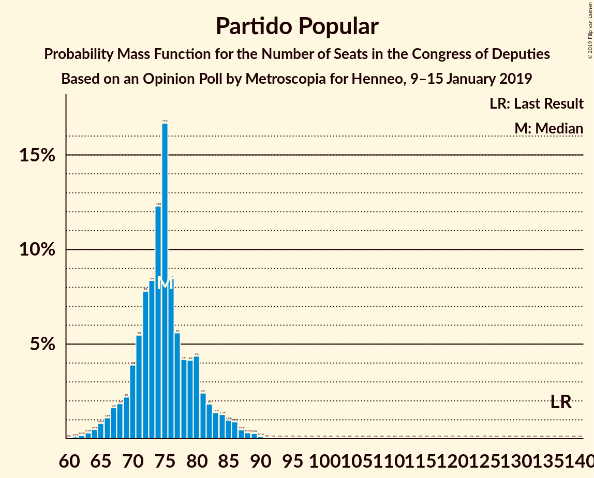

# Opinion Poll by Metroscopia for Henneo, 9–15 January 2019

<a href="#voting-intentions">Voting Intentions</a> | <a href="#seats">Seats</a> | <a href="#coalitions">Coalitions</a> | <a href="#technical-information">Technical Information</a>

## Voting Intentions

### Confidence Intervals

| Party | Last Result | Poll Result | 80% Confidence Interval | 90% Confidence Interval | 95% Confidence Interval | 99% Confidence Interval |
|:-----:|:-----------:|:-----------:|:-----------------------:|:-----------------------:|:-----------------------:|:-----------------------:|
| Partido Socialista Obrero Español | 22.6% | 23.7% | 22.6–24.9% |22.3–25.2% |22.0–25.5% |21.5–26.0% |
| Partido Popular | 33.0% | 19.1% | 18.1–20.2% |17.8–20.5% |17.5–20.7% |17.1–21.3% |
| Ciudadanos–Partido de la Ciudadanía | 13.1% | 17.8% | 16.8–18.9% |16.5–19.1% |16.3–19.4% |15.8–19.9% |
| Unidos Podemos | 21.2% | 17.1% | 16.1–18.2% |15.9–18.4% |15.6–18.7% |15.2–19.2% |
| Vox | 0.2% | 12.1% | 11.3–13.0% |11.0–13.3% |10.8–13.5% |10.4–13.9% |

*Note:* The poll result column reflects the actual value used in the calculations. Published results may vary slightly, and in addition be rounded to fewer digits.

## Seats

### Confidence Intervals

| Party | Last Result | Median | 80% Confidence Interval | 90% Confidence Interval | 95% Confidence Interval | 99% Confidence Interval |
|:-----:|:-----------:|:------:|:-----------------------:|:-----------------------:|:-----------------------:|:-----------------------:|
| <a href="#partido-socialista-obrero-español">Partido Socialista Obrero Español</a> | 85 | 96 | 92–102 |90–107 |88–110 |85–111 |
| <a href="#partido-popular">Partido Popular</a> | 137 | 75 | 70–80 |68–83 |66–85 |63–88 |
| <a href="#ciudadanos–partido-de-la-ciudadanía">Ciudadanos–Partido de la Ciudadanía</a> | 32 | 61 | 56–64 |55–65 |55–66 |53–69 |
| <a href="#unidos-podemos">Unidos Podemos</a> | 71 | 58 | 50–63 |48–63 |45–65 |44–67 |
| <a href="#vox">Vox</a> | 0 | 31 | 27–37 |27–39 |26–41 |25–44 |

### Partido Socialista Obrero Español

*For a full overview of the results for this party, see the [Partido Socialista Obrero Español](party-partidosocialistaobreroespañol.html) page.*

| Number of Seats | Probability | Accumulated | Special Marks |
|:---------------:|:-----------:|:-----------:|:-------------:|
| 82 | 0% | 100% |  |
| 83 | 0.1% | 99.9% |  |
| 84 | 0.2% | 99.9% |  |
| 85 | 0.3% | 99.7% | Last Result |
| 86 | 0.4% | 99.3% |  |
| 87 | 0.7% | 99.0% |  |
| 88 | 1.3% | 98% |  |
| 89 | 1.3% | 97% |  |
| 90 | 2% | 96% |  |
| 91 | 3% | 93% |  |
| 92 | 6% | 90% |  |
| 93 | 5% | 85% |  |
| 94 | 8% | 80% |  |
| 95 | 4% | 71% |  |
| 96 | 22% | 67% | Median |
| 97 | 8% | 45% |  |
| 98 | 7% | 37% |  |
| 99 | 10% | 31% |  |
| 100 | 4% | 21% |  |
| 101 | 3% | 17% |  |
| 102 | 4% | 14% |  |
| 103 | 1.2% | 10% |  |
| 104 | 0.9% | 9% |  |
| 105 | 0.6% | 8% |  |
| 106 | 2% | 7% |  |
| 107 | 0.4% | 5% |  |
| 108 | 1.0% | 5% |  |
| 109 | 1.0% | 4% |  |
| 110 | 1.2% | 3% |  |
| 111 | 1.1% | 2% |  |
| 112 | 0.4% | 0.4% |  |
| 113 | 0% | 0.1% |  |
| 114 | 0% | 0% |  |

### Partido Popular

*For a full overview of the results for this party, see the [Partido Popular](party-partidopopular.html) page.*

| Number of Seats | Probability | Accumulated | Special Marks |
|:---------------:|:-----------:|:-----------:|:-------------:|
| 61 | 0.1% | 100% |  |
| 62 | 0.1% | 99.9% |  |
| 63 | 0.4% | 99.8% |  |
| 64 | 0.5% | 99.4% |  |
| 65 | 0.8% | 98.9% |  |
| 66 | 0.9% | 98% |  |
| 67 | 2% | 97% |  |
| 68 | 2% | 95% |  |
| 69 | 2% | 93% |  |
| 70 | 3% | 91% |  |
| 71 | 5% | 87% |  |
| 72 | 9% | 82% |  |
| 73 | 9% | 74% |  |
| 74 | 11% | 65% |  |
| 75 | 16% | 54% | Median |
| 76 | 11% | 38% |  |
| 77 | 5% | 27% |  |
| 78 | 4% | 22% |  |
| 79 | 2% | 19% |  |
| 80 | 7% | 16% |  |
| 81 | 2% | 10% |  |
| 82 | 1.4% | 7% |  |
| 83 | 1.2% | 6% |  |
| 84 | 2% | 5% |  |
| 85 | 1.2% | 3% |  |
| 86 | 0.8% | 2% |  |
| 87 | 0.5% | 1.2% |  |
| 88 | 0.4% | 0.8% |  |
| 89 | 0.2% | 0.4% |  |
| 90 | 0.1% | 0.2% |  |
| 91 | 0% | 0.1% |  |
| 92 | 0% | 0% |  |
| 93 | 0% | 0% |  |
| 94 | 0% | 0% |  |
| 95 | 0% | 0% |  |
| 96 | 0% | 0% |  |
| 97 | 0% | 0% |  |
| 98 | 0% | 0% |  |
| 99 | 0% | 0% |  |
| 100 | 0% | 0% |  |
| 101 | 0% | 0% |  |
| 102 | 0% | 0% |  |
| 103 | 0% | 0% |  |
| 104 | 0% | 0% |  |
| 105 | 0% | 0% |  |
| 106 | 0% | 0% |  |
| 107 | 0% | 0% |  |
| 108 | 0% | 0% |  |
| 109 | 0% | 0% |  |
| 110 | 0% | 0% |  |
| 111 | 0% | 0% |  |
| 112 | 0% | 0% |  |
| 113 | 0% | 0% |  |
| 114 | 0% | 0% |  |
| 115 | 0% | 0% |  |
| 116 | 0% | 0% |  |
| 117 | 0% | 0% |  |
| 118 | 0% | 0% |  |
| 119 | 0% | 0% |  |
| 120 | 0% | 0% |  |
| 121 | 0% | 0% |  |
| 122 | 0% | 0% |  |
| 123 | 0% | 0% |  |
| 124 | 0% | 0% |  |
| 125 | 0% | 0% |  |
| 126 | 0% | 0% |  |
| 127 | 0% | 0% |  |
| 128 | 0% | 0% |  |
| 129 | 0% | 0% |  |
| 130 | 0% | 0% |  |
| 131 | 0% | 0% |  |
| 132 | 0% | 0% |  |
| 133 | 0% | 0% |  |
| 134 | 0% | 0% |  |
| 135 | 0% | 0% |  |
| 136 | 0% | 0% |  |
| 137 | 0% | 0% | Last Result |

### Ciudadanos–Partido de la Ciudadanía

*For a full overview of the results for this party, see the [Ciudadanos–Partido de la Ciudadanía](party-ciudadanos–partidodelaciudadanía.html) page.*

| Number of Seats | Probability | Accumulated | Special Marks |
|:---------------:|:-----------:|:-----------:|:-------------:|
| 32 | 0% | 100% | Last Result |
| 33 | 0% | 100% |  |
| 34 | 0% | 100% |  |
| 35 | 0% | 100% |  |
| 36 | 0% | 100% |  |
| 37 | 0% | 100% |  |
| 38 | 0% | 100% |  |
| 39 | 0% | 100% |  |
| 40 | 0% | 100% |  |
| 41 | 0% | 100% |  |
| 42 | 0% | 100% |  |
| 43 | 0% | 100% |  |
| 44 | 0% | 100% |  |
| 45 | 0% | 100% |  |
| 46 | 0% | 100% |  |
| 47 | 0% | 100% |  |
| 48 | 0% | 100% |  |
| 49 | 0% | 100% |  |
| 50 | 0% | 100% |  |
| 51 | 0.1% | 100% |  |
| 52 | 0.2% | 99.9% |  |
| 53 | 0.4% | 99.7% |  |
| 54 | 2% | 99.4% |  |
| 55 | 3% | 98% |  |
| 56 | 7% | 95% |  |
| 57 | 11% | 88% |  |
| 58 | 7% | 77% |  |
| 59 | 5% | 70% |  |
| 60 | 8% | 65% |  |
| 61 | 16% | 57% | Median |
| 62 | 13% | 41% |  |
| 63 | 7% | 28% |  |
| 64 | 12% | 21% |  |
| 65 | 4% | 9% |  |
| 66 | 3% | 5% |  |
| 67 | 1.3% | 2% |  |
| 68 | 0.5% | 1.0% |  |
| 69 | 0.2% | 0.5% |  |
| 70 | 0.1% | 0.3% |  |
| 71 | 0.1% | 0.2% |  |
| 72 | 0.1% | 0.1% |  |
| 73 | 0% | 0% |  |

### Unidos Podemos

*For a full overview of the results for this party, see the [Unidos Podemos](party-unidospodemos.html) page.*

| Number of Seats | Probability | Accumulated | Special Marks |
|:---------------:|:-----------:|:-----------:|:-------------:|
| 41 | 0% | 100% |  |
| 42 | 0.1% | 99.9% |  |
| 43 | 0.2% | 99.9% |  |
| 44 | 0.4% | 99.7% |  |
| 45 | 2% | 99.3% |  |
| 46 | 1.4% | 97% |  |
| 47 | 0.6% | 96% |  |
| 48 | 2% | 95% |  |
| 49 | 3% | 94% |  |
| 50 | 3% | 91% |  |
| 51 | 2% | 87% |  |
| 52 | 1.3% | 85% |  |
| 53 | 2% | 84% |  |
| 54 | 6% | 82% |  |
| 55 | 10% | 76% |  |
| 56 | 4% | 66% |  |
| 57 | 6% | 62% |  |
| 58 | 7% | 56% | Median |
| 59 | 10% | 49% |  |
| 60 | 11% | 39% |  |
| 61 | 12% | 28% |  |
| 62 | 5% | 16% |  |
| 63 | 6% | 10% |  |
| 64 | 2% | 5% |  |
| 65 | 2% | 3% |  |
| 66 | 0.5% | 1.0% |  |
| 67 | 0.3% | 0.5% |  |
| 68 | 0.1% | 0.2% |  |
| 69 | 0.1% | 0.1% |  |
| 70 | 0% | 0% |  |
| 71 | 0% | 0% | Last Result |

### Vox

*For a full overview of the results for this party, see the [Vox](party-vox.html) page.*

| Number of Seats | Probability | Accumulated | Special Marks |
|:---------------:|:-----------:|:-----------:|:-------------:|
| 0 | 0% | 100% | Last Result |
| 1 | 0% | 100% |  |
| 2 | 0% | 100% |  |
| 3 | 0% | 100% |  |
| 4 | 0% | 100% |  |
| 5 | 0% | 100% |  |
| 6 | 0% | 100% |  |
| 7 | 0% | 100% |  |
| 8 | 0% | 100% |  |
| 9 | 0% | 100% |  |
| 10 | 0% | 100% |  |
| 11 | 0% | 100% |  |
| 12 | 0% | 100% |  |
| 13 | 0% | 100% |  |
| 14 | 0% | 100% |  |
| 15 | 0% | 100% |  |
| 16 | 0% | 100% |  |
| 17 | 0% | 100% |  |
| 18 | 0% | 100% |  |
| 19 | 0% | 100% |  |
| 20 | 0% | 100% |  |
| 21 | 0% | 100% |  |
| 22 | 0% | 100% |  |
| 23 | 0.1% | 100% |  |
| 24 | 0.2% | 99.9% |  |
| 25 | 0.5% | 99.7% |  |
| 26 | 2% | 99.2% |  |
| 27 | 15% | 97% |  |
| 28 | 13% | 82% |  |
| 29 | 8% | 69% |  |
| 30 | 8% | 62% |  |
| 31 | 5% | 54% | Median |
| 32 | 12% | 49% |  |
| 33 | 11% | 36% |  |
| 34 | 5% | 26% |  |
| 35 | 5% | 21% |  |
| 36 | 4% | 16% |  |
| 37 | 3% | 12% |  |
| 38 | 2% | 9% |  |
| 39 | 2% | 7% |  |
| 40 | 1.3% | 4% |  |
| 41 | 0.8% | 3% |  |
| 42 | 0.9% | 2% |  |
| 43 | 0.6% | 1.4% |  |
| 44 | 0.5% | 0.8% |  |
| 45 | 0.2% | 0.3% |  |
| 46 | 0.1% | 0.1% |  |
| 47 | 0% | 0.1% |  |
| 48 | 0% | 0% |  |

## Coalitions

### Confidence Intervals

| Coalition | Last Result | Median | Majority? | 80% Confidence Interval | 90% Confidence Interval | 95% Confidence Interval | 99% Confidence Interval |
|:---------:|:-----------:|:------:|:---------:|:-----------------------:|:-----------------------:|:-----------------------:|:-----------------------:|
| Partido Socialista Obrero Español – Partido Popular – Ciudadanos–Partido de la Ciudadanía | 254 | 232 | 100% | 225–240 | 223–244 | 221–246 | 218–249 |
| Partido Socialista Obrero Español – Ciudadanos–Partido de la Ciudadanía – Unidos Podemos | 188 | 215 | 100% | 207–220 | 205–222 | 203–224 | 200–227 |
| Partido Socialista Obrero Español – Partido Popular | 222 | 172 | 22% | 165–180 | 163–183 | 161–186 | 158–187 |
| Partido Popular – Ciudadanos–Partido de la Ciudadanía – Vox | 169 | 166 | 5% | 162–174 | 160–176 | 159–178 | 156–181 |
| Partido Socialista Obrero Español – Ciudadanos–Partido de la Ciudadanía | 117 | 157 | 0.1% | 150–165 | 148–168 | 146–171 | 144–174 |
| Partido Socialista Obrero Español – Unidos Podemos | 156 | 155 | 0% | 147–160 | 145–161 | 143–163 | 140–166 |
| Partido Popular – Ciudadanos–Partido de la Ciudadanía | 169 | 135 | 0% | 130–142 | 128–144 | 127–146 | 124–149 |
| Partido Popular – Vox | 137 | 106 | 0% | 101–114 | 99–116 | 98–118 | 95–121 |
| Partido Socialista Obrero Español | 85 | 96 | 0% | 92–102 | 90–107 | 88–110 | 85–111 |
| Partido Popular | 137 | 75 | 0% | 70–80 | 68–83 | 66–85 | 63–88 |

### Partido Socialista Obrero Español – Partido Popular – Ciudadanos–Partido de la Ciudadanía

| Number of Seats | Probability | Accumulated | Special Marks |
|:---------------:|:-----------:|:-----------:|:-------------:|
| 215 | 0.1% | 100% |  |
| 216 | 0.1% | 99.9% |  |
| 217 | 0.2% | 99.8% |  |
| 218 | 0.3% | 99.6% |  |
| 219 | 0.5% | 99.2% |  |
| 220 | 0.8% | 98.7% |  |
| 221 | 0.8% | 98% |  |
| 222 | 1.3% | 97% |  |
| 223 | 2% | 96% |  |
| 224 | 3% | 94% |  |
| 225 | 2% | 91% |  |
| 226 | 4% | 89% |  |
| 227 | 5% | 86% |  |
| 228 | 4% | 81% |  |
| 229 | 9% | 77% |  |
| 230 | 6% | 67% |  |
| 231 | 7% | 62% |  |
| 232 | 10% | 54% | Median |
| 233 | 8% | 45% |  |
| 234 | 5% | 37% |  |
| 235 | 5% | 32% |  |
| 236 | 4% | 27% |  |
| 237 | 4% | 23% |  |
| 238 | 3% | 19% |  |
| 239 | 3% | 16% |  |
| 240 | 3% | 13% |  |
| 241 | 2% | 9% |  |
| 242 | 1.3% | 7% |  |
| 243 | 0.9% | 6% |  |
| 244 | 0.9% | 5% |  |
| 245 | 1.2% | 4% |  |
| 246 | 0.9% | 3% |  |
| 247 | 0.7% | 2% |  |
| 248 | 0.9% | 1.4% |  |
| 249 | 0.3% | 0.5% |  |
| 250 | 0.1% | 0.2% |  |
| 251 | 0.1% | 0.1% |  |
| 252 | 0% | 0% |  |
| 253 | 0% | 0% |  |
| 254 | 0% | 0% | Last Result |

### Partido Socialista Obrero Español – Ciudadanos–Partido de la Ciudadanía – Unidos Podemos

| Number of Seats | Probability | Accumulated | Special Marks |
|:---------------:|:-----------:|:-----------:|:-------------:|
| 188 | 0% | 100% | Last Result |
| 189 | 0% | 100% |  |
| 190 | 0% | 100% |  |
| 191 | 0% | 100% |  |
| 192 | 0% | 100% |  |
| 193 | 0% | 100% |  |
| 194 | 0% | 100% |  |
| 195 | 0% | 100% |  |
| 196 | 0% | 100% |  |
| 197 | 0% | 99.9% |  |
| 198 | 0.2% | 99.9% |  |
| 199 | 0.2% | 99.7% |  |
| 200 | 0.3% | 99.5% |  |
| 201 | 0.5% | 99.3% |  |
| 202 | 1.0% | 98.8% |  |
| 203 | 0.9% | 98% |  |
| 204 | 1.3% | 97% |  |
| 205 | 1.3% | 96% |  |
| 206 | 2% | 94% |  |
| 207 | 3% | 92% |  |
| 208 | 3% | 89% |  |
| 209 | 5% | 86% |  |
| 210 | 4% | 81% |  |
| 211 | 3% | 77% |  |
| 212 | 5% | 74% |  |
| 213 | 5% | 70% |  |
| 214 | 9% | 64% |  |
| 215 | 7% | 55% | Median |
| 216 | 5% | 48% |  |
| 217 | 6% | 43% |  |
| 218 | 12% | 37% |  |
| 219 | 8% | 25% |  |
| 220 | 7% | 17% |  |
| 221 | 3% | 10% |  |
| 222 | 3% | 7% |  |
| 223 | 2% | 5% |  |
| 224 | 1.0% | 3% |  |
| 225 | 0.8% | 2% |  |
| 226 | 0.5% | 1.1% |  |
| 227 | 0.2% | 0.6% |  |
| 228 | 0.2% | 0.4% |  |
| 229 | 0.1% | 0.2% |  |
| 230 | 0.1% | 0.1% |  |
| 231 | 0% | 0.1% |  |
| 232 | 0% | 0% |  |

### Partido Socialista Obrero Español – Partido Popular

| Number of Seats | Probability | Accumulated | Special Marks |
|:---------------:|:-----------:|:-----------:|:-------------:|
| 154 | 0% | 100% |  |
| 155 | 0.1% | 99.9% |  |
| 156 | 0.1% | 99.8% |  |
| 157 | 0.2% | 99.7% |  |
| 158 | 0.5% | 99.5% |  |
| 159 | 0.5% | 99.1% |  |
| 160 | 0.7% | 98.5% |  |
| 161 | 1.3% | 98% |  |
| 162 | 1.1% | 96% |  |
| 163 | 2% | 95% |  |
| 164 | 2% | 93% |  |
| 165 | 4% | 91% |  |
| 166 | 3% | 87% |  |
| 167 | 5% | 84% |  |
| 168 | 8% | 79% |  |
| 169 | 6% | 71% |  |
| 170 | 6% | 65% |  |
| 171 | 9% | 59% | Median |
| 172 | 8% | 50% |  |
| 173 | 8% | 42% |  |
| 174 | 6% | 34% |  |
| 175 | 5% | 28% |  |
| 176 | 4% | 22% | Majority |
| 177 | 3% | 19% |  |
| 178 | 3% | 16% |  |
| 179 | 3% | 13% |  |
| 180 | 1.4% | 10% |  |
| 181 | 2% | 9% |  |
| 182 | 1.0% | 7% |  |
| 183 | 1.3% | 6% |  |
| 184 | 1.2% | 4% |  |
| 185 | 0.6% | 3% |  |
| 186 | 2% | 3% |  |
| 187 | 0.7% | 1.1% |  |
| 188 | 0.1% | 0.3% |  |
| 189 | 0.1% | 0.3% |  |
| 190 | 0.1% | 0.2% |  |
| 191 | 0% | 0.1% |  |
| 192 | 0% | 0% |  |
| 193 | 0% | 0% |  |
| 194 | 0% | 0% |  |
| 195 | 0% | 0% |  |
| 196 | 0% | 0% |  |
| 197 | 0% | 0% |  |
| 198 | 0% | 0% |  |
| 199 | 0% | 0% |  |
| 200 | 0% | 0% |  |
| 201 | 0% | 0% |  |
| 202 | 0% | 0% |  |
| 203 | 0% | 0% |  |
| 204 | 0% | 0% |  |
| 205 | 0% | 0% |  |
| 206 | 0% | 0% |  |
| 207 | 0% | 0% |  |
| 208 | 0% | 0% |  |
| 209 | 0% | 0% |  |
| 210 | 0% | 0% |  |
| 211 | 0% | 0% |  |
| 212 | 0% | 0% |  |
| 213 | 0% | 0% |  |
| 214 | 0% | 0% |  |
| 215 | 0% | 0% |  |
| 216 | 0% | 0% |  |
| 217 | 0% | 0% |  |
| 218 | 0% | 0% |  |
| 219 | 0% | 0% |  |
| 220 | 0% | 0% |  |
| 221 | 0% | 0% |  |
| 222 | 0% | 0% | Last Result |

### Partido Popular – Ciudadanos–Partido de la Ciudadanía – Vox

| Number of Seats | Probability | Accumulated | Special Marks |
|:---------------:|:-----------:|:-----------:|:-------------:|
| 153 | 0% | 100% |  |
| 154 | 0% | 99.9% |  |
| 155 | 0.1% | 99.9% |  |
| 156 | 0.3% | 99.7% |  |
| 157 | 0.4% | 99.4% |  |
| 158 | 1.1% | 99.1% |  |
| 159 | 1.1% | 98% |  |
| 160 | 3% | 97% |  |
| 161 | 3% | 94% |  |
| 162 | 6% | 91% |  |
| 163 | 8% | 85% |  |
| 164 | 9% | 77% |  |
| 165 | 10% | 68% |  |
| 166 | 11% | 58% |  |
| 167 | 8% | 46% | Median |
| 168 | 6% | 38% |  |
| 169 | 4% | 33% | Last Result |
| 170 | 7% | 29% |  |
| 171 | 4% | 22% |  |
| 172 | 4% | 18% |  |
| 173 | 3% | 14% |  |
| 174 | 4% | 11% |  |
| 175 | 2% | 7% |  |
| 176 | 1.4% | 5% | Majority |
| 177 | 1.3% | 4% |  |
| 178 | 0.7% | 3% |  |
| 179 | 0.7% | 2% |  |
| 180 | 0.6% | 1.2% |  |
| 181 | 0.2% | 0.6% |  |
| 182 | 0.1% | 0.4% |  |
| 183 | 0.1% | 0.2% |  |
| 184 | 0.1% | 0.1% |  |
| 185 | 0% | 0.1% |  |
| 186 | 0% | 0% |  |

### Partido Socialista Obrero Español – Ciudadanos–Partido de la Ciudadanía

| Number of Seats | Probability | Accumulated | Special Marks |
|:---------------:|:-----------:|:-----------:|:-------------:|
| 117 | 0% | 100% | Last Result |
| 118 | 0% | 100% |  |
| 119 | 0% | 100% |  |
| 120 | 0% | 100% |  |
| 121 | 0% | 100% |  |
| 122 | 0% | 100% |  |
| 123 | 0% | 100% |  |
| 124 | 0% | 100% |  |
| 125 | 0% | 100% |  |
| 126 | 0% | 100% |  |
| 127 | 0% | 100% |  |
| 128 | 0% | 100% |  |
| 129 | 0% | 100% |  |
| 130 | 0% | 100% |  |
| 131 | 0% | 100% |  |
| 132 | 0% | 100% |  |
| 133 | 0% | 100% |  |
| 134 | 0% | 100% |  |
| 135 | 0% | 100% |  |
| 136 | 0% | 100% |  |
| 137 | 0% | 100% |  |
| 138 | 0% | 100% |  |
| 139 | 0% | 100% |  |
| 140 | 0% | 100% |  |
| 141 | 0% | 100% |  |
| 142 | 0.2% | 99.9% |  |
| 143 | 0.1% | 99.8% |  |
| 144 | 0.4% | 99.7% |  |
| 145 | 0.5% | 99.3% |  |
| 146 | 1.3% | 98.8% |  |
| 147 | 1.5% | 97% |  |
| 148 | 2% | 96% |  |
| 149 | 2% | 94% |  |
| 150 | 3% | 93% |  |
| 151 | 3% | 89% |  |
| 152 | 3% | 86% |  |
| 153 | 6% | 82% |  |
| 154 | 8% | 77% |  |
| 155 | 5% | 69% |  |
| 156 | 7% | 65% |  |
| 157 | 10% | 58% | Median |
| 158 | 8% | 48% |  |
| 159 | 8% | 39% |  |
| 160 | 7% | 31% |  |
| 161 | 5% | 24% |  |
| 162 | 2% | 20% |  |
| 163 | 3% | 18% |  |
| 164 | 3% | 15% |  |
| 165 | 2% | 12% |  |
| 166 | 3% | 10% |  |
| 167 | 1.1% | 7% |  |
| 168 | 1.1% | 6% |  |
| 169 | 0.8% | 4% |  |
| 170 | 0.9% | 4% |  |
| 171 | 0.7% | 3% |  |
| 172 | 0.9% | 2% |  |
| 173 | 0.5% | 1.2% |  |
| 174 | 0.5% | 0.7% |  |
| 175 | 0.1% | 0.2% |  |
| 176 | 0% | 0.1% | Majority |
| 177 | 0% | 0% |  |

### Partido Socialista Obrero Español – Unidos Podemos

| Number of Seats | Probability | Accumulated | Special Marks |
|:---------------:|:-----------:|:-----------:|:-------------:|
| 136 | 0% | 100% |  |
| 137 | 0.1% | 99.9% |  |
| 138 | 0.1% | 99.9% |  |
| 139 | 0.2% | 99.8% |  |
| 140 | 0.2% | 99.6% |  |
| 141 | 0.7% | 99.4% |  |
| 142 | 0.6% | 98.7% |  |
| 143 | 1.1% | 98% |  |
| 144 | 1.0% | 97% |  |
| 145 | 2% | 96% |  |
| 146 | 2% | 94% |  |
| 147 | 3% | 92% |  |
| 148 | 4% | 89% |  |
| 149 | 3% | 85% |  |
| 150 | 4% | 82% |  |
| 151 | 6% | 78% |  |
| 152 | 5% | 72% |  |
| 153 | 4% | 67% |  |
| 154 | 7% | 62% | Median |
| 155 | 11% | 55% |  |
| 156 | 10% | 44% | Last Result |
| 157 | 11% | 34% |  |
| 158 | 7% | 23% |  |
| 159 | 5% | 17% |  |
| 160 | 5% | 11% |  |
| 161 | 2% | 7% |  |
| 162 | 2% | 5% |  |
| 163 | 0.8% | 3% |  |
| 164 | 1.0% | 2% |  |
| 165 | 0.3% | 0.8% |  |
| 166 | 0.3% | 0.5% |  |
| 167 | 0.1% | 0.2% |  |
| 168 | 0% | 0.1% |  |
| 169 | 0% | 0.1% |  |
| 170 | 0% | 0% |  |

### Partido Popular – Ciudadanos–Partido de la Ciudadanía

| Number of Seats | Probability | Accumulated | Special Marks |
|:---------------:|:-----------:|:-----------:|:-------------:|
| 121 | 0% | 100% |  |
| 122 | 0.1% | 99.9% |  |
| 123 | 0.1% | 99.8% |  |
| 124 | 0.3% | 99.7% |  |
| 125 | 0.5% | 99.4% |  |
| 126 | 0.8% | 98.9% |  |
| 127 | 1.4% | 98% |  |
| 128 | 2% | 97% |  |
| 129 | 3% | 95% |  |
| 130 | 4% | 92% |  |
| 131 | 6% | 88% |  |
| 132 | 8% | 82% |  |
| 133 | 11% | 74% |  |
| 134 | 7% | 63% |  |
| 135 | 8% | 56% |  |
| 136 | 10% | 49% | Median |
| 137 | 7% | 39% |  |
| 138 | 9% | 31% |  |
| 139 | 4% | 22% |  |
| 140 | 4% | 18% |  |
| 141 | 4% | 14% |  |
| 142 | 3% | 10% |  |
| 143 | 1.1% | 7% |  |
| 144 | 2% | 6% |  |
| 145 | 1.4% | 4% |  |
| 146 | 0.9% | 3% |  |
| 147 | 0.8% | 2% |  |
| 148 | 0.4% | 1.3% |  |
| 149 | 0.4% | 0.8% |  |
| 150 | 0.2% | 0.4% |  |
| 151 | 0.1% | 0.2% |  |
| 152 | 0.1% | 0.2% |  |
| 153 | 0% | 0.1% |  |
| 154 | 0% | 0.1% |  |
| 155 | 0% | 0% |  |
| 156 | 0% | 0% |  |
| 157 | 0% | 0% |  |
| 158 | 0% | 0% |  |
| 159 | 0% | 0% |  |
| 160 | 0% | 0% |  |
| 161 | 0% | 0% |  |
| 162 | 0% | 0% |  |
| 163 | 0% | 0% |  |
| 164 | 0% | 0% |  |
| 165 | 0% | 0% |  |
| 166 | 0% | 0% |  |
| 167 | 0% | 0% |  |
| 168 | 0% | 0% |  |
| 169 | 0% | 0% | Last Result |

### Partido Popular – Vox

| Number of Seats | Probability | Accumulated | Special Marks |
|:---------------:|:-----------:|:-----------:|:-------------:|
| 91 | 0% | 100% |  |
| 92 | 0.1% | 99.9% |  |
| 93 | 0.1% | 99.9% |  |
| 94 | 0.3% | 99.8% |  |
| 95 | 0.2% | 99.5% |  |
| 96 | 0.6% | 99.3% |  |
| 97 | 0.8% | 98.7% |  |
| 98 | 1.4% | 98% |  |
| 99 | 3% | 96% |  |
| 100 | 3% | 93% |  |
| 101 | 6% | 91% |  |
| 102 | 10% | 85% |  |
| 103 | 10% | 75% |  |
| 104 | 8% | 65% |  |
| 105 | 6% | 57% |  |
| 106 | 5% | 51% | Median |
| 107 | 10% | 46% |  |
| 108 | 5% | 36% |  |
| 109 | 4% | 30% |  |
| 110 | 3% | 27% |  |
| 111 | 4% | 24% |  |
| 112 | 5% | 20% |  |
| 113 | 4% | 14% |  |
| 114 | 2% | 10% |  |
| 115 | 2% | 8% |  |
| 116 | 2% | 6% |  |
| 117 | 1.3% | 4% |  |
| 118 | 1.0% | 3% |  |
| 119 | 0.9% | 2% |  |
| 120 | 0.5% | 1.4% |  |
| 121 | 0.4% | 0.8% |  |
| 122 | 0.1% | 0.5% |  |
| 123 | 0.2% | 0.3% |  |
| 124 | 0% | 0.1% |  |
| 125 | 0% | 0.1% |  |
| 126 | 0% | 0% |  |
| 127 | 0% | 0% |  |
| 128 | 0% | 0% |  |
| 129 | 0% | 0% |  |
| 130 | 0% | 0% |  |
| 131 | 0% | 0% |  |
| 132 | 0% | 0% |  |
| 133 | 0% | 0% |  |
| 134 | 0% | 0% |  |
| 135 | 0% | 0% |  |
| 136 | 0% | 0% |  |
| 137 | 0% | 0% | Last Result |

### Partido Socialista Obrero Español

| Number of Seats | Probability | Accumulated | Special Marks |
|:---------------:|:-----------:|:-----------:|:-------------:|
| 82 | 0% | 100% |  |
| 83 | 0.1% | 99.9% |  |
| 84 | 0.2% | 99.9% |  |
| 85 | 0.3% | 99.7% | Last Result |
| 86 | 0.4% | 99.3% |  |
| 87 | 0.7% | 99.0% |  |
| 88 | 1.3% | 98% |  |
| 89 | 1.3% | 97% |  |
| 90 | 2% | 96% |  |
| 91 | 3% | 93% |  |
| 92 | 6% | 90% |  |
| 93 | 5% | 85% |  |
| 94 | 8% | 80% |  |
| 95 | 4% | 71% |  |
| 96 | 22% | 67% | Median |
| 97 | 8% | 45% |  |
| 98 | 7% | 37% |  |
| 99 | 10% | 31% |  |
| 100 | 4% | 21% |  |
| 101 | 3% | 17% |  |
| 102 | 4% | 14% |  |
| 103 | 1.2% | 10% |  |
| 104 | 0.9% | 9% |  |
| 105 | 0.6% | 8% |  |
| 106 | 2% | 7% |  |
| 107 | 0.4% | 5% |  |
| 108 | 1.0% | 5% |  |
| 109 | 1.0% | 4% |  |
| 110 | 1.2% | 3% |  |
| 111 | 1.1% | 2% |  |
| 112 | 0.4% | 0.4% |  |
| 113 | 0% | 0.1% |  |
| 114 | 0% | 0% |  |

### Partido Popular

| Number of Seats | Probability | Accumulated | Special Marks |
|:---------------:|:-----------:|:-----------:|:-------------:|
| 61 | 0.1% | 100% |  |
| 62 | 0.1% | 99.9% |  |
| 63 | 0.4% | 99.8% |  |
| 64 | 0.5% | 99.4% |  |
| 65 | 0.8% | 98.9% |  |
| 66 | 0.9% | 98% |  |
| 67 | 2% | 97% |  |
| 68 | 2% | 95% |  |
| 69 | 2% | 93% |  |
| 70 | 3% | 91% |  |
| 71 | 5% | 87% |  |
| 72 | 9% | 82% |  |
| 73 | 9% | 74% |  |
| 74 | 11% | 65% |  |
| 75 | 16% | 54% | Median |
| 76 | 11% | 38% |  |
| 77 | 5% | 27% |  |
| 78 | 4% | 22% |  |
| 79 | 2% | 19% |  |
| 80 | 7% | 16% |  |
| 81 | 2% | 10% |  |
| 82 | 1.4% | 7% |  |
| 83 | 1.2% | 6% |  |
| 84 | 2% | 5% |  |
| 85 | 1.2% | 3% |  |
| 86 | 0.8% | 2% |  |
| 87 | 0.5% | 1.2% |  |
| 88 | 0.4% | 0.8% |  |
| 89 | 0.2% | 0.4% |  |
| 90 | 0.1% | 0.2% |  |
| 91 | 0% | 0.1% |  |
| 92 | 0% | 0% |  |
| 93 | 0% | 0% |  |
| 94 | 0% | 0% |  |
| 95 | 0% | 0% |  |
| 96 | 0% | 0% |  |
| 97 | 0% | 0% |  |
| 98 | 0% | 0% |  |
| 99 | 0% | 0% |  |
| 100 | 0% | 0% |  |
| 101 | 0% | 0% |  |
| 102 | 0% | 0% |  |
| 103 | 0% | 0% |  |
| 104 | 0% | 0% |  |
| 105 | 0% | 0% |  |
| 106 | 0% | 0% |  |
| 107 | 0% | 0% |  |
| 108 | 0% | 0% |  |
| 109 | 0% | 0% |  |
| 110 | 0% | 0% |  |
| 111 | 0% | 0% |  |
| 112 | 0% | 0% |  |
| 113 | 0% | 0% |  |
| 114 | 0% | 0% |  |
| 115 | 0% | 0% |  |
| 116 | 0% | 0% |  |
| 117 | 0% | 0% |  |
| 118 | 0% | 0% |  |
| 119 | 0% | 0% |  |
| 120 | 0% | 0% |  |
| 121 | 0% | 0% |  |
| 122 | 0% | 0% |  |
| 123 | 0% | 0% |  |
| 124 | 0% | 0% |  |
| 125 | 0% | 0% |  |
| 126 | 0% | 0% |  |
| 127 | 0% | 0% |  |
| 128 | 0% | 0% |  |
| 129 | 0% | 0% |  |
| 130 | 0% | 0% |  |
| 131 | 0% | 0% |  |
| 132 | 0% | 0% |  |
| 133 | 0% | 0% |  |
| 134 | 0% | 0% |  |
| 135 | 0% | 0% |  |
| 136 | 0% | 0% |  |
| 137 | 0% | 0% | Last Result |

## Technical Information

### Opinion Poll

+ **Polling firm:** Metroscopia
+ **Commissioner(s):** Henneo
+ **Fieldwork period:** 9–15 January 2019

### Calculations

+ **Sample size:** 2332
+ **Simulations done:** 131,072
+ **Error estimate:** 0.85%

