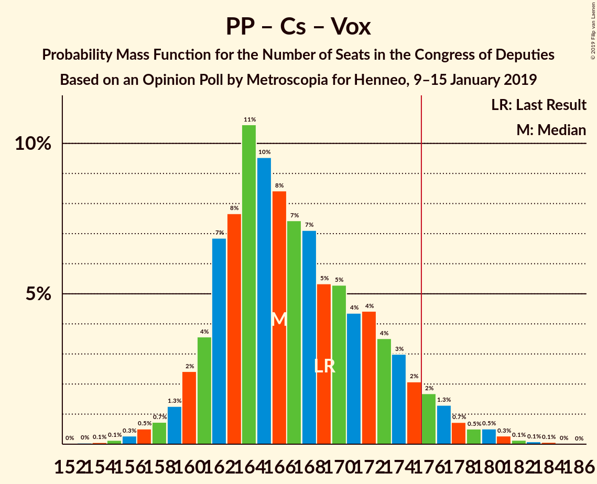

# Opinion Poll by Metroscopia for Henneo, 9–15 January 2019

<a href="#voting-intentions">Voting Intentions</a> | <a href="#seats">Seats</a> | <a href="#coalitions">Coalitions</a> | <a href="#technical-information">Technical Information</a>

## Voting Intentions

### Confidence Intervals

| Party | Last Result | Poll Result | 80% Confidence Interval | 90% Confidence Interval | 95% Confidence Interval | 99% Confidence Interval |
|:-----:|:-----------:|:-----------:|:-----------------------:|:-----------------------:|:-----------------------:|:-----------------------:|
| Partido Socialista Obrero Español | 22.6% | 23.7% | 22.6–24.9% |22.3–25.2% |22.0–25.5% |21.5–26.0% |
| Partido Popular | 33.0% | 19.1% | 18.1–20.2% |17.8–20.5% |17.5–20.7% |17.1–21.3% |
| Ciudadanos–Partido de la Ciudadanía | 13.1% | 17.8% | 16.8–18.9% |16.5–19.1% |16.3–19.4% |15.8–19.9% |
| Unidos Podemos | 21.2% | 17.1% | 16.1–18.2% |15.9–18.4% |15.6–18.7% |15.2–19.2% |
| Vox | 0.2% | 12.1% | 11.3–13.0% |11.0–13.3% |10.8–13.5% |10.4–13.9% |

*Note:* The poll result column reflects the actual value used in the calculations. Published results may vary slightly, and in addition be rounded to fewer digits.

## Seats

### Confidence Intervals

| Party | Last Result | Median | 80% Confidence Interval | 90% Confidence Interval | 95% Confidence Interval | 99% Confidence Interval |
|:-----:|:-----------:|:------:|:-----------------------:|:-----------------------:|:-----------------------:|:-----------------------:|
| <a href="#partido-socialista-obrero-español">Partido Socialista Obrero Español</a> | 85 | 99 | 95–100 |94–104 |90–109 |88–109 |
| <a href="#partido-popular">Partido Popular</a> | 137 | 75 | 64–77 |64–87 |63–87 |63–87 |
| <a href="#ciudadanos–partido-de-la-ciudadanía">Ciudadanos–Partido de la Ciudadanía</a> | 32 | 57 | 56–62 |56–62 |56–68 |54–69 |
| <a href="#unidos-podemos">Unidos Podemos</a> | 71 | 61 | 50–63 |47–63 |45–63 |45–69 |
| <a href="#vox">Vox</a> | 0 | 29 | 27–34 |27–38 |26–40 |25–43 |

### Partido Socialista Obrero Español

*For a full overview of the results for this party, see the [Partido Socialista Obrero Español](party-partidosocialistaobreroespañol.html) page.*

| Number of Seats | Probability | Accumulated | Special Marks |
|:---------------:|:-----------:|:-----------:|:-------------:|
| 83 | 0% | 100% |  |
| 84 | 0% | 99.9% |  |
| 85 | 0% | 99.9% | Last Result |
| 86 | 0% | 99.9% |  |
| 87 | 0% | 99.9% |  |
| 88 | 2% | 99.9% |  |
| 89 | 0% | 98% |  |
| 90 | 1.4% | 98% |  |
| 91 | 0.2% | 96% |  |
| 92 | 0% | 96% |  |
| 93 | 0.3% | 96% |  |
| 94 | 2% | 96% |  |
| 95 | 5% | 94% |  |
| 96 | 0.1% | 88% |  |
| 97 | 3% | 88% |  |
| 98 | 17% | 86% |  |
| 99 | 41% | 69% | Median |
| 100 | 22% | 28% |  |
| 101 | 0% | 6% |  |
| 102 | 0% | 6% |  |
| 103 | 0% | 6% |  |
| 104 | 2% | 6% |  |
| 105 | 0.3% | 4% |  |
| 106 | 0% | 4% |  |
| 107 | 0% | 4% |  |
| 108 | 0% | 4% |  |
| 109 | 3% | 4% |  |
| 110 | 0% | 0.3% |  |
| 111 | 0% | 0.3% |  |
| 112 | 0.2% | 0.3% |  |
| 113 | 0% | 0.1% |  |
| 114 | 0% | 0.1% |  |
| 115 | 0% | 0% |  |

### Partido Popular

*For a full overview of the results for this party, see the [Partido Popular](party-partidopopular.html) page.*

| Number of Seats | Probability | Accumulated | Special Marks |
|:---------------:|:-----------:|:-----------:|:-------------:|
| 62 | 0.1% | 100% |  |
| 63 | 3% | 99.9% |  |
| 64 | 11% | 97% |  |
| 65 | 5% | 86% |  |
| 66 | 0% | 80% |  |
| 67 | 0% | 80% |  |
| 68 | 0% | 80% |  |
| 69 | 0.1% | 80% |  |
| 70 | 0.8% | 80% |  |
| 71 | 2% | 80% |  |
| 72 | 2% | 78% |  |
| 73 | 0% | 76% |  |
| 74 | 9% | 76% |  |
| 75 | 54% | 67% | Median |
| 76 | 3% | 13% |  |
| 77 | 0.8% | 10% |  |
| 78 | 0.2% | 10% |  |
| 79 | 0.1% | 9% |  |
| 80 | 2% | 9% |  |
| 81 | 0% | 7% |  |
| 82 | 0% | 7% |  |
| 83 | 0% | 7% |  |
| 84 | 0% | 7% |  |
| 85 | 0% | 7% |  |
| 86 | 0% | 7% |  |
| 87 | 7% | 7% |  |
| 88 | 0% | 0% |  |
| 89 | 0% | 0% |  |
| 90 | 0% | 0% |  |
| 91 | 0% | 0% |  |
| 92 | 0% | 0% |  |
| 93 | 0% | 0% |  |
| 94 | 0% | 0% |  |
| 95 | 0% | 0% |  |
| 96 | 0% | 0% |  |
| 97 | 0% | 0% |  |
| 98 | 0% | 0% |  |
| 99 | 0% | 0% |  |
| 100 | 0% | 0% |  |
| 101 | 0% | 0% |  |
| 102 | 0% | 0% |  |
| 103 | 0% | 0% |  |
| 104 | 0% | 0% |  |
| 105 | 0% | 0% |  |
| 106 | 0% | 0% |  |
| 107 | 0% | 0% |  |
| 108 | 0% | 0% |  |
| 109 | 0% | 0% |  |
| 110 | 0% | 0% |  |
| 111 | 0% | 0% |  |
| 112 | 0% | 0% |  |
| 113 | 0% | 0% |  |
| 114 | 0% | 0% |  |
| 115 | 0% | 0% |  |
| 116 | 0% | 0% |  |
| 117 | 0% | 0% |  |
| 118 | 0% | 0% |  |
| 119 | 0% | 0% |  |
| 120 | 0% | 0% |  |
| 121 | 0% | 0% |  |
| 122 | 0% | 0% |  |
| 123 | 0% | 0% |  |
| 124 | 0% | 0% |  |
| 125 | 0% | 0% |  |
| 126 | 0% | 0% |  |
| 127 | 0% | 0% |  |
| 128 | 0% | 0% |  |
| 129 | 0% | 0% |  |
| 130 | 0% | 0% |  |
| 131 | 0% | 0% |  |
| 132 | 0% | 0% |  |
| 133 | 0% | 0% |  |
| 134 | 0% | 0% |  |
| 135 | 0% | 0% |  |
| 136 | 0% | 0% |  |
| 137 | 0% | 0% | Last Result |

### Ciudadanos–Partido de la Ciudadanía

*For a full overview of the results for this party, see the [Ciudadanos–Partido de la Ciudadanía](party-ciudadanos–partidodelaciudadanía.html) page.*

| Number of Seats | Probability | Accumulated | Special Marks |
|:---------------:|:-----------:|:-----------:|:-------------:|
| 32 | 0% | 100% | Last Result |
| 33 | 0% | 100% |  |
| 34 | 0% | 100% |  |
| 35 | 0% | 100% |  |
| 36 | 0% | 100% |  |
| 37 | 0% | 100% |  |
| 38 | 0% | 100% |  |
| 39 | 0% | 100% |  |
| 40 | 0% | 100% |  |
| 41 | 0% | 100% |  |
| 42 | 0% | 100% |  |
| 43 | 0% | 100% |  |
| 44 | 0% | 100% |  |
| 45 | 0% | 100% |  |
| 46 | 0% | 100% |  |
| 47 | 0% | 100% |  |
| 48 | 0% | 100% |  |
| 49 | 0% | 100% |  |
| 50 | 0% | 100% |  |
| 51 | 0% | 100% |  |
| 52 | 0.2% | 100% |  |
| 53 | 0% | 99.8% |  |
| 54 | 2% | 99.8% |  |
| 55 | 0.2% | 98% |  |
| 56 | 12% | 98% |  |
| 57 | 40% | 86% | Median |
| 58 | 14% | 46% |  |
| 59 | 0.1% | 32% |  |
| 60 | 0.1% | 32% |  |
| 61 | 6% | 32% |  |
| 62 | 22% | 27% |  |
| 63 | 0% | 5% |  |
| 64 | 0% | 5% |  |
| 65 | 2% | 5% |  |
| 66 | 0.2% | 3% |  |
| 67 | 0.1% | 3% |  |
| 68 | 2% | 3% |  |
| 69 | 0.4% | 0.5% |  |
| 70 | 0.1% | 0.1% |  |
| 71 | 0% | 0.1% |  |
| 72 | 0% | 0% |  |

### Unidos Podemos

*For a full overview of the results for this party, see the [Unidos Podemos](party-unidospodemos.html) page.*

| Number of Seats | Probability | Accumulated | Special Marks |
|:---------------:|:-----------:|:-----------:|:-------------:|
| 45 | 4% | 100% |  |
| 46 | 0.1% | 96% |  |
| 47 | 1.3% | 96% |  |
| 48 | 1.0% | 95% |  |
| 49 | 0% | 94% |  |
| 50 | 7% | 94% |  |
| 51 | 0.1% | 87% |  |
| 52 | 0% | 87% |  |
| 53 | 0% | 87% |  |
| 54 | 0% | 87% |  |
| 55 | 0% | 87% |  |
| 56 | 0% | 87% |  |
| 57 | 1.0% | 87% |  |
| 58 | 0.6% | 86% |  |
| 59 | 0% | 85% |  |
| 60 | 0% | 85% |  |
| 61 | 56% | 85% | Median |
| 62 | 3% | 29% |  |
| 63 | 25% | 26% |  |
| 64 | 0% | 1.0% |  |
| 65 | 0% | 0.9% |  |
| 66 | 0% | 0.9% |  |
| 67 | 0% | 0.9% |  |
| 68 | 0% | 0.9% |  |
| 69 | 0.8% | 0.9% |  |
| 70 | 0% | 0.1% |  |
| 71 | 0% | 0.1% | Last Result |
| 72 | 0% | 0.1% |  |
| 73 | 0.1% | 0.1% |  |
| 74 | 0% | 0% |  |

### Vox

*For a full overview of the results for this party, see the [Vox](party-vox.html) page.*

| Number of Seats | Probability | Accumulated | Special Marks |
|:---------------:|:-----------:|:-----------:|:-------------:|
| 0 | 0% | 100% | Last Result |
| 1 | 0% | 100% |  |
| 2 | 0% | 100% |  |
| 3 | 0% | 100% |  |
| 4 | 0% | 100% |  |
| 5 | 0% | 100% |  |
| 6 | 0% | 100% |  |
| 7 | 0% | 100% |  |
| 8 | 0% | 100% |  |
| 9 | 0% | 100% |  |
| 10 | 0% | 100% |  |
| 11 | 0% | 100% |  |
| 12 | 0% | 100% |  |
| 13 | 0% | 100% |  |
| 14 | 0% | 100% |  |
| 15 | 0% | 100% |  |
| 16 | 0% | 100% |  |
| 17 | 0% | 100% |  |
| 18 | 0% | 100% |  |
| 19 | 0% | 100% |  |
| 20 | 0% | 100% |  |
| 21 | 0% | 100% |  |
| 22 | 0% | 100% |  |
| 23 | 0% | 100% |  |
| 24 | 0% | 100% |  |
| 25 | 2% | 100% |  |
| 26 | 0.7% | 98% |  |
| 27 | 8% | 97% |  |
| 28 | 16% | 89% |  |
| 29 | 49% | 73% | Median |
| 30 | 0% | 25% |  |
| 31 | 0.2% | 25% |  |
| 32 | 0% | 25% |  |
| 33 | 0% | 25% |  |
| 34 | 17% | 25% |  |
| 35 | 0% | 8% |  |
| 36 | 0% | 8% |  |
| 37 | 3% | 8% |  |
| 38 | 0.2% | 5% |  |
| 39 | 2% | 5% |  |
| 40 | 1.5% | 3% |  |
| 41 | 0.2% | 2% |  |
| 42 | 0.6% | 2% |  |
| 43 | 0.8% | 1.0% |  |
| 44 | 0% | 0.1% |  |
| 45 | 0.1% | 0.1% |  |
| 46 | 0% | 0% |  |

## Coalitions

### Confidence Intervals

| Coalition | Last Result | Median | Majority? | 80% Confidence Interval | 90% Confidence Interval | 95% Confidence Interval | 99% Confidence Interval |
|:---------:|:-----------:|:------:|:---------:|:-----------------------:|:-----------------------:|:-----------------------:|:-----------------------:|
| Partido Popular – Ciudadanos–Partido de la Ciudadanía – Vox | 169 | 161 | 7% | 160–172 | 159–176 | 159–176 | 159–177 |
| Partido Socialista Obrero Español – Ciudadanos–Partido de la Ciudadanía | 117 | 156 | 0% | 156–160 | 156–165 | 153–172 | 144–173 |
| Partido Socialista Obrero Español – Unidos Podemos | 156 | 160 | 0% | 149–161 | 145–163 | 145–163 | 144–163 |
| Partido Popular – Ciudadanos–Partido de la Ciudadanía | 169 | 132 | 0% | 126–144 | 126–149 | 125–149 | 125–149 |
| Partido Popular – Vox | 137 | 104 | 0% | 98–111 | 98–114 | 98–115 | 97–119 |
| Partido Socialista Obrero Español | 85 | 99 | 0% | 95–100 | 94–104 | 90–109 | 88–109 |
| Partido Popular | 137 | 75 | 0% | 64–77 | 64–87 | 63–87 | 63–87 |

### Partido Popular – Ciudadanos–Partido de la Ciudadanía – Vox

| Number of Seats | Probability | Accumulated | Special Marks |
|:---------------:|:-----------:|:-----------:|:-------------:|
| 156 | 0% | 100% |  |
| 157 | 0% | 99.9% |  |
| 158 | 0% | 99.9% |  |
| 159 | 9% | 99.9% |  |
| 160 | 17% | 91% |  |
| 161 | 54% | 74% | Median |
| 162 | 3% | 19% |  |
| 163 | 0% | 17% |  |
| 164 | 0% | 17% |  |
| 165 | 0% | 17% |  |
| 166 | 0% | 17% |  |
| 167 | 3% | 17% |  |
| 168 | 0.7% | 13% |  |
| 169 | 1.3% | 13% | Last Result |
| 170 | 0.3% | 11% |  |
| 171 | 0.1% | 11% |  |
| 172 | 2% | 11% |  |
| 173 | 2% | 9% |  |
| 174 | 0% | 7% |  |
| 175 | 0.1% | 7% |  |
| 176 | 5% | 7% | Majority |
| 177 | 1.5% | 2% |  |
| 178 | 0% | 0.3% |  |
| 179 | 0% | 0.3% |  |
| 180 | 0% | 0.2% |  |
| 181 | 0% | 0.2% |  |
| 182 | 0% | 0.2% |  |
| 183 | 0% | 0.2% |  |
| 184 | 0% | 0.2% |  |
| 185 | 0.1% | 0.2% |  |
| 186 | 0.1% | 0.1% |  |
| 187 | 0% | 0% |  |

### Partido Socialista Obrero Español – Ciudadanos–Partido de la Ciudadanía

| Number of Seats | Probability | Accumulated | Special Marks |
|:---------------:|:-----------:|:-----------:|:-------------:|
| 117 | 0% | 100% | Last Result |
| 118 | 0% | 100% |  |
| 119 | 0% | 100% |  |
| 120 | 0% | 100% |  |
| 121 | 0% | 100% |  |
| 122 | 0% | 100% |  |
| 123 | 0% | 100% |  |
| 124 | 0% | 100% |  |
| 125 | 0% | 100% |  |
| 126 | 0% | 100% |  |
| 127 | 0% | 100% |  |
| 128 | 0% | 100% |  |
| 129 | 0% | 100% |  |
| 130 | 0% | 100% |  |
| 131 | 0% | 100% |  |
| 132 | 0% | 100% |  |
| 133 | 0% | 100% |  |
| 134 | 0% | 100% |  |
| 135 | 0% | 100% |  |
| 136 | 0% | 100% |  |
| 137 | 0% | 100% |  |
| 138 | 0% | 100% |  |
| 139 | 0% | 100% |  |
| 140 | 0% | 100% |  |
| 141 | 0% | 100% |  |
| 142 | 0.1% | 99.9% |  |
| 143 | 0% | 99.8% |  |
| 144 | 1.4% | 99.8% |  |
| 145 | 0% | 98% |  |
| 146 | 0% | 98% |  |
| 147 | 0% | 98% |  |
| 148 | 0% | 98% |  |
| 149 | 0% | 98% |  |
| 150 | 0% | 98% |  |
| 151 | 0% | 98% |  |
| 152 | 0% | 98% |  |
| 153 | 2% | 98% |  |
| 154 | 0.2% | 96% |  |
| 155 | 0.9% | 96% |  |
| 156 | 50% | 95% | Median |
| 157 | 6% | 45% |  |
| 158 | 14% | 40% |  |
| 159 | 8% | 26% |  |
| 160 | 11% | 18% |  |
| 161 | 0% | 6% |  |
| 162 | 0% | 6% |  |
| 163 | 0% | 6% |  |
| 164 | 0.4% | 6% |  |
| 165 | 3% | 6% |  |
| 166 | 0% | 3% |  |
| 167 | 0% | 3% |  |
| 168 | 0% | 3% |  |
| 169 | 0% | 3% |  |
| 170 | 0% | 3% |  |
| 171 | 0% | 3% |  |
| 172 | 2% | 3% |  |
| 173 | 0.1% | 0.5% |  |
| 174 | 0.4% | 0.4% |  |
| 175 | 0.1% | 0.1% |  |
| 176 | 0% | 0% | Majority |

### Partido Socialista Obrero Español – Unidos Podemos

| Number of Seats | Probability | Accumulated | Special Marks |
|:---------------:|:-----------:|:-----------:|:-------------:|
| 136 | 0.2% | 100% |  |
| 137 | 0% | 99.8% |  |
| 138 | 0% | 99.8% |  |
| 139 | 0% | 99.8% |  |
| 140 | 0% | 99.8% |  |
| 141 | 0% | 99.8% |  |
| 142 | 0% | 99.7% |  |
| 143 | 0% | 99.7% |  |
| 144 | 1.5% | 99.7% |  |
| 145 | 6% | 98% |  |
| 146 | 0% | 93% |  |
| 147 | 0.8% | 93% |  |
| 148 | 0.6% | 92% |  |
| 149 | 2% | 91% |  |
| 150 | 0.1% | 89% |  |
| 151 | 1.4% | 89% |  |
| 152 | 0.7% | 88% |  |
| 153 | 0.3% | 87% |  |
| 154 | 3% | 87% |  |
| 155 | 0.1% | 83% |  |
| 156 | 0% | 83% | Last Result |
| 157 | 0% | 83% |  |
| 158 | 0% | 83% |  |
| 159 | 3% | 83% |  |
| 160 | 40% | 81% | Median |
| 161 | 31% | 40% |  |
| 162 | 1.0% | 10% |  |
| 163 | 9% | 9% |  |
| 164 | 0% | 0.1% |  |
| 165 | 0% | 0.1% |  |
| 166 | 0% | 0.1% |  |
| 167 | 0% | 0.1% |  |
| 168 | 0% | 0% |  |

### Partido Popular – Ciudadanos–Partido de la Ciudadanía

| Number of Seats | Probability | Accumulated | Special Marks |
|:---------------:|:-----------:|:-----------:|:-------------:|
| 123 | 0.1% | 100% |  |
| 124 | 0% | 99.9% |  |
| 125 | 3% | 99.9% |  |
| 126 | 17% | 97% |  |
| 127 | 1.4% | 80% |  |
| 128 | 2% | 79% |  |
| 129 | 0.2% | 77% |  |
| 130 | 9% | 77% |  |
| 131 | 0.7% | 67% |  |
| 132 | 41% | 67% | Median |
| 133 | 14% | 26% |  |
| 134 | 0% | 12% |  |
| 135 | 0% | 12% |  |
| 136 | 0% | 12% |  |
| 137 | 0% | 12% |  |
| 138 | 0% | 12% |  |
| 139 | 0% | 12% |  |
| 140 | 0% | 12% |  |
| 141 | 0% | 12% |  |
| 142 | 0.7% | 12% |  |
| 143 | 0% | 11% |  |
| 144 | 1.4% | 11% |  |
| 145 | 2% | 10% |  |
| 146 | 0.2% | 8% |  |
| 147 | 0.2% | 7% |  |
| 148 | 0.2% | 7% |  |
| 149 | 7% | 7% |  |
| 150 | 0% | 0% |  |
| 151 | 0% | 0% |  |
| 152 | 0% | 0% |  |
| 153 | 0% | 0% |  |
| 154 | 0% | 0% |  |
| 155 | 0% | 0% |  |
| 156 | 0% | 0% |  |
| 157 | 0% | 0% |  |
| 158 | 0% | 0% |  |
| 159 | 0% | 0% |  |
| 160 | 0% | 0% |  |
| 161 | 0% | 0% |  |
| 162 | 0% | 0% |  |
| 163 | 0% | 0% |  |
| 164 | 0% | 0% |  |
| 165 | 0% | 0% |  |
| 166 | 0% | 0% |  |
| 167 | 0% | 0% |  |
| 168 | 0% | 0% |  |
| 169 | 0% | 0% | Last Result |

### Partido Popular – Vox

| Number of Seats | Probability | Accumulated | Special Marks |
|:---------------:|:-----------:|:-----------:|:-------------:|
| 94 | 0% | 100% |  |
| 95 | 0% | 99.9% |  |
| 96 | 0.1% | 99.9% |  |
| 97 | 0.9% | 99.9% |  |
| 98 | 11% | 99.0% |  |
| 99 | 5% | 88% |  |
| 100 | 3% | 82% |  |
| 101 | 2% | 79% |  |
| 102 | 0% | 77% |  |
| 103 | 23% | 77% |  |
| 104 | 40% | 55% | Median |
| 105 | 0% | 14% |  |
| 106 | 0.1% | 14% |  |
| 107 | 2% | 14% |  |
| 108 | 0.2% | 12% |  |
| 109 | 0.1% | 12% |  |
| 110 | 0% | 12% |  |
| 111 | 3% | 12% |  |
| 112 | 0.2% | 9% |  |
| 113 | 0% | 9% |  |
| 114 | 5% | 9% |  |
| 115 | 1.5% | 3% |  |
| 116 | 0% | 2% |  |
| 117 | 0% | 2% |  |
| 118 | 0.2% | 2% |  |
| 119 | 1.4% | 2% |  |
| 120 | 0% | 0.1% |  |
| 121 | 0.1% | 0.1% |  |
| 122 | 0% | 0% |  |
| 123 | 0% | 0% |  |
| 124 | 0% | 0% |  |
| 125 | 0% | 0% |  |
| 126 | 0% | 0% |  |
| 127 | 0% | 0% |  |
| 128 | 0% | 0% |  |
| 129 | 0% | 0% |  |
| 130 | 0% | 0% |  |
| 131 | 0% | 0% |  |
| 132 | 0% | 0% |  |
| 133 | 0% | 0% |  |
| 134 | 0% | 0% |  |
| 135 | 0% | 0% |  |
| 136 | 0% | 0% |  |
| 137 | 0% | 0% | Last Result |

### Partido Socialista Obrero Español

| Number of Seats | Probability | Accumulated | Special Marks |
|:---------------:|:-----------:|:-----------:|:-------------:|
| 83 | 0% | 100% |  |
| 84 | 0% | 99.9% |  |
| 85 | 0% | 99.9% | Last Result |
| 86 | 0% | 99.9% |  |
| 87 | 0% | 99.9% |  |
| 88 | 2% | 99.9% |  |
| 89 | 0% | 98% |  |
| 90 | 1.4% | 98% |  |
| 91 | 0.2% | 96% |  |
| 92 | 0% | 96% |  |
| 93 | 0.3% | 96% |  |
| 94 | 2% | 96% |  |
| 95 | 5% | 94% |  |
| 96 | 0.1% | 88% |  |
| 97 | 3% | 88% |  |
| 98 | 17% | 86% |  |
| 99 | 41% | 69% | Median |
| 100 | 22% | 28% |  |
| 101 | 0% | 6% |  |
| 102 | 0% | 6% |  |
| 103 | 0% | 6% |  |
| 104 | 2% | 6% |  |
| 105 | 0.3% | 4% |  |
| 106 | 0% | 4% |  |
| 107 | 0% | 4% |  |
| 108 | 0% | 4% |  |
| 109 | 3% | 4% |  |
| 110 | 0% | 0.3% |  |
| 111 | 0% | 0.3% |  |
| 112 | 0.2% | 0.3% |  |
| 113 | 0% | 0.1% |  |
| 114 | 0% | 0.1% |  |
| 115 | 0% | 0% |  |

### Partido Popular

| Number of Seats | Probability | Accumulated | Special Marks |
|:---------------:|:-----------:|:-----------:|:-------------:|
| 62 | 0.1% | 100% |  |
| 63 | 3% | 99.9% |  |
| 64 | 11% | 97% |  |
| 65 | 5% | 86% |  |
| 66 | 0% | 80% |  |
| 67 | 0% | 80% |  |
| 68 | 0% | 80% |  |
| 69 | 0.1% | 80% |  |
| 70 | 0.8% | 80% |  |
| 71 | 2% | 80% |  |
| 72 | 2% | 78% |  |
| 73 | 0% | 76% |  |
| 74 | 9% | 76% |  |
| 75 | 54% | 67% | Median |
| 76 | 3% | 13% |  |
| 77 | 0.8% | 10% |  |
| 78 | 0.2% | 10% |  |
| 79 | 0.1% | 9% |  |
| 80 | 2% | 9% |  |
| 81 | 0% | 7% |  |
| 82 | 0% | 7% |  |
| 83 | 0% | 7% |  |
| 84 | 0% | 7% |  |
| 85 | 0% | 7% |  |
| 86 | 0% | 7% |  |
| 87 | 7% | 7% |  |
| 88 | 0% | 0% |  |
| 89 | 0% | 0% |  |
| 90 | 0% | 0% |  |
| 91 | 0% | 0% |  |
| 92 | 0% | 0% |  |
| 93 | 0% | 0% |  |
| 94 | 0% | 0% |  |
| 95 | 0% | 0% |  |
| 96 | 0% | 0% |  |
| 97 | 0% | 0% |  |
| 98 | 0% | 0% |  |
| 99 | 0% | 0% |  |
| 100 | 0% | 0% |  |
| 101 | 0% | 0% |  |
| 102 | 0% | 0% |  |
| 103 | 0% | 0% |  |
| 104 | 0% | 0% |  |
| 105 | 0% | 0% |  |
| 106 | 0% | 0% |  |
| 107 | 0% | 0% |  |
| 108 | 0% | 0% |  |
| 109 | 0% | 0% |  |
| 110 | 0% | 0% |  |
| 111 | 0% | 0% |  |
| 112 | 0% | 0% |  |
| 113 | 0% | 0% |  |
| 114 | 0% | 0% |  |
| 115 | 0% | 0% |  |
| 116 | 0% | 0% |  |
| 117 | 0% | 0% |  |
| 118 | 0% | 0% |  |
| 119 | 0% | 0% |  |
| 120 | 0% | 0% |  |
| 121 | 0% | 0% |  |
| 122 | 0% | 0% |  |
| 123 | 0% | 0% |  |
| 124 | 0% | 0% |  |
| 125 | 0% | 0% |  |
| 126 | 0% | 0% |  |
| 127 | 0% | 0% |  |
| 128 | 0% | 0% |  |
| 129 | 0% | 0% |  |
| 130 | 0% | 0% |  |
| 131 | 0% | 0% |  |
| 132 | 0% | 0% |  |
| 133 | 0% | 0% |  |
| 134 | 0% | 0% |  |
| 135 | 0% | 0% |  |
| 136 | 0% | 0% |  |
| 137 | 0% | 0% | Last Result |

## Technical Information

### Opinion Poll

+ **Polling firm:** Metroscopia
+ **Commissioner(s):** Henneo
+ **Fieldwork period:** 9–15 January 2019

### Calculations

+ **Sample size:** 2332
+ **Simulations done:** 1,024
+ **Error estimate:** 1.91%

