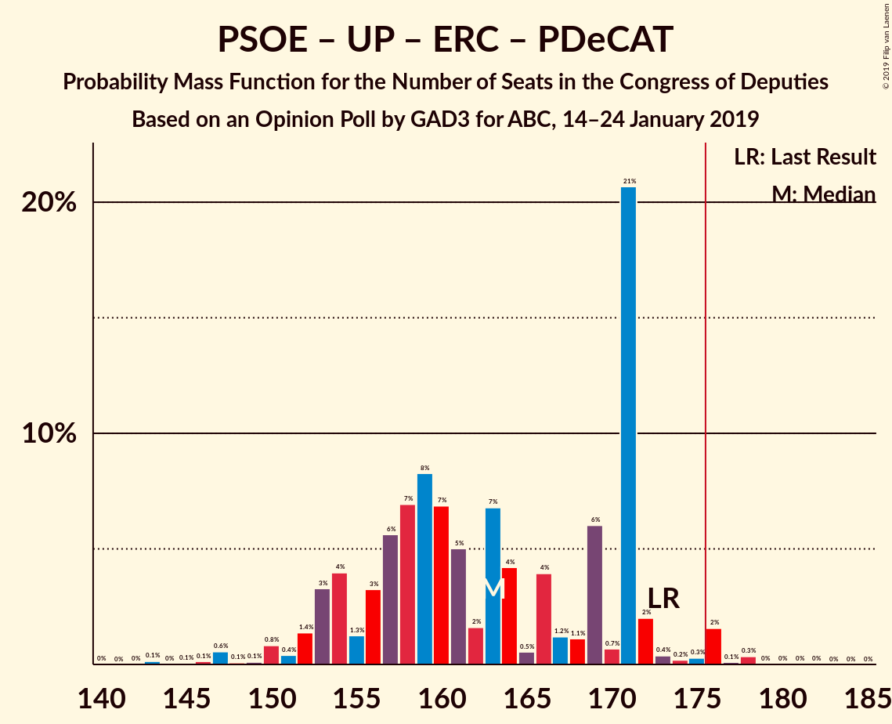
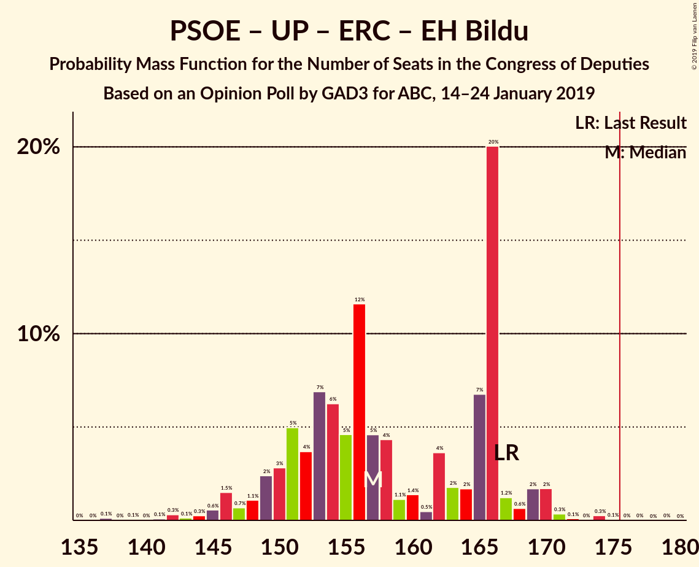
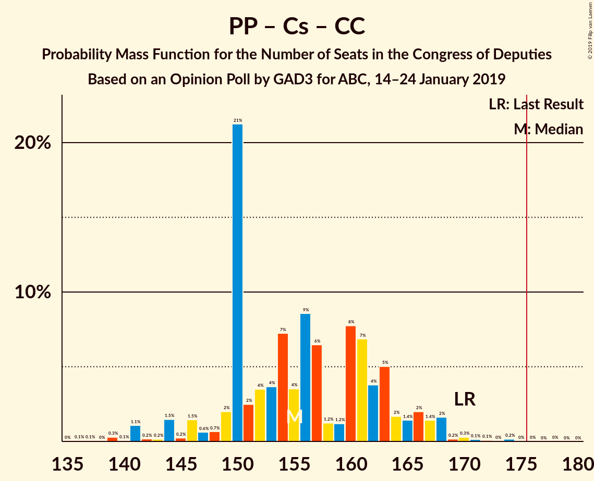

# Opinion Poll by GAD3 for ABC, 14–24 January 2019

<a href="#voting-intentions">Voting Intentions</a> | <a href="#seats">Seats</a> | <a href="#coalitions">Coalitions</a> | <a href="#technical-information">Technical Information</a>

## Voting Intentions

### Confidence Intervals

| Party | Last Result | Poll Result | 80% Confidence Interval | 90% Confidence Interval | 95% Confidence Interval | 99% Confidence Interval |
|:-----:|:-----------:|:-----------:|:-----------------------:|:-----------------------:|:-----------------------:|:-----------------------:|
| Partido Socialista Obrero Español | 22.6% | 26.5% | 25.2–27.9% |24.8–28.3% |24.5–28.6% |23.9–29.3% |
| Partido Popular | 33.0% | 23.0% | 21.8–24.3% |21.4–24.7% |21.1–25.0% |20.5–25.7% |
| Ciudadanos–Partido de la Ciudadanía | 13.1% | 17.1% | 16.0–18.3% |15.7–18.6% |15.4–18.9% |14.9–19.5% |
| Unidos Podemos | 21.2% | 11.6% | 10.7–12.6% |10.4–12.9% |10.2–13.2% |9.8–13.7% |
| Vox | 0.2% | 9.8% | 8.9–10.7% |8.7–11.0% |8.5–11.2% |8.1–11.7% |
| Esquerra Republicana de Catalunya–Catalunya Sí | 2.7% | 2.8% | 2.3–3.4% |2.2–3.5% |2.1–3.7% |1.9–3.9% |
| Partit Demòcrata Europeu Català | 2.0% | 1.6% | 1.3–2.1% |1.2–2.2% |1.1–2.3% |1.0–2.5% |
| Euzko Alderdi Jeltzalea/Partido Nacionalista Vasco | 1.2% | 1.2% | 0.9–1.6% |0.9–1.8% |0.8–1.8% |0.7–2.1% |
| Euskal Herria Bildu | 0.8% | 0.6% | 0.4–0.9% |0.4–1.0% |0.3–1.1% |0.3–1.3% |
| Coalición Canaria–Partido Nacionalista Canario | 0.3% | 0.2% | 0.1–0.5% |0.1–0.5% |0.1–0.6% |0.0–0.7% |

*Note:* The poll result column reflects the actual value used in the calculations. Published results may vary slightly, and in addition be rounded to fewer digits.

## Seats

### Confidence Intervals

| Party | Last Result | Median | 80% Confidence Interval | 90% Confidence Interval | 95% Confidence Interval | 99% Confidence Interval |
|:-----:|:-----------:|:------:|:-----------------------:|:-----------------------:|:-----------------------:|:-----------------------:|
| <a href="#partido-socialista-obrero-español">Partido Socialista Obrero Español</a> | 85 | 114 | 107–120 |104–120 |103–122 |100–126 |
| <a href="#partido-popular">Partido Popular</a> | 137 | 95 | 90–104 |87–107 |86–110 |84–111 |
| <a href="#ciudadanos–partido-de-la-ciudadanía">Ciudadanos–Partido de la Ciudadanía</a> | 32 | 60 | 53–64 |50–66 |50–66 |49–68 |
| <a href="#unidos-podemos">Unidos Podemos</a> | 71 | 31 | 25–34 |25–36 |24–36 |22–38 |
| <a href="#vox">Vox</a> | 0 | 22 | 20–27 |18–28 |18–28 |17–29 |
| <a href="#esquerra-republicana-de-catalunya–catalunya-sí">Esquerra Republicana de Catalunya–Catalunya Sí</a> | 9 | 11 | 10–15 |9–15 |9–15 |9–16 |
| <a href="#partit-demòcrata-europeu-català">Partit Demòcrata Europeu Català</a> | 8 | 6 | 5–8 |5–9 |4–10 |4–11 |
| <a href="#euzko-alderdi-jeltzalea/partido-nacionalista-vasco">Euzko Alderdi Jeltzalea/Partido Nacionalista Vasco</a> | 5 | 6 | 5–8 |4–8 |3–9 |3–9 |
| <a href="#euskal-herria-bildu">Euskal Herria Bildu</a> | 2 | 2 | 1–4 |1–4 |1–6 |0–6 |
| <a href="#coalición-canaria–partido-nacionalista-canario">Coalición Canaria–Partido Nacionalista Canario</a> | 1 | 0 | 0–1 |0–2 |0–2 |0–2 |

### Partido Socialista Obrero Español

*For a full overview of the results for this party, see the [Partido Socialista Obrero Español](party-partidosocialistaobreroespañol.html) page.*

| Number of Seats | Probability | Accumulated | Special Marks |
|:---------------:|:-----------:|:-----------:|:-------------:|
| 85 | 0% | 100% | Last Result |
| 86 | 0% | 100% |  |
| 87 | 0% | 100% |  |
| 88 | 0% | 100% |  |
| 89 | 0% | 100% |  |
| 90 | 0% | 100% |  |
| 91 | 0% | 100% |  |
| 92 | 0% | 100% |  |
| 93 | 0% | 100% |  |
| 94 | 0% | 100% |  |
| 95 | 0% | 100% |  |
| 96 | 0% | 100% |  |
| 97 | 0% | 99.9% |  |
| 98 | 0.1% | 99.9% |  |
| 99 | 0.2% | 99.8% |  |
| 100 | 0.3% | 99.6% |  |
| 101 | 0.3% | 99.2% |  |
| 102 | 0.1% | 98.9% |  |
| 103 | 2% | 98.8% |  |
| 104 | 2% | 97% |  |
| 105 | 1.4% | 95% |  |
| 106 | 2% | 94% |  |
| 107 | 6% | 92% |  |
| 108 | 12% | 86% |  |
| 109 | 6% | 74% |  |
| 110 | 6% | 68% |  |
| 111 | 4% | 62% |  |
| 112 | 2% | 58% |  |
| 113 | 5% | 56% |  |
| 114 | 4% | 52% | Median |
| 115 | 7% | 48% |  |
| 116 | 4% | 41% |  |
| 117 | 3% | 38% |  |
| 118 | 2% | 35% |  |
| 119 | 2% | 33% |  |
| 120 | 27% | 31% |  |
| 121 | 1.0% | 4% |  |
| 122 | 0.9% | 3% |  |
| 123 | 0.3% | 2% |  |
| 124 | 0.9% | 2% |  |
| 125 | 0.2% | 0.8% |  |
| 126 | 0.2% | 0.6% |  |
| 127 | 0% | 0.4% |  |
| 128 | 0.1% | 0.4% |  |
| 129 | 0.1% | 0.3% |  |
| 130 | 0.1% | 0.2% |  |
| 131 | 0.1% | 0.1% |  |
| 132 | 0% | 0.1% |  |
| 133 | 0% | 0% |  |

### Partido Popular

*For a full overview of the results for this party, see the [Partido Popular](party-partidopopular.html) page.*

| Number of Seats | Probability | Accumulated | Special Marks |
|:---------------:|:-----------:|:-----------:|:-------------:|
| 80 | 0% | 100% |  |
| 81 | 0.1% | 99.9% |  |
| 82 | 0.1% | 99.9% |  |
| 83 | 0.1% | 99.7% |  |
| 84 | 0.7% | 99.6% |  |
| 85 | 0.2% | 98.9% |  |
| 86 | 2% | 98.8% |  |
| 87 | 4% | 97% |  |
| 88 | 0.8% | 93% |  |
| 89 | 0.8% | 92% |  |
| 90 | 24% | 91% |  |
| 91 | 3% | 67% |  |
| 92 | 2% | 65% |  |
| 93 | 6% | 63% |  |
| 94 | 4% | 57% |  |
| 95 | 5% | 53% | Median |
| 96 | 2% | 48% |  |
| 97 | 4% | 46% |  |
| 98 | 8% | 42% |  |
| 99 | 5% | 33% |  |
| 100 | 5% | 29% |  |
| 101 | 1.4% | 24% |  |
| 102 | 6% | 23% |  |
| 103 | 4% | 17% |  |
| 104 | 4% | 13% |  |
| 105 | 1.3% | 9% |  |
| 106 | 2% | 8% |  |
| 107 | 1.0% | 6% |  |
| 108 | 0.4% | 5% |  |
| 109 | 1.4% | 4% |  |
| 110 | 2% | 3% |  |
| 111 | 0.2% | 0.6% |  |
| 112 | 0.1% | 0.4% |  |
| 113 | 0.1% | 0.3% |  |
| 114 | 0.1% | 0.2% |  |
| 115 | 0% | 0.1% |  |
| 116 | 0.1% | 0.1% |  |
| 117 | 0% | 0% |  |
| 118 | 0% | 0% |  |
| 119 | 0% | 0% |  |
| 120 | 0% | 0% |  |
| 121 | 0% | 0% |  |
| 122 | 0% | 0% |  |
| 123 | 0% | 0% |  |
| 124 | 0% | 0% |  |
| 125 | 0% | 0% |  |
| 126 | 0% | 0% |  |
| 127 | 0% | 0% |  |
| 128 | 0% | 0% |  |
| 129 | 0% | 0% |  |
| 130 | 0% | 0% |  |
| 131 | 0% | 0% |  |
| 132 | 0% | 0% |  |
| 133 | 0% | 0% |  |
| 134 | 0% | 0% |  |
| 135 | 0% | 0% |  |
| 136 | 0% | 0% |  |
| 137 | 0% | 0% | Last Result |

### Ciudadanos–Partido de la Ciudadanía

*For a full overview of the results for this party, see the [Ciudadanos–Partido de la Ciudadanía](party-ciudadanos–partidodelaciudadanía.html) page.*

| Number of Seats | Probability | Accumulated | Special Marks |
|:---------------:|:-----------:|:-----------:|:-------------:|
| 32 | 0% | 100% | Last Result |
| 33 | 0% | 100% |  |
| 34 | 0% | 100% |  |
| 35 | 0% | 100% |  |
| 36 | 0% | 100% |  |
| 37 | 0% | 100% |  |
| 38 | 0% | 100% |  |
| 39 | 0% | 100% |  |
| 40 | 0% | 100% |  |
| 41 | 0% | 100% |  |
| 42 | 0% | 100% |  |
| 43 | 0% | 100% |  |
| 44 | 0% | 100% |  |
| 45 | 0% | 100% |  |
| 46 | 0% | 100% |  |
| 47 | 0.1% | 99.9% |  |
| 48 | 0.1% | 99.9% |  |
| 49 | 1.3% | 99.8% |  |
| 50 | 4% | 98% |  |
| 51 | 0.8% | 95% |  |
| 52 | 2% | 94% |  |
| 53 | 3% | 92% |  |
| 54 | 4% | 90% |  |
| 55 | 4% | 86% |  |
| 56 | 6% | 82% |  |
| 57 | 2% | 76% |  |
| 58 | 7% | 74% |  |
| 59 | 8% | 67% |  |
| 60 | 22% | 60% | Median |
| 61 | 16% | 38% |  |
| 62 | 4% | 21% |  |
| 63 | 4% | 17% |  |
| 64 | 3% | 13% |  |
| 65 | 4% | 9% |  |
| 66 | 3% | 5% |  |
| 67 | 1.0% | 2% |  |
| 68 | 0.5% | 0.9% |  |
| 69 | 0.1% | 0.5% |  |
| 70 | 0.2% | 0.4% |  |
| 71 | 0% | 0.2% |  |
| 72 | 0% | 0.1% |  |
| 73 | 0% | 0.1% |  |
| 74 | 0% | 0.1% |  |
| 75 | 0% | 0% |  |

### Unidos Podemos

*For a full overview of the results for this party, see the [Unidos Podemos](party-unidospodemos.html) page.*

| Number of Seats | Probability | Accumulated | Special Marks |
|:---------------:|:-----------:|:-----------:|:-------------:|
| 22 | 0.6% | 100% |  |
| 23 | 2% | 99.4% |  |
| 24 | 3% | 98% |  |
| 25 | 7% | 95% |  |
| 26 | 9% | 88% |  |
| 27 | 6% | 79% |  |
| 28 | 3% | 72% |  |
| 29 | 6% | 69% |  |
| 30 | 9% | 63% |  |
| 31 | 7% | 55% | Median |
| 32 | 7% | 48% |  |
| 33 | 7% | 41% |  |
| 34 | 24% | 33% |  |
| 35 | 1.1% | 10% |  |
| 36 | 6% | 8% |  |
| 37 | 2% | 2% |  |
| 38 | 0.4% | 0.7% |  |
| 39 | 0.2% | 0.3% |  |
| 40 | 0.1% | 0.1% |  |
| 41 | 0% | 0% |  |
| 42 | 0% | 0% |  |
| 43 | 0% | 0% |  |
| 44 | 0% | 0% |  |
| 45 | 0% | 0% |  |
| 46 | 0% | 0% |  |
| 47 | 0% | 0% |  |
| 48 | 0% | 0% |  |
| 49 | 0% | 0% |  |
| 50 | 0% | 0% |  |
| 51 | 0% | 0% |  |
| 52 | 0% | 0% |  |
| 53 | 0% | 0% |  |
| 54 | 0% | 0% |  |
| 55 | 0% | 0% |  |
| 56 | 0% | 0% |  |
| 57 | 0% | 0% |  |
| 58 | 0% | 0% |  |
| 59 | 0% | 0% |  |
| 60 | 0% | 0% |  |
| 61 | 0% | 0% |  |
| 62 | 0% | 0% |  |
| 63 | 0% | 0% |  |
| 64 | 0% | 0% |  |
| 65 | 0% | 0% |  |
| 66 | 0% | 0% |  |
| 67 | 0% | 0% |  |
| 68 | 0% | 0% |  |
| 69 | 0% | 0% |  |
| 70 | 0% | 0% |  |
| 71 | 0% | 0% | Last Result |

### Vox

*For a full overview of the results for this party, see the [Vox](party-vox.html) page.*

| Number of Seats | Probability | Accumulated | Special Marks |
|:---------------:|:-----------:|:-----------:|:-------------:|
| 0 | 0% | 100% | Last Result |
| 1 | 0% | 100% |  |
| 2 | 0% | 100% |  |
| 3 | 0% | 100% |  |
| 4 | 0% | 100% |  |
| 5 | 0% | 100% |  |
| 6 | 0% | 100% |  |
| 7 | 0% | 100% |  |
| 8 | 0% | 100% |  |
| 9 | 0% | 100% |  |
| 10 | 0% | 100% |  |
| 11 | 0% | 100% |  |
| 12 | 0% | 100% |  |
| 13 | 0% | 100% |  |
| 14 | 0.1% | 100% |  |
| 15 | 0.1% | 99.9% |  |
| 16 | 0.2% | 99.8% |  |
| 17 | 1.3% | 99.6% |  |
| 18 | 4% | 98% |  |
| 19 | 3% | 94% |  |
| 20 | 1.2% | 91% |  |
| 21 | 33% | 90% |  |
| 22 | 15% | 57% | Median |
| 23 | 13% | 42% |  |
| 24 | 7% | 28% |  |
| 25 | 5% | 22% |  |
| 26 | 0.8% | 17% |  |
| 27 | 7% | 16% |  |
| 28 | 8% | 9% |  |
| 29 | 0.9% | 1.3% |  |
| 30 | 0.2% | 0.4% |  |
| 31 | 0% | 0.1% |  |
| 32 | 0% | 0.1% |  |
| 33 | 0% | 0.1% |  |
| 34 | 0.1% | 0.1% |  |
| 35 | 0% | 0% |  |

### Esquerra Republicana de Catalunya–Catalunya Sí

*For a full overview of the results for this party, see the [Esquerra Republicana de Catalunya–Catalunya Sí](party-esquerrarepublicanadecatalunya–catalunyasí.html) page.*

| Number of Seats | Probability | Accumulated | Special Marks |
|:---------------:|:-----------:|:-----------:|:-------------:|
| 7 | 0.3% | 100% |  |
| 8 | 0.2% | 99.7% |  |
| 9 | 5% | 99.5% | Last Result |
| 10 | 9% | 95% |  |
| 11 | 38% | 85% | Median |
| 12 | 8% | 48% |  |
| 13 | 10% | 40% |  |
| 14 | 19% | 29% |  |
| 15 | 10% | 11% |  |
| 16 | 0.6% | 0.9% |  |
| 17 | 0.2% | 0.3% |  |
| 18 | 0% | 0.1% |  |
| 19 | 0% | 0% |  |

### Partit Demòcrata Europeu Català

*For a full overview of the results for this party, see the [Partit Demòcrata Europeu Català](party-partitdemòcrataeuropeucatalà.html) page.*

| Number of Seats | Probability | Accumulated | Special Marks |
|:---------------:|:-----------:|:-----------:|:-------------:|
| 3 | 0.1% | 100% |  |
| 4 | 5% | 99.9% |  |
| 5 | 15% | 95% |  |
| 6 | 36% | 80% | Median |
| 7 | 9% | 44% |  |
| 8 | 28% | 35% | Last Result |
| 9 | 4% | 7% |  |
| 10 | 3% | 3% |  |
| 11 | 0.6% | 0.7% |  |
| 12 | 0.1% | 0.1% |  |
| 13 | 0% | 0% |  |

### Euzko Alderdi Jeltzalea/Partido Nacionalista Vasco

*For a full overview of the results for this party, see the [Euzko Alderdi Jeltzalea/Partido Nacionalista Vasco](party-euzkoalderdijeltzaleapartidonacionalistavasco.html) page.*

| Number of Seats | Probability | Accumulated | Special Marks |
|:---------------:|:-----------:|:-----------:|:-------------:|
| 3 | 4% | 100% |  |
| 4 | 2% | 96% |  |
| 5 | 5% | 94% | Last Result |
| 6 | 39% | 89% | Median |
| 7 | 30% | 50% |  |
| 8 | 17% | 20% |  |
| 9 | 3% | 4% |  |
| 10 | 0.3% | 0.4% |  |
| 11 | 0.1% | 0.1% |  |
| 12 | 0.1% | 0.1% |  |
| 13 | 0% | 0% |  |

### Euskal Herria Bildu

*For a full overview of the results for this party, see the [Euskal Herria Bildu](party-euskalherriabildu.html) page.*

| Number of Seats | Probability | Accumulated | Special Marks |
|:---------------:|:-----------:|:-----------:|:-------------:|
| 0 | 1.2% | 100% |  |
| 1 | 41% | 98.8% |  |
| 2 | 26% | 58% | Last Result, Median |
| 3 | 12% | 32% |  |
| 4 | 17% | 20% |  |
| 5 | 0.9% | 3% |  |
| 6 | 2% | 3% |  |
| 7 | 0.3% | 0.3% |  |
| 8 | 0% | 0% |  |

### Coalición Canaria–Partido Nacionalista Canario

*For a full overview of the results for this party, see the [Coalición Canaria–Partido Nacionalista Canario](party-coalicióncanaria–partidonacionalistacanario.html) page.*

| Number of Seats | Probability | Accumulated | Special Marks |
|:---------------:|:-----------:|:-----------:|:-------------:|
| 0 | 54% | 100% | Median |
| 1 | 39% | 46% | Last Result |
| 2 | 7% | 7% |  |
| 3 | 0.1% | 0.1% |  |
| 4 | 0% | 0% |  |

## Coalitions

### Confidence Intervals

| Coalition | Last Result | Median | Majority? | 80% Confidence Interval | 90% Confidence Interval | 95% Confidence Interval | 99% Confidence Interval |
|:---------:|:-----------:|:------:|:---------:|:-----------------------:|:-----------------------:|:-----------------------:|:-----------------------:|
| Partido Socialista Obrero Español – Partido Popular – Ciudadanos–Partido de la Ciudadanía | 254 | 270 | 100% | 263–273 | 262–275 | 261–276 | 257–279 |
| Partido Socialista Obrero Español – Partido Popular | 222 | 210 | 100% | 202–216 | 201–218 | 201–219 | 198–223 |
| Partido Socialista Obrero Español – Ciudadanos–Partido de la Ciudadanía – Unidos Podemos | 188 | 203 | 100% | 193–214 | 191–214 | 188–218 | 186–218 |
| Partido Popular – Ciudadanos–Partido de la Ciudadanía – Vox | 169 | 178 | 63% | 171–185 | 169–187 | 167–188 | 164–193 |
| Partido Socialista Obrero Español – Ciudadanos–Partido de la Ciudadanía | 117 | 173 | 37% | 165–180 | 161–184 | 157–185 | 157–188 |
| Partido Socialista Obrero Español – Unidos Podemos – Esquerra Republicana de Catalunya–Catalunya Sí – Partit Demòcrata Europeu Català – Euzko Alderdi Jeltzalea/Partido Nacionalista Vasco – Euskal Herria Bildu | 180 | 171 | 34% | 164–179 | 162–181 | 161–183 | 157–185 |
| Partido Socialista Obrero Español – Unidos Podemos – Esquerra Republicana de Catalunya–Catalunya Sí – Partit Demòcrata Europeu Català | 173 | 163 | 2% | 154–171 | 153–171 | 152–174 | 147–177 |
| Partido Popular – Ciudadanos–Partido de la Ciudadanía – Euzko Alderdi Jeltzalea/Partido Nacionalista Vasco | 174 | 161 | 0.6% | 156–170 | 152–173 | 150–173 | 147–176 |
| Partido Socialista Obrero Español – Unidos Podemos – Esquerra Republicana de Catalunya–Catalunya Sí – Euskal Herria Bildu | 167 | 157 | 0.1% | 150–166 | 149–167 | 146–170 | 142–172 |
| Partido Popular – Ciudadanos–Partido de la Ciudadanía – Coalición Canaria–Partido Nacionalista Canario | 170 | 155 | 0% | 150–163 | 146–166 | 144–168 | 140–170 |
| Partido Popular – Ciudadanos–Partido de la Ciudadanía | 169 | 155 | 0% | 150–163 | 146–165 | 144–167 | 140–169 |
| Partido Socialista Obrero Español – Unidos Podemos – Euzko Alderdi Jeltzalea/Partido Nacionalista Vasco – Euskal Herria Bildu | 163 | 152 | 0% | 144–162 | 143–162 | 141–162 | 137–166 |
| Partido Socialista Obrero Español – Unidos Podemos – Euzko Alderdi Jeltzalea/Partido Nacionalista Vasco | 161 | 149 | 0% | 142–161 | 140–161 | 139–161 | 133–164 |
| Partido Socialista Obrero Español – Unidos Podemos | 156 | 143 | 0% | 135–154 | 134–154 | 132–155 | 127–158 |
| Partido Popular – Vox | 137 | 119 | 0% | 111–128 | 109–131 | 109–134 | 105–134 |
| Partido Socialista Obrero Español | 85 | 114 | 0% | 107–120 | 104–120 | 103–122 | 100–126 |
| Partido Popular | 137 | 95 | 0% | 90–104 | 87–107 | 86–110 | 84–111 |

### Partido Socialista Obrero Español – Partido Popular – Ciudadanos–Partido de la Ciudadanía

| Number of Seats | Probability | Accumulated | Special Marks |
|:---------------:|:-----------:|:-----------:|:-------------:|
| 254 | 0% | 100% | Last Result |
| 255 | 0.1% | 99.9% |  |
| 256 | 0.1% | 99.8% |  |
| 257 | 0.4% | 99.7% |  |
| 258 | 0.2% | 99.3% |  |
| 259 | 0.3% | 99.1% |  |
| 260 | 1.1% | 98.8% |  |
| 261 | 2% | 98% |  |
| 262 | 5% | 96% |  |
| 263 | 9% | 91% |  |
| 264 | 2% | 82% |  |
| 265 | 2% | 80% |  |
| 266 | 4% | 78% |  |
| 267 | 4% | 74% |  |
| 268 | 10% | 69% |  |
| 269 | 5% | 59% | Median |
| 270 | 22% | 55% |  |
| 271 | 9% | 32% |  |
| 272 | 10% | 24% |  |
| 273 | 4% | 14% |  |
| 274 | 4% | 10% |  |
| 275 | 1.2% | 6% |  |
| 276 | 3% | 5% |  |
| 277 | 0.7% | 2% |  |
| 278 | 0.6% | 1.3% |  |
| 279 | 0.5% | 0.7% |  |
| 280 | 0.1% | 0.2% |  |
| 281 | 0.1% | 0.1% |  |
| 282 | 0% | 0% |  |

### Partido Socialista Obrero Español – Partido Popular

| Number of Seats | Probability | Accumulated | Special Marks |
|:---------------:|:-----------:|:-----------:|:-------------:|
| 193 | 0.1% | 100% |  |
| 194 | 0% | 99.9% |  |
| 195 | 0% | 99.9% |  |
| 196 | 0% | 99.9% |  |
| 197 | 0.3% | 99.8% |  |
| 198 | 0.3% | 99.5% |  |
| 199 | 0.2% | 99.3% |  |
| 200 | 1.1% | 99.1% |  |
| 201 | 4% | 98% |  |
| 202 | 7% | 94% |  |
| 203 | 0.7% | 87% |  |
| 204 | 2% | 87% |  |
| 205 | 4% | 85% |  |
| 206 | 2% | 81% |  |
| 207 | 12% | 78% |  |
| 208 | 4% | 67% |  |
| 209 | 7% | 63% | Median |
| 210 | 24% | 56% |  |
| 211 | 3% | 32% |  |
| 212 | 5% | 28% |  |
| 213 | 3% | 23% |  |
| 214 | 4% | 20% |  |
| 215 | 5% | 16% |  |
| 216 | 2% | 11% |  |
| 217 | 2% | 10% |  |
| 218 | 5% | 8% |  |
| 219 | 0.8% | 3% |  |
| 220 | 0.7% | 2% |  |
| 221 | 0.2% | 2% |  |
| 222 | 0.1% | 2% | Last Result |
| 223 | 1.3% | 1.4% |  |
| 224 | 0% | 0.1% |  |
| 225 | 0% | 0.1% |  |
| 226 | 0% | 0.1% |  |
| 227 | 0% | 0% |  |

### Partido Socialista Obrero Español – Ciudadanos–Partido de la Ciudadanía – Unidos Podemos

| Number of Seats | Probability | Accumulated | Special Marks |
|:---------------:|:-----------:|:-----------:|:-------------:|
| 181 | 0.1% | 100% |  |
| 182 | 0% | 99.9% |  |
| 183 | 0% | 99.9% |  |
| 184 | 0% | 99.8% |  |
| 185 | 0.2% | 99.8% |  |
| 186 | 0.2% | 99.6% |  |
| 187 | 2% | 99.4% |  |
| 188 | 2% | 98% | Last Result |
| 189 | 0.4% | 96% |  |
| 190 | 0.2% | 95% |  |
| 191 | 1.4% | 95% |  |
| 192 | 4% | 94% |  |
| 193 | 0.8% | 90% |  |
| 194 | 3% | 89% |  |
| 195 | 3% | 86% |  |
| 196 | 3% | 83% |  |
| 197 | 2% | 79% |  |
| 198 | 7% | 78% |  |
| 199 | 2% | 71% |  |
| 200 | 3% | 69% |  |
| 201 | 9% | 65% |  |
| 202 | 6% | 57% |  |
| 203 | 4% | 51% |  |
| 204 | 8% | 46% |  |
| 205 | 4% | 39% | Median |
| 206 | 2% | 35% |  |
| 207 | 1.3% | 33% |  |
| 208 | 1.0% | 32% |  |
| 209 | 4% | 31% |  |
| 210 | 0.8% | 27% |  |
| 211 | 0.8% | 26% |  |
| 212 | 0.3% | 25% |  |
| 213 | 0.8% | 25% |  |
| 214 | 20% | 24% |  |
| 215 | 0.8% | 4% |  |
| 216 | 0.2% | 4% |  |
| 217 | 0.2% | 3% |  |
| 218 | 3% | 3% |  |
| 219 | 0% | 0.2% |  |
| 220 | 0.1% | 0.1% |  |
| 221 | 0% | 0.1% |  |
| 222 | 0% | 0.1% |  |
| 223 | 0% | 0% |  |

### Partido Popular – Ciudadanos–Partido de la Ciudadanía – Vox

| Number of Seats | Probability | Accumulated | Special Marks |
|:---------------:|:-----------:|:-----------:|:-------------:|
| 161 | 0.2% | 100% |  |
| 162 | 0.1% | 99.7% |  |
| 163 | 0.1% | 99.6% |  |
| 164 | 0.1% | 99.5% |  |
| 165 | 0.3% | 99.5% |  |
| 166 | 0.6% | 99.2% |  |
| 167 | 2% | 98.6% |  |
| 168 | 0.4% | 96% |  |
| 169 | 2% | 96% | Last Result |
| 170 | 1.2% | 94% |  |
| 171 | 22% | 93% |  |
| 172 | 1.0% | 71% |  |
| 173 | 1.1% | 70% |  |
| 174 | 4% | 69% |  |
| 175 | 2% | 65% |  |
| 176 | 1.3% | 63% | Majority |
| 177 | 8% | 62% | Median |
| 178 | 4% | 54% |  |
| 179 | 4% | 49% |  |
| 180 | 4% | 45% |  |
| 181 | 11% | 41% |  |
| 182 | 8% | 30% |  |
| 183 | 7% | 22% |  |
| 184 | 3% | 15% |  |
| 185 | 3% | 12% |  |
| 186 | 2% | 9% |  |
| 187 | 4% | 7% |  |
| 188 | 1.3% | 4% |  |
| 189 | 0.5% | 2% |  |
| 190 | 0.2% | 2% |  |
| 191 | 0.6% | 2% |  |
| 192 | 0.6% | 1.1% |  |
| 193 | 0.2% | 0.5% |  |
| 194 | 0.1% | 0.3% |  |
| 195 | 0% | 0.2% |  |
| 196 | 0% | 0.2% |  |
| 197 | 0% | 0.2% |  |
| 198 | 0.1% | 0.1% |  |
| 199 | 0% | 0% |  |

### Partido Socialista Obrero Español – Ciudadanos–Partido de la Ciudadanía

| Number of Seats | Probability | Accumulated | Special Marks |
|:---------------:|:-----------:|:-----------:|:-------------:|
| 117 | 0% | 100% | Last Result |
| 118 | 0% | 100% |  |
| 119 | 0% | 100% |  |
| 120 | 0% | 100% |  |
| 121 | 0% | 100% |  |
| 122 | 0% | 100% |  |
| 123 | 0% | 100% |  |
| 124 | 0% | 100% |  |
| 125 | 0% | 100% |  |
| 126 | 0% | 100% |  |
| 127 | 0% | 100% |  |
| 128 | 0% | 100% |  |
| 129 | 0% | 100% |  |
| 130 | 0% | 100% |  |
| 131 | 0% | 100% |  |
| 132 | 0% | 100% |  |
| 133 | 0% | 100% |  |
| 134 | 0% | 100% |  |
| 135 | 0% | 100% |  |
| 136 | 0% | 100% |  |
| 137 | 0% | 100% |  |
| 138 | 0% | 100% |  |
| 139 | 0% | 100% |  |
| 140 | 0% | 100% |  |
| 141 | 0% | 100% |  |
| 142 | 0% | 100% |  |
| 143 | 0% | 100% |  |
| 144 | 0% | 100% |  |
| 145 | 0% | 100% |  |
| 146 | 0% | 100% |  |
| 147 | 0% | 100% |  |
| 148 | 0% | 100% |  |
| 149 | 0% | 100% |  |
| 150 | 0% | 100% |  |
| 151 | 0% | 99.9% |  |
| 152 | 0% | 99.9% |  |
| 153 | 0% | 99.9% |  |
| 154 | 0.1% | 99.8% |  |
| 155 | 0% | 99.8% |  |
| 156 | 0% | 99.8% |  |
| 157 | 2% | 99.7% |  |
| 158 | 0.7% | 97% |  |
| 159 | 0.8% | 97% |  |
| 160 | 0.4% | 96% |  |
| 161 | 0.7% | 95% |  |
| 162 | 0.9% | 95% |  |
| 163 | 3% | 94% |  |
| 164 | 1.0% | 91% |  |
| 165 | 2% | 90% |  |
| 166 | 8% | 89% |  |
| 167 | 3% | 81% |  |
| 168 | 8% | 78% |  |
| 169 | 8% | 71% |  |
| 170 | 3% | 62% |  |
| 171 | 5% | 59% |  |
| 172 | 1.5% | 54% |  |
| 173 | 3% | 52% |  |
| 174 | 8% | 49% | Median |
| 175 | 5% | 42% |  |
| 176 | 3% | 37% | Majority |
| 177 | 1.0% | 34% |  |
| 178 | 3% | 33% |  |
| 179 | 0.7% | 30% |  |
| 180 | 22% | 29% |  |
| 181 | 0.5% | 8% |  |
| 182 | 0.8% | 7% |  |
| 183 | 0.5% | 6% |  |
| 184 | 2% | 6% |  |
| 185 | 3% | 4% |  |
| 186 | 0.1% | 0.7% |  |
| 187 | 0.1% | 0.6% |  |
| 188 | 0.1% | 0.5% |  |
| 189 | 0.2% | 0.4% |  |
| 190 | 0% | 0.2% |  |
| 191 | 0.1% | 0.2% |  |
| 192 | 0% | 0% |  |

### Partido Socialista Obrero Español – Unidos Podemos – Esquerra Republicana de Catalunya–Catalunya Sí – Partit Demòcrata Europeu Català – Euzko Alderdi Jeltzalea/Partido Nacionalista Vasco – Euskal Herria Bildu

| Number of Seats | Probability | Accumulated | Special Marks |
|:---------------:|:-----------:|:-----------:|:-------------:|
| 151 | 0.1% | 100% |  |
| 152 | 0% | 99.9% |  |
| 153 | 0% | 99.8% |  |
| 154 | 0% | 99.8% |  |
| 155 | 0.1% | 99.8% |  |
| 156 | 0.1% | 99.7% |  |
| 157 | 0.6% | 99.6% |  |
| 158 | 0.2% | 99.0% |  |
| 159 | 0.6% | 98.8% |  |
| 160 | 0.5% | 98% |  |
| 161 | 0.7% | 98% |  |
| 162 | 3% | 97% |  |
| 163 | 4% | 94% |  |
| 164 | 2% | 90% |  |
| 165 | 2% | 88% |  |
| 166 | 5% | 86% |  |
| 167 | 8% | 81% |  |
| 168 | 12% | 73% |  |
| 169 | 3% | 60% |  |
| 170 | 6% | 57% | Median |
| 171 | 1.4% | 51% |  |
| 172 | 7% | 49% |  |
| 173 | 5% | 42% |  |
| 174 | 0.6% | 37% |  |
| 175 | 2% | 36% |  |
| 176 | 4% | 34% | Majority |
| 177 | 1.2% | 30% |  |
| 178 | 2% | 29% |  |
| 179 | 20% | 26% |  |
| 180 | 0.8% | 6% | Last Result |
| 181 | 2% | 5% |  |
| 182 | 0.4% | 3% |  |
| 183 | 2% | 3% |  |
| 184 | 0.3% | 0.9% |  |
| 185 | 0.2% | 0.6% |  |
| 186 | 0% | 0.5% |  |
| 187 | 0.1% | 0.4% |  |
| 188 | 0.3% | 0.3% |  |
| 189 | 0% | 0% |  |

### Partido Socialista Obrero Español – Unidos Podemos – Esquerra Republicana de Catalunya–Catalunya Sí – Partit Demòcrata Europeu Català

| Number of Seats | Probability | Accumulated | Special Marks |
|:---------------:|:-----------:|:-----------:|:-------------:|
| 143 | 0.1% | 100% |  |
| 144 | 0% | 99.8% |  |
| 145 | 0.1% | 99.8% |  |
| 146 | 0.1% | 99.7% |  |
| 147 | 0.6% | 99.6% |  |
| 148 | 0.1% | 99.0% |  |
| 149 | 0.1% | 99.0% |  |
| 150 | 0.8% | 98.8% |  |
| 151 | 0.4% | 98% |  |
| 152 | 1.4% | 98% |  |
| 153 | 3% | 96% |  |
| 154 | 4% | 93% |  |
| 155 | 1.3% | 89% |  |
| 156 | 3% | 88% |  |
| 157 | 6% | 84% |  |
| 158 | 7% | 79% |  |
| 159 | 8% | 72% |  |
| 160 | 7% | 64% |  |
| 161 | 5% | 57% |  |
| 162 | 2% | 52% | Median |
| 163 | 7% | 50% |  |
| 164 | 4% | 43% |  |
| 165 | 0.5% | 39% |  |
| 166 | 4% | 39% |  |
| 167 | 1.2% | 35% |  |
| 168 | 1.1% | 33% |  |
| 169 | 6% | 32% |  |
| 170 | 0.7% | 26% |  |
| 171 | 21% | 26% |  |
| 172 | 2% | 5% |  |
| 173 | 0.4% | 3% | Last Result |
| 174 | 0.2% | 3% |  |
| 175 | 0.3% | 2% |  |
| 176 | 2% | 2% | Majority |
| 177 | 0.1% | 0.5% |  |
| 178 | 0.3% | 0.4% |  |
| 179 | 0% | 0.1% |  |
| 180 | 0% | 0.1% |  |
| 181 | 0% | 0% |  |

### Partido Popular – Ciudadanos–Partido de la Ciudadanía – Euzko Alderdi Jeltzalea/Partido Nacionalista Vasco

| Number of Seats | Probability | Accumulated | Special Marks |
|:---------------:|:-----------:|:-----------:|:-------------:|
| 142 | 0% | 100% |  |
| 143 | 0.1% | 99.9% |  |
| 144 | 0.3% | 99.9% |  |
| 145 | 0% | 99.6% |  |
| 146 | 0.1% | 99.6% |  |
| 147 | 1.1% | 99.5% |  |
| 148 | 0.2% | 98% |  |
| 149 | 0.2% | 98% |  |
| 150 | 1.5% | 98% |  |
| 151 | 0.9% | 97% |  |
| 152 | 1.0% | 96% |  |
| 153 | 0.8% | 95% |  |
| 154 | 0.4% | 94% |  |
| 155 | 0.6% | 93% |  |
| 156 | 3% | 93% |  |
| 157 | 25% | 90% |  |
| 158 | 3% | 65% |  |
| 159 | 4% | 62% |  |
| 160 | 5% | 57% |  |
| 161 | 8% | 53% | Median |
| 162 | 3% | 45% |  |
| 163 | 3% | 41% |  |
| 164 | 6% | 38% |  |
| 165 | 3% | 31% |  |
| 166 | 6% | 28% |  |
| 167 | 4% | 22% |  |
| 168 | 4% | 18% |  |
| 169 | 3% | 14% |  |
| 170 | 5% | 11% |  |
| 171 | 1.4% | 7% |  |
| 172 | 0.4% | 5% |  |
| 173 | 3% | 5% |  |
| 174 | 0.1% | 2% | Last Result |
| 175 | 1.1% | 2% |  |
| 176 | 0.2% | 0.6% | Majority |
| 177 | 0.1% | 0.4% |  |
| 178 | 0.1% | 0.3% |  |
| 179 | 0.1% | 0.2% |  |
| 180 | 0% | 0.1% |  |
| 181 | 0% | 0.1% |  |
| 182 | 0% | 0.1% |  |
| 183 | 0% | 0% |  |

### Partido Socialista Obrero Español – Unidos Podemos – Esquerra Republicana de Catalunya–Catalunya Sí – Euskal Herria Bildu

| Number of Seats | Probability | Accumulated | Special Marks |
|:---------------:|:-----------:|:-----------:|:-------------:|
| 137 | 0.1% | 100% |  |
| 138 | 0% | 99.9% |  |
| 139 | 0.1% | 99.8% |  |
| 140 | 0% | 99.8% |  |
| 141 | 0.1% | 99.8% |  |
| 142 | 0.3% | 99.7% |  |
| 143 | 0.1% | 99.4% |  |
| 144 | 0.3% | 99.2% |  |
| 145 | 0.6% | 99.0% |  |
| 146 | 1.5% | 98% |  |
| 147 | 0.7% | 97% |  |
| 148 | 1.1% | 96% |  |
| 149 | 2% | 95% |  |
| 150 | 3% | 93% |  |
| 151 | 5% | 90% |  |
| 152 | 4% | 85% |  |
| 153 | 7% | 81% |  |
| 154 | 6% | 74% |  |
| 155 | 5% | 68% |  |
| 156 | 12% | 64% |  |
| 157 | 5% | 52% |  |
| 158 | 4% | 47% | Median |
| 159 | 1.1% | 43% |  |
| 160 | 1.4% | 42% |  |
| 161 | 0.5% | 41% |  |
| 162 | 4% | 40% |  |
| 163 | 2% | 36% |  |
| 164 | 2% | 35% |  |
| 165 | 7% | 33% |  |
| 166 | 20% | 26% |  |
| 167 | 1.2% | 6% | Last Result |
| 168 | 0.6% | 5% |  |
| 169 | 2% | 4% |  |
| 170 | 2% | 3% |  |
| 171 | 0.3% | 0.9% |  |
| 172 | 0.1% | 0.5% |  |
| 173 | 0% | 0.4% |  |
| 174 | 0.3% | 0.4% |  |
| 175 | 0.1% | 0.1% |  |
| 176 | 0% | 0.1% | Majority |
| 177 | 0% | 0% |  |

### Partido Popular – Ciudadanos–Partido de la Ciudadanía – Coalición Canaria–Partido Nacionalista Canario

| Number of Seats | Probability | Accumulated | Special Marks |
|:---------------:|:-----------:|:-----------:|:-------------:|
| 136 | 0.1% | 100% |  |
| 137 | 0.1% | 99.9% |  |
| 138 | 0% | 99.9% |  |
| 139 | 0.3% | 99.8% |  |
| 140 | 0.1% | 99.6% |  |
| 141 | 1.1% | 99.5% |  |
| 142 | 0.2% | 98% |  |
| 143 | 0.2% | 98% |  |
| 144 | 1.5% | 98% |  |
| 145 | 0.2% | 97% |  |
| 146 | 1.5% | 96% |  |
| 147 | 0.6% | 95% |  |
| 148 | 0.7% | 94% |  |
| 149 | 2% | 94% |  |
| 150 | 21% | 92% |  |
| 151 | 2% | 70% |  |
| 152 | 4% | 68% |  |
| 153 | 4% | 64% |  |
| 154 | 7% | 61% |  |
| 155 | 4% | 53% | Median |
| 156 | 9% | 50% |  |
| 157 | 6% | 41% |  |
| 158 | 1.2% | 35% |  |
| 159 | 1.2% | 34% |  |
| 160 | 8% | 32% |  |
| 161 | 7% | 25% |  |
| 162 | 4% | 18% |  |
| 163 | 5% | 14% |  |
| 164 | 2% | 9% |  |
| 165 | 1.4% | 7% |  |
| 166 | 2% | 6% |  |
| 167 | 1.4% | 4% |  |
| 168 | 2% | 3% |  |
| 169 | 0.2% | 0.9% |  |
| 170 | 0.3% | 0.7% | Last Result |
| 171 | 0.1% | 0.4% |  |
| 172 | 0.1% | 0.3% |  |
| 173 | 0% | 0.2% |  |
| 174 | 0.2% | 0.2% |  |
| 175 | 0% | 0.1% |  |
| 176 | 0% | 0% | Majority |

### Partido Popular – Ciudadanos–Partido de la Ciudadanía

| Number of Seats | Probability | Accumulated | Special Marks |
|:---------------:|:-----------:|:-----------:|:-------------:|
| 135 | 0% | 100% |  |
| 136 | 0% | 99.9% |  |
| 137 | 0.1% | 99.9% |  |
| 138 | 0.3% | 99.8% |  |
| 139 | 0% | 99.5% |  |
| 140 | 0.1% | 99.5% |  |
| 141 | 1.2% | 99.5% |  |
| 142 | 0.1% | 98% |  |
| 143 | 0.2% | 98% |  |
| 144 | 2% | 98% |  |
| 145 | 1.0% | 96% |  |
| 146 | 0.6% | 95% |  |
| 147 | 0.6% | 94% |  |
| 148 | 3% | 94% |  |
| 149 | 0.7% | 91% |  |
| 150 | 22% | 91% |  |
| 151 | 0.7% | 68% |  |
| 152 | 6% | 68% |  |
| 153 | 3% | 61% |  |
| 154 | 7% | 58% |  |
| 155 | 5% | 51% | Median |
| 156 | 9% | 46% |  |
| 157 | 3% | 37% |  |
| 158 | 3% | 34% |  |
| 159 | 5% | 31% |  |
| 160 | 7% | 27% |  |
| 161 | 5% | 20% |  |
| 162 | 2% | 14% |  |
| 163 | 5% | 12% |  |
| 164 | 1.0% | 7% |  |
| 165 | 2% | 6% |  |
| 166 | 0.7% | 4% |  |
| 167 | 2% | 3% |  |
| 168 | 0.3% | 1.1% |  |
| 169 | 0.4% | 0.8% | Last Result |
| 170 | 0.1% | 0.4% |  |
| 171 | 0% | 0.3% |  |
| 172 | 0.1% | 0.3% |  |
| 173 | 0.1% | 0.2% |  |
| 174 | 0% | 0.1% |  |
| 175 | 0% | 0% |  |

### Partido Socialista Obrero Español – Unidos Podemos – Euzko Alderdi Jeltzalea/Partido Nacionalista Vasco – Euskal Herria Bildu

| Number of Seats | Probability | Accumulated | Special Marks |
|:---------------:|:-----------:|:-----------:|:-------------:|
| 132 | 0.1% | 100% |  |
| 133 | 0% | 99.9% |  |
| 134 | 0% | 99.8% |  |
| 135 | 0% | 99.8% |  |
| 136 | 0.2% | 99.8% |  |
| 137 | 0.5% | 99.6% |  |
| 138 | 0.2% | 99.1% |  |
| 139 | 0.1% | 98.9% |  |
| 140 | 1.1% | 98.8% |  |
| 141 | 0.2% | 98% |  |
| 142 | 0.4% | 97% |  |
| 143 | 2% | 97% |  |
| 144 | 6% | 95% |  |
| 145 | 1.4% | 89% |  |
| 146 | 6% | 87% |  |
| 147 | 4% | 81% |  |
| 148 | 10% | 77% |  |
| 149 | 5% | 67% |  |
| 150 | 4% | 61% |  |
| 151 | 6% | 58% |  |
| 152 | 3% | 52% |  |
| 153 | 7% | 49% | Median |
| 154 | 1.3% | 41% |  |
| 155 | 4% | 40% |  |
| 156 | 4% | 36% |  |
| 157 | 0.6% | 32% |  |
| 158 | 2% | 32% |  |
| 159 | 0.8% | 30% |  |
| 160 | 4% | 29% |  |
| 161 | 2% | 25% |  |
| 162 | 21% | 24% |  |
| 163 | 0.5% | 2% | Last Result |
| 164 | 0.7% | 2% |  |
| 165 | 0.2% | 0.9% |  |
| 166 | 0.2% | 0.7% |  |
| 167 | 0.1% | 0.5% |  |
| 168 | 0.3% | 0.3% |  |
| 169 | 0% | 0.1% |  |
| 170 | 0% | 0% |  |

### Partido Socialista Obrero Español – Unidos Podemos – Euzko Alderdi Jeltzalea/Partido Nacionalista Vasco

| Number of Seats | Probability | Accumulated | Special Marks |
|:---------------:|:-----------:|:-----------:|:-------------:|
| 130 | 0.1% | 100% |  |
| 131 | 0% | 99.8% |  |
| 132 | 0.1% | 99.8% |  |
| 133 | 0.3% | 99.7% |  |
| 134 | 0.1% | 99.4% |  |
| 135 | 0.4% | 99.4% |  |
| 136 | 0.2% | 99.0% |  |
| 137 | 0.1% | 98.8% |  |
| 138 | 0.4% | 98.7% |  |
| 139 | 2% | 98% |  |
| 140 | 2% | 97% |  |
| 141 | 3% | 95% |  |
| 142 | 3% | 92% |  |
| 143 | 4% | 88% |  |
| 144 | 5% | 85% |  |
| 145 | 9% | 80% |  |
| 146 | 5% | 71% |  |
| 147 | 5% | 66% |  |
| 148 | 7% | 60% |  |
| 149 | 3% | 53% |  |
| 150 | 3% | 50% |  |
| 151 | 7% | 47% | Median |
| 152 | 2% | 40% |  |
| 153 | 2% | 37% |  |
| 154 | 2% | 36% |  |
| 155 | 3% | 33% |  |
| 156 | 1.2% | 30% |  |
| 157 | 0.7% | 29% |  |
| 158 | 5% | 29% |  |
| 159 | 0.7% | 24% |  |
| 160 | 0.3% | 23% |  |
| 161 | 21% | 23% | Last Result |
| 162 | 0.4% | 2% |  |
| 163 | 0.6% | 1.3% |  |
| 164 | 0.4% | 0.7% |  |
| 165 | 0.1% | 0.2% |  |
| 166 | 0.1% | 0.1% |  |
| 167 | 0% | 0.1% |  |
| 168 | 0% | 0% |  |

### Partido Socialista Obrero Español – Unidos Podemos

| Number of Seats | Probability | Accumulated | Special Marks |
|:---------------:|:-----------:|:-----------:|:-------------:|
| 124 | 0.2% | 100% |  |
| 125 | 0.1% | 99.8% |  |
| 126 | 0.1% | 99.7% |  |
| 127 | 0.5% | 99.7% |  |
| 128 | 0.1% | 99.1% |  |
| 129 | 0.1% | 99.0% |  |
| 130 | 0.3% | 99.0% |  |
| 131 | 1.2% | 98.7% |  |
| 132 | 0.3% | 98% |  |
| 133 | 0.9% | 97% |  |
| 134 | 3% | 96% |  |
| 135 | 5% | 93% |  |
| 136 | 2% | 88% |  |
| 137 | 7% | 86% |  |
| 138 | 5% | 79% |  |
| 139 | 4% | 74% |  |
| 140 | 9% | 71% |  |
| 141 | 4% | 61% |  |
| 142 | 5% | 57% |  |
| 143 | 4% | 52% |  |
| 144 | 5% | 48% |  |
| 145 | 3% | 43% | Median |
| 146 | 1.3% | 40% |  |
| 147 | 4% | 39% |  |
| 148 | 3% | 35% |  |
| 149 | 2% | 32% |  |
| 150 | 1.2% | 30% |  |
| 151 | 0.9% | 29% |  |
| 152 | 2% | 28% |  |
| 153 | 3% | 26% |  |
| 154 | 20% | 23% |  |
| 155 | 2% | 3% |  |
| 156 | 0.3% | 1.1% | Last Result |
| 157 | 0.2% | 0.8% |  |
| 158 | 0.4% | 0.6% |  |
| 159 | 0.1% | 0.2% |  |
| 160 | 0% | 0.1% |  |
| 161 | 0% | 0% |  |

### Partido Popular – Vox

| Number of Seats | Probability | Accumulated | Special Marks |
|:---------------:|:-----------:|:-----------:|:-------------:|
| 101 | 0% | 100% |  |
| 102 | 0.1% | 99.9% |  |
| 103 | 0.1% | 99.9% |  |
| 104 | 0.3% | 99.8% |  |
| 105 | 0.5% | 99.6% |  |
| 106 | 0.4% | 99.1% |  |
| 107 | 0.4% | 98.7% |  |
| 108 | 0.5% | 98% |  |
| 109 | 4% | 98% |  |
| 110 | 1.1% | 94% |  |
| 111 | 20% | 93% |  |
| 112 | 0.5% | 73% |  |
| 113 | 4% | 73% |  |
| 114 | 3% | 69% |  |
| 115 | 6% | 66% |  |
| 116 | 1.5% | 60% |  |
| 117 | 2% | 58% | Median |
| 118 | 2% | 57% |  |
| 119 | 5% | 54% |  |
| 120 | 7% | 49% |  |
| 121 | 12% | 42% |  |
| 122 | 5% | 30% |  |
| 123 | 3% | 26% |  |
| 124 | 3% | 22% |  |
| 125 | 4% | 19% |  |
| 126 | 2% | 16% |  |
| 127 | 1.1% | 13% |  |
| 128 | 2% | 12% |  |
| 129 | 4% | 10% |  |
| 130 | 0.4% | 6% |  |
| 131 | 2% | 5% |  |
| 132 | 0.1% | 3% |  |
| 133 | 0.2% | 3% |  |
| 134 | 2% | 3% |  |
| 135 | 0.1% | 0.4% |  |
| 136 | 0.2% | 0.4% |  |
| 137 | 0.1% | 0.2% | Last Result |
| 138 | 0% | 0.1% |  |
| 139 | 0% | 0.1% |  |
| 140 | 0% | 0.1% |  |
| 141 | 0% | 0% |  |

### Partido Socialista Obrero Español

| Number of Seats | Probability | Accumulated | Special Marks |
|:---------------:|:-----------:|:-----------:|:-------------:|
| 85 | 0% | 100% | Last Result |
| 86 | 0% | 100% |  |
| 87 | 0% | 100% |  |
| 88 | 0% | 100% |  |
| 89 | 0% | 100% |  |
| 90 | 0% | 100% |  |
| 91 | 0% | 100% |  |
| 92 | 0% | 100% |  |
| 93 | 0% | 100% |  |
| 94 | 0% | 100% |  |
| 95 | 0% | 100% |  |
| 96 | 0% | 100% |  |
| 97 | 0% | 99.9% |  |
| 98 | 0.1% | 99.9% |  |
| 99 | 0.2% | 99.8% |  |
| 100 | 0.3% | 99.6% |  |
| 101 | 0.3% | 99.2% |  |
| 102 | 0.1% | 98.9% |  |
| 103 | 2% | 98.8% |  |
| 104 | 2% | 97% |  |
| 105 | 1.4% | 95% |  |
| 106 | 2% | 94% |  |
| 107 | 6% | 92% |  |
| 108 | 12% | 86% |  |
| 109 | 6% | 74% |  |
| 110 | 6% | 68% |  |
| 111 | 4% | 62% |  |
| 112 | 2% | 58% |  |
| 113 | 5% | 56% |  |
| 114 | 4% | 52% | Median |
| 115 | 7% | 48% |  |
| 116 | 4% | 41% |  |
| 117 | 3% | 38% |  |
| 118 | 2% | 35% |  |
| 119 | 2% | 33% |  |
| 120 | 27% | 31% |  |
| 121 | 1.0% | 4% |  |
| 122 | 0.9% | 3% |  |
| 123 | 0.3% | 2% |  |
| 124 | 0.9% | 2% |  |
| 125 | 0.2% | 0.8% |  |
| 126 | 0.2% | 0.6% |  |
| 127 | 0% | 0.4% |  |
| 128 | 0.1% | 0.4% |  |
| 129 | 0.1% | 0.3% |  |
| 130 | 0.1% | 0.2% |  |
| 131 | 0.1% | 0.1% |  |
| 132 | 0% | 0.1% |  |
| 133 | 0% | 0% |  |

### Partido Popular

| Number of Seats | Probability | Accumulated | Special Marks |
|:---------------:|:-----------:|:-----------:|:-------------:|
| 80 | 0% | 100% |  |
| 81 | 0.1% | 99.9% |  |
| 82 | 0.1% | 99.9% |  |
| 83 | 0.1% | 99.7% |  |
| 84 | 0.7% | 99.6% |  |
| 85 | 0.2% | 98.9% |  |
| 86 | 2% | 98.8% |  |
| 87 | 4% | 97% |  |
| 88 | 0.8% | 93% |  |
| 89 | 0.8% | 92% |  |
| 90 | 24% | 91% |  |
| 91 | 3% | 67% |  |
| 92 | 2% | 65% |  |
| 93 | 6% | 63% |  |
| 94 | 4% | 57% |  |
| 95 | 5% | 53% | Median |
| 96 | 2% | 48% |  |
| 97 | 4% | 46% |  |
| 98 | 8% | 42% |  |
| 99 | 5% | 33% |  |
| 100 | 5% | 29% |  |
| 101 | 1.4% | 24% |  |
| 102 | 6% | 23% |  |
| 103 | 4% | 17% |  |
| 104 | 4% | 13% |  |
| 105 | 1.3% | 9% |  |
| 106 | 2% | 8% |  |
| 107 | 1.0% | 6% |  |
| 108 | 0.4% | 5% |  |
| 109 | 1.4% | 4% |  |
| 110 | 2% | 3% |  |
| 111 | 0.2% | 0.6% |  |
| 112 | 0.1% | 0.4% |  |
| 113 | 0.1% | 0.3% |  |
| 114 | 0.1% | 0.2% |  |
| 115 | 0% | 0.1% |  |
| 116 | 0.1% | 0.1% |  |
| 117 | 0% | 0% |  |
| 118 | 0% | 0% |  |
| 119 | 0% | 0% |  |
| 120 | 0% | 0% |  |
| 121 | 0% | 0% |  |
| 122 | 0% | 0% |  |
| 123 | 0% | 0% |  |
| 124 | 0% | 0% |  |
| 125 | 0% | 0% |  |
| 126 | 0% | 0% |  |
| 127 | 0% | 0% |  |
| 128 | 0% | 0% |  |
| 129 | 0% | 0% |  |
| 130 | 0% | 0% |  |
| 131 | 0% | 0% |  |
| 132 | 0% | 0% |  |
| 133 | 0% | 0% |  |
| 134 | 0% | 0% |  |
| 135 | 0% | 0% |  |
| 136 | 0% | 0% |  |
| 137 | 0% | 0% | Last Result |

## Technical Information

### Opinion Poll

+ **Polling firm:** GAD3
+ **Commissioner(s):** ABC
+ **Fieldwork period:** 14–24 January 2019

### Calculations

+ **Sample size:** 1800
+ **Simulations done:** 1,048,576
+ **Error estimate:** 2.44%

