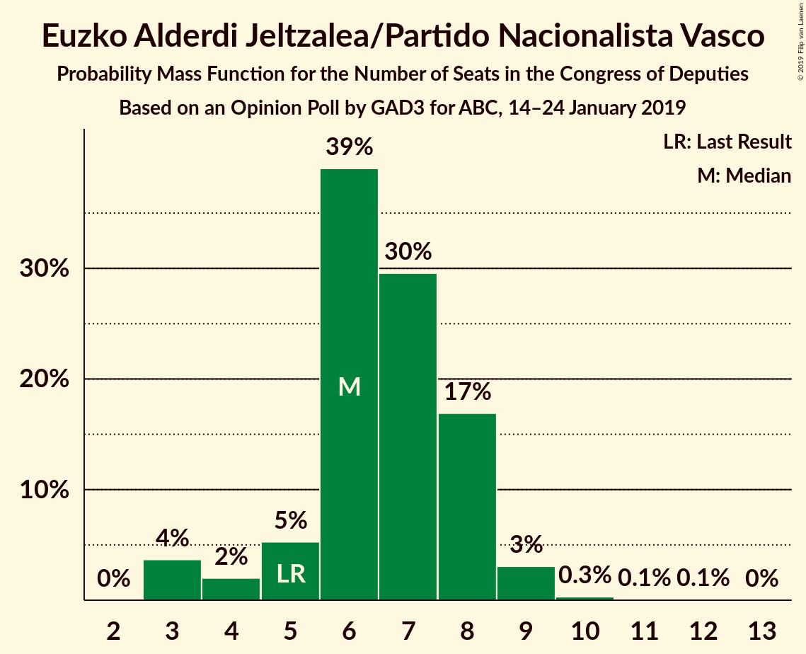
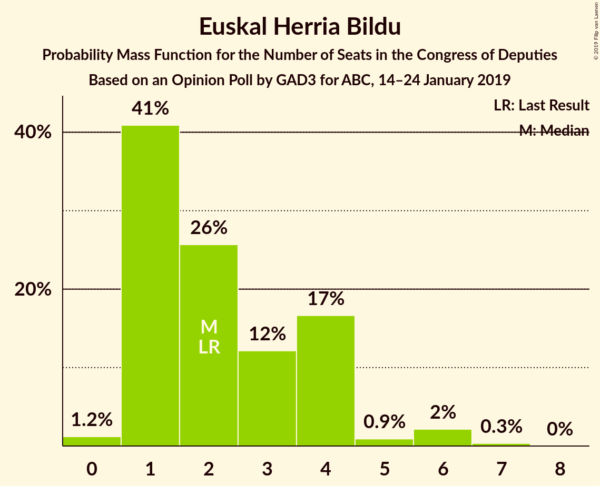
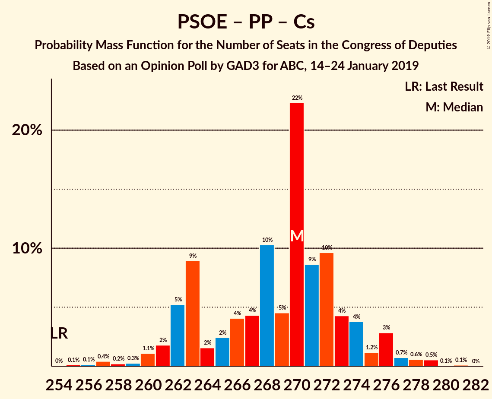

# Opinion Poll by GAD3 for ABC, 14–24 January 2019

<a href="#voting-intentions">Voting Intentions</a> | <a href="#seats">Seats</a> | <a href="#coalitions">Coalitions</a> | <a href="#technical-information">Technical Information</a>

## Voting Intentions

### Confidence Intervals

| Party | Last Result | Poll Result | 80% Confidence Interval | 90% Confidence Interval | 95% Confidence Interval | 99% Confidence Interval |
|:-----:|:-----------:|:-----------:|:-----------------------:|:-----------------------:|:-----------------------:|:-----------------------:|
| Partido Socialista Obrero Español | 22.6% | 26.5% | 25.2–27.9% |24.8–28.3% |24.5–28.6% |23.9–29.3% |
| Partido Popular | 33.0% | 23.0% | 21.8–24.3% |21.4–24.7% |21.1–25.0% |20.5–25.7% |
| Ciudadanos–Partido de la Ciudadanía | 13.1% | 17.1% | 16.0–18.3% |15.7–18.6% |15.4–18.9% |14.9–19.5% |
| Unidos Podemos | 21.2% | 11.6% | 10.7–12.6% |10.4–12.9% |10.2–13.2% |9.8–13.7% |
| Vox | 0.2% | 9.8% | 8.9–10.7% |8.7–11.0% |8.5–11.2% |8.1–11.7% |
| Esquerra Republicana de Catalunya–Catalunya Sí | 2.7% | 2.8% | 2.3–3.4% |2.2–3.5% |2.1–3.7% |1.9–3.9% |
| Partit Demòcrata Europeu Català | 2.0% | 1.6% | 1.3–2.1% |1.2–2.2% |1.1–2.3% |1.0–2.5% |
| Euzko Alderdi Jeltzalea/Partido Nacionalista Vasco | 1.2% | 1.2% | 0.9–1.6% |0.9–1.8% |0.8–1.8% |0.7–2.1% |
| Euskal Herria Bildu | 0.8% | 0.6% | 0.4–0.9% |0.4–1.0% |0.3–1.1% |0.3–1.3% |
| Coalición Canaria–Partido Nacionalista Canario | 0.3% | 0.2% | 0.1–0.5% |0.1–0.5% |0.1–0.6% |0.0–0.7% |

*Note:* The poll result column reflects the actual value used in the calculations. Published results may vary slightly, and in addition be rounded to fewer digits.

## Seats

### Confidence Intervals

| Party | Last Result | Median | 80% Confidence Interval | 90% Confidence Interval | 95% Confidence Interval | 99% Confidence Interval |
|:-----:|:-----------:|:------:|:-----------------------:|:-----------------------:|:-----------------------:|:-----------------------:|
| <a href="#partido-socialista-obrero-español">Partido Socialista Obrero Español</a> | 85 | 120 | 109–120 |108–120 |106–120 |101–124 |
| <a href="#partido-popular">Partido Popular</a> | 137 | 90 | 90–99 |90–102 |90–107 |88–108 |
| <a href="#ciudadanos–partido-de-la-ciudadanía">Ciudadanos–Partido de la Ciudadanía</a> | 32 | 60 | 59–61 |54–63 |52–65 |51–68 |
| <a href="#unidos-podemos">Unidos Podemos</a> | 71 | 34 | 26–34 |25–34 |25–34 |23–38 |
| <a href="#vox">Vox</a> | 0 | 21 | 21–24 |21–27 |20–27 |18–28 |
| <a href="#esquerra-republicana-de-catalunya–catalunya-sí">Esquerra Republicana de Catalunya–Catalunya Sí</a> | 9 | 11 | 11–13 |9–14 |9–15 |9–16 |
| <a href="#partit-demòcrata-europeu-català">Partit Demòcrata Europeu Català</a> | 8 | 6 | 6–8 |5–10 |4–10 |4–10 |
| <a href="#euzko-alderdi-jeltzalea/partido-nacionalista-vasco">Euzko Alderdi Jeltzalea/Partido Nacionalista Vasco</a> | 5 | 7 | 6–8 |6–8 |6–9 |3–9 |
| <a href="#euskal-herria-bildu">Euskal Herria Bildu</a> | 2 | 1 | 1–4 |1–4 |1–4 |0–6 |
| <a href="#coalición-canaria–partido-nacionalista-canario">Coalición Canaria–Partido Nacionalista Canario</a> | 1 | 0 | 0–1 |0–1 |0–1 |0–2 |

### Partido Socialista Obrero Español

*For a full overview of the results for this party, see the [Partido Socialista Obrero Español](party-partidosocialistaobreroespañol.html) page.*

| Number of Seats | Probability | Accumulated | Special Marks |
|:---------------:|:-----------:|:-----------:|:-------------:|
| 85 | 0% | 100% | Last Result |
| 86 | 0% | 100% |  |
| 87 | 0% | 100% |  |
| 88 | 0% | 100% |  |
| 89 | 0% | 100% |  |
| 90 | 0% | 100% |  |
| 91 | 0% | 100% |  |
| 92 | 0% | 100% |  |
| 93 | 0% | 100% |  |
| 94 | 0% | 100% |  |
| 95 | 0% | 100% |  |
| 96 | 0% | 100% |  |
| 97 | 0% | 100% |  |
| 98 | 0% | 99.9% |  |
| 99 | 0.1% | 99.9% |  |
| 100 | 0% | 99.8% |  |
| 101 | 0.3% | 99.8% |  |
| 102 | 0.1% | 99.4% |  |
| 103 | 0.1% | 99.3% |  |
| 104 | 0.2% | 99.3% |  |
| 105 | 0.6% | 99.1% |  |
| 106 | 2% | 98% |  |
| 107 | 0.2% | 96% |  |
| 108 | 1.2% | 96% |  |
| 109 | 7% | 95% |  |
| 110 | 3% | 87% |  |
| 111 | 1.2% | 84% |  |
| 112 | 0.8% | 83% |  |
| 113 | 3% | 82% |  |
| 114 | 0.4% | 79% |  |
| 115 | 1.0% | 79% |  |
| 116 | 3% | 78% |  |
| 117 | 0.1% | 74% |  |
| 118 | 0.1% | 74% |  |
| 119 | 0% | 74% |  |
| 120 | 72% | 74% | Median |
| 121 | 0.3% | 2% |  |
| 122 | 0.3% | 1.3% |  |
| 123 | 0.1% | 1.0% |  |
| 124 | 0.5% | 0.9% |  |
| 125 | 0% | 0.4% |  |
| 126 | 0% | 0.4% |  |
| 127 | 0% | 0.4% |  |
| 128 | 0% | 0.3% |  |
| 129 | 0.3% | 0.3% |  |
| 130 | 0% | 0% |  |

### Partido Popular

*For a full overview of the results for this party, see the [Partido Popular](party-partidopopular.html) page.*

| Number of Seats | Probability | Accumulated | Special Marks |
|:---------------:|:-----------:|:-----------:|:-------------:|
| 82 | 0.1% | 100% |  |
| 83 | 0% | 99.9% |  |
| 84 | 0% | 99.9% |  |
| 85 | 0.1% | 99.8% |  |
| 86 | 0.1% | 99.7% |  |
| 87 | 0% | 99.6% |  |
| 88 | 0.3% | 99.5% |  |
| 89 | 0.1% | 99.3% |  |
| 90 | 72% | 99.2% | Median |
| 91 | 3% | 27% |  |
| 92 | 1.1% | 24% |  |
| 93 | 0.1% | 23% |  |
| 94 | 0.3% | 23% |  |
| 95 | 2% | 22% |  |
| 96 | 0.1% | 21% |  |
| 97 | 1.3% | 21% |  |
| 98 | 9% | 19% |  |
| 99 | 2% | 11% |  |
| 100 | 1.1% | 9% |  |
| 101 | 0.9% | 8% |  |
| 102 | 2% | 7% |  |
| 103 | 1.4% | 5% |  |
| 104 | 0.5% | 4% |  |
| 105 | 0.2% | 3% |  |
| 106 | 0.1% | 3% |  |
| 107 | 2% | 3% |  |
| 108 | 0.4% | 0.7% |  |
| 109 | 0.1% | 0.3% |  |
| 110 | 0.1% | 0.3% |  |
| 111 | 0% | 0.2% |  |
| 112 | 0% | 0.1% |  |
| 113 | 0% | 0.1% |  |
| 114 | 0.1% | 0.1% |  |
| 115 | 0% | 0% |  |
| 116 | 0% | 0% |  |
| 117 | 0% | 0% |  |
| 118 | 0% | 0% |  |
| 119 | 0% | 0% |  |
| 120 | 0% | 0% |  |
| 121 | 0% | 0% |  |
| 122 | 0% | 0% |  |
| 123 | 0% | 0% |  |
| 124 | 0% | 0% |  |
| 125 | 0% | 0% |  |
| 126 | 0% | 0% |  |
| 127 | 0% | 0% |  |
| 128 | 0% | 0% |  |
| 129 | 0% | 0% |  |
| 130 | 0% | 0% |  |
| 131 | 0% | 0% |  |
| 132 | 0% | 0% |  |
| 133 | 0% | 0% |  |
| 134 | 0% | 0% |  |
| 135 | 0% | 0% |  |
| 136 | 0% | 0% |  |
| 137 | 0% | 0% | Last Result |

### Ciudadanos–Partido de la Ciudadanía

*For a full overview of the results for this party, see the [Ciudadanos–Partido de la Ciudadanía](party-ciudadanos–partidodelaciudadanía.html) page.*

| Number of Seats | Probability | Accumulated | Special Marks |
|:---------------:|:-----------:|:-----------:|:-------------:|
| 32 | 0% | 100% | Last Result |
| 33 | 0% | 100% |  |
| 34 | 0% | 100% |  |
| 35 | 0% | 100% |  |
| 36 | 0% | 100% |  |
| 37 | 0% | 100% |  |
| 38 | 0% | 100% |  |
| 39 | 0% | 100% |  |
| 40 | 0% | 100% |  |
| 41 | 0% | 100% |  |
| 42 | 0% | 100% |  |
| 43 | 0% | 100% |  |
| 44 | 0% | 100% |  |
| 45 | 0% | 100% |  |
| 46 | 0% | 100% |  |
| 47 | 0% | 100% |  |
| 48 | 0% | 100% |  |
| 49 | 0% | 100% |  |
| 50 | 0.4% | 100% |  |
| 51 | 1.2% | 99.6% |  |
| 52 | 2% | 98% |  |
| 53 | 0.4% | 96% |  |
| 54 | 0.8% | 96% |  |
| 55 | 0.7% | 95% |  |
| 56 | 0.5% | 94% |  |
| 57 | 0.1% | 94% |  |
| 58 | 2% | 93% |  |
| 59 | 6% | 92% |  |
| 60 | 72% | 86% | Median |
| 61 | 5% | 14% |  |
| 62 | 2% | 9% |  |
| 63 | 3% | 7% |  |
| 64 | 0.6% | 4% |  |
| 65 | 1.1% | 3% |  |
| 66 | 1.5% | 2% |  |
| 67 | 0.1% | 0.7% |  |
| 68 | 0.3% | 0.6% |  |
| 69 | 0% | 0.3% |  |
| 70 | 0.2% | 0.3% |  |
| 71 | 0% | 0.2% |  |
| 72 | 0% | 0.1% |  |
| 73 | 0% | 0.1% |  |
| 74 | 0.1% | 0.1% |  |
| 75 | 0% | 0% |  |

### Unidos Podemos

*For a full overview of the results for this party, see the [Unidos Podemos](party-unidospodemos.html) page.*

| Number of Seats | Probability | Accumulated | Special Marks |
|:---------------:|:-----------:|:-----------:|:-------------:|
| 22 | 0.1% | 100% |  |
| 23 | 0.7% | 99.9% |  |
| 24 | 0.9% | 99.1% |  |
| 25 | 5% | 98% |  |
| 26 | 6% | 93% |  |
| 27 | 4% | 88% |  |
| 28 | 0.4% | 84% |  |
| 29 | 0.7% | 83% |  |
| 30 | 1.3% | 82% |  |
| 31 | 3% | 81% |  |
| 32 | 2% | 78% |  |
| 33 | 1.1% | 76% |  |
| 34 | 74% | 75% | Median |
| 35 | 0.2% | 1.3% |  |
| 36 | 0.2% | 1.1% |  |
| 37 | 0.4% | 1.0% |  |
| 38 | 0.1% | 0.5% |  |
| 39 | 0.3% | 0.4% |  |
| 40 | 0% | 0.1% |  |
| 41 | 0% | 0% |  |
| 42 | 0% | 0% |  |
| 43 | 0% | 0% |  |
| 44 | 0% | 0% |  |
| 45 | 0% | 0% |  |
| 46 | 0% | 0% |  |
| 47 | 0% | 0% |  |
| 48 | 0% | 0% |  |
| 49 | 0% | 0% |  |
| 50 | 0% | 0% |  |
| 51 | 0% | 0% |  |
| 52 | 0% | 0% |  |
| 53 | 0% | 0% |  |
| 54 | 0% | 0% |  |
| 55 | 0% | 0% |  |
| 56 | 0% | 0% |  |
| 57 | 0% | 0% |  |
| 58 | 0% | 0% |  |
| 59 | 0% | 0% |  |
| 60 | 0% | 0% |  |
| 61 | 0% | 0% |  |
| 62 | 0% | 0% |  |
| 63 | 0% | 0% |  |
| 64 | 0% | 0% |  |
| 65 | 0% | 0% |  |
| 66 | 0% | 0% |  |
| 67 | 0% | 0% |  |
| 68 | 0% | 0% |  |
| 69 | 0% | 0% |  |
| 70 | 0% | 0% |  |
| 71 | 0% | 0% | Last Result |

### Vox

*For a full overview of the results for this party, see the [Vox](party-vox.html) page.*

| Number of Seats | Probability | Accumulated | Special Marks |
|:---------------:|:-----------:|:-----------:|:-------------:|
| 0 | 0% | 100% | Last Result |
| 1 | 0% | 100% |  |
| 2 | 0% | 100% |  |
| 3 | 0% | 100% |  |
| 4 | 0% | 100% |  |
| 5 | 0% | 100% |  |
| 6 | 0% | 100% |  |
| 7 | 0% | 100% |  |
| 8 | 0% | 100% |  |
| 9 | 0% | 100% |  |
| 10 | 0% | 100% |  |
| 11 | 0% | 100% |  |
| 12 | 0% | 100% |  |
| 13 | 0% | 100% |  |
| 14 | 0% | 100% |  |
| 15 | 0% | 99.9% |  |
| 16 | 0% | 99.9% |  |
| 17 | 0.2% | 99.9% |  |
| 18 | 0.4% | 99.6% |  |
| 19 | 1.1% | 99.3% |  |
| 20 | 3% | 98% |  |
| 21 | 74% | 96% | Median |
| 22 | 9% | 22% |  |
| 23 | 1.2% | 13% |  |
| 24 | 5% | 12% |  |
| 25 | 0.7% | 7% |  |
| 26 | 0.3% | 7% |  |
| 27 | 6% | 6% |  |
| 28 | 0.2% | 0.6% |  |
| 29 | 0.1% | 0.4% |  |
| 30 | 0% | 0.3% |  |
| 31 | 0% | 0.3% |  |
| 32 | 0% | 0.3% |  |
| 33 | 0% | 0.3% |  |
| 34 | 0.2% | 0.3% |  |
| 35 | 0% | 0% |  |

### Esquerra Republicana de Catalunya–Catalunya Sí

*For a full overview of the results for this party, see the [Esquerra Republicana de Catalunya–Catalunya Sí](party-esquerrarepublicanadecatalunya–catalunyasí.html) page.*

| Number of Seats | Probability | Accumulated | Special Marks |
|:---------------:|:-----------:|:-----------:|:-------------:|
| 9 | 5% | 100% | Last Result |
| 10 | 2% | 94% |  |
| 11 | 78% | 92% | Median |
| 12 | 0.5% | 14% |  |
| 13 | 5% | 14% |  |
| 14 | 5% | 9% |  |
| 15 | 3% | 4% |  |
| 16 | 0.8% | 1.0% |  |
| 17 | 0.3% | 0.3% |  |
| 18 | 0% | 0% |  |

### Partit Demòcrata Europeu Català

*For a full overview of the results for this party, see the [Partit Demòcrata Europeu Català](party-partitdemòcrataeuropeucatalà.html) page.*

| Number of Seats | Probability | Accumulated | Special Marks |
|:---------------:|:-----------:|:-----------:|:-------------:|
| 4 | 4% | 100% |  |
| 5 | 5% | 96% |  |
| 6 | 76% | 91% | Median |
| 7 | 0.8% | 15% |  |
| 8 | 7% | 15% | Last Result |
| 9 | 0.8% | 8% |  |
| 10 | 7% | 7% |  |
| 11 | 0% | 0% |  |

### Euzko Alderdi Jeltzalea/Partido Nacionalista Vasco

*For a full overview of the results for this party, see the [Euzko Alderdi Jeltzalea/Partido Nacionalista Vasco](party-euzkoalderdijeltzaleapartidonacionalistavasco.html) page.*

| Number of Seats | Probability | Accumulated | Special Marks |
|:---------------:|:-----------:|:-----------:|:-------------:|
| 3 | 0.6% | 100% |  |
| 4 | 0.3% | 99.4% |  |
| 5 | 0.5% | 99.1% | Last Result |
| 6 | 10% | 98.6% |  |
| 7 | 78% | 88% | Median |
| 8 | 8% | 11% |  |
| 9 | 2% | 3% |  |
| 10 | 0.1% | 0.2% |  |
| 11 | 0% | 0% |  |

### Euskal Herria Bildu

*For a full overview of the results for this party, see the [Euskal Herria Bildu](party-euskalherriabildu.html) page.*

| Number of Seats | Probability | Accumulated | Special Marks |
|:---------------:|:-----------:|:-----------:|:-------------:|
| 0 | 0.9% | 100% |  |
| 1 | 78% | 99.1% | Median |
| 2 | 9% | 21% | Last Result |
| 3 | 2% | 12% |  |
| 4 | 9% | 10% |  |
| 5 | 0.4% | 1.0% |  |
| 6 | 0.5% | 0.6% |  |
| 7 | 0.1% | 0.1% |  |
| 8 | 0% | 0% |  |

### Coalición Canaria–Partido Nacionalista Canario

*For a full overview of the results for this party, see the [Coalición Canaria–Partido Nacionalista Canario](party-coalicióncanaria–partidonacionalistacanario.html) page.*

| Number of Seats | Probability | Accumulated | Special Marks |
|:---------------:|:-----------:|:-----------:|:-------------:|
| 0 | 80% | 100% | Median |
| 1 | 18% | 20% | Last Result |
| 2 | 2% | 2% |  |
| 3 | 0% | 0.1% |  |
| 4 | 0% | 0% |  |

## Coalitions

### Confidence Intervals

| Coalition | Last Result | Median | Majority? | 80% Confidence Interval | 90% Confidence Interval | 95% Confidence Interval | 99% Confidence Interval |
|:---------:|:-----------:|:------:|:---------:|:-----------------------:|:-----------------------:|:-----------------------:|:-----------------------:|
| Partido Socialista Obrero Español – Partido Popular – Ciudadanos–Partido de la Ciudadanía | 254 | 270 | 100% | 268–270 | 266–273 | 265–274 | 259–277 |
| Partido Socialista Obrero Español – Partido Popular | 222 | 210 | 100% | 207–212 | 207–213 | 204–216 | 200–220 |
| Partido Socialista Obrero Español – Ciudadanos–Partido de la Ciudadanía – Unidos Podemos | 188 | 214 | 100% | 195–214 | 195–214 | 192–214 | 188–214 |
| Partido Popular – Ciudadanos–Partido de la Ciudadanía – Vox | 169 | 171 | 22% | 171–183 | 171–186 | 171–186 | 170–187 |
| Partido Socialista Obrero Español – Ciudadanos–Partido de la Ciudadanía | 117 | 180 | 77% | 170–180 | 167–180 | 159–180 | 158–185 |
| Partido Socialista Obrero Español – Unidos Podemos – Esquerra Republicana de Catalunya–Catalunya Sí – Partit Demòcrata Europeu Català – Euzko Alderdi Jeltzalea/Partido Nacionalista Vasco – Euskal Herria Bildu | 180 | 179 | 75% | 166–179 | 163–179 | 163–179 | 162–180 |
| Partido Socialista Obrero Español – Unidos Podemos – Esquerra Republicana de Catalunya–Catalunya Sí – Partit Demòcrata Europeu Català | 173 | 171 | 0.1% | 156–171 | 154–171 | 153–171 | 152–172 |
| Partido Socialista Obrero Español – Unidos Podemos – Esquerra Republicana de Catalunya–Catalunya Sí – Euskal Herria Bildu | 167 | 166 | 0% | 150–166 | 149–166 | 148–167 | 148–169 |
| Partido Popular – Ciudadanos–Partido de la Ciudadanía – Coalición Canaria–Partido Nacionalista Canario | 170 | 150 | 0% | 150–161 | 150–162 | 150–162 | 147–165 |
| Partido Popular – Ciudadanos–Partido de la Ciudadanía | 169 | 150 | 0% | 150–161 | 150–161 | 150–162 | 146–164 |
| Partido Socialista Obrero Español – Unidos Podemos – Euzko Alderdi Jeltzalea/Partido Nacionalista Vasco – Euskal Herria Bildu | 163 | 162 | 0% | 146–162 | 144–162 | 144–162 | 141–164 |
| Partido Socialista Obrero Español – Unidos Podemos | 156 | 154 | 0% | 136–154 | 134–154 | 134–154 | 131–156 |
| Partido Popular – Vox | 137 | 111 | 0% | 111–124 | 111–125 | 111–129 | 108–131 |
| Partido Socialista Obrero Español | 85 | 120 | 0% | 109–120 | 108–120 | 106–120 | 101–124 |
| Partido Popular | 137 | 90 | 0% | 90–99 | 90–102 | 90–107 | 88–108 |

### Partido Socialista Obrero Español – Partido Popular – Ciudadanos–Partido de la Ciudadanía

| Number of Seats | Probability | Accumulated | Special Marks |
|:---------------:|:-----------:|:-----------:|:-------------:|
| 254 | 0% | 100% | Last Result |
| 255 | 0% | 100% |  |
| 256 | 0.1% | 100% |  |
| 257 | 0% | 99.9% |  |
| 258 | 0.2% | 99.9% |  |
| 259 | 0.3% | 99.7% |  |
| 260 | 0.2% | 99.5% |  |
| 261 | 0.4% | 99.3% |  |
| 262 | 0.4% | 98.9% |  |
| 263 | 0.3% | 98.6% |  |
| 264 | 0.3% | 98% |  |
| 265 | 2% | 98% |  |
| 266 | 4% | 96% |  |
| 267 | 0.9% | 92% |  |
| 268 | 6% | 91% |  |
| 269 | 1.2% | 85% |  |
| 270 | 74% | 84% | Median |
| 271 | 4% | 10% |  |
| 272 | 1.0% | 6% |  |
| 273 | 0.3% | 5% |  |
| 274 | 4% | 5% |  |
| 275 | 0.7% | 1.3% |  |
| 276 | 0% | 0.6% |  |
| 277 | 0.2% | 0.6% |  |
| 278 | 0% | 0.4% |  |
| 279 | 0% | 0.3% |  |
| 280 | 0% | 0.3% |  |
| 281 | 0.3% | 0.3% |  |
| 282 | 0% | 0% |  |

### Partido Socialista Obrero Español – Partido Popular

| Number of Seats | Probability | Accumulated | Special Marks |
|:---------------:|:-----------:|:-----------:|:-------------:|
| 195 | 0% | 100% |  |
| 196 | 0% | 99.9% |  |
| 197 | 0.2% | 99.9% |  |
| 198 | 0% | 99.7% |  |
| 199 | 0.1% | 99.7% |  |
| 200 | 0.2% | 99.6% |  |
| 201 | 0.3% | 99.4% |  |
| 202 | 0.7% | 99.1% |  |
| 203 | 0.5% | 98% |  |
| 204 | 2% | 98% |  |
| 205 | 0.4% | 96% |  |
| 206 | 0.1% | 96% |  |
| 207 | 10% | 96% |  |
| 208 | 0.1% | 86% |  |
| 209 | 0.2% | 86% |  |
| 210 | 72% | 86% | Median |
| 211 | 3% | 13% |  |
| 212 | 4% | 10% |  |
| 213 | 3% | 6% |  |
| 214 | 0.6% | 4% |  |
| 215 | 0.3% | 3% |  |
| 216 | 0.6% | 3% |  |
| 217 | 0.1% | 2% |  |
| 218 | 0.2% | 2% |  |
| 219 | 0.7% | 2% |  |
| 220 | 1.0% | 1.2% |  |
| 221 | 0% | 0.2% |  |
| 222 | 0% | 0.2% | Last Result |
| 223 | 0.1% | 0.2% |  |
| 224 | 0% | 0.1% |  |
| 225 | 0% | 0% |  |

### Partido Socialista Obrero Español – Ciudadanos–Partido de la Ciudadanía – Unidos Podemos

| Number of Seats | Probability | Accumulated | Special Marks |
|:---------------:|:-----------:|:-----------:|:-------------:|
| 184 | 0% | 100% |  |
| 185 | 0.2% | 99.9% |  |
| 186 | 0% | 99.7% |  |
| 187 | 0% | 99.7% |  |
| 188 | 0.6% | 99.7% | Last Result |
| 189 | 0.2% | 99.0% |  |
| 190 | 0.3% | 98.8% |  |
| 191 | 0.5% | 98% |  |
| 192 | 2% | 98% |  |
| 193 | 0.6% | 96% |  |
| 194 | 0.1% | 95% |  |
| 195 | 6% | 95% |  |
| 196 | 0.1% | 89% |  |
| 197 | 1.0% | 89% |  |
| 198 | 2% | 88% |  |
| 199 | 0.1% | 86% |  |
| 200 | 2% | 86% |  |
| 201 | 0.3% | 84% |  |
| 202 | 5% | 84% |  |
| 203 | 2% | 79% |  |
| 204 | 0.1% | 77% |  |
| 205 | 0.2% | 77% |  |
| 206 | 3% | 77% |  |
| 207 | 0.1% | 74% |  |
| 208 | 0.1% | 74% |  |
| 209 | 0.4% | 74% |  |
| 210 | 0.5% | 73% |  |
| 211 | 0.3% | 73% |  |
| 212 | 0% | 72% |  |
| 213 | 0.4% | 72% |  |
| 214 | 72% | 72% | Median |
| 215 | 0% | 0.2% |  |
| 216 | 0% | 0.2% |  |
| 217 | 0.1% | 0.2% |  |
| 218 | 0% | 0.1% |  |
| 219 | 0% | 0.1% |  |
| 220 | 0% | 0% |  |

### Partido Popular – Ciudadanos–Partido de la Ciudadanía – Vox

| Number of Seats | Probability | Accumulated | Special Marks |
|:---------------:|:-----------:|:-----------:|:-------------:|
| 166 | 0.1% | 100% |  |
| 167 | 0.2% | 99.9% |  |
| 168 | 0% | 99.7% |  |
| 169 | 0% | 99.7% | Last Result |
| 170 | 1.5% | 99.6% |  |
| 171 | 72% | 98% | Median |
| 172 | 0.4% | 26% |  |
| 173 | 0.4% | 26% |  |
| 174 | 3% | 25% |  |
| 175 | 0.6% | 22% |  |
| 176 | 0.1% | 22% | Majority |
| 177 | 0.8% | 21% |  |
| 178 | 0.1% | 21% |  |
| 179 | 0.2% | 21% |  |
| 180 | 0.3% | 20% |  |
| 181 | 3% | 20% |  |
| 182 | 0.9% | 17% |  |
| 183 | 7% | 16% |  |
| 184 | 2% | 9% |  |
| 185 | 2% | 7% |  |
| 186 | 5% | 5% |  |
| 187 | 0.4% | 0.7% |  |
| 188 | 0.1% | 0.3% |  |
| 189 | 0.1% | 0.3% |  |
| 190 | 0% | 0.1% |  |
| 191 | 0% | 0.1% |  |
| 192 | 0% | 0.1% |  |
| 193 | 0% | 0.1% |  |
| 194 | 0% | 0% |  |

### Partido Socialista Obrero Español – Ciudadanos–Partido de la Ciudadanía

| Number of Seats | Probability | Accumulated | Special Marks |
|:---------------:|:-----------:|:-----------:|:-------------:|
| 117 | 0% | 100% | Last Result |
| 118 | 0% | 100% |  |
| 119 | 0% | 100% |  |
| 120 | 0% | 100% |  |
| 121 | 0% | 100% |  |
| 122 | 0% | 100% |  |
| 123 | 0% | 100% |  |
| 124 | 0% | 100% |  |
| 125 | 0% | 100% |  |
| 126 | 0% | 100% |  |
| 127 | 0% | 100% |  |
| 128 | 0% | 100% |  |
| 129 | 0% | 100% |  |
| 130 | 0% | 100% |  |
| 131 | 0% | 100% |  |
| 132 | 0% | 100% |  |
| 133 | 0% | 100% |  |
| 134 | 0% | 100% |  |
| 135 | 0% | 100% |  |
| 136 | 0% | 100% |  |
| 137 | 0% | 100% |  |
| 138 | 0% | 100% |  |
| 139 | 0% | 100% |  |
| 140 | 0% | 100% |  |
| 141 | 0% | 100% |  |
| 142 | 0% | 100% |  |
| 143 | 0% | 100% |  |
| 144 | 0% | 100% |  |
| 145 | 0% | 100% |  |
| 146 | 0% | 100% |  |
| 147 | 0% | 100% |  |
| 148 | 0% | 100% |  |
| 149 | 0% | 100% |  |
| 150 | 0% | 100% |  |
| 151 | 0% | 100% |  |
| 152 | 0% | 100% |  |
| 153 | 0% | 100% |  |
| 154 | 0% | 99.9% |  |
| 155 | 0% | 99.9% |  |
| 156 | 0% | 99.9% |  |
| 157 | 0% | 99.9% |  |
| 158 | 2% | 99.9% |  |
| 159 | 0.6% | 98% |  |
| 160 | 0.4% | 97% |  |
| 161 | 0.4% | 97% |  |
| 162 | 0% | 97% |  |
| 163 | 0.3% | 96% |  |
| 164 | 0.1% | 96% |  |
| 165 | 0.3% | 96% |  |
| 166 | 0.3% | 96% |  |
| 167 | 1.3% | 95% |  |
| 168 | 0.4% | 94% |  |
| 169 | 3% | 94% |  |
| 170 | 5% | 91% |  |
| 171 | 3% | 86% |  |
| 172 | 0.3% | 83% |  |
| 173 | 0.9% | 83% |  |
| 174 | 0.3% | 82% |  |
| 175 | 5% | 82% |  |
| 176 | 4% | 77% | Majority |
| 177 | 0% | 73% |  |
| 178 | 0.5% | 73% |  |
| 179 | 0.3% | 73% |  |
| 180 | 71% | 73% | Median |
| 181 | 0.2% | 1.2% |  |
| 182 | 0.1% | 1.0% |  |
| 183 | 0% | 0.9% |  |
| 184 | 0.3% | 0.9% |  |
| 185 | 0.1% | 0.6% |  |
| 186 | 0% | 0.5% |  |
| 187 | 0% | 0.5% |  |
| 188 | 0% | 0.5% |  |
| 189 | 0.2% | 0.5% |  |
| 190 | 0% | 0.3% |  |
| 191 | 0.3% | 0.3% |  |
| 192 | 0% | 0% |  |

### Partido Socialista Obrero Español – Unidos Podemos – Esquerra Republicana de Catalunya–Catalunya Sí – Partit Demòcrata Europeu Català – Euzko Alderdi Jeltzalea/Partido Nacionalista Vasco – Euskal Herria Bildu

| Number of Seats | Probability | Accumulated | Special Marks |
|:---------------:|:-----------:|:-----------:|:-------------:|
| 157 | 0% | 100% |  |
| 158 | 0% | 99.9% |  |
| 159 | 0% | 99.9% |  |
| 160 | 0% | 99.9% |  |
| 161 | 0.2% | 99.9% |  |
| 162 | 0.5% | 99.7% |  |
| 163 | 5% | 99.2% |  |
| 164 | 2% | 94% |  |
| 165 | 1.5% | 92% |  |
| 166 | 4% | 91% |  |
| 167 | 3% | 87% |  |
| 168 | 3% | 84% |  |
| 169 | 1.4% | 81% |  |
| 170 | 0.4% | 80% |  |
| 171 | 0% | 79% |  |
| 172 | 0.4% | 79% |  |
| 173 | 0.4% | 79% |  |
| 174 | 0.6% | 79% |  |
| 175 | 3% | 78% |  |
| 176 | 0.3% | 75% | Majority |
| 177 | 0.7% | 75% |  |
| 178 | 0.4% | 74% |  |
| 179 | 72% | 73% | Median |
| 180 | 1.2% | 2% | Last Result |
| 181 | 0.1% | 0.3% |  |
| 182 | 0.1% | 0.2% |  |
| 183 | 0% | 0.1% |  |
| 184 | 0.1% | 0.1% |  |
| 185 | 0% | 0% |  |

### Partido Socialista Obrero Español – Unidos Podemos – Esquerra Republicana de Catalunya–Catalunya Sí – Partit Demòcrata Europeu Català

| Number of Seats | Probability | Accumulated | Special Marks |
|:---------------:|:-----------:|:-----------:|:-------------:|
| 150 | 0% | 100% |  |
| 151 | 0.1% | 99.9% |  |
| 152 | 0.3% | 99.8% |  |
| 153 | 4% | 99.5% |  |
| 154 | 2% | 95% |  |
| 155 | 0.5% | 93% |  |
| 156 | 4% | 92% |  |
| 157 | 1.0% | 88% |  |
| 158 | 4% | 87% |  |
| 159 | 3% | 83% |  |
| 160 | 0.4% | 80% |  |
| 161 | 0.1% | 79% |  |
| 162 | 0.4% | 79% |  |
| 163 | 0.3% | 79% |  |
| 164 | 3% | 79% |  |
| 165 | 0% | 76% |  |
| 166 | 0.3% | 76% |  |
| 167 | 0.5% | 75% |  |
| 168 | 0.1% | 75% |  |
| 169 | 0.7% | 75% |  |
| 170 | 0.7% | 74% |  |
| 171 | 73% | 73% | Median |
| 172 | 0.4% | 0.7% |  |
| 173 | 0.2% | 0.3% | Last Result |
| 174 | 0% | 0.1% |  |
| 175 | 0% | 0.1% |  |
| 176 | 0% | 0.1% | Majority |
| 177 | 0% | 0% |  |

### Partido Socialista Obrero Español – Unidos Podemos – Esquerra Republicana de Catalunya–Catalunya Sí – Euskal Herria Bildu

| Number of Seats | Probability | Accumulated | Special Marks |
|:---------------:|:-----------:|:-----------:|:-------------:|
| 144 | 0% | 100% |  |
| 145 | 0% | 99.9% |  |
| 146 | 0.3% | 99.9% |  |
| 147 | 0.1% | 99.6% |  |
| 148 | 2% | 99.6% |  |
| 149 | 6% | 97% |  |
| 150 | 6% | 92% |  |
| 151 | 2% | 86% |  |
| 152 | 0.4% | 84% |  |
| 153 | 1.0% | 83% |  |
| 154 | 0.6% | 82% |  |
| 155 | 0.1% | 82% |  |
| 156 | 2% | 81% |  |
| 157 | 0.1% | 80% |  |
| 158 | 0.3% | 79% |  |
| 159 | 0.3% | 79% |  |
| 160 | 0.6% | 79% |  |
| 161 | 0% | 78% |  |
| 162 | 0% | 78% |  |
| 163 | 0.3% | 78% |  |
| 164 | 3% | 78% |  |
| 165 | 0.2% | 75% |  |
| 166 | 72% | 74% | Median |
| 167 | 1.0% | 3% | Last Result |
| 168 | 0.3% | 2% |  |
| 169 | 1.0% | 1.3% |  |
| 170 | 0.1% | 0.3% |  |
| 171 | 0.2% | 0.2% |  |
| 172 | 0% | 0% |  |

### Partido Popular – Ciudadanos–Partido de la Ciudadanía – Coalición Canaria–Partido Nacionalista Canario

| Number of Seats | Probability | Accumulated | Special Marks |
|:---------------:|:-----------:|:-----------:|:-------------:|
| 141 | 0.1% | 100% |  |
| 142 | 0% | 99.9% |  |
| 143 | 0% | 99.9% |  |
| 144 | 0% | 99.9% |  |
| 145 | 0% | 99.8% |  |
| 146 | 0.2% | 99.8% |  |
| 147 | 0.4% | 99.6% |  |
| 148 | 0.3% | 99.2% |  |
| 149 | 0.1% | 98.9% |  |
| 150 | 72% | 98.8% | Median |
| 151 | 4% | 27% |  |
| 152 | 0.3% | 23% |  |
| 153 | 1.1% | 23% |  |
| 154 | 1.1% | 22% |  |
| 155 | 0.2% | 21% |  |
| 156 | 0.2% | 20% |  |
| 157 | 0.1% | 20% |  |
| 158 | 0.7% | 20% |  |
| 159 | 0.5% | 19% |  |
| 160 | 7% | 19% |  |
| 161 | 5% | 12% |  |
| 162 | 5% | 7% |  |
| 163 | 0.4% | 2% |  |
| 164 | 0.2% | 2% |  |
| 165 | 1.1% | 2% |  |
| 166 | 0.1% | 0.5% |  |
| 167 | 0% | 0.3% |  |
| 168 | 0.1% | 0.3% |  |
| 169 | 0% | 0.2% |  |
| 170 | 0% | 0.2% | Last Result |
| 171 | 0% | 0.1% |  |
| 172 | 0.1% | 0.1% |  |
| 173 | 0% | 0% |  |

### Partido Popular – Ciudadanos–Partido de la Ciudadanía

| Number of Seats | Probability | Accumulated | Special Marks |
|:---------------:|:-----------:|:-----------:|:-------------:|
| 140 | 0.1% | 100% |  |
| 141 | 0% | 99.9% |  |
| 142 | 0% | 99.9% |  |
| 143 | 0% | 99.9% |  |
| 144 | 0% | 99.9% |  |
| 145 | 0% | 99.8% |  |
| 146 | 0.7% | 99.8% |  |
| 147 | 0% | 99.1% |  |
| 148 | 0.2% | 99.1% |  |
| 149 | 0.2% | 98.9% |  |
| 150 | 74% | 98.7% | Median |
| 151 | 1.1% | 24% |  |
| 152 | 1.0% | 23% |  |
| 153 | 1.1% | 22% |  |
| 154 | 0.6% | 21% |  |
| 155 | 0.2% | 20% |  |
| 156 | 0.2% | 20% |  |
| 157 | 0.4% | 20% |  |
| 158 | 1.4% | 20% |  |
| 159 | 6% | 18% |  |
| 160 | 1.2% | 12% |  |
| 161 | 8% | 11% |  |
| 162 | 1.2% | 3% |  |
| 163 | 0.2% | 2% |  |
| 164 | 1.1% | 1.5% |  |
| 165 | 0.1% | 0.4% |  |
| 166 | 0% | 0.3% |  |
| 167 | 0.1% | 0.3% |  |
| 168 | 0% | 0.2% |  |
| 169 | 0% | 0.2% | Last Result |
| 170 | 0% | 0.1% |  |
| 171 | 0% | 0.1% |  |
| 172 | 0.1% | 0.1% |  |
| 173 | 0% | 0% |  |

### Partido Socialista Obrero Español – Unidos Podemos – Euzko Alderdi Jeltzalea/Partido Nacionalista Vasco – Euskal Herria Bildu

| Number of Seats | Probability | Accumulated | Special Marks |
|:---------------:|:-----------:|:-----------:|:-------------:|
| 139 | 0% | 100% |  |
| 140 | 0.2% | 99.9% |  |
| 141 | 0.2% | 99.7% |  |
| 142 | 0.7% | 99.5% |  |
| 143 | 0.2% | 98.8% |  |
| 144 | 5% | 98.6% |  |
| 145 | 1.1% | 93% |  |
| 146 | 6% | 92% |  |
| 147 | 0.5% | 87% |  |
| 148 | 3% | 86% |  |
| 149 | 3% | 83% |  |
| 150 | 0.1% | 80% |  |
| 151 | 0.5% | 80% |  |
| 152 | 0.1% | 79% |  |
| 153 | 0.2% | 79% |  |
| 154 | 0.4% | 79% |  |
| 155 | 0.8% | 79% |  |
| 156 | 0.1% | 78% |  |
| 157 | 0.4% | 78% |  |
| 158 | 3% | 77% |  |
| 159 | 0.8% | 74% |  |
| 160 | 0.1% | 73% |  |
| 161 | 1.2% | 73% |  |
| 162 | 71% | 72% | Median |
| 163 | 0.1% | 0.6% | Last Result |
| 164 | 0.4% | 0.5% |  |
| 165 | 0% | 0.1% |  |
| 166 | 0% | 0.1% |  |
| 167 | 0% | 0.1% |  |
| 168 | 0% | 0% |  |

### Partido Socialista Obrero Español – Unidos Podemos

| Number of Seats | Probability | Accumulated | Special Marks |
|:---------------:|:-----------:|:-----------:|:-------------:|
| 129 | 0% | 100% |  |
| 130 | 0.2% | 99.9% |  |
| 131 | 0.3% | 99.8% |  |
| 132 | 0.1% | 99.5% |  |
| 133 | 0% | 99.4% |  |
| 134 | 5% | 99.3% |  |
| 135 | 2% | 94% |  |
| 136 | 5% | 93% |  |
| 137 | 2% | 88% |  |
| 138 | 0.2% | 86% |  |
| 139 | 4% | 86% |  |
| 140 | 2% | 82% |  |
| 141 | 0.4% | 80% |  |
| 142 | 0.1% | 79% |  |
| 143 | 0.2% | 79% |  |
| 144 | 0.3% | 79% |  |
| 145 | 0.1% | 79% |  |
| 146 | 0% | 79% |  |
| 147 | 3% | 79% |  |
| 148 | 0.5% | 75% |  |
| 149 | 0.8% | 75% |  |
| 150 | 0.2% | 74% |  |
| 151 | 0.3% | 74% |  |
| 152 | 1.5% | 74% |  |
| 153 | 0.1% | 72% |  |
| 154 | 72% | 72% | Median |
| 155 | 0% | 0.5% |  |
| 156 | 0.4% | 0.5% | Last Result |
| 157 | 0% | 0.1% |  |
| 158 | 0% | 0% |  |

### Partido Popular – Vox

| Number of Seats | Probability | Accumulated | Special Marks |
|:---------------:|:-----------:|:-----------:|:-------------:|
| 104 | 0% | 100% |  |
| 105 | 0% | 99.9% |  |
| 106 | 0.2% | 99.9% |  |
| 107 | 0.1% | 99.8% |  |
| 108 | 0.3% | 99.6% |  |
| 109 | 0.1% | 99.3% |  |
| 110 | 0.3% | 99.2% |  |
| 111 | 71% | 98.9% | Median |
| 112 | 0.4% | 27% |  |
| 113 | 0.3% | 27% |  |
| 114 | 0.1% | 27% |  |
| 115 | 3% | 27% |  |
| 116 | 0.2% | 23% |  |
| 117 | 2% | 23% |  |
| 118 | 0.8% | 21% |  |
| 119 | 2% | 21% |  |
| 120 | 5% | 19% |  |
| 121 | 0.2% | 14% |  |
| 122 | 0.7% | 14% |  |
| 123 | 1.2% | 13% |  |
| 124 | 3% | 12% |  |
| 125 | 4% | 9% |  |
| 126 | 0.5% | 5% |  |
| 127 | 0.6% | 4% |  |
| 128 | 0.4% | 3% |  |
| 129 | 2% | 3% |  |
| 130 | 0.1% | 1.2% |  |
| 131 | 0.7% | 1.1% |  |
| 132 | 0% | 0.4% |  |
| 133 | 0.3% | 0.4% |  |
| 134 | 0% | 0.1% |  |
| 135 | 0% | 0.1% |  |
| 136 | 0% | 0.1% |  |
| 137 | 0% | 0.1% | Last Result |
| 138 | 0% | 0% |  |

### Partido Socialista Obrero Español

| Number of Seats | Probability | Accumulated | Special Marks |
|:---------------:|:-----------:|:-----------:|:-------------:|
| 85 | 0% | 100% | Last Result |
| 86 | 0% | 100% |  |
| 87 | 0% | 100% |  |
| 88 | 0% | 100% |  |
| 89 | 0% | 100% |  |
| 90 | 0% | 100% |  |
| 91 | 0% | 100% |  |
| 92 | 0% | 100% |  |
| 93 | 0% | 100% |  |
| 94 | 0% | 100% |  |
| 95 | 0% | 100% |  |
| 96 | 0% | 100% |  |
| 97 | 0% | 100% |  |
| 98 | 0% | 99.9% |  |
| 99 | 0.1% | 99.9% |  |
| 100 | 0% | 99.8% |  |
| 101 | 0.3% | 99.8% |  |
| 102 | 0.1% | 99.4% |  |
| 103 | 0.1% | 99.3% |  |
| 104 | 0.2% | 99.3% |  |
| 105 | 0.6% | 99.1% |  |
| 106 | 2% | 98% |  |
| 107 | 0.2% | 96% |  |
| 108 | 1.2% | 96% |  |
| 109 | 7% | 95% |  |
| 110 | 3% | 87% |  |
| 111 | 1.2% | 84% |  |
| 112 | 0.8% | 83% |  |
| 113 | 3% | 82% |  |
| 114 | 0.4% | 79% |  |
| 115 | 1.0% | 79% |  |
| 116 | 3% | 78% |  |
| 117 | 0.1% | 74% |  |
| 118 | 0.1% | 74% |  |
| 119 | 0% | 74% |  |
| 120 | 72% | 74% | Median |
| 121 | 0.3% | 2% |  |
| 122 | 0.3% | 1.3% |  |
| 123 | 0.1% | 1.0% |  |
| 124 | 0.5% | 0.9% |  |
| 125 | 0% | 0.4% |  |
| 126 | 0% | 0.4% |  |
| 127 | 0% | 0.4% |  |
| 128 | 0% | 0.3% |  |
| 129 | 0.3% | 0.3% |  |
| 130 | 0% | 0% |  |

### Partido Popular

| Number of Seats | Probability | Accumulated | Special Marks |
|:---------------:|:-----------:|:-----------:|:-------------:|
| 82 | 0.1% | 100% |  |
| 83 | 0% | 99.9% |  |
| 84 | 0% | 99.9% |  |
| 85 | 0.1% | 99.8% |  |
| 86 | 0.1% | 99.7% |  |
| 87 | 0% | 99.6% |  |
| 88 | 0.3% | 99.5% |  |
| 89 | 0.1% | 99.3% |  |
| 90 | 72% | 99.2% | Median |
| 91 | 3% | 27% |  |
| 92 | 1.1% | 24% |  |
| 93 | 0.1% | 23% |  |
| 94 | 0.3% | 23% |  |
| 95 | 2% | 22% |  |
| 96 | 0.1% | 21% |  |
| 97 | 1.3% | 21% |  |
| 98 | 9% | 19% |  |
| 99 | 2% | 11% |  |
| 100 | 1.1% | 9% |  |
| 101 | 0.9% | 8% |  |
| 102 | 2% | 7% |  |
| 103 | 1.4% | 5% |  |
| 104 | 0.5% | 4% |  |
| 105 | 0.2% | 3% |  |
| 106 | 0.1% | 3% |  |
| 107 | 2% | 3% |  |
| 108 | 0.4% | 0.7% |  |
| 109 | 0.1% | 0.3% |  |
| 110 | 0.1% | 0.3% |  |
| 111 | 0% | 0.2% |  |
| 112 | 0% | 0.1% |  |
| 113 | 0% | 0.1% |  |
| 114 | 0.1% | 0.1% |  |
| 115 | 0% | 0% |  |
| 116 | 0% | 0% |  |
| 117 | 0% | 0% |  |
| 118 | 0% | 0% |  |
| 119 | 0% | 0% |  |
| 120 | 0% | 0% |  |
| 121 | 0% | 0% |  |
| 122 | 0% | 0% |  |
| 123 | 0% | 0% |  |
| 124 | 0% | 0% |  |
| 125 | 0% | 0% |  |
| 126 | 0% | 0% |  |
| 127 | 0% | 0% |  |
| 128 | 0% | 0% |  |
| 129 | 0% | 0% |  |
| 130 | 0% | 0% |  |
| 131 | 0% | 0% |  |
| 132 | 0% | 0% |  |
| 133 | 0% | 0% |  |
| 134 | 0% | 0% |  |
| 135 | 0% | 0% |  |
| 136 | 0% | 0% |  |
| 137 | 0% | 0% | Last Result |

## Technical Information

### Opinion Poll

+ **Polling firm:** GAD3
+ **Commissioner(s):** ABC
+ **Fieldwork period:** 14–24 January 2019

### Calculations

+ **Sample size:** 1800
+ **Simulations done:** 131,072
+ **Error estimate:** 1.83%

