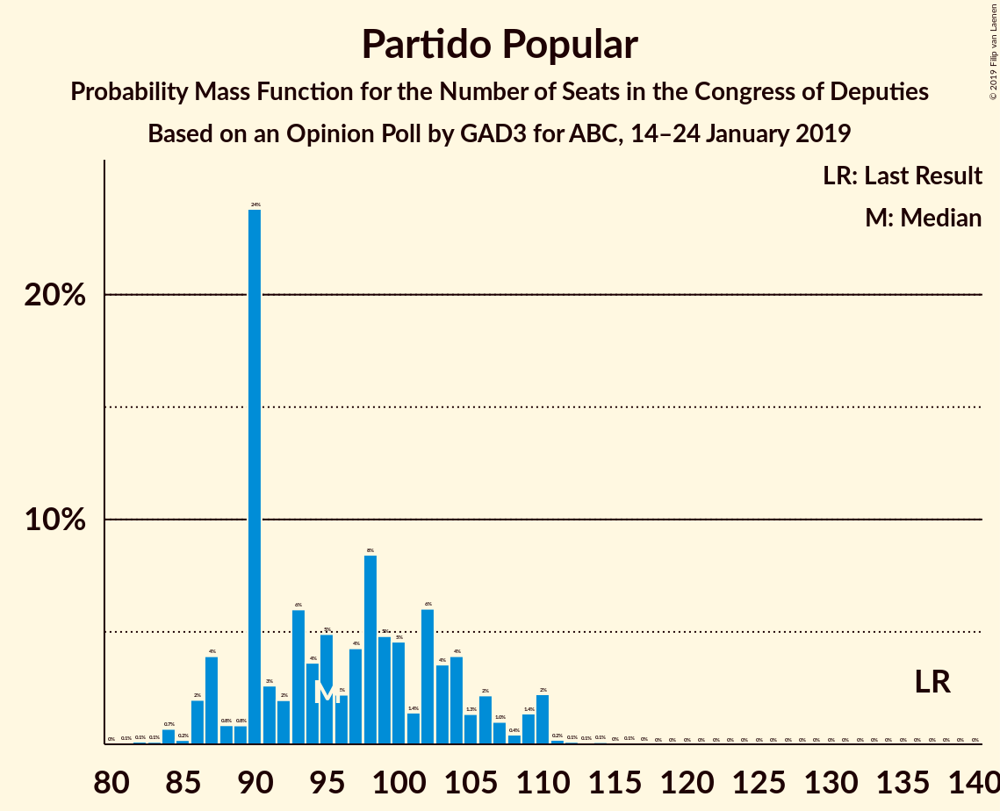
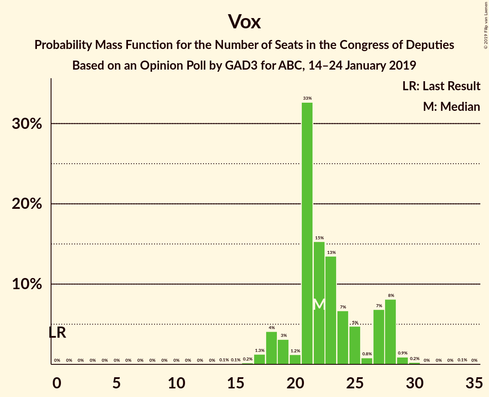
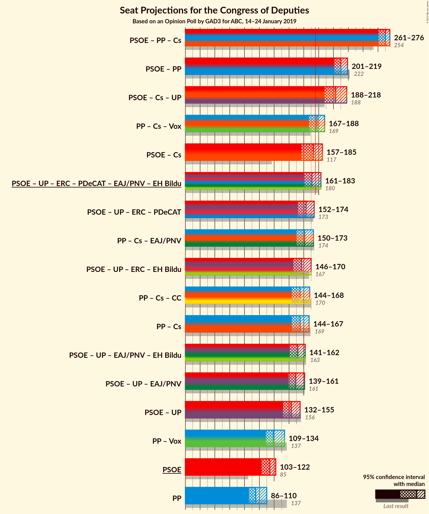
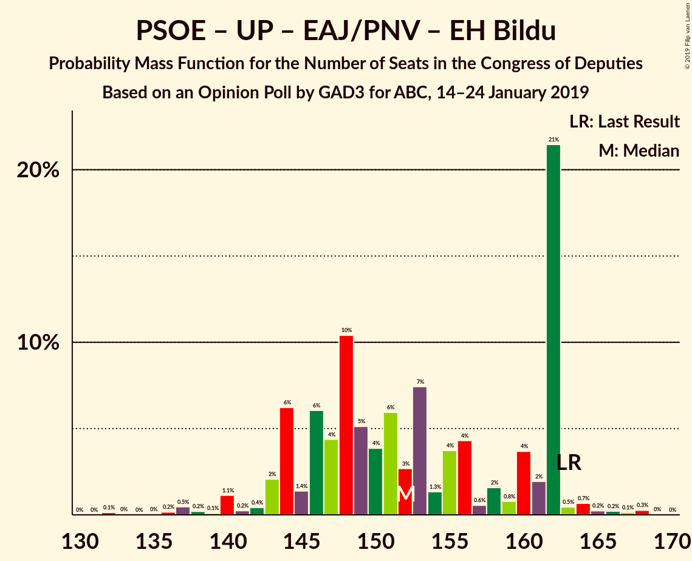

# Opinion Poll by GAD3 for ABC, 14–24 January 2019

<a href="#voting-intentions">Voting Intentions</a> | <a href="#seats">Seats</a> | <a href="#coalitions">Coalitions</a> | <a href="#technical-information">Technical Information</a>

## Voting Intentions

### Confidence Intervals

| Party | Last Result | Poll Result | 80% Confidence Interval | 90% Confidence Interval | 95% Confidence Interval | 99% Confidence Interval |
|:-----:|:-----------:|:-----------:|:-----------------------:|:-----------------------:|:-----------------------:|:-----------------------:|
| Partido Socialista Obrero Español | 22.6% | 26.5% | 25.2–27.9% |24.8–28.3% |24.5–28.6% |23.9–29.3% |
| Partido Popular | 33.0% | 23.0% | 21.8–24.3% |21.4–24.7% |21.1–25.0% |20.5–25.7% |
| Ciudadanos–Partido de la Ciudadanía | 13.1% | 17.1% | 16.0–18.3% |15.7–18.6% |15.4–18.9% |14.9–19.5% |
| Unidos Podemos | 21.2% | 11.6% | 10.7–12.6% |10.4–12.9% |10.2–13.2% |9.8–13.7% |
| Vox | 0.2% | 9.8% | 8.9–10.7% |8.7–11.0% |8.5–11.2% |8.1–11.7% |
| Esquerra Republicana de Catalunya–Catalunya Sí | 2.7% | 2.8% | 2.3–3.4% |2.2–3.5% |2.1–3.7% |1.9–3.9% |
| Partit Demòcrata Europeu Català | 2.0% | 1.6% | 1.3–2.1% |1.2–2.2% |1.1–2.3% |1.0–2.5% |
| Euzko Alderdi Jeltzalea/Partido Nacionalista Vasco | 1.2% | 1.2% | 0.9–1.6% |0.9–1.8% |0.8–1.8% |0.7–2.1% |
| Euskal Herria Bildu | 0.8% | 0.6% | 0.4–0.9% |0.4–1.0% |0.3–1.1% |0.3–1.3% |
| Coalición Canaria–Partido Nacionalista Canario | 0.3% | 0.2% | 0.1–0.5% |0.1–0.5% |0.1–0.6% |0.0–0.7% |

*Note:* The poll result column reflects the actual value used in the calculations. Published results may vary slightly, and in addition be rounded to fewer digits.

## Seats

### Confidence Intervals

| Party | Last Result | Median | 80% Confidence Interval | 90% Confidence Interval | 95% Confidence Interval | 99% Confidence Interval |
|:-----:|:-----------:|:------:|:-----------------------:|:-----------------------:|:-----------------------:|:-----------------------:|
| <a href="#partido-socialista-obrero-español">Partido Socialista Obrero Español</a> | 85 | 120 | 101–127 |101–127 |101–127 |101–127 |
| <a href="#partido-popular">Partido Popular</a> | 137 | 80 | 80–93 |80–97 |80–97 |80–97 |
| <a href="#ciudadanos–partido-de-la-ciudadanía">Ciudadanos–Partido de la Ciudadanía</a> | 32 | 61 | 52–70 |52–70 |52–70 |52–70 |
| <a href="#unidos-podemos">Unidos Podemos</a> | 71 | 30 | 29–30 |29–31 |29–31 |26–31 |
| <a href="#vox">Vox</a> | 0 | 26 | 20–27 |20–27 |20–27 |20–27 |
| <a href="#esquerra-republicana-de-catalunya–catalunya-sí">Esquerra Republicana de Catalunya–Catalunya Sí</a> | 9 | 14 | 13–15 |13–16 |13–16 |9–16 |
| <a href="#partit-demòcrata-europeu-català">Partit Demòcrata Europeu Català</a> | 8 | 0 | 0 |0 |0 |0 |
| <a href="#euzko-alderdi-jeltzalea/partido-nacionalista-vasco">Euzko Alderdi Jeltzalea/Partido Nacionalista Vasco</a> | 5 | 6 | 6–7 |6–7 |6–7 |6–7 |
| <a href="#euskal-herria-bildu">Euskal Herria Bildu</a> | 2 | 3 | 0–4 |0–4 |0–4 |0–4 |
| <a href="#coalición-canaria–partido-nacionalista-canario">Coalición Canaria–Partido Nacionalista Canario</a> | 1 | 2 | 1–2 |0–2 |0–2 |0–2 |

### Partido Socialista Obrero Español

*For a full overview of the results for this party, see the [Partido Socialista Obrero Español](party-partidosocialistaobreroespañol.html) page.*

| Number of Seats | Probability | Accumulated | Special Marks |
|:---------------:|:-----------:|:-----------:|:-------------:|
| 85 | 0% | 100% | Last Result |
| 86 | 0% | 100% |  |
| 87 | 0% | 100% |  |
| 88 | 0% | 100% |  |
| 89 | 0% | 100% |  |
| 90 | 0% | 100% |  |
| 91 | 0% | 100% |  |
| 92 | 0% | 100% |  |
| 93 | 0% | 100% |  |
| 94 | 0% | 100% |  |
| 95 | 0% | 100% |  |
| 96 | 0% | 100% |  |
| 97 | 0% | 100% |  |
| 98 | 0% | 100% |  |
| 99 | 0% | 100% |  |
| 100 | 0% | 100% |  |
| 101 | 14% | 100% |  |
| 102 | 0% | 86% |  |
| 103 | 0% | 86% |  |
| 104 | 0% | 86% |  |
| 105 | 0% | 86% |  |
| 106 | 0.2% | 86% |  |
| 107 | 0% | 86% |  |
| 108 | 0% | 86% |  |
| 109 | 0% | 86% |  |
| 110 | 0% | 86% |  |
| 111 | 6% | 86% |  |
| 112 | 0% | 80% |  |
| 113 | 0% | 80% |  |
| 114 | 0.2% | 80% |  |
| 115 | 0% | 80% |  |
| 116 | 0% | 80% |  |
| 117 | 0.3% | 80% |  |
| 118 | 0% | 80% |  |
| 119 | 7% | 80% |  |
| 120 | 55% | 73% | Median |
| 121 | 0% | 17% |  |
| 122 | 0.3% | 17% |  |
| 123 | 0% | 17% |  |
| 124 | 0% | 17% |  |
| 125 | 0% | 17% |  |
| 126 | 0% | 17% |  |
| 127 | 17% | 17% |  |
| 128 | 0% | 0.1% |  |
| 129 | 0% | 0.1% |  |
| 130 | 0% | 0.1% |  |
| 131 | 0% | 0.1% |  |
| 132 | 0.1% | 0.1% |  |
| 133 | 0% | 0% |  |

### Partido Popular

*For a full overview of the results for this party, see the [Partido Popular](party-partidopopular.html) page.*

| Number of Seats | Probability | Accumulated | Special Marks |
|:---------------:|:-----------:|:-----------:|:-------------:|
| 80 | 55% | 100% | Median |
| 81 | 0% | 45% |  |
| 82 | 0% | 45% |  |
| 83 | 0% | 45% |  |
| 84 | 0% | 45% |  |
| 85 | 7% | 45% |  |
| 86 | 0% | 38% |  |
| 87 | 0.1% | 38% |  |
| 88 | 0% | 38% |  |
| 89 | 0% | 38% |  |
| 90 | 0.3% | 38% |  |
| 91 | 14% | 37% |  |
| 92 | 0% | 23% |  |
| 93 | 17% | 23% |  |
| 94 | 0% | 6% |  |
| 95 | 0.4% | 6% |  |
| 96 | 0% | 6% |  |
| 97 | 6% | 6% |  |
| 98 | 0.3% | 0.4% |  |
| 99 | 0% | 0.1% |  |
| 100 | 0% | 0.1% |  |
| 101 | 0% | 0.1% |  |
| 102 | 0% | 0.1% |  |
| 103 | 0% | 0.1% |  |
| 104 | 0% | 0.1% |  |
| 105 | 0% | 0.1% |  |
| 106 | 0% | 0.1% |  |
| 107 | 0% | 0.1% |  |
| 108 | 0% | 0.1% |  |
| 109 | 0% | 0.1% |  |
| 110 | 0% | 0.1% |  |
| 111 | 0% | 0.1% |  |
| 112 | 0% | 0.1% |  |
| 113 | 0% | 0% |  |
| 114 | 0% | 0% |  |
| 115 | 0% | 0% |  |
| 116 | 0% | 0% |  |
| 117 | 0% | 0% |  |
| 118 | 0% | 0% |  |
| 119 | 0% | 0% |  |
| 120 | 0% | 0% |  |
| 121 | 0% | 0% |  |
| 122 | 0% | 0% |  |
| 123 | 0% | 0% |  |
| 124 | 0% | 0% |  |
| 125 | 0% | 0% |  |
| 126 | 0% | 0% |  |
| 127 | 0% | 0% |  |
| 128 | 0% | 0% |  |
| 129 | 0% | 0% |  |
| 130 | 0% | 0% |  |
| 131 | 0% | 0% |  |
| 132 | 0% | 0% |  |
| 133 | 0% | 0% |  |
| 134 | 0% | 0% |  |
| 135 | 0% | 0% |  |
| 136 | 0% | 0% |  |
| 137 | 0% | 0% | Last Result |

### Ciudadanos–Partido de la Ciudadanía

*For a full overview of the results for this party, see the [Ciudadanos–Partido de la Ciudadanía](party-ciudadanos–partidodelaciudadanía.html) page.*

| Number of Seats | Probability | Accumulated | Special Marks |
|:---------------:|:-----------:|:-----------:|:-------------:|
| 32 | 0% | 100% | Last Result |
| 33 | 0% | 100% |  |
| 34 | 0% | 100% |  |
| 35 | 0% | 100% |  |
| 36 | 0% | 100% |  |
| 37 | 0% | 100% |  |
| 38 | 0% | 100% |  |
| 39 | 0% | 100% |  |
| 40 | 0% | 100% |  |
| 41 | 0% | 100% |  |
| 42 | 0% | 100% |  |
| 43 | 0% | 100% |  |
| 44 | 0% | 100% |  |
| 45 | 0% | 100% |  |
| 46 | 0% | 100% |  |
| 47 | 0% | 100% |  |
| 48 | 0% | 100% |  |
| 49 | 0% | 100% |  |
| 50 | 0.4% | 100% |  |
| 51 | 0% | 99.6% |  |
| 52 | 17% | 99.6% |  |
| 53 | 0% | 82% |  |
| 54 | 0% | 82% |  |
| 55 | 0% | 82% |  |
| 56 | 0% | 82% |  |
| 57 | 0% | 82% |  |
| 58 | 0% | 82% |  |
| 59 | 13% | 82% |  |
| 60 | 0.2% | 70% |  |
| 61 | 55% | 70% | Median |
| 62 | 0.3% | 14% |  |
| 63 | 0% | 14% |  |
| 64 | 0.1% | 14% |  |
| 65 | 0% | 14% |  |
| 66 | 0.1% | 14% |  |
| 67 | 0% | 14% |  |
| 68 | 0% | 14% |  |
| 69 | 0% | 14% |  |
| 70 | 14% | 14% |  |
| 71 | 0% | 0% |  |

### Unidos Podemos

*For a full overview of the results for this party, see the [Unidos Podemos](party-unidospodemos.html) page.*

| Number of Seats | Probability | Accumulated | Special Marks |
|:---------------:|:-----------:|:-----------:|:-------------:|
| 23 | 0.1% | 100% |  |
| 24 | 0% | 99.9% |  |
| 25 | 0.1% | 99.9% |  |
| 26 | 0.4% | 99.9% |  |
| 27 | 0.1% | 99.5% |  |
| 28 | 0% | 99.4% |  |
| 29 | 31% | 99.4% |  |
| 30 | 61% | 68% | Median |
| 31 | 7% | 7% |  |
| 32 | 0% | 0.1% |  |
| 33 | 0% | 0.1% |  |
| 34 | 0% | 0.1% |  |
| 35 | 0% | 0.1% |  |
| 36 | 0% | 0.1% |  |
| 37 | 0% | 0.1% |  |
| 38 | 0% | 0.1% |  |
| 39 | 0% | 0.1% |  |
| 40 | 0% | 0.1% |  |
| 41 | 0% | 0.1% |  |
| 42 | 0% | 0.1% |  |
| 43 | 0% | 0.1% |  |
| 44 | 0.1% | 0.1% |  |
| 45 | 0% | 0% |  |
| 46 | 0% | 0% |  |
| 47 | 0% | 0% |  |
| 48 | 0% | 0% |  |
| 49 | 0% | 0% |  |
| 50 | 0% | 0% |  |
| 51 | 0% | 0% |  |
| 52 | 0% | 0% |  |
| 53 | 0% | 0% |  |
| 54 | 0% | 0% |  |
| 55 | 0% | 0% |  |
| 56 | 0% | 0% |  |
| 57 | 0% | 0% |  |
| 58 | 0% | 0% |  |
| 59 | 0% | 0% |  |
| 60 | 0% | 0% |  |
| 61 | 0% | 0% |  |
| 62 | 0% | 0% |  |
| 63 | 0% | 0% |  |
| 64 | 0% | 0% |  |
| 65 | 0% | 0% |  |
| 66 | 0% | 0% |  |
| 67 | 0% | 0% |  |
| 68 | 0% | 0% |  |
| 69 | 0% | 0% |  |
| 70 | 0% | 0% |  |
| 71 | 0% | 0% | Last Result |

### Vox

*For a full overview of the results for this party, see the [Vox](party-vox.html) page.*

| Number of Seats | Probability | Accumulated | Special Marks |
|:---------------:|:-----------:|:-----------:|:-------------:|
| 0 | 0% | 100% | Last Result |
| 1 | 0% | 100% |  |
| 2 | 0% | 100% |  |
| 3 | 0% | 100% |  |
| 4 | 0% | 100% |  |
| 5 | 0% | 100% |  |
| 6 | 0% | 100% |  |
| 7 | 0% | 100% |  |
| 8 | 0% | 100% |  |
| 9 | 0% | 100% |  |
| 10 | 0% | 100% |  |
| 11 | 0% | 100% |  |
| 12 | 0% | 100% |  |
| 13 | 0% | 100% |  |
| 14 | 0% | 100% |  |
| 15 | 0% | 100% |  |
| 16 | 0% | 100% |  |
| 17 | 0% | 100% |  |
| 18 | 0% | 99.9% |  |
| 19 | 0.3% | 99.9% |  |
| 20 | 17% | 99.7% |  |
| 21 | 13% | 83% |  |
| 22 | 0% | 70% |  |
| 23 | 0% | 70% |  |
| 24 | 0.3% | 70% |  |
| 25 | 0.1% | 70% |  |
| 26 | 55% | 70% | Median |
| 27 | 14% | 14% |  |
| 28 | 0.3% | 0.4% |  |
| 29 | 0% | 0.1% |  |
| 30 | 0.1% | 0.1% |  |
| 31 | 0% | 0% |  |

### Esquerra Republicana de Catalunya–Catalunya Sí

*For a full overview of the results for this party, see the [Esquerra Republicana de Catalunya–Catalunya Sí](party-esquerrarepublicanadecatalunya–catalunyasí.html) page.*

| Number of Seats | Probability | Accumulated | Special Marks |
|:---------------:|:-----------:|:-----------:|:-------------:|
| 9 | 0.8% | 100% | Last Result |
| 10 | 0% | 99.2% |  |
| 11 | 0% | 99.2% |  |
| 12 | 0% | 99.1% |  |
| 13 | 31% | 99.1% |  |
| 14 | 55% | 68% | Median |
| 15 | 6% | 13% |  |
| 16 | 7% | 7% |  |
| 17 | 0% | 0% |  |

### Partit Demòcrata Europeu Català

*For a full overview of the results for this party, see the [Partit Demòcrata Europeu Català](party-partitdemòcrataeuropeucatalà.html) page.*

| Number of Seats | Probability | Accumulated | Special Marks |
|:---------------:|:-----------:|:-----------:|:-------------:|
| 0 | 100% | 100% | Median |
| 1 | 0% | 0% |  |
| 2 | 0% | 0% |  |
| 3 | 0% | 0% |  |
| 4 | 0% | 0% |  |
| 5 | 0% | 0% |  |
| 6 | 0% | 0% |  |
| 7 | 0% | 0% |  |
| 8 | 0% | 0% | Last Result |

### Euzko Alderdi Jeltzalea/Partido Nacionalista Vasco

*For a full overview of the results for this party, see the [Euzko Alderdi Jeltzalea/Partido Nacionalista Vasco](party-euzkoalderdijeltzaleapartidonacionalistavasco.html) page.*

| Number of Seats | Probability | Accumulated | Special Marks |
|:---------------:|:-----------:|:-----------:|:-------------:|
| 2 | 0.1% | 100% |  |
| 3 | 0% | 99.9% |  |
| 4 | 0% | 99.9% |  |
| 5 | 0% | 99.9% | Last Result |
| 6 | 77% | 99.9% | Median |
| 7 | 23% | 23% |  |
| 8 | 0% | 0% |  |

### Euskal Herria Bildu

*For a full overview of the results for this party, see the [Euskal Herria Bildu](party-euskalherriabildu.html) page.*

| Number of Seats | Probability | Accumulated | Special Marks |
|:---------------:|:-----------:|:-----------:|:-------------:|
| 0 | 17% | 100% |  |
| 1 | 0.6% | 83% |  |
| 2 | 6% | 82% | Last Result |
| 3 | 55% | 77% | Median |
| 4 | 21% | 21% |  |
| 5 | 0% | 0.1% |  |
| 6 | 0% | 0.1% |  |
| 7 | 0.1% | 0.1% |  |
| 8 | 0% | 0% |  |

### Coalición Canaria–Partido Nacionalista Canario

*For a full overview of the results for this party, see the [Coalición Canaria–Partido Nacionalista Canario](party-coalicióncanaria–partidonacionalistacanario.html) page.*

| Number of Seats | Probability | Accumulated | Special Marks |
|:---------------:|:-----------:|:-----------:|:-------------:|
| 0 | 6% | 100% |  |
| 1 | 38% | 94% | Last Result |
| 2 | 55% | 55% | Median |
| 3 | 0% | 0% |  |

## Coalitions

### Confidence Intervals

| Coalition | Last Result | Median | Majority? | 80% Confidence Interval | 90% Confidence Interval | 95% Confidence Interval | 99% Confidence Interval |
|:---------:|:-----------:|:------:|:---------:|:-----------------------:|:-----------------------:|:-----------------------:|:-----------------------:|
| Partido Popular – Ciudadanos–Partido de la Ciudadanía – Vox | 169 | 167 | 20% | 165–188 | 165–188 | 165–188 | 165–188 |
| Partido Socialista Obrero Español – Ciudadanos–Partido de la Ciudadanía | 117 | 181 | 80% | 171–181 | 170–181 | 170–181 | 170–181 |
| Partido Socialista Obrero Español – Unidos Podemos – Esquerra Republicana de Catalunya–Catalunya Sí – Partit Demòcrata Europeu Català – Euzko Alderdi Jeltzalea/Partido Nacionalista Vasco – Euskal Herria Bildu | 180 | 173 | 24% | 153–176 | 153–176 | 153–176 | 153–176 |
| Partido Socialista Obrero Español – Unidos Podemos – Esquerra Republicana de Catalunya–Catalunya Sí – Euskal Herria Bildu | 167 | 167 | 0.1% | 147–169 | 147–170 | 147–170 | 147–170 |
| Partido Socialista Obrero Español – Unidos Podemos – Esquerra Republicana de Catalunya–Catalunya Sí – Partit Demòcrata Europeu Català | 173 | 164 | 0% | 143–169 | 143–169 | 143–169 | 143–169 |
| Partido Socialista Obrero Español – Unidos Podemos – Euzko Alderdi Jeltzalea/Partido Nacionalista Vasco – Euskal Herria Bildu | 163 | 159 | 0% | 140–163 | 140–163 | 140–163 | 140–163 |
| Partido Popular – Ciudadanos–Partido de la Ciudadanía – Coalición Canaria–Partido Nacionalista Canario | 170 | 143 | 0% | 143–162 | 143–162 | 143–162 | 143–162 |
| Partido Popular – Ciudadanos–Partido de la Ciudadanía | 169 | 141 | 0% | 141–161 | 141–161 | 141–161 | 141–161 |
| Partido Socialista Obrero Español – Unidos Podemos | 156 | 150 | 0% | 130–156 | 130–156 | 130–156 | 130–156 |
| Partido Socialista Obrero Español | 85 | 120 | 0% | 101–127 | 101–127 | 101–127 | 101–127 |
| Partido Popular – Vox | 137 | 106 | 0% | 106–118 | 106–118 | 106–118 | 106–119 |
| Partido Popular | 137 | 80 | 0% | 80–93 | 80–97 | 80–97 | 80–97 |

### Partido Popular – Ciudadanos–Partido de la Ciudadanía – Vox

| Number of Seats | Probability | Accumulated | Special Marks |
|:---------------:|:-----------:|:-----------:|:-------------:|
| 158 | 0.1% | 100% |  |
| 159 | 0% | 99.9% |  |
| 160 | 0% | 99.9% |  |
| 161 | 0% | 99.9% |  |
| 162 | 0% | 99.9% |  |
| 163 | 0% | 99.9% |  |
| 164 | 0% | 99.9% |  |
| 165 | 24% | 99.9% |  |
| 166 | 0% | 76% |  |
| 167 | 55% | 76% | Median |
| 168 | 0% | 21% |  |
| 169 | 0.3% | 21% | Last Result |
| 170 | 0% | 20% |  |
| 171 | 0% | 20% |  |
| 172 | 0% | 20% |  |
| 173 | 0% | 20% |  |
| 174 | 0% | 20% |  |
| 175 | 0.1% | 20% |  |
| 176 | 0% | 20% | Majority |
| 177 | 6% | 20% |  |
| 178 | 0% | 14% |  |
| 179 | 0% | 14% |  |
| 180 | 0.3% | 14% |  |
| 181 | 0% | 14% |  |
| 182 | 0% | 14% |  |
| 183 | 0% | 14% |  |
| 184 | 0% | 14% |  |
| 185 | 0% | 14% |  |
| 186 | 0% | 14% |  |
| 187 | 0% | 14% |  |
| 188 | 14% | 14% |  |
| 189 | 0.1% | 0.1% |  |
| 190 | 0% | 0% |  |

### Partido Socialista Obrero Español – Ciudadanos–Partido de la Ciudadanía

| Number of Seats | Probability | Accumulated | Special Marks |
|:---------------:|:-----------:|:-----------:|:-------------:|
| 117 | 0% | 100% | Last Result |
| 118 | 0% | 100% |  |
| 119 | 0% | 100% |  |
| 120 | 0% | 100% |  |
| 121 | 0% | 100% |  |
| 122 | 0% | 100% |  |
| 123 | 0% | 100% |  |
| 124 | 0% | 100% |  |
| 125 | 0% | 100% |  |
| 126 | 0% | 100% |  |
| 127 | 0% | 100% |  |
| 128 | 0% | 100% |  |
| 129 | 0% | 100% |  |
| 130 | 0% | 100% |  |
| 131 | 0% | 100% |  |
| 132 | 0% | 100% |  |
| 133 | 0% | 100% |  |
| 134 | 0% | 100% |  |
| 135 | 0% | 100% |  |
| 136 | 0% | 100% |  |
| 137 | 0% | 100% |  |
| 138 | 0% | 100% |  |
| 139 | 0% | 100% |  |
| 140 | 0% | 100% |  |
| 141 | 0% | 100% |  |
| 142 | 0% | 100% |  |
| 143 | 0% | 100% |  |
| 144 | 0% | 100% |  |
| 145 | 0% | 100% |  |
| 146 | 0% | 100% |  |
| 147 | 0% | 100% |  |
| 148 | 0% | 100% |  |
| 149 | 0% | 100% |  |
| 150 | 0% | 100% |  |
| 151 | 0% | 100% |  |
| 152 | 0% | 100% |  |
| 153 | 0% | 100% |  |
| 154 | 0% | 100% |  |
| 155 | 0% | 100% |  |
| 156 | 0.1% | 100% |  |
| 157 | 0% | 99.9% |  |
| 158 | 0% | 99.9% |  |
| 159 | 0% | 99.9% |  |
| 160 | 0% | 99.9% |  |
| 161 | 0% | 99.9% |  |
| 162 | 0% | 99.9% |  |
| 163 | 0% | 99.9% |  |
| 164 | 0% | 99.9% |  |
| 165 | 0% | 99.9% |  |
| 166 | 0% | 99.9% |  |
| 167 | 0% | 99.9% |  |
| 168 | 0% | 99.9% |  |
| 169 | 0% | 99.9% |  |
| 170 | 6% | 99.9% |  |
| 171 | 14% | 94% |  |
| 172 | 0.4% | 80% |  |
| 173 | 0% | 80% |  |
| 174 | 0.2% | 80% |  |
| 175 | 0% | 80% |  |
| 176 | 0% | 80% | Majority |
| 177 | 0% | 80% |  |
| 178 | 7% | 80% |  |
| 179 | 17% | 73% |  |
| 180 | 0% | 55% |  |
| 181 | 55% | 55% | Median |
| 182 | 0% | 0.1% |  |
| 183 | 0% | 0.1% |  |
| 184 | 0.1% | 0.1% |  |
| 185 | 0% | 0% |  |

### Partido Socialista Obrero Español – Unidos Podemos – Esquerra Republicana de Catalunya–Catalunya Sí – Partit Demòcrata Europeu Català – Euzko Alderdi Jeltzalea/Partido Nacionalista Vasco – Euskal Herria Bildu

| Number of Seats | Probability | Accumulated | Special Marks |
|:---------------:|:-----------:|:-----------:|:-------------:|
| 150 | 0.1% | 100% |  |
| 151 | 0% | 99.9% |  |
| 152 | 0% | 99.9% |  |
| 153 | 14% | 99.9% |  |
| 154 | 0% | 86% |  |
| 155 | 0% | 86% |  |
| 156 | 0% | 86% |  |
| 157 | 0% | 86% |  |
| 158 | 0% | 86% |  |
| 159 | 0.3% | 86% |  |
| 160 | 0% | 86% |  |
| 161 | 0% | 86% |  |
| 162 | 0% | 86% |  |
| 163 | 0.1% | 86% |  |
| 164 | 0% | 86% |  |
| 165 | 6% | 86% |  |
| 166 | 0.1% | 80% |  |
| 167 | 0% | 80% |  |
| 168 | 0% | 80% |  |
| 169 | 0% | 80% |  |
| 170 | 0% | 80% |  |
| 171 | 0.3% | 80% |  |
| 172 | 0% | 79% |  |
| 173 | 55% | 79% | Median |
| 174 | 0% | 24% |  |
| 175 | 0% | 24% |  |
| 176 | 24% | 24% | Majority |
| 177 | 0% | 0.1% |  |
| 178 | 0% | 0.1% |  |
| 179 | 0% | 0.1% |  |
| 180 | 0% | 0.1% | Last Result |
| 181 | 0% | 0.1% |  |
| 182 | 0.1% | 0.1% |  |
| 183 | 0% | 0% |  |

### Partido Socialista Obrero Español – Unidos Podemos – Esquerra Republicana de Catalunya–Catalunya Sí – Euskal Herria Bildu

| Number of Seats | Probability | Accumulated | Special Marks |
|:---------------:|:-----------:|:-----------:|:-------------:|
| 146 | 0% | 100% |  |
| 147 | 14% | 99.9% |  |
| 148 | 0.1% | 86% |  |
| 149 | 0% | 86% |  |
| 150 | 0% | 86% |  |
| 151 | 0% | 86% |  |
| 152 | 0% | 86% |  |
| 153 | 0.3% | 86% |  |
| 154 | 0% | 86% |  |
| 155 | 0% | 86% |  |
| 156 | 0% | 86% |  |
| 157 | 0.1% | 86% |  |
| 158 | 6% | 86% |  |
| 159 | 0.2% | 80% |  |
| 160 | 0.1% | 80% |  |
| 161 | 0% | 80% |  |
| 162 | 0% | 80% |  |
| 163 | 0% | 80% |  |
| 164 | 0.3% | 80% |  |
| 165 | 0% | 79% |  |
| 166 | 0% | 79% |  |
| 167 | 55% | 79% | Last Result, Median |
| 168 | 0% | 24% |  |
| 169 | 17% | 24% |  |
| 170 | 7% | 7% |  |
| 171 | 0% | 0.1% |  |
| 172 | 0% | 0.1% |  |
| 173 | 0% | 0.1% |  |
| 174 | 0% | 0.1% |  |
| 175 | 0% | 0.1% |  |
| 176 | 0.1% | 0.1% | Majority |
| 177 | 0% | 0% |  |

### Partido Socialista Obrero Español – Unidos Podemos – Esquerra Republicana de Catalunya–Catalunya Sí – Partit Demòcrata Europeu Català

| Number of Seats | Probability | Accumulated | Special Marks |
|:---------------:|:-----------:|:-----------:|:-------------:|
| 141 | 0.1% | 100% |  |
| 142 | 0% | 99.9% |  |
| 143 | 14% | 99.9% |  |
| 144 | 0% | 86% |  |
| 145 | 0% | 86% |  |
| 146 | 0% | 86% |  |
| 147 | 0% | 86% |  |
| 148 | 0% | 86% |  |
| 149 | 0% | 86% |  |
| 150 | 0% | 86% |  |
| 151 | 0% | 86% |  |
| 152 | 0.3% | 86% |  |
| 153 | 0.1% | 86% |  |
| 154 | 0% | 86% |  |
| 155 | 0% | 86% |  |
| 156 | 6% | 86% |  |
| 157 | 0% | 80% |  |
| 158 | 0.2% | 80% |  |
| 159 | 0.1% | 80% |  |
| 160 | 0.3% | 80% |  |
| 161 | 0% | 79% |  |
| 162 | 0% | 79% |  |
| 163 | 0% | 79% |  |
| 164 | 55% | 79% | Median |
| 165 | 0% | 24% |  |
| 166 | 7% | 24% |  |
| 167 | 0% | 17% |  |
| 168 | 0% | 17% |  |
| 169 | 17% | 17% |  |
| 170 | 0% | 0.1% |  |
| 171 | 0% | 0.1% |  |
| 172 | 0% | 0.1% |  |
| 173 | 0% | 0.1% | Last Result |
| 174 | 0.1% | 0.1% |  |
| 175 | 0% | 0% |  |

### Partido Socialista Obrero Español – Unidos Podemos – Euzko Alderdi Jeltzalea/Partido Nacionalista Vasco – Euskal Herria Bildu

| Number of Seats | Probability | Accumulated | Special Marks |
|:---------------:|:-----------:|:-----------:|:-------------:|
| 138 | 0% | 100% |  |
| 139 | 0% | 99.9% |  |
| 140 | 14% | 99.9% |  |
| 141 | 0.1% | 86% |  |
| 142 | 0% | 86% |  |
| 143 | 0% | 86% |  |
| 144 | 0% | 86% |  |
| 145 | 0% | 86% |  |
| 146 | 0% | 86% |  |
| 147 | 0% | 86% |  |
| 148 | 0% | 86% |  |
| 149 | 0% | 86% |  |
| 150 | 6% | 86% |  |
| 151 | 0.2% | 80% |  |
| 152 | 0% | 80% |  |
| 153 | 0% | 80% |  |
| 154 | 0% | 80% |  |
| 155 | 0% | 80% |  |
| 156 | 0% | 80% |  |
| 157 | 0.1% | 80% |  |
| 158 | 0% | 80% |  |
| 159 | 55% | 80% | Median |
| 160 | 7% | 25% |  |
| 161 | 0% | 18% |  |
| 162 | 0.3% | 18% |  |
| 163 | 17% | 17% | Last Result |
| 164 | 0% | 0.1% |  |
| 165 | 0% | 0.1% |  |
| 166 | 0% | 0.1% |  |
| 167 | 0.1% | 0.1% |  |
| 168 | 0% | 0% |  |

### Partido Popular – Ciudadanos–Partido de la Ciudadanía – Coalición Canaria–Partido Nacionalista Canario

| Number of Seats | Probability | Accumulated | Special Marks |
|:---------------:|:-----------:|:-----------:|:-------------:|
| 141 | 0.1% | 100% |  |
| 142 | 0% | 99.9% |  |
| 143 | 55% | 99.9% | Median |
| 144 | 0% | 45% |  |
| 145 | 7% | 45% |  |
| 146 | 17% | 37% |  |
| 147 | 0% | 20% |  |
| 148 | 0% | 20% |  |
| 149 | 0% | 20% |  |
| 150 | 0% | 20% |  |
| 151 | 0.1% | 20% |  |
| 152 | 0% | 20% |  |
| 153 | 0.3% | 20% |  |
| 154 | 0% | 20% |  |
| 155 | 0% | 20% |  |
| 156 | 6% | 20% |  |
| 157 | 0% | 14% |  |
| 158 | 0.2% | 14% |  |
| 159 | 0% | 14% |  |
| 160 | 0% | 14% |  |
| 161 | 0% | 14% |  |
| 162 | 14% | 14% |  |
| 163 | 0% | 0.1% |  |
| 164 | 0% | 0.1% |  |
| 165 | 0.1% | 0.1% |  |
| 166 | 0% | 0% |  |
| 167 | 0% | 0% |  |
| 168 | 0% | 0% |  |
| 169 | 0% | 0% |  |
| 170 | 0% | 0% | Last Result |

### Partido Popular – Ciudadanos–Partido de la Ciudadanía

| Number of Seats | Probability | Accumulated | Special Marks |
|:---------------:|:-----------:|:-----------:|:-------------:|
| 139 | 0.1% | 100% |  |
| 140 | 0% | 99.9% |  |
| 141 | 55% | 99.9% | Median |
| 142 | 0% | 45% |  |
| 143 | 0% | 45% |  |
| 144 | 7% | 45% |  |
| 145 | 17% | 38% |  |
| 146 | 0% | 20% |  |
| 147 | 0% | 20% |  |
| 148 | 0% | 20% |  |
| 149 | 0.1% | 20% |  |
| 150 | 0% | 20% |  |
| 151 | 0% | 20% |  |
| 152 | 0.3% | 20% |  |
| 153 | 0% | 20% |  |
| 154 | 0% | 20% |  |
| 155 | 0% | 20% |  |
| 156 | 6% | 20% |  |
| 157 | 0% | 14% |  |
| 158 | 0.2% | 14% |  |
| 159 | 0% | 14% |  |
| 160 | 0% | 14% |  |
| 161 | 14% | 14% |  |
| 162 | 0% | 0.1% |  |
| 163 | 0% | 0.1% |  |
| 164 | 0.1% | 0.1% |  |
| 165 | 0% | 0% |  |
| 166 | 0% | 0% |  |
| 167 | 0% | 0% |  |
| 168 | 0% | 0% |  |
| 169 | 0% | 0% | Last Result |

### Partido Socialista Obrero Español – Unidos Podemos

| Number of Seats | Probability | Accumulated | Special Marks |
|:---------------:|:-----------:|:-----------:|:-------------:|
| 127 | 0% | 100% |  |
| 128 | 0% | 99.9% |  |
| 129 | 0% | 99.9% |  |
| 130 | 14% | 99.9% |  |
| 131 | 0% | 86% |  |
| 132 | 0.1% | 86% |  |
| 133 | 0% | 86% |  |
| 134 | 0% | 86% |  |
| 135 | 0% | 86% |  |
| 136 | 0% | 86% |  |
| 137 | 0% | 86% |  |
| 138 | 0% | 86% |  |
| 139 | 0% | 86% |  |
| 140 | 0.1% | 86% |  |
| 141 | 6% | 86% |  |
| 142 | 0% | 80% |  |
| 143 | 0.3% | 80% |  |
| 144 | 0.2% | 80% |  |
| 145 | 0% | 80% |  |
| 146 | 0% | 80% |  |
| 147 | 0% | 80% |  |
| 148 | 0% | 80% |  |
| 149 | 0% | 80% |  |
| 150 | 62% | 80% | Median |
| 151 | 0.3% | 18% |  |
| 152 | 0% | 17% |  |
| 153 | 0% | 17% |  |
| 154 | 0% | 17% |  |
| 155 | 0% | 17% |  |
| 156 | 17% | 17% | Last Result |
| 157 | 0% | 0.1% |  |
| 158 | 0% | 0.1% |  |
| 159 | 0.1% | 0.1% |  |
| 160 | 0% | 0% |  |

### Partido Socialista Obrero Español

| Number of Seats | Probability | Accumulated | Special Marks |
|:---------------:|:-----------:|:-----------:|:-------------:|
| 85 | 0% | 100% | Last Result |
| 86 | 0% | 100% |  |
| 87 | 0% | 100% |  |
| 88 | 0% | 100% |  |
| 89 | 0% | 100% |  |
| 90 | 0% | 100% |  |
| 91 | 0% | 100% |  |
| 92 | 0% | 100% |  |
| 93 | 0% | 100% |  |
| 94 | 0% | 100% |  |
| 95 | 0% | 100% |  |
| 96 | 0% | 100% |  |
| 97 | 0% | 100% |  |
| 98 | 0% | 100% |  |
| 99 | 0% | 100% |  |
| 100 | 0% | 100% |  |
| 101 | 14% | 100% |  |
| 102 | 0% | 86% |  |
| 103 | 0% | 86% |  |
| 104 | 0% | 86% |  |
| 105 | 0% | 86% |  |
| 106 | 0.2% | 86% |  |
| 107 | 0% | 86% |  |
| 108 | 0% | 86% |  |
| 109 | 0% | 86% |  |
| 110 | 0% | 86% |  |
| 111 | 6% | 86% |  |
| 112 | 0% | 80% |  |
| 113 | 0% | 80% |  |
| 114 | 0.2% | 80% |  |
| 115 | 0% | 80% |  |
| 116 | 0% | 80% |  |
| 117 | 0.3% | 80% |  |
| 118 | 0% | 80% |  |
| 119 | 7% | 80% |  |
| 120 | 55% | 73% | Median |
| 121 | 0% | 17% |  |
| 122 | 0.3% | 17% |  |
| 123 | 0% | 17% |  |
| 124 | 0% | 17% |  |
| 125 | 0% | 17% |  |
| 126 | 0% | 17% |  |
| 127 | 17% | 17% |  |
| 128 | 0% | 0.1% |  |
| 129 | 0% | 0.1% |  |
| 130 | 0% | 0.1% |  |
| 131 | 0% | 0.1% |  |
| 132 | 0.1% | 0.1% |  |
| 133 | 0% | 0% |  |

### Partido Popular – Vox

| Number of Seats | Probability | Accumulated | Special Marks |
|:---------------:|:-----------:|:-----------:|:-------------:|
| 106 | 62% | 100% | Median |
| 107 | 0% | 38% |  |
| 108 | 0% | 38% |  |
| 109 | 0% | 38% |  |
| 110 | 0% | 38% |  |
| 111 | 0% | 38% |  |
| 112 | 0% | 38% |  |
| 113 | 17% | 38% |  |
| 114 | 0% | 20% |  |
| 115 | 0% | 20% |  |
| 116 | 0% | 20% |  |
| 117 | 0.2% | 20% |  |
| 118 | 20% | 20% |  |
| 119 | 0.3% | 0.6% |  |
| 120 | 0% | 0.3% |  |
| 121 | 0% | 0.3% |  |
| 122 | 0% | 0.2% |  |
| 123 | 0.1% | 0.2% |  |
| 124 | 0% | 0.1% |  |
| 125 | 0.1% | 0.1% |  |
| 126 | 0% | 0.1% |  |
| 127 | 0% | 0.1% |  |
| 128 | 0% | 0.1% |  |
| 129 | 0% | 0.1% |  |
| 130 | 0% | 0% |  |
| 131 | 0% | 0% |  |
| 132 | 0% | 0% |  |
| 133 | 0% | 0% |  |
| 134 | 0% | 0% |  |
| 135 | 0% | 0% |  |
| 136 | 0% | 0% |  |
| 137 | 0% | 0% | Last Result |

### Partido Popular

| Number of Seats | Probability | Accumulated | Special Marks |
|:---------------:|:-----------:|:-----------:|:-------------:|
| 80 | 55% | 100% | Median |
| 81 | 0% | 45% |  |
| 82 | 0% | 45% |  |
| 83 | 0% | 45% |  |
| 84 | 0% | 45% |  |
| 85 | 7% | 45% |  |
| 86 | 0% | 38% |  |
| 87 | 0.1% | 38% |  |
| 88 | 0% | 38% |  |
| 89 | 0% | 38% |  |
| 90 | 0.3% | 38% |  |
| 91 | 14% | 37% |  |
| 92 | 0% | 23% |  |
| 93 | 17% | 23% |  |
| 94 | 0% | 6% |  |
| 95 | 0.4% | 6% |  |
| 96 | 0% | 6% |  |
| 97 | 6% | 6% |  |
| 98 | 0.3% | 0.4% |  |
| 99 | 0% | 0.1% |  |
| 100 | 0% | 0.1% |  |
| 101 | 0% | 0.1% |  |
| 102 | 0% | 0.1% |  |
| 103 | 0% | 0.1% |  |
| 104 | 0% | 0.1% |  |
| 105 | 0% | 0.1% |  |
| 106 | 0% | 0.1% |  |
| 107 | 0% | 0.1% |  |
| 108 | 0% | 0.1% |  |
| 109 | 0% | 0.1% |  |
| 110 | 0% | 0.1% |  |
| 111 | 0% | 0.1% |  |
| 112 | 0% | 0.1% |  |
| 113 | 0% | 0% |  |
| 114 | 0% | 0% |  |
| 115 | 0% | 0% |  |
| 116 | 0% | 0% |  |
| 117 | 0% | 0% |  |
| 118 | 0% | 0% |  |
| 119 | 0% | 0% |  |
| 120 | 0% | 0% |  |
| 121 | 0% | 0% |  |
| 122 | 0% | 0% |  |
| 123 | 0% | 0% |  |
| 124 | 0% | 0% |  |
| 125 | 0% | 0% |  |
| 126 | 0% | 0% |  |
| 127 | 0% | 0% |  |
| 128 | 0% | 0% |  |
| 129 | 0% | 0% |  |
| 130 | 0% | 0% |  |
| 131 | 0% | 0% |  |
| 132 | 0% | 0% |  |
| 133 | 0% | 0% |  |
| 134 | 0% | 0% |  |
| 135 | 0% | 0% |  |
| 136 | 0% | 0% |  |
| 137 | 0% | 0% | Last Result |

## Technical Information

### Opinion Poll

+ **Polling firm:** GAD3
+ **Commissioner(s):** ABC
+ **Fieldwork period:** 14–24 January 2019

### Calculations

+ **Sample size:** 1800
+ **Simulations done:** 1,024
+ **Error estimate:** 3.52%

