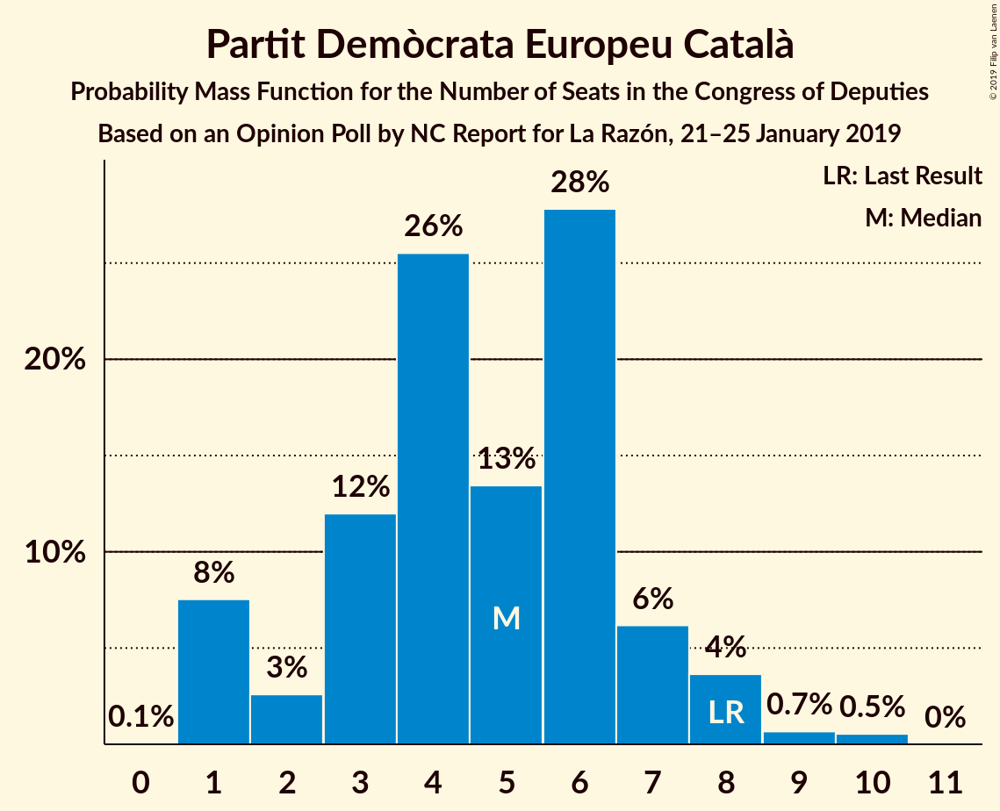
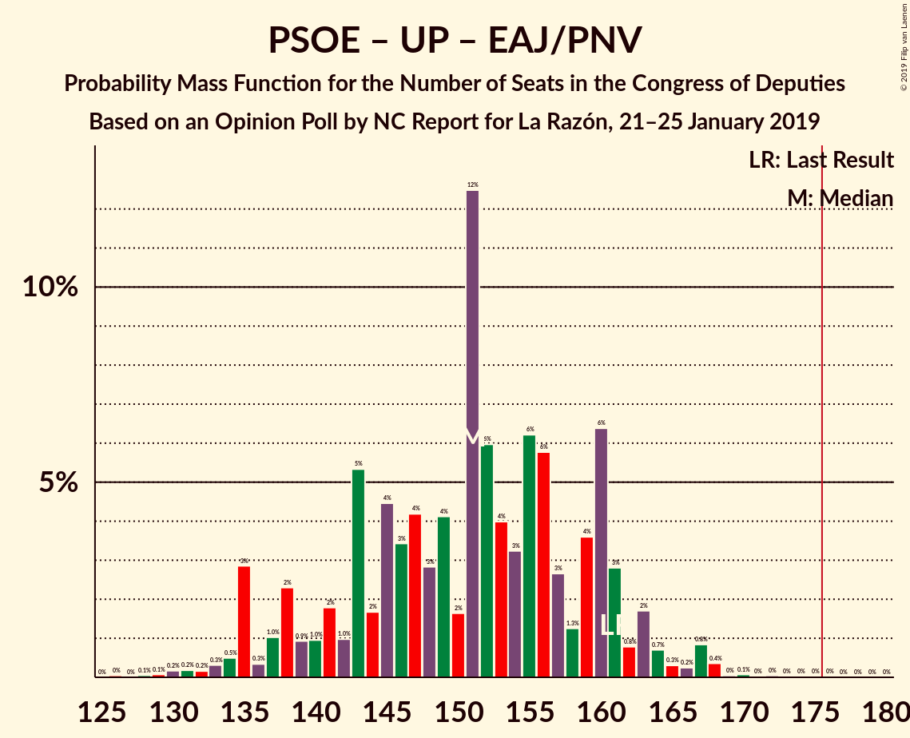
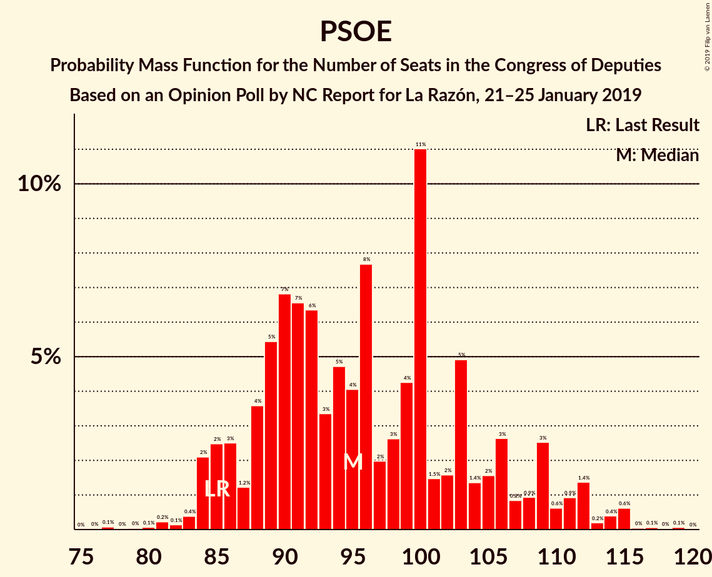

# Opinion Poll by NC Report for La Razón, 21–25 January 2019

<a href="#voting-intentions">Voting Intentions</a> | <a href="#seats">Seats</a> | <a href="#coalitions">Coalitions</a> | <a href="#technical-information">Technical Information</a>

## Voting Intentions

### Confidence Intervals

| Party | Last Result | Poll Result | 80% Confidence Interval | 90% Confidence Interval | 95% Confidence Interval | 99% Confidence Interval |
|:-----:|:-----------:|:-----------:|:-----------------------:|:-----------------------:|:-----------------------:|:-----------------------:|
| Partido Socialista Obrero Español | 22.6% | 24.2% | 22.5–26.0% |22.1–26.5% |21.6–27.0% |20.9–27.8% |
| Partido Popular | 33.0% | 24.0% | 22.3–25.8% |21.9–26.3% |21.4–26.7% |20.7–27.6% |
| Ciudadanos–Partido de la Ciudadanía | 13.1% | 18.7% | 17.2–20.4% |16.8–20.8% |16.4–21.2% |15.7–22.1% |
| Unidos Podemos | 21.2% | 16.6% | 15.2–18.2% |14.8–18.6% |14.4–19.0% |13.8–19.8% |
| Vox | 0.2% | 9.4% | 8.3–10.7% |8.0–11.1% |7.7–11.4% |7.2–12.0% |
| Esquerra Republicana de Catalunya–Catalunya Sí | 2.7% | 2.8% | 2.2–3.6% |2.1–3.8% |1.9–4.0% |1.7–4.4% |
| Partit Demòcrata Europeu Català | 2.0% | 1.2% | 0.9–1.8% |0.8–1.9% |0.7–2.1% |0.5–2.4% |
| Euzko Alderdi Jeltzalea/Partido Nacionalista Vasco | 1.2% | 0.9% | 0.6–1.4% |0.5–1.6% |0.5–1.7% |0.4–2.0% |
| Euskal Herria Bildu | 0.8% | 0.7% | 0.5–1.2% |0.4–1.3% |0.3–1.4% |0.2–1.7% |

*Note:* The poll result column reflects the actual value used in the calculations. Published results may vary slightly, and in addition be rounded to fewer digits.

## Seats

### Confidence Intervals

| Party | Last Result | Median | 80% Confidence Interval | 90% Confidence Interval | 95% Confidence Interval | 99% Confidence Interval |
|:-----:|:-----------:|:------:|:-----------------------:|:-----------------------:|:-----------------------:|:-----------------------:|
| <a href="#partido-socialista-obrero-español">Partido Socialista Obrero Español</a> | 85 | 95 | 88–106 |85–109 |84–112 |82–115 |
| <a href="#partido-popular">Partido Popular</a> | 137 | 98 | 88–108 |86–111 |84–114 |81–117 |
| <a href="#ciudadanos–partido-de-la-ciudadanía">Ciudadanos–Partido de la Ciudadanía</a> | 32 | 62 | 55–69 |54–71 |53–71 |51–74 |
| <a href="#unidos-podemos">Unidos Podemos</a> | 71 | 49 | 43–60 |41–62 |39–64 |36–66 |
| <a href="#vox">Vox</a> | 0 | 19 | 14–24 |14–25 |13–26 |11–28 |
| <a href="#esquerra-republicana-de-catalunya–catalunya-sí">Esquerra Republicana de Catalunya–Catalunya Sí</a> | 9 | 11 | 9–15 |9–15 |8–16 |7–18 |
| <a href="#partit-demòcrata-europeu-català">Partit Demòcrata Europeu Català</a> | 8 | 5 | 2–7 |1–7 |1–8 |1–10 |
| <a href="#euzko-alderdi-jeltzalea/partido-nacionalista-vasco">Euzko Alderdi Jeltzalea/Partido Nacionalista Vasco</a> | 5 | 4 | 3–6 |2–7 |2–7 |1–8 |
| <a href="#euskal-herria-bildu">Euskal Herria Bildu</a> | 2 | 2 | 1–6 |1–7 |1–7 |0–7 |

### Partido Socialista Obrero Español

*For a full overview of the results for this party, see the [Partido Socialista Obrero Español](party-partidosocialistaobreroespañol.html) page.*

| Number of Seats | Probability | Accumulated | Special Marks |
|:---------------:|:-----------:|:-----------:|:-------------:|
| 77 | 0.1% | 100% |  |
| 78 | 0% | 99.9% |  |
| 79 | 0% | 99.8% |  |
| 80 | 0.1% | 99.8% |  |
| 81 | 0.2% | 99.7% |  |
| 82 | 0.1% | 99.5% |  |
| 83 | 0.4% | 99.4% |  |
| 84 | 2% | 99.0% |  |
| 85 | 2% | 97% | Last Result |
| 86 | 3% | 94% |  |
| 87 | 1.2% | 92% |  |
| 88 | 4% | 91% |  |
| 89 | 5% | 87% |  |
| 90 | 7% | 82% |  |
| 91 | 7% | 75% |  |
| 92 | 6% | 68% |  |
| 93 | 3% | 62% |  |
| 94 | 5% | 59% |  |
| 95 | 4% | 54% | Median |
| 96 | 8% | 50% |  |
| 97 | 2% | 42% |  |
| 98 | 3% | 40% |  |
| 99 | 4% | 37% |  |
| 100 | 11% | 33% |  |
| 101 | 1.5% | 22% |  |
| 102 | 2% | 21% |  |
| 103 | 5% | 19% |  |
| 104 | 1.4% | 14% |  |
| 105 | 2% | 13% |  |
| 106 | 3% | 11% |  |
| 107 | 0.8% | 9% |  |
| 108 | 0.9% | 8% |  |
| 109 | 3% | 7% |  |
| 110 | 0.6% | 4% |  |
| 111 | 0.9% | 4% |  |
| 112 | 1.4% | 3% |  |
| 113 | 0.2% | 1.4% |  |
| 114 | 0.4% | 1.2% |  |
| 115 | 0.6% | 0.8% |  |
| 116 | 0% | 0.2% |  |
| 117 | 0.1% | 0.2% |  |
| 118 | 0% | 0.1% |  |
| 119 | 0.1% | 0.1% |  |
| 120 | 0% | 0% |  |

### Partido Popular

*For a full overview of the results for this party, see the [Partido Popular](party-partidopopular.html) page.*

| Number of Seats | Probability | Accumulated | Special Marks |
|:---------------:|:-----------:|:-----------:|:-------------:|
| 77 | 0.1% | 100% |  |
| 78 | 0.1% | 99.9% |  |
| 79 | 0.1% | 99.8% |  |
| 80 | 0.1% | 99.7% |  |
| 81 | 0.2% | 99.6% |  |
| 82 | 0.5% | 99.4% |  |
| 83 | 1.4% | 98.9% |  |
| 84 | 0.4% | 98% |  |
| 85 | 0.7% | 97% |  |
| 86 | 2% | 96% |  |
| 87 | 1.4% | 94% |  |
| 88 | 4% | 93% |  |
| 89 | 3% | 89% |  |
| 90 | 4% | 86% |  |
| 91 | 2% | 82% |  |
| 92 | 3% | 80% |  |
| 93 | 7% | 78% |  |
| 94 | 4% | 70% |  |
| 95 | 5% | 66% |  |
| 96 | 5% | 61% |  |
| 97 | 6% | 57% |  |
| 98 | 4% | 50% | Median |
| 99 | 5% | 47% |  |
| 100 | 2% | 41% |  |
| 101 | 13% | 40% |  |
| 102 | 3% | 27% |  |
| 103 | 3% | 24% |  |
| 104 | 3% | 21% |  |
| 105 | 3% | 18% |  |
| 106 | 3% | 15% |  |
| 107 | 1.2% | 12% |  |
| 108 | 3% | 11% |  |
| 109 | 1.4% | 8% |  |
| 110 | 1.1% | 7% |  |
| 111 | 2% | 6% |  |
| 112 | 0.5% | 4% |  |
| 113 | 0.5% | 3% |  |
| 114 | 1.1% | 3% |  |
| 115 | 0.5% | 2% |  |
| 116 | 0.5% | 1.0% |  |
| 117 | 0.1% | 0.6% |  |
| 118 | 0.2% | 0.5% |  |
| 119 | 0.1% | 0.2% |  |
| 120 | 0% | 0.1% |  |
| 121 | 0% | 0.1% |  |
| 122 | 0% | 0% |  |
| 123 | 0% | 0% |  |
| 124 | 0% | 0% |  |
| 125 | 0% | 0% |  |
| 126 | 0% | 0% |  |
| 127 | 0% | 0% |  |
| 128 | 0% | 0% |  |
| 129 | 0% | 0% |  |
| 130 | 0% | 0% |  |
| 131 | 0% | 0% |  |
| 132 | 0% | 0% |  |
| 133 | 0% | 0% |  |
| 134 | 0% | 0% |  |
| 135 | 0% | 0% |  |
| 136 | 0% | 0% |  |
| 137 | 0% | 0% | Last Result |

### Ciudadanos–Partido de la Ciudadanía

*For a full overview of the results for this party, see the [Ciudadanos–Partido de la Ciudadanía](party-ciudadanos–partidodelaciudadanía.html) page.*

| Number of Seats | Probability | Accumulated | Special Marks |
|:---------------:|:-----------:|:-----------:|:-------------:|
| 32 | 0% | 100% | Last Result |
| 33 | 0% | 100% |  |
| 34 | 0% | 100% |  |
| 35 | 0% | 100% |  |
| 36 | 0% | 100% |  |
| 37 | 0% | 100% |  |
| 38 | 0% | 100% |  |
| 39 | 0% | 100% |  |
| 40 | 0% | 100% |  |
| 41 | 0% | 100% |  |
| 42 | 0% | 100% |  |
| 43 | 0% | 100% |  |
| 44 | 0% | 100% |  |
| 45 | 0% | 99.9% |  |
| 46 | 0% | 99.9% |  |
| 47 | 0% | 99.9% |  |
| 48 | 0% | 99.9% |  |
| 49 | 0.1% | 99.8% |  |
| 50 | 0.2% | 99.7% |  |
| 51 | 0.6% | 99.5% |  |
| 52 | 1.3% | 99.0% |  |
| 53 | 1.4% | 98% |  |
| 54 | 4% | 96% |  |
| 55 | 4% | 92% |  |
| 56 | 2% | 89% |  |
| 57 | 3% | 86% |  |
| 58 | 4% | 83% |  |
| 59 | 9% | 78% |  |
| 60 | 9% | 70% |  |
| 61 | 4% | 61% |  |
| 62 | 17% | 57% | Median |
| 63 | 6% | 40% |  |
| 64 | 4% | 35% |  |
| 65 | 10% | 30% |  |
| 66 | 5% | 20% |  |
| 67 | 2% | 15% |  |
| 68 | 2% | 14% |  |
| 69 | 3% | 11% |  |
| 70 | 2% | 8% |  |
| 71 | 5% | 7% |  |
| 72 | 0.7% | 1.5% |  |
| 73 | 0.2% | 0.8% |  |
| 74 | 0.2% | 0.6% |  |
| 75 | 0.1% | 0.4% |  |
| 76 | 0.1% | 0.3% |  |
| 77 | 0.1% | 0.2% |  |
| 78 | 0% | 0.1% |  |
| 79 | 0% | 0.1% |  |
| 80 | 0% | 0.1% |  |
| 81 | 0% | 0% |  |

### Unidos Podemos

*For a full overview of the results for this party, see the [Unidos Podemos](party-unidospodemos.html) page.*

| Number of Seats | Probability | Accumulated | Special Marks |
|:---------------:|:-----------:|:-----------:|:-------------:|
| 33 | 0% | 100% |  |
| 34 | 0.1% | 99.9% |  |
| 35 | 0.2% | 99.8% |  |
| 36 | 0.3% | 99.6% |  |
| 37 | 0.6% | 99.3% |  |
| 38 | 0.8% | 98.7% |  |
| 39 | 0.5% | 98% |  |
| 40 | 1.3% | 97% |  |
| 41 | 3% | 96% |  |
| 42 | 3% | 93% |  |
| 43 | 4% | 90% |  |
| 44 | 5% | 86% |  |
| 45 | 11% | 81% |  |
| 46 | 12% | 71% |  |
| 47 | 3% | 58% |  |
| 48 | 3% | 55% |  |
| 49 | 5% | 52% | Median |
| 50 | 2% | 47% |  |
| 51 | 6% | 45% |  |
| 52 | 2% | 39% |  |
| 53 | 4% | 37% |  |
| 54 | 4% | 33% |  |
| 55 | 1.5% | 28% |  |
| 56 | 2% | 27% |  |
| 57 | 4% | 25% |  |
| 58 | 3% | 21% |  |
| 59 | 3% | 18% |  |
| 60 | 6% | 16% |  |
| 61 | 2% | 9% |  |
| 62 | 3% | 8% |  |
| 63 | 1.0% | 5% |  |
| 64 | 2% | 4% |  |
| 65 | 0.9% | 1.5% |  |
| 66 | 0.2% | 0.6% |  |
| 67 | 0.3% | 0.4% |  |
| 68 | 0% | 0.2% |  |
| 69 | 0% | 0.1% |  |
| 70 | 0% | 0.1% |  |
| 71 | 0% | 0% | Last Result |

### Vox

*For a full overview of the results for this party, see the [Vox](party-vox.html) page.*

| Number of Seats | Probability | Accumulated | Special Marks |
|:---------------:|:-----------:|:-----------:|:-------------:|
| 0 | 0% | 100% | Last Result |
| 1 | 0% | 100% |  |
| 2 | 0% | 100% |  |
| 3 | 0% | 100% |  |
| 4 | 0% | 100% |  |
| 5 | 0% | 100% |  |
| 6 | 0% | 100% |  |
| 7 | 0% | 100% |  |
| 8 | 0% | 100% |  |
| 9 | 0% | 100% |  |
| 10 | 0.1% | 99.9% |  |
| 11 | 1.0% | 99.9% |  |
| 12 | 1.3% | 98.8% |  |
| 13 | 1.1% | 98% |  |
| 14 | 7% | 96% |  |
| 15 | 5% | 90% |  |
| 16 | 4% | 85% |  |
| 17 | 10% | 81% |  |
| 18 | 18% | 71% |  |
| 19 | 6% | 53% | Median |
| 20 | 7% | 47% |  |
| 21 | 13% | 40% |  |
| 22 | 10% | 27% |  |
| 23 | 5% | 17% |  |
| 24 | 6% | 12% |  |
| 25 | 3% | 6% |  |
| 26 | 0.6% | 3% |  |
| 27 | 1.4% | 2% |  |
| 28 | 0.5% | 0.9% |  |
| 29 | 0.2% | 0.4% |  |
| 30 | 0.1% | 0.2% |  |
| 31 | 0% | 0.1% |  |
| 32 | 0% | 0.1% |  |
| 33 | 0% | 0% |  |

### Esquerra Republicana de Catalunya–Catalunya Sí

*For a full overview of the results for this party, see the [Esquerra Republicana de Catalunya–Catalunya Sí](party-esquerrarepublicanadecatalunya–catalunyasí.html) page.*

| Number of Seats | Probability | Accumulated | Special Marks |
|:---------------:|:-----------:|:-----------:|:-------------:|
| 6 | 0.1% | 100% |  |
| 7 | 0.9% | 99.9% |  |
| 8 | 4% | 99.0% |  |
| 9 | 32% | 95% | Last Result |
| 10 | 4% | 63% |  |
| 11 | 11% | 59% | Median |
| 12 | 16% | 49% |  |
| 13 | 13% | 33% |  |
| 14 | 8% | 20% |  |
| 15 | 9% | 12% |  |
| 16 | 1.5% | 3% |  |
| 17 | 0.6% | 1.5% |  |
| 18 | 0.7% | 0.9% |  |
| 19 | 0.2% | 0.2% |  |
| 20 | 0.1% | 0.1% |  |
| 21 | 0% | 0% |  |

### Partit Demòcrata Europeu Català

*For a full overview of the results for this party, see the [Partit Demòcrata Europeu Català](party-partitdemòcrataeuropeucatalà.html) page.*

| Number of Seats | Probability | Accumulated | Special Marks |
|:---------------:|:-----------:|:-----------:|:-------------:|
| 0 | 0.1% | 100% |  |
| 1 | 8% | 99.9% |  |
| 2 | 3% | 92% |  |
| 3 | 12% | 90% |  |
| 4 | 26% | 78% |  |
| 5 | 13% | 52% | Median |
| 6 | 28% | 39% |  |
| 7 | 6% | 11% |  |
| 8 | 4% | 5% | Last Result |
| 9 | 0.7% | 1.2% |  |
| 10 | 0.5% | 0.6% |  |
| 11 | 0% | 0% |  |

### Euzko Alderdi Jeltzalea/Partido Nacionalista Vasco

*For a full overview of the results for this party, see the [Euzko Alderdi Jeltzalea/Partido Nacionalista Vasco](party-euzkoalderdijeltzaleapartidonacionalistavasco.html) page.*

| Number of Seats | Probability | Accumulated | Special Marks |
|:---------------:|:-----------:|:-----------:|:-------------:|
| 0 | 0.1% | 100% |  |
| 1 | 0.9% | 99.9% |  |
| 2 | 7% | 99.0% |  |
| 3 | 36% | 92% |  |
| 4 | 9% | 56% | Median |
| 5 | 8% | 48% | Last Result |
| 6 | 32% | 40% |  |
| 7 | 6% | 8% |  |
| 8 | 1.2% | 2% |  |
| 9 | 0.2% | 0.3% |  |
| 10 | 0.1% | 0.1% |  |
| 11 | 0% | 0% |  |

### Euskal Herria Bildu

*For a full overview of the results for this party, see the [Euskal Herria Bildu](party-euskalherriabildu.html) page.*

| Number of Seats | Probability | Accumulated | Special Marks |
|:---------------:|:-----------:|:-----------:|:-------------:|
| 0 | 2% | 100% |  |
| 1 | 14% | 98% |  |
| 2 | 36% | 84% | Last Result, Median |
| 3 | 14% | 48% |  |
| 4 | 12% | 33% |  |
| 5 | 6% | 21% |  |
| 6 | 10% | 15% |  |
| 7 | 5% | 5% |  |
| 8 | 0.1% | 0.2% |  |
| 9 | 0.1% | 0.1% |  |
| 10 | 0% | 0% |  |

## Coalitions

### Confidence Intervals

| Coalition | Last Result | Median | Majority? | 80% Confidence Interval | 90% Confidence Interval | 95% Confidence Interval | 99% Confidence Interval |
|:---------:|:-----------:|:------:|:---------:|:-----------------------:|:-----------------------:|:-----------------------:|:-----------------------:|
| Partido Socialista Obrero Español – Partido Popular – Ciudadanos–Partido de la Ciudadanía | 254 | 256 | 100% | 247–265 | 245–266 | 243–268 | 237–271 |
| Partido Socialista Obrero Español – Ciudadanos–Partido de la Ciudadanía – Unidos Podemos | 188 | 208 | 100% | 199–218 | 194–220 | 191–223 | 188–227 |
| Partido Socialista Obrero Español – Partido Popular | 222 | 192 | 99.3% | 184–205 | 182–207 | 180–210 | 174–211 |
| Partido Popular – Ciudadanos–Partido de la Ciudadanía – Vox | 169 | 178 | 68% | 171–188 | 168–192 | 166–194 | 163–197 |
| Partido Socialista Obrero Español – Unidos Podemos – Esquerra Republicana de Catalunya–Catalunya Sí – Partit Demòcrata Europeu Català – Euzko Alderdi Jeltzalea/Partido Nacionalista Vasco – Euskal Herria Bildu | 180 | 171 | 17% | 161–178 | 157–181 | 155–183 | 152–186 |
| Partido Popular – Ciudadanos–Partido de la Ciudadanía – Euzko Alderdi Jeltzalea/Partido Nacionalista Vasco | 174 | 164 | 6% | 156–174 | 153–176 | 150–179 | 147–184 |
| Partido Socialista Obrero Español – Unidos Podemos – Esquerra Republicana de Catalunya–Catalunya Sí – Partit Demòcrata Europeu Català | 173 | 163 | 3% | 153–171 | 149–174 | 148–176 | 144–180 |
| Partido Socialista Obrero Español – Unidos Podemos – Esquerra Republicana de Catalunya–Catalunya Sí – Euskal Herria Bildu | 167 | 162 | 2% | 152–169 | 148–172 | 146–175 | 142–179 |
| Partido Popular – Ciudadanos–Partido de la Ciudadanía | 169 | 160 | 2% | 152–169 | 149–171 | 147–174 | 143–179 |
| Partido Socialista Obrero Español – Ciudadanos–Partido de la Ciudadanía | 117 | 158 | 1.5% | 148–169 | 145–171 | 144–174 | 140–179 |
| Partido Socialista Obrero Español – Unidos Podemos – Euzko Alderdi Jeltzalea/Partido Nacionalista Vasco – Euskal Herria Bildu | 163 | 154 | 0.1% | 144–163 | 141–165 | 138–167 | 135–170 |
| Partido Socialista Obrero Español – Unidos Podemos – Euzko Alderdi Jeltzalea/Partido Nacionalista Vasco | 161 | 151 | 0% | 141–160 | 137–162 | 135–164 | 131–168 |
| Partido Socialista Obrero Español – Unidos Podemos | 156 | 146 | 0% | 135–156 | 132–158 | 132–160 | 127–163 |
| Partido Popular – Vox | 137 | 117 | 0% | 109–126 | 106–130 | 102–133 | 99–136 |
| Partido Popular | 137 | 98 | 0% | 88–108 | 86–111 | 84–114 | 81–117 |
| Partido Socialista Obrero Español | 85 | 95 | 0% | 88–106 | 85–109 | 84–112 | 82–115 |

### Partido Socialista Obrero Español – Partido Popular – Ciudadanos–Partido de la Ciudadanía

| Number of Seats | Probability | Accumulated | Special Marks |
|:---------------:|:-----------:|:-----------:|:-------------:|
| 232 | 0% | 100% |  |
| 233 | 0.1% | 99.9% |  |
| 234 | 0% | 99.9% |  |
| 235 | 0.1% | 99.8% |  |
| 236 | 0.1% | 99.8% |  |
| 237 | 0.1% | 99.6% |  |
| 238 | 0.1% | 99.5% |  |
| 239 | 0.2% | 99.3% |  |
| 240 | 0.2% | 99.2% |  |
| 241 | 0.4% | 98.9% |  |
| 242 | 0.3% | 98.5% |  |
| 243 | 1.1% | 98% |  |
| 244 | 0.9% | 97% |  |
| 245 | 4% | 96% |  |
| 246 | 2% | 93% |  |
| 247 | 2% | 91% |  |
| 248 | 9% | 88% |  |
| 249 | 4% | 80% |  |
| 250 | 3% | 76% |  |
| 251 | 5% | 73% |  |
| 252 | 4% | 68% |  |
| 253 | 5% | 65% |  |
| 254 | 2% | 60% | Last Result |
| 255 | 6% | 58% | Median |
| 256 | 3% | 52% |  |
| 257 | 7% | 49% |  |
| 258 | 4% | 42% |  |
| 259 | 4% | 38% |  |
| 260 | 3% | 34% |  |
| 261 | 2% | 31% |  |
| 262 | 5% | 29% |  |
| 263 | 11% | 24% |  |
| 264 | 1.0% | 13% |  |
| 265 | 3% | 12% |  |
| 266 | 4% | 8% |  |
| 267 | 1.3% | 4% |  |
| 268 | 0.9% | 3% |  |
| 269 | 0.8% | 2% |  |
| 270 | 0.2% | 0.9% |  |
| 271 | 0.3% | 0.7% |  |
| 272 | 0.2% | 0.4% |  |
| 273 | 0.1% | 0.2% |  |
| 274 | 0% | 0.1% |  |
| 275 | 0% | 0% |  |

### Partido Socialista Obrero Español – Ciudadanos–Partido de la Ciudadanía – Unidos Podemos

| Number of Seats | Probability | Accumulated | Special Marks |
|:---------------:|:-----------:|:-----------:|:-------------:|
| 181 | 0% | 100% |  |
| 182 | 0% | 99.9% |  |
| 183 | 0% | 99.9% |  |
| 184 | 0% | 99.9% |  |
| 185 | 0% | 99.9% |  |
| 186 | 0.1% | 99.8% |  |
| 187 | 0.1% | 99.7% |  |
| 188 | 0.4% | 99.7% | Last Result |
| 189 | 0.3% | 99.3% |  |
| 190 | 0.7% | 99.0% |  |
| 191 | 1.0% | 98% |  |
| 192 | 0.6% | 97% |  |
| 193 | 0.7% | 97% |  |
| 194 | 2% | 96% |  |
| 195 | 1.2% | 94% |  |
| 196 | 0.5% | 93% |  |
| 197 | 2% | 93% |  |
| 198 | 0.9% | 91% |  |
| 199 | 0.7% | 90% |  |
| 200 | 2% | 89% |  |
| 201 | 5% | 87% |  |
| 202 | 3% | 82% |  |
| 203 | 3% | 79% |  |
| 204 | 6% | 75% |  |
| 205 | 7% | 70% |  |
| 206 | 4% | 63% | Median |
| 207 | 8% | 59% |  |
| 208 | 7% | 51% |  |
| 209 | 2% | 44% |  |
| 210 | 3% | 42% |  |
| 211 | 3% | 39% |  |
| 212 | 2% | 36% |  |
| 213 | 4% | 34% |  |
| 214 | 3% | 31% |  |
| 215 | 11% | 27% |  |
| 216 | 2% | 17% |  |
| 217 | 4% | 15% |  |
| 218 | 4% | 11% |  |
| 219 | 0.9% | 7% |  |
| 220 | 1.2% | 6% |  |
| 221 | 0.6% | 5% |  |
| 222 | 0.4% | 4% |  |
| 223 | 1.1% | 4% |  |
| 224 | 0.3% | 2% |  |
| 225 | 0.1% | 2% |  |
| 226 | 1.1% | 2% |  |
| 227 | 0.4% | 0.9% |  |
| 228 | 0.1% | 0.4% |  |
| 229 | 0% | 0.3% |  |
| 230 | 0.1% | 0.3% |  |
| 231 | 0.2% | 0.2% |  |
| 232 | 0% | 0.1% |  |
| 233 | 0% | 0% |  |

### Partido Socialista Obrero Español – Partido Popular

| Number of Seats | Probability | Accumulated | Special Marks |
|:---------------:|:-----------:|:-----------:|:-------------:|
| 169 | 0.1% | 100% |  |
| 170 | 0% | 99.9% |  |
| 171 | 0.1% | 99.9% |  |
| 172 | 0.1% | 99.8% |  |
| 173 | 0.1% | 99.7% |  |
| 174 | 0.1% | 99.6% |  |
| 175 | 0.2% | 99.4% |  |
| 176 | 0.2% | 99.3% | Majority |
| 177 | 0.4% | 99.1% |  |
| 178 | 0.4% | 98.7% |  |
| 179 | 0.5% | 98% |  |
| 180 | 0.7% | 98% |  |
| 181 | 1.1% | 97% |  |
| 182 | 1.3% | 96% |  |
| 183 | 3% | 95% |  |
| 184 | 4% | 92% |  |
| 185 | 2% | 88% |  |
| 186 | 5% | 86% |  |
| 187 | 6% | 81% |  |
| 188 | 5% | 75% |  |
| 189 | 8% | 70% |  |
| 190 | 3% | 62% |  |
| 191 | 6% | 59% |  |
| 192 | 3% | 52% |  |
| 193 | 4% | 49% | Median |
| 194 | 2% | 46% |  |
| 195 | 3% | 44% |  |
| 196 | 1.3% | 41% |  |
| 197 | 2% | 40% |  |
| 198 | 3% | 38% |  |
| 199 | 4% | 35% |  |
| 200 | 2% | 31% |  |
| 201 | 10% | 29% |  |
| 202 | 2% | 19% |  |
| 203 | 5% | 18% |  |
| 204 | 2% | 12% |  |
| 205 | 2% | 10% |  |
| 206 | 0.8% | 8% |  |
| 207 | 2% | 7% |  |
| 208 | 1.4% | 5% |  |
| 209 | 0.3% | 3% |  |
| 210 | 2% | 3% |  |
| 211 | 0.6% | 1.1% |  |
| 212 | 0.1% | 0.4% |  |
| 213 | 0.1% | 0.3% |  |
| 214 | 0.1% | 0.2% |  |
| 215 | 0% | 0.1% |  |
| 216 | 0% | 0.1% |  |
| 217 | 0% | 0% |  |
| 218 | 0% | 0% |  |
| 219 | 0% | 0% |  |
| 220 | 0% | 0% |  |
| 221 | 0% | 0% |  |
| 222 | 0% | 0% | Last Result |

### Partido Popular – Ciudadanos–Partido de la Ciudadanía – Vox

| Number of Seats | Probability | Accumulated | Special Marks |
|:---------------:|:-----------:|:-----------:|:-------------:|
| 156 | 0% | 100% |  |
| 157 | 0% | 99.9% |  |
| 158 | 0% | 99.9% |  |
| 159 | 0.1% | 99.9% |  |
| 160 | 0.1% | 99.8% |  |
| 161 | 0.1% | 99.8% |  |
| 162 | 0.1% | 99.6% |  |
| 163 | 0.3% | 99.5% |  |
| 164 | 0.3% | 99.2% |  |
| 165 | 0.2% | 98.9% |  |
| 166 | 1.4% | 98.7% |  |
| 167 | 2% | 97% |  |
| 168 | 1.2% | 95% |  |
| 169 | 0.7% | 94% | Last Result |
| 170 | 2% | 93% |  |
| 171 | 4% | 91% |  |
| 172 | 2% | 87% |  |
| 173 | 1.4% | 85% |  |
| 174 | 10% | 83% |  |
| 175 | 6% | 74% |  |
| 176 | 7% | 68% | Majority |
| 177 | 7% | 62% |  |
| 178 | 4% | 54% |  |
| 179 | 3% | 50% | Median |
| 180 | 5% | 47% |  |
| 181 | 12% | 42% |  |
| 182 | 3% | 31% |  |
| 183 | 4% | 28% |  |
| 184 | 2% | 24% |  |
| 185 | 3% | 22% |  |
| 186 | 3% | 19% |  |
| 187 | 5% | 16% |  |
| 188 | 2% | 11% |  |
| 189 | 0.8% | 9% |  |
| 190 | 2% | 8% |  |
| 191 | 1.0% | 6% |  |
| 192 | 0.9% | 5% |  |
| 193 | 0.7% | 4% |  |
| 194 | 2% | 4% |  |
| 195 | 0.8% | 2% |  |
| 196 | 0.5% | 1.1% |  |
| 197 | 0.2% | 0.6% |  |
| 198 | 0.1% | 0.3% |  |
| 199 | 0.1% | 0.2% |  |
| 200 | 0.1% | 0.1% |  |
| 201 | 0% | 0.1% |  |
| 202 | 0% | 0% |  |

### Partido Socialista Obrero Español – Unidos Podemos – Esquerra Republicana de Catalunya–Catalunya Sí – Partit Demòcrata Europeu Català – Euzko Alderdi Jeltzalea/Partido Nacionalista Vasco – Euskal Herria Bildu

| Number of Seats | Probability | Accumulated | Special Marks |
|:---------------:|:-----------:|:-----------:|:-------------:|
| 148 | 0% | 100% |  |
| 149 | 0.1% | 99.9% |  |
| 150 | 0.1% | 99.9% |  |
| 151 | 0.1% | 99.8% |  |
| 152 | 0.2% | 99.7% |  |
| 153 | 0.5% | 99.4% |  |
| 154 | 0.8% | 98.9% |  |
| 155 | 2% | 98% |  |
| 156 | 0.7% | 96% |  |
| 157 | 0.9% | 96% |  |
| 158 | 1.0% | 95% |  |
| 159 | 2% | 94% |  |
| 160 | 0.8% | 92% |  |
| 161 | 2% | 91% |  |
| 162 | 5% | 89% |  |
| 163 | 3% | 84% |  |
| 164 | 3% | 81% |  |
| 165 | 2% | 78% |  |
| 166 | 4% | 76% | Median |
| 167 | 3% | 72% |  |
| 168 | 12% | 69% |  |
| 169 | 5% | 58% |  |
| 170 | 3% | 53% |  |
| 171 | 4% | 50% |  |
| 172 | 7% | 46% |  |
| 173 | 7% | 38% |  |
| 174 | 6% | 32% |  |
| 175 | 10% | 26% |  |
| 176 | 1.4% | 17% | Majority |
| 177 | 2% | 15% |  |
| 178 | 4% | 13% |  |
| 179 | 2% | 9% |  |
| 180 | 0.7% | 7% | Last Result |
| 181 | 1.2% | 6% |  |
| 182 | 2% | 5% |  |
| 183 | 1.4% | 3% |  |
| 184 | 0.2% | 1.3% |  |
| 185 | 0.3% | 1.1% |  |
| 186 | 0.3% | 0.8% |  |
| 187 | 0.1% | 0.5% |  |
| 188 | 0.1% | 0.4% |  |
| 189 | 0.1% | 0.2% |  |
| 190 | 0.1% | 0.2% |  |
| 191 | 0% | 0.1% |  |
| 192 | 0% | 0.1% |  |
| 193 | 0% | 0.1% |  |
| 194 | 0% | 0% |  |

### Partido Popular – Ciudadanos–Partido de la Ciudadanía – Euzko Alderdi Jeltzalea/Partido Nacionalista Vasco

| Number of Seats | Probability | Accumulated | Special Marks |
|:---------------:|:-----------:|:-----------:|:-------------:|
| 141 | 0% | 100% |  |
| 142 | 0% | 99.9% |  |
| 143 | 0% | 99.9% |  |
| 144 | 0.1% | 99.9% |  |
| 145 | 0.1% | 99.8% |  |
| 146 | 0.2% | 99.7% |  |
| 147 | 0.2% | 99.5% |  |
| 148 | 0.5% | 99.3% |  |
| 149 | 0.2% | 98.9% |  |
| 150 | 2% | 98.7% |  |
| 151 | 0.9% | 97% |  |
| 152 | 0.8% | 96% |  |
| 153 | 2% | 95% |  |
| 154 | 0.9% | 93% |  |
| 155 | 1.1% | 93% |  |
| 156 | 9% | 91% |  |
| 157 | 3% | 83% |  |
| 158 | 5% | 80% |  |
| 159 | 6% | 75% |  |
| 160 | 2% | 69% |  |
| 161 | 4% | 68% |  |
| 162 | 8% | 64% |  |
| 163 | 3% | 56% |  |
| 164 | 3% | 52% | Median |
| 165 | 4% | 50% |  |
| 166 | 8% | 46% |  |
| 167 | 3% | 38% |  |
| 168 | 1.2% | 36% |  |
| 169 | 12% | 34% |  |
| 170 | 4% | 23% |  |
| 171 | 3% | 19% |  |
| 172 | 4% | 16% |  |
| 173 | 2% | 12% |  |
| 174 | 0.9% | 10% | Last Result |
| 175 | 3% | 10% |  |
| 176 | 3% | 6% | Majority |
| 177 | 0.3% | 4% |  |
| 178 | 0.6% | 3% |  |
| 179 | 0.9% | 3% |  |
| 180 | 0.4% | 2% |  |
| 181 | 0.5% | 1.5% |  |
| 182 | 0.4% | 1.0% |  |
| 183 | 0.1% | 0.6% |  |
| 184 | 0.1% | 0.5% |  |
| 185 | 0.2% | 0.4% |  |
| 186 | 0% | 0.2% |  |
| 187 | 0% | 0.2% |  |
| 188 | 0.1% | 0.2% |  |
| 189 | 0.1% | 0.1% |  |
| 190 | 0% | 0% |  |

### Partido Socialista Obrero Español – Unidos Podemos – Esquerra Republicana de Catalunya–Catalunya Sí – Partit Demòcrata Europeu Català

| Number of Seats | Probability | Accumulated | Special Marks |
|:---------------:|:-----------:|:-----------:|:-------------:|
| 140 | 0.1% | 100% |  |
| 141 | 0.1% | 99.9% |  |
| 142 | 0.2% | 99.8% |  |
| 143 | 0% | 99.6% |  |
| 144 | 0.1% | 99.6% |  |
| 145 | 0.4% | 99.5% |  |
| 146 | 0.8% | 99.1% |  |
| 147 | 0.3% | 98% |  |
| 148 | 1.5% | 98% |  |
| 149 | 2% | 96% |  |
| 150 | 0.5% | 94% |  |
| 151 | 2% | 94% |  |
| 152 | 2% | 92% |  |
| 153 | 2% | 90% |  |
| 154 | 5% | 88% |  |
| 155 | 3% | 84% |  |
| 156 | 2% | 81% |  |
| 157 | 2% | 79% |  |
| 158 | 7% | 77% |  |
| 159 | 2% | 69% |  |
| 160 | 11% | 67% | Median |
| 161 | 1.5% | 57% |  |
| 162 | 4% | 55% |  |
| 163 | 4% | 52% |  |
| 164 | 4% | 47% |  |
| 165 | 5% | 43% |  |
| 166 | 6% | 38% |  |
| 167 | 4% | 32% |  |
| 168 | 5% | 28% |  |
| 169 | 7% | 23% |  |
| 170 | 3% | 17% |  |
| 171 | 6% | 13% |  |
| 172 | 0.9% | 8% |  |
| 173 | 1.4% | 7% | Last Result |
| 174 | 0.8% | 5% |  |
| 175 | 2% | 5% |  |
| 176 | 0.7% | 3% | Majority |
| 177 | 0.8% | 2% |  |
| 178 | 0.3% | 1.0% |  |
| 179 | 0.3% | 0.8% |  |
| 180 | 0.1% | 0.5% |  |
| 181 | 0.2% | 0.4% |  |
| 182 | 0% | 0.3% |  |
| 183 | 0.1% | 0.2% |  |
| 184 | 0% | 0.1% |  |
| 185 | 0% | 0.1% |  |
| 186 | 0% | 0.1% |  |
| 187 | 0% | 0% |  |

### Partido Socialista Obrero Español – Unidos Podemos – Esquerra Republicana de Catalunya–Catalunya Sí – Euskal Herria Bildu

| Number of Seats | Probability | Accumulated | Special Marks |
|:---------------:|:-----------:|:-----------:|:-------------:|
| 136 | 0% | 100% |  |
| 137 | 0% | 99.9% |  |
| 138 | 0% | 99.9% |  |
| 139 | 0.1% | 99.9% |  |
| 140 | 0.2% | 99.8% |  |
| 141 | 0.1% | 99.6% |  |
| 142 | 0.1% | 99.5% |  |
| 143 | 0.3% | 99.4% |  |
| 144 | 0.2% | 99.1% |  |
| 145 | 0.7% | 98.9% |  |
| 146 | 0.8% | 98% |  |
| 147 | 2% | 97% |  |
| 148 | 2% | 95% |  |
| 149 | 0.5% | 94% |  |
| 150 | 1.0% | 93% |  |
| 151 | 0.8% | 92% |  |
| 152 | 5% | 91% |  |
| 153 | 4% | 86% |  |
| 154 | 5% | 82% |  |
| 155 | 1.4% | 77% |  |
| 156 | 8% | 76% |  |
| 157 | 2% | 68% | Median |
| 158 | 3% | 66% |  |
| 159 | 5% | 63% |  |
| 160 | 6% | 58% |  |
| 161 | 2% | 52% |  |
| 162 | 3% | 50% |  |
| 163 | 6% | 47% |  |
| 164 | 4% | 40% |  |
| 165 | 7% | 36% |  |
| 166 | 5% | 30% |  |
| 167 | 9% | 25% | Last Result |
| 168 | 3% | 15% |  |
| 169 | 4% | 12% |  |
| 170 | 1.1% | 9% |  |
| 171 | 1.4% | 7% |  |
| 172 | 2% | 6% |  |
| 173 | 0.8% | 4% |  |
| 174 | 1.0% | 4% |  |
| 175 | 0.6% | 3% |  |
| 176 | 0.9% | 2% | Majority |
| 177 | 0.5% | 1.2% |  |
| 178 | 0.1% | 0.7% |  |
| 179 | 0.1% | 0.6% |  |
| 180 | 0.2% | 0.4% |  |
| 181 | 0.1% | 0.2% |  |
| 182 | 0.1% | 0.2% |  |
| 183 | 0% | 0.1% |  |
| 184 | 0% | 0.1% |  |
| 185 | 0% | 0.1% |  |
| 186 | 0% | 0% |  |

### Partido Popular – Ciudadanos–Partido de la Ciudadanía

| Number of Seats | Probability | Accumulated | Special Marks |
|:---------------:|:-----------:|:-----------:|:-------------:|
| 137 | 0% | 100% |  |
| 138 | 0% | 99.9% |  |
| 139 | 0% | 99.9% |  |
| 140 | 0.1% | 99.9% |  |
| 141 | 0.1% | 99.8% |  |
| 142 | 0.1% | 99.7% |  |
| 143 | 0.3% | 99.6% |  |
| 144 | 0.2% | 99.2% |  |
| 145 | 0.4% | 99.0% |  |
| 146 | 0.6% | 98.6% |  |
| 147 | 1.4% | 98% |  |
| 148 | 2% | 97% |  |
| 149 | 1.2% | 95% |  |
| 150 | 1.4% | 94% |  |
| 151 | 2% | 92% |  |
| 152 | 7% | 90% |  |
| 153 | 4% | 83% |  |
| 154 | 4% | 79% |  |
| 155 | 4% | 75% |  |
| 156 | 6% | 71% |  |
| 157 | 4% | 65% |  |
| 158 | 4% | 61% |  |
| 159 | 8% | 58% |  |
| 160 | 5% | 50% | Median |
| 161 | 3% | 45% |  |
| 162 | 3% | 42% |  |
| 163 | 12% | 39% |  |
| 164 | 1.3% | 27% |  |
| 165 | 2% | 25% |  |
| 166 | 7% | 23% |  |
| 167 | 3% | 17% |  |
| 168 | 2% | 14% |  |
| 169 | 3% | 12% | Last Result |
| 170 | 3% | 9% |  |
| 171 | 1.1% | 6% |  |
| 172 | 0.7% | 5% |  |
| 173 | 1.2% | 4% |  |
| 174 | 0.5% | 3% |  |
| 175 | 0.4% | 2% |  |
| 176 | 0.9% | 2% | Majority |
| 177 | 0.1% | 0.9% |  |
| 178 | 0.2% | 0.7% |  |
| 179 | 0.2% | 0.5% |  |
| 180 | 0% | 0.3% |  |
| 181 | 0% | 0.3% |  |
| 182 | 0.1% | 0.2% |  |
| 183 | 0.1% | 0.1% |  |
| 184 | 0% | 0% |  |

### Partido Socialista Obrero Español – Ciudadanos–Partido de la Ciudadanía

| Number of Seats | Probability | Accumulated | Special Marks |
|:---------------:|:-----------:|:-----------:|:-------------:|
| 117 | 0% | 100% | Last Result |
| 118 | 0% | 100% |  |
| 119 | 0% | 100% |  |
| 120 | 0% | 100% |  |
| 121 | 0% | 100% |  |
| 122 | 0% | 100% |  |
| 123 | 0% | 100% |  |
| 124 | 0% | 100% |  |
| 125 | 0% | 100% |  |
| 126 | 0% | 100% |  |
| 127 | 0% | 100% |  |
| 128 | 0% | 100% |  |
| 129 | 0% | 100% |  |
| 130 | 0% | 100% |  |
| 131 | 0% | 100% |  |
| 132 | 0% | 100% |  |
| 133 | 0% | 100% |  |
| 134 | 0% | 100% |  |
| 135 | 0% | 100% |  |
| 136 | 0% | 100% |  |
| 137 | 0% | 99.9% |  |
| 138 | 0.1% | 99.9% |  |
| 139 | 0.1% | 99.8% |  |
| 140 | 0.4% | 99.7% |  |
| 141 | 0.3% | 99.3% |  |
| 142 | 0.5% | 99.1% |  |
| 143 | 1.0% | 98.6% |  |
| 144 | 1.2% | 98% |  |
| 145 | 1.4% | 96% |  |
| 146 | 3% | 95% |  |
| 147 | 1.3% | 92% |  |
| 148 | 2% | 90% |  |
| 149 | 4% | 88% |  |
| 150 | 4% | 84% |  |
| 151 | 2% | 80% |  |
| 152 | 6% | 78% |  |
| 153 | 3% | 72% |  |
| 154 | 3% | 69% |  |
| 155 | 8% | 66% |  |
| 156 | 4% | 58% |  |
| 157 | 3% | 54% | Median |
| 158 | 5% | 51% |  |
| 159 | 2% | 46% |  |
| 160 | 5% | 45% |  |
| 161 | 2% | 40% |  |
| 162 | 13% | 38% |  |
| 163 | 2% | 25% |  |
| 164 | 4% | 22% |  |
| 165 | 1.2% | 19% |  |
| 166 | 3% | 18% |  |
| 167 | 0.8% | 14% |  |
| 168 | 3% | 13% |  |
| 169 | 2% | 11% |  |
| 170 | 2% | 8% |  |
| 171 | 2% | 6% |  |
| 172 | 0.6% | 4% |  |
| 173 | 1.2% | 4% |  |
| 174 | 0.2% | 3% |  |
| 175 | 0.8% | 2% |  |
| 176 | 0.2% | 1.5% | Majority |
| 177 | 0.5% | 1.3% |  |
| 178 | 0.3% | 0.8% |  |
| 179 | 0.2% | 0.5% |  |
| 180 | 0.1% | 0.3% |  |
| 181 | 0.1% | 0.2% |  |
| 182 | 0.1% | 0.1% |  |
| 183 | 0% | 0.1% |  |
| 184 | 0% | 0% |  |

### Partido Socialista Obrero Español – Unidos Podemos – Euzko Alderdi Jeltzalea/Partido Nacionalista Vasco – Euskal Herria Bildu

| Number of Seats | Probability | Accumulated | Special Marks |
|:---------------:|:-----------:|:-----------:|:-------------:|
| 131 | 0% | 100% |  |
| 132 | 0.1% | 99.9% |  |
| 133 | 0.1% | 99.9% |  |
| 134 | 0.1% | 99.8% |  |
| 135 | 0.2% | 99.7% |  |
| 136 | 0.2% | 99.5% |  |
| 137 | 1.2% | 99.3% |  |
| 138 | 1.2% | 98% |  |
| 139 | 0.5% | 97% |  |
| 140 | 0.7% | 96% |  |
| 141 | 2% | 96% |  |
| 142 | 1.0% | 94% |  |
| 143 | 1.1% | 93% |  |
| 144 | 3% | 92% |  |
| 145 | 5% | 89% |  |
| 146 | 1.4% | 84% |  |
| 147 | 3% | 82% |  |
| 148 | 1.3% | 79% |  |
| 149 | 3% | 78% |  |
| 150 | 3% | 75% | Median |
| 151 | 5% | 72% |  |
| 152 | 3% | 67% |  |
| 153 | 10% | 64% |  |
| 154 | 8% | 54% |  |
| 155 | 2% | 47% |  |
| 156 | 4% | 45% |  |
| 157 | 11% | 41% |  |
| 158 | 5% | 30% |  |
| 159 | 2% | 24% |  |
| 160 | 2% | 22% |  |
| 161 | 4% | 20% |  |
| 162 | 6% | 17% |  |
| 163 | 4% | 10% | Last Result |
| 164 | 1.2% | 6% |  |
| 165 | 1.4% | 5% |  |
| 166 | 0.4% | 4% |  |
| 167 | 1.3% | 3% |  |
| 168 | 0.3% | 2% |  |
| 169 | 1.1% | 2% |  |
| 170 | 0.4% | 0.7% |  |
| 171 | 0.1% | 0.4% |  |
| 172 | 0.1% | 0.3% |  |
| 173 | 0% | 0.2% |  |
| 174 | 0% | 0.2% |  |
| 175 | 0% | 0.1% |  |
| 176 | 0% | 0.1% | Majority |
| 177 | 0% | 0.1% |  |
| 178 | 0% | 0% |  |

### Partido Socialista Obrero Español – Unidos Podemos – Euzko Alderdi Jeltzalea/Partido Nacionalista Vasco

| Number of Seats | Probability | Accumulated | Special Marks |
|:---------------:|:-----------:|:-----------:|:-------------:|
| 126 | 0% | 100% |  |
| 127 | 0% | 99.9% |  |
| 128 | 0.1% | 99.9% |  |
| 129 | 0.1% | 99.9% |  |
| 130 | 0.2% | 99.8% |  |
| 131 | 0.2% | 99.6% |  |
| 132 | 0.2% | 99.4% |  |
| 133 | 0.3% | 99.3% |  |
| 134 | 0.5% | 99.0% |  |
| 135 | 3% | 98% |  |
| 136 | 0.3% | 96% |  |
| 137 | 1.0% | 95% |  |
| 138 | 2% | 94% |  |
| 139 | 0.9% | 92% |  |
| 140 | 1.0% | 91% |  |
| 141 | 2% | 90% |  |
| 142 | 1.0% | 88% |  |
| 143 | 5% | 87% |  |
| 144 | 2% | 82% |  |
| 145 | 4% | 80% |  |
| 146 | 3% | 76% |  |
| 147 | 4% | 72% |  |
| 148 | 3% | 68% | Median |
| 149 | 4% | 65% |  |
| 150 | 2% | 61% |  |
| 151 | 12% | 60% |  |
| 152 | 6% | 47% |  |
| 153 | 4% | 41% |  |
| 154 | 3% | 37% |  |
| 155 | 6% | 34% |  |
| 156 | 6% | 28% |  |
| 157 | 3% | 22% |  |
| 158 | 1.3% | 19% |  |
| 159 | 4% | 18% |  |
| 160 | 6% | 14% |  |
| 161 | 3% | 8% | Last Result |
| 162 | 0.8% | 5% |  |
| 163 | 2% | 4% |  |
| 164 | 0.7% | 3% |  |
| 165 | 0.3% | 2% |  |
| 166 | 0.2% | 2% |  |
| 167 | 0.8% | 1.5% |  |
| 168 | 0.4% | 0.6% |  |
| 169 | 0% | 0.3% |  |
| 170 | 0.1% | 0.2% |  |
| 171 | 0% | 0.2% |  |
| 172 | 0% | 0.1% |  |
| 173 | 0% | 0.1% |  |
| 174 | 0% | 0.1% |  |
| 175 | 0% | 0.1% |  |
| 176 | 0% | 0% | Majority |

### Partido Socialista Obrero Español – Unidos Podemos

| Number of Seats | Probability | Accumulated | Special Marks |
|:---------------:|:-----------:|:-----------:|:-------------:|
| 123 | 0.1% | 100% |  |
| 124 | 0.1% | 99.9% |  |
| 125 | 0.2% | 99.8% |  |
| 126 | 0.1% | 99.6% |  |
| 127 | 0.2% | 99.5% |  |
| 128 | 0.2% | 99.4% |  |
| 129 | 0.3% | 99.2% |  |
| 130 | 0.7% | 98.9% |  |
| 131 | 0.6% | 98% |  |
| 132 | 4% | 98% |  |
| 133 | 0.8% | 94% |  |
| 134 | 0.9% | 93% |  |
| 135 | 3% | 93% |  |
| 136 | 1.0% | 90% |  |
| 137 | 5% | 89% |  |
| 138 | 1.3% | 84% |  |
| 139 | 2% | 82% |  |
| 140 | 2% | 80% |  |
| 141 | 4% | 78% |  |
| 142 | 3% | 74% |  |
| 143 | 5% | 71% |  |
| 144 | 3% | 66% | Median |
| 145 | 10% | 63% |  |
| 146 | 5% | 54% |  |
| 147 | 1.4% | 49% |  |
| 148 | 5% | 48% |  |
| 149 | 4% | 43% |  |
| 150 | 8% | 39% |  |
| 151 | 2% | 32% |  |
| 152 | 6% | 29% |  |
| 153 | 3% | 23% |  |
| 154 | 5% | 20% |  |
| 155 | 3% | 16% |  |
| 156 | 6% | 12% | Last Result |
| 157 | 0.7% | 6% |  |
| 158 | 2% | 5% |  |
| 159 | 0.7% | 4% |  |
| 160 | 0.9% | 3% |  |
| 161 | 1.0% | 2% |  |
| 162 | 0.4% | 1.0% |  |
| 163 | 0.2% | 0.6% |  |
| 164 | 0.1% | 0.4% |  |
| 165 | 0.2% | 0.3% |  |
| 166 | 0% | 0.2% |  |
| 167 | 0% | 0.1% |  |
| 168 | 0% | 0.1% |  |
| 169 | 0% | 0.1% |  |
| 170 | 0% | 0.1% |  |
| 171 | 0% | 0.1% |  |
| 172 | 0% | 0% |  |

### Partido Popular – Vox

| Number of Seats | Probability | Accumulated | Special Marks |
|:---------------:|:-----------:|:-----------:|:-------------:|
| 95 | 0% | 100% |  |
| 96 | 0% | 99.9% |  |
| 97 | 0.1% | 99.9% |  |
| 98 | 0.3% | 99.8% |  |
| 99 | 0.3% | 99.5% |  |
| 100 | 0.3% | 99.2% |  |
| 101 | 1.2% | 98.9% |  |
| 102 | 1.0% | 98% |  |
| 103 | 0.2% | 97% |  |
| 104 | 0.3% | 96% |  |
| 105 | 0.9% | 96% |  |
| 106 | 0.5% | 95% |  |
| 107 | 2% | 95% |  |
| 108 | 2% | 93% |  |
| 109 | 6% | 91% |  |
| 110 | 5% | 85% |  |
| 111 | 5% | 80% |  |
| 112 | 3% | 75% |  |
| 113 | 1.5% | 73% |  |
| 114 | 4% | 71% |  |
| 115 | 8% | 67% |  |
| 116 | 7% | 59% |  |
| 117 | 3% | 53% | Median |
| 118 | 2% | 50% |  |
| 119 | 14% | 48% |  |
| 120 | 3% | 33% |  |
| 121 | 3% | 31% |  |
| 122 | 7% | 28% |  |
| 123 | 5% | 21% |  |
| 124 | 2% | 16% |  |
| 125 | 2% | 13% |  |
| 126 | 1.4% | 11% |  |
| 127 | 1.0% | 9% |  |
| 128 | 0.5% | 8% |  |
| 129 | 3% | 8% |  |
| 130 | 0.6% | 5% |  |
| 131 | 1.0% | 5% |  |
| 132 | 0.7% | 4% |  |
| 133 | 1.2% | 3% |  |
| 134 | 0.9% | 2% |  |
| 135 | 0.3% | 0.9% |  |
| 136 | 0.3% | 0.5% |  |
| 137 | 0.1% | 0.3% | Last Result |
| 138 | 0% | 0.2% |  |
| 139 | 0% | 0.1% |  |
| 140 | 0% | 0.1% |  |
| 141 | 0% | 0.1% |  |
| 142 | 0% | 0.1% |  |
| 143 | 0% | 0% |  |

### Partido Popular

| Number of Seats | Probability | Accumulated | Special Marks |
|:---------------:|:-----------:|:-----------:|:-------------:|
| 77 | 0.1% | 100% |  |
| 78 | 0.1% | 99.9% |  |
| 79 | 0.1% | 99.8% |  |
| 80 | 0.1% | 99.7% |  |
| 81 | 0.2% | 99.6% |  |
| 82 | 0.5% | 99.4% |  |
| 83 | 1.4% | 98.9% |  |
| 84 | 0.4% | 98% |  |
| 85 | 0.7% | 97% |  |
| 86 | 2% | 96% |  |
| 87 | 1.4% | 94% |  |
| 88 | 4% | 93% |  |
| 89 | 3% | 89% |  |
| 90 | 4% | 86% |  |
| 91 | 2% | 82% |  |
| 92 | 3% | 80% |  |
| 93 | 7% | 78% |  |
| 94 | 4% | 70% |  |
| 95 | 5% | 66% |  |
| 96 | 5% | 61% |  |
| 97 | 6% | 57% |  |
| 98 | 4% | 50% | Median |
| 99 | 5% | 47% |  |
| 100 | 2% | 41% |  |
| 101 | 13% | 40% |  |
| 102 | 3% | 27% |  |
| 103 | 3% | 24% |  |
| 104 | 3% | 21% |  |
| 105 | 3% | 18% |  |
| 106 | 3% | 15% |  |
| 107 | 1.2% | 12% |  |
| 108 | 3% | 11% |  |
| 109 | 1.4% | 8% |  |
| 110 | 1.1% | 7% |  |
| 111 | 2% | 6% |  |
| 112 | 0.5% | 4% |  |
| 113 | 0.5% | 3% |  |
| 114 | 1.1% | 3% |  |
| 115 | 0.5% | 2% |  |
| 116 | 0.5% | 1.0% |  |
| 117 | 0.1% | 0.6% |  |
| 118 | 0.2% | 0.5% |  |
| 119 | 0.1% | 0.2% |  |
| 120 | 0% | 0.1% |  |
| 121 | 0% | 0.1% |  |
| 122 | 0% | 0% |  |
| 123 | 0% | 0% |  |
| 124 | 0% | 0% |  |
| 125 | 0% | 0% |  |
| 126 | 0% | 0% |  |
| 127 | 0% | 0% |  |
| 128 | 0% | 0% |  |
| 129 | 0% | 0% |  |
| 130 | 0% | 0% |  |
| 131 | 0% | 0% |  |
| 132 | 0% | 0% |  |
| 133 | 0% | 0% |  |
| 134 | 0% | 0% |  |
| 135 | 0% | 0% |  |
| 136 | 0% | 0% |  |
| 137 | 0% | 0% | Last Result |

### Partido Socialista Obrero Español

| Number of Seats | Probability | Accumulated | Special Marks |
|:---------------:|:-----------:|:-----------:|:-------------:|
| 77 | 0.1% | 100% |  |
| 78 | 0% | 99.9% |  |
| 79 | 0% | 99.8% |  |
| 80 | 0.1% | 99.8% |  |
| 81 | 0.2% | 99.7% |  |
| 82 | 0.1% | 99.5% |  |
| 83 | 0.4% | 99.4% |  |
| 84 | 2% | 99.0% |  |
| 85 | 2% | 97% | Last Result |
| 86 | 3% | 94% |  |
| 87 | 1.2% | 92% |  |
| 88 | 4% | 91% |  |
| 89 | 5% | 87% |  |
| 90 | 7% | 82% |  |
| 91 | 7% | 75% |  |
| 92 | 6% | 68% |  |
| 93 | 3% | 62% |  |
| 94 | 5% | 59% |  |
| 95 | 4% | 54% | Median |
| 96 | 8% | 50% |  |
| 97 | 2% | 42% |  |
| 98 | 3% | 40% |  |
| 99 | 4% | 37% |  |
| 100 | 11% | 33% |  |
| 101 | 1.5% | 22% |  |
| 102 | 2% | 21% |  |
| 103 | 5% | 19% |  |
| 104 | 1.4% | 14% |  |
| 105 | 2% | 13% |  |
| 106 | 3% | 11% |  |
| 107 | 0.8% | 9% |  |
| 108 | 0.9% | 8% |  |
| 109 | 3% | 7% |  |
| 110 | 0.6% | 4% |  |
| 111 | 0.9% | 4% |  |
| 112 | 1.4% | 3% |  |
| 113 | 0.2% | 1.4% |  |
| 114 | 0.4% | 1.2% |  |
| 115 | 0.6% | 0.8% |  |
| 116 | 0% | 0.2% |  |
| 117 | 0.1% | 0.2% |  |
| 118 | 0% | 0.1% |  |
| 119 | 0.1% | 0.1% |  |
| 120 | 0% | 0% |  |

## Technical Information

### Opinion Poll

+ **Polling firm:** NC Report
+ **Commissioner(s):** La Razón
+ **Fieldwork period:** 21–25 January 2019

### Calculations

+ **Sample size:** 1000
+ **Simulations done:** 1,048,576
+ **Error estimate:** 2.62%

