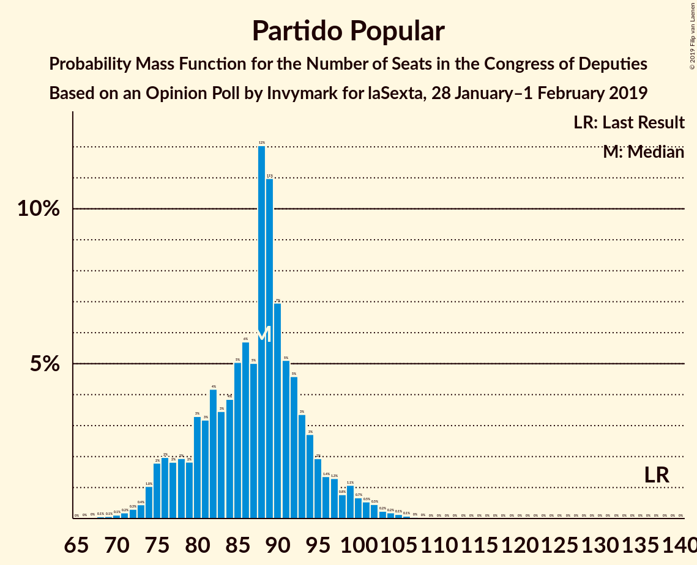
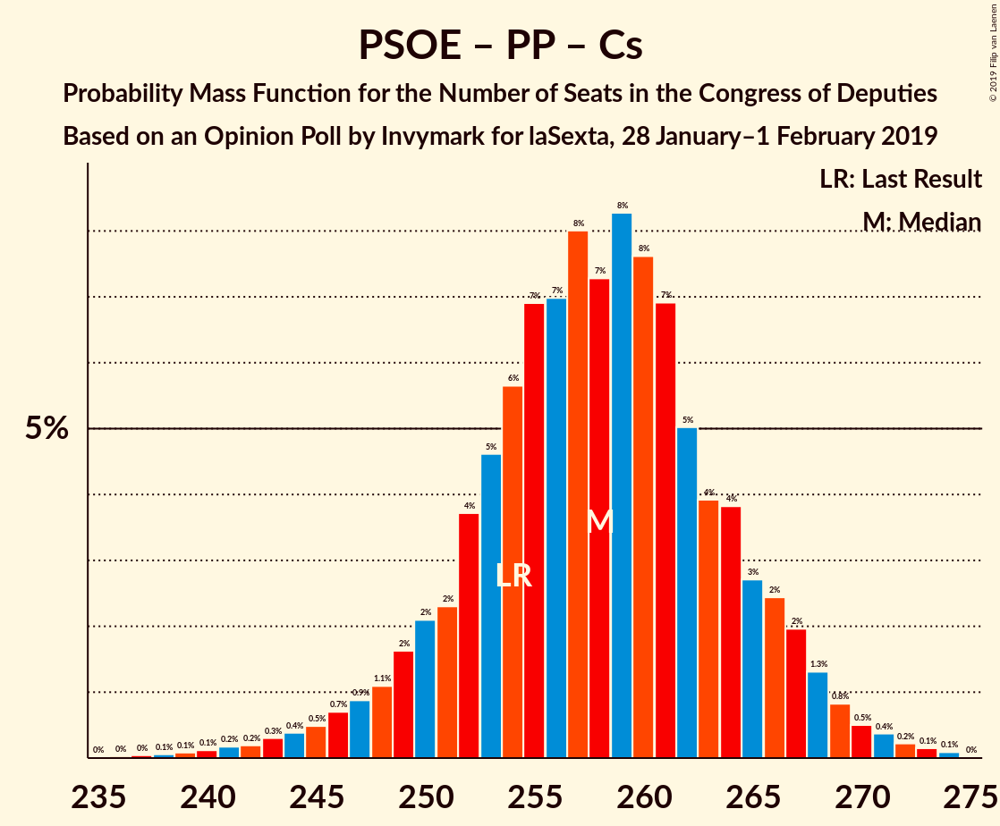
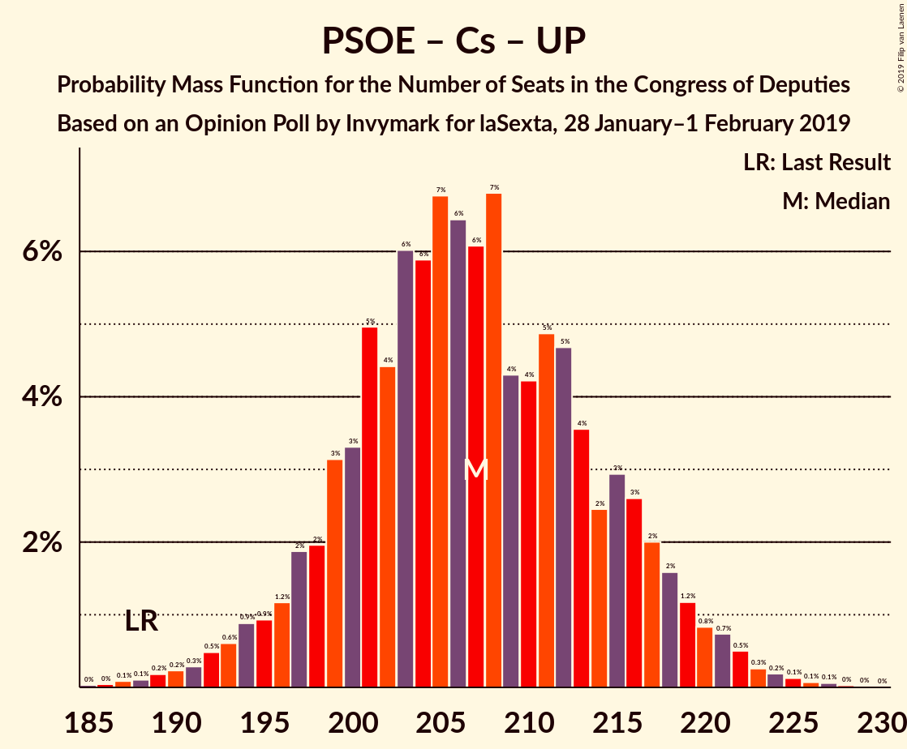

# Opinion Poll by Invymark for laSexta, 28 January–1 February 2019

<a href="#voting-intentions">Voting Intentions</a> | <a href="#seats">Seats</a> | <a href="#coalitions">Coalitions</a> | <a href="#technical-information">Technical Information</a>

## Voting Intentions

### Confidence Intervals

| Party | Last Result | Poll Result | 80% Confidence Interval | 90% Confidence Interval | 95% Confidence Interval | 99% Confidence Interval |
|:-----:|:-----------:|:-----------:|:-----------------------:|:-----------------------:|:-----------------------:|:-----------------------:|
| Partido Socialista Obrero Español | 22.6% | 23.9% | 22.4–25.6% |21.9–26.0% |21.6–26.4% |20.9–27.2% |
| Partido Popular | 33.0% | 21.3% | 19.9–22.9% |19.5–23.4% |19.1–23.7% |18.4–24.5% |
| Ciudadanos–Partido de la Ciudadanía | 13.1% | 20.9% | 19.5–22.5% |19.1–22.9% |18.7–23.3% |18.0–24.1% |
| Unidos Podemos | 21.2% | 13.5% | 12.3–14.8% |12.0–15.2% |11.7–15.6% |11.1–16.2% |
| Vox | 0.2% | 11.2% | 10.1–12.4% |9.8–12.8% |9.5–13.1% |9.0–13.7% |

*Note:* The poll result column reflects the actual value used in the calculations. Published results may vary slightly, and in addition be rounded to fewer digits.

## Seats

### Confidence Intervals

| Party | Last Result | Median | 80% Confidence Interval | 90% Confidence Interval | 95% Confidence Interval | 99% Confidence Interval |
|:-----:|:-----------:|:------:|:-----------------------:|:-----------------------:|:-----------------------:|:-----------------------:|
| <a href="#partido-socialista-obrero-español">Partido Socialista Obrero Español</a> | 85 | 88 | 86–112 |86–112 |86–112 |86–112 |
| <a href="#partido-popular">Partido Popular</a> | 137 | 88 | 80–104 |80–104 |75–104 |75–104 |
| <a href="#ciudadanos–partido-de-la-ciudadanía">Ciudadanos–Partido de la Ciudadanía</a> | 32 | 75 | 74–83 |74–83 |74–83 |56–83 |
| <a href="#unidos-podemos">Unidos Podemos</a> | 71 | 31 | 30–32 |30–32 |30–42 |30–42 |
| <a href="#vox">Vox</a> | 0 | 25 | 21–33 |21–33 |19–33 |19–41 |

### Partido Socialista Obrero Español

*For a full overview of the results for this party, see the [Partido Socialista Obrero Español](party-partidosocialistaobreroespañol.html) page.*

| Number of Seats | Probability | Accumulated | Special Marks |
|:---------------:|:-----------:|:-----------:|:-------------:|
| 85 | 0% | 100% | Last Result |
| 86 | 28% | 100% |  |
| 87 | 8% | 72% |  |
| 88 | 39% | 64% | Median |
| 89 | 0% | 25% |  |
| 90 | 1.2% | 25% |  |
| 91 | 0% | 24% |  |
| 92 | 0% | 24% |  |
| 93 | 0% | 24% |  |
| 94 | 0.5% | 24% |  |
| 95 | 0% | 23% |  |
| 96 | 0% | 23% |  |
| 97 | 0% | 23% |  |
| 98 | 0% | 23% |  |
| 99 | 0% | 23% |  |
| 100 | 0% | 23% |  |
| 101 | 0% | 23% |  |
| 102 | 0% | 23% |  |
| 103 | 0% | 23% |  |
| 104 | 0% | 23% |  |
| 105 | 0% | 23% |  |
| 106 | 0% | 23% |  |
| 107 | 0% | 23% |  |
| 108 | 0% | 23% |  |
| 109 | 0% | 23% |  |
| 110 | 2% | 23% |  |
| 111 | 0.5% | 21% |  |
| 112 | 20% | 20% |  |
| 113 | 0% | 0% |  |

### Partido Popular

*For a full overview of the results for this party, see the [Partido Popular](party-partidopopular.html) page.*

| Number of Seats | Probability | Accumulated | Special Marks |
|:---------------:|:-----------:|:-----------:|:-------------:|
| 67 | 0.1% | 100% |  |
| 68 | 0% | 99.9% |  |
| 69 | 0% | 99.9% |  |
| 70 | 0% | 99.8% |  |
| 71 | 0% | 99.8% |  |
| 72 | 0% | 99.8% |  |
| 73 | 0% | 99.8% |  |
| 74 | 0% | 99.8% |  |
| 75 | 3% | 99.8% |  |
| 76 | 0% | 97% |  |
| 77 | 0% | 97% |  |
| 78 | 0% | 97% |  |
| 79 | 0% | 97% |  |
| 80 | 7% | 97% |  |
| 81 | 10% | 90% |  |
| 82 | 3% | 80% |  |
| 83 | 0% | 77% |  |
| 84 | 0% | 77% |  |
| 85 | 0% | 77% |  |
| 86 | 0.3% | 77% |  |
| 87 | 12% | 77% |  |
| 88 | 22% | 65% | Median |
| 89 | 1.0% | 42% |  |
| 90 | 0.3% | 41% |  |
| 91 | 0% | 41% |  |
| 92 | 0% | 41% |  |
| 93 | 0% | 41% |  |
| 94 | 0% | 41% |  |
| 95 | 0% | 41% |  |
| 96 | 0% | 41% |  |
| 97 | 0% | 41% |  |
| 98 | 0% | 41% |  |
| 99 | 0% | 41% |  |
| 100 | 0% | 41% |  |
| 101 | 0% | 41% |  |
| 102 | 0% | 41% |  |
| 103 | 7% | 41% |  |
| 104 | 34% | 34% |  |
| 105 | 0% | 0% |  |
| 106 | 0% | 0% |  |
| 107 | 0% | 0% |  |
| 108 | 0% | 0% |  |
| 109 | 0% | 0% |  |
| 110 | 0% | 0% |  |
| 111 | 0% | 0% |  |
| 112 | 0% | 0% |  |
| 113 | 0% | 0% |  |
| 114 | 0% | 0% |  |
| 115 | 0% | 0% |  |
| 116 | 0% | 0% |  |
| 117 | 0% | 0% |  |
| 118 | 0% | 0% |  |
| 119 | 0% | 0% |  |
| 120 | 0% | 0% |  |
| 121 | 0% | 0% |  |
| 122 | 0% | 0% |  |
| 123 | 0% | 0% |  |
| 124 | 0% | 0% |  |
| 125 | 0% | 0% |  |
| 126 | 0% | 0% |  |
| 127 | 0% | 0% |  |
| 128 | 0% | 0% |  |
| 129 | 0% | 0% |  |
| 130 | 0% | 0% |  |
| 131 | 0% | 0% |  |
| 132 | 0% | 0% |  |
| 133 | 0% | 0% |  |
| 134 | 0% | 0% |  |
| 135 | 0% | 0% |  |
| 136 | 0% | 0% |  |
| 137 | 0% | 0% | Last Result |

### Ciudadanos–Partido de la Ciudadanía

*For a full overview of the results for this party, see the [Ciudadanos–Partido de la Ciudadanía](party-ciudadanos–partidodelaciudadanía.html) page.*

| Number of Seats | Probability | Accumulated | Special Marks |
|:---------------:|:-----------:|:-----------:|:-------------:|
| 32 | 0% | 100% | Last Result |
| 33 | 0% | 100% |  |
| 34 | 0% | 100% |  |
| 35 | 0% | 100% |  |
| 36 | 0% | 100% |  |
| 37 | 0% | 100% |  |
| 38 | 0% | 100% |  |
| 39 | 0% | 100% |  |
| 40 | 0% | 100% |  |
| 41 | 0% | 100% |  |
| 42 | 0% | 100% |  |
| 43 | 0% | 100% |  |
| 44 | 0% | 100% |  |
| 45 | 0% | 100% |  |
| 46 | 0% | 100% |  |
| 47 | 0% | 100% |  |
| 48 | 0% | 100% |  |
| 49 | 0% | 100% |  |
| 50 | 0% | 100% |  |
| 51 | 0% | 100% |  |
| 52 | 0% | 100% |  |
| 53 | 0% | 100% |  |
| 54 | 0% | 100% |  |
| 55 | 0% | 100% |  |
| 56 | 0.5% | 100% |  |
| 57 | 0% | 99.5% |  |
| 58 | 0% | 99.5% |  |
| 59 | 0% | 99.5% |  |
| 60 | 0% | 99.5% |  |
| 61 | 0% | 99.4% |  |
| 62 | 0% | 99.4% |  |
| 63 | 0% | 99.4% |  |
| 64 | 0% | 99.4% |  |
| 65 | 0% | 99.4% |  |
| 66 | 0% | 99.4% |  |
| 67 | 0% | 99.4% |  |
| 68 | 0% | 99.4% |  |
| 69 | 0% | 99.4% |  |
| 70 | 0% | 99.4% |  |
| 71 | 0% | 99.4% |  |
| 72 | 0% | 99.3% |  |
| 73 | 0% | 99.3% |  |
| 74 | 41% | 99.3% |  |
| 75 | 13% | 59% | Median |
| 76 | 10% | 46% |  |
| 77 | 0% | 36% |  |
| 78 | 0% | 36% |  |
| 79 | 0% | 36% |  |
| 80 | 0% | 36% |  |
| 81 | 0.1% | 36% |  |
| 82 | 6% | 36% |  |
| 83 | 29% | 29% |  |
| 84 | 0.1% | 0.2% |  |
| 85 | 0% | 0% |  |

### Unidos Podemos

*For a full overview of the results for this party, see the [Unidos Podemos](party-unidospodemos.html) page.*

| Number of Seats | Probability | Accumulated | Special Marks |
|:---------------:|:-----------:|:-----------:|:-------------:|
| 27 | 0% | 100% |  |
| 28 | 0% | 99.9% |  |
| 29 | 0.1% | 99.9% |  |
| 30 | 39% | 99.8% |  |
| 31 | 17% | 61% | Median |
| 32 | 41% | 44% |  |
| 33 | 0% | 3% |  |
| 34 | 0% | 3% |  |
| 35 | 0% | 3% |  |
| 36 | 0% | 3% |  |
| 37 | 0% | 3% |  |
| 38 | 0% | 3% |  |
| 39 | 0% | 3% |  |
| 40 | 0% | 3% |  |
| 41 | 0.5% | 3% |  |
| 42 | 3% | 3% |  |
| 43 | 0% | 0.1% |  |
| 44 | 0% | 0% |  |
| 45 | 0% | 0% |  |
| 46 | 0% | 0% |  |
| 47 | 0% | 0% |  |
| 48 | 0% | 0% |  |
| 49 | 0% | 0% |  |
| 50 | 0% | 0% |  |
| 51 | 0% | 0% |  |
| 52 | 0% | 0% |  |
| 53 | 0% | 0% |  |
| 54 | 0% | 0% |  |
| 55 | 0% | 0% |  |
| 56 | 0% | 0% |  |
| 57 | 0% | 0% |  |
| 58 | 0% | 0% |  |
| 59 | 0% | 0% |  |
| 60 | 0% | 0% |  |
| 61 | 0% | 0% |  |
| 62 | 0% | 0% |  |
| 63 | 0% | 0% |  |
| 64 | 0% | 0% |  |
| 65 | 0% | 0% |  |
| 66 | 0% | 0% |  |
| 67 | 0% | 0% |  |
| 68 | 0% | 0% |  |
| 69 | 0% | 0% |  |
| 70 | 0% | 0% |  |
| 71 | 0% | 0% | Last Result |

### Vox

*For a full overview of the results for this party, see the [Vox](party-vox.html) page.*

| Number of Seats | Probability | Accumulated | Special Marks |
|:---------------:|:-----------:|:-----------:|:-------------:|
| 0 | 0% | 100% | Last Result |
| 1 | 0% | 100% |  |
| 2 | 0% | 100% |  |
| 3 | 0% | 100% |  |
| 4 | 0% | 100% |  |
| 5 | 0% | 100% |  |
| 6 | 0% | 100% |  |
| 7 | 0% | 100% |  |
| 8 | 0% | 100% |  |
| 9 | 0% | 100% |  |
| 10 | 0% | 100% |  |
| 11 | 0% | 100% |  |
| 12 | 0% | 100% |  |
| 13 | 0% | 100% |  |
| 14 | 0% | 100% |  |
| 15 | 0% | 100% |  |
| 16 | 0% | 99.9% |  |
| 17 | 0% | 99.9% |  |
| 18 | 0% | 99.9% |  |
| 19 | 3% | 99.9% |  |
| 20 | 0% | 97% |  |
| 21 | 20% | 97% |  |
| 22 | 0% | 77% |  |
| 23 | 0% | 77% |  |
| 24 | 13% | 77% |  |
| 25 | 26% | 64% | Median |
| 26 | 3% | 39% |  |
| 27 | 0% | 36% |  |
| 28 | 0.1% | 36% |  |
| 29 | 0.1% | 36% |  |
| 30 | 1.2% | 36% |  |
| 31 | 0% | 35% |  |
| 32 | 22% | 35% |  |
| 33 | 12% | 13% |  |
| 34 | 0.3% | 0.9% |  |
| 35 | 0.1% | 0.6% |  |
| 36 | 0% | 0.6% |  |
| 37 | 0% | 0.6% |  |
| 38 | 0% | 0.6% |  |
| 39 | 0% | 0.6% |  |
| 40 | 0% | 0.5% |  |
| 41 | 0.2% | 0.5% |  |
| 42 | 0.3% | 0.3% |  |
| 43 | 0% | 0% |  |

## Coalitions

### Confidence Intervals

| Coalition | Last Result | Median | Majority? | 80% Confidence Interval | 90% Confidence Interval | 95% Confidence Interval | 99% Confidence Interval |
|:---------:|:-----------:|:------:|:---------:|:-----------------------:|:-----------------------:|:-----------------------:|:-----------------------:|
| Partido Socialista Obrero Español – Partido Popular – Ciudadanos–Partido de la Ciudadanía | 254 | 264 | 100% | 258–268 | 257–268 | 257–269 | 240–269 |
| Partido Socialista Obrero Español – Ciudadanos–Partido de la Ciudadanía – Unidos Podemos | 188 | 201 | 100% | 192–219 | 192–219 | 192–228 | 191–229 |
| Partido Popular – Ciudadanos–Partido de la Ciudadanía – Vox | 169 | 203 | 97% | 177–203 | 177–203 | 170–203 | 170–203 |
| Partido Socialista Obrero Español – Partido Popular | 222 | 190 | 88% | 175–193 | 175–193 | 175–194 | 175–194 |
| Partido Socialista Obrero Español – Ciudadanos–Partido de la Ciudadanía | 117 | 171 | 23% | 160–187 | 160–188 | 160–188 | 150–188 |
| Partido Popular – Ciudadanos–Partido de la Ciudadanía | 169 | 171 | 41% | 156–178 | 156–178 | 151–178 | 146–178 |
| Partido Socialista Obrero Español – Unidos Podemos | 156 | 118 | 0% | 118–143 | 118–143 | 118–152 | 118–152 |
| Partido Popular – Vox | 137 | 120 | 0% | 101–129 | 101–129 | 94–129 | 94–130 |
| Partido Socialista Obrero Español | 85 | 88 | 0% | 86–112 | 86–112 | 86–112 | 86–112 |
| Partido Popular | 137 | 88 | 0% | 80–104 | 80–104 | 75–104 | 75–104 |

### Partido Socialista Obrero Español – Partido Popular – Ciudadanos–Partido de la Ciudadanía

| Number of Seats | Probability | Accumulated | Special Marks |
|:---------------:|:-----------:|:-----------:|:-------------:|
| 236 | 0% | 100% |  |
| 237 | 0% | 99.9% |  |
| 238 | 0.3% | 99.9% |  |
| 239 | 0% | 99.6% |  |
| 240 | 0.2% | 99.6% |  |
| 241 | 0% | 99.4% |  |
| 242 | 0% | 99.4% |  |
| 243 | 0% | 99.4% |  |
| 244 | 0% | 99.4% |  |
| 245 | 0% | 99.4% |  |
| 246 | 0% | 99.4% |  |
| 247 | 0% | 99.4% |  |
| 248 | 0% | 99.4% |  |
| 249 | 0% | 99.4% |  |
| 250 | 0% | 99.4% |  |
| 251 | 0% | 99.4% | Median |
| 252 | 0% | 99.4% |  |
| 253 | 0% | 99.4% |  |
| 254 | 0% | 99.4% | Last Result |
| 255 | 0% | 99.4% |  |
| 256 | 0.3% | 99.4% |  |
| 257 | 5% | 99.1% |  |
| 258 | 7% | 94% |  |
| 259 | 22% | 87% |  |
| 260 | 0% | 65% |  |
| 261 | 3% | 65% |  |
| 262 | 0.5% | 62% |  |
| 263 | 3% | 61% |  |
| 264 | 26% | 59% |  |
| 265 | 13% | 33% |  |
| 266 | 0% | 20% |  |
| 267 | 0% | 20% |  |
| 268 | 17% | 20% |  |
| 269 | 3% | 3% |  |
| 270 | 0.1% | 0.2% |  |
| 271 | 0% | 0.1% |  |
| 272 | 0% | 0.1% |  |
| 273 | 0% | 0.1% |  |
| 274 | 0% | 0% |  |

### Partido Socialista Obrero Español – Ciudadanos–Partido de la Ciudadanía – Unidos Podemos

| Number of Seats | Probability | Accumulated | Special Marks |
|:---------------:|:-----------:|:-----------:|:-------------:|
| 188 | 0% | 100% | Last Result |
| 189 | 0% | 100% |  |
| 190 | 0% | 99.9% |  |
| 191 | 0.5% | 99.9% |  |
| 192 | 28% | 99.4% |  |
| 193 | 8% | 71% |  |
| 194 | 4% | 63% | Median |
| 195 | 0% | 59% |  |
| 196 | 0% | 59% |  |
| 197 | 0% | 59% |  |
| 198 | 0% | 59% |  |
| 199 | 0% | 59% |  |
| 200 | 5% | 59% |  |
| 201 | 29% | 54% |  |
| 202 | 1.1% | 24% |  |
| 203 | 0% | 23% |  |
| 204 | 0% | 23% |  |
| 205 | 0% | 23% |  |
| 206 | 0% | 23% |  |
| 207 | 0% | 23% |  |
| 208 | 0% | 23% |  |
| 209 | 0% | 23% |  |
| 210 | 0% | 23% |  |
| 211 | 0% | 23% |  |
| 212 | 0% | 23% |  |
| 213 | 0% | 23% |  |
| 214 | 0% | 23% |  |
| 215 | 0% | 23% |  |
| 216 | 0% | 23% |  |
| 217 | 3% | 23% |  |
| 218 | 10% | 20% |  |
| 219 | 7% | 10% |  |
| 220 | 0% | 3% |  |
| 221 | 0% | 3% |  |
| 222 | 0% | 3% |  |
| 223 | 0% | 3% |  |
| 224 | 0% | 3% |  |
| 225 | 0.1% | 3% |  |
| 226 | 0% | 3% |  |
| 227 | 0% | 3% |  |
| 228 | 2% | 3% |  |
| 229 | 0.5% | 0.5% |  |
| 230 | 0% | 0% |  |

### Partido Popular – Ciudadanos–Partido de la Ciudadanía – Vox

| Number of Seats | Probability | Accumulated | Special Marks |
|:---------------:|:-----------:|:-----------:|:-------------:|
| 169 | 0% | 100% | Last Result |
| 170 | 3% | 100% |  |
| 171 | 0% | 97% |  |
| 172 | 0% | 97% |  |
| 173 | 0% | 97% |  |
| 174 | 0% | 97% |  |
| 175 | 0% | 97% |  |
| 176 | 0% | 97% | Majority |
| 177 | 17% | 97% |  |
| 178 | 3% | 80% |  |
| 179 | 0.2% | 77% |  |
| 180 | 0.1% | 77% |  |
| 181 | 0% | 77% |  |
| 182 | 0% | 77% |  |
| 183 | 0% | 77% |  |
| 184 | 0% | 77% |  |
| 185 | 0% | 77% |  |
| 186 | 0.3% | 77% |  |
| 187 | 0.2% | 76% |  |
| 188 | 0% | 76% | Median |
| 189 | 0% | 76% |  |
| 190 | 0% | 76% |  |
| 191 | 0% | 76% |  |
| 192 | 0% | 76% |  |
| 193 | 0% | 76% |  |
| 194 | 0% | 76% |  |
| 195 | 0% | 76% |  |
| 196 | 0% | 76% |  |
| 197 | 0% | 76% |  |
| 198 | 0% | 76% |  |
| 199 | 0% | 76% |  |
| 200 | 0% | 76% |  |
| 201 | 6% | 76% |  |
| 202 | 13% | 71% |  |
| 203 | 58% | 58% |  |
| 204 | 0% | 0.1% |  |
| 205 | 0% | 0.1% |  |
| 206 | 0% | 0.1% |  |
| 207 | 0% | 0% |  |

### Partido Socialista Obrero Español – Partido Popular

| Number of Seats | Probability | Accumulated | Special Marks |
|:---------------:|:-----------:|:-----------:|:-------------:|
| 167 | 0% | 100% |  |
| 168 | 0% | 99.9% |  |
| 169 | 0% | 99.9% |  |
| 170 | 0% | 99.9% |  |
| 171 | 0% | 99.9% |  |
| 172 | 0% | 99.9% |  |
| 173 | 0% | 99.9% |  |
| 174 | 0.3% | 99.9% |  |
| 175 | 12% | 99.6% |  |
| 176 | 22% | 88% | Median, Majority |
| 177 | 0% | 66% |  |
| 178 | 0% | 66% |  |
| 179 | 1.1% | 66% |  |
| 180 | 0.2% | 64% |  |
| 181 | 0% | 64% |  |
| 182 | 0.3% | 64% |  |
| 183 | 0% | 64% |  |
| 184 | 0.2% | 64% |  |
| 185 | 2% | 64% |  |
| 186 | 0.5% | 62% |  |
| 187 | 0% | 61% |  |
| 188 | 0% | 61% |  |
| 189 | 3% | 61% |  |
| 190 | 26% | 58% |  |
| 191 | 13% | 33% |  |
| 192 | 7% | 20% |  |
| 193 | 10% | 13% |  |
| 194 | 3% | 3% |  |
| 195 | 0% | 0.1% |  |
| 196 | 0% | 0.1% |  |
| 197 | 0% | 0.1% |  |
| 198 | 0% | 0.1% |  |
| 199 | 0% | 0.1% |  |
| 200 | 0% | 0.1% |  |
| 201 | 0% | 0.1% |  |
| 202 | 0% | 0.1% |  |
| 203 | 0% | 0.1% |  |
| 204 | 0% | 0.1% |  |
| 205 | 0% | 0.1% |  |
| 206 | 0% | 0.1% |  |
| 207 | 0% | 0% |  |
| 208 | 0% | 0% |  |
| 209 | 0% | 0% |  |
| 210 | 0% | 0% |  |
| 211 | 0% | 0% |  |
| 212 | 0% | 0% |  |
| 213 | 0% | 0% |  |
| 214 | 0% | 0% |  |
| 215 | 0% | 0% |  |
| 216 | 0% | 0% |  |
| 217 | 0% | 0% |  |
| 218 | 0% | 0% |  |
| 219 | 0% | 0% |  |
| 220 | 0% | 0% |  |
| 221 | 0% | 0% |  |
| 222 | 0% | 0% | Last Result |

### Partido Socialista Obrero Español – Ciudadanos–Partido de la Ciudadanía

| Number of Seats | Probability | Accumulated | Special Marks |
|:---------------:|:-----------:|:-----------:|:-------------:|
| 117 | 0% | 100% | Last Result |
| 118 | 0% | 100% |  |
| 119 | 0% | 100% |  |
| 120 | 0% | 100% |  |
| 121 | 0% | 100% |  |
| 122 | 0% | 100% |  |
| 123 | 0% | 100% |  |
| 124 | 0% | 100% |  |
| 125 | 0% | 100% |  |
| 126 | 0% | 100% |  |
| 127 | 0% | 100% |  |
| 128 | 0% | 100% |  |
| 129 | 0% | 100% |  |
| 130 | 0% | 100% |  |
| 131 | 0% | 100% |  |
| 132 | 0% | 100% |  |
| 133 | 0% | 100% |  |
| 134 | 0% | 100% |  |
| 135 | 0% | 100% |  |
| 136 | 0% | 100% |  |
| 137 | 0% | 100% |  |
| 138 | 0% | 100% |  |
| 139 | 0% | 100% |  |
| 140 | 0% | 100% |  |
| 141 | 0% | 100% |  |
| 142 | 0% | 100% |  |
| 143 | 0% | 100% |  |
| 144 | 0% | 100% |  |
| 145 | 0% | 100% |  |
| 146 | 0% | 100% |  |
| 147 | 0% | 100% |  |
| 148 | 0% | 100% |  |
| 149 | 0% | 99.9% |  |
| 150 | 0.5% | 99.9% |  |
| 151 | 0% | 99.4% |  |
| 152 | 0% | 99.4% |  |
| 153 | 0% | 99.4% |  |
| 154 | 0% | 99.4% |  |
| 155 | 0% | 99.4% |  |
| 156 | 0% | 99.4% |  |
| 157 | 0% | 99.4% |  |
| 158 | 0% | 99.4% |  |
| 159 | 0% | 99.4% |  |
| 160 | 28% | 99.4% |  |
| 161 | 8% | 71% |  |
| 162 | 4% | 63% |  |
| 163 | 0% | 59% | Median |
| 164 | 0% | 59% |  |
| 165 | 0% | 59% |  |
| 166 | 0% | 59% |  |
| 167 | 0% | 59% |  |
| 168 | 0% | 59% |  |
| 169 | 0% | 59% |  |
| 170 | 5% | 59% |  |
| 171 | 29% | 54% |  |
| 172 | 1.0% | 24% |  |
| 173 | 0% | 23% |  |
| 174 | 0% | 23% |  |
| 175 | 0% | 23% |  |
| 176 | 0% | 23% | Majority |
| 177 | 0% | 23% |  |
| 178 | 0% | 23% |  |
| 179 | 0% | 23% |  |
| 180 | 0% | 23% |  |
| 181 | 0% | 23% |  |
| 182 | 0% | 23% |  |
| 183 | 0% | 23% |  |
| 184 | 0% | 23% |  |
| 185 | 0% | 23% |  |
| 186 | 2% | 23% |  |
| 187 | 13% | 21% |  |
| 188 | 7% | 8% |  |
| 189 | 0% | 0.2% |  |
| 190 | 0% | 0.2% |  |
| 191 | 0% | 0.2% |  |
| 192 | 0% | 0.2% |  |
| 193 | 0% | 0.2% |  |
| 194 | 0% | 0.2% |  |
| 195 | 0% | 0.2% |  |
| 196 | 0.1% | 0.2% |  |
| 197 | 0% | 0% |  |

### Partido Popular – Ciudadanos–Partido de la Ciudadanía

| Number of Seats | Probability | Accumulated | Special Marks |
|:---------------:|:-----------:|:-----------:|:-------------:|
| 144 | 0.3% | 100% |  |
| 145 | 0% | 99.6% |  |
| 146 | 0.2% | 99.6% |  |
| 147 | 0% | 99.4% |  |
| 148 | 0% | 99.4% |  |
| 149 | 0% | 99.4% |  |
| 150 | 0% | 99.4% |  |
| 151 | 3% | 99.4% |  |
| 152 | 0% | 97% |  |
| 153 | 0% | 97% |  |
| 154 | 0% | 97% |  |
| 155 | 0% | 97% |  |
| 156 | 17% | 97% |  |
| 157 | 3% | 79% |  |
| 158 | 0.1% | 76% |  |
| 159 | 0% | 76% |  |
| 160 | 0% | 76% |  |
| 161 | 0% | 76% |  |
| 162 | 0% | 76% |  |
| 163 | 0% | 76% | Median |
| 164 | 0% | 76% |  |
| 165 | 0% | 76% |  |
| 166 | 0% | 76% |  |
| 167 | 0% | 76% |  |
| 168 | 0.3% | 76% |  |
| 169 | 5% | 76% | Last Result |
| 170 | 7% | 71% |  |
| 171 | 23% | 64% |  |
| 172 | 0% | 41% |  |
| 173 | 0% | 41% |  |
| 174 | 0% | 41% |  |
| 175 | 0% | 41% |  |
| 176 | 0% | 41% | Majority |
| 177 | 7% | 41% |  |
| 178 | 34% | 34% |  |
| 179 | 0% | 0% |  |

### Partido Socialista Obrero Español – Unidos Podemos

| Number of Seats | Probability | Accumulated | Special Marks |
|:---------------:|:-----------:|:-----------:|:-------------:|
| 114 | 0% | 100% |  |
| 115 | 0% | 99.9% |  |
| 116 | 0% | 99.9% |  |
| 117 | 0.1% | 99.9% |  |
| 118 | 62% | 99.9% |  |
| 119 | 8% | 37% | Median |
| 120 | 6% | 29% |  |
| 121 | 0% | 24% |  |
| 122 | 0% | 24% |  |
| 123 | 0% | 24% |  |
| 124 | 0% | 24% |  |
| 125 | 0% | 24% |  |
| 126 | 0% | 24% |  |
| 127 | 0% | 24% |  |
| 128 | 0% | 24% |  |
| 129 | 0% | 24% |  |
| 130 | 0% | 24% |  |
| 131 | 0% | 24% |  |
| 132 | 0% | 24% |  |
| 133 | 0% | 24% |  |
| 134 | 0% | 24% |  |
| 135 | 0.5% | 24% |  |
| 136 | 0% | 23% |  |
| 137 | 0% | 23% |  |
| 138 | 0% | 23% |  |
| 139 | 0% | 23% |  |
| 140 | 0% | 23% |  |
| 141 | 0.1% | 23% |  |
| 142 | 3% | 23% |  |
| 143 | 17% | 20% |  |
| 144 | 0% | 3% |  |
| 145 | 0% | 3% |  |
| 146 | 0% | 3% |  |
| 147 | 0% | 3% |  |
| 148 | 0% | 3% |  |
| 149 | 0% | 3% |  |
| 150 | 0% | 3% |  |
| 151 | 0% | 3% |  |
| 152 | 2% | 3% |  |
| 153 | 0.5% | 0.5% |  |
| 154 | 0% | 0% |  |
| 155 | 0% | 0% |  |
| 156 | 0% | 0% | Last Result |

### Partido Popular – Vox

| Number of Seats | Probability | Accumulated | Special Marks |
|:---------------:|:-----------:|:-----------:|:-------------:|
| 94 | 3% | 100% |  |
| 95 | 0% | 97% |  |
| 96 | 0.1% | 97% |  |
| 97 | 0% | 97% |  |
| 98 | 0% | 97% |  |
| 99 | 0% | 97% |  |
| 100 | 0% | 97% |  |
| 101 | 7% | 97% |  |
| 102 | 10% | 90% |  |
| 103 | 3% | 80% |  |
| 104 | 0% | 77% |  |
| 105 | 0% | 77% |  |
| 106 | 0% | 77% |  |
| 107 | 0% | 77% |  |
| 108 | 0% | 77% |  |
| 109 | 0% | 77% |  |
| 110 | 0% | 77% |  |
| 111 | 0% | 77% |  |
| 112 | 0% | 77% |  |
| 113 | 0% | 77% | Median |
| 114 | 0% | 77% |  |
| 115 | 0% | 77% |  |
| 116 | 0% | 77% |  |
| 117 | 0% | 77% |  |
| 118 | 0% | 77% |  |
| 119 | 1.1% | 77% |  |
| 120 | 34% | 76% |  |
| 121 | 0% | 41% |  |
| 122 | 0% | 41% |  |
| 123 | 0% | 41% |  |
| 124 | 0% | 41% |  |
| 125 | 0% | 41% |  |
| 126 | 0% | 41% |  |
| 127 | 4% | 41% |  |
| 128 | 8% | 37% |  |
| 129 | 28% | 29% |  |
| 130 | 0.3% | 0.6% |  |
| 131 | 0.2% | 0.3% |  |
| 132 | 0% | 0% |  |
| 133 | 0% | 0% |  |
| 134 | 0% | 0% |  |
| 135 | 0% | 0% |  |
| 136 | 0% | 0% |  |
| 137 | 0% | 0% | Last Result |

### Partido Socialista Obrero Español

| Number of Seats | Probability | Accumulated | Special Marks |
|:---------------:|:-----------:|:-----------:|:-------------:|
| 85 | 0% | 100% | Last Result |
| 86 | 28% | 100% |  |
| 87 | 8% | 72% |  |
| 88 | 39% | 64% | Median |
| 89 | 0% | 25% |  |
| 90 | 1.2% | 25% |  |
| 91 | 0% | 24% |  |
| 92 | 0% | 24% |  |
| 93 | 0% | 24% |  |
| 94 | 0.5% | 24% |  |
| 95 | 0% | 23% |  |
| 96 | 0% | 23% |  |
| 97 | 0% | 23% |  |
| 98 | 0% | 23% |  |
| 99 | 0% | 23% |  |
| 100 | 0% | 23% |  |
| 101 | 0% | 23% |  |
| 102 | 0% | 23% |  |
| 103 | 0% | 23% |  |
| 104 | 0% | 23% |  |
| 105 | 0% | 23% |  |
| 106 | 0% | 23% |  |
| 107 | 0% | 23% |  |
| 108 | 0% | 23% |  |
| 109 | 0% | 23% |  |
| 110 | 2% | 23% |  |
| 111 | 0.5% | 21% |  |
| 112 | 20% | 20% |  |
| 113 | 0% | 0% |  |

### Partido Popular

| Number of Seats | Probability | Accumulated | Special Marks |
|:---------------:|:-----------:|:-----------:|:-------------:|
| 67 | 0.1% | 100% |  |
| 68 | 0% | 99.9% |  |
| 69 | 0% | 99.9% |  |
| 70 | 0% | 99.8% |  |
| 71 | 0% | 99.8% |  |
| 72 | 0% | 99.8% |  |
| 73 | 0% | 99.8% |  |
| 74 | 0% | 99.8% |  |
| 75 | 3% | 99.8% |  |
| 76 | 0% | 97% |  |
| 77 | 0% | 97% |  |
| 78 | 0% | 97% |  |
| 79 | 0% | 97% |  |
| 80 | 7% | 97% |  |
| 81 | 10% | 90% |  |
| 82 | 3% | 80% |  |
| 83 | 0% | 77% |  |
| 84 | 0% | 77% |  |
| 85 | 0% | 77% |  |
| 86 | 0.3% | 77% |  |
| 87 | 12% | 77% |  |
| 88 | 22% | 65% | Median |
| 89 | 1.0% | 42% |  |
| 90 | 0.3% | 41% |  |
| 91 | 0% | 41% |  |
| 92 | 0% | 41% |  |
| 93 | 0% | 41% |  |
| 94 | 0% | 41% |  |
| 95 | 0% | 41% |  |
| 96 | 0% | 41% |  |
| 97 | 0% | 41% |  |
| 98 | 0% | 41% |  |
| 99 | 0% | 41% |  |
| 100 | 0% | 41% |  |
| 101 | 0% | 41% |  |
| 102 | 0% | 41% |  |
| 103 | 7% | 41% |  |
| 104 | 34% | 34% |  |
| 105 | 0% | 0% |  |
| 106 | 0% | 0% |  |
| 107 | 0% | 0% |  |
| 108 | 0% | 0% |  |
| 109 | 0% | 0% |  |
| 110 | 0% | 0% |  |
| 111 | 0% | 0% |  |
| 112 | 0% | 0% |  |
| 113 | 0% | 0% |  |
| 114 | 0% | 0% |  |
| 115 | 0% | 0% |  |
| 116 | 0% | 0% |  |
| 117 | 0% | 0% |  |
| 118 | 0% | 0% |  |
| 119 | 0% | 0% |  |
| 120 | 0% | 0% |  |
| 121 | 0% | 0% |  |
| 122 | 0% | 0% |  |
| 123 | 0% | 0% |  |
| 124 | 0% | 0% |  |
| 125 | 0% | 0% |  |
| 126 | 0% | 0% |  |
| 127 | 0% | 0% |  |
| 128 | 0% | 0% |  |
| 129 | 0% | 0% |  |
| 130 | 0% | 0% |  |
| 131 | 0% | 0% |  |
| 132 | 0% | 0% |  |
| 133 | 0% | 0% |  |
| 134 | 0% | 0% |  |
| 135 | 0% | 0% |  |
| 136 | 0% | 0% |  |
| 137 | 0% | 0% | Last Result |

## Technical Information

### Opinion Poll

+ **Polling firm:** Invymark
+ **Commissioner(s):** laSexta
+ **Fieldwork period:** 28 January–1 February 2019

### Calculations

+ **Sample size:** 1200
+ **Simulations done:** 1,024
+ **Error estimate:** 4.91%

