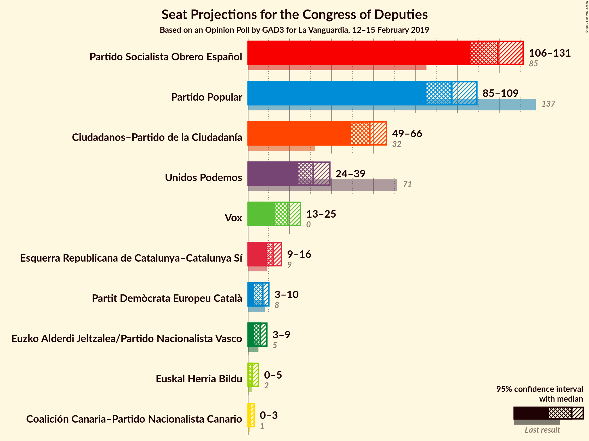
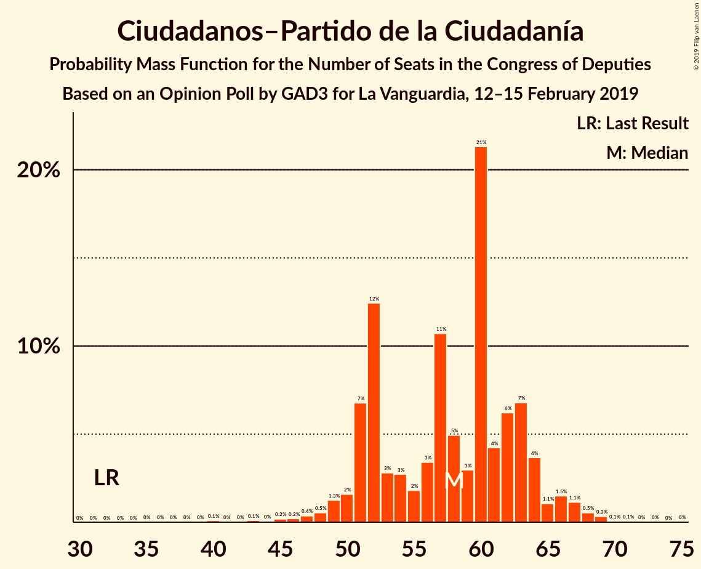
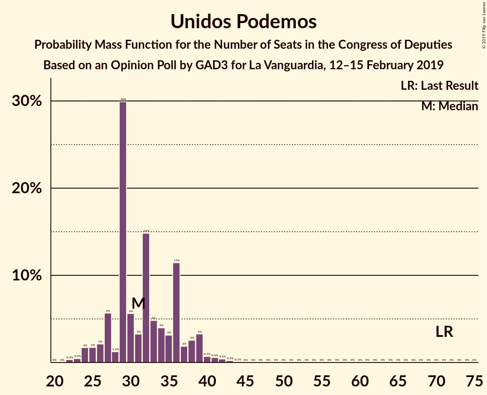
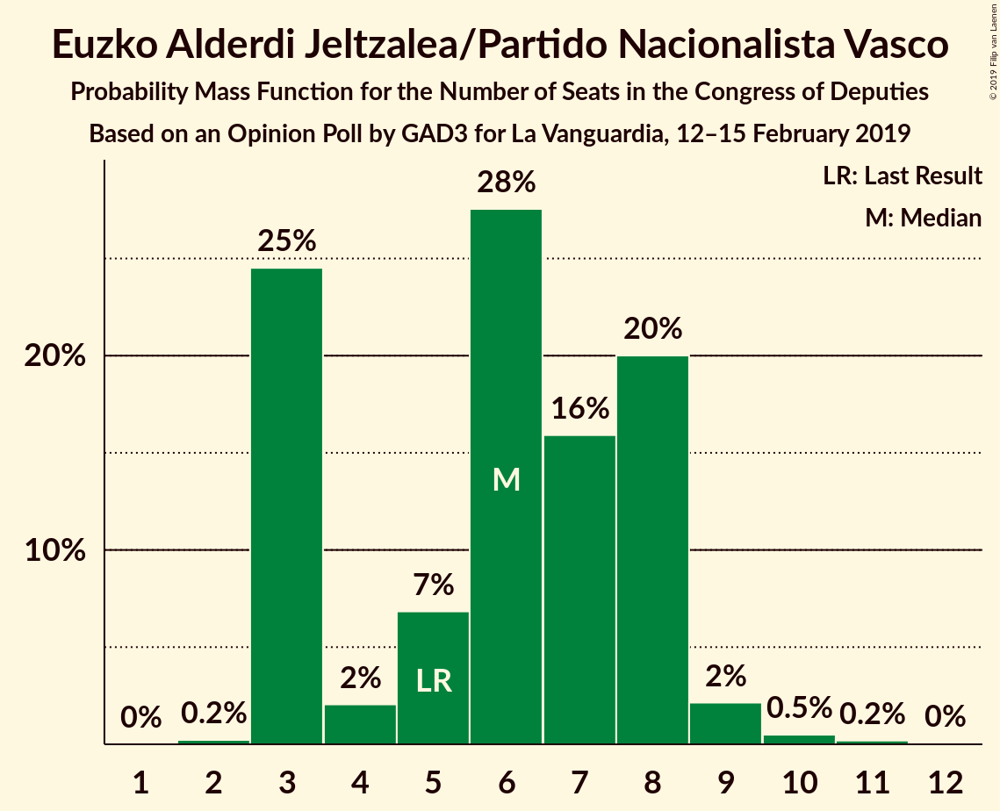
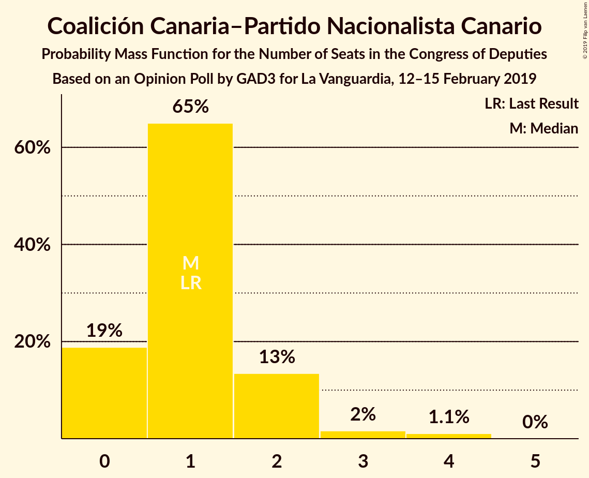
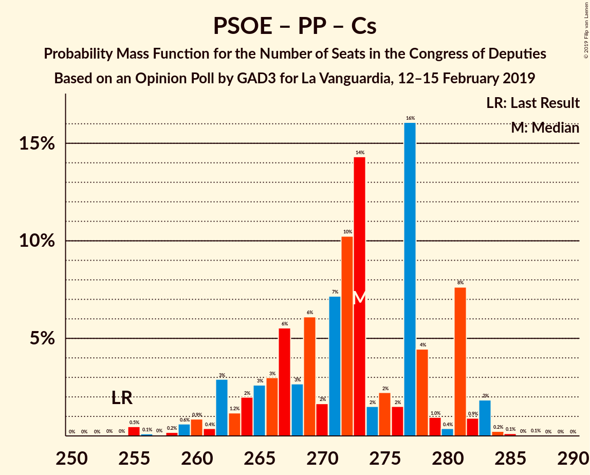

# Opinion Poll by GAD3 for La Vanguardia, 12–15 February 2019

<a href="#voting-intentions">Voting Intentions</a> | <a href="#seats">Seats</a> | <a href="#coalitions">Coalitions</a> | <a href="#technical-information">Technical Information</a>

## Voting Intentions

### Confidence Intervals

| Party | Last Result | Poll Result | 80% Confidence Interval | 90% Confidence Interval | 95% Confidence Interval | 99% Confidence Interval |
|:-----:|:-----------:|:-----------:|:-----------------------:|:-----------------------:|:-----------------------:|:-----------------------:|
| Partido Socialista Obrero Español | 22.6% | 28.2% | 26.5–29.9% |26.1–30.4% |25.7–30.8% |24.9–31.6% |
| Partido Popular | 33.0% | 23.6% | 22.1–25.2% |21.6–25.7% |21.3–26.1% |20.5–26.9% |
| Ciudadanos–Partido de la Ciudadanía | 13.1% | 17.1% | 15.7–18.5% |15.4–19.0% |15.1–19.3% |14.4–20.0% |
| Unidos Podemos | 21.2% | 12.4% | 11.3–13.7% |10.9–14.1% |10.7–14.4% |10.1–15.1% |
| Vox | 0.2% | 8.8% | 7.9–10.0% |7.6–10.3% |7.3–10.6% |6.9–11.2% |
| Esquerra Republicana de Catalunya–Catalunya Sí | 2.7% | 2.8% | 2.3–3.6% |2.1–3.8% |2.0–3.9% |1.8–4.3% |
| Partit Demòcrata Europeu Català | 2.0% | 1.6% | 1.2–2.2% |1.1–2.3% |1.0–2.5% |0.9–2.8% |
| Euzko Alderdi Jeltzalea/Partido Nacionalista Vasco | 1.2% | 1.2% | 0.9–1.7% |0.8–1.8% |0.7–2.0% |0.6–2.2% |
| Euskal Herria Bildu | 0.8% | 0.6% | 0.4–1.0% |0.3–1.1% |0.3–1.2% |0.2–1.4% |
| Coalición Canaria–Partido Nacionalista Canario | 0.3% | 0.3% | 0.2–0.7% |0.2–0.8% |0.1–0.9% |0.1–1.1% |

*Note:* The poll result column reflects the actual value used in the calculations. Published results may vary slightly, and in addition be rounded to fewer digits.

## Seats

### Confidence Intervals

| Party | Last Result | Median | 80% Confidence Interval | 90% Confidence Interval | 95% Confidence Interval | 99% Confidence Interval |
|:-----:|:-----------:|:------:|:-----------------------:|:-----------------------:|:-----------------------:|:-----------------------:|
| <a href="#partido-socialista-obrero-español">Partido Socialista Obrero Español</a> | 85 | 117 | 110–126 |106–126 |106–129 |100–136 |
| <a href="#partido-popular">Partido Popular</a> | 137 | 98 | 90–108 |86–109 |83–109 |80–111 |
| <a href="#ciudadanos–partido-de-la-ciudadanía">Ciudadanos–Partido de la Ciudadanía</a> | 32 | 58 | 51–62 |50–65 |49–68 |45–68 |
| <a href="#unidos-podemos">Unidos Podemos</a> | 71 | 31 | 29–35 |27–37 |26–40 |23–42 |
| <a href="#vox">Vox</a> | 0 | 18 | 13–22 |13–22 |13–23 |11–27 |
| <a href="#esquerra-republicana-de-catalunya–catalunya-sí">Esquerra Republicana de Catalunya–Catalunya Sí</a> | 9 | 11 | 9–18 |9–18 |8–18 |7–18 |
| <a href="#partit-demòcrata-europeu-català">Partit Demòcrata Europeu Català</a> | 8 | 6 | 3–9 |3–10 |3–10 |3–11 |
| <a href="#euzko-alderdi-jeltzalea/partido-nacionalista-vasco">Euzko Alderdi Jeltzalea/Partido Nacionalista Vasco</a> | 5 | 7 | 5–8 |3–8 |3–8 |3–11 |
| <a href="#euskal-herria-bildu">Euskal Herria Bildu</a> | 2 | 2 | 0–4 |0–5 |0–6 |0–7 |
| <a href="#coalición-canaria–partido-nacionalista-canario">Coalición Canaria–Partido Nacionalista Canario</a> | 1 | 1 | 1–2 |0–2 |0–3 |0–4 |

### Partido Socialista Obrero Español

*For a full overview of the results for this party, see the [Partido Socialista Obrero Español](party-partidosocialistaobreroespañol.html) page.*

| Number of Seats | Probability | Accumulated | Special Marks |
|:---------------:|:-----------:|:-----------:|:-------------:|
| 85 | 0% | 100% | Last Result |
| 86 | 0% | 100% |  |
| 87 | 0% | 100% |  |
| 88 | 0% | 100% |  |
| 89 | 0% | 100% |  |
| 90 | 0% | 100% |  |
| 91 | 0% | 100% |  |
| 92 | 0% | 100% |  |
| 93 | 0% | 99.9% |  |
| 94 | 0% | 99.9% |  |
| 95 | 0% | 99.9% |  |
| 96 | 0% | 99.9% |  |
| 97 | 0% | 99.9% |  |
| 98 | 0.1% | 99.9% |  |
| 99 | 0% | 99.8% |  |
| 100 | 0.3% | 99.7% |  |
| 101 | 0% | 99.5% |  |
| 102 | 0.1% | 99.5% |  |
| 103 | 0% | 99.4% |  |
| 104 | 0.4% | 99.4% |  |
| 105 | 0.6% | 99.0% |  |
| 106 | 5% | 98% |  |
| 107 | 0.9% | 94% |  |
| 108 | 0.3% | 93% |  |
| 109 | 2% | 92% |  |
| 110 | 4% | 90% |  |
| 111 | 0.4% | 86% |  |
| 112 | 0.3% | 86% |  |
| 113 | 4% | 86% |  |
| 114 | 13% | 82% |  |
| 115 | 3% | 69% |  |
| 116 | 13% | 66% |  |
| 117 | 7% | 53% | Median |
| 118 | 0.3% | 46% |  |
| 119 | 2% | 46% |  |
| 120 | 1.4% | 44% |  |
| 121 | 1.4% | 43% |  |
| 122 | 2% | 41% |  |
| 123 | 0.4% | 40% |  |
| 124 | 4% | 39% |  |
| 125 | 0.3% | 36% |  |
| 126 | 31% | 35% |  |
| 127 | 0.1% | 4% |  |
| 128 | 0.2% | 4% |  |
| 129 | 1.4% | 4% |  |
| 130 | 0.6% | 2% |  |
| 131 | 0.2% | 2% |  |
| 132 | 0.1% | 1.5% |  |
| 133 | 0.1% | 1.4% |  |
| 134 | 0% | 1.3% |  |
| 135 | 0.2% | 1.3% |  |
| 136 | 1.1% | 1.1% |  |
| 137 | 0% | 0% |  |

### Partido Popular

*For a full overview of the results for this party, see the [Partido Popular](party-partidopopular.html) page.*

| Number of Seats | Probability | Accumulated | Special Marks |
|:---------------:|:-----------:|:-----------:|:-------------:|
| 79 | 0% | 100% |  |
| 80 | 1.2% | 99.9% |  |
| 81 | 0.1% | 98.7% |  |
| 82 | 0.3% | 98.6% |  |
| 83 | 0.9% | 98% |  |
| 84 | 0.2% | 97% |  |
| 85 | 0.6% | 97% |  |
| 86 | 3% | 97% |  |
| 87 | 2% | 94% |  |
| 88 | 0.8% | 92% |  |
| 89 | 0.1% | 91% |  |
| 90 | 1.1% | 91% |  |
| 91 | 0.8% | 90% |  |
| 92 | 0.2% | 89% |  |
| 93 | 27% | 89% |  |
| 94 | 1.3% | 61% |  |
| 95 | 1.2% | 60% |  |
| 96 | 5% | 59% |  |
| 97 | 3% | 54% |  |
| 98 | 15% | 51% | Median |
| 99 | 1.1% | 36% |  |
| 100 | 8% | 35% |  |
| 101 | 0% | 27% |  |
| 102 | 5% | 27% |  |
| 103 | 0.4% | 21% |  |
| 104 | 0.2% | 21% |  |
| 105 | 0.9% | 21% |  |
| 106 | 6% | 20% |  |
| 107 | 0.6% | 14% |  |
| 108 | 6% | 14% |  |
| 109 | 6% | 7% |  |
| 110 | 0.3% | 1.1% |  |
| 111 | 0.3% | 0.8% |  |
| 112 | 0.2% | 0.5% |  |
| 113 | 0% | 0.3% |  |
| 114 | 0.1% | 0.3% |  |
| 115 | 0% | 0.2% |  |
| 116 | 0% | 0.2% |  |
| 117 | 0% | 0.2% |  |
| 118 | 0.1% | 0.1% |  |
| 119 | 0% | 0.1% |  |
| 120 | 0% | 0.1% |  |
| 121 | 0% | 0% |  |
| 122 | 0% | 0% |  |
| 123 | 0% | 0% |  |
| 124 | 0% | 0% |  |
| 125 | 0% | 0% |  |
| 126 | 0% | 0% |  |
| 127 | 0% | 0% |  |
| 128 | 0% | 0% |  |
| 129 | 0% | 0% |  |
| 130 | 0% | 0% |  |
| 131 | 0% | 0% |  |
| 132 | 0% | 0% |  |
| 133 | 0% | 0% |  |
| 134 | 0% | 0% |  |
| 135 | 0% | 0% |  |
| 136 | 0% | 0% |  |
| 137 | 0% | 0% | Last Result |

### Ciudadanos–Partido de la Ciudadanía

*For a full overview of the results for this party, see the [Ciudadanos–Partido de la Ciudadanía](party-ciudadanos–partidodelaciudadanía.html) page.*

| Number of Seats | Probability | Accumulated | Special Marks |
|:---------------:|:-----------:|:-----------:|:-------------:|
| 32 | 0% | 100% | Last Result |
| 33 | 0% | 100% |  |
| 34 | 0% | 100% |  |
| 35 | 0% | 100% |  |
| 36 | 0% | 100% |  |
| 37 | 0.2% | 100% |  |
| 38 | 0.1% | 99.8% |  |
| 39 | 0% | 99.7% |  |
| 40 | 0% | 99.7% |  |
| 41 | 0% | 99.7% |  |
| 42 | 0% | 99.7% |  |
| 43 | 0.1% | 99.7% |  |
| 44 | 0% | 99.6% |  |
| 45 | 0.2% | 99.6% |  |
| 46 | 0% | 99.4% |  |
| 47 | 0.1% | 99.4% |  |
| 48 | 2% | 99.3% |  |
| 49 | 0.5% | 98% |  |
| 50 | 3% | 97% |  |
| 51 | 19% | 95% |  |
| 52 | 7% | 76% |  |
| 53 | 5% | 69% |  |
| 54 | 0.9% | 64% |  |
| 55 | 5% | 63% |  |
| 56 | 1.2% | 58% |  |
| 57 | 0.7% | 57% |  |
| 58 | 16% | 57% | Median |
| 59 | 3% | 41% |  |
| 60 | 2% | 38% |  |
| 61 | 0.8% | 36% |  |
| 62 | 29% | 35% |  |
| 63 | 0.8% | 7% |  |
| 64 | 0.2% | 6% |  |
| 65 | 2% | 6% |  |
| 66 | 0.2% | 3% |  |
| 67 | 0.3% | 3% |  |
| 68 | 2% | 3% |  |
| 69 | 0.1% | 0.4% |  |
| 70 | 0% | 0.3% |  |
| 71 | 0% | 0.3% |  |
| 72 | 0.2% | 0.3% |  |
| 73 | 0% | 0% |  |

### Unidos Podemos

*For a full overview of the results for this party, see the [Unidos Podemos](party-unidospodemos.html) page.*

| Number of Seats | Probability | Accumulated | Special Marks |
|:---------------:|:-----------:|:-----------:|:-------------:|
| 21 | 0.1% | 100% |  |
| 22 | 0.3% | 99.9% |  |
| 23 | 0.2% | 99.6% |  |
| 24 | 1.5% | 99.4% |  |
| 25 | 0.3% | 98% |  |
| 26 | 0.3% | 98% |  |
| 27 | 3% | 97% |  |
| 28 | 2% | 94% |  |
| 29 | 33% | 92% |  |
| 30 | 6% | 59% |  |
| 31 | 11% | 54% | Median |
| 32 | 6% | 42% |  |
| 33 | 4% | 36% |  |
| 34 | 13% | 32% |  |
| 35 | 11% | 20% |  |
| 36 | 2% | 8% |  |
| 37 | 3% | 7% |  |
| 38 | 0.1% | 4% |  |
| 39 | 1.1% | 4% |  |
| 40 | 0.4% | 3% |  |
| 41 | 2% | 2% |  |
| 42 | 0.6% | 0.7% |  |
| 43 | 0% | 0.1% |  |
| 44 | 0% | 0.1% |  |
| 45 | 0% | 0% |  |
| 46 | 0% | 0% |  |
| 47 | 0% | 0% |  |
| 48 | 0% | 0% |  |
| 49 | 0% | 0% |  |
| 50 | 0% | 0% |  |
| 51 | 0% | 0% |  |
| 52 | 0% | 0% |  |
| 53 | 0% | 0% |  |
| 54 | 0% | 0% |  |
| 55 | 0% | 0% |  |
| 56 | 0% | 0% |  |
| 57 | 0% | 0% |  |
| 58 | 0% | 0% |  |
| 59 | 0% | 0% |  |
| 60 | 0% | 0% |  |
| 61 | 0% | 0% |  |
| 62 | 0% | 0% |  |
| 63 | 0% | 0% |  |
| 64 | 0% | 0% |  |
| 65 | 0% | 0% |  |
| 66 | 0% | 0% |  |
| 67 | 0% | 0% |  |
| 68 | 0% | 0% |  |
| 69 | 0% | 0% |  |
| 70 | 0% | 0% |  |
| 71 | 0% | 0% | Last Result |

### Vox

*For a full overview of the results for this party, see the [Vox](party-vox.html) page.*

| Number of Seats | Probability | Accumulated | Special Marks |
|:---------------:|:-----------:|:-----------:|:-------------:|
| 0 | 0% | 100% | Last Result |
| 1 | 0% | 100% |  |
| 2 | 0% | 100% |  |
| 3 | 0% | 100% |  |
| 4 | 0% | 100% |  |
| 5 | 0% | 100% |  |
| 6 | 0% | 100% |  |
| 7 | 0% | 100% |  |
| 8 | 0.1% | 100% |  |
| 9 | 0.2% | 99.9% |  |
| 10 | 0% | 99.7% |  |
| 11 | 0.2% | 99.7% |  |
| 12 | 0.2% | 99.5% |  |
| 13 | 10% | 99.2% |  |
| 14 | 28% | 89% |  |
| 15 | 2% | 61% |  |
| 16 | 5% | 59% |  |
| 17 | 0.7% | 54% |  |
| 18 | 23% | 53% | Median |
| 19 | 6% | 31% |  |
| 20 | 6% | 25% |  |
| 21 | 0.5% | 19% |  |
| 22 | 14% | 19% |  |
| 23 | 2% | 4% |  |
| 24 | 0.3% | 2% |  |
| 25 | 0.9% | 2% |  |
| 26 | 0.4% | 1.2% |  |
| 27 | 0.4% | 0.8% |  |
| 28 | 0.1% | 0.4% |  |
| 29 | 0.2% | 0.2% |  |
| 30 | 0% | 0% |  |

### Esquerra Republicana de Catalunya–Catalunya Sí

*For a full overview of the results for this party, see the [Esquerra Republicana de Catalunya–Catalunya Sí](party-esquerrarepublicanadecatalunya–catalunyasí.html) page.*

| Number of Seats | Probability | Accumulated | Special Marks |
|:---------------:|:-----------:|:-----------:|:-------------:|
| 7 | 0.6% | 100% |  |
| 8 | 2% | 99.4% |  |
| 9 | 12% | 97% | Last Result |
| 10 | 3% | 85% |  |
| 11 | 46% | 82% | Median |
| 12 | 7% | 36% |  |
| 13 | 3% | 29% |  |
| 14 | 8% | 27% |  |
| 15 | 7% | 18% |  |
| 16 | 0.2% | 12% |  |
| 17 | 0.4% | 11% |  |
| 18 | 11% | 11% |  |
| 19 | 0.1% | 0.1% |  |
| 20 | 0% | 0% |  |

### Partit Demòcrata Europeu Català

*For a full overview of the results for this party, see the [Partit Demòcrata Europeu Català](party-partitdemòcrataeuropeucatalà.html) page.*

| Number of Seats | Probability | Accumulated | Special Marks |
|:---------------:|:-----------:|:-----------:|:-------------:|
| 2 | 0.1% | 100% |  |
| 3 | 12% | 99.9% |  |
| 4 | 6% | 88% |  |
| 5 | 13% | 82% |  |
| 6 | 38% | 69% | Median |
| 7 | 6% | 31% |  |
| 8 | 12% | 25% | Last Result |
| 9 | 5% | 12% |  |
| 10 | 6% | 7% |  |
| 11 | 1.0% | 1.2% |  |
| 12 | 0.1% | 0.1% |  |
| 13 | 0% | 0% |  |

### Euzko Alderdi Jeltzalea/Partido Nacionalista Vasco

*For a full overview of the results for this party, see the [Euzko Alderdi Jeltzalea/Partido Nacionalista Vasco](party-euzkoalderdijeltzaleapartidonacionalistavasco.html) page.*

| Number of Seats | Probability | Accumulated | Special Marks |
|:---------------:|:-----------:|:-----------:|:-------------:|
| 2 | 0.1% | 100% |  |
| 3 | 6% | 99.8% |  |
| 4 | 3% | 94% |  |
| 5 | 14% | 91% | Last Result |
| 6 | 23% | 77% |  |
| 7 | 17% | 54% | Median |
| 8 | 36% | 37% |  |
| 9 | 1.1% | 2% |  |
| 10 | 0.1% | 0.8% |  |
| 11 | 0.6% | 0.7% |  |
| 12 | 0% | 0% |  |

### Euskal Herria Bildu

*For a full overview of the results for this party, see the [Euskal Herria Bildu](party-euskalherriabildu.html) page.*

| Number of Seats | Probability | Accumulated | Special Marks |
|:---------------:|:-----------:|:-----------:|:-------------:|
| 0 | 30% | 100% |  |
| 1 | 13% | 70% |  |
| 2 | 24% | 57% | Last Result, Median |
| 3 | 11% | 33% |  |
| 4 | 14% | 22% |  |
| 5 | 5% | 8% |  |
| 6 | 3% | 3% |  |
| 7 | 0.5% | 0.7% |  |
| 8 | 0.1% | 0.1% |  |
| 9 | 0% | 0% |  |

### Coalición Canaria–Partido Nacionalista Canario

*For a full overview of the results for this party, see the [Coalición Canaria–Partido Nacionalista Canario](party-coalicióncanaria–partidonacionalistacanario.html) page.*

| Number of Seats | Probability | Accumulated | Special Marks |
|:---------------:|:-----------:|:-----------:|:-------------:|
| 0 | 9% | 100% |  |
| 1 | 69% | 91% | Last Result, Median |
| 2 | 18% | 22% |  |
| 3 | 3% | 4% |  |
| 4 | 1.0% | 1.0% |  |
| 5 | 0% | 0% |  |

## Coalitions

### Confidence Intervals

| Coalition | Last Result | Median | Majority? | 80% Confidence Interval | 90% Confidence Interval | 95% Confidence Interval | 99% Confidence Interval |
|:---------:|:-----------:|:------:|:---------:|:-----------------------:|:-----------------------:|:-----------------------:|:-----------------------:|
| Partido Socialista Obrero Español – Partido Popular – Ciudadanos–Partido de la Ciudadanía | 254 | 273 | 100% | 265–281 | 265–281 | 261–281 | 259–282 |
| Partido Socialista Obrero Español – Partido Popular | 222 | 219 | 100% | 207–224 | 204–226 | 201–226 | 195–227 |
| Partido Socialista Obrero Español – Ciudadanos–Partido de la Ciudadanía – Unidos Podemos | 188 | 206 | 100% | 197–217 | 192–217 | 192–218 | 187–225 |
| Partido Socialista Obrero Español – Unidos Podemos – Esquerra Republicana de Catalunya–Catalunya Sí – Partit Demòcrata Europeu Català – Euzko Alderdi Jeltzalea/Partido Nacionalista Vasco – Euskal Herria Bildu | 180 | 178 | 55% | 171–185 | 166–186 | 166–190 | 160–199 |
| Partido Socialista Obrero Español – Ciudadanos–Partido de la Ciudadanía | 117 | 174 | 47% | 165–188 | 158–188 | 158–188 | 156–189 |
| Partido Popular – Ciudadanos–Partido de la Ciudadanía – Vox | 169 | 172 | 24% | 164–179 | 162–182 | 158–183 | 150–187 |
| Partido Socialista Obrero Español – Unidos Podemos – Esquerra Republicana de Catalunya–Catalunya Sí – Partit Demòcrata Europeu Català | 173 | 169 | 10% | 160–175 | 159–179 | 156–180 | 152–191 |
| Partido Socialista Obrero Español – Unidos Podemos – Esquerra Republicana de Catalunya–Catalunya Sí – Euskal Herria Bildu | 167 | 166 | 5% | 156–171 | 152–176 | 152–176 | 146–186 |
| Partido Socialista Obrero Español – Unidos Podemos – Euzko Alderdi Jeltzalea/Partido Nacionalista Vasco – Euskal Herria Bildu | 163 | 159 | 1.1% | 151–166 | 147–167 | 147–171 | 140–181 |
| Partido Popular – Ciudadanos–Partido de la Ciudadanía – Coalición Canaria–Partido Nacionalista Canario | 170 | 156 | 0.1% | 151–162 | 147–165 | 138–167 | 133–170 |
| Partido Popular – Ciudadanos–Partido de la Ciudadanía | 169 | 155 | 0.1% | 150–160 | 145–164 | 137–165 | 132–168 |
| Partido Socialista Obrero Español – Unidos Podemos | 156 | 149 | 0% | 142–156 | 140–160 | 137–162 | 132–173 |
| Partido Popular – Vox | 137 | 116 | 0% | 107–127 | 102–130 | 100–130 | 98–132 |
| Partido Socialista Obrero Español | 85 | 117 | 0% | 110–126 | 106–126 | 106–129 | 100–136 |
| Partido Popular | 137 | 98 | 0% | 90–108 | 86–109 | 83–109 | 80–111 |

### Partido Socialista Obrero Español – Partido Popular – Ciudadanos–Partido de la Ciudadanía

| Number of Seats | Probability | Accumulated | Special Marks |
|:---------------:|:-----------:|:-----------:|:-------------:|
| 253 | 0% | 100% |  |
| 254 | 0% | 99.9% | Last Result |
| 255 | 0.1% | 99.9% |  |
| 256 | 0.1% | 99.9% |  |
| 257 | 0.1% | 99.7% |  |
| 258 | 0.1% | 99.7% |  |
| 259 | 0.6% | 99.6% |  |
| 260 | 1.1% | 99.0% |  |
| 261 | 0.9% | 98% |  |
| 262 | 0.2% | 97% |  |
| 263 | 0.2% | 97% |  |
| 264 | 1.2% | 97% |  |
| 265 | 9% | 95% |  |
| 266 | 8% | 86% |  |
| 267 | 5% | 78% |  |
| 268 | 1.4% | 73% |  |
| 269 | 4% | 71% |  |
| 270 | 0.1% | 67% |  |
| 271 | 3% | 67% |  |
| 272 | 14% | 64% |  |
| 273 | 0.5% | 50% | Median |
| 274 | 2% | 50% |  |
| 275 | 4% | 48% |  |
| 276 | 0.5% | 43% |  |
| 277 | 11% | 43% |  |
| 278 | 3% | 32% |  |
| 279 | 0.1% | 29% |  |
| 280 | 0% | 29% |  |
| 281 | 27% | 28% |  |
| 282 | 1.3% | 1.4% |  |
| 283 | 0% | 0.1% |  |
| 284 | 0% | 0.1% |  |
| 285 | 0% | 0.1% |  |
| 286 | 0.1% | 0.1% |  |
| 287 | 0% | 0.1% |  |
| 288 | 0% | 0% |  |

### Partido Socialista Obrero Español – Partido Popular

| Number of Seats | Probability | Accumulated | Special Marks |
|:---------------:|:-----------:|:-----------:|:-------------:|
| 193 | 0.1% | 100% |  |
| 194 | 0% | 99.9% |  |
| 195 | 0.5% | 99.9% |  |
| 196 | 0% | 99.4% |  |
| 197 | 0% | 99.4% |  |
| 198 | 0% | 99.4% |  |
| 199 | 0.1% | 99.4% |  |
| 200 | 0.1% | 99.2% |  |
| 201 | 3% | 99.1% |  |
| 202 | 0% | 96% |  |
| 203 | 0.7% | 96% |  |
| 204 | 0.8% | 96% |  |
| 205 | 1.4% | 95% |  |
| 206 | 2% | 93% |  |
| 207 | 3% | 91% |  |
| 208 | 1.5% | 88% |  |
| 209 | 1.4% | 86% |  |
| 210 | 0.4% | 85% |  |
| 211 | 0.1% | 85% |  |
| 212 | 0.5% | 85% |  |
| 213 | 0.9% | 84% |  |
| 214 | 24% | 83% |  |
| 215 | 0.6% | 59% | Median |
| 216 | 6% | 59% |  |
| 217 | 1.1% | 53% |  |
| 218 | 1.1% | 52% |  |
| 219 | 32% | 51% |  |
| 220 | 3% | 19% |  |
| 221 | 0.2% | 16% |  |
| 222 | 3% | 16% | Last Result |
| 223 | 0.2% | 14% |  |
| 224 | 3% | 13% |  |
| 225 | 1.2% | 10% |  |
| 226 | 7% | 9% |  |
| 227 | 1.4% | 2% |  |
| 228 | 0.1% | 0.4% |  |
| 229 | 0% | 0.4% |  |
| 230 | 0% | 0.3% |  |
| 231 | 0% | 0.3% |  |
| 232 | 0.1% | 0.3% |  |
| 233 | 0% | 0.3% |  |
| 234 | 0% | 0.2% |  |
| 235 | 0% | 0.2% |  |
| 236 | 0% | 0.2% |  |
| 237 | 0% | 0.2% |  |
| 238 | 0% | 0.2% |  |
| 239 | 0% | 0.2% |  |
| 240 | 0% | 0.2% |  |
| 241 | 0.2% | 0.2% |  |
| 242 | 0% | 0% |  |

### Partido Socialista Obrero Español – Ciudadanos–Partido de la Ciudadanía – Unidos Podemos

| Number of Seats | Probability | Accumulated | Special Marks |
|:---------------:|:-----------:|:-----------:|:-------------:|
| 180 | 0% | 100% |  |
| 181 | 0% | 99.9% |  |
| 182 | 0.2% | 99.9% |  |
| 183 | 0% | 99.8% |  |
| 184 | 0.1% | 99.8% |  |
| 185 | 0% | 99.7% |  |
| 186 | 0% | 99.7% |  |
| 187 | 0.2% | 99.7% |  |
| 188 | 0.1% | 99.4% | Last Result |
| 189 | 0.1% | 99.4% |  |
| 190 | 0% | 99.2% |  |
| 191 | 0.3% | 99.2% |  |
| 192 | 5% | 98.9% |  |
| 193 | 2% | 94% |  |
| 194 | 0.2% | 92% |  |
| 195 | 0.2% | 91% |  |
| 196 | 0.4% | 91% |  |
| 197 | 6% | 91% |  |
| 198 | 0% | 85% |  |
| 199 | 6% | 85% |  |
| 200 | 9% | 78% |  |
| 201 | 3% | 69% |  |
| 202 | 2% | 66% |  |
| 203 | 1.1% | 64% |  |
| 204 | 0.2% | 62% |  |
| 205 | 12% | 62% |  |
| 206 | 0.9% | 50% | Median |
| 207 | 2% | 50% |  |
| 208 | 0.6% | 47% |  |
| 209 | 1.1% | 47% |  |
| 210 | 0.1% | 45% |  |
| 211 | 4% | 45% |  |
| 212 | 1.4% | 41% |  |
| 213 | 4% | 40% |  |
| 214 | 2% | 36% |  |
| 215 | 0.5% | 34% |  |
| 216 | 3% | 34% |  |
| 217 | 28% | 31% |  |
| 218 | 0.1% | 3% |  |
| 219 | 0.3% | 2% |  |
| 220 | 0.1% | 2% |  |
| 221 | 0.1% | 2% |  |
| 222 | 0.3% | 2% |  |
| 223 | 0.1% | 2% |  |
| 224 | 0.4% | 2% |  |
| 225 | 1.1% | 1.3% |  |
| 226 | 0% | 0.1% |  |
| 227 | 0% | 0.1% |  |
| 228 | 0.1% | 0.1% |  |
| 229 | 0% | 0% |  |

### Partido Socialista Obrero Español – Unidos Podemos – Esquerra Republicana de Catalunya–Catalunya Sí – Partit Demòcrata Europeu Català – Euzko Alderdi Jeltzalea/Partido Nacionalista Vasco – Euskal Herria Bildu

| Number of Seats | Probability | Accumulated | Special Marks |
|:---------------:|:-----------:|:-----------:|:-------------:|
| 151 | 0.1% | 100% |  |
| 152 | 0% | 99.9% |  |
| 153 | 0% | 99.9% |  |
| 154 | 0% | 99.9% |  |
| 155 | 0% | 99.9% |  |
| 156 | 0% | 99.9% |  |
| 157 | 0.2% | 99.9% |  |
| 158 | 0% | 99.7% |  |
| 159 | 0.1% | 99.7% |  |
| 160 | 0.1% | 99.5% |  |
| 161 | 0% | 99.4% |  |
| 162 | 0.2% | 99.4% |  |
| 163 | 1.1% | 99.3% |  |
| 164 | 0.1% | 98% |  |
| 165 | 0.4% | 98% |  |
| 166 | 5% | 98% |  |
| 167 | 0% | 93% |  |
| 168 | 2% | 93% |  |
| 169 | 0.2% | 91% |  |
| 170 | 0.3% | 90% |  |
| 171 | 6% | 90% |  |
| 172 | 5% | 84% |  |
| 173 | 3% | 79% |  |
| 174 | 2% | 76% | Median |
| 175 | 19% | 74% |  |
| 176 | 1.1% | 55% | Majority |
| 177 | 3% | 53% |  |
| 178 | 5% | 50% |  |
| 179 | 4% | 45% |  |
| 180 | 27% | 42% | Last Result |
| 181 | 0.8% | 15% |  |
| 182 | 0.9% | 14% |  |
| 183 | 0.5% | 13% |  |
| 184 | 0.4% | 13% |  |
| 185 | 6% | 12% |  |
| 186 | 1.2% | 6% |  |
| 187 | 0.2% | 5% |  |
| 188 | 0.2% | 5% |  |
| 189 | 1.0% | 4% |  |
| 190 | 2% | 3% |  |
| 191 | 0.1% | 1.4% |  |
| 192 | 0.1% | 1.3% |  |
| 193 | 0% | 1.2% |  |
| 194 | 0.1% | 1.2% |  |
| 195 | 0% | 1.1% |  |
| 196 | 0.1% | 1.1% |  |
| 197 | 0% | 1.1% |  |
| 198 | 0% | 1.1% |  |
| 199 | 1.0% | 1.1% |  |
| 200 | 0% | 0% |  |

### Partido Socialista Obrero Español – Ciudadanos–Partido de la Ciudadanía

| Number of Seats | Probability | Accumulated | Special Marks |
|:---------------:|:-----------:|:-----------:|:-------------:|
| 117 | 0% | 100% | Last Result |
| 118 | 0% | 100% |  |
| 119 | 0% | 100% |  |
| 120 | 0% | 100% |  |
| 121 | 0% | 100% |  |
| 122 | 0% | 100% |  |
| 123 | 0% | 100% |  |
| 124 | 0% | 100% |  |
| 125 | 0% | 100% |  |
| 126 | 0% | 100% |  |
| 127 | 0% | 100% |  |
| 128 | 0% | 100% |  |
| 129 | 0% | 100% |  |
| 130 | 0% | 100% |  |
| 131 | 0% | 100% |  |
| 132 | 0% | 100% |  |
| 133 | 0% | 100% |  |
| 134 | 0% | 100% |  |
| 135 | 0% | 100% |  |
| 136 | 0% | 100% |  |
| 137 | 0% | 100% |  |
| 138 | 0% | 100% |  |
| 139 | 0% | 100% |  |
| 140 | 0% | 100% |  |
| 141 | 0% | 100% |  |
| 142 | 0% | 100% |  |
| 143 | 0% | 100% |  |
| 144 | 0% | 100% |  |
| 145 | 0% | 100% |  |
| 146 | 0% | 100% |  |
| 147 | 0% | 100% |  |
| 148 | 0% | 100% |  |
| 149 | 0% | 100% |  |
| 150 | 0.1% | 100% |  |
| 151 | 0% | 99.9% |  |
| 152 | 0% | 99.9% |  |
| 153 | 0.2% | 99.9% |  |
| 154 | 0.1% | 99.7% |  |
| 155 | 0% | 99.6% |  |
| 156 | 0.2% | 99.5% |  |
| 157 | 0% | 99.3% |  |
| 158 | 5% | 99.3% |  |
| 159 | 0.1% | 94% |  |
| 160 | 0.1% | 94% |  |
| 161 | 0% | 94% |  |
| 162 | 0.1% | 94% |  |
| 163 | 0.5% | 94% |  |
| 164 | 0.3% | 94% |  |
| 165 | 13% | 93% |  |
| 166 | 3% | 80% |  |
| 167 | 2% | 77% |  |
| 168 | 8% | 76% |  |
| 169 | 1.1% | 68% |  |
| 170 | 0.5% | 67% |  |
| 171 | 2% | 66% |  |
| 172 | 5% | 64% |  |
| 173 | 0.2% | 59% |  |
| 174 | 12% | 59% |  |
| 175 | 0.7% | 47% | Median |
| 176 | 0.3% | 47% | Majority |
| 177 | 0.7% | 46% |  |
| 178 | 2% | 46% |  |
| 179 | 8% | 43% |  |
| 180 | 0.6% | 36% |  |
| 181 | 0.6% | 35% |  |
| 182 | 2% | 35% |  |
| 183 | 2% | 33% |  |
| 184 | 0.2% | 30% |  |
| 185 | 0.1% | 30% |  |
| 186 | 0.8% | 30% |  |
| 187 | 0.6% | 29% |  |
| 188 | 28% | 29% |  |
| 189 | 0.1% | 0.5% |  |
| 190 | 0.1% | 0.5% |  |
| 191 | 0.1% | 0.4% |  |
| 192 | 0% | 0.3% |  |
| 193 | 0.1% | 0.2% |  |
| 194 | 0.1% | 0.1% |  |
| 195 | 0% | 0% |  |

### Partido Popular – Ciudadanos–Partido de la Ciudadanía – Vox

| Number of Seats | Probability | Accumulated | Special Marks |
|:---------------:|:-----------:|:-----------:|:-------------:|
| 150 | 1.0% | 100% |  |
| 151 | 0% | 98.9% |  |
| 152 | 0% | 98.9% |  |
| 153 | 0% | 98.9% |  |
| 154 | 0.1% | 98.9% |  |
| 155 | 0% | 98.8% |  |
| 156 | 0% | 98.8% |  |
| 157 | 0.2% | 98.8% |  |
| 158 | 1.1% | 98.6% |  |
| 159 | 1.0% | 97% |  |
| 160 | 1.1% | 96% |  |
| 161 | 0% | 95% |  |
| 162 | 0.4% | 95% |  |
| 163 | 1.3% | 95% |  |
| 164 | 6% | 94% |  |
| 165 | 1.1% | 88% |  |
| 166 | 0.4% | 87% |  |
| 167 | 0.6% | 86% |  |
| 168 | 0.4% | 86% |  |
| 169 | 28% | 85% | Last Result |
| 170 | 3% | 57% |  |
| 171 | 0.1% | 55% |  |
| 172 | 8% | 54% |  |
| 173 | 9% | 47% |  |
| 174 | 13% | 38% | Median |
| 175 | 0.3% | 25% |  |
| 176 | 4% | 24% | Majority |
| 177 | 3% | 21% |  |
| 178 | 8% | 18% |  |
| 179 | 2% | 10% |  |
| 180 | 0.2% | 8% |  |
| 181 | 0.1% | 7% |  |
| 182 | 5% | 7% |  |
| 183 | 0.4% | 3% |  |
| 184 | 0.5% | 2% |  |
| 185 | 0.1% | 2% |  |
| 186 | 0.9% | 2% |  |
| 187 | 0.2% | 0.7% |  |
| 188 | 0.1% | 0.5% |  |
| 189 | 0% | 0.4% |  |
| 190 | 0.1% | 0.4% |  |
| 191 | 0.1% | 0.3% |  |
| 192 | 0.1% | 0.2% |  |
| 193 | 0% | 0.1% |  |
| 194 | 0% | 0.1% |  |
| 195 | 0% | 0.1% |  |
| 196 | 0% | 0.1% |  |
| 197 | 0% | 0.1% |  |
| 198 | 0.1% | 0.1% |  |
| 199 | 0% | 0% |  |

### Partido Socialista Obrero Español – Unidos Podemos – Esquerra Republicana de Catalunya–Catalunya Sí – Partit Demòcrata Europeu Català

| Number of Seats | Probability | Accumulated | Special Marks |
|:---------------:|:-----------:|:-----------:|:-------------:|
| 143 | 0.1% | 100% |  |
| 144 | 0% | 99.9% |  |
| 145 | 0% | 99.9% |  |
| 146 | 0.1% | 99.9% |  |
| 147 | 0% | 99.8% |  |
| 148 | 0% | 99.8% |  |
| 149 | 0.1% | 99.8% |  |
| 150 | 0.1% | 99.7% |  |
| 151 | 0% | 99.6% |  |
| 152 | 1.0% | 99.5% |  |
| 153 | 0.4% | 98.5% |  |
| 154 | 0.3% | 98% |  |
| 155 | 0.1% | 98% |  |
| 156 | 0.4% | 98% |  |
| 157 | 0.1% | 97% |  |
| 158 | 0% | 97% |  |
| 159 | 7% | 97% |  |
| 160 | 2% | 90% |  |
| 161 | 7% | 88% |  |
| 162 | 0.6% | 82% |  |
| 163 | 0.2% | 81% |  |
| 164 | 2% | 81% |  |
| 165 | 12% | 79% | Median |
| 166 | 0.6% | 67% |  |
| 167 | 1.0% | 66% |  |
| 168 | 14% | 65% |  |
| 169 | 8% | 51% |  |
| 170 | 0.3% | 43% |  |
| 171 | 0.6% | 43% |  |
| 172 | 27% | 43% |  |
| 173 | 2% | 15% | Last Result |
| 174 | 0.4% | 13% |  |
| 175 | 3% | 13% |  |
| 176 | 0.5% | 10% | Majority |
| 177 | 0.2% | 9% |  |
| 178 | 4% | 9% |  |
| 179 | 2% | 5% |  |
| 180 | 1.4% | 3% |  |
| 181 | 0% | 2% |  |
| 182 | 0.4% | 2% |  |
| 183 | 0.1% | 1.4% |  |
| 184 | 0.1% | 1.3% |  |
| 185 | 0% | 1.2% |  |
| 186 | 0% | 1.2% |  |
| 187 | 0.1% | 1.1% |  |
| 188 | 0% | 1.1% |  |
| 189 | 0% | 1.1% |  |
| 190 | 0% | 1.1% |  |
| 191 | 1.0% | 1.1% |  |
| 192 | 0% | 0% |  |

### Partido Socialista Obrero Español – Unidos Podemos – Esquerra Republicana de Catalunya–Catalunya Sí – Euskal Herria Bildu

| Number of Seats | Probability | Accumulated | Special Marks |
|:---------------:|:-----------:|:-----------:|:-------------:|
| 137 | 0.1% | 100% |  |
| 138 | 0% | 99.9% |  |
| 139 | 0.1% | 99.9% |  |
| 140 | 0% | 99.8% |  |
| 141 | 0% | 99.8% |  |
| 142 | 0% | 99.8% |  |
| 143 | 0% | 99.8% |  |
| 144 | 0.1% | 99.8% |  |
| 145 | 0.1% | 99.7% |  |
| 146 | 0.2% | 99.6% |  |
| 147 | 0.2% | 99.4% |  |
| 148 | 0.2% | 99.2% |  |
| 149 | 0% | 99.0% |  |
| 150 | 0.1% | 99.0% |  |
| 151 | 0.3% | 98.9% |  |
| 152 | 8% | 98.6% |  |
| 153 | 0% | 91% |  |
| 154 | 0.3% | 91% |  |
| 155 | 0.1% | 90% |  |
| 156 | 3% | 90% |  |
| 157 | 0.2% | 88% |  |
| 158 | 7% | 87% |  |
| 159 | 2% | 81% |  |
| 160 | 2% | 79% |  |
| 161 | 0.2% | 77% | Median |
| 162 | 5% | 77% |  |
| 163 | 3% | 72% |  |
| 164 | 8% | 69% |  |
| 165 | 0.2% | 60% |  |
| 166 | 31% | 60% |  |
| 167 | 16% | 29% | Last Result |
| 168 | 2% | 13% |  |
| 169 | 0.2% | 11% |  |
| 170 | 0.7% | 11% |  |
| 171 | 1.2% | 11% |  |
| 172 | 0.2% | 9% |  |
| 173 | 0.1% | 9% |  |
| 174 | 1.2% | 9% |  |
| 175 | 3% | 8% |  |
| 176 | 3% | 5% | Majority |
| 177 | 0.2% | 2% |  |
| 178 | 0% | 2% |  |
| 179 | 0.2% | 2% |  |
| 180 | 0.1% | 1.5% |  |
| 181 | 0% | 1.4% |  |
| 182 | 0.1% | 1.4% |  |
| 183 | 0.1% | 1.2% |  |
| 184 | 0% | 1.1% |  |
| 185 | 0% | 1.1% |  |
| 186 | 1.1% | 1.1% |  |
| 187 | 0% | 0% |  |

### Partido Socialista Obrero Español – Unidos Podemos – Euzko Alderdi Jeltzalea/Partido Nacionalista Vasco – Euskal Herria Bildu

| Number of Seats | Probability | Accumulated | Special Marks |
|:---------------:|:-----------:|:-----------:|:-------------:|
| 132 | 0.1% | 100% |  |
| 133 | 0% | 99.9% |  |
| 134 | 0% | 99.9% |  |
| 135 | 0% | 99.9% |  |
| 136 | 0% | 99.9% |  |
| 137 | 0% | 99.9% |  |
| 138 | 0.1% | 99.9% |  |
| 139 | 0.1% | 99.8% |  |
| 140 | 0.2% | 99.7% |  |
| 141 | 0.1% | 99.5% |  |
| 142 | 0% | 99.4% |  |
| 143 | 0.1% | 99.4% |  |
| 144 | 0.3% | 99.3% |  |
| 145 | 0.2% | 99.0% |  |
| 146 | 1.0% | 98.8% |  |
| 147 | 5% | 98% |  |
| 148 | 0.2% | 93% |  |
| 149 | 0.1% | 92% |  |
| 150 | 0.5% | 92% |  |
| 151 | 3% | 92% |  |
| 152 | 5% | 89% |  |
| 153 | 0.2% | 84% |  |
| 154 | 12% | 84% |  |
| 155 | 3% | 72% |  |
| 156 | 6% | 70% |  |
| 157 | 7% | 63% | Median |
| 158 | 0.3% | 57% |  |
| 159 | 13% | 57% |  |
| 160 | 0.9% | 43% |  |
| 161 | 0.1% | 43% |  |
| 162 | 0.1% | 42% |  |
| 163 | 29% | 42% | Last Result |
| 164 | 0.6% | 13% |  |
| 165 | 2% | 13% |  |
| 166 | 3% | 11% |  |
| 167 | 3% | 8% |  |
| 168 | 0.5% | 5% |  |
| 169 | 0.2% | 4% |  |
| 170 | 0.9% | 4% |  |
| 171 | 1.5% | 3% |  |
| 172 | 0.1% | 2% |  |
| 173 | 0.1% | 1.5% |  |
| 174 | 0.2% | 1.4% |  |
| 175 | 0.1% | 1.2% |  |
| 176 | 0% | 1.1% | Majority |
| 177 | 0% | 1.1% |  |
| 178 | 0% | 1.1% |  |
| 179 | 0% | 1.1% |  |
| 180 | 0% | 1.1% |  |
| 181 | 1.0% | 1.1% |  |
| 182 | 0% | 0% |  |

### Partido Popular – Ciudadanos–Partido de la Ciudadanía – Coalición Canaria–Partido Nacionalista Canario

| Number of Seats | Probability | Accumulated | Special Marks |
|:---------------:|:-----------:|:-----------:|:-------------:|
| 133 | 1.0% | 100% |  |
| 134 | 0% | 98.9% |  |
| 135 | 0% | 98.9% |  |
| 136 | 0.9% | 98.9% |  |
| 137 | 0.4% | 98% |  |
| 138 | 0.2% | 98% |  |
| 139 | 0% | 97% |  |
| 140 | 0.2% | 97% |  |
| 141 | 0% | 97% |  |
| 142 | 0.2% | 97% |  |
| 143 | 0.4% | 97% |  |
| 144 | 0.2% | 97% |  |
| 145 | 0.1% | 96% |  |
| 146 | 0.9% | 96% |  |
| 147 | 1.3% | 95% |  |
| 148 | 0.6% | 94% |  |
| 149 | 0.7% | 93% |  |
| 150 | 0.7% | 93% |  |
| 151 | 2% | 92% |  |
| 152 | 6% | 90% |  |
| 153 | 13% | 83% |  |
| 154 | 0.4% | 70% |  |
| 155 | 3% | 70% |  |
| 156 | 28% | 67% |  |
| 157 | 16% | 39% | Median |
| 158 | 3% | 23% |  |
| 159 | 0.1% | 21% |  |
| 160 | 2% | 21% |  |
| 161 | 6% | 18% |  |
| 162 | 5% | 12% |  |
| 163 | 0.8% | 7% |  |
| 164 | 0.2% | 6% |  |
| 165 | 3% | 6% |  |
| 166 | 0.1% | 3% |  |
| 167 | 3% | 3% |  |
| 168 | 0% | 0.7% |  |
| 169 | 0.1% | 0.7% |  |
| 170 | 0.2% | 0.6% | Last Result |
| 171 | 0% | 0.4% |  |
| 172 | 0.1% | 0.4% |  |
| 173 | 0.1% | 0.3% |  |
| 174 | 0% | 0.2% |  |
| 175 | 0.1% | 0.2% |  |
| 176 | 0% | 0.1% | Majority |
| 177 | 0% | 0.1% |  |
| 178 | 0% | 0.1% |  |
| 179 | 0% | 0% |  |

### Partido Popular – Ciudadanos–Partido de la Ciudadanía

| Number of Seats | Probability | Accumulated | Special Marks |
|:---------------:|:-----------:|:-----------:|:-------------:|
| 132 | 1.0% | 100% |  |
| 133 | 0% | 98.9% |  |
| 134 | 0% | 98.9% |  |
| 135 | 0.9% | 98.9% |  |
| 136 | 0.5% | 98% |  |
| 137 | 0.2% | 98% |  |
| 138 | 0.3% | 97% |  |
| 139 | 0.1% | 97% |  |
| 140 | 0.2% | 97% |  |
| 141 | 0.1% | 97% |  |
| 142 | 0.3% | 97% |  |
| 143 | 0.2% | 96% |  |
| 144 | 0.2% | 96% |  |
| 145 | 2% | 96% |  |
| 146 | 0.3% | 94% |  |
| 147 | 0.4% | 94% |  |
| 148 | 0.6% | 93% |  |
| 149 | 2% | 93% |  |
| 150 | 2% | 91% |  |
| 151 | 14% | 89% |  |
| 152 | 0.6% | 75% |  |
| 153 | 5% | 75% |  |
| 154 | 3% | 70% |  |
| 155 | 28% | 67% |  |
| 156 | 16% | 39% | Median |
| 157 | 2% | 22% |  |
| 158 | 0.3% | 21% |  |
| 159 | 2% | 20% |  |
| 160 | 11% | 18% |  |
| 161 | 1.2% | 8% |  |
| 162 | 0.3% | 7% |  |
| 163 | 0.4% | 6% |  |
| 164 | 3% | 6% |  |
| 165 | 2% | 3% |  |
| 166 | 0.2% | 0.9% |  |
| 167 | 0.1% | 0.7% |  |
| 168 | 0.2% | 0.7% |  |
| 169 | 0.1% | 0.5% | Last Result |
| 170 | 0% | 0.3% |  |
| 171 | 0% | 0.3% |  |
| 172 | 0.1% | 0.3% |  |
| 173 | 0% | 0.2% |  |
| 174 | 0.1% | 0.2% |  |
| 175 | 0% | 0.1% |  |
| 176 | 0% | 0.1% | Majority |
| 177 | 0.1% | 0.1% |  |
| 178 | 0% | 0% |  |

### Partido Socialista Obrero Español – Unidos Podemos

| Number of Seats | Probability | Accumulated | Special Marks |
|:---------------:|:-----------:|:-----------:|:-------------:|
| 124 | 0.1% | 100% |  |
| 125 | 0% | 99.9% |  |
| 126 | 0% | 99.9% |  |
| 127 | 0% | 99.9% |  |
| 128 | 0.1% | 99.9% |  |
| 129 | 0% | 99.8% |  |
| 130 | 0.1% | 99.8% |  |
| 131 | 0.2% | 99.7% |  |
| 132 | 0.1% | 99.5% |  |
| 133 | 0% | 99.4% |  |
| 134 | 0.3% | 99.4% |  |
| 135 | 1.3% | 99.1% |  |
| 136 | 0.1% | 98% |  |
| 137 | 0.3% | 98% |  |
| 138 | 0.2% | 97% |  |
| 139 | 0.1% | 97% |  |
| 140 | 7% | 97% |  |
| 141 | 0% | 90% |  |
| 142 | 0.3% | 90% |  |
| 143 | 5% | 90% |  |
| 144 | 0.5% | 85% |  |
| 145 | 2% | 85% |  |
| 146 | 7% | 83% |  |
| 147 | 11% | 76% |  |
| 148 | 9% | 64% | Median |
| 149 | 9% | 56% |  |
| 150 | 2% | 47% |  |
| 151 | 2% | 46% |  |
| 152 | 1.2% | 44% |  |
| 153 | 0.4% | 43% |  |
| 154 | 1.3% | 42% |  |
| 155 | 27% | 41% |  |
| 156 | 4% | 14% | Last Result |
| 157 | 0.2% | 10% |  |
| 158 | 0.5% | 10% |  |
| 159 | 3% | 9% |  |
| 160 | 3% | 6% |  |
| 161 | 0.4% | 3% |  |
| 162 | 0.8% | 3% |  |
| 163 | 0.4% | 2% |  |
| 164 | 0.1% | 1.4% |  |
| 165 | 0.1% | 1.3% |  |
| 166 | 0% | 1.2% |  |
| 167 | 0.1% | 1.2% |  |
| 168 | 0% | 1.1% |  |
| 169 | 0% | 1.1% |  |
| 170 | 0% | 1.1% |  |
| 171 | 0% | 1.1% |  |
| 172 | 0% | 1.1% |  |
| 173 | 1.1% | 1.1% |  |
| 174 | 0% | 0% |  |

### Partido Popular – Vox

| Number of Seats | Probability | Accumulated | Special Marks |
|:---------------:|:-----------:|:-----------:|:-------------:|
| 96 | 0.1% | 100% |  |
| 97 | 0.1% | 99.9% |  |
| 98 | 1.1% | 99.8% |  |
| 99 | 0.2% | 98.7% |  |
| 100 | 1.1% | 98% |  |
| 101 | 0% | 97% |  |
| 102 | 2% | 97% |  |
| 103 | 0.2% | 95% |  |
| 104 | 0.6% | 95% |  |
| 105 | 1.2% | 94% |  |
| 106 | 0.8% | 93% |  |
| 107 | 27% | 92% |  |
| 108 | 2% | 65% |  |
| 109 | 3% | 63% |  |
| 110 | 0.5% | 60% |  |
| 111 | 3% | 59% |  |
| 112 | 1.2% | 56% |  |
| 113 | 1.2% | 55% |  |
| 114 | 1.0% | 54% |  |
| 115 | 2% | 53% |  |
| 116 | 13% | 51% | Median |
| 117 | 2% | 38% |  |
| 118 | 0.8% | 36% |  |
| 119 | 2% | 35% |  |
| 120 | 0.7% | 34% |  |
| 121 | 8% | 33% |  |
| 122 | 8% | 25% |  |
| 123 | 0.2% | 16% |  |
| 124 | 1.4% | 16% |  |
| 125 | 0.3% | 15% |  |
| 126 | 3% | 15% |  |
| 127 | 6% | 12% |  |
| 128 | 0.4% | 6% |  |
| 129 | 0% | 6% |  |
| 130 | 5% | 5% |  |
| 131 | 0% | 0.7% |  |
| 132 | 0.2% | 0.6% |  |
| 133 | 0.1% | 0.5% |  |
| 134 | 0.1% | 0.4% |  |
| 135 | 0% | 0.3% |  |
| 136 | 0% | 0.3% |  |
| 137 | 0% | 0.2% | Last Result |
| 138 | 0.1% | 0.2% |  |
| 139 | 0.2% | 0.2% |  |
| 140 | 0% | 0% |  |

### Partido Socialista Obrero Español

| Number of Seats | Probability | Accumulated | Special Marks |
|:---------------:|:-----------:|:-----------:|:-------------:|
| 85 | 0% | 100% | Last Result |
| 86 | 0% | 100% |  |
| 87 | 0% | 100% |  |
| 88 | 0% | 100% |  |
| 89 | 0% | 100% |  |
| 90 | 0% | 100% |  |
| 91 | 0% | 100% |  |
| 92 | 0% | 100% |  |
| 93 | 0% | 99.9% |  |
| 94 | 0% | 99.9% |  |
| 95 | 0% | 99.9% |  |
| 96 | 0% | 99.9% |  |
| 97 | 0% | 99.9% |  |
| 98 | 0.1% | 99.9% |  |
| 99 | 0% | 99.8% |  |
| 100 | 0.3% | 99.7% |  |
| 101 | 0% | 99.5% |  |
| 102 | 0.1% | 99.5% |  |
| 103 | 0% | 99.4% |  |
| 104 | 0.4% | 99.4% |  |
| 105 | 0.6% | 99.0% |  |
| 106 | 5% | 98% |  |
| 107 | 0.9% | 94% |  |
| 108 | 0.3% | 93% |  |
| 109 | 2% | 92% |  |
| 110 | 4% | 90% |  |
| 111 | 0.4% | 86% |  |
| 112 | 0.3% | 86% |  |
| 113 | 4% | 86% |  |
| 114 | 13% | 82% |  |
| 115 | 3% | 69% |  |
| 116 | 13% | 66% |  |
| 117 | 7% | 53% | Median |
| 118 | 0.3% | 46% |  |
| 119 | 2% | 46% |  |
| 120 | 1.4% | 44% |  |
| 121 | 1.4% | 43% |  |
| 122 | 2% | 41% |  |
| 123 | 0.4% | 40% |  |
| 124 | 4% | 39% |  |
| 125 | 0.3% | 36% |  |
| 126 | 31% | 35% |  |
| 127 | 0.1% | 4% |  |
| 128 | 0.2% | 4% |  |
| 129 | 1.4% | 4% |  |
| 130 | 0.6% | 2% |  |
| 131 | 0.2% | 2% |  |
| 132 | 0.1% | 1.5% |  |
| 133 | 0.1% | 1.4% |  |
| 134 | 0% | 1.3% |  |
| 135 | 0.2% | 1.3% |  |
| 136 | 1.1% | 1.1% |  |
| 137 | 0% | 0% |  |

### Partido Popular

| Number of Seats | Probability | Accumulated | Special Marks |
|:---------------:|:-----------:|:-----------:|:-------------:|
| 79 | 0% | 100% |  |
| 80 | 1.2% | 99.9% |  |
| 81 | 0.1% | 98.7% |  |
| 82 | 0.3% | 98.6% |  |
| 83 | 0.9% | 98% |  |
| 84 | 0.2% | 97% |  |
| 85 | 0.6% | 97% |  |
| 86 | 3% | 97% |  |
| 87 | 2% | 94% |  |
| 88 | 0.8% | 92% |  |
| 89 | 0.1% | 91% |  |
| 90 | 1.1% | 91% |  |
| 91 | 0.8% | 90% |  |
| 92 | 0.2% | 89% |  |
| 93 | 27% | 89% |  |
| 94 | 1.3% | 61% |  |
| 95 | 1.2% | 60% |  |
| 96 | 5% | 59% |  |
| 97 | 3% | 54% |  |
| 98 | 15% | 51% | Median |
| 99 | 1.1% | 36% |  |
| 100 | 8% | 35% |  |
| 101 | 0% | 27% |  |
| 102 | 5% | 27% |  |
| 103 | 0.4% | 21% |  |
| 104 | 0.2% | 21% |  |
| 105 | 0.9% | 21% |  |
| 106 | 6% | 20% |  |
| 107 | 0.6% | 14% |  |
| 108 | 6% | 14% |  |
| 109 | 6% | 7% |  |
| 110 | 0.3% | 1.1% |  |
| 111 | 0.3% | 0.8% |  |
| 112 | 0.2% | 0.5% |  |
| 113 | 0% | 0.3% |  |
| 114 | 0.1% | 0.3% |  |
| 115 | 0% | 0.2% |  |
| 116 | 0% | 0.2% |  |
| 117 | 0% | 0.2% |  |
| 118 | 0.1% | 0.1% |  |
| 119 | 0% | 0.1% |  |
| 120 | 0% | 0.1% |  |
| 121 | 0% | 0% |  |
| 122 | 0% | 0% |  |
| 123 | 0% | 0% |  |
| 124 | 0% | 0% |  |
| 125 | 0% | 0% |  |
| 126 | 0% | 0% |  |
| 127 | 0% | 0% |  |
| 128 | 0% | 0% |  |
| 129 | 0% | 0% |  |
| 130 | 0% | 0% |  |
| 131 | 0% | 0% |  |
| 132 | 0% | 0% |  |
| 133 | 0% | 0% |  |
| 134 | 0% | 0% |  |
| 135 | 0% | 0% |  |
| 136 | 0% | 0% |  |
| 137 | 0% | 0% | Last Result |

## Technical Information

### Opinion Poll

+ **Polling firm:** GAD3
+ **Commissioner(s):** La Vanguardia
+ **Fieldwork period:** 12–15 February 2019

### Calculations

+ **Sample size:** 1200
+ **Simulations done:** 131,072
+ **Error estimate:** 1.80%

