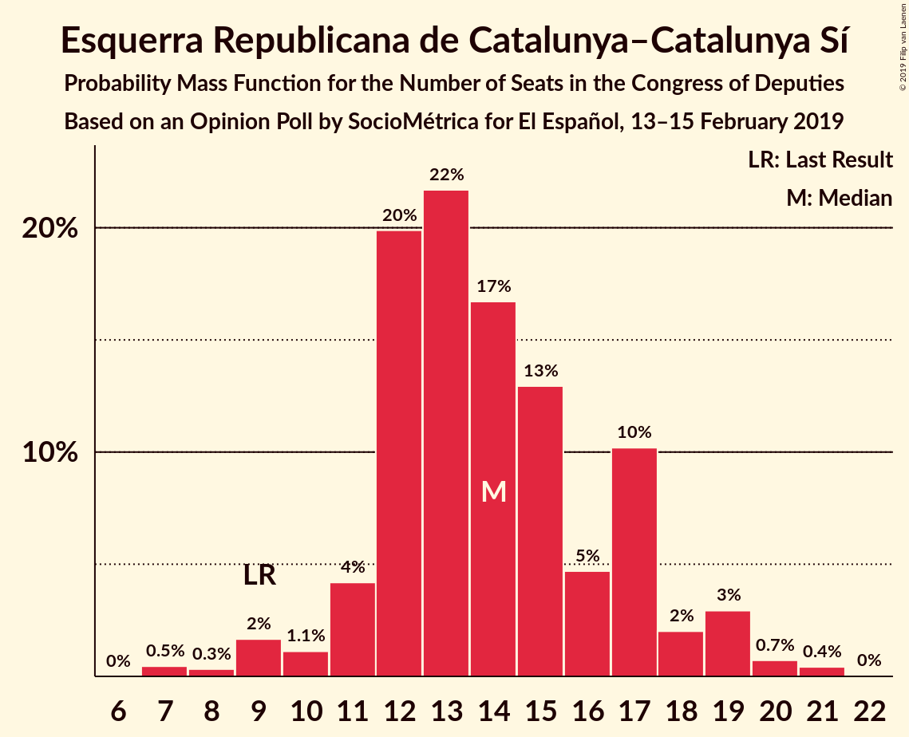
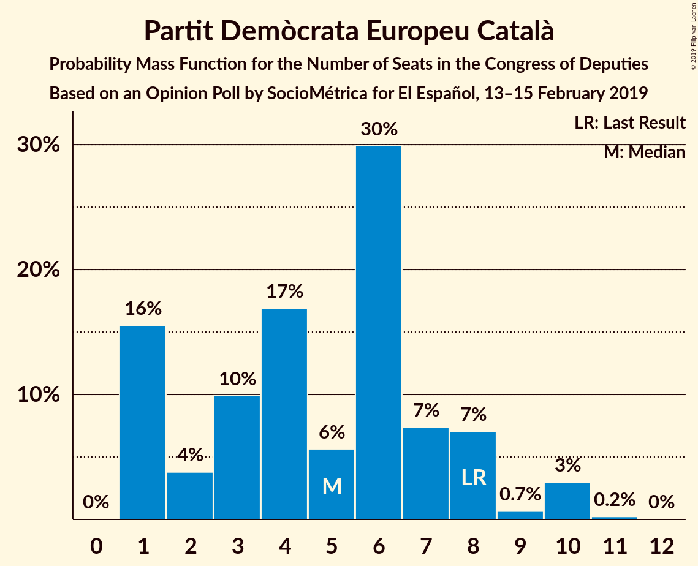
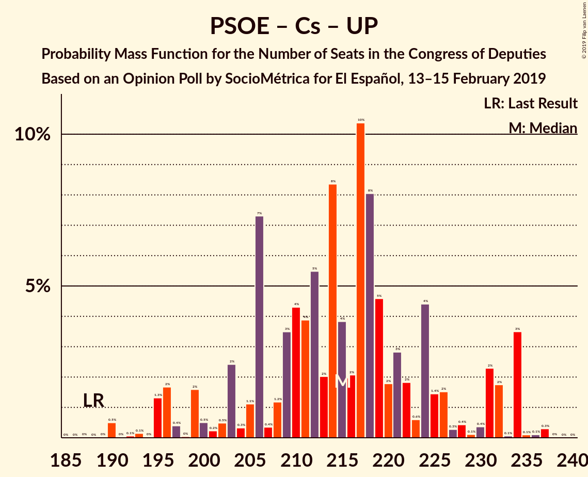
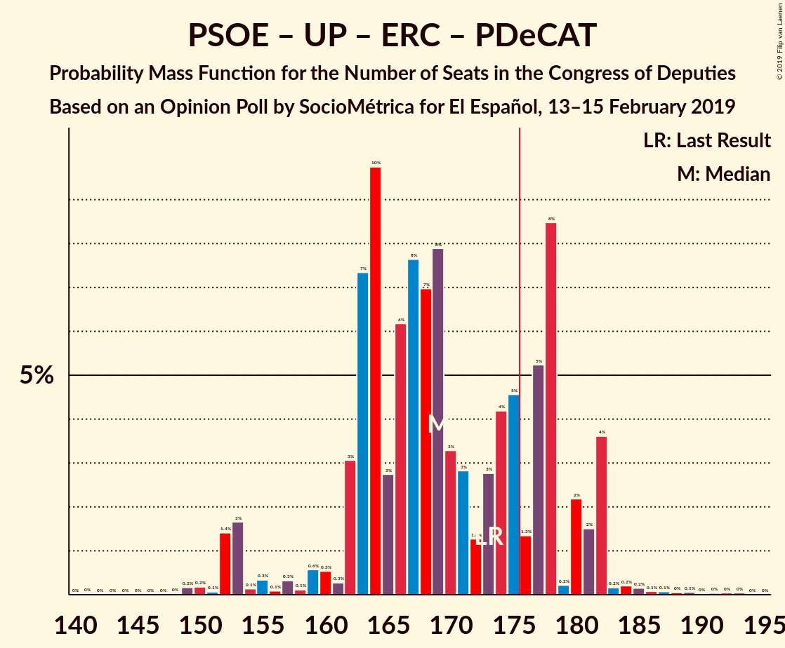

# Opinion Poll by SocioMétrica for El Español, 13–15 February 2019

<a href="#voting-intentions">Voting Intentions</a> | <a href="#seats">Seats</a> | <a href="#coalitions">Coalitions</a> | <a href="#technical-information">Technical Information</a>

## Voting Intentions

### Confidence Intervals

| Party | Last Result | Poll Result | 80% Confidence Interval | 90% Confidence Interval | 95% Confidence Interval | 99% Confidence Interval |
|:-----:|:-----------:|:-----------:|:-----------------------:|:-----------------------:|:-----------------------:|:-----------------------:|
| Partido Socialista Obrero Español | 22.6% | 24.3% | 22.6–26.1% |22.1–26.6% |21.7–27.1% |21.0–27.9% |
| Ciudadanos–Partido de la Ciudadanía | 13.1% | 18.7% | 17.2–20.4% |16.8–20.8% |16.4–21.2% |15.7–22.1% |
| Partido Popular | 33.0% | 18.6% | 17.1–20.3% |16.7–20.7% |16.3–21.1% |15.6–21.9% |
| Unidos Podemos | 21.2% | 15.2% | 13.8–16.8% |13.4–17.2% |13.1–17.6% |12.5–18.3% |
| Vox | 0.2% | 11.8% | 10.6–13.2% |10.2–13.6% |9.9–14.0% |9.4–14.7% |
| Esquerra Republicana de Catalunya–Catalunya Sí | 2.7% | 3.3% | 2.7–4.1% |2.5–4.4% |2.4–4.6% |2.1–5.0% |
| Partido Animalista Contra el Maltrato Animal | 1.2% | 1.9% | 1.4–2.6% |1.3–2.8% |1.2–3.0% |1.0–3.3% |
| Partit Demòcrata Europeu Català | 2.0% | 1.3% | 0.9–1.9% |0.8–2.1% |0.8–2.2% |0.6–2.5% |
| Euzko Alderdi Jeltzalea/Partido Nacionalista Vasco | 1.2% | 1.1% | 0.8–1.7% |0.7–1.8% |0.6–2.0% |0.5–2.3% |
| Euskal Herria Bildu | 0.8% | 0.8% | 0.5–1.3% |0.5–1.4% |0.4–1.6% |0.3–1.9% |
| Coalición Canaria–Partido Nacionalista Canario | 0.3% | 0.3% | 0.2–0.7% |0.1–0.8% |0.1–0.9% |0.1–1.1% |

*Note:* The poll result column reflects the actual value used in the calculations. Published results may vary slightly, and in addition be rounded to fewer digits.

## Seats

### Confidence Intervals

| Party | Last Result | Median | 80% Confidence Interval | 90% Confidence Interval | 95% Confidence Interval | 99% Confidence Interval |
|:-----:|:-----------:|:------:|:-----------------------:|:-----------------------:|:-----------------------:|:-----------------------:|
| <a href="#partido-socialista-obrero-español">Partido Socialista Obrero Español</a> | 85 | 105 | 94–113 |90–115 |88–117 |81–120 |
| <a href="#ciudadanos–partido-de-la-ciudadanía">Ciudadanos–Partido de la Ciudadanía</a> | 32 | 66 | 58–72 |57–72 |55–73 |53–76 |
| <a href="#partido-popular">Partido Popular</a> | 137 | 73 | 61–83 |56–89 |56–90 |56–91 |
| <a href="#unidos-podemos">Unidos Podemos</a> | 71 | 44 | 37–56 |37–58 |36–62 |33–65 |
| <a href="#vox">Vox</a> | 0 | 30 | 26–39 |25–40 |23–43 |21–48 |
| <a href="#esquerra-republicana-de-catalunya–catalunya-sí">Esquerra Republicana de Catalunya–Catalunya Sí</a> | 9 | 14 | 12–17 |12–19 |10–19 |7–21 |
| <a href="#partido-animalista-contra-el-maltrato-animal">Partido Animalista Contra el Maltrato Animal</a> | 0 | 1 | 0–1 |0–1 |0–1 |0–1 |
| <a href="#partit-demòcrata-europeu-català">Partit Demòcrata Europeu Català</a> | 8 | 6 | 1–7 |1–8 |1–10 |1–10 |
| <a href="#euzko-alderdi-jeltzalea/partido-nacionalista-vasco">Euzko Alderdi Jeltzalea/Partido Nacionalista Vasco</a> | 5 | 6 | 3–7 |3–9 |3–9 |2–10 |
| <a href="#euskal-herria-bildu">Euskal Herria Bildu</a> | 2 | 5 | 2–6 |1–7 |1–7 |0–8 |
| <a href="#coalición-canaria–partido-nacionalista-canario">Coalición Canaria–Partido Nacionalista Canario</a> | 1 | 1 | 0–3 |0–4 |0–4 |0–4 |

### Partido Socialista Obrero Español

*For a full overview of the results for this party, see the [Partido Socialista Obrero Español](party-partidosocialistaobreroespañol.html) page.*

| Number of Seats | Probability | Accumulated | Special Marks |
|:---------------:|:-----------:|:-----------:|:-------------:|
| 80 | 0.1% | 100% |  |
| 81 | 0.4% | 99.9% |  |
| 82 | 0% | 99.5% |  |
| 83 | 0% | 99.4% |  |
| 84 | 0.1% | 99.4% |  |
| 85 | 0% | 99.3% | Last Result |
| 86 | 0.1% | 99.3% |  |
| 87 | 0.2% | 99.2% |  |
| 88 | 2% | 99.0% |  |
| 89 | 1.3% | 97% |  |
| 90 | 1.3% | 95% |  |
| 91 | 1.5% | 94% |  |
| 92 | 0.7% | 93% |  |
| 93 | 0.6% | 92% |  |
| 94 | 8% | 91% |  |
| 95 | 3% | 83% |  |
| 96 | 6% | 80% |  |
| 97 | 0.5% | 75% |  |
| 98 | 0.5% | 74% |  |
| 99 | 1.2% | 74% |  |
| 100 | 11% | 73% |  |
| 101 | 3% | 61% |  |
| 102 | 3% | 59% |  |
| 103 | 2% | 56% |  |
| 104 | 2% | 54% |  |
| 105 | 2% | 52% | Median |
| 106 | 2% | 50% |  |
| 107 | 12% | 47% |  |
| 108 | 11% | 36% |  |
| 109 | 1.2% | 25% |  |
| 110 | 3% | 24% |  |
| 111 | 2% | 21% |  |
| 112 | 0.2% | 20% |  |
| 113 | 13% | 19% |  |
| 114 | 0.3% | 6% |  |
| 115 | 2% | 6% |  |
| 116 | 0.3% | 4% |  |
| 117 | 2% | 4% |  |
| 118 | 0.1% | 1.2% |  |
| 119 | 0.5% | 1.1% |  |
| 120 | 0.1% | 0.6% |  |
| 121 | 0% | 0.5% |  |
| 122 | 0.1% | 0.4% |  |
| 123 | 0.1% | 0.4% |  |
| 124 | 0% | 0.3% |  |
| 125 | 0.3% | 0.3% |  |
| 126 | 0% | 0% |  |

### Ciudadanos–Partido de la Ciudadanía

*For a full overview of the results for this party, see the [Ciudadanos–Partido de la Ciudadanía](party-ciudadanos–partidodelaciudadanía.html) page.*

| Number of Seats | Probability | Accumulated | Special Marks |
|:---------------:|:-----------:|:-----------:|:-------------:|
| 32 | 0% | 100% | Last Result |
| 33 | 0% | 100% |  |
| 34 | 0% | 100% |  |
| 35 | 0% | 100% |  |
| 36 | 0% | 100% |  |
| 37 | 0% | 100% |  |
| 38 | 0% | 100% |  |
| 39 | 0% | 100% |  |
| 40 | 0% | 100% |  |
| 41 | 0% | 100% |  |
| 42 | 0% | 100% |  |
| 43 | 0% | 100% |  |
| 44 | 0% | 100% |  |
| 45 | 0% | 100% |  |
| 46 | 0% | 100% |  |
| 47 | 0% | 100% |  |
| 48 | 0% | 100% |  |
| 49 | 0% | 100% |  |
| 50 | 0% | 100% |  |
| 51 | 0% | 100% |  |
| 52 | 0% | 99.9% |  |
| 53 | 2% | 99.9% |  |
| 54 | 0.2% | 98% |  |
| 55 | 0.5% | 98% |  |
| 56 | 2% | 97% |  |
| 57 | 2% | 95% |  |
| 58 | 5% | 93% |  |
| 59 | 1.0% | 88% |  |
| 60 | 1.4% | 87% |  |
| 61 | 9% | 86% |  |
| 62 | 2% | 77% |  |
| 63 | 6% | 75% |  |
| 64 | 8% | 69% |  |
| 65 | 6% | 61% |  |
| 66 | 7% | 55% | Median |
| 67 | 11% | 47% |  |
| 68 | 4% | 36% |  |
| 69 | 4% | 32% |  |
| 70 | 8% | 28% |  |
| 71 | 7% | 20% |  |
| 72 | 9% | 13% |  |
| 73 | 3% | 4% |  |
| 74 | 0.6% | 1.3% |  |
| 75 | 0% | 0.8% |  |
| 76 | 0.4% | 0.7% |  |
| 77 | 0% | 0.3% |  |
| 78 | 0% | 0.3% |  |
| 79 | 0% | 0.3% |  |
| 80 | 0.2% | 0.3% |  |
| 81 | 0% | 0% |  |

### Partido Popular

*For a full overview of the results for this party, see the [Partido Popular](party-partidopopular.html) page.*

| Number of Seats | Probability | Accumulated | Special Marks |
|:---------------:|:-----------:|:-----------:|:-------------:|
| 54 | 0% | 100% |  |
| 55 | 0% | 99.9% |  |
| 56 | 5% | 99.9% |  |
| 57 | 0.1% | 95% |  |
| 58 | 0.1% | 95% |  |
| 59 | 3% | 95% |  |
| 60 | 0.2% | 92% |  |
| 61 | 3% | 91% |  |
| 62 | 5% | 88% |  |
| 63 | 3% | 82% |  |
| 64 | 0.5% | 80% |  |
| 65 | 1.2% | 79% |  |
| 66 | 0.8% | 78% |  |
| 67 | 5% | 77% |  |
| 68 | 3% | 72% |  |
| 69 | 3% | 69% |  |
| 70 | 1.1% | 66% |  |
| 71 | 3% | 65% |  |
| 72 | 12% | 62% |  |
| 73 | 13% | 50% | Median |
| 74 | 2% | 37% |  |
| 75 | 2% | 36% |  |
| 76 | 5% | 33% |  |
| 77 | 2% | 28% |  |
| 78 | 8% | 26% |  |
| 79 | 1.1% | 18% |  |
| 80 | 0.1% | 17% |  |
| 81 | 0.9% | 17% |  |
| 82 | 0.6% | 16% |  |
| 83 | 6% | 15% |  |
| 84 | 0.8% | 10% |  |
| 85 | 1.2% | 9% |  |
| 86 | 0.3% | 8% |  |
| 87 | 0.1% | 7% |  |
| 88 | 0.1% | 7% |  |
| 89 | 2% | 7% |  |
| 90 | 3% | 5% |  |
| 91 | 1.5% | 2% |  |
| 92 | 0.1% | 0.3% |  |
| 93 | 0.1% | 0.2% |  |
| 94 | 0% | 0.1% |  |
| 95 | 0% | 0.1% |  |
| 96 | 0% | 0.1% |  |
| 97 | 0% | 0% |  |
| 98 | 0% | 0% |  |
| 99 | 0% | 0% |  |
| 100 | 0% | 0% |  |
| 101 | 0% | 0% |  |
| 102 | 0% | 0% |  |
| 103 | 0% | 0% |  |
| 104 | 0% | 0% |  |
| 105 | 0% | 0% |  |
| 106 | 0% | 0% |  |
| 107 | 0% | 0% |  |
| 108 | 0% | 0% |  |
| 109 | 0% | 0% |  |
| 110 | 0% | 0% |  |
| 111 | 0% | 0% |  |
| 112 | 0% | 0% |  |
| 113 | 0% | 0% |  |
| 114 | 0% | 0% |  |
| 115 | 0% | 0% |  |
| 116 | 0% | 0% |  |
| 117 | 0% | 0% |  |
| 118 | 0% | 0% |  |
| 119 | 0% | 0% |  |
| 120 | 0% | 0% |  |
| 121 | 0% | 0% |  |
| 122 | 0% | 0% |  |
| 123 | 0% | 0% |  |
| 124 | 0% | 0% |  |
| 125 | 0% | 0% |  |
| 126 | 0% | 0% |  |
| 127 | 0% | 0% |  |
| 128 | 0% | 0% |  |
| 129 | 0% | 0% |  |
| 130 | 0% | 0% |  |
| 131 | 0% | 0% |  |
| 132 | 0% | 0% |  |
| 133 | 0% | 0% |  |
| 134 | 0% | 0% |  |
| 135 | 0% | 0% |  |
| 136 | 0% | 0% |  |
| 137 | 0% | 0% | Last Result |

### Unidos Podemos

*For a full overview of the results for this party, see the [Unidos Podemos](party-unidospodemos.html) page.*

| Number of Seats | Probability | Accumulated | Special Marks |
|:---------------:|:-----------:|:-----------:|:-------------:|
| 31 | 0% | 100% |  |
| 32 | 0.4% | 99.9% |  |
| 33 | 0.1% | 99.6% |  |
| 34 | 0.6% | 99.5% |  |
| 35 | 0.1% | 98.9% |  |
| 36 | 3% | 98.8% |  |
| 37 | 8% | 96% |  |
| 38 | 11% | 88% |  |
| 39 | 6% | 77% |  |
| 40 | 7% | 71% |  |
| 41 | 2% | 63% |  |
| 42 | 2% | 61% |  |
| 43 | 4% | 59% |  |
| 44 | 5% | 55% | Median |
| 45 | 8% | 50% |  |
| 46 | 2% | 42% |  |
| 47 | 1.2% | 39% |  |
| 48 | 5% | 38% |  |
| 49 | 4% | 33% |  |
| 50 | 0.7% | 30% |  |
| 51 | 0.7% | 29% |  |
| 52 | 0.8% | 28% |  |
| 53 | 6% | 27% |  |
| 54 | 5% | 22% |  |
| 55 | 1.4% | 17% |  |
| 56 | 6% | 15% |  |
| 57 | 3% | 10% |  |
| 58 | 3% | 7% |  |
| 59 | 0.2% | 4% |  |
| 60 | 0.3% | 4% |  |
| 61 | 0.1% | 3% |  |
| 62 | 2% | 3% |  |
| 63 | 0.1% | 1.1% |  |
| 64 | 0.4% | 1.0% |  |
| 65 | 0.2% | 0.6% |  |
| 66 | 0% | 0.3% |  |
| 67 | 0% | 0.3% |  |
| 68 | 0.3% | 0.3% |  |
| 69 | 0% | 0% |  |
| 70 | 0% | 0% |  |
| 71 | 0% | 0% | Last Result |

### Vox

*For a full overview of the results for this party, see the [Vox](party-vox.html) page.*

| Number of Seats | Probability | Accumulated | Special Marks |
|:---------------:|:-----------:|:-----------:|:-------------:|
| 0 | 0% | 100% | Last Result |
| 1 | 0% | 100% |  |
| 2 | 0% | 100% |  |
| 3 | 0% | 100% |  |
| 4 | 0% | 100% |  |
| 5 | 0% | 100% |  |
| 6 | 0% | 100% |  |
| 7 | 0% | 100% |  |
| 8 | 0% | 100% |  |
| 9 | 0% | 100% |  |
| 10 | 0% | 100% |  |
| 11 | 0% | 100% |  |
| 12 | 0% | 100% |  |
| 13 | 0% | 100% |  |
| 14 | 0% | 100% |  |
| 15 | 0% | 100% |  |
| 16 | 0% | 100% |  |
| 17 | 0% | 100% |  |
| 18 | 0% | 100% |  |
| 19 | 0% | 100% |  |
| 20 | 0.2% | 100% |  |
| 21 | 1.3% | 99.7% |  |
| 22 | 0.6% | 98% |  |
| 23 | 1.2% | 98% |  |
| 24 | 0.4% | 97% |  |
| 25 | 4% | 96% |  |
| 26 | 3% | 92% |  |
| 27 | 15% | 89% |  |
| 28 | 6% | 73% |  |
| 29 | 12% | 67% |  |
| 30 | 10% | 55% | Median |
| 31 | 4% | 46% |  |
| 32 | 2% | 41% |  |
| 33 | 5% | 40% |  |
| 34 | 1.3% | 35% |  |
| 35 | 0.8% | 33% |  |
| 36 | 2% | 33% |  |
| 37 | 8% | 31% |  |
| 38 | 7% | 23% |  |
| 39 | 10% | 15% |  |
| 40 | 0.6% | 6% |  |
| 41 | 0.2% | 5% |  |
| 42 | 0.2% | 5% |  |
| 43 | 2% | 5% |  |
| 44 | 0.6% | 2% |  |
| 45 | 0.4% | 2% |  |
| 46 | 0.2% | 1.2% |  |
| 47 | 0.4% | 1.0% |  |
| 48 | 0.1% | 0.5% |  |
| 49 | 0.1% | 0.5% |  |
| 50 | 0.2% | 0.3% |  |
| 51 | 0% | 0.1% |  |
| 52 | 0.1% | 0.1% |  |
| 53 | 0% | 0% |  |

### Esquerra Republicana de Catalunya–Catalunya Sí

*For a full overview of the results for this party, see the [Esquerra Republicana de Catalunya–Catalunya Sí](party-esquerrarepublicanadecatalunya–catalunyasí.html) page.*

| Number of Seats | Probability | Accumulated | Special Marks |
|:---------------:|:-----------:|:-----------:|:-------------:|
| 7 | 0.7% | 100% |  |
| 8 | 0.2% | 99.3% |  |
| 9 | 0.5% | 99.1% | Last Result |
| 10 | 2% | 98.6% |  |
| 11 | 2% | 97% |  |
| 12 | 16% | 95% |  |
| 13 | 26% | 79% |  |
| 14 | 17% | 53% | Median |
| 15 | 11% | 36% |  |
| 16 | 4% | 26% |  |
| 17 | 14% | 22% |  |
| 18 | 3% | 8% |  |
| 19 | 4% | 5% |  |
| 20 | 0.7% | 1.2% |  |
| 21 | 0.5% | 0.5% |  |
| 22 | 0% | 0% |  |

### Partido Animalista Contra el Maltrato Animal

*For a full overview of the results for this party, see the [Partido Animalista Contra el Maltrato Animal](party-partidoanimalistacontraelmaltratoanimal.html) page.*

| Number of Seats | Probability | Accumulated | Special Marks |
|:---------------:|:-----------:|:-----------:|:-------------:|
| 0 | 42% | 100% | Last Result |
| 1 | 58% | 58% | Median |
| 2 | 0.1% | 0.3% |  |
| 3 | 0.2% | 0.2% |  |
| 4 | 0% | 0% |  |

### Partit Demòcrata Europeu Català

*For a full overview of the results for this party, see the [Partit Demòcrata Europeu Català](party-partitdemòcrataeuropeucatalà.html) page.*

| Number of Seats | Probability | Accumulated | Special Marks |
|:---------------:|:-----------:|:-----------:|:-------------:|
| 1 | 21% | 100% |  |
| 2 | 3% | 79% |  |
| 3 | 10% | 76% |  |
| 4 | 11% | 66% |  |
| 5 | 4% | 55% |  |
| 6 | 32% | 51% | Median |
| 7 | 9% | 18% |  |
| 8 | 5% | 9% | Last Result |
| 9 | 0.8% | 4% |  |
| 10 | 3% | 3% |  |
| 11 | 0.1% | 0.1% |  |
| 12 | 0% | 0% |  |

### Euzko Alderdi Jeltzalea/Partido Nacionalista Vasco

*For a full overview of the results for this party, see the [Euzko Alderdi Jeltzalea/Partido Nacionalista Vasco](party-euzkoalderdijeltzaleapartidonacionalistavasco.html) page.*

| Number of Seats | Probability | Accumulated | Special Marks |
|:---------------:|:-----------:|:-----------:|:-------------:|
| 1 | 0.1% | 100% |  |
| 2 | 2% | 99.8% |  |
| 3 | 12% | 98% |  |
| 4 | 6% | 86% |  |
| 5 | 19% | 79% | Last Result |
| 6 | 32% | 61% | Median |
| 7 | 20% | 29% |  |
| 8 | 1.2% | 9% |  |
| 9 | 7% | 8% |  |
| 10 | 1.0% | 1.0% |  |
| 11 | 0% | 0% |  |

### Euskal Herria Bildu

*For a full overview of the results for this party, see the [Euskal Herria Bildu](party-euskalherriabildu.html) page.*

| Number of Seats | Probability | Accumulated | Special Marks |
|:---------------:|:-----------:|:-----------:|:-------------:|
| 0 | 1.0% | 100% |  |
| 1 | 5% | 99.0% |  |
| 2 | 20% | 94% | Last Result |
| 3 | 6% | 74% |  |
| 4 | 17% | 67% |  |
| 5 | 14% | 50% | Median |
| 6 | 26% | 36% |  |
| 7 | 9% | 9% |  |
| 8 | 0.5% | 0.6% |  |
| 9 | 0.1% | 0.1% |  |
| 10 | 0.1% | 0.1% |  |
| 11 | 0% | 0% |  |

### Coalición Canaria–Partido Nacionalista Canario

*For a full overview of the results for this party, see the [Coalición Canaria–Partido Nacionalista Canario](party-coalicióncanaria–partidonacionalistacanario.html) page.*

| Number of Seats | Probability | Accumulated | Special Marks |
|:---------------:|:-----------:|:-----------:|:-------------:|
| 0 | 18% | 100% |  |
| 1 | 45% | 82% | Last Result, Median |
| 2 | 26% | 37% |  |
| 3 | 4% | 11% |  |
| 4 | 7% | 7% |  |
| 5 | 0.1% | 0.1% |  |
| 6 | 0% | 0% |  |

## Coalitions

### Confidence Intervals

| Coalition | Last Result | Median | Majority? | 80% Confidence Interval | 90% Confidence Interval | 95% Confidence Interval | 99% Confidence Interval |
|:---------:|:-----------:|:------:|:---------:|:-----------------------:|:-----------------------:|:-----------------------:|:-----------------------:|
| Partido Socialista Obrero Español – Ciudadanos–Partido de la Ciudadanía – Partido Popular | 254 | 243 | 100% | 229–252 | 228–254 | 226–256 | 219–263 |
| Partido Socialista Obrero Español – Ciudadanos–Partido de la Ciudadanía – Unidos Podemos | 188 | 217 | 100% | 203–231 | 196–234 | 195–234 | 190–235 |
| Partido Socialista Obrero Español – Partido Popular | 222 | 175 | 50% | 161–189 | 158–191 | 158–193 | 155–197 |
| Partido Socialista Obrero Español – Unidos Podemos – Esquerra Republicana de Catalunya–Catalunya Sí – Partit Demòcrata Europeu Català – Euzko Alderdi Jeltzalea/Partido Nacionalista Vasco – Euskal Herria Bildu | 180 | 177 | 66% | 171–187 | 167–191 | 160–191 | 160–193 |
| Ciudadanos–Partido de la Ciudadanía – Partido Popular – Vox | 169 | 171 | 14% | 160–176 | 157–182 | 157–189 | 156–190 |
| Partido Socialista Obrero Español – Ciudadanos–Partido de la Ciudadanía | 117 | 170 | 28% | 155–180 | 152–182 | 152–188 | 144–190 |
| Partido Socialista Obrero Español – Unidos Podemos – Esquerra Republicana de Catalunya–Catalunya Sí – Partit Demòcrata Europeu Català | 173 | 168 | 16% | 162–178 | 159–182 | 153–182 | 152–182 |
| Partido Socialista Obrero Español – Unidos Podemos – Esquerra Republicana de Catalunya–Catalunya Sí – Euskal Herria Bildu | 167 | 168 | 16% | 159–178 | 155–180 | 150–180 | 148–182 |
| Partido Socialista Obrero Español – Unidos Podemos – Euzko Alderdi Jeltzalea/Partido Nacionalista Vasco – Euskal Herria Bildu | 163 | 159 | 0.3% | 152–171 | 147–172 | 143–172 | 139–172 |
| Partido Socialista Obrero Español – Unidos Podemos | 156 | 149 | 0% | 142–159 | 139–163 | 134–163 | 131–163 |
| Ciudadanos–Partido de la Ciudadanía – Partido Popular – Coalición Canaria–Partido Nacionalista Canario | 170 | 139 | 0% | 132–147 | 129–150 | 129–154 | 126–156 |
| Ciudadanos–Partido de la Ciudadanía – Partido Popular | 169 | 137 | 0% | 130–147 | 127–148 | 127–153 | 124–154 |
| Partido Popular – Vox | 137 | 102 | 0% | 91–117 | 86–123 | 86–127 | 86–129 |
| Partido Socialista Obrero Español | 85 | 105 | 0% | 94–113 | 90–115 | 88–117 | 81–120 |
| Partido Popular | 137 | 73 | 0% | 61–83 | 56–89 | 56–90 | 56–91 |

### Partido Socialista Obrero Español – Ciudadanos–Partido de la Ciudadanía – Partido Popular

| Number of Seats | Probability | Accumulated | Special Marks |
|:---------------:|:-----------:|:-----------:|:-------------:|
| 214 | 0.2% | 100% |  |
| 215 | 0.1% | 99.8% |  |
| 216 | 0% | 99.7% |  |
| 217 | 0% | 99.7% |  |
| 218 | 0.1% | 99.6% |  |
| 219 | 0.2% | 99.6% |  |
| 220 | 0.5% | 99.4% |  |
| 221 | 0.4% | 99.0% |  |
| 222 | 0.4% | 98.6% |  |
| 223 | 0.1% | 98% |  |
| 224 | 0.3% | 98% |  |
| 225 | 0.3% | 98% |  |
| 226 | 1.3% | 98% |  |
| 227 | 0.2% | 96% |  |
| 228 | 5% | 96% |  |
| 229 | 1.3% | 91% |  |
| 230 | 5% | 90% |  |
| 231 | 2% | 84% |  |
| 232 | 2% | 82% |  |
| 233 | 3% | 80% |  |
| 234 | 5% | 77% |  |
| 235 | 1.1% | 72% |  |
| 236 | 2% | 71% |  |
| 237 | 0.9% | 69% |  |
| 238 | 1.0% | 68% |  |
| 239 | 6% | 67% |  |
| 240 | 0.4% | 61% |  |
| 241 | 0.5% | 61% |  |
| 242 | 8% | 60% |  |
| 243 | 6% | 53% |  |
| 244 | 0.7% | 47% | Median |
| 245 | 11% | 46% |  |
| 246 | 3% | 35% |  |
| 247 | 5% | 32% |  |
| 248 | 2% | 27% |  |
| 249 | 6% | 25% |  |
| 250 | 2% | 19% |  |
| 251 | 2% | 18% |  |
| 252 | 9% | 15% |  |
| 253 | 0.7% | 6% |  |
| 254 | 1.4% | 6% | Last Result |
| 255 | 0.5% | 4% |  |
| 256 | 2% | 4% |  |
| 257 | 0.2% | 2% |  |
| 258 | 0.5% | 2% |  |
| 259 | 0.4% | 1.2% |  |
| 260 | 0.2% | 0.8% |  |
| 261 | 0% | 0.6% |  |
| 262 | 0% | 0.6% |  |
| 263 | 0.1% | 0.6% |  |
| 264 | 0% | 0.4% |  |
| 265 | 0.4% | 0.4% |  |
| 266 | 0% | 0.1% |  |
| 267 | 0% | 0% |  |

### Partido Socialista Obrero Español – Ciudadanos–Partido de la Ciudadanía – Unidos Podemos

| Number of Seats | Probability | Accumulated | Special Marks |
|:---------------:|:-----------:|:-----------:|:-------------:|
| 187 | 0% | 100% |  |
| 188 | 0% | 99.9% | Last Result |
| 189 | 0% | 99.9% |  |
| 190 | 0.7% | 99.9% |  |
| 191 | 0% | 99.2% |  |
| 192 | 0% | 99.1% |  |
| 193 | 0.2% | 99.1% |  |
| 194 | 0% | 99.0% |  |
| 195 | 2% | 98.9% |  |
| 196 | 3% | 97% |  |
| 197 | 0.6% | 95% |  |
| 198 | 0% | 94% |  |
| 199 | 2% | 94% |  |
| 200 | 0.3% | 92% |  |
| 201 | 0.2% | 91% |  |
| 202 | 0.2% | 91% |  |
| 203 | 2% | 91% |  |
| 204 | 0.2% | 89% |  |
| 205 | 0.6% | 89% |  |
| 206 | 11% | 88% |  |
| 207 | 0.2% | 77% |  |
| 208 | 2% | 77% |  |
| 209 | 3% | 76% |  |
| 210 | 3% | 72% |  |
| 211 | 2% | 69% |  |
| 212 | 7% | 67% |  |
| 213 | 3% | 61% |  |
| 214 | 2% | 58% |  |
| 215 | 5% | 57% | Median |
| 216 | 1.2% | 52% |  |
| 217 | 9% | 50% |  |
| 218 | 11% | 41% |  |
| 219 | 7% | 31% |  |
| 220 | 2% | 24% |  |
| 221 | 4% | 22% |  |
| 222 | 1.3% | 18% |  |
| 223 | 0.8% | 17% |  |
| 224 | 3% | 16% |  |
| 225 | 0.3% | 13% |  |
| 226 | 0.1% | 13% |  |
| 227 | 0.1% | 12% |  |
| 228 | 0.4% | 12% |  |
| 229 | 0% | 12% |  |
| 230 | 0.4% | 12% |  |
| 231 | 3% | 12% |  |
| 232 | 3% | 8% |  |
| 233 | 0% | 6% |  |
| 234 | 5% | 6% |  |
| 235 | 0.1% | 0.6% |  |
| 236 | 0.1% | 0.4% |  |
| 237 | 0.3% | 0.4% |  |
| 238 | 0% | 0% |  |

### Partido Socialista Obrero Español – Partido Popular

| Number of Seats | Probability | Accumulated | Special Marks |
|:---------------:|:-----------:|:-----------:|:-------------:|
| 151 | 0% | 100% |  |
| 152 | 0.1% | 99.9% |  |
| 153 | 0.1% | 99.8% |  |
| 154 | 0.2% | 99.8% |  |
| 155 | 0.4% | 99.6% |  |
| 156 | 0.2% | 99.2% |  |
| 157 | 0.5% | 99.0% |  |
| 158 | 5% | 98.5% |  |
| 159 | 0.2% | 94% |  |
| 160 | 3% | 93% |  |
| 161 | 1.2% | 90% |  |
| 162 | 0.3% | 89% |  |
| 163 | 7% | 89% |  |
| 164 | 0.4% | 82% |  |
| 165 | 1.3% | 81% |  |
| 166 | 4% | 80% |  |
| 167 | 1.2% | 76% |  |
| 168 | 0.5% | 74% |  |
| 169 | 0.2% | 74% |  |
| 170 | 0.2% | 74% |  |
| 171 | 0.3% | 74% |  |
| 172 | 5% | 73% |  |
| 173 | 7% | 68% |  |
| 174 | 8% | 61% |  |
| 175 | 4% | 53% |  |
| 176 | 1.4% | 50% | Majority |
| 177 | 0.5% | 48% |  |
| 178 | 1.1% | 48% | Median |
| 179 | 1.5% | 47% |  |
| 180 | 2% | 45% |  |
| 181 | 8% | 43% |  |
| 182 | 0.4% | 35% |  |
| 183 | 9% | 34% |  |
| 184 | 3% | 26% |  |
| 185 | 9% | 23% |  |
| 186 | 2% | 14% |  |
| 187 | 0.8% | 13% |  |
| 188 | 0.3% | 12% |  |
| 189 | 3% | 12% |  |
| 190 | 0.8% | 8% |  |
| 191 | 4% | 7% |  |
| 192 | 0.4% | 4% |  |
| 193 | 2% | 3% |  |
| 194 | 0.1% | 1.0% |  |
| 195 | 0.2% | 0.8% |  |
| 196 | 0.1% | 0.6% |  |
| 197 | 0.1% | 0.6% |  |
| 198 | 0.1% | 0.5% |  |
| 199 | 0% | 0.4% |  |
| 200 | 0.4% | 0.4% |  |
| 201 | 0% | 0% |  |
| 202 | 0% | 0% |  |
| 203 | 0% | 0% |  |
| 204 | 0% | 0% |  |
| 205 | 0% | 0% |  |
| 206 | 0% | 0% |  |
| 207 | 0% | 0% |  |
| 208 | 0% | 0% |  |
| 209 | 0% | 0% |  |
| 210 | 0% | 0% |  |
| 211 | 0% | 0% |  |
| 212 | 0% | 0% |  |
| 213 | 0% | 0% |  |
| 214 | 0% | 0% |  |
| 215 | 0% | 0% |  |
| 216 | 0% | 0% |  |
| 217 | 0% | 0% |  |
| 218 | 0% | 0% |  |
| 219 | 0% | 0% |  |
| 220 | 0% | 0% |  |
| 221 | 0% | 0% |  |
| 222 | 0% | 0% | Last Result |

### Partido Socialista Obrero Español – Unidos Podemos – Esquerra Republicana de Catalunya–Catalunya Sí – Partit Demòcrata Europeu Català – Euzko Alderdi Jeltzalea/Partido Nacionalista Vasco – Euskal Herria Bildu

| Number of Seats | Probability | Accumulated | Special Marks |
|:---------------:|:-----------:|:-----------:|:-------------:|
| 157 | 0.2% | 100% |  |
| 158 | 0% | 99.8% |  |
| 159 | 0% | 99.8% |  |
| 160 | 3% | 99.8% |  |
| 161 | 0.2% | 97% |  |
| 162 | 0.1% | 97% |  |
| 163 | 0.3% | 97% |  |
| 164 | 0% | 96% |  |
| 165 | 0.9% | 96% |  |
| 166 | 0.2% | 95% |  |
| 167 | 0.4% | 95% |  |
| 168 | 0.1% | 95% |  |
| 169 | 1.2% | 95% |  |
| 170 | 2% | 93% |  |
| 171 | 2% | 92% |  |
| 172 | 3% | 90% |  |
| 173 | 6% | 87% |  |
| 174 | 2% | 81% |  |
| 175 | 13% | 78% |  |
| 176 | 10% | 66% | Majority |
| 177 | 12% | 56% |  |
| 178 | 2% | 45% |  |
| 179 | 1.1% | 43% |  |
| 180 | 5% | 42% | Last Result, Median |
| 181 | 13% | 37% |  |
| 182 | 1.4% | 24% |  |
| 183 | 2% | 22% |  |
| 184 | 2% | 20% |  |
| 185 | 1.4% | 18% |  |
| 186 | 2% | 16% |  |
| 187 | 6% | 14% |  |
| 188 | 0.2% | 9% |  |
| 189 | 0.4% | 9% |  |
| 190 | 3% | 8% |  |
| 191 | 5% | 6% |  |
| 192 | 0.1% | 0.6% |  |
| 193 | 0.3% | 0.5% |  |
| 194 | 0.1% | 0.2% |  |
| 195 | 0.1% | 0.1% |  |
| 196 | 0% | 0% |  |

### Ciudadanos–Partido de la Ciudadanía – Partido Popular – Vox

| Number of Seats | Probability | Accumulated | Special Marks |
|:---------------:|:-----------:|:-----------:|:-------------:|
| 152 | 0.1% | 100% |  |
| 153 | 0.1% | 99.9% |  |
| 154 | 0.1% | 99.9% |  |
| 155 | 0.1% | 99.8% |  |
| 156 | 0.5% | 99.7% |  |
| 157 | 5% | 99.3% |  |
| 158 | 0.5% | 94% |  |
| 159 | 0.1% | 94% |  |
| 160 | 6% | 94% |  |
| 161 | 0.1% | 88% |  |
| 162 | 3% | 88% |  |
| 163 | 0.4% | 84% |  |
| 164 | 4% | 84% |  |
| 165 | 0.8% | 80% |  |
| 166 | 6% | 79% |  |
| 167 | 4% | 73% |  |
| 168 | 10% | 69% |  |
| 169 | 7% | 59% | Last Result, Median |
| 170 | 1.4% | 52% |  |
| 171 | 8% | 51% |  |
| 172 | 14% | 42% |  |
| 173 | 0.6% | 28% |  |
| 174 | 6% | 27% |  |
| 175 | 7% | 21% |  |
| 176 | 4% | 14% | Majority |
| 177 | 1.2% | 10% |  |
| 178 | 2% | 8% |  |
| 179 | 0.8% | 7% |  |
| 180 | 0.8% | 6% |  |
| 181 | 0.1% | 5% |  |
| 182 | 0.5% | 5% |  |
| 183 | 0.8% | 5% |  |
| 184 | 0.2% | 4% |  |
| 185 | 0.3% | 4% |  |
| 186 | 0.1% | 3% |  |
| 187 | 0.2% | 3% |  |
| 188 | 0.4% | 3% |  |
| 189 | 1.0% | 3% |  |
| 190 | 1.5% | 2% |  |
| 191 | 0% | 0.2% |  |
| 192 | 0.2% | 0.2% |  |
| 193 | 0% | 0% |  |

### Partido Socialista Obrero Español – Ciudadanos–Partido de la Ciudadanía

| Number of Seats | Probability | Accumulated | Special Marks |
|:---------------:|:-----------:|:-----------:|:-------------:|
| 117 | 0% | 100% | Last Result |
| 118 | 0% | 100% |  |
| 119 | 0% | 100% |  |
| 120 | 0% | 100% |  |
| 121 | 0% | 100% |  |
| 122 | 0% | 100% |  |
| 123 | 0% | 100% |  |
| 124 | 0% | 100% |  |
| 125 | 0% | 100% |  |
| 126 | 0% | 100% |  |
| 127 | 0% | 100% |  |
| 128 | 0% | 100% |  |
| 129 | 0% | 100% |  |
| 130 | 0% | 100% |  |
| 131 | 0% | 100% |  |
| 132 | 0% | 100% |  |
| 133 | 0% | 100% |  |
| 134 | 0% | 100% |  |
| 135 | 0% | 100% |  |
| 136 | 0% | 100% |  |
| 137 | 0% | 100% |  |
| 138 | 0% | 100% |  |
| 139 | 0% | 100% |  |
| 140 | 0% | 100% |  |
| 141 | 0.1% | 100% |  |
| 142 | 0% | 99.9% |  |
| 143 | 0% | 99.9% |  |
| 144 | 0.5% | 99.9% |  |
| 145 | 0.2% | 99.4% |  |
| 146 | 0.1% | 99.2% |  |
| 147 | 0.4% | 99.2% |  |
| 148 | 0.1% | 98.8% |  |
| 149 | 0.2% | 98.7% |  |
| 150 | 0.7% | 98.5% |  |
| 151 | 0.2% | 98% |  |
| 152 | 5% | 98% |  |
| 153 | 0.1% | 93% |  |
| 154 | 2% | 93% |  |
| 155 | 0.4% | 90% |  |
| 156 | 2% | 90% |  |
| 157 | 2% | 88% |  |
| 158 | 2% | 86% |  |
| 159 | 5% | 85% |  |
| 160 | 0.4% | 80% |  |
| 161 | 0.9% | 79% |  |
| 162 | 1.4% | 78% |  |
| 163 | 4% | 77% |  |
| 164 | 5% | 73% |  |
| 165 | 0.3% | 67% |  |
| 166 | 5% | 67% |  |
| 167 | 0.4% | 62% |  |
| 168 | 2% | 61% |  |
| 169 | 8% | 59% |  |
| 170 | 2% | 52% |  |
| 171 | 2% | 50% | Median |
| 172 | 11% | 48% |  |
| 173 | 2% | 37% |  |
| 174 | 6% | 35% |  |
| 175 | 1.0% | 29% |  |
| 176 | 0.8% | 28% | Majority |
| 177 | 1.1% | 27% |  |
| 178 | 7% | 26% |  |
| 179 | 0.4% | 19% |  |
| 180 | 9% | 18% |  |
| 181 | 2% | 10% |  |
| 182 | 3% | 8% |  |
| 183 | 0.3% | 4% |  |
| 184 | 0.6% | 4% |  |
| 185 | 0.1% | 3% |  |
| 186 | 0.3% | 3% |  |
| 187 | 0.4% | 3% |  |
| 188 | 2% | 3% |  |
| 189 | 0.1% | 0.8% |  |
| 190 | 0.4% | 0.7% |  |
| 191 | 0% | 0.3% |  |
| 192 | 0% | 0.3% |  |
| 193 | 0.2% | 0.2% |  |
| 194 | 0% | 0% |  |

### Partido Socialista Obrero Español – Unidos Podemos – Esquerra Republicana de Catalunya–Catalunya Sí – Partit Demòcrata Europeu Català

| Number of Seats | Probability | Accumulated | Special Marks |
|:---------------:|:-----------:|:-----------:|:-------------:|
| 149 | 0.2% | 100% |  |
| 150 | 0.2% | 99.8% |  |
| 151 | 0% | 99.5% |  |
| 152 | 2% | 99.5% |  |
| 153 | 1.2% | 98% |  |
| 154 | 0.1% | 96% |  |
| 155 | 0.5% | 96% |  |
| 156 | 0.1% | 96% |  |
| 157 | 0.5% | 96% |  |
| 158 | 0.1% | 95% |  |
| 159 | 0.8% | 95% |  |
| 160 | 0.8% | 94% |  |
| 161 | 0.3% | 94% |  |
| 162 | 5% | 93% |  |
| 163 | 11% | 89% |  |
| 164 | 15% | 78% |  |
| 165 | 4% | 63% |  |
| 166 | 3% | 59% |  |
| 167 | 3% | 57% |  |
| 168 | 10% | 54% |  |
| 169 | 11% | 44% | Median |
| 170 | 4% | 33% |  |
| 171 | 4% | 29% |  |
| 172 | 0.6% | 25% |  |
| 173 | 4% | 24% | Last Result |
| 174 | 4% | 21% |  |
| 175 | 0.7% | 17% |  |
| 176 | 0.6% | 16% | Majority |
| 177 | 0.5% | 15% |  |
| 178 | 9% | 15% |  |
| 179 | 0.1% | 6% |  |
| 180 | 0% | 6% |  |
| 181 | 0.7% | 6% |  |
| 182 | 5% | 5% |  |
| 183 | 0.1% | 0.3% |  |
| 184 | 0.1% | 0.1% |  |
| 185 | 0% | 0.1% |  |
| 186 | 0% | 0% |  |

### Partido Socialista Obrero Español – Unidos Podemos – Esquerra Republicana de Catalunya–Catalunya Sí – Euskal Herria Bildu

| Number of Seats | Probability | Accumulated | Special Marks |
|:---------------:|:-----------:|:-----------:|:-------------:|
| 147 | 0.2% | 100% |  |
| 148 | 0.4% | 99.8% |  |
| 149 | 0% | 99.4% |  |
| 150 | 3% | 99.4% |  |
| 151 | 0.3% | 97% |  |
| 152 | 0.6% | 96% |  |
| 153 | 0.3% | 96% |  |
| 154 | 0.1% | 96% |  |
| 155 | 0.5% | 95% |  |
| 156 | 0.6% | 95% |  |
| 157 | 0.2% | 94% |  |
| 158 | 3% | 94% |  |
| 159 | 1.5% | 91% |  |
| 160 | 8% | 90% |  |
| 161 | 2% | 82% |  |
| 162 | 3% | 81% |  |
| 163 | 3% | 78% |  |
| 164 | 7% | 75% |  |
| 165 | 2% | 68% |  |
| 166 | 6% | 65% |  |
| 167 | 8% | 60% | Last Result |
| 168 | 9% | 51% | Median |
| 169 | 4% | 42% |  |
| 170 | 1.1% | 38% |  |
| 171 | 5% | 37% |  |
| 172 | 2% | 33% |  |
| 173 | 5% | 31% |  |
| 174 | 9% | 26% |  |
| 175 | 1.1% | 17% |  |
| 176 | 2% | 16% | Majority |
| 177 | 4% | 14% |  |
| 178 | 3% | 10% |  |
| 179 | 2% | 8% |  |
| 180 | 5% | 6% |  |
| 181 | 0.2% | 0.8% |  |
| 182 | 0.1% | 0.6% |  |
| 183 | 0.1% | 0.5% |  |
| 184 | 0.1% | 0.4% |  |
| 185 | 0% | 0.3% |  |
| 186 | 0.2% | 0.3% |  |
| 187 | 0% | 0.1% |  |
| 188 | 0% | 0.1% |  |
| 189 | 0% | 0.1% |  |
| 190 | 0.1% | 0.1% |  |
| 191 | 0% | 0% |  |

### Partido Socialista Obrero Español – Unidos Podemos – Euzko Alderdi Jeltzalea/Partido Nacionalista Vasco – Euskal Herria Bildu

| Number of Seats | Probability | Accumulated | Special Marks |
|:---------------:|:-----------:|:-----------:|:-------------:|
| 138 | 0.2% | 100% |  |
| 139 | 0.4% | 99.8% |  |
| 140 | 0% | 99.4% |  |
| 141 | 2% | 99.4% |  |
| 142 | 0% | 98% |  |
| 143 | 1.2% | 98% |  |
| 144 | 0.1% | 96% |  |
| 145 | 0.7% | 96% |  |
| 146 | 0.5% | 96% |  |
| 147 | 0.3% | 95% |  |
| 148 | 0.8% | 95% |  |
| 149 | 1.5% | 94% |  |
| 150 | 0.9% | 93% |  |
| 151 | 0.9% | 92% |  |
| 152 | 3% | 91% |  |
| 153 | 2% | 88% |  |
| 154 | 4% | 86% |  |
| 155 | 4% | 82% |  |
| 156 | 8% | 79% |  |
| 157 | 7% | 71% |  |
| 158 | 11% | 63% |  |
| 159 | 9% | 53% |  |
| 160 | 7% | 44% | Median |
| 161 | 2% | 37% |  |
| 162 | 5% | 36% |  |
| 163 | 10% | 31% | Last Result |
| 164 | 1.2% | 21% |  |
| 165 | 4% | 19% |  |
| 166 | 1.4% | 15% |  |
| 167 | 1.3% | 13% |  |
| 168 | 0.2% | 12% |  |
| 169 | 0.2% | 12% |  |
| 170 | 0.2% | 12% |  |
| 171 | 6% | 12% |  |
| 172 | 5% | 6% |  |
| 173 | 0.1% | 0.5% |  |
| 174 | 0.1% | 0.4% |  |
| 175 | 0.1% | 0.4% |  |
| 176 | 0% | 0.3% | Majority |
| 177 | 0% | 0.3% |  |
| 178 | 0.3% | 0.3% |  |
| 179 | 0% | 0% |  |

### Partido Socialista Obrero Español – Unidos Podemos

| Number of Seats | Probability | Accumulated | Special Marks |
|:---------------:|:-----------:|:-----------:|:-------------:|
| 130 | 0% | 100% |  |
| 131 | 0.6% | 99.9% |  |
| 132 | 0% | 99.4% |  |
| 133 | 2% | 99.4% |  |
| 134 | 0.3% | 98% |  |
| 135 | 0.5% | 97% |  |
| 136 | 1.1% | 97% |  |
| 137 | 0.2% | 96% |  |
| 138 | 0.3% | 95% |  |
| 139 | 0.2% | 95% |  |
| 140 | 1.3% | 95% |  |
| 141 | 1.2% | 94% |  |
| 142 | 5% | 92% |  |
| 143 | 0.7% | 88% |  |
| 144 | 0.6% | 87% |  |
| 145 | 15% | 86% |  |
| 146 | 2% | 72% |  |
| 147 | 5% | 69% |  |
| 148 | 13% | 64% |  |
| 149 | 8% | 51% | Median |
| 150 | 5% | 44% |  |
| 151 | 11% | 38% |  |
| 152 | 2% | 27% |  |
| 153 | 3% | 25% |  |
| 154 | 4% | 21% |  |
| 155 | 3% | 18% |  |
| 156 | 2% | 15% | Last Result |
| 157 | 0.5% | 13% |  |
| 158 | 0.7% | 12% |  |
| 159 | 2% | 12% |  |
| 160 | 0.1% | 9% |  |
| 161 | 0.1% | 9% |  |
| 162 | 3% | 9% |  |
| 163 | 5% | 6% |  |
| 164 | 0% | 0.3% |  |
| 165 | 0% | 0.3% |  |
| 166 | 0.2% | 0.3% |  |
| 167 | 0% | 0.1% |  |
| 168 | 0.1% | 0.1% |  |
| 169 | 0% | 0% |  |

### Ciudadanos–Partido de la Ciudadanía – Partido Popular – Coalición Canaria–Partido Nacionalista Canario

| Number of Seats | Probability | Accumulated | Special Marks |
|:---------------:|:-----------:|:-----------:|:-------------:|
| 119 | 0% | 100% |  |
| 120 | 0.1% | 99.9% |  |
| 121 | 0% | 99.8% |  |
| 122 | 0.1% | 99.8% |  |
| 123 | 0% | 99.8% |  |
| 124 | 0% | 99.7% |  |
| 125 | 0.2% | 99.7% |  |
| 126 | 0.2% | 99.5% |  |
| 127 | 0.3% | 99.3% |  |
| 128 | 0.7% | 99.0% |  |
| 129 | 6% | 98% |  |
| 130 | 0.4% | 92% |  |
| 131 | 1.3% | 91% |  |
| 132 | 7% | 90% |  |
| 133 | 6% | 83% |  |
| 134 | 0.4% | 77% |  |
| 135 | 8% | 77% |  |
| 136 | 8% | 69% |  |
| 137 | 7% | 61% |  |
| 138 | 4% | 54% |  |
| 139 | 2% | 50% |  |
| 140 | 9% | 48% | Median |
| 141 | 3% | 39% |  |
| 142 | 2% | 36% |  |
| 143 | 4% | 34% |  |
| 144 | 4% | 30% |  |
| 145 | 2% | 26% |  |
| 146 | 3% | 25% |  |
| 147 | 14% | 22% |  |
| 148 | 0.4% | 7% |  |
| 149 | 2% | 7% |  |
| 150 | 0.7% | 5% |  |
| 151 | 2% | 5% |  |
| 152 | 0.2% | 3% |  |
| 153 | 0.1% | 3% |  |
| 154 | 2% | 3% |  |
| 155 | 0% | 0.6% |  |
| 156 | 0.2% | 0.5% |  |
| 157 | 0.1% | 0.4% |  |
| 158 | 0.2% | 0.2% |  |
| 159 | 0% | 0.1% |  |
| 160 | 0% | 0% |  |
| 161 | 0% | 0% |  |
| 162 | 0% | 0% |  |
| 163 | 0% | 0% |  |
| 164 | 0% | 0% |  |
| 165 | 0% | 0% |  |
| 166 | 0% | 0% |  |
| 167 | 0% | 0% |  |
| 168 | 0% | 0% |  |
| 169 | 0% | 0% |  |
| 170 | 0% | 0% | Last Result |

### Ciudadanos–Partido de la Ciudadanía – Partido Popular

| Number of Seats | Probability | Accumulated | Special Marks |
|:---------------:|:-----------:|:-----------:|:-------------:|
| 117 | 0% | 100% |  |
| 118 | 0% | 99.9% |  |
| 119 | 0% | 99.9% |  |
| 120 | 0.1% | 99.9% |  |
| 121 | 0% | 99.8% |  |
| 122 | 0.1% | 99.8% |  |
| 123 | 0% | 99.7% |  |
| 124 | 0.2% | 99.7% |  |
| 125 | 0.4% | 99.5% |  |
| 126 | 0.4% | 99.1% |  |
| 127 | 6% | 98.7% |  |
| 128 | 2% | 93% |  |
| 129 | 0.3% | 92% |  |
| 130 | 4% | 91% |  |
| 131 | 1.1% | 87% |  |
| 132 | 14% | 86% |  |
| 133 | 0.1% | 72% |  |
| 134 | 10% | 72% |  |
| 135 | 5% | 62% |  |
| 136 | 5% | 58% |  |
| 137 | 2% | 52% |  |
| 138 | 2% | 50% |  |
| 139 | 11% | 48% | Median |
| 140 | 2% | 37% |  |
| 141 | 2% | 35% |  |
| 142 | 2% | 33% |  |
| 143 | 4% | 31% |  |
| 144 | 4% | 27% |  |
| 145 | 8% | 23% |  |
| 146 | 3% | 15% |  |
| 147 | 5% | 12% |  |
| 148 | 2% | 6% |  |
| 149 | 0.2% | 5% |  |
| 150 | 2% | 5% |  |
| 151 | 0.1% | 3% |  |
| 152 | 0.3% | 3% |  |
| 153 | 0.6% | 3% |  |
| 154 | 2% | 2% |  |
| 155 | 0.2% | 0.5% |  |
| 156 | 0% | 0.2% |  |
| 157 | 0.2% | 0.2% |  |
| 158 | 0% | 0.1% |  |
| 159 | 0% | 0% |  |
| 160 | 0% | 0% |  |
| 161 | 0% | 0% |  |
| 162 | 0% | 0% |  |
| 163 | 0% | 0% |  |
| 164 | 0% | 0% |  |
| 165 | 0% | 0% |  |
| 166 | 0% | 0% |  |
| 167 | 0% | 0% |  |
| 168 | 0% | 0% |  |
| 169 | 0% | 0% | Last Result |

### Partido Popular – Vox

| Number of Seats | Probability | Accumulated | Special Marks |
|:---------------:|:-----------:|:-----------:|:-------------:|
| 84 | 0.4% | 100% |  |
| 85 | 0% | 99.6% |  |
| 86 | 5% | 99.6% |  |
| 87 | 2% | 95% |  |
| 88 | 0.3% | 92% |  |
| 89 | 0.1% | 92% |  |
| 90 | 0.1% | 92% |  |
| 91 | 3% | 92% |  |
| 92 | 0.3% | 88% |  |
| 93 | 0.2% | 88% |  |
| 94 | 1.1% | 88% |  |
| 95 | 0.5% | 87% |  |
| 96 | 4% | 86% |  |
| 97 | 3% | 82% |  |
| 98 | 1.2% | 79% |  |
| 99 | 5% | 78% |  |
| 100 | 8% | 72% |  |
| 101 | 11% | 64% |  |
| 102 | 4% | 53% |  |
| 103 | 1.2% | 49% | Median |
| 104 | 4% | 47% |  |
| 105 | 2% | 43% |  |
| 106 | 4% | 41% |  |
| 107 | 0.7% | 37% |  |
| 108 | 1.1% | 36% |  |
| 109 | 2% | 35% |  |
| 110 | 7% | 33% |  |
| 111 | 7% | 26% |  |
| 112 | 0.7% | 18% |  |
| 113 | 2% | 18% |  |
| 114 | 0.7% | 15% |  |
| 115 | 0.5% | 15% |  |
| 116 | 0.1% | 14% |  |
| 117 | 5% | 14% |  |
| 118 | 3% | 9% |  |
| 119 | 0.2% | 6% |  |
| 120 | 0.2% | 6% |  |
| 121 | 0.1% | 6% |  |
| 122 | 0.5% | 6% |  |
| 123 | 2% | 5% |  |
| 124 | 0% | 4% |  |
| 125 | 0% | 3% |  |
| 126 | 0% | 3% |  |
| 127 | 2% | 3% |  |
| 128 | 0.6% | 2% |  |
| 129 | 1.0% | 1.3% |  |
| 130 | 0% | 0.2% |  |
| 131 | 0% | 0.2% |  |
| 132 | 0% | 0.2% |  |
| 133 | 0.2% | 0.2% |  |
| 134 | 0% | 0% |  |
| 135 | 0% | 0% |  |
| 136 | 0% | 0% |  |
| 137 | 0% | 0% | Last Result |

### Partido Socialista Obrero Español

| Number of Seats | Probability | Accumulated | Special Marks |
|:---------------:|:-----------:|:-----------:|:-------------:|
| 80 | 0.1% | 100% |  |
| 81 | 0.4% | 99.9% |  |
| 82 | 0% | 99.5% |  |
| 83 | 0% | 99.4% |  |
| 84 | 0.1% | 99.4% |  |
| 85 | 0% | 99.3% | Last Result |
| 86 | 0.1% | 99.3% |  |
| 87 | 0.2% | 99.2% |  |
| 88 | 2% | 99.0% |  |
| 89 | 1.3% | 97% |  |
| 90 | 1.3% | 95% |  |
| 91 | 1.5% | 94% |  |
| 92 | 0.7% | 93% |  |
| 93 | 0.6% | 92% |  |
| 94 | 8% | 91% |  |
| 95 | 3% | 83% |  |
| 96 | 6% | 80% |  |
| 97 | 0.5% | 75% |  |
| 98 | 0.5% | 74% |  |
| 99 | 1.2% | 74% |  |
| 100 | 11% | 73% |  |
| 101 | 3% | 61% |  |
| 102 | 3% | 59% |  |
| 103 | 2% | 56% |  |
| 104 | 2% | 54% |  |
| 105 | 2% | 52% | Median |
| 106 | 2% | 50% |  |
| 107 | 12% | 47% |  |
| 108 | 11% | 36% |  |
| 109 | 1.2% | 25% |  |
| 110 | 3% | 24% |  |
| 111 | 2% | 21% |  |
| 112 | 0.2% | 20% |  |
| 113 | 13% | 19% |  |
| 114 | 0.3% | 6% |  |
| 115 | 2% | 6% |  |
| 116 | 0.3% | 4% |  |
| 117 | 2% | 4% |  |
| 118 | 0.1% | 1.2% |  |
| 119 | 0.5% | 1.1% |  |
| 120 | 0.1% | 0.6% |  |
| 121 | 0% | 0.5% |  |
| 122 | 0.1% | 0.4% |  |
| 123 | 0.1% | 0.4% |  |
| 124 | 0% | 0.3% |  |
| 125 | 0.3% | 0.3% |  |
| 126 | 0% | 0% |  |

### Partido Popular

| Number of Seats | Probability | Accumulated | Special Marks |
|:---------------:|:-----------:|:-----------:|:-------------:|
| 54 | 0% | 100% |  |
| 55 | 0% | 99.9% |  |
| 56 | 5% | 99.9% |  |
| 57 | 0.1% | 95% |  |
| 58 | 0.1% | 95% |  |
| 59 | 3% | 95% |  |
| 60 | 0.2% | 92% |  |
| 61 | 3% | 91% |  |
| 62 | 5% | 88% |  |
| 63 | 3% | 82% |  |
| 64 | 0.5% | 80% |  |
| 65 | 1.2% | 79% |  |
| 66 | 0.8% | 78% |  |
| 67 | 5% | 77% |  |
| 68 | 3% | 72% |  |
| 69 | 3% | 69% |  |
| 70 | 1.1% | 66% |  |
| 71 | 3% | 65% |  |
| 72 | 12% | 62% |  |
| 73 | 13% | 50% | Median |
| 74 | 2% | 37% |  |
| 75 | 2% | 36% |  |
| 76 | 5% | 33% |  |
| 77 | 2% | 28% |  |
| 78 | 8% | 26% |  |
| 79 | 1.1% | 18% |  |
| 80 | 0.1% | 17% |  |
| 81 | 0.9% | 17% |  |
| 82 | 0.6% | 16% |  |
| 83 | 6% | 15% |  |
| 84 | 0.8% | 10% |  |
| 85 | 1.2% | 9% |  |
| 86 | 0.3% | 8% |  |
| 87 | 0.1% | 7% |  |
| 88 | 0.1% | 7% |  |
| 89 | 2% | 7% |  |
| 90 | 3% | 5% |  |
| 91 | 1.5% | 2% |  |
| 92 | 0.1% | 0.3% |  |
| 93 | 0.1% | 0.2% |  |
| 94 | 0% | 0.1% |  |
| 95 | 0% | 0.1% |  |
| 96 | 0% | 0.1% |  |
| 97 | 0% | 0% |  |
| 98 | 0% | 0% |  |
| 99 | 0% | 0% |  |
| 100 | 0% | 0% |  |
| 101 | 0% | 0% |  |
| 102 | 0% | 0% |  |
| 103 | 0% | 0% |  |
| 104 | 0% | 0% |  |
| 105 | 0% | 0% |  |
| 106 | 0% | 0% |  |
| 107 | 0% | 0% |  |
| 108 | 0% | 0% |  |
| 109 | 0% | 0% |  |
| 110 | 0% | 0% |  |
| 111 | 0% | 0% |  |
| 112 | 0% | 0% |  |
| 113 | 0% | 0% |  |
| 114 | 0% | 0% |  |
| 115 | 0% | 0% |  |
| 116 | 0% | 0% |  |
| 117 | 0% | 0% |  |
| 118 | 0% | 0% |  |
| 119 | 0% | 0% |  |
| 120 | 0% | 0% |  |
| 121 | 0% | 0% |  |
| 122 | 0% | 0% |  |
| 123 | 0% | 0% |  |
| 124 | 0% | 0% |  |
| 125 | 0% | 0% |  |
| 126 | 0% | 0% |  |
| 127 | 0% | 0% |  |
| 128 | 0% | 0% |  |
| 129 | 0% | 0% |  |
| 130 | 0% | 0% |  |
| 131 | 0% | 0% |  |
| 132 | 0% | 0% |  |
| 133 | 0% | 0% |  |
| 134 | 0% | 0% |  |
| 135 | 0% | 0% |  |
| 136 | 0% | 0% |  |
| 137 | 0% | 0% | Last Result |

## Technical Information

### Opinion Poll

+ **Polling firm:** SocioMétrica
+ **Commissioner(s):** El Español
+ **Fieldwork period:** 13–15 February 2019

### Calculations

+ **Sample size:** 1000
+ **Simulations done:** 524,288
+ **Error estimate:** 2.74%

