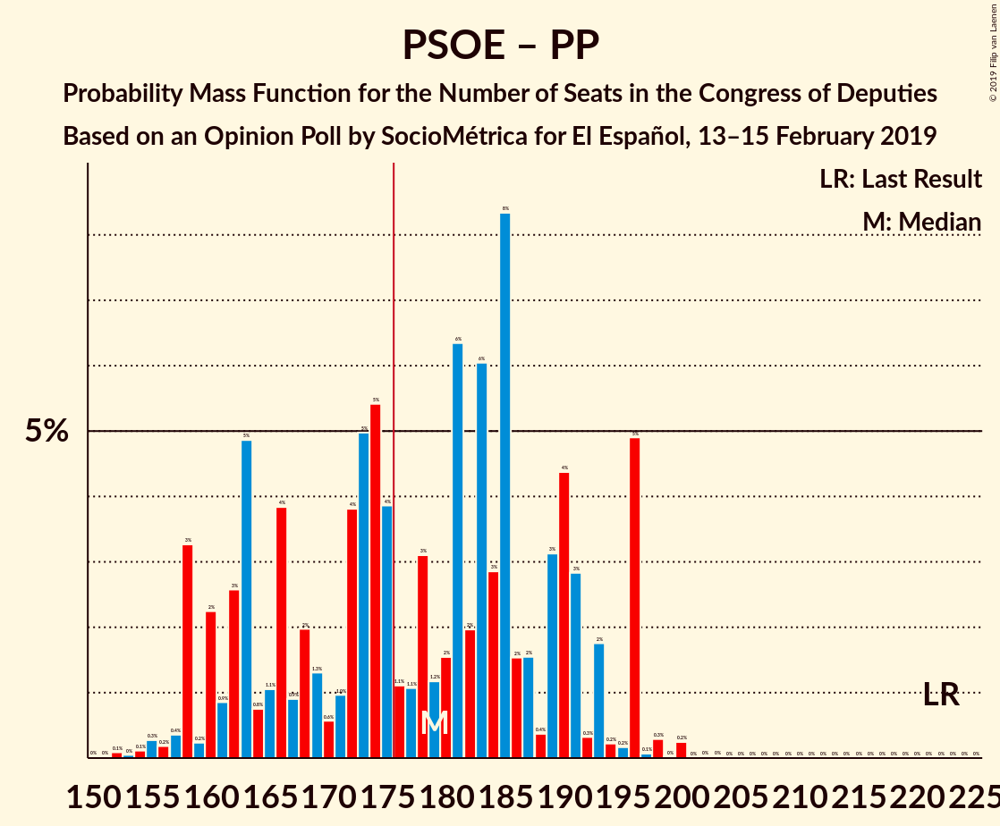
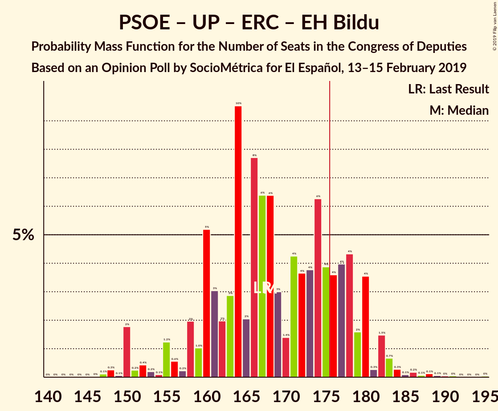
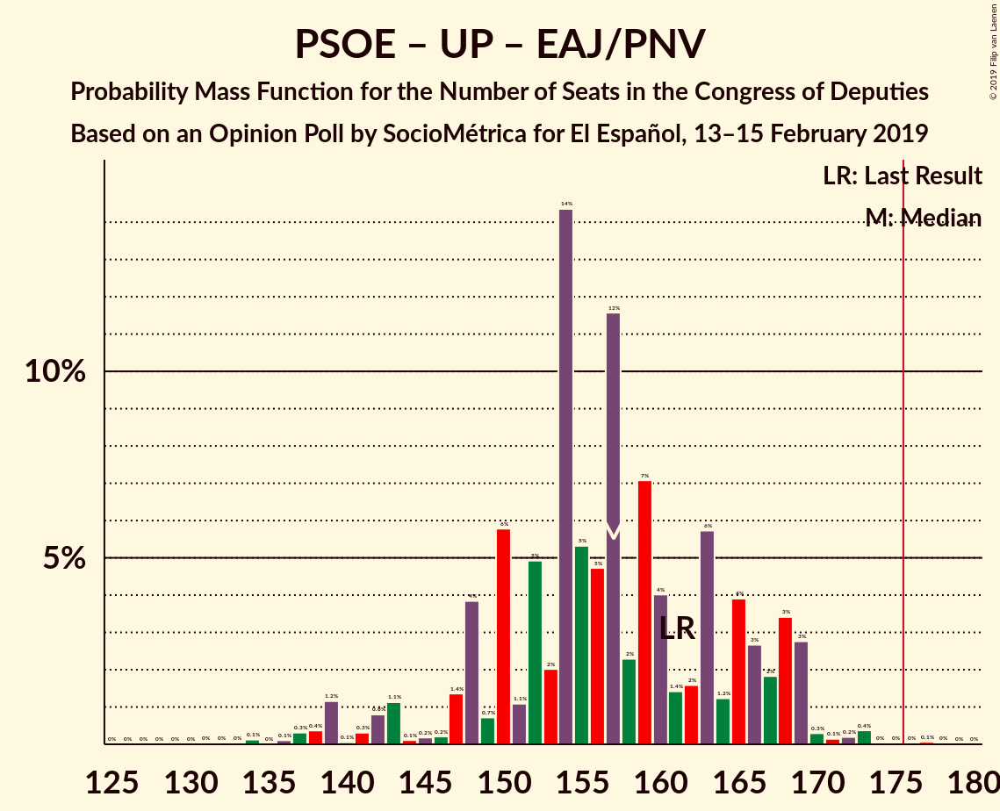
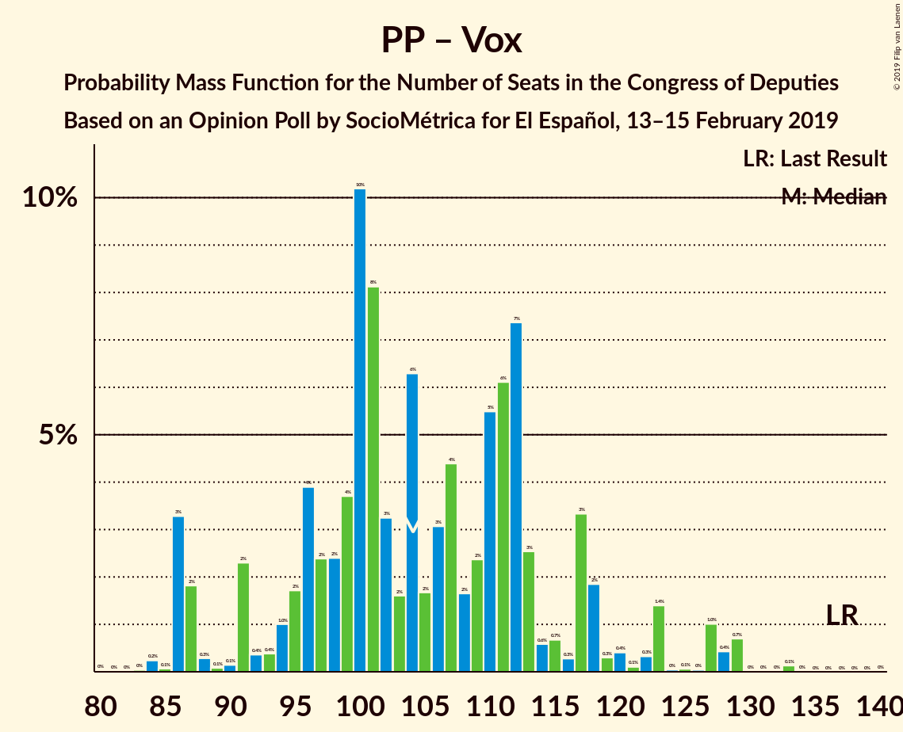

# Opinion Poll by SocioMétrica for El Español, 13–15 February 2019

<a href="#voting-intentions">Voting Intentions</a> | <a href="#seats">Seats</a> | <a href="#coalitions">Coalitions</a> | <a href="#technical-information">Technical Information</a>

## Voting Intentions

### Confidence Intervals

| Party | Last Result | Poll Result | 80% Confidence Interval | 90% Confidence Interval | 95% Confidence Interval | 99% Confidence Interval |
|:-----:|:-----------:|:-----------:|:-----------------------:|:-----------------------:|:-----------------------:|:-----------------------:|
| Partido Socialista Obrero Español | 22.6% | 24.3% | 22.6–26.1% |22.1–26.6% |21.7–27.1% |21.0–27.9% |
| Ciudadanos–Partido de la Ciudadanía | 13.1% | 18.7% | 17.2–20.4% |16.8–20.8% |16.4–21.2% |15.7–22.1% |
| Partido Popular | 33.0% | 18.6% | 17.1–20.3% |16.7–20.7% |16.3–21.1% |15.6–21.9% |
| Unidos Podemos | 21.2% | 15.2% | 13.8–16.8% |13.4–17.2% |13.1–17.6% |12.5–18.3% |
| Vox | 0.2% | 11.8% | 10.6–13.2% |10.2–13.6% |9.9–14.0% |9.4–14.7% |
| Esquerra Republicana de Catalunya–Catalunya Sí | 2.7% | 3.3% | 2.7–4.1% |2.5–4.4% |2.4–4.6% |2.1–5.0% |
| Partido Animalista Contra el Maltrato Animal | 1.2% | 1.9% | 1.4–2.6% |1.3–2.8% |1.2–3.0% |1.0–3.3% |
| Partit Demòcrata Europeu Català | 2.0% | 1.3% | 0.9–1.9% |0.8–2.1% |0.8–2.2% |0.6–2.5% |
| Euzko Alderdi Jeltzalea/Partido Nacionalista Vasco | 1.2% | 1.1% | 0.8–1.7% |0.7–1.8% |0.6–2.0% |0.5–2.3% |
| Euskal Herria Bildu | 0.8% | 0.8% | 0.5–1.3% |0.5–1.4% |0.4–1.6% |0.3–1.9% |
| Coalición Canaria–Partido Nacionalista Canario | 0.3% | 0.3% | 0.2–0.7% |0.1–0.8% |0.1–0.9% |0.1–1.1% |

*Note:* The poll result column reflects the actual value used in the calculations. Published results may vary slightly, and in addition be rounded to fewer digits.

## Seats

### Confidence Intervals

| Party | Last Result | Median | 80% Confidence Interval | 90% Confidence Interval | 95% Confidence Interval | 99% Confidence Interval |
|:-----:|:-----------:|:------:|:-----------------------:|:-----------------------:|:-----------------------:|:-----------------------:|
| <a href="#partido-socialista-obrero-español">Partido Socialista Obrero Español</a> | 85 | 106 | 94–114 |91–117 |89–117 |84–123 |
| <a href="#ciudadanos–partido-de-la-ciudadanía">Ciudadanos–Partido de la Ciudadanía</a> | 32 | 64 | 56–71 |54–72 |54–73 |52–78 |
| <a href="#partido-popular">Partido Popular</a> | 137 | 73 | 62–85 |59–88 |56–90 |56–91 |
| <a href="#unidos-podemos">Unidos Podemos</a> | 71 | 45 | 38–58 |37–60 |36–62 |34–65 |
| <a href="#vox">Vox</a> | 0 | 30 | 26–39 |24–41 |21–43 |20–48 |
| <a href="#esquerra-republicana-de-catalunya–catalunya-sí">Esquerra Republicana de Catalunya–Catalunya Sí</a> | 9 | 14 | 12–17 |11–18 |10–19 |8–20 |
| <a href="#partido-animalista-contra-el-maltrato-animal">Partido Animalista Contra el Maltrato Animal</a> | 0 | 1 | 0–1 |0–1 |0–1 |0–1 |
| <a href="#partit-demòcrata-europeu-català">Partit Demòcrata Europeu Català</a> | 8 | 5 | 1–8 |1–8 |1–10 |1–10 |
| <a href="#euzko-alderdi-jeltzalea/partido-nacionalista-vasco">Euzko Alderdi Jeltzalea/Partido Nacionalista Vasco</a> | 5 | 6 | 3–7 |3–9 |3–9 |2–10 |
| <a href="#euskal-herria-bildu">Euskal Herria Bildu</a> | 2 | 4 | 1–6 |1–7 |1–7 |0–8 |
| <a href="#coalición-canaria–partido-nacionalista-canario">Coalición Canaria–Partido Nacionalista Canario</a> | 1 | 1 | 0–2 |0–4 |0–4 |0–4 |

### Partido Socialista Obrero Español

*For a full overview of the results for this party, see the [Partido Socialista Obrero Español](party-partidosocialistaobreroespañol.html) page.*

| Number of Seats | Probability | Accumulated | Special Marks |
|:---------------:|:-----------:|:-----------:|:-------------:|
| 80 | 0.1% | 100% |  |
| 81 | 0.3% | 99.9% |  |
| 82 | 0% | 99.6% |  |
| 83 | 0% | 99.6% |  |
| 84 | 0.1% | 99.6% |  |
| 85 | 0.1% | 99.5% | Last Result |
| 86 | 0.1% | 99.3% |  |
| 87 | 0.2% | 99.2% |  |
| 88 | 2% | 99.1% |  |
| 89 | 1.0% | 98% |  |
| 90 | 0.9% | 97% |  |
| 91 | 1.4% | 96% |  |
| 92 | 0.6% | 94% |  |
| 93 | 0.6% | 94% |  |
| 94 | 6% | 93% |  |
| 95 | 2% | 87% |  |
| 96 | 5% | 85% |  |
| 97 | 1.3% | 80% |  |
| 98 | 4% | 79% |  |
| 99 | 2% | 75% |  |
| 100 | 9% | 73% |  |
| 101 | 2% | 64% |  |
| 102 | 2% | 62% |  |
| 103 | 4% | 60% |  |
| 104 | 2% | 57% |  |
| 105 | 1.4% | 55% |  |
| 106 | 4% | 53% | Median |
| 107 | 9% | 49% |  |
| 108 | 8% | 40% |  |
| 109 | 1.4% | 33% |  |
| 110 | 4% | 31% |  |
| 111 | 6% | 27% |  |
| 112 | 1.0% | 22% |  |
| 113 | 10% | 21% |  |
| 114 | 1.1% | 11% |  |
| 115 | 2% | 9% |  |
| 116 | 2% | 8% |  |
| 117 | 4% | 6% |  |
| 118 | 0.5% | 2% |  |
| 119 | 0.4% | 1.4% |  |
| 120 | 0.2% | 1.0% |  |
| 121 | 0.1% | 0.8% |  |
| 122 | 0.2% | 0.7% |  |
| 123 | 0.1% | 0.5% |  |
| 124 | 0% | 0.4% |  |
| 125 | 0.2% | 0.4% |  |
| 126 | 0% | 0.2% |  |
| 127 | 0.1% | 0.2% |  |
| 128 | 0% | 0.1% |  |
| 129 | 0% | 0% |  |

### Ciudadanos–Partido de la Ciudadanía

*For a full overview of the results for this party, see the [Ciudadanos–Partido de la Ciudadanía](party-ciudadanos–partidodelaciudadanía.html) page.*

| Number of Seats | Probability | Accumulated | Special Marks |
|:---------------:|:-----------:|:-----------:|:-------------:|
| 32 | 0% | 100% | Last Result |
| 33 | 0% | 100% |  |
| 34 | 0% | 100% |  |
| 35 | 0% | 100% |  |
| 36 | 0% | 100% |  |
| 37 | 0% | 100% |  |
| 38 | 0% | 100% |  |
| 39 | 0% | 100% |  |
| 40 | 0% | 100% |  |
| 41 | 0% | 100% |  |
| 42 | 0% | 100% |  |
| 43 | 0% | 100% |  |
| 44 | 0% | 100% |  |
| 45 | 0% | 100% |  |
| 46 | 0% | 100% |  |
| 47 | 0% | 100% |  |
| 48 | 0.1% | 100% |  |
| 49 | 0.1% | 99.9% |  |
| 50 | 0% | 99.8% |  |
| 51 | 0% | 99.8% |  |
| 52 | 0.3% | 99.8% |  |
| 53 | 1.5% | 99.5% |  |
| 54 | 3% | 98% |  |
| 55 | 0.8% | 95% |  |
| 56 | 5% | 94% |  |
| 57 | 3% | 89% |  |
| 58 | 4% | 86% |  |
| 59 | 4% | 82% |  |
| 60 | 1.3% | 79% |  |
| 61 | 9% | 78% |  |
| 62 | 4% | 69% |  |
| 63 | 11% | 65% |  |
| 64 | 9% | 54% | Median |
| 65 | 5% | 46% |  |
| 66 | 5% | 40% |  |
| 67 | 8% | 35% |  |
| 68 | 3% | 27% |  |
| 69 | 4% | 25% |  |
| 70 | 5% | 20% |  |
| 71 | 5% | 15% |  |
| 72 | 6% | 10% |  |
| 73 | 2% | 4% |  |
| 74 | 0.4% | 2% |  |
| 75 | 0% | 2% |  |
| 76 | 0.4% | 2% |  |
| 77 | 0% | 1.2% |  |
| 78 | 0.9% | 1.2% |  |
| 79 | 0% | 0.3% |  |
| 80 | 0.2% | 0.3% |  |
| 81 | 0% | 0.1% |  |
| 82 | 0% | 0.1% |  |
| 83 | 0% | 0.1% |  |
| 84 | 0% | 0.1% |  |
| 85 | 0% | 0.1% |  |
| 86 | 0% | 0% |  |

### Partido Popular

*For a full overview of the results for this party, see the [Partido Popular](party-partidopopular.html) page.*

| Number of Seats | Probability | Accumulated | Special Marks |
|:---------------:|:-----------:|:-----------:|:-------------:|
| 53 | 0% | 100% |  |
| 54 | 0% | 99.9% |  |
| 55 | 0.1% | 99.9% |  |
| 56 | 3% | 99.8% |  |
| 57 | 0.1% | 96% |  |
| 58 | 0.1% | 96% |  |
| 59 | 2% | 96% |  |
| 60 | 0.4% | 94% |  |
| 61 | 3% | 93% |  |
| 62 | 4% | 91% |  |
| 63 | 2% | 87% |  |
| 64 | 3% | 85% |  |
| 65 | 0.9% | 82% |  |
| 66 | 0.6% | 81% |  |
| 67 | 5% | 80% |  |
| 68 | 2% | 75% |  |
| 69 | 3% | 73% |  |
| 70 | 0.8% | 70% |  |
| 71 | 5% | 70% |  |
| 72 | 11% | 65% |  |
| 73 | 11% | 54% | Median |
| 74 | 4% | 43% |  |
| 75 | 5% | 39% |  |
| 76 | 4% | 34% |  |
| 77 | 3% | 30% |  |
| 78 | 6% | 27% |  |
| 79 | 4% | 21% |  |
| 80 | 0.4% | 17% |  |
| 81 | 0.8% | 17% |  |
| 82 | 0.5% | 16% |  |
| 83 | 4% | 16% |  |
| 84 | 1.0% | 12% |  |
| 85 | 5% | 11% |  |
| 86 | 0.2% | 5% |  |
| 87 | 0.1% | 5% |  |
| 88 | 0.1% | 5% |  |
| 89 | 2% | 5% |  |
| 90 | 2% | 3% |  |
| 91 | 1.0% | 1.4% |  |
| 92 | 0.1% | 0.4% |  |
| 93 | 0.1% | 0.3% |  |
| 94 | 0.1% | 0.2% |  |
| 95 | 0% | 0.1% |  |
| 96 | 0% | 0.1% |  |
| 97 | 0% | 0% |  |
| 98 | 0% | 0% |  |
| 99 | 0% | 0% |  |
| 100 | 0% | 0% |  |
| 101 | 0% | 0% |  |
| 102 | 0% | 0% |  |
| 103 | 0% | 0% |  |
| 104 | 0% | 0% |  |
| 105 | 0% | 0% |  |
| 106 | 0% | 0% |  |
| 107 | 0% | 0% |  |
| 108 | 0% | 0% |  |
| 109 | 0% | 0% |  |
| 110 | 0% | 0% |  |
| 111 | 0% | 0% |  |
| 112 | 0% | 0% |  |
| 113 | 0% | 0% |  |
| 114 | 0% | 0% |  |
| 115 | 0% | 0% |  |
| 116 | 0% | 0% |  |
| 117 | 0% | 0% |  |
| 118 | 0% | 0% |  |
| 119 | 0% | 0% |  |
| 120 | 0% | 0% |  |
| 121 | 0% | 0% |  |
| 122 | 0% | 0% |  |
| 123 | 0% | 0% |  |
| 124 | 0% | 0% |  |
| 125 | 0% | 0% |  |
| 126 | 0% | 0% |  |
| 127 | 0% | 0% |  |
| 128 | 0% | 0% |  |
| 129 | 0% | 0% |  |
| 130 | 0% | 0% |  |
| 131 | 0% | 0% |  |
| 132 | 0% | 0% |  |
| 133 | 0% | 0% |  |
| 134 | 0% | 0% |  |
| 135 | 0% | 0% |  |
| 136 | 0% | 0% |  |
| 137 | 0% | 0% | Last Result |

### Unidos Podemos

*For a full overview of the results for this party, see the [Unidos Podemos](party-unidospodemos.html) page.*

| Number of Seats | Probability | Accumulated | Special Marks |
|:---------------:|:-----------:|:-----------:|:-------------:|
| 30 | 0% | 100% |  |
| 31 | 0.1% | 99.9% |  |
| 32 | 0.3% | 99.9% |  |
| 33 | 0.1% | 99.6% |  |
| 34 | 0.5% | 99.5% |  |
| 35 | 0.2% | 99.0% |  |
| 36 | 2% | 98.8% |  |
| 37 | 7% | 97% |  |
| 38 | 8% | 90% |  |
| 39 | 6% | 83% |  |
| 40 | 10% | 76% |  |
| 41 | 2% | 66% |  |
| 42 | 5% | 64% |  |
| 43 | 3% | 60% |  |
| 44 | 4% | 56% |  |
| 45 | 8% | 52% | Median |
| 46 | 6% | 45% |  |
| 47 | 1.2% | 38% |  |
| 48 | 4% | 37% |  |
| 49 | 3% | 33% |  |
| 50 | 0.8% | 30% |  |
| 51 | 0.5% | 29% |  |
| 52 | 0.7% | 29% |  |
| 53 | 4% | 28% |  |
| 54 | 5% | 24% |  |
| 55 | 1.3% | 19% |  |
| 56 | 4% | 18% |  |
| 57 | 2% | 14% |  |
| 58 | 5% | 12% |  |
| 59 | 0.7% | 7% |  |
| 60 | 2% | 6% |  |
| 61 | 0.4% | 4% |  |
| 62 | 2% | 4% |  |
| 63 | 0.1% | 2% |  |
| 64 | 1.0% | 2% |  |
| 65 | 0.2% | 0.6% |  |
| 66 | 0.1% | 0.4% |  |
| 67 | 0% | 0.3% |  |
| 68 | 0.2% | 0.3% |  |
| 69 | 0% | 0% |  |
| 70 | 0% | 0% |  |
| 71 | 0% | 0% | Last Result |

### Vox

*For a full overview of the results for this party, see the [Vox](party-vox.html) page.*

| Number of Seats | Probability | Accumulated | Special Marks |
|:---------------:|:-----------:|:-----------:|:-------------:|
| 0 | 0% | 100% | Last Result |
| 1 | 0% | 100% |  |
| 2 | 0% | 100% |  |
| 3 | 0% | 100% |  |
| 4 | 0% | 100% |  |
| 5 | 0% | 100% |  |
| 6 | 0% | 100% |  |
| 7 | 0% | 100% |  |
| 8 | 0% | 100% |  |
| 9 | 0% | 100% |  |
| 10 | 0% | 100% |  |
| 11 | 0% | 100% |  |
| 12 | 0% | 100% |  |
| 13 | 0% | 100% |  |
| 14 | 0% | 100% |  |
| 15 | 0% | 100% |  |
| 16 | 0% | 100% |  |
| 17 | 0% | 100% |  |
| 18 | 0% | 100% |  |
| 19 | 0.1% | 100% |  |
| 20 | 1.5% | 99.9% |  |
| 21 | 1.3% | 98% |  |
| 22 | 0.5% | 97% |  |
| 23 | 1.0% | 97% |  |
| 24 | 0.6% | 96% |  |
| 25 | 3% | 95% |  |
| 26 | 3% | 92% |  |
| 27 | 17% | 89% |  |
| 28 | 7% | 72% |  |
| 29 | 9% | 65% |  |
| 30 | 9% | 56% | Median |
| 31 | 4% | 48% |  |
| 32 | 4% | 44% |  |
| 33 | 7% | 40% |  |
| 34 | 3% | 34% |  |
| 35 | 0.8% | 30% |  |
| 36 | 4% | 29% |  |
| 37 | 7% | 26% |  |
| 38 | 6% | 19% |  |
| 39 | 7% | 13% |  |
| 40 | 0.5% | 6% |  |
| 41 | 0.7% | 6% |  |
| 42 | 1.2% | 5% |  |
| 43 | 2% | 4% |  |
| 44 | 0.6% | 2% |  |
| 45 | 0.4% | 1.4% |  |
| 46 | 0.2% | 1.1% |  |
| 47 | 0.3% | 0.8% |  |
| 48 | 0.1% | 0.5% |  |
| 49 | 0.2% | 0.5% |  |
| 50 | 0.2% | 0.3% |  |
| 51 | 0% | 0.1% |  |
| 52 | 0.1% | 0.1% |  |
| 53 | 0% | 0% |  |

### Esquerra Republicana de Catalunya–Catalunya Sí

*For a full overview of the results for this party, see the [Esquerra Republicana de Catalunya–Catalunya Sí](party-esquerrarepublicanadecatalunya–catalunyasí.html) page.*

| Number of Seats | Probability | Accumulated | Special Marks |
|:---------------:|:-----------:|:-----------:|:-------------:|
| 7 | 0.5% | 100% |  |
| 8 | 0.3% | 99.5% |  |
| 9 | 2% | 99.2% | Last Result |
| 10 | 1.1% | 98% |  |
| 11 | 4% | 96% |  |
| 12 | 20% | 92% |  |
| 13 | 22% | 72% |  |
| 14 | 17% | 51% | Median |
| 15 | 13% | 34% |  |
| 16 | 5% | 21% |  |
| 17 | 10% | 16% |  |
| 18 | 2% | 6% |  |
| 19 | 3% | 4% |  |
| 20 | 0.7% | 1.2% |  |
| 21 | 0.4% | 0.4% |  |
| 22 | 0% | 0% |  |

### Partido Animalista Contra el Maltrato Animal

*For a full overview of the results for this party, see the [Partido Animalista Contra el Maltrato Animal](party-partidoanimalistacontraelmaltratoanimal.html) page.*

| Number of Seats | Probability | Accumulated | Special Marks |
|:---------------:|:-----------:|:-----------:|:-------------:|
| 0 | 38% | 100% | Last Result |
| 1 | 62% | 62% | Median |
| 2 | 0.1% | 0.3% |  |
| 3 | 0.1% | 0.1% |  |
| 4 | 0% | 0% |  |

### Partit Demòcrata Europeu Català

*For a full overview of the results for this party, see the [Partit Demòcrata Europeu Català](party-partitdemòcrataeuropeucatalà.html) page.*

| Number of Seats | Probability | Accumulated | Special Marks |
|:---------------:|:-----------:|:-----------:|:-------------:|
| 1 | 16% | 100% |  |
| 2 | 4% | 84% |  |
| 3 | 10% | 81% |  |
| 4 | 17% | 71% |  |
| 5 | 6% | 54% | Median |
| 6 | 30% | 48% |  |
| 7 | 7% | 18% |  |
| 8 | 7% | 11% | Last Result |
| 9 | 0.7% | 4% |  |
| 10 | 3% | 3% |  |
| 11 | 0.2% | 0.3% |  |
| 12 | 0% | 0% |  |

### Euzko Alderdi Jeltzalea/Partido Nacionalista Vasco

*For a full overview of the results for this party, see the [Euzko Alderdi Jeltzalea/Partido Nacionalista Vasco](party-euzkoalderdijeltzaleapartidonacionalistavasco.html) page.*

| Number of Seats | Probability | Accumulated | Special Marks |
|:---------------:|:-----------:|:-----------:|:-------------:|
| 1 | 0.1% | 100% |  |
| 2 | 1.3% | 99.8% |  |
| 3 | 12% | 98.6% |  |
| 4 | 5% | 86% |  |
| 5 | 14% | 82% | Last Result |
| 6 | 34% | 68% | Median |
| 7 | 24% | 33% |  |
| 8 | 2% | 9% |  |
| 9 | 5% | 7% |  |
| 10 | 2% | 2% |  |
| 11 | 0% | 0% |  |

### Euskal Herria Bildu

*For a full overview of the results for this party, see the [Euskal Herria Bildu](party-euskalherriabildu.html) page.*

| Number of Seats | Probability | Accumulated | Special Marks |
|:---------------:|:-----------:|:-----------:|:-------------:|
| 0 | 2% | 100% |  |
| 1 | 12% | 98% |  |
| 2 | 19% | 86% | Last Result |
| 3 | 10% | 67% |  |
| 4 | 14% | 57% | Median |
| 5 | 14% | 43% |  |
| 6 | 21% | 29% |  |
| 7 | 7% | 8% |  |
| 8 | 0.4% | 0.6% |  |
| 9 | 0.1% | 0.2% |  |
| 10 | 0.1% | 0.1% |  |
| 11 | 0% | 0% |  |

### Coalición Canaria–Partido Nacionalista Canario

*For a full overview of the results for this party, see the [Coalición Canaria–Partido Nacionalista Canario](party-coalicióncanaria–partidonacionalistacanario.html) page.*

| Number of Seats | Probability | Accumulated | Special Marks |
|:---------------:|:-----------:|:-----------:|:-------------:|
| 0 | 23% | 100% |  |
| 1 | 39% | 77% | Last Result, Median |
| 2 | 30% | 39% |  |
| 3 | 3% | 9% |  |
| 4 | 5% | 5% |  |
| 5 | 0.1% | 0.1% |  |
| 6 | 0% | 0% |  |

## Coalitions

### Confidence Intervals

| Coalition | Last Result | Median | Majority? | 80% Confidence Interval | 90% Confidence Interval | 95% Confidence Interval | 99% Confidence Interval |
|:---------:|:-----------:|:------:|:---------:|:-----------------------:|:-----------------------:|:-----------------------:|:-----------------------:|
| Partido Socialista Obrero Español – Ciudadanos–Partido de la Ciudadanía – Partido Popular | 254 | 243 | 100% | 228–253 | 226–259 | 223–259 | 219–260 |
| Partido Socialista Obrero Español – Ciudadanos–Partido de la Ciudadanía – Unidos Podemos | 188 | 215 | 100% | 205–226 | 199–232 | 196–234 | 190–235 |
| Partido Socialista Obrero Español – Partido Popular | 222 | 179 | 55% | 162–191 | 160–196 | 158–196 | 155–198 |
| Partido Socialista Obrero Español – Unidos Podemos – Esquerra Republicana de Catalunya–Catalunya Sí – Partit Demòcrata Europeu Català – Euzko Alderdi Jeltzalea/Partido Nacionalista Vasco – Euskal Herria Bildu | 180 | 178 | 68% | 172–188 | 169–190 | 163–191 | 160–194 |
| Ciudadanos–Partido de la Ciudadanía – Partido Popular – Vox | 169 | 169 | 13% | 160–176 | 158–180 | 157–185 | 153–190 |
| Partido Socialista Obrero Español – Ciudadanos–Partido de la Ciudadanía | 117 | 170 | 22% | 156–180 | 152–182 | 152–185 | 144–190 |
| Partido Socialista Obrero Español – Unidos Podemos – Esquerra Republicana de Catalunya–Catalunya Sí – Partit Demòcrata Europeu Català | 173 | 169 | 24% | 163–178 | 159–181 | 153–182 | 151–185 |
| Partido Socialista Obrero Español – Unidos Podemos – Esquerra Republicana de Catalunya–Catalunya Sí – Euskal Herria Bildu | 167 | 168 | 20% | 160–178 | 156–180 | 151–182 | 149–186 |
| Partido Socialista Obrero Español – Unidos Podemos – Euzko Alderdi Jeltzalea/Partido Nacionalista Vasco – Euskal Herria Bildu | 163 | 160 | 0.7% | 153–171 | 149–172 | 143–173 | 139–178 |
| Partido Socialista Obrero Español – Unidos Podemos – Euzko Alderdi Jeltzalea/Partido Nacionalista Vasco | 161 | 157 | 0.2% | 148–166 | 146–168 | 141–169 | 137–173 |
| Partido Socialista Obrero Español – Unidos Podemos | 156 | 151 | 0% | 143–160 | 140–163 | 135–163 | 131–167 |
| Ciudadanos–Partido de la Ciudadanía – Partido Popular – Euzko Alderdi Jeltzalea/Partido Nacionalista Vasco | 174 | 142 | 0% | 133–154 | 132–154 | 130–156 | 125–160 |
| Ciudadanos–Partido de la Ciudadanía – Partido Popular – Coalición Canaria–Partido Nacionalista Canario | 170 | 138 | 0% | 129–147 | 127–149 | 126–151 | 121–156 |
| Ciudadanos–Partido de la Ciudadanía – Partido Popular | 169 | 137 | 0% | 127–147 | 125–148 | 125–150 | 120–154 |
| Partido Popular – Vox | 137 | 104 | 0% | 94–117 | 87–118 | 86–123 | 86–129 |
| Partido Socialista Obrero Español | 85 | 106 | 0% | 94–114 | 91–117 | 89–117 | 84–123 |
| Partido Popular | 137 | 73 | 0% | 62–85 | 59–88 | 56–90 | 56–91 |

### Partido Socialista Obrero Español – Ciudadanos–Partido de la Ciudadanía – Partido Popular

| Number of Seats | Probability | Accumulated | Special Marks |
|:---------------:|:-----------:|:-----------:|:-------------:|
| 214 | 0.1% | 100% |  |
| 215 | 0.1% | 99.8% |  |
| 216 | 0% | 99.7% |  |
| 217 | 0% | 99.7% |  |
| 218 | 0.1% | 99.7% |  |
| 219 | 0.2% | 99.6% |  |
| 220 | 0.6% | 99.5% |  |
| 221 | 0.3% | 98.9% |  |
| 222 | 0.4% | 98.6% |  |
| 223 | 3% | 98% |  |
| 224 | 0.3% | 96% |  |
| 225 | 0.2% | 95% |  |
| 226 | 2% | 95% |  |
| 227 | 0.3% | 93% |  |
| 228 | 3% | 93% |  |
| 229 | 0.9% | 89% |  |
| 230 | 4% | 89% |  |
| 231 | 3% | 85% |  |
| 232 | 2% | 82% |  |
| 233 | 3% | 80% |  |
| 234 | 4% | 77% |  |
| 235 | 1.2% | 74% |  |
| 236 | 2% | 72% |  |
| 237 | 0.9% | 71% |  |
| 238 | 2% | 70% |  |
| 239 | 6% | 68% |  |
| 240 | 0.8% | 62% |  |
| 241 | 1.4% | 61% |  |
| 242 | 5% | 60% |  |
| 243 | 5% | 55% | Median |
| 244 | 7% | 50% |  |
| 245 | 8% | 43% |  |
| 246 | 4% | 35% |  |
| 247 | 5% | 31% |  |
| 248 | 2% | 25% |  |
| 249 | 4% | 24% |  |
| 250 | 1.4% | 20% |  |
| 251 | 2% | 18% |  |
| 252 | 6% | 16% |  |
| 253 | 2% | 10% |  |
| 254 | 1.1% | 9% | Last Result |
| 255 | 0.4% | 8% |  |
| 256 | 1.4% | 7% |  |
| 257 | 0.2% | 6% |  |
| 258 | 0.3% | 6% |  |
| 259 | 5% | 5% |  |
| 260 | 0.1% | 0.6% |  |
| 261 | 0% | 0.5% |  |
| 262 | 0% | 0.4% |  |
| 263 | 0.1% | 0.4% |  |
| 264 | 0% | 0.3% |  |
| 265 | 0.2% | 0.3% |  |
| 266 | 0% | 0% |  |

### Partido Socialista Obrero Español – Ciudadanos–Partido de la Ciudadanía – Unidos Podemos

| Number of Seats | Probability | Accumulated | Special Marks |
|:---------------:|:-----------:|:-----------:|:-------------:|
| 187 | 0% | 100% |  |
| 188 | 0% | 99.9% | Last Result |
| 189 | 0% | 99.9% |  |
| 190 | 0.5% | 99.9% |  |
| 191 | 0% | 99.4% |  |
| 192 | 0.1% | 99.4% |  |
| 193 | 0.1% | 99.3% |  |
| 194 | 0% | 99.2% |  |
| 195 | 1.3% | 99.2% |  |
| 196 | 2% | 98% |  |
| 197 | 0.4% | 96% |  |
| 198 | 0% | 96% |  |
| 199 | 2% | 96% |  |
| 200 | 0.5% | 94% |  |
| 201 | 0.2% | 94% |  |
| 202 | 0.5% | 93% |  |
| 203 | 2% | 93% |  |
| 204 | 0.3% | 91% |  |
| 205 | 1.1% | 90% |  |
| 206 | 7% | 89% |  |
| 207 | 0.4% | 82% |  |
| 208 | 1.2% | 81% |  |
| 209 | 3% | 80% |  |
| 210 | 4% | 77% |  |
| 211 | 4% | 72% |  |
| 212 | 5% | 69% |  |
| 213 | 2% | 63% |  |
| 214 | 8% | 61% |  |
| 215 | 4% | 53% | Median |
| 216 | 2% | 49% |  |
| 217 | 10% | 47% |  |
| 218 | 8% | 36% |  |
| 219 | 5% | 28% |  |
| 220 | 2% | 24% |  |
| 221 | 3% | 22% |  |
| 222 | 2% | 19% |  |
| 223 | 0.6% | 17% |  |
| 224 | 4% | 17% |  |
| 225 | 1.4% | 12% |  |
| 226 | 2% | 11% |  |
| 227 | 0.3% | 9% |  |
| 228 | 0.4% | 9% |  |
| 229 | 0.1% | 9% |  |
| 230 | 0.4% | 9% |  |
| 231 | 2% | 8% |  |
| 232 | 2% | 6% |  |
| 233 | 0.1% | 4% |  |
| 234 | 3% | 4% |  |
| 235 | 0.1% | 0.6% |  |
| 236 | 0.1% | 0.5% |  |
| 237 | 0.3% | 0.4% |  |
| 238 | 0% | 0.1% |  |
| 239 | 0% | 0% |  |

### Partido Socialista Obrero Español – Partido Popular

| Number of Seats | Probability | Accumulated | Special Marks |
|:---------------:|:-----------:|:-----------:|:-------------:|
| 151 | 0% | 100% |  |
| 152 | 0.1% | 99.9% |  |
| 153 | 0% | 99.9% |  |
| 154 | 0.1% | 99.8% |  |
| 155 | 0.3% | 99.7% |  |
| 156 | 0.2% | 99.4% |  |
| 157 | 0.4% | 99.2% |  |
| 158 | 3% | 98.9% |  |
| 159 | 0.2% | 96% |  |
| 160 | 2% | 95% |  |
| 161 | 0.9% | 93% |  |
| 162 | 3% | 92% |  |
| 163 | 5% | 90% |  |
| 164 | 0.8% | 85% |  |
| 165 | 1.1% | 84% |  |
| 166 | 4% | 83% |  |
| 167 | 0.9% | 79% |  |
| 168 | 2% | 78% |  |
| 169 | 1.3% | 76% |  |
| 170 | 0.6% | 75% |  |
| 171 | 1.0% | 74% |  |
| 172 | 4% | 73% |  |
| 173 | 5% | 70% |  |
| 174 | 5% | 65% |  |
| 175 | 4% | 59% |  |
| 176 | 1.1% | 55% | Majority |
| 177 | 1.1% | 54% |  |
| 178 | 3% | 53% |  |
| 179 | 1.2% | 50% | Median |
| 180 | 2% | 49% |  |
| 181 | 6% | 47% |  |
| 182 | 2% | 41% |  |
| 183 | 6% | 39% |  |
| 184 | 3% | 33% |  |
| 185 | 8% | 30% |  |
| 186 | 2% | 22% |  |
| 187 | 2% | 20% |  |
| 188 | 0.4% | 19% |  |
| 189 | 3% | 18% |  |
| 190 | 4% | 15% |  |
| 191 | 3% | 11% |  |
| 192 | 0.3% | 8% |  |
| 193 | 2% | 8% |  |
| 194 | 0.2% | 6% |  |
| 195 | 0.2% | 6% |  |
| 196 | 5% | 6% |  |
| 197 | 0.1% | 0.7% |  |
| 198 | 0.3% | 0.6% |  |
| 199 | 0% | 0.3% |  |
| 200 | 0.2% | 0.3% |  |
| 201 | 0% | 0% |  |
| 202 | 0% | 0% |  |
| 203 | 0% | 0% |  |
| 204 | 0% | 0% |  |
| 205 | 0% | 0% |  |
| 206 | 0% | 0% |  |
| 207 | 0% | 0% |  |
| 208 | 0% | 0% |  |
| 209 | 0% | 0% |  |
| 210 | 0% | 0% |  |
| 211 | 0% | 0% |  |
| 212 | 0% | 0% |  |
| 213 | 0% | 0% |  |
| 214 | 0% | 0% |  |
| 215 | 0% | 0% |  |
| 216 | 0% | 0% |  |
| 217 | 0% | 0% |  |
| 218 | 0% | 0% |  |
| 219 | 0% | 0% |  |
| 220 | 0% | 0% |  |
| 221 | 0% | 0% |  |
| 222 | 0% | 0% | Last Result |

### Partido Socialista Obrero Español – Unidos Podemos – Esquerra Republicana de Catalunya–Catalunya Sí – Partit Demòcrata Europeu Català – Euzko Alderdi Jeltzalea/Partido Nacionalista Vasco – Euskal Herria Bildu

| Number of Seats | Probability | Accumulated | Special Marks |
|:---------------:|:-----------:|:-----------:|:-------------:|
| 153 | 0% | 100% |  |
| 154 | 0% | 99.9% |  |
| 155 | 0% | 99.9% |  |
| 156 | 0% | 99.9% |  |
| 157 | 0.1% | 99.9% |  |
| 158 | 0% | 99.8% |  |
| 159 | 0% | 99.8% |  |
| 160 | 2% | 99.7% |  |
| 161 | 0.1% | 98% |  |
| 162 | 0.1% | 98% |  |
| 163 | 0.3% | 98% |  |
| 164 | 0.1% | 97% |  |
| 165 | 0.6% | 97% |  |
| 166 | 1.1% | 97% |  |
| 167 | 0.3% | 96% |  |
| 168 | 0.1% | 95% |  |
| 169 | 0.9% | 95% |  |
| 170 | 1.2% | 94% |  |
| 171 | 2% | 93% |  |
| 172 | 2% | 91% |  |
| 173 | 6% | 90% |  |
| 174 | 6% | 83% |  |
| 175 | 9% | 77% |  |
| 176 | 9% | 68% | Majority |
| 177 | 9% | 59% |  |
| 178 | 1.5% | 50% |  |
| 179 | 0.8% | 49% |  |
| 180 | 5% | 48% | Last Result, Median |
| 181 | 9% | 43% |  |
| 182 | 1.4% | 35% |  |
| 183 | 3% | 33% |  |
| 184 | 3% | 30% |  |
| 185 | 1.2% | 27% |  |
| 186 | 3% | 26% |  |
| 187 | 11% | 23% |  |
| 188 | 2% | 12% |  |
| 189 | 3% | 10% |  |
| 190 | 2% | 7% |  |
| 191 | 4% | 5% |  |
| 192 | 0.1% | 1.2% |  |
| 193 | 0.4% | 1.1% |  |
| 194 | 0.2% | 0.7% |  |
| 195 | 0.2% | 0.5% |  |
| 196 | 0% | 0.3% |  |
| 197 | 0% | 0.3% |  |
| 198 | 0.1% | 0.2% |  |
| 199 | 0% | 0.2% |  |
| 200 | 0% | 0.1% |  |
| 201 | 0% | 0.1% |  |
| 202 | 0.1% | 0.1% |  |
| 203 | 0% | 0% |  |

### Ciudadanos–Partido de la Ciudadanía – Partido Popular – Vox

| Number of Seats | Probability | Accumulated | Special Marks |
|:---------------:|:-----------:|:-----------:|:-------------:|
| 146 | 0.1% | 100% |  |
| 147 | 0% | 99.9% |  |
| 148 | 0% | 99.9% |  |
| 149 | 0% | 99.9% |  |
| 150 | 0% | 99.8% |  |
| 151 | 0% | 99.8% |  |
| 152 | 0.1% | 99.8% |  |
| 153 | 0.2% | 99.7% |  |
| 154 | 0.3% | 99.4% |  |
| 155 | 0.1% | 99.1% |  |
| 156 | 0.5% | 99.0% |  |
| 157 | 3% | 98.5% |  |
| 158 | 0.5% | 95% |  |
| 159 | 2% | 95% |  |
| 160 | 7% | 93% |  |
| 161 | 6% | 86% |  |
| 162 | 4% | 80% |  |
| 163 | 2% | 76% |  |
| 164 | 4% | 74% |  |
| 165 | 2% | 70% |  |
| 166 | 4% | 68% |  |
| 167 | 3% | 64% | Median |
| 168 | 8% | 60% |  |
| 169 | 5% | 53% | Last Result |
| 170 | 2% | 47% |  |
| 171 | 8% | 45% |  |
| 172 | 10% | 37% |  |
| 173 | 0.5% | 27% |  |
| 174 | 5% | 27% |  |
| 175 | 9% | 22% |  |
| 176 | 5% | 13% | Majority |
| 177 | 1.0% | 8% |  |
| 178 | 1.2% | 7% |  |
| 179 | 0.5% | 6% |  |
| 180 | 0.5% | 5% |  |
| 181 | 0.1% | 5% |  |
| 182 | 1.3% | 5% |  |
| 183 | 0.7% | 3% |  |
| 184 | 0.2% | 3% |  |
| 185 | 0.2% | 3% |  |
| 186 | 0.1% | 2% |  |
| 187 | 0.1% | 2% |  |
| 188 | 0.3% | 2% |  |
| 189 | 0.7% | 2% |  |
| 190 | 1.0% | 1.2% |  |
| 191 | 0% | 0.2% |  |
| 192 | 0.1% | 0.2% |  |
| 193 | 0% | 0.1% |  |
| 194 | 0% | 0.1% |  |
| 195 | 0% | 0.1% |  |
| 196 | 0% | 0% |  |

### Partido Socialista Obrero Español – Ciudadanos–Partido de la Ciudadanía

| Number of Seats | Probability | Accumulated | Special Marks |
|:---------------:|:-----------:|:-----------:|:-------------:|
| 117 | 0% | 100% | Last Result |
| 118 | 0% | 100% |  |
| 119 | 0% | 100% |  |
| 120 | 0% | 100% |  |
| 121 | 0% | 100% |  |
| 122 | 0% | 100% |  |
| 123 | 0% | 100% |  |
| 124 | 0% | 100% |  |
| 125 | 0% | 100% |  |
| 126 | 0% | 100% |  |
| 127 | 0% | 100% |  |
| 128 | 0% | 100% |  |
| 129 | 0% | 100% |  |
| 130 | 0% | 100% |  |
| 131 | 0% | 100% |  |
| 132 | 0% | 100% |  |
| 133 | 0% | 100% |  |
| 134 | 0% | 100% |  |
| 135 | 0% | 100% |  |
| 136 | 0% | 100% |  |
| 137 | 0% | 100% |  |
| 138 | 0% | 100% |  |
| 139 | 0% | 100% |  |
| 140 | 0% | 100% |  |
| 141 | 0% | 100% |  |
| 142 | 0.1% | 99.9% |  |
| 143 | 0.1% | 99.9% |  |
| 144 | 0.3% | 99.8% |  |
| 145 | 0.2% | 99.5% |  |
| 146 | 0.1% | 99.3% |  |
| 147 | 0.5% | 99.2% |  |
| 148 | 0.1% | 98.7% |  |
| 149 | 0.1% | 98.7% |  |
| 150 | 0.5% | 98.5% |  |
| 151 | 0.3% | 98% |  |
| 152 | 3% | 98% |  |
| 153 | 0.2% | 94% |  |
| 154 | 2% | 94% |  |
| 155 | 2% | 92% |  |
| 156 | 2% | 91% |  |
| 157 | 1.2% | 89% |  |
| 158 | 1.5% | 88% |  |
| 159 | 6% | 86% |  |
| 160 | 1.0% | 80% |  |
| 161 | 1.4% | 79% |  |
| 162 | 1.3% | 78% |  |
| 163 | 3% | 77% |  |
| 164 | 5% | 74% |  |
| 165 | 3% | 68% |  |
| 166 | 5% | 65% |  |
| 167 | 1.5% | 61% |  |
| 168 | 2% | 59% |  |
| 169 | 6% | 57% |  |
| 170 | 2% | 52% | Median |
| 171 | 3% | 50% |  |
| 172 | 13% | 46% |  |
| 173 | 1.3% | 33% |  |
| 174 | 9% | 32% |  |
| 175 | 0.9% | 23% |  |
| 176 | 0.8% | 22% | Majority |
| 177 | 2% | 21% |  |
| 178 | 6% | 20% |  |
| 179 | 0.6% | 14% |  |
| 180 | 6% | 13% |  |
| 181 | 1.4% | 7% |  |
| 182 | 3% | 6% |  |
| 183 | 0.3% | 3% |  |
| 184 | 0.5% | 3% |  |
| 185 | 0.1% | 3% |  |
| 186 | 0.2% | 2% |  |
| 187 | 0.4% | 2% |  |
| 188 | 1.2% | 2% |  |
| 189 | 0.1% | 0.8% |  |
| 190 | 0.3% | 0.7% |  |
| 191 | 0% | 0.4% |  |
| 192 | 0% | 0.3% |  |
| 193 | 0.1% | 0.3% |  |
| 194 | 0.1% | 0.2% |  |
| 195 | 0% | 0% |  |

### Partido Socialista Obrero Español – Unidos Podemos – Esquerra Republicana de Catalunya–Catalunya Sí – Partit Demòcrata Europeu Català

| Number of Seats | Probability | Accumulated | Special Marks |
|:---------------:|:-----------:|:-----------:|:-------------:|
| 142 | 0% | 100% |  |
| 143 | 0% | 99.9% |  |
| 144 | 0% | 99.9% |  |
| 145 | 0% | 99.9% |  |
| 146 | 0% | 99.9% |  |
| 147 | 0% | 99.9% |  |
| 148 | 0% | 99.9% |  |
| 149 | 0.2% | 99.9% |  |
| 150 | 0.2% | 99.7% |  |
| 151 | 0.1% | 99.5% |  |
| 152 | 1.4% | 99.5% |  |
| 153 | 2% | 98% |  |
| 154 | 0.1% | 96% |  |
| 155 | 0.3% | 96% |  |
| 156 | 0.1% | 96% |  |
| 157 | 0.3% | 96% |  |
| 158 | 0.1% | 96% |  |
| 159 | 0.6% | 95% |  |
| 160 | 0.5% | 95% |  |
| 161 | 0.3% | 94% |  |
| 162 | 3% | 94% |  |
| 163 | 7% | 91% |  |
| 164 | 10% | 84% |  |
| 165 | 3% | 74% |  |
| 166 | 6% | 71% |  |
| 167 | 8% | 65% |  |
| 168 | 7% | 57% |  |
| 169 | 8% | 50% |  |
| 170 | 3% | 42% | Median |
| 171 | 3% | 39% |  |
| 172 | 1.3% | 36% |  |
| 173 | 3% | 35% | Last Result |
| 174 | 4% | 32% |  |
| 175 | 5% | 28% |  |
| 176 | 1.3% | 24% | Majority |
| 177 | 5% | 22% |  |
| 178 | 8% | 17% |  |
| 179 | 0.2% | 8% |  |
| 180 | 2% | 8% |  |
| 181 | 2% | 6% |  |
| 182 | 4% | 5% |  |
| 183 | 0.2% | 0.9% |  |
| 184 | 0.2% | 0.8% |  |
| 185 | 0.2% | 0.6% |  |
| 186 | 0.1% | 0.4% |  |
| 187 | 0.1% | 0.3% |  |
| 188 | 0% | 0.3% |  |
| 189 | 0.1% | 0.2% |  |
| 190 | 0% | 0.2% |  |
| 191 | 0% | 0.1% |  |
| 192 | 0% | 0.1% |  |
| 193 | 0% | 0.1% |  |
| 194 | 0% | 0% |  |

### Partido Socialista Obrero Español – Unidos Podemos – Esquerra Republicana de Catalunya–Catalunya Sí – Euskal Herria Bildu

| Number of Seats | Probability | Accumulated | Special Marks |
|:---------------:|:-----------:|:-----------:|:-------------:|
| 142 | 0% | 100% |  |
| 143 | 0% | 99.9% |  |
| 144 | 0% | 99.9% |  |
| 145 | 0% | 99.9% |  |
| 146 | 0% | 99.9% |  |
| 147 | 0.1% | 99.9% |  |
| 148 | 0.3% | 99.8% |  |
| 149 | 0.1% | 99.5% |  |
| 150 | 2% | 99.5% |  |
| 151 | 0.2% | 98% |  |
| 152 | 0.4% | 97% |  |
| 153 | 0.2% | 97% |  |
| 154 | 0.1% | 97% |  |
| 155 | 1.2% | 97% |  |
| 156 | 0.6% | 95% |  |
| 157 | 0.2% | 95% |  |
| 158 | 2% | 95% |  |
| 159 | 1.0% | 93% |  |
| 160 | 5% | 92% |  |
| 161 | 3% | 87% |  |
| 162 | 2% | 83% |  |
| 163 | 3% | 82% |  |
| 164 | 10% | 79% |  |
| 165 | 2% | 69% |  |
| 166 | 8% | 67% |  |
| 167 | 6% | 59% | Last Result |
| 168 | 6% | 53% |  |
| 169 | 3% | 47% | Median |
| 170 | 1.4% | 44% |  |
| 171 | 4% | 42% |  |
| 172 | 4% | 38% |  |
| 173 | 4% | 34% |  |
| 174 | 6% | 31% |  |
| 175 | 4% | 24% |  |
| 176 | 4% | 20% | Majority |
| 177 | 4% | 17% |  |
| 178 | 4% | 13% |  |
| 179 | 2% | 8% |  |
| 180 | 4% | 7% |  |
| 181 | 0.3% | 3% |  |
| 182 | 1.5% | 3% |  |
| 183 | 0.7% | 2% |  |
| 184 | 0.3% | 0.9% |  |
| 185 | 0.1% | 0.7% |  |
| 186 | 0.2% | 0.6% |  |
| 187 | 0.1% | 0.4% |  |
| 188 | 0.1% | 0.3% |  |
| 189 | 0.1% | 0.2% |  |
| 190 | 0% | 0.1% |  |
| 191 | 0% | 0.1% |  |
| 192 | 0% | 0.1% |  |
| 193 | 0% | 0.1% |  |
| 194 | 0% | 0% |  |

### Partido Socialista Obrero Español – Unidos Podemos – Euzko Alderdi Jeltzalea/Partido Nacionalista Vasco – Euskal Herria Bildu

| Number of Seats | Probability | Accumulated | Special Marks |
|:---------------:|:-----------:|:-----------:|:-------------:|
| 133 | 0% | 100% |  |
| 134 | 0% | 99.9% |  |
| 135 | 0% | 99.9% |  |
| 136 | 0% | 99.9% |  |
| 137 | 0% | 99.9% |  |
| 138 | 0.2% | 99.9% |  |
| 139 | 0.2% | 99.7% |  |
| 140 | 0% | 99.5% |  |
| 141 | 1.1% | 99.4% |  |
| 142 | 0% | 98% |  |
| 143 | 0.8% | 98% |  |
| 144 | 0.1% | 97% |  |
| 145 | 0.6% | 97% |  |
| 146 | 0.4% | 97% |  |
| 147 | 0.2% | 96% |  |
| 148 | 0.6% | 96% |  |
| 149 | 2% | 96% |  |
| 150 | 0.7% | 94% |  |
| 151 | 0.7% | 93% |  |
| 152 | 2% | 92% |  |
| 153 | 2% | 91% |  |
| 154 | 3% | 89% |  |
| 155 | 5% | 86% |  |
| 156 | 6% | 82% |  |
| 157 | 5% | 75% |  |
| 158 | 12% | 70% |  |
| 159 | 7% | 58% |  |
| 160 | 5% | 52% |  |
| 161 | 1.4% | 47% | Median |
| 162 | 7% | 45% |  |
| 163 | 8% | 38% | Last Result |
| 164 | 2% | 31% |  |
| 165 | 4% | 29% |  |
| 166 | 4% | 25% |  |
| 167 | 2% | 21% |  |
| 168 | 5% | 18% |  |
| 169 | 0.4% | 14% |  |
| 170 | 2% | 13% |  |
| 171 | 5% | 11% |  |
| 172 | 4% | 6% |  |
| 173 | 2% | 3% |  |
| 174 | 0.1% | 1.1% |  |
| 175 | 0.2% | 0.9% |  |
| 176 | 0.1% | 0.7% | Majority |
| 177 | 0.1% | 0.6% |  |
| 178 | 0.3% | 0.5% |  |
| 179 | 0% | 0.2% |  |
| 180 | 0% | 0.1% |  |
| 181 | 0% | 0.1% |  |
| 182 | 0% | 0.1% |  |
| 183 | 0% | 0.1% |  |
| 184 | 0% | 0% |  |

### Partido Socialista Obrero Español – Unidos Podemos – Euzko Alderdi Jeltzalea/Partido Nacionalista Vasco

| Number of Seats | Probability | Accumulated | Special Marks |
|:---------------:|:-----------:|:-----------:|:-------------:|
| 129 | 0% | 100% |  |
| 130 | 0% | 99.9% |  |
| 131 | 0% | 99.9% |  |
| 132 | 0% | 99.9% |  |
| 133 | 0% | 99.9% |  |
| 134 | 0.1% | 99.8% |  |
| 135 | 0% | 99.7% |  |
| 136 | 0.1% | 99.7% |  |
| 137 | 0.3% | 99.6% |  |
| 138 | 0.4% | 99.3% |  |
| 139 | 1.2% | 98.9% |  |
| 140 | 0.1% | 98% |  |
| 141 | 0.3% | 98% |  |
| 142 | 0.8% | 97% |  |
| 143 | 1.1% | 97% |  |
| 144 | 0.1% | 95% |  |
| 145 | 0.2% | 95% |  |
| 146 | 0.2% | 95% |  |
| 147 | 1.4% | 95% |  |
| 148 | 4% | 94% |  |
| 149 | 0.7% | 90% |  |
| 150 | 6% | 89% |  |
| 151 | 1.1% | 83% |  |
| 152 | 5% | 82% |  |
| 153 | 2% | 77% |  |
| 154 | 14% | 75% |  |
| 155 | 5% | 61% |  |
| 156 | 5% | 56% |  |
| 157 | 12% | 51% | Median |
| 158 | 2% | 39% |  |
| 159 | 7% | 37% |  |
| 160 | 4% | 30% |  |
| 161 | 1.4% | 26% | Last Result |
| 162 | 2% | 24% |  |
| 163 | 6% | 23% |  |
| 164 | 1.2% | 17% |  |
| 165 | 4% | 16% |  |
| 166 | 3% | 12% |  |
| 167 | 2% | 9% |  |
| 168 | 3% | 7% |  |
| 169 | 3% | 4% |  |
| 170 | 0.3% | 1.2% |  |
| 171 | 0.1% | 0.9% |  |
| 172 | 0.2% | 0.8% |  |
| 173 | 0.4% | 0.6% |  |
| 174 | 0% | 0.2% |  |
| 175 | 0% | 0.2% |  |
| 176 | 0% | 0.2% | Majority |
| 177 | 0.1% | 0.1% |  |
| 178 | 0% | 0.1% |  |
| 179 | 0% | 0% |  |

### Partido Socialista Obrero Español – Unidos Podemos

| Number of Seats | Probability | Accumulated | Special Marks |
|:---------------:|:-----------:|:-----------:|:-------------:|
| 123 | 0% | 100% |  |
| 124 | 0% | 99.9% |  |
| 125 | 0% | 99.9% |  |
| 126 | 0% | 99.9% |  |
| 127 | 0% | 99.9% |  |
| 128 | 0% | 99.9% |  |
| 129 | 0% | 99.9% |  |
| 130 | 0.1% | 99.8% |  |
| 131 | 0.4% | 99.7% |  |
| 132 | 0.1% | 99.3% |  |
| 133 | 1.3% | 99.3% |  |
| 134 | 0.2% | 98% |  |
| 135 | 0.3% | 98% |  |
| 136 | 2% | 97% |  |
| 137 | 0.2% | 96% |  |
| 138 | 0.2% | 96% |  |
| 139 | 0.2% | 95% |  |
| 140 | 0.9% | 95% |  |
| 141 | 0.8% | 94% |  |
| 142 | 3% | 94% |  |
| 143 | 0.5% | 90% |  |
| 144 | 0.4% | 90% |  |
| 145 | 10% | 89% |  |
| 146 | 3% | 80% |  |
| 147 | 4% | 77% |  |
| 148 | 10% | 73% |  |
| 149 | 6% | 62% |  |
| 150 | 4% | 57% |  |
| 151 | 12% | 53% | Median |
| 152 | 5% | 41% |  |
| 153 | 4% | 36% |  |
| 154 | 3% | 32% |  |
| 155 | 3% | 29% |  |
| 156 | 7% | 26% | Last Result |
| 157 | 1.2% | 19% |  |
| 158 | 2% | 18% |  |
| 159 | 3% | 15% |  |
| 160 | 3% | 12% |  |
| 161 | 0.2% | 9% |  |
| 162 | 3% | 9% |  |
| 163 | 4% | 6% |  |
| 164 | 1.5% | 2% |  |
| 165 | 0.1% | 1.0% |  |
| 166 | 0.2% | 0.9% |  |
| 167 | 0.2% | 0.6% |  |
| 168 | 0.1% | 0.4% |  |
| 169 | 0.1% | 0.3% |  |
| 170 | 0.1% | 0.2% |  |
| 171 | 0% | 0.1% |  |
| 172 | 0% | 0.1% |  |
| 173 | 0% | 0.1% |  |
| 174 | 0% | 0.1% |  |
| 175 | 0% | 0% |  |

### Ciudadanos–Partido de la Ciudadanía – Partido Popular – Euzko Alderdi Jeltzalea/Partido Nacionalista Vasco

| Number of Seats | Probability | Accumulated | Special Marks |
|:---------------:|:-----------:|:-----------:|:-------------:|
| 119 | 0.1% | 100% |  |
| 120 | 0% | 99.8% |  |
| 121 | 0% | 99.8% |  |
| 122 | 0.1% | 99.8% |  |
| 123 | 0% | 99.7% |  |
| 124 | 0% | 99.7% |  |
| 125 | 0.2% | 99.6% |  |
| 126 | 0.1% | 99.4% |  |
| 127 | 0.4% | 99.4% |  |
| 128 | 0.2% | 99.0% |  |
| 129 | 0.2% | 98.8% |  |
| 130 | 1.2% | 98.6% |  |
| 131 | 0.8% | 97% |  |
| 132 | 6% | 97% |  |
| 133 | 0.9% | 91% |  |
| 134 | 4% | 90% |  |
| 135 | 0.7% | 86% |  |
| 136 | 3% | 85% |  |
| 137 | 12% | 83% |  |
| 138 | 4% | 71% |  |
| 139 | 7% | 66% |  |
| 140 | 5% | 60% |  |
| 141 | 3% | 54% |  |
| 142 | 1.2% | 51% |  |
| 143 | 2% | 50% | Median |
| 144 | 3% | 48% |  |
| 145 | 12% | 45% |  |
| 146 | 1.5% | 33% |  |
| 147 | 2% | 31% |  |
| 148 | 3% | 30% |  |
| 149 | 3% | 27% |  |
| 150 | 3% | 24% |  |
| 151 | 3% | 21% |  |
| 152 | 3% | 18% |  |
| 153 | 0.4% | 16% |  |
| 154 | 12% | 16% |  |
| 155 | 0.4% | 4% |  |
| 156 | 1.1% | 3% |  |
| 157 | 0.2% | 2% |  |
| 158 | 0.3% | 2% |  |
| 159 | 0.4% | 2% |  |
| 160 | 1.0% | 1.4% |  |
| 161 | 0% | 0.4% |  |
| 162 | 0.1% | 0.3% |  |
| 163 | 0% | 0.3% |  |
| 164 | 0.1% | 0.2% |  |
| 165 | 0% | 0.1% |  |
| 166 | 0% | 0.1% |  |
| 167 | 0% | 0.1% |  |
| 168 | 0% | 0.1% |  |
| 169 | 0% | 0% |  |
| 170 | 0% | 0% |  |
| 171 | 0% | 0% |  |
| 172 | 0% | 0% |  |
| 173 | 0% | 0% |  |
| 174 | 0% | 0% | Last Result |

### Ciudadanos–Partido de la Ciudadanía – Partido Popular – Coalición Canaria–Partido Nacionalista Canario

| Number of Seats | Probability | Accumulated | Special Marks |
|:---------------:|:-----------:|:-----------:|:-------------:|
| 116 | 0.2% | 100% |  |
| 117 | 0% | 99.8% |  |
| 118 | 0% | 99.8% |  |
| 119 | 0.2% | 99.8% |  |
| 120 | 0.1% | 99.6% |  |
| 121 | 0.1% | 99.5% |  |
| 122 | 0.2% | 99.5% |  |
| 123 | 0.1% | 99.2% |  |
| 124 | 0.1% | 99.1% |  |
| 125 | 0.4% | 99.0% |  |
| 126 | 1.3% | 98.6% |  |
| 127 | 3% | 97% |  |
| 128 | 0.6% | 94% |  |
| 129 | 7% | 94% |  |
| 130 | 3% | 87% |  |
| 131 | 1.4% | 83% |  |
| 132 | 5% | 82% |  |
| 133 | 4% | 77% |  |
| 134 | 3% | 72% |  |
| 135 | 6% | 70% |  |
| 136 | 7% | 64% |  |
| 137 | 5% | 57% |  |
| 138 | 4% | 52% | Median |
| 139 | 2% | 48% |  |
| 140 | 9% | 46% |  |
| 141 | 3% | 37% |  |
| 142 | 2% | 33% |  |
| 143 | 2% | 31% |  |
| 144 | 5% | 28% |  |
| 145 | 1.3% | 24% |  |
| 146 | 3% | 22% |  |
| 147 | 10% | 19% |  |
| 148 | 5% | 10% |  |
| 149 | 1.1% | 5% |  |
| 150 | 0.6% | 4% |  |
| 151 | 1.1% | 3% |  |
| 152 | 0.1% | 2% |  |
| 153 | 0.1% | 2% |  |
| 154 | 2% | 2% |  |
| 155 | 0% | 0.5% |  |
| 156 | 0.1% | 0.5% |  |
| 157 | 0.1% | 0.4% |  |
| 158 | 0.1% | 0.3% |  |
| 159 | 0% | 0.2% |  |
| 160 | 0% | 0.1% |  |
| 161 | 0% | 0.1% |  |
| 162 | 0% | 0.1% |  |
| 163 | 0% | 0.1% |  |
| 164 | 0% | 0.1% |  |
| 165 | 0% | 0% |  |
| 166 | 0% | 0% |  |
| 167 | 0% | 0% |  |
| 168 | 0% | 0% |  |
| 169 | 0% | 0% |  |
| 170 | 0% | 0% | Last Result |

### Ciudadanos–Partido de la Ciudadanía – Partido Popular

| Number of Seats | Probability | Accumulated | Special Marks |
|:---------------:|:-----------:|:-----------:|:-------------:|
| 114 | 0.1% | 100% |  |
| 115 | 0% | 99.9% |  |
| 116 | 0.1% | 99.8% |  |
| 117 | 0% | 99.8% |  |
| 118 | 0% | 99.7% |  |
| 119 | 0.2% | 99.7% |  |
| 120 | 0.2% | 99.5% |  |
| 121 | 0.2% | 99.3% |  |
| 122 | 0.1% | 99.1% |  |
| 123 | 0.1% | 99.0% |  |
| 124 | 0.5% | 98.9% |  |
| 125 | 4% | 98% |  |
| 126 | 0.5% | 95% |  |
| 127 | 6% | 94% |  |
| 128 | 3% | 88% |  |
| 129 | 0.8% | 85% |  |
| 130 | 5% | 85% |  |
| 131 | 1.2% | 80% |  |
| 132 | 10% | 79% |  |
| 133 | 1.3% | 69% |  |
| 134 | 9% | 68% |  |
| 135 | 4% | 58% |  |
| 136 | 4% | 55% |  |
| 137 | 3% | 51% | Median |
| 138 | 5% | 48% |  |
| 139 | 9% | 43% |  |
| 140 | 2% | 34% |  |
| 141 | 2% | 32% |  |
| 142 | 2% | 30% |  |
| 143 | 3% | 29% |  |
| 144 | 5% | 26% |  |
| 145 | 6% | 21% |  |
| 146 | 2% | 15% |  |
| 147 | 4% | 13% |  |
| 148 | 5% | 9% |  |
| 149 | 0.2% | 4% |  |
| 150 | 1.2% | 3% |  |
| 151 | 0.1% | 2% |  |
| 152 | 0.2% | 2% |  |
| 153 | 0.4% | 2% |  |
| 154 | 1.0% | 1.5% |  |
| 155 | 0.1% | 0.4% |  |
| 156 | 0% | 0.3% |  |
| 157 | 0.1% | 0.3% |  |
| 158 | 0% | 0.1% |  |
| 159 | 0% | 0.1% |  |
| 160 | 0% | 0.1% |  |
| 161 | 0% | 0.1% |  |
| 162 | 0% | 0.1% |  |
| 163 | 0% | 0.1% |  |
| 164 | 0% | 0% |  |
| 165 | 0% | 0% |  |
| 166 | 0% | 0% |  |
| 167 | 0% | 0% |  |
| 168 | 0% | 0% |  |
| 169 | 0% | 0% | Last Result |

### Partido Popular – Vox

| Number of Seats | Probability | Accumulated | Special Marks |
|:---------------:|:-----------:|:-----------:|:-------------:|
| 81 | 0% | 100% |  |
| 82 | 0% | 99.9% |  |
| 83 | 0% | 99.9% |  |
| 84 | 0.2% | 99.9% |  |
| 85 | 0.1% | 99.7% |  |
| 86 | 3% | 99.6% |  |
| 87 | 2% | 96% |  |
| 88 | 0.3% | 94% |  |
| 89 | 0.1% | 94% |  |
| 90 | 0.1% | 94% |  |
| 91 | 2% | 94% |  |
| 92 | 0.4% | 92% |  |
| 93 | 0.4% | 91% |  |
| 94 | 1.0% | 91% |  |
| 95 | 2% | 90% |  |
| 96 | 4% | 88% |  |
| 97 | 2% | 84% |  |
| 98 | 2% | 82% |  |
| 99 | 4% | 80% |  |
| 100 | 10% | 76% |  |
| 101 | 8% | 66% |  |
| 102 | 3% | 58% |  |
| 103 | 2% | 54% | Median |
| 104 | 6% | 53% |  |
| 105 | 2% | 46% |  |
| 106 | 3% | 45% |  |
| 107 | 4% | 42% |  |
| 108 | 2% | 37% |  |
| 109 | 2% | 36% |  |
| 110 | 5% | 33% |  |
| 111 | 6% | 28% |  |
| 112 | 7% | 22% |  |
| 113 | 3% | 14% |  |
| 114 | 0.6% | 12% |  |
| 115 | 0.7% | 11% |  |
| 116 | 0.3% | 10% |  |
| 117 | 3% | 10% |  |
| 118 | 2% | 7% |  |
| 119 | 0.3% | 5% |  |
| 120 | 0.4% | 5% |  |
| 121 | 0.1% | 4% |  |
| 122 | 0.3% | 4% |  |
| 123 | 1.4% | 4% |  |
| 124 | 0% | 2% |  |
| 125 | 0.1% | 2% |  |
| 126 | 0% | 2% |  |
| 127 | 1.0% | 2% |  |
| 128 | 0.4% | 1.3% |  |
| 129 | 0.7% | 0.9% |  |
| 130 | 0% | 0.2% |  |
| 131 | 0% | 0.2% |  |
| 132 | 0% | 0.2% |  |
| 133 | 0.1% | 0.1% |  |
| 134 | 0% | 0% |  |
| 135 | 0% | 0% |  |
| 136 | 0% | 0% |  |
| 137 | 0% | 0% | Last Result |

### Partido Socialista Obrero Español

| Number of Seats | Probability | Accumulated | Special Marks |
|:---------------:|:-----------:|:-----------:|:-------------:|
| 80 | 0.1% | 100% |  |
| 81 | 0.3% | 99.9% |  |
| 82 | 0% | 99.6% |  |
| 83 | 0% | 99.6% |  |
| 84 | 0.1% | 99.6% |  |
| 85 | 0.1% | 99.5% | Last Result |
| 86 | 0.1% | 99.3% |  |
| 87 | 0.2% | 99.2% |  |
| 88 | 2% | 99.1% |  |
| 89 | 1.0% | 98% |  |
| 90 | 0.9% | 97% |  |
| 91 | 1.4% | 96% |  |
| 92 | 0.6% | 94% |  |
| 93 | 0.6% | 94% |  |
| 94 | 6% | 93% |  |
| 95 | 2% | 87% |  |
| 96 | 5% | 85% |  |
| 97 | 1.3% | 80% |  |
| 98 | 4% | 79% |  |
| 99 | 2% | 75% |  |
| 100 | 9% | 73% |  |
| 101 | 2% | 64% |  |
| 102 | 2% | 62% |  |
| 103 | 4% | 60% |  |
| 104 | 2% | 57% |  |
| 105 | 1.4% | 55% |  |
| 106 | 4% | 53% | Median |
| 107 | 9% | 49% |  |
| 108 | 8% | 40% |  |
| 109 | 1.4% | 33% |  |
| 110 | 4% | 31% |  |
| 111 | 6% | 27% |  |
| 112 | 1.0% | 22% |  |
| 113 | 10% | 21% |  |
| 114 | 1.1% | 11% |  |
| 115 | 2% | 9% |  |
| 116 | 2% | 8% |  |
| 117 | 4% | 6% |  |
| 118 | 0.5% | 2% |  |
| 119 | 0.4% | 1.4% |  |
| 120 | 0.2% | 1.0% |  |
| 121 | 0.1% | 0.8% |  |
| 122 | 0.2% | 0.7% |  |
| 123 | 0.1% | 0.5% |  |
| 124 | 0% | 0.4% |  |
| 125 | 0.2% | 0.4% |  |
| 126 | 0% | 0.2% |  |
| 127 | 0.1% | 0.2% |  |
| 128 | 0% | 0.1% |  |
| 129 | 0% | 0% |  |

### Partido Popular

| Number of Seats | Probability | Accumulated | Special Marks |
|:---------------:|:-----------:|:-----------:|:-------------:|
| 53 | 0% | 100% |  |
| 54 | 0% | 99.9% |  |
| 55 | 0.1% | 99.9% |  |
| 56 | 3% | 99.8% |  |
| 57 | 0.1% | 96% |  |
| 58 | 0.1% | 96% |  |
| 59 | 2% | 96% |  |
| 60 | 0.4% | 94% |  |
| 61 | 3% | 93% |  |
| 62 | 4% | 91% |  |
| 63 | 2% | 87% |  |
| 64 | 3% | 85% |  |
| 65 | 0.9% | 82% |  |
| 66 | 0.6% | 81% |  |
| 67 | 5% | 80% |  |
| 68 | 2% | 75% |  |
| 69 | 3% | 73% |  |
| 70 | 0.8% | 70% |  |
| 71 | 5% | 70% |  |
| 72 | 11% | 65% |  |
| 73 | 11% | 54% | Median |
| 74 | 4% | 43% |  |
| 75 | 5% | 39% |  |
| 76 | 4% | 34% |  |
| 77 | 3% | 30% |  |
| 78 | 6% | 27% |  |
| 79 | 4% | 21% |  |
| 80 | 0.4% | 17% |  |
| 81 | 0.8% | 17% |  |
| 82 | 0.5% | 16% |  |
| 83 | 4% | 16% |  |
| 84 | 1.0% | 12% |  |
| 85 | 5% | 11% |  |
| 86 | 0.2% | 5% |  |
| 87 | 0.1% | 5% |  |
| 88 | 0.1% | 5% |  |
| 89 | 2% | 5% |  |
| 90 | 2% | 3% |  |
| 91 | 1.0% | 1.4% |  |
| 92 | 0.1% | 0.4% |  |
| 93 | 0.1% | 0.3% |  |
| 94 | 0.1% | 0.2% |  |
| 95 | 0% | 0.1% |  |
| 96 | 0% | 0.1% |  |
| 97 | 0% | 0% |  |
| 98 | 0% | 0% |  |
| 99 | 0% | 0% |  |
| 100 | 0% | 0% |  |
| 101 | 0% | 0% |  |
| 102 | 0% | 0% |  |
| 103 | 0% | 0% |  |
| 104 | 0% | 0% |  |
| 105 | 0% | 0% |  |
| 106 | 0% | 0% |  |
| 107 | 0% | 0% |  |
| 108 | 0% | 0% |  |
| 109 | 0% | 0% |  |
| 110 | 0% | 0% |  |
| 111 | 0% | 0% |  |
| 112 | 0% | 0% |  |
| 113 | 0% | 0% |  |
| 114 | 0% | 0% |  |
| 115 | 0% | 0% |  |
| 116 | 0% | 0% |  |
| 117 | 0% | 0% |  |
| 118 | 0% | 0% |  |
| 119 | 0% | 0% |  |
| 120 | 0% | 0% |  |
| 121 | 0% | 0% |  |
| 122 | 0% | 0% |  |
| 123 | 0% | 0% |  |
| 124 | 0% | 0% |  |
| 125 | 0% | 0% |  |
| 126 | 0% | 0% |  |
| 127 | 0% | 0% |  |
| 128 | 0% | 0% |  |
| 129 | 0% | 0% |  |
| 130 | 0% | 0% |  |
| 131 | 0% | 0% |  |
| 132 | 0% | 0% |  |
| 133 | 0% | 0% |  |
| 134 | 0% | 0% |  |
| 135 | 0% | 0% |  |
| 136 | 0% | 0% |  |
| 137 | 0% | 0% | Last Result |

## Technical Information

### Opinion Poll

+ **Polling firm:** SocioMétrica
+ **Commissioner(s):** El Español
+ **Fieldwork period:** 13–15 February 2019

### Calculations

+ **Sample size:** 1000
+ **Simulations done:** 1,048,576
+ **Error estimate:** 2.80%

