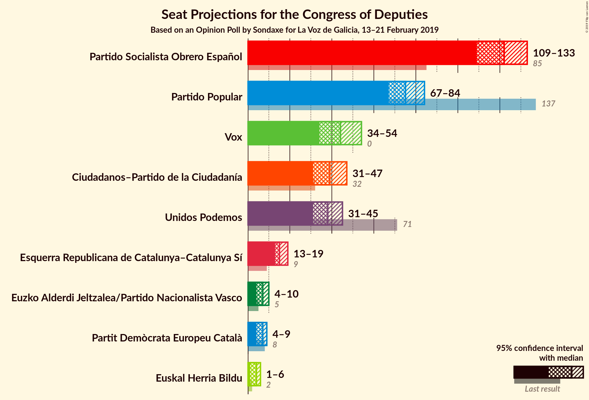
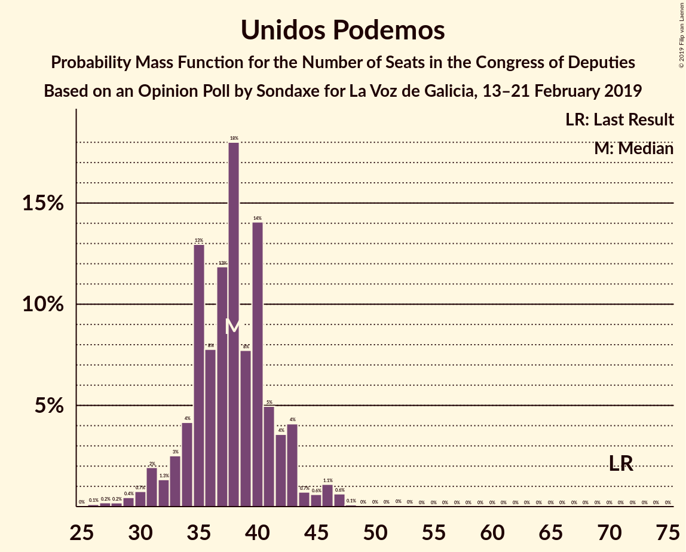
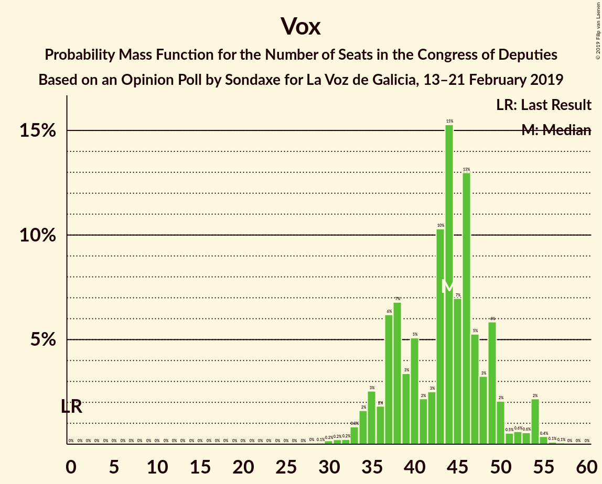
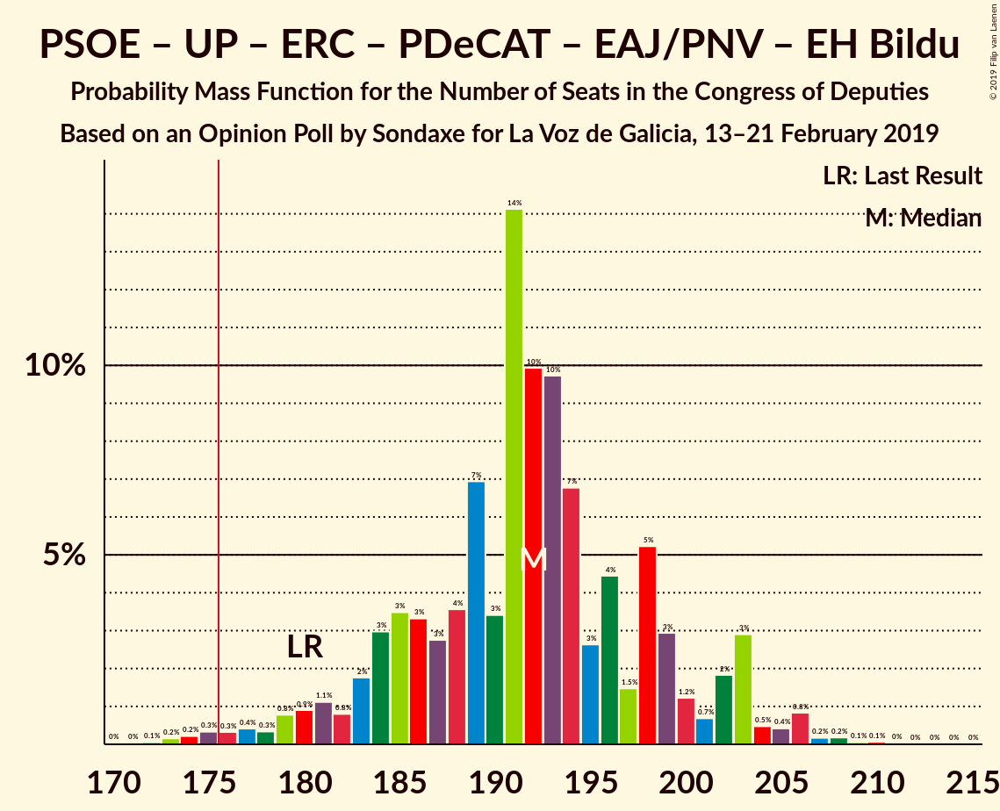
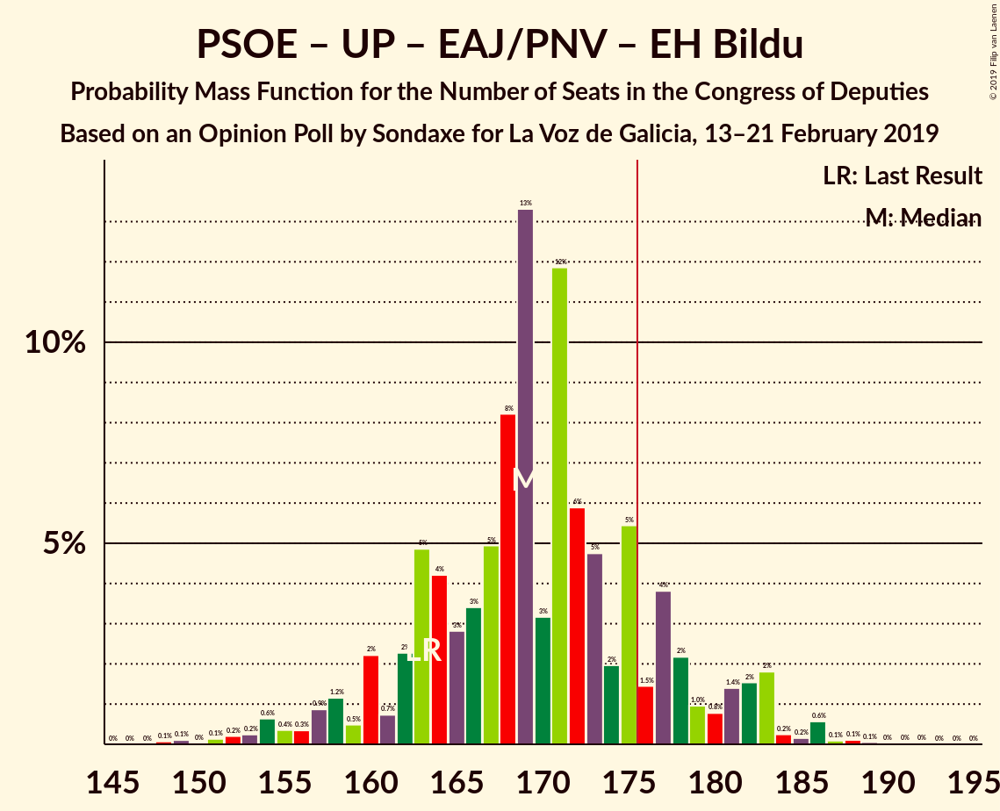
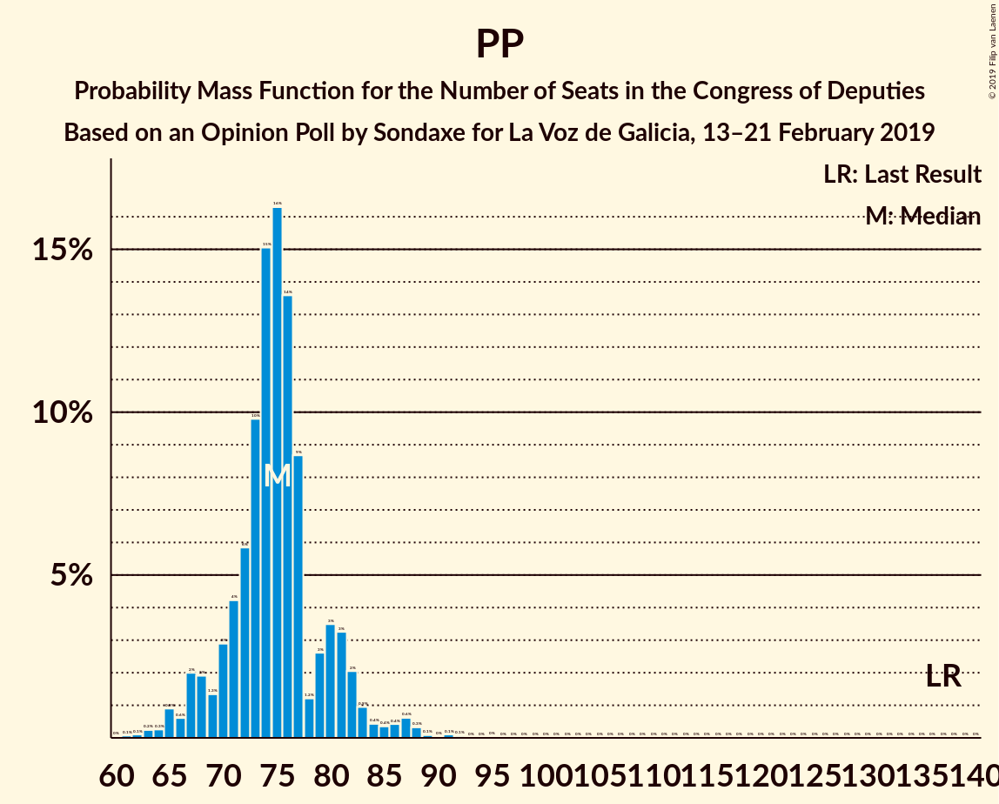

# Opinion Poll by Sondaxe for La Voz de Galicia, 13–21 February 2019

<a href="#voting-intentions">Voting Intentions</a> | <a href="#seats">Seats</a> | <a href="#coalitions">Coalitions</a> | <a href="#technical-information">Technical Information</a>

## Voting Intentions

### Confidence Intervals

| Party | Last Result | Poll Result | 80% Confidence Interval | 90% Confidence Interval | 95% Confidence Interval | 99% Confidence Interval |
|:-----:|:-----------:|:-----------:|:-----------------------:|:-----------------------:|:-----------------------:|:-----------------------:|
| Partido Socialista Obrero Español | 22.6% | 28.2% | 26.7–29.7% |26.3–30.2% |26.0–30.5% |25.3–31.3% |
| Partido Popular | 33.0% | 19.3% | 18.1–20.7% |17.7–21.1% |17.4–21.4% |16.8–22.1% |
| Unidos Podemos | 21.2% | 14.2% | 13.1–15.4% |12.8–15.8% |12.5–16.1% |12.0–16.7% |
| Vox | 0.2% | 14.2% | 13.1–15.4% |12.8–15.8% |12.5–16.1% |12.0–16.7% |
| Ciudadanos–Partido de la Ciudadanía | 13.1% | 13.5% | 12.5–14.7% |12.1–15.1% |11.9–15.4% |11.4–16.0% |
| Esquerra Republicana de Catalunya–Catalunya Sí | 2.7% | 3.8% | 3.2–4.5% |3.1–4.7% |2.9–4.9% |2.7–5.3% |
| Partit Demòcrata Europeu Català | 2.0% | 1.7% | 1.4–2.3% |1.3–2.4% |1.2–2.5% |1.0–2.8% |
| Euzko Alderdi Jeltzalea/Partido Nacionalista Vasco | 1.2% | 1.4% | 1.1–1.9% |1.0–2.0% |0.9–2.1% |0.8–2.4% |
| Euskal Herria Bildu | 0.8% | 0.8% | 0.6–1.2% |0.5–1.3% |0.5–1.4% |0.4–1.6% |

*Note:* The poll result column reflects the actual value used in the calculations. Published results may vary slightly, and in addition be rounded to fewer digits.

## Seats

### Confidence Intervals

| Party | Last Result | Median | 80% Confidence Interval | 90% Confidence Interval | 95% Confidence Interval | 99% Confidence Interval |
|:-----:|:-----------:|:------:|:-----------------------:|:-----------------------:|:-----------------------:|:-----------------------:|
| <a href="#partido-socialista-obrero-español">Partido Socialista Obrero Español</a> | 85 | 120 | 114–129 |113–130 |111–131 |106–136 |
| <a href="#partido-popular">Partido Popular</a> | 137 | 75 | 71–80 |68–82 |67–83 |63–88 |
| <a href="#unidos-podemos">Unidos Podemos</a> | 71 | 38 | 33–41 |31–43 |31–43 |28–46 |
| <a href="#vox">Vox</a> | 0 | 44 | 38–47 |35–50 |35–50 |32–54 |
| <a href="#ciudadanos–partido-de-la-ciudadanía">Ciudadanos–Partido de la Ciudadanía</a> | 32 | 39 | 34–45 |32–47 |31–47 |26–52 |
| <a href="#esquerra-republicana-de-catalunya–catalunya-sí">Esquerra Republicana de Catalunya–Catalunya Sí</a> | 9 | 14 | 13–17 |13–19 |13–19 |12–21 |
| <a href="#partit-demòcrata-europeu-català">Partit Demòcrata Europeu Català</a> | 8 | 8 | 5–9 |4–9 |4–9 |3–9 |
| <a href="#euzko-alderdi-jeltzalea/partido-nacionalista-vasco">Euzko Alderdi Jeltzalea/Partido Nacionalista Vasco</a> | 5 | 7 | 6–8 |5–9 |4–10 |3–10 |
| <a href="#euskal-herria-bildu">Euskal Herria Bildu</a> | 2 | 4 | 1–5 |1–5 |1–6 |0–7 |

### Partido Socialista Obrero Español

*For a full overview of the results for this party, see the [Partido Socialista Obrero Español](party-partidosocialistaobreroespañol.html) page.*

| Number of Seats | Probability | Accumulated | Special Marks |
|:---------------:|:-----------:|:-----------:|:-------------:|
| 85 | 0% | 100% | Last Result |
| 86 | 0% | 100% |  |
| 87 | 0% | 100% |  |
| 88 | 0% | 100% |  |
| 89 | 0% | 100% |  |
| 90 | 0% | 100% |  |
| 91 | 0% | 100% |  |
| 92 | 0% | 100% |  |
| 93 | 0% | 100% |  |
| 94 | 0% | 100% |  |
| 95 | 0% | 100% |  |
| 96 | 0% | 100% |  |
| 97 | 0% | 100% |  |
| 98 | 0% | 100% |  |
| 99 | 0% | 100% |  |
| 100 | 0% | 100% |  |
| 101 | 0.1% | 99.9% |  |
| 102 | 0% | 99.9% |  |
| 103 | 0.1% | 99.8% |  |
| 104 | 0.1% | 99.8% |  |
| 105 | 0.1% | 99.7% |  |
| 106 | 0.4% | 99.5% |  |
| 107 | 0.8% | 99.1% |  |
| 108 | 0.2% | 98% |  |
| 109 | 0.4% | 98% |  |
| 110 | 0.3% | 98% |  |
| 111 | 0.6% | 98% |  |
| 112 | 0.8% | 97% |  |
| 113 | 2% | 96% |  |
| 114 | 4% | 94% |  |
| 115 | 2% | 90% |  |
| 116 | 5% | 87% |  |
| 117 | 0.6% | 83% |  |
| 118 | 2% | 82% |  |
| 119 | 4% | 80% |  |
| 120 | 42% | 76% | Median |
| 121 | 7% | 35% |  |
| 122 | 2% | 27% |  |
| 123 | 2% | 25% |  |
| 124 | 2% | 23% |  |
| 125 | 3% | 21% |  |
| 126 | 0.5% | 18% |  |
| 127 | 3% | 18% |  |
| 128 | 4% | 15% |  |
| 129 | 5% | 10% |  |
| 130 | 2% | 6% |  |
| 131 | 2% | 4% |  |
| 132 | 0.1% | 2% |  |
| 133 | 0.9% | 2% |  |
| 134 | 0.2% | 1.1% |  |
| 135 | 0.3% | 1.0% |  |
| 136 | 0.3% | 0.6% |  |
| 137 | 0.1% | 0.4% |  |
| 138 | 0.2% | 0.3% |  |
| 139 | 0% | 0.1% |  |
| 140 | 0.1% | 0.1% |  |
| 141 | 0% | 0% |  |

### Partido Popular

*For a full overview of the results for this party, see the [Partido Popular](party-partidopopular.html) page.*

| Number of Seats | Probability | Accumulated | Special Marks |
|:---------------:|:-----------:|:-----------:|:-------------:|
| 61 | 0% | 100% |  |
| 62 | 0.1% | 99.9% |  |
| 63 | 0.4% | 99.8% |  |
| 64 | 0.1% | 99.4% |  |
| 65 | 1.1% | 99.3% |  |
| 66 | 0.5% | 98% |  |
| 67 | 0.4% | 98% |  |
| 68 | 4% | 97% |  |
| 69 | 0.8% | 93% |  |
| 70 | 2% | 92% |  |
| 71 | 1.0% | 90% |  |
| 72 | 3% | 90% |  |
| 73 | 8% | 87% |  |
| 74 | 8% | 79% |  |
| 75 | 40% | 71% | Median |
| 76 | 12% | 31% |  |
| 77 | 4% | 19% |  |
| 78 | 2% | 15% |  |
| 79 | 0.2% | 13% |  |
| 80 | 6% | 12% |  |
| 81 | 1.4% | 7% |  |
| 82 | 2% | 5% |  |
| 83 | 0.8% | 3% |  |
| 84 | 0.6% | 2% |  |
| 85 | 0.2% | 2% |  |
| 86 | 0.2% | 1.4% |  |
| 87 | 0.4% | 1.1% |  |
| 88 | 0.3% | 0.7% |  |
| 89 | 0% | 0.4% |  |
| 90 | 0.1% | 0.4% |  |
| 91 | 0.1% | 0.3% |  |
| 92 | 0.1% | 0.2% |  |
| 93 | 0% | 0.1% |  |
| 94 | 0% | 0.1% |  |
| 95 | 0% | 0.1% |  |
| 96 | 0% | 0% |  |
| 97 | 0% | 0% |  |
| 98 | 0% | 0% |  |
| 99 | 0% | 0% |  |
| 100 | 0% | 0% |  |
| 101 | 0% | 0% |  |
| 102 | 0% | 0% |  |
| 103 | 0% | 0% |  |
| 104 | 0% | 0% |  |
| 105 | 0% | 0% |  |
| 106 | 0% | 0% |  |
| 107 | 0% | 0% |  |
| 108 | 0% | 0% |  |
| 109 | 0% | 0% |  |
| 110 | 0% | 0% |  |
| 111 | 0% | 0% |  |
| 112 | 0% | 0% |  |
| 113 | 0% | 0% |  |
| 114 | 0% | 0% |  |
| 115 | 0% | 0% |  |
| 116 | 0% | 0% |  |
| 117 | 0% | 0% |  |
| 118 | 0% | 0% |  |
| 119 | 0% | 0% |  |
| 120 | 0% | 0% |  |
| 121 | 0% | 0% |  |
| 122 | 0% | 0% |  |
| 123 | 0% | 0% |  |
| 124 | 0% | 0% |  |
| 125 | 0% | 0% |  |
| 126 | 0% | 0% |  |
| 127 | 0% | 0% |  |
| 128 | 0% | 0% |  |
| 129 | 0% | 0% |  |
| 130 | 0% | 0% |  |
| 131 | 0% | 0% |  |
| 132 | 0% | 0% |  |
| 133 | 0% | 0% |  |
| 134 | 0% | 0% |  |
| 135 | 0% | 0% |  |
| 136 | 0% | 0% |  |
| 137 | 0% | 0% | Last Result |

### Unidos Podemos

*For a full overview of the results for this party, see the [Unidos Podemos](party-unidospodemos.html) page.*

| Number of Seats | Probability | Accumulated | Special Marks |
|:---------------:|:-----------:|:-----------:|:-------------:|
| 26 | 0.3% | 100% |  |
| 27 | 0.1% | 99.7% |  |
| 28 | 0.2% | 99.6% |  |
| 29 | 0.2% | 99.4% |  |
| 30 | 1.1% | 99.2% |  |
| 31 | 6% | 98% |  |
| 32 | 1.1% | 92% |  |
| 33 | 0.7% | 91% |  |
| 34 | 3% | 90% |  |
| 35 | 3% | 87% |  |
| 36 | 4% | 84% |  |
| 37 | 12% | 80% |  |
| 38 | 42% | 68% | Median |
| 39 | 7% | 26% |  |
| 40 | 5% | 19% |  |
| 41 | 5% | 14% |  |
| 42 | 4% | 9% |  |
| 43 | 3% | 5% |  |
| 44 | 0.5% | 2% |  |
| 45 | 0.6% | 2% |  |
| 46 | 0.6% | 1.1% |  |
| 47 | 0.1% | 0.5% |  |
| 48 | 0.2% | 0.4% |  |
| 49 | 0% | 0.3% |  |
| 50 | 0.1% | 0.2% |  |
| 51 | 0% | 0.1% |  |
| 52 | 0% | 0.1% |  |
| 53 | 0% | 0% |  |
| 54 | 0% | 0% |  |
| 55 | 0% | 0% |  |
| 56 | 0% | 0% |  |
| 57 | 0% | 0% |  |
| 58 | 0% | 0% |  |
| 59 | 0% | 0% |  |
| 60 | 0% | 0% |  |
| 61 | 0% | 0% |  |
| 62 | 0% | 0% |  |
| 63 | 0% | 0% |  |
| 64 | 0% | 0% |  |
| 65 | 0% | 0% |  |
| 66 | 0% | 0% |  |
| 67 | 0% | 0% |  |
| 68 | 0% | 0% |  |
| 69 | 0% | 0% |  |
| 70 | 0% | 0% |  |
| 71 | 0% | 0% | Last Result |

### Vox

*For a full overview of the results for this party, see the [Vox](party-vox.html) page.*

| Number of Seats | Probability | Accumulated | Special Marks |
|:---------------:|:-----------:|:-----------:|:-------------:|
| 0 | 0% | 100% | Last Result |
| 1 | 0% | 100% |  |
| 2 | 0% | 100% |  |
| 3 | 0% | 100% |  |
| 4 | 0% | 100% |  |
| 5 | 0% | 100% |  |
| 6 | 0% | 100% |  |
| 7 | 0% | 100% |  |
| 8 | 0% | 100% |  |
| 9 | 0% | 100% |  |
| 10 | 0% | 100% |  |
| 11 | 0% | 100% |  |
| 12 | 0% | 100% |  |
| 13 | 0% | 100% |  |
| 14 | 0% | 100% |  |
| 15 | 0% | 100% |  |
| 16 | 0% | 100% |  |
| 17 | 0% | 100% |  |
| 18 | 0% | 100% |  |
| 19 | 0% | 100% |  |
| 20 | 0% | 100% |  |
| 21 | 0% | 100% |  |
| 22 | 0% | 100% |  |
| 23 | 0% | 100% |  |
| 24 | 0% | 100% |  |
| 25 | 0% | 100% |  |
| 26 | 0% | 100% |  |
| 27 | 0% | 100% |  |
| 28 | 0.1% | 100% |  |
| 29 | 0.1% | 99.9% |  |
| 30 | 0.1% | 99.8% |  |
| 31 | 0.1% | 99.8% |  |
| 32 | 0.2% | 99.6% |  |
| 33 | 0.3% | 99.5% |  |
| 34 | 0.8% | 99.1% |  |
| 35 | 5% | 98% |  |
| 36 | 0.6% | 93% |  |
| 37 | 0.6% | 92% |  |
| 38 | 3% | 92% |  |
| 39 | 7% | 89% |  |
| 40 | 2% | 82% |  |
| 41 | 2% | 81% |  |
| 42 | 3% | 79% |  |
| 43 | 6% | 76% |  |
| 44 | 40% | 70% | Median |
| 45 | 5% | 30% |  |
| 46 | 12% | 25% |  |
| 47 | 4% | 13% |  |
| 48 | 3% | 10% |  |
| 49 | 0.7% | 7% |  |
| 50 | 4% | 6% |  |
| 51 | 0.5% | 2% |  |
| 52 | 0.5% | 2% |  |
| 53 | 0.2% | 1.0% |  |
| 54 | 0.4% | 0.8% |  |
| 55 | 0.2% | 0.4% |  |
| 56 | 0.1% | 0.3% |  |
| 57 | 0.2% | 0.2% |  |
| 58 | 0% | 0% |  |

### Ciudadanos–Partido de la Ciudadanía

*For a full overview of the results for this party, see the [Ciudadanos–Partido de la Ciudadanía](party-ciudadanos–partidodelaciudadanía.html) page.*

| Number of Seats | Probability | Accumulated | Special Marks |
|:---------------:|:-----------:|:-----------:|:-------------:|
| 21 | 0.1% | 100% |  |
| 22 | 0.1% | 99.9% |  |
| 23 | 0.1% | 99.8% |  |
| 24 | 0.1% | 99.7% |  |
| 25 | 0.1% | 99.6% |  |
| 26 | 0.1% | 99.5% |  |
| 27 | 0% | 99.4% |  |
| 28 | 0.1% | 99.4% |  |
| 29 | 0.8% | 99.3% |  |
| 30 | 0.7% | 98% |  |
| 31 | 0.6% | 98% |  |
| 32 | 4% | 97% | Last Result |
| 33 | 1.5% | 93% |  |
| 34 | 2% | 92% |  |
| 35 | 3% | 90% |  |
| 36 | 2% | 87% |  |
| 37 | 5% | 85% |  |
| 38 | 3% | 80% |  |
| 39 | 42% | 77% | Median |
| 40 | 6% | 35% |  |
| 41 | 2% | 29% |  |
| 42 | 8% | 27% |  |
| 43 | 2% | 19% |  |
| 44 | 2% | 17% |  |
| 45 | 6% | 15% |  |
| 46 | 3% | 8% |  |
| 47 | 3% | 5% |  |
| 48 | 0.2% | 2% |  |
| 49 | 0.4% | 2% |  |
| 50 | 0.4% | 2% |  |
| 51 | 0.2% | 1.2% |  |
| 52 | 0.9% | 1.0% |  |
| 53 | 0% | 0.1% |  |
| 54 | 0% | 0.1% |  |
| 55 | 0% | 0% |  |

### Esquerra Republicana de Catalunya–Catalunya Sí

*For a full overview of the results for this party, see the [Esquerra Republicana de Catalunya–Catalunya Sí](party-esquerrarepublicanadecatalunya–catalunyasí.html) page.*

| Number of Seats | Probability | Accumulated | Special Marks |
|:---------------:|:-----------:|:-----------:|:-------------:|
| 9 | 0% | 100% | Last Result |
| 10 | 0.1% | 100% |  |
| 11 | 0.2% | 99.9% |  |
| 12 | 1.0% | 99.7% |  |
| 13 | 12% | 98.8% |  |
| 14 | 40% | 87% | Median |
| 15 | 22% | 46% |  |
| 16 | 12% | 24% |  |
| 17 | 5% | 12% |  |
| 18 | 1.4% | 7% |  |
| 19 | 3% | 5% |  |
| 20 | 1.1% | 2% |  |
| 21 | 1.4% | 1.4% |  |
| 22 | 0% | 0% |  |

### Partit Demòcrata Europeu Català

*For a full overview of the results for this party, see the [Partit Demòcrata Europeu Català](party-partitdemòcrataeuropeucatalà.html) page.*

| Number of Seats | Probability | Accumulated | Special Marks |
|:---------------:|:-----------:|:-----------:|:-------------:|
| 2 | 0.1% | 100% |  |
| 3 | 2% | 99.9% |  |
| 4 | 6% | 98% |  |
| 5 | 9% | 92% |  |
| 6 | 14% | 83% |  |
| 7 | 8% | 69% |  |
| 8 | 51% | 62% | Last Result, Median |
| 9 | 10% | 10% |  |
| 10 | 0.1% | 0.3% |  |
| 11 | 0.2% | 0.2% |  |
| 12 | 0% | 0% |  |

### Euzko Alderdi Jeltzalea/Partido Nacionalista Vasco

*For a full overview of the results for this party, see the [Euzko Alderdi Jeltzalea/Partido Nacionalista Vasco](party-euzkoalderdijeltzaleapartidonacionalistavasco.html) page.*

| Number of Seats | Probability | Accumulated | Special Marks |
|:---------------:|:-----------:|:-----------:|:-------------:|
| 3 | 1.5% | 100% |  |
| 4 | 1.5% | 98.5% |  |
| 5 | 5% | 97% | Last Result |
| 6 | 20% | 92% |  |
| 7 | 56% | 72% | Median |
| 8 | 9% | 16% |  |
| 9 | 3% | 7% |  |
| 10 | 4% | 4% |  |
| 11 | 0.3% | 0.3% |  |
| 12 | 0% | 0% |  |

### Euskal Herria Bildu

*For a full overview of the results for this party, see the [Euskal Herria Bildu](party-euskalherriabildu.html) page.*

| Number of Seats | Probability | Accumulated | Special Marks |
|:---------------:|:-----------:|:-----------:|:-------------:|
| 0 | 0.9% | 100% |  |
| 1 | 10% | 99.1% |  |
| 2 | 13% | 89% | Last Result |
| 3 | 6% | 75% |  |
| 4 | 56% | 70% | Median |
| 5 | 10% | 14% |  |
| 6 | 3% | 4% |  |
| 7 | 1.1% | 1.2% |  |
| 8 | 0% | 0% |  |

## Coalitions

### Confidence Intervals

| Coalition | Last Result | Median | Majority? | 80% Confidence Interval | 90% Confidence Interval | 95% Confidence Interval | 99% Confidence Interval |
|:---------:|:-----------:|:------:|:---------:|:-----------------------:|:-----------------------:|:-----------------------:|:-----------------------:|
| Partido Socialista Obrero Español – Partido Popular – Ciudadanos–Partido de la Ciudadanía | 254 | 234 | 100% | 231–242 | 226–244 | 225–245 | 222–250 |
| Partido Socialista Obrero Español – Unidos Podemos – Ciudadanos–Partido de la Ciudadanía | 188 | 197 | 100% | 193–205 | 191–209 | 186–209 | 182–214 |
| Partido Socialista Obrero Español – Partido Popular | 222 | 195 | 99.9% | 189–204 | 187–205 | 187–207 | 181–210 |
| Partido Socialista Obrero Español – Unidos Podemos – Esquerra Republicana de Catalunya–Catalunya Sí – Partit Demòcrata Europeu Català – Euzko Alderdi Jeltzalea/Partido Nacionalista Vasco – Euskal Herria Bildu | 180 | 191 | 99.2% | 185–199 | 183–200 | 181–202 | 174–207 |
| Partido Socialista Obrero Español – Unidos Podemos – Esquerra Republicana de Catalunya–Catalunya Sí – Partit Demòcrata Europeu Català | 173 | 180 | 82% | 174–189 | 173–191 | 171–192 | 163–197 |
| Partido Socialista Obrero Español – Unidos Podemos – Esquerra Republicana de Catalunya–Catalunya Sí – Euskal Herria Bildu | 167 | 176 | 73% | 172–184 | 168–187 | 165–189 | 161–193 |
| Partido Socialista Obrero Español – Unidos Podemos – Euzko Alderdi Jeltzalea/Partido Nacionalista Vasco – Euskal Herria Bildu | 163 | 169 | 14% | 163–178 | 160–178 | 158–179 | 152–185 |
| Partido Socialista Obrero Español – Unidos Podemos – Euzko Alderdi Jeltzalea/Partido Nacionalista Vasco | 161 | 165 | 7% | 159–174 | 158–177 | 156–177 | 148–182 |
| Partido Socialista Obrero Español – Ciudadanos–Partido de la Ciudadanía | 117 | 159 | 0.6% | 155–168 | 151–170 | 148–171 | 144–176 |
| Partido Socialista Obrero Español – Unidos Podemos | 156 | 158 | 0.4% | 152–166 | 151–170 | 148–170 | 142–174 |
| Partido Popular – Vox – Ciudadanos–Partido de la Ciudadanía | 169 | 158 | 0.5% | 150–164 | 149–166 | 147–168 | 142–175 |
| Partido Popular – Ciudadanos–Partido de la Ciudadanía – Euzko Alderdi Jeltzalea/Partido Nacionalista Vasco | 174 | 121 | 0% | 115–129 | 113–131 | 111–132 | 106–138 |
| Partido Socialista Obrero Español | 85 | 120 | 0% | 114–129 | 113–130 | 111–131 | 106–136 |
| Partido Popular – Vox | 137 | 119 | 0% | 111–124 | 111–125 | 109–130 | 104–134 |
| Partido Popular – Ciudadanos–Partido de la Ciudadanía | 169 | 114 | 0% | 108–122 | 106–125 | 105–125 | 100–131 |
| Partido Popular | 137 | 75 | 0% | 71–80 | 68–82 | 67–83 | 63–88 |

### Partido Socialista Obrero Español – Partido Popular – Ciudadanos–Partido de la Ciudadanía

| Number of Seats | Probability | Accumulated | Special Marks |
|:---------------:|:-----------:|:-----------:|:-------------:|
| 218 | 0% | 100% |  |
| 219 | 0% | 99.9% |  |
| 220 | 0.1% | 99.9% |  |
| 221 | 0.3% | 99.8% |  |
| 222 | 0.1% | 99.5% |  |
| 223 | 0.2% | 99.4% |  |
| 224 | 0.5% | 99.2% |  |
| 225 | 4% | 98.7% |  |
| 226 | 0.4% | 95% |  |
| 227 | 0.4% | 95% |  |
| 228 | 1.4% | 94% |  |
| 229 | 0.3% | 93% |  |
| 230 | 0.9% | 93% |  |
| 231 | 3% | 92% |  |
| 232 | 4% | 89% |  |
| 233 | 6% | 85% |  |
| 234 | 41% | 78% | Median |
| 235 | 0.6% | 37% |  |
| 236 | 5% | 37% |  |
| 237 | 2% | 32% |  |
| 238 | 3% | 30% |  |
| 239 | 8% | 27% |  |
| 240 | 3% | 19% |  |
| 241 | 6% | 16% |  |
| 242 | 2% | 11% |  |
| 243 | 1.2% | 9% |  |
| 244 | 5% | 8% |  |
| 245 | 1.2% | 3% |  |
| 246 | 0.2% | 2% |  |
| 247 | 0.8% | 2% |  |
| 248 | 0.3% | 1.0% |  |
| 249 | 0.1% | 0.7% |  |
| 250 | 0.3% | 0.6% |  |
| 251 | 0.1% | 0.4% |  |
| 252 | 0.1% | 0.2% |  |
| 253 | 0% | 0.2% |  |
| 254 | 0.1% | 0.1% | Last Result |
| 255 | 0% | 0.1% |  |
| 256 | 0% | 0.1% |  |
| 257 | 0.1% | 0.1% |  |
| 258 | 0% | 0% |  |

### Partido Socialista Obrero Español – Unidos Podemos – Ciudadanos–Partido de la Ciudadanía

| Number of Seats | Probability | Accumulated | Special Marks |
|:---------------:|:-----------:|:-----------:|:-------------:|
| 177 | 0% | 100% |  |
| 178 | 0% | 99.9% |  |
| 179 | 0.2% | 99.9% |  |
| 180 | 0% | 99.7% |  |
| 181 | 0% | 99.7% |  |
| 182 | 0.3% | 99.7% |  |
| 183 | 0.5% | 99.4% |  |
| 184 | 0.4% | 98.9% |  |
| 185 | 0.9% | 98.5% |  |
| 186 | 0.3% | 98% |  |
| 187 | 0.3% | 97% |  |
| 188 | 0.3% | 97% | Last Result |
| 189 | 0.6% | 97% |  |
| 190 | 0.9% | 96% |  |
| 191 | 1.2% | 95% |  |
| 192 | 0.5% | 94% |  |
| 193 | 5% | 94% |  |
| 194 | 9% | 89% |  |
| 195 | 0.8% | 80% |  |
| 196 | 3% | 80% |  |
| 197 | 38% | 76% | Median |
| 198 | 9% | 39% |  |
| 199 | 4% | 29% |  |
| 200 | 2% | 25% |  |
| 201 | 2% | 24% |  |
| 202 | 2% | 22% |  |
| 203 | 4% | 20% |  |
| 204 | 3% | 15% |  |
| 205 | 4% | 12% |  |
| 206 | 1.1% | 9% |  |
| 207 | 0.5% | 7% |  |
| 208 | 0.7% | 7% |  |
| 209 | 4% | 6% |  |
| 210 | 1.1% | 2% |  |
| 211 | 0.1% | 0.9% |  |
| 212 | 0.1% | 0.8% |  |
| 213 | 0.2% | 0.7% |  |
| 214 | 0.1% | 0.5% |  |
| 215 | 0% | 0.5% |  |
| 216 | 0.1% | 0.4% |  |
| 217 | 0.1% | 0.3% |  |
| 218 | 0.1% | 0.2% |  |
| 219 | 0.1% | 0.2% |  |
| 220 | 0% | 0.1% |  |
| 221 | 0.1% | 0.1% |  |
| 222 | 0% | 0% |  |

### Partido Socialista Obrero Español – Partido Popular

| Number of Seats | Probability | Accumulated | Special Marks |
|:---------------:|:-----------:|:-----------:|:-------------:|
| 175 | 0% | 100% |  |
| 176 | 0% | 99.9% | Majority |
| 177 | 0.2% | 99.9% |  |
| 178 | 0.1% | 99.8% |  |
| 179 | 0% | 99.7% |  |
| 180 | 0.1% | 99.6% |  |
| 181 | 0.1% | 99.6% |  |
| 182 | 0.2% | 99.5% |  |
| 183 | 0.1% | 99.2% |  |
| 184 | 0.3% | 99.1% |  |
| 185 | 0.1% | 98.8% |  |
| 186 | 0.4% | 98.7% |  |
| 187 | 3% | 98% |  |
| 188 | 4% | 95% |  |
| 189 | 2% | 91% |  |
| 190 | 0.4% | 89% |  |
| 191 | 1.4% | 88% |  |
| 192 | 2% | 87% |  |
| 193 | 6% | 85% |  |
| 194 | 2% | 79% |  |
| 195 | 39% | 77% | Median |
| 196 | 8% | 38% |  |
| 197 | 9% | 31% |  |
| 198 | 1.2% | 22% |  |
| 199 | 0.8% | 20% |  |
| 200 | 3% | 20% |  |
| 201 | 0.7% | 16% |  |
| 202 | 4% | 16% |  |
| 203 | 1.1% | 12% |  |
| 204 | 3% | 11% |  |
| 205 | 5% | 8% |  |
| 206 | 0.5% | 4% |  |
| 207 | 1.2% | 3% |  |
| 208 | 0.3% | 2% |  |
| 209 | 0.2% | 2% |  |
| 210 | 1.0% | 1.4% |  |
| 211 | 0.1% | 0.5% |  |
| 212 | 0.1% | 0.3% |  |
| 213 | 0% | 0.2% |  |
| 214 | 0% | 0.2% |  |
| 215 | 0.1% | 0.1% |  |
| 216 | 0% | 0.1% |  |
| 217 | 0% | 0.1% |  |
| 218 | 0% | 0% |  |
| 219 | 0% | 0% |  |
| 220 | 0% | 0% |  |
| 221 | 0% | 0% |  |
| 222 | 0% | 0% | Last Result |

### Partido Socialista Obrero Español – Unidos Podemos – Esquerra Republicana de Catalunya–Catalunya Sí – Partit Demòcrata Europeu Català – Euzko Alderdi Jeltzalea/Partido Nacionalista Vasco – Euskal Herria Bildu

| Number of Seats | Probability | Accumulated | Special Marks |
|:---------------:|:-----------:|:-----------:|:-------------:|
| 171 | 0.1% | 100% |  |
| 172 | 0% | 99.9% |  |
| 173 | 0.3% | 99.9% |  |
| 174 | 0.1% | 99.5% |  |
| 175 | 0.2% | 99.5% |  |
| 176 | 0.3% | 99.2% | Majority |
| 177 | 0.2% | 98.9% |  |
| 178 | 0.7% | 98.7% |  |
| 179 | 0.2% | 98% |  |
| 180 | 0.1% | 98% | Last Result |
| 181 | 0.2% | 98% |  |
| 182 | 2% | 97% |  |
| 183 | 1.4% | 96% |  |
| 184 | 3% | 94% |  |
| 185 | 10% | 91% |  |
| 186 | 1.0% | 81% |  |
| 187 | 1.2% | 80% |  |
| 188 | 5% | 79% |  |
| 189 | 3% | 74% |  |
| 190 | 4% | 71% |  |
| 191 | 39% | 67% | Median |
| 192 | 3% | 28% |  |
| 193 | 4% | 25% |  |
| 194 | 2% | 21% |  |
| 195 | 2% | 19% |  |
| 196 | 1.4% | 17% |  |
| 197 | 0.4% | 16% |  |
| 198 | 3% | 15% |  |
| 199 | 6% | 12% |  |
| 200 | 2% | 6% |  |
| 201 | 0.5% | 3% |  |
| 202 | 1.2% | 3% |  |
| 203 | 0.2% | 2% |  |
| 204 | 0.2% | 2% |  |
| 205 | 0.3% | 1.4% |  |
| 206 | 0.6% | 1.1% |  |
| 207 | 0.2% | 0.5% |  |
| 208 | 0.1% | 0.3% |  |
| 209 | 0.1% | 0.2% |  |
| 210 | 0% | 0.1% |  |
| 211 | 0.1% | 0.1% |  |
| 212 | 0% | 0% |  |

### Partido Socialista Obrero Español – Unidos Podemos – Esquerra Republicana de Catalunya–Catalunya Sí – Partit Demòcrata Europeu Català

| Number of Seats | Probability | Accumulated | Special Marks |
|:---------------:|:-----------:|:-----------:|:-------------:|
| 160 | 0.1% | 100% |  |
| 161 | 0% | 99.9% |  |
| 162 | 0% | 99.9% |  |
| 163 | 0.4% | 99.9% |  |
| 164 | 0.1% | 99.5% |  |
| 165 | 0.1% | 99.4% |  |
| 166 | 0.4% | 99.2% |  |
| 167 | 0.2% | 98.8% |  |
| 168 | 0.2% | 98.7% |  |
| 169 | 0.2% | 98% |  |
| 170 | 0.7% | 98% |  |
| 171 | 0.3% | 98% |  |
| 172 | 1.5% | 97% |  |
| 173 | 3% | 96% | Last Result |
| 174 | 11% | 93% |  |
| 175 | 0.5% | 82% |  |
| 176 | 2% | 82% | Majority |
| 177 | 1.5% | 80% |  |
| 178 | 6% | 79% |  |
| 179 | 2% | 73% |  |
| 180 | 39% | 71% | Median |
| 181 | 4% | 32% |  |
| 182 | 1.3% | 28% |  |
| 183 | 4% | 27% |  |
| 184 | 3% | 23% |  |
| 185 | 3% | 20% |  |
| 186 | 2% | 16% |  |
| 187 | 2% | 14% |  |
| 188 | 2% | 12% |  |
| 189 | 0.8% | 10% |  |
| 190 | 1.0% | 9% |  |
| 191 | 6% | 8% |  |
| 192 | 0.8% | 3% |  |
| 193 | 0.4% | 2% |  |
| 194 | 0.4% | 2% |  |
| 195 | 0.5% | 1.2% |  |
| 196 | 0.2% | 0.7% |  |
| 197 | 0.2% | 0.6% |  |
| 198 | 0.1% | 0.3% |  |
| 199 | 0.1% | 0.2% |  |
| 200 | 0.1% | 0.2% |  |
| 201 | 0% | 0.1% |  |
| 202 | 0% | 0.1% |  |
| 203 | 0% | 0.1% |  |
| 204 | 0% | 0% |  |

### Partido Socialista Obrero Español – Unidos Podemos – Esquerra Republicana de Catalunya–Catalunya Sí – Euskal Herria Bildu

| Number of Seats | Probability | Accumulated | Special Marks |
|:---------------:|:-----------:|:-----------:|:-------------:|
| 157 | 0.1% | 100% |  |
| 158 | 0.1% | 99.9% |  |
| 159 | 0.2% | 99.8% |  |
| 160 | 0.1% | 99.7% |  |
| 161 | 0.3% | 99.6% |  |
| 162 | 0.4% | 99.3% |  |
| 163 | 0.1% | 98.9% |  |
| 164 | 0.1% | 98.7% |  |
| 165 | 2% | 98.6% |  |
| 166 | 0.3% | 97% |  |
| 167 | 0.2% | 96% | Last Result |
| 168 | 2% | 96% |  |
| 169 | 0.2% | 95% |  |
| 170 | 0.8% | 94% |  |
| 171 | 1.0% | 94% |  |
| 172 | 7% | 93% |  |
| 173 | 10% | 85% |  |
| 174 | 0.9% | 76% |  |
| 175 | 1.4% | 75% |  |
| 176 | 40% | 73% | Median, Majority |
| 177 | 4% | 33% |  |
| 178 | 3% | 29% |  |
| 179 | 0.9% | 26% |  |
| 180 | 1.3% | 25% |  |
| 181 | 5% | 23% |  |
| 182 | 0.8% | 18% |  |
| 183 | 4% | 17% |  |
| 184 | 5% | 14% |  |
| 185 | 1.4% | 9% |  |
| 186 | 2% | 7% |  |
| 187 | 1.4% | 6% |  |
| 188 | 2% | 4% |  |
| 189 | 0.4% | 3% |  |
| 190 | 0.3% | 2% |  |
| 191 | 0.5% | 2% |  |
| 192 | 0.2% | 1.2% |  |
| 193 | 0.5% | 1.0% |  |
| 194 | 0.2% | 0.5% |  |
| 195 | 0.2% | 0.3% |  |
| 196 | 0% | 0.2% |  |
| 197 | 0% | 0.1% |  |
| 198 | 0% | 0.1% |  |
| 199 | 0% | 0.1% |  |
| 200 | 0% | 0% |  |

### Partido Socialista Obrero Español – Unidos Podemos – Euzko Alderdi Jeltzalea/Partido Nacionalista Vasco – Euskal Herria Bildu

| Number of Seats | Probability | Accumulated | Special Marks |
|:---------------:|:-----------:|:-----------:|:-------------:|
| 149 | 0.2% | 100% |  |
| 150 | 0% | 99.8% |  |
| 151 | 0.2% | 99.7% |  |
| 152 | 0.2% | 99.5% |  |
| 153 | 0.2% | 99.3% |  |
| 154 | 1.0% | 99.2% |  |
| 155 | 0.2% | 98% |  |
| 156 | 0.2% | 98% |  |
| 157 | 0.1% | 98% |  |
| 158 | 0.8% | 98% |  |
| 159 | 0.5% | 97% |  |
| 160 | 2% | 96% |  |
| 161 | 2% | 95% |  |
| 162 | 2% | 93% |  |
| 163 | 7% | 91% | Last Result |
| 164 | 5% | 84% |  |
| 165 | 0.8% | 79% |  |
| 166 | 4% | 79% |  |
| 167 | 3% | 74% |  |
| 168 | 6% | 71% |  |
| 169 | 38% | 65% | Median |
| 170 | 5% | 27% |  |
| 171 | 1.1% | 23% |  |
| 172 | 0.8% | 21% |  |
| 173 | 2% | 21% |  |
| 174 | 3% | 19% |  |
| 175 | 2% | 16% |  |
| 176 | 2% | 14% | Majority |
| 177 | 2% | 12% |  |
| 178 | 7% | 10% |  |
| 179 | 1.0% | 3% |  |
| 180 | 0.2% | 2% |  |
| 181 | 0.4% | 2% |  |
| 182 | 0.3% | 2% |  |
| 183 | 0.2% | 1.5% |  |
| 184 | 0.7% | 1.3% |  |
| 185 | 0.2% | 0.6% |  |
| 186 | 0.1% | 0.3% |  |
| 187 | 0.1% | 0.2% |  |
| 188 | 0% | 0.1% |  |
| 189 | 0% | 0.1% |  |
| 190 | 0% | 0% |  |

### Partido Socialista Obrero Español – Unidos Podemos – Euzko Alderdi Jeltzalea/Partido Nacionalista Vasco

| Number of Seats | Probability | Accumulated | Special Marks |
|:---------------:|:-----------:|:-----------:|:-------------:|
| 146 | 0.1% | 100% |  |
| 147 | 0.3% | 99.9% |  |
| 148 | 0.3% | 99.6% |  |
| 149 | 0.1% | 99.3% |  |
| 150 | 0.7% | 99.1% |  |
| 151 | 0.1% | 98% |  |
| 152 | 0.2% | 98% |  |
| 153 | 0.3% | 98% |  |
| 154 | 0.1% | 98% |  |
| 155 | 0.2% | 98% |  |
| 156 | 2% | 98% |  |
| 157 | 0.6% | 96% |  |
| 158 | 2% | 95% |  |
| 159 | 11% | 93% |  |
| 160 | 0.9% | 81% |  |
| 161 | 1.0% | 81% | Last Result |
| 162 | 2% | 80% |  |
| 163 | 3% | 78% |  |
| 164 | 8% | 75% |  |
| 165 | 40% | 67% | Median |
| 166 | 2% | 27% |  |
| 167 | 1.1% | 25% |  |
| 168 | 1.3% | 24% |  |
| 169 | 3% | 23% |  |
| 170 | 2% | 19% |  |
| 171 | 0.4% | 18% |  |
| 172 | 3% | 17% |  |
| 173 | 3% | 15% |  |
| 174 | 2% | 12% |  |
| 175 | 3% | 10% |  |
| 176 | 0.8% | 7% | Majority |
| 177 | 5% | 6% |  |
| 178 | 0.2% | 2% |  |
| 179 | 0.6% | 2% |  |
| 180 | 0.1% | 0.9% |  |
| 181 | 0.3% | 0.9% |  |
| 182 | 0.2% | 0.6% |  |
| 183 | 0.1% | 0.4% |  |
| 184 | 0% | 0.2% |  |
| 185 | 0.1% | 0.2% |  |
| 186 | 0% | 0.1% |  |
| 187 | 0% | 0.1% |  |
| 188 | 0% | 0% |  |

### Partido Socialista Obrero Español – Ciudadanos–Partido de la Ciudadanía

| Number of Seats | Probability | Accumulated | Special Marks |
|:---------------:|:-----------:|:-----------:|:-------------:|
| 117 | 0% | 100% | Last Result |
| 118 | 0% | 100% |  |
| 119 | 0% | 100% |  |
| 120 | 0% | 100% |  |
| 121 | 0% | 100% |  |
| 122 | 0% | 100% |  |
| 123 | 0% | 100% |  |
| 124 | 0% | 100% |  |
| 125 | 0% | 100% |  |
| 126 | 0% | 100% |  |
| 127 | 0% | 100% |  |
| 128 | 0% | 100% |  |
| 129 | 0% | 100% |  |
| 130 | 0% | 100% |  |
| 131 | 0% | 100% |  |
| 132 | 0% | 100% |  |
| 133 | 0% | 100% |  |
| 134 | 0% | 100% |  |
| 135 | 0% | 100% |  |
| 136 | 0% | 100% |  |
| 137 | 0% | 100% |  |
| 138 | 0% | 100% |  |
| 139 | 0% | 99.9% |  |
| 140 | 0% | 99.9% |  |
| 141 | 0% | 99.9% |  |
| 142 | 0.1% | 99.9% |  |
| 143 | 0.2% | 99.8% |  |
| 144 | 0.2% | 99.6% |  |
| 145 | 0.4% | 99.4% |  |
| 146 | 1.1% | 99.1% |  |
| 147 | 0.4% | 98% |  |
| 148 | 0.2% | 98% |  |
| 149 | 0.6% | 97% |  |
| 150 | 0.3% | 97% |  |
| 151 | 3% | 96% |  |
| 152 | 0.5% | 93% |  |
| 153 | 2% | 93% |  |
| 154 | 0.4% | 91% |  |
| 155 | 0.8% | 91% |  |
| 156 | 4% | 90% |  |
| 157 | 0.2% | 86% |  |
| 158 | 1.2% | 86% |  |
| 159 | 41% | 85% | Median |
| 160 | 6% | 43% |  |
| 161 | 6% | 37% |  |
| 162 | 2% | 31% |  |
| 163 | 9% | 29% |  |
| 164 | 2% | 21% |  |
| 165 | 3% | 19% |  |
| 166 | 0.7% | 16% |  |
| 167 | 4% | 15% |  |
| 168 | 6% | 11% |  |
| 169 | 0.6% | 6% |  |
| 170 | 2% | 5% |  |
| 171 | 1.5% | 3% |  |
| 172 | 0.3% | 2% |  |
| 173 | 0.4% | 2% |  |
| 174 | 0.3% | 1.2% |  |
| 175 | 0.3% | 0.9% |  |
| 176 | 0.1% | 0.6% | Majority |
| 177 | 0.2% | 0.5% |  |
| 178 | 0% | 0.3% |  |
| 179 | 0.1% | 0.2% |  |
| 180 | 0.1% | 0.1% |  |
| 181 | 0% | 0.1% |  |
| 182 | 0% | 0% |  |

### Partido Socialista Obrero Español – Unidos Podemos

| Number of Seats | Probability | Accumulated | Special Marks |
|:---------------:|:-----------:|:-----------:|:-------------:|
| 138 | 0.1% | 100% |  |
| 139 | 0.2% | 99.9% |  |
| 140 | 0.1% | 99.7% |  |
| 141 | 0.2% | 99.7% |  |
| 142 | 0.4% | 99.5% |  |
| 143 | 0.1% | 99.1% |  |
| 144 | 0.1% | 99.0% |  |
| 145 | 0.2% | 98.9% |  |
| 146 | 0.8% | 98.7% |  |
| 147 | 0.2% | 98% |  |
| 148 | 0.4% | 98% |  |
| 149 | 0.7% | 97% |  |
| 150 | 1.3% | 97% |  |
| 151 | 3% | 95% |  |
| 152 | 7% | 92% |  |
| 153 | 4% | 85% |  |
| 154 | 1.0% | 81% |  |
| 155 | 0.7% | 80% |  |
| 156 | 5% | 79% | Last Result |
| 157 | 2% | 73% |  |
| 158 | 39% | 72% | Median |
| 159 | 8% | 33% |  |
| 160 | 2% | 25% |  |
| 161 | 2% | 24% |  |
| 162 | 2% | 22% |  |
| 163 | 1.2% | 20% |  |
| 164 | 2% | 18% |  |
| 165 | 3% | 17% |  |
| 166 | 4% | 14% |  |
| 167 | 0.9% | 10% |  |
| 168 | 1.0% | 9% |  |
| 169 | 0.3% | 8% |  |
| 170 | 5% | 8% |  |
| 171 | 0.6% | 2% |  |
| 172 | 0.5% | 2% |  |
| 173 | 0.5% | 1.2% |  |
| 174 | 0.2% | 0.7% |  |
| 175 | 0.1% | 0.5% |  |
| 176 | 0.1% | 0.4% | Majority |
| 177 | 0.1% | 0.3% |  |
| 178 | 0.1% | 0.2% |  |
| 179 | 0.1% | 0.1% |  |
| 180 | 0% | 0.1% |  |
| 181 | 0% | 0.1% |  |
| 182 | 0% | 0% |  |

### Partido Popular – Vox – Ciudadanos–Partido de la Ciudadanía

| Number of Seats | Probability | Accumulated | Special Marks |
|:---------------:|:-----------:|:-----------:|:-------------:|
| 138 | 0.1% | 100% |  |
| 139 | 0% | 99.9% |  |
| 140 | 0.1% | 99.9% |  |
| 141 | 0.1% | 99.8% |  |
| 142 | 0.2% | 99.7% |  |
| 143 | 0.6% | 99.5% |  |
| 144 | 0.3% | 98.9% |  |
| 145 | 0.2% | 98.6% |  |
| 146 | 0.2% | 98% |  |
| 147 | 1.2% | 98% |  |
| 148 | 0.5% | 97% |  |
| 149 | 2% | 97% |  |
| 150 | 6% | 94% |  |
| 151 | 3% | 88% |  |
| 152 | 0.4% | 85% |  |
| 153 | 1.4% | 84% |  |
| 154 | 2% | 83% |  |
| 155 | 2% | 81% |  |
| 156 | 4% | 79% |  |
| 157 | 3% | 75% |  |
| 158 | 39% | 72% | Median |
| 159 | 4% | 33% |  |
| 160 | 3% | 29% |  |
| 161 | 5% | 26% |  |
| 162 | 1.2% | 21% |  |
| 163 | 1.0% | 20% |  |
| 164 | 10% | 19% |  |
| 165 | 3% | 9% |  |
| 166 | 1.4% | 6% |  |
| 167 | 2% | 4% |  |
| 168 | 0.2% | 3% |  |
| 169 | 0.1% | 2% | Last Result |
| 170 | 0.2% | 2% |  |
| 171 | 0.7% | 2% |  |
| 172 | 0.2% | 1.3% |  |
| 173 | 0.3% | 1.1% |  |
| 174 | 0.2% | 0.8% |  |
| 175 | 0.1% | 0.5% |  |
| 176 | 0.3% | 0.5% | Majority |
| 177 | 0% | 0.1% |  |
| 178 | 0.1% | 0.1% |  |
| 179 | 0% | 0% |  |

### Partido Popular – Ciudadanos–Partido de la Ciudadanía – Euzko Alderdi Jeltzalea/Partido Nacionalista Vasco

| Number of Seats | Probability | Accumulated | Special Marks |
|:---------------:|:-----------:|:-----------:|:-------------:|
| 101 | 0.1% | 100% |  |
| 102 | 0.1% | 99.9% |  |
| 103 | 0.1% | 99.8% |  |
| 104 | 0.1% | 99.7% |  |
| 105 | 0.1% | 99.6% |  |
| 106 | 0.3% | 99.5% |  |
| 107 | 0.4% | 99.3% |  |
| 108 | 0.1% | 98.8% |  |
| 109 | 0.1% | 98.8% |  |
| 110 | 0.9% | 98.6% |  |
| 111 | 1.1% | 98% |  |
| 112 | 0.5% | 97% |  |
| 113 | 3% | 96% |  |
| 114 | 0.4% | 93% |  |
| 115 | 3% | 93% |  |
| 116 | 4% | 90% |  |
| 117 | 3% | 86% |  |
| 118 | 4% | 83% |  |
| 119 | 5% | 79% |  |
| 120 | 3% | 74% |  |
| 121 | 38% | 71% | Median |
| 122 | 6% | 34% |  |
| 123 | 3% | 28% |  |
| 124 | 2% | 25% |  |
| 125 | 8% | 24% |  |
| 126 | 2% | 15% |  |
| 127 | 1.5% | 14% |  |
| 128 | 1.4% | 12% |  |
| 129 | 1.2% | 11% |  |
| 130 | 2% | 10% |  |
| 131 | 4% | 8% |  |
| 132 | 1.4% | 4% |  |
| 133 | 0.2% | 2% |  |
| 134 | 0.4% | 2% |  |
| 135 | 0.1% | 2% |  |
| 136 | 0.6% | 2% |  |
| 137 | 0.5% | 1.0% |  |
| 138 | 0.1% | 0.5% |  |
| 139 | 0% | 0.4% |  |
| 140 | 0.1% | 0.3% |  |
| 141 | 0.1% | 0.3% |  |
| 142 | 0% | 0.2% |  |
| 143 | 0% | 0.2% |  |
| 144 | 0% | 0.2% |  |
| 145 | 0% | 0.2% |  |
| 146 | 0% | 0.2% |  |
| 147 | 0% | 0.1% |  |
| 148 | 0.1% | 0.1% |  |
| 149 | 0% | 0% |  |
| 150 | 0% | 0% |  |
| 151 | 0% | 0% |  |
| 152 | 0% | 0% |  |
| 153 | 0% | 0% |  |
| 154 | 0% | 0% |  |
| 155 | 0% | 0% |  |
| 156 | 0% | 0% |  |
| 157 | 0% | 0% |  |
| 158 | 0% | 0% |  |
| 159 | 0% | 0% |  |
| 160 | 0% | 0% |  |
| 161 | 0% | 0% |  |
| 162 | 0% | 0% |  |
| 163 | 0% | 0% |  |
| 164 | 0% | 0% |  |
| 165 | 0% | 0% |  |
| 166 | 0% | 0% |  |
| 167 | 0% | 0% |  |
| 168 | 0% | 0% |  |
| 169 | 0% | 0% |  |
| 170 | 0% | 0% |  |
| 171 | 0% | 0% |  |
| 172 | 0% | 0% |  |
| 173 | 0% | 0% |  |
| 174 | 0% | 0% | Last Result |

### Partido Socialista Obrero Español

| Number of Seats | Probability | Accumulated | Special Marks |
|:---------------:|:-----------:|:-----------:|:-------------:|
| 85 | 0% | 100% | Last Result |
| 86 | 0% | 100% |  |
| 87 | 0% | 100% |  |
| 88 | 0% | 100% |  |
| 89 | 0% | 100% |  |
| 90 | 0% | 100% |  |
| 91 | 0% | 100% |  |
| 92 | 0% | 100% |  |
| 93 | 0% | 100% |  |
| 94 | 0% | 100% |  |
| 95 | 0% | 100% |  |
| 96 | 0% | 100% |  |
| 97 | 0% | 100% |  |
| 98 | 0% | 100% |  |
| 99 | 0% | 100% |  |
| 100 | 0% | 100% |  |
| 101 | 0.1% | 99.9% |  |
| 102 | 0% | 99.9% |  |
| 103 | 0.1% | 99.8% |  |
| 104 | 0.1% | 99.8% |  |
| 105 | 0.1% | 99.7% |  |
| 106 | 0.4% | 99.5% |  |
| 107 | 0.8% | 99.1% |  |
| 108 | 0.2% | 98% |  |
| 109 | 0.4% | 98% |  |
| 110 | 0.3% | 98% |  |
| 111 | 0.6% | 98% |  |
| 112 | 0.8% | 97% |  |
| 113 | 2% | 96% |  |
| 114 | 4% | 94% |  |
| 115 | 2% | 90% |  |
| 116 | 5% | 87% |  |
| 117 | 0.6% | 83% |  |
| 118 | 2% | 82% |  |
| 119 | 4% | 80% |  |
| 120 | 42% | 76% | Median |
| 121 | 7% | 35% |  |
| 122 | 2% | 27% |  |
| 123 | 2% | 25% |  |
| 124 | 2% | 23% |  |
| 125 | 3% | 21% |  |
| 126 | 0.5% | 18% |  |
| 127 | 3% | 18% |  |
| 128 | 4% | 15% |  |
| 129 | 5% | 10% |  |
| 130 | 2% | 6% |  |
| 131 | 2% | 4% |  |
| 132 | 0.1% | 2% |  |
| 133 | 0.9% | 2% |  |
| 134 | 0.2% | 1.1% |  |
| 135 | 0.3% | 1.0% |  |
| 136 | 0.3% | 0.6% |  |
| 137 | 0.1% | 0.4% |  |
| 138 | 0.2% | 0.3% |  |
| 139 | 0% | 0.1% |  |
| 140 | 0.1% | 0.1% |  |
| 141 | 0% | 0% |  |

### Partido Popular – Vox

| Number of Seats | Probability | Accumulated | Special Marks |
|:---------------:|:-----------:|:-----------:|:-------------:|
| 99 | 0.2% | 100% |  |
| 100 | 0.1% | 99.8% |  |
| 101 | 0% | 99.7% |  |
| 102 | 0.1% | 99.7% |  |
| 103 | 0% | 99.6% |  |
| 104 | 0.2% | 99.6% |  |
| 105 | 0.2% | 99.4% |  |
| 106 | 0.1% | 99.2% |  |
| 107 | 0.1% | 99.1% |  |
| 108 | 0.5% | 99.0% |  |
| 109 | 1.3% | 98% |  |
| 110 | 2% | 97% |  |
| 111 | 6% | 96% |  |
| 112 | 3% | 89% |  |
| 113 | 3% | 86% |  |
| 114 | 2% | 83% |  |
| 115 | 3% | 81% |  |
| 116 | 2% | 78% |  |
| 117 | 3% | 76% |  |
| 118 | 3% | 73% |  |
| 119 | 44% | 70% | Median |
| 120 | 2% | 26% |  |
| 121 | 3% | 24% |  |
| 122 | 8% | 21% |  |
| 123 | 0.7% | 13% |  |
| 124 | 6% | 13% |  |
| 125 | 3% | 7% |  |
| 126 | 0.9% | 4% |  |
| 127 | 0.2% | 4% |  |
| 128 | 0.5% | 3% |  |
| 129 | 0.3% | 3% |  |
| 130 | 0.5% | 3% |  |
| 131 | 0.2% | 2% |  |
| 132 | 1.0% | 2% |  |
| 133 | 0.2% | 0.8% |  |
| 134 | 0.2% | 0.6% |  |
| 135 | 0.2% | 0.5% |  |
| 136 | 0.1% | 0.3% |  |
| 137 | 0% | 0.1% | Last Result |
| 138 | 0% | 0.1% |  |
| 139 | 0% | 0.1% |  |
| 140 | 0% | 0.1% |  |
| 141 | 0% | 0% |  |

### Partido Popular – Ciudadanos–Partido de la Ciudadanía

| Number of Seats | Probability | Accumulated | Special Marks |
|:---------------:|:-----------:|:-----------:|:-------------:|
| 94 | 0.1% | 100% |  |
| 95 | 0% | 99.9% |  |
| 96 | 0% | 99.9% |  |
| 97 | 0.2% | 99.8% |  |
| 98 | 0.1% | 99.7% |  |
| 99 | 0.1% | 99.6% |  |
| 100 | 0.5% | 99.5% |  |
| 101 | 0.2% | 99.1% |  |
| 102 | 0.2% | 98.8% |  |
| 103 | 0.3% | 98.7% |  |
| 104 | 0.8% | 98% |  |
| 105 | 1.1% | 98% |  |
| 106 | 3% | 97% |  |
| 107 | 2% | 93% |  |
| 108 | 3% | 92% |  |
| 109 | 4% | 89% |  |
| 110 | 0.8% | 85% |  |
| 111 | 4% | 84% |  |
| 112 | 2% | 80% |  |
| 113 | 5% | 77% |  |
| 114 | 39% | 73% | Median |
| 115 | 6% | 34% |  |
| 116 | 0.9% | 28% |  |
| 117 | 2% | 27% |  |
| 118 | 9% | 25% |  |
| 119 | 2% | 16% |  |
| 120 | 1.2% | 14% |  |
| 121 | 3% | 13% |  |
| 122 | 1.2% | 10% |  |
| 123 | 0.7% | 9% |  |
| 124 | 2% | 8% |  |
| 125 | 4% | 6% |  |
| 126 | 0.3% | 2% |  |
| 127 | 0.6% | 2% |  |
| 128 | 0.4% | 1.2% |  |
| 129 | 0.1% | 0.8% |  |
| 130 | 0.2% | 0.7% |  |
| 131 | 0.1% | 0.5% |  |
| 132 | 0.1% | 0.4% |  |
| 133 | 0% | 0.3% |  |
| 134 | 0% | 0.2% |  |
| 135 | 0% | 0.2% |  |
| 136 | 0% | 0.2% |  |
| 137 | 0% | 0.2% |  |
| 138 | 0% | 0.2% |  |
| 139 | 0% | 0.1% |  |
| 140 | 0% | 0.1% |  |
| 141 | 0% | 0.1% |  |
| 142 | 0.1% | 0.1% |  |
| 143 | 0% | 0% |  |
| 144 | 0% | 0% |  |
| 145 | 0% | 0% |  |
| 146 | 0% | 0% |  |
| 147 | 0% | 0% |  |
| 148 | 0% | 0% |  |
| 149 | 0% | 0% |  |
| 150 | 0% | 0% |  |
| 151 | 0% | 0% |  |
| 152 | 0% | 0% |  |
| 153 | 0% | 0% |  |
| 154 | 0% | 0% |  |
| 155 | 0% | 0% |  |
| 156 | 0% | 0% |  |
| 157 | 0% | 0% |  |
| 158 | 0% | 0% |  |
| 159 | 0% | 0% |  |
| 160 | 0% | 0% |  |
| 161 | 0% | 0% |  |
| 162 | 0% | 0% |  |
| 163 | 0% | 0% |  |
| 164 | 0% | 0% |  |
| 165 | 0% | 0% |  |
| 166 | 0% | 0% |  |
| 167 | 0% | 0% |  |
| 168 | 0% | 0% |  |
| 169 | 0% | 0% | Last Result |

### Partido Popular

| Number of Seats | Probability | Accumulated | Special Marks |
|:---------------:|:-----------:|:-----------:|:-------------:|
| 61 | 0% | 100% |  |
| 62 | 0.1% | 99.9% |  |
| 63 | 0.4% | 99.8% |  |
| 64 | 0.1% | 99.4% |  |
| 65 | 1.1% | 99.3% |  |
| 66 | 0.5% | 98% |  |
| 67 | 0.4% | 98% |  |
| 68 | 4% | 97% |  |
| 69 | 0.8% | 93% |  |
| 70 | 2% | 92% |  |
| 71 | 1.0% | 90% |  |
| 72 | 3% | 90% |  |
| 73 | 8% | 87% |  |
| 74 | 8% | 79% |  |
| 75 | 40% | 71% | Median |
| 76 | 12% | 31% |  |
| 77 | 4% | 19% |  |
| 78 | 2% | 15% |  |
| 79 | 0.2% | 13% |  |
| 80 | 6% | 12% |  |
| 81 | 1.4% | 7% |  |
| 82 | 2% | 5% |  |
| 83 | 0.8% | 3% |  |
| 84 | 0.6% | 2% |  |
| 85 | 0.2% | 2% |  |
| 86 | 0.2% | 1.4% |  |
| 87 | 0.4% | 1.1% |  |
| 88 | 0.3% | 0.7% |  |
| 89 | 0% | 0.4% |  |
| 90 | 0.1% | 0.4% |  |
| 91 | 0.1% | 0.3% |  |
| 92 | 0.1% | 0.2% |  |
| 93 | 0% | 0.1% |  |
| 94 | 0% | 0.1% |  |
| 95 | 0% | 0.1% |  |
| 96 | 0% | 0% |  |
| 97 | 0% | 0% |  |
| 98 | 0% | 0% |  |
| 99 | 0% | 0% |  |
| 100 | 0% | 0% |  |
| 101 | 0% | 0% |  |
| 102 | 0% | 0% |  |
| 103 | 0% | 0% |  |
| 104 | 0% | 0% |  |
| 105 | 0% | 0% |  |
| 106 | 0% | 0% |  |
| 107 | 0% | 0% |  |
| 108 | 0% | 0% |  |
| 109 | 0% | 0% |  |
| 110 | 0% | 0% |  |
| 111 | 0% | 0% |  |
| 112 | 0% | 0% |  |
| 113 | 0% | 0% |  |
| 114 | 0% | 0% |  |
| 115 | 0% | 0% |  |
| 116 | 0% | 0% |  |
| 117 | 0% | 0% |  |
| 118 | 0% | 0% |  |
| 119 | 0% | 0% |  |
| 120 | 0% | 0% |  |
| 121 | 0% | 0% |  |
| 122 | 0% | 0% |  |
| 123 | 0% | 0% |  |
| 124 | 0% | 0% |  |
| 125 | 0% | 0% |  |
| 126 | 0% | 0% |  |
| 127 | 0% | 0% |  |
| 128 | 0% | 0% |  |
| 129 | 0% | 0% |  |
| 130 | 0% | 0% |  |
| 131 | 0% | 0% |  |
| 132 | 0% | 0% |  |
| 133 | 0% | 0% |  |
| 134 | 0% | 0% |  |
| 135 | 0% | 0% |  |
| 136 | 0% | 0% |  |
| 137 | 0% | 0% | Last Result |

## Technical Information

### Opinion Poll

+ **Polling firm:** Sondaxe
+ **Commissioner(s):** La Voz de Galicia
+ **Fieldwork period:** 13–21 February 2019

### Calculations

+ **Sample size:** 1500
+ **Simulations done:** 262,144
+ **Error estimate:** 1.95%

