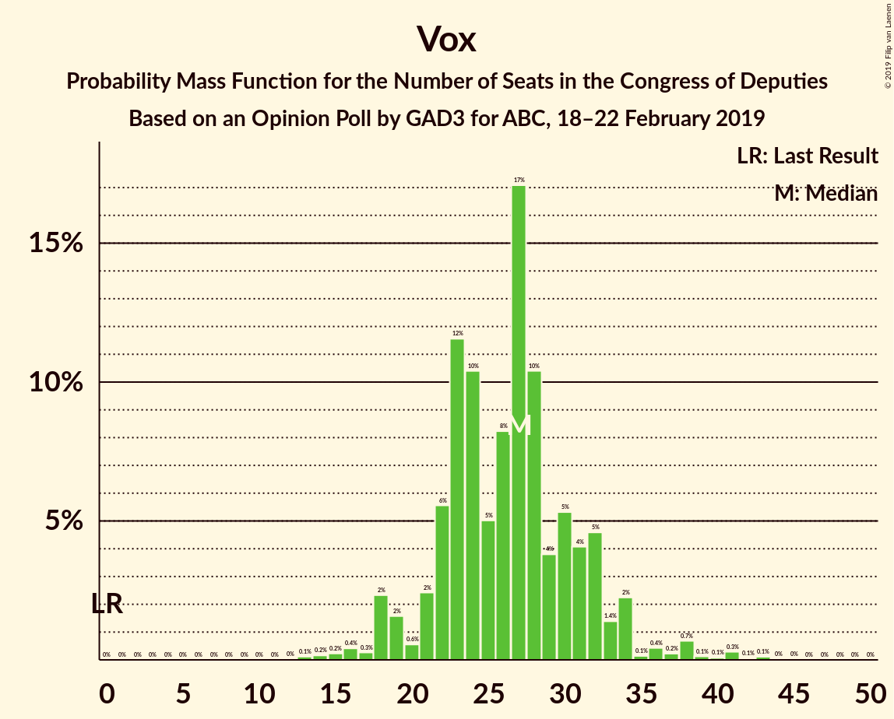
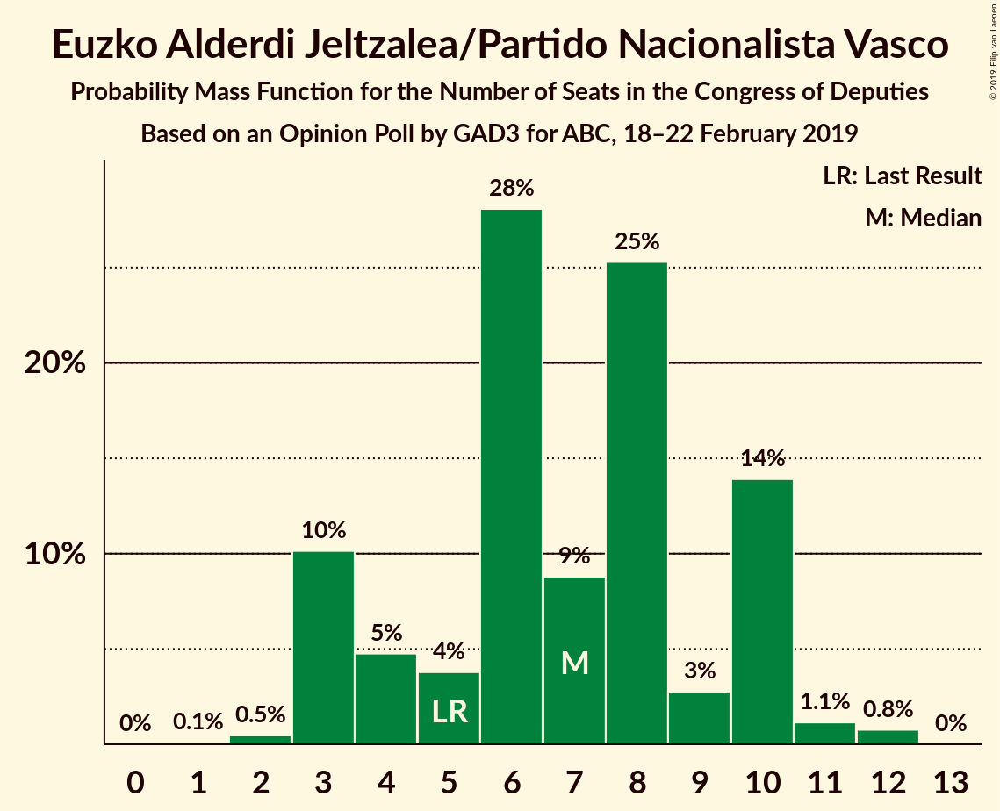
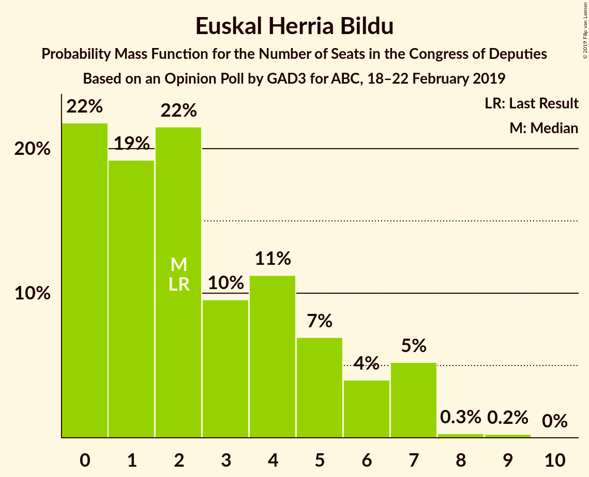
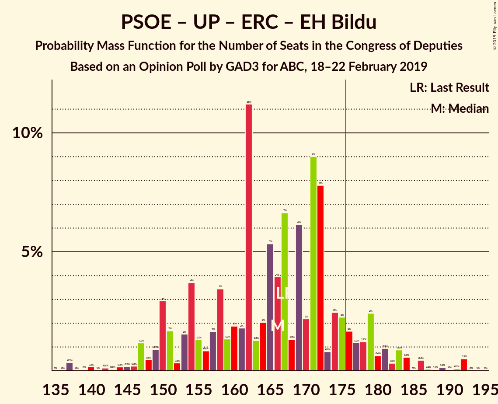
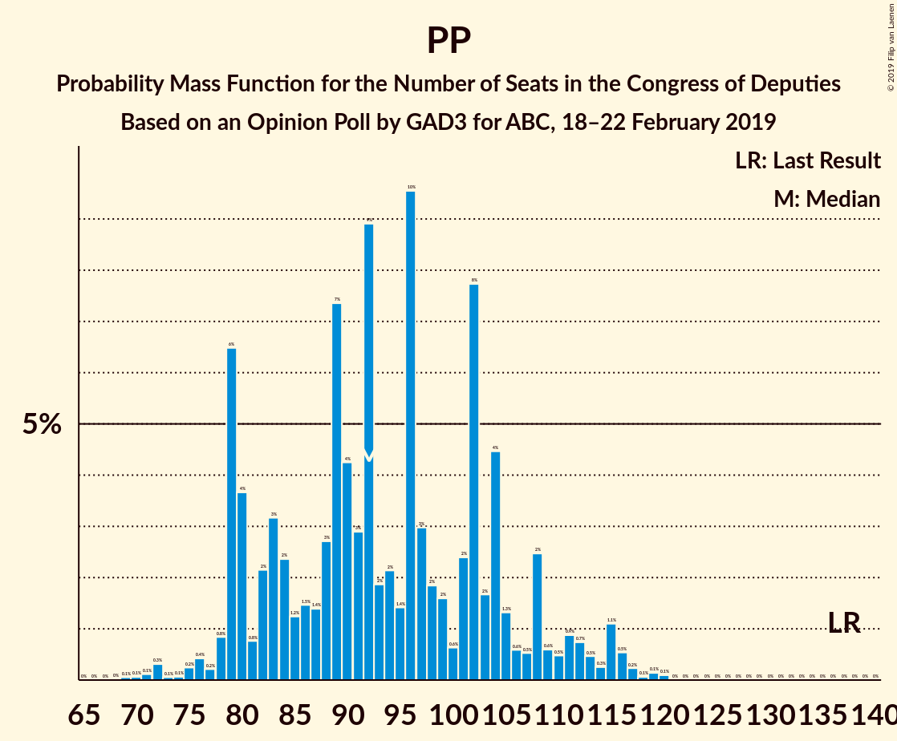

# Opinion Poll by GAD3 for ABC, 18–22 February 2019

<a href="#voting-intentions">Voting Intentions</a> | <a href="#seats">Seats</a> | <a href="#coalitions">Coalitions</a> | <a href="#technical-information">Technical Information</a>

## Voting Intentions

### Confidence Intervals

| Party | Last Result | Poll Result | 80% Confidence Interval | 90% Confidence Interval | 95% Confidence Interval | 99% Confidence Interval |
|:-----:|:-----------:|:-----------:|:-----------------------:|:-----------------------:|:-----------------------:|:-----------------------:|
| Partido Socialista Obrero Español | 22.6% | 28.9% | 26.9–31.0% |26.3–31.6% |25.8–32.1% |24.9–33.2% |
| Partido Popular | 33.0% | 23.2% | 21.4–25.3% |20.9–25.8% |20.5–26.3% |19.6–27.3% |
| Ciudadanos–Partido de la Ciudadanía | 13.1% | 15.8% | 14.2–17.5% |13.8–18.0% |13.4–18.4% |12.7–19.3% |
| Unidos Podemos | 21.2% | 11.5% | 10.2–13.1% |9.8–13.5% |9.5–13.9% |8.9–14.7% |
| Vox | 0.2% | 10.8% | 9.4–12.3% |9.1–12.7% |8.8–13.1% |8.2–13.9% |
| Esquerra Republicana de Catalunya–Catalunya Sí | 2.7% | 3.0% | 2.3–3.9% |2.2–4.2% |2.0–4.4% |1.8–4.9% |
| Partit Demòcrata Europeu Català | 2.0% | 1.5% | 1.1–2.2% |1.0–2.4% |0.9–2.6% |0.7–3.0% |
| Euzko Alderdi Jeltzalea/Partido Nacionalista Vasco | 1.2% | 1.2% | 0.9–1.9% |0.8–2.1% |0.7–2.3% |0.5–2.7% |
| Euskal Herria Bildu | 0.8% | 0.6% | 0.4–1.2% |0.3–1.3% |0.3–1.5% |0.2–1.8% |
| Coalición Canaria–Partido Nacionalista Canario | 0.3% | 0.2% | 0.1–0.7% |0.1–0.8% |0.1–0.9% |0.0–1.2% |

*Note:* The poll result column reflects the actual value used in the calculations. Published results may vary slightly, and in addition be rounded to fewer digits.

## Seats

### Confidence Intervals

| Party | Last Result | Median | 80% Confidence Interval | 90% Confidence Interval | 95% Confidence Interval | 99% Confidence Interval |
|:-----:|:-----------:|:------:|:-----------------------:|:-----------------------:|:-----------------------:|:-----------------------:|
| <a href="#partido-socialista-obrero-español">Partido Socialista Obrero Español</a> | 85 | 122 | 122–132 |108–132 |107–132 |99–143 |
| <a href="#partido-popular">Partido Popular</a> | 137 | 92 | 83–98 |83–103 |83–106 |82–118 |
| <a href="#ciudadanos–partido-de-la-ciudadanía">Ciudadanos–Partido de la Ciudadanía</a> | 32 | 50 | 50–53 |43–63 |34–63 |27–63 |
| <a href="#unidos-podemos">Unidos Podemos</a> | 71 | 26 | 24–26 |24–27 |22–33 |16–37 |
| <a href="#vox">Vox</a> | 0 | 25 | 25–29 |14–32 |14–32 |14–35 |
| <a href="#esquerra-republicana-de-catalunya–catalunya-sí">Esquerra Republicana de Catalunya–Catalunya Sí</a> | 9 | 15 | 9–15 |9–15 |9–16 |9–19 |
| <a href="#partit-demòcrata-europeu-català">Partit Demòcrata Europeu Català</a> | 8 | 9 | 4–10 |4–12 |2–12 |2–12 |
| <a href="#euzko-alderdi-jeltzalea/partido-nacionalista-vasco">Euzko Alderdi Jeltzalea/Partido Nacionalista Vasco</a> | 5 | 9 | 3–9 |3–9 |3–9 |3–10 |
| <a href="#euskal-herria-bildu">Euskal Herria Bildu</a> | 2 | 2 | 1–7 |1–7 |0–7 |0–7 |
| <a href="#coalición-canaria–partido-nacionalista-canario">Coalición Canaria–Partido Nacionalista Canario</a> | 1 | 0 | 0–1 |0–2 |0–2 |0–4 |

### Partido Socialista Obrero Español

*For a full overview of the results for this party, see the [Partido Socialista Obrero Español](party-partidosocialistaobreroespañol.html) page.*

| Number of Seats | Probability | Accumulated | Special Marks |
|:---------------:|:-----------:|:-----------:|:-------------:|
| 85 | 0% | 100% | Last Result |
| 86 | 0% | 100% |  |
| 87 | 0% | 100% |  |
| 88 | 0% | 100% |  |
| 89 | 0% | 100% |  |
| 90 | 0% | 100% |  |
| 91 | 0% | 100% |  |
| 92 | 0% | 100% |  |
| 93 | 0% | 100% |  |
| 94 | 0.1% | 100% |  |
| 95 | 0% | 99.8% |  |
| 96 | 0% | 99.8% |  |
| 97 | 0% | 99.8% |  |
| 98 | 0% | 99.8% |  |
| 99 | 0.9% | 99.8% |  |
| 100 | 0% | 98.9% |  |
| 101 | 0.2% | 98.9% |  |
| 102 | 0% | 98.7% |  |
| 103 | 0% | 98.7% |  |
| 104 | 0% | 98.7% |  |
| 105 | 0% | 98.7% |  |
| 106 | 0% | 98.7% |  |
| 107 | 1.3% | 98.7% |  |
| 108 | 4% | 97% |  |
| 109 | 0% | 94% |  |
| 110 | 1.1% | 94% |  |
| 111 | 0% | 93% |  |
| 112 | 0% | 93% |  |
| 113 | 0.2% | 93% |  |
| 114 | 0% | 92% |  |
| 115 | 0% | 92% |  |
| 116 | 0% | 92% |  |
| 117 | 1.1% | 92% |  |
| 118 | 0.3% | 91% |  |
| 119 | 0% | 91% |  |
| 120 | 0.5% | 91% |  |
| 121 | 0.1% | 90% |  |
| 122 | 68% | 90% | Median |
| 123 | 0.1% | 22% |  |
| 124 | 0% | 22% |  |
| 125 | 0% | 22% |  |
| 126 | 4% | 22% |  |
| 127 | 0% | 18% |  |
| 128 | 6% | 18% |  |
| 129 | 0% | 12% |  |
| 130 | 0.2% | 12% |  |
| 131 | 0.1% | 11% |  |
| 132 | 9% | 11% |  |
| 133 | 0% | 2% |  |
| 134 | 1.1% | 2% |  |
| 135 | 0% | 1.0% |  |
| 136 | 0% | 0.9% |  |
| 137 | 0% | 0.9% |  |
| 138 | 0% | 0.9% |  |
| 139 | 0% | 0.9% |  |
| 140 | 0% | 0.9% |  |
| 141 | 0% | 0.9% |  |
| 142 | 0.2% | 0.9% |  |
| 143 | 0.6% | 0.7% |  |
| 144 | 0% | 0.1% |  |
| 145 | 0% | 0.1% |  |
| 146 | 0% | 0% |  |

### Partido Popular

*For a full overview of the results for this party, see the [Partido Popular](party-partidopopular.html) page.*

| Number of Seats | Probability | Accumulated | Special Marks |
|:---------------:|:-----------:|:-----------:|:-------------:|
| 72 | 0% | 100% |  |
| 73 | 0% | 99.9% |  |
| 74 | 0% | 99.9% |  |
| 75 | 0% | 99.9% |  |
| 76 | 0% | 99.9% |  |
| 77 | 0% | 99.9% |  |
| 78 | 0% | 99.9% |  |
| 79 | 0.3% | 99.8% |  |
| 80 | 0% | 99.6% |  |
| 81 | 0% | 99.6% |  |
| 82 | 0.1% | 99.6% |  |
| 83 | 10% | 99.5% |  |
| 84 | 0.2% | 90% |  |
| 85 | 0% | 90% |  |
| 86 | 0% | 90% |  |
| 87 | 0.1% | 90% |  |
| 88 | 0% | 90% |  |
| 89 | 0.1% | 90% |  |
| 90 | 0.3% | 90% |  |
| 91 | 0.8% | 89% |  |
| 92 | 66% | 88% | Median |
| 93 | 0% | 22% |  |
| 94 | 0% | 22% |  |
| 95 | 2% | 22% |  |
| 96 | 7% | 20% |  |
| 97 | 0.1% | 13% |  |
| 98 | 4% | 13% |  |
| 99 | 0% | 9% |  |
| 100 | 0% | 9% |  |
| 101 | 0.1% | 9% |  |
| 102 | 0.2% | 9% |  |
| 103 | 4% | 9% |  |
| 104 | 0% | 5% |  |
| 105 | 0% | 5% |  |
| 106 | 3% | 5% |  |
| 107 | 0% | 1.3% |  |
| 108 | 0% | 1.3% |  |
| 109 | 0.1% | 1.3% |  |
| 110 | 0% | 1.2% |  |
| 111 | 0% | 1.2% |  |
| 112 | 0% | 1.2% |  |
| 113 | 0% | 1.2% |  |
| 114 | 0% | 1.2% |  |
| 115 | 0% | 1.2% |  |
| 116 | 0.1% | 1.2% |  |
| 117 | 0.2% | 1.1% |  |
| 118 | 0.9% | 0.9% |  |
| 119 | 0% | 0% |  |
| 120 | 0% | 0% |  |
| 121 | 0% | 0% |  |
| 122 | 0% | 0% |  |
| 123 | 0% | 0% |  |
| 124 | 0% | 0% |  |
| 125 | 0% | 0% |  |
| 126 | 0% | 0% |  |
| 127 | 0% | 0% |  |
| 128 | 0% | 0% |  |
| 129 | 0% | 0% |  |
| 130 | 0% | 0% |  |
| 131 | 0% | 0% |  |
| 132 | 0% | 0% |  |
| 133 | 0% | 0% |  |
| 134 | 0% | 0% |  |
| 135 | 0% | 0% |  |
| 136 | 0% | 0% |  |
| 137 | 0% | 0% | Last Result |

### Ciudadanos–Partido de la Ciudadanía

*For a full overview of the results for this party, see the [Ciudadanos–Partido de la Ciudadanía](party-ciudadanos–partidodelaciudadanía.html) page.*

| Number of Seats | Probability | Accumulated | Special Marks |
|:---------------:|:-----------:|:-----------:|:-------------:|
| 27 | 0.6% | 100% |  |
| 28 | 0% | 99.4% |  |
| 29 | 0% | 99.4% |  |
| 30 | 0% | 99.4% |  |
| 31 | 0% | 99.3% |  |
| 32 | 0% | 99.3% | Last Result |
| 33 | 0.1% | 99.3% |  |
| 34 | 4% | 99.3% |  |
| 35 | 0% | 96% |  |
| 36 | 0% | 96% |  |
| 37 | 0.2% | 96% |  |
| 38 | 0% | 96% |  |
| 39 | 0% | 96% |  |
| 40 | 0% | 96% |  |
| 41 | 0.2% | 96% |  |
| 42 | 0% | 95% |  |
| 43 | 0.4% | 95% |  |
| 44 | 0% | 95% |  |
| 45 | 2% | 95% |  |
| 46 | 0% | 92% |  |
| 47 | 0% | 92% |  |
| 48 | 0.2% | 92% |  |
| 49 | 0.7% | 92% |  |
| 50 | 65% | 91% | Median |
| 51 | 4% | 27% |  |
| 52 | 5% | 22% |  |
| 53 | 9% | 17% |  |
| 54 | 0.1% | 8% |  |
| 55 | 0.1% | 8% |  |
| 56 | 0% | 8% |  |
| 57 | 0.2% | 8% |  |
| 58 | 0.2% | 8% |  |
| 59 | 0.1% | 8% |  |
| 60 | 0% | 7% |  |
| 61 | 0.1% | 7% |  |
| 62 | 1.0% | 7% |  |
| 63 | 6% | 6% |  |
| 64 | 0% | 0.1% |  |
| 65 | 0% | 0% |  |

### Unidos Podemos

*For a full overview of the results for this party, see the [Unidos Podemos](party-unidospodemos.html) page.*

| Number of Seats | Probability | Accumulated | Special Marks |
|:---------------:|:-----------:|:-----------:|:-------------:|
| 16 | 1.1% | 100% |  |
| 17 | 0% | 98.9% |  |
| 18 | 0% | 98.9% |  |
| 19 | 0% | 98.9% |  |
| 20 | 0% | 98.8% |  |
| 21 | 0.1% | 98.8% |  |
| 22 | 2% | 98.7% |  |
| 23 | 0.4% | 97% |  |
| 24 | 14% | 96% |  |
| 25 | 7% | 83% |  |
| 26 | 69% | 76% | Median |
| 27 | 4% | 7% |  |
| 28 | 0% | 4% |  |
| 29 | 0.2% | 4% |  |
| 30 | 0.1% | 4% |  |
| 31 | 0% | 4% |  |
| 32 | 0% | 4% |  |
| 33 | 2% | 4% |  |
| 34 | 0.1% | 2% |  |
| 35 | 0% | 2% |  |
| 36 | 1.3% | 2% |  |
| 37 | 0.4% | 0.7% |  |
| 38 | 0.2% | 0.3% |  |
| 39 | 0% | 0.1% |  |
| 40 | 0.1% | 0.1% |  |
| 41 | 0% | 0% |  |
| 42 | 0% | 0% |  |
| 43 | 0% | 0% |  |
| 44 | 0% | 0% |  |
| 45 | 0% | 0% |  |
| 46 | 0% | 0% |  |
| 47 | 0% | 0% |  |
| 48 | 0% | 0% |  |
| 49 | 0% | 0% |  |
| 50 | 0% | 0% |  |
| 51 | 0% | 0% |  |
| 52 | 0% | 0% |  |
| 53 | 0% | 0% |  |
| 54 | 0% | 0% |  |
| 55 | 0% | 0% |  |
| 56 | 0% | 0% |  |
| 57 | 0% | 0% |  |
| 58 | 0% | 0% |  |
| 59 | 0% | 0% |  |
| 60 | 0% | 0% |  |
| 61 | 0% | 0% |  |
| 62 | 0% | 0% |  |
| 63 | 0% | 0% |  |
| 64 | 0% | 0% |  |
| 65 | 0% | 0% |  |
| 66 | 0% | 0% |  |
| 67 | 0% | 0% |  |
| 68 | 0% | 0% |  |
| 69 | 0% | 0% |  |
| 70 | 0% | 0% |  |
| 71 | 0% | 0% | Last Result |

### Vox

*For a full overview of the results for this party, see the [Vox](party-vox.html) page.*

| Number of Seats | Probability | Accumulated | Special Marks |
|:---------------:|:-----------:|:-----------:|:-------------:|
| 0 | 0% | 100% | Last Result |
| 1 | 0% | 100% |  |
| 2 | 0% | 100% |  |
| 3 | 0% | 100% |  |
| 4 | 0% | 100% |  |
| 5 | 0% | 100% |  |
| 6 | 0% | 100% |  |
| 7 | 0% | 100% |  |
| 8 | 0% | 100% |  |
| 9 | 0% | 100% |  |
| 10 | 0% | 100% |  |
| 11 | 0% | 100% |  |
| 12 | 0% | 100% |  |
| 13 | 0% | 100% |  |
| 14 | 6% | 100% |  |
| 15 | 0% | 94% |  |
| 16 | 0% | 94% |  |
| 17 | 0% | 94% |  |
| 18 | 0.2% | 94% |  |
| 19 | 0% | 93% |  |
| 20 | 1.0% | 93% |  |
| 21 | 0.2% | 92% |  |
| 22 | 1.0% | 92% |  |
| 23 | 0.1% | 91% |  |
| 24 | 0.3% | 91% |  |
| 25 | 70% | 91% | Median |
| 26 | 0.3% | 21% |  |
| 27 | 10% | 21% |  |
| 28 | 0% | 11% |  |
| 29 | 4% | 11% |  |
| 30 | 0.4% | 7% |  |
| 31 | 1.2% | 6% |  |
| 32 | 4% | 5% |  |
| 33 | 0.1% | 2% |  |
| 34 | 0% | 2% |  |
| 35 | 1.3% | 2% |  |
| 36 | 0% | 0.2% |  |
| 37 | 0% | 0.2% |  |
| 38 | 0% | 0.2% |  |
| 39 | 0% | 0.2% |  |
| 40 | 0% | 0.2% |  |
| 41 | 0.1% | 0.2% |  |
| 42 | 0% | 0% |  |

### Esquerra Republicana de Catalunya–Catalunya Sí

*For a full overview of the results for this party, see the [Esquerra Republicana de Catalunya–Catalunya Sí](party-esquerrarepublicanadecatalunya–catalunyasí.html) page.*

| Number of Seats | Probability | Accumulated | Special Marks |
|:---------------:|:-----------:|:-----------:|:-------------:|
| 7 | 0% | 100% |  |
| 8 | 0.2% | 99.9% |  |
| 9 | 10% | 99.8% | Last Result |
| 10 | 0.3% | 90% |  |
| 11 | 1.2% | 89% |  |
| 12 | 10% | 88% |  |
| 13 | 3% | 78% |  |
| 14 | 0.4% | 75% |  |
| 15 | 70% | 75% | Median |
| 16 | 4% | 5% |  |
| 17 | 0.2% | 0.8% |  |
| 18 | 0% | 0.6% |  |
| 19 | 0.4% | 0.5% |  |
| 20 | 0% | 0.1% |  |
| 21 | 0% | 0.1% |  |
| 22 | 0% | 0% |  |

### Partit Demòcrata Europeu Català

*For a full overview of the results for this party, see the [Partit Demòcrata Europeu Català](party-partitdemòcrataeuropeucatalà.html) page.*

| Number of Seats | Probability | Accumulated | Special Marks |
|:---------------:|:-----------:|:-----------:|:-------------:|
| 1 | 0.3% | 100% |  |
| 2 | 4% | 99.7% |  |
| 3 | 0.2% | 96% |  |
| 4 | 7% | 96% |  |
| 5 | 5% | 89% |  |
| 6 | 0.2% | 85% |  |
| 7 | 5% | 84% |  |
| 8 | 3% | 79% | Last Result |
| 9 | 66% | 77% | Median |
| 10 | 0.8% | 10% |  |
| 11 | 0.3% | 9% |  |
| 12 | 9% | 9% |  |
| 13 | 0% | 0% |  |

### Euzko Alderdi Jeltzalea/Partido Nacionalista Vasco

*For a full overview of the results for this party, see the [Euzko Alderdi Jeltzalea/Partido Nacionalista Vasco](party-euzkoalderdijeltzaleapartidonacionalistavasco.html) page.*

| Number of Seats | Probability | Accumulated | Special Marks |
|:---------------:|:-----------:|:-----------:|:-------------:|
| 2 | 0.3% | 100% |  |
| 3 | 15% | 99.7% |  |
| 4 | 0% | 85% |  |
| 5 | 0% | 84% | Last Result |
| 6 | 6% | 84% |  |
| 7 | 7% | 79% |  |
| 8 | 4% | 71% |  |
| 9 | 65% | 67% | Median |
| 10 | 2% | 2% |  |
| 11 | 0.2% | 0.2% |  |
| 12 | 0% | 0% |  |

### Euskal Herria Bildu

*For a full overview of the results for this party, see the [Euskal Herria Bildu](party-euskalherriabildu.html) page.*

| Number of Seats | Probability | Accumulated | Special Marks |
|:---------------:|:-----------:|:-----------:|:-------------:|
| 0 | 4% | 100% |  |
| 1 | 7% | 96% |  |
| 2 | 66% | 89% | Last Result, Median |
| 3 | 1.0% | 23% |  |
| 4 | 4% | 22% |  |
| 5 | 2% | 18% |  |
| 6 | 4% | 16% |  |
| 7 | 12% | 12% |  |
| 8 | 0.3% | 0.3% |  |
| 9 | 0% | 0% |  |

### Coalición Canaria–Partido Nacionalista Canario

*For a full overview of the results for this party, see the [Coalición Canaria–Partido Nacionalista Canario](party-coalicióncanaria–partidonacionalistacanario.html) page.*

| Number of Seats | Probability | Accumulated | Special Marks |
|:---------------:|:-----------:|:-----------:|:-------------:|
| 0 | 84% | 100% | Median |
| 1 | 8% | 16% | Last Result |
| 2 | 6% | 8% |  |
| 3 | 1.0% | 2% |  |
| 4 | 0.5% | 0.6% |  |
| 5 | 0.1% | 0.1% |  |
| 6 | 0% | 0% |  |

## Coalitions

### Confidence Intervals

| Coalition | Last Result | Median | Majority? | 80% Confidence Interval | 90% Confidence Interval | 95% Confidence Interval | 99% Confidence Interval |
|:---------:|:-----------:|:------:|:---------:|:-----------------------:|:-----------------------:|:-----------------------:|:-----------------------:|
| Partido Socialista Obrero Español – Partido Popular – Ciudadanos–Partido de la Ciudadanía | 254 | 264 | 100% | 262–281 | 257–287 | 257–287 | 247–287 |
| Partido Socialista Obrero Español – Partido Popular | 222 | 214 | 100% | 214–224 | 206–228 | 205–229 | 202–239 |
| Partido Socialista Obrero Español – Ciudadanos–Partido de la Ciudadanía – Unidos Podemos | 188 | 198 | 99.0% | 188–209 | 183–216 | 183–216 | 173–216 |
| Partido Socialista Obrero Español – Ciudadanos–Partido de la Ciudadanía | 117 | 172 | 21% | 159–185 | 156–191 | 152–191 | 151–191 |
| Partido Socialista Obrero Español – Unidos Podemos – Esquerra Republicana de Catalunya–Catalunya Sí – Partit Demòcrata Europeu Català – Euzko Alderdi Jeltzalea/Partido Nacionalista Vasco – Euskal Herria Bildu | 180 | 183 | 88% | 170–187 | 167–187 | 167–187 | 153–196 |
| Partido Popular – Ciudadanos–Partido de la Ciudadanía – Vox | 169 | 167 | 10% | 163–179 | 163–181 | 162–181 | 152–195 |
| Partido Socialista Obrero Español – Unidos Podemos – Esquerra Republicana de Catalunya–Catalunya Sí – Partit Demòcrata Europeu Català | 173 | 172 | 11% | 166–177 | 155–177 | 155–177 | 141–186 |
| Partido Socialista Obrero Español – Unidos Podemos – Esquerra Republicana de Catalunya–Catalunya Sí – Euskal Herria Bildu | 167 | 165 | 2% | 164–172 | 152–172 | 152–172 | 141–180 |
| Partido Socialista Obrero Español – Unidos Podemos – Euzko Alderdi Jeltzalea/Partido Nacionalista Vasco – Euskal Herria Bildu | 163 | 159 | 1.0% | 155–166 | 144–166 | 144–166 | 133–177 |
| Partido Popular – Ciudadanos–Partido de la Ciudadanía – Euzko Alderdi Jeltzalea/Partido Nacionalista Vasco | 174 | 151 | 0.9% | 139–158 | 139–166 | 139–166 | 129–177 |
| Partido Socialista Obrero Español – Unidos Podemos – Euzko Alderdi Jeltzalea/Partido Nacionalista Vasco | 161 | 157 | 0.3% | 155–159 | 142–160 | 140–160 | 128–173 |
| Partido Popular – Ciudadanos–Partido de la Ciudadanía – Coalición Canaria–Partido Nacionalista Canario | 170 | 142 | 0% | 136–156 | 136–159 | 136–159 | 125–172 |
| Partido Popular – Ciudadanos–Partido de la Ciudadanía | 169 | 142 | 0% | 136–155 | 136–159 | 136–159 | 123–170 |
| Partido Socialista Obrero Español – Unidos Podemos | 156 | 148 | 0% | 148–156 | 132–156 | 132–156 | 121–167 |
| Partido Popular – Vox | 137 | 117 | 0% | 110–128 | 110–133 | 110–135 | 107–143 |
| Partido Socialista Obrero Español | 85 | 122 | 0% | 122–132 | 108–132 | 107–132 | 99–143 |
| Partido Popular | 137 | 92 | 0% | 83–98 | 83–103 | 83–106 | 82–118 |

### Partido Socialista Obrero Español – Partido Popular – Ciudadanos–Partido de la Ciudadanía

| Number of Seats | Probability | Accumulated | Special Marks |
|:---------------:|:-----------:|:-----------:|:-------------:|
| 245 | 0% | 100% |  |
| 246 | 0% | 99.9% |  |
| 247 | 1.3% | 99.9% |  |
| 248 | 0% | 98.7% |  |
| 249 | 0% | 98.7% |  |
| 250 | 0.2% | 98.6% |  |
| 251 | 0% | 98% |  |
| 252 | 0.4% | 98% |  |
| 253 | 0% | 98% |  |
| 254 | 0% | 98% | Last Result |
| 255 | 0.1% | 98% |  |
| 256 | 0.2% | 98% |  |
| 257 | 4% | 98% |  |
| 258 | 0.2% | 94% |  |
| 259 | 0.9% | 94% |  |
| 260 | 0% | 93% |  |
| 261 | 0.3% | 93% |  |
| 262 | 4% | 93% |  |
| 263 | 0.1% | 89% |  |
| 264 | 65% | 89% | Median |
| 265 | 0.1% | 24% |  |
| 266 | 0.8% | 24% |  |
| 267 | 1.2% | 23% |  |
| 268 | 9% | 22% |  |
| 269 | 0.9% | 13% |  |
| 270 | 0% | 12% |  |
| 271 | 1.1% | 12% |  |
| 272 | 0.1% | 11% |  |
| 273 | 0.2% | 11% |  |
| 274 | 0.2% | 10% |  |
| 275 | 0.1% | 10% |  |
| 276 | 0% | 10% |  |
| 277 | 0% | 10% |  |
| 278 | 0% | 10% |  |
| 279 | 0% | 10% |  |
| 280 | 0% | 10% |  |
| 281 | 4% | 10% |  |
| 282 | 0% | 6% |  |
| 283 | 0% | 6% |  |
| 284 | 0% | 6% |  |
| 285 | 0% | 6% |  |
| 286 | 0% | 6% |  |
| 287 | 6% | 6% |  |
| 288 | 0% | 0% |  |

### Partido Socialista Obrero Español – Partido Popular

| Number of Seats | Probability | Accumulated | Special Marks |
|:---------------:|:-----------:|:-----------:|:-------------:|
| 196 | 0.1% | 100% |  |
| 197 | 0.1% | 99.8% |  |
| 198 | 0% | 99.7% |  |
| 199 | 0% | 99.7% |  |
| 200 | 0% | 99.7% |  |
| 201 | 0% | 99.7% |  |
| 202 | 1.3% | 99.7% |  |
| 203 | 0.4% | 98% |  |
| 204 | 0.1% | 98% |  |
| 205 | 1.0% | 98% |  |
| 206 | 4% | 97% |  |
| 207 | 0.2% | 93% |  |
| 208 | 0.9% | 93% |  |
| 209 | 0% | 92% |  |
| 210 | 0% | 92% |  |
| 211 | 0.2% | 92% |  |
| 212 | 0% | 92% |  |
| 213 | 0.2% | 92% |  |
| 214 | 65% | 92% | Median |
| 215 | 9% | 27% |  |
| 216 | 0.3% | 18% |  |
| 217 | 1.0% | 17% |  |
| 218 | 0.3% | 16% |  |
| 219 | 0% | 16% |  |
| 220 | 0% | 16% |  |
| 221 | 0% | 16% |  |
| 222 | 0% | 16% | Last Result |
| 223 | 0% | 16% |  |
| 224 | 6% | 16% |  |
| 225 | 0% | 9% |  |
| 226 | 1.3% | 9% |  |
| 227 | 0% | 8% |  |
| 228 | 3% | 8% |  |
| 229 | 4% | 5% |  |
| 230 | 0% | 0.9% |  |
| 231 | 0.1% | 0.9% |  |
| 232 | 0% | 0.7% |  |
| 233 | 0% | 0.7% |  |
| 234 | 0% | 0.7% |  |
| 235 | 0% | 0.6% |  |
| 236 | 0% | 0.6% |  |
| 237 | 0% | 0.6% |  |
| 238 | 0% | 0.6% |  |
| 239 | 0.6% | 0.6% |  |
| 240 | 0% | 0% |  |

### Partido Socialista Obrero Español – Ciudadanos–Partido de la Ciudadanía – Unidos Podemos

| Number of Seats | Probability | Accumulated | Special Marks |
|:---------------:|:-----------:|:-----------:|:-------------:|
| 173 | 0.9% | 100% |  |
| 174 | 0% | 99.1% |  |
| 175 | 0% | 99.0% |  |
| 176 | 0% | 99.0% | Majority |
| 177 | 0.4% | 99.0% |  |
| 178 | 0% | 98.7% |  |
| 179 | 0% | 98.7% |  |
| 180 | 0% | 98.6% |  |
| 181 | 0% | 98.6% |  |
| 182 | 0% | 98.6% |  |
| 183 | 7% | 98.6% |  |
| 184 | 0% | 92% |  |
| 185 | 0% | 92% |  |
| 186 | 0.1% | 92% |  |
| 187 | 0% | 91% |  |
| 188 | 2% | 91% | Last Result |
| 189 | 0% | 90% |  |
| 190 | 0% | 90% |  |
| 191 | 0% | 90% |  |
| 192 | 0% | 90% |  |
| 193 | 0.2% | 90% |  |
| 194 | 2% | 90% |  |
| 195 | 1.1% | 88% |  |
| 196 | 0.1% | 87% |  |
| 197 | 0% | 87% |  |
| 198 | 65% | 87% | Median |
| 199 | 0.1% | 22% |  |
| 200 | 0% | 22% |  |
| 201 | 1.0% | 22% |  |
| 202 | 0.4% | 21% |  |
| 203 | 0.3% | 20% |  |
| 204 | 4% | 20% |  |
| 205 | 0% | 16% |  |
| 206 | 0% | 16% |  |
| 207 | 0% | 16% |  |
| 208 | 0.1% | 16% |  |
| 209 | 9% | 16% |  |
| 210 | 0.1% | 7% |  |
| 211 | 0% | 7% |  |
| 212 | 0.1% | 7% |  |
| 213 | 0% | 7% |  |
| 214 | 0.1% | 7% |  |
| 215 | 0% | 7% |  |
| 216 | 6% | 7% |  |
| 217 | 0.1% | 0.2% |  |
| 218 | 0% | 0.1% |  |
| 219 | 0% | 0.1% |  |
| 220 | 0% | 0.1% |  |
| 221 | 0% | 0.1% |  |
| 222 | 0% | 0.1% |  |
| 223 | 0% | 0.1% |  |
| 224 | 0% | 0.1% |  |
| 225 | 0% | 0% |  |

### Partido Socialista Obrero Español – Ciudadanos–Partido de la Ciudadanía

| Number of Seats | Probability | Accumulated | Special Marks |
|:---------------:|:-----------:|:-----------:|:-------------:|
| 117 | 0% | 100% | Last Result |
| 118 | 0% | 100% |  |
| 119 | 0% | 100% |  |
| 120 | 0% | 100% |  |
| 121 | 0% | 100% |  |
| 122 | 0% | 100% |  |
| 123 | 0% | 100% |  |
| 124 | 0% | 100% |  |
| 125 | 0% | 100% |  |
| 126 | 0% | 100% |  |
| 127 | 0% | 100% |  |
| 128 | 0% | 100% |  |
| 129 | 0% | 100% |  |
| 130 | 0% | 100% |  |
| 131 | 0% | 100% |  |
| 132 | 0% | 100% |  |
| 133 | 0% | 100% |  |
| 134 | 0% | 100% |  |
| 135 | 0% | 100% |  |
| 136 | 0% | 100% |  |
| 137 | 0% | 100% |  |
| 138 | 0% | 100% |  |
| 139 | 0% | 100% |  |
| 140 | 0% | 100% |  |
| 141 | 0% | 99.9% |  |
| 142 | 0% | 99.9% |  |
| 143 | 0% | 99.9% |  |
| 144 | 0.2% | 99.9% |  |
| 145 | 0% | 99.8% |  |
| 146 | 0% | 99.8% |  |
| 147 | 0% | 99.8% |  |
| 148 | 0% | 99.8% |  |
| 149 | 0% | 99.8% |  |
| 150 | 0% | 99.8% |  |
| 151 | 1.0% | 99.7% |  |
| 152 | 1.3% | 98.7% |  |
| 153 | 0.2% | 97% |  |
| 154 | 0% | 97% |  |
| 155 | 0.2% | 97% |  |
| 156 | 3% | 97% |  |
| 157 | 0.1% | 94% |  |
| 158 | 0% | 94% |  |
| 159 | 4% | 93% |  |
| 160 | 0% | 90% |  |
| 161 | 0% | 90% |  |
| 162 | 0% | 90% |  |
| 163 | 0% | 90% |  |
| 164 | 0% | 90% |  |
| 165 | 0% | 90% |  |
| 166 | 0.3% | 90% |  |
| 167 | 0% | 90% |  |
| 168 | 0.9% | 90% |  |
| 169 | 0.4% | 89% |  |
| 170 | 0.8% | 88% |  |
| 171 | 0.1% | 87% |  |
| 172 | 66% | 87% | Median |
| 173 | 0% | 22% |  |
| 174 | 0.1% | 22% |  |
| 175 | 0% | 21% |  |
| 176 | 0% | 21% | Majority |
| 177 | 0% | 21% |  |
| 178 | 4% | 21% |  |
| 179 | 1.3% | 17% |  |
| 180 | 0% | 16% |  |
| 181 | 0% | 16% |  |
| 182 | 0% | 16% |  |
| 183 | 0.1% | 16% |  |
| 184 | 0% | 16% |  |
| 185 | 9% | 16% |  |
| 186 | 0% | 7% |  |
| 187 | 0.1% | 7% |  |
| 188 | 0% | 6% |  |
| 189 | 0% | 6% |  |
| 190 | 0% | 6% |  |
| 191 | 6% | 6% |  |
| 192 | 0% | 0.1% |  |
| 193 | 0% | 0.1% |  |
| 194 | 0% | 0.1% |  |
| 195 | 0% | 0% |  |

### Partido Socialista Obrero Español – Unidos Podemos – Esquerra Republicana de Catalunya–Catalunya Sí – Partit Demòcrata Europeu Català – Euzko Alderdi Jeltzalea/Partido Nacionalista Vasco – Euskal Herria Bildu

| Number of Seats | Probability | Accumulated | Special Marks |
|:---------------:|:-----------:|:-----------:|:-------------:|
| 148 | 0.1% | 100% |  |
| 149 | 0% | 99.9% |  |
| 150 | 0% | 99.8% |  |
| 151 | 0% | 99.8% |  |
| 152 | 0% | 99.8% |  |
| 153 | 0.9% | 99.8% |  |
| 154 | 0% | 99.0% |  |
| 155 | 0% | 99.0% |  |
| 156 | 0% | 99.0% |  |
| 157 | 0% | 98.9% |  |
| 158 | 0% | 98.9% |  |
| 159 | 0% | 98.9% |  |
| 160 | 0% | 98.9% |  |
| 161 | 0% | 98.9% |  |
| 162 | 0.2% | 98.9% |  |
| 163 | 0% | 98.7% |  |
| 164 | 0% | 98.7% |  |
| 165 | 0% | 98.7% |  |
| 166 | 0.3% | 98.7% |  |
| 167 | 4% | 98% |  |
| 168 | 0.1% | 95% |  |
| 169 | 4% | 95% |  |
| 170 | 1.0% | 91% |  |
| 171 | 0% | 90% |  |
| 172 | 0% | 90% |  |
| 173 | 0.1% | 90% |  |
| 174 | 1.3% | 90% |  |
| 175 | 0% | 88% |  |
| 176 | 0% | 88% | Majority |
| 177 | 6% | 88% |  |
| 178 | 0% | 82% |  |
| 179 | 0% | 82% |  |
| 180 | 0% | 82% | Last Result |
| 181 | 5% | 82% |  |
| 182 | 0.1% | 77% |  |
| 183 | 65% | 77% | Median |
| 184 | 0.6% | 12% |  |
| 185 | 1.1% | 12% |  |
| 186 | 0% | 11% |  |
| 187 | 9% | 11% |  |
| 188 | 0% | 2% |  |
| 189 | 0.4% | 2% |  |
| 190 | 0% | 1.1% |  |
| 191 | 0% | 1.1% |  |
| 192 | 0.1% | 1.1% |  |
| 193 | 0% | 1.0% |  |
| 194 | 0% | 1.0% |  |
| 195 | 0.1% | 0.9% |  |
| 196 | 0.6% | 0.8% |  |
| 197 | 0% | 0.2% |  |
| 198 | 0% | 0.2% |  |
| 199 | 0.1% | 0.2% |  |
| 200 | 0% | 0.1% |  |
| 201 | 0% | 0.1% |  |
| 202 | 0% | 0% |  |

### Partido Popular – Ciudadanos–Partido de la Ciudadanía – Vox

| Number of Seats | Probability | Accumulated | Special Marks |
|:---------------:|:-----------:|:-----------:|:-------------:|
| 146 | 0% | 100% |  |
| 147 | 0% | 99.9% |  |
| 148 | 0% | 99.9% |  |
| 149 | 0% | 99.9% |  |
| 150 | 0.1% | 99.9% |  |
| 151 | 0% | 99.8% |  |
| 152 | 0.6% | 99.8% |  |
| 153 | 0% | 99.2% |  |
| 154 | 0.1% | 99.1% |  |
| 155 | 0% | 99.1% |  |
| 156 | 0.1% | 99.0% |  |
| 157 | 0% | 98.9% |  |
| 158 | 0.1% | 98.9% |  |
| 159 | 0.4% | 98.9% |  |
| 160 | 0% | 98% |  |
| 161 | 0.1% | 98% |  |
| 162 | 1.2% | 98% |  |
| 163 | 9% | 97% |  |
| 164 | 0.2% | 88% |  |
| 165 | 0.3% | 88% |  |
| 166 | 0% | 88% |  |
| 167 | 65% | 88% | Median |
| 168 | 1.2% | 23% |  |
| 169 | 3% | 21% | Last Result |
| 170 | 0% | 18% |  |
| 171 | 0% | 18% |  |
| 172 | 0% | 18% |  |
| 173 | 6% | 18% |  |
| 174 | 0% | 12% |  |
| 175 | 1.4% | 12% |  |
| 176 | 0% | 10% | Majority |
| 177 | 0% | 10% |  |
| 178 | 0% | 10% |  |
| 179 | 1.1% | 10% |  |
| 180 | 4% | 9% |  |
| 181 | 4% | 5% |  |
| 182 | 0.1% | 1.4% |  |
| 183 | 0% | 1.3% |  |
| 184 | 0% | 1.3% |  |
| 185 | 0% | 1.3% |  |
| 186 | 0% | 1.3% |  |
| 187 | 0.2% | 1.3% |  |
| 188 | 0% | 1.1% |  |
| 189 | 0% | 1.1% |  |
| 190 | 0% | 1.1% |  |
| 191 | 0% | 1.1% |  |
| 192 | 0% | 1.1% |  |
| 193 | 0% | 1.0% |  |
| 194 | 0% | 1.0% |  |
| 195 | 0.9% | 1.0% |  |
| 196 | 0% | 0.2% |  |
| 197 | 0% | 0.2% |  |
| 198 | 0% | 0.2% |  |
| 199 | 0% | 0.2% |  |
| 200 | 0% | 0.1% |  |
| 201 | 0% | 0.1% |  |
| 202 | 0.1% | 0.1% |  |
| 203 | 0% | 0% |  |

### Partido Socialista Obrero Español – Unidos Podemos – Esquerra Republicana de Catalunya–Catalunya Sí – Partit Demòcrata Europeu Català

| Number of Seats | Probability | Accumulated | Special Marks |
|:---------------:|:-----------:|:-----------:|:-------------:|
| 139 | 0.1% | 100% |  |
| 140 | 0% | 99.9% |  |
| 141 | 0.9% | 99.9% |  |
| 142 | 0% | 99.0% |  |
| 143 | 0% | 99.0% |  |
| 144 | 0% | 99.0% |  |
| 145 | 0.1% | 99.0% |  |
| 146 | 0% | 98.9% |  |
| 147 | 0% | 98.9% |  |
| 148 | 0% | 98.9% |  |
| 149 | 0% | 98.9% |  |
| 150 | 0% | 98.9% |  |
| 151 | 0% | 98.9% |  |
| 152 | 0.2% | 98.9% |  |
| 153 | 0% | 98.7% |  |
| 154 | 0% | 98.7% |  |
| 155 | 5% | 98.7% |  |
| 156 | 0% | 94% |  |
| 157 | 0% | 94% |  |
| 158 | 0.1% | 94% |  |
| 159 | 0.2% | 94% |  |
| 160 | 0% | 94% |  |
| 161 | 0% | 94% |  |
| 162 | 0% | 94% |  |
| 163 | 0.1% | 94% |  |
| 164 | 1.3% | 94% |  |
| 165 | 0.2% | 92% |  |
| 166 | 4% | 92% |  |
| 167 | 0% | 88% |  |
| 168 | 1.1% | 88% |  |
| 169 | 10% | 87% |  |
| 170 | 0.1% | 77% |  |
| 171 | 0% | 77% |  |
| 172 | 66% | 77% | Median |
| 173 | 0% | 11% | Last Result |
| 174 | 0.4% | 11% |  |
| 175 | 0% | 11% |  |
| 176 | 0.2% | 11% | Majority |
| 177 | 9% | 11% |  |
| 178 | 0% | 2% |  |
| 179 | 0.4% | 2% |  |
| 180 | 0% | 1.1% |  |
| 181 | 0.1% | 1.1% |  |
| 182 | 0.1% | 1.0% |  |
| 183 | 0.1% | 0.9% |  |
| 184 | 0% | 0.9% |  |
| 185 | 0% | 0.9% |  |
| 186 | 0.6% | 0.8% |  |
| 187 | 0.1% | 0.2% |  |
| 188 | 0% | 0.1% |  |
| 189 | 0% | 0.1% |  |
| 190 | 0% | 0.1% |  |
| 191 | 0% | 0.1% |  |
| 192 | 0% | 0% |  |

### Partido Socialista Obrero Español – Unidos Podemos – Esquerra Republicana de Catalunya–Catalunya Sí – Euskal Herria Bildu

| Number of Seats | Probability | Accumulated | Special Marks |
|:---------------:|:-----------:|:-----------:|:-------------:|
| 133 | 0.1% | 100% |  |
| 134 | 0% | 99.9% |  |
| 135 | 0% | 99.9% |  |
| 136 | 0% | 99.9% |  |
| 137 | 0% | 99.8% |  |
| 138 | 0% | 99.8% |  |
| 139 | 0% | 99.8% |  |
| 140 | 0% | 99.8% |  |
| 141 | 0.9% | 99.8% |  |
| 142 | 0% | 98.9% |  |
| 143 | 0% | 98.9% |  |
| 144 | 0% | 98.9% |  |
| 145 | 0% | 98.9% |  |
| 146 | 0% | 98.9% |  |
| 147 | 0% | 98.9% |  |
| 148 | 0% | 98.9% |  |
| 149 | 0% | 98.9% |  |
| 150 | 0.1% | 98.9% |  |
| 151 | 0.2% | 98.8% |  |
| 152 | 5% | 98.6% |  |
| 153 | 0% | 94% |  |
| 154 | 0% | 94% |  |
| 155 | 0.2% | 94% |  |
| 156 | 0% | 94% |  |
| 157 | 0% | 94% |  |
| 158 | 0% | 94% |  |
| 159 | 0% | 94% |  |
| 160 | 0% | 94% |  |
| 161 | 0% | 94% |  |
| 162 | 0% | 94% |  |
| 163 | 1.3% | 94% |  |
| 164 | 4% | 92% |  |
| 165 | 65% | 88% | Median |
| 166 | 7% | 23% |  |
| 167 | 0.2% | 16% | Last Result |
| 168 | 1.2% | 16% |  |
| 169 | 0.1% | 15% |  |
| 170 | 3% | 15% |  |
| 171 | 0% | 11% |  |
| 172 | 9% | 11% |  |
| 173 | 0.2% | 2% |  |
| 174 | 0% | 2% |  |
| 175 | 0% | 2% |  |
| 176 | 0.1% | 2% | Majority |
| 177 | 0% | 1.5% |  |
| 178 | 0% | 1.5% |  |
| 179 | 0.4% | 1.5% |  |
| 180 | 0.7% | 1.0% |  |
| 181 | 0.2% | 0.4% |  |
| 182 | 0% | 0.2% |  |
| 183 | 0% | 0.2% |  |
| 184 | 0.1% | 0.2% |  |
| 185 | 0% | 0.1% |  |
| 186 | 0% | 0.1% |  |
| 187 | 0% | 0.1% |  |
| 188 | 0% | 0.1% |  |
| 189 | 0% | 0.1% |  |
| 190 | 0% | 0% |  |

### Partido Socialista Obrero Español – Unidos Podemos – Euzko Alderdi Jeltzalea/Partido Nacionalista Vasco – Euskal Herria Bildu

| Number of Seats | Probability | Accumulated | Special Marks |
|:---------------:|:-----------:|:-----------:|:-------------:|
| 127 | 0.1% | 100% |  |
| 128 | 0% | 99.8% |  |
| 129 | 0% | 99.8% |  |
| 130 | 0% | 99.8% |  |
| 131 | 0% | 99.8% |  |
| 132 | 0% | 99.8% |  |
| 133 | 0.9% | 99.8% |  |
| 134 | 0% | 99.0% |  |
| 135 | 0% | 99.0% |  |
| 136 | 0% | 99.0% |  |
| 137 | 0% | 98.9% |  |
| 138 | 0% | 98.9% |  |
| 139 | 0% | 98.9% |  |
| 140 | 0% | 98.9% |  |
| 141 | 0% | 98.9% |  |
| 142 | 0% | 98.9% |  |
| 143 | 0.2% | 98.9% |  |
| 144 | 4% | 98.7% |  |
| 145 | 0% | 95% |  |
| 146 | 0.1% | 95% |  |
| 147 | 1.0% | 95% |  |
| 148 | 0% | 94% |  |
| 149 | 0% | 94% |  |
| 150 | 0.1% | 94% |  |
| 151 | 0.1% | 94% |  |
| 152 | 0% | 94% |  |
| 153 | 1.3% | 94% |  |
| 154 | 0% | 92% |  |
| 155 | 4% | 92% |  |
| 156 | 0.1% | 88% |  |
| 157 | 0% | 88% |  |
| 158 | 0% | 88% |  |
| 159 | 65% | 88% | Median |
| 160 | 0% | 23% |  |
| 161 | 10% | 23% |  |
| 162 | 0% | 13% |  |
| 163 | 3% | 13% | Last Result |
| 164 | 0.2% | 11% |  |
| 165 | 0% | 10% |  |
| 166 | 9% | 10% |  |
| 167 | 0% | 1.2% |  |
| 168 | 0.1% | 1.2% |  |
| 169 | 0% | 1.1% |  |
| 170 | 0% | 1.1% |  |
| 171 | 0% | 1.1% |  |
| 172 | 0% | 1.0% |  |
| 173 | 0% | 1.0% |  |
| 174 | 0% | 1.0% |  |
| 175 | 0% | 1.0% |  |
| 176 | 0% | 1.0% | Majority |
| 177 | 0.6% | 1.0% |  |
| 178 | 0% | 0.4% |  |
| 179 | 0.1% | 0.4% |  |
| 180 | 0% | 0.3% |  |
| 181 | 0.1% | 0.3% |  |
| 182 | 0% | 0.1% |  |
| 183 | 0.1% | 0.1% |  |
| 184 | 0% | 0% |  |

### Partido Popular – Ciudadanos–Partido de la Ciudadanía – Euzko Alderdi Jeltzalea/Partido Nacionalista Vasco

| Number of Seats | Probability | Accumulated | Special Marks |
|:---------------:|:-----------:|:-----------:|:-------------:|
| 127 | 0% | 100% |  |
| 128 | 0% | 99.9% |  |
| 129 | 0.6% | 99.9% |  |
| 130 | 0% | 99.3% |  |
| 131 | 0.1% | 99.3% |  |
| 132 | 0% | 99.2% |  |
| 133 | 0% | 99.2% |  |
| 134 | 0% | 99.2% |  |
| 135 | 0.4% | 99.2% |  |
| 136 | 0% | 98.8% |  |
| 137 | 0.1% | 98.8% |  |
| 138 | 0% | 98.6% |  |
| 139 | 9% | 98.6% |  |
| 140 | 0.5% | 89% |  |
| 141 | 0% | 89% |  |
| 142 | 0.3% | 89% |  |
| 143 | 2% | 89% |  |
| 144 | 0% | 86% |  |
| 145 | 0% | 86% |  |
| 146 | 3% | 86% |  |
| 147 | 0% | 83% |  |
| 148 | 0.1% | 83% |  |
| 149 | 0% | 83% |  |
| 150 | 0% | 83% |  |
| 151 | 65% | 83% | Median |
| 152 | 0.8% | 18% |  |
| 153 | 0% | 17% |  |
| 154 | 0% | 17% |  |
| 155 | 0% | 17% |  |
| 156 | 0% | 17% |  |
| 157 | 4% | 17% |  |
| 158 | 4% | 13% |  |
| 159 | 0% | 9% |  |
| 160 | 0.2% | 9% |  |
| 161 | 0% | 9% |  |
| 162 | 0.2% | 9% |  |
| 163 | 0% | 9% |  |
| 164 | 0% | 9% |  |
| 165 | 0% | 9% |  |
| 166 | 6% | 9% |  |
| 167 | 1.1% | 2% |  |
| 168 | 0.1% | 1.1% |  |
| 169 | 0% | 1.0% |  |
| 170 | 0% | 0.9% |  |
| 171 | 0% | 0.9% |  |
| 172 | 0% | 0.9% |  |
| 173 | 0% | 0.9% |  |
| 174 | 0% | 0.9% | Last Result |
| 175 | 0% | 0.9% |  |
| 176 | 0% | 0.9% | Majority |
| 177 | 0.9% | 0.9% |  |
| 178 | 0% | 0% |  |

### Partido Socialista Obrero Español – Unidos Podemos – Euzko Alderdi Jeltzalea/Partido Nacionalista Vasco

| Number of Seats | Probability | Accumulated | Special Marks |
|:---------------:|:-----------:|:-----------:|:-------------:|
| 125 | 0.1% | 100% |  |
| 126 | 0% | 99.8% |  |
| 127 | 0% | 99.8% |  |
| 128 | 0.9% | 99.8% |  |
| 129 | 0% | 99.0% |  |
| 130 | 0% | 99.0% |  |
| 131 | 0% | 99.0% |  |
| 132 | 0% | 99.0% |  |
| 133 | 0% | 99.0% |  |
| 134 | 0% | 98.9% |  |
| 135 | 0% | 98.9% |  |
| 136 | 0.2% | 98.9% |  |
| 137 | 0% | 98.8% |  |
| 138 | 0% | 98.7% |  |
| 139 | 0% | 98.7% |  |
| 140 | 4% | 98.7% |  |
| 141 | 0% | 95% |  |
| 142 | 1.1% | 95% |  |
| 143 | 0.1% | 94% |  |
| 144 | 0.1% | 94% |  |
| 145 | 0% | 94% |  |
| 146 | 1.3% | 94% |  |
| 147 | 0% | 92% |  |
| 148 | 0% | 92% |  |
| 149 | 0% | 92% |  |
| 150 | 0.1% | 92% |  |
| 151 | 0% | 92% |  |
| 152 | 0.1% | 92% |  |
| 153 | 0% | 92% |  |
| 154 | 0% | 92% |  |
| 155 | 7% | 92% |  |
| 156 | 2% | 85% |  |
| 157 | 65% | 83% | Median |
| 158 | 0% | 18% |  |
| 159 | 9% | 18% |  |
| 160 | 7% | 9% |  |
| 161 | 0.2% | 2% | Last Result |
| 162 | 0.1% | 1.3% |  |
| 163 | 0% | 1.3% |  |
| 164 | 0% | 1.3% |  |
| 165 | 0% | 1.2% |  |
| 166 | 0% | 1.2% |  |
| 167 | 0.1% | 1.2% |  |
| 168 | 0% | 1.1% |  |
| 169 | 0% | 1.1% |  |
| 170 | 0% | 1.0% |  |
| 171 | 0% | 1.0% |  |
| 172 | 0% | 1.0% |  |
| 173 | 0.6% | 1.0% |  |
| 174 | 0.1% | 0.4% |  |
| 175 | 0% | 0.3% |  |
| 176 | 0% | 0.3% | Majority |
| 177 | 0% | 0.3% |  |
| 178 | 0% | 0.3% |  |
| 179 | 0.1% | 0.3% |  |
| 180 | 0.1% | 0.2% |  |
| 181 | 0.1% | 0.1% |  |
| 182 | 0% | 0% |  |

### Partido Popular – Ciudadanos–Partido de la Ciudadanía – Coalición Canaria–Partido Nacionalista Canario

| Number of Seats | Probability | Accumulated | Special Marks |
|:---------------:|:-----------:|:-----------:|:-------------:|
| 121 | 0% | 100% |  |
| 122 | 0% | 99.9% |  |
| 123 | 0% | 99.9% |  |
| 124 | 0% | 99.9% |  |
| 125 | 0.7% | 99.9% |  |
| 126 | 0% | 99.2% |  |
| 127 | 0% | 99.2% |  |
| 128 | 0% | 99.2% |  |
| 129 | 0% | 99.2% |  |
| 130 | 0% | 99.2% |  |
| 131 | 0.1% | 99.2% |  |
| 132 | 0% | 99.1% |  |
| 133 | 0.2% | 99.1% |  |
| 134 | 0.4% | 98.9% |  |
| 135 | 0% | 98.5% |  |
| 136 | 10% | 98.5% |  |
| 137 | 0% | 89% |  |
| 138 | 1.1% | 89% |  |
| 139 | 0.3% | 88% |  |
| 140 | 4% | 87% |  |
| 141 | 1.3% | 84% |  |
| 142 | 65% | 83% | Median |
| 143 | 0% | 18% |  |
| 144 | 0% | 18% |  |
| 145 | 0.9% | 18% |  |
| 146 | 0% | 17% |  |
| 147 | 0% | 17% |  |
| 148 | 0% | 17% |  |
| 149 | 0% | 17% |  |
| 150 | 0% | 17% |  |
| 151 | 4% | 17% |  |
| 152 | 0% | 13% |  |
| 153 | 0% | 13% |  |
| 154 | 0% | 13% |  |
| 155 | 0% | 13% |  |
| 156 | 4% | 13% |  |
| 157 | 0.3% | 9% |  |
| 158 | 1.0% | 9% |  |
| 159 | 6% | 8% |  |
| 160 | 0% | 2% |  |
| 161 | 0.3% | 2% |  |
| 162 | 0% | 1.2% |  |
| 163 | 0.2% | 1.2% |  |
| 164 | 0% | 1.0% |  |
| 165 | 0% | 1.0% |  |
| 166 | 0.1% | 1.0% |  |
| 167 | 0% | 0.9% |  |
| 168 | 0% | 0.9% |  |
| 169 | 0% | 0.9% |  |
| 170 | 0% | 0.9% | Last Result |
| 171 | 0% | 0.9% |  |
| 172 | 0.9% | 0.9% |  |
| 173 | 0% | 0% |  |

### Partido Popular – Ciudadanos–Partido de la Ciudadanía

| Number of Seats | Probability | Accumulated | Special Marks |
|:---------------:|:-----------:|:-----------:|:-------------:|
| 118 | 0% | 100% |  |
| 119 | 0% | 99.9% |  |
| 120 | 0% | 99.9% |  |
| 121 | 0% | 99.9% |  |
| 122 | 0% | 99.9% |  |
| 123 | 0.7% | 99.9% |  |
| 124 | 0% | 99.2% |  |
| 125 | 0% | 99.2% |  |
| 126 | 0% | 99.2% |  |
| 127 | 0% | 99.2% |  |
| 128 | 0% | 99.2% |  |
| 129 | 0% | 99.1% |  |
| 130 | 0.1% | 99.1% |  |
| 131 | 0% | 99.1% |  |
| 132 | 0.9% | 99.1% |  |
| 133 | 0% | 98% |  |
| 134 | 0.1% | 98% |  |
| 135 | 0.1% | 98% |  |
| 136 | 9% | 98% |  |
| 137 | 1.2% | 89% |  |
| 138 | 0.1% | 88% |  |
| 139 | 0.3% | 88% |  |
| 140 | 5% | 87% |  |
| 141 | 0% | 82% |  |
| 142 | 66% | 82% | Median |
| 143 | 0% | 17% |  |
| 144 | 0% | 17% |  |
| 145 | 0.1% | 17% |  |
| 146 | 0% | 17% |  |
| 147 | 0% | 17% |  |
| 148 | 0% | 17% |  |
| 149 | 4% | 17% |  |
| 150 | 0% | 13% |  |
| 151 | 0% | 13% |  |
| 152 | 0% | 13% |  |
| 153 | 0% | 13% |  |
| 154 | 0% | 13% |  |
| 155 | 4% | 13% |  |
| 156 | 0% | 9% |  |
| 157 | 1.1% | 9% |  |
| 158 | 0% | 8% |  |
| 159 | 6% | 8% |  |
| 160 | 0.3% | 2% |  |
| 161 | 0.3% | 1.2% |  |
| 162 | 0% | 0.9% |  |
| 163 | 0% | 0.9% |  |
| 164 | 0% | 0.9% |  |
| 165 | 0% | 0.9% |  |
| 166 | 0% | 0.9% |  |
| 167 | 0% | 0.9% |  |
| 168 | 0% | 0.9% |  |
| 169 | 0% | 0.9% | Last Result |
| 170 | 0.9% | 0.9% |  |
| 171 | 0% | 0% |  |

### Partido Socialista Obrero Español – Unidos Podemos

| Number of Seats | Probability | Accumulated | Special Marks |
|:---------------:|:-----------:|:-----------:|:-------------:|
| 118 | 0.1% | 100% |  |
| 119 | 0% | 99.9% |  |
| 120 | 0% | 99.9% |  |
| 121 | 0.9% | 99.8% |  |
| 122 | 0% | 99.0% |  |
| 123 | 0% | 99.0% |  |
| 124 | 0% | 99.0% |  |
| 125 | 0% | 99.0% |  |
| 126 | 0% | 99.0% |  |
| 127 | 0% | 98.9% |  |
| 128 | 0% | 98.9% |  |
| 129 | 0% | 98.9% |  |
| 130 | 0% | 98.9% |  |
| 131 | 0% | 98.9% |  |
| 132 | 5% | 98.9% |  |
| 133 | 0% | 94% |  |
| 134 | 0.2% | 94% |  |
| 135 | 0% | 94% |  |
| 136 | 0.2% | 94% |  |
| 137 | 0% | 94% |  |
| 138 | 0.1% | 94% |  |
| 139 | 0% | 94% |  |
| 140 | 0% | 94% |  |
| 141 | 0.1% | 94% |  |
| 142 | 0% | 94% |  |
| 143 | 1.3% | 94% |  |
| 144 | 0.1% | 92% |  |
| 145 | 0% | 92% |  |
| 146 | 0% | 92% |  |
| 147 | 0.1% | 92% |  |
| 148 | 65% | 92% | Median |
| 149 | 3% | 27% |  |
| 150 | 2% | 24% |  |
| 151 | 0.2% | 22% |  |
| 152 | 4% | 22% |  |
| 153 | 7% | 18% |  |
| 154 | 0.4% | 11% |  |
| 155 | 0% | 10% |  |
| 156 | 9% | 10% | Last Result |
| 157 | 0% | 1.1% |  |
| 158 | 0% | 1.1% |  |
| 159 | 0% | 1.1% |  |
| 160 | 0% | 1.1% |  |
| 161 | 0% | 1.0% |  |
| 162 | 0% | 1.0% |  |
| 163 | 0% | 1.0% |  |
| 164 | 0% | 1.0% |  |
| 165 | 0% | 1.0% |  |
| 166 | 0% | 1.0% |  |
| 167 | 0.7% | 1.0% |  |
| 168 | 0% | 0.3% |  |
| 169 | 0% | 0.3% |  |
| 170 | 0% | 0.3% |  |
| 171 | 0.2% | 0.2% |  |
| 172 | 0% | 0% |  |

### Partido Popular – Vox

| Number of Seats | Probability | Accumulated | Special Marks |
|:---------------:|:-----------:|:-----------:|:-------------:|
| 101 | 0% | 100% |  |
| 102 | 0% | 99.9% |  |
| 103 | 0.2% | 99.9% |  |
| 104 | 0% | 99.7% |  |
| 105 | 0% | 99.7% |  |
| 106 | 0.1% | 99.7% |  |
| 107 | 0.1% | 99.6% |  |
| 108 | 0% | 99.5% |  |
| 109 | 0% | 99.5% |  |
| 110 | 16% | 99.5% |  |
| 111 | 1.0% | 84% |  |
| 112 | 0% | 83% |  |
| 113 | 0% | 83% |  |
| 114 | 0.2% | 83% |  |
| 115 | 0.1% | 82% |  |
| 116 | 0.3% | 82% |  |
| 117 | 66% | 82% | Median |
| 118 | 0% | 16% |  |
| 119 | 0% | 16% |  |
| 120 | 0% | 16% |  |
| 121 | 0.1% | 16% |  |
| 122 | 0% | 16% |  |
| 123 | 1.1% | 16% |  |
| 124 | 0.2% | 15% |  |
| 125 | 0.8% | 15% |  |
| 126 | 0% | 14% |  |
| 127 | 0% | 14% |  |
| 128 | 4% | 14% |  |
| 129 | 0% | 10% |  |
| 130 | 5% | 10% |  |
| 131 | 0% | 5% |  |
| 132 | 0% | 5% |  |
| 133 | 0.1% | 5% |  |
| 134 | 0% | 5% |  |
| 135 | 4% | 5% |  |
| 136 | 0% | 1.4% |  |
| 137 | 0% | 1.4% | Last Result |
| 138 | 0% | 1.4% |  |
| 139 | 0% | 1.4% |  |
| 140 | 0% | 1.4% |  |
| 141 | 0.1% | 1.4% |  |
| 142 | 0% | 1.3% |  |
| 143 | 1.0% | 1.2% |  |
| 144 | 0.2% | 0.2% |  |
| 145 | 0% | 0.1% |  |
| 146 | 0% | 0% |  |

### Partido Socialista Obrero Español

| Number of Seats | Probability | Accumulated | Special Marks |
|:---------------:|:-----------:|:-----------:|:-------------:|
| 85 | 0% | 100% | Last Result |
| 86 | 0% | 100% |  |
| 87 | 0% | 100% |  |
| 88 | 0% | 100% |  |
| 89 | 0% | 100% |  |
| 90 | 0% | 100% |  |
| 91 | 0% | 100% |  |
| 92 | 0% | 100% |  |
| 93 | 0% | 100% |  |
| 94 | 0.1% | 100% |  |
| 95 | 0% | 99.8% |  |
| 96 | 0% | 99.8% |  |
| 97 | 0% | 99.8% |  |
| 98 | 0% | 99.8% |  |
| 99 | 0.9% | 99.8% |  |
| 100 | 0% | 98.9% |  |
| 101 | 0.2% | 98.9% |  |
| 102 | 0% | 98.7% |  |
| 103 | 0% | 98.7% |  |
| 104 | 0% | 98.7% |  |
| 105 | 0% | 98.7% |  |
| 106 | 0% | 98.7% |  |
| 107 | 1.3% | 98.7% |  |
| 108 | 4% | 97% |  |
| 109 | 0% | 94% |  |
| 110 | 1.1% | 94% |  |
| 111 | 0% | 93% |  |
| 112 | 0% | 93% |  |
| 113 | 0.2% | 93% |  |
| 114 | 0% | 92% |  |
| 115 | 0% | 92% |  |
| 116 | 0% | 92% |  |
| 117 | 1.1% | 92% |  |
| 118 | 0.3% | 91% |  |
| 119 | 0% | 91% |  |
| 120 | 0.5% | 91% |  |
| 121 | 0.1% | 90% |  |
| 122 | 68% | 90% | Median |
| 123 | 0.1% | 22% |  |
| 124 | 0% | 22% |  |
| 125 | 0% | 22% |  |
| 126 | 4% | 22% |  |
| 127 | 0% | 18% |  |
| 128 | 6% | 18% |  |
| 129 | 0% | 12% |  |
| 130 | 0.2% | 12% |  |
| 131 | 0.1% | 11% |  |
| 132 | 9% | 11% |  |
| 133 | 0% | 2% |  |
| 134 | 1.1% | 2% |  |
| 135 | 0% | 1.0% |  |
| 136 | 0% | 0.9% |  |
| 137 | 0% | 0.9% |  |
| 138 | 0% | 0.9% |  |
| 139 | 0% | 0.9% |  |
| 140 | 0% | 0.9% |  |
| 141 | 0% | 0.9% |  |
| 142 | 0.2% | 0.9% |  |
| 143 | 0.6% | 0.7% |  |
| 144 | 0% | 0.1% |  |
| 145 | 0% | 0.1% |  |
| 146 | 0% | 0% |  |

### Partido Popular

| Number of Seats | Probability | Accumulated | Special Marks |
|:---------------:|:-----------:|:-----------:|:-------------:|
| 72 | 0% | 100% |  |
| 73 | 0% | 99.9% |  |
| 74 | 0% | 99.9% |  |
| 75 | 0% | 99.9% |  |
| 76 | 0% | 99.9% |  |
| 77 | 0% | 99.9% |  |
| 78 | 0% | 99.9% |  |
| 79 | 0.3% | 99.8% |  |
| 80 | 0% | 99.6% |  |
| 81 | 0% | 99.6% |  |
| 82 | 0.1% | 99.6% |  |
| 83 | 10% | 99.5% |  |
| 84 | 0.2% | 90% |  |
| 85 | 0% | 90% |  |
| 86 | 0% | 90% |  |
| 87 | 0.1% | 90% |  |
| 88 | 0% | 90% |  |
| 89 | 0.1% | 90% |  |
| 90 | 0.3% | 90% |  |
| 91 | 0.8% | 89% |  |
| 92 | 66% | 88% | Median |
| 93 | 0% | 22% |  |
| 94 | 0% | 22% |  |
| 95 | 2% | 22% |  |
| 96 | 7% | 20% |  |
| 97 | 0.1% | 13% |  |
| 98 | 4% | 13% |  |
| 99 | 0% | 9% |  |
| 100 | 0% | 9% |  |
| 101 | 0.1% | 9% |  |
| 102 | 0.2% | 9% |  |
| 103 | 4% | 9% |  |
| 104 | 0% | 5% |  |
| 105 | 0% | 5% |  |
| 106 | 3% | 5% |  |
| 107 | 0% | 1.3% |  |
| 108 | 0% | 1.3% |  |
| 109 | 0.1% | 1.3% |  |
| 110 | 0% | 1.2% |  |
| 111 | 0% | 1.2% |  |
| 112 | 0% | 1.2% |  |
| 113 | 0% | 1.2% |  |
| 114 | 0% | 1.2% |  |
| 115 | 0% | 1.2% |  |
| 116 | 0.1% | 1.2% |  |
| 117 | 0.2% | 1.1% |  |
| 118 | 0.9% | 0.9% |  |
| 119 | 0% | 0% |  |
| 120 | 0% | 0% |  |
| 121 | 0% | 0% |  |
| 122 | 0% | 0% |  |
| 123 | 0% | 0% |  |
| 124 | 0% | 0% |  |
| 125 | 0% | 0% |  |
| 126 | 0% | 0% |  |
| 127 | 0% | 0% |  |
| 128 | 0% | 0% |  |
| 129 | 0% | 0% |  |
| 130 | 0% | 0% |  |
| 131 | 0% | 0% |  |
| 132 | 0% | 0% |  |
| 133 | 0% | 0% |  |
| 134 | 0% | 0% |  |
| 135 | 0% | 0% |  |
| 136 | 0% | 0% |  |
| 137 | 0% | 0% | Last Result |

## Technical Information

### Opinion Poll

+ **Polling firm:** GAD3
+ **Commissioner(s):** ABC
+ **Fieldwork period:** 18–22 February 2019

### Calculations

+ **Sample size:** 800
+ **Simulations done:** 16,384
+ **Error estimate:** 2.77%

