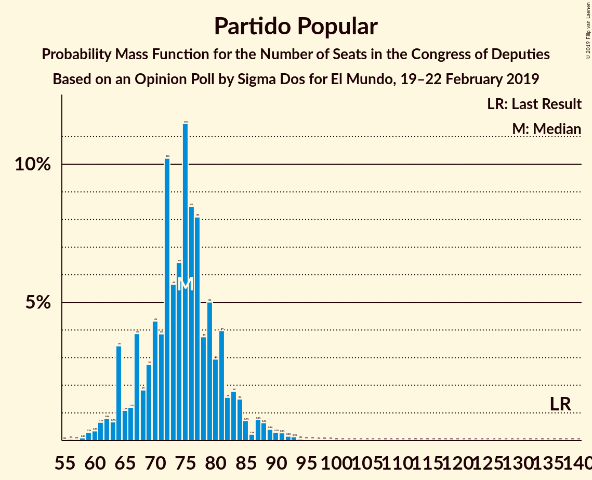

# Opinion Poll by Sigma Dos for El Mundo, 19–22 February 2019

<a href="#voting-intentions">Voting Intentions</a> | <a href="#seats">Seats</a> | <a href="#coalitions">Coalitions</a> | <a href="#technical-information">Technical Information</a>

## Voting Intentions

### Confidence Intervals

| Party | Last Result | Poll Result | 80% Confidence Interval | 90% Confidence Interval | 95% Confidence Interval | 99% Confidence Interval |
|:-----:|:-----------:|:-----------:|:-----------------------:|:-----------------------:|:-----------------------:|:-----------------------:|
| Partido Socialista Obrero Español | 22.6% | 27.3% | 25.7–29.0% |25.3–29.5% |24.9–29.9% |24.1–30.8% |
| Partido Popular | 33.0% | 19.1% | 17.7–20.6% |17.3–21.0% |16.9–21.4% |16.3–22.2% |
| Ciudadanos–Partido de la Ciudadanía | 13.1% | 16.0% | 14.7–17.4% |14.3–17.8% |14.0–18.2% |13.4–18.9% |
| Unidos Podemos | 21.2% | 14.4% | 13.2–15.8% |12.8–16.2% |12.5–16.5% |12.0–17.2% |
| Vox | 0.2% | 13.3% | 12.1–14.7% |11.8–15.1% |11.5–15.4% |11.0–16.0% |
| Esquerra Republicana de Catalunya–Catalunya Sí | 2.7% | 3.2% | 2.6–3.9% |2.4–4.1% |2.3–4.3% |2.1–4.7% |
| Euzko Alderdi Jeltzalea/Partido Nacionalista Vasco | 1.2% | 1.2% | 0.9–1.7% |0.8–1.8% |0.7–2.0% |0.6–2.2% |
| Partit Demòcrata Europeu Català | 2.0% | 1.1% | 0.8–1.6% |0.7–1.7% |0.6–1.8% |0.5–2.1% |

*Note:* The poll result column reflects the actual value used in the calculations. Published results may vary slightly, and in addition be rounded to fewer digits.

## Seats

### Confidence Intervals

| Party | Last Result | Median | 80% Confidence Interval | 90% Confidence Interval | 95% Confidence Interval | 99% Confidence Interval |
|:-----:|:-----------:|:------:|:-----------------------:|:-----------------------:|:-----------------------:|:-----------------------:|
| <a href="#partido-socialista-obrero-español">Partido Socialista Obrero Español</a> | 85 | 116 | 110–122 |105–122 |95–122 |95–132 |
| <a href="#partido-popular">Partido Popular</a> | 137 | 72 | 72–77 |71–77 |71–89 |60–89 |
| <a href="#ciudadanos–partido-de-la-ciudadanía">Ciudadanos–Partido de la Ciudadanía</a> | 32 | 45 | 45–57 |45–61 |45–61 |41–66 |
| <a href="#unidos-podemos">Unidos Podemos</a> | 71 | 41 | 41–44 |38–44 |34–44 |33–50 |
| <a href="#vox">Vox</a> | 0 | 46 | 35–46 |34–52 |33–52 |27–52 |
| <a href="#esquerra-republicana-de-catalunya–catalunya-sí">Esquerra Republicana de Catalunya–Catalunya Sí</a> | 9 | 15 | 15–17 |13–18 |12–18 |9–18 |
| <a href="#euzko-alderdi-jeltzalea/partido-nacionalista-vasco">Euzko Alderdi Jeltzalea/Partido Nacionalista Vasco</a> | 5 | 8 | 3–8 |3–8 |3–8 |3–8 |
| <a href="#partit-demòcrata-europeu-català">Partit Demòcrata Europeu Català</a> | 8 | 4 | 1–5 |1–5 |1–8 |1–10 |

### Partido Socialista Obrero Español

*For a full overview of the results for this party, see the [Partido Socialista Obrero Español](party-partidosocialistaobreroespañol.html) page.*

| Number of Seats | Probability | Accumulated | Special Marks |
|:---------------:|:-----------:|:-----------:|:-------------:|
| 85 | 0% | 100% | Last Result |
| 86 | 0% | 100% |  |
| 87 | 0% | 100% |  |
| 88 | 0% | 100% |  |
| 89 | 0% | 100% |  |
| 90 | 0% | 100% |  |
| 91 | 0% | 100% |  |
| 92 | 0% | 100% |  |
| 93 | 0% | 100% |  |
| 94 | 0% | 100% |  |
| 95 | 4% | 100% |  |
| 96 | 0% | 96% |  |
| 97 | 0% | 96% |  |
| 98 | 0% | 96% |  |
| 99 | 0% | 96% |  |
| 100 | 0% | 96% |  |
| 101 | 0% | 96% |  |
| 102 | 0% | 96% |  |
| 103 | 0% | 96% |  |
| 104 | 0% | 96% |  |
| 105 | 3% | 96% |  |
| 106 | 0% | 93% |  |
| 107 | 0% | 93% |  |
| 108 | 0% | 93% |  |
| 109 | 0% | 93% |  |
| 110 | 10% | 93% |  |
| 111 | 0% | 83% |  |
| 112 | 0.5% | 83% |  |
| 113 | 3% | 82% |  |
| 114 | 0% | 79% |  |
| 115 | 0% | 79% |  |
| 116 | 48% | 79% | Median |
| 117 | 0% | 31% |  |
| 118 | 0.4% | 31% |  |
| 119 | 0% | 31% |  |
| 120 | 0.2% | 31% |  |
| 121 | 0.3% | 31% |  |
| 122 | 28% | 30% |  |
| 123 | 0% | 2% |  |
| 124 | 0% | 2% |  |
| 125 | 0% | 2% |  |
| 126 | 0% | 2% |  |
| 127 | 0% | 2% |  |
| 128 | 0.1% | 2% |  |
| 129 | 0% | 2% |  |
| 130 | 0% | 2% |  |
| 131 | 0% | 2% |  |
| 132 | 1.2% | 2% |  |
| 133 | 0.5% | 0.5% |  |
| 134 | 0% | 0% |  |

### Partido Popular

*For a full overview of the results for this party, see the [Partido Popular](party-partidopopular.html) page.*

| Number of Seats | Probability | Accumulated | Special Marks |
|:---------------:|:-----------:|:-----------:|:-------------:|
| 60 | 1.2% | 100% |  |
| 61 | 0% | 98.8% |  |
| 62 | 0% | 98.7% |  |
| 63 | 0% | 98.7% |  |
| 64 | 0% | 98.7% |  |
| 65 | 0% | 98.7% |  |
| 66 | 0% | 98.7% |  |
| 67 | 0.1% | 98.7% |  |
| 68 | 0% | 98.7% |  |
| 69 | 0.5% | 98.6% |  |
| 70 | 0.5% | 98% |  |
| 71 | 4% | 98% |  |
| 72 | 48% | 94% | Median |
| 73 | 3% | 45% |  |
| 74 | 0% | 42% |  |
| 75 | 0% | 42% |  |
| 76 | 0.4% | 42% |  |
| 77 | 38% | 42% |  |
| 78 | 0% | 3% |  |
| 79 | 0% | 3% |  |
| 80 | 0% | 3% |  |
| 81 | 0.1% | 3% |  |
| 82 | 0% | 3% |  |
| 83 | 0% | 3% |  |
| 84 | 0% | 3% |  |
| 85 | 0% | 3% |  |
| 86 | 0% | 3% |  |
| 87 | 0.1% | 3% |  |
| 88 | 0% | 3% |  |
| 89 | 3% | 3% |  |
| 90 | 0% | 0.1% |  |
| 91 | 0% | 0% |  |
| 92 | 0% | 0% |  |
| 93 | 0% | 0% |  |
| 94 | 0% | 0% |  |
| 95 | 0% | 0% |  |
| 96 | 0% | 0% |  |
| 97 | 0% | 0% |  |
| 98 | 0% | 0% |  |
| 99 | 0% | 0% |  |
| 100 | 0% | 0% |  |
| 101 | 0% | 0% |  |
| 102 | 0% | 0% |  |
| 103 | 0% | 0% |  |
| 104 | 0% | 0% |  |
| 105 | 0% | 0% |  |
| 106 | 0% | 0% |  |
| 107 | 0% | 0% |  |
| 108 | 0% | 0% |  |
| 109 | 0% | 0% |  |
| 110 | 0% | 0% |  |
| 111 | 0% | 0% |  |
| 112 | 0% | 0% |  |
| 113 | 0% | 0% |  |
| 114 | 0% | 0% |  |
| 115 | 0% | 0% |  |
| 116 | 0% | 0% |  |
| 117 | 0% | 0% |  |
| 118 | 0% | 0% |  |
| 119 | 0% | 0% |  |
| 120 | 0% | 0% |  |
| 121 | 0% | 0% |  |
| 122 | 0% | 0% |  |
| 123 | 0% | 0% |  |
| 124 | 0% | 0% |  |
| 125 | 0% | 0% |  |
| 126 | 0% | 0% |  |
| 127 | 0% | 0% |  |
| 128 | 0% | 0% |  |
| 129 | 0% | 0% |  |
| 130 | 0% | 0% |  |
| 131 | 0% | 0% |  |
| 132 | 0% | 0% |  |
| 133 | 0% | 0% |  |
| 134 | 0% | 0% |  |
| 135 | 0% | 0% |  |
| 136 | 0% | 0% |  |
| 137 | 0% | 0% | Last Result |

### Ciudadanos–Partido de la Ciudadanía

*For a full overview of the results for this party, see the [Ciudadanos–Partido de la Ciudadanía](party-ciudadanos–partidodelaciudadanía.html) page.*

| Number of Seats | Probability | Accumulated | Special Marks |
|:---------------:|:-----------:|:-----------:|:-------------:|
| 32 | 0% | 100% | Last Result |
| 33 | 0% | 100% |  |
| 34 | 0% | 100% |  |
| 35 | 0% | 100% |  |
| 36 | 0% | 100% |  |
| 37 | 0% | 100% |  |
| 38 | 0% | 100% |  |
| 39 | 0% | 100% |  |
| 40 | 0.5% | 100% |  |
| 41 | 0.1% | 99.5% |  |
| 42 | 0% | 99.4% |  |
| 43 | 0% | 99.4% |  |
| 44 | 0% | 99.4% |  |
| 45 | 77% | 99.4% | Median |
| 46 | 0% | 23% |  |
| 47 | 0% | 23% |  |
| 48 | 0.5% | 23% |  |
| 49 | 0% | 22% |  |
| 50 | 3% | 22% |  |
| 51 | 0% | 19% |  |
| 52 | 0% | 19% |  |
| 53 | 0% | 19% |  |
| 54 | 0% | 19% |  |
| 55 | 0% | 19% |  |
| 56 | 3% | 19% |  |
| 57 | 10% | 16% |  |
| 58 | 0.4% | 6% |  |
| 59 | 0% | 6% |  |
| 60 | 0.1% | 6% |  |
| 61 | 4% | 6% |  |
| 62 | 0.4% | 2% |  |
| 63 | 0% | 1.3% |  |
| 64 | 0% | 1.3% |  |
| 65 | 0% | 1.2% |  |
| 66 | 1.2% | 1.2% |  |
| 67 | 0% | 0% |  |

### Unidos Podemos

*For a full overview of the results for this party, see the [Unidos Podemos](party-unidospodemos.html) page.*

| Number of Seats | Probability | Accumulated | Special Marks |
|:---------------:|:-----------:|:-----------:|:-------------:|
| 27 | 0.1% | 100% |  |
| 28 | 0% | 99.9% |  |
| 29 | 0% | 99.9% |  |
| 30 | 0% | 99.9% |  |
| 31 | 0% | 99.9% |  |
| 32 | 0.1% | 99.9% |  |
| 33 | 1.2% | 99.8% |  |
| 34 | 3% | 98.6% |  |
| 35 | 0% | 96% |  |
| 36 | 0% | 96% |  |
| 37 | 0% | 96% |  |
| 38 | 3% | 96% |  |
| 39 | 0.1% | 93% |  |
| 40 | 0% | 92% |  |
| 41 | 77% | 92% | Median |
| 42 | 0% | 16% |  |
| 43 | 0.5% | 16% |  |
| 44 | 14% | 15% |  |
| 45 | 0% | 1.4% |  |
| 46 | 0% | 1.4% |  |
| 47 | 0% | 1.4% |  |
| 48 | 0% | 1.4% |  |
| 49 | 0.4% | 1.4% |  |
| 50 | 0.5% | 1.0% |  |
| 51 | 0% | 0.5% |  |
| 52 | 0% | 0.5% |  |
| 53 | 0.1% | 0.5% |  |
| 54 | 0.4% | 0.4% |  |
| 55 | 0% | 0% |  |
| 56 | 0% | 0% |  |
| 57 | 0% | 0% |  |
| 58 | 0% | 0% |  |
| 59 | 0% | 0% |  |
| 60 | 0% | 0% |  |
| 61 | 0% | 0% |  |
| 62 | 0% | 0% |  |
| 63 | 0% | 0% |  |
| 64 | 0% | 0% |  |
| 65 | 0% | 0% |  |
| 66 | 0% | 0% |  |
| 67 | 0% | 0% |  |
| 68 | 0% | 0% |  |
| 69 | 0% | 0% |  |
| 70 | 0% | 0% |  |
| 71 | 0% | 0% | Last Result |

### Vox

*For a full overview of the results for this party, see the [Vox](party-vox.html) page.*

| Number of Seats | Probability | Accumulated | Special Marks |
|:---------------:|:-----------:|:-----------:|:-------------:|
| 0 | 0% | 100% | Last Result |
| 1 | 0% | 100% |  |
| 2 | 0% | 100% |  |
| 3 | 0% | 100% |  |
| 4 | 0% | 100% |  |
| 5 | 0% | 100% |  |
| 6 | 0% | 100% |  |
| 7 | 0% | 100% |  |
| 8 | 0% | 100% |  |
| 9 | 0% | 100% |  |
| 10 | 0% | 100% |  |
| 11 | 0% | 100% |  |
| 12 | 0% | 100% |  |
| 13 | 0% | 100% |  |
| 14 | 0% | 100% |  |
| 15 | 0% | 100% |  |
| 16 | 0% | 100% |  |
| 17 | 0% | 100% |  |
| 18 | 0% | 100% |  |
| 19 | 0% | 100% |  |
| 20 | 0% | 100% |  |
| 21 | 0% | 100% |  |
| 22 | 0% | 100% |  |
| 23 | 0% | 100% |  |
| 24 | 0% | 100% |  |
| 25 | 0.4% | 100% |  |
| 26 | 0% | 99.6% |  |
| 27 | 0.9% | 99.6% |  |
| 28 | 0% | 98.7% |  |
| 29 | 0% | 98.7% |  |
| 30 | 0% | 98.7% |  |
| 31 | 0% | 98.7% |  |
| 32 | 0% | 98.6% |  |
| 33 | 1.2% | 98.6% |  |
| 34 | 3% | 97% |  |
| 35 | 29% | 94% |  |
| 36 | 10% | 66% |  |
| 37 | 0% | 56% |  |
| 38 | 0% | 56% |  |
| 39 | 0% | 56% |  |
| 40 | 0% | 56% |  |
| 41 | 0.7% | 56% |  |
| 42 | 0% | 55% |  |
| 43 | 0% | 55% |  |
| 44 | 0% | 55% |  |
| 45 | 0% | 55% |  |
| 46 | 48% | 55% | Median |
| 47 | 0% | 7% |  |
| 48 | 0% | 7% |  |
| 49 | 0% | 7% |  |
| 50 | 0% | 7% |  |
| 51 | 0.1% | 7% |  |
| 52 | 7% | 7% |  |
| 53 | 0% | 0% |  |

### Esquerra Republicana de Catalunya–Catalunya Sí

*For a full overview of the results for this party, see the [Esquerra Republicana de Catalunya–Catalunya Sí](party-esquerrarepublicanadecatalunya–catalunyasí.html) page.*

| Number of Seats | Probability | Accumulated | Special Marks |
|:---------------:|:-----------:|:-----------:|:-------------:|
| 8 | 0.1% | 100% |  |
| 9 | 0.5% | 99.9% | Last Result |
| 10 | 0% | 99.3% |  |
| 11 | 0% | 99.3% |  |
| 12 | 4% | 99.3% |  |
| 13 | 1.3% | 95% |  |
| 14 | 0.6% | 94% |  |
| 15 | 52% | 94% | Median |
| 16 | 3% | 41% |  |
| 17 | 28% | 38% |  |
| 18 | 10% | 10% |  |
| 19 | 0% | 0.1% |  |
| 20 | 0% | 0% |  |

### Euzko Alderdi Jeltzalea/Partido Nacionalista Vasco

*For a full overview of the results for this party, see the [Euzko Alderdi Jeltzalea/Partido Nacionalista Vasco](party-euzkoalderdijeltzaleapartidonacionalistavasco.html) page.*

| Number of Seats | Probability | Accumulated | Special Marks |
|:---------------:|:-----------:|:-----------:|:-------------:|
| 2 | 0.4% | 100% |  |
| 3 | 17% | 99.6% |  |
| 4 | 30% | 83% |  |
| 5 | 0% | 53% | Last Result |
| 6 | 0.3% | 53% |  |
| 7 | 1.2% | 52% |  |
| 8 | 51% | 51% | Median |
| 9 | 0% | 0.1% |  |
| 10 | 0% | 0% |  |

### Partit Demòcrata Europeu Català

*For a full overview of the results for this party, see the [Partit Demòcrata Europeu Català](party-partitdemòcrataeuropeucatalà.html) page.*

| Number of Seats | Probability | Accumulated | Special Marks |
|:---------------:|:-----------:|:-----------:|:-------------:|
| 1 | 13% | 100% |  |
| 2 | 0% | 87% |  |
| 3 | 0% | 87% |  |
| 4 | 53% | 87% | Median |
| 5 | 29% | 33% |  |
| 6 | 1.0% | 5% |  |
| 7 | 0.1% | 4% |  |
| 8 | 3% | 4% | Last Result |
| 9 | 0% | 0.5% |  |
| 10 | 0.5% | 0.5% |  |
| 11 | 0% | 0% |  |

## Coalitions

### Confidence Intervals

| Coalition | Last Result | Median | Majority? | 80% Confidence Interval | 90% Confidence Interval | 95% Confidence Interval | 99% Confidence Interval |
|:---------:|:-----------:|:------:|:---------:|:-----------------------:|:-----------------------:|:-----------------------:|:-----------------------:|
| Partido Socialista Obrero Español – Partido Popular – Ciudadanos–Partido de la Ciudadanía | 254 | 233 | 100% | 233–244 | 228–248 | 227–258 | 227–258 |
| Partido Socialista Obrero Español – Ciudadanos–Partido de la Ciudadanía – Unidos Podemos | 188 | 202 | 100% | 202–211 | 200–211 | 193–223 | 193–231 |
| Partido Socialista Obrero Español – Partido Popular | 222 | 188 | 96% | 187–199 | 178–199 | 166–202 | 166–203 |
| Partido Socialista Obrero Español – Unidos Podemos – Esquerra Republicana de Catalunya–Catalunya Sí – Partit Demòcrata Europeu Català | 173 | 176 | 80% | 167–185 | 160–185 | 158–185 | 158–192 |
| Partido Popular – Ciudadanos–Partido de la Ciudadanía – Vox | 169 | 163 | 7% | 157–175 | 157–179 | 157–184 | 146–184 |
| Partido Socialista Obrero Español – Ciudadanos–Partido de la Ciudadanía | 117 | 161 | 2% | 161–167 | 156–169 | 155–173 | 155–198 |
| Partido Socialista Obrero Español – Unidos Podemos – Euzko Alderdi Jeltzalea/Partido Nacionalista Vasco | 161 | 165 | 0.9% | 155–167 | 146–167 | 142–169 | 142–183 |
| Partido Socialista Obrero Español – Unidos Podemos | 156 | 157 | 0.5% | 147–163 | 143–163 | 139–163 | 139–177 |
| Partido Popular – Ciudadanos–Partido de la Ciudadanía – Euzko Alderdi Jeltzalea/Partido Nacionalista Vasco | 174 | 126 | 0% | 125–137 | 125–137 | 125–153 | 122–153 |
| Partido Popular – Ciudadanos–Partido de la Ciudadanía | 169 | 122 | 0% | 117–134 | 117–134 | 117–145 | 112–145 |
| Partido Popular – Vox | 137 | 118 | 0% | 112–123 | 112–123 | 103–125 | 93–125 |
| Partido Socialista Obrero Español | 85 | 116 | 0% | 110–122 | 105–122 | 95–122 | 95–132 |
| Partido Popular | 137 | 72 | 0% | 72–77 | 71–77 | 71–89 | 60–89 |

### Partido Socialista Obrero Español – Partido Popular – Ciudadanos–Partido de la Ciudadanía

| Number of Seats | Probability | Accumulated | Special Marks |
|:---------------:|:-----------:|:-----------:|:-------------:|
| 227 | 4% | 100% |  |
| 228 | 3% | 96% |  |
| 229 | 0% | 93% |  |
| 230 | 0% | 93% |  |
| 231 | 0% | 93% |  |
| 232 | 0% | 93% |  |
| 233 | 48% | 93% | Median |
| 234 | 0% | 45% |  |
| 235 | 0% | 45% |  |
| 236 | 0% | 45% |  |
| 237 | 0.2% | 45% |  |
| 238 | 0.3% | 44% |  |
| 239 | 0% | 44% |  |
| 240 | 0% | 44% |  |
| 241 | 0% | 44% |  |
| 242 | 0% | 44% |  |
| 243 | 0.5% | 44% |  |
| 244 | 38% | 44% |  |
| 245 | 0% | 5% |  |
| 246 | 0% | 5% |  |
| 247 | 0.1% | 5% |  |
| 248 | 0.4% | 5% |  |
| 249 | 0% | 5% |  |
| 250 | 0.4% | 5% |  |
| 251 | 0% | 4% |  |
| 252 | 0% | 4% |  |
| 253 | 0% | 4% |  |
| 254 | 0% | 4% | Last Result |
| 255 | 0% | 4% |  |
| 256 | 0.1% | 4% |  |
| 257 | 0% | 4% |  |
| 258 | 4% | 4% |  |
| 259 | 0% | 0% |  |

### Partido Socialista Obrero Español – Ciudadanos–Partido de la Ciudadanía – Unidos Podemos

| Number of Seats | Probability | Accumulated | Special Marks |
|:---------------:|:-----------:|:-----------:|:-------------:|
| 188 | 0% | 100% | Last Result |
| 189 | 0% | 100% |  |
| 190 | 0% | 99.9% |  |
| 191 | 0% | 99.9% |  |
| 192 | 0% | 99.9% |  |
| 193 | 3% | 99.9% |  |
| 194 | 0% | 97% |  |
| 195 | 0% | 97% |  |
| 196 | 0.1% | 97% |  |
| 197 | 0% | 97% |  |
| 198 | 0% | 97% |  |
| 199 | 0% | 97% |  |
| 200 | 4% | 97% |  |
| 201 | 0% | 93% |  |
| 202 | 48% | 93% | Median |
| 203 | 3% | 45% |  |
| 204 | 0% | 42% |  |
| 205 | 0% | 42% |  |
| 206 | 0% | 42% |  |
| 207 | 0% | 42% |  |
| 208 | 28% | 42% |  |
| 209 | 0% | 13% |  |
| 210 | 0% | 13% |  |
| 211 | 10% | 13% |  |
| 212 | 0.3% | 3% |  |
| 213 | 0% | 3% |  |
| 214 | 0% | 3% |  |
| 215 | 0% | 3% |  |
| 216 | 0% | 3% |  |
| 217 | 0% | 3% |  |
| 218 | 0% | 3% |  |
| 219 | 0.1% | 3% |  |
| 220 | 0% | 3% |  |
| 221 | 0% | 3% |  |
| 222 | 0% | 3% |  |
| 223 | 0.9% | 3% |  |
| 224 | 0% | 2% |  |
| 225 | 0% | 2% |  |
| 226 | 0% | 2% |  |
| 227 | 0% | 2% |  |
| 228 | 0% | 2% |  |
| 229 | 0% | 2% |  |
| 230 | 0.4% | 2% |  |
| 231 | 1.2% | 1.2% |  |
| 232 | 0% | 0% |  |

### Partido Socialista Obrero Español – Partido Popular

| Number of Seats | Probability | Accumulated | Special Marks |
|:---------------:|:-----------:|:-----------:|:-------------:|
| 166 | 4% | 100% |  |
| 167 | 0% | 96% |  |
| 168 | 0% | 96% |  |
| 169 | 0% | 96% |  |
| 170 | 0% | 96% |  |
| 171 | 0% | 96% |  |
| 172 | 0.1% | 96% |  |
| 173 | 0% | 96% |  |
| 174 | 0% | 96% |  |
| 175 | 0% | 96% |  |
| 176 | 0% | 96% | Majority |
| 177 | 0% | 96% |  |
| 178 | 3% | 96% |  |
| 179 | 0% | 93% |  |
| 180 | 0% | 93% |  |
| 181 | 0% | 93% |  |
| 182 | 0% | 93% |  |
| 183 | 0% | 93% |  |
| 184 | 0% | 93% |  |
| 185 | 0% | 93% |  |
| 186 | 0% | 93% |  |
| 187 | 10% | 93% |  |
| 188 | 48% | 83% | Median |
| 189 | 0.2% | 34% |  |
| 190 | 0.7% | 34% |  |
| 191 | 0% | 33% |  |
| 192 | 1.2% | 33% |  |
| 193 | 0.1% | 32% |  |
| 194 | 0% | 32% |  |
| 195 | 0% | 32% |  |
| 196 | 0% | 32% |  |
| 197 | 0% | 32% |  |
| 198 | 0% | 32% |  |
| 199 | 28% | 32% |  |
| 200 | 0% | 4% |  |
| 201 | 0% | 4% |  |
| 202 | 3% | 4% |  |
| 203 | 0.5% | 0.6% |  |
| 204 | 0% | 0.1% |  |
| 205 | 0% | 0.1% |  |
| 206 | 0% | 0.1% |  |
| 207 | 0% | 0.1% |  |
| 208 | 0% | 0.1% |  |
| 209 | 0% | 0.1% |  |
| 210 | 0% | 0.1% |  |
| 211 | 0% | 0.1% |  |
| 212 | 0% | 0.1% |  |
| 213 | 0% | 0.1% |  |
| 214 | 0% | 0.1% |  |
| 215 | 0.1% | 0.1% |  |
| 216 | 0% | 0% |  |
| 217 | 0% | 0% |  |
| 218 | 0% | 0% |  |
| 219 | 0% | 0% |  |
| 220 | 0% | 0% |  |
| 221 | 0% | 0% |  |
| 222 | 0% | 0% | Last Result |

### Partido Socialista Obrero Español – Unidos Podemos – Esquerra Republicana de Catalunya–Catalunya Sí – Partit Demòcrata Europeu Català

| Number of Seats | Probability | Accumulated | Special Marks |
|:---------------:|:-----------:|:-----------:|:-------------:|
| 158 | 4% | 100% |  |
| 159 | 0% | 96% |  |
| 160 | 3% | 96% |  |
| 161 | 0% | 93% |  |
| 162 | 0% | 93% |  |
| 163 | 0% | 93% |  |
| 164 | 0% | 93% |  |
| 165 | 0% | 93% |  |
| 166 | 0.1% | 93% |  |
| 167 | 3% | 93% |  |
| 168 | 0% | 90% |  |
| 169 | 0% | 90% |  |
| 170 | 0% | 90% |  |
| 171 | 0.1% | 90% |  |
| 172 | 0% | 90% |  |
| 173 | 10% | 90% | Last Result |
| 174 | 0% | 80% |  |
| 175 | 0% | 80% |  |
| 176 | 48% | 80% | Median, Majority |
| 177 | 0% | 32% |  |
| 178 | 0% | 32% |  |
| 179 | 0.4% | 32% |  |
| 180 | 0% | 31% |  |
| 181 | 0% | 31% |  |
| 182 | 1.5% | 31% |  |
| 183 | 0.3% | 30% |  |
| 184 | 0% | 29% |  |
| 185 | 29% | 29% |  |
| 186 | 0% | 0.5% |  |
| 187 | 0% | 0.5% |  |
| 188 | 0% | 0.5% |  |
| 189 | 0% | 0.5% |  |
| 190 | 0% | 0.5% |  |
| 191 | 0% | 0.5% |  |
| 192 | 0% | 0.5% |  |
| 193 | 0% | 0.5% |  |
| 194 | 0% | 0.5% |  |
| 195 | 0% | 0.5% |  |
| 196 | 0% | 0.5% |  |
| 197 | 0% | 0.5% |  |
| 198 | 0% | 0.5% |  |
| 199 | 0% | 0.5% |  |
| 200 | 0% | 0.5% |  |
| 201 | 0% | 0.5% |  |
| 202 | 0% | 0.5% |  |
| 203 | 0.5% | 0.5% |  |
| 204 | 0% | 0% |  |

### Partido Popular – Ciudadanos–Partido de la Ciudadanía – Vox

| Number of Seats | Probability | Accumulated | Special Marks |
|:---------------:|:-----------:|:-----------:|:-------------:|
| 137 | 0.5% | 100% |  |
| 138 | 0% | 99.5% |  |
| 139 | 0% | 99.5% |  |
| 140 | 0% | 99.5% |  |
| 141 | 0% | 99.5% |  |
| 142 | 0% | 99.5% |  |
| 143 | 0% | 99.5% |  |
| 144 | 0% | 99.5% |  |
| 145 | 0% | 99.5% |  |
| 146 | 0% | 99.5% |  |
| 147 | 0% | 99.5% |  |
| 148 | 0% | 99.5% |  |
| 149 | 0% | 99.5% |  |
| 150 | 0% | 99.5% |  |
| 151 | 0% | 99.5% |  |
| 152 | 0% | 99.5% |  |
| 153 | 0% | 99.5% |  |
| 154 | 0% | 99.5% |  |
| 155 | 0.4% | 99.5% |  |
| 156 | 0% | 99.1% |  |
| 157 | 28% | 99.1% |  |
| 158 | 0.5% | 71% |  |
| 159 | 1.3% | 70% |  |
| 160 | 0% | 69% |  |
| 161 | 0% | 69% |  |
| 162 | 0% | 69% |  |
| 163 | 48% | 69% | Median |
| 164 | 0% | 21% |  |
| 165 | 0.4% | 21% |  |
| 166 | 0% | 20% |  |
| 167 | 0% | 20% |  |
| 168 | 0% | 20% |  |
| 169 | 0.1% | 20% | Last Result |
| 170 | 10% | 20% |  |
| 171 | 0% | 10% |  |
| 172 | 0% | 10% |  |
| 173 | 0% | 10% |  |
| 174 | 0% | 10% |  |
| 175 | 3% | 10% |  |
| 176 | 0% | 7% | Majority |
| 177 | 0.1% | 7% |  |
| 178 | 0% | 7% |  |
| 179 | 3% | 7% |  |
| 180 | 0% | 4% |  |
| 181 | 0% | 4% |  |
| 182 | 0% | 4% |  |
| 183 | 0% | 4% |  |
| 184 | 4% | 4% |  |
| 185 | 0% | 0% |  |

### Partido Socialista Obrero Español – Ciudadanos–Partido de la Ciudadanía

| Number of Seats | Probability | Accumulated | Special Marks |
|:---------------:|:-----------:|:-----------:|:-------------:|
| 117 | 0% | 100% | Last Result |
| 118 | 0% | 100% |  |
| 119 | 0% | 100% |  |
| 120 | 0% | 100% |  |
| 121 | 0% | 100% |  |
| 122 | 0% | 100% |  |
| 123 | 0% | 100% |  |
| 124 | 0% | 100% |  |
| 125 | 0% | 100% |  |
| 126 | 0% | 100% |  |
| 127 | 0% | 100% |  |
| 128 | 0% | 100% |  |
| 129 | 0% | 100% |  |
| 130 | 0% | 100% |  |
| 131 | 0% | 100% |  |
| 132 | 0% | 100% |  |
| 133 | 0% | 100% |  |
| 134 | 0% | 100% |  |
| 135 | 0% | 100% |  |
| 136 | 0% | 100% |  |
| 137 | 0% | 100% |  |
| 138 | 0% | 100% |  |
| 139 | 0% | 100% |  |
| 140 | 0% | 100% |  |
| 141 | 0% | 100% |  |
| 142 | 0% | 100% |  |
| 143 | 0% | 100% |  |
| 144 | 0% | 100% |  |
| 145 | 0% | 100% |  |
| 146 | 0% | 100% |  |
| 147 | 0% | 100% |  |
| 148 | 0% | 100% |  |
| 149 | 0% | 100% |  |
| 150 | 0% | 100% |  |
| 151 | 0% | 100% |  |
| 152 | 0% | 100% |  |
| 153 | 0% | 100% |  |
| 154 | 0% | 100% |  |
| 155 | 3% | 100% |  |
| 156 | 4% | 97% |  |
| 157 | 0.1% | 93% |  |
| 158 | 0% | 93% |  |
| 159 | 0% | 93% |  |
| 160 | 0% | 93% |  |
| 161 | 48% | 93% | Median |
| 162 | 0% | 45% |  |
| 163 | 0% | 45% |  |
| 164 | 0% | 45% |  |
| 165 | 0% | 45% |  |
| 166 | 0.1% | 45% |  |
| 167 | 38% | 45% |  |
| 168 | 0.2% | 6% |  |
| 169 | 3% | 6% |  |
| 170 | 0% | 3% |  |
| 171 | 0% | 3% |  |
| 172 | 0% | 3% |  |
| 173 | 0.5% | 3% |  |
| 174 | 0.4% | 2% |  |
| 175 | 0% | 2% |  |
| 176 | 0.4% | 2% | Majority |
| 177 | 0% | 1.3% |  |
| 178 | 0% | 1.3% |  |
| 179 | 0% | 1.3% |  |
| 180 | 0% | 1.3% |  |
| 181 | 0% | 1.3% |  |
| 182 | 0% | 1.3% |  |
| 183 | 0% | 1.3% |  |
| 184 | 0% | 1.3% |  |
| 185 | 0% | 1.3% |  |
| 186 | 0% | 1.3% |  |
| 187 | 0% | 1.3% |  |
| 188 | 0% | 1.2% |  |
| 189 | 0% | 1.2% |  |
| 190 | 0% | 1.2% |  |
| 191 | 0% | 1.2% |  |
| 192 | 0% | 1.2% |  |
| 193 | 0% | 1.2% |  |
| 194 | 0% | 1.2% |  |
| 195 | 0% | 1.2% |  |
| 196 | 0% | 1.2% |  |
| 197 | 0% | 1.2% |  |
| 198 | 1.2% | 1.2% |  |
| 199 | 0% | 0% |  |

### Partido Socialista Obrero Español – Unidos Podemos – Euzko Alderdi Jeltzalea/Partido Nacionalista Vasco

| Number of Seats | Probability | Accumulated | Special Marks |
|:---------------:|:-----------:|:-----------:|:-------------:|
| 141 | 0% | 100% |  |
| 142 | 4% | 99.9% |  |
| 143 | 0% | 96% |  |
| 144 | 0% | 96% |  |
| 145 | 0% | 96% |  |
| 146 | 3% | 96% |  |
| 147 | 0% | 93% |  |
| 148 | 0% | 93% |  |
| 149 | 0% | 93% |  |
| 150 | 0% | 93% |  |
| 151 | 0% | 93% |  |
| 152 | 0% | 93% |  |
| 153 | 0% | 93% |  |
| 154 | 0.1% | 93% |  |
| 155 | 3% | 93% |  |
| 156 | 0% | 90% |  |
| 157 | 10% | 90% |  |
| 158 | 0% | 80% |  |
| 159 | 0% | 80% |  |
| 160 | 0% | 80% |  |
| 161 | 0% | 80% | Last Result |
| 162 | 0% | 80% |  |
| 163 | 0.5% | 80% |  |
| 164 | 0% | 79% |  |
| 165 | 48% | 79% | Median |
| 166 | 0% | 31% |  |
| 167 | 28% | 31% |  |
| 168 | 0% | 3% |  |
| 169 | 1.3% | 3% |  |
| 170 | 0.5% | 1.4% |  |
| 171 | 0% | 0.9% |  |
| 172 | 0% | 0.9% |  |
| 173 | 0% | 0.9% |  |
| 174 | 0% | 0.9% |  |
| 175 | 0% | 0.9% |  |
| 176 | 0% | 0.9% | Majority |
| 177 | 0% | 0.9% |  |
| 178 | 0% | 0.9% |  |
| 179 | 0.4% | 0.9% |  |
| 180 | 0% | 0.5% |  |
| 181 | 0% | 0.5% |  |
| 182 | 0% | 0.5% |  |
| 183 | 0% | 0.5% |  |
| 184 | 0% | 0.5% |  |
| 185 | 0% | 0.5% |  |
| 186 | 0% | 0.5% |  |
| 187 | 0% | 0.5% |  |
| 188 | 0% | 0.5% |  |
| 189 | 0% | 0.5% |  |
| 190 | 0.5% | 0.5% |  |
| 191 | 0% | 0% |  |

### Partido Socialista Obrero Español – Unidos Podemos

| Number of Seats | Probability | Accumulated | Special Marks |
|:---------------:|:-----------:|:-----------:|:-------------:|
| 135 | 0% | 100% |  |
| 136 | 0% | 99.9% |  |
| 137 | 0% | 99.9% |  |
| 138 | 0% | 99.9% |  |
| 139 | 4% | 99.9% |  |
| 140 | 0% | 96% |  |
| 141 | 0% | 96% |  |
| 142 | 0% | 96% |  |
| 143 | 3% | 96% |  |
| 144 | 0% | 93% |  |
| 145 | 0% | 93% |  |
| 146 | 0% | 93% |  |
| 147 | 3% | 93% |  |
| 148 | 0% | 90% |  |
| 149 | 0% | 90% |  |
| 150 | 0% | 90% |  |
| 151 | 0.1% | 90% |  |
| 152 | 0% | 90% |  |
| 153 | 0% | 90% |  |
| 154 | 10% | 90% |  |
| 155 | 0.1% | 80% |  |
| 156 | 0% | 80% | Last Result |
| 157 | 48% | 80% | Median |
| 158 | 0.1% | 32% |  |
| 159 | 0% | 32% |  |
| 160 | 0% | 32% |  |
| 161 | 0.4% | 32% |  |
| 162 | 0% | 31% |  |
| 163 | 29% | 31% |  |
| 164 | 0.3% | 2% |  |
| 165 | 1.2% | 2% |  |
| 166 | 0% | 0.9% |  |
| 167 | 0% | 0.9% |  |
| 168 | 0% | 0.9% |  |
| 169 | 0% | 0.9% |  |
| 170 | 0% | 0.9% |  |
| 171 | 0% | 0.9% |  |
| 172 | 0.4% | 0.9% |  |
| 173 | 0% | 0.5% |  |
| 174 | 0% | 0.5% |  |
| 175 | 0% | 0.5% |  |
| 176 | 0% | 0.5% | Majority |
| 177 | 0% | 0.5% |  |
| 178 | 0% | 0.5% |  |
| 179 | 0% | 0.5% |  |
| 180 | 0% | 0.5% |  |
| 181 | 0% | 0.5% |  |
| 182 | 0% | 0.5% |  |
| 183 | 0.5% | 0.5% |  |
| 184 | 0% | 0% |  |

### Partido Popular – Ciudadanos–Partido de la Ciudadanía – Euzko Alderdi Jeltzalea/Partido Nacionalista Vasco

| Number of Seats | Probability | Accumulated | Special Marks |
|:---------------:|:-----------:|:-----------:|:-------------:|
| 117 | 0.5% | 100% |  |
| 118 | 0% | 99.5% |  |
| 119 | 0% | 99.5% |  |
| 120 | 0% | 99.5% |  |
| 121 | 0% | 99.5% |  |
| 122 | 0% | 99.5% |  |
| 123 | 0.3% | 99.5% |  |
| 124 | 0.2% | 99.2% |  |
| 125 | 48% | 99.0% | Median |
| 126 | 32% | 51% |  |
| 127 | 0% | 19% |  |
| 128 | 0% | 19% |  |
| 129 | 0.1% | 19% |  |
| 130 | 1.2% | 19% |  |
| 131 | 0% | 18% |  |
| 132 | 0% | 18% |  |
| 133 | 0% | 18% |  |
| 134 | 0% | 18% |  |
| 135 | 4% | 18% |  |
| 136 | 0.1% | 14% |  |
| 137 | 10% | 14% |  |
| 138 | 0% | 4% |  |
| 139 | 0% | 4% |  |
| 140 | 0.4% | 4% |  |
| 141 | 0% | 3% |  |
| 142 | 0% | 3% |  |
| 143 | 0% | 3% |  |
| 144 | 0% | 3% |  |
| 145 | 0% | 3% |  |
| 146 | 0% | 3% |  |
| 147 | 0% | 3% |  |
| 148 | 0% | 3% |  |
| 149 | 0% | 3% |  |
| 150 | 0% | 3% |  |
| 151 | 0% | 3% |  |
| 152 | 0% | 3% |  |
| 153 | 3% | 3% |  |
| 154 | 0% | 0.1% |  |
| 155 | 0% | 0.1% |  |
| 156 | 0% | 0.1% |  |
| 157 | 0% | 0.1% |  |
| 158 | 0% | 0.1% |  |
| 159 | 0.1% | 0.1% |  |
| 160 | 0% | 0% |  |
| 161 | 0% | 0% |  |
| 162 | 0% | 0% |  |
| 163 | 0% | 0% |  |
| 164 | 0% | 0% |  |
| 165 | 0% | 0% |  |
| 166 | 0% | 0% |  |
| 167 | 0% | 0% |  |
| 168 | 0% | 0% |  |
| 169 | 0% | 0% |  |
| 170 | 0% | 0% |  |
| 171 | 0% | 0% |  |
| 172 | 0% | 0% |  |
| 173 | 0% | 0% |  |
| 174 | 0% | 0% | Last Result |

### Partido Popular – Ciudadanos–Partido de la Ciudadanía

| Number of Seats | Probability | Accumulated | Special Marks |
|:---------------:|:-----------:|:-----------:|:-------------:|
| 110 | 0.5% | 100% |  |
| 111 | 0% | 99.5% |  |
| 112 | 0% | 99.5% |  |
| 113 | 0% | 99.5% |  |
| 114 | 0% | 99.5% |  |
| 115 | 0% | 99.5% |  |
| 116 | 0% | 99.5% |  |
| 117 | 49% | 99.5% | Median |
| 118 | 0% | 51% |  |
| 119 | 0% | 51% |  |
| 120 | 0% | 51% |  |
| 121 | 0% | 51% |  |
| 122 | 28% | 51% |  |
| 123 | 3% | 22% |  |
| 124 | 0% | 19% |  |
| 125 | 0% | 19% |  |
| 126 | 1.3% | 19% |  |
| 127 | 0% | 18% |  |
| 128 | 0.2% | 18% |  |
| 129 | 0% | 18% |  |
| 130 | 0.4% | 18% |  |
| 131 | 0% | 18% |  |
| 132 | 4% | 17% |  |
| 133 | 0% | 13% |  |
| 134 | 10% | 13% |  |
| 135 | 0% | 3% |  |
| 136 | 0% | 3% |  |
| 137 | 0% | 3% |  |
| 138 | 0.4% | 3% |  |
| 139 | 0% | 3% |  |
| 140 | 0% | 3% |  |
| 141 | 0% | 3% |  |
| 142 | 0% | 3% |  |
| 143 | 0% | 3% |  |
| 144 | 0% | 3% |  |
| 145 | 3% | 3% |  |
| 146 | 0% | 0.1% |  |
| 147 | 0% | 0.1% |  |
| 148 | 0% | 0.1% |  |
| 149 | 0% | 0.1% |  |
| 150 | 0% | 0.1% |  |
| 151 | 0% | 0% |  |
| 152 | 0% | 0% |  |
| 153 | 0% | 0% |  |
| 154 | 0% | 0% |  |
| 155 | 0% | 0% |  |
| 156 | 0% | 0% |  |
| 157 | 0% | 0% |  |
| 158 | 0% | 0% |  |
| 159 | 0% | 0% |  |
| 160 | 0% | 0% |  |
| 161 | 0% | 0% |  |
| 162 | 0% | 0% |  |
| 163 | 0% | 0% |  |
| 164 | 0% | 0% |  |
| 165 | 0% | 0% |  |
| 166 | 0% | 0% |  |
| 167 | 0% | 0% |  |
| 168 | 0% | 0% |  |
| 169 | 0% | 0% | Last Result |

### Partido Popular – Vox

| Number of Seats | Probability | Accumulated | Special Marks |
|:---------------:|:-----------:|:-----------:|:-------------:|
| 93 | 1.2% | 100% |  |
| 94 | 0% | 98.8% |  |
| 95 | 0% | 98.8% |  |
| 96 | 0% | 98.8% |  |
| 97 | 0.9% | 98.8% |  |
| 98 | 0% | 98% |  |
| 99 | 0% | 98% |  |
| 100 | 0% | 98% |  |
| 101 | 0% | 98% |  |
| 102 | 0% | 98% |  |
| 103 | 0.4% | 98% |  |
| 104 | 0% | 97% |  |
| 105 | 0% | 97% |  |
| 106 | 0% | 97% |  |
| 107 | 0% | 97% |  |
| 108 | 0.1% | 97% |  |
| 109 | 0% | 97% |  |
| 110 | 0.5% | 97% |  |
| 111 | 0% | 97% |  |
| 112 | 28% | 97% |  |
| 113 | 10% | 68% |  |
| 114 | 0% | 58% |  |
| 115 | 0% | 58% |  |
| 116 | 0% | 58% |  |
| 117 | 0% | 58% |  |
| 118 | 48% | 58% | Median |
| 119 | 0% | 10% |  |
| 120 | 0% | 10% |  |
| 121 | 0% | 10% |  |
| 122 | 0.1% | 10% |  |
| 123 | 7% | 10% |  |
| 124 | 0% | 3% |  |
| 125 | 3% | 3% |  |
| 126 | 0% | 0.1% |  |
| 127 | 0% | 0.1% |  |
| 128 | 0% | 0.1% |  |
| 129 | 0% | 0.1% |  |
| 130 | 0% | 0.1% |  |
| 131 | 0% | 0.1% |  |
| 132 | 0.1% | 0.1% |  |
| 133 | 0% | 0% |  |
| 134 | 0% | 0% |  |
| 135 | 0% | 0% |  |
| 136 | 0% | 0% |  |
| 137 | 0% | 0% | Last Result |

### Partido Socialista Obrero Español

| Number of Seats | Probability | Accumulated | Special Marks |
|:---------------:|:-----------:|:-----------:|:-------------:|
| 85 | 0% | 100% | Last Result |
| 86 | 0% | 100% |  |
| 87 | 0% | 100% |  |
| 88 | 0% | 100% |  |
| 89 | 0% | 100% |  |
| 90 | 0% | 100% |  |
| 91 | 0% | 100% |  |
| 92 | 0% | 100% |  |
| 93 | 0% | 100% |  |
| 94 | 0% | 100% |  |
| 95 | 4% | 100% |  |
| 96 | 0% | 96% |  |
| 97 | 0% | 96% |  |
| 98 | 0% | 96% |  |
| 99 | 0% | 96% |  |
| 100 | 0% | 96% |  |
| 101 | 0% | 96% |  |
| 102 | 0% | 96% |  |
| 103 | 0% | 96% |  |
| 104 | 0% | 96% |  |
| 105 | 3% | 96% |  |
| 106 | 0% | 93% |  |
| 107 | 0% | 93% |  |
| 108 | 0% | 93% |  |
| 109 | 0% | 93% |  |
| 110 | 10% | 93% |  |
| 111 | 0% | 83% |  |
| 112 | 0.5% | 83% |  |
| 113 | 3% | 82% |  |
| 114 | 0% | 79% |  |
| 115 | 0% | 79% |  |
| 116 | 48% | 79% | Median |
| 117 | 0% | 31% |  |
| 118 | 0.4% | 31% |  |
| 119 | 0% | 31% |  |
| 120 | 0.2% | 31% |  |
| 121 | 0.3% | 31% |  |
| 122 | 28% | 30% |  |
| 123 | 0% | 2% |  |
| 124 | 0% | 2% |  |
| 125 | 0% | 2% |  |
| 126 | 0% | 2% |  |
| 127 | 0% | 2% |  |
| 128 | 0.1% | 2% |  |
| 129 | 0% | 2% |  |
| 130 | 0% | 2% |  |
| 131 | 0% | 2% |  |
| 132 | 1.2% | 2% |  |
| 133 | 0.5% | 0.5% |  |
| 134 | 0% | 0% |  |

### Partido Popular

| Number of Seats | Probability | Accumulated | Special Marks |
|:---------------:|:-----------:|:-----------:|:-------------:|
| 60 | 1.2% | 100% |  |
| 61 | 0% | 98.8% |  |
| 62 | 0% | 98.7% |  |
| 63 | 0% | 98.7% |  |
| 64 | 0% | 98.7% |  |
| 65 | 0% | 98.7% |  |
| 66 | 0% | 98.7% |  |
| 67 | 0.1% | 98.7% |  |
| 68 | 0% | 98.7% |  |
| 69 | 0.5% | 98.6% |  |
| 70 | 0.5% | 98% |  |
| 71 | 4% | 98% |  |
| 72 | 48% | 94% | Median |
| 73 | 3% | 45% |  |
| 74 | 0% | 42% |  |
| 75 | 0% | 42% |  |
| 76 | 0.4% | 42% |  |
| 77 | 38% | 42% |  |
| 78 | 0% | 3% |  |
| 79 | 0% | 3% |  |
| 80 | 0% | 3% |  |
| 81 | 0.1% | 3% |  |
| 82 | 0% | 3% |  |
| 83 | 0% | 3% |  |
| 84 | 0% | 3% |  |
| 85 | 0% | 3% |  |
| 86 | 0% | 3% |  |
| 87 | 0.1% | 3% |  |
| 88 | 0% | 3% |  |
| 89 | 3% | 3% |  |
| 90 | 0% | 0.1% |  |
| 91 | 0% | 0% |  |
| 92 | 0% | 0% |  |
| 93 | 0% | 0% |  |
| 94 | 0% | 0% |  |
| 95 | 0% | 0% |  |
| 96 | 0% | 0% |  |
| 97 | 0% | 0% |  |
| 98 | 0% | 0% |  |
| 99 | 0% | 0% |  |
| 100 | 0% | 0% |  |
| 101 | 0% | 0% |  |
| 102 | 0% | 0% |  |
| 103 | 0% | 0% |  |
| 104 | 0% | 0% |  |
| 105 | 0% | 0% |  |
| 106 | 0% | 0% |  |
| 107 | 0% | 0% |  |
| 108 | 0% | 0% |  |
| 109 | 0% | 0% |  |
| 110 | 0% | 0% |  |
| 111 | 0% | 0% |  |
| 112 | 0% | 0% |  |
| 113 | 0% | 0% |  |
| 114 | 0% | 0% |  |
| 115 | 0% | 0% |  |
| 116 | 0% | 0% |  |
| 117 | 0% | 0% |  |
| 118 | 0% | 0% |  |
| 119 | 0% | 0% |  |
| 120 | 0% | 0% |  |
| 121 | 0% | 0% |  |
| 122 | 0% | 0% |  |
| 123 | 0% | 0% |  |
| 124 | 0% | 0% |  |
| 125 | 0% | 0% |  |
| 126 | 0% | 0% |  |
| 127 | 0% | 0% |  |
| 128 | 0% | 0% |  |
| 129 | 0% | 0% |  |
| 130 | 0% | 0% |  |
| 131 | 0% | 0% |  |
| 132 | 0% | 0% |  |
| 133 | 0% | 0% |  |
| 134 | 0% | 0% |  |
| 135 | 0% | 0% |  |
| 136 | 0% | 0% |  |
| 137 | 0% | 0% | Last Result |

## Technical Information

### Opinion Poll

+ **Polling firm:** Sigma Dos
+ **Commissioner(s):** El Mundo
+ **Fieldwork period:** 19–22 February 2019

### Calculations

+ **Sample size:** 1200
+ **Simulations done:** 1,024
+ **Error estimate:** 3.52%

