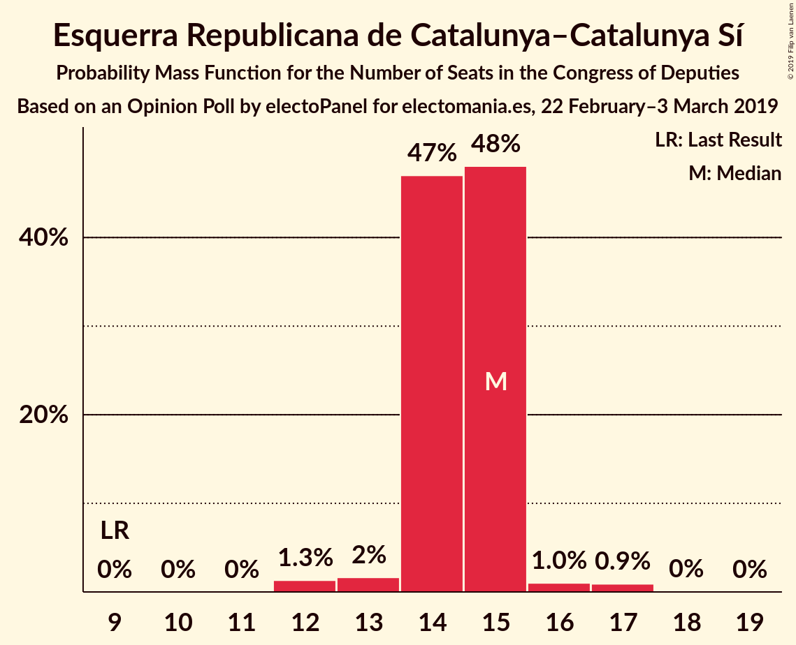
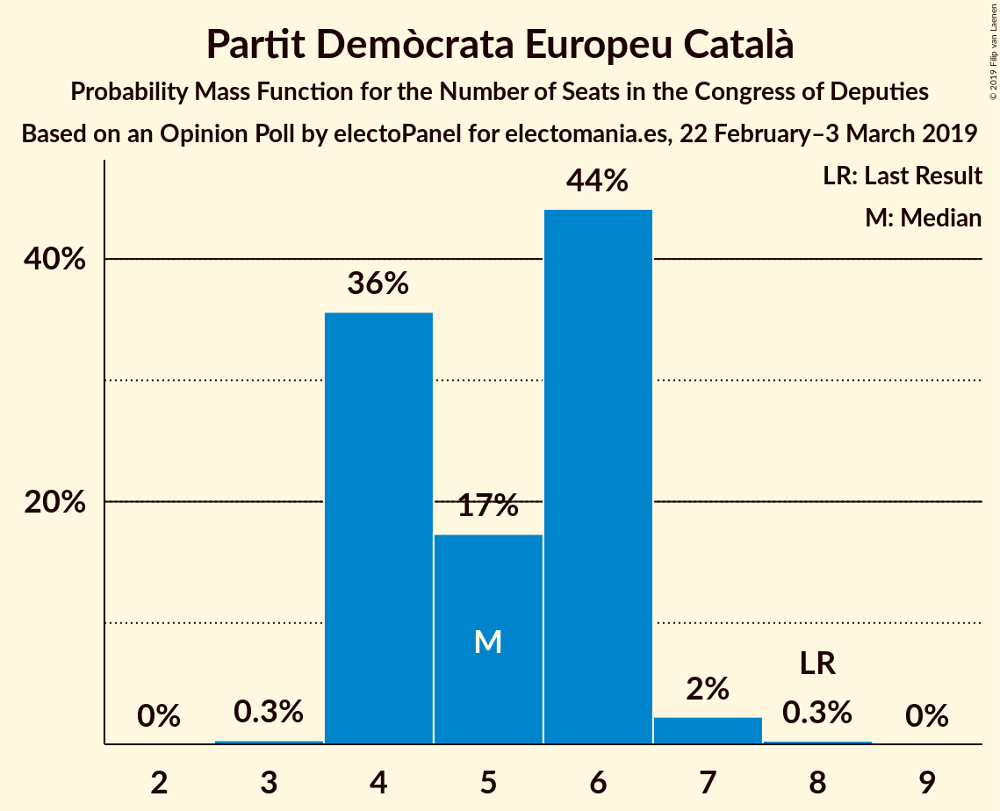
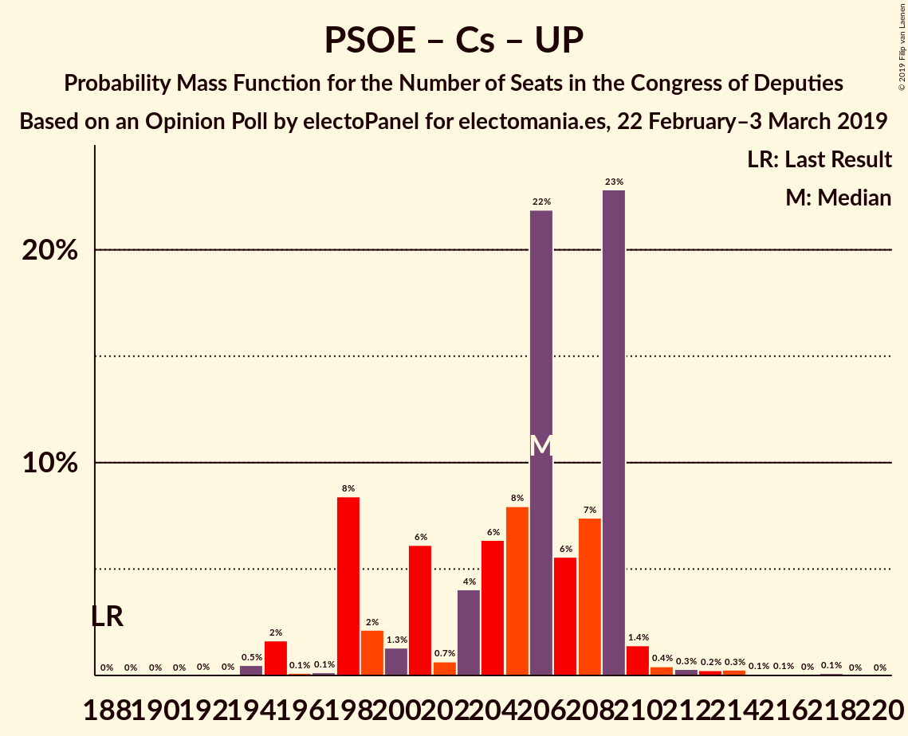
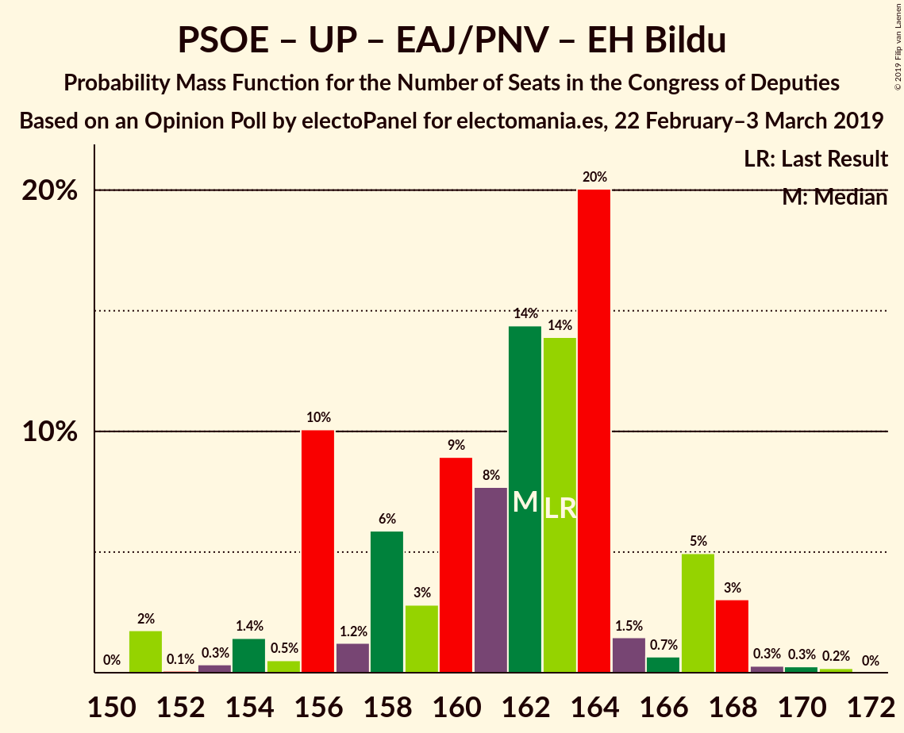

# Opinion Poll by electoPanel for electomania.es, 22 February–3 March 2019

<a href="#voting-intentions">Voting Intentions</a> | <a href="#seats">Seats</a> | <a href="#coalitions">Coalitions</a> | <a href="#technical-information">Technical Information</a>

## Voting Intentions

### Confidence Intervals

| Party | Last Result | Poll Result | 80% Confidence Interval | 90% Confidence Interval | 95% Confidence Interval | 99% Confidence Interval |
|:-----:|:-----------:|:-----------:|:-----------------------:|:-----------------------:|:-----------------------:|:-----------------------:|
| Partido Socialista Obrero Español | 22.6% | 26.7% | 25.9–27.5% |25.7–27.7% |25.5–27.9% |25.1–28.3% |
| Partido Popular | 33.0% | 20.5% | 19.8–21.2% |19.6–21.4% |19.4–21.6% |19.1–22.0% |
| Ciudadanos–Partido de la Ciudadanía | 13.1% | 16.2% | 15.5–16.9% |15.4–17.1% |15.2–17.2% |14.9–17.6% |
| Vox | 0.2% | 12.1% | 11.5–12.7% |11.4–12.9% |11.2–13.0% |11.0–13.3% |
| Unidos Podemos | 21.2% | 11.5% | 10.9–12.1% |10.8–12.3% |10.7–12.4% |10.4–12.7% |
| Esquerra Republicana de Catalunya–Catalunya Sí | 2.7% | 3.3% | 3.0–3.7% |2.9–3.7% |2.9–3.8% |2.7–4.0% |
| Partit Demòcrata Europeu Català | 2.0% | 1.3% | 1.1–1.5% |1.1–1.6% |1.0–1.7% |0.9–1.8% |
| Euzko Alderdi Jeltzalea/Partido Nacionalista Vasco | 1.2% | 1.3% | 1.1–1.5% |1.1–1.6% |1.0–1.7% |0.9–1.8% |
| Partido Animalista Contra el Maltrato Animal | 1.2% | 0.8% | 0.7–1.0% |0.6–1.1% |0.6–1.1% |0.5–1.2% |
| Euskal Herria Bildu | 0.8% | 0.8% | 0.7–1.0% |0.6–1.1% |0.6–1.1% |0.5–1.2% |
| Coalición Canaria–Partido Nacionalista Canario | 0.3% | 0.3% | 0.2–0.4% |0.2–0.5% |0.2–0.5% |0.2–0.6% |

*Note:* The poll result column reflects the actual value used in the calculations. Published results may vary slightly, and in addition be rounded to fewer digits.

## Seats

### Confidence Intervals

| Party | Last Result | Median | 80% Confidence Interval | 90% Confidence Interval | 95% Confidence Interval | 99% Confidence Interval |
|:-----:|:-----------:|:------:|:-----------------------:|:-----------------------:|:-----------------------:|:-----------------------:|
| <a href="#partido-socialista-obrero-español">Partido Socialista Obrero Español</a> | 85 | 118 | 117–122 |114–127 |111–127 |110–129 |
| <a href="#partido-popular">Partido Popular</a> | 137 | 84 | 82–91 |77–91 |76–91 |76–92 |
| <a href="#ciudadanos–partido-de-la-ciudadanía">Ciudadanos–Partido de la Ciudadanía</a> | 32 | 55 | 54–57 |52–57 |51–59 |49–62 |
| <a href="#vox">Vox</a> | 0 | 35 | 30–35 |30–35 |30–36 |28–38 |
| <a href="#unidos-podemos">Unidos Podemos</a> | 71 | 26 | 26–29 |25–30 |25–33 |25–34 |
| <a href="#esquerra-republicana-de-catalunya–catalunya-sí">Esquerra Republicana de Catalunya–Catalunya Sí</a> | 9 | 15 | 14–15 |14–15 |14–15 |12–17 |
| <a href="#partit-demòcrata-europeu-català">Partit Demòcrata Europeu Català</a> | 8 | 6 | 4–6 |4–6 |4–6 |4–8 |
| <a href="#euzko-alderdi-jeltzalea/partido-nacionalista-vasco">Euzko Alderdi Jeltzalea/Partido Nacionalista Vasco</a> | 5 | 6 | 5–6 |5–7 |5–7 |5–8 |
| <a href="#partido-animalista-contra-el-maltrato-animal">Partido Animalista Contra el Maltrato Animal</a> | 0 | 0 | 0 |0 |0 |0 |
| <a href="#euskal-herria-bildu">Euskal Herria Bildu</a> | 2 | 4 | 2–4 |2–5 |2–5 |2–6 |
| <a href="#coalición-canaria–partido-nacionalista-canario">Coalición Canaria–Partido Nacionalista Canario</a> | 1 | 1 | 1 |1 |0–1 |0–2 |

### Partido Socialista Obrero Español

*For a full overview of the results for this party, see the [Partido Socialista Obrero Español](party-partidosocialistaobreroespañol.html) page.*

| Number of Seats | Probability | Accumulated | Special Marks |
|:---------------:|:-----------:|:-----------:|:-------------:|
| 85 | 0% | 100% | Last Result |
| 86 | 0% | 100% |  |
| 87 | 0% | 100% |  |
| 88 | 0% | 100% |  |
| 89 | 0% | 100% |  |
| 90 | 0% | 100% |  |
| 91 | 0% | 100% |  |
| 92 | 0% | 100% |  |
| 93 | 0% | 100% |  |
| 94 | 0% | 100% |  |
| 95 | 0% | 100% |  |
| 96 | 0% | 100% |  |
| 97 | 0% | 100% |  |
| 98 | 0% | 100% |  |
| 99 | 0% | 100% |  |
| 100 | 0% | 100% |  |
| 101 | 0% | 100% |  |
| 102 | 0% | 100% |  |
| 103 | 0% | 100% |  |
| 104 | 0% | 100% |  |
| 105 | 0% | 100% |  |
| 106 | 0% | 100% |  |
| 107 | 0.2% | 100% |  |
| 108 | 0% | 99.7% |  |
| 109 | 0.1% | 99.7% |  |
| 110 | 0.3% | 99.6% |  |
| 111 | 3% | 99.4% |  |
| 112 | 1.5% | 97% |  |
| 113 | 0% | 95% |  |
| 114 | 0.7% | 95% |  |
| 115 | 1.2% | 95% |  |
| 116 | 0.1% | 93% |  |
| 117 | 14% | 93% |  |
| 118 | 56% | 80% | Median |
| 119 | 10% | 23% |  |
| 120 | 0.5% | 14% |  |
| 121 | 0.2% | 13% |  |
| 122 | 4% | 13% |  |
| 123 | 1.2% | 9% |  |
| 124 | 0.2% | 8% |  |
| 125 | 0% | 7% |  |
| 126 | 0.2% | 7% |  |
| 127 | 5% | 7% |  |
| 128 | 0.1% | 2% |  |
| 129 | 2% | 2% |  |
| 130 | 0% | 0% |  |

### Partido Popular

*For a full overview of the results for this party, see the [Partido Popular](party-partidopopular.html) page.*

| Number of Seats | Probability | Accumulated | Special Marks |
|:---------------:|:-----------:|:-----------:|:-------------:|
| 76 | 5% | 100% |  |
| 77 | 0.7% | 95% |  |
| 78 | 0% | 94% |  |
| 79 | 2% | 94% |  |
| 80 | 0.4% | 93% |  |
| 81 | 0.2% | 92% |  |
| 82 | 3% | 92% |  |
| 83 | 0.4% | 89% |  |
| 84 | 57% | 89% | Median |
| 85 | 1.2% | 32% |  |
| 86 | 3% | 30% |  |
| 87 | 4% | 28% |  |
| 88 | 0.9% | 24% |  |
| 89 | 0.2% | 23% |  |
| 90 | 0.1% | 23% |  |
| 91 | 22% | 23% |  |
| 92 | 0.5% | 0.8% |  |
| 93 | 0% | 0.3% |  |
| 94 | 0% | 0.2% |  |
| 95 | 0% | 0.2% |  |
| 96 | 0% | 0.2% |  |
| 97 | 0% | 0.2% |  |
| 98 | 0.2% | 0.2% |  |
| 99 | 0% | 0% |  |
| 100 | 0% | 0% |  |
| 101 | 0% | 0% |  |
| 102 | 0% | 0% |  |
| 103 | 0% | 0% |  |
| 104 | 0% | 0% |  |
| 105 | 0% | 0% |  |
| 106 | 0% | 0% |  |
| 107 | 0% | 0% |  |
| 108 | 0% | 0% |  |
| 109 | 0% | 0% |  |
| 110 | 0% | 0% |  |
| 111 | 0% | 0% |  |
| 112 | 0% | 0% |  |
| 113 | 0% | 0% |  |
| 114 | 0% | 0% |  |
| 115 | 0% | 0% |  |
| 116 | 0% | 0% |  |
| 117 | 0% | 0% |  |
| 118 | 0% | 0% |  |
| 119 | 0% | 0% |  |
| 120 | 0% | 0% |  |
| 121 | 0% | 0% |  |
| 122 | 0% | 0% |  |
| 123 | 0% | 0% |  |
| 124 | 0% | 0% |  |
| 125 | 0% | 0% |  |
| 126 | 0% | 0% |  |
| 127 | 0% | 0% |  |
| 128 | 0% | 0% |  |
| 129 | 0% | 0% |  |
| 130 | 0% | 0% |  |
| 131 | 0% | 0% |  |
| 132 | 0% | 0% |  |
| 133 | 0% | 0% |  |
| 134 | 0% | 0% |  |
| 135 | 0% | 0% |  |
| 136 | 0% | 0% |  |
| 137 | 0% | 0% | Last Result |

### Ciudadanos–Partido de la Ciudadanía

*For a full overview of the results for this party, see the [Ciudadanos–Partido de la Ciudadanía](party-ciudadanos–partidodelaciudadanía.html) page.*

| Number of Seats | Probability | Accumulated | Special Marks |
|:---------------:|:-----------:|:-----------:|:-------------:|
| 32 | 0% | 100% | Last Result |
| 33 | 0% | 100% |  |
| 34 | 0% | 100% |  |
| 35 | 0% | 100% |  |
| 36 | 0% | 100% |  |
| 37 | 0% | 100% |  |
| 38 | 0% | 100% |  |
| 39 | 0% | 100% |  |
| 40 | 0% | 100% |  |
| 41 | 0% | 100% |  |
| 42 | 0% | 100% |  |
| 43 | 0% | 100% |  |
| 44 | 0% | 100% |  |
| 45 | 0% | 100% |  |
| 46 | 0% | 100% |  |
| 47 | 0% | 100% |  |
| 48 | 0% | 100% |  |
| 49 | 0.5% | 99.9% |  |
| 50 | 0.1% | 99.4% |  |
| 51 | 2% | 99.3% |  |
| 52 | 5% | 97% |  |
| 53 | 0.5% | 92% |  |
| 54 | 2% | 91% |  |
| 55 | 70% | 90% | Median |
| 56 | 6% | 20% |  |
| 57 | 11% | 14% |  |
| 58 | 0.2% | 3% |  |
| 59 | 0.7% | 3% |  |
| 60 | 1.2% | 2% |  |
| 61 | 0.2% | 0.9% |  |
| 62 | 0.2% | 0.7% |  |
| 63 | 0.4% | 0.5% |  |
| 64 | 0% | 0% |  |

### Vox

*For a full overview of the results for this party, see the [Vox](party-vox.html) page.*

| Number of Seats | Probability | Accumulated | Special Marks |
|:---------------:|:-----------:|:-----------:|:-------------:|
| 0 | 0% | 100% | Last Result |
| 1 | 0% | 100% |  |
| 2 | 0% | 100% |  |
| 3 | 0% | 100% |  |
| 4 | 0% | 100% |  |
| 5 | 0% | 100% |  |
| 6 | 0% | 100% |  |
| 7 | 0% | 100% |  |
| 8 | 0% | 100% |  |
| 9 | 0% | 100% |  |
| 10 | 0% | 100% |  |
| 11 | 0% | 100% |  |
| 12 | 0% | 100% |  |
| 13 | 0% | 100% |  |
| 14 | 0% | 100% |  |
| 15 | 0% | 100% |  |
| 16 | 0% | 100% |  |
| 17 | 0% | 100% |  |
| 18 | 0% | 100% |  |
| 19 | 0% | 100% |  |
| 20 | 0% | 100% |  |
| 21 | 0% | 100% |  |
| 22 | 0% | 100% |  |
| 23 | 0% | 100% |  |
| 24 | 0% | 100% |  |
| 25 | 0% | 100% |  |
| 26 | 0.2% | 100% |  |
| 27 | 0.1% | 99.8% |  |
| 28 | 0.5% | 99.7% |  |
| 29 | 1.1% | 99.2% |  |
| 30 | 13% | 98% |  |
| 31 | 14% | 85% |  |
| 32 | 0.7% | 71% |  |
| 33 | 9% | 70% |  |
| 34 | 3% | 62% |  |
| 35 | 56% | 59% | Median |
| 36 | 1.4% | 3% |  |
| 37 | 0.3% | 2% |  |
| 38 | 1.2% | 1.4% |  |
| 39 | 0% | 0.3% |  |
| 40 | 0.2% | 0.2% |  |
| 41 | 0% | 0% |  |

### Unidos Podemos

*For a full overview of the results for this party, see the [Unidos Podemos](party-unidospodemos.html) page.*

| Number of Seats | Probability | Accumulated | Special Marks |
|:---------------:|:-----------:|:-----------:|:-------------:|
| 23 | 0.2% | 100% |  |
| 24 | 0.1% | 99.8% |  |
| 25 | 9% | 99.7% |  |
| 26 | 61% | 90% | Median |
| 27 | 3% | 29% |  |
| 28 | 14% | 26% |  |
| 29 | 2% | 12% |  |
| 30 | 6% | 10% |  |
| 31 | 0.6% | 4% |  |
| 32 | 0.7% | 4% |  |
| 33 | 2% | 3% |  |
| 34 | 0.2% | 0.7% |  |
| 35 | 0.3% | 0.5% |  |
| 36 | 0% | 0.1% |  |
| 37 | 0% | 0.1% |  |
| 38 | 0.1% | 0.1% |  |
| 39 | 0% | 0% |  |
| 40 | 0% | 0% |  |
| 41 | 0% | 0% |  |
| 42 | 0% | 0% |  |
| 43 | 0% | 0% |  |
| 44 | 0% | 0% |  |
| 45 | 0% | 0% |  |
| 46 | 0% | 0% |  |
| 47 | 0% | 0% |  |
| 48 | 0% | 0% |  |
| 49 | 0% | 0% |  |
| 50 | 0% | 0% |  |
| 51 | 0% | 0% |  |
| 52 | 0% | 0% |  |
| 53 | 0% | 0% |  |
| 54 | 0% | 0% |  |
| 55 | 0% | 0% |  |
| 56 | 0% | 0% |  |
| 57 | 0% | 0% |  |
| 58 | 0% | 0% |  |
| 59 | 0% | 0% |  |
| 60 | 0% | 0% |  |
| 61 | 0% | 0% |  |
| 62 | 0% | 0% |  |
| 63 | 0% | 0% |  |
| 64 | 0% | 0% |  |
| 65 | 0% | 0% |  |
| 66 | 0% | 0% |  |
| 67 | 0% | 0% |  |
| 68 | 0% | 0% |  |
| 69 | 0% | 0% |  |
| 70 | 0% | 0% |  |
| 71 | 0% | 0% | Last Result |

### Esquerra Republicana de Catalunya–Catalunya Sí

*For a full overview of the results for this party, see the [Esquerra Republicana de Catalunya–Catalunya Sí](party-esquerrarepublicanadecatalunya–catalunyasí.html) page.*

| Number of Seats | Probability | Accumulated | Special Marks |
|:---------------:|:-----------:|:-----------:|:-------------:|
| 9 | 0% | 100% | Last Result |
| 10 | 0% | 100% |  |
| 11 | 0% | 100% |  |
| 12 | 0.6% | 100% |  |
| 13 | 0% | 99.4% |  |
| 14 | 10% | 99.4% |  |
| 15 | 88% | 90% | Median |
| 16 | 0.7% | 2% |  |
| 17 | 0.8% | 0.9% |  |
| 18 | 0.1% | 0.1% |  |
| 19 | 0% | 0% |  |

### Partit Demòcrata Europeu Català

*For a full overview of the results for this party, see the [Partit Demòcrata Europeu Català](party-partitdemòcrataeuropeucatalà.html) page.*

| Number of Seats | Probability | Accumulated | Special Marks |
|:---------------:|:-----------:|:-----------:|:-------------:|
| 3 | 0.1% | 100% |  |
| 4 | 16% | 99.9% |  |
| 5 | 18% | 84% |  |
| 6 | 65% | 66% | Median |
| 7 | 0.5% | 1.0% |  |
| 8 | 0.6% | 0.6% | Last Result |
| 9 | 0% | 0% |  |

### Euzko Alderdi Jeltzalea/Partido Nacionalista Vasco

*For a full overview of the results for this party, see the [Euzko Alderdi Jeltzalea/Partido Nacionalista Vasco](party-euzkoalderdijeltzaleapartidonacionalistavasco.html) page.*

| Number of Seats | Probability | Accumulated | Special Marks |
|:---------------:|:-----------:|:-----------:|:-------------:|
| 5 | 14% | 100% | Last Result |
| 6 | 76% | 86% | Median |
| 7 | 9% | 10% |  |
| 8 | 1.3% | 1.5% |  |
| 9 | 0% | 0.1% |  |
| 10 | 0.1% | 0.1% |  |
| 11 | 0% | 0% |  |

### Partido Animalista Contra el Maltrato Animal

*For a full overview of the results for this party, see the [Partido Animalista Contra el Maltrato Animal](party-partidoanimalistacontraelmaltratoanimal.html) page.*

| Number of Seats | Probability | Accumulated | Special Marks |
|:---------------:|:-----------:|:-----------:|:-------------:|
| 0 | 100% | 100% | Last Result, Median |

### Euskal Herria Bildu

*For a full overview of the results for this party, see the [Euskal Herria Bildu](party-euskalherriabildu.html) page.*

| Number of Seats | Probability | Accumulated | Special Marks |
|:---------------:|:-----------:|:-----------:|:-------------:|
| 1 | 0.1% | 100% |  |
| 2 | 29% | 99.9% | Last Result |
| 3 | 3% | 71% |  |
| 4 | 60% | 67% | Median |
| 5 | 7% | 8% |  |
| 6 | 0.5% | 0.5% |  |
| 7 | 0% | 0% |  |

### Coalición Canaria–Partido Nacionalista Canario

*For a full overview of the results for this party, see the [Coalición Canaria–Partido Nacionalista Canario](party-coalicióncanaria–partidonacionalistacanario.html) page.*

| Number of Seats | Probability | Accumulated | Special Marks |
|:---------------:|:-----------:|:-----------:|:-------------:|
| 0 | 4% | 100% |  |
| 1 | 95% | 96% | Last Result, Median |
| 2 | 0.6% | 0.6% |  |
| 3 | 0% | 0% |  |

## Coalitions

### Confidence Intervals

| Coalition | Last Result | Median | Majority? | 80% Confidence Interval | 90% Confidence Interval | 95% Confidence Interval | 99% Confidence Interval |
|:---------:|:-----------:|:------:|:---------:|:-----------------------:|:-----------------------:|:-----------------------:|:-----------------------:|
| Partido Socialista Obrero Español – Partido Popular – Ciudadanos–Partido de la Ciudadanía | 254 | 257 | 100% | 255–265 | 254–267 | 254–267 | 251–267 |
| Partido Socialista Obrero Español – Partido Popular | 222 | 202 | 100% | 202–210 | 198–210 | 197–210 | 194–211 |
| Partido Socialista Obrero Español – Ciudadanos–Partido de la Ciudadanía – Unidos Podemos | 188 | 199 | 100% | 199–205 | 199–209 | 197–209 | 193–209 |
| Partido Socialista Obrero Español – Unidos Podemos – Esquerra Republicana de Catalunya–Catalunya Sí – Euzko Alderdi Jeltzalea/Partido Nacionalista Vasco – Partit Demòcrata Europeu Català – Euskal Herria Bildu | 180 | 175 | 17% | 171–178 | 171–186 | 171–188 | 168–188 |
| Partido Socialista Obrero Español – Ciudadanos–Partido de la Ciudadanía | 117 | 173 | 23% | 172–178 | 169–179 | 168–179 | 165–180 |
| Partido Popular – Ciudadanos–Partido de la Ciudadanía – Vox | 169 | 174 | 26% | 171–178 | 163–178 | 161–178 | 161–181 |
| Partido Socialista Obrero Español – Unidos Podemos – Esquerra Republicana de Catalunya–Catalunya Sí – Euskal Herria Bildu | 167 | 163 | 5% | 161–167 | 161–177 | 161–177 | 155–177 |
| Partido Socialista Obrero Español – Unidos Podemos – Esquerra Republicana de Catalunya–Catalunya Sí – Partit Demòcrata Europeu Català | 173 | 165 | 5% | 163–168 | 163–176 | 163–176 | 159–176 |
| Partido Socialista Obrero Español – Unidos Podemos – Euzko Alderdi Jeltzalea/Partido Nacionalista Vasco – Euskal Herria Bildu | 163 | 154 | 0% | 152–159 | 152–167 | 152–169 | 146–169 |
| Partido Socialista Obrero Español – Unidos Podemos – Euzko Alderdi Jeltzalea/Partido Nacionalista Vasco | 161 | 150 | 0% | 150–155 | 150–163 | 150–164 | 144–164 |
| Partido Socialista Obrero Español – Unidos Podemos | 156 | 144 | 0% | 144–149 | 144–157 | 144–157 | 137–157 |
| Partido Popular – Ciudadanos–Partido de la Ciudadanía – Euzko Alderdi Jeltzalea/Partido Nacionalista Vasco | 174 | 145 | 0% | 145–152 | 136–154 | 135–154 | 135–155 |
| Partido Popular – Ciudadanos–Partido de la Ciudadanía – Coalición Canaria–Partido Nacionalista Canario | 170 | 140 | 0% | 138–147 | 131–149 | 129–149 | 129–149 |
| Partido Popular – Ciudadanos–Partido de la Ciudadanía | 169 | 139 | 0% | 137–146 | 131–148 | 128–148 | 128–148 |
| Partido Socialista Obrero Español | 85 | 118 | 0% | 117–122 | 114–127 | 111–127 | 110–129 |
| Partido Popular – Vox | 137 | 119 | 0% | 115–122 | 109–122 | 109–122 | 109–126 |
| Partido Popular | 137 | 84 | 0% | 82–91 | 77–91 | 76–91 | 76–92 |

### Partido Socialista Obrero Español – Partido Popular – Ciudadanos–Partido de la Ciudadanía

| Number of Seats | Probability | Accumulated | Special Marks |
|:---------------:|:-----------:|:-----------:|:-------------:|
| 248 | 0.2% | 100% |  |
| 249 | 0.1% | 99.8% |  |
| 250 | 0% | 99.7% |  |
| 251 | 0.3% | 99.6% |  |
| 252 | 0.3% | 99.3% |  |
| 253 | 0.5% | 99.1% |  |
| 254 | 4% | 98.5% | Last Result |
| 255 | 6% | 95% |  |
| 256 | 0% | 89% |  |
| 257 | 57% | 89% | Median |
| 258 | 2% | 32% |  |
| 259 | 0.3% | 30% |  |
| 260 | 0.7% | 30% |  |
| 261 | 1.0% | 29% |  |
| 262 | 2% | 28% |  |
| 263 | 14% | 26% |  |
| 264 | 0.6% | 13% |  |
| 265 | 4% | 12% |  |
| 266 | 0% | 8% |  |
| 267 | 8% | 8% |  |
| 268 | 0% | 0.1% |  |
| 269 | 0% | 0.1% |  |
| 270 | 0.1% | 0.1% |  |
| 271 | 0% | 0% |  |

### Partido Socialista Obrero Español – Partido Popular

| Number of Seats | Probability | Accumulated | Special Marks |
|:---------------:|:-----------:|:-----------:|:-------------:|
| 192 | 0.1% | 100% |  |
| 193 | 0% | 99.9% |  |
| 194 | 0.9% | 99.9% |  |
| 195 | 0.3% | 99.0% |  |
| 196 | 0.6% | 98.7% |  |
| 197 | 3% | 98% |  |
| 198 | 0.6% | 96% |  |
| 199 | 0.4% | 95% |  |
| 200 | 0.7% | 95% |  |
| 201 | 0.9% | 94% |  |
| 202 | 57% | 93% | Median |
| 203 | 5% | 36% |  |
| 204 | 1.3% | 31% |  |
| 205 | 0.3% | 29% |  |
| 206 | 0.2% | 29% |  |
| 207 | 0.8% | 29% |  |
| 208 | 13% | 28% |  |
| 209 | 4% | 15% |  |
| 210 | 9% | 11% |  |
| 211 | 2% | 2% |  |
| 212 | 0% | 0% |  |
| 213 | 0% | 0% |  |
| 214 | 0% | 0% |  |
| 215 | 0% | 0% |  |
| 216 | 0% | 0% |  |
| 217 | 0% | 0% |  |
| 218 | 0% | 0% |  |
| 219 | 0% | 0% |  |
| 220 | 0% | 0% |  |
| 221 | 0% | 0% |  |
| 222 | 0% | 0% | Last Result |

### Partido Socialista Obrero Español – Ciudadanos–Partido de la Ciudadanía – Unidos Podemos

| Number of Seats | Probability | Accumulated | Special Marks |
|:---------------:|:-----------:|:-----------:|:-------------:|
| 185 | 0.2% | 100% |  |
| 186 | 0% | 99.8% |  |
| 187 | 0% | 99.8% |  |
| 188 | 0% | 99.8% | Last Result |
| 189 | 0% | 99.8% |  |
| 190 | 0% | 99.8% |  |
| 191 | 0% | 99.8% |  |
| 192 | 0.2% | 99.7% |  |
| 193 | 0.7% | 99.5% |  |
| 194 | 0.3% | 98.9% |  |
| 195 | 0.1% | 98.6% |  |
| 196 | 0.9% | 98% |  |
| 197 | 0.1% | 98% |  |
| 198 | 0.5% | 97% |  |
| 199 | 56% | 97% | Median |
| 200 | 14% | 41% |  |
| 201 | 11% | 27% |  |
| 202 | 0.7% | 16% |  |
| 203 | 0.3% | 16% |  |
| 204 | 5% | 15% |  |
| 205 | 1.0% | 10% |  |
| 206 | 0.1% | 9% |  |
| 207 | 2% | 9% |  |
| 208 | 1.1% | 7% |  |
| 209 | 5% | 6% |  |
| 210 | 0.3% | 0.3% |  |
| 211 | 0% | 0.1% |  |
| 212 | 0% | 0.1% |  |
| 213 | 0% | 0.1% |  |
| 214 | 0% | 0.1% |  |
| 215 | 0% | 0.1% |  |
| 216 | 0.1% | 0.1% |  |
| 217 | 0% | 0% |  |

### Partido Socialista Obrero Español – Unidos Podemos – Esquerra Republicana de Catalunya–Catalunya Sí – Euzko Alderdi Jeltzalea/Partido Nacionalista Vasco – Partit Demòcrata Europeu Català – Euskal Herria Bildu

| Number of Seats | Probability | Accumulated | Special Marks |
|:---------------:|:-----------:|:-----------:|:-------------:|
| 163 | 0.2% | 100% |  |
| 164 | 0.1% | 99.8% |  |
| 165 | 0% | 99.7% |  |
| 166 | 0% | 99.7% |  |
| 167 | 0% | 99.6% |  |
| 168 | 0.2% | 99.6% |  |
| 169 | 0.1% | 99.4% |  |
| 170 | 0.7% | 99.3% |  |
| 171 | 9% | 98.5% |  |
| 172 | 13% | 89% |  |
| 173 | 2% | 76% |  |
| 174 | 0.3% | 74% |  |
| 175 | 57% | 73% | Median |
| 176 | 4% | 17% | Majority |
| 177 | 1.0% | 12% |  |
| 178 | 1.4% | 11% |  |
| 179 | 1.0% | 10% |  |
| 180 | 0.1% | 9% | Last Result |
| 181 | 1.4% | 9% |  |
| 182 | 0.2% | 7% |  |
| 183 | 2% | 7% |  |
| 184 | 0% | 5% |  |
| 185 | 0% | 5% |  |
| 186 | 0.3% | 5% |  |
| 187 | 0% | 5% |  |
| 188 | 5% | 5% |  |
| 189 | 0% | 0% |  |

### Partido Socialista Obrero Español – Ciudadanos–Partido de la Ciudadanía

| Number of Seats | Probability | Accumulated | Special Marks |
|:---------------:|:-----------:|:-----------:|:-------------:|
| 117 | 0% | 100% | Last Result |
| 118 | 0% | 100% |  |
| 119 | 0% | 100% |  |
| 120 | 0% | 100% |  |
| 121 | 0% | 100% |  |
| 122 | 0% | 100% |  |
| 123 | 0% | 100% |  |
| 124 | 0% | 100% |  |
| 125 | 0% | 100% |  |
| 126 | 0% | 100% |  |
| 127 | 0% | 100% |  |
| 128 | 0% | 100% |  |
| 129 | 0% | 100% |  |
| 130 | 0% | 100% |  |
| 131 | 0% | 100% |  |
| 132 | 0% | 100% |  |
| 133 | 0% | 100% |  |
| 134 | 0% | 100% |  |
| 135 | 0% | 100% |  |
| 136 | 0% | 100% |  |
| 137 | 0% | 100% |  |
| 138 | 0% | 100% |  |
| 139 | 0% | 100% |  |
| 140 | 0% | 100% |  |
| 141 | 0% | 100% |  |
| 142 | 0% | 100% |  |
| 143 | 0% | 100% |  |
| 144 | 0% | 100% |  |
| 145 | 0% | 100% |  |
| 146 | 0% | 100% |  |
| 147 | 0% | 100% |  |
| 148 | 0% | 100% |  |
| 149 | 0% | 100% |  |
| 150 | 0% | 100% |  |
| 151 | 0% | 100% |  |
| 152 | 0% | 100% |  |
| 153 | 0% | 100% |  |
| 154 | 0% | 100% |  |
| 155 | 0% | 100% |  |
| 156 | 0% | 100% |  |
| 157 | 0% | 100% |  |
| 158 | 0% | 100% |  |
| 159 | 0.2% | 100% |  |
| 160 | 0% | 99.8% |  |
| 161 | 0% | 99.8% |  |
| 162 | 0% | 99.8% |  |
| 163 | 0% | 99.7% |  |
| 164 | 0.1% | 99.7% |  |
| 165 | 0.1% | 99.6% |  |
| 166 | 1.0% | 99.5% |  |
| 167 | 0.7% | 98% |  |
| 168 | 3% | 98% |  |
| 169 | 0.5% | 95% |  |
| 170 | 0.1% | 95% |  |
| 171 | 0.4% | 94% |  |
| 172 | 14% | 94% |  |
| 173 | 57% | 81% | Median |
| 174 | 0.1% | 24% |  |
| 175 | 0.9% | 24% |  |
| 176 | 8% | 23% | Majority |
| 177 | 0.4% | 14% |  |
| 178 | 5% | 14% |  |
| 179 | 7% | 9% |  |
| 180 | 2% | 2% |  |
| 181 | 0.1% | 0.5% |  |
| 182 | 0.3% | 0.3% |  |
| 183 | 0% | 0.1% |  |
| 184 | 0% | 0.1% |  |
| 185 | 0.1% | 0.1% |  |
| 186 | 0% | 0% |  |

### Partido Popular – Ciudadanos–Partido de la Ciudadanía – Vox

| Number of Seats | Probability | Accumulated | Special Marks |
|:---------------:|:-----------:|:-----------:|:-------------:|
| 161 | 5% | 100% |  |
| 162 | 0% | 95% |  |
| 163 | 0.3% | 95% |  |
| 164 | 0% | 95% |  |
| 165 | 0.1% | 95% |  |
| 166 | 0% | 95% |  |
| 167 | 2% | 95% |  |
| 168 | 0.6% | 92% |  |
| 169 | 0.7% | 92% | Last Result |
| 170 | 0.1% | 91% |  |
| 171 | 2% | 91% |  |
| 172 | 1.1% | 89% |  |
| 173 | 4% | 88% |  |
| 174 | 57% | 83% | Median |
| 175 | 0.4% | 27% |  |
| 176 | 2% | 26% | Majority |
| 177 | 14% | 24% |  |
| 178 | 9% | 10% |  |
| 179 | 0.1% | 1.4% |  |
| 180 | 0.8% | 1.4% |  |
| 181 | 0.2% | 0.6% |  |
| 182 | 0% | 0.4% |  |
| 183 | 0% | 0.4% |  |
| 184 | 0.1% | 0.3% |  |
| 185 | 0.1% | 0.3% |  |
| 186 | 0.2% | 0.2% |  |
| 187 | 0% | 0% |  |

### Partido Socialista Obrero Español – Unidos Podemos – Esquerra Republicana de Catalunya–Catalunya Sí – Euskal Herria Bildu

| Number of Seats | Probability | Accumulated | Special Marks |
|:---------------:|:-----------:|:-----------:|:-------------:|
| 150 | 0.2% | 100% |  |
| 151 | 0% | 99.8% |  |
| 152 | 0% | 99.8% |  |
| 153 | 0% | 99.8% |  |
| 154 | 0.1% | 99.8% |  |
| 155 | 0.4% | 99.6% |  |
| 156 | 0% | 99.3% |  |
| 157 | 0% | 99.2% |  |
| 158 | 0% | 99.2% |  |
| 159 | 1.4% | 99.2% |  |
| 160 | 0.2% | 98% |  |
| 161 | 11% | 98% |  |
| 162 | 14% | 87% |  |
| 163 | 57% | 73% | Median |
| 164 | 5% | 17% |  |
| 165 | 0.9% | 12% |  |
| 166 | 0.6% | 11% |  |
| 167 | 0.7% | 11% | Last Result |
| 168 | 2% | 10% |  |
| 169 | 0.5% | 8% |  |
| 170 | 0.1% | 8% |  |
| 171 | 0.2% | 7% |  |
| 172 | 2% | 7% |  |
| 173 | 0% | 5% |  |
| 174 | 0% | 5% |  |
| 175 | 0.1% | 5% |  |
| 176 | 0% | 5% | Majority |
| 177 | 5% | 5% |  |
| 178 | 0% | 0% |  |

### Partido Socialista Obrero Español – Unidos Podemos – Esquerra Republicana de Catalunya–Catalunya Sí – Partit Demòcrata Europeu Català

| Number of Seats | Probability | Accumulated | Special Marks |
|:---------------:|:-----------:|:-----------:|:-------------:|
| 153 | 0.2% | 100% |  |
| 154 | 0% | 99.8% |  |
| 155 | 0% | 99.8% |  |
| 156 | 0.1% | 99.7% |  |
| 157 | 0% | 99.6% |  |
| 158 | 0% | 99.6% |  |
| 159 | 0.7% | 99.6% |  |
| 160 | 0.2% | 98.9% |  |
| 161 | 0.9% | 98.6% |  |
| 162 | 0.2% | 98% |  |
| 163 | 9% | 98% |  |
| 164 | 2% | 89% |  |
| 165 | 71% | 86% | Median |
| 166 | 0.3% | 16% |  |
| 167 | 0.2% | 15% |  |
| 168 | 6% | 15% |  |
| 169 | 0.7% | 10% |  |
| 170 | 1.3% | 9% |  |
| 171 | 0.3% | 8% |  |
| 172 | 0.1% | 7% |  |
| 173 | 0.1% | 7% | Last Result |
| 174 | 0% | 7% |  |
| 175 | 2% | 7% |  |
| 176 | 5% | 5% | Majority |
| 177 | 0.2% | 0.3% |  |
| 178 | 0% | 0% |  |

### Partido Socialista Obrero Español – Unidos Podemos – Euzko Alderdi Jeltzalea/Partido Nacionalista Vasco – Euskal Herria Bildu

| Number of Seats | Probability | Accumulated | Special Marks |
|:---------------:|:-----------:|:-----------:|:-------------:|
| 143 | 0.2% | 100% |  |
| 144 | 0% | 99.8% |  |
| 145 | 0.1% | 99.8% |  |
| 146 | 0.2% | 99.6% |  |
| 147 | 0% | 99.4% |  |
| 148 | 0.8% | 99.4% |  |
| 149 | 0% | 98.6% |  |
| 150 | 0.1% | 98.6% |  |
| 151 | 0.2% | 98% |  |
| 152 | 22% | 98% |  |
| 153 | 2% | 76% |  |
| 154 | 56% | 74% | Median |
| 155 | 0.7% | 17% |  |
| 156 | 5% | 17% |  |
| 157 | 1.3% | 12% |  |
| 158 | 0.3% | 11% |  |
| 159 | 2% | 11% |  |
| 160 | 0.7% | 9% |  |
| 161 | 0.3% | 8% |  |
| 162 | 0.7% | 8% |  |
| 163 | 0.2% | 7% | Last Result |
| 164 | 2% | 7% |  |
| 165 | 0% | 5% |  |
| 166 | 0% | 5% |  |
| 167 | 0.3% | 5% |  |
| 168 | 0% | 5% |  |
| 169 | 5% | 5% |  |
| 170 | 0% | 0% |  |

### Partido Socialista Obrero Español – Unidos Podemos – Euzko Alderdi Jeltzalea/Partido Nacionalista Vasco

| Number of Seats | Probability | Accumulated | Special Marks |
|:---------------:|:-----------:|:-----------:|:-------------:|
| 141 | 0.3% | 100% |  |
| 142 | 0% | 99.7% |  |
| 143 | 0.1% | 99.7% |  |
| 144 | 0.2% | 99.6% |  |
| 145 | 0.7% | 99.4% |  |
| 146 | 0.2% | 98.7% |  |
| 147 | 0.7% | 98.5% |  |
| 148 | 0.1% | 98% |  |
| 149 | 0.1% | 98% |  |
| 150 | 80% | 98% | Median |
| 151 | 1.3% | 18% |  |
| 152 | 0.3% | 16% |  |
| 153 | 1.3% | 16% |  |
| 154 | 4% | 15% |  |
| 155 | 1.2% | 10% |  |
| 156 | 0.9% | 9% |  |
| 157 | 0.1% | 8% |  |
| 158 | 0.7% | 8% |  |
| 159 | 0% | 7% |  |
| 160 | 0.3% | 7% |  |
| 161 | 0% | 7% | Last Result |
| 162 | 2% | 7% |  |
| 163 | 0.3% | 5% |  |
| 164 | 5% | 5% |  |
| 165 | 0% | 0% |  |

### Partido Socialista Obrero Español – Unidos Podemos

| Number of Seats | Probability | Accumulated | Special Marks |
|:---------------:|:-----------:|:-----------:|:-------------:|
| 133 | 0.2% | 100% |  |
| 134 | 0% | 99.8% |  |
| 135 | 0.1% | 99.8% |  |
| 136 | 0% | 99.7% |  |
| 137 | 0.2% | 99.7% |  |
| 138 | 0.2% | 99.4% |  |
| 139 | 0.7% | 99.2% |  |
| 140 | 0.6% | 98.5% |  |
| 141 | 0.3% | 98% |  |
| 142 | 0.1% | 98% |  |
| 143 | 0.1% | 98% |  |
| 144 | 68% | 98% | Median |
| 145 | 14% | 30% |  |
| 146 | 0.6% | 16% |  |
| 147 | 0.9% | 15% |  |
| 148 | 4% | 14% |  |
| 149 | 2% | 10% |  |
| 150 | 0.2% | 8% |  |
| 151 | 0.7% | 8% |  |
| 152 | 0.2% | 7% |  |
| 153 | 0% | 7% |  |
| 154 | 0.1% | 7% |  |
| 155 | 0% | 7% |  |
| 156 | 2% | 7% | Last Result |
| 157 | 5% | 5% |  |
| 158 | 0.2% | 0.2% |  |
| 159 | 0% | 0% |  |

### Partido Popular – Ciudadanos–Partido de la Ciudadanía – Euzko Alderdi Jeltzalea/Partido Nacionalista Vasco

| Number of Seats | Probability | Accumulated | Special Marks |
|:---------------:|:-----------:|:-----------:|:-------------:|
| 135 | 5% | 100% |  |
| 136 | 0.1% | 95% |  |
| 137 | 0% | 95% |  |
| 138 | 0% | 95% |  |
| 139 | 2% | 95% |  |
| 140 | 0.2% | 92% |  |
| 141 | 1.2% | 92% |  |
| 142 | 0.3% | 91% |  |
| 143 | 0.6% | 91% |  |
| 144 | 0.1% | 90% |  |
| 145 | 57% | 90% | Median |
| 146 | 1.0% | 33% |  |
| 147 | 0.2% | 32% |  |
| 148 | 1.1% | 32% |  |
| 149 | 7% | 31% |  |
| 150 | 0.1% | 24% |  |
| 151 | 14% | 24% |  |
| 152 | 0.3% | 10% |  |
| 153 | 0.1% | 10% |  |
| 154 | 9% | 10% |  |
| 155 | 0.6% | 0.9% |  |
| 156 | 0.1% | 0.3% |  |
| 157 | 0% | 0.3% |  |
| 158 | 0.3% | 0.3% |  |
| 159 | 0% | 0% |  |
| 160 | 0% | 0% |  |
| 161 | 0% | 0% |  |
| 162 | 0% | 0% |  |
| 163 | 0% | 0% |  |
| 164 | 0% | 0% |  |
| 165 | 0% | 0% |  |
| 166 | 0% | 0% |  |
| 167 | 0% | 0% |  |
| 168 | 0% | 0% |  |
| 169 | 0% | 0% |  |
| 170 | 0% | 0% |  |
| 171 | 0% | 0% |  |
| 172 | 0% | 0% |  |
| 173 | 0% | 0% |  |
| 174 | 0% | 0% | Last Result |

### Partido Popular – Ciudadanos–Partido de la Ciudadanía – Coalición Canaria–Partido Nacionalista Canario

| Number of Seats | Probability | Accumulated | Special Marks |
|:---------------:|:-----------:|:-----------:|:-------------:|
| 129 | 5% | 100% |  |
| 130 | 0.1% | 95% |  |
| 131 | 0% | 95% |  |
| 132 | 0% | 95% |  |
| 133 | 2% | 95% |  |
| 134 | 0% | 92% |  |
| 135 | 0.2% | 92% |  |
| 136 | 2% | 92% |  |
| 137 | 0.1% | 90% |  |
| 138 | 0.4% | 90% |  |
| 139 | 0.1% | 90% |  |
| 140 | 57% | 90% | Median |
| 141 | 0.3% | 32% |  |
| 142 | 2% | 32% |  |
| 143 | 0.8% | 30% |  |
| 144 | 6% | 30% |  |
| 145 | 0.1% | 24% |  |
| 146 | 0.1% | 23% |  |
| 147 | 14% | 23% |  |
| 148 | 0.1% | 10% |  |
| 149 | 9% | 9% |  |
| 150 | 0% | 0.3% |  |
| 151 | 0.2% | 0.3% |  |
| 152 | 0% | 0.1% |  |
| 153 | 0% | 0% |  |
| 154 | 0% | 0% |  |
| 155 | 0% | 0% |  |
| 156 | 0% | 0% |  |
| 157 | 0% | 0% |  |
| 158 | 0% | 0% |  |
| 159 | 0% | 0% |  |
| 160 | 0% | 0% |  |
| 161 | 0% | 0% |  |
| 162 | 0% | 0% |  |
| 163 | 0% | 0% |  |
| 164 | 0% | 0% |  |
| 165 | 0% | 0% |  |
| 166 | 0% | 0% |  |
| 167 | 0% | 0% |  |
| 168 | 0% | 0% |  |
| 169 | 0% | 0% |  |
| 170 | 0% | 0% | Last Result |

### Partido Popular – Ciudadanos–Partido de la Ciudadanía

| Number of Seats | Probability | Accumulated | Special Marks |
|:---------------:|:-----------:|:-----------:|:-------------:|
| 128 | 5% | 100% |  |
| 129 | 0.1% | 95% |  |
| 130 | 0% | 95% |  |
| 131 | 0.2% | 95% |  |
| 132 | 0% | 95% |  |
| 133 | 2% | 95% |  |
| 134 | 0.2% | 92% |  |
| 135 | 1.4% | 92% |  |
| 136 | 0.7% | 91% |  |
| 137 | 0.4% | 90% |  |
| 138 | 0.1% | 90% |  |
| 139 | 57% | 90% | Median |
| 140 | 0.4% | 32% |  |
| 141 | 0.4% | 32% |  |
| 142 | 2% | 32% |  |
| 143 | 6% | 30% |  |
| 144 | 0% | 23% |  |
| 145 | 0.1% | 23% |  |
| 146 | 14% | 23% |  |
| 147 | 0.1% | 10% |  |
| 148 | 9% | 9% |  |
| 149 | 0% | 0.3% |  |
| 150 | 0.2% | 0.3% |  |
| 151 | 0% | 0.1% |  |
| 152 | 0% | 0% |  |
| 153 | 0% | 0% |  |
| 154 | 0% | 0% |  |
| 155 | 0% | 0% |  |
| 156 | 0% | 0% |  |
| 157 | 0% | 0% |  |
| 158 | 0% | 0% |  |
| 159 | 0% | 0% |  |
| 160 | 0% | 0% |  |
| 161 | 0% | 0% |  |
| 162 | 0% | 0% |  |
| 163 | 0% | 0% |  |
| 164 | 0% | 0% |  |
| 165 | 0% | 0% |  |
| 166 | 0% | 0% |  |
| 167 | 0% | 0% |  |
| 168 | 0% | 0% |  |
| 169 | 0% | 0% | Last Result |

### Partido Socialista Obrero Español

| Number of Seats | Probability | Accumulated | Special Marks |
|:---------------:|:-----------:|:-----------:|:-------------:|
| 85 | 0% | 100% | Last Result |
| 86 | 0% | 100% |  |
| 87 | 0% | 100% |  |
| 88 | 0% | 100% |  |
| 89 | 0% | 100% |  |
| 90 | 0% | 100% |  |
| 91 | 0% | 100% |  |
| 92 | 0% | 100% |  |
| 93 | 0% | 100% |  |
| 94 | 0% | 100% |  |
| 95 | 0% | 100% |  |
| 96 | 0% | 100% |  |
| 97 | 0% | 100% |  |
| 98 | 0% | 100% |  |
| 99 | 0% | 100% |  |
| 100 | 0% | 100% |  |
| 101 | 0% | 100% |  |
| 102 | 0% | 100% |  |
| 103 | 0% | 100% |  |
| 104 | 0% | 100% |  |
| 105 | 0% | 100% |  |
| 106 | 0% | 100% |  |
| 107 | 0.2% | 100% |  |
| 108 | 0% | 99.7% |  |
| 109 | 0.1% | 99.7% |  |
| 110 | 0.3% | 99.6% |  |
| 111 | 3% | 99.4% |  |
| 112 | 1.5% | 97% |  |
| 113 | 0% | 95% |  |
| 114 | 0.7% | 95% |  |
| 115 | 1.2% | 95% |  |
| 116 | 0.1% | 93% |  |
| 117 | 14% | 93% |  |
| 118 | 56% | 80% | Median |
| 119 | 10% | 23% |  |
| 120 | 0.5% | 14% |  |
| 121 | 0.2% | 13% |  |
| 122 | 4% | 13% |  |
| 123 | 1.2% | 9% |  |
| 124 | 0.2% | 8% |  |
| 125 | 0% | 7% |  |
| 126 | 0.2% | 7% |  |
| 127 | 5% | 7% |  |
| 128 | 0.1% | 2% |  |
| 129 | 2% | 2% |  |
| 130 | 0% | 0% |  |

### Partido Popular – Vox

| Number of Seats | Probability | Accumulated | Special Marks |
|:---------------:|:-----------:|:-----------:|:-------------:|
| 106 | 0.1% | 100% |  |
| 107 | 0% | 99.9% |  |
| 108 | 0% | 99.9% |  |
| 109 | 5% | 99.9% |  |
| 110 | 0.6% | 95% |  |
| 111 | 0.3% | 94% |  |
| 112 | 1.0% | 94% |  |
| 113 | 0.8% | 93% |  |
| 114 | 1.0% | 92% |  |
| 115 | 1.4% | 91% |  |
| 116 | 2% | 90% |  |
| 117 | 4% | 88% |  |
| 118 | 0.6% | 84% |  |
| 119 | 58% | 83% | Median |
| 120 | 0.1% | 25% |  |
| 121 | 9% | 25% |  |
| 122 | 14% | 16% |  |
| 123 | 0% | 1.3% |  |
| 124 | 0% | 1.3% |  |
| 125 | 0% | 1.2% |  |
| 126 | 0.8% | 1.2% |  |
| 127 | 0% | 0.3% |  |
| 128 | 0.1% | 0.3% |  |
| 129 | 0% | 0.2% |  |
| 130 | 0% | 0.2% |  |
| 131 | 0% | 0.2% |  |
| 132 | 0% | 0.2% |  |
| 133 | 0% | 0.2% |  |
| 134 | 0.2% | 0.2% |  |
| 135 | 0% | 0% |  |
| 136 | 0% | 0% |  |
| 137 | 0% | 0% | Last Result |

### Partido Popular

| Number of Seats | Probability | Accumulated | Special Marks |
|:---------------:|:-----------:|:-----------:|:-------------:|
| 76 | 5% | 100% |  |
| 77 | 0.7% | 95% |  |
| 78 | 0% | 94% |  |
| 79 | 2% | 94% |  |
| 80 | 0.4% | 93% |  |
| 81 | 0.2% | 92% |  |
| 82 | 3% | 92% |  |
| 83 | 0.4% | 89% |  |
| 84 | 57% | 89% | Median |
| 85 | 1.2% | 32% |  |
| 86 | 3% | 30% |  |
| 87 | 4% | 28% |  |
| 88 | 0.9% | 24% |  |
| 89 | 0.2% | 23% |  |
| 90 | 0.1% | 23% |  |
| 91 | 22% | 23% |  |
| 92 | 0.5% | 0.8% |  |
| 93 | 0% | 0.3% |  |
| 94 | 0% | 0.2% |  |
| 95 | 0% | 0.2% |  |
| 96 | 0% | 0.2% |  |
| 97 | 0% | 0.2% |  |
| 98 | 0.2% | 0.2% |  |
| 99 | 0% | 0% |  |
| 100 | 0% | 0% |  |
| 101 | 0% | 0% |  |
| 102 | 0% | 0% |  |
| 103 | 0% | 0% |  |
| 104 | 0% | 0% |  |
| 105 | 0% | 0% |  |
| 106 | 0% | 0% |  |
| 107 | 0% | 0% |  |
| 108 | 0% | 0% |  |
| 109 | 0% | 0% |  |
| 110 | 0% | 0% |  |
| 111 | 0% | 0% |  |
| 112 | 0% | 0% |  |
| 113 | 0% | 0% |  |
| 114 | 0% | 0% |  |
| 115 | 0% | 0% |  |
| 116 | 0% | 0% |  |
| 117 | 0% | 0% |  |
| 118 | 0% | 0% |  |
| 119 | 0% | 0% |  |
| 120 | 0% | 0% |  |
| 121 | 0% | 0% |  |
| 122 | 0% | 0% |  |
| 123 | 0% | 0% |  |
| 124 | 0% | 0% |  |
| 125 | 0% | 0% |  |
| 126 | 0% | 0% |  |
| 127 | 0% | 0% |  |
| 128 | 0% | 0% |  |
| 129 | 0% | 0% |  |
| 130 | 0% | 0% |  |
| 131 | 0% | 0% |  |
| 132 | 0% | 0% |  |
| 133 | 0% | 0% |  |
| 134 | 0% | 0% |  |
| 135 | 0% | 0% |  |
| 136 | 0% | 0% |  |
| 137 | 0% | 0% | Last Result |

## Technical Information

### Opinion Poll

+ **Polling firm:** electoPanel
+ **Commissioner(s):** electomania.es
+ **Fieldwork period:** 22 February–3 March 2019

### Calculations

+ **Sample size:** 5200
+ **Simulations done:** 131,072
+ **Error estimate:** 1.11%

