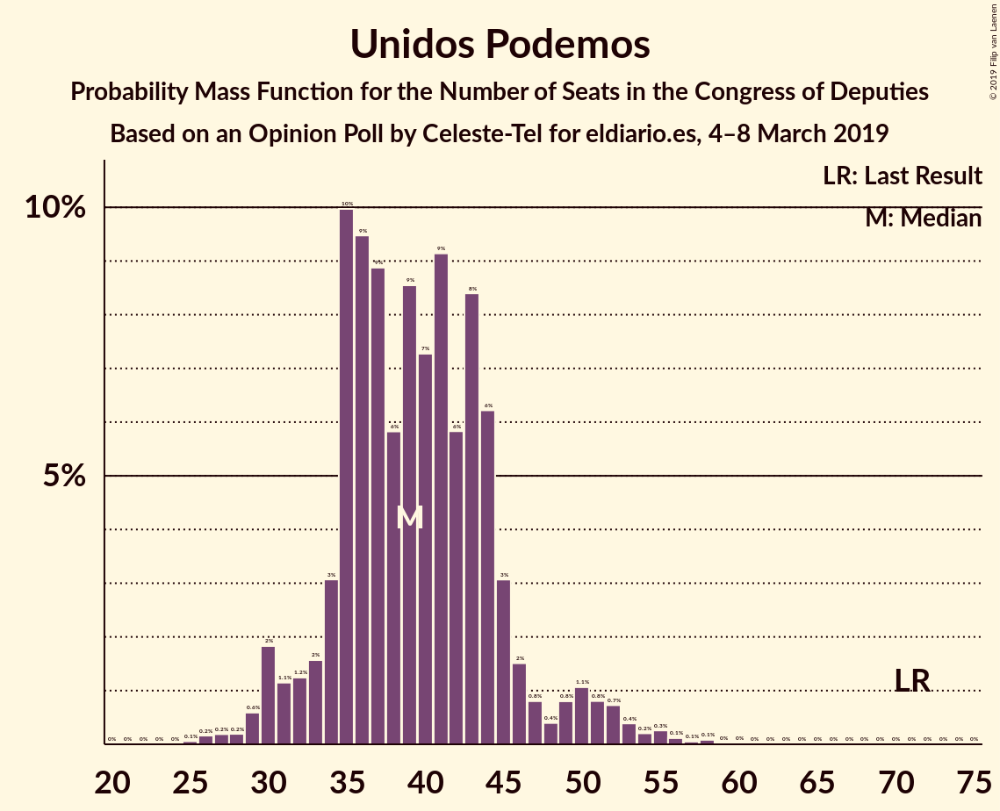
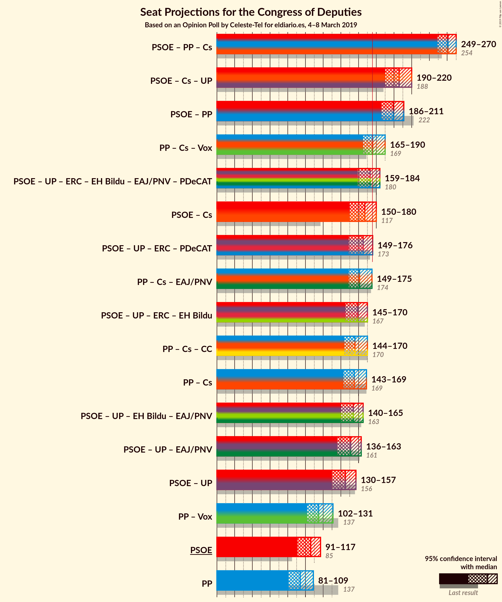
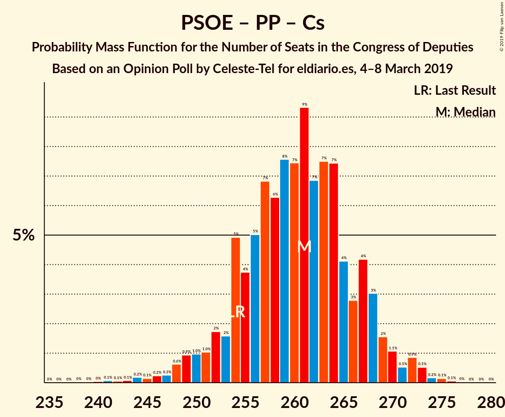
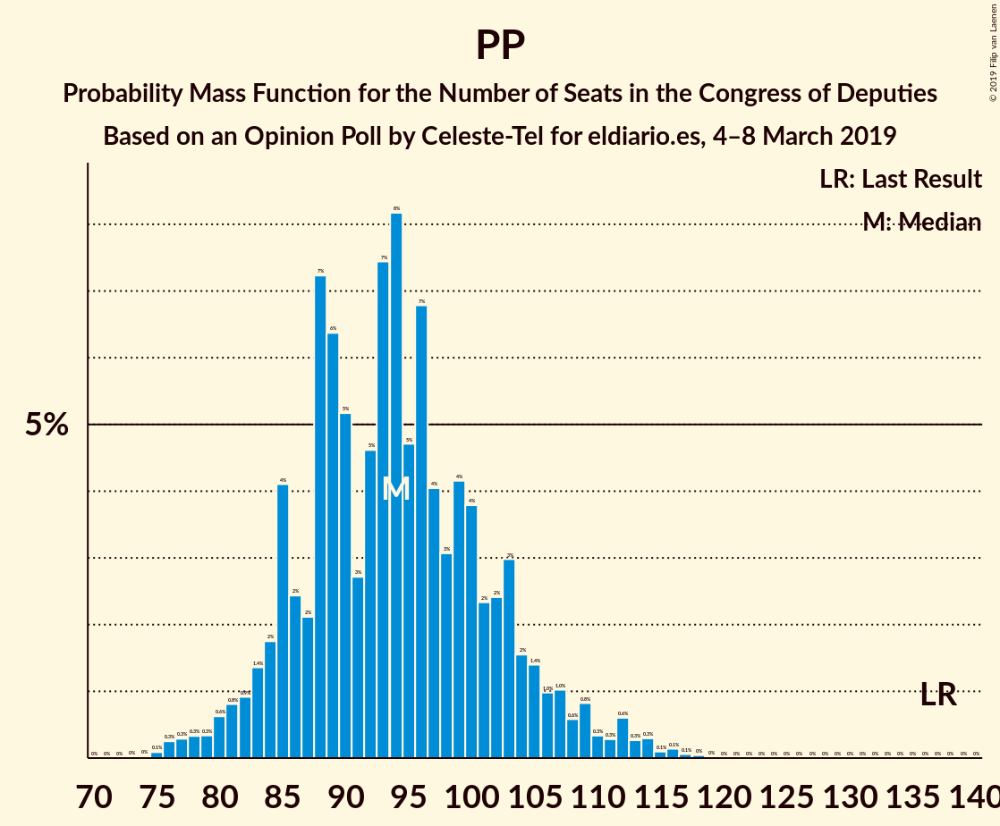

# Opinion Poll by Celeste-Tel for eldiario.es, 4–8 March 2019

<a href="#voting-intentions">Voting Intentions</a> | <a href="#seats">Seats</a> | <a href="#coalitions">Coalitions</a> | <a href="#technical-information">Technical Information</a>

## Voting Intentions

### Confidence Intervals

| Party | Last Result | Poll Result | 80% Confidence Interval | 90% Confidence Interval | 95% Confidence Interval | 99% Confidence Interval |
|:-----:|:-----------:|:-----------:|:-----------------------:|:-----------------------:|:-----------------------:|:-----------------------:|
| Partido Socialista Obrero Español | 22.6% | 25.4% | 23.7–27.1% |23.3–27.6% |22.9–28.0% |22.1–28.9% |
| Partido Popular | 33.0% | 22.8% | 21.2–24.5% |20.8–25.0% |20.4–25.4% |19.7–26.2% |
| Ciudadanos–Partido de la Ciudadanía | 13.1% | 18.1% | 16.7–19.7% |16.3–20.1% |15.9–20.5% |15.3–21.2% |
| Unidos Podemos | 21.2% | 14.3% | 13.0–15.7% |12.6–16.1% |12.3–16.5% |11.7–17.2% |
| Vox | 0.2% | 9.6% | 8.6–10.9% |8.3–11.2% |8.0–11.5% |7.5–12.1% |

*Note:* The poll result column reflects the actual value used in the calculations. Published results may vary slightly, and in addition be rounded to fewer digits.

## Seats

### Confidence Intervals

| Party | Last Result | Median | 80% Confidence Interval | 90% Confidence Interval | 95% Confidence Interval | 99% Confidence Interval |
|:-----:|:-----------:|:------:|:-----------------------:|:-----------------------:|:-----------------------:|:-----------------------:|
| <a href="#partido-socialista-obrero-español">Partido Socialista Obrero Español</a> | 85 | 115 | 106–119 |106–120 |89–120 |86–121 |
| <a href="#partido-popular">Partido Popular</a> | 137 | 84 | 75–92 |75–101 |74–116 |74–118 |
| <a href="#ciudadanos–partido-de-la-ciudadanía">Ciudadanos–Partido de la Ciudadanía</a> | 32 | 59 | 52–69 |52–73 |51–74 |51–74 |
| <a href="#unidos-podemos">Unidos Podemos</a> | 71 | 48 | 41–48 |37–49 |31–49 |26–50 |
| <a href="#vox">Vox</a> | 0 | 17 | 16–23 |13–26 |11–26 |11–29 |

### Partido Socialista Obrero Español

*For a full overview of the results for this party, see the [Partido Socialista Obrero Español](party-partidosocialistaobreroespañol.html) page.*

| Number of Seats | Probability | Accumulated | Special Marks |
|:---------------:|:-----------:|:-----------:|:-------------:|
| 80 | 0% | 100% |  |
| 81 | 0% | 99.9% |  |
| 82 | 0% | 99.9% |  |
| 83 | 0% | 99.9% |  |
| 84 | 0% | 99.9% |  |
| 85 | 0% | 99.9% | Last Result |
| 86 | 0.8% | 99.9% |  |
| 87 | 0.1% | 99.1% |  |
| 88 | 0.5% | 99.0% |  |
| 89 | 2% | 98% |  |
| 90 | 0.1% | 96% |  |
| 91 | 0.4% | 96% |  |
| 92 | 0.7% | 96% |  |
| 93 | 0% | 95% |  |
| 94 | 0% | 95% |  |
| 95 | 0% | 95% |  |
| 96 | 0% | 95% |  |
| 97 | 0% | 95% |  |
| 98 | 0.1% | 95% |  |
| 99 | 0% | 95% |  |
| 100 | 0% | 95% |  |
| 101 | 0% | 95% |  |
| 102 | 0% | 95% |  |
| 103 | 0% | 95% |  |
| 104 | 0% | 95% |  |
| 105 | 0% | 95% |  |
| 106 | 5% | 95% |  |
| 107 | 0.8% | 90% |  |
| 108 | 1.5% | 89% |  |
| 109 | 2% | 88% |  |
| 110 | 0.9% | 86% |  |
| 111 | 0% | 85% |  |
| 112 | 0% | 85% |  |
| 113 | 5% | 85% |  |
| 114 | 4% | 80% |  |
| 115 | 46% | 76% | Median |
| 116 | 8% | 29% |  |
| 117 | 0% | 21% |  |
| 118 | 0% | 21% |  |
| 119 | 15% | 21% |  |
| 120 | 5% | 6% |  |
| 121 | 1.0% | 2% |  |
| 122 | 0% | 0.5% |  |
| 123 | 0.2% | 0.4% |  |
| 124 | 0% | 0.2% |  |
| 125 | 0.1% | 0.2% |  |
| 126 | 0% | 0.1% |  |
| 127 | 0% | 0.1% |  |
| 128 | 0% | 0.1% |  |
| 129 | 0.1% | 0.1% |  |
| 130 | 0% | 0% |  |

### Partido Popular

*For a full overview of the results for this party, see the [Partido Popular](party-partidopopular.html) page.*

| Number of Seats | Probability | Accumulated | Special Marks |
|:---------------:|:-----------:|:-----------:|:-------------:|
| 74 | 4% | 100% |  |
| 75 | 9% | 96% |  |
| 76 | 0% | 87% |  |
| 77 | 0% | 87% |  |
| 78 | 0% | 87% |  |
| 79 | 0.1% | 87% |  |
| 80 | 2% | 87% |  |
| 81 | 0% | 85% |  |
| 82 | 0% | 85% |  |
| 83 | 4% | 84% |  |
| 84 | 49% | 80% | Median |
| 85 | 14% | 31% |  |
| 86 | 6% | 17% |  |
| 87 | 0.1% | 11% |  |
| 88 | 0.2% | 11% |  |
| 89 | 0.3% | 11% |  |
| 90 | 0.6% | 11% |  |
| 91 | 0% | 10% |  |
| 92 | 0.2% | 10% |  |
| 93 | 5% | 10% |  |
| 94 | 0% | 5% |  |
| 95 | 0% | 5% |  |
| 96 | 0% | 5% |  |
| 97 | 0% | 5% |  |
| 98 | 0% | 5% |  |
| 99 | 0% | 5% |  |
| 100 | 0% | 5% |  |
| 101 | 0.3% | 5% |  |
| 102 | 0% | 5% |  |
| 103 | 0.3% | 5% |  |
| 104 | 0% | 5% |  |
| 105 | 0% | 5% |  |
| 106 | 0.1% | 5% |  |
| 107 | 0.6% | 4% |  |
| 108 | 0.2% | 4% |  |
| 109 | 0.1% | 4% |  |
| 110 | 0% | 4% |  |
| 111 | 0% | 4% |  |
| 112 | 0% | 4% |  |
| 113 | 0.1% | 4% |  |
| 114 | 0% | 4% |  |
| 115 | 0% | 3% |  |
| 116 | 2% | 3% |  |
| 117 | 0.8% | 2% |  |
| 118 | 0.8% | 0.8% |  |
| 119 | 0% | 0% |  |
| 120 | 0% | 0% |  |
| 121 | 0% | 0% |  |
| 122 | 0% | 0% |  |
| 123 | 0% | 0% |  |
| 124 | 0% | 0% |  |
| 125 | 0% | 0% |  |
| 126 | 0% | 0% |  |
| 127 | 0% | 0% |  |
| 128 | 0% | 0% |  |
| 129 | 0% | 0% |  |
| 130 | 0% | 0% |  |
| 131 | 0% | 0% |  |
| 132 | 0% | 0% |  |
| 133 | 0% | 0% |  |
| 134 | 0% | 0% |  |
| 135 | 0% | 0% |  |
| 136 | 0% | 0% |  |
| 137 | 0% | 0% | Last Result |

### Ciudadanos–Partido de la Ciudadanía

*For a full overview of the results for this party, see the [Ciudadanos–Partido de la Ciudadanía](party-ciudadanos–partidodelaciudadanía.html) page.*

| Number of Seats | Probability | Accumulated | Special Marks |
|:---------------:|:-----------:|:-----------:|:-------------:|
| 32 | 0% | 100% | Last Result |
| 33 | 0% | 100% |  |
| 34 | 0% | 100% |  |
| 35 | 0% | 100% |  |
| 36 | 0% | 100% |  |
| 37 | 0% | 100% |  |
| 38 | 0% | 100% |  |
| 39 | 0% | 100% |  |
| 40 | 0% | 100% |  |
| 41 | 0% | 100% |  |
| 42 | 0% | 100% |  |
| 43 | 0% | 100% |  |
| 44 | 0% | 100% |  |
| 45 | 0.1% | 100% |  |
| 46 | 0% | 99.9% |  |
| 47 | 0% | 99.9% |  |
| 48 | 0% | 99.9% |  |
| 49 | 0.1% | 99.9% |  |
| 50 | 0.3% | 99.9% |  |
| 51 | 2% | 99.5% |  |
| 52 | 18% | 97% |  |
| 53 | 0.4% | 79% |  |
| 54 | 0% | 79% |  |
| 55 | 0% | 79% |  |
| 56 | 0% | 79% |  |
| 57 | 0% | 79% |  |
| 58 | 0.1% | 79% |  |
| 59 | 53% | 79% | Median |
| 60 | 0% | 26% |  |
| 61 | 4% | 26% |  |
| 62 | 0.8% | 21% |  |
| 63 | 0% | 21% |  |
| 64 | 4% | 21% |  |
| 65 | 0.3% | 17% |  |
| 66 | 0% | 16% |  |
| 67 | 0% | 16% |  |
| 68 | 5% | 16% |  |
| 69 | 5% | 12% |  |
| 70 | 0% | 7% |  |
| 71 | 1.2% | 7% |  |
| 72 | 0.2% | 5% |  |
| 73 | 1.0% | 5% |  |
| 74 | 4% | 4% |  |
| 75 | 0% | 0% |  |

### Unidos Podemos

*For a full overview of the results for this party, see the [Unidos Podemos](party-unidospodemos.html) page.*

| Number of Seats | Probability | Accumulated | Special Marks |
|:---------------:|:-----------:|:-----------:|:-------------:|
| 24 | 0.1% | 100% |  |
| 25 | 0% | 99.9% |  |
| 26 | 0.8% | 99.9% |  |
| 27 | 0.1% | 99.1% |  |
| 28 | 0.7% | 99.0% |  |
| 29 | 0.3% | 98% |  |
| 30 | 0% | 98% |  |
| 31 | 0.7% | 98% |  |
| 32 | 0% | 97% |  |
| 33 | 0.1% | 97% |  |
| 34 | 0.6% | 97% |  |
| 35 | 0.2% | 97% |  |
| 36 | 0% | 96% |  |
| 37 | 3% | 96% |  |
| 38 | 0.4% | 94% |  |
| 39 | 1.0% | 93% |  |
| 40 | 1.2% | 92% |  |
| 41 | 7% | 91% |  |
| 42 | 12% | 84% |  |
| 43 | 5% | 72% |  |
| 44 | 11% | 67% |  |
| 45 | 0% | 56% |  |
| 46 | 0% | 56% |  |
| 47 | 0% | 56% |  |
| 48 | 48% | 56% | Median |
| 49 | 6% | 7% |  |
| 50 | 1.5% | 2% |  |
| 51 | 0% | 0.3% |  |
| 52 | 0% | 0.3% |  |
| 53 | 0% | 0.3% |  |
| 54 | 0% | 0.3% |  |
| 55 | 0.3% | 0.3% |  |
| 56 | 0% | 0% |  |
| 57 | 0% | 0% |  |
| 58 | 0% | 0% |  |
| 59 | 0% | 0% |  |
| 60 | 0% | 0% |  |
| 61 | 0% | 0% |  |
| 62 | 0% | 0% |  |
| 63 | 0% | 0% |  |
| 64 | 0% | 0% |  |
| 65 | 0% | 0% |  |
| 66 | 0% | 0% |  |
| 67 | 0% | 0% |  |
| 68 | 0% | 0% |  |
| 69 | 0% | 0% |  |
| 70 | 0% | 0% |  |
| 71 | 0% | 0% | Last Result |

### Vox

*For a full overview of the results for this party, see the [Vox](party-vox.html) page.*

| Number of Seats | Probability | Accumulated | Special Marks |
|:---------------:|:-----------:|:-----------:|:-------------:|
| 0 | 0% | 100% | Last Result |
| 1 | 0% | 100% |  |
| 2 | 0% | 100% |  |
| 3 | 0% | 100% |  |
| 4 | 0% | 100% |  |
| 5 | 0% | 100% |  |
| 6 | 0% | 100% |  |
| 7 | 0% | 100% |  |
| 8 | 0% | 100% |  |
| 9 | 0.1% | 100% |  |
| 10 | 0% | 99.9% |  |
| 11 | 5% | 99.9% |  |
| 12 | 0.1% | 95% |  |
| 13 | 0.8% | 95% |  |
| 14 | 0% | 94% |  |
| 15 | 0% | 94% |  |
| 16 | 8% | 94% |  |
| 17 | 45% | 86% | Median |
| 18 | 3% | 41% |  |
| 19 | 3% | 38% |  |
| 20 | 0.3% | 35% |  |
| 21 | 9% | 35% |  |
| 22 | 0% | 26% |  |
| 23 | 19% | 26% |  |
| 24 | 0% | 6% |  |
| 25 | 0.6% | 6% |  |
| 26 | 4% | 6% |  |
| 27 | 0.2% | 2% |  |
| 28 | 1.4% | 2% |  |
| 29 | 0.2% | 0.5% |  |
| 30 | 0.1% | 0.3% |  |
| 31 | 0% | 0.2% |  |
| 32 | 0% | 0.2% |  |
| 33 | 0.1% | 0.2% |  |
| 34 | 0% | 0.1% |  |
| 35 | 0% | 0.1% |  |
| 36 | 0% | 0.1% |  |
| 37 | 0% | 0.1% |  |
| 38 | 0% | 0.1% |  |
| 39 | 0% | 0.1% |  |
| 40 | 0% | 0.1% |  |
| 41 | 0% | 0% |  |

## Coalitions

### Confidence Intervals

| Coalition | Last Result | Median | Majority? | 80% Confidence Interval | 90% Confidence Interval | 95% Confidence Interval | 99% Confidence Interval |
|:---------:|:-----------:|:------:|:---------:|:-----------------------:|:-----------------------:|:-----------------------:|:-----------------------:|
| Partido Socialista Obrero Español – Partido Popular – Ciudadanos–Partido de la Ciudadanía | 254 | 258 | 100% | 256–263 | 255–264 | 254–264 | 253–280 |
| Partido Socialista Obrero Español – Ciudadanos–Partido de la Ciudadanía – Unidos Podemos | 188 | 222 | 99.9% | 213–224 | 204–226 | 185–226 | 177–226 |
| Partido Socialista Obrero Español – Partido Popular | 222 | 199 | 100% | 189–205 | 188–206 | 187–207 | 186–210 |
| Partido Popular – Ciudadanos–Partido de la Ciudadanía – Vox | 169 | 160 | 5% | 160–172 | 159–176 | 159–194 | 159–204 |
| Partido Socialista Obrero Español – Ciudadanos–Partido de la Ciudadanía | 117 | 174 | 20% | 170–182 | 169–182 | 148–182 | 141–190 |
| Partido Popular – Ciudadanos–Partido de la Ciudadanía | 169 | 143 | 1.4% | 137–154 | 137–161 | 137–175 | 136–178 |
| Partido Socialista Obrero Español – Unidos Podemos | 156 | 163 | 0% | 150–163 | 145–164 | 126–164 | 117–164 |
| Partido Popular – Vox | 137 | 101 | 0% | 98–109 | 96–117 | 96–135 | 96–143 |
| Partido Socialista Obrero Español | 85 | 115 | 0% | 106–119 | 106–120 | 89–120 | 86–121 |
| Partido Popular | 137 | 84 | 0% | 75–92 | 75–101 | 74–116 | 74–118 |

### Partido Socialista Obrero Español – Partido Popular – Ciudadanos–Partido de la Ciudadanía

| Number of Seats | Probability | Accumulated | Special Marks |
|:---------------:|:-----------:|:-----------:|:-------------:|
| 239 | 0% | 100% |  |
| 240 | 0.3% | 99.9% |  |
| 241 | 0% | 99.7% |  |
| 242 | 0% | 99.7% |  |
| 243 | 0% | 99.7% |  |
| 244 | 0% | 99.7% |  |
| 245 | 0% | 99.7% |  |
| 246 | 0% | 99.7% |  |
| 247 | 0% | 99.6% |  |
| 248 | 0% | 99.6% |  |
| 249 | 0% | 99.6% |  |
| 250 | 0% | 99.6% |  |
| 251 | 0% | 99.6% |  |
| 252 | 0% | 99.6% |  |
| 253 | 1.4% | 99.6% |  |
| 254 | 3% | 98% | Last Result |
| 255 | 2% | 96% |  |
| 256 | 13% | 94% |  |
| 257 | 11% | 81% |  |
| 258 | 47% | 70% | Median |
| 259 | 6% | 23% |  |
| 260 | 3% | 16% |  |
| 261 | 0.7% | 14% |  |
| 262 | 2% | 13% |  |
| 263 | 5% | 11% |  |
| 264 | 4% | 6% |  |
| 265 | 0.5% | 2% |  |
| 266 | 0% | 2% |  |
| 267 | 0% | 2% |  |
| 268 | 0% | 2% |  |
| 269 | 0% | 2% |  |
| 270 | 0% | 2% |  |
| 271 | 0.2% | 2% |  |
| 272 | 0% | 2% |  |
| 273 | 0.1% | 2% |  |
| 274 | 0.1% | 2% |  |
| 275 | 0.2% | 1.5% |  |
| 276 | 0.2% | 1.3% |  |
| 277 | 0% | 1.0% |  |
| 278 | 0.1% | 1.0% |  |
| 279 | 0.4% | 0.9% |  |
| 280 | 0.4% | 0.6% |  |
| 281 | 0.1% | 0.1% |  |
| 282 | 0% | 0% |  |

### Partido Socialista Obrero Español – Ciudadanos–Partido de la Ciudadanía – Unidos Podemos

| Number of Seats | Probability | Accumulated | Special Marks |
|:---------------:|:-----------:|:-----------:|:-------------:|
| 175 | 0% | 100% |  |
| 176 | 0.3% | 99.9% | Majority |
| 177 | 0.6% | 99.7% |  |
| 178 | 0% | 99.1% |  |
| 179 | 0% | 99.1% |  |
| 180 | 0% | 99.1% |  |
| 181 | 0% | 99.1% |  |
| 182 | 0.2% | 99.1% |  |
| 183 | 0.1% | 98.9% |  |
| 184 | 0.4% | 98.8% |  |
| 185 | 2% | 98% |  |
| 186 | 0% | 96% |  |
| 187 | 0% | 96% |  |
| 188 | 0.6% | 96% | Last Result |
| 189 | 0.1% | 95% |  |
| 190 | 0% | 95% |  |
| 191 | 0% | 95% |  |
| 192 | 0.1% | 95% |  |
| 193 | 0% | 95% |  |
| 194 | 0.2% | 95% |  |
| 195 | 0% | 95% |  |
| 196 | 0% | 95% |  |
| 197 | 0% | 95% |  |
| 198 | 0% | 95% |  |
| 199 | 0% | 95% |  |
| 200 | 0% | 95% |  |
| 201 | 0% | 95% |  |
| 202 | 0% | 95% |  |
| 203 | 0% | 95% |  |
| 204 | 0% | 95% |  |
| 205 | 0.3% | 95% |  |
| 206 | 0% | 95% |  |
| 207 | 0% | 95% |  |
| 208 | 0.1% | 95% |  |
| 209 | 0.1% | 95% |  |
| 210 | 0% | 95% |  |
| 211 | 0.1% | 95% |  |
| 212 | 0% | 95% |  |
| 213 | 20% | 94% |  |
| 214 | 0.1% | 74% |  |
| 215 | 0% | 74% |  |
| 216 | 0% | 74% |  |
| 217 | 0.3% | 74% |  |
| 218 | 2% | 74% |  |
| 219 | 3% | 72% |  |
| 220 | 1.1% | 69% |  |
| 221 | 3% | 67% |  |
| 222 | 44% | 65% | Median |
| 223 | 9% | 21% |  |
| 224 | 2% | 11% |  |
| 225 | 0.5% | 9% |  |
| 226 | 9% | 9% |  |
| 227 | 0% | 0% |  |

### Partido Socialista Obrero Español – Partido Popular

| Number of Seats | Probability | Accumulated | Special Marks |
|:---------------:|:-----------:|:-----------:|:-------------:|
| 186 | 2% | 100% |  |
| 187 | 0.2% | 98% |  |
| 188 | 5% | 97% |  |
| 189 | 7% | 92% |  |
| 190 | 3% | 85% |  |
| 191 | 0.2% | 81% |  |
| 192 | 0.1% | 81% |  |
| 193 | 0.5% | 81% |  |
| 194 | 0% | 81% |  |
| 195 | 0.1% | 81% |  |
| 196 | 0% | 80% |  |
| 197 | 0.3% | 80% |  |
| 198 | 2% | 80% |  |
| 199 | 43% | 78% | Median |
| 200 | 6% | 35% |  |
| 201 | 2% | 29% |  |
| 202 | 2% | 27% |  |
| 203 | 0.9% | 26% |  |
| 204 | 14% | 25% |  |
| 205 | 2% | 11% |  |
| 206 | 5% | 9% |  |
| 207 | 1.3% | 4% |  |
| 208 | 0.3% | 2% |  |
| 209 | 0.8% | 2% |  |
| 210 | 0.8% | 1.2% |  |
| 211 | 0% | 0.5% |  |
| 212 | 0% | 0.4% |  |
| 213 | 0% | 0.4% |  |
| 214 | 0% | 0.4% |  |
| 215 | 0% | 0.4% |  |
| 216 | 0% | 0.4% |  |
| 217 | 0% | 0.4% |  |
| 218 | 0.1% | 0.4% |  |
| 219 | 0% | 0.4% |  |
| 220 | 0% | 0.4% |  |
| 221 | 0.1% | 0.4% |  |
| 222 | 0% | 0.3% | Last Result |
| 223 | 0% | 0.3% |  |
| 224 | 0% | 0.3% |  |
| 225 | 0% | 0.3% |  |
| 226 | 0.3% | 0.3% |  |
| 227 | 0% | 0% |  |

### Partido Popular – Ciudadanos–Partido de la Ciudadanía – Vox

| Number of Seats | Probability | Accumulated | Special Marks |
|:---------------:|:-----------:|:-----------:|:-------------:|
| 159 | 9% | 100% |  |
| 160 | 55% | 91% | Median |
| 161 | 6% | 36% |  |
| 162 | 0% | 30% |  |
| 163 | 0.1% | 30% |  |
| 164 | 7% | 30% |  |
| 165 | 9% | 23% |  |
| 166 | 2% | 14% |  |
| 167 | 0% | 12% |  |
| 168 | 0.1% | 12% |  |
| 169 | 0.2% | 12% | Last Result |
| 170 | 0% | 12% |  |
| 171 | 0.1% | 12% |  |
| 172 | 2% | 12% |  |
| 173 | 3% | 9% |  |
| 174 | 0.4% | 6% |  |
| 175 | 0.1% | 6% |  |
| 176 | 0.5% | 5% | Majority |
| 177 | 0% | 5% |  |
| 178 | 0% | 5% |  |
| 179 | 0% | 5% |  |
| 180 | 0.1% | 5% |  |
| 181 | 0.2% | 5% |  |
| 182 | 0% | 5% |  |
| 183 | 0% | 5% |  |
| 184 | 0% | 5% |  |
| 185 | 0% | 5% |  |
| 186 | 0% | 5% |  |
| 187 | 0% | 5% |  |
| 188 | 0% | 5% |  |
| 189 | 0% | 5% |  |
| 190 | 0.1% | 5% |  |
| 191 | 0.1% | 5% |  |
| 192 | 0% | 5% |  |
| 193 | 0% | 5% |  |
| 194 | 3% | 4% |  |
| 195 | 0.5% | 1.4% |  |
| 196 | 0% | 0.9% |  |
| 197 | 0% | 0.9% |  |
| 198 | 0% | 0.9% |  |
| 199 | 0% | 0.9% |  |
| 200 | 0% | 0.9% |  |
| 201 | 0% | 0.9% |  |
| 202 | 0.1% | 0.9% |  |
| 203 | 0.2% | 0.9% |  |
| 204 | 0.7% | 0.7% |  |
| 205 | 0% | 0% |  |

### Partido Socialista Obrero Español – Ciudadanos–Partido de la Ciudadanía

| Number of Seats | Probability | Accumulated | Special Marks |
|:---------------:|:-----------:|:-----------:|:-------------:|
| 117 | 0% | 100% | Last Result |
| 118 | 0% | 100% |  |
| 119 | 0% | 100% |  |
| 120 | 0% | 100% |  |
| 121 | 0% | 100% |  |
| 122 | 0% | 100% |  |
| 123 | 0% | 100% |  |
| 124 | 0% | 100% |  |
| 125 | 0% | 100% |  |
| 126 | 0% | 100% |  |
| 127 | 0% | 100% |  |
| 128 | 0% | 100% |  |
| 129 | 0% | 100% |  |
| 130 | 0% | 100% |  |
| 131 | 0% | 100% |  |
| 132 | 0% | 100% |  |
| 133 | 0% | 100% |  |
| 134 | 0% | 100% |  |
| 135 | 0% | 100% |  |
| 136 | 0% | 100% |  |
| 137 | 0% | 100% |  |
| 138 | 0.1% | 100% |  |
| 139 | 0.3% | 99.9% |  |
| 140 | 0% | 99.7% |  |
| 141 | 0.3% | 99.6% |  |
| 142 | 0% | 99.4% |  |
| 143 | 0.6% | 99.3% |  |
| 144 | 0% | 98.7% |  |
| 145 | 0% | 98.7% |  |
| 146 | 0% | 98.7% |  |
| 147 | 0.5% | 98.7% |  |
| 148 | 2% | 98% |  |
| 149 | 0% | 96% |  |
| 150 | 0% | 96% |  |
| 151 | 0% | 96% |  |
| 152 | 0% | 96% |  |
| 153 | 0% | 96% |  |
| 154 | 0% | 96% |  |
| 155 | 0% | 96% |  |
| 156 | 0.2% | 96% |  |
| 157 | 0.6% | 96% |  |
| 158 | 0.1% | 95% |  |
| 159 | 0% | 95% |  |
| 160 | 0% | 95% |  |
| 161 | 0% | 95% |  |
| 162 | 0% | 95% |  |
| 163 | 0% | 95% |  |
| 164 | 0% | 95% |  |
| 165 | 0% | 95% |  |
| 166 | 0% | 95% |  |
| 167 | 0% | 95% |  |
| 168 | 0% | 95% |  |
| 169 | 2% | 95% |  |
| 170 | 3% | 93% |  |
| 171 | 13% | 89% |  |
| 172 | 5% | 76% |  |
| 173 | 1.3% | 72% |  |
| 174 | 45% | 70% | Median |
| 175 | 5% | 25% |  |
| 176 | 0.2% | 20% | Majority |
| 177 | 0% | 20% |  |
| 178 | 0% | 20% |  |
| 179 | 2% | 20% |  |
| 180 | 7% | 17% |  |
| 181 | 0.5% | 11% |  |
| 182 | 9% | 10% |  |
| 183 | 0% | 1.4% |  |
| 184 | 0% | 1.4% |  |
| 185 | 0% | 1.4% |  |
| 186 | 0% | 1.4% |  |
| 187 | 0.7% | 1.4% |  |
| 188 | 0% | 0.7% |  |
| 189 | 0% | 0.7% |  |
| 190 | 0.5% | 0.7% |  |
| 191 | 0.1% | 0.1% |  |
| 192 | 0% | 0% |  |

### Partido Popular – Ciudadanos–Partido de la Ciudadanía

| Number of Seats | Probability | Accumulated | Special Marks |
|:---------------:|:-----------:|:-----------:|:-------------:|
| 136 | 2% | 100% |  |
| 137 | 12% | 98% |  |
| 138 | 9% | 86% |  |
| 139 | 0.2% | 77% |  |
| 140 | 0% | 76% |  |
| 141 | 0% | 76% |  |
| 142 | 3% | 76% |  |
| 143 | 52% | 74% | Median |
| 144 | 5% | 22% |  |
| 145 | 0% | 17% |  |
| 146 | 0.1% | 17% |  |
| 147 | 0% | 17% |  |
| 148 | 0% | 17% |  |
| 149 | 0% | 17% |  |
| 150 | 0% | 17% |  |
| 151 | 0% | 17% |  |
| 152 | 0% | 17% |  |
| 153 | 0.2% | 17% |  |
| 154 | 7% | 16% |  |
| 155 | 0.8% | 10% |  |
| 156 | 0.4% | 9% |  |
| 157 | 3% | 8% |  |
| 158 | 0.1% | 5% |  |
| 159 | 0% | 5% |  |
| 160 | 0.1% | 5% |  |
| 161 | 0.6% | 5% |  |
| 162 | 0% | 5% |  |
| 163 | 0% | 5% |  |
| 164 | 0.1% | 5% |  |
| 165 | 0% | 4% |  |
| 166 | 0% | 4% |  |
| 167 | 0% | 4% |  |
| 168 | 0.3% | 4% |  |
| 169 | 0.6% | 4% | Last Result |
| 170 | 0% | 4% |  |
| 171 | 0% | 4% |  |
| 172 | 0% | 4% |  |
| 173 | 0.2% | 4% |  |
| 174 | 0.1% | 3% |  |
| 175 | 2% | 3% |  |
| 176 | 0.7% | 1.4% | Majority |
| 177 | 0% | 0.7% |  |
| 178 | 0.7% | 0.7% |  |
| 179 | 0% | 0% |  |

### Partido Socialista Obrero Español – Unidos Podemos

| Number of Seats | Probability | Accumulated | Special Marks |
|:---------------:|:-----------:|:-----------:|:-------------:|
| 117 | 0.9% | 100% |  |
| 118 | 0.1% | 99.1% |  |
| 119 | 0% | 99.1% |  |
| 120 | 0% | 99.1% |  |
| 121 | 0% | 99.1% |  |
| 122 | 0% | 99.1% |  |
| 123 | 0% | 99.1% |  |
| 124 | 0% | 99.1% |  |
| 125 | 0.4% | 99.1% |  |
| 126 | 3% | 98.6% |  |
| 127 | 0% | 96% |  |
| 128 | 0% | 95% |  |
| 129 | 0% | 95% |  |
| 130 | 0% | 95% |  |
| 131 | 0% | 95% |  |
| 132 | 0% | 95% |  |
| 133 | 0% | 95% |  |
| 134 | 0% | 95% |  |
| 135 | 0% | 95% |  |
| 136 | 0% | 95% |  |
| 137 | 0% | 95% |  |
| 138 | 0% | 95% |  |
| 139 | 0% | 95% |  |
| 140 | 0% | 95% |  |
| 141 | 0.2% | 95% |  |
| 142 | 0.1% | 95% |  |
| 143 | 0% | 95% |  |
| 144 | 0% | 95% |  |
| 145 | 0.6% | 95% |  |
| 146 | 0% | 94% |  |
| 147 | 0.5% | 94% |  |
| 148 | 0.2% | 94% |  |
| 149 | 3% | 94% |  |
| 150 | 2% | 91% |  |
| 151 | 0.2% | 88% |  |
| 152 | 0.2% | 88% |  |
| 153 | 0.4% | 88% |  |
| 154 | 1.0% | 88% |  |
| 155 | 0% | 87% |  |
| 156 | 0.9% | 87% | Last Result |
| 157 | 8% | 86% |  |
| 158 | 7% | 78% |  |
| 159 | 0.9% | 71% |  |
| 160 | 0% | 70% |  |
| 161 | 18% | 70% |  |
| 162 | 2% | 52% |  |
| 163 | 43% | 50% | Median |
| 164 | 8% | 8% |  |
| 165 | 0% | 0% |  |

### Partido Popular – Vox

| Number of Seats | Probability | Accumulated | Special Marks |
|:---------------:|:-----------:|:-----------:|:-------------:|
| 96 | 9% | 100% |  |
| 97 | 0.1% | 91% |  |
| 98 | 2% | 91% |  |
| 99 | 2% | 89% |  |
| 100 | 11% | 87% |  |
| 101 | 43% | 76% | Median |
| 102 | 2% | 32% |  |
| 103 | 0.6% | 31% |  |
| 104 | 5% | 30% |  |
| 105 | 0% | 26% |  |
| 106 | 0% | 26% |  |
| 107 | 0.1% | 26% |  |
| 108 | 14% | 25% |  |
| 109 | 6% | 11% |  |
| 110 | 0.1% | 5% |  |
| 111 | 0% | 5% |  |
| 112 | 0.1% | 5% |  |
| 113 | 0.1% | 5% |  |
| 114 | 0% | 5% |  |
| 115 | 0% | 5% |  |
| 116 | 0.3% | 5% |  |
| 117 | 0% | 5% |  |
| 118 | 0% | 5% |  |
| 119 | 0% | 5% |  |
| 120 | 0% | 5% |  |
| 121 | 0% | 5% |  |
| 122 | 0% | 5% |  |
| 123 | 0% | 5% |  |
| 124 | 0% | 5% |  |
| 125 | 0% | 5% |  |
| 126 | 0% | 5% |  |
| 127 | 0% | 5% |  |
| 128 | 0.2% | 5% |  |
| 129 | 0% | 5% |  |
| 130 | 0% | 5% |  |
| 131 | 0% | 5% |  |
| 132 | 0.1% | 5% |  |
| 133 | 0.5% | 5% |  |
| 134 | 0% | 4% |  |
| 135 | 2% | 4% |  |
| 136 | 0.4% | 2% |  |
| 137 | 0.1% | 1.2% | Last Result |
| 138 | 0.2% | 1.1% |  |
| 139 | 0% | 0.9% |  |
| 140 | 0% | 0.9% |  |
| 141 | 0% | 0.9% |  |
| 142 | 0% | 0.9% |  |
| 143 | 0.6% | 0.9% |  |
| 144 | 0.2% | 0.3% |  |
| 145 | 0% | 0.1% |  |
| 146 | 0.1% | 0.1% |  |
| 147 | 0% | 0% |  |

### Partido Socialista Obrero Español

| Number of Seats | Probability | Accumulated | Special Marks |
|:---------------:|:-----------:|:-----------:|:-------------:|
| 80 | 0% | 100% |  |
| 81 | 0% | 99.9% |  |
| 82 | 0% | 99.9% |  |
| 83 | 0% | 99.9% |  |
| 84 | 0% | 99.9% |  |
| 85 | 0% | 99.9% | Last Result |
| 86 | 0.8% | 99.9% |  |
| 87 | 0.1% | 99.1% |  |
| 88 | 0.5% | 99.0% |  |
| 89 | 2% | 98% |  |
| 90 | 0.1% | 96% |  |
| 91 | 0.4% | 96% |  |
| 92 | 0.7% | 96% |  |
| 93 | 0% | 95% |  |
| 94 | 0% | 95% |  |
| 95 | 0% | 95% |  |
| 96 | 0% | 95% |  |
| 97 | 0% | 95% |  |
| 98 | 0.1% | 95% |  |
| 99 | 0% | 95% |  |
| 100 | 0% | 95% |  |
| 101 | 0% | 95% |  |
| 102 | 0% | 95% |  |
| 103 | 0% | 95% |  |
| 104 | 0% | 95% |  |
| 105 | 0% | 95% |  |
| 106 | 5% | 95% |  |
| 107 | 0.8% | 90% |  |
| 108 | 1.5% | 89% |  |
| 109 | 2% | 88% |  |
| 110 | 0.9% | 86% |  |
| 111 | 0% | 85% |  |
| 112 | 0% | 85% |  |
| 113 | 5% | 85% |  |
| 114 | 4% | 80% |  |
| 115 | 46% | 76% | Median |
| 116 | 8% | 29% |  |
| 117 | 0% | 21% |  |
| 118 | 0% | 21% |  |
| 119 | 15% | 21% |  |
| 120 | 5% | 6% |  |
| 121 | 1.0% | 2% |  |
| 122 | 0% | 0.5% |  |
| 123 | 0.2% | 0.4% |  |
| 124 | 0% | 0.2% |  |
| 125 | 0.1% | 0.2% |  |
| 126 | 0% | 0.1% |  |
| 127 | 0% | 0.1% |  |
| 128 | 0% | 0.1% |  |
| 129 | 0.1% | 0.1% |  |
| 130 | 0% | 0% |  |

### Partido Popular

| Number of Seats | Probability | Accumulated | Special Marks |
|:---------------:|:-----------:|:-----------:|:-------------:|
| 74 | 4% | 100% |  |
| 75 | 9% | 96% |  |
| 76 | 0% | 87% |  |
| 77 | 0% | 87% |  |
| 78 | 0% | 87% |  |
| 79 | 0.1% | 87% |  |
| 80 | 2% | 87% |  |
| 81 | 0% | 85% |  |
| 82 | 0% | 85% |  |
| 83 | 4% | 84% |  |
| 84 | 49% | 80% | Median |
| 85 | 14% | 31% |  |
| 86 | 6% | 17% |  |
| 87 | 0.1% | 11% |  |
| 88 | 0.2% | 11% |  |
| 89 | 0.3% | 11% |  |
| 90 | 0.6% | 11% |  |
| 91 | 0% | 10% |  |
| 92 | 0.2% | 10% |  |
| 93 | 5% | 10% |  |
| 94 | 0% | 5% |  |
| 95 | 0% | 5% |  |
| 96 | 0% | 5% |  |
| 97 | 0% | 5% |  |
| 98 | 0% | 5% |  |
| 99 | 0% | 5% |  |
| 100 | 0% | 5% |  |
| 101 | 0.3% | 5% |  |
| 102 | 0% | 5% |  |
| 103 | 0.3% | 5% |  |
| 104 | 0% | 5% |  |
| 105 | 0% | 5% |  |
| 106 | 0.1% | 5% |  |
| 107 | 0.6% | 4% |  |
| 108 | 0.2% | 4% |  |
| 109 | 0.1% | 4% |  |
| 110 | 0% | 4% |  |
| 111 | 0% | 4% |  |
| 112 | 0% | 4% |  |
| 113 | 0.1% | 4% |  |
| 114 | 0% | 4% |  |
| 115 | 0% | 3% |  |
| 116 | 2% | 3% |  |
| 117 | 0.8% | 2% |  |
| 118 | 0.8% | 0.8% |  |
| 119 | 0% | 0% |  |
| 120 | 0% | 0% |  |
| 121 | 0% | 0% |  |
| 122 | 0% | 0% |  |
| 123 | 0% | 0% |  |
| 124 | 0% | 0% |  |
| 125 | 0% | 0% |  |
| 126 | 0% | 0% |  |
| 127 | 0% | 0% |  |
| 128 | 0% | 0% |  |
| 129 | 0% | 0% |  |
| 130 | 0% | 0% |  |
| 131 | 0% | 0% |  |
| 132 | 0% | 0% |  |
| 133 | 0% | 0% |  |
| 134 | 0% | 0% |  |
| 135 | 0% | 0% |  |
| 136 | 0% | 0% |  |
| 137 | 0% | 0% | Last Result |

## Technical Information

### Opinion Poll

+ **Polling firm:** Celeste-Tel
+ **Commissioner(s):** eldiario.es
+ **Fieldwork period:** 4–8 March 2019

### Calculations

+ **Sample size:** 1100
+ **Simulations done:** 1,024
+ **Error estimate:** 1.43%

