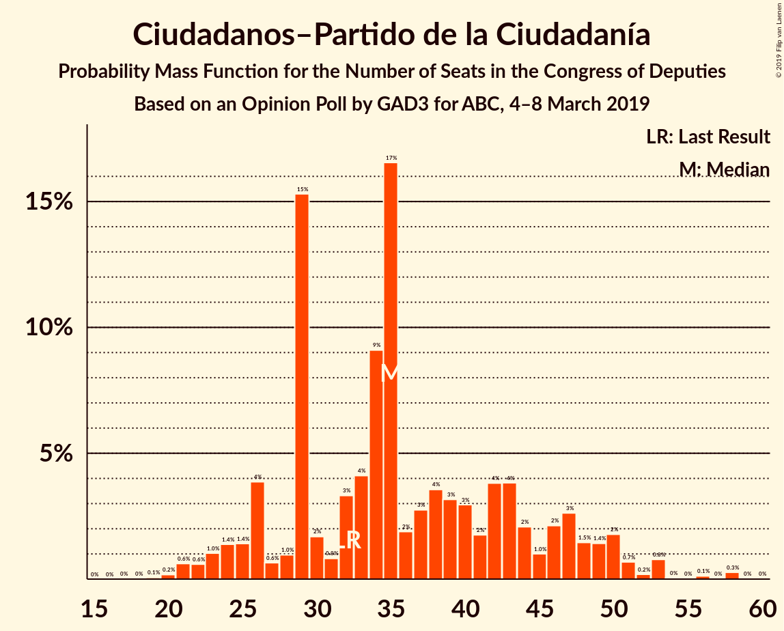
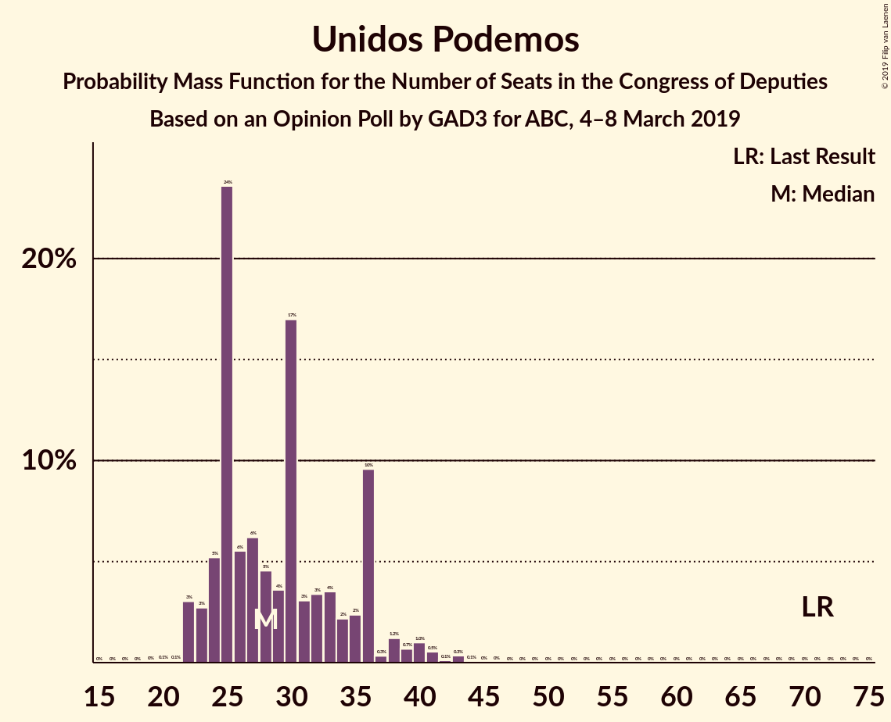
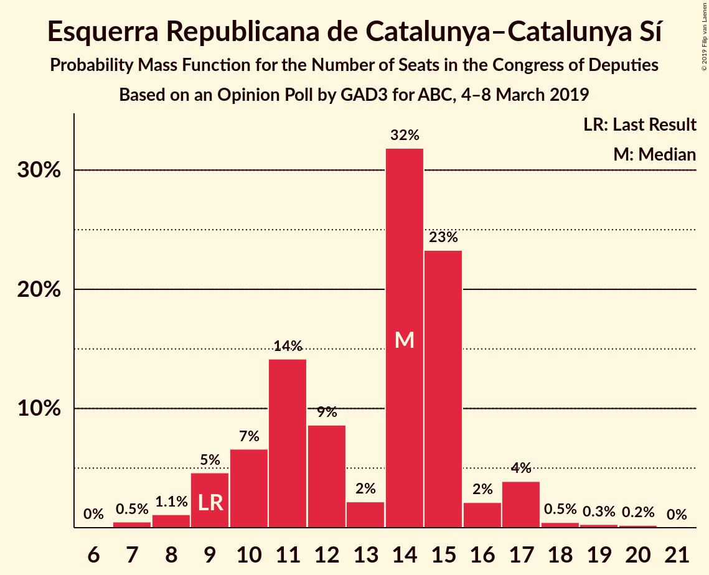
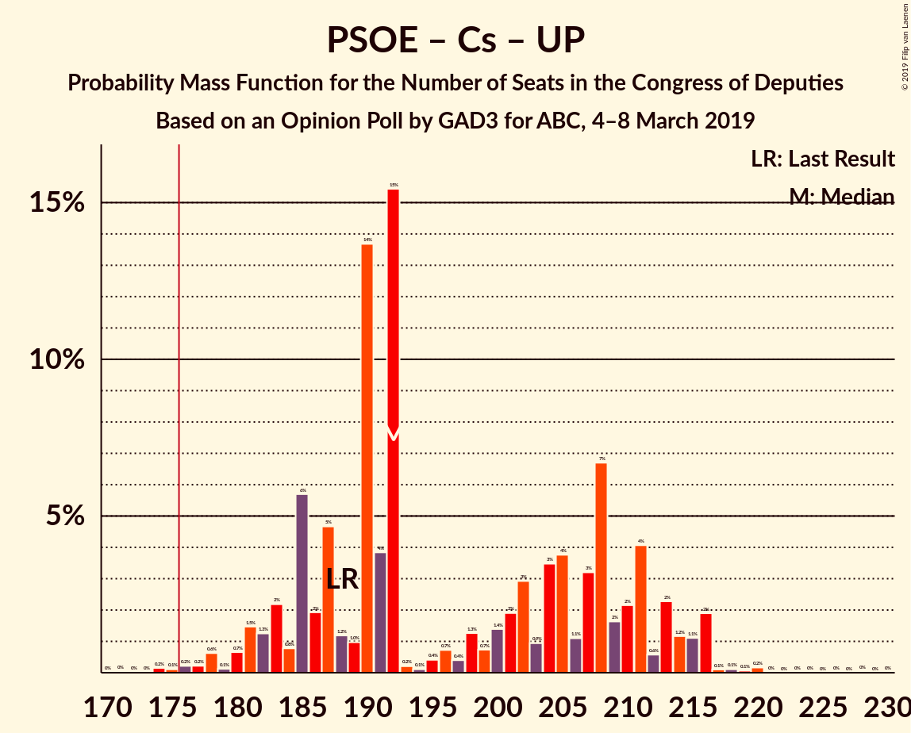
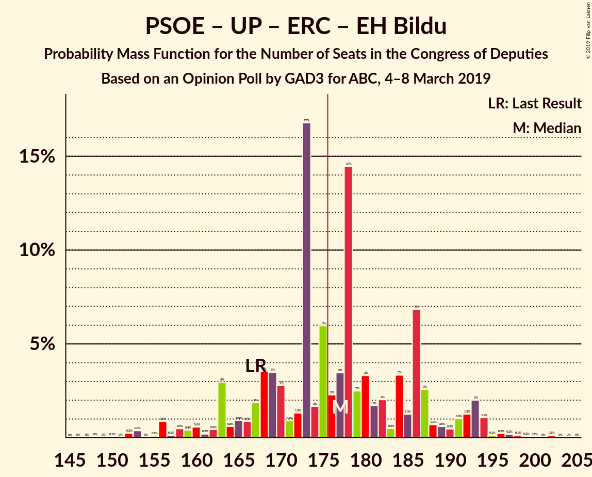
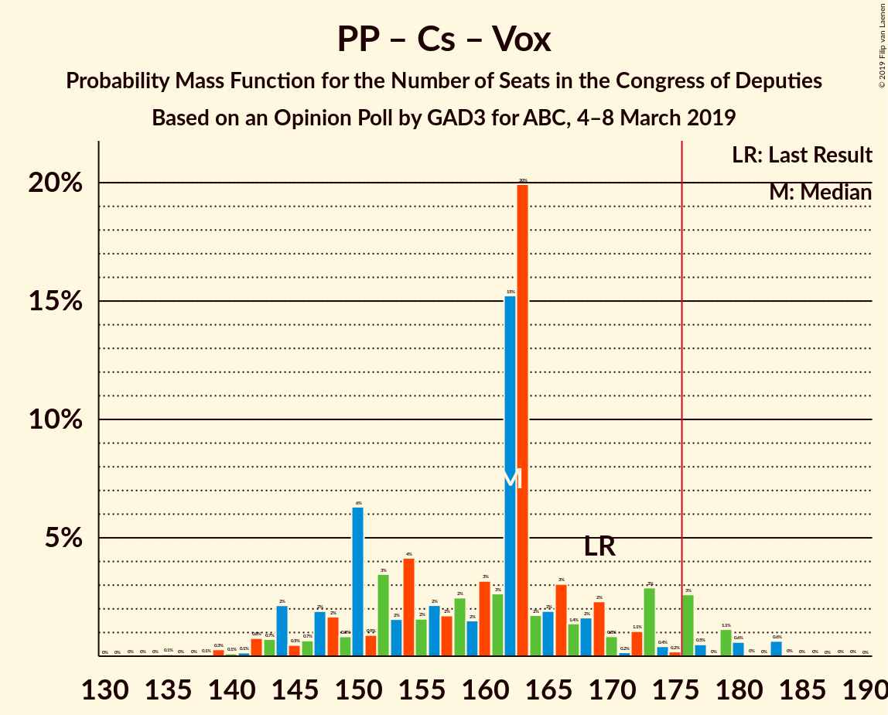
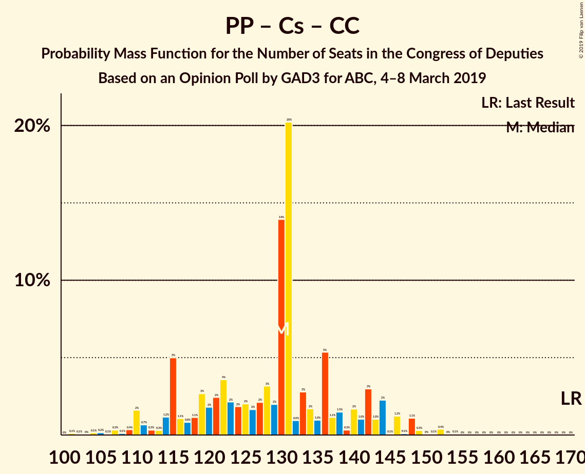

# Opinion Poll by GAD3 for ABC, 4–8 March 2019

<a href="#voting-intentions">Voting Intentions</a> | <a href="#seats">Seats</a> | <a href="#coalitions">Coalitions</a> | <a href="#technical-information">Technical Information</a>

## Voting Intentions

### Confidence Intervals

| Party | Last Result | Poll Result | 80% Confidence Interval | 90% Confidence Interval | 95% Confidence Interval | 99% Confidence Interval |
|:-----:|:-----------:|:-----------:|:-----------------------:|:-----------------------:|:-----------------------:|:-----------------------:|
| Partido Socialista Obrero Español | 22.6% | 30.6% | 28.8–32.5% |28.3–33.1% |27.8–33.5% |27.0–34.5% |
| Partido Popular | 33.0% | 22.1% | 20.5–23.9% |20.0–24.4% |19.6–24.8% |18.9–25.6% |
| Ciudadanos–Partido de la Ciudadanía | 13.1% | 13.2% | 11.9–14.7% |11.6–15.1% |11.2–15.5% |10.7–16.2% |
| Vox | 0.2% | 12.1% | 10.9–13.5% |10.5–13.9% |10.2–14.3% |9.6–15.0% |
| Unidos Podemos | 21.2% | 11.8% | 10.6–13.2% |10.2–13.6% |9.9–14.0% |9.4–14.7% |
| Esquerra Republicana de Catalunya–Catalunya Sí | 2.7% | 2.8% | 2.2–3.6% |2.1–3.8% |1.9–4.0% |1.7–4.4% |
| Partit Demòcrata Europeu Català | 2.0% | 1.5% | 1.1–2.1% |1.0–2.3% |0.9–2.5% |0.7–2.8% |
| Euzko Alderdi Jeltzalea/Partido Nacionalista Vasco | 1.2% | 1.2% | 0.9–1.8% |0.8–1.9% |0.7–2.1% |0.5–2.4% |
| Euskal Herria Bildu | 0.8% | 0.6% | 0.4–1.1% |0.3–1.2% |0.3–1.3% |0.2–1.6% |
| Coalición Canaria–Partido Nacionalista Canario | 0.3% | 0.2% | 0.1–0.5% |0.1–0.6% |0.1–0.7% |0.0–0.9% |

*Note:* The poll result column reflects the actual value used in the calculations. Published results may vary slightly, and in addition be rounded to fewer digits.

## Seats

### Confidence Intervals

| Party | Last Result | Median | 80% Confidence Interval | 90% Confidence Interval | 95% Confidence Interval | 99% Confidence Interval |
|:-----:|:-----------:|:------:|:-----------------------:|:-----------------------:|:-----------------------:|:-----------------------:|
| <a href="#partido-socialista-obrero-español">Partido Socialista Obrero Español</a> | 85 | 135 | 127–144 |124–144 |122–144 |112–152 |
| <a href="#partido-popular">Partido Popular</a> | 137 | 91 | 81–97 |76–97 |76–100 |70–111 |
| <a href="#ciudadanos–partido-de-la-ciudadanía">Ciudadanos–Partido de la Ciudadanía</a> | 32 | 38 | 24–46 |23–49 |23–50 |20–54 |
| <a href="#vox">Vox</a> | 0 | 31 | 26–38 |26–44 |26–48 |23–48 |
| <a href="#unidos-podemos">Unidos Podemos</a> | 71 | 29 | 24–36 |24–37 |23–38 |22–41 |
| <a href="#esquerra-republicana-de-catalunya–catalunya-sí">Esquerra Republicana de Catalunya–Catalunya Sí</a> | 9 | 12 | 9–17 |9–17 |9–17 |8–19 |
| <a href="#partit-demòcrata-europeu-català">Partit Demòcrata Europeu Català</a> | 8 | 8 | 4–12 |4–12 |3–12 |2–12 |
| <a href="#euzko-alderdi-jeltzalea/partido-nacionalista-vasco">Euzko Alderdi Jeltzalea/Partido Nacionalista Vasco</a> | 5 | 6 | 3–9 |3–10 |2–10 |2–11 |
| <a href="#euskal-herria-bildu">Euskal Herria Bildu</a> | 2 | 2 | 0–4 |0–6 |0–6 |0–7 |
| <a href="#coalición-canaria–partido-nacionalista-canario">Coalición Canaria–Partido Nacionalista Canario</a> | 1 | 1 | 0–2 |0–2 |0–3 |0–4 |

### Partido Socialista Obrero Español

*For a full overview of the results for this party, see the [Partido Socialista Obrero Español](party-partidosocialistaobreroespañol.html) page.*

| Number of Seats | Probability | Accumulated | Special Marks |
|:---------------:|:-----------:|:-----------:|:-------------:|
| 85 | 0% | 100% | Last Result |
| 86 | 0% | 100% |  |
| 87 | 0% | 100% |  |
| 88 | 0% | 100% |  |
| 89 | 0% | 100% |  |
| 90 | 0% | 100% |  |
| 91 | 0% | 100% |  |
| 92 | 0% | 100% |  |
| 93 | 0% | 100% |  |
| 94 | 0% | 100% |  |
| 95 | 0% | 100% |  |
| 96 | 0% | 100% |  |
| 97 | 0% | 100% |  |
| 98 | 0% | 100% |  |
| 99 | 0% | 100% |  |
| 100 | 0% | 100% |  |
| 101 | 0% | 100% |  |
| 102 | 0% | 100% |  |
| 103 | 0% | 100% |  |
| 104 | 0% | 100% |  |
| 105 | 0.1% | 100% |  |
| 106 | 0% | 99.9% |  |
| 107 | 0.2% | 99.9% |  |
| 108 | 0% | 99.6% |  |
| 109 | 0% | 99.6% |  |
| 110 | 0% | 99.6% |  |
| 111 | 0% | 99.6% |  |
| 112 | 0.4% | 99.6% |  |
| 113 | 0.4% | 99.1% |  |
| 114 | 0% | 98.8% |  |
| 115 | 0% | 98.8% |  |
| 116 | 0% | 98.8% |  |
| 117 | 0.1% | 98.7% |  |
| 118 | 0.2% | 98.7% |  |
| 119 | 0.6% | 98% |  |
| 120 | 0.2% | 98% |  |
| 121 | 0.1% | 98% |  |
| 122 | 1.4% | 98% |  |
| 123 | 0.7% | 96% |  |
| 124 | 2% | 96% |  |
| 125 | 0.6% | 93% |  |
| 126 | 2% | 93% |  |
| 127 | 4% | 91% |  |
| 128 | 13% | 87% |  |
| 129 | 0.1% | 74% |  |
| 130 | 3% | 74% |  |
| 131 | 4% | 71% |  |
| 132 | 6% | 67% |  |
| 133 | 7% | 61% |  |
| 134 | 4% | 54% |  |
| 135 | 4% | 50% | Median |
| 136 | 10% | 46% |  |
| 137 | 4% | 36% |  |
| 138 | 0.3% | 32% |  |
| 139 | 6% | 31% |  |
| 140 | 0.3% | 26% |  |
| 141 | 5% | 25% |  |
| 142 | 3% | 20% |  |
| 143 | 4% | 18% |  |
| 144 | 12% | 14% |  |
| 145 | 0.6% | 2% |  |
| 146 | 0.1% | 1.3% |  |
| 147 | 0.1% | 1.2% |  |
| 148 | 0% | 1.1% |  |
| 149 | 0.2% | 1.1% |  |
| 150 | 0.3% | 0.9% |  |
| 151 | 0% | 0.5% |  |
| 152 | 0.5% | 0.5% |  |
| 153 | 0% | 0.1% |  |
| 154 | 0% | 0% |  |

### Partido Popular

*For a full overview of the results for this party, see the [Partido Popular](party-partidopopular.html) page.*

| Number of Seats | Probability | Accumulated | Special Marks |
|:---------------:|:-----------:|:-----------:|:-------------:|
| 67 | 0% | 100% |  |
| 68 | 0% | 99.9% |  |
| 69 | 0.4% | 99.9% |  |
| 70 | 0.1% | 99.5% |  |
| 71 | 0.1% | 99.4% |  |
| 72 | 0.7% | 99.3% |  |
| 73 | 0.1% | 98.6% |  |
| 74 | 0% | 98.6% |  |
| 75 | 0.1% | 98.6% |  |
| 76 | 4% | 98% |  |
| 77 | 0.1% | 94% |  |
| 78 | 0.5% | 94% |  |
| 79 | 3% | 94% |  |
| 80 | 0.3% | 91% |  |
| 81 | 0.9% | 91% |  |
| 82 | 4% | 90% |  |
| 83 | 3% | 86% |  |
| 84 | 7% | 83% |  |
| 85 | 4% | 76% |  |
| 86 | 6% | 71% |  |
| 87 | 2% | 66% |  |
| 88 | 7% | 64% |  |
| 89 | 1.2% | 56% |  |
| 90 | 3% | 55% |  |
| 91 | 11% | 52% | Median |
| 92 | 2% | 41% |  |
| 93 | 14% | 39% |  |
| 94 | 11% | 25% |  |
| 95 | 0.2% | 14% |  |
| 96 | 1.5% | 14% |  |
| 97 | 10% | 12% |  |
| 98 | 0.1% | 3% |  |
| 99 | 0.2% | 3% |  |
| 100 | 0.2% | 3% |  |
| 101 | 0.2% | 2% |  |
| 102 | 0.2% | 2% |  |
| 103 | 0.2% | 2% |  |
| 104 | 0% | 2% |  |
| 105 | 0.2% | 2% |  |
| 106 | 0.1% | 2% |  |
| 107 | 0.2% | 1.4% |  |
| 108 | 0.1% | 1.2% |  |
| 109 | 0.6% | 1.1% |  |
| 110 | 0% | 0.5% |  |
| 111 | 0% | 0.5% |  |
| 112 | 0.1% | 0.5% |  |
| 113 | 0.3% | 0.4% |  |
| 114 | 0% | 0.1% |  |
| 115 | 0% | 0% |  |
| 116 | 0% | 0% |  |
| 117 | 0% | 0% |  |
| 118 | 0% | 0% |  |
| 119 | 0% | 0% |  |
| 120 | 0% | 0% |  |
| 121 | 0% | 0% |  |
| 122 | 0% | 0% |  |
| 123 | 0% | 0% |  |
| 124 | 0% | 0% |  |
| 125 | 0% | 0% |  |
| 126 | 0% | 0% |  |
| 127 | 0% | 0% |  |
| 128 | 0% | 0% |  |
| 129 | 0% | 0% |  |
| 130 | 0% | 0% |  |
| 131 | 0% | 0% |  |
| 132 | 0% | 0% |  |
| 133 | 0% | 0% |  |
| 134 | 0% | 0% |  |
| 135 | 0% | 0% |  |
| 136 | 0% | 0% |  |
| 137 | 0% | 0% | Last Result |

### Ciudadanos–Partido de la Ciudadanía

*For a full overview of the results for this party, see the [Ciudadanos–Partido de la Ciudadanía](party-ciudadanos–partidodelaciudadanía.html) page.*

| Number of Seats | Probability | Accumulated | Special Marks |
|:---------------:|:-----------:|:-----------:|:-------------:|
| 19 | 0.2% | 100% |  |
| 20 | 0.4% | 99.8% |  |
| 21 | 0.2% | 99.4% |  |
| 22 | 1.3% | 99.2% |  |
| 23 | 7% | 98% |  |
| 24 | 5% | 91% |  |
| 25 | 0.7% | 86% |  |
| 26 | 0.3% | 86% |  |
| 27 | 0.2% | 85% |  |
| 28 | 4% | 85% |  |
| 29 | 1.3% | 81% |  |
| 30 | 3% | 79% |  |
| 31 | 0.1% | 76% |  |
| 32 | 2% | 76% | Last Result |
| 33 | 3% | 74% |  |
| 34 | 3% | 71% |  |
| 35 | 3% | 68% |  |
| 36 | 0.6% | 65% |  |
| 37 | 0.4% | 65% |  |
| 38 | 26% | 64% | Median |
| 39 | 1.1% | 39% |  |
| 40 | 8% | 37% |  |
| 41 | 7% | 30% |  |
| 42 | 4% | 23% |  |
| 43 | 0.4% | 19% |  |
| 44 | 6% | 19% |  |
| 45 | 0.1% | 13% |  |
| 46 | 5% | 12% |  |
| 47 | 0.1% | 7% |  |
| 48 | 0.4% | 7% |  |
| 49 | 4% | 7% |  |
| 50 | 0.7% | 3% |  |
| 51 | 1.4% | 2% |  |
| 52 | 0% | 0.7% |  |
| 53 | 0% | 0.7% |  |
| 54 | 0.2% | 0.7% |  |
| 55 | 0% | 0.5% |  |
| 56 | 0.4% | 0.5% |  |
| 57 | 0% | 0% |  |

### Vox

*For a full overview of the results for this party, see the [Vox](party-vox.html) page.*

| Number of Seats | Probability | Accumulated | Special Marks |
|:---------------:|:-----------:|:-----------:|:-------------:|
| 0 | 0% | 100% | Last Result |
| 1 | 0% | 100% |  |
| 2 | 0% | 100% |  |
| 3 | 0% | 100% |  |
| 4 | 0% | 100% |  |
| 5 | 0% | 100% |  |
| 6 | 0% | 100% |  |
| 7 | 0% | 100% |  |
| 8 | 0% | 100% |  |
| 9 | 0% | 100% |  |
| 10 | 0% | 100% |  |
| 11 | 0% | 100% |  |
| 12 | 0% | 100% |  |
| 13 | 0% | 100% |  |
| 14 | 0% | 100% |  |
| 15 | 0% | 100% |  |
| 16 | 0% | 100% |  |
| 17 | 0% | 100% |  |
| 18 | 0% | 100% |  |
| 19 | 0% | 100% |  |
| 20 | 0% | 100% |  |
| 21 | 0.1% | 99.9% |  |
| 22 | 0.1% | 99.9% |  |
| 23 | 0.7% | 99.8% |  |
| 24 | 0.5% | 99.1% |  |
| 25 | 0.1% | 98.6% |  |
| 26 | 16% | 98.6% |  |
| 27 | 3% | 83% |  |
| 28 | 16% | 80% |  |
| 29 | 1.3% | 65% |  |
| 30 | 2% | 63% |  |
| 31 | 15% | 61% | Median |
| 32 | 11% | 46% |  |
| 33 | 3% | 35% |  |
| 34 | 8% | 32% |  |
| 35 | 3% | 24% |  |
| 36 | 7% | 21% |  |
| 37 | 0.5% | 14% |  |
| 38 | 4% | 13% |  |
| 39 | 0.8% | 9% |  |
| 40 | 0.3% | 8% |  |
| 41 | 0.5% | 8% |  |
| 42 | 0.7% | 7% |  |
| 43 | 0.2% | 7% |  |
| 44 | 2% | 6% |  |
| 45 | 0.4% | 5% |  |
| 46 | 0.8% | 4% |  |
| 47 | 0.2% | 4% |  |
| 48 | 3% | 3% |  |
| 49 | 0% | 0% |  |

### Unidos Podemos

*For a full overview of the results for this party, see the [Unidos Podemos](party-unidospodemos.html) page.*

| Number of Seats | Probability | Accumulated | Special Marks |
|:---------------:|:-----------:|:-----------:|:-------------:|
| 19 | 0.1% | 100% |  |
| 20 | 0% | 99.9% |  |
| 21 | 0.1% | 99.9% |  |
| 22 | 2% | 99.9% |  |
| 23 | 1.2% | 98% |  |
| 24 | 20% | 97% |  |
| 25 | 8% | 77% |  |
| 26 | 8% | 69% |  |
| 27 | 7% | 61% |  |
| 28 | 0.6% | 54% |  |
| 29 | 12% | 53% | Median |
| 30 | 9% | 42% |  |
| 31 | 4% | 33% |  |
| 32 | 1.1% | 29% |  |
| 33 | 5% | 28% |  |
| 34 | 2% | 23% |  |
| 35 | 2% | 21% |  |
| 36 | 14% | 19% |  |
| 37 | 0.6% | 5% |  |
| 38 | 2% | 4% |  |
| 39 | 0.6% | 2% |  |
| 40 | 1.2% | 2% |  |
| 41 | 0.3% | 0.5% |  |
| 42 | 0% | 0.2% |  |
| 43 | 0.1% | 0.2% |  |
| 44 | 0.1% | 0.1% |  |
| 45 | 0% | 0% |  |
| 46 | 0% | 0% |  |
| 47 | 0% | 0% |  |
| 48 | 0% | 0% |  |
| 49 | 0% | 0% |  |
| 50 | 0% | 0% |  |
| 51 | 0% | 0% |  |
| 52 | 0% | 0% |  |
| 53 | 0% | 0% |  |
| 54 | 0% | 0% |  |
| 55 | 0% | 0% |  |
| 56 | 0% | 0% |  |
| 57 | 0% | 0% |  |
| 58 | 0% | 0% |  |
| 59 | 0% | 0% |  |
| 60 | 0% | 0% |  |
| 61 | 0% | 0% |  |
| 62 | 0% | 0% |  |
| 63 | 0% | 0% |  |
| 64 | 0% | 0% |  |
| 65 | 0% | 0% |  |
| 66 | 0% | 0% |  |
| 67 | 0% | 0% |  |
| 68 | 0% | 0% |  |
| 69 | 0% | 0% |  |
| 70 | 0% | 0% |  |
| 71 | 0% | 0% | Last Result |

### Esquerra Republicana de Catalunya–Catalunya Sí

*For a full overview of the results for this party, see the [Esquerra Republicana de Catalunya–Catalunya Sí](party-esquerrarepublicanadecatalunya–catalunyasí.html) page.*

| Number of Seats | Probability | Accumulated | Special Marks |
|:---------------:|:-----------:|:-----------:|:-------------:|
| 6 | 0.2% | 100% |  |
| 7 | 0.2% | 99.8% |  |
| 8 | 0.6% | 99.6% |  |
| 9 | 17% | 99.0% | Last Result |
| 10 | 15% | 82% |  |
| 11 | 13% | 68% |  |
| 12 | 8% | 55% | Median |
| 13 | 6% | 47% |  |
| 14 | 14% | 41% |  |
| 15 | 8% | 27% |  |
| 16 | 9% | 19% |  |
| 17 | 9% | 10% |  |
| 18 | 0% | 0.8% |  |
| 19 | 0.6% | 0.7% |  |
| 20 | 0.1% | 0.1% |  |
| 21 | 0% | 0% |  |

### Partit Demòcrata Europeu Català

*For a full overview of the results for this party, see the [Partit Demòcrata Europeu Català](party-partitdemòcrataeuropeucatalà.html) page.*

| Number of Seats | Probability | Accumulated | Special Marks |
|:---------------:|:-----------:|:-----------:|:-------------:|
| 1 | 0.1% | 100% |  |
| 2 | 0.7% | 99.9% |  |
| 3 | 4% | 99.3% |  |
| 4 | 10% | 95% |  |
| 5 | 28% | 85% |  |
| 6 | 3% | 57% |  |
| 7 | 0.3% | 54% |  |
| 8 | 24% | 54% | Last Result, Median |
| 9 | 4% | 30% |  |
| 10 | 11% | 25% |  |
| 11 | 0.5% | 14% |  |
| 12 | 14% | 14% |  |
| 13 | 0% | 0.2% |  |
| 14 | 0.1% | 0.1% |  |
| 15 | 0% | 0% |  |

### Euzko Alderdi Jeltzalea/Partido Nacionalista Vasco

*For a full overview of the results for this party, see the [Euzko Alderdi Jeltzalea/Partido Nacionalista Vasco](party-euzkoalderdijeltzaleapartidonacionalistavasco.html) page.*

| Number of Seats | Probability | Accumulated | Special Marks |
|:---------------:|:-----------:|:-----------:|:-------------:|
| 2 | 4% | 100% |  |
| 3 | 21% | 96% |  |
| 4 | 5% | 76% |  |
| 5 | 5% | 71% | Last Result |
| 6 | 38% | 65% | Median |
| 7 | 6% | 28% |  |
| 8 | 10% | 22% |  |
| 9 | 3% | 11% |  |
| 10 | 6% | 8% |  |
| 11 | 2% | 2% |  |
| 12 | 0.2% | 0.2% |  |
| 13 | 0% | 0% |  |

### Euskal Herria Bildu

*For a full overview of the results for this party, see the [Euskal Herria Bildu](party-euskalherriabildu.html) page.*

| Number of Seats | Probability | Accumulated | Special Marks |
|:---------------:|:-----------:|:-----------:|:-------------:|
| 0 | 13% | 100% |  |
| 1 | 25% | 87% |  |
| 2 | 30% | 62% | Last Result, Median |
| 3 | 15% | 32% |  |
| 4 | 9% | 17% |  |
| 5 | 1.4% | 7% |  |
| 6 | 4% | 6% |  |
| 7 | 2% | 2% |  |
| 8 | 0% | 0.1% |  |
| 9 | 0% | 0% |  |

### Coalición Canaria–Partido Nacionalista Canario

*For a full overview of the results for this party, see the [Coalición Canaria–Partido Nacionalista Canario](party-coalicióncanaria–partidonacionalistacanario.html) page.*

| Number of Seats | Probability | Accumulated | Special Marks |
|:---------------:|:-----------:|:-----------:|:-------------:|
| 0 | 44% | 100% |  |
| 1 | 42% | 56% | Last Result, Median |
| 2 | 11% | 14% |  |
| 3 | 2% | 3% |  |
| 4 | 0.9% | 1.1% |  |
| 5 | 0.2% | 0.2% |  |
| 6 | 0% | 0% |  |

## Coalitions

### Confidence Intervals

| Coalition | Last Result | Median | Majority? | 80% Confidence Interval | 90% Confidence Interval | 95% Confidence Interval | 99% Confidence Interval |
|:---------:|:-----------:|:------:|:---------:|:-----------------------:|:-----------------------:|:-----------------------:|:-----------------------:|
| Partido Socialista Obrero Español – Partido Popular – Ciudadanos–Partido de la Ciudadanía | 254 | 262 | 100% | 251–268 | 248–268 | 246–268 | 243–271 |
| Partido Socialista Obrero Español – Partido Popular | 222 | 224 | 100% | 213–235 | 209–237 | 206–237 | 200–241 |
| Partido Socialista Obrero Español – Ciudadanos–Partido de la Ciudadanía – Unidos Podemos | 188 | 201 | 99.3% | 196–205 | 196–208 | 193–208 | 175–228 |
| Partido Socialista Obrero Español – Unidos Podemos – Esquerra Republicana de Catalunya–Catalunya Sí – Partit Demòcrata Europeu Català – Euzko Alderdi Jeltzalea/Partido Nacionalista Vasco – Euskal Herria Bildu | 180 | 189 | 98.7% | 184–202 | 183–203 | 177–205 | 166–210 |
| Partido Socialista Obrero Español – Unidos Podemos – Esquerra Republicana de Catalunya–Catalunya Sí – Partit Demòcrata Europeu Català | 173 | 183 | 90% | 175–195 | 173–195 | 170–196 | 156–202 |
| Partido Socialista Obrero Español – Unidos Podemos – Esquerra Republicana de Catalunya–Catalunya Sí – Euskal Herria Bildu | 167 | 177 | 60% | 170–188 | 167–191 | 166–193 | 153–198 |
| Partido Socialista Obrero Español – Unidos Podemos – Euzko Alderdi Jeltzalea/Partido Nacionalista Vasco – Euskal Herria Bildu | 163 | 169 | 30% | 165–181 | 163–184 | 158–185 | 146–195 |
| Partido Socialista Obrero Español – Unidos Podemos – Euzko Alderdi Jeltzalea/Partido Nacionalista Vasco | 161 | 168 | 21% | 162–181 | 160–183 | 155–183 | 144–193 |
| Partido Socialista Obrero Español – Ciudadanos–Partido de la Ciudadanía | 117 | 172 | 27% | 165–179 | 161–181 | 156–181 | 146–193 |
| Partido Socialista Obrero Español – Unidos Podemos | 156 | 164 | 7% | 156–174 | 152–177 | 150–177 | 138–187 |
| Partido Popular – Ciudadanos–Partido de la Ciudadanía – Vox | 169 | 160 | 1.2% | 147–165 | 147–166 | 144–173 | 140–183 |
| Partido Popular – Ciudadanos–Partido de la Ciudadanía – Euzko Alderdi Jeltzalea/Partido Nacionalista Vasco | 174 | 132 | 0% | 122–142 | 120–145 | 116–147 | 110–156 |
| Partido Socialista Obrero Español | 85 | 135 | 0% | 127–144 | 124–144 | 122–144 | 112–152 |
| Partido Popular – Ciudadanos–Partido de la Ciudadanía – Coalición Canaria–Partido Nacionalista Canario | 170 | 127 | 0% | 116–136 | 114–140 | 113–142 | 104–150 |
| Partido Popular – Ciudadanos–Partido de la Ciudadanía | 169 | 126 | 0% | 116–135 | 114–140 | 111–140 | 104–150 |
| Partido Popular – Vox | 137 | 121 | 0% | 116–124 | 116–127 | 115–127 | 99–144 |
| Partido Popular | 137 | 91 | 0% | 81–97 | 76–97 | 76–100 | 70–111 |

### Partido Socialista Obrero Español – Partido Popular – Ciudadanos–Partido de la Ciudadanía

| Number of Seats | Probability | Accumulated | Special Marks |
|:---------------:|:-----------:|:-----------:|:-------------:|
| 240 | 0.1% | 100% |  |
| 241 | 0.2% | 99.9% |  |
| 242 | 0.2% | 99.7% |  |
| 243 | 0% | 99.5% |  |
| 244 | 0.2% | 99.5% |  |
| 245 | 0.2% | 99.3% |  |
| 246 | 2% | 99.1% |  |
| 247 | 2% | 97% |  |
| 248 | 3% | 95% |  |
| 249 | 0.1% | 92% |  |
| 250 | 0.6% | 92% |  |
| 251 | 9% | 92% |  |
| 252 | 0.7% | 83% |  |
| 253 | 2% | 82% |  |
| 254 | 0.8% | 81% | Last Result |
| 255 | 3% | 80% |  |
| 256 | 1.5% | 76% |  |
| 257 | 0.4% | 75% |  |
| 258 | 8% | 75% |  |
| 259 | 1.1% | 66% |  |
| 260 | 7% | 65% |  |
| 261 | 6% | 58% |  |
| 262 | 5% | 51% |  |
| 263 | 14% | 47% |  |
| 264 | 0.5% | 33% | Median |
| 265 | 5% | 33% |  |
| 266 | 1.0% | 28% |  |
| 267 | 13% | 27% |  |
| 268 | 13% | 14% |  |
| 269 | 0.2% | 1.0% |  |
| 270 | 0.1% | 0.8% |  |
| 271 | 0.4% | 0.7% |  |
| 272 | 0.1% | 0.4% |  |
| 273 | 0% | 0.3% |  |
| 274 | 0% | 0.3% |  |
| 275 | 0% | 0.3% |  |
| 276 | 0.2% | 0.2% |  |
| 277 | 0% | 0.1% |  |
| 278 | 0% | 0% |  |

### Partido Socialista Obrero Español – Partido Popular

| Number of Seats | Probability | Accumulated | Special Marks |
|:---------------:|:-----------:|:-----------:|:-------------:|
| 197 | 0.4% | 100% |  |
| 198 | 0.1% | 99.6% |  |
| 199 | 0% | 99.5% |  |
| 200 | 0% | 99.5% |  |
| 201 | 0% | 99.5% |  |
| 202 | 0.4% | 99.5% |  |
| 203 | 0.1% | 99.1% |  |
| 204 | 0% | 99.0% |  |
| 205 | 1.0% | 98.9% |  |
| 206 | 2% | 98% |  |
| 207 | 0% | 96% |  |
| 208 | 0.5% | 96% |  |
| 209 | 1.3% | 95% |  |
| 210 | 0.8% | 94% |  |
| 211 | 0.7% | 93% |  |
| 212 | 0.6% | 93% |  |
| 213 | 6% | 92% |  |
| 214 | 0.3% | 86% |  |
| 215 | 4% | 86% |  |
| 216 | 3% | 82% |  |
| 217 | 0.5% | 79% |  |
| 218 | 3% | 78% |  |
| 219 | 0.9% | 75% |  |
| 220 | 4% | 74% |  |
| 221 | 8% | 70% |  |
| 222 | 0.2% | 62% | Last Result |
| 223 | 3% | 61% |  |
| 224 | 11% | 58% |  |
| 225 | 10% | 48% |  |
| 226 | 0.6% | 37% | Median |
| 227 | 5% | 37% |  |
| 228 | 0.2% | 32% |  |
| 229 | 5% | 31% |  |
| 230 | 9% | 26% |  |
| 231 | 0.6% | 17% |  |
| 232 | 0.5% | 17% |  |
| 233 | 0.1% | 16% |  |
| 234 | 4% | 16% |  |
| 235 | 4% | 12% |  |
| 236 | 0.2% | 8% |  |
| 237 | 6% | 8% |  |
| 238 | 0% | 1.4% |  |
| 239 | 0.6% | 1.4% |  |
| 240 | 0.1% | 0.8% |  |
| 241 | 0.4% | 0.7% |  |
| 242 | 0.1% | 0.3% |  |
| 243 | 0.1% | 0.2% |  |
| 244 | 0% | 0.1% |  |
| 245 | 0.1% | 0.1% |  |
| 246 | 0% | 0% |  |

### Partido Socialista Obrero Español – Ciudadanos–Partido de la Ciudadanía – Unidos Podemos

| Number of Seats | Probability | Accumulated | Special Marks |
|:---------------:|:-----------:|:-----------:|:-------------:|
| 167 | 0.1% | 100% |  |
| 168 | 0% | 99.9% |  |
| 169 | 0% | 99.9% |  |
| 170 | 0.1% | 99.9% |  |
| 171 | 0% | 99.9% |  |
| 172 | 0.1% | 99.8% |  |
| 173 | 0% | 99.8% |  |
| 174 | 0.1% | 99.7% |  |
| 175 | 0.3% | 99.6% |  |
| 176 | 0.3% | 99.3% | Majority |
| 177 | 0% | 99.0% |  |
| 178 | 0.4% | 99.0% |  |
| 179 | 0% | 98.6% |  |
| 180 | 0.6% | 98.6% |  |
| 181 | 0.1% | 98% |  |
| 182 | 0% | 98% |  |
| 183 | 0% | 98% |  |
| 184 | 0.1% | 98% |  |
| 185 | 0% | 98% |  |
| 186 | 0% | 98% |  |
| 187 | 0% | 98% |  |
| 188 | 0% | 98% | Last Result |
| 189 | 0% | 98% |  |
| 190 | 0% | 98% |  |
| 191 | 0% | 98% |  |
| 192 | 0.1% | 98% |  |
| 193 | 0.3% | 98% |  |
| 194 | 0.2% | 97% |  |
| 195 | 1.1% | 97% |  |
| 196 | 9% | 96% |  |
| 197 | 3% | 87% |  |
| 198 | 16% | 85% |  |
| 199 | 7% | 69% |  |
| 200 | 10% | 62% |  |
| 201 | 16% | 52% |  |
| 202 | 19% | 36% | Median |
| 203 | 1.2% | 17% |  |
| 204 | 0.9% | 15% |  |
| 205 | 8% | 15% |  |
| 206 | 0.1% | 6% |  |
| 207 | 0.2% | 6% |  |
| 208 | 4% | 6% |  |
| 209 | 0.1% | 2% |  |
| 210 | 0% | 1.5% |  |
| 211 | 0% | 1.5% |  |
| 212 | 0% | 1.5% |  |
| 213 | 0% | 1.5% |  |
| 214 | 0% | 1.5% |  |
| 215 | 0% | 1.5% |  |
| 216 | 0% | 1.5% |  |
| 217 | 0% | 1.5% |  |
| 218 | 0% | 1.4% |  |
| 219 | 0% | 1.4% |  |
| 220 | 0% | 1.4% |  |
| 221 | 0.2% | 1.4% |  |
| 222 | 0% | 1.2% |  |
| 223 | 0.3% | 1.1% |  |
| 224 | 0.1% | 0.9% |  |
| 225 | 0% | 0.7% |  |
| 226 | 0.2% | 0.7% |  |
| 227 | 0% | 0.5% |  |
| 228 | 0.5% | 0.5% |  |
| 229 | 0% | 0% |  |

### Partido Socialista Obrero Español – Unidos Podemos – Esquerra Republicana de Catalunya–Catalunya Sí – Partit Demòcrata Europeu Català – Euzko Alderdi Jeltzalea/Partido Nacionalista Vasco – Euskal Herria Bildu

| Number of Seats | Probability | Accumulated | Special Marks |
|:---------------:|:-----------:|:-----------:|:-------------:|
| 162 | 0% | 100% |  |
| 163 | 0% | 99.9% |  |
| 164 | 0.2% | 99.9% |  |
| 165 | 0% | 99.7% |  |
| 166 | 0.3% | 99.7% |  |
| 167 | 0% | 99.4% |  |
| 168 | 0% | 99.4% |  |
| 169 | 0.1% | 99.4% |  |
| 170 | 0% | 99.3% |  |
| 171 | 0% | 99.3% |  |
| 172 | 0.4% | 99.3% |  |
| 173 | 0% | 98.9% |  |
| 174 | 0.1% | 98.9% |  |
| 175 | 0.1% | 98.8% |  |
| 176 | 0.1% | 98.7% | Majority |
| 177 | 1.3% | 98.6% |  |
| 178 | 0.4% | 97% |  |
| 179 | 0.6% | 97% |  |
| 180 | 0.1% | 96% | Last Result |
| 181 | 0.1% | 96% |  |
| 182 | 1.0% | 96% |  |
| 183 | 1.5% | 95% |  |
| 184 | 7% | 94% |  |
| 185 | 0.2% | 86% |  |
| 186 | 2% | 86% |  |
| 187 | 8% | 84% |  |
| 188 | 14% | 77% |  |
| 189 | 17% | 62% |  |
| 190 | 0.5% | 45% |  |
| 191 | 0.8% | 45% |  |
| 192 | 9% | 44% | Median |
| 193 | 4% | 35% |  |
| 194 | 0.1% | 31% |  |
| 195 | 4% | 31% |  |
| 196 | 7% | 27% |  |
| 197 | 4% | 20% |  |
| 198 | 0.6% | 16% |  |
| 199 | 0.8% | 16% |  |
| 200 | 0.3% | 15% |  |
| 201 | 0.3% | 15% |  |
| 202 | 5% | 14% |  |
| 203 | 7% | 10% |  |
| 204 | 0.4% | 3% |  |
| 205 | 0.3% | 3% |  |
| 206 | 0.1% | 2% |  |
| 207 | 0.2% | 2% |  |
| 208 | 1.3% | 2% |  |
| 209 | 0.1% | 0.8% |  |
| 210 | 0.5% | 0.6% |  |
| 211 | 0.1% | 0.2% |  |
| 212 | 0% | 0.1% |  |
| 213 | 0% | 0.1% |  |
| 214 | 0% | 0.1% |  |
| 215 | 0% | 0.1% |  |
| 216 | 0% | 0.1% |  |
| 217 | 0% | 0% |  |

### Partido Socialista Obrero Español – Unidos Podemos – Esquerra Republicana de Catalunya–Catalunya Sí – Partit Demòcrata Europeu Català

| Number of Seats | Probability | Accumulated | Special Marks |
|:---------------:|:-----------:|:-----------:|:-------------:|
| 152 | 0% | 100% |  |
| 153 | 0% | 99.9% |  |
| 154 | 0% | 99.9% |  |
| 155 | 0% | 99.9% |  |
| 156 | 0.5% | 99.9% |  |
| 157 | 0% | 99.4% |  |
| 158 | 0% | 99.4% |  |
| 159 | 0.1% | 99.4% |  |
| 160 | 0.2% | 99.3% |  |
| 161 | 0% | 99.2% |  |
| 162 | 0% | 99.2% |  |
| 163 | 0.2% | 99.1% |  |
| 164 | 0.1% | 98.9% |  |
| 165 | 0.1% | 98.8% |  |
| 166 | 0.1% | 98.8% |  |
| 167 | 0.8% | 98.6% |  |
| 168 | 0.1% | 98% |  |
| 169 | 0.1% | 98% |  |
| 170 | 0.1% | 98% |  |
| 171 | 1.2% | 97% |  |
| 172 | 0.8% | 96% |  |
| 173 | 2% | 96% | Last Result |
| 174 | 4% | 94% |  |
| 175 | 0.4% | 90% |  |
| 176 | 3% | 90% | Majority |
| 177 | 6% | 87% |  |
| 178 | 2% | 81% |  |
| 179 | 13% | 79% |  |
| 180 | 0.3% | 67% |  |
| 181 | 5% | 66% |  |
| 182 | 9% | 61% |  |
| 183 | 10% | 53% |  |
| 184 | 2% | 43% | Median |
| 185 | 5% | 41% |  |
| 186 | 5% | 36% |  |
| 187 | 1.4% | 31% |  |
| 188 | 6% | 30% |  |
| 189 | 7% | 24% |  |
| 190 | 2% | 17% |  |
| 191 | 0.4% | 14% |  |
| 192 | 0.1% | 14% |  |
| 193 | 0.4% | 14% |  |
| 194 | 0.1% | 14% |  |
| 195 | 11% | 13% |  |
| 196 | 1.5% | 3% |  |
| 197 | 0% | 1.3% |  |
| 198 | 0.1% | 1.2% |  |
| 199 | 0.2% | 1.2% |  |
| 200 | 0.2% | 0.9% |  |
| 201 | 0.1% | 0.7% |  |
| 202 | 0.5% | 0.6% |  |
| 203 | 0.1% | 0.2% |  |
| 204 | 0% | 0.1% |  |
| 205 | 0% | 0.1% |  |
| 206 | 0% | 0.1% |  |
| 207 | 0% | 0.1% |  |
| 208 | 0% | 0% |  |

### Partido Socialista Obrero Español – Unidos Podemos – Esquerra Republicana de Catalunya–Catalunya Sí – Euskal Herria Bildu

| Number of Seats | Probability | Accumulated | Special Marks |
|:---------------:|:-----------:|:-----------:|:-------------:|
| 146 | 0% | 100% |  |
| 147 | 0% | 99.9% |  |
| 148 | 0% | 99.9% |  |
| 149 | 0% | 99.9% |  |
| 150 | 0.2% | 99.9% |  |
| 151 | 0% | 99.7% |  |
| 152 | 0% | 99.7% |  |
| 153 | 0.2% | 99.7% |  |
| 154 | 0% | 99.5% |  |
| 155 | 0% | 99.4% |  |
| 156 | 0.1% | 99.4% |  |
| 157 | 0% | 99.3% |  |
| 158 | 0.1% | 99.3% |  |
| 159 | 0% | 99.2% |  |
| 160 | 0.2% | 99.2% |  |
| 161 | 0.1% | 99.0% |  |
| 162 | 0.3% | 98.9% |  |
| 163 | 0.1% | 98.7% |  |
| 164 | 0.8% | 98.6% |  |
| 165 | 0.2% | 98% |  |
| 166 | 0.5% | 98% |  |
| 167 | 6% | 97% | Last Result |
| 168 | 0.9% | 91% |  |
| 169 | 0.2% | 90% |  |
| 170 | 3% | 90% |  |
| 171 | 8% | 87% |  |
| 172 | 2% | 79% |  |
| 173 | 3% | 78% |  |
| 174 | 3% | 74% |  |
| 175 | 11% | 71% |  |
| 176 | 6% | 60% | Majority |
| 177 | 8% | 54% |  |
| 178 | 6% | 46% | Median |
| 179 | 5% | 40% |  |
| 180 | 0.8% | 36% |  |
| 181 | 2% | 35% |  |
| 182 | 0.9% | 33% |  |
| 183 | 1.0% | 32% |  |
| 184 | 5% | 31% |  |
| 185 | 4% | 26% |  |
| 186 | 2% | 22% |  |
| 187 | 6% | 20% |  |
| 188 | 5% | 13% |  |
| 189 | 0.8% | 9% |  |
| 190 | 1.0% | 8% |  |
| 191 | 4% | 7% |  |
| 192 | 0% | 3% |  |
| 193 | 0.2% | 3% |  |
| 194 | 1.4% | 2% |  |
| 195 | 0.1% | 1.1% |  |
| 196 | 0.3% | 0.9% |  |
| 197 | 0% | 0.6% |  |
| 198 | 0.5% | 0.6% |  |
| 199 | 0% | 0.1% |  |
| 200 | 0% | 0.1% |  |
| 201 | 0% | 0.1% |  |
| 202 | 0% | 0.1% |  |
| 203 | 0% | 0.1% |  |
| 204 | 0% | 0.1% |  |
| 205 | 0% | 0.1% |  |
| 206 | 0% | 0.1% |  |
| 207 | 0% | 0.1% |  |
| 208 | 0% | 0% |  |

### Partido Socialista Obrero Español – Unidos Podemos – Euzko Alderdi Jeltzalea/Partido Nacionalista Vasco – Euskal Herria Bildu

| Number of Seats | Probability | Accumulated | Special Marks |
|:---------------:|:-----------:|:-----------:|:-------------:|
| 144 | 0% | 100% |  |
| 145 | 0.1% | 99.9% |  |
| 146 | 0.4% | 99.9% |  |
| 147 | 0.1% | 99.5% |  |
| 148 | 0% | 99.3% |  |
| 149 | 0% | 99.3% |  |
| 150 | 0% | 99.3% |  |
| 151 | 0.2% | 99.3% |  |
| 152 | 0.1% | 99.1% |  |
| 153 | 0% | 99.0% |  |
| 154 | 0% | 99.0% |  |
| 155 | 1.2% | 98.9% |  |
| 156 | 0.1% | 98% |  |
| 157 | 0.2% | 98% |  |
| 158 | 0% | 98% |  |
| 159 | 0.2% | 97% |  |
| 160 | 0% | 97% |  |
| 161 | 1.1% | 97% |  |
| 162 | 1.1% | 96% |  |
| 163 | 4% | 95% | Last Result |
| 164 | 0.2% | 91% |  |
| 165 | 7% | 91% |  |
| 166 | 4% | 84% |  |
| 167 | 8% | 80% |  |
| 168 | 6% | 72% |  |
| 169 | 18% | 66% |  |
| 170 | 2% | 48% |  |
| 171 | 5% | 45% |  |
| 172 | 1.1% | 40% | Median |
| 173 | 7% | 39% |  |
| 174 | 0.5% | 32% |  |
| 175 | 2% | 32% |  |
| 176 | 6% | 30% | Majority |
| 177 | 1.4% | 23% |  |
| 178 | 1.3% | 22% |  |
| 179 | 0.3% | 21% |  |
| 180 | 4% | 20% |  |
| 181 | 7% | 16% |  |
| 182 | 0.9% | 9% |  |
| 183 | 0.2% | 8% |  |
| 184 | 5% | 8% |  |
| 185 | 0.6% | 3% |  |
| 186 | 0.2% | 2% |  |
| 187 | 0.2% | 2% |  |
| 188 | 1.3% | 2% |  |
| 189 | 0% | 0.7% |  |
| 190 | 0.1% | 0.6% |  |
| 191 | 0% | 0.6% |  |
| 192 | 0% | 0.6% |  |
| 193 | 0% | 0.5% |  |
| 194 | 0% | 0.5% |  |
| 195 | 0.5% | 0.5% |  |
| 196 | 0% | 0.1% |  |
| 197 | 0% | 0.1% |  |
| 198 | 0% | 0% |  |

### Partido Socialista Obrero Español – Unidos Podemos – Euzko Alderdi Jeltzalea/Partido Nacionalista Vasco

| Number of Seats | Probability | Accumulated | Special Marks |
|:---------------:|:-----------:|:-----------:|:-------------:|
| 138 | 0% | 100% |  |
| 139 | 0% | 99.9% |  |
| 140 | 0% | 99.9% |  |
| 141 | 0% | 99.9% |  |
| 142 | 0% | 99.9% |  |
| 143 | 0% | 99.9% |  |
| 144 | 0.4% | 99.9% |  |
| 145 | 0.1% | 99.4% |  |
| 146 | 0% | 99.3% |  |
| 147 | 0% | 99.3% |  |
| 148 | 0% | 99.3% |  |
| 149 | 0% | 99.3% |  |
| 150 | 0.2% | 99.3% |  |
| 151 | 0.3% | 99.1% |  |
| 152 | 0% | 98.8% |  |
| 153 | 1.2% | 98.8% |  |
| 154 | 0.1% | 98% |  |
| 155 | 0.1% | 98% |  |
| 156 | 0.1% | 97% |  |
| 157 | 1.1% | 97% |  |
| 158 | 0.3% | 96% |  |
| 159 | 0.7% | 96% |  |
| 160 | 0.6% | 95% |  |
| 161 | 4% | 95% | Last Result |
| 162 | 4% | 91% |  |
| 163 | 6% | 87% |  |
| 164 | 6% | 81% |  |
| 165 | 1.3% | 75% |  |
| 166 | 9% | 74% |  |
| 167 | 12% | 65% |  |
| 168 | 6% | 53% |  |
| 169 | 7% | 47% |  |
| 170 | 6% | 41% | Median |
| 171 | 4% | 34% |  |
| 172 | 0.1% | 30% |  |
| 173 | 4% | 30% |  |
| 174 | 2% | 26% |  |
| 175 | 3% | 24% |  |
| 176 | 1.3% | 21% | Majority |
| 177 | 5% | 20% |  |
| 178 | 0.3% | 16% |  |
| 179 | 0.6% | 15% |  |
| 180 | 1.0% | 15% |  |
| 181 | 7% | 14% |  |
| 182 | 1.5% | 7% |  |
| 183 | 4% | 6% |  |
| 184 | 0.4% | 1.3% |  |
| 185 | 0.1% | 1.0% |  |
| 186 | 0.2% | 0.9% |  |
| 187 | 0.1% | 0.7% |  |
| 188 | 0% | 0.6% |  |
| 189 | 0% | 0.6% |  |
| 190 | 0% | 0.6% |  |
| 191 | 0% | 0.5% |  |
| 192 | 0% | 0.5% |  |
| 193 | 0.5% | 0.5% |  |
| 194 | 0% | 0% |  |

### Partido Socialista Obrero Español – Ciudadanos–Partido de la Ciudadanía

| Number of Seats | Probability | Accumulated | Special Marks |
|:---------------:|:-----------:|:-----------:|:-------------:|
| 117 | 0% | 100% | Last Result |
| 118 | 0% | 100% |  |
| 119 | 0% | 100% |  |
| 120 | 0% | 100% |  |
| 121 | 0% | 100% |  |
| 122 | 0% | 100% |  |
| 123 | 0% | 100% |  |
| 124 | 0% | 100% |  |
| 125 | 0% | 100% |  |
| 126 | 0% | 100% |  |
| 127 | 0% | 100% |  |
| 128 | 0% | 100% |  |
| 129 | 0% | 100% |  |
| 130 | 0% | 100% |  |
| 131 | 0% | 100% |  |
| 132 | 0% | 100% |  |
| 133 | 0% | 100% |  |
| 134 | 0% | 100% |  |
| 135 | 0% | 100% |  |
| 136 | 0% | 100% |  |
| 137 | 0% | 100% |  |
| 138 | 0% | 100% |  |
| 139 | 0% | 100% |  |
| 140 | 0% | 100% |  |
| 141 | 0% | 99.9% |  |
| 142 | 0.1% | 99.9% |  |
| 143 | 0% | 99.8% |  |
| 144 | 0% | 99.8% |  |
| 145 | 0.1% | 99.8% |  |
| 146 | 0.2% | 99.7% |  |
| 147 | 0.1% | 99.4% |  |
| 148 | 0.1% | 99.3% |  |
| 149 | 0% | 99.2% |  |
| 150 | 0.1% | 99.2% |  |
| 151 | 0.1% | 99.1% |  |
| 152 | 0.1% | 99.0% |  |
| 153 | 0.9% | 98.9% |  |
| 154 | 0% | 98% |  |
| 155 | 0.1% | 98% |  |
| 156 | 0.4% | 98% |  |
| 157 | 1.2% | 97% |  |
| 158 | 0.1% | 96% |  |
| 159 | 0% | 96% |  |
| 160 | 0.2% | 96% |  |
| 161 | 2% | 96% |  |
| 162 | 0.3% | 94% |  |
| 163 | 1.0% | 93% |  |
| 164 | 2% | 92% |  |
| 165 | 6% | 91% |  |
| 166 | 12% | 84% |  |
| 167 | 10% | 72% |  |
| 168 | 2% | 63% |  |
| 169 | 4% | 61% |  |
| 170 | 3% | 57% |  |
| 171 | 1.5% | 54% |  |
| 172 | 8% | 53% |  |
| 173 | 4% | 45% | Median |
| 174 | 9% | 41% |  |
| 175 | 4% | 31% |  |
| 176 | 5% | 27% | Majority |
| 177 | 7% | 23% |  |
| 178 | 0.2% | 15% |  |
| 179 | 5% | 15% |  |
| 180 | 0.9% | 10% |  |
| 181 | 7% | 9% |  |
| 182 | 0.2% | 2% |  |
| 183 | 0% | 2% |  |
| 184 | 0.1% | 1.5% |  |
| 185 | 0% | 1.4% |  |
| 186 | 0% | 1.4% |  |
| 187 | 0% | 1.3% |  |
| 188 | 0.1% | 1.3% |  |
| 189 | 0.2% | 1.2% |  |
| 190 | 0.1% | 1.0% |  |
| 191 | 0% | 0.9% |  |
| 192 | 0% | 0.9% |  |
| 193 | 0.5% | 0.9% |  |
| 194 | 0% | 0.5% |  |
| 195 | 0.4% | 0.5% |  |
| 196 | 0% | 0% |  |

### Partido Socialista Obrero Español – Unidos Podemos

| Number of Seats | Probability | Accumulated | Special Marks |
|:---------------:|:-----------:|:-----------:|:-------------:|
| 133 | 0% | 100% |  |
| 134 | 0% | 99.9% |  |
| 135 | 0.1% | 99.9% |  |
| 136 | 0.3% | 99.9% |  |
| 137 | 0.1% | 99.6% |  |
| 138 | 0.2% | 99.6% |  |
| 139 | 0% | 99.4% |  |
| 140 | 0.1% | 99.4% |  |
| 141 | 0% | 99.3% |  |
| 142 | 0.2% | 99.3% |  |
| 143 | 0.1% | 99.1% |  |
| 144 | 0% | 99.0% |  |
| 145 | 0.2% | 99.0% |  |
| 146 | 0% | 98.8% |  |
| 147 | 0% | 98.8% |  |
| 148 | 0.1% | 98.7% |  |
| 149 | 0.1% | 98.6% |  |
| 150 | 2% | 98.5% |  |
| 151 | 2% | 97% |  |
| 152 | 0.4% | 95% |  |
| 153 | 1.2% | 95% |  |
| 154 | 0.2% | 94% |  |
| 155 | 1.1% | 93% |  |
| 156 | 7% | 92% | Last Result |
| 157 | 9% | 86% |  |
| 158 | 5% | 77% |  |
| 159 | 0.4% | 71% |  |
| 160 | 11% | 71% |  |
| 161 | 0.4% | 60% |  |
| 162 | 4% | 59% |  |
| 163 | 2% | 55% |  |
| 164 | 12% | 54% | Median |
| 165 | 9% | 41% |  |
| 166 | 2% | 32% |  |
| 167 | 1.4% | 30% |  |
| 168 | 2% | 29% |  |
| 169 | 2% | 27% |  |
| 170 | 5% | 24% |  |
| 171 | 0.3% | 19% |  |
| 172 | 0.7% | 19% |  |
| 173 | 7% | 18% |  |
| 174 | 4% | 12% |  |
| 175 | 0.1% | 7% |  |
| 176 | 2% | 7% | Majority |
| 177 | 4% | 6% |  |
| 178 | 0.4% | 1.3% |  |
| 179 | 0.2% | 0.9% |  |
| 180 | 0% | 0.7% |  |
| 181 | 0% | 0.7% |  |
| 182 | 0.1% | 0.7% |  |
| 183 | 0% | 0.6% |  |
| 184 | 0% | 0.6% |  |
| 185 | 0% | 0.6% |  |
| 186 | 0% | 0.5% |  |
| 187 | 0.5% | 0.5% |  |
| 188 | 0% | 0.1% |  |
| 189 | 0% | 0% |  |

### Partido Popular – Ciudadanos–Partido de la Ciudadanía – Vox

| Number of Seats | Probability | Accumulated | Special Marks |
|:---------------:|:-----------:|:-----------:|:-------------:|
| 134 | 0% | 100% |  |
| 135 | 0% | 99.9% |  |
| 136 | 0% | 99.9% |  |
| 137 | 0% | 99.9% |  |
| 138 | 0% | 99.9% |  |
| 139 | 0% | 99.9% |  |
| 140 | 0.5% | 99.8% |  |
| 141 | 0.2% | 99.4% |  |
| 142 | 1.4% | 99.1% |  |
| 143 | 0.1% | 98% |  |
| 144 | 0.2% | 98% |  |
| 145 | 0.7% | 97% |  |
| 146 | 0.2% | 97% |  |
| 147 | 7% | 96% |  |
| 148 | 5% | 90% |  |
| 149 | 0.5% | 85% |  |
| 150 | 0.9% | 85% |  |
| 151 | 0.5% | 84% |  |
| 152 | 4% | 84% |  |
| 153 | 4% | 79% |  |
| 154 | 2% | 75% |  |
| 155 | 5% | 73% |  |
| 156 | 3% | 68% |  |
| 157 | 6% | 66% |  |
| 158 | 5% | 60% |  |
| 159 | 4% | 55% |  |
| 160 | 13% | 51% | Median |
| 161 | 14% | 39% |  |
| 162 | 5% | 25% |  |
| 163 | 6% | 20% |  |
| 164 | 0.3% | 14% |  |
| 165 | 4% | 14% |  |
| 166 | 5% | 9% |  |
| 167 | 0.8% | 4% |  |
| 168 | 0% | 4% |  |
| 169 | 0.1% | 4% | Last Result |
| 170 | 0.5% | 4% |  |
| 171 | 0% | 3% |  |
| 172 | 0.5% | 3% |  |
| 173 | 1.3% | 3% |  |
| 174 | 0% | 1.3% |  |
| 175 | 0.1% | 1.2% |  |
| 176 | 0.3% | 1.2% | Majority |
| 177 | 0.2% | 0.9% |  |
| 178 | 0% | 0.7% |  |
| 179 | 0.1% | 0.7% |  |
| 180 | 0.1% | 0.6% |  |
| 181 | 0% | 0.6% |  |
| 182 | 0% | 0.6% |  |
| 183 | 0.3% | 0.5% |  |
| 184 | 0.2% | 0.3% |  |
| 185 | 0% | 0.1% |  |
| 186 | 0% | 0.1% |  |
| 187 | 0% | 0% |  |

### Partido Popular – Ciudadanos–Partido de la Ciudadanía – Euzko Alderdi Jeltzalea/Partido Nacionalista Vasco

| Number of Seats | Probability | Accumulated | Special Marks |
|:---------------:|:-----------:|:-----------:|:-------------:|
| 105 | 0.1% | 100% |  |
| 106 | 0.2% | 99.9% |  |
| 107 | 0% | 99.7% |  |
| 108 | 0% | 99.7% |  |
| 109 | 0.2% | 99.7% |  |
| 110 | 1.3% | 99.5% |  |
| 111 | 0% | 98% |  |
| 112 | 0.1% | 98% |  |
| 113 | 0.1% | 98% |  |
| 114 | 0.2% | 98% |  |
| 115 | 0% | 98% |  |
| 116 | 0.6% | 98% |  |
| 117 | 0.3% | 97% |  |
| 118 | 0.7% | 97% |  |
| 119 | 0.7% | 96% |  |
| 120 | 3% | 96% |  |
| 121 | 1.0% | 92% |  |
| 122 | 5% | 91% |  |
| 123 | 7% | 86% |  |
| 124 | 10% | 79% |  |
| 125 | 1.4% | 70% |  |
| 126 | 3% | 68% |  |
| 127 | 4% | 65% |  |
| 128 | 0.2% | 60% |  |
| 129 | 3% | 60% |  |
| 130 | 0.4% | 57% |  |
| 131 | 4% | 57% |  |
| 132 | 6% | 53% |  |
| 133 | 0.3% | 46% |  |
| 134 | 0.7% | 46% |  |
| 135 | 1.3% | 46% | Median |
| 136 | 4% | 44% |  |
| 137 | 0.2% | 40% |  |
| 138 | 17% | 40% |  |
| 139 | 5% | 22% |  |
| 140 | 1.1% | 17% |  |
| 141 | 6% | 16% |  |
| 142 | 2% | 10% |  |
| 143 | 2% | 8% |  |
| 144 | 0.4% | 7% |  |
| 145 | 3% | 6% |  |
| 146 | 0.1% | 3% |  |
| 147 | 1.0% | 3% |  |
| 148 | 0.1% | 2% |  |
| 149 | 0.4% | 2% |  |
| 150 | 0.1% | 1.2% |  |
| 151 | 0% | 1.1% |  |
| 152 | 0.4% | 1.1% |  |
| 153 | 0.1% | 0.7% |  |
| 154 | 0% | 0.6% |  |
| 155 | 0.1% | 0.6% |  |
| 156 | 0% | 0.5% |  |
| 157 | 0% | 0.5% |  |
| 158 | 0% | 0.5% |  |
| 159 | 0.1% | 0.5% |  |
| 160 | 0.3% | 0.3% |  |
| 161 | 0% | 0.1% |  |
| 162 | 0% | 0.1% |  |
| 163 | 0% | 0% |  |
| 164 | 0% | 0% |  |
| 165 | 0% | 0% |  |
| 166 | 0% | 0% |  |
| 167 | 0% | 0% |  |
| 168 | 0% | 0% |  |
| 169 | 0% | 0% |  |
| 170 | 0% | 0% |  |
| 171 | 0% | 0% |  |
| 172 | 0% | 0% |  |
| 173 | 0% | 0% |  |
| 174 | 0% | 0% | Last Result |

### Partido Socialista Obrero Español

| Number of Seats | Probability | Accumulated | Special Marks |
|:---------------:|:-----------:|:-----------:|:-------------:|
| 85 | 0% | 100% | Last Result |
| 86 | 0% | 100% |  |
| 87 | 0% | 100% |  |
| 88 | 0% | 100% |  |
| 89 | 0% | 100% |  |
| 90 | 0% | 100% |  |
| 91 | 0% | 100% |  |
| 92 | 0% | 100% |  |
| 93 | 0% | 100% |  |
| 94 | 0% | 100% |  |
| 95 | 0% | 100% |  |
| 96 | 0% | 100% |  |
| 97 | 0% | 100% |  |
| 98 | 0% | 100% |  |
| 99 | 0% | 100% |  |
| 100 | 0% | 100% |  |
| 101 | 0% | 100% |  |
| 102 | 0% | 100% |  |
| 103 | 0% | 100% |  |
| 104 | 0% | 100% |  |
| 105 | 0.1% | 100% |  |
| 106 | 0% | 99.9% |  |
| 107 | 0.2% | 99.9% |  |
| 108 | 0% | 99.6% |  |
| 109 | 0% | 99.6% |  |
| 110 | 0% | 99.6% |  |
| 111 | 0% | 99.6% |  |
| 112 | 0.4% | 99.6% |  |
| 113 | 0.4% | 99.1% |  |
| 114 | 0% | 98.8% |  |
| 115 | 0% | 98.8% |  |
| 116 | 0% | 98.8% |  |
| 117 | 0.1% | 98.7% |  |
| 118 | 0.2% | 98.7% |  |
| 119 | 0.6% | 98% |  |
| 120 | 0.2% | 98% |  |
| 121 | 0.1% | 98% |  |
| 122 | 1.4% | 98% |  |
| 123 | 0.7% | 96% |  |
| 124 | 2% | 96% |  |
| 125 | 0.6% | 93% |  |
| 126 | 2% | 93% |  |
| 127 | 4% | 91% |  |
| 128 | 13% | 87% |  |
| 129 | 0.1% | 74% |  |
| 130 | 3% | 74% |  |
| 131 | 4% | 71% |  |
| 132 | 6% | 67% |  |
| 133 | 7% | 61% |  |
| 134 | 4% | 54% |  |
| 135 | 4% | 50% | Median |
| 136 | 10% | 46% |  |
| 137 | 4% | 36% |  |
| 138 | 0.3% | 32% |  |
| 139 | 6% | 31% |  |
| 140 | 0.3% | 26% |  |
| 141 | 5% | 25% |  |
| 142 | 3% | 20% |  |
| 143 | 4% | 18% |  |
| 144 | 12% | 14% |  |
| 145 | 0.6% | 2% |  |
| 146 | 0.1% | 1.3% |  |
| 147 | 0.1% | 1.2% |  |
| 148 | 0% | 1.1% |  |
| 149 | 0.2% | 1.1% |  |
| 150 | 0.3% | 0.9% |  |
| 151 | 0% | 0.5% |  |
| 152 | 0.5% | 0.5% |  |
| 153 | 0% | 0.1% |  |
| 154 | 0% | 0% |  |

### Partido Popular – Ciudadanos–Partido de la Ciudadanía – Coalición Canaria–Partido Nacionalista Canario

| Number of Seats | Probability | Accumulated | Special Marks |
|:---------------:|:-----------:|:-----------:|:-------------:|
| 101 | 0.3% | 100% |  |
| 102 | 0% | 99.7% |  |
| 103 | 0.1% | 99.7% |  |
| 104 | 1.3% | 99.5% |  |
| 105 | 0% | 98% |  |
| 106 | 0% | 98% |  |
| 107 | 0% | 98% |  |
| 108 | 0.1% | 98% |  |
| 109 | 0.2% | 98% |  |
| 110 | 0.1% | 98% |  |
| 111 | 0.1% | 98% |  |
| 112 | 0.1% | 98% |  |
| 113 | 0.7% | 98% |  |
| 114 | 4% | 97% |  |
| 115 | 0.5% | 93% |  |
| 116 | 6% | 92% |  |
| 117 | 5% | 86% |  |
| 118 | 4% | 81% |  |
| 119 | 6% | 77% |  |
| 120 | 2% | 71% |  |
| 121 | 0.9% | 70% |  |
| 122 | 3% | 69% |  |
| 123 | 5% | 66% |  |
| 124 | 5% | 61% |  |
| 125 | 2% | 56% |  |
| 126 | 2% | 54% |  |
| 127 | 4% | 52% |  |
| 128 | 2% | 47% |  |
| 129 | 5% | 46% |  |
| 130 | 0.6% | 40% | Median |
| 131 | 0.2% | 40% |  |
| 132 | 0.7% | 39% |  |
| 133 | 9% | 39% |  |
| 134 | 4% | 29% |  |
| 135 | 6% | 25% |  |
| 136 | 11% | 19% |  |
| 137 | 0.4% | 8% |  |
| 138 | 0.1% | 7% |  |
| 139 | 0.2% | 7% |  |
| 140 | 4% | 7% |  |
| 141 | 0% | 3% |  |
| 142 | 1.4% | 3% |  |
| 143 | 0.4% | 1.3% |  |
| 144 | 0% | 1.0% |  |
| 145 | 0.3% | 1.0% |  |
| 146 | 0% | 0.7% |  |
| 147 | 0% | 0.7% |  |
| 148 | 0% | 0.6% |  |
| 149 | 0% | 0.6% |  |
| 150 | 0.1% | 0.6% |  |
| 151 | 0% | 0.5% |  |
| 152 | 0% | 0.5% |  |
| 153 | 0.2% | 0.5% |  |
| 154 | 0.2% | 0.2% |  |
| 155 | 0% | 0.1% |  |
| 156 | 0% | 0% |  |
| 157 | 0% | 0% |  |
| 158 | 0% | 0% |  |
| 159 | 0% | 0% |  |
| 160 | 0% | 0% |  |
| 161 | 0% | 0% |  |
| 162 | 0% | 0% |  |
| 163 | 0% | 0% |  |
| 164 | 0% | 0% |  |
| 165 | 0% | 0% |  |
| 166 | 0% | 0% |  |
| 167 | 0% | 0% |  |
| 168 | 0% | 0% |  |
| 169 | 0% | 0% |  |
| 170 | 0% | 0% | Last Result |

### Partido Popular – Ciudadanos–Partido de la Ciudadanía

| Number of Seats | Probability | Accumulated | Special Marks |
|:---------------:|:-----------:|:-----------:|:-------------:|
| 100 | 0.2% | 100% |  |
| 101 | 0.1% | 99.8% |  |
| 102 | 0% | 99.7% |  |
| 103 | 0.2% | 99.7% |  |
| 104 | 1.2% | 99.5% |  |
| 105 | 0% | 98% |  |
| 106 | 0% | 98% |  |
| 107 | 0.1% | 98% |  |
| 108 | 0.1% | 98% |  |
| 109 | 0.3% | 98% |  |
| 110 | 0% | 98% |  |
| 111 | 0.5% | 98% |  |
| 112 | 0.3% | 97% |  |
| 113 | 1.1% | 97% |  |
| 114 | 4% | 96% |  |
| 115 | 0.8% | 92% |  |
| 116 | 7% | 91% |  |
| 117 | 7% | 84% |  |
| 118 | 2% | 77% |  |
| 119 | 6% | 76% |  |
| 120 | 2% | 70% |  |
| 121 | 2% | 67% |  |
| 122 | 3% | 66% |  |
| 123 | 3% | 63% |  |
| 124 | 7% | 60% |  |
| 125 | 2% | 53% |  |
| 126 | 5% | 52% |  |
| 127 | 0.4% | 47% |  |
| 128 | 7% | 46% |  |
| 129 | 0.1% | 40% | Median |
| 130 | 2% | 40% |  |
| 131 | 0.7% | 38% |  |
| 132 | 9% | 37% |  |
| 133 | 4% | 29% |  |
| 134 | 2% | 25% |  |
| 135 | 15% | 23% |  |
| 136 | 0.3% | 8% |  |
| 137 | 0.2% | 8% |  |
| 138 | 0.1% | 7% |  |
| 139 | 0.1% | 7% |  |
| 140 | 5% | 7% |  |
| 141 | 0.3% | 2% |  |
| 142 | 0.4% | 1.5% |  |
| 143 | 0.3% | 1.1% |  |
| 144 | 0.1% | 0.8% |  |
| 145 | 0.1% | 0.7% |  |
| 146 | 0% | 0.7% |  |
| 147 | 0% | 0.6% |  |
| 148 | 0.1% | 0.6% |  |
| 149 | 0% | 0.5% |  |
| 150 | 0.1% | 0.5% |  |
| 151 | 0% | 0.5% |  |
| 152 | 0.2% | 0.4% |  |
| 153 | 0.2% | 0.2% |  |
| 154 | 0% | 0% |  |
| 155 | 0% | 0% |  |
| 156 | 0% | 0% |  |
| 157 | 0% | 0% |  |
| 158 | 0% | 0% |  |
| 159 | 0% | 0% |  |
| 160 | 0% | 0% |  |
| 161 | 0% | 0% |  |
| 162 | 0% | 0% |  |
| 163 | 0% | 0% |  |
| 164 | 0% | 0% |  |
| 165 | 0% | 0% |  |
| 166 | 0% | 0% |  |
| 167 | 0% | 0% |  |
| 168 | 0% | 0% |  |
| 169 | 0% | 0% | Last Result |

### Partido Popular – Vox

| Number of Seats | Probability | Accumulated | Special Marks |
|:---------------:|:-----------:|:-----------:|:-------------:|
| 93 | 0.1% | 100% |  |
| 94 | 0% | 99.9% |  |
| 95 | 0% | 99.9% |  |
| 96 | 0% | 99.9% |  |
| 97 | 0.2% | 99.9% |  |
| 98 | 0% | 99.6% |  |
| 99 | 0.5% | 99.6% |  |
| 100 | 0.3% | 99.1% |  |
| 101 | 0.2% | 98.8% |  |
| 102 | 0% | 98.6% |  |
| 103 | 0% | 98.5% |  |
| 104 | 0% | 98.5% |  |
| 105 | 0% | 98.5% |  |
| 106 | 0% | 98.5% |  |
| 107 | 0% | 98.5% |  |
| 108 | 0% | 98.5% |  |
| 109 | 0% | 98.5% |  |
| 110 | 0% | 98.5% |  |
| 111 | 0% | 98.5% |  |
| 112 | 0% | 98.5% |  |
| 113 | 0% | 98.5% |  |
| 114 | 0.1% | 98.5% |  |
| 115 | 1.3% | 98% |  |
| 116 | 9% | 97% |  |
| 117 | 4% | 88% |  |
| 118 | 1.1% | 85% |  |
| 119 | 8% | 83% |  |
| 120 | 22% | 75% |  |
| 121 | 5% | 54% |  |
| 122 | 13% | 48% | Median |
| 123 | 11% | 35% |  |
| 124 | 17% | 24% |  |
| 125 | 0.9% | 8% |  |
| 126 | 0.4% | 7% |  |
| 127 | 4% | 6% |  |
| 128 | 0% | 2% |  |
| 129 | 0% | 2% |  |
| 130 | 0% | 2% |  |
| 131 | 0% | 2% |  |
| 132 | 0% | 2% |  |
| 133 | 0% | 2% |  |
| 134 | 0% | 2% |  |
| 135 | 0% | 2% |  |
| 136 | 0% | 2% |  |
| 137 | 0% | 2% | Last Result |
| 138 | 0% | 2% |  |
| 139 | 0.5% | 2% |  |
| 140 | 0.1% | 2% |  |
| 141 | 0.1% | 2% |  |
| 142 | 0.3% | 2% |  |
| 143 | 0.2% | 1.2% |  |
| 144 | 0.6% | 0.9% |  |
| 145 | 0.1% | 0.4% |  |
| 146 | 0.1% | 0.3% |  |
| 147 | 0% | 0.2% |  |
| 148 | 0% | 0.1% |  |
| 149 | 0.1% | 0.1% |  |
| 150 | 0% | 0% |  |

### Partido Popular

| Number of Seats | Probability | Accumulated | Special Marks |
|:---------------:|:-----------:|:-----------:|:-------------:|
| 67 | 0% | 100% |  |
| 68 | 0% | 99.9% |  |
| 69 | 0.4% | 99.9% |  |
| 70 | 0.1% | 99.5% |  |
| 71 | 0.1% | 99.4% |  |
| 72 | 0.7% | 99.3% |  |
| 73 | 0.1% | 98.6% |  |
| 74 | 0% | 98.6% |  |
| 75 | 0.1% | 98.6% |  |
| 76 | 4% | 98% |  |
| 77 | 0.1% | 94% |  |
| 78 | 0.5% | 94% |  |
| 79 | 3% | 94% |  |
| 80 | 0.3% | 91% |  |
| 81 | 0.9% | 91% |  |
| 82 | 4% | 90% |  |
| 83 | 3% | 86% |  |
| 84 | 7% | 83% |  |
| 85 | 4% | 76% |  |
| 86 | 6% | 71% |  |
| 87 | 2% | 66% |  |
| 88 | 7% | 64% |  |
| 89 | 1.2% | 56% |  |
| 90 | 3% | 55% |  |
| 91 | 11% | 52% | Median |
| 92 | 2% | 41% |  |
| 93 | 14% | 39% |  |
| 94 | 11% | 25% |  |
| 95 | 0.2% | 14% |  |
| 96 | 1.5% | 14% |  |
| 97 | 10% | 12% |  |
| 98 | 0.1% | 3% |  |
| 99 | 0.2% | 3% |  |
| 100 | 0.2% | 3% |  |
| 101 | 0.2% | 2% |  |
| 102 | 0.2% | 2% |  |
| 103 | 0.2% | 2% |  |
| 104 | 0% | 2% |  |
| 105 | 0.2% | 2% |  |
| 106 | 0.1% | 2% |  |
| 107 | 0.2% | 1.4% |  |
| 108 | 0.1% | 1.2% |  |
| 109 | 0.6% | 1.1% |  |
| 110 | 0% | 0.5% |  |
| 111 | 0% | 0.5% |  |
| 112 | 0.1% | 0.5% |  |
| 113 | 0.3% | 0.4% |  |
| 114 | 0% | 0.1% |  |
| 115 | 0% | 0% |  |
| 116 | 0% | 0% |  |
| 117 | 0% | 0% |  |
| 118 | 0% | 0% |  |
| 119 | 0% | 0% |  |
| 120 | 0% | 0% |  |
| 121 | 0% | 0% |  |
| 122 | 0% | 0% |  |
| 123 | 0% | 0% |  |
| 124 | 0% | 0% |  |
| 125 | 0% | 0% |  |
| 126 | 0% | 0% |  |
| 127 | 0% | 0% |  |
| 128 | 0% | 0% |  |
| 129 | 0% | 0% |  |
| 130 | 0% | 0% |  |
| 131 | 0% | 0% |  |
| 132 | 0% | 0% |  |
| 133 | 0% | 0% |  |
| 134 | 0% | 0% |  |
| 135 | 0% | 0% |  |
| 136 | 0% | 0% |  |
| 137 | 0% | 0% | Last Result |

## Technical Information

### Opinion Poll

+ **Polling firm:** GAD3
+ **Commissioner(s):** ABC
+ **Fieldwork period:** 4–8 March 2019

### Calculations

+ **Sample size:** 1000
+ **Simulations done:** 131,072
+ **Error estimate:** 4.01%

