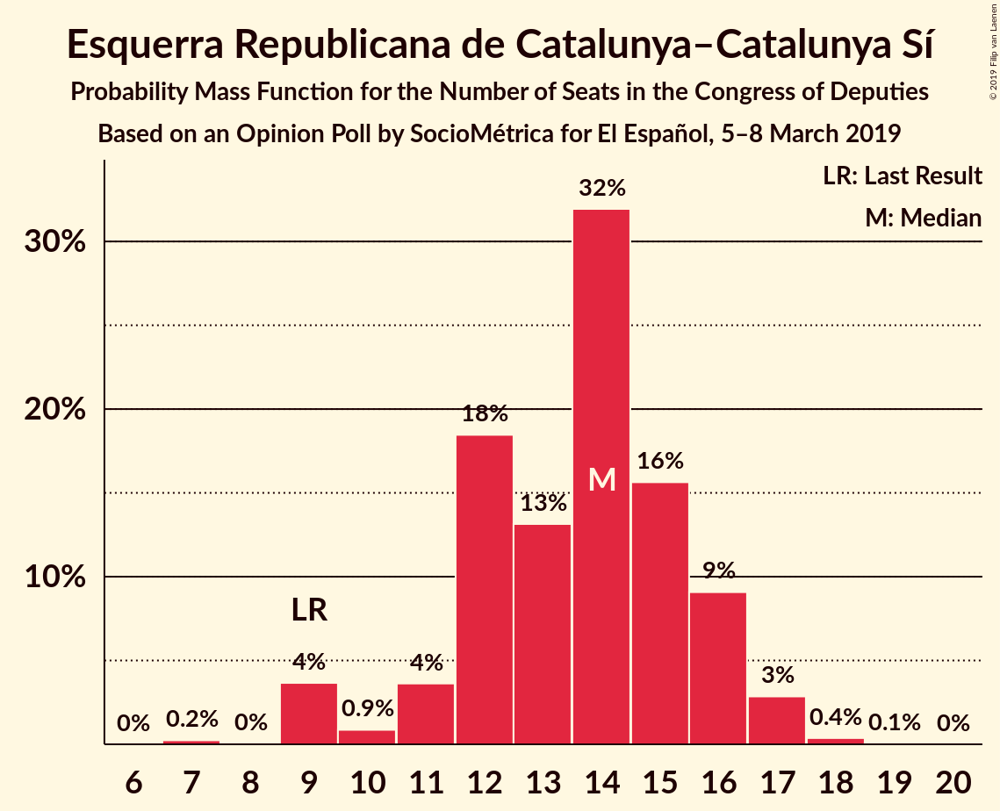
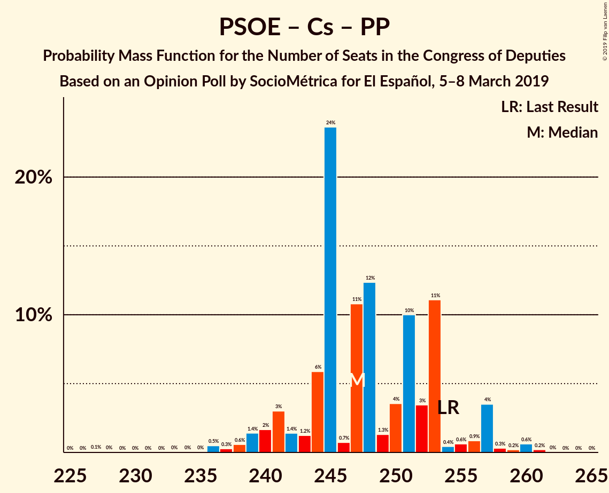
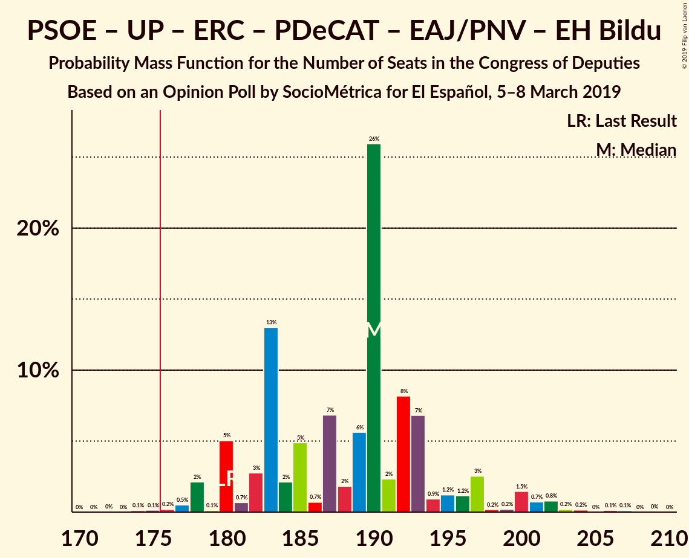
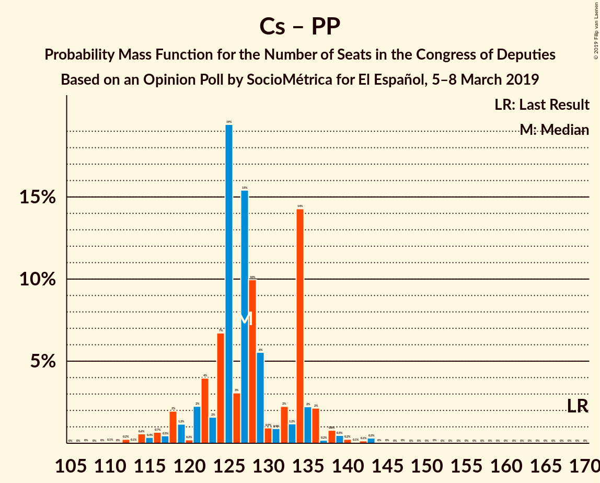
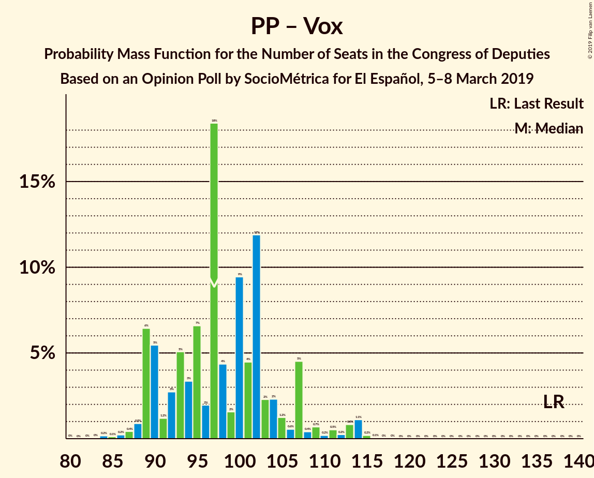

# Opinion Poll by SocioMétrica for El Español, 5–8 March 2019

<a href="#voting-intentions">Voting Intentions</a> | <a href="#seats">Seats</a> | <a href="#coalitions">Coalitions</a> | <a href="#technical-information">Technical Information</a>

## Voting Intentions

### Confidence Intervals

| Party | Last Result | Poll Result | 80% Confidence Interval | 90% Confidence Interval | 95% Confidence Interval | 99% Confidence Interval |
|:-----:|:-----------:|:-----------:|:-----------------------:|:-----------------------:|:-----------------------:|:-----------------------:|
| Partido Socialista Obrero Español | 22.6% | 27.6% | 26.2–29.1% |25.8–29.5% |25.5–29.9% |24.8–30.6% |
| Ciudadanos–Partido de la Ciudadanía | 13.1% | 17.8% | 16.6–19.1% |16.3–19.5% |16.0–19.8% |15.5–20.4% |
| Partido Popular | 33.0% | 17.5% | 16.3–18.8% |16.0–19.1% |15.7–19.4% |15.2–20.1% |
| Unidos Podemos | 21.2% | 14.1% | 13.1–15.3% |12.8–15.6% |12.5–15.9% |12.0–16.5% |
| Vox | 0.2% | 12.1% | 11.1–13.2% |10.9–13.5% |10.6–13.8% |10.2–14.4% |
| Esquerra Republicana de Catalunya–Catalunya Sí | 2.7% | 3.1% | 2.6–3.8% |2.5–3.9% |2.4–4.1% |2.2–4.4% |
| Partido Animalista Contra el Maltrato Animal | 1.2% | 2.0% | 1.6–2.5% |1.5–2.7% |1.4–2.8% |1.2–3.1% |
| Partit Demòcrata Europeu Català | 2.0% | 1.5% | 1.2–2.0% |1.1–2.1% |1.0–2.2% |0.9–2.5% |
| Euzko Alderdi Jeltzalea/Partido Nacionalista Vasco | 1.2% | 1.0% | 0.7–1.4% |0.7–1.5% |0.6–1.6% |0.5–1.8% |
| Euskal Herria Bildu | 0.8% | 0.9% | 0.6–1.3% |0.6–1.4% |0.5–1.5% |0.4–1.7% |
| Coalición Canaria–Partido Nacionalista Canario | 0.3% | 0.2% | 0.1–0.4% |0.1–0.5% |0.1–0.5% |0.0–0.7% |

*Note:* The poll result column reflects the actual value used in the calculations. Published results may vary slightly, and in addition be rounded to fewer digits.

## Seats

### Confidence Intervals

| Party | Last Result | Median | 80% Confidence Interval | 90% Confidence Interval | 95% Confidence Interval | 99% Confidence Interval |
|:-----:|:-----------:|:------:|:-----------------------:|:-----------------------:|:-----------------------:|:-----------------------:|
| <a href="#partido-socialista-obrero-español">Partido Socialista Obrero Español</a> | 85 | 120 | 114–126 |112–129 |109–132 |105–135 |
| <a href="#ciudadanos–partido-de-la-ciudadanía">Ciudadanos–Partido de la Ciudadanía</a> | 32 | 63 | 57–67 |55–67 |53–67 |51–72 |
| <a href="#partido-popular">Partido Popular</a> | 137 | 63 | 60–71 |59–74 |59–75 |57–78 |
| <a href="#unidos-podemos">Unidos Podemos</a> | 71 | 38 | 36–42 |34–44 |33–48 |32–51 |
| <a href="#vox">Vox</a> | 0 | 32 | 28–38 |27–42 |26–42 |25–44 |
| <a href="#esquerra-republicana-de-catalunya–catalunya-sí">Esquerra Republicana de Catalunya–Catalunya Sí</a> | 9 | 14 | 12–16 |11–16 |9–17 |9–17 |
| <a href="#partido-animalista-contra-el-maltrato-animal">Partido Animalista Contra el Maltrato Animal</a> | 0 | 1 | 0–1 |0–1 |0–1 |0–1 |
| <a href="#partit-demòcrata-europeu-català">Partit Demòcrata Europeu Català</a> | 8 | 6 | 4–8 |4–8 |4–8 |3–10 |
| <a href="#euzko-alderdi-jeltzalea/partido-nacionalista-vasco">Euzko Alderdi Jeltzalea/Partido Nacionalista Vasco</a> | 5 | 6 | 3–6 |3–7 |3–7 |2–8 |
| <a href="#euskal-herria-bildu">Euskal Herria Bildu</a> | 2 | 5 | 2–7 |2–7 |2–7 |1–7 |
| <a href="#coalición-canaria–partido-nacionalista-canario">Coalición Canaria–Partido Nacionalista Canario</a> | 1 | 0 | 0–1 |0–1 |0–2 |0–2 |

### Partido Socialista Obrero Español

*For a full overview of the results for this party, see the [Partido Socialista Obrero Español](party-partidosocialistaobreroespañol.html) page.*

| Number of Seats | Probability | Accumulated | Special Marks |
|:---------------:|:-----------:|:-----------:|:-------------:|
| 85 | 0% | 100% | Last Result |
| 86 | 0% | 100% |  |
| 87 | 0% | 100% |  |
| 88 | 0% | 100% |  |
| 89 | 0% | 100% |  |
| 90 | 0% | 100% |  |
| 91 | 0% | 100% |  |
| 92 | 0% | 100% |  |
| 93 | 0% | 100% |  |
| 94 | 0% | 100% |  |
| 95 | 0% | 100% |  |
| 96 | 0% | 100% |  |
| 97 | 0% | 100% |  |
| 98 | 0% | 100% |  |
| 99 | 0% | 100% |  |
| 100 | 0% | 100% |  |
| 101 | 0% | 100% |  |
| 102 | 0% | 100% |  |
| 103 | 0% | 99.9% |  |
| 104 | 0.4% | 99.9% |  |
| 105 | 0.2% | 99.5% |  |
| 106 | 0% | 99.4% |  |
| 107 | 0.1% | 99.3% |  |
| 108 | 0.2% | 99.2% |  |
| 109 | 2% | 99.0% |  |
| 110 | 0.2% | 97% |  |
| 111 | 0.7% | 97% |  |
| 112 | 2% | 96% |  |
| 113 | 3% | 94% |  |
| 114 | 12% | 92% |  |
| 115 | 0.4% | 80% |  |
| 116 | 7% | 79% |  |
| 117 | 1.2% | 72% |  |
| 118 | 4% | 71% |  |
| 119 | 0.9% | 67% |  |
| 120 | 22% | 66% | Median |
| 121 | 2% | 44% |  |
| 122 | 7% | 42% |  |
| 123 | 11% | 35% |  |
| 124 | 4% | 24% |  |
| 125 | 4% | 20% |  |
| 126 | 7% | 16% |  |
| 127 | 1.2% | 9% |  |
| 128 | 0.5% | 8% |  |
| 129 | 3% | 8% |  |
| 130 | 0.4% | 5% |  |
| 131 | 2% | 4% |  |
| 132 | 0.4% | 3% |  |
| 133 | 0.7% | 2% |  |
| 134 | 0.6% | 2% |  |
| 135 | 0.6% | 1.0% |  |
| 136 | 0.3% | 0.4% |  |
| 137 | 0% | 0.2% |  |
| 138 | 0.1% | 0.1% |  |
| 139 | 0% | 0% |  |

### Ciudadanos–Partido de la Ciudadanía

*For a full overview of the results for this party, see the [Ciudadanos–Partido de la Ciudadanía](party-ciudadanos–partidodelaciudadanía.html) page.*

| Number of Seats | Probability | Accumulated | Special Marks |
|:---------------:|:-----------:|:-----------:|:-------------:|
| 32 | 0% | 100% | Last Result |
| 33 | 0% | 100% |  |
| 34 | 0% | 100% |  |
| 35 | 0% | 100% |  |
| 36 | 0% | 100% |  |
| 37 | 0% | 100% |  |
| 38 | 0% | 100% |  |
| 39 | 0% | 100% |  |
| 40 | 0% | 100% |  |
| 41 | 0% | 100% |  |
| 42 | 0% | 100% |  |
| 43 | 0% | 100% |  |
| 44 | 0% | 100% |  |
| 45 | 0% | 100% |  |
| 46 | 0% | 100% |  |
| 47 | 0.1% | 100% |  |
| 48 | 0% | 99.9% |  |
| 49 | 0.2% | 99.8% |  |
| 50 | 0.1% | 99.6% |  |
| 51 | 1.5% | 99.5% |  |
| 52 | 0.5% | 98% |  |
| 53 | 0.9% | 98% |  |
| 54 | 1.4% | 97% |  |
| 55 | 1.3% | 95% |  |
| 56 | 2% | 94% |  |
| 57 | 2% | 92% |  |
| 58 | 4% | 89% |  |
| 59 | 0.4% | 85% |  |
| 60 | 8% | 85% |  |
| 61 | 2% | 77% |  |
| 62 | 20% | 75% |  |
| 63 | 18% | 55% | Median |
| 64 | 9% | 37% |  |
| 65 | 9% | 28% |  |
| 66 | 4% | 19% |  |
| 67 | 13% | 15% |  |
| 68 | 0.7% | 2% |  |
| 69 | 0.3% | 2% |  |
| 70 | 0.2% | 1.3% |  |
| 71 | 0.2% | 1.1% |  |
| 72 | 0.9% | 1.0% |  |
| 73 | 0% | 0% |  |

### Partido Popular

*For a full overview of the results for this party, see the [Partido Popular](party-partidopopular.html) page.*

| Number of Seats | Probability | Accumulated | Special Marks |
|:---------------:|:-----------:|:-----------:|:-------------:|
| 52 | 0% | 100% |  |
| 53 | 0% | 99.9% |  |
| 54 | 0.1% | 99.9% |  |
| 55 | 0% | 99.8% |  |
| 56 | 0.2% | 99.8% |  |
| 57 | 0.6% | 99.6% |  |
| 58 | 0.9% | 98.9% |  |
| 59 | 5% | 98% |  |
| 60 | 8% | 93% |  |
| 61 | 8% | 84% |  |
| 62 | 3% | 77% |  |
| 63 | 25% | 74% | Median |
| 64 | 8% | 49% |  |
| 65 | 8% | 41% |  |
| 66 | 3% | 32% |  |
| 67 | 2% | 29% |  |
| 68 | 0.6% | 26% |  |
| 69 | 0.6% | 26% |  |
| 70 | 4% | 25% |  |
| 71 | 12% | 22% |  |
| 72 | 0.9% | 10% |  |
| 73 | 1.3% | 9% |  |
| 74 | 5% | 8% |  |
| 75 | 2% | 3% |  |
| 76 | 0.3% | 1.2% |  |
| 77 | 0.1% | 0.9% |  |
| 78 | 0.4% | 0.8% |  |
| 79 | 0.1% | 0.4% |  |
| 80 | 0.1% | 0.3% |  |
| 81 | 0% | 0.2% |  |
| 82 | 0.1% | 0.2% |  |
| 83 | 0.1% | 0.1% |  |
| 84 | 0% | 0% |  |
| 85 | 0% | 0% |  |
| 86 | 0% | 0% |  |
| 87 | 0% | 0% |  |
| 88 | 0% | 0% |  |
| 89 | 0% | 0% |  |
| 90 | 0% | 0% |  |
| 91 | 0% | 0% |  |
| 92 | 0% | 0% |  |
| 93 | 0% | 0% |  |
| 94 | 0% | 0% |  |
| 95 | 0% | 0% |  |
| 96 | 0% | 0% |  |
| 97 | 0% | 0% |  |
| 98 | 0% | 0% |  |
| 99 | 0% | 0% |  |
| 100 | 0% | 0% |  |
| 101 | 0% | 0% |  |
| 102 | 0% | 0% |  |
| 103 | 0% | 0% |  |
| 104 | 0% | 0% |  |
| 105 | 0% | 0% |  |
| 106 | 0% | 0% |  |
| 107 | 0% | 0% |  |
| 108 | 0% | 0% |  |
| 109 | 0% | 0% |  |
| 110 | 0% | 0% |  |
| 111 | 0% | 0% |  |
| 112 | 0% | 0% |  |
| 113 | 0% | 0% |  |
| 114 | 0% | 0% |  |
| 115 | 0% | 0% |  |
| 116 | 0% | 0% |  |
| 117 | 0% | 0% |  |
| 118 | 0% | 0% |  |
| 119 | 0% | 0% |  |
| 120 | 0% | 0% |  |
| 121 | 0% | 0% |  |
| 122 | 0% | 0% |  |
| 123 | 0% | 0% |  |
| 124 | 0% | 0% |  |
| 125 | 0% | 0% |  |
| 126 | 0% | 0% |  |
| 127 | 0% | 0% |  |
| 128 | 0% | 0% |  |
| 129 | 0% | 0% |  |
| 130 | 0% | 0% |  |
| 131 | 0% | 0% |  |
| 132 | 0% | 0% |  |
| 133 | 0% | 0% |  |
| 134 | 0% | 0% |  |
| 135 | 0% | 0% |  |
| 136 | 0% | 0% |  |
| 137 | 0% | 0% | Last Result |

### Unidos Podemos

*For a full overview of the results for this party, see the [Unidos Podemos](party-unidospodemos.html) page.*

| Number of Seats | Probability | Accumulated | Special Marks |
|:---------------:|:-----------:|:-----------:|:-------------:|
| 28 | 0% | 100% |  |
| 29 | 0.1% | 99.9% |  |
| 30 | 0.1% | 99.9% |  |
| 31 | 0.3% | 99.8% |  |
| 32 | 1.3% | 99.6% |  |
| 33 | 1.4% | 98% |  |
| 34 | 2% | 97% |  |
| 35 | 1.3% | 95% |  |
| 36 | 15% | 93% |  |
| 37 | 14% | 78% |  |
| 38 | 35% | 64% | Median |
| 39 | 2% | 29% |  |
| 40 | 9% | 27% |  |
| 41 | 2% | 18% |  |
| 42 | 8% | 16% |  |
| 43 | 0.9% | 8% |  |
| 44 | 2% | 7% |  |
| 45 | 2% | 5% |  |
| 46 | 0.2% | 3% |  |
| 47 | 0.2% | 3% |  |
| 48 | 1.0% | 3% |  |
| 49 | 1.3% | 2% |  |
| 50 | 0% | 0.6% |  |
| 51 | 0.2% | 0.5% |  |
| 52 | 0.1% | 0.3% |  |
| 53 | 0% | 0.2% |  |
| 54 | 0.1% | 0.2% |  |
| 55 | 0% | 0% |  |
| 56 | 0% | 0% |  |
| 57 | 0% | 0% |  |
| 58 | 0% | 0% |  |
| 59 | 0% | 0% |  |
| 60 | 0% | 0% |  |
| 61 | 0% | 0% |  |
| 62 | 0% | 0% |  |
| 63 | 0% | 0% |  |
| 64 | 0% | 0% |  |
| 65 | 0% | 0% |  |
| 66 | 0% | 0% |  |
| 67 | 0% | 0% |  |
| 68 | 0% | 0% |  |
| 69 | 0% | 0% |  |
| 70 | 0% | 0% |  |
| 71 | 0% | 0% | Last Result |

### Vox

*For a full overview of the results for this party, see the [Vox](party-vox.html) page.*

| Number of Seats | Probability | Accumulated | Special Marks |
|:---------------:|:-----------:|:-----------:|:-------------:|
| 0 | 0% | 100% | Last Result |
| 1 | 0% | 100% |  |
| 2 | 0% | 100% |  |
| 3 | 0% | 100% |  |
| 4 | 0% | 100% |  |
| 5 | 0% | 100% |  |
| 6 | 0% | 100% |  |
| 7 | 0% | 100% |  |
| 8 | 0% | 100% |  |
| 9 | 0% | 100% |  |
| 10 | 0% | 100% |  |
| 11 | 0% | 100% |  |
| 12 | 0% | 100% |  |
| 13 | 0% | 100% |  |
| 14 | 0% | 100% |  |
| 15 | 0% | 100% |  |
| 16 | 0% | 100% |  |
| 17 | 0% | 100% |  |
| 18 | 0% | 100% |  |
| 19 | 0% | 100% |  |
| 20 | 0% | 100% |  |
| 21 | 0% | 100% |  |
| 22 | 0% | 100% |  |
| 23 | 0.1% | 100% |  |
| 24 | 0.2% | 99.9% |  |
| 25 | 0.5% | 99.7% |  |
| 26 | 3% | 99.2% |  |
| 27 | 4% | 96% |  |
| 28 | 2% | 92% |  |
| 29 | 7% | 90% |  |
| 30 | 6% | 83% |  |
| 31 | 19% | 77% |  |
| 32 | 8% | 57% | Median |
| 33 | 4% | 49% |  |
| 34 | 23% | 45% |  |
| 35 | 4% | 22% |  |
| 36 | 3% | 18% |  |
| 37 | 5% | 15% |  |
| 38 | 1.0% | 10% |  |
| 39 | 1.0% | 9% |  |
| 40 | 3% | 8% |  |
| 41 | 0.6% | 6% |  |
| 42 | 4% | 5% |  |
| 43 | 0.1% | 1.4% |  |
| 44 | 1.0% | 1.3% |  |
| 45 | 0.1% | 0.2% |  |
| 46 | 0% | 0.1% |  |
| 47 | 0% | 0.1% |  |
| 48 | 0% | 0% |  |

### Esquerra Republicana de Catalunya–Catalunya Sí

*For a full overview of the results for this party, see the [Esquerra Republicana de Catalunya–Catalunya Sí](party-esquerrarepublicanadecatalunya–catalunyasí.html) page.*

| Number of Seats | Probability | Accumulated | Special Marks |
|:---------------:|:-----------:|:-----------:|:-------------:|
| 7 | 0.2% | 100% |  |
| 8 | 0% | 99.8% |  |
| 9 | 4% | 99.7% | Last Result |
| 10 | 0.9% | 96% |  |
| 11 | 4% | 95% |  |
| 12 | 18% | 92% |  |
| 13 | 13% | 73% |  |
| 14 | 32% | 60% | Median |
| 15 | 16% | 28% |  |
| 16 | 9% | 12% |  |
| 17 | 3% | 3% |  |
| 18 | 0.4% | 0.4% |  |
| 19 | 0.1% | 0.1% |  |
| 20 | 0% | 0% |  |

### Partido Animalista Contra el Maltrato Animal

*For a full overview of the results for this party, see the [Partido Animalista Contra el Maltrato Animal](party-partidoanimalistacontraelmaltratoanimal.html) page.*

| Number of Seats | Probability | Accumulated | Special Marks |
|:---------------:|:-----------:|:-----------:|:-------------:|
| 0 | 26% | 100% | Last Result |
| 1 | 74% | 74% | Median |
| 2 | 0% | 0% |  |

### Partit Demòcrata Europeu Català

*For a full overview of the results for this party, see the [Partit Demòcrata Europeu Català](party-partitdemòcrataeuropeucatalà.html) page.*

| Number of Seats | Probability | Accumulated | Special Marks |
|:---------------:|:-----------:|:-----------:|:-------------:|
| 1 | 0.1% | 100% |  |
| 2 | 0% | 99.9% |  |
| 3 | 1.3% | 99.8% |  |
| 4 | 17% | 98.6% |  |
| 5 | 8% | 81% |  |
| 6 | 48% | 73% | Median |
| 7 | 3% | 26% |  |
| 8 | 20% | 22% | Last Result |
| 9 | 1.2% | 2% |  |
| 10 | 0.5% | 0.8% |  |
| 11 | 0% | 0.2% |  |
| 12 | 0.2% | 0.2% |  |
| 13 | 0% | 0% |  |

### Euzko Alderdi Jeltzalea/Partido Nacionalista Vasco

*For a full overview of the results for this party, see the [Euzko Alderdi Jeltzalea/Partido Nacionalista Vasco](party-euzkoalderdijeltzaleapartidonacionalistavasco.html) page.*

| Number of Seats | Probability | Accumulated | Special Marks |
|:---------------:|:-----------:|:-----------:|:-------------:|
| 1 | 0.1% | 100% |  |
| 2 | 0.9% | 99.9% |  |
| 3 | 14% | 99.1% |  |
| 4 | 17% | 85% |  |
| 5 | 3% | 68% | Last Result |
| 6 | 59% | 65% | Median |
| 7 | 4% | 5% |  |
| 8 | 1.1% | 2% |  |
| 9 | 0.3% | 0.4% |  |
| 10 | 0.1% | 0.1% |  |
| 11 | 0% | 0% |  |

### Euskal Herria Bildu

*For a full overview of the results for this party, see the [Euskal Herria Bildu](party-euskalherriabildu.html) page.*

| Number of Seats | Probability | Accumulated | Special Marks |
|:---------------:|:-----------:|:-----------:|:-------------:|
| 0 | 0.3% | 100% |  |
| 1 | 1.4% | 99.7% |  |
| 2 | 25% | 98% | Last Result |
| 3 | 1.4% | 73% |  |
| 4 | 15% | 72% |  |
| 5 | 12% | 57% | Median |
| 6 | 22% | 45% |  |
| 7 | 23% | 24% |  |
| 8 | 0.3% | 0.4% |  |
| 9 | 0.1% | 0.1% |  |
| 10 | 0% | 0% |  |

### Coalición Canaria–Partido Nacionalista Canario

*For a full overview of the results for this party, see the [Coalición Canaria–Partido Nacionalista Canario](party-coalicióncanaria–partidonacionalistacanario.html) page.*

| Number of Seats | Probability | Accumulated | Special Marks |
|:---------------:|:-----------:|:-----------:|:-------------:|
| 0 | 51% | 100% | Median |
| 1 | 46% | 49% | Last Result |
| 2 | 3% | 3% |  |
| 3 | 0.1% | 0.1% |  |
| 4 | 0.1% | 0.1% |  |
| 5 | 0% | 0% |  |

## Coalitions

### Confidence Intervals

| Coalition | Last Result | Median | Majority? | 80% Confidence Interval | 90% Confidence Interval | 95% Confidence Interval | 99% Confidence Interval |
|:---------:|:-----------:|:------:|:---------:|:-----------------------:|:-----------------------:|:-----------------------:|:-----------------------:|
| Partido Socialista Obrero Español – Ciudadanos–Partido de la Ciudadanía – Partido Popular | 254 | 247 | 100% | 243–253 | 241–256 | 239–257 | 236–260 |
| Partido Socialista Obrero Español – Ciudadanos–Partido de la Ciudadanía – Unidos Podemos | 188 | 220 | 100% | 215–230 | 212–231 | 209–232 | 204–235 |
| Partido Socialista Obrero Español – Unidos Podemos – Esquerra Republicana de Catalunya–Catalunya Sí – Partit Demòcrata Europeu Català – Euzko Alderdi Jeltzalea/Partido Nacionalista Vasco – Euskal Herria Bildu | 180 | 190 | 99.6% | 182–193 | 180–197 | 178–200 | 176–203 |
| Partido Socialista Obrero Español – Partido Popular | 222 | 185 | 98% | 181–193 | 180–197 | 176–197 | 174–202 |
| Partido Socialista Obrero Español – Ciudadanos–Partido de la Ciudadanía | 117 | 182 | 92% | 176–192 | 173–193 | 169–193 | 165–196 |
| Partido Socialista Obrero Español – Unidos Podemos – Esquerra Republicana de Catalunya–Catalunya Sí – Partit Demòcrata Europeu Català | 173 | 178 | 69% | 172–185 | 170–188 | 169–189 | 166–195 |
| Partido Socialista Obrero Español – Unidos Podemos – Esquerra Republicana de Catalunya–Catalunya Sí – Euskal Herria Bildu | 167 | 178 | 66% | 170–183 | 170–186 | 166–189 | 165–193 |
| Partido Socialista Obrero Español – Unidos Podemos – Euzko Alderdi Jeltzalea/Partido Nacionalista Vasco – Euskal Herria Bildu | 163 | 170 | 8% | 163–175 | 161–179 | 159–181 | 156–185 |
| Partido Socialista Obrero Español – Unidos Podemos – Euzko Alderdi Jeltzalea/Partido Nacionalista Vasco | 161 | 164 | 4% | 156–171 | 156–174 | 154–176 | 151–181 |
| Partido Socialista Obrero Español – Unidos Podemos | 156 | 158 | 0.6% | 152–165 | 151–169 | 149–171 | 146–177 |
| Ciudadanos–Partido de la Ciudadanía – Partido Popular – Vox | 169 | 159 | 0.1% | 155–167 | 152–170 | 149–170 | 146–172 |
| Ciudadanos–Partido de la Ciudadanía – Partido Popular – Euzko Alderdi Jeltzalea/Partido Nacionalista Vasco | 174 | 133 | 0% | 127–139 | 124–140 | 123–142 | 117–148 |
| Ciudadanos–Partido de la Ciudadanía – Partido Popular – Coalición Canaria–Partido Nacionalista Canario | 170 | 128 | 0% | 122–135 | 120–136 | 118–137 | 114–142 |
| Ciudadanos–Partido de la Ciudadanía – Partido Popular | 169 | 127 | 0% | 122–134 | 119–135 | 118–136 | 114–142 |
| Partido Socialista Obrero Español | 85 | 120 | 0% | 114–126 | 112–129 | 109–132 | 105–135 |
| Partido Popular – Vox | 137 | 97 | 0% | 90–105 | 89–107 | 89–111 | 86–114 |
| Partido Popular | 137 | 63 | 0% | 60–71 | 59–74 | 59–75 | 57–78 |

### Partido Socialista Obrero Español – Ciudadanos–Partido de la Ciudadanía – Partido Popular

| Number of Seats | Probability | Accumulated | Special Marks |
|:---------------:|:-----------:|:-----------:|:-------------:|
| 227 | 0.1% | 100% |  |
| 228 | 0% | 99.9% |  |
| 229 | 0% | 99.9% |  |
| 230 | 0% | 99.9% |  |
| 231 | 0% | 99.9% |  |
| 232 | 0% | 99.9% |  |
| 233 | 0% | 99.9% |  |
| 234 | 0% | 99.8% |  |
| 235 | 0% | 99.8% |  |
| 236 | 0.5% | 99.8% |  |
| 237 | 0.3% | 99.3% |  |
| 238 | 0.6% | 99.0% |  |
| 239 | 1.4% | 98% |  |
| 240 | 2% | 97% |  |
| 241 | 3% | 95% |  |
| 242 | 1.4% | 92% |  |
| 243 | 1.2% | 91% |  |
| 244 | 6% | 90% |  |
| 245 | 24% | 84% |  |
| 246 | 0.7% | 60% | Median |
| 247 | 11% | 59% |  |
| 248 | 12% | 49% |  |
| 249 | 1.3% | 36% |  |
| 250 | 4% | 35% |  |
| 251 | 10% | 31% |  |
| 252 | 3% | 21% |  |
| 253 | 11% | 18% |  |
| 254 | 0.4% | 7% | Last Result |
| 255 | 0.6% | 6% |  |
| 256 | 0.9% | 6% |  |
| 257 | 4% | 5% |  |
| 258 | 0.3% | 1.4% |  |
| 259 | 0.2% | 1.1% |  |
| 260 | 0.6% | 0.9% |  |
| 261 | 0.2% | 0.3% |  |
| 262 | 0% | 0.1% |  |
| 263 | 0% | 0.1% |  |
| 264 | 0% | 0% |  |

### Partido Socialista Obrero Español – Ciudadanos–Partido de la Ciudadanía – Unidos Podemos

| Number of Seats | Probability | Accumulated | Special Marks |
|:---------------:|:-----------:|:-----------:|:-------------:|
| 188 | 0% | 100% | Last Result |
| 189 | 0% | 100% |  |
| 190 | 0% | 100% |  |
| 191 | 0% | 100% |  |
| 192 | 0% | 100% |  |
| 193 | 0% | 100% |  |
| 194 | 0% | 100% |  |
| 195 | 0% | 100% |  |
| 196 | 0% | 100% |  |
| 197 | 0% | 100% |  |
| 198 | 0% | 100% |  |
| 199 | 0% | 100% |  |
| 200 | 0% | 100% |  |
| 201 | 0% | 100% |  |
| 202 | 0.3% | 99.9% |  |
| 203 | 0.1% | 99.7% |  |
| 204 | 0.1% | 99.6% |  |
| 205 | 1.2% | 99.5% |  |
| 206 | 0.1% | 98% |  |
| 207 | 0.1% | 98% |  |
| 208 | 0.6% | 98% |  |
| 209 | 0.3% | 98% |  |
| 210 | 1.0% | 97% |  |
| 211 | 0.4% | 96% |  |
| 212 | 1.1% | 96% |  |
| 213 | 2% | 95% |  |
| 214 | 1.2% | 93% |  |
| 215 | 11% | 92% |  |
| 216 | 4% | 81% |  |
| 217 | 3% | 77% |  |
| 218 | 2% | 75% |  |
| 219 | 5% | 73% |  |
| 220 | 22% | 68% |  |
| 221 | 7% | 46% | Median |
| 222 | 3% | 39% |  |
| 223 | 4% | 35% |  |
| 224 | 2% | 31% |  |
| 225 | 3% | 29% |  |
| 226 | 3% | 26% |  |
| 227 | 3% | 23% |  |
| 228 | 4% | 19% |  |
| 229 | 1.4% | 16% |  |
| 230 | 5% | 14% |  |
| 231 | 6% | 9% |  |
| 232 | 0.9% | 3% |  |
| 233 | 0.1% | 2% |  |
| 234 | 0.8% | 1.5% |  |
| 235 | 0.2% | 0.7% |  |
| 236 | 0.3% | 0.5% |  |
| 237 | 0% | 0.2% |  |
| 238 | 0% | 0.1% |  |
| 239 | 0.1% | 0.1% |  |
| 240 | 0% | 0% |  |

### Partido Socialista Obrero Español – Unidos Podemos – Esquerra Republicana de Catalunya–Catalunya Sí – Partit Demòcrata Europeu Català – Euzko Alderdi Jeltzalea/Partido Nacionalista Vasco – Euskal Herria Bildu

| Number of Seats | Probability | Accumulated | Special Marks |
|:---------------:|:-----------:|:-----------:|:-------------:|
| 171 | 0% | 100% |  |
| 172 | 0% | 99.9% |  |
| 173 | 0% | 99.9% |  |
| 174 | 0.1% | 99.9% |  |
| 175 | 0.1% | 99.8% |  |
| 176 | 0.2% | 99.6% | Majority |
| 177 | 0.5% | 99.4% |  |
| 178 | 2% | 98.9% |  |
| 179 | 0.1% | 97% |  |
| 180 | 5% | 97% | Last Result |
| 181 | 0.7% | 92% |  |
| 182 | 3% | 91% |  |
| 183 | 13% | 88% |  |
| 184 | 2% | 75% |  |
| 185 | 5% | 73% |  |
| 186 | 0.7% | 68% |  |
| 187 | 7% | 67% |  |
| 188 | 2% | 61% |  |
| 189 | 6% | 59% | Median |
| 190 | 26% | 53% |  |
| 191 | 2% | 27% |  |
| 192 | 8% | 25% |  |
| 193 | 7% | 17% |  |
| 194 | 0.9% | 10% |  |
| 195 | 1.2% | 9% |  |
| 196 | 1.2% | 8% |  |
| 197 | 3% | 7% |  |
| 198 | 0.2% | 4% |  |
| 199 | 0.2% | 4% |  |
| 200 | 1.5% | 4% |  |
| 201 | 0.7% | 2% |  |
| 202 | 0.8% | 1.4% |  |
| 203 | 0.2% | 0.6% |  |
| 204 | 0.2% | 0.4% |  |
| 205 | 0% | 0.3% |  |
| 206 | 0.1% | 0.3% |  |
| 207 | 0.1% | 0.2% |  |
| 208 | 0% | 0% |  |

### Partido Socialista Obrero Español – Partido Popular

| Number of Seats | Probability | Accumulated | Special Marks |
|:---------------:|:-----------:|:-----------:|:-------------:|
| 167 | 0.1% | 100% |  |
| 168 | 0% | 99.9% |  |
| 169 | 0% | 99.9% |  |
| 170 | 0% | 99.8% |  |
| 171 | 0% | 99.8% |  |
| 172 | 0% | 99.8% |  |
| 173 | 0.1% | 99.8% |  |
| 174 | 0.3% | 99.6% |  |
| 175 | 2% | 99.4% |  |
| 176 | 1.1% | 98% | Majority |
| 177 | 0.2% | 97% |  |
| 178 | 0.4% | 96% |  |
| 179 | 0.4% | 96% |  |
| 180 | 2% | 96% |  |
| 181 | 5% | 93% |  |
| 182 | 12% | 89% |  |
| 183 | 22% | 77% | Median |
| 184 | 4% | 56% |  |
| 185 | 12% | 52% |  |
| 186 | 14% | 40% |  |
| 187 | 6% | 26% |  |
| 188 | 3% | 20% |  |
| 189 | 0.6% | 17% |  |
| 190 | 3% | 17% |  |
| 191 | 2% | 14% |  |
| 192 | 2% | 12% |  |
| 193 | 1.5% | 10% |  |
| 194 | 1.1% | 9% |  |
| 195 | 0.7% | 8% |  |
| 196 | 2% | 7% |  |
| 197 | 4% | 5% |  |
| 198 | 0.2% | 1.1% |  |
| 199 | 0.2% | 0.9% |  |
| 200 | 0.1% | 0.7% |  |
| 201 | 0% | 0.6% |  |
| 202 | 0% | 0.5% |  |
| 203 | 0.1% | 0.5% |  |
| 204 | 0% | 0.4% |  |
| 205 | 0% | 0.4% |  |
| 206 | 0% | 0.4% |  |
| 207 | 0% | 0.3% |  |
| 208 | 0.2% | 0.3% |  |
| 209 | 0.1% | 0.1% |  |
| 210 | 0% | 0% |  |
| 211 | 0% | 0% |  |
| 212 | 0% | 0% |  |
| 213 | 0% | 0% |  |
| 214 | 0% | 0% |  |
| 215 | 0% | 0% |  |
| 216 | 0% | 0% |  |
| 217 | 0% | 0% |  |
| 218 | 0% | 0% |  |
| 219 | 0% | 0% |  |
| 220 | 0% | 0% |  |
| 221 | 0% | 0% |  |
| 222 | 0% | 0% | Last Result |

### Partido Socialista Obrero Español – Ciudadanos–Partido de la Ciudadanía

| Number of Seats | Probability | Accumulated | Special Marks |
|:---------------:|:-----------:|:-----------:|:-------------:|
| 117 | 0% | 100% | Last Result |
| 118 | 0% | 100% |  |
| 119 | 0% | 100% |  |
| 120 | 0% | 100% |  |
| 121 | 0% | 100% |  |
| 122 | 0% | 100% |  |
| 123 | 0% | 100% |  |
| 124 | 0% | 100% |  |
| 125 | 0% | 100% |  |
| 126 | 0% | 100% |  |
| 127 | 0% | 100% |  |
| 128 | 0% | 100% |  |
| 129 | 0% | 100% |  |
| 130 | 0% | 100% |  |
| 131 | 0% | 100% |  |
| 132 | 0% | 100% |  |
| 133 | 0% | 100% |  |
| 134 | 0% | 100% |  |
| 135 | 0% | 100% |  |
| 136 | 0% | 100% |  |
| 137 | 0% | 100% |  |
| 138 | 0% | 100% |  |
| 139 | 0% | 100% |  |
| 140 | 0% | 100% |  |
| 141 | 0% | 100% |  |
| 142 | 0% | 100% |  |
| 143 | 0% | 100% |  |
| 144 | 0% | 100% |  |
| 145 | 0% | 100% |  |
| 146 | 0% | 100% |  |
| 147 | 0% | 100% |  |
| 148 | 0% | 100% |  |
| 149 | 0% | 100% |  |
| 150 | 0% | 100% |  |
| 151 | 0% | 100% |  |
| 152 | 0% | 100% |  |
| 153 | 0% | 100% |  |
| 154 | 0% | 100% |  |
| 155 | 0% | 100% |  |
| 156 | 0% | 100% |  |
| 157 | 0% | 100% |  |
| 158 | 0% | 100% |  |
| 159 | 0% | 100% |  |
| 160 | 0% | 100% |  |
| 161 | 0% | 100% |  |
| 162 | 0% | 100% |  |
| 163 | 0% | 100% |  |
| 164 | 0.1% | 99.9% |  |
| 165 | 0.4% | 99.8% |  |
| 166 | 0% | 99.5% |  |
| 167 | 0.3% | 99.4% |  |
| 168 | 0.8% | 99.1% |  |
| 169 | 2% | 98% |  |
| 170 | 0.3% | 96% |  |
| 171 | 0.2% | 96% |  |
| 172 | 0.7% | 96% |  |
| 173 | 0.5% | 95% |  |
| 174 | 0.8% | 95% |  |
| 175 | 2% | 94% |  |
| 176 | 2% | 92% | Majority |
| 177 | 13% | 89% |  |
| 178 | 2% | 77% |  |
| 179 | 4% | 75% |  |
| 180 | 2% | 70% |  |
| 181 | 4% | 69% |  |
| 182 | 20% | 65% |  |
| 183 | 4% | 44% | Median |
| 184 | 7% | 40% |  |
| 185 | 2% | 34% |  |
| 186 | 6% | 32% |  |
| 187 | 2% | 26% |  |
| 188 | 6% | 24% |  |
| 189 | 2% | 18% |  |
| 190 | 2% | 16% |  |
| 191 | 2% | 14% |  |
| 192 | 4% | 12% |  |
| 193 | 6% | 8% |  |
| 194 | 0.3% | 2% |  |
| 195 | 0.6% | 1.4% |  |
| 196 | 0.4% | 0.8% |  |
| 197 | 0.3% | 0.4% |  |
| 198 | 0.1% | 0.1% |  |
| 199 | 0% | 0.1% |  |
| 200 | 0% | 0% |  |

### Partido Socialista Obrero Español – Unidos Podemos – Esquerra Republicana de Catalunya–Catalunya Sí – Partit Demòcrata Europeu Català

| Number of Seats | Probability | Accumulated | Special Marks |
|:---------------:|:-----------:|:-----------:|:-------------:|
| 162 | 0% | 100% |  |
| 163 | 0.1% | 99.9% |  |
| 164 | 0.1% | 99.8% |  |
| 165 | 0.1% | 99.7% |  |
| 166 | 0.3% | 99.7% |  |
| 167 | 0.2% | 99.4% |  |
| 168 | 2% | 99.2% |  |
| 169 | 0.7% | 98% |  |
| 170 | 3% | 97% |  |
| 171 | 1.2% | 94% |  |
| 172 | 14% | 93% |  |
| 173 | 3% | 78% | Last Result |
| 174 | 2% | 76% |  |
| 175 | 5% | 74% |  |
| 176 | 1.4% | 69% | Majority |
| 177 | 5% | 67% |  |
| 178 | 19% | 63% | Median |
| 179 | 8% | 44% |  |
| 180 | 5% | 36% |  |
| 181 | 3% | 31% |  |
| 182 | 5% | 28% |  |
| 183 | 0.9% | 24% |  |
| 184 | 8% | 23% |  |
| 185 | 6% | 15% |  |
| 186 | 2% | 9% |  |
| 187 | 2% | 7% |  |
| 188 | 1.0% | 5% |  |
| 189 | 2% | 4% |  |
| 190 | 0.8% | 2% |  |
| 191 | 0.1% | 2% |  |
| 192 | 0.1% | 1.4% |  |
| 193 | 0.1% | 1.3% |  |
| 194 | 0.6% | 1.3% |  |
| 195 | 0.2% | 0.7% |  |
| 196 | 0.2% | 0.5% |  |
| 197 | 0% | 0.3% |  |
| 198 | 0.2% | 0.3% |  |
| 199 | 0.1% | 0.2% |  |
| 200 | 0% | 0% |  |

### Partido Socialista Obrero Español – Unidos Podemos – Esquerra Republicana de Catalunya–Catalunya Sí – Euskal Herria Bildu

| Number of Seats | Probability | Accumulated | Special Marks |
|:---------------:|:-----------:|:-----------:|:-------------:|
| 159 | 0% | 100% |  |
| 160 | 0% | 99.9% |  |
| 161 | 0% | 99.9% |  |
| 162 | 0.1% | 99.9% |  |
| 163 | 0.2% | 99.8% |  |
| 164 | 0.1% | 99.6% |  |
| 165 | 0.4% | 99.5% |  |
| 166 | 2% | 99.1% |  |
| 167 | 0.1% | 97% | Last Result |
| 168 | 0.4% | 97% |  |
| 169 | 0.9% | 97% |  |
| 170 | 6% | 96% |  |
| 171 | 11% | 90% |  |
| 172 | 3% | 79% |  |
| 173 | 2% | 75% |  |
| 174 | 3% | 74% |  |
| 175 | 5% | 71% |  |
| 176 | 10% | 66% | Majority |
| 177 | 3% | 57% | Median |
| 178 | 18% | 53% |  |
| 179 | 6% | 35% |  |
| 180 | 11% | 29% |  |
| 181 | 0.8% | 18% |  |
| 182 | 0.6% | 17% |  |
| 183 | 8% | 17% |  |
| 184 | 1.1% | 9% |  |
| 185 | 1.3% | 8% |  |
| 186 | 2% | 7% |  |
| 187 | 0.4% | 5% |  |
| 188 | 0.6% | 4% |  |
| 189 | 2% | 4% |  |
| 190 | 0.7% | 2% |  |
| 191 | 0.1% | 1.4% |  |
| 192 | 0.1% | 1.3% |  |
| 193 | 0.7% | 1.2% |  |
| 194 | 0.2% | 0.5% |  |
| 195 | 0.1% | 0.3% |  |
| 196 | 0% | 0.3% |  |
| 197 | 0% | 0.2% |  |
| 198 | 0.1% | 0.2% |  |
| 199 | 0% | 0.1% |  |
| 200 | 0% | 0% |  |

### Partido Socialista Obrero Español – Unidos Podemos – Euzko Alderdi Jeltzalea/Partido Nacionalista Vasco – Euskal Herria Bildu

| Number of Seats | Probability | Accumulated | Special Marks |
|:---------------:|:-----------:|:-----------:|:-------------:|
| 152 | 0.1% | 100% |  |
| 153 | 0% | 99.9% |  |
| 154 | 0.1% | 99.9% |  |
| 155 | 0.2% | 99.8% |  |
| 156 | 0.2% | 99.6% |  |
| 157 | 0.4% | 99.4% |  |
| 158 | 1.3% | 99.0% |  |
| 159 | 1.1% | 98% |  |
| 160 | 0.7% | 97% |  |
| 161 | 3% | 96% |  |
| 162 | 0.9% | 93% |  |
| 163 | 14% | 92% | Last Result |
| 164 | 2% | 78% |  |
| 165 | 2% | 76% |  |
| 166 | 9% | 74% |  |
| 167 | 6% | 64% |  |
| 168 | 1.4% | 58% |  |
| 169 | 4% | 57% | Median |
| 170 | 19% | 53% |  |
| 171 | 5% | 34% |  |
| 172 | 11% | 29% |  |
| 173 | 8% | 18% |  |
| 174 | 0.5% | 11% |  |
| 175 | 2% | 10% |  |
| 176 | 0.6% | 8% | Majority |
| 177 | 0.6% | 7% |  |
| 178 | 1.0% | 7% |  |
| 179 | 2% | 6% |  |
| 180 | 1.2% | 4% |  |
| 181 | 0.9% | 3% |  |
| 182 | 0.9% | 2% |  |
| 183 | 0.2% | 0.9% |  |
| 184 | 0% | 0.7% |  |
| 185 | 0.4% | 0.7% |  |
| 186 | 0.1% | 0.3% |  |
| 187 | 0.1% | 0.1% |  |
| 188 | 0% | 0.1% |  |
| 189 | 0% | 0.1% |  |
| 190 | 0% | 0% |  |

### Partido Socialista Obrero Español – Unidos Podemos – Euzko Alderdi Jeltzalea/Partido Nacionalista Vasco

| Number of Seats | Probability | Accumulated | Special Marks |
|:---------------:|:-----------:|:-----------:|:-------------:|
| 147 | 0.1% | 100% |  |
| 148 | 0% | 99.9% |  |
| 149 | 0.1% | 99.9% |  |
| 150 | 0.2% | 99.8% |  |
| 151 | 0.3% | 99.7% |  |
| 152 | 0.1% | 99.4% |  |
| 153 | 0.5% | 99.2% |  |
| 154 | 1.5% | 98.8% |  |
| 155 | 0.5% | 97% |  |
| 156 | 12% | 97% |  |
| 157 | 3% | 85% |  |
| 158 | 1.2% | 83% |  |
| 159 | 10% | 81% |  |
| 160 | 1.1% | 71% |  |
| 161 | 1.1% | 70% | Last Result |
| 162 | 2% | 69% |  |
| 163 | 1.3% | 67% |  |
| 164 | 24% | 65% | Median |
| 165 | 10% | 41% |  |
| 166 | 0.9% | 31% |  |
| 167 | 4% | 30% |  |
| 168 | 2% | 26% |  |
| 169 | 1.0% | 24% |  |
| 170 | 9% | 23% |  |
| 171 | 6% | 14% |  |
| 172 | 2% | 8% |  |
| 173 | 0.7% | 6% |  |
| 174 | 0.4% | 5% |  |
| 175 | 1.2% | 5% |  |
| 176 | 2% | 4% | Majority |
| 177 | 1.0% | 2% |  |
| 178 | 0.1% | 1.1% |  |
| 179 | 0.2% | 1.0% |  |
| 180 | 0.3% | 0.8% |  |
| 181 | 0.3% | 0.5% |  |
| 182 | 0% | 0.2% |  |
| 183 | 0% | 0.2% |  |
| 184 | 0.1% | 0.2% |  |
| 185 | 0% | 0.1% |  |
| 186 | 0% | 0% |  |

### Partido Socialista Obrero Español – Unidos Podemos

| Number of Seats | Probability | Accumulated | Special Marks |
|:---------------:|:-----------:|:-----------:|:-------------:|
| 142 | 0% | 100% |  |
| 143 | 0% | 99.9% |  |
| 144 | 0.2% | 99.9% |  |
| 145 | 0% | 99.7% |  |
| 146 | 0.3% | 99.7% |  |
| 147 | 0.3% | 99.4% |  |
| 148 | 1.4% | 99.0% |  |
| 149 | 0.7% | 98% |  |
| 150 | 0.1% | 97% |  |
| 151 | 2% | 97% |  |
| 152 | 11% | 94% |  |
| 153 | 6% | 84% |  |
| 154 | 2% | 78% |  |
| 155 | 1.0% | 76% |  |
| 156 | 8% | 75% | Last Result |
| 157 | 2% | 67% |  |
| 158 | 21% | 65% | Median |
| 159 | 7% | 44% |  |
| 160 | 4% | 37% |  |
| 161 | 7% | 33% |  |
| 162 | 1.3% | 26% |  |
| 163 | 0.9% | 25% |  |
| 164 | 8% | 24% |  |
| 165 | 6% | 16% |  |
| 166 | 1.0% | 10% |  |
| 167 | 2% | 9% |  |
| 168 | 2% | 7% |  |
| 169 | 1.4% | 5% |  |
| 170 | 1.0% | 4% |  |
| 171 | 1.0% | 3% |  |
| 172 | 0.3% | 2% |  |
| 173 | 0.6% | 2% |  |
| 174 | 0.3% | 1.0% |  |
| 175 | 0.1% | 0.7% |  |
| 176 | 0.1% | 0.6% | Majority |
| 177 | 0.1% | 0.5% |  |
| 178 | 0.3% | 0.4% |  |
| 179 | 0.1% | 0.1% |  |
| 180 | 0% | 0.1% |  |
| 181 | 0% | 0% |  |

### Ciudadanos–Partido de la Ciudadanía – Partido Popular – Vox

| Number of Seats | Probability | Accumulated | Special Marks |
|:---------------:|:-----------:|:-----------:|:-------------:|
| 142 | 0.2% | 100% |  |
| 143 | 0% | 99.7% |  |
| 144 | 0% | 99.7% |  |
| 145 | 0.2% | 99.7% |  |
| 146 | 0.2% | 99.5% |  |
| 147 | 0.6% | 99.4% |  |
| 148 | 1.2% | 98.8% |  |
| 149 | 1.3% | 98% |  |
| 150 | 0.2% | 96% |  |
| 151 | 0.8% | 96% |  |
| 152 | 2% | 95% |  |
| 153 | 2% | 94% |  |
| 154 | 1.0% | 92% |  |
| 155 | 6% | 91% |  |
| 156 | 6% | 84% |  |
| 157 | 2% | 78% |  |
| 158 | 3% | 76% | Median |
| 159 | 23% | 73% |  |
| 160 | 9% | 50% |  |
| 161 | 7% | 41% |  |
| 162 | 2% | 34% |  |
| 163 | 1.0% | 32% |  |
| 164 | 6% | 31% |  |
| 165 | 11% | 25% |  |
| 166 | 2% | 14% |  |
| 167 | 3% | 13% |  |
| 168 | 1.4% | 10% |  |
| 169 | 2% | 8% | Last Result |
| 170 | 4% | 6% |  |
| 171 | 1.3% | 2% |  |
| 172 | 0.5% | 0.9% |  |
| 173 | 0.1% | 0.4% |  |
| 174 | 0.2% | 0.3% |  |
| 175 | 0% | 0.1% |  |
| 176 | 0% | 0.1% | Majority |
| 177 | 0% | 0.1% |  |
| 178 | 0% | 0.1% |  |
| 179 | 0% | 0% |  |

### Ciudadanos–Partido de la Ciudadanía – Partido Popular – Euzko Alderdi Jeltzalea/Partido Nacionalista Vasco

| Number of Seats | Probability | Accumulated | Special Marks |
|:---------------:|:-----------:|:-----------:|:-------------:|
| 114 | 0.1% | 100% |  |
| 115 | 0.1% | 99.9% |  |
| 116 | 0% | 99.8% |  |
| 117 | 0.3% | 99.8% |  |
| 118 | 0.2% | 99.5% |  |
| 119 | 0.6% | 99.2% |  |
| 120 | 0.5% | 98.6% |  |
| 121 | 0.2% | 98% |  |
| 122 | 0.2% | 98% |  |
| 123 | 0.5% | 98% |  |
| 124 | 2% | 97% |  |
| 125 | 4% | 95% |  |
| 126 | 0.5% | 91% |  |
| 127 | 0.6% | 90% |  |
| 128 | 2% | 90% |  |
| 129 | 4% | 88% |  |
| 130 | 11% | 84% |  |
| 131 | 21% | 73% |  |
| 132 | 1.3% | 52% | Median |
| 133 | 15% | 51% |  |
| 134 | 4% | 36% |  |
| 135 | 6% | 32% |  |
| 136 | 1.0% | 25% |  |
| 137 | 0.5% | 24% |  |
| 138 | 14% | 24% |  |
| 139 | 3% | 10% |  |
| 140 | 3% | 8% |  |
| 141 | 1.5% | 4% |  |
| 142 | 1.0% | 3% |  |
| 143 | 0.5% | 2% |  |
| 144 | 0.1% | 1.3% |  |
| 145 | 0.4% | 1.2% |  |
| 146 | 0.2% | 0.8% |  |
| 147 | 0.1% | 0.6% |  |
| 148 | 0.1% | 0.6% |  |
| 149 | 0.3% | 0.4% |  |
| 150 | 0% | 0.1% |  |
| 151 | 0% | 0.1% |  |
| 152 | 0% | 0% |  |
| 153 | 0% | 0% |  |
| 154 | 0% | 0% |  |
| 155 | 0% | 0% |  |
| 156 | 0% | 0% |  |
| 157 | 0% | 0% |  |
| 158 | 0% | 0% |  |
| 159 | 0% | 0% |  |
| 160 | 0% | 0% |  |
| 161 | 0% | 0% |  |
| 162 | 0% | 0% |  |
| 163 | 0% | 0% |  |
| 164 | 0% | 0% |  |
| 165 | 0% | 0% |  |
| 166 | 0% | 0% |  |
| 167 | 0% | 0% |  |
| 168 | 0% | 0% |  |
| 169 | 0% | 0% |  |
| 170 | 0% | 0% |  |
| 171 | 0% | 0% |  |
| 172 | 0% | 0% |  |
| 173 | 0% | 0% |  |
| 174 | 0% | 0% | Last Result |

### Ciudadanos–Partido de la Ciudadanía – Partido Popular – Coalición Canaria–Partido Nacionalista Canario

| Number of Seats | Probability | Accumulated | Special Marks |
|:---------------:|:-----------:|:-----------:|:-------------:|
| 110 | 0.1% | 100% |  |
| 111 | 0% | 99.9% |  |
| 112 | 0% | 99.9% |  |
| 113 | 0.2% | 99.9% |  |
| 114 | 0.2% | 99.6% |  |
| 115 | 0.4% | 99.4% |  |
| 116 | 0.9% | 99.0% |  |
| 117 | 0.5% | 98% |  |
| 118 | 1.3% | 98% |  |
| 119 | 1.0% | 96% |  |
| 120 | 0.6% | 95% |  |
| 121 | 2% | 95% |  |
| 122 | 4% | 93% |  |
| 123 | 2% | 89% |  |
| 124 | 0.5% | 87% |  |
| 125 | 24% | 86% |  |
| 126 | 3% | 62% | Median |
| 127 | 3% | 59% |  |
| 128 | 23% | 56% |  |
| 129 | 6% | 33% |  |
| 130 | 0.7% | 27% |  |
| 131 | 0.7% | 26% |  |
| 132 | 3% | 26% |  |
| 133 | 0.4% | 23% |  |
| 134 | 5% | 22% |  |
| 135 | 12% | 18% |  |
| 136 | 1.1% | 6% |  |
| 137 | 2% | 5% |  |
| 138 | 0.3% | 2% |  |
| 139 | 0.7% | 2% |  |
| 140 | 0.5% | 1.2% |  |
| 141 | 0.1% | 0.8% |  |
| 142 | 0.2% | 0.6% |  |
| 143 | 0.2% | 0.5% |  |
| 144 | 0.2% | 0.3% |  |
| 145 | 0% | 0.1% |  |
| 146 | 0% | 0.1% |  |
| 147 | 0% | 0.1% |  |
| 148 | 0% | 0.1% |  |
| 149 | 0% | 0% |  |
| 150 | 0% | 0% |  |
| 151 | 0% | 0% |  |
| 152 | 0% | 0% |  |
| 153 | 0% | 0% |  |
| 154 | 0% | 0% |  |
| 155 | 0% | 0% |  |
| 156 | 0% | 0% |  |
| 157 | 0% | 0% |  |
| 158 | 0% | 0% |  |
| 159 | 0% | 0% |  |
| 160 | 0% | 0% |  |
| 161 | 0% | 0% |  |
| 162 | 0% | 0% |  |
| 163 | 0% | 0% |  |
| 164 | 0% | 0% |  |
| 165 | 0% | 0% |  |
| 166 | 0% | 0% |  |
| 167 | 0% | 0% |  |
| 168 | 0% | 0% |  |
| 169 | 0% | 0% |  |
| 170 | 0% | 0% | Last Result |

### Ciudadanos–Partido de la Ciudadanía – Partido Popular

| Number of Seats | Probability | Accumulated | Special Marks |
|:---------------:|:-----------:|:-----------:|:-------------:|
| 110 | 0.1% | 100% |  |
| 111 | 0% | 99.9% |  |
| 112 | 0.2% | 99.9% |  |
| 113 | 0.1% | 99.6% |  |
| 114 | 0.6% | 99.6% |  |
| 115 | 0.4% | 99.0% |  |
| 116 | 0.7% | 98.7% |  |
| 117 | 0.5% | 98% |  |
| 118 | 2% | 98% |  |
| 119 | 1.2% | 96% |  |
| 120 | 0.2% | 94% |  |
| 121 | 2% | 94% |  |
| 122 | 4% | 92% |  |
| 123 | 2% | 88% |  |
| 124 | 7% | 86% |  |
| 125 | 19% | 80% |  |
| 126 | 3% | 60% | Median |
| 127 | 15% | 57% |  |
| 128 | 10% | 42% |  |
| 129 | 6% | 32% |  |
| 130 | 0.9% | 26% |  |
| 131 | 0.9% | 25% |  |
| 132 | 2% | 24% |  |
| 133 | 1.2% | 22% |  |
| 134 | 14% | 21% |  |
| 135 | 2% | 7% |  |
| 136 | 2% | 4% |  |
| 137 | 0.2% | 2% |  |
| 138 | 0.8% | 2% |  |
| 139 | 0.5% | 1.4% |  |
| 140 | 0.2% | 0.9% |  |
| 141 | 0.1% | 0.6% |  |
| 142 | 0.1% | 0.6% |  |
| 143 | 0.3% | 0.4% |  |
| 144 | 0% | 0.1% |  |
| 145 | 0% | 0.1% |  |
| 146 | 0% | 0.1% |  |
| 147 | 0% | 0.1% |  |
| 148 | 0% | 0% |  |
| 149 | 0% | 0% |  |
| 150 | 0% | 0% |  |
| 151 | 0% | 0% |  |
| 152 | 0% | 0% |  |
| 153 | 0% | 0% |  |
| 154 | 0% | 0% |  |
| 155 | 0% | 0% |  |
| 156 | 0% | 0% |  |
| 157 | 0% | 0% |  |
| 158 | 0% | 0% |  |
| 159 | 0% | 0% |  |
| 160 | 0% | 0% |  |
| 161 | 0% | 0% |  |
| 162 | 0% | 0% |  |
| 163 | 0% | 0% |  |
| 164 | 0% | 0% |  |
| 165 | 0% | 0% |  |
| 166 | 0% | 0% |  |
| 167 | 0% | 0% |  |
| 168 | 0% | 0% |  |
| 169 | 0% | 0% | Last Result |

### Partido Socialista Obrero Español

| Number of Seats | Probability | Accumulated | Special Marks |
|:---------------:|:-----------:|:-----------:|:-------------:|
| 85 | 0% | 100% | Last Result |
| 86 | 0% | 100% |  |
| 87 | 0% | 100% |  |
| 88 | 0% | 100% |  |
| 89 | 0% | 100% |  |
| 90 | 0% | 100% |  |
| 91 | 0% | 100% |  |
| 92 | 0% | 100% |  |
| 93 | 0% | 100% |  |
| 94 | 0% | 100% |  |
| 95 | 0% | 100% |  |
| 96 | 0% | 100% |  |
| 97 | 0% | 100% |  |
| 98 | 0% | 100% |  |
| 99 | 0% | 100% |  |
| 100 | 0% | 100% |  |
| 101 | 0% | 100% |  |
| 102 | 0% | 100% |  |
| 103 | 0% | 99.9% |  |
| 104 | 0.4% | 99.9% |  |
| 105 | 0.2% | 99.5% |  |
| 106 | 0% | 99.4% |  |
| 107 | 0.1% | 99.3% |  |
| 108 | 0.2% | 99.2% |  |
| 109 | 2% | 99.0% |  |
| 110 | 0.2% | 97% |  |
| 111 | 0.7% | 97% |  |
| 112 | 2% | 96% |  |
| 113 | 3% | 94% |  |
| 114 | 12% | 92% |  |
| 115 | 0.4% | 80% |  |
| 116 | 7% | 79% |  |
| 117 | 1.2% | 72% |  |
| 118 | 4% | 71% |  |
| 119 | 0.9% | 67% |  |
| 120 | 22% | 66% | Median |
| 121 | 2% | 44% |  |
| 122 | 7% | 42% |  |
| 123 | 11% | 35% |  |
| 124 | 4% | 24% |  |
| 125 | 4% | 20% |  |
| 126 | 7% | 16% |  |
| 127 | 1.2% | 9% |  |
| 128 | 0.5% | 8% |  |
| 129 | 3% | 8% |  |
| 130 | 0.4% | 5% |  |
| 131 | 2% | 4% |  |
| 132 | 0.4% | 3% |  |
| 133 | 0.7% | 2% |  |
| 134 | 0.6% | 2% |  |
| 135 | 0.6% | 1.0% |  |
| 136 | 0.3% | 0.4% |  |
| 137 | 0% | 0.2% |  |
| 138 | 0.1% | 0.1% |  |
| 139 | 0% | 0% |  |

### Partido Popular – Vox

| Number of Seats | Probability | Accumulated | Special Marks |
|:---------------:|:-----------:|:-----------:|:-------------:|
| 83 | 0% | 100% |  |
| 84 | 0.2% | 99.9% |  |
| 85 | 0.1% | 99.8% |  |
| 86 | 0.2% | 99.6% |  |
| 87 | 0.4% | 99.4% |  |
| 88 | 0.9% | 99.0% |  |
| 89 | 6% | 98% |  |
| 90 | 5% | 92% |  |
| 91 | 1.2% | 86% |  |
| 92 | 3% | 85% |  |
| 93 | 5% | 82% |  |
| 94 | 3% | 77% |  |
| 95 | 7% | 74% | Median |
| 96 | 2% | 67% |  |
| 97 | 18% | 65% |  |
| 98 | 4% | 47% |  |
| 99 | 2% | 43% |  |
| 100 | 9% | 41% |  |
| 101 | 4% | 32% |  |
| 102 | 12% | 27% |  |
| 103 | 2% | 15% |  |
| 104 | 2% | 13% |  |
| 105 | 1.2% | 11% |  |
| 106 | 0.6% | 9% |  |
| 107 | 5% | 9% |  |
| 108 | 0.4% | 4% |  |
| 109 | 0.7% | 4% |  |
| 110 | 0.2% | 3% |  |
| 111 | 0.5% | 3% |  |
| 112 | 0.2% | 2% |  |
| 113 | 0.8% | 2% |  |
| 114 | 1.1% | 1.4% |  |
| 115 | 0.2% | 0.3% |  |
| 116 | 0.1% | 0.1% |  |
| 117 | 0% | 0% |  |
| 118 | 0% | 0% |  |
| 119 | 0% | 0% |  |
| 120 | 0% | 0% |  |
| 121 | 0% | 0% |  |
| 122 | 0% | 0% |  |
| 123 | 0% | 0% |  |
| 124 | 0% | 0% |  |
| 125 | 0% | 0% |  |
| 126 | 0% | 0% |  |
| 127 | 0% | 0% |  |
| 128 | 0% | 0% |  |
| 129 | 0% | 0% |  |
| 130 | 0% | 0% |  |
| 131 | 0% | 0% |  |
| 132 | 0% | 0% |  |
| 133 | 0% | 0% |  |
| 134 | 0% | 0% |  |
| 135 | 0% | 0% |  |
| 136 | 0% | 0% |  |
| 137 | 0% | 0% | Last Result |

### Partido Popular

| Number of Seats | Probability | Accumulated | Special Marks |
|:---------------:|:-----------:|:-----------:|:-------------:|
| 52 | 0% | 100% |  |
| 53 | 0% | 99.9% |  |
| 54 | 0.1% | 99.9% |  |
| 55 | 0% | 99.8% |  |
| 56 | 0.2% | 99.8% |  |
| 57 | 0.6% | 99.6% |  |
| 58 | 0.9% | 98.9% |  |
| 59 | 5% | 98% |  |
| 60 | 8% | 93% |  |
| 61 | 8% | 84% |  |
| 62 | 3% | 77% |  |
| 63 | 25% | 74% | Median |
| 64 | 8% | 49% |  |
| 65 | 8% | 41% |  |
| 66 | 3% | 32% |  |
| 67 | 2% | 29% |  |
| 68 | 0.6% | 26% |  |
| 69 | 0.6% | 26% |  |
| 70 | 4% | 25% |  |
| 71 | 12% | 22% |  |
| 72 | 0.9% | 10% |  |
| 73 | 1.3% | 9% |  |
| 74 | 5% | 8% |  |
| 75 | 2% | 3% |  |
| 76 | 0.3% | 1.2% |  |
| 77 | 0.1% | 0.9% |  |
| 78 | 0.4% | 0.8% |  |
| 79 | 0.1% | 0.4% |  |
| 80 | 0.1% | 0.3% |  |
| 81 | 0% | 0.2% |  |
| 82 | 0.1% | 0.2% |  |
| 83 | 0.1% | 0.1% |  |
| 84 | 0% | 0% |  |
| 85 | 0% | 0% |  |
| 86 | 0% | 0% |  |
| 87 | 0% | 0% |  |
| 88 | 0% | 0% |  |
| 89 | 0% | 0% |  |
| 90 | 0% | 0% |  |
| 91 | 0% | 0% |  |
| 92 | 0% | 0% |  |
| 93 | 0% | 0% |  |
| 94 | 0% | 0% |  |
| 95 | 0% | 0% |  |
| 96 | 0% | 0% |  |
| 97 | 0% | 0% |  |
| 98 | 0% | 0% |  |
| 99 | 0% | 0% |  |
| 100 | 0% | 0% |  |
| 101 | 0% | 0% |  |
| 102 | 0% | 0% |  |
| 103 | 0% | 0% |  |
| 104 | 0% | 0% |  |
| 105 | 0% | 0% |  |
| 106 | 0% | 0% |  |
| 107 | 0% | 0% |  |
| 108 | 0% | 0% |  |
| 109 | 0% | 0% |  |
| 110 | 0% | 0% |  |
| 111 | 0% | 0% |  |
| 112 | 0% | 0% |  |
| 113 | 0% | 0% |  |
| 114 | 0% | 0% |  |
| 115 | 0% | 0% |  |
| 116 | 0% | 0% |  |
| 117 | 0% | 0% |  |
| 118 | 0% | 0% |  |
| 119 | 0% | 0% |  |
| 120 | 0% | 0% |  |
| 121 | 0% | 0% |  |
| 122 | 0% | 0% |  |
| 123 | 0% | 0% |  |
| 124 | 0% | 0% |  |
| 125 | 0% | 0% |  |
| 126 | 0% | 0% |  |
| 127 | 0% | 0% |  |
| 128 | 0% | 0% |  |
| 129 | 0% | 0% |  |
| 130 | 0% | 0% |  |
| 131 | 0% | 0% |  |
| 132 | 0% | 0% |  |
| 133 | 0% | 0% |  |
| 134 | 0% | 0% |  |
| 135 | 0% | 0% |  |
| 136 | 0% | 0% |  |
| 137 | 0% | 0% | Last Result |

## Technical Information

### Opinion Poll

+ **Polling firm:** SocioMétrica
+ **Commissioner(s):** El Español
+ **Fieldwork period:** 5–8 March 2019

### Calculations

+ **Sample size:** 1600
+ **Simulations done:** 1,048,576
+ **Error estimate:** 0.96%

