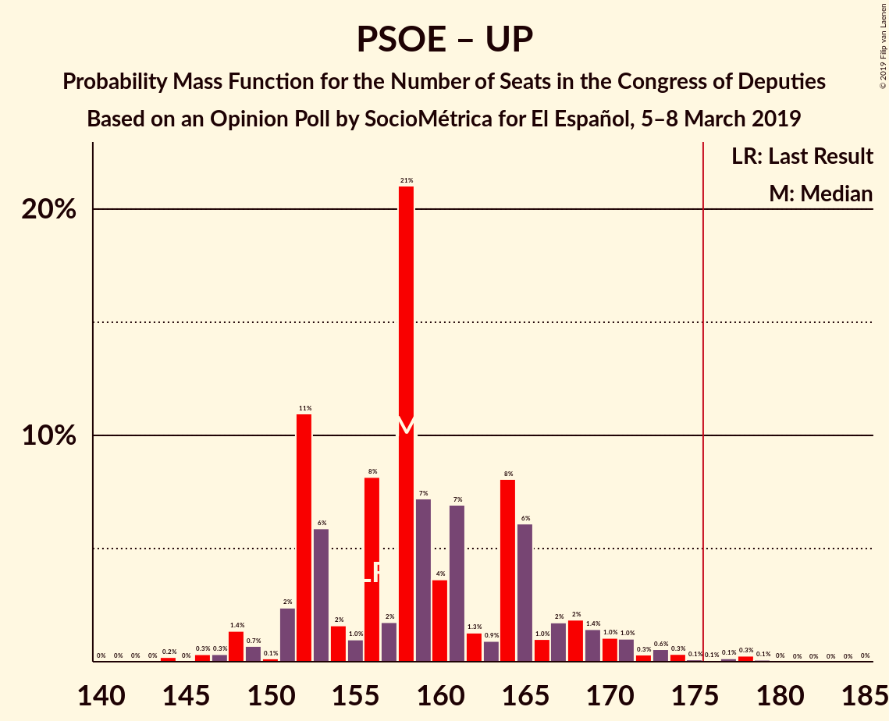
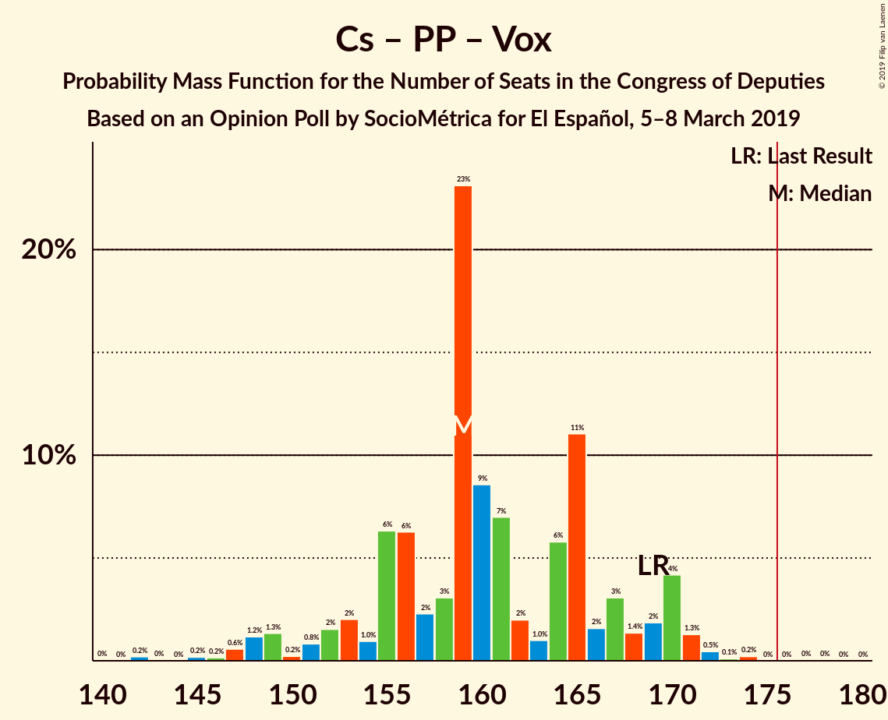

# Opinion Poll by SocioMétrica for El Español, 5–8 March 2019

<a href="#voting-intentions">Voting Intentions</a> | <a href="#seats">Seats</a> | <a href="#coalitions">Coalitions</a> | <a href="#technical-information">Technical Information</a>

## Voting Intentions

### Confidence Intervals

| Party | Last Result | Poll Result | 80% Confidence Interval | 90% Confidence Interval | 95% Confidence Interval | 99% Confidence Interval |
|:-----:|:-----------:|:-----------:|:-----------------------:|:-----------------------:|:-----------------------:|:-----------------------:|
| Partido Socialista Obrero Español | 22.6% | 27.6% | 26.2–29.1% |25.8–29.5% |25.5–29.9% |24.8–30.6% |
| Ciudadanos–Partido de la Ciudadanía | 13.1% | 17.8% | 16.6–19.1% |16.3–19.5% |16.0–19.8% |15.5–20.4% |
| Partido Popular | 33.0% | 17.5% | 16.3–18.8% |16.0–19.1% |15.7–19.4% |15.2–20.1% |
| Unidos Podemos | 21.2% | 14.1% | 13.1–15.3% |12.8–15.6% |12.5–15.9% |12.0–16.5% |
| Vox | 0.2% | 12.1% | 11.1–13.2% |10.9–13.5% |10.6–13.8% |10.2–14.4% |
| Esquerra Republicana de Catalunya–Catalunya Sí | 2.7% | 3.1% | 2.6–3.8% |2.5–3.9% |2.4–4.1% |2.2–4.4% |
| Partido Animalista Contra el Maltrato Animal | 1.2% | 2.0% | 1.6–2.5% |1.5–2.7% |1.4–2.8% |1.2–3.1% |
| Partit Demòcrata Europeu Català | 2.0% | 1.5% | 1.2–2.0% |1.1–2.1% |1.0–2.2% |0.9–2.5% |
| Euzko Alderdi Jeltzalea/Partido Nacionalista Vasco | 1.2% | 1.0% | 0.7–1.4% |0.7–1.5% |0.6–1.6% |0.5–1.8% |
| Euskal Herria Bildu | 0.8% | 0.9% | 0.6–1.3% |0.6–1.4% |0.5–1.5% |0.4–1.7% |
| Coalición Canaria–Partido Nacionalista Canario | 0.3% | 0.2% | 0.1–0.4% |0.1–0.5% |0.1–0.5% |0.0–0.7% |

*Note:* The poll result column reflects the actual value used in the calculations. Published results may vary slightly, and in addition be rounded to fewer digits.

## Seats

### Confidence Intervals

| Party | Last Result | Median | 80% Confidence Interval | 90% Confidence Interval | 95% Confidence Interval | 99% Confidence Interval |
|:-----:|:-----------:|:------:|:-----------------------:|:-----------------------:|:-----------------------:|:-----------------------:|
| <a href="#partido-socialista-obrero-español">Partido Socialista Obrero Español</a> | 85 | 114 | 112–130 |110–131 |107–131 |105–135 |
| <a href="#ciudadanos–partido-de-la-ciudadanía">Ciudadanos–Partido de la Ciudadanía</a> | 32 | 61 | 52–67 |52–68 |51–70 |48–70 |
| <a href="#partido-popular">Partido Popular</a> | 137 | 71 | 61–77 |60–78 |58–78 |53–79 |
| <a href="#unidos-podemos">Unidos Podemos</a> | 71 | 39 | 33–49 |31–49 |31–52 |29–55 |
| <a href="#vox">Vox</a> | 0 | 32 | 27–39 |24–42 |24–42 |23–43 |
| <a href="#esquerra-republicana-de-catalunya–catalunya-sí">Esquerra Republicana de Catalunya–Catalunya Sí</a> | 9 | 12 | 9–15 |9–16 |9–16 |9–18 |
| <a href="#partido-animalista-contra-el-maltrato-animal">Partido Animalista Contra el Maltrato Animal</a> | 0 | 1 | 0–1 |0–1 |0–1 |0–1 |
| <a href="#partit-demòcrata-europeu-català">Partit Demòcrata Europeu Català</a> | 8 | 6 | 4–8 |3–8 |3–10 |3–11 |
| <a href="#euzko-alderdi-jeltzalea/partido-nacionalista-vasco">Euzko Alderdi Jeltzalea/Partido Nacionalista Vasco</a> | 5 | 6 | 3–6 |3–7 |3–9 |3–10 |
| <a href="#euskal-herria-bildu">Euskal Herria Bildu</a> | 2 | 4 | 2–7 |2–7 |2–7 |1–7 |
| <a href="#coalición-canaria–partido-nacionalista-canario">Coalición Canaria–Partido Nacionalista Canario</a> | 1 | 1 | 0–2 |0–2 |0–2 |0–2 |

### Partido Socialista Obrero Español

*For a full overview of the results for this party, see the [Partido Socialista Obrero Español](party-partidosocialistaobreroespañol.html) page.*

| Number of Seats | Probability | Accumulated | Special Marks |
|:---------------:|:-----------:|:-----------:|:-------------:|
| 85 | 0% | 100% | Last Result |
| 86 | 0% | 100% |  |
| 87 | 0% | 100% |  |
| 88 | 0% | 100% |  |
| 89 | 0% | 100% |  |
| 90 | 0% | 100% |  |
| 91 | 0% | 100% |  |
| 92 | 0% | 100% |  |
| 93 | 0% | 100% |  |
| 94 | 0% | 100% |  |
| 95 | 0% | 100% |  |
| 96 | 0% | 100% |  |
| 97 | 0% | 100% |  |
| 98 | 0% | 100% |  |
| 99 | 0% | 100% |  |
| 100 | 0% | 99.9% |  |
| 101 | 0% | 99.9% |  |
| 102 | 0% | 99.9% |  |
| 103 | 0% | 99.9% |  |
| 104 | 0.2% | 99.9% |  |
| 105 | 0.4% | 99.8% |  |
| 106 | 0% | 99.3% |  |
| 107 | 2% | 99.3% |  |
| 108 | 0.6% | 97% |  |
| 109 | 1.1% | 96% |  |
| 110 | 0.7% | 95% |  |
| 111 | 0.6% | 95% |  |
| 112 | 5% | 94% |  |
| 113 | 38% | 89% |  |
| 114 | 2% | 51% | Median |
| 115 | 0.1% | 48% |  |
| 116 | 0.8% | 48% |  |
| 117 | 0.7% | 47% |  |
| 118 | 2% | 47% |  |
| 119 | 0.5% | 45% |  |
| 120 | 2% | 44% |  |
| 121 | 6% | 43% |  |
| 122 | 4% | 37% |  |
| 123 | 4% | 33% |  |
| 124 | 1.1% | 29% |  |
| 125 | 2% | 28% |  |
| 126 | 1.0% | 27% |  |
| 127 | 0.5% | 26% |  |
| 128 | 9% | 25% |  |
| 129 | 0.8% | 17% |  |
| 130 | 9% | 16% |  |
| 131 | 5% | 6% |  |
| 132 | 0.2% | 1.2% |  |
| 133 | 0.1% | 1.0% |  |
| 134 | 0% | 0.9% |  |
| 135 | 0.5% | 0.8% |  |
| 136 | 0.2% | 0.3% |  |
| 137 | 0% | 0.2% |  |
| 138 | 0.1% | 0.1% |  |
| 139 | 0% | 0% |  |

### Ciudadanos–Partido de la Ciudadanía

*For a full overview of the results for this party, see the [Ciudadanos–Partido de la Ciudadanía](party-ciudadanos–partidodelaciudadanía.html) page.*

| Number of Seats | Probability | Accumulated | Special Marks |
|:---------------:|:-----------:|:-----------:|:-------------:|
| 32 | 0% | 100% | Last Result |
| 33 | 0% | 100% |  |
| 34 | 0% | 100% |  |
| 35 | 0% | 100% |  |
| 36 | 0% | 100% |  |
| 37 | 0% | 100% |  |
| 38 | 0% | 100% |  |
| 39 | 0% | 100% |  |
| 40 | 0% | 100% |  |
| 41 | 0% | 100% |  |
| 42 | 0% | 100% |  |
| 43 | 0% | 100% |  |
| 44 | 0% | 100% |  |
| 45 | 0% | 100% |  |
| 46 | 0.2% | 100% |  |
| 47 | 0% | 99.8% |  |
| 48 | 0.8% | 99.7% |  |
| 49 | 0.3% | 98.9% |  |
| 50 | 0.2% | 98.6% |  |
| 51 | 2% | 98% |  |
| 52 | 8% | 97% |  |
| 53 | 2% | 88% |  |
| 54 | 0.2% | 86% |  |
| 55 | 3% | 86% |  |
| 56 | 18% | 83% |  |
| 57 | 2% | 65% |  |
| 58 | 0.2% | 63% |  |
| 59 | 0.5% | 63% |  |
| 60 | 1.0% | 63% |  |
| 61 | 16% | 62% | Median |
| 62 | 14% | 46% |  |
| 63 | 5% | 32% |  |
| 64 | 4% | 27% |  |
| 65 | 8% | 23% |  |
| 66 | 4% | 15% |  |
| 67 | 3% | 11% |  |
| 68 | 4% | 8% |  |
| 69 | 0.3% | 4% |  |
| 70 | 3% | 3% |  |
| 71 | 0% | 0.2% |  |
| 72 | 0% | 0.2% |  |
| 73 | 0% | 0.2% |  |
| 74 | 0% | 0.1% |  |
| 75 | 0% | 0.1% |  |
| 76 | 0% | 0.1% |  |
| 77 | 0% | 0.1% |  |
| 78 | 0% | 0.1% |  |
| 79 | 0% | 0.1% |  |
| 80 | 0% | 0% |  |

### Partido Popular

*For a full overview of the results for this party, see the [Partido Popular](party-partidopopular.html) page.*

| Number of Seats | Probability | Accumulated | Special Marks |
|:---------------:|:-----------:|:-----------:|:-------------:|
| 52 | 0.1% | 100% |  |
| 53 | 0.8% | 99.8% |  |
| 54 | 1.0% | 99.0% |  |
| 55 | 0% | 98% |  |
| 56 | 0.2% | 98% |  |
| 57 | 0.1% | 98% |  |
| 58 | 1.4% | 98% |  |
| 59 | 0.4% | 96% |  |
| 60 | 1.4% | 96% |  |
| 61 | 9% | 95% |  |
| 62 | 4% | 85% |  |
| 63 | 8% | 81% |  |
| 64 | 2% | 74% |  |
| 65 | 0.5% | 72% |  |
| 66 | 0.4% | 71% |  |
| 67 | 0.8% | 71% |  |
| 68 | 6% | 70% |  |
| 69 | 12% | 63% |  |
| 70 | 0.5% | 52% |  |
| 71 | 1.4% | 51% | Median |
| 72 | 5% | 50% |  |
| 73 | 4% | 45% |  |
| 74 | 10% | 40% |  |
| 75 | 20% | 30% |  |
| 76 | 0.2% | 10% |  |
| 77 | 1.5% | 10% |  |
| 78 | 8% | 9% |  |
| 79 | 0.1% | 0.5% |  |
| 80 | 0.1% | 0.4% |  |
| 81 | 0% | 0.3% |  |
| 82 | 0% | 0.2% |  |
| 83 | 0.1% | 0.2% |  |
| 84 | 0% | 0.1% |  |
| 85 | 0% | 0.1% |  |
| 86 | 0% | 0.1% |  |
| 87 | 0% | 0.1% |  |
| 88 | 0% | 0.1% |  |
| 89 | 0% | 0.1% |  |
| 90 | 0% | 0% |  |
| 91 | 0% | 0% |  |
| 92 | 0% | 0% |  |
| 93 | 0% | 0% |  |
| 94 | 0% | 0% |  |
| 95 | 0% | 0% |  |
| 96 | 0% | 0% |  |
| 97 | 0% | 0% |  |
| 98 | 0% | 0% |  |
| 99 | 0% | 0% |  |
| 100 | 0% | 0% |  |
| 101 | 0% | 0% |  |
| 102 | 0% | 0% |  |
| 103 | 0% | 0% |  |
| 104 | 0% | 0% |  |
| 105 | 0% | 0% |  |
| 106 | 0% | 0% |  |
| 107 | 0% | 0% |  |
| 108 | 0% | 0% |  |
| 109 | 0% | 0% |  |
| 110 | 0% | 0% |  |
| 111 | 0% | 0% |  |
| 112 | 0% | 0% |  |
| 113 | 0% | 0% |  |
| 114 | 0% | 0% |  |
| 115 | 0% | 0% |  |
| 116 | 0% | 0% |  |
| 117 | 0% | 0% |  |
| 118 | 0% | 0% |  |
| 119 | 0% | 0% |  |
| 120 | 0% | 0% |  |
| 121 | 0% | 0% |  |
| 122 | 0% | 0% |  |
| 123 | 0% | 0% |  |
| 124 | 0% | 0% |  |
| 125 | 0% | 0% |  |
| 126 | 0% | 0% |  |
| 127 | 0% | 0% |  |
| 128 | 0% | 0% |  |
| 129 | 0% | 0% |  |
| 130 | 0% | 0% |  |
| 131 | 0% | 0% |  |
| 132 | 0% | 0% |  |
| 133 | 0% | 0% |  |
| 134 | 0% | 0% |  |
| 135 | 0% | 0% |  |
| 136 | 0% | 0% |  |
| 137 | 0% | 0% | Last Result |

### Unidos Podemos

*For a full overview of the results for this party, see the [Unidos Podemos](party-unidospodemos.html) page.*

| Number of Seats | Probability | Accumulated | Special Marks |
|:---------------:|:-----------:|:-----------:|:-------------:|
| 25 | 0.1% | 100% |  |
| 26 | 0% | 99.9% |  |
| 27 | 0% | 99.9% |  |
| 28 | 0.2% | 99.8% |  |
| 29 | 0.3% | 99.6% |  |
| 30 | 0.2% | 99.3% |  |
| 31 | 4% | 99.1% |  |
| 32 | 0.5% | 95% |  |
| 33 | 5% | 94% |  |
| 34 | 1.4% | 89% |  |
| 35 | 8% | 88% |  |
| 36 | 3% | 79% |  |
| 37 | 7% | 76% |  |
| 38 | 13% | 69% |  |
| 39 | 9% | 56% | Median |
| 40 | 0.5% | 47% |  |
| 41 | 9% | 46% |  |
| 42 | 6% | 37% |  |
| 43 | 2% | 31% |  |
| 44 | 6% | 29% |  |
| 45 | 2% | 24% |  |
| 46 | 0.3% | 22% |  |
| 47 | 0.2% | 22% |  |
| 48 | 0.3% | 21% |  |
| 49 | 18% | 21% |  |
| 50 | 0% | 3% |  |
| 51 | 0.1% | 3% |  |
| 52 | 2% | 3% |  |
| 53 | 0% | 0.9% |  |
| 54 | 0.4% | 0.9% |  |
| 55 | 0.5% | 0.5% |  |
| 56 | 0% | 0.1% |  |
| 57 | 0% | 0% |  |
| 58 | 0% | 0% |  |
| 59 | 0% | 0% |  |
| 60 | 0% | 0% |  |
| 61 | 0% | 0% |  |
| 62 | 0% | 0% |  |
| 63 | 0% | 0% |  |
| 64 | 0% | 0% |  |
| 65 | 0% | 0% |  |
| 66 | 0% | 0% |  |
| 67 | 0% | 0% |  |
| 68 | 0% | 0% |  |
| 69 | 0% | 0% |  |
| 70 | 0% | 0% |  |
| 71 | 0% | 0% | Last Result |

### Vox

*For a full overview of the results for this party, see the [Vox](party-vox.html) page.*

| Number of Seats | Probability | Accumulated | Special Marks |
|:---------------:|:-----------:|:-----------:|:-------------:|
| 0 | 0% | 100% | Last Result |
| 1 | 0% | 100% |  |
| 2 | 0% | 100% |  |
| 3 | 0% | 100% |  |
| 4 | 0% | 100% |  |
| 5 | 0% | 100% |  |
| 6 | 0% | 100% |  |
| 7 | 0% | 100% |  |
| 8 | 0% | 100% |  |
| 9 | 0% | 100% |  |
| 10 | 0% | 100% |  |
| 11 | 0% | 100% |  |
| 12 | 0% | 100% |  |
| 13 | 0% | 100% |  |
| 14 | 0% | 100% |  |
| 15 | 0% | 100% |  |
| 16 | 0% | 100% |  |
| 17 | 0% | 100% |  |
| 18 | 0% | 100% |  |
| 19 | 0% | 100% |  |
| 20 | 0% | 100% |  |
| 21 | 0.3% | 100% |  |
| 22 | 0.1% | 99.7% |  |
| 23 | 0.3% | 99.6% |  |
| 24 | 4% | 99.3% |  |
| 25 | 0.3% | 95% |  |
| 26 | 4% | 95% |  |
| 27 | 18% | 90% |  |
| 28 | 7% | 73% |  |
| 29 | 8% | 66% |  |
| 30 | 1.1% | 58% |  |
| 31 | 5% | 57% |  |
| 32 | 24% | 52% | Median |
| 33 | 1.2% | 28% |  |
| 34 | 0.5% | 27% |  |
| 35 | 14% | 27% |  |
| 36 | 2% | 13% |  |
| 37 | 0.3% | 11% |  |
| 38 | 0.3% | 10% |  |
| 39 | 2% | 10% |  |
| 40 | 0.4% | 8% |  |
| 41 | 3% | 8% |  |
| 42 | 5% | 5% |  |
| 43 | 0.3% | 0.6% |  |
| 44 | 0% | 0.2% |  |
| 45 | 0% | 0.2% |  |
| 46 | 0.1% | 0.2% |  |
| 47 | 0.1% | 0.1% |  |
| 48 | 0% | 0.1% |  |
| 49 | 0% | 0% |  |

### Esquerra Republicana de Catalunya–Catalunya Sí

*For a full overview of the results for this party, see the [Esquerra Republicana de Catalunya–Catalunya Sí](party-esquerrarepublicanadecatalunya–catalunyasí.html) page.*

| Number of Seats | Probability | Accumulated | Special Marks |
|:---------------:|:-----------:|:-----------:|:-------------:|
| 7 | 0.1% | 100% |  |
| 8 | 0.1% | 99.9% |  |
| 9 | 21% | 99.8% | Last Result |
| 10 | 14% | 79% |  |
| 11 | 3% | 65% |  |
| 12 | 26% | 62% | Median |
| 13 | 15% | 36% |  |
| 14 | 9% | 21% |  |
| 15 | 5% | 12% |  |
| 16 | 5% | 7% |  |
| 17 | 1.1% | 2% |  |
| 18 | 0.2% | 0.7% |  |
| 19 | 0.4% | 0.5% |  |
| 20 | 0.1% | 0.1% |  |
| 21 | 0% | 0% |  |

### Partido Animalista Contra el Maltrato Animal

*For a full overview of the results for this party, see the [Partido Animalista Contra el Maltrato Animal](party-partidoanimalistacontraelmaltratoanimal.html) page.*

| Number of Seats | Probability | Accumulated | Special Marks |
|:---------------:|:-----------:|:-----------:|:-------------:|
| 0 | 31% | 100% | Last Result |
| 1 | 69% | 69% | Median |
| 2 | 0% | 0% |  |

### Partit Demòcrata Europeu Català

*For a full overview of the results for this party, see the [Partit Demòcrata Europeu Català](party-partitdemòcrataeuropeucatalà.html) page.*

| Number of Seats | Probability | Accumulated | Special Marks |
|:---------------:|:-----------:|:-----------:|:-------------:|
| 1 | 0.1% | 100% |  |
| 2 | 0.1% | 99.9% |  |
| 3 | 5% | 99.7% |  |
| 4 | 8% | 95% |  |
| 5 | 4% | 86% |  |
| 6 | 44% | 83% | Median |
| 7 | 15% | 39% |  |
| 8 | 19% | 23% | Last Result |
| 9 | 1.4% | 4% |  |
| 10 | 1.2% | 3% |  |
| 11 | 1.5% | 1.5% |  |
| 12 | 0% | 0% |  |

### Euzko Alderdi Jeltzalea/Partido Nacionalista Vasco

*For a full overview of the results for this party, see the [Euzko Alderdi Jeltzalea/Partido Nacionalista Vasco](party-euzkoalderdijeltzaleapartidonacionalistavasco.html) page.*

| Number of Seats | Probability | Accumulated | Special Marks |
|:---------------:|:-----------:|:-----------:|:-------------:|
| 2 | 0.4% | 100% |  |
| 3 | 14% | 99.5% |  |
| 4 | 29% | 85% |  |
| 5 | 1.1% | 57% | Last Result |
| 6 | 47% | 55% | Median |
| 7 | 3% | 8% |  |
| 8 | 2% | 5% |  |
| 9 | 0.9% | 3% |  |
| 10 | 2% | 2% |  |
| 11 | 0% | 0% |  |

### Euskal Herria Bildu

*For a full overview of the results for this party, see the [Euskal Herria Bildu](party-euskalherriabildu.html) page.*

| Number of Seats | Probability | Accumulated | Special Marks |
|:---------------:|:-----------:|:-----------:|:-------------:|
| 0 | 0.4% | 100% |  |
| 1 | 0.6% | 99.6% |  |
| 2 | 15% | 99.0% | Last Result |
| 3 | 3% | 84% |  |
| 4 | 38% | 82% | Median |
| 5 | 20% | 43% |  |
| 6 | 10% | 24% |  |
| 7 | 13% | 14% |  |
| 8 | 0.1% | 0.3% |  |
| 9 | 0.2% | 0.2% |  |
| 10 | 0% | 0% |  |

### Coalición Canaria–Partido Nacionalista Canario

*For a full overview of the results for this party, see the [Coalición Canaria–Partido Nacionalista Canario](party-coalicióncanaria–partidonacionalistacanario.html) page.*

| Number of Seats | Probability | Accumulated | Special Marks |
|:---------------:|:-----------:|:-----------:|:-------------:|
| 0 | 27% | 100% |  |
| 1 | 56% | 73% | Last Result, Median |
| 2 | 17% | 17% |  |
| 3 | 0.1% | 0.1% |  |
| 4 | 0% | 0% |  |

## Coalitions

### Confidence Intervals

| Coalition | Last Result | Median | Majority? | 80% Confidence Interval | 90% Confidence Interval | 95% Confidence Interval | 99% Confidence Interval |
|:---------:|:-----------:|:------:|:---------:|:-----------------------:|:-----------------------:|:-----------------------:|:-----------------------:|
| Partido Socialista Obrero Español – Ciudadanos–Partido de la Ciudadanía – Partido Popular | 254 | 246 | 100% | 243–260 | 242–260 | 237–260 | 236–261 |
| Partido Socialista Obrero Español – Ciudadanos–Partido de la Ciudadanía – Unidos Podemos | 188 | 218 | 100% | 213–229 | 211–233 | 209–235 | 202–244 |
| Partido Socialista Obrero Español – Partido Popular | 222 | 188 | 98% | 181–199 | 180–208 | 179–208 | 172–208 |
| Partido Socialista Obrero Español – Unidos Podemos – Esquerra Republicana de Catalunya–Catalunya Sí – Partit Demòcrata Europeu Català – Euzko Alderdi Jeltzalea/Partido Nacionalista Vasco – Euskal Herria Bildu | 180 | 186 | 99.7% | 180–195 | 176–197 | 176–199 | 176–207 |
| Partido Socialista Obrero Español – Ciudadanos–Partido de la Ciudadanía | 117 | 178 | 56% | 169–192 | 169–195 | 169–196 | 164–199 |
| Partido Socialista Obrero Español – Unidos Podemos – Esquerra Republicana de Catalunya–Catalunya Sí – Partit Demòcrata Europeu Català | 173 | 177 | 63% | 169–187 | 168–191 | 168–192 | 166–199 |
| Partido Socialista Obrero Español – Unidos Podemos – Esquerra Republicana de Catalunya–Catalunya Sí – Euskal Herria Bildu | 167 | 175 | 40% | 168–183 | 166–188 | 166–188 | 163–197 |
| Partido Socialista Obrero Español – Unidos Podemos – Euzko Alderdi Jeltzalea/Partido Nacionalista Vasco – Euskal Herria Bildu | 163 | 170 | 12% | 163–176 | 159–178 | 158–179 | 156–187 |
| Partido Socialista Obrero Español – Unidos Podemos – Euzko Alderdi Jeltzalea/Partido Nacionalista Vasco | 161 | 166 | 5% | 156–173 | 154–175 | 154–177 | 150–182 |
| Partido Socialista Obrero Español – Unidos Podemos | 156 | 161 | 0.6% | 151–167 | 151–171 | 147–174 | 146–179 |
| Ciudadanos–Partido de la Ciudadanía – Partido Popular – Vox | 169 | 163 | 0.3% | 153–169 | 152–172 | 150–172 | 142–172 |
| Ciudadanos–Partido de la Ciudadanía – Partido Popular – Euzko Alderdi Jeltzalea/Partido Nacionalista Vasco | 174 | 135 | 0% | 128–145 | 124–145 | 120–149 | 116–149 |
| Ciudadanos–Partido de la Ciudadanía – Partido Popular – Coalición Canaria–Partido Nacionalista Canario | 170 | 132 | 0% | 122–140 | 119–141 | 116–143 | 112–144 |
| Ciudadanos–Partido de la Ciudadanía – Partido Popular | 169 | 130 | 0% | 122–139 | 118–140 | 116–143 | 111–143 |
| Partido Socialista Obrero Español | 85 | 114 | 0% | 112–130 | 110–131 | 107–131 | 105–135 |
| Partido Popular – Vox | 137 | 103 | 0% | 90–107 | 87–110 | 87–110 | 80–115 |
| Partido Popular | 137 | 71 | 0% | 61–77 | 60–78 | 58–78 | 53–79 |

### Partido Socialista Obrero Español – Ciudadanos–Partido de la Ciudadanía – Partido Popular

| Number of Seats | Probability | Accumulated | Special Marks |
|:---------------:|:-----------:|:-----------:|:-------------:|
| 227 | 0.1% | 100% |  |
| 228 | 0% | 99.9% |  |
| 229 | 0.1% | 99.9% |  |
| 230 | 0% | 99.9% |  |
| 231 | 0% | 99.9% |  |
| 232 | 0% | 99.8% |  |
| 233 | 0.1% | 99.8% |  |
| 234 | 0% | 99.8% |  |
| 235 | 0.2% | 99.7% |  |
| 236 | 1.1% | 99.6% |  |
| 237 | 1.2% | 98% |  |
| 238 | 1.2% | 97% |  |
| 239 | 0.2% | 96% |  |
| 240 | 0.3% | 96% |  |
| 241 | 0.6% | 96% |  |
| 242 | 0.8% | 95% |  |
| 243 | 16% | 94% |  |
| 244 | 18% | 78% |  |
| 245 | 3% | 60% |  |
| 246 | 8% | 58% | Median |
| 247 | 3% | 50% |  |
| 248 | 2% | 47% |  |
| 249 | 0.6% | 45% |  |
| 250 | 3% | 44% |  |
| 251 | 0.9% | 41% |  |
| 252 | 11% | 40% |  |
| 253 | 6% | 29% |  |
| 254 | 5% | 22% | Last Result |
| 255 | 0.4% | 18% |  |
| 256 | 2% | 17% |  |
| 257 | 4% | 15% |  |
| 258 | 0% | 11% |  |
| 259 | 0.5% | 11% |  |
| 260 | 9% | 10% |  |
| 261 | 1.5% | 2% |  |
| 262 | 0.1% | 0.4% |  |
| 263 | 0% | 0.3% |  |
| 264 | 0% | 0.3% |  |
| 265 | 0.1% | 0.3% |  |
| 266 | 0.2% | 0.2% |  |
| 267 | 0% | 0% |  |

### Partido Socialista Obrero Español – Ciudadanos–Partido de la Ciudadanía – Unidos Podemos

| Number of Seats | Probability | Accumulated | Special Marks |
|:---------------:|:-----------:|:-----------:|:-------------:|
| 188 | 0% | 100% | Last Result |
| 189 | 0% | 100% |  |
| 190 | 0% | 100% |  |
| 191 | 0% | 100% |  |
| 192 | 0% | 100% |  |
| 193 | 0% | 100% |  |
| 194 | 0% | 100% |  |
| 195 | 0% | 100% |  |
| 196 | 0% | 100% |  |
| 197 | 0% | 100% |  |
| 198 | 0% | 100% |  |
| 199 | 0% | 100% |  |
| 200 | 0% | 99.9% |  |
| 201 | 0% | 99.9% |  |
| 202 | 1.1% | 99.9% |  |
| 203 | 0.1% | 98.8% |  |
| 204 | 0.1% | 98.8% |  |
| 205 | 0% | 98.7% |  |
| 206 | 0.1% | 98.6% |  |
| 207 | 0% | 98.5% |  |
| 208 | 0% | 98.5% |  |
| 209 | 2% | 98% |  |
| 210 | 0.5% | 97% |  |
| 211 | 3% | 96% |  |
| 212 | 0.2% | 93% |  |
| 213 | 14% | 93% |  |
| 214 | 0.5% | 79% | Median |
| 215 | 0.7% | 79% |  |
| 216 | 6% | 78% |  |
| 217 | 11% | 72% |  |
| 218 | 19% | 62% |  |
| 219 | 10% | 43% |  |
| 220 | 1.1% | 34% |  |
| 221 | 3% | 33% |  |
| 222 | 3% | 29% |  |
| 223 | 4% | 26% |  |
| 224 | 0.8% | 22% |  |
| 225 | 3% | 21% |  |
| 226 | 0.9% | 19% |  |
| 227 | 1.2% | 18% |  |
| 228 | 0.6% | 16% |  |
| 229 | 7% | 16% |  |
| 230 | 0.5% | 8% |  |
| 231 | 0.1% | 8% |  |
| 232 | 0.2% | 8% |  |
| 233 | 3% | 8% |  |
| 234 | 1.0% | 4% |  |
| 235 | 2% | 3% |  |
| 236 | 0.3% | 1.2% |  |
| 237 | 0.1% | 0.9% |  |
| 238 | 0% | 0.8% |  |
| 239 | 0% | 0.8% |  |
| 240 | 0% | 0.8% |  |
| 241 | 0% | 0.8% |  |
| 242 | 0% | 0.8% |  |
| 243 | 0% | 0.7% |  |
| 244 | 0.7% | 0.7% |  |
| 245 | 0% | 0% |  |

### Partido Socialista Obrero Español – Partido Popular

| Number of Seats | Probability | Accumulated | Special Marks |
|:---------------:|:-----------:|:-----------:|:-------------:|
| 167 | 0% | 100% |  |
| 168 | 0% | 99.9% |  |
| 169 | 0% | 99.9% |  |
| 170 | 0% | 99.9% |  |
| 171 | 0.2% | 99.9% |  |
| 172 | 0.4% | 99.7% |  |
| 173 | 0.8% | 99.2% |  |
| 174 | 0.1% | 98% |  |
| 175 | 0.2% | 98% |  |
| 176 | 0.1% | 98% | Majority |
| 177 | 0.1% | 98% |  |
| 178 | 0.1% | 98% |  |
| 179 | 1.0% | 98% |  |
| 180 | 3% | 97% |  |
| 181 | 6% | 94% |  |
| 182 | 9% | 88% |  |
| 183 | 2% | 79% |  |
| 184 | 8% | 77% |  |
| 185 | 3% | 70% | Median |
| 186 | 4% | 67% |  |
| 187 | 9% | 63% |  |
| 188 | 19% | 54% |  |
| 189 | 7% | 35% |  |
| 190 | 3% | 28% |  |
| 191 | 5% | 25% |  |
| 192 | 5% | 20% |  |
| 193 | 0.8% | 15% |  |
| 194 | 0.6% | 14% |  |
| 195 | 2% | 14% |  |
| 196 | 0.5% | 12% |  |
| 197 | 0.4% | 12% |  |
| 198 | 0.1% | 11% |  |
| 199 | 2% | 11% |  |
| 200 | 0.3% | 9% |  |
| 201 | 0.4% | 9% |  |
| 202 | 0.3% | 9% |  |
| 203 | 0% | 8% |  |
| 204 | 0% | 8% |  |
| 205 | 0.3% | 8% |  |
| 206 | 0% | 8% |  |
| 207 | 0% | 8% |  |
| 208 | 8% | 8% |  |
| 209 | 0% | 0% |  |
| 210 | 0% | 0% |  |
| 211 | 0% | 0% |  |
| 212 | 0% | 0% |  |
| 213 | 0% | 0% |  |
| 214 | 0% | 0% |  |
| 215 | 0% | 0% |  |
| 216 | 0% | 0% |  |
| 217 | 0% | 0% |  |
| 218 | 0% | 0% |  |
| 219 | 0% | 0% |  |
| 220 | 0% | 0% |  |
| 221 | 0% | 0% |  |
| 222 | 0% | 0% | Last Result |

### Partido Socialista Obrero Español – Unidos Podemos – Esquerra Republicana de Catalunya–Catalunya Sí – Partit Demòcrata Europeu Català – Euzko Alderdi Jeltzalea/Partido Nacionalista Vasco – Euskal Herria Bildu

| Number of Seats | Probability | Accumulated | Special Marks |
|:---------------:|:-----------:|:-----------:|:-------------:|
| 169 | 0% | 100% |  |
| 170 | 0% | 99.9% |  |
| 171 | 0% | 99.9% |  |
| 172 | 0% | 99.9% |  |
| 173 | 0.2% | 99.9% |  |
| 174 | 0% | 99.7% |  |
| 175 | 0% | 99.7% |  |
| 176 | 5% | 99.7% | Majority |
| 177 | 0.3% | 95% |  |
| 178 | 3% | 94% |  |
| 179 | 0.7% | 91% |  |
| 180 | 3% | 90% | Last Result |
| 181 | 0.9% | 88% | Median |
| 182 | 7% | 87% |  |
| 183 | 9% | 79% |  |
| 184 | 0.7% | 70% |  |
| 185 | 19% | 70% |  |
| 186 | 5% | 50% |  |
| 187 | 2% | 45% |  |
| 188 | 4% | 44% |  |
| 189 | 0.7% | 39% |  |
| 190 | 1.0% | 39% |  |
| 191 | 10% | 38% |  |
| 192 | 10% | 27% |  |
| 193 | 0.8% | 18% |  |
| 194 | 0.4% | 17% |  |
| 195 | 9% | 16% |  |
| 196 | 0.7% | 7% |  |
| 197 | 3% | 6% |  |
| 198 | 0.3% | 3% |  |
| 199 | 0.9% | 3% |  |
| 200 | 0.2% | 2% |  |
| 201 | 0.1% | 1.5% |  |
| 202 | 0.4% | 1.4% |  |
| 203 | 0.3% | 1.0% |  |
| 204 | 0% | 0.7% |  |
| 205 | 0% | 0.6% |  |
| 206 | 0% | 0.6% |  |
| 207 | 0.4% | 0.6% |  |
| 208 | 0% | 0.2% |  |
| 209 | 0.1% | 0.2% |  |
| 210 | 0% | 0.1% |  |
| 211 | 0.1% | 0.1% |  |
| 212 | 0% | 0% |  |

### Partido Socialista Obrero Español – Ciudadanos–Partido de la Ciudadanía

| Number of Seats | Probability | Accumulated | Special Marks |
|:---------------:|:-----------:|:-----------:|:-------------:|
| 117 | 0% | 100% | Last Result |
| 118 | 0% | 100% |  |
| 119 | 0% | 100% |  |
| 120 | 0% | 100% |  |
| 121 | 0% | 100% |  |
| 122 | 0% | 100% |  |
| 123 | 0% | 100% |  |
| 124 | 0% | 100% |  |
| 125 | 0% | 100% |  |
| 126 | 0% | 100% |  |
| 127 | 0% | 100% |  |
| 128 | 0% | 100% |  |
| 129 | 0% | 100% |  |
| 130 | 0% | 100% |  |
| 131 | 0% | 100% |  |
| 132 | 0% | 100% |  |
| 133 | 0% | 100% |  |
| 134 | 0% | 100% |  |
| 135 | 0% | 100% |  |
| 136 | 0% | 100% |  |
| 137 | 0% | 100% |  |
| 138 | 0% | 100% |  |
| 139 | 0% | 100% |  |
| 140 | 0% | 100% |  |
| 141 | 0% | 100% |  |
| 142 | 0% | 100% |  |
| 143 | 0% | 100% |  |
| 144 | 0% | 100% |  |
| 145 | 0% | 100% |  |
| 146 | 0% | 100% |  |
| 147 | 0% | 100% |  |
| 148 | 0% | 100% |  |
| 149 | 0% | 100% |  |
| 150 | 0% | 100% |  |
| 151 | 0% | 100% |  |
| 152 | 0% | 100% |  |
| 153 | 0% | 100% |  |
| 154 | 0% | 100% |  |
| 155 | 0% | 100% |  |
| 156 | 0% | 100% |  |
| 157 | 0% | 100% |  |
| 158 | 0% | 100% |  |
| 159 | 0% | 99.9% |  |
| 160 | 0% | 99.9% |  |
| 161 | 0% | 99.9% |  |
| 162 | 0.1% | 99.9% |  |
| 163 | 0.1% | 99.9% |  |
| 164 | 1.1% | 99.8% |  |
| 165 | 0% | 98.7% |  |
| 166 | 0% | 98.7% |  |
| 167 | 0% | 98.7% |  |
| 168 | 0.9% | 98.7% |  |
| 169 | 18% | 98% |  |
| 170 | 0.5% | 80% |  |
| 171 | 0.8% | 79% |  |
| 172 | 2% | 78% |  |
| 173 | 0.1% | 77% |  |
| 174 | 15% | 77% |  |
| 175 | 5% | 62% | Median |
| 176 | 1.2% | 56% | Majority |
| 177 | 2% | 55% |  |
| 178 | 7% | 53% |  |
| 179 | 1.4% | 45% |  |
| 180 | 2% | 44% |  |
| 181 | 3% | 42% |  |
| 182 | 9% | 39% |  |
| 183 | 4% | 30% |  |
| 184 | 2% | 26% |  |
| 185 | 1.4% | 24% |  |
| 186 | 1.3% | 22% |  |
| 187 | 0.2% | 21% |  |
| 188 | 1.5% | 21% |  |
| 189 | 4% | 19% |  |
| 190 | 0.9% | 15% |  |
| 191 | 4% | 15% |  |
| 192 | 5% | 11% |  |
| 193 | 0.1% | 5% |  |
| 194 | 0.3% | 5% |  |
| 195 | 0.3% | 5% |  |
| 196 | 4% | 5% |  |
| 197 | 0.2% | 1.0% |  |
| 198 | 0% | 0.8% |  |
| 199 | 0.7% | 0.8% |  |
| 200 | 0% | 0.1% |  |
| 201 | 0% | 0.1% |  |
| 202 | 0% | 0% |  |

### Partido Socialista Obrero Español – Unidos Podemos – Esquerra Republicana de Catalunya–Catalunya Sí – Partit Demòcrata Europeu Català

| Number of Seats | Probability | Accumulated | Special Marks |
|:---------------:|:-----------:|:-----------:|:-------------:|
| 159 | 0% | 100% |  |
| 160 | 0% | 99.9% |  |
| 161 | 0% | 99.9% |  |
| 162 | 0% | 99.9% |  |
| 163 | 0% | 99.9% |  |
| 164 | 0% | 99.9% |  |
| 165 | 0.2% | 99.9% |  |
| 166 | 0.4% | 99.6% |  |
| 167 | 1.2% | 99.2% |  |
| 168 | 8% | 98% |  |
| 169 | 0.9% | 90% |  |
| 170 | 2% | 90% |  |
| 171 | 1.1% | 88% | Median |
| 172 | 16% | 87% |  |
| 173 | 0.3% | 70% | Last Result |
| 174 | 5% | 70% |  |
| 175 | 2% | 65% |  |
| 176 | 0.7% | 63% | Majority |
| 177 | 20% | 63% |  |
| 178 | 3% | 43% |  |
| 179 | 2% | 40% |  |
| 180 | 2% | 38% |  |
| 181 | 17% | 37% |  |
| 182 | 2% | 20% |  |
| 183 | 2% | 19% |  |
| 184 | 5% | 16% |  |
| 185 | 0.1% | 12% |  |
| 186 | 1.2% | 12% |  |
| 187 | 5% | 11% |  |
| 188 | 0.5% | 6% |  |
| 189 | 0.1% | 6% |  |
| 190 | 0.3% | 5% |  |
| 191 | 1.0% | 5% |  |
| 192 | 3% | 4% |  |
| 193 | 0.3% | 1.0% |  |
| 194 | 0.1% | 0.8% |  |
| 195 | 0% | 0.6% |  |
| 196 | 0% | 0.6% |  |
| 197 | 0% | 0.6% |  |
| 198 | 0% | 0.6% |  |
| 199 | 0.4% | 0.6% |  |
| 200 | 0% | 0.2% |  |
| 201 | 0.1% | 0.2% |  |
| 202 | 0.1% | 0.1% |  |
| 203 | 0% | 0% |  |

### Partido Socialista Obrero Español – Unidos Podemos – Esquerra Republicana de Catalunya–Catalunya Sí – Euskal Herria Bildu

| Number of Seats | Probability | Accumulated | Special Marks |
|:---------------:|:-----------:|:-----------:|:-------------:|
| 159 | 0% | 100% |  |
| 160 | 0% | 99.9% |  |
| 161 | 0.1% | 99.9% |  |
| 162 | 0% | 99.8% |  |
| 163 | 1.4% | 99.8% |  |
| 164 | 0.2% | 98% |  |
| 165 | 0.1% | 98% |  |
| 166 | 7% | 98% |  |
| 167 | 0.1% | 92% | Last Result |
| 168 | 5% | 91% |  |
| 169 | 0.9% | 87% | Median |
| 170 | 7% | 86% |  |
| 171 | 0.3% | 78% |  |
| 172 | 15% | 78% |  |
| 173 | 1.0% | 64% |  |
| 174 | 4% | 62% |  |
| 175 | 18% | 59% |  |
| 176 | 0.6% | 40% | Majority |
| 177 | 0.8% | 40% |  |
| 178 | 2% | 39% |  |
| 179 | 11% | 37% |  |
| 180 | 0.5% | 26% |  |
| 181 | 8% | 26% |  |
| 182 | 5% | 18% |  |
| 183 | 5% | 13% |  |
| 184 | 2% | 8% |  |
| 185 | 0.4% | 7% |  |
| 186 | 0.7% | 6% |  |
| 187 | 0.1% | 5% |  |
| 188 | 3% | 5% |  |
| 189 | 0.9% | 2% |  |
| 190 | 0.2% | 2% |  |
| 191 | 0.3% | 1.4% |  |
| 192 | 0% | 1.1% |  |
| 193 | 0% | 1.1% |  |
| 194 | 0.4% | 1.1% |  |
| 195 | 0.1% | 0.7% |  |
| 196 | 0% | 0.6% |  |
| 197 | 0.1% | 0.6% |  |
| 198 | 0.4% | 0.5% |  |
| 199 | 0% | 0.1% |  |
| 200 | 0% | 0.1% |  |
| 201 | 0% | 0.1% |  |
| 202 | 0% | 0.1% |  |
| 203 | 0% | 0.1% |  |
| 204 | 0% | 0.1% |  |
| 205 | 0.1% | 0.1% |  |
| 206 | 0% | 0% |  |

### Partido Socialista Obrero Español – Unidos Podemos – Euzko Alderdi Jeltzalea/Partido Nacionalista Vasco – Euskal Herria Bildu

| Number of Seats | Probability | Accumulated | Special Marks |
|:---------------:|:-----------:|:-----------:|:-------------:|
| 148 | 0% | 100% |  |
| 149 | 0% | 99.9% |  |
| 150 | 0.1% | 99.9% |  |
| 151 | 0% | 99.9% |  |
| 152 | 0% | 99.9% |  |
| 153 | 0.2% | 99.8% |  |
| 154 | 0.1% | 99.7% |  |
| 155 | 0% | 99.6% |  |
| 156 | 0.4% | 99.6% |  |
| 157 | 1.1% | 99.2% |  |
| 158 | 1.1% | 98% |  |
| 159 | 5% | 97% |  |
| 160 | 0.5% | 92% |  |
| 161 | 0.5% | 92% |  |
| 162 | 0.2% | 91% |  |
| 163 | 13% | 91% | Last Result, Median |
| 164 | 8% | 78% |  |
| 165 | 3% | 70% |  |
| 166 | 5% | 67% |  |
| 167 | 0.6% | 62% |  |
| 168 | 2% | 61% |  |
| 169 | 1.2% | 59% |  |
| 170 | 21% | 58% |  |
| 171 | 3% | 37% |  |
| 172 | 5% | 34% |  |
| 173 | 5% | 29% |  |
| 174 | 0.5% | 24% |  |
| 175 | 12% | 24% |  |
| 176 | 2% | 12% | Majority |
| 177 | 4% | 10% |  |
| 178 | 0.8% | 6% |  |
| 179 | 3% | 5% |  |
| 180 | 0.1% | 2% |  |
| 181 | 0.2% | 2% |  |
| 182 | 1.0% | 2% |  |
| 183 | 0% | 1.0% |  |
| 184 | 0% | 0.9% |  |
| 185 | 0.3% | 0.9% |  |
| 186 | 0% | 0.6% |  |
| 187 | 0.4% | 0.6% |  |
| 188 | 0.1% | 0.2% |  |
| 189 | 0% | 0.1% |  |
| 190 | 0% | 0.1% |  |
| 191 | 0% | 0.1% |  |
| 192 | 0% | 0.1% |  |
| 193 | 0% | 0.1% |  |
| 194 | 0.1% | 0.1% |  |
| 195 | 0% | 0% |  |

### Partido Socialista Obrero Español – Unidos Podemos – Euzko Alderdi Jeltzalea/Partido Nacionalista Vasco

| Number of Seats | Probability | Accumulated | Special Marks |
|:---------------:|:-----------:|:-----------:|:-------------:|
| 144 | 0% | 100% |  |
| 145 | 0% | 99.9% |  |
| 146 | 0% | 99.9% |  |
| 147 | 0% | 99.9% |  |
| 148 | 0.1% | 99.9% |  |
| 149 | 0.1% | 99.8% |  |
| 150 | 0.5% | 99.8% |  |
| 151 | 0.2% | 99.3% |  |
| 152 | 0.4% | 99.1% |  |
| 153 | 0.9% | 98.7% |  |
| 154 | 6% | 98% |  |
| 155 | 0.1% | 92% |  |
| 156 | 9% | 92% |  |
| 157 | 2% | 82% |  |
| 158 | 0.6% | 80% |  |
| 159 | 0.1% | 79% | Median |
| 160 | 12% | 79% |  |
| 161 | 4% | 67% | Last Result |
| 162 | 1.3% | 64% |  |
| 163 | 3% | 62% |  |
| 164 | 0.8% | 59% |  |
| 165 | 0.7% | 58% |  |
| 166 | 22% | 57% |  |
| 167 | 5% | 35% |  |
| 168 | 6% | 30% |  |
| 169 | 0.7% | 24% |  |
| 170 | 0.3% | 24% |  |
| 171 | 8% | 23% |  |
| 172 | 4% | 15% |  |
| 173 | 3% | 11% |  |
| 174 | 2% | 7% |  |
| 175 | 0.7% | 5% |  |
| 176 | 0.4% | 5% | Majority |
| 177 | 2% | 4% |  |
| 178 | 0.4% | 2% |  |
| 179 | 0.4% | 2% |  |
| 180 | 0.7% | 1.4% |  |
| 181 | 0% | 0.7% |  |
| 182 | 0.4% | 0.7% |  |
| 183 | 0% | 0.2% |  |
| 184 | 0% | 0.2% |  |
| 185 | 0% | 0.2% |  |
| 186 | 0.1% | 0.2% |  |
| 187 | 0% | 0.1% |  |
| 188 | 0% | 0.1% |  |
| 189 | 0.1% | 0.1% |  |
| 190 | 0% | 0% |  |

### Partido Socialista Obrero Español – Unidos Podemos

| Number of Seats | Probability | Accumulated | Special Marks |
|:---------------:|:-----------:|:-----------:|:-------------:|
| 139 | 0% | 100% |  |
| 140 | 0% | 99.9% |  |
| 141 | 0% | 99.9% |  |
| 142 | 0% | 99.9% |  |
| 143 | 0% | 99.9% |  |
| 144 | 0% | 99.9% |  |
| 145 | 0.3% | 99.8% |  |
| 146 | 0.3% | 99.5% |  |
| 147 | 2% | 99.2% |  |
| 148 | 0.2% | 97% |  |
| 149 | 0.3% | 97% |  |
| 150 | 0.2% | 97% |  |
| 151 | 8% | 97% |  |
| 152 | 9% | 89% |  |
| 153 | 0.3% | 80% | Median |
| 154 | 12% | 79% |  |
| 155 | 3% | 67% |  |
| 156 | 0.8% | 64% | Last Result |
| 157 | 2% | 63% |  |
| 158 | 4% | 61% |  |
| 159 | 1.4% | 57% |  |
| 160 | 2% | 56% |  |
| 161 | 5% | 54% |  |
| 162 | 23% | 49% |  |
| 163 | 2% | 26% |  |
| 164 | 0.4% | 24% |  |
| 165 | 8% | 24% |  |
| 166 | 5% | 15% |  |
| 167 | 4% | 11% |  |
| 168 | 1.3% | 7% |  |
| 169 | 0.3% | 6% |  |
| 170 | 0.1% | 5% |  |
| 171 | 0.6% | 5% |  |
| 172 | 0.6% | 5% |  |
| 173 | 0.5% | 4% |  |
| 174 | 3% | 4% |  |
| 175 | 0% | 0.7% |  |
| 176 | 0% | 0.6% | Majority |
| 177 | 0% | 0.6% |  |
| 178 | 0% | 0.6% |  |
| 179 | 0.4% | 0.6% |  |
| 180 | 0.1% | 0.2% |  |
| 181 | 0% | 0.1% |  |
| 182 | 0% | 0.1% |  |
| 183 | 0% | 0.1% |  |
| 184 | 0% | 0.1% |  |
| 185 | 0.1% | 0.1% |  |
| 186 | 0% | 0% |  |

### Ciudadanos–Partido de la Ciudadanía – Partido Popular – Vox

| Number of Seats | Probability | Accumulated | Special Marks |
|:---------------:|:-----------:|:-----------:|:-------------:|
| 139 | 0.1% | 100% |  |
| 140 | 0.1% | 99.9% |  |
| 141 | 0% | 99.8% |  |
| 142 | 0.4% | 99.8% |  |
| 143 | 0% | 99.4% |  |
| 144 | 0% | 99.4% |  |
| 145 | 0.1% | 99.4% |  |
| 146 | 0.4% | 99.3% |  |
| 147 | 0.3% | 98.9% |  |
| 148 | 0.2% | 98.6% |  |
| 149 | 0.2% | 98% |  |
| 150 | 0.7% | 98% |  |
| 151 | 0.8% | 97% |  |
| 152 | 3% | 97% |  |
| 153 | 4% | 93% |  |
| 154 | 6% | 90% |  |
| 155 | 0.8% | 84% |  |
| 156 | 0.2% | 83% |  |
| 157 | 15% | 83% |  |
| 158 | 5% | 68% |  |
| 159 | 2% | 63% |  |
| 160 | 2% | 61% |  |
| 161 | 3% | 59% |  |
| 162 | 5% | 56% |  |
| 163 | 20% | 51% |  |
| 164 | 2% | 32% | Median |
| 165 | 9% | 30% |  |
| 166 | 7% | 21% |  |
| 167 | 0.1% | 13% |  |
| 168 | 0.8% | 13% |  |
| 169 | 3% | 12% | Last Result |
| 170 | 3% | 9% |  |
| 171 | 0.9% | 6% |  |
| 172 | 5% | 5% |  |
| 173 | 0.1% | 0.4% |  |
| 174 | 0% | 0.3% |  |
| 175 | 0% | 0.3% |  |
| 176 | 0.2% | 0.3% | Majority |
| 177 | 0% | 0.1% |  |
| 178 | 0.1% | 0.1% |  |
| 179 | 0% | 0.1% |  |
| 180 | 0% | 0.1% |  |
| 181 | 0% | 0% |  |

### Ciudadanos–Partido de la Ciudadanía – Partido Popular – Euzko Alderdi Jeltzalea/Partido Nacionalista Vasco

| Number of Seats | Probability | Accumulated | Special Marks |
|:---------------:|:-----------:|:-----------:|:-------------:|
| 113 | 0% | 100% |  |
| 114 | 0.3% | 99.9% |  |
| 115 | 0.2% | 99.7% |  |
| 116 | 0.1% | 99.5% |  |
| 117 | 0.1% | 99.4% |  |
| 118 | 0.1% | 99.3% |  |
| 119 | 1.1% | 99.3% |  |
| 120 | 0.8% | 98% |  |
| 121 | 1.5% | 97% |  |
| 122 | 0.2% | 96% |  |
| 123 | 0.2% | 96% |  |
| 124 | 0.4% | 95% |  |
| 125 | 0.1% | 95% |  |
| 126 | 2% | 95% |  |
| 127 | 2% | 92% |  |
| 128 | 5% | 90% |  |
| 129 | 0.9% | 86% |  |
| 130 | 2% | 85% |  |
| 131 | 1.2% | 83% |  |
| 132 | 8% | 82% |  |
| 133 | 7% | 74% |  |
| 134 | 10% | 67% |  |
| 135 | 25% | 58% |  |
| 136 | 9% | 33% |  |
| 137 | 0.9% | 23% |  |
| 138 | 0.1% | 23% | Median |
| 139 | 0.5% | 23% |  |
| 140 | 5% | 22% |  |
| 141 | 2% | 17% |  |
| 142 | 2% | 16% |  |
| 143 | 1.1% | 13% |  |
| 144 | 0% | 12% |  |
| 145 | 8% | 12% |  |
| 146 | 0.2% | 5% |  |
| 147 | 0% | 5% |  |
| 148 | 2% | 4% |  |
| 149 | 2% | 3% |  |
| 150 | 0% | 0.2% |  |
| 151 | 0.1% | 0.2% |  |
| 152 | 0.1% | 0.1% |  |
| 153 | 0% | 0.1% |  |
| 154 | 0% | 0.1% |  |
| 155 | 0% | 0.1% |  |
| 156 | 0% | 0% |  |
| 157 | 0% | 0% |  |
| 158 | 0% | 0% |  |
| 159 | 0% | 0% |  |
| 160 | 0% | 0% |  |
| 161 | 0% | 0% |  |
| 162 | 0% | 0% |  |
| 163 | 0% | 0% |  |
| 164 | 0% | 0% |  |
| 165 | 0% | 0% |  |
| 166 | 0% | 0% |  |
| 167 | 0% | 0% |  |
| 168 | 0% | 0% |  |
| 169 | 0% | 0% |  |
| 170 | 0% | 0% |  |
| 171 | 0% | 0% |  |
| 172 | 0% | 0% |  |
| 173 | 0% | 0% |  |
| 174 | 0% | 0% | Last Result |

### Ciudadanos–Partido de la Ciudadanía – Partido Popular – Coalición Canaria–Partido Nacionalista Canario

| Number of Seats | Probability | Accumulated | Special Marks |
|:---------------:|:-----------:|:-----------:|:-------------:|
| 108 | 0.1% | 100% |  |
| 109 | 0% | 99.9% |  |
| 110 | 0.2% | 99.9% |  |
| 111 | 0.2% | 99.8% |  |
| 112 | 0.1% | 99.5% |  |
| 113 | 0.1% | 99.4% |  |
| 114 | 0% | 99.4% |  |
| 115 | 0.1% | 99.3% |  |
| 116 | 2% | 99.3% |  |
| 117 | 1.3% | 97% |  |
| 118 | 0.6% | 96% |  |
| 119 | 0.2% | 95% |  |
| 120 | 0.4% | 95% |  |
| 121 | 0.2% | 95% |  |
| 122 | 6% | 94% |  |
| 123 | 2% | 89% |  |
| 124 | 4% | 87% |  |
| 125 | 0.9% | 83% |  |
| 126 | 7% | 82% |  |
| 127 | 1.2% | 75% |  |
| 128 | 0.8% | 73% |  |
| 129 | 5% | 72% |  |
| 130 | 4% | 68% |  |
| 131 | 8% | 63% |  |
| 132 | 32% | 55% |  |
| 133 | 0.5% | 24% | Median |
| 134 | 0.4% | 23% |  |
| 135 | 5% | 23% |  |
| 136 | 2% | 18% |  |
| 137 | 0.4% | 15% |  |
| 138 | 0.4% | 15% |  |
| 139 | 2% | 14% |  |
| 140 | 7% | 12% |  |
| 141 | 0.5% | 5% |  |
| 142 | 0% | 5% |  |
| 143 | 4% | 5% |  |
| 144 | 0.3% | 0.6% |  |
| 145 | 0% | 0.3% |  |
| 146 | 0.1% | 0.3% |  |
| 147 | 0.2% | 0.2% |  |
| 148 | 0% | 0.1% |  |
| 149 | 0% | 0.1% |  |
| 150 | 0% | 0% |  |
| 151 | 0% | 0% |  |
| 152 | 0% | 0% |  |
| 153 | 0% | 0% |  |
| 154 | 0% | 0% |  |
| 155 | 0% | 0% |  |
| 156 | 0% | 0% |  |
| 157 | 0% | 0% |  |
| 158 | 0% | 0% |  |
| 159 | 0% | 0% |  |
| 160 | 0% | 0% |  |
| 161 | 0% | 0% |  |
| 162 | 0% | 0% |  |
| 163 | 0% | 0% |  |
| 164 | 0% | 0% |  |
| 165 | 0% | 0% |  |
| 166 | 0% | 0% |  |
| 167 | 0% | 0% |  |
| 168 | 0% | 0% |  |
| 169 | 0% | 0% |  |
| 170 | 0% | 0% | Last Result |

### Ciudadanos–Partido de la Ciudadanía – Partido Popular

| Number of Seats | Probability | Accumulated | Special Marks |
|:---------------:|:-----------:|:-----------:|:-------------:|
| 108 | 0% | 100% |  |
| 109 | 0.2% | 99.9% |  |
| 110 | 0.1% | 99.8% |  |
| 111 | 0.2% | 99.7% |  |
| 112 | 0% | 99.4% |  |
| 113 | 0.1% | 99.4% |  |
| 114 | 0% | 99.3% |  |
| 115 | 1.5% | 99.3% |  |
| 116 | 1.3% | 98% |  |
| 117 | 0.9% | 96% |  |
| 118 | 0.7% | 96% |  |
| 119 | 0.6% | 95% |  |
| 120 | 0.1% | 94% |  |
| 121 | 0.1% | 94% |  |
| 122 | 6% | 94% |  |
| 123 | 4% | 88% |  |
| 124 | 3% | 84% |  |
| 125 | 2% | 82% |  |
| 126 | 6% | 79% |  |
| 127 | 1.0% | 73% |  |
| 128 | 0.4% | 72% |  |
| 129 | 8% | 72% |  |
| 130 | 22% | 63% |  |
| 131 | 18% | 42% |  |
| 132 | 0.3% | 23% | Median |
| 133 | 0.4% | 23% |  |
| 134 | 5% | 23% |  |
| 135 | 1.3% | 18% |  |
| 136 | 2% | 16% |  |
| 137 | 0.5% | 15% |  |
| 138 | 0.8% | 14% |  |
| 139 | 8% | 13% |  |
| 140 | 0.5% | 5% |  |
| 141 | 0% | 5% |  |
| 142 | 2% | 5% |  |
| 143 | 3% | 3% |  |
| 144 | 0% | 0.3% |  |
| 145 | 0% | 0.3% |  |
| 146 | 0.2% | 0.3% |  |
| 147 | 0% | 0.1% |  |
| 148 | 0% | 0.1% |  |
| 149 | 0% | 0% |  |
| 150 | 0% | 0% |  |
| 151 | 0% | 0% |  |
| 152 | 0% | 0% |  |
| 153 | 0% | 0% |  |
| 154 | 0% | 0% |  |
| 155 | 0% | 0% |  |
| 156 | 0% | 0% |  |
| 157 | 0% | 0% |  |
| 158 | 0% | 0% |  |
| 159 | 0% | 0% |  |
| 160 | 0% | 0% |  |
| 161 | 0% | 0% |  |
| 162 | 0% | 0% |  |
| 163 | 0% | 0% |  |
| 164 | 0% | 0% |  |
| 165 | 0% | 0% |  |
| 166 | 0% | 0% |  |
| 167 | 0% | 0% |  |
| 168 | 0% | 0% |  |
| 169 | 0% | 0% | Last Result |

### Partido Socialista Obrero Español

| Number of Seats | Probability | Accumulated | Special Marks |
|:---------------:|:-----------:|:-----------:|:-------------:|
| 85 | 0% | 100% | Last Result |
| 86 | 0% | 100% |  |
| 87 | 0% | 100% |  |
| 88 | 0% | 100% |  |
| 89 | 0% | 100% |  |
| 90 | 0% | 100% |  |
| 91 | 0% | 100% |  |
| 92 | 0% | 100% |  |
| 93 | 0% | 100% |  |
| 94 | 0% | 100% |  |
| 95 | 0% | 100% |  |
| 96 | 0% | 100% |  |
| 97 | 0% | 100% |  |
| 98 | 0% | 100% |  |
| 99 | 0% | 100% |  |
| 100 | 0% | 99.9% |  |
| 101 | 0% | 99.9% |  |
| 102 | 0% | 99.9% |  |
| 103 | 0% | 99.9% |  |
| 104 | 0.2% | 99.9% |  |
| 105 | 0.4% | 99.8% |  |
| 106 | 0% | 99.3% |  |
| 107 | 2% | 99.3% |  |
| 108 | 0.6% | 97% |  |
| 109 | 1.1% | 96% |  |
| 110 | 0.7% | 95% |  |
| 111 | 0.6% | 95% |  |
| 112 | 5% | 94% |  |
| 113 | 38% | 89% |  |
| 114 | 2% | 51% | Median |
| 115 | 0.1% | 48% |  |
| 116 | 0.8% | 48% |  |
| 117 | 0.7% | 47% |  |
| 118 | 2% | 47% |  |
| 119 | 0.5% | 45% |  |
| 120 | 2% | 44% |  |
| 121 | 6% | 43% |  |
| 122 | 4% | 37% |  |
| 123 | 4% | 33% |  |
| 124 | 1.1% | 29% |  |
| 125 | 2% | 28% |  |
| 126 | 1.0% | 27% |  |
| 127 | 0.5% | 26% |  |
| 128 | 9% | 25% |  |
| 129 | 0.8% | 17% |  |
| 130 | 9% | 16% |  |
| 131 | 5% | 6% |  |
| 132 | 0.2% | 1.2% |  |
| 133 | 0.1% | 1.0% |  |
| 134 | 0% | 0.9% |  |
| 135 | 0.5% | 0.8% |  |
| 136 | 0.2% | 0.3% |  |
| 137 | 0% | 0.2% |  |
| 138 | 0.1% | 0.1% |  |
| 139 | 0% | 0% |  |

### Partido Popular – Vox

| Number of Seats | Probability | Accumulated | Special Marks |
|:---------------:|:-----------:|:-----------:|:-------------:|
| 80 | 0.7% | 100% |  |
| 81 | 0% | 99.2% |  |
| 82 | 0% | 99.2% |  |
| 83 | 0% | 99.2% |  |
| 84 | 0.2% | 99.2% |  |
| 85 | 0.2% | 99.0% |  |
| 86 | 0% | 98.8% |  |
| 87 | 4% | 98.8% |  |
| 88 | 0.4% | 95% |  |
| 89 | 1.2% | 95% |  |
| 90 | 4% | 93% |  |
| 91 | 3% | 90% |  |
| 92 | 0.8% | 87% |  |
| 93 | 4% | 86% |  |
| 94 | 6% | 82% |  |
| 95 | 0.7% | 76% |  |
| 96 | 0.3% | 75% |  |
| 97 | 2% | 75% |  |
| 98 | 0.8% | 73% |  |
| 99 | 6% | 72% |  |
| 100 | 5% | 67% |  |
| 101 | 9% | 62% |  |
| 102 | 2% | 53% |  |
| 103 | 3% | 51% | Median |
| 104 | 13% | 49% |  |
| 105 | 8% | 36% |  |
| 106 | 0.2% | 28% |  |
| 107 | 18% | 27% |  |
| 108 | 0.1% | 9% |  |
| 109 | 2% | 9% |  |
| 110 | 5% | 7% |  |
| 111 | 0.1% | 2% |  |
| 112 | 0.3% | 2% |  |
| 113 | 0.1% | 1.3% |  |
| 114 | 0% | 1.2% |  |
| 115 | 1.1% | 1.2% |  |
| 116 | 0.1% | 0.1% |  |
| 117 | 0% | 0.1% |  |
| 118 | 0% | 0.1% |  |
| 119 | 0% | 0.1% |  |
| 120 | 0% | 0.1% |  |
| 121 | 0% | 0% |  |
| 122 | 0% | 0% |  |
| 123 | 0% | 0% |  |
| 124 | 0% | 0% |  |
| 125 | 0% | 0% |  |
| 126 | 0% | 0% |  |
| 127 | 0% | 0% |  |
| 128 | 0% | 0% |  |
| 129 | 0% | 0% |  |
| 130 | 0% | 0% |  |
| 131 | 0% | 0% |  |
| 132 | 0% | 0% |  |
| 133 | 0% | 0% |  |
| 134 | 0% | 0% |  |
| 135 | 0% | 0% |  |
| 136 | 0% | 0% |  |
| 137 | 0% | 0% | Last Result |

### Partido Popular

| Number of Seats | Probability | Accumulated | Special Marks |
|:---------------:|:-----------:|:-----------:|:-------------:|
| 52 | 0.1% | 100% |  |
| 53 | 0.8% | 99.8% |  |
| 54 | 1.0% | 99.0% |  |
| 55 | 0% | 98% |  |
| 56 | 0.2% | 98% |  |
| 57 | 0.1% | 98% |  |
| 58 | 1.4% | 98% |  |
| 59 | 0.4% | 96% |  |
| 60 | 1.4% | 96% |  |
| 61 | 9% | 95% |  |
| 62 | 4% | 85% |  |
| 63 | 8% | 81% |  |
| 64 | 2% | 74% |  |
| 65 | 0.5% | 72% |  |
| 66 | 0.4% | 71% |  |
| 67 | 0.8% | 71% |  |
| 68 | 6% | 70% |  |
| 69 | 12% | 63% |  |
| 70 | 0.5% | 52% |  |
| 71 | 1.4% | 51% | Median |
| 72 | 5% | 50% |  |
| 73 | 4% | 45% |  |
| 74 | 10% | 40% |  |
| 75 | 20% | 30% |  |
| 76 | 0.2% | 10% |  |
| 77 | 1.5% | 10% |  |
| 78 | 8% | 9% |  |
| 79 | 0.1% | 0.5% |  |
| 80 | 0.1% | 0.4% |  |
| 81 | 0% | 0.3% |  |
| 82 | 0% | 0.2% |  |
| 83 | 0.1% | 0.2% |  |
| 84 | 0% | 0.1% |  |
| 85 | 0% | 0.1% |  |
| 86 | 0% | 0.1% |  |
| 87 | 0% | 0.1% |  |
| 88 | 0% | 0.1% |  |
| 89 | 0% | 0.1% |  |
| 90 | 0% | 0% |  |
| 91 | 0% | 0% |  |
| 92 | 0% | 0% |  |
| 93 | 0% | 0% |  |
| 94 | 0% | 0% |  |
| 95 | 0% | 0% |  |
| 96 | 0% | 0% |  |
| 97 | 0% | 0% |  |
| 98 | 0% | 0% |  |
| 99 | 0% | 0% |  |
| 100 | 0% | 0% |  |
| 101 | 0% | 0% |  |
| 102 | 0% | 0% |  |
| 103 | 0% | 0% |  |
| 104 | 0% | 0% |  |
| 105 | 0% | 0% |  |
| 106 | 0% | 0% |  |
| 107 | 0% | 0% |  |
| 108 | 0% | 0% |  |
| 109 | 0% | 0% |  |
| 110 | 0% | 0% |  |
| 111 | 0% | 0% |  |
| 112 | 0% | 0% |  |
| 113 | 0% | 0% |  |
| 114 | 0% | 0% |  |
| 115 | 0% | 0% |  |
| 116 | 0% | 0% |  |
| 117 | 0% | 0% |  |
| 118 | 0% | 0% |  |
| 119 | 0% | 0% |  |
| 120 | 0% | 0% |  |
| 121 | 0% | 0% |  |
| 122 | 0% | 0% |  |
| 123 | 0% | 0% |  |
| 124 | 0% | 0% |  |
| 125 | 0% | 0% |  |
| 126 | 0% | 0% |  |
| 127 | 0% | 0% |  |
| 128 | 0% | 0% |  |
| 129 | 0% | 0% |  |
| 130 | 0% | 0% |  |
| 131 | 0% | 0% |  |
| 132 | 0% | 0% |  |
| 133 | 0% | 0% |  |
| 134 | 0% | 0% |  |
| 135 | 0% | 0% |  |
| 136 | 0% | 0% |  |
| 137 | 0% | 0% | Last Result |

## Technical Information

### Opinion Poll

+ **Polling firm:** SocioMétrica
+ **Commissioner(s):** El Español
+ **Fieldwork period:** 5–8 March 2019

### Calculations

+ **Sample size:** 1600
+ **Simulations done:** 131,072
+ **Error estimate:** 3.22%

