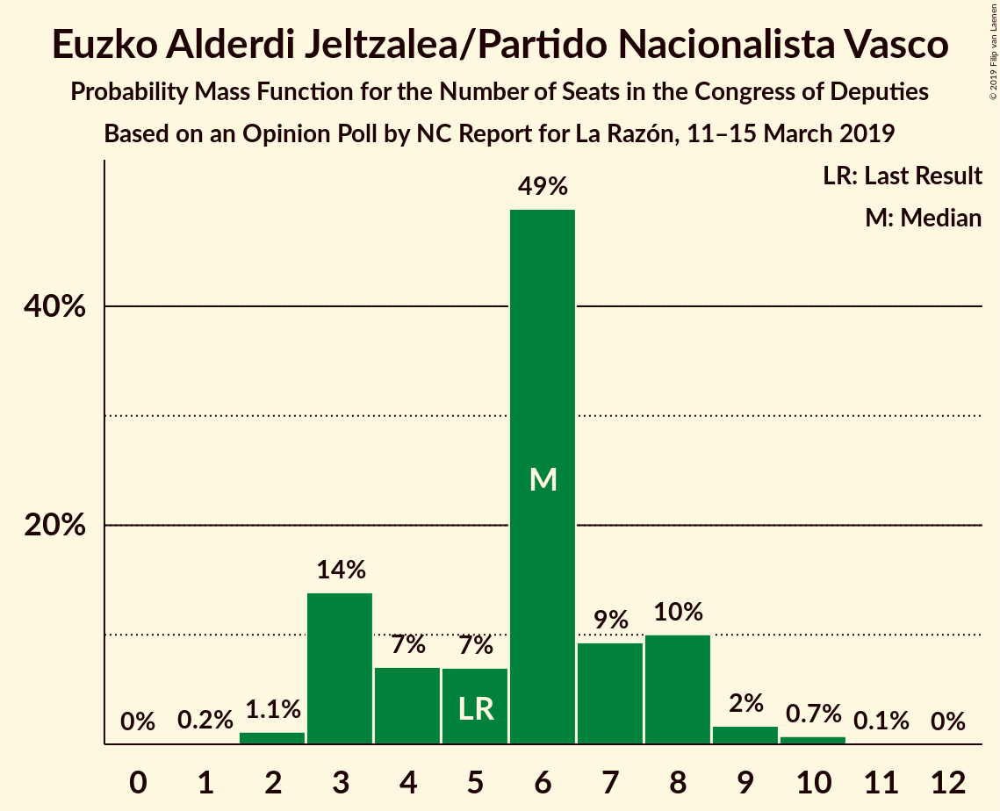
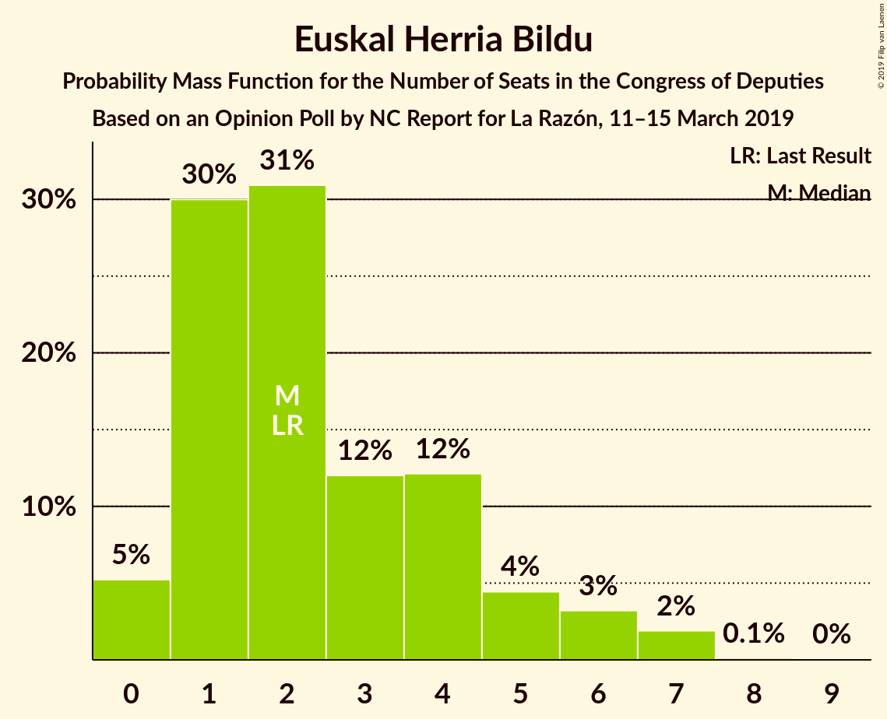
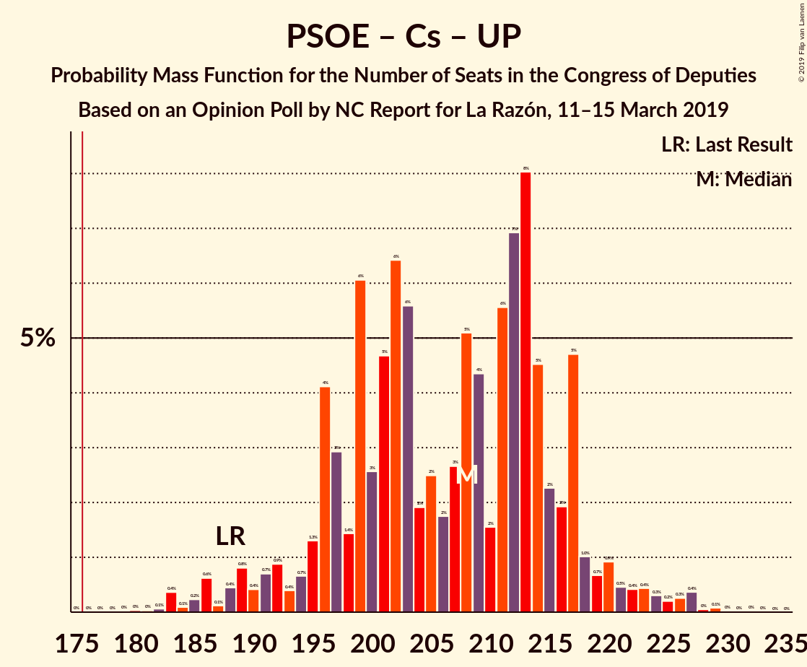
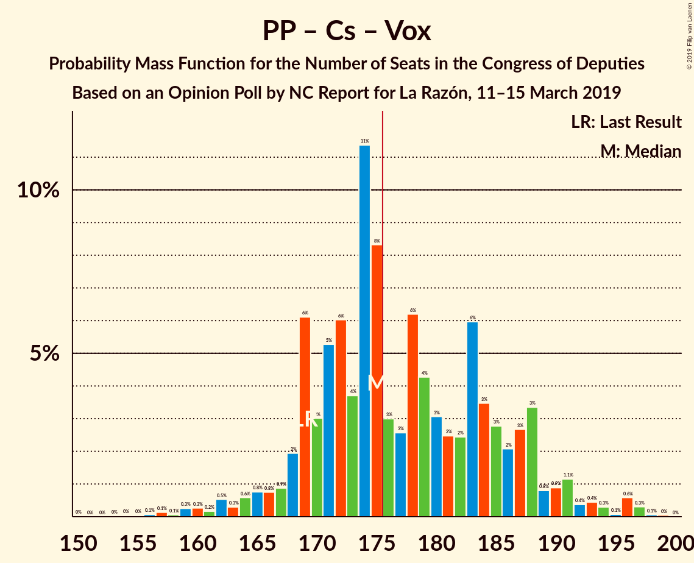
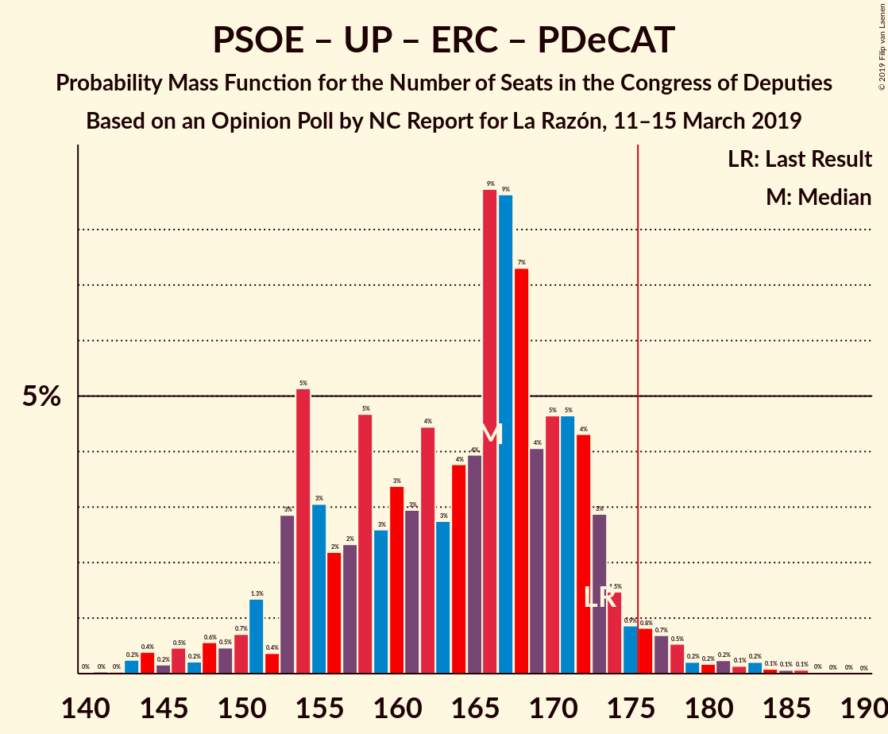
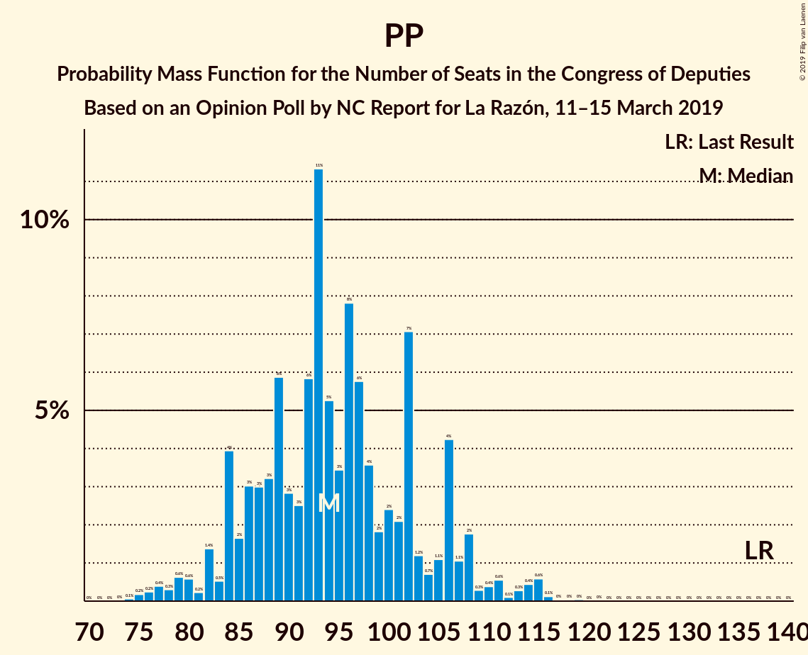

# Opinion Poll by NC Report for La Razón, 11–15 March 2019

<a href="#voting-intentions">Voting Intentions</a> | <a href="#seats">Seats</a> | <a href="#coalitions">Coalitions</a> | <a href="#technical-information">Technical Information</a>

## Voting Intentions

### Confidence Intervals

| Party | Last Result | Poll Result | 80% Confidence Interval | 90% Confidence Interval | 95% Confidence Interval | 99% Confidence Interval |
|:-----:|:-----------:|:-----------:|:-----------------------:|:-----------------------:|:-----------------------:|:-----------------------:|
| Partido Socialista Obrero Español | 22.6% | 26.0% | 24.3–27.8% |23.8–28.4% |23.4–28.8% |22.6–29.7% |
| Partido Popular | 33.0% | 23.2% | 21.6–25.0% |21.1–25.5% |20.7–25.9% |19.9–26.8% |
| Ciudadanos–Partido de la Ciudadanía | 13.1% | 17.8% | 16.3–19.4% |15.9–19.9% |15.5–20.3% |14.9–21.1% |
| Unidos Podemos | 21.2% | 14.8% | 13.4–16.3% |13.1–16.8% |12.7–17.1% |12.1–17.9% |
| Vox | 0.2% | 10.3% | 9.2–11.6% |8.8–12.0% |8.6–12.3% |8.0–13.0% |
| Esquerra Republicana de Catalunya–Catalunya Sí | 2.7% | 2.8% | 2.2–3.6% |2.1–3.8% |1.9–4.0% |1.7–4.4% |
| Partit Demòcrata Europeu Català | 2.0% | 1.2% | 0.9–1.8% |0.8–1.9% |0.7–2.1% |0.5–2.4% |
| Euzko Alderdi Jeltzalea/Partido Nacionalista Vasco | 1.2% | 1.1% | 0.8–1.7% |0.7–1.8% |0.6–2.0% |0.5–2.3% |
| Euskal Herria Bildu | 0.8% | 0.6% | 0.4–1.1% |0.3–1.2% |0.3–1.3% |0.2–1.6% |

*Note:* The poll result column reflects the actual value used in the calculations. Published results may vary slightly, and in addition be rounded to fewer digits.

## Seats

### Confidence Intervals

| Party | Last Result | Median | 80% Confidence Interval | 90% Confidence Interval | 95% Confidence Interval | 99% Confidence Interval |
|:-----:|:-----------:|:------:|:-----------------------:|:-----------------------:|:-----------------------:|:-----------------------:|
| <a href="#partido-socialista-obrero-español">Partido Socialista Obrero Español</a> | 85 | 107 | 95–116 |95–116 |89–117 |88–123 |
| <a href="#partido-popular">Partido Popular</a> | 137 | 97 | 92–102 |88–105 |82–105 |76–112 |
| <a href="#ciudadanos–partido-de-la-ciudadanía">Ciudadanos–Partido de la Ciudadanía</a> | 32 | 58 | 51–63 |51–67 |51–67 |46–73 |
| <a href="#unidos-podemos">Unidos Podemos</a> | 71 | 41 | 35–47 |33–50 |32–50 |30–54 |
| <a href="#vox">Vox</a> | 0 | 23 | 19–27 |18–28 |18–30 |15–33 |
| <a href="#esquerra-republicana-de-catalunya–catalunya-sí">Esquerra Republicana de Catalunya–Catalunya Sí</a> | 9 | 13 | 10–15 |9–15 |8–16 |8–18 |
| <a href="#partit-demòcrata-europeu-català">Partit Demòcrata Europeu Català</a> | 8 | 4 | 3–6 |1–8 |1–9 |1–9 |
| <a href="#euzko-alderdi-jeltzalea/partido-nacionalista-vasco">Euzko Alderdi Jeltzalea/Partido Nacionalista Vasco</a> | 5 | 6 | 3–7 |3–8 |3–8 |2–10 |
| <a href="#euskal-herria-bildu">Euskal Herria Bildu</a> | 2 | 2 | 1–5 |1–5 |0–6 |0–7 |

### Partido Socialista Obrero Español

*For a full overview of the results for this party, see the [Partido Socialista Obrero Español](party-partidosocialistaobreroespañol.html) page.*

| Number of Seats | Probability | Accumulated | Special Marks |
|:---------------:|:-----------:|:-----------:|:-------------:|
| 85 | 0% | 100% | Last Result |
| 86 | 0.1% | 100% |  |
| 87 | 0% | 99.9% |  |
| 88 | 2% | 99.9% |  |
| 89 | 0.3% | 98% |  |
| 90 | 0.3% | 97% |  |
| 91 | 0.1% | 97% |  |
| 92 | 0.2% | 97% |  |
| 93 | 0.9% | 97% |  |
| 94 | 0.2% | 96% |  |
| 95 | 8% | 96% |  |
| 96 | 1.3% | 87% |  |
| 97 | 1.4% | 86% |  |
| 98 | 0.1% | 85% |  |
| 99 | 0.9% | 84% |  |
| 100 | 4% | 84% |  |
| 101 | 0.2% | 80% |  |
| 102 | 16% | 80% |  |
| 103 | 1.1% | 63% |  |
| 104 | 6% | 62% |  |
| 105 | 0.8% | 56% |  |
| 106 | 5% | 56% |  |
| 107 | 7% | 51% | Median |
| 108 | 15% | 44% |  |
| 109 | 3% | 28% |  |
| 110 | 3% | 26% |  |
| 111 | 0.7% | 22% |  |
| 112 | 5% | 21% |  |
| 113 | 1.1% | 16% |  |
| 114 | 0.2% | 15% |  |
| 115 | 0.4% | 15% |  |
| 116 | 12% | 15% |  |
| 117 | 0.7% | 3% |  |
| 118 | 0.3% | 2% |  |
| 119 | 0.3% | 2% |  |
| 120 | 0.2% | 1.4% |  |
| 121 | 0.1% | 1.2% |  |
| 122 | 0.6% | 1.1% |  |
| 123 | 0.2% | 0.5% |  |
| 124 | 0% | 0.3% |  |
| 125 | 0% | 0.3% |  |
| 126 | 0% | 0.3% |  |
| 127 | 0.1% | 0.3% |  |
| 128 | 0.1% | 0.1% |  |
| 129 | 0% | 0% |  |

### Partido Popular

*For a full overview of the results for this party, see the [Partido Popular](party-partidopopular.html) page.*

| Number of Seats | Probability | Accumulated | Special Marks |
|:---------------:|:-----------:|:-----------:|:-------------:|
| 74 | 0.1% | 100% |  |
| 75 | 0.3% | 99.9% |  |
| 76 | 0.6% | 99.6% |  |
| 77 | 0.1% | 99.0% |  |
| 78 | 0.2% | 98.8% |  |
| 79 | 0.3% | 98.7% |  |
| 80 | 0.2% | 98% |  |
| 81 | 0.2% | 98% |  |
| 82 | 1.4% | 98% |  |
| 83 | 0.2% | 97% |  |
| 84 | 0.3% | 96% |  |
| 85 | 0.4% | 96% |  |
| 86 | 0.3% | 96% |  |
| 87 | 0.3% | 96% |  |
| 88 | 0.7% | 95% |  |
| 89 | 2% | 94% |  |
| 90 | 1.0% | 93% |  |
| 91 | 1.0% | 92% |  |
| 92 | 20% | 91% |  |
| 93 | 3% | 71% |  |
| 94 | 7% | 68% |  |
| 95 | 1.1% | 60% |  |
| 96 | 0.9% | 59% |  |
| 97 | 11% | 59% | Median |
| 98 | 15% | 48% |  |
| 99 | 2% | 33% |  |
| 100 | 7% | 31% |  |
| 101 | 1.0% | 24% |  |
| 102 | 16% | 23% |  |
| 103 | 0.5% | 7% |  |
| 104 | 0.2% | 6% |  |
| 105 | 4% | 6% |  |
| 106 | 0.8% | 2% |  |
| 107 | 0.2% | 1.0% |  |
| 108 | 0.2% | 0.9% |  |
| 109 | 0% | 0.7% |  |
| 110 | 0.1% | 0.7% |  |
| 111 | 0% | 0.6% |  |
| 112 | 0% | 0.5% |  |
| 113 | 0% | 0.5% |  |
| 114 | 0% | 0.5% |  |
| 115 | 0% | 0.4% |  |
| 116 | 0.2% | 0.4% |  |
| 117 | 0% | 0.2% |  |
| 118 | 0% | 0.2% |  |
| 119 | 0.1% | 0.2% |  |
| 120 | 0% | 0.1% |  |
| 121 | 0% | 0% |  |
| 122 | 0% | 0% |  |
| 123 | 0% | 0% |  |
| 124 | 0% | 0% |  |
| 125 | 0% | 0% |  |
| 126 | 0% | 0% |  |
| 127 | 0% | 0% |  |
| 128 | 0% | 0% |  |
| 129 | 0% | 0% |  |
| 130 | 0% | 0% |  |
| 131 | 0% | 0% |  |
| 132 | 0% | 0% |  |
| 133 | 0% | 0% |  |
| 134 | 0% | 0% |  |
| 135 | 0% | 0% |  |
| 136 | 0% | 0% |  |
| 137 | 0% | 0% | Last Result |

### Ciudadanos–Partido de la Ciudadanía

*For a full overview of the results for this party, see the [Ciudadanos–Partido de la Ciudadanía](party-ciudadanos–partidodelaciudadanía.html) page.*

| Number of Seats | Probability | Accumulated | Special Marks |
|:---------------:|:-----------:|:-----------:|:-------------:|
| 32 | 0% | 100% | Last Result |
| 33 | 0% | 100% |  |
| 34 | 0% | 100% |  |
| 35 | 0% | 100% |  |
| 36 | 0% | 100% |  |
| 37 | 0% | 100% |  |
| 38 | 0% | 100% |  |
| 39 | 0% | 100% |  |
| 40 | 0.2% | 100% |  |
| 41 | 0% | 99.8% |  |
| 42 | 0% | 99.8% |  |
| 43 | 0.1% | 99.8% |  |
| 44 | 0.1% | 99.7% |  |
| 45 | 0% | 99.6% |  |
| 46 | 0.1% | 99.6% |  |
| 47 | 0.1% | 99.5% |  |
| 48 | 0.1% | 99.4% |  |
| 49 | 0.1% | 99.4% |  |
| 50 | 0.9% | 99.3% |  |
| 51 | 12% | 98% |  |
| 52 | 1.1% | 86% |  |
| 53 | 0.7% | 85% |  |
| 54 | 4% | 84% |  |
| 55 | 6% | 80% |  |
| 56 | 4% | 74% |  |
| 57 | 15% | 70% |  |
| 58 | 9% | 55% | Median |
| 59 | 0.9% | 46% |  |
| 60 | 5% | 45% |  |
| 61 | 2% | 40% |  |
| 62 | 27% | 38% |  |
| 63 | 2% | 10% |  |
| 64 | 0.9% | 8% |  |
| 65 | 0.6% | 7% |  |
| 66 | 1.1% | 7% |  |
| 67 | 3% | 6% |  |
| 68 | 0.7% | 2% |  |
| 69 | 0.6% | 2% |  |
| 70 | 0.3% | 1.0% |  |
| 71 | 0.1% | 0.8% |  |
| 72 | 0.1% | 0.7% |  |
| 73 | 0.3% | 0.6% |  |
| 74 | 0.4% | 0.4% |  |
| 75 | 0% | 0% |  |

### Unidos Podemos

*For a full overview of the results for this party, see the [Unidos Podemos](party-unidospodemos.html) page.*

| Number of Seats | Probability | Accumulated | Special Marks |
|:---------------:|:-----------:|:-----------:|:-------------:|
| 29 | 0.4% | 100% |  |
| 30 | 0.5% | 99.5% |  |
| 31 | 0.3% | 99.0% |  |
| 32 | 3% | 98.7% |  |
| 33 | 2% | 95% |  |
| 34 | 3% | 93% |  |
| 35 | 21% | 90% |  |
| 36 | 13% | 69% |  |
| 37 | 1.0% | 56% |  |
| 38 | 1.4% | 55% |  |
| 39 | 1.2% | 54% |  |
| 40 | 2% | 52% |  |
| 41 | 2% | 51% | Median |
| 42 | 4% | 48% |  |
| 43 | 17% | 44% |  |
| 44 | 0.8% | 27% |  |
| 45 | 15% | 26% |  |
| 46 | 1.3% | 11% |  |
| 47 | 3% | 10% |  |
| 48 | 0.3% | 7% |  |
| 49 | 0.1% | 7% |  |
| 50 | 5% | 7% |  |
| 51 | 0.3% | 2% |  |
| 52 | 0.1% | 1.3% |  |
| 53 | 0% | 1.2% |  |
| 54 | 0.8% | 1.1% |  |
| 55 | 0.2% | 0.4% |  |
| 56 | 0% | 0.2% |  |
| 57 | 0% | 0.2% |  |
| 58 | 0% | 0.2% |  |
| 59 | 0% | 0.1% |  |
| 60 | 0% | 0.1% |  |
| 61 | 0% | 0.1% |  |
| 62 | 0% | 0.1% |  |
| 63 | 0% | 0.1% |  |
| 64 | 0% | 0% |  |
| 65 | 0% | 0% |  |
| 66 | 0% | 0% |  |
| 67 | 0% | 0% |  |
| 68 | 0% | 0% |  |
| 69 | 0% | 0% |  |
| 70 | 0% | 0% |  |
| 71 | 0% | 0% | Last Result |

### Vox

*For a full overview of the results for this party, see the [Vox](party-vox.html) page.*

| Number of Seats | Probability | Accumulated | Special Marks |
|:---------------:|:-----------:|:-----------:|:-------------:|
| 0 | 0% | 100% | Last Result |
| 1 | 0% | 100% |  |
| 2 | 0% | 100% |  |
| 3 | 0% | 100% |  |
| 4 | 0% | 100% |  |
| 5 | 0% | 100% |  |
| 6 | 0% | 100% |  |
| 7 | 0% | 100% |  |
| 8 | 0% | 100% |  |
| 9 | 0% | 100% |  |
| 10 | 0% | 100% |  |
| 11 | 0% | 100% |  |
| 12 | 0% | 100% |  |
| 13 | 0.2% | 100% |  |
| 14 | 0.2% | 99.8% |  |
| 15 | 0.2% | 99.6% |  |
| 16 | 0.2% | 99.4% |  |
| 17 | 0.9% | 99.1% |  |
| 18 | 3% | 98% |  |
| 19 | 10% | 95% |  |
| 20 | 3% | 84% |  |
| 21 | 6% | 81% |  |
| 22 | 14% | 75% |  |
| 23 | 14% | 61% | Median |
| 24 | 18% | 48% |  |
| 25 | 14% | 30% |  |
| 26 | 1.4% | 16% |  |
| 27 | 9% | 15% |  |
| 28 | 1.4% | 5% |  |
| 29 | 0.9% | 4% |  |
| 30 | 1.2% | 3% |  |
| 31 | 0.2% | 2% |  |
| 32 | 0.6% | 1.3% |  |
| 33 | 0.5% | 0.7% |  |
| 34 | 0% | 0.3% |  |
| 35 | 0% | 0.2% |  |
| 36 | 0% | 0.2% |  |
| 37 | 0.1% | 0.2% |  |
| 38 | 0.1% | 0.2% |  |
| 39 | 0% | 0% |  |

### Esquerra Republicana de Catalunya–Catalunya Sí

*For a full overview of the results for this party, see the [Esquerra Republicana de Catalunya–Catalunya Sí](party-esquerrarepublicanadecatalunya–catalunyasí.html) page.*

| Number of Seats | Probability | Accumulated | Special Marks |
|:---------------:|:-----------:|:-----------:|:-------------:|
| 6 | 0.1% | 100% |  |
| 7 | 0.1% | 99.9% |  |
| 8 | 3% | 99.8% |  |
| 9 | 5% | 97% | Last Result |
| 10 | 3% | 91% |  |
| 11 | 10% | 88% |  |
| 12 | 21% | 78% |  |
| 13 | 8% | 57% | Median |
| 14 | 39% | 49% |  |
| 15 | 8% | 10% |  |
| 16 | 1.3% | 3% |  |
| 17 | 0.5% | 1.2% |  |
| 18 | 0.2% | 0.6% |  |
| 19 | 0.3% | 0.4% |  |
| 20 | 0.1% | 0.1% |  |
| 21 | 0% | 0% |  |

### Partit Demòcrata Europeu Català

*For a full overview of the results for this party, see the [Partit Demòcrata Europeu Català](party-partitdemòcrataeuropeucatalà.html) page.*

| Number of Seats | Probability | Accumulated | Special Marks |
|:---------------:|:-----------:|:-----------:|:-------------:|
| 0 | 0.1% | 100% |  |
| 1 | 7% | 99.9% |  |
| 2 | 2% | 93% |  |
| 3 | 14% | 91% |  |
| 4 | 32% | 77% | Median |
| 5 | 21% | 45% |  |
| 6 | 14% | 24% |  |
| 7 | 2% | 10% |  |
| 8 | 5% | 8% | Last Result |
| 9 | 3% | 3% |  |
| 10 | 0.4% | 0.4% |  |
| 11 | 0% | 0% |  |

### Euzko Alderdi Jeltzalea/Partido Nacionalista Vasco

*For a full overview of the results for this party, see the [Euzko Alderdi Jeltzalea/Partido Nacionalista Vasco](party-euzkoalderdijeltzaleapartidonacionalistavasco.html) page.*

| Number of Seats | Probability | Accumulated | Special Marks |
|:---------------:|:-----------:|:-----------:|:-------------:|
| 1 | 0.1% | 100% |  |
| 2 | 1.0% | 99.9% |  |
| 3 | 9% | 99.0% |  |
| 4 | 16% | 90% |  |
| 5 | 4% | 74% | Last Result |
| 6 | 57% | 70% | Median |
| 7 | 3% | 13% |  |
| 8 | 8% | 10% |  |
| 9 | 0.9% | 2% |  |
| 10 | 0.8% | 1.0% |  |
| 11 | 0.2% | 0.2% |  |
| 12 | 0% | 0% |  |

### Euskal Herria Bildu

*For a full overview of the results for this party, see the [Euskal Herria Bildu](party-euskalherriabildu.html) page.*

| Number of Seats | Probability | Accumulated | Special Marks |
|:---------------:|:-----------:|:-----------:|:-------------:|
| 0 | 5% | 100% |  |
| 1 | 41% | 95% |  |
| 2 | 16% | 54% | Last Result, Median |
| 3 | 9% | 39% |  |
| 4 | 10% | 30% |  |
| 5 | 15% | 19% |  |
| 6 | 4% | 5% |  |
| 7 | 0.6% | 0.9% |  |
| 8 | 0.3% | 0.4% |  |
| 9 | 0% | 0% |  |

## Coalitions

### Confidence Intervals

| Coalition | Last Result | Median | Majority? | 80% Confidence Interval | 90% Confidence Interval | 95% Confidence Interval | 99% Confidence Interval |
|:---------:|:-----------:|:------:|:---------:|:-----------------------:|:-----------------------:|:-----------------------:|:-----------------------:|
| Partido Socialista Obrero Español – Partido Popular – Ciudadanos–Partido de la Ciudadanía | 254 | 260 | 100% | 254–266 | 253–267 | 249–269 | 246–272 |
| Partido Socialista Obrero Español – Ciudadanos–Partido de la Ciudadanía – Unidos Podemos | 188 | 203 | 100% | 198–215 | 192–215 | 191–217 | 188–225 |
| Partido Socialista Obrero Español – Partido Popular | 222 | 202 | 100% | 192–214 | 189–214 | 186–214 | 184–217 |
| Partido Popular – Ciudadanos–Partido de la Ciudadanía – Vox | 169 | 176 | 57% | 171–188 | 169–188 | 166–190 | 159–192 |
| Partido Socialista Obrero Español – Unidos Podemos – Esquerra Republicana de Catalunya–Catalunya Sí – Partit Demòcrata Europeu Català – Euzko Alderdi Jeltzalea/Partido Nacionalista Vasco – Euskal Herria Bildu | 180 | 173 | 42% | 161–178 | 161–180 | 159–183 | 157–190 |
| Partido Socialista Obrero Español – Ciudadanos–Partido de la Ciudadanía | 117 | 165 | 4% | 157–167 | 157–173 | 155–179 | 143–185 |
| Partido Socialista Obrero Español – Unidos Podemos – Esquerra Republicana de Catalunya–Catalunya Sí – Partit Demòcrata Europeu Català | 173 | 164 | 2% | 154–171 | 153–174 | 150–175 | 147–182 |
| Partido Socialista Obrero Español – Unidos Podemos – Esquerra Republicana de Catalunya–Catalunya Sí – Euskal Herria Bildu | 167 | 161 | 2% | 150–170 | 150–172 | 148–173 | 143–180 |
| Partido Popular – Ciudadanos–Partido de la Ciudadanía – Euzko Alderdi Jeltzalea/Partido Nacionalista Vasco | 174 | 159 | 2% | 153–170 | 151–170 | 148–172 | 141–178 |
| Partido Socialista Obrero Español – Unidos Podemos – Euzko Alderdi Jeltzalea/Partido Nacionalista Vasco – Euskal Herria Bildu | 163 | 156 | 0.1% | 144–161 | 144–163 | 142–167 | 140–171 |
| Partido Popular – Ciudadanos–Partido de la Ciudadanía | 169 | 153 | 0.1% | 149–164 | 146–165 | 142–166 | 136–172 |
| Partido Socialista Obrero Español – Unidos Podemos – Euzko Alderdi Jeltzalea/Partido Nacionalista Vasco | 161 | 153 | 0.1% | 143–160 | 142–161 | 138–164 | 137–170 |
| Partido Socialista Obrero Español – Unidos Podemos | 156 | 147 | 0% | 137–155 | 136–157 | 133–159 | 131–164 |
| Partido Popular – Vox | 137 | 121 | 0% | 113–126 | 111–130 | 106–130 | 99–135 |
| Partido Socialista Obrero Español | 85 | 107 | 0% | 95–116 | 95–116 | 89–117 | 88–123 |
| Partido Popular | 137 | 97 | 0% | 92–102 | 88–105 | 82–105 | 76–112 |

### Partido Socialista Obrero Español – Partido Popular – Ciudadanos–Partido de la Ciudadanía

| Number of Seats | Probability | Accumulated | Special Marks |
|:---------------:|:-----------:|:-----------:|:-------------:|
| 238 | 0% | 100% |  |
| 239 | 0% | 99.9% |  |
| 240 | 0.2% | 99.9% |  |
| 241 | 0.1% | 99.8% |  |
| 242 | 0% | 99.7% |  |
| 243 | 0% | 99.7% |  |
| 244 | 0% | 99.7% |  |
| 245 | 0.1% | 99.6% |  |
| 246 | 0.3% | 99.5% |  |
| 247 | 0.9% | 99.3% |  |
| 248 | 0.5% | 98% |  |
| 249 | 0.5% | 98% |  |
| 250 | 0.8% | 97% |  |
| 251 | 0.2% | 97% |  |
| 252 | 0.6% | 96% |  |
| 253 | 3% | 96% |  |
| 254 | 11% | 92% | Last Result |
| 255 | 1.2% | 81% |  |
| 256 | 3% | 80% |  |
| 257 | 15% | 76% |  |
| 258 | 2% | 61% |  |
| 259 | 8% | 59% |  |
| 260 | 1.3% | 50% |  |
| 261 | 2% | 49% |  |
| 262 | 4% | 47% | Median |
| 263 | 0.6% | 43% |  |
| 264 | 2% | 43% |  |
| 265 | 15% | 41% |  |
| 266 | 16% | 26% |  |
| 267 | 6% | 10% |  |
| 268 | 1.1% | 4% |  |
| 269 | 0.8% | 3% |  |
| 270 | 0.7% | 2% |  |
| 271 | 0.4% | 1.2% |  |
| 272 | 0.4% | 0.8% |  |
| 273 | 0% | 0.4% |  |
| 274 | 0.3% | 0.4% |  |
| 275 | 0% | 0.1% |  |
| 276 | 0% | 0% |  |

### Partido Socialista Obrero Español – Ciudadanos–Partido de la Ciudadanía – Unidos Podemos

| Number of Seats | Probability | Accumulated | Special Marks |
|:---------------:|:-----------:|:-----------:|:-------------:|
| 178 | 0.1% | 100% |  |
| 179 | 0% | 99.9% |  |
| 180 | 0% | 99.9% |  |
| 181 | 0% | 99.9% |  |
| 182 | 0% | 99.9% |  |
| 183 | 0% | 99.9% |  |
| 184 | 0% | 99.9% |  |
| 185 | 0% | 99.8% |  |
| 186 | 0.1% | 99.8% |  |
| 187 | 0.1% | 99.8% |  |
| 188 | 0.2% | 99.6% | Last Result |
| 189 | 0.3% | 99.4% |  |
| 190 | 0.6% | 99.1% |  |
| 191 | 1.5% | 98% |  |
| 192 | 3% | 97% |  |
| 193 | 0.2% | 94% |  |
| 194 | 1.1% | 94% |  |
| 195 | 0.9% | 92% |  |
| 196 | 1.2% | 92% |  |
| 197 | 0.3% | 90% |  |
| 198 | 0.1% | 90% |  |
| 199 | 16% | 90% |  |
| 200 | 3% | 73% |  |
| 201 | 0.5% | 70% |  |
| 202 | 14% | 70% |  |
| 203 | 12% | 55% |  |
| 204 | 2% | 43% |  |
| 205 | 1.1% | 41% |  |
| 206 | 0.2% | 40% | Median |
| 207 | 6% | 40% |  |
| 208 | 17% | 34% |  |
| 209 | 2% | 17% |  |
| 210 | 1.0% | 15% |  |
| 211 | 0.6% | 14% |  |
| 212 | 1.0% | 13% |  |
| 213 | 1.5% | 12% |  |
| 214 | 0.9% | 11% |  |
| 215 | 6% | 10% |  |
| 216 | 1.3% | 4% |  |
| 217 | 0.2% | 3% |  |
| 218 | 0.2% | 2% |  |
| 219 | 0.2% | 2% |  |
| 220 | 0.3% | 2% |  |
| 221 | 0.2% | 2% |  |
| 222 | 0.1% | 1.4% |  |
| 223 | 0.2% | 1.2% |  |
| 224 | 0.3% | 1.0% |  |
| 225 | 0.3% | 0.8% |  |
| 226 | 0.1% | 0.5% |  |
| 227 | 0.2% | 0.4% |  |
| 228 | 0% | 0.2% |  |
| 229 | 0.1% | 0.2% |  |
| 230 | 0% | 0.1% |  |
| 231 | 0% | 0% |  |

### Partido Socialista Obrero Español – Partido Popular

| Number of Seats | Probability | Accumulated | Special Marks |
|:---------------:|:-----------:|:-----------:|:-------------:|
| 178 | 0% | 100% |  |
| 179 | 0% | 99.9% |  |
| 180 | 0% | 99.9% |  |
| 181 | 0% | 99.9% |  |
| 182 | 0.1% | 99.9% |  |
| 183 | 0.3% | 99.8% |  |
| 184 | 0.2% | 99.5% |  |
| 185 | 0.9% | 99.4% |  |
| 186 | 3% | 98% |  |
| 187 | 0.2% | 96% |  |
| 188 | 0.1% | 95% |  |
| 189 | 0.4% | 95% |  |
| 190 | 0.2% | 95% |  |
| 191 | 0.5% | 95% |  |
| 192 | 12% | 94% |  |
| 193 | 1.0% | 82% |  |
| 194 | 0.4% | 81% |  |
| 195 | 3% | 81% |  |
| 196 | 1.4% | 78% |  |
| 197 | 0.7% | 77% |  |
| 198 | 3% | 76% |  |
| 199 | 4% | 73% |  |
| 200 | 13% | 70% |  |
| 201 | 5% | 56% |  |
| 202 | 2% | 51% |  |
| 203 | 2% | 49% |  |
| 204 | 17% | 47% | Median |
| 205 | 0.9% | 29% |  |
| 206 | 1.1% | 29% |  |
| 207 | 3% | 27% |  |
| 208 | 2% | 25% |  |
| 209 | 4% | 23% |  |
| 210 | 1.1% | 19% |  |
| 211 | 0.3% | 18% |  |
| 212 | 5% | 17% |  |
| 213 | 0.1% | 13% |  |
| 214 | 11% | 12% |  |
| 215 | 0.2% | 1.1% |  |
| 216 | 0% | 0.9% |  |
| 217 | 0.5% | 0.8% |  |
| 218 | 0% | 0.3% |  |
| 219 | 0% | 0.3% |  |
| 220 | 0% | 0.3% |  |
| 221 | 0% | 0.3% |  |
| 222 | 0.1% | 0.2% | Last Result |
| 223 | 0.1% | 0.1% |  |
| 224 | 0% | 0% |  |

### Partido Popular – Ciudadanos–Partido de la Ciudadanía – Vox

| Number of Seats | Probability | Accumulated | Special Marks |
|:---------------:|:-----------:|:-----------:|:-------------:|
| 154 | 0.1% | 100% |  |
| 155 | 0% | 99.9% |  |
| 156 | 0% | 99.9% |  |
| 157 | 0% | 99.9% |  |
| 158 | 0.1% | 99.9% |  |
| 159 | 0.5% | 99.8% |  |
| 160 | 0% | 99.3% |  |
| 161 | 0.3% | 99.3% |  |
| 162 | 0.3% | 99.0% |  |
| 163 | 0.2% | 98.8% |  |
| 164 | 0.2% | 98.6% |  |
| 165 | 0.6% | 98% |  |
| 166 | 0.9% | 98% |  |
| 167 | 0.5% | 97% |  |
| 168 | 0.6% | 96% |  |
| 169 | 1.0% | 96% | Last Result |
| 170 | 2% | 95% |  |
| 171 | 19% | 93% |  |
| 172 | 16% | 74% |  |
| 173 | 0.9% | 59% |  |
| 174 | 0.5% | 58% |  |
| 175 | 0.3% | 57% |  |
| 176 | 8% | 57% | Majority |
| 177 | 3% | 49% |  |
| 178 | 1.0% | 45% | Median |
| 179 | 1.4% | 44% |  |
| 180 | 4% | 43% |  |
| 181 | 4% | 39% |  |
| 182 | 0.6% | 36% |  |
| 183 | 0.4% | 35% |  |
| 184 | 10% | 35% |  |
| 185 | 0.7% | 25% |  |
| 186 | 4% | 24% |  |
| 187 | 0.1% | 20% |  |
| 188 | 16% | 20% |  |
| 189 | 0.7% | 5% |  |
| 190 | 3% | 4% |  |
| 191 | 0% | 1.1% |  |
| 192 | 0.8% | 1.1% |  |
| 193 | 0% | 0.3% |  |
| 194 | 0% | 0.2% |  |
| 195 | 0% | 0.2% |  |
| 196 | 0% | 0.2% |  |
| 197 | 0% | 0.1% |  |
| 198 | 0% | 0.1% |  |
| 199 | 0% | 0.1% |  |
| 200 | 0% | 0.1% |  |
| 201 | 0% | 0.1% |  |
| 202 | 0% | 0% |  |

### Partido Socialista Obrero Español – Unidos Podemos – Esquerra Republicana de Catalunya–Catalunya Sí – Partit Demòcrata Europeu Català – Euzko Alderdi Jeltzalea/Partido Nacionalista Vasco – Euskal Herria Bildu

| Number of Seats | Probability | Accumulated | Special Marks |
|:---------------:|:-----------:|:-----------:|:-------------:|
| 148 | 0% | 100% |  |
| 149 | 0% | 99.9% |  |
| 150 | 0% | 99.9% |  |
| 151 | 0% | 99.9% |  |
| 152 | 0% | 99.9% |  |
| 153 | 0% | 99.9% |  |
| 154 | 0% | 99.8% |  |
| 155 | 0% | 99.8% |  |
| 156 | 0% | 99.8% |  |
| 157 | 0.8% | 99.7% |  |
| 158 | 0% | 98.9% |  |
| 159 | 3% | 98.9% |  |
| 160 | 0.7% | 96% |  |
| 161 | 16% | 95% |  |
| 162 | 0.1% | 80% |  |
| 163 | 4% | 80% |  |
| 164 | 0.7% | 76% |  |
| 165 | 10% | 75% |  |
| 166 | 0.4% | 65% |  |
| 167 | 0.6% | 65% |  |
| 168 | 4% | 64% |  |
| 169 | 4% | 61% |  |
| 170 | 1.4% | 57% |  |
| 171 | 1.0% | 56% |  |
| 172 | 3% | 55% |  |
| 173 | 8% | 51% | Median |
| 174 | 0.3% | 43% |  |
| 175 | 0.5% | 43% |  |
| 176 | 0.9% | 42% | Majority |
| 177 | 16% | 41% |  |
| 178 | 19% | 26% |  |
| 179 | 2% | 7% |  |
| 180 | 1.0% | 5% | Last Result |
| 181 | 0.6% | 4% |  |
| 182 | 0.5% | 4% |  |
| 183 | 0.9% | 3% |  |
| 184 | 0.6% | 2% |  |
| 185 | 0.2% | 2% |  |
| 186 | 0.2% | 1.4% |  |
| 187 | 0.3% | 1.2% |  |
| 188 | 0.3% | 1.0% |  |
| 189 | 0% | 0.7% |  |
| 190 | 0.5% | 0.7% |  |
| 191 | 0.1% | 0.2% |  |
| 192 | 0% | 0.1% |  |
| 193 | 0% | 0.1% |  |
| 194 | 0% | 0.1% |  |
| 195 | 0.1% | 0.1% |  |
| 196 | 0% | 0% |  |

### Partido Socialista Obrero Español – Ciudadanos–Partido de la Ciudadanía

| Number of Seats | Probability | Accumulated | Special Marks |
|:---------------:|:-----------:|:-----------:|:-------------:|
| 117 | 0% | 100% | Last Result |
| 118 | 0% | 100% |  |
| 119 | 0% | 100% |  |
| 120 | 0% | 100% |  |
| 121 | 0% | 100% |  |
| 122 | 0% | 100% |  |
| 123 | 0% | 100% |  |
| 124 | 0% | 100% |  |
| 125 | 0% | 100% |  |
| 126 | 0% | 100% |  |
| 127 | 0% | 100% |  |
| 128 | 0% | 100% |  |
| 129 | 0% | 100% |  |
| 130 | 0% | 100% |  |
| 131 | 0% | 100% |  |
| 132 | 0% | 100% |  |
| 133 | 0% | 100% |  |
| 134 | 0% | 100% |  |
| 135 | 0% | 100% |  |
| 136 | 0% | 100% |  |
| 137 | 0% | 99.9% |  |
| 138 | 0% | 99.9% |  |
| 139 | 0.1% | 99.9% |  |
| 140 | 0.2% | 99.9% |  |
| 141 | 0.1% | 99.7% |  |
| 142 | 0% | 99.6% |  |
| 143 | 0.2% | 99.6% |  |
| 144 | 0% | 99.4% |  |
| 145 | 0% | 99.4% |  |
| 146 | 0% | 99.3% |  |
| 147 | 0% | 99.3% |  |
| 148 | 0.2% | 99.3% |  |
| 149 | 0% | 99.1% |  |
| 150 | 0.1% | 99.1% |  |
| 151 | 0% | 99.0% |  |
| 152 | 0.1% | 99.0% |  |
| 153 | 0.1% | 98.9% |  |
| 154 | 0.6% | 98.8% |  |
| 155 | 2% | 98% |  |
| 156 | 0.4% | 96% |  |
| 157 | 9% | 96% |  |
| 158 | 3% | 87% |  |
| 159 | 0.6% | 84% |  |
| 160 | 5% | 83% |  |
| 161 | 2% | 78% |  |
| 162 | 6% | 77% |  |
| 163 | 0.4% | 71% |  |
| 164 | 21% | 71% |  |
| 165 | 19% | 50% | Median |
| 166 | 4% | 31% |  |
| 167 | 18% | 27% |  |
| 168 | 2% | 9% |  |
| 169 | 0.4% | 7% |  |
| 170 | 0.2% | 6% |  |
| 171 | 0.7% | 6% |  |
| 172 | 0.4% | 6% |  |
| 173 | 0.3% | 5% |  |
| 174 | 0.8% | 5% |  |
| 175 | 0.1% | 4% |  |
| 176 | 0.2% | 4% | Majority |
| 177 | 0.5% | 4% |  |
| 178 | 0.4% | 3% |  |
| 179 | 0.8% | 3% |  |
| 180 | 0.7% | 2% |  |
| 181 | 0.2% | 1.2% |  |
| 182 | 0.2% | 1.0% |  |
| 183 | 0.1% | 0.9% |  |
| 184 | 0.1% | 0.8% |  |
| 185 | 0.2% | 0.6% |  |
| 186 | 0.1% | 0.4% |  |
| 187 | 0.3% | 0.4% |  |
| 188 | 0% | 0.1% |  |
| 189 | 0% | 0% |  |

### Partido Socialista Obrero Español – Unidos Podemos – Esquerra Republicana de Catalunya–Catalunya Sí – Partit Demòcrata Europeu Català

| Number of Seats | Probability | Accumulated | Special Marks |
|:---------------:|:-----------:|:-----------:|:-------------:|
| 140 | 0% | 100% |  |
| 141 | 0% | 99.9% |  |
| 142 | 0.1% | 99.9% |  |
| 143 | 0% | 99.9% |  |
| 144 | 0% | 99.8% |  |
| 145 | 0% | 99.8% |  |
| 146 | 0.1% | 99.8% |  |
| 147 | 0.3% | 99.7% |  |
| 148 | 0.5% | 99.4% |  |
| 149 | 0% | 98.9% |  |
| 150 | 2% | 98.9% |  |
| 151 | 0.7% | 96% |  |
| 152 | 0.4% | 96% |  |
| 153 | 0.4% | 95% |  |
| 154 | 19% | 95% |  |
| 155 | 0.8% | 76% |  |
| 156 | 0.4% | 75% |  |
| 157 | 10% | 74% |  |
| 158 | 0.3% | 64% |  |
| 159 | 2% | 64% |  |
| 160 | 2% | 62% |  |
| 161 | 4% | 60% |  |
| 162 | 4% | 57% |  |
| 163 | 0.1% | 52% |  |
| 164 | 6% | 52% |  |
| 165 | 3% | 46% | Median |
| 166 | 1.3% | 43% |  |
| 167 | 2% | 41% |  |
| 168 | 1.2% | 40% |  |
| 169 | 14% | 39% |  |
| 170 | 13% | 25% |  |
| 171 | 3% | 12% |  |
| 172 | 0.8% | 9% |  |
| 173 | 0.8% | 9% | Last Result |
| 174 | 5% | 8% |  |
| 175 | 0.2% | 3% |  |
| 176 | 0.5% | 2% | Majority |
| 177 | 0.1% | 2% |  |
| 178 | 0.7% | 2% |  |
| 179 | 0.2% | 1.1% |  |
| 180 | 0.1% | 0.9% |  |
| 181 | 0.1% | 0.8% |  |
| 182 | 0.3% | 0.8% |  |
| 183 | 0.3% | 0.4% |  |
| 184 | 0% | 0.1% |  |
| 185 | 0% | 0.1% |  |
| 186 | 0% | 0.1% |  |
| 187 | 0.1% | 0.1% |  |
| 188 | 0% | 0% |  |

### Partido Socialista Obrero Español – Unidos Podemos – Esquerra Republicana de Catalunya–Catalunya Sí – Euskal Herria Bildu

| Number of Seats | Probability | Accumulated | Special Marks |
|:---------------:|:-----------:|:-----------:|:-------------:|
| 139 | 0.1% | 100% |  |
| 140 | 0% | 99.9% |  |
| 141 | 0.1% | 99.9% |  |
| 142 | 0% | 99.8% |  |
| 143 | 0.5% | 99.8% |  |
| 144 | 0.1% | 99.3% |  |
| 145 | 0.3% | 99.3% |  |
| 146 | 0.1% | 99.0% |  |
| 147 | 0.1% | 98.8% |  |
| 148 | 2% | 98.7% |  |
| 149 | 0.1% | 96% |  |
| 150 | 19% | 96% |  |
| 151 | 1.0% | 77% |  |
| 152 | 0.5% | 76% |  |
| 153 | 0.2% | 76% |  |
| 154 | 2% | 75% |  |
| 155 | 0.5% | 73% |  |
| 156 | 11% | 73% |  |
| 157 | 0.5% | 61% |  |
| 158 | 3% | 61% |  |
| 159 | 0.4% | 58% |  |
| 160 | 0.4% | 58% |  |
| 161 | 9% | 57% |  |
| 162 | 3% | 48% |  |
| 163 | 1.0% | 45% | Median |
| 164 | 2% | 44% |  |
| 165 | 5% | 43% |  |
| 166 | 0.3% | 37% |  |
| 167 | 13% | 37% | Last Result |
| 168 | 1.1% | 24% |  |
| 169 | 0.4% | 23% |  |
| 170 | 13% | 23% |  |
| 171 | 0.8% | 9% |  |
| 172 | 5% | 9% |  |
| 173 | 1.3% | 3% |  |
| 174 | 0.1% | 2% |  |
| 175 | 0.1% | 2% |  |
| 176 | 0.6% | 2% | Majority |
| 177 | 0.4% | 1.3% |  |
| 178 | 0.3% | 0.9% |  |
| 179 | 0.1% | 0.6% |  |
| 180 | 0.4% | 0.6% |  |
| 181 | 0% | 0.2% |  |
| 182 | 0% | 0.1% |  |
| 183 | 0.1% | 0.1% |  |
| 184 | 0% | 0.1% |  |
| 185 | 0% | 0.1% |  |
| 186 | 0% | 0% |  |

### Partido Popular – Ciudadanos–Partido de la Ciudadanía – Euzko Alderdi Jeltzalea/Partido Nacionalista Vasco

| Number of Seats | Probability | Accumulated | Special Marks |
|:---------------:|:-----------:|:-----------:|:-------------:|
| 135 | 0% | 100% |  |
| 136 | 0% | 99.9% |  |
| 137 | 0% | 99.9% |  |
| 138 | 0% | 99.9% |  |
| 139 | 0.3% | 99.9% |  |
| 140 | 0.1% | 99.6% |  |
| 141 | 0.1% | 99.6% |  |
| 142 | 0.2% | 99.5% |  |
| 143 | 0.2% | 99.3% |  |
| 144 | 0.3% | 99.1% |  |
| 145 | 0.3% | 98.8% |  |
| 146 | 0.5% | 98% |  |
| 147 | 0% | 98% |  |
| 148 | 0.5% | 98% |  |
| 149 | 0.6% | 97% |  |
| 150 | 0.8% | 97% |  |
| 151 | 2% | 96% |  |
| 152 | 0.4% | 94% |  |
| 153 | 15% | 93% |  |
| 154 | 0.9% | 79% |  |
| 155 | 19% | 78% |  |
| 156 | 2% | 59% |  |
| 157 | 1.1% | 57% |  |
| 158 | 3% | 56% |  |
| 159 | 3% | 53% |  |
| 160 | 3% | 49% |  |
| 161 | 5% | 46% | Median |
| 162 | 2% | 41% |  |
| 163 | 1.1% | 38% |  |
| 164 | 0.3% | 37% |  |
| 165 | 9% | 37% |  |
| 166 | 2% | 28% |  |
| 167 | 0.1% | 26% |  |
| 168 | 0.7% | 26% |  |
| 169 | 4% | 25% |  |
| 170 | 18% | 21% |  |
| 171 | 0.2% | 3% |  |
| 172 | 0.8% | 3% |  |
| 173 | 0.2% | 2% |  |
| 174 | 0.3% | 2% | Last Result |
| 175 | 0.1% | 2% |  |
| 176 | 0.8% | 2% | Majority |
| 177 | 0% | 0.8% |  |
| 178 | 0.3% | 0.7% |  |
| 179 | 0% | 0.4% |  |
| 180 | 0.3% | 0.4% |  |
| 181 | 0% | 0.1% |  |
| 182 | 0% | 0.1% |  |
| 183 | 0% | 0.1% |  |
| 184 | 0% | 0% |  |

### Partido Socialista Obrero Español – Unidos Podemos – Euzko Alderdi Jeltzalea/Partido Nacionalista Vasco – Euskal Herria Bildu

| Number of Seats | Probability | Accumulated | Special Marks |
|:---------------:|:-----------:|:-----------:|:-------------:|
| 133 | 0% | 100% |  |
| 134 | 0% | 99.9% |  |
| 135 | 0.1% | 99.9% |  |
| 136 | 0% | 99.9% |  |
| 137 | 0.1% | 99.8% |  |
| 138 | 0.1% | 99.7% |  |
| 139 | 0.1% | 99.7% |  |
| 140 | 0.5% | 99.6% |  |
| 141 | 0.1% | 99.1% |  |
| 142 | 2% | 99.0% |  |
| 143 | 1.1% | 97% |  |
| 144 | 16% | 96% |  |
| 145 | 4% | 80% |  |
| 146 | 2% | 76% |  |
| 147 | 2% | 74% |  |
| 148 | 8% | 72% |  |
| 149 | 2% | 64% |  |
| 150 | 0.4% | 63% |  |
| 151 | 0.3% | 62% |  |
| 152 | 6% | 62% |  |
| 153 | 1.1% | 56% |  |
| 154 | 1.4% | 55% |  |
| 155 | 1.4% | 54% |  |
| 156 | 5% | 53% | Median |
| 157 | 3% | 47% |  |
| 158 | 0.9% | 45% |  |
| 159 | 15% | 44% |  |
| 160 | 16% | 29% |  |
| 161 | 7% | 13% |  |
| 162 | 0.6% | 6% |  |
| 163 | 0.8% | 5% | Last Result |
| 164 | 0.4% | 5% |  |
| 165 | 0.7% | 4% |  |
| 166 | 0.8% | 3% |  |
| 167 | 0.6% | 3% |  |
| 168 | 0.5% | 2% |  |
| 169 | 0.1% | 2% |  |
| 170 | 0.8% | 2% |  |
| 171 | 0.4% | 0.8% |  |
| 172 | 0.2% | 0.4% |  |
| 173 | 0% | 0.2% |  |
| 174 | 0% | 0.1% |  |
| 175 | 0% | 0.1% |  |
| 176 | 0% | 0.1% | Majority |
| 177 | 0% | 0.1% |  |
| 178 | 0% | 0.1% |  |
| 179 | 0% | 0.1% |  |
| 180 | 0% | 0.1% |  |
| 181 | 0% | 0% |  |

### Partido Popular – Ciudadanos–Partido de la Ciudadanía

| Number of Seats | Probability | Accumulated | Special Marks |
|:---------------:|:-----------:|:-----------:|:-------------:|
| 130 | 0% | 100% |  |
| 131 | 0% | 99.9% |  |
| 132 | 0.2% | 99.9% |  |
| 133 | 0.1% | 99.7% |  |
| 134 | 0% | 99.6% |  |
| 135 | 0.1% | 99.6% |  |
| 136 | 0.1% | 99.5% |  |
| 137 | 0.1% | 99.4% |  |
| 138 | 0.2% | 99.4% |  |
| 139 | 0.2% | 99.1% |  |
| 140 | 0.5% | 98.9% |  |
| 141 | 0.7% | 98% |  |
| 142 | 0.5% | 98% |  |
| 143 | 0.9% | 97% |  |
| 144 | 0.4% | 96% |  |
| 145 | 0.2% | 96% |  |
| 146 | 1.0% | 96% |  |
| 147 | 1.5% | 95% |  |
| 148 | 1.4% | 93% |  |
| 149 | 26% | 92% |  |
| 150 | 4% | 66% |  |
| 151 | 2% | 62% |  |
| 152 | 6% | 59% |  |
| 153 | 4% | 54% |  |
| 154 | 3% | 49% |  |
| 155 | 5% | 46% | Median |
| 156 | 2% | 41% |  |
| 157 | 2% | 39% |  |
| 158 | 0.6% | 37% |  |
| 159 | 8% | 36% |  |
| 160 | 2% | 28% |  |
| 161 | 3% | 26% |  |
| 162 | 1.3% | 23% |  |
| 163 | 0.3% | 22% |  |
| 164 | 16% | 21% |  |
| 165 | 2% | 5% |  |
| 166 | 1.3% | 3% |  |
| 167 | 0.2% | 2% |  |
| 168 | 0.5% | 2% |  |
| 169 | 0.5% | 1.4% | Last Result |
| 170 | 0% | 0.8% |  |
| 171 | 0% | 0.8% |  |
| 172 | 0.6% | 0.7% |  |
| 173 | 0% | 0.1% |  |
| 174 | 0% | 0.1% |  |
| 175 | 0% | 0.1% |  |
| 176 | 0% | 0.1% | Majority |
| 177 | 0% | 0.1% |  |
| 178 | 0% | 0% |  |

### Partido Socialista Obrero Español – Unidos Podemos – Euzko Alderdi Jeltzalea/Partido Nacionalista Vasco

| Number of Seats | Probability | Accumulated | Special Marks |
|:---------------:|:-----------:|:-----------:|:-------------:|
| 128 | 0% | 100% |  |
| 129 | 0% | 99.9% |  |
| 130 | 0% | 99.9% |  |
| 131 | 0% | 99.9% |  |
| 132 | 0% | 99.9% |  |
| 133 | 0% | 99.9% |  |
| 134 | 0% | 99.8% |  |
| 135 | 0.1% | 99.8% |  |
| 136 | 0% | 99.7% |  |
| 137 | 0.2% | 99.7% |  |
| 138 | 3% | 99.5% |  |
| 139 | 0.6% | 97% |  |
| 140 | 0.4% | 96% |  |
| 141 | 0.5% | 96% |  |
| 142 | 2% | 95% |  |
| 143 | 17% | 94% |  |
| 144 | 4% | 77% |  |
| 145 | 1.1% | 73% |  |
| 146 | 8% | 72% |  |
| 147 | 1.5% | 64% |  |
| 148 | 1.3% | 63% |  |
| 149 | 2% | 61% |  |
| 150 | 0.5% | 60% |  |
| 151 | 4% | 59% |  |
| 152 | 2% | 55% |  |
| 153 | 6% | 53% |  |
| 154 | 4% | 48% | Median |
| 155 | 16% | 44% |  |
| 156 | 2% | 27% |  |
| 157 | 1.3% | 25% |  |
| 158 | 12% | 24% |  |
| 159 | 0.2% | 11% |  |
| 160 | 5% | 11% |  |
| 161 | 2% | 6% | Last Result |
| 162 | 0.3% | 5% |  |
| 163 | 2% | 4% |  |
| 164 | 0.6% | 3% |  |
| 165 | 0.1% | 2% |  |
| 166 | 0.2% | 2% |  |
| 167 | 0.7% | 2% |  |
| 168 | 0.1% | 1.0% |  |
| 169 | 0.3% | 0.9% |  |
| 170 | 0.3% | 0.6% |  |
| 171 | 0.2% | 0.3% |  |
| 172 | 0% | 0.1% |  |
| 173 | 0% | 0.1% |  |
| 174 | 0% | 0.1% |  |
| 175 | 0% | 0.1% |  |
| 176 | 0% | 0.1% | Majority |
| 177 | 0% | 0.1% |  |
| 178 | 0% | 0.1% |  |
| 179 | 0% | 0% |  |

### Partido Socialista Obrero Español – Unidos Podemos

| Number of Seats | Probability | Accumulated | Special Marks |
|:---------------:|:-----------:|:-----------:|:-------------:|
| 124 | 0% | 100% |  |
| 125 | 0% | 99.9% |  |
| 126 | 0.1% | 99.9% |  |
| 127 | 0.1% | 99.9% |  |
| 128 | 0% | 99.8% |  |
| 129 | 0.1% | 99.8% |  |
| 130 | 0% | 99.7% |  |
| 131 | 0.5% | 99.7% |  |
| 132 | 0% | 99.1% |  |
| 133 | 3% | 99.1% |  |
| 134 | 0.9% | 96% |  |
| 135 | 0.4% | 96% |  |
| 136 | 4% | 95% |  |
| 137 | 17% | 92% |  |
| 138 | 1.0% | 74% |  |
| 139 | 0.7% | 73% |  |
| 140 | 9% | 72% |  |
| 141 | 1.2% | 64% |  |
| 142 | 2% | 63% |  |
| 143 | 0.7% | 61% |  |
| 144 | 2% | 60% |  |
| 145 | 5% | 59% |  |
| 146 | 0.5% | 54% |  |
| 147 | 6% | 54% |  |
| 148 | 4% | 48% | Median |
| 149 | 3% | 44% |  |
| 150 | 2% | 41% |  |
| 151 | 13% | 38% |  |
| 152 | 12% | 25% |  |
| 153 | 2% | 13% |  |
| 154 | 0.4% | 11% |  |
| 155 | 2% | 11% |  |
| 156 | 0.2% | 9% | Last Result |
| 157 | 5% | 9% |  |
| 158 | 0.6% | 3% |  |
| 159 | 0.6% | 3% |  |
| 160 | 0.4% | 2% |  |
| 161 | 0.6% | 2% |  |
| 162 | 0.3% | 1.2% |  |
| 163 | 0.2% | 0.9% |  |
| 164 | 0.3% | 0.6% |  |
| 165 | 0% | 0.3% |  |
| 166 | 0.1% | 0.3% |  |
| 167 | 0% | 0.2% |  |
| 168 | 0% | 0.1% |  |
| 169 | 0% | 0.1% |  |
| 170 | 0% | 0.1% |  |
| 171 | 0% | 0.1% |  |
| 172 | 0.1% | 0.1% |  |
| 173 | 0% | 0% |  |

### Partido Popular – Vox

| Number of Seats | Probability | Accumulated | Special Marks |
|:---------------:|:-----------:|:-----------:|:-------------:|
| 96 | 0.3% | 100% |  |
| 97 | 0% | 99.7% |  |
| 98 | 0.1% | 99.7% |  |
| 99 | 0.1% | 99.6% |  |
| 100 | 0% | 99.5% |  |
| 101 | 0.1% | 99.4% |  |
| 102 | 0.5% | 99.3% |  |
| 103 | 0.8% | 98.9% |  |
| 104 | 0.3% | 98% |  |
| 105 | 0.2% | 98% |  |
| 106 | 0.4% | 98% |  |
| 107 | 0.1% | 97% |  |
| 108 | 0.3% | 97% |  |
| 109 | 2% | 97% |  |
| 110 | 0.2% | 95% |  |
| 111 | 2% | 95% |  |
| 112 | 3% | 93% |  |
| 113 | 7% | 91% |  |
| 114 | 14% | 83% |  |
| 115 | 1.1% | 70% |  |
| 116 | 2% | 69% |  |
| 117 | 2% | 66% |  |
| 118 | 3% | 65% |  |
| 119 | 6% | 62% |  |
| 120 | 1.5% | 56% | Median |
| 121 | 16% | 54% |  |
| 122 | 9% | 38% |  |
| 123 | 3% | 29% |  |
| 124 | 0.7% | 26% |  |
| 125 | 0.1% | 25% |  |
| 126 | 17% | 25% |  |
| 127 | 0.5% | 8% |  |
| 128 | 2% | 7% |  |
| 129 | 0.8% | 6% |  |
| 130 | 4% | 5% |  |
| 131 | 0.1% | 1.4% |  |
| 132 | 0.2% | 1.3% |  |
| 133 | 0.1% | 1.1% |  |
| 134 | 0.1% | 0.9% |  |
| 135 | 0.5% | 0.9% |  |
| 136 | 0% | 0.4% |  |
| 137 | 0% | 0.3% | Last Result |
| 138 | 0% | 0.3% |  |
| 139 | 0% | 0.3% |  |
| 140 | 0.1% | 0.3% |  |
| 141 | 0.1% | 0.1% |  |
| 142 | 0% | 0.1% |  |
| 143 | 0% | 0.1% |  |
| 144 | 0% | 0.1% |  |
| 145 | 0% | 0% |  |

### Partido Socialista Obrero Español

| Number of Seats | Probability | Accumulated | Special Marks |
|:---------------:|:-----------:|:-----------:|:-------------:|
| 85 | 0% | 100% | Last Result |
| 86 | 0.1% | 100% |  |
| 87 | 0% | 99.9% |  |
| 88 | 2% | 99.9% |  |
| 89 | 0.3% | 98% |  |
| 90 | 0.3% | 97% |  |
| 91 | 0.1% | 97% |  |
| 92 | 0.2% | 97% |  |
| 93 | 0.9% | 97% |  |
| 94 | 0.2% | 96% |  |
| 95 | 8% | 96% |  |
| 96 | 1.3% | 87% |  |
| 97 | 1.4% | 86% |  |
| 98 | 0.1% | 85% |  |
| 99 | 0.9% | 84% |  |
| 100 | 4% | 84% |  |
| 101 | 0.2% | 80% |  |
| 102 | 16% | 80% |  |
| 103 | 1.1% | 63% |  |
| 104 | 6% | 62% |  |
| 105 | 0.8% | 56% |  |
| 106 | 5% | 56% |  |
| 107 | 7% | 51% | Median |
| 108 | 15% | 44% |  |
| 109 | 3% | 28% |  |
| 110 | 3% | 26% |  |
| 111 | 0.7% | 22% |  |
| 112 | 5% | 21% |  |
| 113 | 1.1% | 16% |  |
| 114 | 0.2% | 15% |  |
| 115 | 0.4% | 15% |  |
| 116 | 12% | 15% |  |
| 117 | 0.7% | 3% |  |
| 118 | 0.3% | 2% |  |
| 119 | 0.3% | 2% |  |
| 120 | 0.2% | 1.4% |  |
| 121 | 0.1% | 1.2% |  |
| 122 | 0.6% | 1.1% |  |
| 123 | 0.2% | 0.5% |  |
| 124 | 0% | 0.3% |  |
| 125 | 0% | 0.3% |  |
| 126 | 0% | 0.3% |  |
| 127 | 0.1% | 0.3% |  |
| 128 | 0.1% | 0.1% |  |
| 129 | 0% | 0% |  |

### Partido Popular

| Number of Seats | Probability | Accumulated | Special Marks |
|:---------------:|:-----------:|:-----------:|:-------------:|
| 74 | 0.1% | 100% |  |
| 75 | 0.3% | 99.9% |  |
| 76 | 0.6% | 99.6% |  |
| 77 | 0.1% | 99.0% |  |
| 78 | 0.2% | 98.8% |  |
| 79 | 0.3% | 98.7% |  |
| 80 | 0.2% | 98% |  |
| 81 | 0.2% | 98% |  |
| 82 | 1.4% | 98% |  |
| 83 | 0.2% | 97% |  |
| 84 | 0.3% | 96% |  |
| 85 | 0.4% | 96% |  |
| 86 | 0.3% | 96% |  |
| 87 | 0.3% | 96% |  |
| 88 | 0.7% | 95% |  |
| 89 | 2% | 94% |  |
| 90 | 1.0% | 93% |  |
| 91 | 1.0% | 92% |  |
| 92 | 20% | 91% |  |
| 93 | 3% | 71% |  |
| 94 | 7% | 68% |  |
| 95 | 1.1% | 60% |  |
| 96 | 0.9% | 59% |  |
| 97 | 11% | 59% | Median |
| 98 | 15% | 48% |  |
| 99 | 2% | 33% |  |
| 100 | 7% | 31% |  |
| 101 | 1.0% | 24% |  |
| 102 | 16% | 23% |  |
| 103 | 0.5% | 7% |  |
| 104 | 0.2% | 6% |  |
| 105 | 4% | 6% |  |
| 106 | 0.8% | 2% |  |
| 107 | 0.2% | 1.0% |  |
| 108 | 0.2% | 0.9% |  |
| 109 | 0% | 0.7% |  |
| 110 | 0.1% | 0.7% |  |
| 111 | 0% | 0.6% |  |
| 112 | 0% | 0.5% |  |
| 113 | 0% | 0.5% |  |
| 114 | 0% | 0.5% |  |
| 115 | 0% | 0.4% |  |
| 116 | 0.2% | 0.4% |  |
| 117 | 0% | 0.2% |  |
| 118 | 0% | 0.2% |  |
| 119 | 0.1% | 0.2% |  |
| 120 | 0% | 0.1% |  |
| 121 | 0% | 0% |  |
| 122 | 0% | 0% |  |
| 123 | 0% | 0% |  |
| 124 | 0% | 0% |  |
| 125 | 0% | 0% |  |
| 126 | 0% | 0% |  |
| 127 | 0% | 0% |  |
| 128 | 0% | 0% |  |
| 129 | 0% | 0% |  |
| 130 | 0% | 0% |  |
| 131 | 0% | 0% |  |
| 132 | 0% | 0% |  |
| 133 | 0% | 0% |  |
| 134 | 0% | 0% |  |
| 135 | 0% | 0% |  |
| 136 | 0% | 0% |  |
| 137 | 0% | 0% | Last Result |

## Technical Information

### Opinion Poll

+ **Polling firm:** NC Report
+ **Commissioner(s):** La Razón
+ **Fieldwork period:** 11–15 March 2019

### Calculations

+ **Sample size:** 1000
+ **Simulations done:** 131,072
+ **Error estimate:** 2.56%

