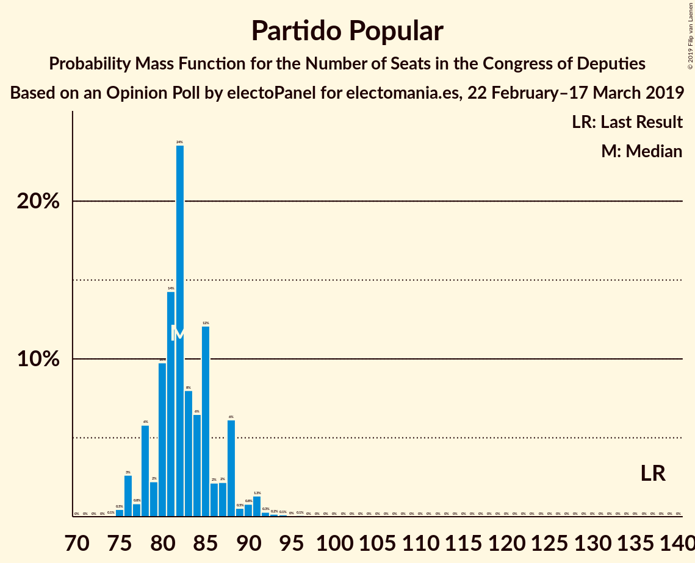
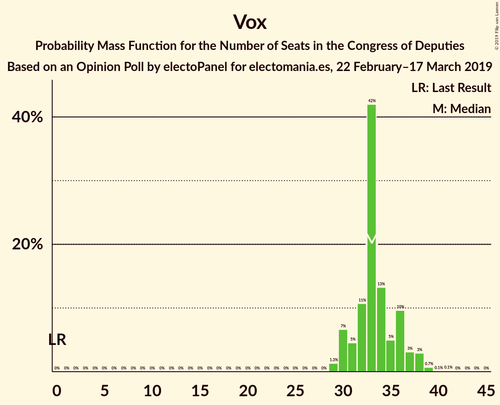
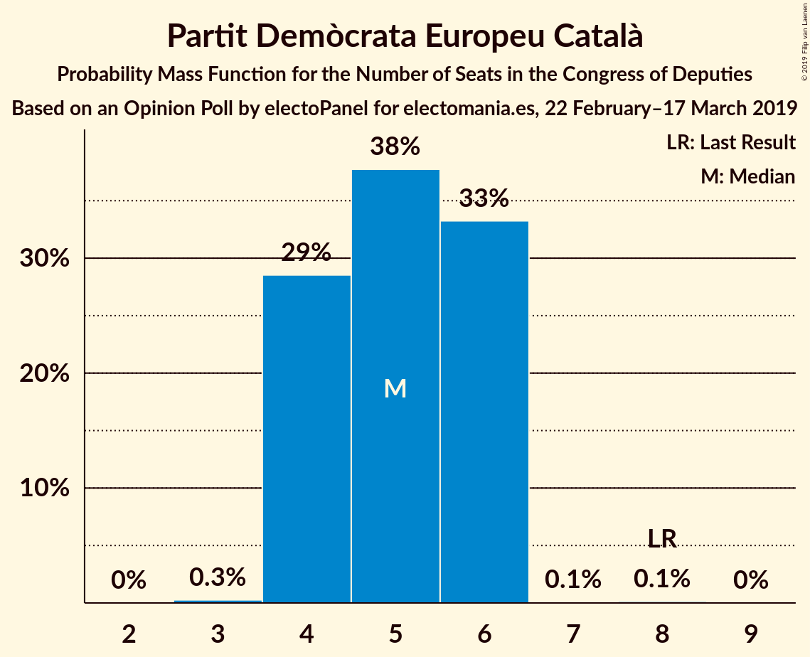

# Opinion Poll by electoPanel for electomania.es, 22 February–17 March 2019

<a href="#voting-intentions">Voting Intentions</a> | <a href="#seats">Seats</a> | <a href="#coalitions">Coalitions</a> | <a href="#technical-information">Technical Information</a>

## Voting Intentions

### Confidence Intervals

| Party | Last Result | Poll Result | 80% Confidence Interval | 90% Confidence Interval | 95% Confidence Interval | 99% Confidence Interval |
|:-----:|:-----------:|:-----------:|:-----------------------:|:-----------------------:|:-----------------------:|:-----------------------:|
| Partido Socialista Obrero Español | 22.6% | 27.3% | 26.6–28.0% |26.4–28.2% |26.3–28.3% |26.0–28.7% |
| Partido Popular | 33.0% | 20.7% | 20.1–21.3% |19.9–21.5% |19.8–21.6% |19.5–21.9% |
| Ciudadanos–Partido de la Ciudadanía | 13.1% | 15.4% | 14.9–16.0% |14.7–16.1% |14.6–16.2% |14.3–16.5% |
| Unidos Podemos | 21.2% | 13.0% | 12.5–13.5% |12.4–13.7% |12.2–13.8% |12.0–14.0% |
| Vox | 0.2% | 12.5% | 12.0–13.0% |11.9–13.2% |11.8–13.3% |11.5–13.5% |
| Esquerra Republicana de Catalunya–Catalunya Sí | 2.7% | 3.2% | 2.9–3.5% |2.9–3.6% |2.8–3.6% |2.7–3.8% |
| Partit Demòcrata Europeu Català | 2.0% | 1.3% | 1.1–1.5% |1.1–1.5% |1.1–1.6% |1.0–1.7% |
| Euzko Alderdi Jeltzalea/Partido Nacionalista Vasco | 1.2% | 1.3% | 1.1–1.5% |1.1–1.5% |1.1–1.6% |1.0–1.7% |
| Partido Animalista Contra el Maltrato Animal | 1.2% | 0.9% | 0.8–1.1% |0.7–1.1% |0.7–1.2% |0.7–1.2% |
| Euskal Herria Bildu | 0.8% | 0.8% | 0.7–1.0% |0.6–1.0% |0.6–1.0% |0.6–1.1% |
| Coalición Canaria–Partido Nacionalista Canario | 0.3% | 0.3% | 0.2–0.4% |0.2–0.4% |0.2–0.5% |0.2–0.5% |

*Note:* The poll result column reflects the actual value used in the calculations. Published results may vary slightly, and in addition be rounded to fewer digits.

## Seats

### Confidence Intervals

| Party | Last Result | Median | 80% Confidence Interval | 90% Confidence Interval | 95% Confidence Interval | 99% Confidence Interval |
|:-----:|:-----------:|:------:|:-----------------------:|:-----------------------:|:-----------------------:|:-----------------------:|
| <a href="#partido-socialista-obrero-español">Partido Socialista Obrero Español</a> | 85 | 119 | 114–123 |111–124 |108–124 |108–126 |
| <a href="#partido-popular">Partido Popular</a> | 137 | 82 | 79–87 |78–88 |76–90 |75–92 |
| <a href="#ciudadanos–partido-de-la-ciudadanía">Ciudadanos–Partido de la Ciudadanía</a> | 32 | 50 | 47–54 |47–54 |47–54 |45–55 |
| <a href="#unidos-podemos">Unidos Podemos</a> | 71 | 36 | 33–37 |33–38 |31–38 |31–39 |
| <a href="#vox">Vox</a> | 0 | 33 | 31–36 |30–37 |30–38 |29–39 |
| <a href="#esquerra-republicana-de-catalunya–catalunya-sí">Esquerra Republicana de Catalunya–Catalunya Sí</a> | 9 | 14 | 14–15 |14–15 |13–15 |12–16 |
| <a href="#partit-demòcrata-europeu-català">Partit Demòcrata Europeu Català</a> | 8 | 5 | 4–6 |4–6 |4–6 |4–6 |
| <a href="#euzko-alderdi-jeltzalea/partido-nacionalista-vasco">Euzko Alderdi Jeltzalea/Partido Nacionalista Vasco</a> | 5 | 6 | 6–7 |6–8 |6–8 |5–8 |
| <a href="#partido-animalista-contra-el-maltrato-animal">Partido Animalista Contra el Maltrato Animal</a> | 0 | 0 | 0 |0 |0 |0 |
| <a href="#euskal-herria-bildu">Euskal Herria Bildu</a> | 2 | 3 | 2–4 |2–4 |2–5 |1–5 |
| <a href="#coalición-canaria–partido-nacionalista-canario">Coalición Canaria–Partido Nacionalista Canario</a> | 1 | 1 | 1 |0–1 |0–1 |0–1 |

### Partido Socialista Obrero Español

*For a full overview of the results for this party, see the [Partido Socialista Obrero Español](party-partidosocialistaobreroespañol.html) page.*

| Number of Seats | Probability | Accumulated | Special Marks |
|:---------------:|:-----------:|:-----------:|:-------------:|
| 85 | 0% | 100% | Last Result |
| 86 | 0% | 100% |  |
| 87 | 0% | 100% |  |
| 88 | 0% | 100% |  |
| 89 | 0% | 100% |  |
| 90 | 0% | 100% |  |
| 91 | 0% | 100% |  |
| 92 | 0% | 100% |  |
| 93 | 0% | 100% |  |
| 94 | 0% | 100% |  |
| 95 | 0% | 100% |  |
| 96 | 0% | 100% |  |
| 97 | 0% | 100% |  |
| 98 | 0% | 100% |  |
| 99 | 0% | 100% |  |
| 100 | 0% | 100% |  |
| 101 | 0% | 100% |  |
| 102 | 0% | 100% |  |
| 103 | 0% | 100% |  |
| 104 | 0% | 100% |  |
| 105 | 0% | 100% |  |
| 106 | 0.1% | 100% |  |
| 107 | 0.1% | 99.9% |  |
| 108 | 3% | 99.8% |  |
| 109 | 0.3% | 97% |  |
| 110 | 0.5% | 97% |  |
| 111 | 2% | 96% |  |
| 112 | 0.5% | 94% |  |
| 113 | 1.4% | 94% |  |
| 114 | 7% | 92% |  |
| 115 | 6% | 86% |  |
| 116 | 14% | 80% |  |
| 117 | 10% | 66% |  |
| 118 | 3% | 56% |  |
| 119 | 4% | 53% | Median |
| 120 | 18% | 50% |  |
| 121 | 10% | 32% |  |
| 122 | 11% | 22% |  |
| 123 | 5% | 11% |  |
| 124 | 4% | 6% |  |
| 125 | 1.4% | 2% |  |
| 126 | 0.8% | 0.9% |  |
| 127 | 0% | 0.1% |  |
| 128 | 0.1% | 0.1% |  |
| 129 | 0% | 0% |  |

### Partido Popular

*For a full overview of the results for this party, see the [Partido Popular](party-partidopopular.html) page.*

| Number of Seats | Probability | Accumulated | Special Marks |
|:---------------:|:-----------:|:-----------:|:-------------:|
| 74 | 0.1% | 100% |  |
| 75 | 0.5% | 99.9% |  |
| 76 | 3% | 99.5% |  |
| 77 | 0.8% | 97% |  |
| 78 | 6% | 96% |  |
| 79 | 2% | 90% |  |
| 80 | 10% | 88% |  |
| 81 | 14% | 78% |  |
| 82 | 24% | 64% | Median |
| 83 | 8% | 40% |  |
| 84 | 6% | 32% |  |
| 85 | 12% | 26% |  |
| 86 | 2% | 14% |  |
| 87 | 2% | 12% |  |
| 88 | 6% | 9% |  |
| 89 | 0.5% | 3% |  |
| 90 | 0.8% | 3% |  |
| 91 | 1.3% | 2% |  |
| 92 | 0.3% | 0.7% |  |
| 93 | 0.2% | 0.4% |  |
| 94 | 0.1% | 0.2% |  |
| 95 | 0% | 0.1% |  |
| 96 | 0.1% | 0.1% |  |
| 97 | 0% | 0% |  |
| 98 | 0% | 0% |  |
| 99 | 0% | 0% |  |
| 100 | 0% | 0% |  |
| 101 | 0% | 0% |  |
| 102 | 0% | 0% |  |
| 103 | 0% | 0% |  |
| 104 | 0% | 0% |  |
| 105 | 0% | 0% |  |
| 106 | 0% | 0% |  |
| 107 | 0% | 0% |  |
| 108 | 0% | 0% |  |
| 109 | 0% | 0% |  |
| 110 | 0% | 0% |  |
| 111 | 0% | 0% |  |
| 112 | 0% | 0% |  |
| 113 | 0% | 0% |  |
| 114 | 0% | 0% |  |
| 115 | 0% | 0% |  |
| 116 | 0% | 0% |  |
| 117 | 0% | 0% |  |
| 118 | 0% | 0% |  |
| 119 | 0% | 0% |  |
| 120 | 0% | 0% |  |
| 121 | 0% | 0% |  |
| 122 | 0% | 0% |  |
| 123 | 0% | 0% |  |
| 124 | 0% | 0% |  |
| 125 | 0% | 0% |  |
| 126 | 0% | 0% |  |
| 127 | 0% | 0% |  |
| 128 | 0% | 0% |  |
| 129 | 0% | 0% |  |
| 130 | 0% | 0% |  |
| 131 | 0% | 0% |  |
| 132 | 0% | 0% |  |
| 133 | 0% | 0% |  |
| 134 | 0% | 0% |  |
| 135 | 0% | 0% |  |
| 136 | 0% | 0% |  |
| 137 | 0% | 0% | Last Result |

### Ciudadanos–Partido de la Ciudadanía

*For a full overview of the results for this party, see the [Ciudadanos–Partido de la Ciudadanía](party-ciudadanos–partidodelaciudadanía.html) page.*

| Number of Seats | Probability | Accumulated | Special Marks |
|:---------------:|:-----------:|:-----------:|:-------------:|
| 32 | 0% | 100% | Last Result |
| 33 | 0% | 100% |  |
| 34 | 0% | 100% |  |
| 35 | 0% | 100% |  |
| 36 | 0% | 100% |  |
| 37 | 0% | 100% |  |
| 38 | 0% | 100% |  |
| 39 | 0% | 100% |  |
| 40 | 0% | 100% |  |
| 41 | 0% | 100% |  |
| 42 | 0% | 100% |  |
| 43 | 0% | 100% |  |
| 44 | 0.1% | 100% |  |
| 45 | 1.1% | 99.9% |  |
| 46 | 0.6% | 98.8% |  |
| 47 | 12% | 98% |  |
| 48 | 12% | 86% |  |
| 49 | 9% | 74% |  |
| 50 | 32% | 65% | Median |
| 51 | 0.9% | 33% |  |
| 52 | 0.5% | 33% |  |
| 53 | 22% | 32% |  |
| 54 | 10% | 10% |  |
| 55 | 0.3% | 0.6% |  |
| 56 | 0.2% | 0.3% |  |
| 57 | 0% | 0.1% |  |
| 58 | 0% | 0.1% |  |
| 59 | 0% | 0% |  |

### Unidos Podemos

*For a full overview of the results for this party, see the [Unidos Podemos](party-unidospodemos.html) page.*

| Number of Seats | Probability | Accumulated | Special Marks |
|:---------------:|:-----------:|:-----------:|:-------------:|
| 27 | 0% | 100% |  |
| 28 | 0% | 99.9% |  |
| 29 | 0.3% | 99.9% |  |
| 30 | 0.1% | 99.7% |  |
| 31 | 2% | 99.6% |  |
| 32 | 1.3% | 97% |  |
| 33 | 6% | 96% |  |
| 34 | 16% | 90% |  |
| 35 | 21% | 74% |  |
| 36 | 30% | 53% | Median |
| 37 | 17% | 23% |  |
| 38 | 5% | 6% |  |
| 39 | 0.7% | 0.8% |  |
| 40 | 0% | 0.1% |  |
| 41 | 0.1% | 0.1% |  |
| 42 | 0% | 0% |  |
| 43 | 0% | 0% |  |
| 44 | 0% | 0% |  |
| 45 | 0% | 0% |  |
| 46 | 0% | 0% |  |
| 47 | 0% | 0% |  |
| 48 | 0% | 0% |  |
| 49 | 0% | 0% |  |
| 50 | 0% | 0% |  |
| 51 | 0% | 0% |  |
| 52 | 0% | 0% |  |
| 53 | 0% | 0% |  |
| 54 | 0% | 0% |  |
| 55 | 0% | 0% |  |
| 56 | 0% | 0% |  |
| 57 | 0% | 0% |  |
| 58 | 0% | 0% |  |
| 59 | 0% | 0% |  |
| 60 | 0% | 0% |  |
| 61 | 0% | 0% |  |
| 62 | 0% | 0% |  |
| 63 | 0% | 0% |  |
| 64 | 0% | 0% |  |
| 65 | 0% | 0% |  |
| 66 | 0% | 0% |  |
| 67 | 0% | 0% |  |
| 68 | 0% | 0% |  |
| 69 | 0% | 0% |  |
| 70 | 0% | 0% |  |
| 71 | 0% | 0% | Last Result |

### Vox

*For a full overview of the results for this party, see the [Vox](party-vox.html) page.*

| Number of Seats | Probability | Accumulated | Special Marks |
|:---------------:|:-----------:|:-----------:|:-------------:|
| 0 | 0% | 100% | Last Result |
| 1 | 0% | 100% |  |
| 2 | 0% | 100% |  |
| 3 | 0% | 100% |  |
| 4 | 0% | 100% |  |
| 5 | 0% | 100% |  |
| 6 | 0% | 100% |  |
| 7 | 0% | 100% |  |
| 8 | 0% | 100% |  |
| 9 | 0% | 100% |  |
| 10 | 0% | 100% |  |
| 11 | 0% | 100% |  |
| 12 | 0% | 100% |  |
| 13 | 0% | 100% |  |
| 14 | 0% | 100% |  |
| 15 | 0% | 100% |  |
| 16 | 0% | 100% |  |
| 17 | 0% | 100% |  |
| 18 | 0% | 100% |  |
| 19 | 0% | 100% |  |
| 20 | 0% | 100% |  |
| 21 | 0% | 100% |  |
| 22 | 0% | 100% |  |
| 23 | 0% | 100% |  |
| 24 | 0% | 100% |  |
| 25 | 0% | 100% |  |
| 26 | 0% | 100% |  |
| 27 | 0% | 100% |  |
| 28 | 0% | 100% |  |
| 29 | 1.3% | 99.9% |  |
| 30 | 7% | 98.6% |  |
| 31 | 5% | 92% |  |
| 32 | 11% | 87% |  |
| 33 | 42% | 77% | Median |
| 34 | 13% | 35% |  |
| 35 | 5% | 22% |  |
| 36 | 10% | 17% |  |
| 37 | 3% | 7% |  |
| 38 | 3% | 4% |  |
| 39 | 0.7% | 0.9% |  |
| 40 | 0.1% | 0.3% |  |
| 41 | 0.1% | 0.2% |  |
| 42 | 0% | 0% |  |

### Esquerra Republicana de Catalunya–Catalunya Sí

*For a full overview of the results for this party, see the [Esquerra Republicana de Catalunya–Catalunya Sí](party-esquerrarepublicanadecatalunya–catalunyasí.html) page.*

| Number of Seats | Probability | Accumulated | Special Marks |
|:---------------:|:-----------:|:-----------:|:-------------:|
| 9 | 0% | 100% | Last Result |
| 10 | 0% | 100% |  |
| 11 | 0% | 100% |  |
| 12 | 0.7% | 100% |  |
| 13 | 4% | 99.3% |  |
| 14 | 47% | 95% | Median |
| 15 | 48% | 48% |  |
| 16 | 0.5% | 0.6% |  |
| 17 | 0.1% | 0.1% |  |
| 18 | 0% | 0% |  |

### Partit Demòcrata Europeu Català

*For a full overview of the results for this party, see the [Partit Demòcrata Europeu Català](party-partitdemòcrataeuropeucatalà.html) page.*

| Number of Seats | Probability | Accumulated | Special Marks |
|:---------------:|:-----------:|:-----------:|:-------------:|
| 3 | 0.3% | 100% |  |
| 4 | 29% | 99.7% |  |
| 5 | 38% | 71% | Median |
| 6 | 33% | 33% |  |
| 7 | 0.1% | 0.2% |  |
| 8 | 0.1% | 0.1% | Last Result |
| 9 | 0% | 0% |  |

### Euzko Alderdi Jeltzalea/Partido Nacionalista Vasco

*For a full overview of the results for this party, see the [Euzko Alderdi Jeltzalea/Partido Nacionalista Vasco](party-euzkoalderdijeltzaleapartidonacionalistavasco.html) page.*

| Number of Seats | Probability | Accumulated | Special Marks |
|:---------------:|:-----------:|:-----------:|:-------------:|
| 4 | 0.1% | 100% |  |
| 5 | 1.1% | 99.9% | Last Result |
| 6 | 63% | 98.8% | Median |
| 7 | 26% | 35% |  |
| 8 | 10% | 10% |  |
| 9 | 0% | 0% |  |

### Partido Animalista Contra el Maltrato Animal

*For a full overview of the results for this party, see the [Partido Animalista Contra el Maltrato Animal](party-partidoanimalistacontraelmaltratoanimal.html) page.*

| Number of Seats | Probability | Accumulated | Special Marks |
|:---------------:|:-----------:|:-----------:|:-------------:|
| 0 | 100% | 100% | Last Result, Median |

### Euskal Herria Bildu

*For a full overview of the results for this party, see the [Euskal Herria Bildu](party-euskalherriabildu.html) page.*

| Number of Seats | Probability | Accumulated | Special Marks |
|:---------------:|:-----------:|:-----------:|:-------------:|
| 1 | 0.8% | 100% |  |
| 2 | 24% | 99.2% | Last Result |
| 3 | 39% | 75% | Median |
| 4 | 33% | 36% |  |
| 5 | 3% | 3% |  |
| 6 | 0.1% | 0.1% |  |
| 7 | 0% | 0% |  |

### Coalición Canaria–Partido Nacionalista Canario

*For a full overview of the results for this party, see the [Coalición Canaria–Partido Nacionalista Canario](party-coalicióncanaria–partidonacionalistacanario.html) page.*

| Number of Seats | Probability | Accumulated | Special Marks |
|:---------------:|:-----------:|:-----------:|:-------------:|
| 0 | 6% | 100% |  |
| 1 | 94% | 94% | Last Result, Median |
| 2 | 0.1% | 0.1% |  |
| 3 | 0% | 0% |  |

## Coalitions

### Confidence Intervals

| Coalition | Last Result | Median | Majority? | 80% Confidence Interval | 90% Confidence Interval | 95% Confidence Interval | 99% Confidence Interval |
|:---------:|:-----------:|:------:|:---------:|:-----------------------:|:-----------------------:|:-----------------------:|:-----------------------:|
| Partido Socialista Obrero Español – Partido Popular – Ciudadanos–Partido de la Ciudadanía | 254 | 251 | 100% | 246–255 | 245–256 | 245–258 | 243–258 |
| Partido Socialista Obrero Español – Ciudadanos–Partido de la Ciudadanía – Unidos Podemos | 188 | 205 | 100% | 200–208 | 197–208 | 197–209 | 195–210 |
| Partido Socialista Obrero Español – Partido Popular | 222 | 201 | 100% | 196–205 | 196–206 | 195–209 | 190–210 |
| Partido Socialista Obrero Español – Unidos Podemos – Esquerra Republicana de Catalunya–Catalunya Sí – Euzko Alderdi Jeltzalea/Partido Nacionalista Vasco – Partit Demòcrata Europeu Català – Euskal Herria Bildu | 180 | 184 | 96% | 178–187 | 177–188 | 173–188 | 173–189 |
| Partido Socialista Obrero Español – Unidos Podemos – Esquerra Republicana de Catalunya–Catalunya Sí – Partit Demòcrata Europeu Català | 173 | 174 | 29% | 168–177 | 167–179 | 163–179 | 163–180 |
| Partido Socialista Obrero Español – Unidos Podemos – Esquerra Republicana de Catalunya–Catalunya Sí – Euskal Herria Bildu | 167 | 171 | 17% | 166–176 | 165–176 | 162–177 | 162–179 |
| Partido Popular – Ciudadanos–Partido de la Ciudadanía – Vox | 169 | 165 | 3% | 162–171 | 161–172 | 161–176 | 160–176 |
| Partido Socialista Obrero Español – Ciudadanos–Partido de la Ciudadanía | 117 | 170 | 0.4% | 163–172 | 162–173 | 161–174 | 160–175 |
| Partido Socialista Obrero Español – Unidos Podemos – Euzko Alderdi Jeltzalea/Partido Nacionalista Vasco – Euskal Herria Bildu | 163 | 163 | 0% | 159–167 | 157–169 | 154–169 | 153–171 |
| Partido Socialista Obrero Español – Unidos Podemos – Euzko Alderdi Jeltzalea/Partido Nacionalista Vasco | 161 | 160 | 0% | 156–164 | 154–165 | 150–166 | 150–168 |
| Partido Socialista Obrero Español – Unidos Podemos | 156 | 154 | 0% | 149–158 | 148–159 | 144–159 | 144–161 |
| Partido Popular – Ciudadanos–Partido de la Ciudadanía – Euzko Alderdi Jeltzalea/Partido Nacionalista Vasco | 174 | 139 | 0% | 134–146 | 134–147 | 132–147 | 131–149 |
| Partido Popular – Ciudadanos–Partido de la Ciudadanía – Coalición Canaria–Partido Nacionalista Canario | 170 | 133 | 0% | 129–140 | 129–141 | 127–142 | 126–144 |
| Partido Popular – Ciudadanos–Partido de la Ciudadanía | 169 | 132 | 0% | 128–139 | 128–140 | 126–141 | 125–143 |
| Partido Socialista Obrero Español | 85 | 119 | 0% | 114–123 | 111–124 | 108–124 | 108–126 |
| Partido Popular – Vox | 137 | 116 | 0% | 113–119 | 111–122 | 111–123 | 110–126 |
| Partido Popular | 137 | 82 | 0% | 79–87 | 78–88 | 76–90 | 75–92 |

### Partido Socialista Obrero Español – Partido Popular – Ciudadanos–Partido de la Ciudadanía

| Number of Seats | Probability | Accumulated | Special Marks |
|:---------------:|:-----------:|:-----------:|:-------------:|
| 241 | 0.1% | 100% |  |
| 242 | 0% | 99.9% |  |
| 243 | 0.5% | 99.8% |  |
| 244 | 0.1% | 99.3% |  |
| 245 | 9% | 99.2% |  |
| 246 | 3% | 90% |  |
| 247 | 0.8% | 88% |  |
| 248 | 4% | 87% |  |
| 249 | 10% | 83% |  |
| 250 | 7% | 73% |  |
| 251 | 18% | 66% | Median |
| 252 | 11% | 49% |  |
| 253 | 15% | 38% |  |
| 254 | 9% | 23% | Last Result |
| 255 | 6% | 13% |  |
| 256 | 3% | 7% |  |
| 257 | 1.4% | 4% |  |
| 258 | 3% | 3% |  |
| 259 | 0.1% | 0.2% |  |
| 260 | 0% | 0.1% |  |
| 261 | 0% | 0% |  |

### Partido Socialista Obrero Español – Ciudadanos–Partido de la Ciudadanía – Unidos Podemos

| Number of Seats | Probability | Accumulated | Special Marks |
|:---------------:|:-----------:|:-----------:|:-------------:|
| 188 | 0% | 100% | Last Result |
| 189 | 0% | 100% |  |
| 190 | 0% | 100% |  |
| 191 | 0.1% | 100% |  |
| 192 | 0% | 99.9% |  |
| 193 | 0.1% | 99.9% |  |
| 194 | 0.2% | 99.8% |  |
| 195 | 0.4% | 99.7% |  |
| 196 | 0.4% | 99.2% |  |
| 197 | 4% | 98.9% |  |
| 198 | 1.3% | 95% |  |
| 199 | 0.5% | 93% |  |
| 200 | 10% | 93% |  |
| 201 | 5% | 83% |  |
| 202 | 4% | 78% |  |
| 203 | 11% | 74% |  |
| 204 | 13% | 63% |  |
| 205 | 16% | 50% | Median |
| 206 | 10% | 35% |  |
| 207 | 11% | 24% |  |
| 208 | 9% | 13% |  |
| 209 | 3% | 4% |  |
| 210 | 1.2% | 2% |  |
| 211 | 0.4% | 0.5% |  |
| 212 | 0.1% | 0.1% |  |
| 213 | 0% | 0% |  |

### Partido Socialista Obrero Español – Partido Popular

| Number of Seats | Probability | Accumulated | Special Marks |
|:---------------:|:-----------:|:-----------:|:-------------:|
| 190 | 0.5% | 100% |  |
| 191 | 0% | 99.5% |  |
| 192 | 0.1% | 99.4% |  |
| 193 | 0.6% | 99.3% |  |
| 194 | 0.5% | 98.7% |  |
| 195 | 1.4% | 98% |  |
| 196 | 8% | 97% |  |
| 197 | 0.8% | 89% |  |
| 198 | 16% | 88% |  |
| 199 | 7% | 72% |  |
| 200 | 11% | 65% |  |
| 201 | 14% | 54% | Median |
| 202 | 8% | 40% |  |
| 203 | 9% | 32% |  |
| 204 | 5% | 23% |  |
| 205 | 10% | 17% |  |
| 206 | 3% | 8% |  |
| 207 | 1.3% | 5% |  |
| 208 | 0.6% | 3% |  |
| 209 | 0.4% | 3% |  |
| 210 | 2% | 2% |  |
| 211 | 0.3% | 0.3% |  |
| 212 | 0% | 0% |  |
| 213 | 0% | 0% |  |
| 214 | 0% | 0% |  |
| 215 | 0% | 0% |  |
| 216 | 0% | 0% |  |
| 217 | 0% | 0% |  |
| 218 | 0% | 0% |  |
| 219 | 0% | 0% |  |
| 220 | 0% | 0% |  |
| 221 | 0% | 0% |  |
| 222 | 0% | 0% | Last Result |

### Partido Socialista Obrero Español – Unidos Podemos – Esquerra Republicana de Catalunya–Catalunya Sí – Euzko Alderdi Jeltzalea/Partido Nacionalista Vasco – Partit Demòcrata Europeu Català – Euskal Herria Bildu

| Number of Seats | Probability | Accumulated | Special Marks |
|:---------------:|:-----------:|:-----------:|:-------------:|
| 170 | 0% | 100% |  |
| 171 | 0.1% | 99.9% |  |
| 172 | 0.1% | 99.8% |  |
| 173 | 3% | 99.8% |  |
| 174 | 0.5% | 97% |  |
| 175 | 0.3% | 97% |  |
| 176 | 0.9% | 96% | Majority |
| 177 | 2% | 95% |  |
| 178 | 6% | 93% |  |
| 179 | 8% | 87% |  |
| 180 | 5% | 79% | Last Result |
| 181 | 4% | 74% |  |
| 182 | 10% | 70% |  |
| 183 | 6% | 60% | Median |
| 184 | 22% | 53% |  |
| 185 | 8% | 32% |  |
| 186 | 11% | 24% |  |
| 187 | 5% | 13% |  |
| 188 | 6% | 8% |  |
| 189 | 0.9% | 1.3% |  |
| 190 | 0.4% | 0.4% |  |
| 191 | 0% | 0.1% |  |
| 192 | 0% | 0% |  |

### Partido Socialista Obrero Español – Unidos Podemos – Esquerra Republicana de Catalunya–Catalunya Sí – Partit Demòcrata Europeu Català

| Number of Seats | Probability | Accumulated | Special Marks |
|:---------------:|:-----------:|:-----------:|:-------------:|
| 159 | 0% | 100% |  |
| 160 | 0% | 99.9% |  |
| 161 | 0.1% | 99.9% |  |
| 162 | 0.1% | 99.9% |  |
| 163 | 3% | 99.8% |  |
| 164 | 0.4% | 97% |  |
| 165 | 0.4% | 97% |  |
| 166 | 1.1% | 96% |  |
| 167 | 2% | 95% |  |
| 168 | 5% | 94% |  |
| 169 | 5% | 88% |  |
| 170 | 6% | 84% |  |
| 171 | 3% | 77% |  |
| 172 | 13% | 74% |  |
| 173 | 4% | 62% | Last Result |
| 174 | 21% | 58% | Median |
| 175 | 8% | 37% |  |
| 176 | 11% | 29% | Majority |
| 177 | 8% | 17% |  |
| 178 | 4% | 9% |  |
| 179 | 5% | 6% |  |
| 180 | 1.0% | 1.1% |  |
| 181 | 0% | 0.1% |  |
| 182 | 0% | 0% |  |

### Partido Socialista Obrero Español – Unidos Podemos – Esquerra Republicana de Catalunya–Catalunya Sí – Euskal Herria Bildu

| Number of Seats | Probability | Accumulated | Special Marks |
|:---------------:|:-----------:|:-----------:|:-------------:|
| 159 | 0.1% | 100% |  |
| 160 | 0.1% | 99.9% |  |
| 161 | 0.1% | 99.8% |  |
| 162 | 3% | 99.6% |  |
| 163 | 0.4% | 97% |  |
| 164 | 1.0% | 96% |  |
| 165 | 0.5% | 95% |  |
| 166 | 9% | 95% |  |
| 167 | 2% | 86% | Last Result |
| 168 | 6% | 83% |  |
| 169 | 5% | 77% |  |
| 170 | 4% | 72% |  |
| 171 | 23% | 68% |  |
| 172 | 8% | 45% | Median |
| 173 | 4% | 37% |  |
| 174 | 11% | 33% |  |
| 175 | 5% | 22% |  |
| 176 | 12% | 17% | Majority |
| 177 | 2% | 5% |  |
| 178 | 1.4% | 2% |  |
| 179 | 0.5% | 0.8% |  |
| 180 | 0.3% | 0.3% |  |
| 181 | 0% | 0% |  |

### Partido Popular – Ciudadanos–Partido de la Ciudadanía – Vox

| Number of Seats | Probability | Accumulated | Special Marks |
|:---------------:|:-----------:|:-----------:|:-------------:|
| 159 | 0.3% | 100% |  |
| 160 | 0.8% | 99.6% |  |
| 161 | 6% | 98.9% |  |
| 162 | 6% | 93% |  |
| 163 | 9% | 87% |  |
| 164 | 9% | 78% |  |
| 165 | 22% | 69% | Median |
| 166 | 7% | 47% |  |
| 167 | 10% | 40% |  |
| 168 | 4% | 31% |  |
| 169 | 5% | 26% | Last Result |
| 170 | 8% | 21% |  |
| 171 | 6% | 13% |  |
| 172 | 2% | 7% |  |
| 173 | 1.0% | 5% |  |
| 174 | 0.5% | 4% |  |
| 175 | 0.5% | 3% |  |
| 176 | 3% | 3% | Majority |
| 177 | 0% | 0.2% |  |
| 178 | 0.2% | 0.2% |  |
| 179 | 0% | 0.1% |  |
| 180 | 0% | 0% |  |

### Partido Socialista Obrero Español – Ciudadanos–Partido de la Ciudadanía

| Number of Seats | Probability | Accumulated | Special Marks |
|:---------------:|:-----------:|:-----------:|:-------------:|
| 117 | 0% | 100% | Last Result |
| 118 | 0% | 100% |  |
| 119 | 0% | 100% |  |
| 120 | 0% | 100% |  |
| 121 | 0% | 100% |  |
| 122 | 0% | 100% |  |
| 123 | 0% | 100% |  |
| 124 | 0% | 100% |  |
| 125 | 0% | 100% |  |
| 126 | 0% | 100% |  |
| 127 | 0% | 100% |  |
| 128 | 0% | 100% |  |
| 129 | 0% | 100% |  |
| 130 | 0% | 100% |  |
| 131 | 0% | 100% |  |
| 132 | 0% | 100% |  |
| 133 | 0% | 100% |  |
| 134 | 0% | 100% |  |
| 135 | 0% | 100% |  |
| 136 | 0% | 100% |  |
| 137 | 0% | 100% |  |
| 138 | 0% | 100% |  |
| 139 | 0% | 100% |  |
| 140 | 0% | 100% |  |
| 141 | 0% | 100% |  |
| 142 | 0% | 100% |  |
| 143 | 0% | 100% |  |
| 144 | 0% | 100% |  |
| 145 | 0% | 100% |  |
| 146 | 0% | 100% |  |
| 147 | 0% | 100% |  |
| 148 | 0% | 100% |  |
| 149 | 0% | 100% |  |
| 150 | 0% | 100% |  |
| 151 | 0% | 100% |  |
| 152 | 0% | 100% |  |
| 153 | 0% | 100% |  |
| 154 | 0% | 100% |  |
| 155 | 0% | 100% |  |
| 156 | 0% | 100% |  |
| 157 | 0% | 100% |  |
| 158 | 0.2% | 99.9% |  |
| 159 | 0.1% | 99.7% |  |
| 160 | 0.2% | 99.6% |  |
| 161 | 3% | 99.3% |  |
| 162 | 1.4% | 96% |  |
| 163 | 10% | 95% |  |
| 164 | 3% | 85% |  |
| 165 | 0.9% | 82% |  |
| 166 | 1.3% | 81% |  |
| 167 | 9% | 80% |  |
| 168 | 7% | 71% |  |
| 169 | 10% | 64% | Median |
| 170 | 24% | 54% |  |
| 171 | 14% | 30% |  |
| 172 | 7% | 16% |  |
| 173 | 5% | 9% |  |
| 174 | 3% | 4% |  |
| 175 | 0.8% | 1.2% |  |
| 176 | 0.2% | 0.4% | Majority |
| 177 | 0.1% | 0.1% |  |
| 178 | 0% | 0% |  |

### Partido Socialista Obrero Español – Unidos Podemos – Euzko Alderdi Jeltzalea/Partido Nacionalista Vasco – Euskal Herria Bildu

| Number of Seats | Probability | Accumulated | Special Marks |
|:---------------:|:-----------:|:-----------:|:-------------:|
| 151 | 0.1% | 100% |  |
| 152 | 0.1% | 99.9% |  |
| 153 | 0.4% | 99.8% |  |
| 154 | 3% | 99.5% |  |
| 155 | 0.2% | 97% |  |
| 156 | 0.7% | 97% |  |
| 157 | 0.9% | 96% |  |
| 158 | 3% | 95% |  |
| 159 | 6% | 92% |  |
| 160 | 7% | 86% |  |
| 161 | 7% | 79% |  |
| 162 | 4% | 72% |  |
| 163 | 19% | 67% | Last Result |
| 164 | 11% | 48% | Median |
| 165 | 8% | 37% |  |
| 166 | 8% | 29% |  |
| 167 | 13% | 21% |  |
| 168 | 2% | 8% |  |
| 169 | 4% | 6% |  |
| 170 | 0.9% | 2% |  |
| 171 | 0.7% | 0.7% |  |
| 172 | 0% | 0.1% |  |
| 173 | 0% | 0% |  |

### Partido Socialista Obrero Español – Unidos Podemos – Euzko Alderdi Jeltzalea/Partido Nacionalista Vasco

| Number of Seats | Probability | Accumulated | Special Marks |
|:---------------:|:-----------:|:-----------:|:-------------:|
| 148 | 0.1% | 100% |  |
| 149 | 0.3% | 99.9% |  |
| 150 | 3% | 99.6% |  |
| 151 | 0.2% | 97% |  |
| 152 | 0.6% | 97% |  |
| 153 | 0.5% | 96% |  |
| 154 | 1.0% | 96% |  |
| 155 | 3% | 95% |  |
| 156 | 5% | 91% |  |
| 157 | 4% | 86% |  |
| 158 | 12% | 83% |  |
| 159 | 9% | 71% |  |
| 160 | 14% | 62% |  |
| 161 | 7% | 48% | Last Result, Median |
| 162 | 15% | 41% |  |
| 163 | 11% | 26% |  |
| 164 | 7% | 15% |  |
| 165 | 5% | 8% |  |
| 166 | 1.2% | 3% |  |
| 167 | 1.2% | 2% |  |
| 168 | 0.5% | 0.5% |  |
| 169 | 0% | 0% |  |

### Partido Socialista Obrero Español – Unidos Podemos

| Number of Seats | Probability | Accumulated | Special Marks |
|:---------------:|:-----------:|:-----------:|:-------------:|
| 141 | 0.1% | 100% |  |
| 142 | 0.1% | 99.9% |  |
| 143 | 0.3% | 99.8% |  |
| 144 | 3% | 99.6% |  |
| 145 | 0.5% | 97% |  |
| 146 | 0.4% | 96% |  |
| 147 | 0.7% | 96% |  |
| 148 | 2% | 95% |  |
| 149 | 6% | 93% |  |
| 150 | 5% | 87% |  |
| 151 | 5% | 82% |  |
| 152 | 8% | 78% |  |
| 153 | 17% | 70% |  |
| 154 | 10% | 53% |  |
| 155 | 9% | 43% | Median |
| 156 | 8% | 34% | Last Result |
| 157 | 11% | 26% |  |
| 158 | 7% | 14% |  |
| 159 | 5% | 7% |  |
| 160 | 1.3% | 2% |  |
| 161 | 1.2% | 1.2% |  |
| 162 | 0% | 0.1% |  |
| 163 | 0% | 0% |  |

### Partido Popular – Ciudadanos–Partido de la Ciudadanía – Euzko Alderdi Jeltzalea/Partido Nacionalista Vasco

| Number of Seats | Probability | Accumulated | Special Marks |
|:---------------:|:-----------:|:-----------:|:-------------:|
| 130 | 0.2% | 100% |  |
| 131 | 0.6% | 99.8% |  |
| 132 | 3% | 99.2% |  |
| 133 | 0.9% | 96% |  |
| 134 | 7% | 95% |  |
| 135 | 4% | 89% |  |
| 136 | 20% | 85% |  |
| 137 | 6% | 65% |  |
| 138 | 6% | 59% | Median |
| 139 | 4% | 53% |  |
| 140 | 12% | 49% |  |
| 141 | 9% | 37% |  |
| 142 | 4% | 28% |  |
| 143 | 5% | 24% |  |
| 144 | 3% | 18% |  |
| 145 | 4% | 15% |  |
| 146 | 5% | 11% |  |
| 147 | 4% | 6% |  |
| 148 | 1.1% | 2% |  |
| 149 | 0.2% | 0.7% |  |
| 150 | 0.2% | 0.5% |  |
| 151 | 0.2% | 0.3% |  |
| 152 | 0.1% | 0.2% |  |
| 153 | 0% | 0.1% |  |
| 154 | 0.1% | 0.1% |  |
| 155 | 0% | 0% |  |
| 156 | 0% | 0% |  |
| 157 | 0% | 0% |  |
| 158 | 0% | 0% |  |
| 159 | 0% | 0% |  |
| 160 | 0% | 0% |  |
| 161 | 0% | 0% |  |
| 162 | 0% | 0% |  |
| 163 | 0% | 0% |  |
| 164 | 0% | 0% |  |
| 165 | 0% | 0% |  |
| 166 | 0% | 0% |  |
| 167 | 0% | 0% |  |
| 168 | 0% | 0% |  |
| 169 | 0% | 0% |  |
| 170 | 0% | 0% |  |
| 171 | 0% | 0% |  |
| 172 | 0% | 0% |  |
| 173 | 0% | 0% |  |
| 174 | 0% | 0% | Last Result |

### Partido Popular – Ciudadanos–Partido de la Ciudadanía – Coalición Canaria–Partido Nacionalista Canario

| Number of Seats | Probability | Accumulated | Special Marks |
|:---------------:|:-----------:|:-----------:|:-------------:|
| 124 | 0% | 100% |  |
| 125 | 0.2% | 99.9% |  |
| 126 | 0.7% | 99.7% |  |
| 127 | 3% | 98.9% |  |
| 128 | 1.1% | 96% |  |
| 129 | 7% | 95% |  |
| 130 | 17% | 88% |  |
| 131 | 9% | 71% |  |
| 132 | 5% | 62% |  |
| 133 | 10% | 57% | Median |
| 134 | 4% | 48% |  |
| 135 | 9% | 43% |  |
| 136 | 8% | 34% |  |
| 137 | 4% | 26% |  |
| 138 | 9% | 22% |  |
| 139 | 2% | 14% |  |
| 140 | 6% | 12% |  |
| 141 | 2% | 6% |  |
| 142 | 3% | 4% |  |
| 143 | 0.8% | 1.4% |  |
| 144 | 0.2% | 0.5% |  |
| 145 | 0.1% | 0.4% |  |
| 146 | 0.1% | 0.3% |  |
| 147 | 0.1% | 0.1% |  |
| 148 | 0% | 0% |  |
| 149 | 0% | 0% |  |
| 150 | 0% | 0% |  |
| 151 | 0% | 0% |  |
| 152 | 0% | 0% |  |
| 153 | 0% | 0% |  |
| 154 | 0% | 0% |  |
| 155 | 0% | 0% |  |
| 156 | 0% | 0% |  |
| 157 | 0% | 0% |  |
| 158 | 0% | 0% |  |
| 159 | 0% | 0% |  |
| 160 | 0% | 0% |  |
| 161 | 0% | 0% |  |
| 162 | 0% | 0% |  |
| 163 | 0% | 0% |  |
| 164 | 0% | 0% |  |
| 165 | 0% | 0% |  |
| 166 | 0% | 0% |  |
| 167 | 0% | 0% |  |
| 168 | 0% | 0% |  |
| 169 | 0% | 0% |  |
| 170 | 0% | 0% | Last Result |

### Partido Popular – Ciudadanos–Partido de la Ciudadanía

| Number of Seats | Probability | Accumulated | Special Marks |
|:---------------:|:-----------:|:-----------:|:-------------:|
| 123 | 0% | 100% |  |
| 124 | 0.2% | 99.9% |  |
| 125 | 0.8% | 99.7% |  |
| 126 | 3% | 99.0% |  |
| 127 | 1.1% | 96% |  |
| 128 | 7% | 95% |  |
| 129 | 17% | 88% |  |
| 130 | 7% | 71% |  |
| 131 | 6% | 64% |  |
| 132 | 9% | 58% | Median |
| 133 | 5% | 48% |  |
| 134 | 9% | 43% |  |
| 135 | 8% | 35% |  |
| 136 | 4% | 27% |  |
| 137 | 8% | 23% |  |
| 138 | 2% | 14% |  |
| 139 | 6% | 12% |  |
| 140 | 2% | 7% |  |
| 141 | 3% | 5% |  |
| 142 | 0.9% | 1.4% |  |
| 143 | 0.2% | 0.5% |  |
| 144 | 0.1% | 0.4% |  |
| 145 | 0.1% | 0.3% |  |
| 146 | 0.1% | 0.1% |  |
| 147 | 0.1% | 0.1% |  |
| 148 | 0% | 0% |  |
| 149 | 0% | 0% |  |
| 150 | 0% | 0% |  |
| 151 | 0% | 0% |  |
| 152 | 0% | 0% |  |
| 153 | 0% | 0% |  |
| 154 | 0% | 0% |  |
| 155 | 0% | 0% |  |
| 156 | 0% | 0% |  |
| 157 | 0% | 0% |  |
| 158 | 0% | 0% |  |
| 159 | 0% | 0% |  |
| 160 | 0% | 0% |  |
| 161 | 0% | 0% |  |
| 162 | 0% | 0% |  |
| 163 | 0% | 0% |  |
| 164 | 0% | 0% |  |
| 165 | 0% | 0% |  |
| 166 | 0% | 0% |  |
| 167 | 0% | 0% |  |
| 168 | 0% | 0% |  |
| 169 | 0% | 0% | Last Result |

### Partido Socialista Obrero Español

| Number of Seats | Probability | Accumulated | Special Marks |
|:---------------:|:-----------:|:-----------:|:-------------:|
| 85 | 0% | 100% | Last Result |
| 86 | 0% | 100% |  |
| 87 | 0% | 100% |  |
| 88 | 0% | 100% |  |
| 89 | 0% | 100% |  |
| 90 | 0% | 100% |  |
| 91 | 0% | 100% |  |
| 92 | 0% | 100% |  |
| 93 | 0% | 100% |  |
| 94 | 0% | 100% |  |
| 95 | 0% | 100% |  |
| 96 | 0% | 100% |  |
| 97 | 0% | 100% |  |
| 98 | 0% | 100% |  |
| 99 | 0% | 100% |  |
| 100 | 0% | 100% |  |
| 101 | 0% | 100% |  |
| 102 | 0% | 100% |  |
| 103 | 0% | 100% |  |
| 104 | 0% | 100% |  |
| 105 | 0% | 100% |  |
| 106 | 0.1% | 100% |  |
| 107 | 0.1% | 99.9% |  |
| 108 | 3% | 99.8% |  |
| 109 | 0.3% | 97% |  |
| 110 | 0.5% | 97% |  |
| 111 | 2% | 96% |  |
| 112 | 0.5% | 94% |  |
| 113 | 1.4% | 94% |  |
| 114 | 7% | 92% |  |
| 115 | 6% | 86% |  |
| 116 | 14% | 80% |  |
| 117 | 10% | 66% |  |
| 118 | 3% | 56% |  |
| 119 | 4% | 53% | Median |
| 120 | 18% | 50% |  |
| 121 | 10% | 32% |  |
| 122 | 11% | 22% |  |
| 123 | 5% | 11% |  |
| 124 | 4% | 6% |  |
| 125 | 1.4% | 2% |  |
| 126 | 0.8% | 0.9% |  |
| 127 | 0% | 0.1% |  |
| 128 | 0.1% | 0.1% |  |
| 129 | 0% | 0% |  |

### Partido Popular – Vox

| Number of Seats | Probability | Accumulated | Special Marks |
|:---------------:|:-----------:|:-----------:|:-------------:|
| 109 | 0.4% | 100% |  |
| 110 | 0.5% | 99.6% |  |
| 111 | 5% | 99.1% |  |
| 112 | 3% | 94% |  |
| 113 | 9% | 91% |  |
| 114 | 14% | 82% |  |
| 115 | 17% | 68% | Median |
| 116 | 10% | 51% |  |
| 117 | 13% | 41% |  |
| 118 | 14% | 27% |  |
| 119 | 3% | 13% |  |
| 120 | 3% | 10% |  |
| 121 | 0.5% | 7% |  |
| 122 | 2% | 6% |  |
| 123 | 3% | 4% |  |
| 124 | 0.4% | 1.1% |  |
| 125 | 0.1% | 0.7% |  |
| 126 | 0.2% | 0.5% |  |
| 127 | 0.2% | 0.3% |  |
| 128 | 0% | 0.1% |  |
| 129 | 0.1% | 0.1% |  |
| 130 | 0% | 0% |  |
| 131 | 0% | 0% |  |
| 132 | 0% | 0% |  |
| 133 | 0% | 0% |  |
| 134 | 0% | 0% |  |
| 135 | 0% | 0% |  |
| 136 | 0% | 0% |  |
| 137 | 0% | 0% | Last Result |

### Partido Popular

| Number of Seats | Probability | Accumulated | Special Marks |
|:---------------:|:-----------:|:-----------:|:-------------:|
| 74 | 0.1% | 100% |  |
| 75 | 0.5% | 99.9% |  |
| 76 | 3% | 99.5% |  |
| 77 | 0.8% | 97% |  |
| 78 | 6% | 96% |  |
| 79 | 2% | 90% |  |
| 80 | 10% | 88% |  |
| 81 | 14% | 78% |  |
| 82 | 24% | 64% | Median |
| 83 | 8% | 40% |  |
| 84 | 6% | 32% |  |
| 85 | 12% | 26% |  |
| 86 | 2% | 14% |  |
| 87 | 2% | 12% |  |
| 88 | 6% | 9% |  |
| 89 | 0.5% | 3% |  |
| 90 | 0.8% | 3% |  |
| 91 | 1.3% | 2% |  |
| 92 | 0.3% | 0.7% |  |
| 93 | 0.2% | 0.4% |  |
| 94 | 0.1% | 0.2% |  |
| 95 | 0% | 0.1% |  |
| 96 | 0.1% | 0.1% |  |
| 97 | 0% | 0% |  |
| 98 | 0% | 0% |  |
| 99 | 0% | 0% |  |
| 100 | 0% | 0% |  |
| 101 | 0% | 0% |  |
| 102 | 0% | 0% |  |
| 103 | 0% | 0% |  |
| 104 | 0% | 0% |  |
| 105 | 0% | 0% |  |
| 106 | 0% | 0% |  |
| 107 | 0% | 0% |  |
| 108 | 0% | 0% |  |
| 109 | 0% | 0% |  |
| 110 | 0% | 0% |  |
| 111 | 0% | 0% |  |
| 112 | 0% | 0% |  |
| 113 | 0% | 0% |  |
| 114 | 0% | 0% |  |
| 115 | 0% | 0% |  |
| 116 | 0% | 0% |  |
| 117 | 0% | 0% |  |
| 118 | 0% | 0% |  |
| 119 | 0% | 0% |  |
| 120 | 0% | 0% |  |
| 121 | 0% | 0% |  |
| 122 | 0% | 0% |  |
| 123 | 0% | 0% |  |
| 124 | 0% | 0% |  |
| 125 | 0% | 0% |  |
| 126 | 0% | 0% |  |
| 127 | 0% | 0% |  |
| 128 | 0% | 0% |  |
| 129 | 0% | 0% |  |
| 130 | 0% | 0% |  |
| 131 | 0% | 0% |  |
| 132 | 0% | 0% |  |
| 133 | 0% | 0% |  |
| 134 | 0% | 0% |  |
| 135 | 0% | 0% |  |
| 136 | 0% | 0% |  |
| 137 | 0% | 0% | Last Result |

## Technical Information

### Opinion Poll

+ **Polling firm:** electoPanel
+ **Commissioner(s):** electomania.es
+ **Fieldwork period:** 22 February–17 March 2019

### Calculations

+ **Sample size:** 7400
+ **Simulations done:** 1,048,576
+ **Error estimate:** 0.78%

