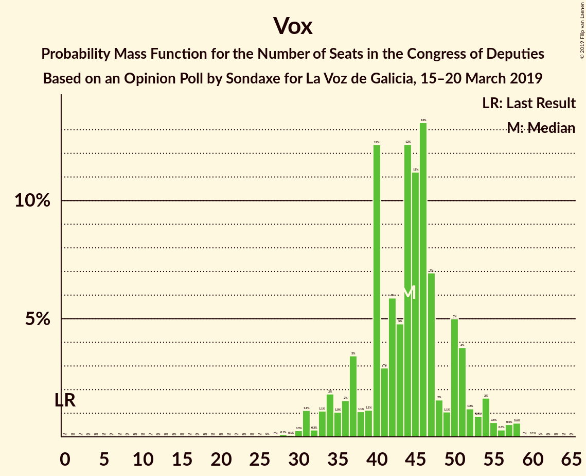
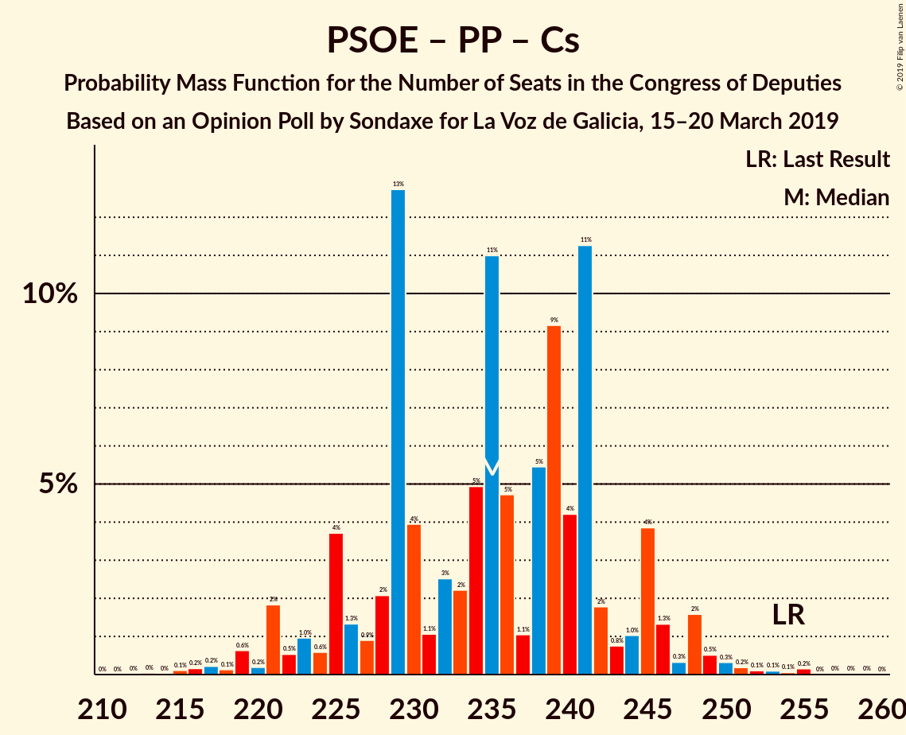
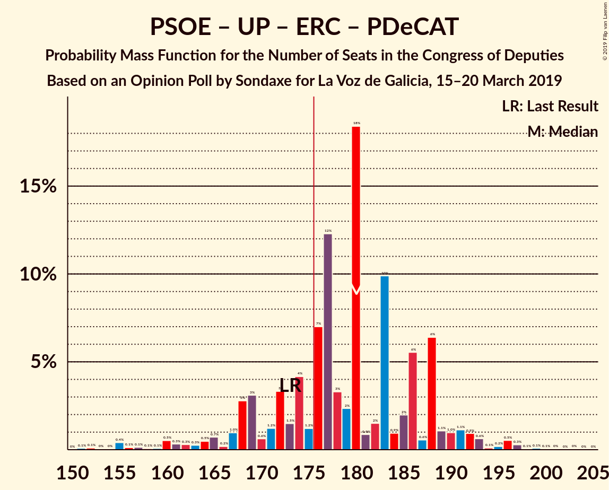
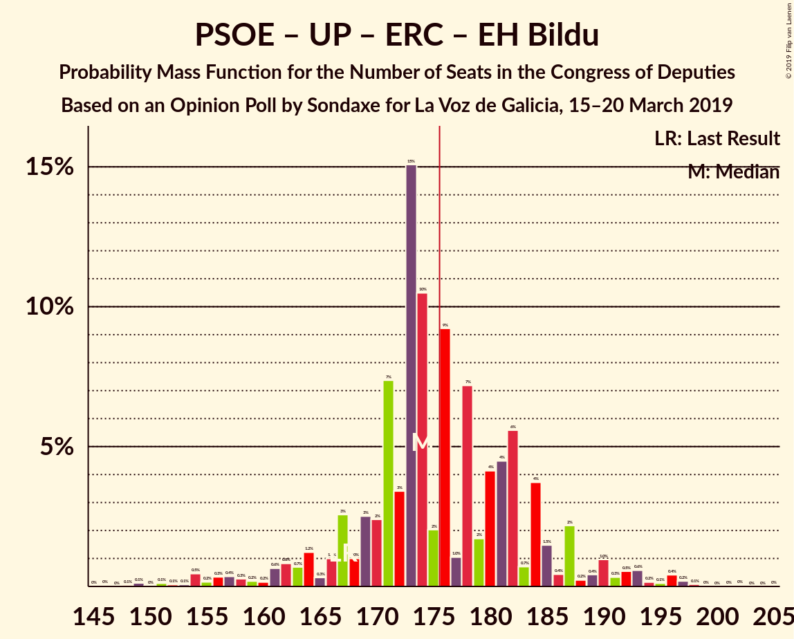
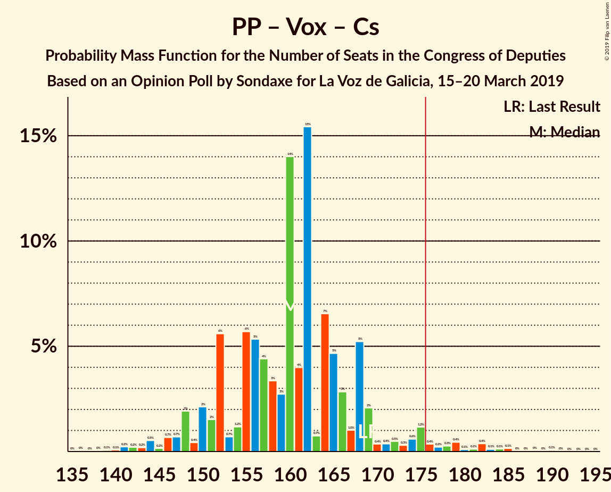
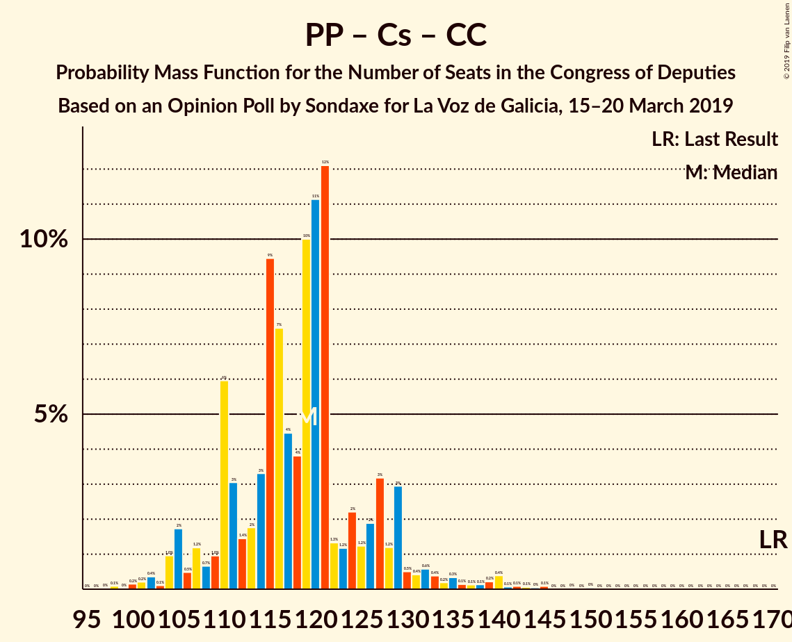

# Opinion Poll by Sondaxe for La Voz de Galicia, 15–20 March 2019

<a href="#voting-intentions">Voting Intentions</a> | <a href="#seats">Seats</a> | <a href="#coalitions">Coalitions</a> | <a href="#technical-information">Technical Information</a>

## Voting Intentions

### Confidence Intervals

| Party | Last Result | Poll Result | 80% Confidence Interval | 90% Confidence Interval | 95% Confidence Interval | 99% Confidence Interval |
|:-----:|:-----------:|:-----------:|:-----------------------:|:-----------------------:|:-----------------------:|:-----------------------:|
| Partido Socialista Obrero Español | 22.6% | 26.9% | 25.1–28.8% |24.7–29.3% |24.2–29.7% |23.4–30.7% |
| Partido Popular | 33.0% | 18.9% | 17.4–20.6% |16.9–21.0% |16.6–21.5% |15.9–22.3% |
| Vox | 0.2% | 13.9% | 12.6–15.4% |12.2–15.8% |11.9–16.2% |11.3–16.9% |
| Ciudadanos–Partido de la Ciudadanía | 13.1% | 13.8% | 12.5–15.3% |12.1–15.7% |11.8–16.1% |11.2–16.8% |
| Unidos Podemos | 21.2% | 13.4% | 12.1–14.9% |11.7–15.3% |11.4–15.7% |10.8–16.4% |
| Esquerra Republicana de Catalunya–Catalunya Sí | 2.7% | 3.9% | 3.2–4.8% |3.0–5.1% |2.9–5.3% |2.6–5.8% |
| Partit Demòcrata Europeu Català | 2.0% | 1.7% | 1.3–2.4% |1.2–2.5% |1.1–2.7% |0.9–3.1% |
| Euzko Alderdi Jeltzalea/Partido Nacionalista Vasco | 1.2% | 1.0% | 0.7–1.5% |0.6–1.7% |0.5–1.8% |0.4–2.1% |
| Euskal Herria Bildu | 0.8% | 0.8% | 0.5–1.3% |0.5–1.4% |0.4–1.6% |0.3–1.9% |
| Coalición Canaria–Partido Nacionalista Canario | 0.3% | 0.5% | 0.3–0.9% |0.3–1.1% |0.2–1.2% |0.2–1.4% |

*Note:* The poll result column reflects the actual value used in the calculations. Published results may vary slightly, and in addition be rounded to fewer digits.

## Seats

### Confidence Intervals

| Party | Last Result | Median | 80% Confidence Interval | 90% Confidence Interval | 95% Confidence Interval | 99% Confidence Interval |
|:-----:|:-----------:|:------:|:-----------------------:|:-----------------------:|:-----------------------:|:-----------------------:|
| <a href="#partido-socialista-obrero-español">Partido Socialista Obrero Español</a> | 85 | 120 | 110–127 |105–130 |103–131 |98–135 |
| <a href="#partido-popular">Partido Popular</a> | 137 | 73 | 68–81 |67–86 |65–88 |62–94 |
| <a href="#vox">Vox</a> | 0 | 44 | 37–50 |35–52 |33–54 |31–58 |
| <a href="#ciudadanos–partido-de-la-ciudadanía">Ciudadanos–Partido de la Ciudadanía</a> | 32 | 43 | 34–48 |32–51 |31–54 |25–56 |
| <a href="#unidos-podemos">Unidos Podemos</a> | 71 | 37 | 32–41 |30–43 |28–44 |25–48 |
| <a href="#esquerra-republicana-de-catalunya–catalunya-sí">Esquerra Republicana de Catalunya–Catalunya Sí</a> | 9 | 16 | 14–20 |13–20 |13–21 |11–22 |
| <a href="#partit-demòcrata-europeu-català">Partit Demòcrata Europeu Català</a> | 8 | 7 | 5–9 |3–9 |3–10 |3–11 |
| <a href="#euzko-alderdi-jeltzalea/partido-nacionalista-vasco">Euzko Alderdi Jeltzalea/Partido Nacionalista Vasco</a> | 5 | 6 | 3–8 |3–8 |3–8 |1–10 |
| <a href="#euskal-herria-bildu">Euskal Herria Bildu</a> | 2 | 2 | 1–7 |1–7 |1–7 |1–7 |
| <a href="#coalición-canaria–partido-nacionalista-canario">Coalición Canaria–Partido Nacionalista Canario</a> | 1 | 2 | 1–4 |1–4 |1–4 |0–5 |

### Partido Socialista Obrero Español

*For a full overview of the results for this party, see the [Partido Socialista Obrero Español](party-partidosocialistaobreroespañol.html) page.*

| Number of Seats | Probability | Accumulated | Special Marks |
|:---------------:|:-----------:|:-----------:|:-------------:|
| 85 | 0% | 100% | Last Result |
| 86 | 0% | 100% |  |
| 87 | 0% | 100% |  |
| 88 | 0% | 100% |  |
| 89 | 0% | 100% |  |
| 90 | 0% | 100% |  |
| 91 | 0% | 100% |  |
| 92 | 0% | 100% |  |
| 93 | 0% | 99.9% |  |
| 94 | 0% | 99.9% |  |
| 95 | 0.1% | 99.9% |  |
| 96 | 0.1% | 99.8% |  |
| 97 | 0.1% | 99.7% |  |
| 98 | 0.2% | 99.6% |  |
| 99 | 0.2% | 99.5% |  |
| 100 | 0.3% | 99.2% |  |
| 101 | 0.3% | 99.0% |  |
| 102 | 0.7% | 98.7% |  |
| 103 | 2% | 98% |  |
| 104 | 0.9% | 96% |  |
| 105 | 0.3% | 95% |  |
| 106 | 1.1% | 95% |  |
| 107 | 0.7% | 94% |  |
| 108 | 1.4% | 93% |  |
| 109 | 1.1% | 92% |  |
| 110 | 3% | 91% |  |
| 111 | 2% | 88% |  |
| 112 | 1.1% | 86% |  |
| 113 | 14% | 85% |  |
| 114 | 1.0% | 71% |  |
| 115 | 2% | 70% |  |
| 116 | 3% | 68% |  |
| 117 | 4% | 65% |  |
| 118 | 4% | 60% |  |
| 119 | 1.4% | 56% |  |
| 120 | 10% | 55% | Median |
| 121 | 10% | 45% |  |
| 122 | 4% | 34% |  |
| 123 | 3% | 31% |  |
| 124 | 1.0% | 27% |  |
| 125 | 1.4% | 26% |  |
| 126 | 10% | 25% |  |
| 127 | 6% | 15% |  |
| 128 | 2% | 9% |  |
| 129 | 0.9% | 6% |  |
| 130 | 2% | 6% |  |
| 131 | 1.3% | 4% |  |
| 132 | 0.5% | 2% |  |
| 133 | 0.5% | 2% |  |
| 134 | 0.6% | 1.4% |  |
| 135 | 0.2% | 0.7% |  |
| 136 | 0.2% | 0.5% |  |
| 137 | 0.1% | 0.3% |  |
| 138 | 0.1% | 0.2% |  |
| 139 | 0% | 0.1% |  |
| 140 | 0% | 0.1% |  |
| 141 | 0% | 0% |  |

### Partido Popular

*For a full overview of the results for this party, see the [Partido Popular](party-partidopopular.html) page.*

| Number of Seats | Probability | Accumulated | Special Marks |
|:---------------:|:-----------:|:-----------:|:-------------:|
| 57 | 0% | 100% |  |
| 58 | 0% | 99.9% |  |
| 59 | 0.1% | 99.9% |  |
| 60 | 0.2% | 99.8% |  |
| 61 | 0.1% | 99.6% |  |
| 62 | 0.7% | 99.5% |  |
| 63 | 0.6% | 98.8% |  |
| 64 | 0.6% | 98% |  |
| 65 | 1.2% | 98% |  |
| 66 | 1.2% | 96% |  |
| 67 | 2% | 95% |  |
| 68 | 8% | 94% |  |
| 69 | 5% | 86% |  |
| 70 | 5% | 81% |  |
| 71 | 18% | 76% |  |
| 72 | 4% | 58% |  |
| 73 | 4% | 54% | Median |
| 74 | 6% | 50% |  |
| 75 | 3% | 43% |  |
| 76 | 15% | 41% |  |
| 77 | 2% | 26% |  |
| 78 | 2% | 24% |  |
| 79 | 7% | 22% |  |
| 80 | 3% | 15% |  |
| 81 | 3% | 12% |  |
| 82 | 2% | 9% |  |
| 83 | 0.6% | 7% |  |
| 84 | 1.1% | 7% |  |
| 85 | 0.2% | 6% |  |
| 86 | 2% | 6% |  |
| 87 | 0.6% | 3% |  |
| 88 | 0.3% | 3% |  |
| 89 | 0.7% | 2% |  |
| 90 | 0.4% | 2% |  |
| 91 | 0.2% | 1.2% |  |
| 92 | 0% | 1.0% |  |
| 93 | 0.1% | 1.0% |  |
| 94 | 0.4% | 0.8% |  |
| 95 | 0.1% | 0.4% |  |
| 96 | 0.1% | 0.4% |  |
| 97 | 0.1% | 0.2% |  |
| 98 | 0.1% | 0.2% |  |
| 99 | 0% | 0.1% |  |
| 100 | 0% | 0.1% |  |
| 101 | 0% | 0.1% |  |
| 102 | 0% | 0.1% |  |
| 103 | 0% | 0% |  |
| 104 | 0% | 0% |  |
| 105 | 0% | 0% |  |
| 106 | 0% | 0% |  |
| 107 | 0% | 0% |  |
| 108 | 0% | 0% |  |
| 109 | 0% | 0% |  |
| 110 | 0% | 0% |  |
| 111 | 0% | 0% |  |
| 112 | 0% | 0% |  |
| 113 | 0% | 0% |  |
| 114 | 0% | 0% |  |
| 115 | 0% | 0% |  |
| 116 | 0% | 0% |  |
| 117 | 0% | 0% |  |
| 118 | 0% | 0% |  |
| 119 | 0% | 0% |  |
| 120 | 0% | 0% |  |
| 121 | 0% | 0% |  |
| 122 | 0% | 0% |  |
| 123 | 0% | 0% |  |
| 124 | 0% | 0% |  |
| 125 | 0% | 0% |  |
| 126 | 0% | 0% |  |
| 127 | 0% | 0% |  |
| 128 | 0% | 0% |  |
| 129 | 0% | 0% |  |
| 130 | 0% | 0% |  |
| 131 | 0% | 0% |  |
| 132 | 0% | 0% |  |
| 133 | 0% | 0% |  |
| 134 | 0% | 0% |  |
| 135 | 0% | 0% |  |
| 136 | 0% | 0% |  |
| 137 | 0% | 0% | Last Result |

### Vox

*For a full overview of the results for this party, see the [Vox](party-vox.html) page.*

| Number of Seats | Probability | Accumulated | Special Marks |
|:---------------:|:-----------:|:-----------:|:-------------:|
| 0 | 0% | 100% | Last Result |
| 1 | 0% | 100% |  |
| 2 | 0% | 100% |  |
| 3 | 0% | 100% |  |
| 4 | 0% | 100% |  |
| 5 | 0% | 100% |  |
| 6 | 0% | 100% |  |
| 7 | 0% | 100% |  |
| 8 | 0% | 100% |  |
| 9 | 0% | 100% |  |
| 10 | 0% | 100% |  |
| 11 | 0% | 100% |  |
| 12 | 0% | 100% |  |
| 13 | 0% | 100% |  |
| 14 | 0% | 100% |  |
| 15 | 0% | 100% |  |
| 16 | 0% | 100% |  |
| 17 | 0% | 100% |  |
| 18 | 0% | 100% |  |
| 19 | 0% | 100% |  |
| 20 | 0% | 100% |  |
| 21 | 0% | 100% |  |
| 22 | 0% | 100% |  |
| 23 | 0% | 100% |  |
| 24 | 0% | 100% |  |
| 25 | 0% | 100% |  |
| 26 | 0% | 100% |  |
| 27 | 0% | 100% |  |
| 28 | 0.1% | 99.9% |  |
| 29 | 0.1% | 99.8% |  |
| 30 | 0.3% | 99.8% |  |
| 31 | 1.1% | 99.5% |  |
| 32 | 0.3% | 98% |  |
| 33 | 1.1% | 98% |  |
| 34 | 2% | 97% |  |
| 35 | 1.0% | 95% |  |
| 36 | 2% | 94% |  |
| 37 | 3% | 93% |  |
| 38 | 1.1% | 89% |  |
| 39 | 1.1% | 88% |  |
| 40 | 12% | 87% |  |
| 41 | 3% | 75% |  |
| 42 | 6% | 72% |  |
| 43 | 5% | 66% |  |
| 44 | 12% | 61% | Median |
| 45 | 11% | 49% |  |
| 46 | 13% | 37% |  |
| 47 | 7% | 24% |  |
| 48 | 2% | 17% |  |
| 49 | 1.1% | 16% |  |
| 50 | 5% | 15% |  |
| 51 | 4% | 10% |  |
| 52 | 1.2% | 6% |  |
| 53 | 0.9% | 5% |  |
| 54 | 2% | 4% |  |
| 55 | 0.6% | 2% |  |
| 56 | 0.3% | 2% |  |
| 57 | 0.5% | 1.2% |  |
| 58 | 0.6% | 0.7% |  |
| 59 | 0% | 0.1% |  |
| 60 | 0.1% | 0.1% |  |
| 61 | 0% | 0% |  |

### Ciudadanos–Partido de la Ciudadanía

*For a full overview of the results for this party, see the [Ciudadanos–Partido de la Ciudadanía](party-ciudadanos–partidodelaciudadanía.html) page.*

| Number of Seats | Probability | Accumulated | Special Marks |
|:---------------:|:-----------:|:-----------:|:-------------:|
| 21 | 0.2% | 100% |  |
| 22 | 0% | 99.8% |  |
| 23 | 0% | 99.7% |  |
| 24 | 0% | 99.7% |  |
| 25 | 0.4% | 99.7% |  |
| 26 | 0.1% | 99.2% |  |
| 27 | 0.1% | 99.1% |  |
| 28 | 0.3% | 99.0% |  |
| 29 | 0.4% | 98.7% |  |
| 30 | 0.8% | 98% |  |
| 31 | 2% | 98% |  |
| 32 | 1.2% | 96% | Last Result |
| 33 | 4% | 94% |  |
| 34 | 1.4% | 91% |  |
| 35 | 2% | 89% |  |
| 36 | 3% | 87% |  |
| 37 | 0.4% | 84% |  |
| 38 | 6% | 84% |  |
| 39 | 5% | 78% |  |
| 40 | 11% | 73% |  |
| 41 | 5% | 61% |  |
| 42 | 6% | 57% |  |
| 43 | 1.4% | 51% | Median |
| 44 | 13% | 50% |  |
| 45 | 14% | 37% |  |
| 46 | 5% | 22% |  |
| 47 | 4% | 17% |  |
| 48 | 3% | 13% |  |
| 49 | 1.1% | 10% |  |
| 50 | 3% | 9% |  |
| 51 | 1.1% | 6% |  |
| 52 | 0.9% | 4% |  |
| 53 | 0.8% | 4% |  |
| 54 | 1.3% | 3% |  |
| 55 | 0.6% | 1.5% |  |
| 56 | 0.4% | 0.8% |  |
| 57 | 0.1% | 0.5% |  |
| 58 | 0.1% | 0.4% |  |
| 59 | 0% | 0.3% |  |
| 60 | 0.2% | 0.2% |  |
| 61 | 0% | 0.1% |  |
| 62 | 0% | 0% |  |

### Unidos Podemos

*For a full overview of the results for this party, see the [Unidos Podemos](party-unidospodemos.html) page.*

| Number of Seats | Probability | Accumulated | Special Marks |
|:---------------:|:-----------:|:-----------:|:-------------:|
| 22 | 0.1% | 100% |  |
| 23 | 0.1% | 99.9% |  |
| 24 | 0.3% | 99.8% |  |
| 25 | 0.3% | 99.5% |  |
| 26 | 0.4% | 99.3% |  |
| 27 | 0.8% | 98.9% |  |
| 28 | 0.8% | 98% |  |
| 29 | 0.9% | 97% |  |
| 30 | 3% | 96% |  |
| 31 | 2% | 93% |  |
| 32 | 2% | 91% |  |
| 33 | 5% | 89% |  |
| 34 | 8% | 84% |  |
| 35 | 8% | 76% |  |
| 36 | 12% | 69% |  |
| 37 | 8% | 56% | Median |
| 38 | 15% | 48% |  |
| 39 | 5% | 33% |  |
| 40 | 14% | 28% |  |
| 41 | 6% | 15% |  |
| 42 | 2% | 9% |  |
| 43 | 4% | 7% |  |
| 44 | 0.7% | 3% |  |
| 45 | 0.8% | 2% |  |
| 46 | 0.4% | 1.1% |  |
| 47 | 0.2% | 0.7% |  |
| 48 | 0.2% | 0.5% |  |
| 49 | 0.1% | 0.3% |  |
| 50 | 0.1% | 0.3% |  |
| 51 | 0.1% | 0.2% |  |
| 52 | 0% | 0.1% |  |
| 53 | 0% | 0.1% |  |
| 54 | 0% | 0.1% |  |
| 55 | 0% | 0.1% |  |
| 56 | 0% | 0.1% |  |
| 57 | 0% | 0.1% |  |
| 58 | 0% | 0% |  |
| 59 | 0% | 0% |  |
| 60 | 0% | 0% |  |
| 61 | 0% | 0% |  |
| 62 | 0% | 0% |  |
| 63 | 0% | 0% |  |
| 64 | 0% | 0% |  |
| 65 | 0% | 0% |  |
| 66 | 0% | 0% |  |
| 67 | 0% | 0% |  |
| 68 | 0% | 0% |  |
| 69 | 0% | 0% |  |
| 70 | 0% | 0% |  |
| 71 | 0% | 0% | Last Result |

### Esquerra Republicana de Catalunya–Catalunya Sí

*For a full overview of the results for this party, see the [Esquerra Republicana de Catalunya–Catalunya Sí](party-esquerrarepublicanadecatalunya–catalunyasí.html) page.*

| Number of Seats | Probability | Accumulated | Special Marks |
|:---------------:|:-----------:|:-----------:|:-------------:|
| 9 | 0.1% | 100% | Last Result |
| 10 | 0.1% | 99.9% |  |
| 11 | 0.7% | 99.9% |  |
| 12 | 0.6% | 99.1% |  |
| 13 | 4% | 98.5% |  |
| 14 | 7% | 94% |  |
| 15 | 35% | 87% |  |
| 16 | 9% | 53% | Median |
| 17 | 10% | 44% |  |
| 18 | 3% | 34% |  |
| 19 | 19% | 31% |  |
| 20 | 7% | 12% |  |
| 21 | 3% | 4% |  |
| 22 | 0.6% | 0.7% |  |
| 23 | 0.1% | 0.1% |  |
| 24 | 0% | 0% |  |

### Partit Demòcrata Europeu Català

*For a full overview of the results for this party, see the [Partit Demòcrata Europeu Català](party-partitdemòcrataeuropeucatalà.html) page.*

| Number of Seats | Probability | Accumulated | Special Marks |
|:---------------:|:-----------:|:-----------:|:-------------:|
| 1 | 0.2% | 100% |  |
| 2 | 0% | 99.8% |  |
| 3 | 6% | 99.8% |  |
| 4 | 3% | 94% |  |
| 5 | 26% | 91% |  |
| 6 | 14% | 65% |  |
| 7 | 13% | 51% | Median |
| 8 | 26% | 38% | Last Result |
| 9 | 9% | 12% |  |
| 10 | 2% | 3% |  |
| 11 | 0.6% | 0.9% |  |
| 12 | 0.1% | 0.4% |  |
| 13 | 0.2% | 0.2% |  |
| 14 | 0.1% | 0.1% |  |
| 15 | 0% | 0% |  |

### Euzko Alderdi Jeltzalea/Partido Nacionalista Vasco

*For a full overview of the results for this party, see the [Euzko Alderdi Jeltzalea/Partido Nacionalista Vasco](party-euzkoalderdijeltzaleapartidonacionalistavasco.html) page.*

| Number of Seats | Probability | Accumulated | Special Marks |
|:---------------:|:-----------:|:-----------:|:-------------:|
| 1 | 0.5% | 100% |  |
| 2 | 1.3% | 99.5% |  |
| 3 | 12% | 98% |  |
| 4 | 9% | 86% |  |
| 5 | 5% | 76% | Last Result |
| 6 | 46% | 71% | Median |
| 7 | 6% | 26% |  |
| 8 | 18% | 20% |  |
| 9 | 0.9% | 2% |  |
| 10 | 1.3% | 1.3% |  |
| 11 | 0% | 0% |  |

### Euskal Herria Bildu

*For a full overview of the results for this party, see the [Euskal Herria Bildu](party-euskalherriabildu.html) page.*

| Number of Seats | Probability | Accumulated | Special Marks |
|:---------------:|:-----------:|:-----------:|:-------------:|
| 0 | 0.3% | 100% |  |
| 1 | 29% | 99.7% |  |
| 2 | 35% | 71% | Last Result, Median |
| 3 | 4% | 36% |  |
| 4 | 6% | 33% |  |
| 5 | 3% | 27% |  |
| 6 | 11% | 24% |  |
| 7 | 12% | 13% |  |
| 8 | 0.1% | 0.3% |  |
| 9 | 0.1% | 0.2% |  |
| 10 | 0.1% | 0.1% |  |
| 11 | 0% | 0% |  |

### Coalición Canaria–Partido Nacionalista Canario

*For a full overview of the results for this party, see the [Coalición Canaria–Partido Nacionalista Canario](party-coalicióncanaria–partidonacionalistacanario.html) page.*

| Number of Seats | Probability | Accumulated | Special Marks |
|:---------------:|:-----------:|:-----------:|:-------------:|
| 0 | 2% | 100% |  |
| 1 | 41% | 98% | Last Result |
| 2 | 31% | 57% | Median |
| 3 | 12% | 26% |  |
| 4 | 13% | 14% |  |
| 5 | 0.8% | 0.9% |  |
| 6 | 0.1% | 0.2% |  |
| 7 | 0% | 0% |  |

## Coalitions

### Confidence Intervals

| Coalition | Last Result | Median | Majority? | 80% Confidence Interval | 90% Confidence Interval | 95% Confidence Interval | 99% Confidence Interval |
|:---------:|:-----------:|:------:|:---------:|:-----------------------:|:-----------------------:|:-----------------------:|:-----------------------:|
| Partido Socialista Obrero Español – Partido Popular – Ciudadanos–Partido de la Ciudadanía | 254 | 235 | 100% | 226–243 | 224–245 | 221–248 | 217–251 |
| Partido Socialista Obrero Español – Ciudadanos–Partido de la Ciudadanía – Unidos Podemos | 188 | 198 | 99.0% | 189–205 | 186–209 | 182–213 | 173–217 |
| Partido Socialista Obrero Español – Partido Popular | 222 | 195 | 98.9% | 184–204 | 180–206 | 178–207 | 173–213 |
| Partido Socialista Obrero Español – Unidos Podemos – Esquerra Republicana de Catalunya–Catalunya Sí – Partit Demòcrata Europeu Català – Euzko Alderdi Jeltzalea/Partido Nacionalista Vasco – Euskal Herria Bildu | 180 | 188 | 96% | 180–196 | 177–199 | 173–201 | 165–206 |
| Partido Socialista Obrero Español – Unidos Podemos – Esquerra Republicana de Catalunya–Catalunya Sí – Partit Demòcrata Europeu Català | 173 | 180 | 77% | 169–188 | 168–190 | 163–192 | 155–197 |
| Partido Socialista Obrero Español – Unidos Podemos – Esquerra Republicana de Catalunya–Catalunya Sí – Euskal Herria Bildu | 167 | 174 | 46% | 168–184 | 164–187 | 161–190 | 153–196 |
| Partido Socialista Obrero Español – Unidos Podemos – Euzko Alderdi Jeltzalea/Partido Nacionalista Vasco – Euskal Herria Bildu | 163 | 165 | 6% | 157–173 | 153–177 | 149–179 | 140–184 |
| Partido Popular – Vox – Ciudadanos–Partido de la Ciudadanía | 169 | 160 | 2% | 152–168 | 149–171 | 147–175 | 142–183 |
| Partido Socialista Obrero Español – Ciudadanos–Partido de la Ciudadanía | 117 | 161 | 2% | 152–170 | 147–172 | 145–174 | 138–181 |
| Partido Socialista Obrero Español – Unidos Podemos – Euzko Alderdi Jeltzalea/Partido Nacionalista Vasco | 161 | 162 | 1.5% | 153–171 | 149–173 | 145–174 | 134–180 |
| Partido Socialista Obrero Español – Unidos Podemos | 156 | 156 | 0.3% | 147–165 | 144–167 | 140–169 | 130–175 |
| Partido Popular – Ciudadanos–Partido de la Ciudadanía – Euzko Alderdi Jeltzalea/Partido Nacionalista Vasco | 174 | 122 | 0% | 114–132 | 111–134 | 108–136 | 103–143 |
| Partido Popular – Vox | 137 | 117 | 0% | 112–126 | 109–129 | 105–133 | 100–139 |
| Partido Popular – Ciudadanos–Partido de la Ciudadanía – Coalición Canaria–Partido Nacionalista Canario | 170 | 119 | 0% | 110–127 | 107–129 | 105–132 | 101–140 |
| Partido Socialista Obrero Español | 85 | 120 | 0% | 110–127 | 105–130 | 103–131 | 98–135 |
| Partido Popular – Ciudadanos–Partido de la Ciudadanía | 169 | 116 | 0% | 108–125 | 105–128 | 104–130 | 99–138 |
| Partido Popular | 137 | 73 | 0% | 68–81 | 67–86 | 65–88 | 62–94 |

### Partido Socialista Obrero Español – Partido Popular – Ciudadanos–Partido de la Ciudadanía

| Number of Seats | Probability | Accumulated | Special Marks |
|:---------------:|:-----------:|:-----------:|:-------------:|
| 213 | 0% | 100% |  |
| 214 | 0% | 99.9% |  |
| 215 | 0.1% | 99.9% |  |
| 216 | 0.2% | 99.8% |  |
| 217 | 0.2% | 99.6% |  |
| 218 | 0.1% | 99.4% |  |
| 219 | 0.6% | 99.3% |  |
| 220 | 0.2% | 98.6% |  |
| 221 | 2% | 98% |  |
| 222 | 0.5% | 97% |  |
| 223 | 1.0% | 96% |  |
| 224 | 0.6% | 95% |  |
| 225 | 4% | 95% |  |
| 226 | 1.3% | 91% |  |
| 227 | 0.9% | 89% |  |
| 228 | 2% | 89% |  |
| 229 | 13% | 86% |  |
| 230 | 4% | 74% |  |
| 231 | 1.1% | 70% |  |
| 232 | 3% | 69% |  |
| 233 | 2% | 66% |  |
| 234 | 5% | 64% |  |
| 235 | 11% | 59% |  |
| 236 | 5% | 48% | Median |
| 237 | 1.1% | 43% |  |
| 238 | 5% | 42% |  |
| 239 | 9% | 37% |  |
| 240 | 4% | 28% |  |
| 241 | 11% | 23% |  |
| 242 | 2% | 12% |  |
| 243 | 0.8% | 10% |  |
| 244 | 1.0% | 10% |  |
| 245 | 4% | 9% |  |
| 246 | 1.3% | 5% |  |
| 247 | 0.3% | 3% |  |
| 248 | 2% | 3% |  |
| 249 | 0.5% | 2% |  |
| 250 | 0.3% | 1.0% |  |
| 251 | 0.2% | 0.7% |  |
| 252 | 0.1% | 0.5% |  |
| 253 | 0.1% | 0.4% |  |
| 254 | 0.1% | 0.3% | Last Result |
| 255 | 0.2% | 0.2% |  |
| 256 | 0% | 0.1% |  |
| 257 | 0% | 0.1% |  |
| 258 | 0% | 0% |  |

### Partido Socialista Obrero Español – Ciudadanos–Partido de la Ciudadanía – Unidos Podemos

| Number of Seats | Probability | Accumulated | Special Marks |
|:---------------:|:-----------:|:-----------:|:-------------:|
| 170 | 0.1% | 100% |  |
| 171 | 0% | 99.9% |  |
| 172 | 0.1% | 99.9% |  |
| 173 | 0.4% | 99.8% |  |
| 174 | 0.2% | 99.4% |  |
| 175 | 0.2% | 99.2% |  |
| 176 | 0.1% | 99.0% | Majority |
| 177 | 0% | 98.9% |  |
| 178 | 0.5% | 98.8% |  |
| 179 | 0.2% | 98% |  |
| 180 | 0.2% | 98% |  |
| 181 | 0.2% | 98% |  |
| 182 | 0.7% | 98% |  |
| 183 | 0.2% | 97% |  |
| 184 | 0.7% | 97% |  |
| 185 | 0.8% | 96% |  |
| 186 | 3% | 95% |  |
| 187 | 0.3% | 92% |  |
| 188 | 2% | 92% | Last Result |
| 189 | 1.2% | 90% |  |
| 190 | 4% | 89% |  |
| 191 | 4% | 85% |  |
| 192 | 2% | 82% |  |
| 193 | 2% | 80% |  |
| 194 | 4% | 78% |  |
| 195 | 5% | 74% |  |
| 196 | 0.7% | 70% |  |
| 197 | 3% | 69% |  |
| 198 | 20% | 66% |  |
| 199 | 1.0% | 45% |  |
| 200 | 6% | 44% | Median |
| 201 | 14% | 38% |  |
| 202 | 2% | 24% |  |
| 203 | 1.0% | 23% |  |
| 204 | 7% | 22% |  |
| 205 | 7% | 15% |  |
| 206 | 1.2% | 8% |  |
| 207 | 1.3% | 7% |  |
| 208 | 0.4% | 5% |  |
| 209 | 0.9% | 5% |  |
| 210 | 1.0% | 4% |  |
| 211 | 0.3% | 3% |  |
| 212 | 0.2% | 3% |  |
| 213 | 0.5% | 3% |  |
| 214 | 0.2% | 2% |  |
| 215 | 1.1% | 2% |  |
| 216 | 0.3% | 0.9% |  |
| 217 | 0.2% | 0.6% |  |
| 218 | 0.2% | 0.4% |  |
| 219 | 0% | 0.2% |  |
| 220 | 0% | 0.2% |  |
| 221 | 0.1% | 0.1% |  |
| 222 | 0% | 0.1% |  |
| 223 | 0% | 0.1% |  |
| 224 | 0% | 0% |  |

### Partido Socialista Obrero Español – Partido Popular

| Number of Seats | Probability | Accumulated | Special Marks |
|:---------------:|:-----------:|:-----------:|:-------------:|
| 164 | 0% | 100% |  |
| 165 | 0% | 99.9% |  |
| 166 | 0% | 99.9% |  |
| 167 | 0% | 99.9% |  |
| 168 | 0% | 99.9% |  |
| 169 | 0% | 99.9% |  |
| 170 | 0.1% | 99.9% |  |
| 171 | 0% | 99.8% |  |
| 172 | 0.1% | 99.8% |  |
| 173 | 0.2% | 99.6% |  |
| 174 | 0.1% | 99.4% |  |
| 175 | 0.3% | 99.3% |  |
| 176 | 0.4% | 98.9% | Majority |
| 177 | 0.9% | 98% |  |
| 178 | 0.5% | 98% |  |
| 179 | 2% | 97% |  |
| 180 | 0.4% | 95% |  |
| 181 | 2% | 95% |  |
| 182 | 0.7% | 93% |  |
| 183 | 1.3% | 92% |  |
| 184 | 13% | 91% |  |
| 185 | 1.2% | 78% |  |
| 186 | 4% | 77% |  |
| 187 | 2% | 73% |  |
| 188 | 3% | 71% |  |
| 189 | 1.1% | 68% |  |
| 190 | 5% | 67% |  |
| 191 | 2% | 62% |  |
| 192 | 0.9% | 60% |  |
| 193 | 2% | 59% | Median |
| 194 | 6% | 57% |  |
| 195 | 9% | 51% |  |
| 196 | 5% | 43% |  |
| 197 | 10% | 37% |  |
| 198 | 2% | 27% |  |
| 199 | 7% | 25% |  |
| 200 | 5% | 18% |  |
| 201 | 1.4% | 13% |  |
| 202 | 1.3% | 12% |  |
| 203 | 0.5% | 10% |  |
| 204 | 2% | 10% |  |
| 205 | 0.8% | 8% |  |
| 206 | 3% | 7% |  |
| 207 | 3% | 4% |  |
| 208 | 0.2% | 1.3% |  |
| 209 | 0.1% | 1.1% |  |
| 210 | 0.2% | 1.0% |  |
| 211 | 0.1% | 0.8% |  |
| 212 | 0% | 0.7% |  |
| 213 | 0.2% | 0.7% |  |
| 214 | 0.3% | 0.5% |  |
| 215 | 0% | 0.2% |  |
| 216 | 0.1% | 0.1% |  |
| 217 | 0% | 0.1% |  |
| 218 | 0% | 0.1% |  |
| 219 | 0% | 0% |  |
| 220 | 0% | 0% |  |
| 221 | 0% | 0% |  |
| 222 | 0% | 0% | Last Result |

### Partido Socialista Obrero Español – Unidos Podemos – Esquerra Republicana de Catalunya–Catalunya Sí – Partit Demòcrata Europeu Català – Euzko Alderdi Jeltzalea/Partido Nacionalista Vasco – Euskal Herria Bildu

| Number of Seats | Probability | Accumulated | Special Marks |
|:---------------:|:-----------:|:-----------:|:-------------:|
| 158 | 0.1% | 100% |  |
| 159 | 0% | 99.9% |  |
| 160 | 0% | 99.9% |  |
| 161 | 0% | 99.9% |  |
| 162 | 0% | 99.9% |  |
| 163 | 0.2% | 99.9% |  |
| 164 | 0.1% | 99.7% |  |
| 165 | 0.4% | 99.5% |  |
| 166 | 0.1% | 99.1% |  |
| 167 | 0.1% | 99.1% |  |
| 168 | 0.2% | 99.0% |  |
| 169 | 0.1% | 98.8% |  |
| 170 | 0.4% | 98.7% |  |
| 171 | 0.3% | 98% |  |
| 172 | 0.3% | 98% |  |
| 173 | 0.9% | 98% |  |
| 174 | 0.6% | 97% |  |
| 175 | 0.6% | 96% |  |
| 176 | 0.5% | 96% | Majority |
| 177 | 0.4% | 95% |  |
| 178 | 0.9% | 95% |  |
| 179 | 2% | 94% |  |
| 180 | 2% | 92% | Last Result |
| 181 | 3% | 89% |  |
| 182 | 3% | 86% |  |
| 183 | 1.0% | 83% |  |
| 184 | 6% | 82% |  |
| 185 | 18% | 75% |  |
| 186 | 2% | 58% |  |
| 187 | 2% | 56% |  |
| 188 | 6% | 54% | Median |
| 189 | 12% | 48% |  |
| 190 | 4% | 36% |  |
| 191 | 7% | 31% |  |
| 192 | 3% | 25% |  |
| 193 | 5% | 21% |  |
| 194 | 1.2% | 16% |  |
| 195 | 0.3% | 15% |  |
| 196 | 6% | 15% |  |
| 197 | 0.8% | 9% |  |
| 198 | 2% | 8% |  |
| 199 | 2% | 6% |  |
| 200 | 0.2% | 4% |  |
| 201 | 1.5% | 4% |  |
| 202 | 0.6% | 2% |  |
| 203 | 0.6% | 2% |  |
| 204 | 0.1% | 1.2% |  |
| 205 | 0.5% | 1.1% |  |
| 206 | 0.2% | 0.7% |  |
| 207 | 0.4% | 0.5% |  |
| 208 | 0% | 0.1% |  |
| 209 | 0% | 0.1% |  |
| 210 | 0% | 0.1% |  |
| 211 | 0% | 0.1% |  |
| 212 | 0% | 0.1% |  |
| 213 | 0% | 0% |  |

### Partido Socialista Obrero Español – Unidos Podemos – Esquerra Republicana de Catalunya–Catalunya Sí – Partit Demòcrata Europeu Català

| Number of Seats | Probability | Accumulated | Special Marks |
|:---------------:|:-----------:|:-----------:|:-------------:|
| 151 | 0.1% | 100% |  |
| 152 | 0.1% | 99.9% |  |
| 153 | 0% | 99.8% |  |
| 154 | 0% | 99.7% |  |
| 155 | 0.4% | 99.7% |  |
| 156 | 0.1% | 99.3% |  |
| 157 | 0.1% | 99.2% |  |
| 158 | 0.1% | 99.0% |  |
| 159 | 0.1% | 99.0% |  |
| 160 | 0.5% | 98.9% |  |
| 161 | 0.3% | 98% |  |
| 162 | 0.3% | 98% |  |
| 163 | 0.3% | 98% |  |
| 164 | 0.5% | 97% |  |
| 165 | 0.7% | 97% |  |
| 166 | 0.2% | 96% |  |
| 167 | 1.0% | 96% |  |
| 168 | 3% | 95% |  |
| 169 | 3% | 92% |  |
| 170 | 0.6% | 89% |  |
| 171 | 1.2% | 89% |  |
| 172 | 3% | 87% |  |
| 173 | 1.5% | 84% | Last Result |
| 174 | 4% | 83% |  |
| 175 | 1.2% | 78% |  |
| 176 | 7% | 77% | Majority |
| 177 | 12% | 70% |  |
| 178 | 3% | 58% |  |
| 179 | 2% | 55% |  |
| 180 | 18% | 52% | Median |
| 181 | 0.9% | 34% |  |
| 182 | 2% | 33% |  |
| 183 | 10% | 31% |  |
| 184 | 0.9% | 22% |  |
| 185 | 2% | 21% |  |
| 186 | 6% | 19% |  |
| 187 | 0.6% | 13% |  |
| 188 | 6% | 13% |  |
| 189 | 1.1% | 6% |  |
| 190 | 1.0% | 5% |  |
| 191 | 1.1% | 4% |  |
| 192 | 0.9% | 3% |  |
| 193 | 0.6% | 2% |  |
| 194 | 0.1% | 1.4% |  |
| 195 | 0.2% | 1.3% |  |
| 196 | 0.5% | 1.1% |  |
| 197 | 0.3% | 0.6% |  |
| 198 | 0.1% | 0.3% |  |
| 199 | 0.1% | 0.3% |  |
| 200 | 0.1% | 0.2% |  |
| 201 | 0% | 0.1% |  |
| 202 | 0% | 0.1% |  |
| 203 | 0% | 0.1% |  |
| 204 | 0% | 0% |  |

### Partido Socialista Obrero Español – Unidos Podemos – Esquerra Republicana de Catalunya–Catalunya Sí – Euskal Herria Bildu

| Number of Seats | Probability | Accumulated | Special Marks |
|:---------------:|:-----------:|:-----------:|:-------------:|
| 146 | 0% | 100% |  |
| 147 | 0% | 99.9% |  |
| 148 | 0.1% | 99.9% |  |
| 149 | 0.1% | 99.9% |  |
| 150 | 0% | 99.8% |  |
| 151 | 0.1% | 99.7% |  |
| 152 | 0.1% | 99.6% |  |
| 153 | 0.1% | 99.6% |  |
| 154 | 0.5% | 99.5% |  |
| 155 | 0.2% | 99.0% |  |
| 156 | 0.3% | 98.9% |  |
| 157 | 0.4% | 98.5% |  |
| 158 | 0.3% | 98% |  |
| 159 | 0.2% | 98% |  |
| 160 | 0.2% | 98% |  |
| 161 | 0.6% | 98% |  |
| 162 | 0.8% | 97% |  |
| 163 | 0.7% | 96% |  |
| 164 | 1.2% | 95% |  |
| 165 | 0.3% | 94% |  |
| 166 | 1.0% | 94% |  |
| 167 | 3% | 93% | Last Result |
| 168 | 1.0% | 90% |  |
| 169 | 3% | 89% |  |
| 170 | 2% | 87% |  |
| 171 | 7% | 84% |  |
| 172 | 3% | 77% |  |
| 173 | 15% | 74% |  |
| 174 | 10% | 59% |  |
| 175 | 2% | 48% | Median |
| 176 | 9% | 46% | Majority |
| 177 | 1.0% | 37% |  |
| 178 | 7% | 36% |  |
| 179 | 2% | 29% |  |
| 180 | 4% | 27% |  |
| 181 | 4% | 23% |  |
| 182 | 6% | 18% |  |
| 183 | 0.7% | 13% |  |
| 184 | 4% | 12% |  |
| 185 | 1.5% | 8% |  |
| 186 | 0.4% | 7% |  |
| 187 | 2% | 6% |  |
| 188 | 0.2% | 4% |  |
| 189 | 0.4% | 4% |  |
| 190 | 1.0% | 3% |  |
| 191 | 0.3% | 2% |  |
| 192 | 0.5% | 2% |  |
| 193 | 0.6% | 2% |  |
| 194 | 0.2% | 1.0% |  |
| 195 | 0.1% | 0.9% |  |
| 196 | 0.4% | 0.8% |  |
| 197 | 0.2% | 0.4% |  |
| 198 | 0.1% | 0.2% |  |
| 199 | 0% | 0.1% |  |
| 200 | 0% | 0.1% |  |
| 201 | 0% | 0.1% |  |
| 202 | 0% | 0.1% |  |
| 203 | 0% | 0% |  |

### Partido Socialista Obrero Español – Unidos Podemos – Euzko Alderdi Jeltzalea/Partido Nacionalista Vasco – Euskal Herria Bildu

| Number of Seats | Probability | Accumulated | Special Marks |
|:---------------:|:-----------:|:-----------:|:-------------:|
| 133 | 0% | 100% |  |
| 134 | 0% | 99.9% |  |
| 135 | 0% | 99.9% |  |
| 136 | 0% | 99.9% |  |
| 137 | 0% | 99.9% |  |
| 138 | 0% | 99.9% |  |
| 139 | 0% | 99.8% |  |
| 140 | 0.4% | 99.8% |  |
| 141 | 0.1% | 99.4% |  |
| 142 | 0.1% | 99.2% |  |
| 143 | 0.2% | 99.2% |  |
| 144 | 0.2% | 99.0% |  |
| 145 | 0.1% | 98.8% |  |
| 146 | 0.1% | 98.7% |  |
| 147 | 0.3% | 98.6% |  |
| 148 | 0.2% | 98% |  |
| 149 | 1.2% | 98% |  |
| 150 | 0.6% | 97% |  |
| 151 | 0.4% | 96% |  |
| 152 | 0.6% | 96% |  |
| 153 | 0.8% | 95% |  |
| 154 | 0.8% | 95% |  |
| 155 | 0.9% | 94% |  |
| 156 | 2% | 93% |  |
| 157 | 1.4% | 91% |  |
| 158 | 2% | 89% |  |
| 159 | 1.4% | 88% |  |
| 160 | 6% | 86% |  |
| 161 | 11% | 80% |  |
| 162 | 6% | 69% |  |
| 163 | 6% | 63% | Last Result |
| 164 | 7% | 57% |  |
| 165 | 7% | 50% | Median |
| 166 | 11% | 44% |  |
| 167 | 6% | 33% |  |
| 168 | 2% | 27% |  |
| 169 | 4% | 25% |  |
| 170 | 3% | 21% |  |
| 171 | 1.1% | 18% |  |
| 172 | 3% | 17% |  |
| 173 | 6% | 14% |  |
| 174 | 0.5% | 8% |  |
| 175 | 2% | 8% |  |
| 176 | 0.7% | 6% | Majority |
| 177 | 1.0% | 5% |  |
| 178 | 1.0% | 4% |  |
| 179 | 1.1% | 3% |  |
| 180 | 0.4% | 2% |  |
| 181 | 0.4% | 2% |  |
| 182 | 0.2% | 1.3% |  |
| 183 | 0.5% | 1.0% |  |
| 184 | 0.3% | 0.5% |  |
| 185 | 0.1% | 0.3% |  |
| 186 | 0.1% | 0.2% |  |
| 187 | 0% | 0.1% |  |
| 188 | 0% | 0.1% |  |
| 189 | 0% | 0% |  |

### Partido Popular – Vox – Ciudadanos–Partido de la Ciudadanía

| Number of Seats | Probability | Accumulated | Special Marks |
|:---------------:|:-----------:|:-----------:|:-------------:|
| 136 | 0% | 100% |  |
| 137 | 0% | 99.9% |  |
| 138 | 0% | 99.9% |  |
| 139 | 0.1% | 99.9% |  |
| 140 | 0.1% | 99.8% |  |
| 141 | 0.2% | 99.8% |  |
| 142 | 0.2% | 99.5% |  |
| 143 | 0.2% | 99.3% |  |
| 144 | 0.5% | 99.1% |  |
| 145 | 0.2% | 98.6% |  |
| 146 | 0.7% | 98% |  |
| 147 | 0.7% | 98% |  |
| 148 | 2% | 97% |  |
| 149 | 0.4% | 95% |  |
| 150 | 2% | 95% |  |
| 151 | 2% | 93% |  |
| 152 | 6% | 91% |  |
| 153 | 0.7% | 86% |  |
| 154 | 1.2% | 85% |  |
| 155 | 6% | 84% |  |
| 156 | 5% | 78% |  |
| 157 | 4% | 73% |  |
| 158 | 3% | 68% |  |
| 159 | 3% | 65% |  |
| 160 | 14% | 62% | Median |
| 161 | 4% | 48% |  |
| 162 | 15% | 44% |  |
| 163 | 0.7% | 29% |  |
| 164 | 7% | 28% |  |
| 165 | 5% | 21% |  |
| 166 | 3% | 17% |  |
| 167 | 1.0% | 14% |  |
| 168 | 5% | 13% |  |
| 169 | 2% | 8% | Last Result |
| 170 | 0.4% | 6% |  |
| 171 | 0.4% | 5% |  |
| 172 | 0.5% | 5% |  |
| 173 | 0.3% | 4% |  |
| 174 | 0.6% | 4% |  |
| 175 | 1.2% | 4% |  |
| 176 | 0.4% | 2% | Majority |
| 177 | 0.2% | 2% |  |
| 178 | 0.3% | 2% |  |
| 179 | 0.4% | 2% |  |
| 180 | 0.1% | 1.1% |  |
| 181 | 0.1% | 1.0% |  |
| 182 | 0.4% | 0.9% |  |
| 183 | 0.1% | 0.5% |  |
| 184 | 0.1% | 0.4% |  |
| 185 | 0.1% | 0.3% |  |
| 186 | 0% | 0.1% |  |
| 187 | 0% | 0.1% |  |
| 188 | 0% | 0.1% |  |
| 189 | 0% | 0.1% |  |
| 190 | 0.1% | 0.1% |  |
| 191 | 0% | 0% |  |

### Partido Socialista Obrero Español – Ciudadanos–Partido de la Ciudadanía

| Number of Seats | Probability | Accumulated | Special Marks |
|:---------------:|:-----------:|:-----------:|:-------------:|
| 117 | 0% | 100% | Last Result |
| 118 | 0% | 100% |  |
| 119 | 0% | 100% |  |
| 120 | 0% | 100% |  |
| 121 | 0% | 100% |  |
| 122 | 0% | 100% |  |
| 123 | 0% | 100% |  |
| 124 | 0% | 100% |  |
| 125 | 0% | 100% |  |
| 126 | 0% | 100% |  |
| 127 | 0% | 100% |  |
| 128 | 0% | 100% |  |
| 129 | 0% | 100% |  |
| 130 | 0% | 100% |  |
| 131 | 0% | 100% |  |
| 132 | 0% | 100% |  |
| 133 | 0% | 100% |  |
| 134 | 0% | 99.9% |  |
| 135 | 0% | 99.9% |  |
| 136 | 0.2% | 99.9% |  |
| 137 | 0.1% | 99.7% |  |
| 138 | 0.2% | 99.6% |  |
| 139 | 0.2% | 99.4% |  |
| 140 | 0.1% | 99.2% |  |
| 141 | 0.2% | 99.2% |  |
| 142 | 0.5% | 99.0% |  |
| 143 | 0.2% | 98.5% |  |
| 144 | 0.1% | 98% |  |
| 145 | 3% | 98% |  |
| 146 | 0.2% | 96% |  |
| 147 | 1.2% | 95% |  |
| 148 | 0.8% | 94% |  |
| 149 | 2% | 94% |  |
| 150 | 0.4% | 92% |  |
| 151 | 0.5% | 91% |  |
| 152 | 3% | 91% |  |
| 153 | 3% | 88% |  |
| 154 | 4% | 85% |  |
| 155 | 0.5% | 81% |  |
| 156 | 2% | 80% |  |
| 157 | 3% | 78% |  |
| 158 | 12% | 75% |  |
| 159 | 4% | 63% |  |
| 160 | 8% | 59% |  |
| 161 | 3% | 51% |  |
| 162 | 3% | 48% |  |
| 163 | 4% | 45% | Median |
| 164 | 3% | 41% |  |
| 165 | 12% | 38% |  |
| 166 | 2% | 26% |  |
| 167 | 8% | 24% |  |
| 168 | 1.2% | 16% |  |
| 169 | 1.0% | 15% |  |
| 170 | 4% | 14% |  |
| 171 | 4% | 9% |  |
| 172 | 2% | 6% |  |
| 173 | 0.4% | 4% |  |
| 174 | 1.5% | 3% |  |
| 175 | 0.4% | 2% |  |
| 176 | 0.5% | 2% | Majority |
| 177 | 0.1% | 1.2% |  |
| 178 | 0.2% | 1.0% |  |
| 179 | 0.1% | 0.8% |  |
| 180 | 0.2% | 0.7% |  |
| 181 | 0.2% | 0.5% |  |
| 182 | 0% | 0.4% |  |
| 183 | 0.1% | 0.3% |  |
| 184 | 0.2% | 0.2% |  |
| 185 | 0% | 0% |  |

### Partido Socialista Obrero Español – Unidos Podemos – Euzko Alderdi Jeltzalea/Partido Nacionalista Vasco

| Number of Seats | Probability | Accumulated | Special Marks |
|:---------------:|:-----------:|:-----------:|:-------------:|
| 128 | 0% | 100% |  |
| 129 | 0% | 99.9% |  |
| 130 | 0% | 99.9% |  |
| 131 | 0% | 99.9% |  |
| 132 | 0% | 99.9% |  |
| 133 | 0.4% | 99.9% |  |
| 134 | 0% | 99.5% |  |
| 135 | 0.1% | 99.5% |  |
| 136 | 0.1% | 99.4% |  |
| 137 | 0.1% | 99.3% |  |
| 138 | 0.1% | 99.3% |  |
| 139 | 0.1% | 99.1% |  |
| 140 | 0.1% | 99.0% |  |
| 141 | 0.1% | 98.9% |  |
| 142 | 0.5% | 98.8% |  |
| 143 | 0.4% | 98% |  |
| 144 | 0.3% | 98% |  |
| 145 | 0.3% | 98% |  |
| 146 | 0.3% | 97% |  |
| 147 | 0.9% | 97% |  |
| 148 | 0.7% | 96% |  |
| 149 | 2% | 96% |  |
| 150 | 0.9% | 94% |  |
| 151 | 0.6% | 93% |  |
| 152 | 2% | 92% |  |
| 153 | 0.9% | 90% |  |
| 154 | 5% | 90% |  |
| 155 | 3% | 84% |  |
| 156 | 0.8% | 81% |  |
| 157 | 3% | 80% |  |
| 158 | 5% | 78% |  |
| 159 | 10% | 73% |  |
| 160 | 7% | 62% |  |
| 161 | 1.1% | 55% | Last Result |
| 162 | 8% | 54% |  |
| 163 | 5% | 46% | Median |
| 164 | 2% | 41% |  |
| 165 | 14% | 39% |  |
| 166 | 2% | 25% |  |
| 167 | 4% | 23% |  |
| 168 | 0.8% | 19% |  |
| 169 | 3% | 18% |  |
| 170 | 2% | 15% |  |
| 171 | 7% | 13% |  |
| 172 | 0.6% | 6% |  |
| 173 | 2% | 5% |  |
| 174 | 1.2% | 3% |  |
| 175 | 0.6% | 2% |  |
| 176 | 0.1% | 1.5% | Majority |
| 177 | 0.1% | 1.4% |  |
| 178 | 0.3% | 1.3% |  |
| 179 | 0.5% | 1.1% |  |
| 180 | 0.1% | 0.6% |  |
| 181 | 0.3% | 0.5% |  |
| 182 | 0.1% | 0.2% |  |
| 183 | 0% | 0.1% |  |
| 184 | 0% | 0.1% |  |
| 185 | 0% | 0.1% |  |
| 186 | 0% | 0% |  |

### Partido Socialista Obrero Español – Unidos Podemos

| Number of Seats | Probability | Accumulated | Special Marks |
|:---------------:|:-----------:|:-----------:|:-------------:|
| 126 | 0.1% | 100% |  |
| 127 | 0% | 99.9% |  |
| 128 | 0% | 99.9% |  |
| 129 | 0.1% | 99.9% |  |
| 130 | 0.4% | 99.8% |  |
| 131 | 0.1% | 99.4% |  |
| 132 | 0.1% | 99.3% |  |
| 133 | 0% | 99.3% |  |
| 134 | 0.1% | 99.2% |  |
| 135 | 0.2% | 99.1% |  |
| 136 | 0.2% | 98.9% |  |
| 137 | 0.2% | 98.7% |  |
| 138 | 0.4% | 98.5% |  |
| 139 | 0.6% | 98% |  |
| 140 | 0.6% | 98% |  |
| 141 | 0.7% | 97% |  |
| 142 | 0.8% | 96% |  |
| 143 | 0.3% | 95% |  |
| 144 | 2% | 95% |  |
| 145 | 0.7% | 93% |  |
| 146 | 1.4% | 92% |  |
| 147 | 1.1% | 91% |  |
| 148 | 2% | 90% |  |
| 149 | 1.4% | 87% |  |
| 150 | 4% | 86% |  |
| 151 | 2% | 82% |  |
| 152 | 6% | 80% |  |
| 153 | 10% | 74% |  |
| 154 | 7% | 64% |  |
| 155 | 3% | 57% |  |
| 156 | 4% | 54% | Last Result |
| 157 | 14% | 50% | Median |
| 158 | 6% | 36% |  |
| 159 | 3% | 30% |  |
| 160 | 2% | 26% |  |
| 161 | 4% | 24% |  |
| 162 | 0.9% | 20% |  |
| 163 | 4% | 19% |  |
| 164 | 0.9% | 16% |  |
| 165 | 8% | 15% |  |
| 166 | 0.6% | 6% |  |
| 167 | 1.0% | 6% |  |
| 168 | 1.1% | 5% |  |
| 169 | 1.2% | 3% |  |
| 170 | 0.5% | 2% |  |
| 171 | 0.3% | 2% |  |
| 172 | 0.4% | 1.4% |  |
| 173 | 0.2% | 1.0% |  |
| 174 | 0.1% | 0.8% |  |
| 175 | 0.5% | 0.7% |  |
| 176 | 0.1% | 0.3% | Majority |
| 177 | 0% | 0.2% |  |
| 178 | 0% | 0.2% |  |
| 179 | 0.1% | 0.1% |  |
| 180 | 0% | 0.1% |  |
| 181 | 0% | 0% |  |

### Partido Popular – Ciudadanos–Partido de la Ciudadanía – Euzko Alderdi Jeltzalea/Partido Nacionalista Vasco

| Number of Seats | Probability | Accumulated | Special Marks |
|:---------------:|:-----------:|:-----------:|:-------------:|
| 99 | 0% | 100% |  |
| 100 | 0% | 99.9% |  |
| 101 | 0% | 99.9% |  |
| 102 | 0.3% | 99.9% |  |
| 103 | 0.3% | 99.6% |  |
| 104 | 0.2% | 99.4% |  |
| 105 | 0.1% | 99.2% |  |
| 106 | 0.3% | 99.0% |  |
| 107 | 1.2% | 98.8% |  |
| 108 | 0.4% | 98% |  |
| 109 | 0.7% | 97% |  |
| 110 | 1.2% | 96% |  |
| 111 | 2% | 95% |  |
| 112 | 0.2% | 93% |  |
| 113 | 2% | 93% |  |
| 114 | 6% | 92% |  |
| 115 | 3% | 85% |  |
| 116 | 2% | 83% |  |
| 117 | 4% | 80% |  |
| 118 | 6% | 77% |  |
| 119 | 7% | 70% |  |
| 120 | 4% | 64% |  |
| 121 | 2% | 60% |  |
| 122 | 14% | 58% | Median |
| 123 | 12% | 44% |  |
| 124 | 0.7% | 32% |  |
| 125 | 4% | 31% |  |
| 126 | 0.7% | 27% |  |
| 127 | 0.8% | 26% |  |
| 128 | 10% | 26% |  |
| 129 | 1.0% | 15% |  |
| 130 | 3% | 14% |  |
| 131 | 2% | 12% |  |
| 132 | 3% | 10% |  |
| 133 | 0.4% | 7% |  |
| 134 | 4% | 7% |  |
| 135 | 0.6% | 3% |  |
| 136 | 0.4% | 3% |  |
| 137 | 0.3% | 2% |  |
| 138 | 0.2% | 2% |  |
| 139 | 0.2% | 2% |  |
| 140 | 0.5% | 1.5% |  |
| 141 | 0.2% | 1.0% |  |
| 142 | 0.2% | 0.8% |  |
| 143 | 0.3% | 0.7% |  |
| 144 | 0% | 0.4% |  |
| 145 | 0.1% | 0.4% |  |
| 146 | 0% | 0.2% |  |
| 147 | 0% | 0.2% |  |
| 148 | 0% | 0.2% |  |
| 149 | 0.1% | 0.2% |  |
| 150 | 0% | 0.1% |  |
| 151 | 0% | 0.1% |  |
| 152 | 0% | 0.1% |  |
| 153 | 0% | 0% |  |
| 154 | 0% | 0% |  |
| 155 | 0% | 0% |  |
| 156 | 0% | 0% |  |
| 157 | 0% | 0% |  |
| 158 | 0% | 0% |  |
| 159 | 0% | 0% |  |
| 160 | 0% | 0% |  |
| 161 | 0% | 0% |  |
| 162 | 0% | 0% |  |
| 163 | 0% | 0% |  |
| 164 | 0% | 0% |  |
| 165 | 0% | 0% |  |
| 166 | 0% | 0% |  |
| 167 | 0% | 0% |  |
| 168 | 0% | 0% |  |
| 169 | 0% | 0% |  |
| 170 | 0% | 0% |  |
| 171 | 0% | 0% |  |
| 172 | 0% | 0% |  |
| 173 | 0% | 0% |  |
| 174 | 0% | 0% | Last Result |

### Partido Popular – Vox

| Number of Seats | Probability | Accumulated | Special Marks |
|:---------------:|:-----------:|:-----------:|:-------------:|
| 95 | 0% | 100% |  |
| 96 | 0.2% | 99.9% |  |
| 97 | 0.1% | 99.7% |  |
| 98 | 0% | 99.6% |  |
| 99 | 0.1% | 99.6% |  |
| 100 | 0.2% | 99.5% |  |
| 101 | 0.2% | 99.3% |  |
| 102 | 1.0% | 99.2% |  |
| 103 | 0.4% | 98% |  |
| 104 | 0.2% | 98% |  |
| 105 | 0.3% | 98% |  |
| 106 | 0.4% | 97% |  |
| 107 | 0.5% | 97% |  |
| 108 | 1.2% | 96% |  |
| 109 | 1.3% | 95% |  |
| 110 | 1.1% | 94% |  |
| 111 | 1.0% | 93% |  |
| 112 | 13% | 92% |  |
| 113 | 3% | 79% |  |
| 114 | 2% | 75% |  |
| 115 | 4% | 74% |  |
| 116 | 13% | 70% |  |
| 117 | 11% | 57% | Median |
| 118 | 6% | 46% |  |
| 119 | 1.1% | 39% |  |
| 120 | 4% | 38% |  |
| 121 | 9% | 35% |  |
| 122 | 3% | 26% |  |
| 123 | 1.4% | 23% |  |
| 124 | 6% | 21% |  |
| 125 | 2% | 15% |  |
| 126 | 5% | 13% |  |
| 127 | 0.3% | 9% |  |
| 128 | 3% | 8% |  |
| 129 | 0.7% | 5% |  |
| 130 | 0.6% | 5% |  |
| 131 | 0.9% | 4% |  |
| 132 | 0.4% | 3% |  |
| 133 | 0.9% | 3% |  |
| 134 | 0.3% | 2% |  |
| 135 | 0.2% | 2% |  |
| 136 | 0.3% | 1.5% |  |
| 137 | 0.1% | 1.2% | Last Result |
| 138 | 0.1% | 1.0% |  |
| 139 | 0.5% | 1.0% |  |
| 140 | 0.1% | 0.5% |  |
| 141 | 0.1% | 0.3% |  |
| 142 | 0% | 0.2% |  |
| 143 | 0% | 0.2% |  |
| 144 | 0% | 0.1% |  |
| 145 | 0% | 0.1% |  |
| 146 | 0.1% | 0.1% |  |
| 147 | 0% | 0% |  |

### Partido Popular – Ciudadanos–Partido de la Ciudadanía – Coalición Canaria–Partido Nacionalista Canario

| Number of Seats | Probability | Accumulated | Special Marks |
|:---------------:|:-----------:|:-----------:|:-------------:|
| 97 | 0% | 100% |  |
| 98 | 0.1% | 99.9% |  |
| 99 | 0% | 99.9% |  |
| 100 | 0.2% | 99.8% |  |
| 101 | 0.2% | 99.7% |  |
| 102 | 0.4% | 99.5% |  |
| 103 | 0.1% | 99.1% |  |
| 104 | 1.0% | 99.0% |  |
| 105 | 2% | 98% |  |
| 106 | 0.5% | 96% |  |
| 107 | 1.2% | 96% |  |
| 108 | 0.7% | 95% |  |
| 109 | 1.0% | 94% |  |
| 110 | 6% | 93% |  |
| 111 | 3% | 87% |  |
| 112 | 1.4% | 84% |  |
| 113 | 2% | 83% |  |
| 114 | 3% | 81% |  |
| 115 | 9% | 77% |  |
| 116 | 7% | 68% |  |
| 117 | 4% | 61% |  |
| 118 | 4% | 56% | Median |
| 119 | 10% | 52% |  |
| 120 | 11% | 42% |  |
| 121 | 12% | 31% |  |
| 122 | 1.3% | 19% |  |
| 123 | 1.2% | 18% |  |
| 124 | 2% | 17% |  |
| 125 | 1.2% | 14% |  |
| 126 | 2% | 13% |  |
| 127 | 3% | 11% |  |
| 128 | 1.2% | 8% |  |
| 129 | 3% | 7% |  |
| 130 | 0.5% | 4% |  |
| 131 | 0.4% | 3% |  |
| 132 | 0.6% | 3% |  |
| 133 | 0.4% | 2% |  |
| 134 | 0.2% | 2% |  |
| 135 | 0.3% | 2% |  |
| 136 | 0.1% | 1.5% |  |
| 137 | 0.1% | 1.3% |  |
| 138 | 0.1% | 1.2% |  |
| 139 | 0.2% | 1.1% |  |
| 140 | 0.4% | 0.8% |  |
| 141 | 0.1% | 0.5% |  |
| 142 | 0.1% | 0.4% |  |
| 143 | 0.1% | 0.3% |  |
| 144 | 0% | 0.2% |  |
| 145 | 0.1% | 0.2% |  |
| 146 | 0% | 0.1% |  |
| 147 | 0% | 0.1% |  |
| 148 | 0% | 0.1% |  |
| 149 | 0% | 0.1% |  |
| 150 | 0% | 0% |  |
| 151 | 0% | 0% |  |
| 152 | 0% | 0% |  |
| 153 | 0% | 0% |  |
| 154 | 0% | 0% |  |
| 155 | 0% | 0% |  |
| 156 | 0% | 0% |  |
| 157 | 0% | 0% |  |
| 158 | 0% | 0% |  |
| 159 | 0% | 0% |  |
| 160 | 0% | 0% |  |
| 161 | 0% | 0% |  |
| 162 | 0% | 0% |  |
| 163 | 0% | 0% |  |
| 164 | 0% | 0% |  |
| 165 | 0% | 0% |  |
| 166 | 0% | 0% |  |
| 167 | 0% | 0% |  |
| 168 | 0% | 0% |  |
| 169 | 0% | 0% |  |
| 170 | 0% | 0% | Last Result |

### Partido Socialista Obrero Español

| Number of Seats | Probability | Accumulated | Special Marks |
|:---------------:|:-----------:|:-----------:|:-------------:|
| 85 | 0% | 100% | Last Result |
| 86 | 0% | 100% |  |
| 87 | 0% | 100% |  |
| 88 | 0% | 100% |  |
| 89 | 0% | 100% |  |
| 90 | 0% | 100% |  |
| 91 | 0% | 100% |  |
| 92 | 0% | 100% |  |
| 93 | 0% | 99.9% |  |
| 94 | 0% | 99.9% |  |
| 95 | 0.1% | 99.9% |  |
| 96 | 0.1% | 99.8% |  |
| 97 | 0.1% | 99.7% |  |
| 98 | 0.2% | 99.6% |  |
| 99 | 0.2% | 99.5% |  |
| 100 | 0.3% | 99.2% |  |
| 101 | 0.3% | 99.0% |  |
| 102 | 0.7% | 98.7% |  |
| 103 | 2% | 98% |  |
| 104 | 0.9% | 96% |  |
| 105 | 0.3% | 95% |  |
| 106 | 1.1% | 95% |  |
| 107 | 0.7% | 94% |  |
| 108 | 1.4% | 93% |  |
| 109 | 1.1% | 92% |  |
| 110 | 3% | 91% |  |
| 111 | 2% | 88% |  |
| 112 | 1.1% | 86% |  |
| 113 | 14% | 85% |  |
| 114 | 1.0% | 71% |  |
| 115 | 2% | 70% |  |
| 116 | 3% | 68% |  |
| 117 | 4% | 65% |  |
| 118 | 4% | 60% |  |
| 119 | 1.4% | 56% |  |
| 120 | 10% | 55% | Median |
| 121 | 10% | 45% |  |
| 122 | 4% | 34% |  |
| 123 | 3% | 31% |  |
| 124 | 1.0% | 27% |  |
| 125 | 1.4% | 26% |  |
| 126 | 10% | 25% |  |
| 127 | 6% | 15% |  |
| 128 | 2% | 9% |  |
| 129 | 0.9% | 6% |  |
| 130 | 2% | 6% |  |
| 131 | 1.3% | 4% |  |
| 132 | 0.5% | 2% |  |
| 133 | 0.5% | 2% |  |
| 134 | 0.6% | 1.4% |  |
| 135 | 0.2% | 0.7% |  |
| 136 | 0.2% | 0.5% |  |
| 137 | 0.1% | 0.3% |  |
| 138 | 0.1% | 0.2% |  |
| 139 | 0% | 0.1% |  |
| 140 | 0% | 0.1% |  |
| 141 | 0% | 0% |  |

### Partido Popular – Ciudadanos–Partido de la Ciudadanía

| Number of Seats | Probability | Accumulated | Special Marks |
|:---------------:|:-----------:|:-----------:|:-------------:|
| 94 | 0% | 100% |  |
| 95 | 0% | 99.9% |  |
| 96 | 0.1% | 99.9% |  |
| 97 | 0% | 99.8% |  |
| 98 | 0.1% | 99.8% |  |
| 99 | 0.3% | 99.7% |  |
| 100 | 0.4% | 99.4% |  |
| 101 | 0.8% | 99.0% |  |
| 102 | 0.1% | 98% |  |
| 103 | 0.5% | 98% |  |
| 104 | 2% | 98% |  |
| 105 | 0.9% | 96% |  |
| 106 | 0.8% | 95% |  |
| 107 | 1.0% | 94% |  |
| 108 | 7% | 93% |  |
| 109 | 2% | 86% |  |
| 110 | 1.1% | 84% |  |
| 111 | 4% | 83% |  |
| 112 | 6% | 79% |  |
| 113 | 5% | 73% |  |
| 114 | 8% | 67% |  |
| 115 | 3% | 60% |  |
| 116 | 13% | 57% | Median |
| 117 | 3% | 44% |  |
| 118 | 3% | 41% |  |
| 119 | 10% | 38% |  |
| 120 | 12% | 28% |  |
| 121 | 0.5% | 17% |  |
| 122 | 0.9% | 16% |  |
| 123 | 1.3% | 15% |  |
| 124 | 3% | 14% |  |
| 125 | 2% | 11% |  |
| 126 | 2% | 9% |  |
| 127 | 1.0% | 7% |  |
| 128 | 3% | 6% |  |
| 129 | 0.4% | 3% |  |
| 130 | 0.5% | 3% |  |
| 131 | 0.5% | 2% |  |
| 132 | 0.2% | 2% |  |
| 133 | 0.4% | 2% |  |
| 134 | 0.1% | 1.4% |  |
| 135 | 0.1% | 1.3% |  |
| 136 | 0.2% | 1.2% |  |
| 137 | 0.5% | 1.1% |  |
| 138 | 0.2% | 0.6% |  |
| 139 | 0.1% | 0.5% |  |
| 140 | 0.1% | 0.3% |  |
| 141 | 0% | 0.2% |  |
| 142 | 0% | 0.2% |  |
| 143 | 0.1% | 0.2% |  |
| 144 | 0% | 0.1% |  |
| 145 | 0% | 0.1% |  |
| 146 | 0% | 0.1% |  |
| 147 | 0% | 0.1% |  |
| 148 | 0% | 0% |  |
| 149 | 0% | 0% |  |
| 150 | 0% | 0% |  |
| 151 | 0% | 0% |  |
| 152 | 0% | 0% |  |
| 153 | 0% | 0% |  |
| 154 | 0% | 0% |  |
| 155 | 0% | 0% |  |
| 156 | 0% | 0% |  |
| 157 | 0% | 0% |  |
| 158 | 0% | 0% |  |
| 159 | 0% | 0% |  |
| 160 | 0% | 0% |  |
| 161 | 0% | 0% |  |
| 162 | 0% | 0% |  |
| 163 | 0% | 0% |  |
| 164 | 0% | 0% |  |
| 165 | 0% | 0% |  |
| 166 | 0% | 0% |  |
| 167 | 0% | 0% |  |
| 168 | 0% | 0% |  |
| 169 | 0% | 0% | Last Result |

### Partido Popular

| Number of Seats | Probability | Accumulated | Special Marks |
|:---------------:|:-----------:|:-----------:|:-------------:|
| 57 | 0% | 100% |  |
| 58 | 0% | 99.9% |  |
| 59 | 0.1% | 99.9% |  |
| 60 | 0.2% | 99.8% |  |
| 61 | 0.1% | 99.6% |  |
| 62 | 0.7% | 99.5% |  |
| 63 | 0.6% | 98.8% |  |
| 64 | 0.6% | 98% |  |
| 65 | 1.2% | 98% |  |
| 66 | 1.2% | 96% |  |
| 67 | 2% | 95% |  |
| 68 | 8% | 94% |  |
| 69 | 5% | 86% |  |
| 70 | 5% | 81% |  |
| 71 | 18% | 76% |  |
| 72 | 4% | 58% |  |
| 73 | 4% | 54% | Median |
| 74 | 6% | 50% |  |
| 75 | 3% | 43% |  |
| 76 | 15% | 41% |  |
| 77 | 2% | 26% |  |
| 78 | 2% | 24% |  |
| 79 | 7% | 22% |  |
| 80 | 3% | 15% |  |
| 81 | 3% | 12% |  |
| 82 | 2% | 9% |  |
| 83 | 0.6% | 7% |  |
| 84 | 1.1% | 7% |  |
| 85 | 0.2% | 6% |  |
| 86 | 2% | 6% |  |
| 87 | 0.6% | 3% |  |
| 88 | 0.3% | 3% |  |
| 89 | 0.7% | 2% |  |
| 90 | 0.4% | 2% |  |
| 91 | 0.2% | 1.2% |  |
| 92 | 0% | 1.0% |  |
| 93 | 0.1% | 1.0% |  |
| 94 | 0.4% | 0.8% |  |
| 95 | 0.1% | 0.4% |  |
| 96 | 0.1% | 0.4% |  |
| 97 | 0.1% | 0.2% |  |
| 98 | 0.1% | 0.2% |  |
| 99 | 0% | 0.1% |  |
| 100 | 0% | 0.1% |  |
| 101 | 0% | 0.1% |  |
| 102 | 0% | 0.1% |  |
| 103 | 0% | 0% |  |
| 104 | 0% | 0% |  |
| 105 | 0% | 0% |  |
| 106 | 0% | 0% |  |
| 107 | 0% | 0% |  |
| 108 | 0% | 0% |  |
| 109 | 0% | 0% |  |
| 110 | 0% | 0% |  |
| 111 | 0% | 0% |  |
| 112 | 0% | 0% |  |
| 113 | 0% | 0% |  |
| 114 | 0% | 0% |  |
| 115 | 0% | 0% |  |
| 116 | 0% | 0% |  |
| 117 | 0% | 0% |  |
| 118 | 0% | 0% |  |
| 119 | 0% | 0% |  |
| 120 | 0% | 0% |  |
| 121 | 0% | 0% |  |
| 122 | 0% | 0% |  |
| 123 | 0% | 0% |  |
| 124 | 0% | 0% |  |
| 125 | 0% | 0% |  |
| 126 | 0% | 0% |  |
| 127 | 0% | 0% |  |
| 128 | 0% | 0% |  |
| 129 | 0% | 0% |  |
| 130 | 0% | 0% |  |
| 131 | 0% | 0% |  |
| 132 | 0% | 0% |  |
| 133 | 0% | 0% |  |
| 134 | 0% | 0% |  |
| 135 | 0% | 0% |  |
| 136 | 0% | 0% |  |
| 137 | 0% | 0% | Last Result |

## Technical Information

### Opinion Poll

+ **Polling firm:** Sondaxe
+ **Commissioner(s):** La Voz de Galicia
+ **Fieldwork period:** 15–20 March 2019

### Calculations

+ **Sample size:** 1000
+ **Simulations done:** 1,048,576
+ **Error estimate:** 1.83%

