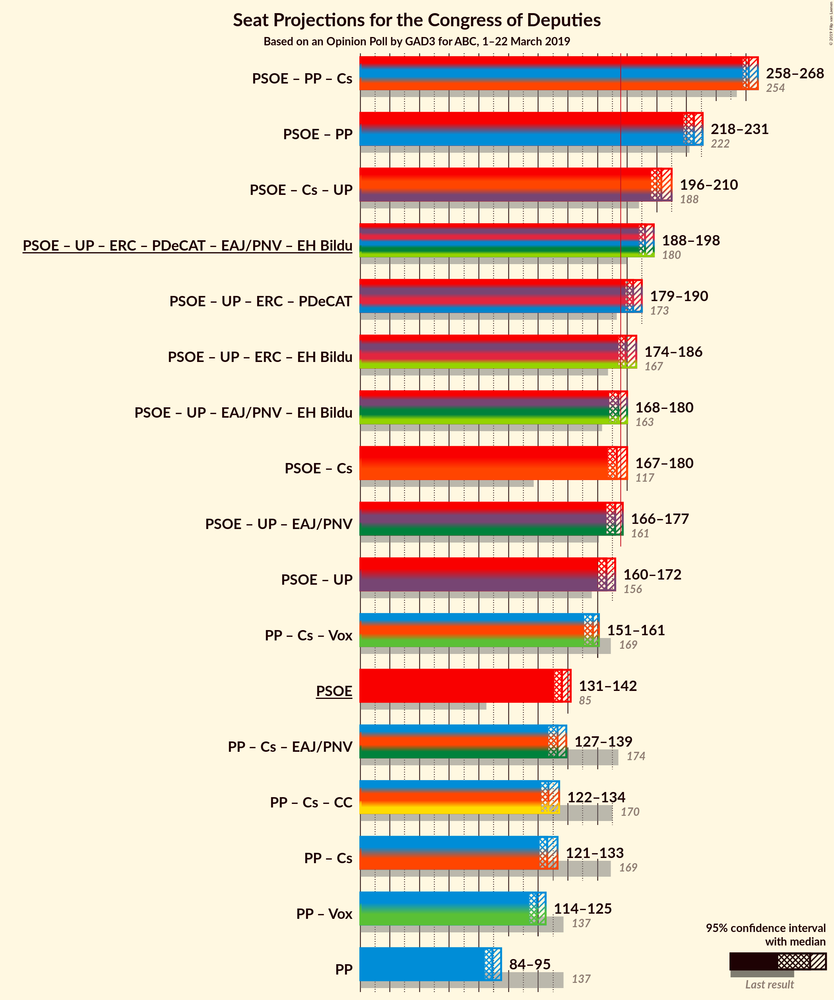
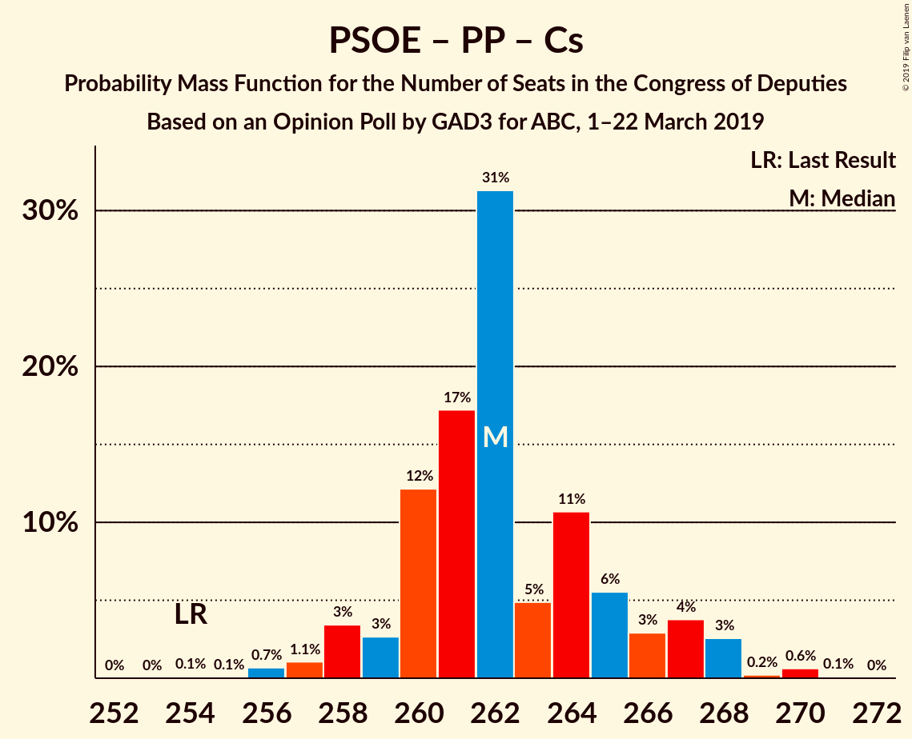
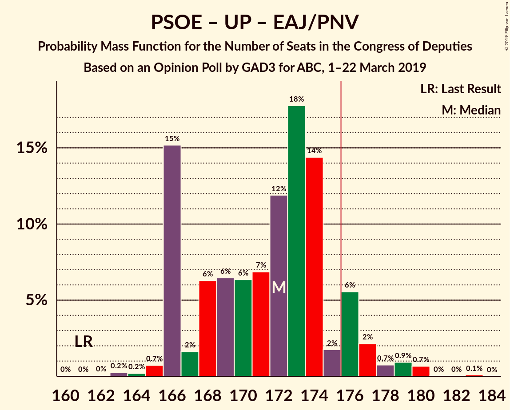
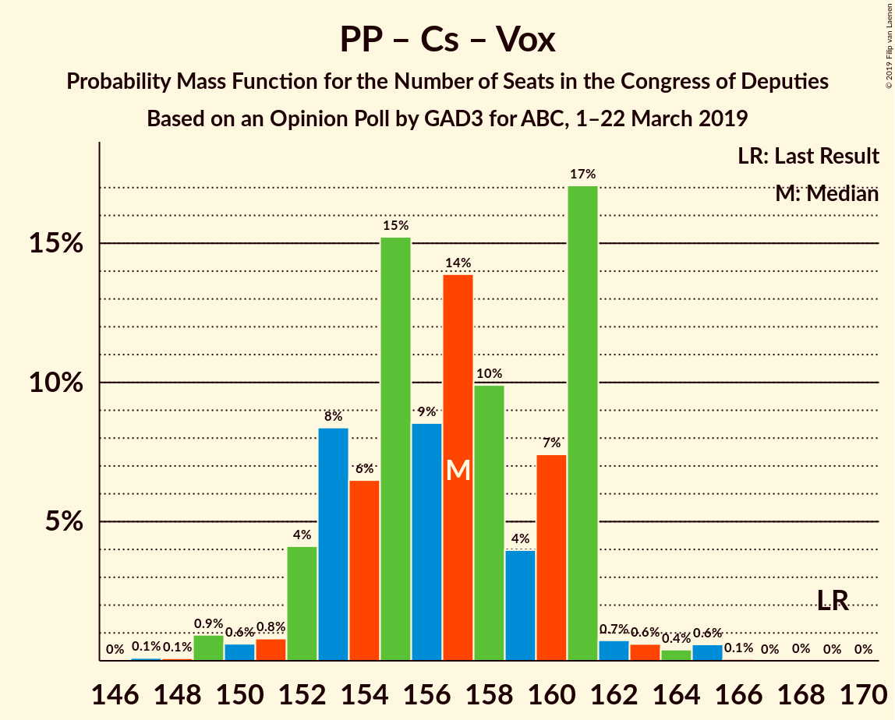
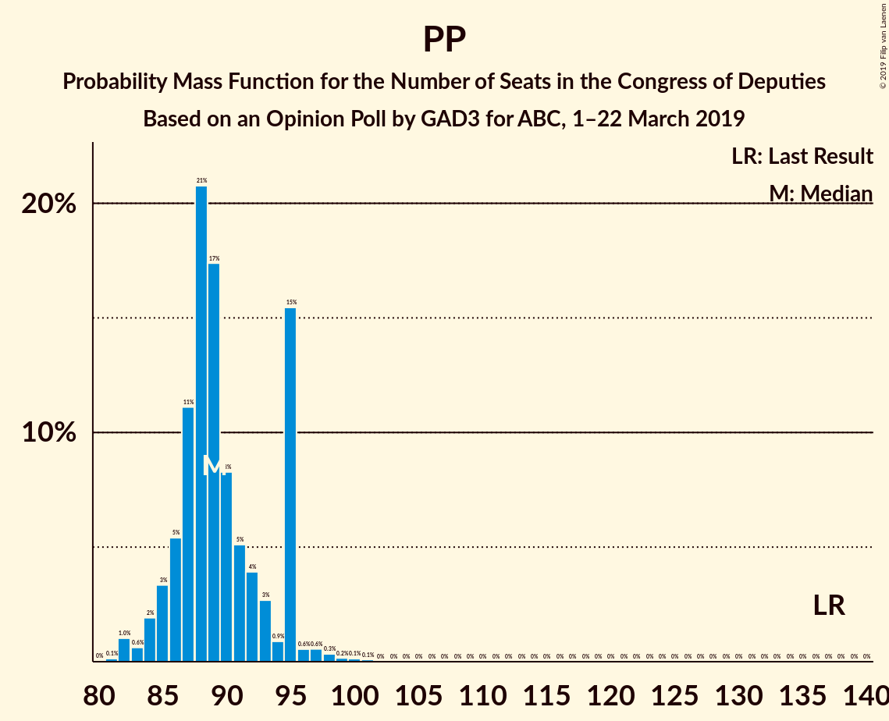

# Opinion Poll by GAD3 for ABC, 1–22 March 2019

<a href="#voting-intentions">Voting Intentions</a> | <a href="#seats">Seats</a> | <a href="#coalitions">Coalitions</a> | <a href="#technical-information">Technical Information</a>

## Voting Intentions

### Confidence Intervals

| Party | Last Result | Poll Result | 80% Confidence Interval | 90% Confidence Interval | 95% Confidence Interval | 99% Confidence Interval |
|:-----:|:-----------:|:-----------:|:-----------------------:|:-----------------------:|:-----------------------:|:-----------------------:|
| Partido Socialista Obrero Español | 22.6% | 30.9% | 30.2–31.6% |30.0–31.8% |29.9–32.0% |29.5–32.3% |
| Partido Popular | 33.0% | 21.9% | 21.3–22.5% |21.1–22.7% |21.0–22.9% |20.7–23.2% |
| Ciudadanos–Partido de la Ciudadanía | 13.1% | 13.1% | 12.6–13.6% |12.5–13.8% |12.4–13.9% |12.1–14.1% |
| Unidos Podemos | 21.2% | 11.8% | 11.3–12.3% |11.2–12.5% |11.1–12.6% |10.9–12.8% |
| Vox | 0.2% | 11.5% | 11.0–12.0% |10.9–12.1% |10.8–12.3% |10.6–12.5% |
| Esquerra Republicana de Catalunya–Catalunya Sí | 2.7% | 2.6% | 2.4–2.9% |2.3–2.9% |2.3–3.0% |2.1–3.1% |
| Partit Demòcrata Europeu Català | 2.0% | 1.5% | 1.3–1.7% |1.3–1.8% |1.2–1.8% |1.2–1.9% |
| Euzko Alderdi Jeltzalea/Partido Nacionalista Vasco | 1.2% | 1.2% | 1.1–1.4% |1.0–1.4% |1.0–1.5% |0.9–1.6% |
| Euskal Herria Bildu | 0.8% | 0.7% | 0.6–0.9% |0.6–0.9% |0.5–0.9% |0.5–1.0% |
| Coalición Canaria–Partido Nacionalista Canario | 0.3% | 0.3% | 0.2–0.4% |0.2–0.4% |0.2–0.5% |0.2–0.5% |

*Note:* The poll result column reflects the actual value used in the calculations. Published results may vary slightly, and in addition be rounded to fewer digits.

## Seats

### Confidence Intervals

| Party | Last Result | Median | 80% Confidence Interval | 90% Confidence Interval | 95% Confidence Interval | 99% Confidence Interval |
|:-----:|:-----------:|:------:|:-----------------------:|:-----------------------:|:-----------------------:|:-----------------------:|
| <a href="#partido-socialista-obrero-español">Partido Socialista Obrero Español</a> | 85 | 136 | 131–139 |131–140 |131–142 |129–142 |
| <a href="#partido-popular">Partido Popular</a> | 137 | 89 | 86–95 |85–95 |84–95 |82–98 |
| <a href="#ciudadanos–partido-de-la-ciudadanía">Ciudadanos–Partido de la Ciudadanía</a> | 32 | 37 | 35–41 |35–42 |33–43 |30–47 |
| <a href="#unidos-podemos">Unidos Podemos</a> | 71 | 30 | 27–32 |26–33 |25–34 |25–36 |
| <a href="#vox">Vox</a> | 0 | 30 | 28–32 |28–32 |27–32 |27–34 |
| <a href="#esquerra-republicana-de-catalunya–catalunya-sí">Esquerra Republicana de Catalunya–Catalunya Sí</a> | 9 | 11 | 10–14 |10–14 |10–14 |10–14 |
| <a href="#partit-demòcrata-europeu-català">Partit Demòcrata Europeu Català</a> | 8 | 8 | 5–8 |5–8 |5–8 |5–8 |
| <a href="#euzko-alderdi-jeltzalea/partido-nacionalista-vasco">Euzko Alderdi Jeltzalea/Partido Nacionalista Vasco</a> | 5 | 6 | 6–7 |5–8 |5–8 |4–8 |
| <a href="#euskal-herria-bildu">Euskal Herria Bildu</a> | 2 | 2 | 2–4 |1–4 |1–4 |1–4 |
| <a href="#coalición-canaria–partido-nacionalista-canario">Coalición Canaria–Partido Nacionalista Canario</a> | 1 | 1 | 1 |0–1 |0–1 |0–2 |

### Partido Socialista Obrero Español

*For a full overview of the results for this party, see the [Partido Socialista Obrero Español](party-partidosocialistaobreroespañol.html) page.*

| Number of Seats | Probability | Accumulated | Special Marks |
|:---------------:|:-----------:|:-----------:|:-------------:|
| 85 | 0% | 100% | Last Result |
| 86 | 0% | 100% |  |
| 87 | 0% | 100% |  |
| 88 | 0% | 100% |  |
| 89 | 0% | 100% |  |
| 90 | 0% | 100% |  |
| 91 | 0% | 100% |  |
| 92 | 0% | 100% |  |
| 93 | 0% | 100% |  |
| 94 | 0% | 100% |  |
| 95 | 0% | 100% |  |
| 96 | 0% | 100% |  |
| 97 | 0% | 100% |  |
| 98 | 0% | 100% |  |
| 99 | 0% | 100% |  |
| 100 | 0% | 100% |  |
| 101 | 0% | 100% |  |
| 102 | 0% | 100% |  |
| 103 | 0% | 100% |  |
| 104 | 0% | 100% |  |
| 105 | 0% | 100% |  |
| 106 | 0% | 100% |  |
| 107 | 0% | 100% |  |
| 108 | 0% | 100% |  |
| 109 | 0% | 100% |  |
| 110 | 0% | 100% |  |
| 111 | 0% | 100% |  |
| 112 | 0% | 100% |  |
| 113 | 0% | 100% |  |
| 114 | 0% | 100% |  |
| 115 | 0% | 100% |  |
| 116 | 0% | 100% |  |
| 117 | 0% | 100% |  |
| 118 | 0% | 100% |  |
| 119 | 0% | 100% |  |
| 120 | 0% | 100% |  |
| 121 | 0% | 100% |  |
| 122 | 0% | 100% |  |
| 123 | 0% | 100% |  |
| 124 | 0% | 100% |  |
| 125 | 0% | 100% |  |
| 126 | 0% | 100% |  |
| 127 | 0% | 99.9% |  |
| 128 | 0.2% | 99.9% |  |
| 129 | 0.4% | 99.8% |  |
| 130 | 2% | 99.4% |  |
| 131 | 17% | 98% |  |
| 132 | 4% | 81% |  |
| 133 | 4% | 77% |  |
| 134 | 2% | 72% |  |
| 135 | 19% | 70% |  |
| 136 | 21% | 51% | Median |
| 137 | 4% | 30% |  |
| 138 | 14% | 26% |  |
| 139 | 6% | 13% |  |
| 140 | 2% | 6% |  |
| 141 | 0.6% | 4% |  |
| 142 | 3% | 4% |  |
| 143 | 0.1% | 0.3% |  |
| 144 | 0.1% | 0.3% |  |
| 145 | 0.1% | 0.2% |  |
| 146 | 0% | 0% |  |

### Partido Popular

*For a full overview of the results for this party, see the [Partido Popular](party-partidopopular.html) page.*

| Number of Seats | Probability | Accumulated | Special Marks |
|:---------------:|:-----------:|:-----------:|:-------------:|
| 80 | 0% | 100% |  |
| 81 | 0.1% | 99.9% |  |
| 82 | 1.0% | 99.8% |  |
| 83 | 0.6% | 98.8% |  |
| 84 | 2% | 98% |  |
| 85 | 3% | 96% |  |
| 86 | 5% | 93% |  |
| 87 | 11% | 87% |  |
| 88 | 21% | 76% |  |
| 89 | 17% | 56% | Median |
| 90 | 8% | 38% |  |
| 91 | 5% | 30% |  |
| 92 | 4% | 25% |  |
| 93 | 3% | 21% |  |
| 94 | 0.9% | 18% |  |
| 95 | 15% | 17% |  |
| 96 | 0.6% | 2% |  |
| 97 | 0.6% | 1.3% |  |
| 98 | 0.3% | 0.8% |  |
| 99 | 0.2% | 0.4% |  |
| 100 | 0.1% | 0.3% |  |
| 101 | 0.1% | 0.1% |  |
| 102 | 0% | 0% |  |
| 103 | 0% | 0% |  |
| 104 | 0% | 0% |  |
| 105 | 0% | 0% |  |
| 106 | 0% | 0% |  |
| 107 | 0% | 0% |  |
| 108 | 0% | 0% |  |
| 109 | 0% | 0% |  |
| 110 | 0% | 0% |  |
| 111 | 0% | 0% |  |
| 112 | 0% | 0% |  |
| 113 | 0% | 0% |  |
| 114 | 0% | 0% |  |
| 115 | 0% | 0% |  |
| 116 | 0% | 0% |  |
| 117 | 0% | 0% |  |
| 118 | 0% | 0% |  |
| 119 | 0% | 0% |  |
| 120 | 0% | 0% |  |
| 121 | 0% | 0% |  |
| 122 | 0% | 0% |  |
| 123 | 0% | 0% |  |
| 124 | 0% | 0% |  |
| 125 | 0% | 0% |  |
| 126 | 0% | 0% |  |
| 127 | 0% | 0% |  |
| 128 | 0% | 0% |  |
| 129 | 0% | 0% |  |
| 130 | 0% | 0% |  |
| 131 | 0% | 0% |  |
| 132 | 0% | 0% |  |
| 133 | 0% | 0% |  |
| 134 | 0% | 0% |  |
| 135 | 0% | 0% |  |
| 136 | 0% | 0% |  |
| 137 | 0% | 0% | Last Result |

### Ciudadanos–Partido de la Ciudadanía

*For a full overview of the results for this party, see the [Ciudadanos–Partido de la Ciudadanía](party-ciudadanos–partidodelaciudadanía.html) page.*

| Number of Seats | Probability | Accumulated | Special Marks |
|:---------------:|:-----------:|:-----------:|:-------------:|
| 26 | 0% | 100% |  |
| 27 | 0% | 99.9% |  |
| 28 | 0.1% | 99.9% |  |
| 29 | 0.3% | 99.8% |  |
| 30 | 0.3% | 99.6% |  |
| 31 | 0.2% | 99.2% |  |
| 32 | 0.6% | 99.0% | Last Result |
| 33 | 2% | 98% |  |
| 34 | 1.2% | 96% |  |
| 35 | 6% | 95% |  |
| 36 | 30% | 89% |  |
| 37 | 23% | 59% | Median |
| 38 | 16% | 36% |  |
| 39 | 5% | 20% |  |
| 40 | 5% | 15% |  |
| 41 | 5% | 11% |  |
| 42 | 2% | 5% |  |
| 43 | 0.9% | 3% |  |
| 44 | 1.5% | 2% |  |
| 45 | 0.5% | 1.0% |  |
| 46 | 0% | 0.5% |  |
| 47 | 0.5% | 0.5% |  |
| 48 | 0% | 0% |  |

### Unidos Podemos

*For a full overview of the results for this party, see the [Unidos Podemos](party-unidospodemos.html) page.*

| Number of Seats | Probability | Accumulated | Special Marks |
|:---------------:|:-----------:|:-----------:|:-------------:|
| 24 | 0.3% | 100% |  |
| 25 | 3% | 99.7% |  |
| 26 | 6% | 97% |  |
| 27 | 3% | 91% |  |
| 28 | 10% | 87% |  |
| 29 | 22% | 78% |  |
| 30 | 12% | 56% | Median |
| 31 | 22% | 44% |  |
| 32 | 16% | 22% |  |
| 33 | 3% | 7% |  |
| 34 | 2% | 3% |  |
| 35 | 0.8% | 1.4% |  |
| 36 | 0.5% | 0.5% |  |
| 37 | 0% | 0% |  |
| 38 | 0% | 0% |  |
| 39 | 0% | 0% |  |
| 40 | 0% | 0% |  |
| 41 | 0% | 0% |  |
| 42 | 0% | 0% |  |
| 43 | 0% | 0% |  |
| 44 | 0% | 0% |  |
| 45 | 0% | 0% |  |
| 46 | 0% | 0% |  |
| 47 | 0% | 0% |  |
| 48 | 0% | 0% |  |
| 49 | 0% | 0% |  |
| 50 | 0% | 0% |  |
| 51 | 0% | 0% |  |
| 52 | 0% | 0% |  |
| 53 | 0% | 0% |  |
| 54 | 0% | 0% |  |
| 55 | 0% | 0% |  |
| 56 | 0% | 0% |  |
| 57 | 0% | 0% |  |
| 58 | 0% | 0% |  |
| 59 | 0% | 0% |  |
| 60 | 0% | 0% |  |
| 61 | 0% | 0% |  |
| 62 | 0% | 0% |  |
| 63 | 0% | 0% |  |
| 64 | 0% | 0% |  |
| 65 | 0% | 0% |  |
| 66 | 0% | 0% |  |
| 67 | 0% | 0% |  |
| 68 | 0% | 0% |  |
| 69 | 0% | 0% |  |
| 70 | 0% | 0% |  |
| 71 | 0% | 0% | Last Result |

### Vox

*For a full overview of the results for this party, see the [Vox](party-vox.html) page.*

| Number of Seats | Probability | Accumulated | Special Marks |
|:---------------:|:-----------:|:-----------:|:-------------:|
| 0 | 0% | 100% | Last Result |
| 1 | 0% | 100% |  |
| 2 | 0% | 100% |  |
| 3 | 0% | 100% |  |
| 4 | 0% | 100% |  |
| 5 | 0% | 100% |  |
| 6 | 0% | 100% |  |
| 7 | 0% | 100% |  |
| 8 | 0% | 100% |  |
| 9 | 0% | 100% |  |
| 10 | 0% | 100% |  |
| 11 | 0% | 100% |  |
| 12 | 0% | 100% |  |
| 13 | 0% | 100% |  |
| 14 | 0% | 100% |  |
| 15 | 0% | 100% |  |
| 16 | 0% | 100% |  |
| 17 | 0% | 100% |  |
| 18 | 0% | 100% |  |
| 19 | 0% | 100% |  |
| 20 | 0% | 100% |  |
| 21 | 0% | 100% |  |
| 22 | 0% | 100% |  |
| 23 | 0% | 100% |  |
| 24 | 0% | 100% |  |
| 25 | 0.1% | 100% |  |
| 26 | 0.1% | 99.9% |  |
| 27 | 3% | 99.8% |  |
| 28 | 11% | 97% |  |
| 29 | 17% | 86% |  |
| 30 | 39% | 69% | Median |
| 31 | 13% | 30% |  |
| 32 | 15% | 17% |  |
| 33 | 1.0% | 2% |  |
| 34 | 1.0% | 1.1% |  |
| 35 | 0.1% | 0.1% |  |
| 36 | 0% | 0% |  |

### Esquerra Republicana de Catalunya–Catalunya Sí

*For a full overview of the results for this party, see the [Esquerra Republicana de Catalunya–Catalunya Sí](party-esquerrarepublicanadecatalunya–catalunyasí.html) page.*

| Number of Seats | Probability | Accumulated | Special Marks |
|:---------------:|:-----------:|:-----------:|:-------------:|
| 9 | 0% | 100% | Last Result |
| 10 | 10% | 100% |  |
| 11 | 65% | 90% | Median |
| 12 | 2% | 25% |  |
| 13 | 10% | 23% |  |
| 14 | 14% | 14% |  |
| 15 | 0.1% | 0.1% |  |
| 16 | 0% | 0% |  |

### Partit Demòcrata Europeu Català

*For a full overview of the results for this party, see the [Partit Demòcrata Europeu Català](party-partitdemòcrataeuropeucatalà.html) page.*

| Number of Seats | Probability | Accumulated | Special Marks |
|:---------------:|:-----------:|:-----------:|:-------------:|
| 4 | 0.2% | 100% |  |
| 5 | 30% | 99.8% |  |
| 6 | 6% | 70% |  |
| 7 | 11% | 64% |  |
| 8 | 53% | 53% | Last Result, Median |
| 9 | 0% | 0.1% |  |
| 10 | 0% | 0% |  |

### Euzko Alderdi Jeltzalea/Partido Nacionalista Vasco

*For a full overview of the results for this party, see the [Euzko Alderdi Jeltzalea/Partido Nacionalista Vasco](party-euzkoalderdijeltzaleapartidonacionalistavasco.html) page.*

| Number of Seats | Probability | Accumulated | Special Marks |
|:---------------:|:-----------:|:-----------:|:-------------:|
| 4 | 2% | 100% |  |
| 5 | 4% | 98% | Last Result |
| 6 | 82% | 94% | Median |
| 7 | 5% | 12% |  |
| 8 | 7% | 7% |  |
| 9 | 0% | 0% |  |

### Euskal Herria Bildu

*For a full overview of the results for this party, see the [Euskal Herria Bildu](party-euskalherriabildu.html) page.*

| Number of Seats | Probability | Accumulated | Special Marks |
|:---------------:|:-----------:|:-----------:|:-------------:|
| 1 | 5% | 100% |  |
| 2 | 56% | 95% | Last Result, Median |
| 3 | 26% | 39% |  |
| 4 | 13% | 13% |  |
| 5 | 0% | 0% |  |

### Coalición Canaria–Partido Nacionalista Canario

*For a full overview of the results for this party, see the [Coalición Canaria–Partido Nacionalista Canario](party-coalicióncanaria–partidonacionalistacanario.html) page.*

| Number of Seats | Probability | Accumulated | Special Marks |
|:---------------:|:-----------:|:-----------:|:-------------:|
| 0 | 10% | 100% |  |
| 1 | 90% | 90% | Last Result, Median |
| 2 | 0.6% | 0.6% |  |
| 3 | 0% | 0% |  |

## Coalitions

### Confidence Intervals

| Coalition | Last Result | Median | Majority? | 80% Confidence Interval | 90% Confidence Interval | 95% Confidence Interval | 99% Confidence Interval |
|:---------:|:-----------:|:------:|:---------:|:-----------------------:|:-----------------------:|:-----------------------:|:-----------------------:|
| Partido Socialista Obrero Español – Partido Popular – Ciudadanos–Partido de la Ciudadanía | 254 | 262 | 100% | 260–266 | 258–267 | 258–268 | 256–270 |
| Partido Socialista Obrero Español – Partido Popular | 222 | 225 | 100% | 221–228 | 220–230 | 218–231 | 217–235 |
| Partido Socialista Obrero Español – Ciudadanos–Partido de la Ciudadanía – Unidos Podemos | 188 | 203 | 100% | 196–207 | 196–208 | 196–210 | 194–211 |
| Partido Socialista Obrero Español – Unidos Podemos – Esquerra Republicana de Catalunya–Catalunya Sí – Partit Demòcrata Europeu Català – Euzko Alderdi Jeltzalea/Partido Nacionalista Vasco – Euskal Herria Bildu | 180 | 192 | 100% | 188–196 | 188–197 | 188–198 | 184–200 |
| Partido Socialista Obrero Español – Unidos Podemos – Esquerra Republicana de Catalunya–Catalunya Sí – Partit Demòcrata Europeu Català | 173 | 184 | 99.8% | 179–187 | 179–188 | 179–190 | 176–191 |
| Partido Socialista Obrero Español – Unidos Podemos – Esquerra Republicana de Catalunya–Catalunya Sí – Euskal Herria Bildu | 167 | 179 | 81% | 174–184 | 174–184 | 174–186 | 172–188 |
| Partido Socialista Obrero Español – Unidos Podemos – Euzko Alderdi Jeltzalea/Partido Nacionalista Vasco – Euskal Herria Bildu | 163 | 174 | 28% | 169–178 | 169–179 | 168–180 | 167–183 |
| Partido Socialista Obrero Español – Ciudadanos–Partido de la Ciudadanía | 117 | 173 | 20% | 167–177 | 167–179 | 167–180 | 164–181 |
| Partido Socialista Obrero Español – Unidos Podemos – Euzko Alderdi Jeltzalea/Partido Nacionalista Vasco | 161 | 172 | 10% | 166–176 | 166–176 | 166–177 | 164–180 |
| Partido Socialista Obrero Español – Unidos Podemos | 156 | 166 | 0.1% | 160–169 | 160–171 | 160–172 | 158–174 |
| Partido Popular – Ciudadanos–Partido de la Ciudadanía – Vox | 169 | 157 | 0% | 153–161 | 152–161 | 151–161 | 149–165 |
| Partido Socialista Obrero Español | 85 | 136 | 0% | 131–139 | 131–140 | 131–142 | 129–142 |
| Partido Popular – Ciudadanos–Partido de la Ciudadanía – Euzko Alderdi Jeltzalea/Partido Nacionalista Vasco | 174 | 133 | 0% | 129–137 | 128–138 | 127–139 | 125–141 |
| Partido Popular – Ciudadanos–Partido de la Ciudadanía – Coalición Canaria–Partido Nacionalista Canario | 170 | 127 | 0% | 124–132 | 123–133 | 122–134 | 119–136 |
| Partido Popular – Ciudadanos–Partido de la Ciudadanía | 169 | 126 | 0% | 123–131 | 122–132 | 121–133 | 119–135 |
| Partido Popular – Vox | 137 | 119 | 0% | 116–125 | 115–125 | 114–125 | 111–128 |
| Partido Popular | 137 | 89 | 0% | 86–95 | 85–95 | 84–95 | 82–98 |

### Partido Socialista Obrero Español – Partido Popular – Ciudadanos–Partido de la Ciudadanía

| Number of Seats | Probability | Accumulated | Special Marks |
|:---------------:|:-----------:|:-----------:|:-------------:|
| 254 | 0.1% | 100% | Last Result |
| 255 | 0.1% | 99.9% |  |
| 256 | 0.7% | 99.8% |  |
| 257 | 1.1% | 99.1% |  |
| 258 | 3% | 98% |  |
| 259 | 3% | 95% |  |
| 260 | 12% | 92% |  |
| 261 | 17% | 80% |  |
| 262 | 31% | 63% | Median |
| 263 | 5% | 31% |  |
| 264 | 11% | 26% |  |
| 265 | 6% | 16% |  |
| 266 | 3% | 10% |  |
| 267 | 4% | 7% |  |
| 268 | 3% | 4% |  |
| 269 | 0.2% | 1.0% |  |
| 270 | 0.6% | 0.7% |  |
| 271 | 0.1% | 0.1% |  |
| 272 | 0% | 0% |  |

### Partido Socialista Obrero Español – Partido Popular

| Number of Seats | Probability | Accumulated | Special Marks |
|:---------------:|:-----------:|:-----------:|:-------------:|
| 215 | 0.1% | 100% |  |
| 216 | 0.2% | 99.8% |  |
| 217 | 2% | 99.7% |  |
| 218 | 1.2% | 98% |  |
| 219 | 1.2% | 97% |  |
| 220 | 4% | 96% |  |
| 221 | 3% | 92% |  |
| 222 | 5% | 89% | Last Result |
| 223 | 12% | 84% |  |
| 224 | 13% | 73% |  |
| 225 | 16% | 60% | Median |
| 226 | 22% | 44% |  |
| 227 | 10% | 22% |  |
| 228 | 3% | 12% |  |
| 229 | 3% | 9% |  |
| 230 | 1.0% | 6% |  |
| 231 | 3% | 5% |  |
| 232 | 0.4% | 2% |  |
| 233 | 0.5% | 1.3% |  |
| 234 | 0.2% | 0.8% |  |
| 235 | 0.4% | 0.6% |  |
| 236 | 0.2% | 0.2% |  |
| 237 | 0.1% | 0.1% |  |
| 238 | 0% | 0% |  |

### Partido Socialista Obrero Español – Ciudadanos–Partido de la Ciudadanía – Unidos Podemos

| Number of Seats | Probability | Accumulated | Special Marks |
|:---------------:|:-----------:|:-----------:|:-------------:|
| 188 | 0% | 100% | Last Result |
| 189 | 0% | 100% |  |
| 190 | 0% | 100% |  |
| 191 | 0.1% | 100% |  |
| 192 | 0.2% | 99.9% |  |
| 193 | 0.2% | 99.8% |  |
| 194 | 0.2% | 99.5% |  |
| 195 | 0.3% | 99.3% |  |
| 196 | 13% | 99.0% |  |
| 197 | 1.2% | 86% |  |
| 198 | 2% | 85% |  |
| 199 | 3% | 83% |  |
| 200 | 3% | 80% |  |
| 201 | 10% | 77% |  |
| 202 | 12% | 67% |  |
| 203 | 9% | 54% | Median |
| 204 | 13% | 45% |  |
| 205 | 12% | 32% |  |
| 206 | 9% | 20% |  |
| 207 | 5% | 11% |  |
| 208 | 2% | 6% |  |
| 209 | 0.8% | 3% |  |
| 210 | 2% | 3% |  |
| 211 | 0.7% | 1.0% |  |
| 212 | 0.2% | 0.3% |  |
| 213 | 0% | 0.1% |  |
| 214 | 0% | 0% |  |

### Partido Socialista Obrero Español – Unidos Podemos – Esquerra Republicana de Catalunya–Catalunya Sí – Partit Demòcrata Europeu Català – Euzko Alderdi Jeltzalea/Partido Nacionalista Vasco – Euskal Herria Bildu

| Number of Seats | Probability | Accumulated | Special Marks |
|:---------------:|:-----------:|:-----------:|:-------------:|
| 180 | 0% | 100% | Last Result |
| 181 | 0% | 100% |  |
| 182 | 0% | 100% |  |
| 183 | 0.1% | 100% |  |
| 184 | 0.5% | 99.9% |  |
| 185 | 0.4% | 99.4% |  |
| 186 | 0.6% | 98.9% |  |
| 187 | 0.6% | 98% |  |
| 188 | 16% | 98% |  |
| 189 | 5% | 81% |  |
| 190 | 7% | 76% |  |
| 191 | 9% | 69% |  |
| 192 | 14% | 60% |  |
| 193 | 9% | 46% | Median |
| 194 | 15% | 37% |  |
| 195 | 7% | 22% |  |
| 196 | 9% | 15% |  |
| 197 | 4% | 7% |  |
| 198 | 1.0% | 3% |  |
| 199 | 0.6% | 2% |  |
| 200 | 1.1% | 1.3% |  |
| 201 | 0.1% | 0.2% |  |
| 202 | 0% | 0.1% |  |
| 203 | 0.1% | 0.1% |  |
| 204 | 0% | 0% |  |

### Partido Socialista Obrero Español – Unidos Podemos – Esquerra Republicana de Catalunya–Catalunya Sí – Partit Demòcrata Europeu Català

| Number of Seats | Probability | Accumulated | Special Marks |
|:---------------:|:-----------:|:-----------:|:-------------:|
| 173 | 0% | 100% | Last Result |
| 174 | 0.1% | 100% |  |
| 175 | 0.1% | 99.9% |  |
| 176 | 0.5% | 99.8% | Majority |
| 177 | 0.6% | 99.3% |  |
| 178 | 0.9% | 98.7% |  |
| 179 | 14% | 98% |  |
| 180 | 3% | 84% |  |
| 181 | 9% | 81% |  |
| 182 | 5% | 72% |  |
| 183 | 9% | 66% |  |
| 184 | 20% | 57% |  |
| 185 | 4% | 37% | Median |
| 186 | 18% | 33% |  |
| 187 | 6% | 15% |  |
| 188 | 5% | 9% |  |
| 189 | 1.4% | 4% |  |
| 190 | 2% | 3% |  |
| 191 | 0.7% | 1.1% |  |
| 192 | 0.2% | 0.4% |  |
| 193 | 0% | 0.1% |  |
| 194 | 0% | 0.1% |  |
| 195 | 0.1% | 0.1% |  |
| 196 | 0% | 0% |  |

### Partido Socialista Obrero Español – Unidos Podemos – Esquerra Republicana de Catalunya–Catalunya Sí – Euskal Herria Bildu

| Number of Seats | Probability | Accumulated | Special Marks |
|:---------------:|:-----------:|:-----------:|:-------------:|
| 167 | 0% | 100% | Last Result |
| 168 | 0% | 100% |  |
| 169 | 0% | 100% |  |
| 170 | 0.1% | 100% |  |
| 171 | 0.1% | 99.9% |  |
| 172 | 0.5% | 99.8% |  |
| 173 | 0.9% | 99.3% |  |
| 174 | 14% | 98% |  |
| 175 | 3% | 84% |  |
| 176 | 3% | 81% | Majority |
| 177 | 6% | 78% |  |
| 178 | 19% | 72% |  |
| 179 | 9% | 54% | Median |
| 180 | 10% | 45% |  |
| 181 | 6% | 35% |  |
| 182 | 9% | 29% |  |
| 183 | 8% | 19% |  |
| 184 | 6% | 11% |  |
| 185 | 2% | 5% |  |
| 186 | 0.8% | 3% |  |
| 187 | 1.0% | 2% |  |
| 188 | 1.1% | 1.3% |  |
| 189 | 0.1% | 0.2% |  |
| 190 | 0% | 0.1% |  |
| 191 | 0.1% | 0.1% |  |
| 192 | 0% | 0% |  |

### Partido Socialista Obrero Español – Unidos Podemos – Euzko Alderdi Jeltzalea/Partido Nacionalista Vasco – Euskal Herria Bildu

| Number of Seats | Probability | Accumulated | Special Marks |
|:---------------:|:-----------:|:-----------:|:-------------:|
| 163 | 0% | 100% | Last Result |
| 164 | 0% | 100% |  |
| 165 | 0.1% | 99.9% |  |
| 166 | 0.2% | 99.8% |  |
| 167 | 0.7% | 99.6% |  |
| 168 | 2% | 98.9% |  |
| 169 | 15% | 97% |  |
| 170 | 6% | 82% |  |
| 171 | 4% | 77% |  |
| 172 | 7% | 72% |  |
| 173 | 5% | 65% |  |
| 174 | 15% | 61% | Median |
| 175 | 18% | 46% |  |
| 176 | 7% | 28% | Majority |
| 177 | 5% | 21% |  |
| 178 | 10% | 16% |  |
| 179 | 3% | 6% |  |
| 180 | 1.0% | 3% |  |
| 181 | 0.7% | 2% |  |
| 182 | 0.3% | 1.3% |  |
| 183 | 0.9% | 1.0% |  |
| 184 | 0.1% | 0.2% |  |
| 185 | 0.1% | 0.1% |  |
| 186 | 0% | 0% |  |

### Partido Socialista Obrero Español – Ciudadanos–Partido de la Ciudadanía

| Number of Seats | Probability | Accumulated | Special Marks |
|:---------------:|:-----------:|:-----------:|:-------------:|
| 117 | 0% | 100% | Last Result |
| 118 | 0% | 100% |  |
| 119 | 0% | 100% |  |
| 120 | 0% | 100% |  |
| 121 | 0% | 100% |  |
| 122 | 0% | 100% |  |
| 123 | 0% | 100% |  |
| 124 | 0% | 100% |  |
| 125 | 0% | 100% |  |
| 126 | 0% | 100% |  |
| 127 | 0% | 100% |  |
| 128 | 0% | 100% |  |
| 129 | 0% | 100% |  |
| 130 | 0% | 100% |  |
| 131 | 0% | 100% |  |
| 132 | 0% | 100% |  |
| 133 | 0% | 100% |  |
| 134 | 0% | 100% |  |
| 135 | 0% | 100% |  |
| 136 | 0% | 100% |  |
| 137 | 0% | 100% |  |
| 138 | 0% | 100% |  |
| 139 | 0% | 100% |  |
| 140 | 0% | 100% |  |
| 141 | 0% | 100% |  |
| 142 | 0% | 100% |  |
| 143 | 0% | 100% |  |
| 144 | 0% | 100% |  |
| 145 | 0% | 100% |  |
| 146 | 0% | 100% |  |
| 147 | 0% | 100% |  |
| 148 | 0% | 100% |  |
| 149 | 0% | 100% |  |
| 150 | 0% | 100% |  |
| 151 | 0% | 100% |  |
| 152 | 0% | 100% |  |
| 153 | 0% | 100% |  |
| 154 | 0% | 100% |  |
| 155 | 0% | 100% |  |
| 156 | 0% | 100% |  |
| 157 | 0% | 100% |  |
| 158 | 0% | 100% |  |
| 159 | 0% | 100% |  |
| 160 | 0% | 100% |  |
| 161 | 0% | 100% |  |
| 162 | 0% | 100% |  |
| 163 | 0.2% | 99.9% |  |
| 164 | 0.3% | 99.8% |  |
| 165 | 0.2% | 99.5% |  |
| 166 | 0.7% | 99.2% |  |
| 167 | 14% | 98% |  |
| 168 | 3% | 85% |  |
| 169 | 2% | 82% |  |
| 170 | 5% | 80% |  |
| 171 | 6% | 75% |  |
| 172 | 16% | 69% |  |
| 173 | 9% | 53% | Median |
| 174 | 16% | 44% |  |
| 175 | 7% | 27% |  |
| 176 | 7% | 20% | Majority |
| 177 | 3% | 12% |  |
| 178 | 4% | 9% |  |
| 179 | 3% | 6% |  |
| 180 | 2% | 3% |  |
| 181 | 0.5% | 0.8% |  |
| 182 | 0.1% | 0.3% |  |
| 183 | 0.1% | 0.2% |  |
| 184 | 0.1% | 0.1% |  |
| 185 | 0% | 0% |  |

### Partido Socialista Obrero Español – Unidos Podemos – Euzko Alderdi Jeltzalea/Partido Nacionalista Vasco

| Number of Seats | Probability | Accumulated | Special Marks |
|:---------------:|:-----------:|:-----------:|:-------------:|
| 161 | 0% | 100% | Last Result |
| 162 | 0% | 99.9% |  |
| 163 | 0.2% | 99.9% |  |
| 164 | 0.2% | 99.6% |  |
| 165 | 0.7% | 99.5% |  |
| 166 | 15% | 98.7% |  |
| 167 | 2% | 84% |  |
| 168 | 6% | 82% |  |
| 169 | 6% | 76% |  |
| 170 | 6% | 69% |  |
| 171 | 7% | 63% |  |
| 172 | 12% | 56% | Median |
| 173 | 18% | 44% |  |
| 174 | 14% | 26% |  |
| 175 | 2% | 12% |  |
| 176 | 6% | 10% | Majority |
| 177 | 2% | 5% |  |
| 178 | 0.7% | 2% |  |
| 179 | 0.9% | 2% |  |
| 180 | 0.7% | 0.8% |  |
| 181 | 0% | 0.2% |  |
| 182 | 0% | 0.1% |  |
| 183 | 0.1% | 0.1% |  |
| 184 | 0% | 0% |  |

### Partido Socialista Obrero Español – Unidos Podemos

| Number of Seats | Probability | Accumulated | Special Marks |
|:---------------:|:-----------:|:-----------:|:-------------:|
| 155 | 0% | 100% |  |
| 156 | 0% | 99.9% | Last Result |
| 157 | 0.2% | 99.9% |  |
| 158 | 0.2% | 99.6% |  |
| 159 | 0.8% | 99.4% |  |
| 160 | 15% | 98.7% |  |
| 161 | 2% | 83% |  |
| 162 | 6% | 82% |  |
| 163 | 7% | 76% |  |
| 164 | 6% | 68% |  |
| 165 | 11% | 62% |  |
| 166 | 12% | 51% | Median |
| 167 | 13% | 39% |  |
| 168 | 13% | 26% |  |
| 169 | 4% | 13% |  |
| 170 | 4% | 9% |  |
| 171 | 3% | 5% |  |
| 172 | 1.0% | 3% |  |
| 173 | 0.9% | 2% |  |
| 174 | 0.7% | 0.8% |  |
| 175 | 0% | 0.1% |  |
| 176 | 0% | 0.1% | Majority |
| 177 | 0.1% | 0.1% |  |
| 178 | 0% | 0% |  |

### Partido Popular – Ciudadanos–Partido de la Ciudadanía – Vox

| Number of Seats | Probability | Accumulated | Special Marks |
|:---------------:|:-----------:|:-----------:|:-------------:|
| 147 | 0.1% | 100% |  |
| 148 | 0.1% | 99.9% |  |
| 149 | 0.9% | 99.8% |  |
| 150 | 0.6% | 98.9% |  |
| 151 | 0.8% | 98% |  |
| 152 | 4% | 97% |  |
| 153 | 8% | 93% |  |
| 154 | 6% | 85% |  |
| 155 | 15% | 78% |  |
| 156 | 9% | 63% | Median |
| 157 | 14% | 55% |  |
| 158 | 10% | 41% |  |
| 159 | 4% | 31% |  |
| 160 | 7% | 27% |  |
| 161 | 17% | 20% |  |
| 162 | 0.7% | 2% |  |
| 163 | 0.6% | 2% |  |
| 164 | 0.4% | 1.1% |  |
| 165 | 0.6% | 0.7% |  |
| 166 | 0.1% | 0.1% |  |
| 167 | 0% | 0% |  |
| 168 | 0% | 0% |  |
| 169 | 0% | 0% | Last Result |

### Partido Socialista Obrero Español

| Number of Seats | Probability | Accumulated | Special Marks |
|:---------------:|:-----------:|:-----------:|:-------------:|
| 85 | 0% | 100% | Last Result |
| 86 | 0% | 100% |  |
| 87 | 0% | 100% |  |
| 88 | 0% | 100% |  |
| 89 | 0% | 100% |  |
| 90 | 0% | 100% |  |
| 91 | 0% | 100% |  |
| 92 | 0% | 100% |  |
| 93 | 0% | 100% |  |
| 94 | 0% | 100% |  |
| 95 | 0% | 100% |  |
| 96 | 0% | 100% |  |
| 97 | 0% | 100% |  |
| 98 | 0% | 100% |  |
| 99 | 0% | 100% |  |
| 100 | 0% | 100% |  |
| 101 | 0% | 100% |  |
| 102 | 0% | 100% |  |
| 103 | 0% | 100% |  |
| 104 | 0% | 100% |  |
| 105 | 0% | 100% |  |
| 106 | 0% | 100% |  |
| 107 | 0% | 100% |  |
| 108 | 0% | 100% |  |
| 109 | 0% | 100% |  |
| 110 | 0% | 100% |  |
| 111 | 0% | 100% |  |
| 112 | 0% | 100% |  |
| 113 | 0% | 100% |  |
| 114 | 0% | 100% |  |
| 115 | 0% | 100% |  |
| 116 | 0% | 100% |  |
| 117 | 0% | 100% |  |
| 118 | 0% | 100% |  |
| 119 | 0% | 100% |  |
| 120 | 0% | 100% |  |
| 121 | 0% | 100% |  |
| 122 | 0% | 100% |  |
| 123 | 0% | 100% |  |
| 124 | 0% | 100% |  |
| 125 | 0% | 100% |  |
| 126 | 0% | 100% |  |
| 127 | 0% | 99.9% |  |
| 128 | 0.2% | 99.9% |  |
| 129 | 0.4% | 99.8% |  |
| 130 | 2% | 99.4% |  |
| 131 | 17% | 98% |  |
| 132 | 4% | 81% |  |
| 133 | 4% | 77% |  |
| 134 | 2% | 72% |  |
| 135 | 19% | 70% |  |
| 136 | 21% | 51% | Median |
| 137 | 4% | 30% |  |
| 138 | 14% | 26% |  |
| 139 | 6% | 13% |  |
| 140 | 2% | 6% |  |
| 141 | 0.6% | 4% |  |
| 142 | 3% | 4% |  |
| 143 | 0.1% | 0.3% |  |
| 144 | 0.1% | 0.3% |  |
| 145 | 0.1% | 0.2% |  |
| 146 | 0% | 0% |  |

### Partido Popular – Ciudadanos–Partido de la Ciudadanía – Euzko Alderdi Jeltzalea/Partido Nacionalista Vasco

| Number of Seats | Probability | Accumulated | Special Marks |
|:---------------:|:-----------:|:-----------:|:-------------:|
| 122 | 0.1% | 100% |  |
| 123 | 0% | 99.9% |  |
| 124 | 0.3% | 99.8% |  |
| 125 | 0.3% | 99.6% |  |
| 126 | 0.8% | 99.3% |  |
| 127 | 3% | 98% |  |
| 128 | 3% | 95% |  |
| 129 | 2% | 92% |  |
| 130 | 9% | 90% |  |
| 131 | 9% | 81% |  |
| 132 | 20% | 72% | Median |
| 133 | 13% | 51% |  |
| 134 | 8% | 38% |  |
| 135 | 6% | 30% |  |
| 136 | 3% | 24% |  |
| 137 | 15% | 21% |  |
| 138 | 3% | 6% |  |
| 139 | 1.5% | 3% |  |
| 140 | 0.6% | 1.3% |  |
| 141 | 0.6% | 0.7% |  |
| 142 | 0.1% | 0.1% |  |
| 143 | 0% | 0.1% |  |
| 144 | 0% | 0% |  |
| 145 | 0% | 0% |  |
| 146 | 0% | 0% |  |
| 147 | 0% | 0% |  |
| 148 | 0% | 0% |  |
| 149 | 0% | 0% |  |
| 150 | 0% | 0% |  |
| 151 | 0% | 0% |  |
| 152 | 0% | 0% |  |
| 153 | 0% | 0% |  |
| 154 | 0% | 0% |  |
| 155 | 0% | 0% |  |
| 156 | 0% | 0% |  |
| 157 | 0% | 0% |  |
| 158 | 0% | 0% |  |
| 159 | 0% | 0% |  |
| 160 | 0% | 0% |  |
| 161 | 0% | 0% |  |
| 162 | 0% | 0% |  |
| 163 | 0% | 0% |  |
| 164 | 0% | 0% |  |
| 165 | 0% | 0% |  |
| 166 | 0% | 0% |  |
| 167 | 0% | 0% |  |
| 168 | 0% | 0% |  |
| 169 | 0% | 0% |  |
| 170 | 0% | 0% |  |
| 171 | 0% | 0% |  |
| 172 | 0% | 0% |  |
| 173 | 0% | 0% |  |
| 174 | 0% | 0% | Last Result |

### Partido Popular – Ciudadanos–Partido de la Ciudadanía – Coalición Canaria–Partido Nacionalista Canario

| Number of Seats | Probability | Accumulated | Special Marks |
|:---------------:|:-----------:|:-----------:|:-------------:|
| 116 | 0.1% | 100% |  |
| 117 | 0% | 99.9% |  |
| 118 | 0.1% | 99.9% |  |
| 119 | 0.4% | 99.8% |  |
| 120 | 0.2% | 99.4% |  |
| 121 | 1.0% | 99.2% |  |
| 122 | 1.3% | 98% |  |
| 123 | 4% | 97% |  |
| 124 | 7% | 93% |  |
| 125 | 5% | 86% |  |
| 126 | 15% | 81% |  |
| 127 | 21% | 66% | Median |
| 128 | 9% | 44% |  |
| 129 | 7% | 35% |  |
| 130 | 4% | 28% |  |
| 131 | 3% | 24% |  |
| 132 | 15% | 21% |  |
| 133 | 3% | 6% |  |
| 134 | 2% | 3% |  |
| 135 | 0.5% | 1.1% |  |
| 136 | 0.5% | 0.6% |  |
| 137 | 0.1% | 0.2% |  |
| 138 | 0.1% | 0.1% |  |
| 139 | 0% | 0% |  |
| 140 | 0% | 0% |  |
| 141 | 0% | 0% |  |
| 142 | 0% | 0% |  |
| 143 | 0% | 0% |  |
| 144 | 0% | 0% |  |
| 145 | 0% | 0% |  |
| 146 | 0% | 0% |  |
| 147 | 0% | 0% |  |
| 148 | 0% | 0% |  |
| 149 | 0% | 0% |  |
| 150 | 0% | 0% |  |
| 151 | 0% | 0% |  |
| 152 | 0% | 0% |  |
| 153 | 0% | 0% |  |
| 154 | 0% | 0% |  |
| 155 | 0% | 0% |  |
| 156 | 0% | 0% |  |
| 157 | 0% | 0% |  |
| 158 | 0% | 0% |  |
| 159 | 0% | 0% |  |
| 160 | 0% | 0% |  |
| 161 | 0% | 0% |  |
| 162 | 0% | 0% |  |
| 163 | 0% | 0% |  |
| 164 | 0% | 0% |  |
| 165 | 0% | 0% |  |
| 166 | 0% | 0% |  |
| 167 | 0% | 0% |  |
| 168 | 0% | 0% |  |
| 169 | 0% | 0% |  |
| 170 | 0% | 0% | Last Result |

### Partido Popular – Ciudadanos–Partido de la Ciudadanía

| Number of Seats | Probability | Accumulated | Special Marks |
|:---------------:|:-----------:|:-----------:|:-------------:|
| 116 | 0.1% | 100% |  |
| 117 | 0% | 99.9% |  |
| 118 | 0.3% | 99.8% |  |
| 119 | 0.3% | 99.6% |  |
| 120 | 1.0% | 99.3% |  |
| 121 | 1.2% | 98% |  |
| 122 | 3% | 97% |  |
| 123 | 6% | 94% |  |
| 124 | 6% | 87% |  |
| 125 | 15% | 81% |  |
| 126 | 20% | 66% | Median |
| 127 | 8% | 46% |  |
| 128 | 8% | 38% |  |
| 129 | 6% | 30% |  |
| 130 | 3% | 24% |  |
| 131 | 15% | 21% |  |
| 132 | 3% | 6% |  |
| 133 | 2% | 3% |  |
| 134 | 0.4% | 1.1% |  |
| 135 | 0.5% | 0.7% |  |
| 136 | 0.1% | 0.2% |  |
| 137 | 0.1% | 0.1% |  |
| 138 | 0% | 0% |  |
| 139 | 0% | 0% |  |
| 140 | 0% | 0% |  |
| 141 | 0% | 0% |  |
| 142 | 0% | 0% |  |
| 143 | 0% | 0% |  |
| 144 | 0% | 0% |  |
| 145 | 0% | 0% |  |
| 146 | 0% | 0% |  |
| 147 | 0% | 0% |  |
| 148 | 0% | 0% |  |
| 149 | 0% | 0% |  |
| 150 | 0% | 0% |  |
| 151 | 0% | 0% |  |
| 152 | 0% | 0% |  |
| 153 | 0% | 0% |  |
| 154 | 0% | 0% |  |
| 155 | 0% | 0% |  |
| 156 | 0% | 0% |  |
| 157 | 0% | 0% |  |
| 158 | 0% | 0% |  |
| 159 | 0% | 0% |  |
| 160 | 0% | 0% |  |
| 161 | 0% | 0% |  |
| 162 | 0% | 0% |  |
| 163 | 0% | 0% |  |
| 164 | 0% | 0% |  |
| 165 | 0% | 0% |  |
| 166 | 0% | 0% |  |
| 167 | 0% | 0% |  |
| 168 | 0% | 0% |  |
| 169 | 0% | 0% | Last Result |

### Partido Popular – Vox

| Number of Seats | Probability | Accumulated | Special Marks |
|:---------------:|:-----------:|:-----------:|:-------------:|
| 110 | 0.2% | 100% |  |
| 111 | 0.5% | 99.8% |  |
| 112 | 0.4% | 99.3% |  |
| 113 | 1.1% | 98.9% |  |
| 114 | 1.4% | 98% |  |
| 115 | 2% | 96% |  |
| 116 | 5% | 94% |  |
| 117 | 18% | 89% |  |
| 118 | 15% | 71% |  |
| 119 | 11% | 57% | Median |
| 120 | 12% | 46% |  |
| 121 | 9% | 34% |  |
| 122 | 4% | 24% |  |
| 123 | 4% | 20% |  |
| 124 | 1.0% | 16% |  |
| 125 | 14% | 15% |  |
| 126 | 0.5% | 1.4% |  |
| 127 | 0.2% | 0.9% |  |
| 128 | 0.4% | 0.7% |  |
| 129 | 0.1% | 0.3% |  |
| 130 | 0.1% | 0.2% |  |
| 131 | 0.1% | 0.1% |  |
| 132 | 0% | 0% |  |
| 133 | 0% | 0% |  |
| 134 | 0% | 0% |  |
| 135 | 0% | 0% |  |
| 136 | 0% | 0% |  |
| 137 | 0% | 0% | Last Result |

### Partido Popular

| Number of Seats | Probability | Accumulated | Special Marks |
|:---------------:|:-----------:|:-----------:|:-------------:|
| 80 | 0% | 100% |  |
| 81 | 0.1% | 99.9% |  |
| 82 | 1.0% | 99.8% |  |
| 83 | 0.6% | 98.8% |  |
| 84 | 2% | 98% |  |
| 85 | 3% | 96% |  |
| 86 | 5% | 93% |  |
| 87 | 11% | 87% |  |
| 88 | 21% | 76% |  |
| 89 | 17% | 56% | Median |
| 90 | 8% | 38% |  |
| 91 | 5% | 30% |  |
| 92 | 4% | 25% |  |
| 93 | 3% | 21% |  |
| 94 | 0.9% | 18% |  |
| 95 | 15% | 17% |  |
| 96 | 0.6% | 2% |  |
| 97 | 0.6% | 1.3% |  |
| 98 | 0.3% | 0.8% |  |
| 99 | 0.2% | 0.4% |  |
| 100 | 0.1% | 0.3% |  |
| 101 | 0.1% | 0.1% |  |
| 102 | 0% | 0% |  |
| 103 | 0% | 0% |  |
| 104 | 0% | 0% |  |
| 105 | 0% | 0% |  |
| 106 | 0% | 0% |  |
| 107 | 0% | 0% |  |
| 108 | 0% | 0% |  |
| 109 | 0% | 0% |  |
| 110 | 0% | 0% |  |
| 111 | 0% | 0% |  |
| 112 | 0% | 0% |  |
| 113 | 0% | 0% |  |
| 114 | 0% | 0% |  |
| 115 | 0% | 0% |  |
| 116 | 0% | 0% |  |
| 117 | 0% | 0% |  |
| 118 | 0% | 0% |  |
| 119 | 0% | 0% |  |
| 120 | 0% | 0% |  |
| 121 | 0% | 0% |  |
| 122 | 0% | 0% |  |
| 123 | 0% | 0% |  |
| 124 | 0% | 0% |  |
| 125 | 0% | 0% |  |
| 126 | 0% | 0% |  |
| 127 | 0% | 0% |  |
| 128 | 0% | 0% |  |
| 129 | 0% | 0% |  |
| 130 | 0% | 0% |  |
| 131 | 0% | 0% |  |
| 132 | 0% | 0% |  |
| 133 | 0% | 0% |  |
| 134 | 0% | 0% |  |
| 135 | 0% | 0% |  |
| 136 | 0% | 0% |  |
| 137 | 0% | 0% | Last Result |

## Technical Information

### Opinion Poll

+ **Polling firm:** GAD3
+ **Commissioner(s):** ABC
+ **Fieldwork period:** 1–22 March 2019

### Calculations

+ **Sample size:** 7500
+ **Simulations done:** 1,048,576
+ **Error estimate:** 1.04%

