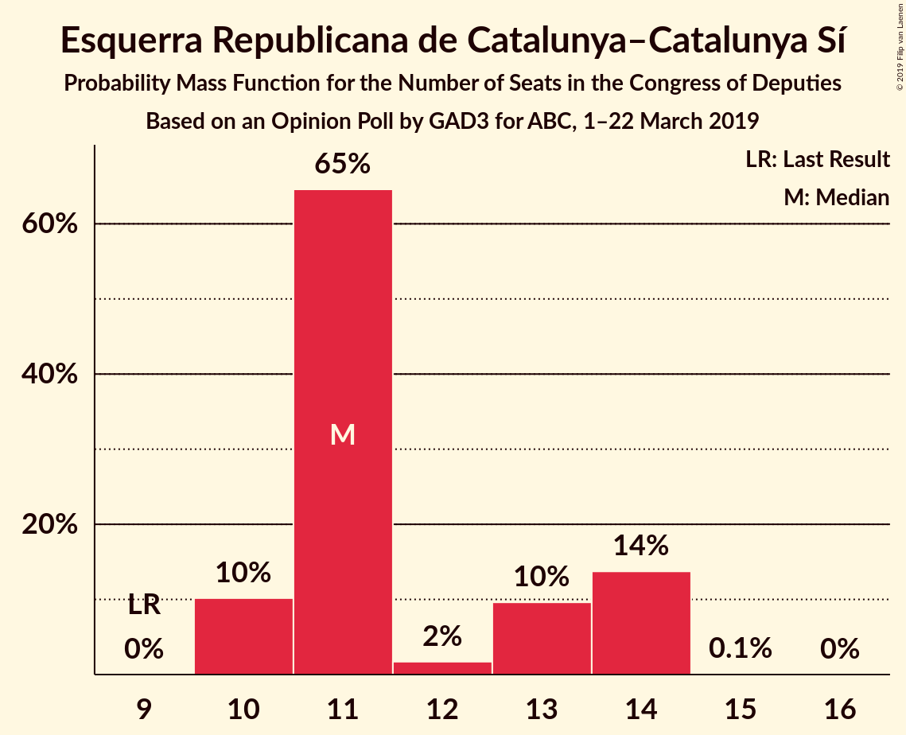
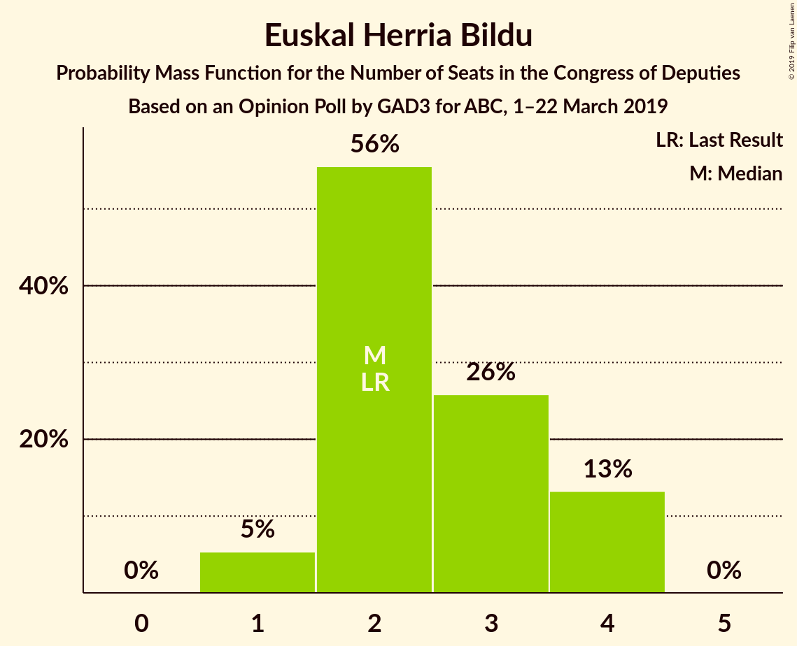

# Opinion Poll by GAD3 for ABC, 1–22 March 2019

<a href="#voting-intentions">Voting Intentions</a> | <a href="#seats">Seats</a> | <a href="#coalitions">Coalitions</a> | <a href="#technical-information">Technical Information</a>

## Voting Intentions

### Confidence Intervals

| Party | Last Result | Poll Result | 80% Confidence Interval | 90% Confidence Interval | 95% Confidence Interval | 99% Confidence Interval |
|:-----:|:-----------:|:-----------:|:-----------------------:|:-----------------------:|:-----------------------:|:-----------------------:|
| Partido Socialista Obrero Español | 22.6% | 30.9% | 30.2–31.6% |30.0–31.8% |29.9–32.0% |29.5–32.3% |
| Partido Popular | 33.0% | 21.9% | 21.3–22.5% |21.1–22.7% |21.0–22.9% |20.7–23.2% |
| Ciudadanos–Partido de la Ciudadanía | 13.1% | 13.1% | 12.6–13.6% |12.5–13.8% |12.4–13.9% |12.1–14.1% |
| Vox | 0.2% | 11.5% | 11.0–12.0% |10.9–12.1% |10.8–12.3% |10.6–12.5% |
| Unidos Podemos | 21.2% | 11.3% | 10.8–11.8% |10.7–11.9% |10.6–12.1% |10.4–12.3% |
| Esquerra Republicana de Catalunya–Catalunya Sí | 2.7% | 2.6% | 2.4–2.9% |2.3–2.9% |2.3–3.0% |2.1–3.1% |
| Partit Demòcrata Europeu Català | 2.0% | 1.5% | 1.3–1.7% |1.3–1.8% |1.2–1.8% |1.2–1.9% |
| Euzko Alderdi Jeltzalea/Partido Nacionalista Vasco | 1.2% | 1.2% | 1.1–1.4% |1.0–1.4% |1.0–1.5% |0.9–1.6% |
| Euskal Herria Bildu | 0.8% | 0.7% | 0.6–0.9% |0.6–0.9% |0.5–0.9% |0.5–1.0% |
| Coalición Canaria–Partido Nacionalista Canario | 0.3% | 0.3% | 0.2–0.4% |0.2–0.4% |0.2–0.5% |0.2–0.5% |

*Note:* The poll result column reflects the actual value used in the calculations. Published results may vary slightly, and in addition be rounded to fewer digits.

## Seats

### Confidence Intervals

| Party | Last Result | Median | 80% Confidence Interval | 90% Confidence Interval | 95% Confidence Interval | 99% Confidence Interval |
|:-----:|:-----------:|:------:|:-----------------------:|:-----------------------:|:-----------------------:|:-----------------------:|
| <a href="#partido-socialista-obrero-español">Partido Socialista Obrero Español</a> | 85 | 137 | 132–139 |131–139 |131–141 |129–144 |
| <a href="#partido-popular">Partido Popular</a> | 137 | 90 | 88–94 |86–97 |85–97 |83–99 |
| <a href="#ciudadanos–partido-de-la-ciudadanía">Ciudadanos–Partido de la Ciudadanía</a> | 32 | 38 | 34–43 |33–44 |32–44 |30–45 |
| <a href="#vox">Vox</a> | 0 | 30 | 29–32 |29–32 |28–33 |27–34 |
| <a href="#unidos-podemos">Unidos Podemos</a> | 71 | 27 | 24–30 |24–31 |24–32 |24–33 |
| <a href="#esquerra-republicana-de-catalunya–catalunya-sí">Esquerra Republicana de Catalunya–Catalunya Sí</a> | 9 | 11 | 11–14 |10–14 |10–14 |10–14 |
| <a href="#partit-demòcrata-europeu-català">Partit Demòcrata Europeu Català</a> | 8 | 6 | 5–8 |5–8 |5–8 |5–8 |
| <a href="#euzko-alderdi-jeltzalea/partido-nacionalista-vasco">Euzko Alderdi Jeltzalea/Partido Nacionalista Vasco</a> | 5 | 6 | 6 |6 |5–7 |4–8 |
| <a href="#euskal-herria-bildu">Euskal Herria Bildu</a> | 2 | 2 | 2–3 |2–4 |2–4 |1–4 |
| <a href="#coalición-canaria–partido-nacionalista-canario">Coalición Canaria–Partido Nacionalista Canario</a> | 1 | 1 | 0–1 |0–1 |0–1 |0–2 |

### Partido Socialista Obrero Español

*For a full overview of the results for this party, see the [Partido Socialista Obrero Español](party-partidosocialistaobreroespañol.html) page.*

| Number of Seats | Probability | Accumulated | Special Marks |
|:---------------:|:-----------:|:-----------:|:-------------:|
| 85 | 0% | 100% | Last Result |
| 86 | 0% | 100% |  |
| 87 | 0% | 100% |  |
| 88 | 0% | 100% |  |
| 89 | 0% | 100% |  |
| 90 | 0% | 100% |  |
| 91 | 0% | 100% |  |
| 92 | 0% | 100% |  |
| 93 | 0% | 100% |  |
| 94 | 0% | 100% |  |
| 95 | 0% | 100% |  |
| 96 | 0% | 100% |  |
| 97 | 0% | 100% |  |
| 98 | 0% | 100% |  |
| 99 | 0% | 100% |  |
| 100 | 0% | 100% |  |
| 101 | 0% | 100% |  |
| 102 | 0% | 100% |  |
| 103 | 0% | 100% |  |
| 104 | 0% | 100% |  |
| 105 | 0% | 100% |  |
| 106 | 0% | 100% |  |
| 107 | 0% | 100% |  |
| 108 | 0% | 100% |  |
| 109 | 0% | 100% |  |
| 110 | 0% | 100% |  |
| 111 | 0% | 100% |  |
| 112 | 0% | 100% |  |
| 113 | 0% | 100% |  |
| 114 | 0% | 100% |  |
| 115 | 0% | 100% |  |
| 116 | 0% | 100% |  |
| 117 | 0% | 100% |  |
| 118 | 0% | 100% |  |
| 119 | 0% | 100% |  |
| 120 | 0% | 100% |  |
| 121 | 0% | 100% |  |
| 122 | 0% | 100% |  |
| 123 | 0% | 100% |  |
| 124 | 0% | 100% |  |
| 125 | 0% | 100% |  |
| 126 | 0% | 100% |  |
| 127 | 0.1% | 100% |  |
| 128 | 0.3% | 99.8% |  |
| 129 | 0.2% | 99.6% |  |
| 130 | 0.8% | 99.3% |  |
| 131 | 5% | 98.5% |  |
| 132 | 5% | 94% |  |
| 133 | 7% | 89% |  |
| 134 | 3% | 82% |  |
| 135 | 20% | 79% |  |
| 136 | 3% | 59% |  |
| 137 | 15% | 56% | Median |
| 138 | 14% | 41% |  |
| 139 | 22% | 27% |  |
| 140 | 2% | 4% |  |
| 141 | 2% | 3% |  |
| 142 | 0.4% | 1.3% |  |
| 143 | 0.3% | 0.9% |  |
| 144 | 0.1% | 0.6% |  |
| 145 | 0.4% | 0.5% |  |
| 146 | 0% | 0% |  |

### Partido Popular

*For a full overview of the results for this party, see the [Partido Popular](party-partidopopular.html) page.*

| Number of Seats | Probability | Accumulated | Special Marks |
|:---------------:|:-----------:|:-----------:|:-------------:|
| 80 | 0% | 100% |  |
| 81 | 0.1% | 99.9% |  |
| 82 | 0.2% | 99.9% |  |
| 83 | 0.6% | 99.7% |  |
| 84 | 0.6% | 99.1% |  |
| 85 | 3% | 98.5% |  |
| 86 | 4% | 96% |  |
| 87 | 2% | 92% |  |
| 88 | 12% | 90% |  |
| 89 | 18% | 78% |  |
| 90 | 9% | 59% | Median |
| 91 | 20% | 50% |  |
| 92 | 8% | 30% |  |
| 93 | 3% | 22% |  |
| 94 | 10% | 19% |  |
| 95 | 1.3% | 8% |  |
| 96 | 0.9% | 7% |  |
| 97 | 5% | 6% |  |
| 98 | 0.4% | 0.9% |  |
| 99 | 0.4% | 0.5% |  |
| 100 | 0.1% | 0.1% |  |
| 101 | 0% | 0% |  |
| 102 | 0% | 0% |  |
| 103 | 0% | 0% |  |
| 104 | 0% | 0% |  |
| 105 | 0% | 0% |  |
| 106 | 0% | 0% |  |
| 107 | 0% | 0% |  |
| 108 | 0% | 0% |  |
| 109 | 0% | 0% |  |
| 110 | 0% | 0% |  |
| 111 | 0% | 0% |  |
| 112 | 0% | 0% |  |
| 113 | 0% | 0% |  |
| 114 | 0% | 0% |  |
| 115 | 0% | 0% |  |
| 116 | 0% | 0% |  |
| 117 | 0% | 0% |  |
| 118 | 0% | 0% |  |
| 119 | 0% | 0% |  |
| 120 | 0% | 0% |  |
| 121 | 0% | 0% |  |
| 122 | 0% | 0% |  |
| 123 | 0% | 0% |  |
| 124 | 0% | 0% |  |
| 125 | 0% | 0% |  |
| 126 | 0% | 0% |  |
| 127 | 0% | 0% |  |
| 128 | 0% | 0% |  |
| 129 | 0% | 0% |  |
| 130 | 0% | 0% |  |
| 131 | 0% | 0% |  |
| 132 | 0% | 0% |  |
| 133 | 0% | 0% |  |
| 134 | 0% | 0% |  |
| 135 | 0% | 0% |  |
| 136 | 0% | 0% |  |
| 137 | 0% | 0% | Last Result |

### Ciudadanos–Partido de la Ciudadanía

*For a full overview of the results for this party, see the [Ciudadanos–Partido de la Ciudadanía](party-ciudadanos–partidodelaciudadanía.html) page.*

| Number of Seats | Probability | Accumulated | Special Marks |
|:---------------:|:-----------:|:-----------:|:-------------:|
| 28 | 0.1% | 100% |  |
| 29 | 0.2% | 99.9% |  |
| 30 | 0.7% | 99.7% |  |
| 31 | 0.1% | 99.0% |  |
| 32 | 3% | 98.9% | Last Result |
| 33 | 2% | 96% |  |
| 34 | 4% | 94% |  |
| 35 | 2% | 89% |  |
| 36 | 7% | 88% |  |
| 37 | 27% | 81% |  |
| 38 | 12% | 54% | Median |
| 39 | 19% | 42% |  |
| 40 | 3% | 23% |  |
| 41 | 4% | 20% |  |
| 42 | 4% | 16% |  |
| 43 | 6% | 12% |  |
| 44 | 6% | 7% |  |
| 45 | 0.6% | 0.7% |  |
| 46 | 0.1% | 0.1% |  |
| 47 | 0% | 0% |  |

### Vox

*For a full overview of the results for this party, see the [Vox](party-vox.html) page.*

| Number of Seats | Probability | Accumulated | Special Marks |
|:---------------:|:-----------:|:-----------:|:-------------:|
| 0 | 0% | 100% | Last Result |
| 1 | 0% | 100% |  |
| 2 | 0% | 100% |  |
| 3 | 0% | 100% |  |
| 4 | 0% | 100% |  |
| 5 | 0% | 100% |  |
| 6 | 0% | 100% |  |
| 7 | 0% | 100% |  |
| 8 | 0% | 100% |  |
| 9 | 0% | 100% |  |
| 10 | 0% | 100% |  |
| 11 | 0% | 100% |  |
| 12 | 0% | 100% |  |
| 13 | 0% | 100% |  |
| 14 | 0% | 100% |  |
| 15 | 0% | 100% |  |
| 16 | 0% | 100% |  |
| 17 | 0% | 100% |  |
| 18 | 0% | 100% |  |
| 19 | 0% | 100% |  |
| 20 | 0% | 100% |  |
| 21 | 0% | 100% |  |
| 22 | 0% | 100% |  |
| 23 | 0% | 100% |  |
| 24 | 0% | 100% |  |
| 25 | 0% | 100% |  |
| 26 | 0% | 100% |  |
| 27 | 0.7% | 100% |  |
| 28 | 2% | 99.3% |  |
| 29 | 15% | 97% |  |
| 30 | 39% | 82% | Median |
| 31 | 22% | 43% |  |
| 32 | 19% | 21% |  |
| 33 | 1.0% | 3% |  |
| 34 | 1.4% | 2% |  |
| 35 | 0.1% | 0.2% |  |
| 36 | 0.1% | 0.1% |  |
| 37 | 0% | 0% |  |

### Unidos Podemos

*For a full overview of the results for this party, see the [Unidos Podemos](party-unidospodemos.html) page.*

| Number of Seats | Probability | Accumulated | Special Marks |
|:---------------:|:-----------:|:-----------:|:-------------:|
| 24 | 10% | 100% |  |
| 25 | 12% | 90% |  |
| 26 | 14% | 78% |  |
| 27 | 32% | 64% | Median |
| 28 | 8% | 31% |  |
| 29 | 5% | 24% |  |
| 30 | 11% | 19% |  |
| 31 | 5% | 7% |  |
| 32 | 2% | 3% |  |
| 33 | 0.5% | 0.6% |  |
| 34 | 0% | 0.1% |  |
| 35 | 0% | 0% |  |
| 36 | 0% | 0% |  |
| 37 | 0% | 0% |  |
| 38 | 0% | 0% |  |
| 39 | 0% | 0% |  |
| 40 | 0% | 0% |  |
| 41 | 0% | 0% |  |
| 42 | 0% | 0% |  |
| 43 | 0% | 0% |  |
| 44 | 0% | 0% |  |
| 45 | 0% | 0% |  |
| 46 | 0% | 0% |  |
| 47 | 0% | 0% |  |
| 48 | 0% | 0% |  |
| 49 | 0% | 0% |  |
| 50 | 0% | 0% |  |
| 51 | 0% | 0% |  |
| 52 | 0% | 0% |  |
| 53 | 0% | 0% |  |
| 54 | 0% | 0% |  |
| 55 | 0% | 0% |  |
| 56 | 0% | 0% |  |
| 57 | 0% | 0% |  |
| 58 | 0% | 0% |  |
| 59 | 0% | 0% |  |
| 60 | 0% | 0% |  |
| 61 | 0% | 0% |  |
| 62 | 0% | 0% |  |
| 63 | 0% | 0% |  |
| 64 | 0% | 0% |  |
| 65 | 0% | 0% |  |
| 66 | 0% | 0% |  |
| 67 | 0% | 0% |  |
| 68 | 0% | 0% |  |
| 69 | 0% | 0% |  |
| 70 | 0% | 0% |  |
| 71 | 0% | 0% | Last Result |

### Esquerra Republicana de Catalunya–Catalunya Sí

*For a full overview of the results for this party, see the [Esquerra Republicana de Catalunya–Catalunya Sí](party-esquerrarepublicanadecatalunya–catalunyasí.html) page.*

| Number of Seats | Probability | Accumulated | Special Marks |
|:---------------:|:-----------:|:-----------:|:-------------:|
| 9 | 0% | 100% | Last Result |
| 10 | 7% | 100% |  |
| 11 | 60% | 93% | Median |
| 12 | 8% | 33% |  |
| 13 | 13% | 26% |  |
| 14 | 12% | 13% |  |
| 15 | 0.1% | 0.1% |  |
| 16 | 0% | 0% |  |

### Partit Demòcrata Europeu Català

*For a full overview of the results for this party, see the [Partit Demòcrata Europeu Català](party-partitdemòcrataeuropeucatalà.html) page.*

| Number of Seats | Probability | Accumulated | Special Marks |
|:---------------:|:-----------:|:-----------:|:-------------:|
| 4 | 0.3% | 100% |  |
| 5 | 45% | 99.7% |  |
| 6 | 6% | 55% | Median |
| 7 | 22% | 49% |  |
| 8 | 28% | 28% | Last Result |
| 9 | 0% | 0% |  |

### Euzko Alderdi Jeltzalea/Partido Nacionalista Vasco

*For a full overview of the results for this party, see the [Euzko Alderdi Jeltzalea/Partido Nacionalista Vasco](party-euzkoalderdijeltzaleapartidonacionalistavasco.html) page.*

| Number of Seats | Probability | Accumulated | Special Marks |
|:---------------:|:-----------:|:-----------:|:-------------:|
| 4 | 2% | 100% |  |
| 5 | 0.9% | 98% | Last Result |
| 6 | 93% | 97% | Median |
| 7 | 2% | 4% |  |
| 8 | 2% | 2% |  |
| 9 | 0% | 0% |  |

### Euskal Herria Bildu

*For a full overview of the results for this party, see the [Euskal Herria Bildu](party-euskalherriabildu.html) page.*

| Number of Seats | Probability | Accumulated | Special Marks |
|:---------------:|:-----------:|:-----------:|:-------------:|
| 1 | 2% | 100% |  |
| 2 | 53% | 98% | Last Result, Median |
| 3 | 35% | 45% |  |
| 4 | 9% | 10% |  |
| 5 | 0% | 0% |  |

### Coalición Canaria–Partido Nacionalista Canario

*For a full overview of the results for this party, see the [Coalición Canaria–Partido Nacionalista Canario](party-coalicióncanaria–partidonacionalistacanario.html) page.*

| Number of Seats | Probability | Accumulated | Special Marks |
|:---------------:|:-----------:|:-----------:|:-------------:|
| 0 | 26% | 100% |  |
| 1 | 73% | 74% | Last Result, Median |
| 2 | 0.9% | 0.9% |  |
| 3 | 0% | 0% |  |

## Coalitions

### Confidence Intervals

| Coalition | Last Result | Median | Majority? | 80% Confidence Interval | 90% Confidence Interval | 95% Confidence Interval | 99% Confidence Interval |
|:---------:|:-----------:|:------:|:---------:|:-----------------------:|:-----------------------:|:-----------------------:|:-----------------------:|
| Partido Socialista Obrero Español – Partido Popular – Ciudadanos–Partido de la Ciudadanía | 254 | 266 | 100% | 260–269 | 260–269 | 260–270 | 258–271 |
| Partido Socialista Obrero Español – Partido Popular | 222 | 228 | 100% | 222–230 | 220–232 | 220–234 | 218–236 |
| Partido Socialista Obrero Español – Ciudadanos–Partido de la Ciudadanía – Unidos Podemos | 188 | 202 | 100% | 196–205 | 196–206 | 195–207 | 191–209 |
| Partido Socialista Obrero Español – Unidos Podemos – Esquerra Republicana de Catalunya–Catalunya Sí – Partit Demòcrata Europeu Català – Euzko Alderdi Jeltzalea/Partido Nacionalista Vasco – Euskal Herria Bildu | 180 | 190 | 100% | 186–193 | 186–194 | 184–195 | 184–199 |
| Partido Socialista Obrero Español – Unidos Podemos – Esquerra Republicana de Catalunya–Catalunya Sí – Partit Demòcrata Europeu Català | 173 | 182 | 97% | 178–185 | 177–186 | 175–187 | 175–190 |
| Partido Socialista Obrero Español – Unidos Podemos – Esquerra Republicana de Catalunya–Catalunya Sí – Euskal Herria Bildu | 167 | 178 | 75% | 173–181 | 172–182 | 171–183 | 171–185 |
| Partido Socialista Obrero Español – Ciudadanos–Partido de la Ciudadanía | 117 | 175 | 41% | 171–178 | 168–179 | 165–180 | 165–182 |
| Partido Socialista Obrero Español – Unidos Podemos – Euzko Alderdi Jeltzalea/Partido Nacionalista Vasco – Euskal Herria Bildu | 163 | 173 | 8% | 168–175 | 167–176 | 166–177 | 164–180 |
| Partido Socialista Obrero Español – Unidos Podemos – Euzko Alderdi Jeltzalea/Partido Nacionalista Vasco | 161 | 171 | 2% | 165–173 | 164–174 | 163–175 | 161–178 |
| Partido Socialista Obrero Español – Unidos Podemos | 156 | 165 | 0% | 159–167 | 158–168 | 157–169 | 155–172 |
| Partido Popular – Ciudadanos–Partido de la Ciudadanía – Vox | 169 | 159 | 0% | 156–163 | 155–163 | 154–165 | 151–165 |
| Partido Socialista Obrero Español | 85 | 137 | 0% | 132–139 | 131–139 | 131–141 | 129–144 |
| Partido Popular – Ciudadanos–Partido de la Ciudadanía – Euzko Alderdi Jeltzalea/Partido Nacionalista Vasco | 174 | 135 | 0% | 131–139 | 130–140 | 129–140 | 126–140 |
| Partido Popular – Ciudadanos–Partido de la Ciudadanía – Coalición Canaria–Partido Nacionalista Canario | 170 | 130 | 0% | 126–134 | 124–135 | 124–135 | 120–135 |
| Partido Popular – Ciudadanos–Partido de la Ciudadanía | 169 | 129 | 0% | 125–133 | 123–134 | 123–134 | 120–134 |
| Partido Popular – Vox | 137 | 121 | 0% | 118–125 | 117–126 | 116–127 | 113–130 |
| Partido Popular | 137 | 90 | 0% | 88–94 | 86–97 | 85–97 | 83–99 |

### Partido Socialista Obrero Español – Partido Popular – Ciudadanos–Partido de la Ciudadanía

| Number of Seats | Probability | Accumulated | Special Marks |
|:---------------:|:-----------:|:-----------:|:-------------:|
| 254 | 0% | 100% | Last Result |
| 255 | 0% | 100% |  |
| 256 | 0.1% | 100% |  |
| 257 | 0.1% | 99.9% |  |
| 258 | 0.9% | 99.8% |  |
| 259 | 0.8% | 99.0% |  |
| 260 | 10% | 98% |  |
| 261 | 5% | 89% |  |
| 262 | 6% | 83% |  |
| 263 | 5% | 77% |  |
| 264 | 6% | 72% |  |
| 265 | 15% | 66% | Median |
| 266 | 20% | 51% |  |
| 267 | 8% | 31% |  |
| 268 | 5% | 23% |  |
| 269 | 14% | 18% |  |
| 270 | 2% | 3% |  |
| 271 | 1.4% | 2% |  |
| 272 | 0.1% | 0.1% |  |
| 273 | 0% | 0% |  |

### Partido Socialista Obrero Español – Partido Popular

| Number of Seats | Probability | Accumulated | Special Marks |
|:---------------:|:-----------:|:-----------:|:-------------:|
| 216 | 0% | 100% |  |
| 217 | 0.3% | 99.9% |  |
| 218 | 1.2% | 99.7% |  |
| 219 | 0.5% | 98% |  |
| 220 | 3% | 98% |  |
| 221 | 2% | 95% |  |
| 222 | 5% | 93% | Last Result |
| 223 | 11% | 88% |  |
| 224 | 4% | 77% |  |
| 225 | 6% | 73% |  |
| 226 | 7% | 67% |  |
| 227 | 4% | 60% | Median |
| 228 | 18% | 56% |  |
| 229 | 13% | 38% |  |
| 230 | 16% | 25% |  |
| 231 | 3% | 9% |  |
| 232 | 2% | 6% |  |
| 233 | 0.7% | 4% |  |
| 234 | 2% | 3% |  |
| 235 | 0.6% | 1.2% |  |
| 236 | 0.3% | 0.6% |  |
| 237 | 0.1% | 0.3% |  |
| 238 | 0.1% | 0.2% |  |
| 239 | 0% | 0% |  |

### Partido Socialista Obrero Español – Ciudadanos–Partido de la Ciudadanía – Unidos Podemos

| Number of Seats | Probability | Accumulated | Special Marks |
|:---------------:|:-----------:|:-----------:|:-------------:|
| 188 | 0% | 100% | Last Result |
| 189 | 0.2% | 100% |  |
| 190 | 0.1% | 99.7% |  |
| 191 | 0.2% | 99.7% |  |
| 192 | 0% | 99.5% |  |
| 193 | 0.1% | 99.5% |  |
| 194 | 0.9% | 99.4% |  |
| 195 | 3% | 98% |  |
| 196 | 10% | 95% |  |
| 197 | 1.1% | 86% |  |
| 198 | 2% | 85% |  |
| 199 | 6% | 83% |  |
| 200 | 7% | 76% |  |
| 201 | 8% | 70% |  |
| 202 | 18% | 61% | Median |
| 203 | 8% | 44% |  |
| 204 | 13% | 36% |  |
| 205 | 16% | 23% |  |
| 206 | 4% | 8% |  |
| 207 | 3% | 4% |  |
| 208 | 0.4% | 0.9% |  |
| 209 | 0.2% | 0.5% |  |
| 210 | 0.1% | 0.3% |  |
| 211 | 0% | 0.2% |  |
| 212 | 0.1% | 0.1% |  |
| 213 | 0% | 0.1% |  |
| 214 | 0% | 0% |  |

### Partido Socialista Obrero Español – Unidos Podemos – Esquerra Republicana de Catalunya–Catalunya Sí – Partit Demòcrata Europeu Català – Euzko Alderdi Jeltzalea/Partido Nacionalista Vasco – Euskal Herria Bildu

| Number of Seats | Probability | Accumulated | Special Marks |
|:---------------:|:-----------:|:-----------:|:-------------:|
| 180 | 0% | 100% | Last Result |
| 181 | 0% | 100% |  |
| 182 | 0% | 100% |  |
| 183 | 0% | 100% |  |
| 184 | 4% | 99.9% |  |
| 185 | 0.7% | 96% |  |
| 186 | 7% | 96% |  |
| 187 | 7% | 89% |  |
| 188 | 12% | 82% |  |
| 189 | 5% | 70% | Median |
| 190 | 26% | 65% |  |
| 191 | 8% | 39% |  |
| 192 | 18% | 31% |  |
| 193 | 4% | 13% |  |
| 194 | 5% | 10% |  |
| 195 | 2% | 4% |  |
| 196 | 0.8% | 2% |  |
| 197 | 0.8% | 2% |  |
| 198 | 0.1% | 0.9% |  |
| 199 | 0.7% | 0.8% |  |
| 200 | 0% | 0.1% |  |
| 201 | 0% | 0% |  |

### Partido Socialista Obrero Español – Unidos Podemos – Esquerra Republicana de Catalunya–Catalunya Sí – Partit Demòcrata Europeu Català

| Number of Seats | Probability | Accumulated | Special Marks |
|:---------------:|:-----------:|:-----------:|:-------------:|
| 173 | 0% | 100% | Last Result |
| 174 | 0% | 100% |  |
| 175 | 3% | 99.9% |  |
| 176 | 0.3% | 97% | Majority |
| 177 | 5% | 96% |  |
| 178 | 6% | 91% |  |
| 179 | 14% | 85% |  |
| 180 | 3% | 71% |  |
| 181 | 11% | 69% | Median |
| 182 | 25% | 58% |  |
| 183 | 10% | 33% |  |
| 184 | 12% | 23% |  |
| 185 | 5% | 11% |  |
| 186 | 3% | 6% |  |
| 187 | 0.7% | 3% |  |
| 188 | 1.1% | 2% |  |
| 189 | 0.3% | 1.1% |  |
| 190 | 0.7% | 0.8% |  |
| 191 | 0.1% | 0.2% |  |
| 192 | 0% | 0.1% |  |
| 193 | 0% | 0% |  |

### Partido Socialista Obrero Español – Unidos Podemos – Esquerra Republicana de Catalunya–Catalunya Sí – Euskal Herria Bildu

| Number of Seats | Probability | Accumulated | Special Marks |
|:---------------:|:-----------:|:-----------:|:-------------:|
| 167 | 0% | 100% | Last Result |
| 168 | 0% | 100% |  |
| 169 | 0% | 100% |  |
| 170 | 0% | 100% |  |
| 171 | 4% | 99.9% |  |
| 172 | 4% | 96% |  |
| 173 | 3% | 93% |  |
| 174 | 4% | 90% |  |
| 175 | 11% | 86% |  |
| 176 | 7% | 75% | Majority |
| 177 | 6% | 67% | Median |
| 178 | 16% | 61% |  |
| 179 | 23% | 46% |  |
| 180 | 9% | 23% |  |
| 181 | 6% | 14% |  |
| 182 | 4% | 8% |  |
| 183 | 2% | 4% |  |
| 184 | 1.0% | 2% |  |
| 185 | 0.8% | 1.3% |  |
| 186 | 0.1% | 0.5% |  |
| 187 | 0.3% | 0.4% |  |
| 188 | 0.1% | 0.1% |  |
| 189 | 0% | 0% |  |

### Partido Socialista Obrero Español – Ciudadanos–Partido de la Ciudadanía

| Number of Seats | Probability | Accumulated | Special Marks |
|:---------------:|:-----------:|:-----------:|:-------------:|
| 117 | 0% | 100% | Last Result |
| 118 | 0% | 100% |  |
| 119 | 0% | 100% |  |
| 120 | 0% | 100% |  |
| 121 | 0% | 100% |  |
| 122 | 0% | 100% |  |
| 123 | 0% | 100% |  |
| 124 | 0% | 100% |  |
| 125 | 0% | 100% |  |
| 126 | 0% | 100% |  |
| 127 | 0% | 100% |  |
| 128 | 0% | 100% |  |
| 129 | 0% | 100% |  |
| 130 | 0% | 100% |  |
| 131 | 0% | 100% |  |
| 132 | 0% | 100% |  |
| 133 | 0% | 100% |  |
| 134 | 0% | 100% |  |
| 135 | 0% | 100% |  |
| 136 | 0% | 100% |  |
| 137 | 0% | 100% |  |
| 138 | 0% | 100% |  |
| 139 | 0% | 100% |  |
| 140 | 0% | 100% |  |
| 141 | 0% | 100% |  |
| 142 | 0% | 100% |  |
| 143 | 0% | 100% |  |
| 144 | 0% | 100% |  |
| 145 | 0% | 100% |  |
| 146 | 0% | 100% |  |
| 147 | 0% | 100% |  |
| 148 | 0% | 100% |  |
| 149 | 0% | 100% |  |
| 150 | 0% | 100% |  |
| 151 | 0% | 100% |  |
| 152 | 0% | 100% |  |
| 153 | 0% | 100% |  |
| 154 | 0% | 100% |  |
| 155 | 0% | 100% |  |
| 156 | 0% | 100% |  |
| 157 | 0% | 100% |  |
| 158 | 0% | 100% |  |
| 159 | 0% | 100% |  |
| 160 | 0% | 100% |  |
| 161 | 0% | 100% |  |
| 162 | 0.1% | 100% |  |
| 163 | 0% | 99.9% |  |
| 164 | 0.1% | 99.9% |  |
| 165 | 3% | 99.8% |  |
| 166 | 0.5% | 97% |  |
| 167 | 0.6% | 96% |  |
| 168 | 1.0% | 96% |  |
| 169 | 2% | 94% |  |
| 170 | 2% | 93% |  |
| 171 | 5% | 91% |  |
| 172 | 17% | 86% |  |
| 173 | 5% | 69% |  |
| 174 | 9% | 64% |  |
| 175 | 14% | 55% | Median |
| 176 | 11% | 41% | Majority |
| 177 | 5% | 30% |  |
| 178 | 16% | 25% |  |
| 179 | 5% | 10% |  |
| 180 | 3% | 4% |  |
| 181 | 0.8% | 1.3% |  |
| 182 | 0.2% | 0.6% |  |
| 183 | 0.3% | 0.4% |  |
| 184 | 0.1% | 0.1% |  |
| 185 | 0% | 0% |  |

### Partido Socialista Obrero Español – Unidos Podemos – Euzko Alderdi Jeltzalea/Partido Nacionalista Vasco – Euskal Herria Bildu

| Number of Seats | Probability | Accumulated | Special Marks |
|:---------------:|:-----------:|:-----------:|:-------------:|
| 163 | 0.1% | 100% | Last Result |
| 164 | 0.7% | 99.9% |  |
| 165 | 0.1% | 99.2% |  |
| 166 | 4% | 99.1% |  |
| 167 | 3% | 95% |  |
| 168 | 11% | 92% |  |
| 169 | 5% | 81% |  |
| 170 | 6% | 76% |  |
| 171 | 6% | 70% |  |
| 172 | 9% | 63% | Median |
| 173 | 13% | 55% |  |
| 174 | 28% | 42% |  |
| 175 | 6% | 14% |  |
| 176 | 4% | 8% | Majority |
| 177 | 2% | 4% |  |
| 178 | 1.3% | 2% |  |
| 179 | 0.2% | 1.2% |  |
| 180 | 0.6% | 1.0% |  |
| 181 | 0.1% | 0.4% |  |
| 182 | 0.2% | 0.3% |  |
| 183 | 0% | 0% |  |

### Partido Socialista Obrero Español – Unidos Podemos – Euzko Alderdi Jeltzalea/Partido Nacionalista Vasco

| Number of Seats | Probability | Accumulated | Special Marks |
|:---------------:|:-----------:|:-----------:|:-------------:|
| 161 | 0.5% | 100% | Last Result |
| 162 | 0.3% | 99.5% |  |
| 163 | 4% | 99.2% |  |
| 164 | 1.1% | 96% |  |
| 165 | 13% | 94% |  |
| 166 | 4% | 82% |  |
| 167 | 5% | 77% |  |
| 168 | 7% | 73% |  |
| 169 | 10% | 66% |  |
| 170 | 4% | 56% | Median |
| 171 | 19% | 51% |  |
| 172 | 22% | 33% |  |
| 173 | 4% | 11% |  |
| 174 | 3% | 7% |  |
| 175 | 2% | 3% |  |
| 176 | 0.4% | 2% | Majority |
| 177 | 0.7% | 1.2% |  |
| 178 | 0.2% | 0.5% |  |
| 179 | 0.1% | 0.3% |  |
| 180 | 0.2% | 0.3% |  |
| 181 | 0% | 0% |  |

### Partido Socialista Obrero Español – Unidos Podemos

| Number of Seats | Probability | Accumulated | Special Marks |
|:---------------:|:-----------:|:-----------:|:-------------:|
| 155 | 0.5% | 100% |  |
| 156 | 0.3% | 99.5% | Last Result |
| 157 | 4% | 99.2% |  |
| 158 | 1.0% | 95% |  |
| 159 | 13% | 94% |  |
| 160 | 5% | 82% |  |
| 161 | 4% | 77% |  |
| 162 | 6% | 73% |  |
| 163 | 11% | 66% |  |
| 164 | 4% | 56% | Median |
| 165 | 18% | 51% |  |
| 166 | 22% | 33% |  |
| 167 | 5% | 11% |  |
| 168 | 3% | 7% |  |
| 169 | 2% | 3% |  |
| 170 | 0.4% | 2% |  |
| 171 | 0.6% | 1.2% |  |
| 172 | 0.3% | 0.6% |  |
| 173 | 0.2% | 0.3% |  |
| 174 | 0% | 0.1% |  |
| 175 | 0% | 0% |  |

### Partido Popular – Ciudadanos–Partido de la Ciudadanía – Vox

| Number of Seats | Probability | Accumulated | Special Marks |
|:---------------:|:-----------:|:-----------:|:-------------:|
| 149 | 0% | 100% |  |
| 150 | 0.3% | 99.9% |  |
| 151 | 0.4% | 99.6% |  |
| 152 | 0.7% | 99.2% |  |
| 153 | 0.5% | 98% |  |
| 154 | 2% | 98% |  |
| 155 | 5% | 96% |  |
| 156 | 2% | 91% |  |
| 157 | 15% | 88% |  |
| 158 | 10% | 74% | Median |
| 159 | 15% | 64% |  |
| 160 | 19% | 49% |  |
| 161 | 11% | 30% |  |
| 162 | 7% | 19% |  |
| 163 | 6% | 11% |  |
| 164 | 1.3% | 5% |  |
| 165 | 3% | 3% |  |
| 166 | 0% | 0.1% |  |
| 167 | 0% | 0% |  |
| 168 | 0% | 0% |  |
| 169 | 0% | 0% | Last Result |

### Partido Socialista Obrero Español

| Number of Seats | Probability | Accumulated | Special Marks |
|:---------------:|:-----------:|:-----------:|:-------------:|
| 85 | 0% | 100% | Last Result |
| 86 | 0% | 100% |  |
| 87 | 0% | 100% |  |
| 88 | 0% | 100% |  |
| 89 | 0% | 100% |  |
| 90 | 0% | 100% |  |
| 91 | 0% | 100% |  |
| 92 | 0% | 100% |  |
| 93 | 0% | 100% |  |
| 94 | 0% | 100% |  |
| 95 | 0% | 100% |  |
| 96 | 0% | 100% |  |
| 97 | 0% | 100% |  |
| 98 | 0% | 100% |  |
| 99 | 0% | 100% |  |
| 100 | 0% | 100% |  |
| 101 | 0% | 100% |  |
| 102 | 0% | 100% |  |
| 103 | 0% | 100% |  |
| 104 | 0% | 100% |  |
| 105 | 0% | 100% |  |
| 106 | 0% | 100% |  |
| 107 | 0% | 100% |  |
| 108 | 0% | 100% |  |
| 109 | 0% | 100% |  |
| 110 | 0% | 100% |  |
| 111 | 0% | 100% |  |
| 112 | 0% | 100% |  |
| 113 | 0% | 100% |  |
| 114 | 0% | 100% |  |
| 115 | 0% | 100% |  |
| 116 | 0% | 100% |  |
| 117 | 0% | 100% |  |
| 118 | 0% | 100% |  |
| 119 | 0% | 100% |  |
| 120 | 0% | 100% |  |
| 121 | 0% | 100% |  |
| 122 | 0% | 100% |  |
| 123 | 0% | 100% |  |
| 124 | 0% | 100% |  |
| 125 | 0% | 100% |  |
| 126 | 0% | 100% |  |
| 127 | 0.1% | 100% |  |
| 128 | 0.3% | 99.8% |  |
| 129 | 0.2% | 99.6% |  |
| 130 | 0.8% | 99.3% |  |
| 131 | 5% | 98.5% |  |
| 132 | 5% | 94% |  |
| 133 | 7% | 89% |  |
| 134 | 3% | 82% |  |
| 135 | 20% | 79% |  |
| 136 | 3% | 59% |  |
| 137 | 15% | 56% | Median |
| 138 | 14% | 41% |  |
| 139 | 22% | 27% |  |
| 140 | 2% | 4% |  |
| 141 | 2% | 3% |  |
| 142 | 0.4% | 1.3% |  |
| 143 | 0.3% | 0.9% |  |
| 144 | 0.1% | 0.6% |  |
| 145 | 0.4% | 0.5% |  |
| 146 | 0% | 0% |  |

### Partido Popular – Ciudadanos–Partido de la Ciudadanía – Euzko Alderdi Jeltzalea/Partido Nacionalista Vasco

| Number of Seats | Probability | Accumulated | Special Marks |
|:---------------:|:-----------:|:-----------:|:-------------:|
| 124 | 0% | 100% |  |
| 125 | 0.4% | 99.9% |  |
| 126 | 0.7% | 99.5% |  |
| 127 | 0.5% | 98.8% |  |
| 128 | 0.4% | 98% |  |
| 129 | 3% | 98% |  |
| 130 | 4% | 95% |  |
| 131 | 9% | 91% |  |
| 132 | 4% | 82% |  |
| 133 | 10% | 78% |  |
| 134 | 13% | 68% | Median |
| 135 | 9% | 54% |  |
| 136 | 15% | 45% |  |
| 137 | 12% | 30% |  |
| 138 | 6% | 18% |  |
| 139 | 5% | 12% |  |
| 140 | 7% | 7% |  |
| 141 | 0.2% | 0.4% |  |
| 142 | 0.1% | 0.2% |  |
| 143 | 0% | 0% |  |
| 144 | 0% | 0% |  |
| 145 | 0% | 0% |  |
| 146 | 0% | 0% |  |
| 147 | 0% | 0% |  |
| 148 | 0% | 0% |  |
| 149 | 0% | 0% |  |
| 150 | 0% | 0% |  |
| 151 | 0% | 0% |  |
| 152 | 0% | 0% |  |
| 153 | 0% | 0% |  |
| 154 | 0% | 0% |  |
| 155 | 0% | 0% |  |
| 156 | 0% | 0% |  |
| 157 | 0% | 0% |  |
| 158 | 0% | 0% |  |
| 159 | 0% | 0% |  |
| 160 | 0% | 0% |  |
| 161 | 0% | 0% |  |
| 162 | 0% | 0% |  |
| 163 | 0% | 0% |  |
| 164 | 0% | 0% |  |
| 165 | 0% | 0% |  |
| 166 | 0% | 0% |  |
| 167 | 0% | 0% |  |
| 168 | 0% | 0% |  |
| 169 | 0% | 0% |  |
| 170 | 0% | 0% |  |
| 171 | 0% | 0% |  |
| 172 | 0% | 0% |  |
| 173 | 0% | 0% |  |
| 174 | 0% | 0% | Last Result |

### Partido Popular – Ciudadanos–Partido de la Ciudadanía – Coalición Canaria–Partido Nacionalista Canario

| Number of Seats | Probability | Accumulated | Special Marks |
|:---------------:|:-----------:|:-----------:|:-------------:|
| 118 | 0% | 100% |  |
| 119 | 0.4% | 99.9% |  |
| 120 | 0.1% | 99.5% |  |
| 121 | 0.9% | 99.5% |  |
| 122 | 0.2% | 98.6% |  |
| 123 | 0.6% | 98% |  |
| 124 | 3% | 98% |  |
| 125 | 5% | 95% |  |
| 126 | 8% | 90% |  |
| 127 | 9% | 83% |  |
| 128 | 8% | 74% |  |
| 129 | 11% | 66% | Median |
| 130 | 22% | 55% |  |
| 131 | 4% | 32% |  |
| 132 | 12% | 29% |  |
| 133 | 5% | 17% |  |
| 134 | 5% | 11% |  |
| 135 | 6% | 7% |  |
| 136 | 0.2% | 0.3% |  |
| 137 | 0.1% | 0.1% |  |
| 138 | 0% | 0% |  |
| 139 | 0% | 0% |  |
| 140 | 0% | 0% |  |
| 141 | 0% | 0% |  |
| 142 | 0% | 0% |  |
| 143 | 0% | 0% |  |
| 144 | 0% | 0% |  |
| 145 | 0% | 0% |  |
| 146 | 0% | 0% |  |
| 147 | 0% | 0% |  |
| 148 | 0% | 0% |  |
| 149 | 0% | 0% |  |
| 150 | 0% | 0% |  |
| 151 | 0% | 0% |  |
| 152 | 0% | 0% |  |
| 153 | 0% | 0% |  |
| 154 | 0% | 0% |  |
| 155 | 0% | 0% |  |
| 156 | 0% | 0% |  |
| 157 | 0% | 0% |  |
| 158 | 0% | 0% |  |
| 159 | 0% | 0% |  |
| 160 | 0% | 0% |  |
| 161 | 0% | 0% |  |
| 162 | 0% | 0% |  |
| 163 | 0% | 0% |  |
| 164 | 0% | 0% |  |
| 165 | 0% | 0% |  |
| 166 | 0% | 0% |  |
| 167 | 0% | 0% |  |
| 168 | 0% | 0% |  |
| 169 | 0% | 0% |  |
| 170 | 0% | 0% | Last Result |

### Partido Popular – Ciudadanos–Partido de la Ciudadanía

| Number of Seats | Probability | Accumulated | Special Marks |
|:---------------:|:-----------:|:-----------:|:-------------:|
| 118 | 0% | 100% |  |
| 119 | 0.4% | 99.9% |  |
| 120 | 0.9% | 99.5% |  |
| 121 | 0.2% | 98.6% |  |
| 122 | 0.5% | 98% |  |
| 123 | 3% | 98% |  |
| 124 | 3% | 95% |  |
| 125 | 9% | 92% |  |
| 126 | 4% | 83% |  |
| 127 | 10% | 78% |  |
| 128 | 14% | 68% | Median |
| 129 | 10% | 55% |  |
| 130 | 16% | 45% |  |
| 131 | 12% | 30% |  |
| 132 | 5% | 17% |  |
| 133 | 5% | 12% |  |
| 134 | 7% | 7% |  |
| 135 | 0.2% | 0.3% |  |
| 136 | 0.1% | 0.1% |  |
| 137 | 0% | 0% |  |
| 138 | 0% | 0% |  |
| 139 | 0% | 0% |  |
| 140 | 0% | 0% |  |
| 141 | 0% | 0% |  |
| 142 | 0% | 0% |  |
| 143 | 0% | 0% |  |
| 144 | 0% | 0% |  |
| 145 | 0% | 0% |  |
| 146 | 0% | 0% |  |
| 147 | 0% | 0% |  |
| 148 | 0% | 0% |  |
| 149 | 0% | 0% |  |
| 150 | 0% | 0% |  |
| 151 | 0% | 0% |  |
| 152 | 0% | 0% |  |
| 153 | 0% | 0% |  |
| 154 | 0% | 0% |  |
| 155 | 0% | 0% |  |
| 156 | 0% | 0% |  |
| 157 | 0% | 0% |  |
| 158 | 0% | 0% |  |
| 159 | 0% | 0% |  |
| 160 | 0% | 0% |  |
| 161 | 0% | 0% |  |
| 162 | 0% | 0% |  |
| 163 | 0% | 0% |  |
| 164 | 0% | 0% |  |
| 165 | 0% | 0% |  |
| 166 | 0% | 0% |  |
| 167 | 0% | 0% |  |
| 168 | 0% | 0% |  |
| 169 | 0% | 0% | Last Result |

### Partido Popular – Vox

| Number of Seats | Probability | Accumulated | Special Marks |
|:---------------:|:-----------:|:-----------:|:-------------:|
| 111 | 0% | 100% |  |
| 112 | 0.2% | 99.9% |  |
| 113 | 0.3% | 99.8% |  |
| 114 | 0.3% | 99.5% |  |
| 115 | 0.5% | 99.2% |  |
| 116 | 1.5% | 98.7% |  |
| 117 | 5% | 97% |  |
| 118 | 7% | 92% |  |
| 119 | 13% | 86% |  |
| 120 | 14% | 73% | Median |
| 121 | 27% | 59% |  |
| 122 | 10% | 33% |  |
| 123 | 3% | 23% |  |
| 124 | 9% | 19% |  |
| 125 | 1.4% | 10% |  |
| 126 | 4% | 9% |  |
| 127 | 4% | 5% |  |
| 128 | 0.3% | 1.1% |  |
| 129 | 0.2% | 0.8% |  |
| 130 | 0.3% | 0.5% |  |
| 131 | 0.3% | 0.3% |  |
| 132 | 0% | 0% |  |
| 133 | 0% | 0% |  |
| 134 | 0% | 0% |  |
| 135 | 0% | 0% |  |
| 136 | 0% | 0% |  |
| 137 | 0% | 0% | Last Result |

### Partido Popular

| Number of Seats | Probability | Accumulated | Special Marks |
|:---------------:|:-----------:|:-----------:|:-------------:|
| 80 | 0% | 100% |  |
| 81 | 0.1% | 99.9% |  |
| 82 | 0.2% | 99.9% |  |
| 83 | 0.6% | 99.7% |  |
| 84 | 0.6% | 99.1% |  |
| 85 | 3% | 98.5% |  |
| 86 | 4% | 96% |  |
| 87 | 2% | 92% |  |
| 88 | 12% | 90% |  |
| 89 | 18% | 78% |  |
| 90 | 9% | 59% | Median |
| 91 | 20% | 50% |  |
| 92 | 8% | 30% |  |
| 93 | 3% | 22% |  |
| 94 | 10% | 19% |  |
| 95 | 1.3% | 8% |  |
| 96 | 0.9% | 7% |  |
| 97 | 5% | 6% |  |
| 98 | 0.4% | 0.9% |  |
| 99 | 0.4% | 0.5% |  |
| 100 | 0.1% | 0.1% |  |
| 101 | 0% | 0% |  |
| 102 | 0% | 0% |  |
| 103 | 0% | 0% |  |
| 104 | 0% | 0% |  |
| 105 | 0% | 0% |  |
| 106 | 0% | 0% |  |
| 107 | 0% | 0% |  |
| 108 | 0% | 0% |  |
| 109 | 0% | 0% |  |
| 110 | 0% | 0% |  |
| 111 | 0% | 0% |  |
| 112 | 0% | 0% |  |
| 113 | 0% | 0% |  |
| 114 | 0% | 0% |  |
| 115 | 0% | 0% |  |
| 116 | 0% | 0% |  |
| 117 | 0% | 0% |  |
| 118 | 0% | 0% |  |
| 119 | 0% | 0% |  |
| 120 | 0% | 0% |  |
| 121 | 0% | 0% |  |
| 122 | 0% | 0% |  |
| 123 | 0% | 0% |  |
| 124 | 0% | 0% |  |
| 125 | 0% | 0% |  |
| 126 | 0% | 0% |  |
| 127 | 0% | 0% |  |
| 128 | 0% | 0% |  |
| 129 | 0% | 0% |  |
| 130 | 0% | 0% |  |
| 131 | 0% | 0% |  |
| 132 | 0% | 0% |  |
| 133 | 0% | 0% |  |
| 134 | 0% | 0% |  |
| 135 | 0% | 0% |  |
| 136 | 0% | 0% |  |
| 137 | 0% | 0% | Last Result |

## Technical Information

### Opinion Poll

+ **Polling firm:** GAD3
+ **Commissioner(s):** ABC
+ **Fieldwork period:** 1–22 March 2019

### Calculations

+ **Sample size:** 7500
+ **Simulations done:** 1,048,576
+ **Error estimate:** 0.38%

