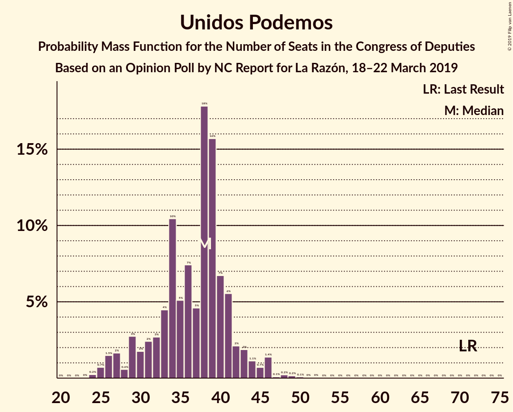
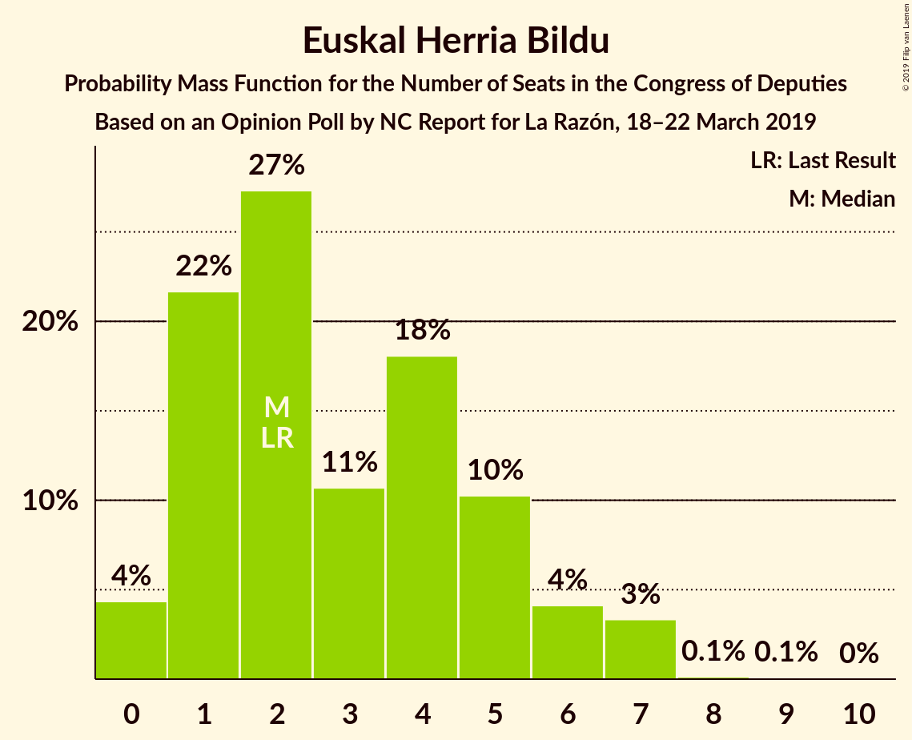
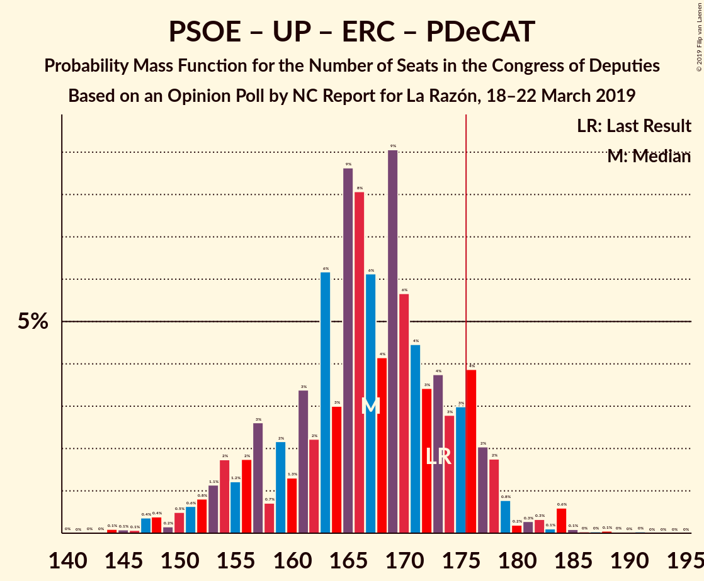
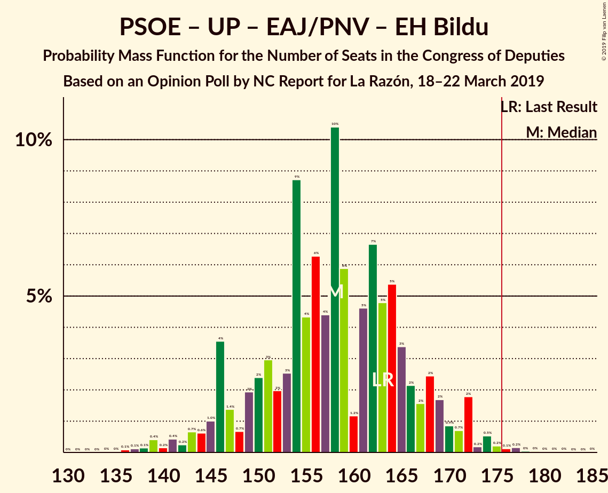
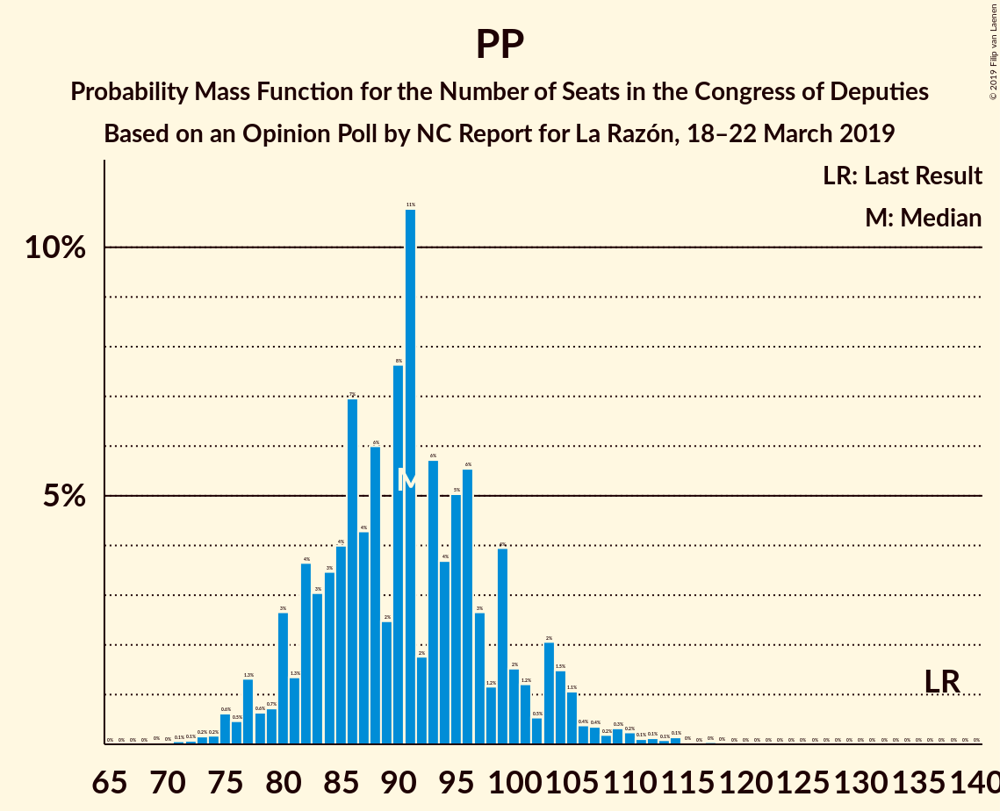

# Opinion Poll by NC Report for La Razón, 18–22 March 2019

<a href="#voting-intentions">Voting Intentions</a> | <a href="#seats">Seats</a> | <a href="#coalitions">Coalitions</a> | <a href="#technical-information">Technical Information</a>

## Voting Intentions

### Confidence Intervals

| Party | Last Result | Poll Result | 80% Confidence Interval | 90% Confidence Interval | 95% Confidence Interval | 99% Confidence Interval |
|:-----:|:-----------:|:-----------:|:-----------------------:|:-----------------------:|:-----------------------:|:-----------------------:|
| Partido Socialista Obrero Español | 22.6% | 26.9% | 25.1–28.8% |24.7–29.3% |24.2–29.7% |23.4–30.7% |
| Partido Popular | 33.0% | 22.4% | 20.8–24.2% |20.3–24.7% |19.9–25.1% |19.2–26.0% |
| Ciudadanos–Partido de la Ciudadanía | 13.1% | 17.1% | 15.7–18.7% |15.2–19.2% |14.9–19.6% |14.2–20.4% |
| Unidos Podemos | 21.2% | 13.5% | 12.2–15.0% |11.8–15.4% |11.5–15.8% |10.9–16.5% |
| Vox | 0.2% | 10.7% | 9.5–12.1% |9.2–12.4% |8.9–12.8% |8.4–13.5% |
| Esquerra Republicana de Catalunya–Catalunya Sí | 2.7% | 2.9% | 2.3–3.7% |2.2–3.9% |2.0–4.1% |1.8–4.6% |
| Euzko Alderdi Jeltzalea/Partido Nacionalista Vasco | 1.2% | 1.3% | 0.9–1.9% |0.8–2.1% |0.8–2.2% |0.6–2.5% |
| Partit Demòcrata Europeu Català | 2.0% | 1.2% | 0.9–1.8% |0.8–1.9% |0.7–2.1% |0.5–2.4% |
| Euskal Herria Bildu | 0.8% | 0.7% | 0.5–1.2% |0.4–1.3% |0.3–1.4% |0.2–1.7% |

*Note:* The poll result column reflects the actual value used in the calculations. Published results may vary slightly, and in addition be rounded to fewer digits.

## Seats

### Confidence Intervals

| Party | Last Result | Median | 80% Confidence Interval | 90% Confidence Interval | 95% Confidence Interval | 99% Confidence Interval |
|:-----:|:-----------:|:------:|:-----------------------:|:-----------------------:|:-----------------------:|:-----------------------:|
| <a href="#partido-socialista-obrero-español">Partido Socialista Obrero Español</a> | 85 | 118 | 113–124 |112–130 |112–130 |104–130 |
| <a href="#partido-popular">Partido Popular</a> | 137 | 88 | 75–93 |74–93 |74–93 |74–98 |
| <a href="#ciudadanos–partido-de-la-ciudadanía">Ciudadanos–Partido de la Ciudadanía</a> | 32 | 54 | 50–62 |50–63 |50–63 |49–64 |
| <a href="#unidos-podemos">Unidos Podemos</a> | 71 | 34 | 31–44 |29–44 |29–44 |29–49 |
| <a href="#vox">Vox</a> | 0 | 22 | 22 |18–26 |18–26 |18–35 |
| <a href="#esquerra-republicana-de-catalunya–catalunya-sí">Esquerra Republicana de Catalunya–Catalunya Sí</a> | 9 | 19 | 14–20 |11–20 |9–20 |7–20 |
| <a href="#euzko-alderdi-jeltzalea/partido-nacionalista-vasco">Euzko Alderdi Jeltzalea/Partido Nacionalista Vasco</a> | 5 | 8 | 6–8 |6–10 |6–10 |5–10 |
| <a href="#partit-demòcrata-europeu-català">Partit Demòcrata Europeu Català</a> | 8 | 3 | 3–7 |3–7 |3–12 |3–12 |
| <a href="#euskal-herria-bildu">Euskal Herria Bildu</a> | 2 | 1 | 0–5 |0–5 |0–6 |0–9 |

### Partido Socialista Obrero Español

*For a full overview of the results for this party, see the [Partido Socialista Obrero Español](party-partidosocialistaobreroespañol.html) page.*

| Number of Seats | Probability | Accumulated | Special Marks |
|:---------------:|:-----------:|:-----------:|:-------------:|
| 85 | 0% | 100% | Last Result |
| 86 | 0% | 100% |  |
| 87 | 0% | 100% |  |
| 88 | 0% | 100% |  |
| 89 | 0% | 100% |  |
| 90 | 0% | 100% |  |
| 91 | 0% | 100% |  |
| 92 | 0% | 100% |  |
| 93 | 0% | 100% |  |
| 94 | 0% | 100% |  |
| 95 | 0% | 100% |  |
| 96 | 0% | 100% |  |
| 97 | 0% | 100% |  |
| 98 | 0% | 100% |  |
| 99 | 0% | 99.9% |  |
| 100 | 0% | 99.9% |  |
| 101 | 0.1% | 99.9% |  |
| 102 | 0% | 99.8% |  |
| 103 | 0% | 99.8% |  |
| 104 | 0.8% | 99.8% |  |
| 105 | 0% | 99.0% |  |
| 106 | 0.1% | 99.0% |  |
| 107 | 0% | 98.9% |  |
| 108 | 0.1% | 98.9% |  |
| 109 | 0% | 98.8% |  |
| 110 | 0% | 98.8% |  |
| 111 | 0.4% | 98.8% |  |
| 112 | 6% | 98% |  |
| 113 | 31% | 92% |  |
| 114 | 3% | 61% |  |
| 115 | 0% | 59% |  |
| 116 | 0% | 59% |  |
| 117 | 0% | 59% |  |
| 118 | 48% | 59% | Median |
| 119 | 0.1% | 11% |  |
| 120 | 0% | 11% |  |
| 121 | 0% | 11% |  |
| 122 | 0.4% | 11% |  |
| 123 | 0% | 10% |  |
| 124 | 4% | 10% |  |
| 125 | 0% | 7% |  |
| 126 | 0% | 7% |  |
| 127 | 0% | 7% |  |
| 128 | 0% | 7% |  |
| 129 | 0% | 7% |  |
| 130 | 7% | 7% |  |
| 131 | 0% | 0% |  |

### Partido Popular

*For a full overview of the results for this party, see the [Partido Popular](party-partidopopular.html) page.*

| Number of Seats | Probability | Accumulated | Special Marks |
|:---------------:|:-----------:|:-----------:|:-------------:|
| 74 | 6% | 100% |  |
| 75 | 31% | 94% |  |
| 76 | 0% | 63% |  |
| 77 | 0% | 63% |  |
| 78 | 0% | 63% |  |
| 79 | 0% | 63% |  |
| 80 | 3% | 63% |  |
| 81 | 0% | 59% |  |
| 82 | 0.1% | 59% |  |
| 83 | 0% | 59% |  |
| 84 | 0% | 59% |  |
| 85 | 0% | 59% |  |
| 86 | 7% | 59% |  |
| 87 | 0% | 53% |  |
| 88 | 4% | 53% | Median |
| 89 | 0% | 49% |  |
| 90 | 0% | 49% |  |
| 91 | 0% | 49% |  |
| 92 | 0% | 49% |  |
| 93 | 48% | 49% |  |
| 94 | 0.2% | 0.8% |  |
| 95 | 0% | 0.6% |  |
| 96 | 0% | 0.6% |  |
| 97 | 0% | 0.6% |  |
| 98 | 0.4% | 0.6% |  |
| 99 | 0% | 0.2% |  |
| 100 | 0% | 0.2% |  |
| 101 | 0% | 0.1% |  |
| 102 | 0% | 0.1% |  |
| 103 | 0% | 0.1% |  |
| 104 | 0.1% | 0.1% |  |
| 105 | 0% | 0% |  |
| 106 | 0% | 0% |  |
| 107 | 0% | 0% |  |
| 108 | 0% | 0% |  |
| 109 | 0% | 0% |  |
| 110 | 0% | 0% |  |
| 111 | 0% | 0% |  |
| 112 | 0% | 0% |  |
| 113 | 0% | 0% |  |
| 114 | 0% | 0% |  |
| 115 | 0% | 0% |  |
| 116 | 0% | 0% |  |
| 117 | 0% | 0% |  |
| 118 | 0% | 0% |  |
| 119 | 0% | 0% |  |
| 120 | 0% | 0% |  |
| 121 | 0% | 0% |  |
| 122 | 0% | 0% |  |
| 123 | 0% | 0% |  |
| 124 | 0% | 0% |  |
| 125 | 0% | 0% |  |
| 126 | 0% | 0% |  |
| 127 | 0% | 0% |  |
| 128 | 0% | 0% |  |
| 129 | 0% | 0% |  |
| 130 | 0% | 0% |  |
| 131 | 0% | 0% |  |
| 132 | 0% | 0% |  |
| 133 | 0% | 0% |  |
| 134 | 0% | 0% |  |
| 135 | 0% | 0% |  |
| 136 | 0% | 0% |  |
| 137 | 0% | 0% | Last Result |

### Ciudadanos–Partido de la Ciudadanía

*For a full overview of the results for this party, see the [Ciudadanos–Partido de la Ciudadanía](party-ciudadanos–partidodelaciudadanía.html) page.*

| Number of Seats | Probability | Accumulated | Special Marks |
|:---------------:|:-----------:|:-----------:|:-------------:|
| 32 | 0% | 100% | Last Result |
| 33 | 0% | 100% |  |
| 34 | 0% | 100% |  |
| 35 | 0% | 100% |  |
| 36 | 0% | 100% |  |
| 37 | 0% | 100% |  |
| 38 | 0% | 100% |  |
| 39 | 0% | 100% |  |
| 40 | 0% | 100% |  |
| 41 | 0% | 100% |  |
| 42 | 0% | 100% |  |
| 43 | 0% | 100% |  |
| 44 | 0% | 100% |  |
| 45 | 0.1% | 100% |  |
| 46 | 0% | 99.9% |  |
| 47 | 0% | 99.9% |  |
| 48 | 0% | 99.9% |  |
| 49 | 0.4% | 99.9% |  |
| 50 | 48% | 99.5% |  |
| 51 | 0.1% | 52% |  |
| 52 | 0% | 51% |  |
| 53 | 0.1% | 51% |  |
| 54 | 4% | 51% | Median |
| 55 | 0% | 48% |  |
| 56 | 0.4% | 48% |  |
| 57 | 0% | 47% |  |
| 58 | 0% | 47% |  |
| 59 | 2% | 47% |  |
| 60 | 0% | 45% |  |
| 61 | 0.1% | 45% |  |
| 62 | 38% | 45% |  |
| 63 | 6% | 7% |  |
| 64 | 0.8% | 0.9% |  |
| 65 | 0% | 0.1% |  |
| 66 | 0% | 0.1% |  |
| 67 | 0% | 0.1% |  |
| 68 | 0% | 0% |  |

### Unidos Podemos

*For a full overview of the results for this party, see the [Unidos Podemos](party-unidospodemos.html) page.*

| Number of Seats | Probability | Accumulated | Special Marks |
|:---------------:|:-----------:|:-----------:|:-------------:|
| 23 | 0.1% | 100% |  |
| 24 | 0% | 99.9% |  |
| 25 | 0% | 99.9% |  |
| 26 | 0% | 99.9% |  |
| 27 | 0% | 99.9% |  |
| 28 | 0% | 99.9% |  |
| 29 | 7% | 99.9% |  |
| 30 | 0% | 93% |  |
| 31 | 4% | 93% |  |
| 32 | 0% | 89% |  |
| 33 | 0.4% | 89% |  |
| 34 | 48% | 88% | Median |
| 35 | 0% | 40% |  |
| 36 | 0% | 40% |  |
| 37 | 0% | 40% |  |
| 38 | 0% | 40% |  |
| 39 | 0% | 40% |  |
| 40 | 0.4% | 40% |  |
| 41 | 0% | 40% |  |
| 42 | 6% | 40% |  |
| 43 | 0% | 33% |  |
| 44 | 31% | 33% |  |
| 45 | 0% | 2% |  |
| 46 | 0% | 2% |  |
| 47 | 0% | 2% |  |
| 48 | 0% | 2% |  |
| 49 | 2% | 2% |  |
| 50 | 0% | 0.1% |  |
| 51 | 0.1% | 0.1% |  |
| 52 | 0.1% | 0.1% |  |
| 53 | 0% | 0% |  |
| 54 | 0% | 0% |  |
| 55 | 0% | 0% |  |
| 56 | 0% | 0% |  |
| 57 | 0% | 0% |  |
| 58 | 0% | 0% |  |
| 59 | 0% | 0% |  |
| 60 | 0% | 0% |  |
| 61 | 0% | 0% |  |
| 62 | 0% | 0% |  |
| 63 | 0% | 0% |  |
| 64 | 0% | 0% |  |
| 65 | 0% | 0% |  |
| 66 | 0% | 0% |  |
| 67 | 0% | 0% |  |
| 68 | 0% | 0% |  |
| 69 | 0% | 0% |  |
| 70 | 0% | 0% |  |
| 71 | 0% | 0% | Last Result |

### Vox

*For a full overview of the results for this party, see the [Vox](party-vox.html) page.*

| Number of Seats | Probability | Accumulated | Special Marks |
|:---------------:|:-----------:|:-----------:|:-------------:|
| 0 | 0% | 100% | Last Result |
| 1 | 0% | 100% |  |
| 2 | 0% | 100% |  |
| 3 | 0% | 100% |  |
| 4 | 0% | 100% |  |
| 5 | 0% | 100% |  |
| 6 | 0% | 100% |  |
| 7 | 0% | 100% |  |
| 8 | 0% | 100% |  |
| 9 | 0% | 100% |  |
| 10 | 0% | 100% |  |
| 11 | 0% | 100% |  |
| 12 | 0% | 100% |  |
| 13 | 0% | 100% |  |
| 14 | 0% | 100% |  |
| 15 | 0% | 100% |  |
| 16 | 0.1% | 100% |  |
| 17 | 0% | 99.9% |  |
| 18 | 7% | 99.9% |  |
| 19 | 0.4% | 93% |  |
| 20 | 2% | 93% |  |
| 21 | 0.1% | 91% |  |
| 22 | 83% | 91% | Median |
| 23 | 0.4% | 8% |  |
| 24 | 0% | 8% |  |
| 25 | 0% | 8% |  |
| 26 | 6% | 8% |  |
| 27 | 0% | 1.2% |  |
| 28 | 0% | 1.2% |  |
| 29 | 0.1% | 1.2% |  |
| 30 | 0.1% | 1.1% |  |
| 31 | 0% | 1.0% |  |
| 32 | 0% | 1.0% |  |
| 33 | 0% | 1.0% |  |
| 34 | 0% | 1.0% |  |
| 35 | 0.9% | 0.9% |  |
| 36 | 0% | 0.1% |  |
| 37 | 0% | 0.1% |  |
| 38 | 0% | 0.1% |  |
| 39 | 0% | 0.1% |  |
| 40 | 0% | 0% |  |

### Esquerra Republicana de Catalunya–Catalunya Sí

*For a full overview of the results for this party, see the [Esquerra Republicana de Catalunya–Catalunya Sí](party-esquerrarepublicanadecatalunya–catalunyasí.html) page.*

| Number of Seats | Probability | Accumulated | Special Marks |
|:---------------:|:-----------:|:-----------:|:-------------:|
| 5 | 0.1% | 100% |  |
| 6 | 0% | 99.9% |  |
| 7 | 0.5% | 99.9% |  |
| 8 | 0.1% | 99.5% |  |
| 9 | 2% | 99.4% | Last Result |
| 10 | 0% | 97% |  |
| 11 | 4% | 97% |  |
| 12 | 0% | 93% |  |
| 13 | 0% | 93% |  |
| 14 | 13% | 93% |  |
| 15 | 2% | 81% |  |
| 16 | 0% | 79% |  |
| 17 | 0% | 79% |  |
| 18 | 0% | 79% |  |
| 19 | 31% | 79% | Median |
| 20 | 48% | 48% |  |
| 21 | 0% | 0% |  |

### Euzko Alderdi Jeltzalea/Partido Nacionalista Vasco

*For a full overview of the results for this party, see the [Euzko Alderdi Jeltzalea/Partido Nacionalista Vasco](party-euzkoalderdijeltzaleapartidonacionalistavasco.html) page.*

| Number of Seats | Probability | Accumulated | Special Marks |
|:---------------:|:-----------:|:-----------:|:-------------:|
| 2 | 0.1% | 100% |  |
| 3 | 0.1% | 99.9% |  |
| 4 | 0% | 99.7% |  |
| 5 | 0.8% | 99.7% | Last Result |
| 6 | 40% | 98.9% |  |
| 7 | 4% | 59% |  |
| 8 | 48% | 55% | Median |
| 9 | 0% | 7% |  |
| 10 | 6% | 7% |  |
| 11 | 0% | 0.4% |  |
| 12 | 0.4% | 0.4% |  |
| 13 | 0% | 0% |  |

### Partit Demòcrata Europeu Català

*For a full overview of the results for this party, see the [Partit Demòcrata Europeu Català](party-partitdemòcrataeuropeucatalà.html) page.*

| Number of Seats | Probability | Accumulated | Special Marks |
|:---------------:|:-----------:|:-----------:|:-------------:|
| 2 | 0.1% | 100% |  |
| 3 | 79% | 99.9% | Median |
| 4 | 7% | 21% |  |
| 5 | 0.1% | 14% |  |
| 6 | 3% | 14% |  |
| 7 | 6% | 11% |  |
| 8 | 0.6% | 4% | Last Result |
| 9 | 0% | 4% |  |
| 10 | 0% | 4% |  |
| 11 | 0% | 4% |  |
| 12 | 4% | 4% |  |
| 13 | 0% | 0% |  |

### Euskal Herria Bildu

*For a full overview of the results for this party, see the [Euskal Herria Bildu](party-euskalherriabildu.html) page.*

| Number of Seats | Probability | Accumulated | Special Marks |
|:---------------:|:-----------:|:-----------:|:-------------:|
| 0 | 11% | 100% |  |
| 1 | 54% | 89% | Median |
| 2 | 0.1% | 35% | Last Result |
| 3 | 0% | 35% |  |
| 4 | 0.4% | 35% |  |
| 5 | 31% | 34% |  |
| 6 | 2% | 3% |  |
| 7 | 0% | 1.0% |  |
| 8 | 0.1% | 0.9% |  |
| 9 | 0.8% | 0.8% |  |
| 10 | 0% | 0% |  |

## Coalitions

### Confidence Intervals

| Coalition | Last Result | Median | Majority? | 80% Confidence Interval | 90% Confidence Interval | 95% Confidence Interval | 99% Confidence Interval |
|:---------:|:-----------:|:------:|:---------:|:-----------------------:|:-----------------------:|:-----------------------:|:-----------------------:|
| Partido Socialista Obrero Español – Partido Popular – Ciudadanos–Partido de la Ciudadanía | 254 | 261 | 100% | 250–266 | 249–278 | 249–278 | 248–278 |
| Partido Socialista Obrero Español – Ciudadanos–Partido de la Ciudadanía – Unidos Podemos | 188 | 209 | 100% | 202–219 | 202–221 | 202–221 | 199–222 |
| Partido Socialista Obrero Español – Partido Popular | 222 | 211 | 100% | 188–212 | 186–216 | 186–216 | 184–216 |
| Partido Socialista Obrero Español – Ciudadanos–Partido de la Ciudadanía | 117 | 172 | 10% | 168–178 | 168–192 | 168–192 | 168–192 |
| Partido Socialista Obrero Español – Unidos Podemos – Esquerra Republicana de Catalunya–Catalunya Sí – Euzko Alderdi Jeltzalea/Partido Nacionalista Vasco – Partit Demòcrata Europeu Català – Euskal Herria Bildu | 180 | 184 | 98.8% | 184–190 | 183–190 | 183–190 | 170–190 |
| Partido Socialista Obrero Español – Unidos Podemos – Esquerra Republicana de Catalunya–Catalunya Sí – Euskal Herria Bildu | 167 | 173 | 33% | 169–181 | 166–181 | 166–181 | 159–181 |
| Partido Socialista Obrero Español – Unidos Podemos – Esquerra Republicana de Catalunya–Catalunya Sí – Partit Demòcrata Europeu Català | 173 | 175 | 44% | 175–179 | 175–179 | 175–179 | 156–179 |
| Partido Socialista Obrero Español – Unidos Podemos – Euzko Alderdi Jeltzalea/Partido Nacionalista Vasco – Euskal Herria Bildu | 163 | 162 | 0.1% | 161–168 | 161–168 | 161–172 | 149–175 |
| Partido Socialista Obrero Español – Unidos Podemos – Euzko Alderdi Jeltzalea/Partido Nacionalista Vasco | 161 | 162 | 0% | 160–164 | 160–165 | 160–168 | 140–169 |
| Partido Popular – Ciudadanos–Partido de la Ciudadanía – Vox | 169 | 165 | 1.0% | 159–165 | 159–166 | 159–166 | 159–179 |
| Partido Socialista Obrero Español – Unidos Podemos | 156 | 154 | 0% | 152–157 | 152–159 | 152–162 | 135–163 |
| Partido Popular – Ciudadanos–Partido de la Ciudadanía – Euzko Alderdi Jeltzalea/Partido Nacionalista Vasco | 174 | 151 | 0% | 143–151 | 143–154 | 143–154 | 143–156 |
| Partido Popular – Ciudadanos–Partido de la Ciudadanía | 169 | 143 | 0% | 137–143 | 137–148 | 137–148 | 137–148 |
| Partido Socialista Obrero Español | 85 | 118 | 0% | 113–124 | 112–130 | 112–130 | 104–130 |
| Partido Popular – Vox | 137 | 110 | 0% | 97–115 | 97–115 | 97–115 | 97–117 |
| Partido Popular | 137 | 88 | 0% | 75–93 | 74–93 | 74–93 | 74–98 |

### Partido Socialista Obrero Español – Partido Popular – Ciudadanos–Partido de la Ciudadanía

| Number of Seats | Probability | Accumulated | Special Marks |
|:---------------:|:-----------:|:-----------:|:-------------:|
| 245 | 0% | 100% |  |
| 246 | 0% | 99.9% |  |
| 247 | 0% | 99.9% |  |
| 248 | 1.3% | 99.9% |  |
| 249 | 6% | 98.7% |  |
| 250 | 31% | 93% |  |
| 251 | 0.2% | 62% |  |
| 252 | 0.1% | 62% |  |
| 253 | 2% | 61% |  |
| 254 | 0.1% | 59% | Last Result |
| 255 | 0% | 59% |  |
| 256 | 0% | 59% |  |
| 257 | 0% | 59% |  |
| 258 | 0.4% | 59% |  |
| 259 | 0% | 59% |  |
| 260 | 0% | 59% | Median |
| 261 | 48% | 59% |  |
| 262 | 0% | 11% |  |
| 263 | 0.1% | 11% |  |
| 264 | 0% | 11% |  |
| 265 | 0% | 11% |  |
| 266 | 4% | 11% |  |
| 267 | 0% | 7% |  |
| 268 | 0% | 7% |  |
| 269 | 0.4% | 7% |  |
| 270 | 0% | 7% |  |
| 271 | 0% | 7% |  |
| 272 | 0% | 7% |  |
| 273 | 0% | 7% |  |
| 274 | 0% | 7% |  |
| 275 | 0% | 7% |  |
| 276 | 0% | 7% |  |
| 277 | 0% | 7% |  |
| 278 | 7% | 7% |  |
| 279 | 0% | 0% |  |

### Partido Socialista Obrero Español – Ciudadanos–Partido de la Ciudadanía – Unidos Podemos

| Number of Seats | Probability | Accumulated | Special Marks |
|:---------------:|:-----------:|:-----------:|:-------------:|
| 176 | 0% | 100% | Majority |
| 177 | 0% | 99.9% |  |
| 178 | 0% | 99.9% |  |
| 179 | 0% | 99.9% |  |
| 180 | 0% | 99.9% |  |
| 181 | 0% | 99.9% |  |
| 182 | 0% | 99.9% |  |
| 183 | 0% | 99.9% |  |
| 184 | 0% | 99.9% |  |
| 185 | 0% | 99.9% |  |
| 186 | 0% | 99.9% |  |
| 187 | 0% | 99.9% |  |
| 188 | 0% | 99.9% | Last Result |
| 189 | 0% | 99.9% |  |
| 190 | 0% | 99.9% |  |
| 191 | 0% | 99.9% |  |
| 192 | 0.1% | 99.9% |  |
| 193 | 0% | 99.9% |  |
| 194 | 0% | 99.9% |  |
| 195 | 0% | 99.8% |  |
| 196 | 0% | 99.8% |  |
| 197 | 0% | 99.8% |  |
| 198 | 0.1% | 99.8% |  |
| 199 | 1.0% | 99.8% |  |
| 200 | 0% | 98.8% |  |
| 201 | 0% | 98.8% |  |
| 202 | 48% | 98.8% |  |
| 203 | 0.4% | 51% |  |
| 204 | 0% | 50% |  |
| 205 | 0% | 50% |  |
| 206 | 0% | 50% | Median |
| 207 | 0% | 50% |  |
| 208 | 0% | 50% |  |
| 209 | 4% | 50% |  |
| 210 | 0% | 47% |  |
| 211 | 0.4% | 47% |  |
| 212 | 0% | 46% |  |
| 213 | 0% | 46% |  |
| 214 | 0% | 46% |  |
| 215 | 0% | 46% |  |
| 216 | 0.4% | 46% |  |
| 217 | 6% | 46% |  |
| 218 | 0% | 40% |  |
| 219 | 31% | 40% |  |
| 220 | 0% | 9% |  |
| 221 | 7% | 9% |  |
| 222 | 2% | 2% |  |
| 223 | 0.1% | 0.1% |  |
| 224 | 0% | 0% |  |

### Partido Socialista Obrero Español – Partido Popular

| Number of Seats | Probability | Accumulated | Special Marks |
|:---------------:|:-----------:|:-----------:|:-------------:|
| 184 | 0.8% | 100% |  |
| 185 | 0.4% | 99.2% |  |
| 186 | 6% | 98.7% |  |
| 187 | 0% | 93% |  |
| 188 | 31% | 93% |  |
| 189 | 0% | 62% |  |
| 190 | 0% | 62% |  |
| 191 | 0% | 62% |  |
| 192 | 0% | 62% |  |
| 193 | 0.1% | 62% |  |
| 194 | 2% | 62% |  |
| 195 | 0% | 59% |  |
| 196 | 0% | 59% |  |
| 197 | 0% | 59% |  |
| 198 | 0% | 59% |  |
| 199 | 0% | 59% |  |
| 200 | 0.1% | 59% |  |
| 201 | 0.1% | 59% |  |
| 202 | 0.4% | 59% |  |
| 203 | 0% | 59% |  |
| 204 | 0% | 59% |  |
| 205 | 0.1% | 59% |  |
| 206 | 0% | 59% | Median |
| 207 | 0% | 59% |  |
| 208 | 0% | 59% |  |
| 209 | 0% | 59% |  |
| 210 | 0% | 59% |  |
| 211 | 48% | 59% |  |
| 212 | 4% | 11% |  |
| 213 | 0% | 7% |  |
| 214 | 0% | 7% |  |
| 215 | 0% | 7% |  |
| 216 | 7% | 7% |  |
| 217 | 0% | 0.5% |  |
| 218 | 0% | 0.5% |  |
| 219 | 0% | 0.5% |  |
| 220 | 0.4% | 0.5% |  |
| 221 | 0% | 0% |  |
| 222 | 0% | 0% | Last Result |

### Partido Socialista Obrero Español – Ciudadanos–Partido de la Ciudadanía

| Number of Seats | Probability | Accumulated | Special Marks |
|:---------------:|:-----------:|:-----------:|:-------------:|
| 117 | 0% | 100% | Last Result |
| 118 | 0% | 100% |  |
| 119 | 0% | 100% |  |
| 120 | 0% | 100% |  |
| 121 | 0% | 100% |  |
| 122 | 0% | 100% |  |
| 123 | 0% | 100% |  |
| 124 | 0% | 100% |  |
| 125 | 0% | 100% |  |
| 126 | 0% | 100% |  |
| 127 | 0% | 100% |  |
| 128 | 0% | 100% |  |
| 129 | 0% | 100% |  |
| 130 | 0% | 100% |  |
| 131 | 0% | 100% |  |
| 132 | 0% | 100% |  |
| 133 | 0% | 100% |  |
| 134 | 0% | 100% |  |
| 135 | 0% | 100% |  |
| 136 | 0% | 100% |  |
| 137 | 0% | 100% |  |
| 138 | 0% | 100% |  |
| 139 | 0% | 100% |  |
| 140 | 0% | 100% |  |
| 141 | 0% | 100% |  |
| 142 | 0% | 100% |  |
| 143 | 0% | 100% |  |
| 144 | 0% | 100% |  |
| 145 | 0% | 100% |  |
| 146 | 0.1% | 100% |  |
| 147 | 0% | 99.9% |  |
| 148 | 0% | 99.9% |  |
| 149 | 0% | 99.9% |  |
| 150 | 0% | 99.9% |  |
| 151 | 0% | 99.9% |  |
| 152 | 0% | 99.9% |  |
| 153 | 0% | 99.9% |  |
| 154 | 0% | 99.9% |  |
| 155 | 0% | 99.9% |  |
| 156 | 0% | 99.9% |  |
| 157 | 0.1% | 99.9% |  |
| 158 | 0% | 99.7% |  |
| 159 | 0% | 99.7% |  |
| 160 | 0% | 99.7% |  |
| 161 | 0% | 99.7% |  |
| 162 | 0% | 99.7% |  |
| 163 | 0% | 99.7% |  |
| 164 | 0% | 99.7% |  |
| 165 | 0% | 99.7% |  |
| 166 | 0% | 99.7% |  |
| 167 | 0% | 99.7% |  |
| 168 | 49% | 99.7% |  |
| 169 | 0.1% | 51% |  |
| 170 | 0.4% | 51% |  |
| 171 | 0.4% | 50% |  |
| 172 | 0.2% | 50% | Median |
| 173 | 2% | 50% |  |
| 174 | 0.4% | 48% |  |
| 175 | 37% | 47% |  |
| 176 | 0% | 10% | Majority |
| 177 | 0% | 10% |  |
| 178 | 4% | 10% |  |
| 179 | 0% | 7% |  |
| 180 | 0% | 7% |  |
| 181 | 0% | 7% |  |
| 182 | 0% | 7% |  |
| 183 | 0% | 7% |  |
| 184 | 0% | 7% |  |
| 185 | 0% | 7% |  |
| 186 | 0% | 7% |  |
| 187 | 0% | 7% |  |
| 188 | 0% | 7% |  |
| 189 | 0% | 7% |  |
| 190 | 0% | 7% |  |
| 191 | 0% | 7% |  |
| 192 | 7% | 7% |  |
| 193 | 0% | 0% |  |

### Partido Socialista Obrero Español – Unidos Podemos – Esquerra Republicana de Catalunya–Catalunya Sí – Euzko Alderdi Jeltzalea/Partido Nacionalista Vasco – Partit Demòcrata Europeu Català – Euskal Herria Bildu

| Number of Seats | Probability | Accumulated | Special Marks |
|:---------------:|:-----------:|:-----------:|:-------------:|
| 159 | 0.1% | 100% |  |
| 160 | 0% | 99.9% |  |
| 161 | 0% | 99.9% |  |
| 162 | 0% | 99.9% |  |
| 163 | 0% | 99.9% |  |
| 164 | 0% | 99.9% |  |
| 165 | 0% | 99.9% |  |
| 166 | 0% | 99.9% |  |
| 167 | 0% | 99.9% |  |
| 168 | 0% | 99.9% |  |
| 169 | 0% | 99.8% |  |
| 170 | 0.8% | 99.8% |  |
| 171 | 0.1% | 99.0% |  |
| 172 | 0% | 99.0% |  |
| 173 | 0% | 99.0% |  |
| 174 | 0.1% | 99.0% |  |
| 175 | 0% | 98.8% |  |
| 176 | 0% | 98.8% | Majority |
| 177 | 0% | 98.8% |  |
| 178 | 0% | 98.8% |  |
| 179 | 0% | 98.8% |  |
| 180 | 0% | 98.8% | Last Result |
| 181 | 0% | 98.8% |  |
| 182 | 0.4% | 98.8% |  |
| 183 | 7% | 98% | Median |
| 184 | 48% | 91% |  |
| 185 | 4% | 43% |  |
| 186 | 6% | 40% |  |
| 187 | 0% | 33% |  |
| 188 | 0% | 33% |  |
| 189 | 0.1% | 33% |  |
| 190 | 33% | 33% |  |
| 191 | 0% | 0.1% |  |
| 192 | 0% | 0.1% |  |
| 193 | 0% | 0.1% |  |
| 194 | 0% | 0.1% |  |
| 195 | 0% | 0.1% |  |
| 196 | 0% | 0.1% |  |
| 197 | 0% | 0.1% |  |
| 198 | 0.1% | 0.1% |  |
| 199 | 0% | 0% |  |

### Partido Socialista Obrero Español – Unidos Podemos – Esquerra Republicana de Catalunya–Catalunya Sí – Euskal Herria Bildu

| Number of Seats | Probability | Accumulated | Special Marks |
|:---------------:|:-----------:|:-----------:|:-------------:|
| 143 | 0% | 100% |  |
| 144 | 0.1% | 99.9% |  |
| 145 | 0% | 99.9% |  |
| 146 | 0% | 99.9% |  |
| 147 | 0% | 99.9% |  |
| 148 | 0% | 99.9% |  |
| 149 | 0% | 99.9% |  |
| 150 | 0% | 99.9% |  |
| 151 | 0% | 99.9% |  |
| 152 | 0% | 99.9% |  |
| 153 | 0% | 99.9% |  |
| 154 | 0% | 99.9% |  |
| 155 | 0% | 99.9% |  |
| 156 | 0% | 99.9% |  |
| 157 | 0% | 99.9% |  |
| 158 | 0% | 99.8% |  |
| 159 | 0.8% | 99.8% |  |
| 160 | 0.1% | 99.0% |  |
| 161 | 0% | 99.0% |  |
| 162 | 0.4% | 98.9% |  |
| 163 | 0% | 98.6% |  |
| 164 | 0.1% | 98.6% |  |
| 165 | 0% | 98% |  |
| 166 | 4% | 98% |  |
| 167 | 0% | 95% | Last Result |
| 168 | 0% | 95% |  |
| 169 | 6% | 95% |  |
| 170 | 0% | 88% |  |
| 171 | 0% | 88% |  |
| 172 | 0% | 88% | Median |
| 173 | 55% | 88% |  |
| 174 | 0% | 33% |  |
| 175 | 0% | 33% |  |
| 176 | 0.1% | 33% | Majority |
| 177 | 0% | 33% |  |
| 178 | 2% | 33% |  |
| 179 | 0% | 31% |  |
| 180 | 0% | 31% |  |
| 181 | 31% | 31% |  |
| 182 | 0% | 0.1% |  |
| 183 | 0% | 0.1% |  |
| 184 | 0% | 0.1% |  |
| 185 | 0% | 0.1% |  |
| 186 | 0% | 0.1% |  |
| 187 | 0% | 0.1% |  |
| 188 | 0% | 0.1% |  |
| 189 | 0% | 0.1% |  |
| 190 | 0% | 0.1% |  |
| 191 | 0% | 0.1% |  |
| 192 | 0% | 0.1% |  |
| 193 | 0.1% | 0.1% |  |
| 194 | 0% | 0% |  |

### Partido Socialista Obrero Español – Unidos Podemos – Esquerra Republicana de Catalunya–Catalunya Sí – Partit Demòcrata Europeu Català

| Number of Seats | Probability | Accumulated | Special Marks |
|:---------------:|:-----------:|:-----------:|:-------------:|
| 146 | 0% | 100% |  |
| 147 | 0.1% | 99.9% |  |
| 148 | 0% | 99.9% |  |
| 149 | 0% | 99.9% |  |
| 150 | 0% | 99.9% |  |
| 151 | 0% | 99.9% |  |
| 152 | 0% | 99.9% |  |
| 153 | 0% | 99.9% |  |
| 154 | 0% | 99.9% |  |
| 155 | 0% | 99.9% |  |
| 156 | 0.8% | 99.8% |  |
| 157 | 0% | 99.0% |  |
| 158 | 0% | 99.0% |  |
| 159 | 0% | 99.0% |  |
| 160 | 0% | 99.0% |  |
| 161 | 0% | 99.0% |  |
| 162 | 0% | 99.0% |  |
| 163 | 0.1% | 99.0% |  |
| 164 | 0% | 98.9% |  |
| 165 | 0% | 98.9% |  |
| 166 | 0% | 98.9% |  |
| 167 | 0% | 98.9% |  |
| 168 | 0% | 98.9% |  |
| 169 | 0% | 98.9% |  |
| 170 | 0.4% | 98.9% |  |
| 171 | 0.1% | 98.6% |  |
| 172 | 0% | 98% |  |
| 173 | 0.4% | 98% | Last Result |
| 174 | 0% | 98% | Median |
| 175 | 54% | 98% |  |
| 176 | 0% | 44% | Majority |
| 177 | 7% | 44% |  |
| 178 | 6% | 37% |  |
| 179 | 31% | 31% |  |
| 180 | 0% | 0.1% |  |
| 181 | 0% | 0.1% |  |
| 182 | 0% | 0.1% |  |
| 183 | 0% | 0.1% |  |
| 184 | 0% | 0.1% |  |
| 185 | 0% | 0.1% |  |
| 186 | 0% | 0.1% |  |
| 187 | 0.1% | 0.1% |  |
| 188 | 0% | 0% |  |

### Partido Socialista Obrero Español – Unidos Podemos – Euzko Alderdi Jeltzalea/Partido Nacionalista Vasco – Euskal Herria Bildu

| Number of Seats | Probability | Accumulated | Special Marks |
|:---------------:|:-----------:|:-----------:|:-------------:|
| 139 | 0% | 100% |  |
| 140 | 0% | 99.9% |  |
| 141 | 0% | 99.9% |  |
| 142 | 0% | 99.9% |  |
| 143 | 0.1% | 99.9% |  |
| 144 | 0% | 99.9% |  |
| 145 | 0% | 99.9% |  |
| 146 | 0% | 99.9% |  |
| 147 | 0% | 99.9% |  |
| 148 | 0% | 99.9% |  |
| 149 | 0.8% | 99.8% |  |
| 150 | 0% | 99.0% |  |
| 151 | 0.1% | 99.0% |  |
| 152 | 0% | 98.9% |  |
| 153 | 0% | 98.9% |  |
| 154 | 0% | 98.9% |  |
| 155 | 0% | 98.9% |  |
| 156 | 0% | 98.9% |  |
| 157 | 0% | 98.9% |  |
| 158 | 0% | 98.9% |  |
| 159 | 0.4% | 98.9% |  |
| 160 | 0% | 98% |  |
| 161 | 48% | 98% | Median |
| 162 | 4% | 50% |  |
| 163 | 0% | 47% | Last Result |
| 164 | 0.4% | 47% |  |
| 165 | 13% | 46% |  |
| 166 | 0% | 34% |  |
| 167 | 0% | 34% |  |
| 168 | 31% | 34% |  |
| 169 | 0% | 3% |  |
| 170 | 0% | 3% |  |
| 171 | 0% | 3% |  |
| 172 | 0.4% | 3% |  |
| 173 | 0% | 2% |  |
| 174 | 0.1% | 2% |  |
| 175 | 2% | 2% |  |
| 176 | 0% | 0.1% | Majority |
| 177 | 0% | 0.1% |  |
| 178 | 0% | 0.1% |  |
| 179 | 0% | 0.1% |  |
| 180 | 0% | 0.1% |  |
| 181 | 0.1% | 0.1% |  |
| 182 | 0% | 0% |  |

### Partido Socialista Obrero Español – Unidos Podemos – Euzko Alderdi Jeltzalea/Partido Nacionalista Vasco

| Number of Seats | Probability | Accumulated | Special Marks |
|:---------------:|:-----------:|:-----------:|:-------------:|
| 132 | 0% | 100% |  |
| 133 | 0% | 99.9% |  |
| 134 | 0% | 99.9% |  |
| 135 | 0% | 99.9% |  |
| 136 | 0% | 99.9% |  |
| 137 | 0% | 99.9% |  |
| 138 | 0.1% | 99.9% |  |
| 139 | 0% | 99.9% |  |
| 140 | 0.8% | 99.9% |  |
| 141 | 0% | 99.0% |  |
| 142 | 0% | 99.0% |  |
| 143 | 0% | 99.0% |  |
| 144 | 0% | 99.0% |  |
| 145 | 0% | 99.0% |  |
| 146 | 0% | 99.0% |  |
| 147 | 0% | 99.0% |  |
| 148 | 0% | 99.0% |  |
| 149 | 0% | 99.0% |  |
| 150 | 0.1% | 99.0% |  |
| 151 | 0% | 98.9% |  |
| 152 | 0% | 98.9% |  |
| 153 | 0% | 98.9% |  |
| 154 | 0% | 98.9% |  |
| 155 | 0% | 98.9% |  |
| 156 | 0% | 98.9% |  |
| 157 | 0% | 98.9% |  |
| 158 | 0% | 98.9% |  |
| 159 | 0.4% | 98.8% |  |
| 160 | 48% | 98% | Median |
| 161 | 0% | 50% | Last Result |
| 162 | 4% | 50% |  |
| 163 | 31% | 47% |  |
| 164 | 6% | 15% |  |
| 165 | 7% | 10% |  |
| 166 | 0% | 3% |  |
| 167 | 0% | 3% |  |
| 168 | 0.4% | 3% |  |
| 169 | 2% | 2% |  |
| 170 | 0% | 0.1% |  |
| 171 | 0% | 0.1% |  |
| 172 | 0% | 0.1% |  |
| 173 | 0.1% | 0.1% |  |
| 174 | 0% | 0% |  |

### Partido Popular – Ciudadanos–Partido de la Ciudadanía – Vox

| Number of Seats | Probability | Accumulated | Special Marks |
|:---------------:|:-----------:|:-----------:|:-------------:|
| 151 | 0.1% | 100% |  |
| 152 | 0% | 99.9% |  |
| 153 | 0% | 99.9% |  |
| 154 | 0% | 99.9% |  |
| 155 | 0% | 99.9% |  |
| 156 | 0% | 99.9% |  |
| 157 | 0% | 99.9% |  |
| 158 | 0% | 99.9% |  |
| 159 | 33% | 99.9% |  |
| 160 | 0.1% | 67% |  |
| 161 | 0% | 67% |  |
| 162 | 0% | 67% |  |
| 163 | 6% | 67% |  |
| 164 | 4% | 60% | Median |
| 165 | 48% | 57% |  |
| 166 | 7% | 9% |  |
| 167 | 0.4% | 2% |  |
| 168 | 0% | 1.2% |  |
| 169 | 0% | 1.2% | Last Result |
| 170 | 0% | 1.2% |  |
| 171 | 0% | 1.2% |  |
| 172 | 0% | 1.2% |  |
| 173 | 0% | 1.2% |  |
| 174 | 0% | 1.2% |  |
| 175 | 0.1% | 1.2% |  |
| 176 | 0% | 1.0% | Majority |
| 177 | 0% | 1.0% |  |
| 178 | 0.1% | 1.0% |  |
| 179 | 0.8% | 1.0% |  |
| 180 | 0% | 0.2% |  |
| 181 | 0% | 0.2% |  |
| 182 | 0% | 0.1% |  |
| 183 | 0% | 0.1% |  |
| 184 | 0% | 0.1% |  |
| 185 | 0% | 0.1% |  |
| 186 | 0% | 0.1% |  |
| 187 | 0% | 0.1% |  |
| 188 | 0% | 0.1% |  |
| 189 | 0% | 0.1% |  |
| 190 | 0.1% | 0.1% |  |
| 191 | 0% | 0% |  |

### Partido Socialista Obrero Español – Unidos Podemos

| Number of Seats | Probability | Accumulated | Special Marks |
|:---------------:|:-----------:|:-----------:|:-------------:|
| 125 | 0% | 100% |  |
| 126 | 0% | 99.9% |  |
| 127 | 0% | 99.9% |  |
| 128 | 0% | 99.9% |  |
| 129 | 0% | 99.9% |  |
| 130 | 0% | 99.9% |  |
| 131 | 0.1% | 99.9% |  |
| 132 | 0% | 99.9% |  |
| 133 | 0% | 99.9% |  |
| 134 | 0% | 99.8% |  |
| 135 | 0.8% | 99.8% |  |
| 136 | 0% | 99.0% |  |
| 137 | 0% | 99.0% |  |
| 138 | 0% | 99.0% |  |
| 139 | 0% | 99.0% |  |
| 140 | 0% | 99.0% |  |
| 141 | 0% | 99.0% |  |
| 142 | 0% | 99.0% |  |
| 143 | 0% | 99.0% |  |
| 144 | 0% | 99.0% |  |
| 145 | 0% | 99.0% |  |
| 146 | 0% | 99.0% |  |
| 147 | 0.4% | 99.0% |  |
| 148 | 0.1% | 98.6% |  |
| 149 | 0% | 98% |  |
| 150 | 0% | 98% |  |
| 151 | 0% | 98% |  |
| 152 | 48% | 98% | Median |
| 153 | 0.5% | 51% |  |
| 154 | 6% | 50% |  |
| 155 | 4% | 44% |  |
| 156 | 0% | 41% | Last Result |
| 157 | 31% | 41% |  |
| 158 | 0% | 10% |  |
| 159 | 7% | 10% |  |
| 160 | 0% | 3% |  |
| 161 | 0% | 3% |  |
| 162 | 0.5% | 3% |  |
| 163 | 2% | 2% |  |
| 164 | 0% | 0.1% |  |
| 165 | 0% | 0.1% |  |
| 166 | 0% | 0.1% |  |
| 167 | 0% | 0.1% |  |
| 168 | 0% | 0.1% |  |
| 169 | 0% | 0.1% |  |
| 170 | 0.1% | 0.1% |  |
| 171 | 0% | 0% |  |

### Partido Popular – Ciudadanos–Partido de la Ciudadanía – Euzko Alderdi Jeltzalea/Partido Nacionalista Vasco

| Number of Seats | Probability | Accumulated | Special Marks |
|:---------------:|:-----------:|:-----------:|:-------------:|
| 138 | 0.1% | 100% |  |
| 139 | 0% | 99.9% |  |
| 140 | 0% | 99.9% |  |
| 141 | 0% | 99.9% |  |
| 142 | 0% | 99.9% |  |
| 143 | 31% | 99.9% |  |
| 144 | 0% | 69% |  |
| 145 | 2% | 69% |  |
| 146 | 0.1% | 67% |  |
| 147 | 7% | 67% |  |
| 148 | 0% | 60% |  |
| 149 | 4% | 60% |  |
| 150 | 0% | 56% | Median |
| 151 | 48% | 56% |  |
| 152 | 0% | 8% |  |
| 153 | 0.4% | 8% |  |
| 154 | 7% | 7% |  |
| 155 | 0.1% | 0.6% |  |
| 156 | 0.4% | 0.5% |  |
| 157 | 0% | 0.1% |  |
| 158 | 0% | 0.1% |  |
| 159 | 0% | 0.1% |  |
| 160 | 0% | 0.1% |  |
| 161 | 0% | 0.1% |  |
| 162 | 0.1% | 0.1% |  |
| 163 | 0% | 0% |  |
| 164 | 0% | 0% |  |
| 165 | 0% | 0% |  |
| 166 | 0% | 0% |  |
| 167 | 0% | 0% |  |
| 168 | 0% | 0% |  |
| 169 | 0% | 0% |  |
| 170 | 0% | 0% |  |
| 171 | 0% | 0% |  |
| 172 | 0% | 0% |  |
| 173 | 0% | 0% |  |
| 174 | 0% | 0% | Last Result |

### Partido Popular – Ciudadanos–Partido de la Ciudadanía

| Number of Seats | Probability | Accumulated | Special Marks |
|:---------------:|:-----------:|:-----------:|:-------------:|
| 135 | 0.1% | 100% |  |
| 136 | 0% | 99.9% |  |
| 137 | 37% | 99.9% |  |
| 138 | 0% | 63% |  |
| 139 | 2% | 63% |  |
| 140 | 0% | 60% |  |
| 141 | 0% | 60% |  |
| 142 | 4% | 60% | Median |
| 143 | 48% | 57% |  |
| 144 | 1.2% | 9% |  |
| 145 | 0.1% | 7% |  |
| 146 | 0% | 7% |  |
| 147 | 0.4% | 7% |  |
| 148 | 7% | 7% |  |
| 149 | 0.1% | 0.2% |  |
| 150 | 0% | 0.1% |  |
| 151 | 0% | 0.1% |  |
| 152 | 0% | 0.1% |  |
| 153 | 0% | 0.1% |  |
| 154 | 0% | 0.1% |  |
| 155 | 0.1% | 0.1% |  |
| 156 | 0% | 0% |  |
| 157 | 0% | 0% |  |
| 158 | 0% | 0% |  |
| 159 | 0% | 0% |  |
| 160 | 0% | 0% |  |
| 161 | 0% | 0% |  |
| 162 | 0% | 0% |  |
| 163 | 0% | 0% |  |
| 164 | 0% | 0% |  |
| 165 | 0% | 0% |  |
| 166 | 0% | 0% |  |
| 167 | 0% | 0% |  |
| 168 | 0% | 0% |  |
| 169 | 0% | 0% | Last Result |

### Partido Socialista Obrero Español

| Number of Seats | Probability | Accumulated | Special Marks |
|:---------------:|:-----------:|:-----------:|:-------------:|
| 85 | 0% | 100% | Last Result |
| 86 | 0% | 100% |  |
| 87 | 0% | 100% |  |
| 88 | 0% | 100% |  |
| 89 | 0% | 100% |  |
| 90 | 0% | 100% |  |
| 91 | 0% | 100% |  |
| 92 | 0% | 100% |  |
| 93 | 0% | 100% |  |
| 94 | 0% | 100% |  |
| 95 | 0% | 100% |  |
| 96 | 0% | 100% |  |
| 97 | 0% | 100% |  |
| 98 | 0% | 100% |  |
| 99 | 0% | 99.9% |  |
| 100 | 0% | 99.9% |  |
| 101 | 0.1% | 99.9% |  |
| 102 | 0% | 99.8% |  |
| 103 | 0% | 99.8% |  |
| 104 | 0.8% | 99.8% |  |
| 105 | 0% | 99.0% |  |
| 106 | 0.1% | 99.0% |  |
| 107 | 0% | 98.9% |  |
| 108 | 0.1% | 98.9% |  |
| 109 | 0% | 98.8% |  |
| 110 | 0% | 98.8% |  |
| 111 | 0.4% | 98.8% |  |
| 112 | 6% | 98% |  |
| 113 | 31% | 92% |  |
| 114 | 3% | 61% |  |
| 115 | 0% | 59% |  |
| 116 | 0% | 59% |  |
| 117 | 0% | 59% |  |
| 118 | 48% | 59% | Median |
| 119 | 0.1% | 11% |  |
| 120 | 0% | 11% |  |
| 121 | 0% | 11% |  |
| 122 | 0.4% | 11% |  |
| 123 | 0% | 10% |  |
| 124 | 4% | 10% |  |
| 125 | 0% | 7% |  |
| 126 | 0% | 7% |  |
| 127 | 0% | 7% |  |
| 128 | 0% | 7% |  |
| 129 | 0% | 7% |  |
| 130 | 7% | 7% |  |
| 131 | 0% | 0% |  |

### Partido Popular – Vox

| Number of Seats | Probability | Accumulated | Special Marks |
|:---------------:|:-----------:|:-----------:|:-------------:|
| 97 | 31% | 100% |  |
| 98 | 0.1% | 69% |  |
| 99 | 0% | 69% |  |
| 100 | 9% | 69% |  |
| 101 | 0.1% | 60% |  |
| 102 | 0% | 60% |  |
| 103 | 0% | 60% |  |
| 104 | 7% | 60% |  |
| 105 | 0% | 54% |  |
| 106 | 0% | 54% |  |
| 107 | 0% | 54% |  |
| 108 | 0% | 54% |  |
| 109 | 0% | 54% |  |
| 110 | 4% | 54% | Median |
| 111 | 0.4% | 50% |  |
| 112 | 0% | 50% |  |
| 113 | 0% | 50% |  |
| 114 | 0% | 50% |  |
| 115 | 49% | 50% |  |
| 116 | 0% | 0.8% |  |
| 117 | 0.4% | 0.8% |  |
| 118 | 0% | 0.4% |  |
| 119 | 0% | 0.4% |  |
| 120 | 0% | 0.4% |  |
| 121 | 0% | 0.4% |  |
| 122 | 0% | 0.4% |  |
| 123 | 0% | 0.4% |  |
| 124 | 0.2% | 0.4% |  |
| 125 | 0% | 0.2% |  |
| 126 | 0% | 0.2% |  |
| 127 | 0% | 0.2% |  |
| 128 | 0% | 0.2% |  |
| 129 | 0.1% | 0.2% |  |
| 130 | 0% | 0.1% |  |
| 131 | 0% | 0.1% |  |
| 132 | 0% | 0.1% |  |
| 133 | 0.1% | 0.1% |  |
| 134 | 0% | 0.1% |  |
| 135 | 0% | 0.1% |  |
| 136 | 0% | 0.1% |  |
| 137 | 0% | 0.1% | Last Result |
| 138 | 0% | 0.1% |  |
| 139 | 0% | 0.1% |  |
| 140 | 0% | 0% |  |

### Partido Popular

| Number of Seats | Probability | Accumulated | Special Marks |
|:---------------:|:-----------:|:-----------:|:-------------:|
| 74 | 6% | 100% |  |
| 75 | 31% | 94% |  |
| 76 | 0% | 63% |  |
| 77 | 0% | 63% |  |
| 78 | 0% | 63% |  |
| 79 | 0% | 63% |  |
| 80 | 3% | 63% |  |
| 81 | 0% | 59% |  |
| 82 | 0.1% | 59% |  |
| 83 | 0% | 59% |  |
| 84 | 0% | 59% |  |
| 85 | 0% | 59% |  |
| 86 | 7% | 59% |  |
| 87 | 0% | 53% |  |
| 88 | 4% | 53% | Median |
| 89 | 0% | 49% |  |
| 90 | 0% | 49% |  |
| 91 | 0% | 49% |  |
| 92 | 0% | 49% |  |
| 93 | 48% | 49% |  |
| 94 | 0.2% | 0.8% |  |
| 95 | 0% | 0.6% |  |
| 96 | 0% | 0.6% |  |
| 97 | 0% | 0.6% |  |
| 98 | 0.4% | 0.6% |  |
| 99 | 0% | 0.2% |  |
| 100 | 0% | 0.2% |  |
| 101 | 0% | 0.1% |  |
| 102 | 0% | 0.1% |  |
| 103 | 0% | 0.1% |  |
| 104 | 0.1% | 0.1% |  |
| 105 | 0% | 0% |  |
| 106 | 0% | 0% |  |
| 107 | 0% | 0% |  |
| 108 | 0% | 0% |  |
| 109 | 0% | 0% |  |
| 110 | 0% | 0% |  |
| 111 | 0% | 0% |  |
| 112 | 0% | 0% |  |
| 113 | 0% | 0% |  |
| 114 | 0% | 0% |  |
| 115 | 0% | 0% |  |
| 116 | 0% | 0% |  |
| 117 | 0% | 0% |  |
| 118 | 0% | 0% |  |
| 119 | 0% | 0% |  |
| 120 | 0% | 0% |  |
| 121 | 0% | 0% |  |
| 122 | 0% | 0% |  |
| 123 | 0% | 0% |  |
| 124 | 0% | 0% |  |
| 125 | 0% | 0% |  |
| 126 | 0% | 0% |  |
| 127 | 0% | 0% |  |
| 128 | 0% | 0% |  |
| 129 | 0% | 0% |  |
| 130 | 0% | 0% |  |
| 131 | 0% | 0% |  |
| 132 | 0% | 0% |  |
| 133 | 0% | 0% |  |
| 134 | 0% | 0% |  |
| 135 | 0% | 0% |  |
| 136 | 0% | 0% |  |
| 137 | 0% | 0% | Last Result |

## Technical Information

### Opinion Poll

+ **Polling firm:** NC Report
+ **Commissioner(s):** La Razón
+ **Fieldwork period:** 18–22 March 2019

### Calculations

+ **Sample size:** 1000
+ **Simulations done:** 1,024
+ **Error estimate:** 3.02%

