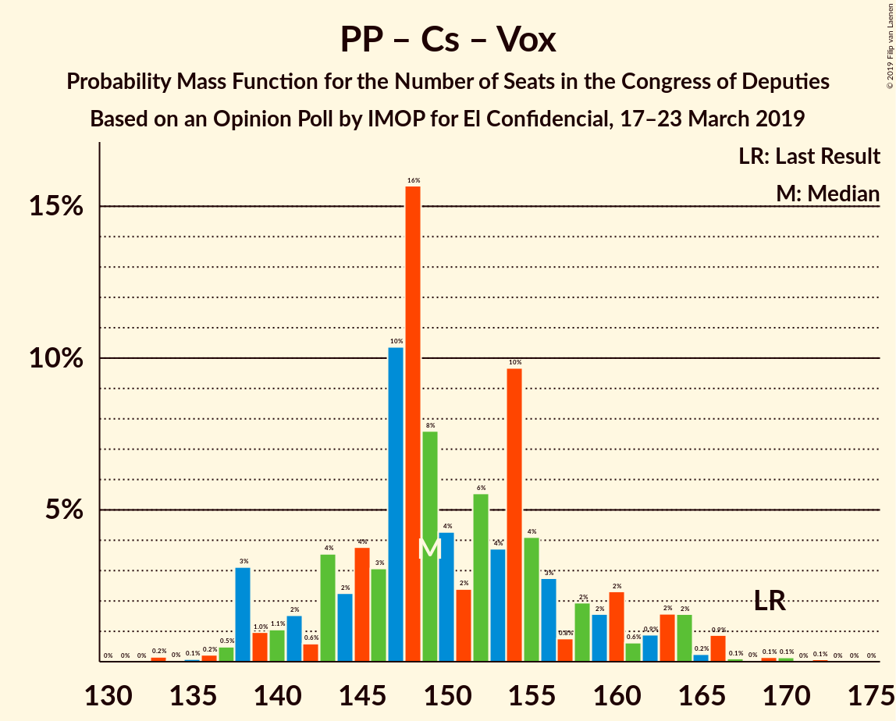
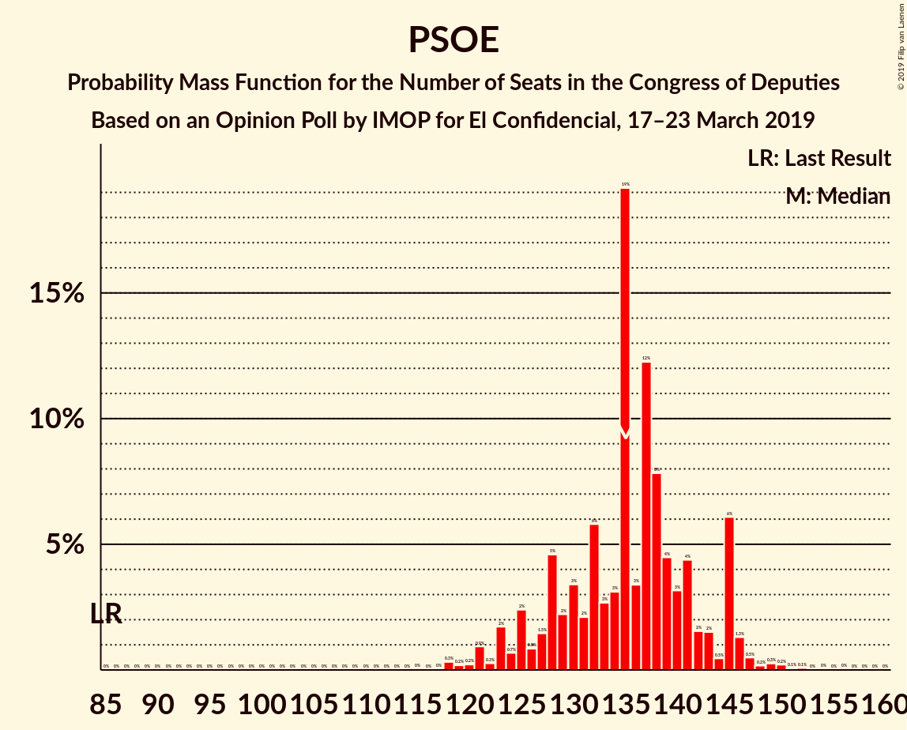
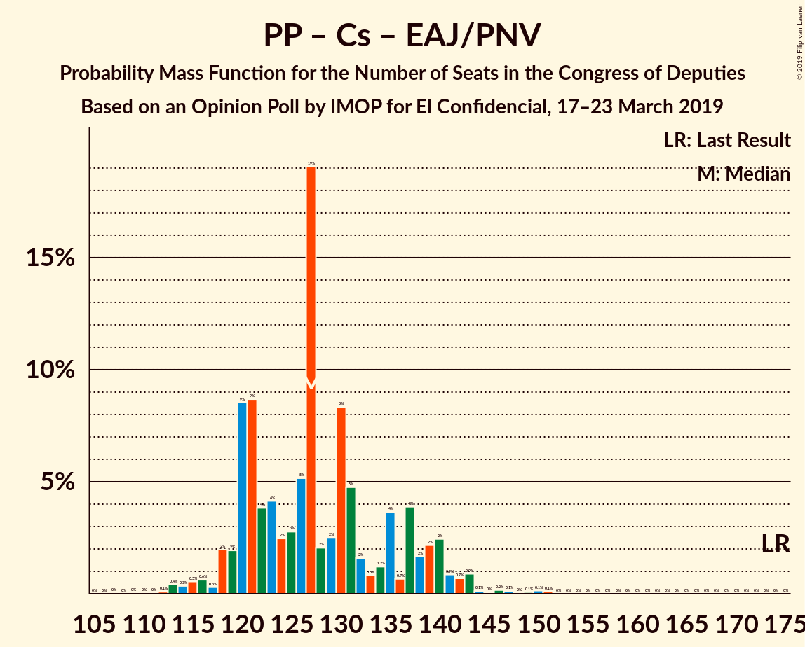

# Opinion Poll by IMOP for El Confidencial, 17–23 March 2019

<a href="#voting-intentions">Voting Intentions</a> | <a href="#seats">Seats</a> | <a href="#coalitions">Coalitions</a> | <a href="#technical-information">Technical Information</a>

## Voting Intentions

### Confidence Intervals

| Party | Last Result | Poll Result | 80% Confidence Interval | 90% Confidence Interval | 95% Confidence Interval | 99% Confidence Interval |
|:-----:|:-----------:|:-----------:|:-----------------------:|:-----------------------:|:-----------------------:|:-----------------------:|
| Partido Socialista Obrero Español | 22.6% | 30.5% | 29.0–32.1% |28.5–32.6% |28.2–33.0% |27.4–33.8% |
| Partido Popular | 33.0% | 19.5% | 18.2–20.9% |17.8–21.3% |17.5–21.7% |16.9–22.4% |
| Ciudadanos–Partido de la Ciudadanía | 13.1% | 14.4% | 13.2–15.6% |12.9–16.0% |12.6–16.3% |12.1–16.9% |
| Unidos Podemos | 21.2% | 12.4% | 11.3–13.6% |11.0–13.9% |10.7–14.2% |10.2–14.8% |
| Vox | 0.2% | 11.0% | 10.0–12.2% |9.7–12.5% |9.5–12.8% |9.0–13.3% |
| Esquerra Republicana de Catalunya–Catalunya Sí | 2.7% | 3.5% | 2.9–4.2% |2.8–4.4% |2.7–4.6% |2.4–5.0% |
| Partido Animalista Contra el Maltrato Animal | 1.2% | 2.1% | 1.7–2.7% |1.5–2.8% |1.4–3.0% |1.3–3.3% |
| Partit Demòcrata Europeu Català | 2.0% | 1.3% | 1.0–1.8% |0.9–1.9% |0.8–2.0% |0.7–2.3% |
| Euzko Alderdi Jeltzalea/Partido Nacionalista Vasco | 1.2% | 1.3% | 1.0–1.8% |0.9–1.9% |0.8–2.0% |0.7–2.3% |
| Euskal Herria Bildu | 0.8% | 1.0% | 0.7–1.4% |0.7–1.6% |0.6–1.7% |0.5–1.9% |

*Note:* The poll result column reflects the actual value used in the calculations. Published results may vary slightly, and in addition be rounded to fewer digits.

## Seats

### Confidence Intervals

| Party | Last Result | Median | 80% Confidence Interval | 90% Confidence Interval | 95% Confidence Interval | 99% Confidence Interval |
|:-----:|:-----------:|:------:|:-----------------------:|:-----------------------:|:-----------------------:|:-----------------------:|
| <a href="#partido-socialista-obrero-español">Partido Socialista Obrero Español</a> | 85 | 138 | 130–142 |126–145 |124–145 |120–152 |
| <a href="#partido-popular">Partido Popular</a> | 137 | 75 | 68–82 |67–85 |67–85 |66–91 |
| <a href="#ciudadanos–partido-de-la-ciudadanía">Ciudadanos–Partido de la Ciudadanía</a> | 32 | 47 | 40–50 |37–51 |37–52 |34–59 |
| <a href="#unidos-podemos">Unidos Podemos</a> | 71 | 31 | 28–35 |28–37 |24–38 |23–41 |
| <a href="#vox">Vox</a> | 0 | 30 | 25–31 |23–34 |22–34 |22–38 |
| <a href="#esquerra-republicana-de-catalunya–catalunya-sí">Esquerra Republicana de Catalunya–Catalunya Sí</a> | 9 | 15 | 14–16 |13–17 |12–18 |11–20 |
| <a href="#partido-animalista-contra-el-maltrato-animal">Partido Animalista Contra el Maltrato Animal</a> | 0 | 1 | 0–1 |0–1 |0–1 |0–1 |
| <a href="#partit-demòcrata-europeu-català">Partit Demòcrata Europeu Català</a> | 8 | 5 | 3–7 |2–7 |2–8 |2–8 |
| <a href="#euzko-alderdi-jeltzalea/partido-nacionalista-vasco">Euzko Alderdi Jeltzalea/Partido Nacionalista Vasco</a> | 5 | 6 | 4–8 |4–9 |4–9 |3–10 |
| <a href="#euskal-herria-bildu">Euskal Herria Bildu</a> | 2 | 5 | 3–7 |2–7 |2–7 |1–9 |

### Partido Socialista Obrero Español

*For a full overview of the results for this party, see the [Partido Socialista Obrero Español](party-partidosocialistaobreroespañol.html) page.*

| Number of Seats | Probability | Accumulated | Special Marks |
|:---------------:|:-----------:|:-----------:|:-------------:|
| 85 | 0% | 100% | Last Result |
| 86 | 0% | 100% |  |
| 87 | 0% | 100% |  |
| 88 | 0% | 100% |  |
| 89 | 0% | 100% |  |
| 90 | 0% | 100% |  |
| 91 | 0% | 100% |  |
| 92 | 0% | 100% |  |
| 93 | 0% | 100% |  |
| 94 | 0% | 100% |  |
| 95 | 0% | 100% |  |
| 96 | 0% | 100% |  |
| 97 | 0% | 100% |  |
| 98 | 0% | 100% |  |
| 99 | 0% | 100% |  |
| 100 | 0% | 100% |  |
| 101 | 0% | 100% |  |
| 102 | 0% | 100% |  |
| 103 | 0% | 100% |  |
| 104 | 0% | 100% |  |
| 105 | 0% | 100% |  |
| 106 | 0% | 100% |  |
| 107 | 0% | 100% |  |
| 108 | 0% | 100% |  |
| 109 | 0% | 100% |  |
| 110 | 0% | 100% |  |
| 111 | 0% | 100% |  |
| 112 | 0.1% | 100% |  |
| 113 | 0% | 99.9% |  |
| 114 | 0% | 99.9% |  |
| 115 | 0% | 99.8% |  |
| 116 | 0% | 99.8% |  |
| 117 | 0% | 99.8% |  |
| 118 | 0.1% | 99.8% |  |
| 119 | 0% | 99.7% |  |
| 120 | 0.4% | 99.7% |  |
| 121 | 0.1% | 99.2% |  |
| 122 | 0.2% | 99.2% |  |
| 123 | 0.4% | 98.9% |  |
| 124 | 3% | 98.6% |  |
| 125 | 0% | 95% |  |
| 126 | 0.3% | 95% |  |
| 127 | 0.4% | 95% |  |
| 128 | 2% | 95% |  |
| 129 | 2% | 93% |  |
| 130 | 6% | 91% |  |
| 131 | 2% | 85% |  |
| 132 | 15% | 83% |  |
| 133 | 0.5% | 68% |  |
| 134 | 6% | 67% |  |
| 135 | 8% | 61% |  |
| 136 | 0.6% | 53% |  |
| 137 | 0.5% | 53% |  |
| 138 | 28% | 52% | Median |
| 139 | 0.7% | 24% |  |
| 140 | 12% | 23% |  |
| 141 | 0.5% | 11% |  |
| 142 | 3% | 11% |  |
| 143 | 0.2% | 8% |  |
| 144 | 0% | 7% |  |
| 145 | 6% | 7% |  |
| 146 | 0.2% | 1.2% |  |
| 147 | 0.3% | 1.0% |  |
| 148 | 0% | 0.7% |  |
| 149 | 0.2% | 0.7% |  |
| 150 | 0% | 0.5% |  |
| 151 | 0% | 0.5% |  |
| 152 | 0.5% | 0.5% |  |
| 153 | 0% | 0.1% |  |
| 154 | 0% | 0% |  |

### Partido Popular

*For a full overview of the results for this party, see the [Partido Popular](party-partidopopular.html) page.*

| Number of Seats | Probability | Accumulated | Special Marks |
|:---------------:|:-----------:|:-----------:|:-------------:|
| 61 | 0.1% | 100% |  |
| 62 | 0% | 99.9% |  |
| 63 | 0% | 99.9% |  |
| 64 | 0% | 99.9% |  |
| 65 | 0.2% | 99.8% |  |
| 66 | 0.6% | 99.7% |  |
| 67 | 6% | 99.1% |  |
| 68 | 26% | 93% |  |
| 69 | 0.4% | 67% |  |
| 70 | 2% | 66% |  |
| 71 | 0.6% | 64% |  |
| 72 | 8% | 63% |  |
| 73 | 3% | 55% |  |
| 74 | 0.2% | 52% |  |
| 75 | 2% | 52% | Median |
| 76 | 5% | 49% |  |
| 77 | 0.2% | 44% |  |
| 78 | 10% | 44% |  |
| 79 | 0.1% | 34% |  |
| 80 | 5% | 34% |  |
| 81 | 0.2% | 29% |  |
| 82 | 21% | 29% |  |
| 83 | 0.6% | 7% |  |
| 84 | 0.7% | 7% |  |
| 85 | 4% | 6% |  |
| 86 | 0.4% | 2% |  |
| 87 | 0.3% | 2% |  |
| 88 | 0.3% | 2% |  |
| 89 | 0% | 1.2% |  |
| 90 | 0.1% | 1.2% |  |
| 91 | 1.0% | 1.1% |  |
| 92 | 0% | 0.1% |  |
| 93 | 0% | 0.1% |  |
| 94 | 0% | 0.1% |  |
| 95 | 0% | 0.1% |  |
| 96 | 0% | 0.1% |  |
| 97 | 0% | 0% |  |
| 98 | 0% | 0% |  |
| 99 | 0% | 0% |  |
| 100 | 0% | 0% |  |
| 101 | 0% | 0% |  |
| 102 | 0% | 0% |  |
| 103 | 0% | 0% |  |
| 104 | 0% | 0% |  |
| 105 | 0% | 0% |  |
| 106 | 0% | 0% |  |
| 107 | 0% | 0% |  |
| 108 | 0% | 0% |  |
| 109 | 0% | 0% |  |
| 110 | 0% | 0% |  |
| 111 | 0% | 0% |  |
| 112 | 0% | 0% |  |
| 113 | 0% | 0% |  |
| 114 | 0% | 0% |  |
| 115 | 0% | 0% |  |
| 116 | 0% | 0% |  |
| 117 | 0% | 0% |  |
| 118 | 0% | 0% |  |
| 119 | 0% | 0% |  |
| 120 | 0% | 0% |  |
| 121 | 0% | 0% |  |
| 122 | 0% | 0% |  |
| 123 | 0% | 0% |  |
| 124 | 0% | 0% |  |
| 125 | 0% | 0% |  |
| 126 | 0% | 0% |  |
| 127 | 0% | 0% |  |
| 128 | 0% | 0% |  |
| 129 | 0% | 0% |  |
| 130 | 0% | 0% |  |
| 131 | 0% | 0% |  |
| 132 | 0% | 0% |  |
| 133 | 0% | 0% |  |
| 134 | 0% | 0% |  |
| 135 | 0% | 0% |  |
| 136 | 0% | 0% |  |
| 137 | 0% | 0% | Last Result |

### Ciudadanos–Partido de la Ciudadanía

*For a full overview of the results for this party, see the [Ciudadanos–Partido de la Ciudadanía](party-ciudadanos–partidodelaciudadanía.html) page.*

| Number of Seats | Probability | Accumulated | Special Marks |
|:---------------:|:-----------:|:-----------:|:-------------:|
| 27 | 0% | 100% |  |
| 28 | 0% | 99.9% |  |
| 29 | 0.1% | 99.9% |  |
| 30 | 0% | 99.9% |  |
| 31 | 0.1% | 99.9% |  |
| 32 | 0.1% | 99.8% | Last Result |
| 33 | 0% | 99.7% |  |
| 34 | 0.8% | 99.7% |  |
| 35 | 0.1% | 98.9% |  |
| 36 | 0.7% | 98.8% |  |
| 37 | 4% | 98% |  |
| 38 | 0.8% | 95% |  |
| 39 | 0.1% | 94% |  |
| 40 | 4% | 94% |  |
| 41 | 0.5% | 89% |  |
| 42 | 11% | 89% |  |
| 43 | 0.1% | 78% |  |
| 44 | 0.9% | 78% |  |
| 45 | 9% | 77% |  |
| 46 | 15% | 68% |  |
| 47 | 4% | 53% | Median |
| 48 | 34% | 49% |  |
| 49 | 2% | 15% |  |
| 50 | 4% | 13% |  |
| 51 | 5% | 9% |  |
| 52 | 2% | 4% |  |
| 53 | 0.1% | 2% |  |
| 54 | 1.3% | 2% |  |
| 55 | 0.4% | 1.1% |  |
| 56 | 0% | 0.7% |  |
| 57 | 0% | 0.7% |  |
| 58 | 0% | 0.7% |  |
| 59 | 0.2% | 0.6% |  |
| 60 | 0.1% | 0.4% |  |
| 61 | 0.2% | 0.3% |  |
| 62 | 0.1% | 0.1% |  |
| 63 | 0% | 0% |  |

### Unidos Podemos

*For a full overview of the results for this party, see the [Unidos Podemos](party-unidospodemos.html) page.*

| Number of Seats | Probability | Accumulated | Special Marks |
|:---------------:|:-----------:|:-----------:|:-------------:|
| 22 | 0.5% | 100% |  |
| 23 | 0.6% | 99.5% |  |
| 24 | 2% | 98.9% |  |
| 25 | 0.4% | 97% |  |
| 26 | 0.3% | 96% |  |
| 27 | 0.4% | 96% |  |
| 28 | 17% | 96% |  |
| 29 | 1.0% | 78% |  |
| 30 | 12% | 77% |  |
| 31 | 26% | 66% | Median |
| 32 | 11% | 39% |  |
| 33 | 5% | 28% |  |
| 34 | 12% | 23% |  |
| 35 | 4% | 11% |  |
| 36 | 2% | 8% |  |
| 37 | 1.2% | 5% |  |
| 38 | 2% | 4% |  |
| 39 | 0.5% | 1.4% |  |
| 40 | 0.4% | 0.9% |  |
| 41 | 0.1% | 0.5% |  |
| 42 | 0.3% | 0.4% |  |
| 43 | 0.1% | 0.1% |  |
| 44 | 0% | 0% |  |
| 45 | 0% | 0% |  |
| 46 | 0% | 0% |  |
| 47 | 0% | 0% |  |
| 48 | 0% | 0% |  |
| 49 | 0% | 0% |  |
| 50 | 0% | 0% |  |
| 51 | 0% | 0% |  |
| 52 | 0% | 0% |  |
| 53 | 0% | 0% |  |
| 54 | 0% | 0% |  |
| 55 | 0% | 0% |  |
| 56 | 0% | 0% |  |
| 57 | 0% | 0% |  |
| 58 | 0% | 0% |  |
| 59 | 0% | 0% |  |
| 60 | 0% | 0% |  |
| 61 | 0% | 0% |  |
| 62 | 0% | 0% |  |
| 63 | 0% | 0% |  |
| 64 | 0% | 0% |  |
| 65 | 0% | 0% |  |
| 66 | 0% | 0% |  |
| 67 | 0% | 0% |  |
| 68 | 0% | 0% |  |
| 69 | 0% | 0% |  |
| 70 | 0% | 0% |  |
| 71 | 0% | 0% | Last Result |

### Vox

*For a full overview of the results for this party, see the [Vox](party-vox.html) page.*

| Number of Seats | Probability | Accumulated | Special Marks |
|:---------------:|:-----------:|:-----------:|:-------------:|
| 0 | 0% | 100% | Last Result |
| 1 | 0% | 100% |  |
| 2 | 0% | 100% |  |
| 3 | 0% | 100% |  |
| 4 | 0% | 100% |  |
| 5 | 0% | 100% |  |
| 6 | 0% | 100% |  |
| 7 | 0% | 100% |  |
| 8 | 0% | 100% |  |
| 9 | 0% | 100% |  |
| 10 | 0% | 100% |  |
| 11 | 0% | 100% |  |
| 12 | 0% | 100% |  |
| 13 | 0% | 100% |  |
| 14 | 0% | 100% |  |
| 15 | 0% | 100% |  |
| 16 | 0% | 100% |  |
| 17 | 0% | 100% |  |
| 18 | 0% | 100% |  |
| 19 | 0.2% | 99.9% |  |
| 20 | 0% | 99.8% |  |
| 21 | 0% | 99.7% |  |
| 22 | 3% | 99.7% |  |
| 23 | 4% | 97% |  |
| 24 | 2% | 93% |  |
| 25 | 9% | 91% |  |
| 26 | 3% | 82% |  |
| 27 | 11% | 79% |  |
| 28 | 2% | 68% |  |
| 29 | 12% | 67% |  |
| 30 | 16% | 55% | Median |
| 31 | 32% | 39% |  |
| 32 | 0.4% | 7% |  |
| 33 | 0.8% | 6% |  |
| 34 | 4% | 6% |  |
| 35 | 0.2% | 1.4% |  |
| 36 | 0.1% | 1.2% |  |
| 37 | 0.6% | 1.1% |  |
| 38 | 0.3% | 0.5% |  |
| 39 | 0.1% | 0.2% |  |
| 40 | 0% | 0.1% |  |
| 41 | 0.1% | 0.1% |  |
| 42 | 0% | 0.1% |  |
| 43 | 0% | 0.1% |  |
| 44 | 0% | 0% |  |

### Esquerra Republicana de Catalunya–Catalunya Sí

*For a full overview of the results for this party, see the [Esquerra Republicana de Catalunya–Catalunya Sí](party-esquerrarepublicanadecatalunya–catalunyasí.html) page.*

| Number of Seats | Probability | Accumulated | Special Marks |
|:---------------:|:-----------:|:-----------:|:-------------:|
| 9 | 0% | 100% | Last Result |
| 10 | 0.2% | 100% |  |
| 11 | 2% | 99.8% |  |
| 12 | 1.5% | 98% |  |
| 13 | 3% | 97% |  |
| 14 | 19% | 94% |  |
| 15 | 47% | 75% | Median |
| 16 | 22% | 28% |  |
| 17 | 3% | 6% |  |
| 18 | 2% | 3% |  |
| 19 | 0.7% | 2% |  |
| 20 | 0.7% | 0.9% |  |
| 21 | 0.2% | 0.2% |  |
| 22 | 0% | 0% |  |

### Partido Animalista Contra el Maltrato Animal

*For a full overview of the results for this party, see the [Partido Animalista Contra el Maltrato Animal](party-partidoanimalistacontraelmaltratoanimal.html) page.*

| Number of Seats | Probability | Accumulated | Special Marks |
|:---------------:|:-----------:|:-----------:|:-------------:|
| 0 | 26% | 100% | Last Result |
| 1 | 74% | 74% | Median |
| 2 | 0.1% | 0.1% |  |
| 3 | 0% | 0% |  |

### Partit Demòcrata Europeu Català

*For a full overview of the results for this party, see the [Partit Demòcrata Europeu Català](party-partitdemòcrataeuropeucatalà.html) page.*

| Number of Seats | Probability | Accumulated | Special Marks |
|:---------------:|:-----------:|:-----------:|:-------------:|
| 1 | 0.4% | 100% |  |
| 2 | 6% | 99.6% |  |
| 3 | 5% | 94% |  |
| 4 | 29% | 89% |  |
| 5 | 20% | 60% | Median |
| 6 | 27% | 40% |  |
| 7 | 8% | 13% |  |
| 8 | 5% | 5% | Last Result |
| 9 | 0.2% | 0.3% |  |
| 10 | 0.1% | 0.2% |  |
| 11 | 0% | 0% |  |

### Euzko Alderdi Jeltzalea/Partido Nacionalista Vasco

*For a full overview of the results for this party, see the [Euzko Alderdi Jeltzalea/Partido Nacionalista Vasco](party-euzkoalderdijeltzaleapartidonacionalistavasco.html) page.*

| Number of Seats | Probability | Accumulated | Special Marks |
|:---------------:|:-----------:|:-----------:|:-------------:|
| 3 | 1.1% | 100% |  |
| 4 | 28% | 98.8% |  |
| 5 | 1.4% | 71% | Last Result |
| 6 | 35% | 70% | Median |
| 7 | 24% | 35% |  |
| 8 | 5% | 12% |  |
| 9 | 5% | 7% |  |
| 10 | 1.2% | 1.2% |  |
| 11 | 0% | 0% |  |

### Euskal Herria Bildu

*For a full overview of the results for this party, see the [Euskal Herria Bildu](party-euskalherriabildu.html) page.*

| Number of Seats | Probability | Accumulated | Special Marks |
|:---------------:|:-----------:|:-----------:|:-------------:|
| 1 | 0.9% | 100% |  |
| 2 | 8% | 99.1% | Last Result |
| 3 | 5% | 91% |  |
| 4 | 27% | 86% |  |
| 5 | 10% | 58% | Median |
| 6 | 19% | 48% |  |
| 7 | 28% | 29% |  |
| 8 | 0.1% | 1.3% |  |
| 9 | 1.1% | 1.2% |  |
| 10 | 0% | 0% |  |

## Coalitions

### Confidence Intervals

| Coalition | Last Result | Median | Majority? | 80% Confidence Interval | 90% Confidence Interval | 95% Confidence Interval | 99% Confidence Interval |
|:---------:|:-----------:|:------:|:---------:|:-----------------------:|:-----------------------:|:-----------------------:|:-----------------------:|
| Partido Socialista Obrero Español – Partido Popular – Ciudadanos–Partido de la Ciudadanía | 254 | 257 | 100% | 253–262 | 250–266 | 249–267 | 243–267 |
| Partido Socialista Obrero Español – Ciudadanos–Partido de la Ciudadanía – Unidos Podemos | 188 | 214 | 100% | 206–222 | 204–222 | 202–222 | 199–226 |
| Partido Socialista Obrero Español – Partido Popular | 222 | 212 | 100% | 206–216 | 206–218 | 202–222 | 197–223 |
| Partido Socialista Obrero Español – Unidos Podemos – Esquerra Republicana de Catalunya–Catalunya Sí – Euzko Alderdi Jeltzalea/Partido Nacionalista Vasco – Partit Demòcrata Europeu Català – Euskal Herria Bildu | 180 | 201 | 100% | 188–205 | 186–210 | 186–210 | 181–210 |
| Partido Socialista Obrero Español – Unidos Podemos – Esquerra Republicana de Catalunya–Catalunya Sí – Euskal Herria Bildu | 167 | 191 | 97% | 179–193 | 176–199 | 173–199 | 169–200 |
| Partido Socialista Obrero Español – Unidos Podemos – Esquerra Republicana de Catalunya–Catalunya Sí – Partit Demòcrata Europeu Català | 173 | 190 | 95% | 178–194 | 176–198 | 175–198 | 171–202 |
| Partido Socialista Obrero Español – Ciudadanos–Partido de la Ciudadanía | 117 | 182 | 89% | 175–190 | 170–190 | 169–190 | 167–194 |
| Partido Socialista Obrero Español – Unidos Podemos – Euzko Alderdi Jeltzalea/Partido Nacionalista Vasco – Euskal Herria Bildu | 163 | 180 | 69% | 171–184 | 168–189 | 168–189 | 161–194 |
| Partido Socialista Obrero Español – Unidos Podemos – Euzko Alderdi Jeltzalea/Partido Nacionalista Vasco | 161 | 173 | 30% | 166–180 | 165–183 | 164–183 | 157–190 |
| Partido Socialista Obrero Español – Unidos Podemos | 156 | 169 | 9% | 160–173 | 158–177 | 158–177 | 151–183 |
| Partido Popular – Ciudadanos–Partido de la Ciudadanía – Vox | 169 | 148 | 0% | 143–160 | 139–162 | 139–163 | 138–167 |
| Partido Socialista Obrero Español | 85 | 138 | 0% | 130–142 | 126–145 | 124–145 | 120–152 |
| Partido Popular – Ciudadanos–Partido de la Ciudadanía – Euzko Alderdi Jeltzalea/Partido Nacionalista Vasco | 174 | 126 | 0% | 119–138 | 118–140 | 118–142 | 113–143 |
| Partido Popular – Ciudadanos–Partido de la Ciudadanía | 169 | 120 | 0% | 113–132 | 112–133 | 112–134 | 107–136 |
| Partido Popular – Vox | 137 | 103 | 0% | 98–112 | 94–116 | 94–116 | 91–118 |
| Partido Popular | 137 | 75 | 0% | 68–82 | 67–85 | 67–85 | 66–91 |

### Partido Socialista Obrero Español – Partido Popular – Ciudadanos–Partido de la Ciudadanía

| Number of Seats | Probability | Accumulated | Special Marks |
|:---------------:|:-----------:|:-----------:|:-------------:|
| 241 | 0% | 100% |  |
| 242 | 0% | 99.9% |  |
| 243 | 0.6% | 99.9% |  |
| 244 | 0.2% | 99.3% |  |
| 245 | 0.1% | 99.1% |  |
| 246 | 0.5% | 99.0% |  |
| 247 | 0.3% | 98% |  |
| 248 | 0.5% | 98% |  |
| 249 | 0.2% | 98% |  |
| 250 | 3% | 97% |  |
| 251 | 2% | 95% |  |
| 252 | 2% | 93% |  |
| 253 | 3% | 91% |  |
| 254 | 27% | 88% | Last Result |
| 255 | 10% | 61% |  |
| 256 | 1.1% | 51% |  |
| 257 | 9% | 50% |  |
| 258 | 0.6% | 41% |  |
| 259 | 5% | 41% |  |
| 260 | 24% | 36% | Median |
| 261 | 0.2% | 12% |  |
| 262 | 4% | 12% |  |
| 263 | 1.0% | 8% |  |
| 264 | 2% | 7% |  |
| 265 | 0.2% | 6% |  |
| 266 | 3% | 5% |  |
| 267 | 2% | 3% |  |
| 268 | 0.1% | 0.5% |  |
| 269 | 0% | 0.4% |  |
| 270 | 0% | 0.4% |  |
| 271 | 0.2% | 0.3% |  |
| 272 | 0.1% | 0.2% |  |
| 273 | 0.1% | 0.1% |  |
| 274 | 0% | 0% |  |

### Partido Socialista Obrero Español – Ciudadanos–Partido de la Ciudadanía – Unidos Podemos

| Number of Seats | Probability | Accumulated | Special Marks |
|:---------------:|:-----------:|:-----------:|:-------------:|
| 188 | 0% | 100% | Last Result |
| 189 | 0% | 100% |  |
| 190 | 0% | 100% |  |
| 191 | 0.1% | 100% |  |
| 192 | 0.1% | 99.8% |  |
| 193 | 0% | 99.8% |  |
| 194 | 0% | 99.8% |  |
| 195 | 0% | 99.8% |  |
| 196 | 0% | 99.7% |  |
| 197 | 0% | 99.7% |  |
| 198 | 0.1% | 99.7% |  |
| 199 | 0.1% | 99.6% |  |
| 200 | 1.1% | 99.5% |  |
| 201 | 0.6% | 98% |  |
| 202 | 2% | 98% |  |
| 203 | 0.7% | 96% |  |
| 204 | 2% | 95% |  |
| 205 | 0.5% | 93% |  |
| 206 | 14% | 93% |  |
| 207 | 6% | 79% |  |
| 208 | 0.8% | 73% |  |
| 209 | 5% | 72% |  |
| 210 | 2% | 67% |  |
| 211 | 8% | 65% |  |
| 212 | 0.9% | 57% |  |
| 213 | 3% | 57% |  |
| 214 | 5% | 54% |  |
| 215 | 2% | 49% |  |
| 216 | 0.3% | 47% | Median |
| 217 | 26% | 47% |  |
| 218 | 8% | 21% |  |
| 219 | 0.7% | 13% |  |
| 220 | 1.3% | 12% |  |
| 221 | 0.4% | 11% |  |
| 222 | 8% | 11% |  |
| 223 | 0.1% | 2% |  |
| 224 | 0.3% | 2% |  |
| 225 | 0.6% | 2% |  |
| 226 | 0.8% | 1.2% |  |
| 227 | 0.2% | 0.4% |  |
| 228 | 0.1% | 0.2% |  |
| 229 | 0% | 0.1% |  |
| 230 | 0% | 0.1% |  |
| 231 | 0.1% | 0.1% |  |
| 232 | 0% | 0% |  |

### Partido Socialista Obrero Español – Partido Popular

| Number of Seats | Probability | Accumulated | Special Marks |
|:---------------:|:-----------:|:-----------:|:-------------:|
| 194 | 0% | 100% |  |
| 195 | 0.3% | 99.9% |  |
| 196 | 0% | 99.6% |  |
| 197 | 0.4% | 99.6% |  |
| 198 | 0.2% | 99.2% |  |
| 199 | 0.1% | 99.0% |  |
| 200 | 0.2% | 99.0% |  |
| 201 | 0.2% | 98.8% |  |
| 202 | 1.4% | 98.6% |  |
| 203 | 0.6% | 97% |  |
| 204 | 1.3% | 97% |  |
| 205 | 0.2% | 95% |  |
| 206 | 30% | 95% |  |
| 207 | 0.8% | 65% |  |
| 208 | 0.5% | 64% |  |
| 209 | 0.8% | 64% |  |
| 210 | 4% | 63% |  |
| 211 | 4% | 59% |  |
| 212 | 15% | 55% |  |
| 213 | 8% | 41% | Median |
| 214 | 17% | 33% |  |
| 215 | 4% | 16% |  |
| 216 | 5% | 12% |  |
| 217 | 0.3% | 7% |  |
| 218 | 2% | 7% |  |
| 219 | 0.1% | 4% |  |
| 220 | 1.1% | 4% |  |
| 221 | 0.6% | 3% |  |
| 222 | 2% | 3% | Last Result |
| 223 | 0.7% | 1.1% |  |
| 224 | 0% | 0.4% |  |
| 225 | 0.2% | 0.4% |  |
| 226 | 0% | 0.2% |  |
| 227 | 0% | 0.1% |  |
| 228 | 0% | 0.1% |  |
| 229 | 0% | 0.1% |  |
| 230 | 0% | 0.1% |  |
| 231 | 0% | 0.1% |  |
| 232 | 0% | 0.1% |  |
| 233 | 0% | 0.1% |  |
| 234 | 0% | 0.1% |  |
| 235 | 0.1% | 0.1% |  |
| 236 | 0% | 0% |  |

### Partido Socialista Obrero Español – Unidos Podemos – Esquerra Republicana de Catalunya–Catalunya Sí – Euzko Alderdi Jeltzalea/Partido Nacionalista Vasco – Partit Demòcrata Europeu Català – Euskal Herria Bildu

| Number of Seats | Probability | Accumulated | Special Marks |
|:---------------:|:-----------:|:-----------:|:-------------:|
| 178 | 0.3% | 100% |  |
| 179 | 0% | 99.7% |  |
| 180 | 0.1% | 99.6% | Last Result |
| 181 | 0.1% | 99.6% |  |
| 182 | 0% | 99.5% |  |
| 183 | 0.3% | 99.5% |  |
| 184 | 0.1% | 99.1% |  |
| 185 | 0% | 99.1% |  |
| 186 | 6% | 99.0% |  |
| 187 | 1.4% | 93% |  |
| 188 | 3% | 92% |  |
| 189 | 0.4% | 89% |  |
| 190 | 14% | 89% |  |
| 191 | 0.6% | 75% |  |
| 192 | 0.6% | 74% |  |
| 193 | 1.5% | 74% |  |
| 194 | 3% | 72% |  |
| 195 | 0.6% | 69% |  |
| 196 | 0.5% | 68% |  |
| 197 | 0.6% | 68% |  |
| 198 | 0.5% | 67% |  |
| 199 | 8% | 67% |  |
| 200 | 6% | 59% | Median |
| 201 | 30% | 53% |  |
| 202 | 3% | 23% |  |
| 203 | 0.4% | 20% |  |
| 204 | 9% | 20% |  |
| 205 | 3% | 11% |  |
| 206 | 0.1% | 8% |  |
| 207 | 0.2% | 8% |  |
| 208 | 0.1% | 8% |  |
| 209 | 0.9% | 8% |  |
| 210 | 7% | 7% |  |
| 211 | 0.1% | 0.4% |  |
| 212 | 0.2% | 0.3% |  |
| 213 | 0% | 0.1% |  |
| 214 | 0.1% | 0.1% |  |
| 215 | 0% | 0% |  |

### Partido Socialista Obrero Español – Unidos Podemos – Esquerra Republicana de Catalunya–Catalunya Sí – Euskal Herria Bildu

| Number of Seats | Probability | Accumulated | Special Marks |
|:---------------:|:-----------:|:-----------:|:-------------:|
| 167 | 0.2% | 100% | Last Result |
| 168 | 0.2% | 99.7% |  |
| 169 | 0.2% | 99.6% |  |
| 170 | 0% | 99.3% |  |
| 171 | 0.1% | 99.3% |  |
| 172 | 0.1% | 99.2% |  |
| 173 | 2% | 99.1% |  |
| 174 | 0% | 97% |  |
| 175 | 0.1% | 97% |  |
| 176 | 5% | 97% | Majority |
| 177 | 0.1% | 92% |  |
| 178 | 0.8% | 92% |  |
| 179 | 17% | 91% |  |
| 180 | 1.1% | 74% |  |
| 181 | 2% | 73% |  |
| 182 | 0% | 72% |  |
| 183 | 4% | 72% |  |
| 184 | 0.2% | 68% |  |
| 185 | 0.4% | 67% |  |
| 186 | 0.2% | 67% |  |
| 187 | 0.5% | 67% |  |
| 188 | 8% | 66% |  |
| 189 | 7% | 58% | Median |
| 190 | 0.2% | 51% |  |
| 191 | 38% | 51% |  |
| 192 | 3% | 13% |  |
| 193 | 0.5% | 10% |  |
| 194 | 1.2% | 10% |  |
| 195 | 0.1% | 8% |  |
| 196 | 0.2% | 8% |  |
| 197 | 0% | 8% |  |
| 198 | 0.6% | 8% |  |
| 199 | 6% | 7% |  |
| 200 | 0.8% | 1.2% |  |
| 201 | 0% | 0.4% |  |
| 202 | 0.1% | 0.3% |  |
| 203 | 0% | 0.2% |  |
| 204 | 0.1% | 0.2% |  |
| 205 | 0.1% | 0.1% |  |
| 206 | 0% | 0% |  |

### Partido Socialista Obrero Español – Unidos Podemos – Esquerra Republicana de Catalunya–Catalunya Sí – Partit Demòcrata Europeu Català

| Number of Seats | Probability | Accumulated | Special Marks |
|:---------------:|:-----------:|:-----------:|:-------------:|
| 166 | 0.1% | 100% |  |
| 167 | 0.1% | 99.9% |  |
| 168 | 0.2% | 99.8% |  |
| 169 | 0% | 99.6% |  |
| 170 | 0% | 99.6% |  |
| 171 | 0.1% | 99.5% |  |
| 172 | 0.1% | 99.5% |  |
| 173 | 0.1% | 99.3% | Last Result |
| 174 | 0.1% | 99.3% |  |
| 175 | 4% | 99.1% |  |
| 176 | 2% | 95% | Majority |
| 177 | 0.3% | 93% |  |
| 178 | 4% | 93% |  |
| 179 | 14% | 89% |  |
| 180 | 1.2% | 75% |  |
| 181 | 0% | 74% |  |
| 182 | 5% | 74% |  |
| 183 | 0.3% | 69% |  |
| 184 | 0.8% | 69% |  |
| 185 | 0.3% | 68% |  |
| 186 | 0.3% | 68% |  |
| 187 | 4% | 67% |  |
| 188 | 2% | 63% |  |
| 189 | 9% | 61% | Median |
| 190 | 29% | 52% |  |
| 191 | 3% | 23% |  |
| 192 | 8% | 20% |  |
| 193 | 1.1% | 12% |  |
| 194 | 2% | 11% |  |
| 195 | 0.1% | 9% |  |
| 196 | 0.3% | 8% |  |
| 197 | 0.9% | 8% |  |
| 198 | 6% | 7% |  |
| 199 | 0.6% | 2% |  |
| 200 | 0.1% | 1.0% |  |
| 201 | 0.1% | 0.8% |  |
| 202 | 0.6% | 0.7% |  |
| 203 | 0% | 0.1% |  |
| 204 | 0% | 0.1% |  |
| 205 | 0% | 0.1% |  |
| 206 | 0% | 0% |  |

### Partido Socialista Obrero Español – Ciudadanos–Partido de la Ciudadanía

| Number of Seats | Probability | Accumulated | Special Marks |
|:---------------:|:-----------:|:-----------:|:-------------:|
| 117 | 0% | 100% | Last Result |
| 118 | 0% | 100% |  |
| 119 | 0% | 100% |  |
| 120 | 0% | 100% |  |
| 121 | 0% | 100% |  |
| 122 | 0% | 100% |  |
| 123 | 0% | 100% |  |
| 124 | 0% | 100% |  |
| 125 | 0% | 100% |  |
| 126 | 0% | 100% |  |
| 127 | 0% | 100% |  |
| 128 | 0% | 100% |  |
| 129 | 0% | 100% |  |
| 130 | 0% | 100% |  |
| 131 | 0% | 100% |  |
| 132 | 0% | 100% |  |
| 133 | 0% | 100% |  |
| 134 | 0% | 100% |  |
| 135 | 0% | 100% |  |
| 136 | 0% | 100% |  |
| 137 | 0% | 100% |  |
| 138 | 0% | 100% |  |
| 139 | 0% | 100% |  |
| 140 | 0% | 100% |  |
| 141 | 0% | 100% |  |
| 142 | 0% | 100% |  |
| 143 | 0% | 100% |  |
| 144 | 0% | 100% |  |
| 145 | 0% | 100% |  |
| 146 | 0% | 100% |  |
| 147 | 0% | 100% |  |
| 148 | 0% | 100% |  |
| 149 | 0% | 100% |  |
| 150 | 0% | 100% |  |
| 151 | 0% | 100% |  |
| 152 | 0% | 100% |  |
| 153 | 0% | 100% |  |
| 154 | 0% | 100% |  |
| 155 | 0% | 100% |  |
| 156 | 0.1% | 100% |  |
| 157 | 0% | 99.9% |  |
| 158 | 0% | 99.9% |  |
| 159 | 0% | 99.9% |  |
| 160 | 0% | 99.9% |  |
| 161 | 0% | 99.9% |  |
| 162 | 0.1% | 99.9% |  |
| 163 | 0% | 99.8% |  |
| 164 | 0% | 99.8% |  |
| 165 | 0.1% | 99.7% |  |
| 166 | 0.1% | 99.7% |  |
| 167 | 0.4% | 99.6% |  |
| 168 | 1.1% | 99.2% |  |
| 169 | 2% | 98% |  |
| 170 | 3% | 96% |  |
| 171 | 0.4% | 94% |  |
| 172 | 0.1% | 93% |  |
| 173 | 0.3% | 93% |  |
| 174 | 1.1% | 93% |  |
| 175 | 3% | 92% |  |
| 176 | 1.1% | 89% | Majority |
| 177 | 12% | 88% |  |
| 178 | 15% | 76% |  |
| 179 | 5% | 61% |  |
| 180 | 3% | 56% |  |
| 181 | 1.3% | 52% |  |
| 182 | 2% | 51% |  |
| 183 | 0.1% | 49% |  |
| 184 | 1.3% | 49% |  |
| 185 | 2% | 47% | Median |
| 186 | 26% | 45% |  |
| 187 | 0.4% | 19% |  |
| 188 | 8% | 19% |  |
| 189 | 0.7% | 11% |  |
| 190 | 9% | 10% |  |
| 191 | 0.4% | 2% |  |
| 192 | 0.4% | 1.4% |  |
| 193 | 0.2% | 1.1% |  |
| 194 | 0.5% | 0.9% |  |
| 195 | 0.2% | 0.5% |  |
| 196 | 0% | 0.3% |  |
| 197 | 0.2% | 0.3% |  |
| 198 | 0% | 0% |  |

### Partido Socialista Obrero Español – Unidos Podemos – Euzko Alderdi Jeltzalea/Partido Nacionalista Vasco – Euskal Herria Bildu

| Number of Seats | Probability | Accumulated | Special Marks |
|:---------------:|:-----------:|:-----------:|:-------------:|
| 157 | 0% | 100% |  |
| 158 | 0% | 99.9% |  |
| 159 | 0.2% | 99.9% |  |
| 160 | 0.1% | 99.7% |  |
| 161 | 0.5% | 99.6% |  |
| 162 | 0% | 99.2% |  |
| 163 | 0% | 99.1% | Last Result |
| 164 | 0.2% | 99.1% |  |
| 165 | 0.3% | 98.9% |  |
| 166 | 0% | 98.7% |  |
| 167 | 0.2% | 98.6% |  |
| 168 | 6% | 98% |  |
| 169 | 0.6% | 92% |  |
| 170 | 0.5% | 92% |  |
| 171 | 17% | 91% |  |
| 172 | 2% | 74% |  |
| 173 | 1.4% | 73% |  |
| 174 | 0.5% | 71% |  |
| 175 | 1.2% | 71% |  |
| 176 | 2% | 69% | Majority |
| 177 | 0.3% | 68% |  |
| 178 | 1.0% | 67% |  |
| 179 | 0.8% | 66% |  |
| 180 | 33% | 66% | Median |
| 181 | 14% | 32% |  |
| 182 | 6% | 19% |  |
| 183 | 3% | 13% |  |
| 184 | 0.6% | 10% |  |
| 185 | 0.7% | 10% |  |
| 186 | 0.5% | 9% |  |
| 187 | 0.3% | 9% |  |
| 188 | 0.5% | 8% |  |
| 189 | 6% | 8% |  |
| 190 | 0.1% | 2% |  |
| 191 | 0.5% | 1.4% |  |
| 192 | 0.1% | 0.9% |  |
| 193 | 0.2% | 0.8% |  |
| 194 | 0.6% | 0.7% |  |
| 195 | 0% | 0.1% |  |
| 196 | 0% | 0% |  |

### Partido Socialista Obrero Español – Unidos Podemos – Euzko Alderdi Jeltzalea/Partido Nacionalista Vasco

| Number of Seats | Probability | Accumulated | Special Marks |
|:---------------:|:-----------:|:-----------:|:-------------:|
| 152 | 0% | 100% |  |
| 153 | 0.1% | 99.9% |  |
| 154 | 0.1% | 99.8% |  |
| 155 | 0.1% | 99.7% |  |
| 156 | 0% | 99.6% |  |
| 157 | 0.2% | 99.6% |  |
| 158 | 0.2% | 99.4% |  |
| 159 | 0.3% | 99.2% |  |
| 160 | 0.1% | 98.9% |  |
| 161 | 0.8% | 98.8% | Last Result |
| 162 | 0.1% | 98% |  |
| 163 | 0.1% | 98% |  |
| 164 | 0.4% | 98% |  |
| 165 | 3% | 97% |  |
| 166 | 6% | 94% |  |
| 167 | 15% | 89% |  |
| 168 | 0.8% | 73% |  |
| 169 | 2% | 73% |  |
| 170 | 0.2% | 71% |  |
| 171 | 2% | 71% |  |
| 172 | 2% | 68% |  |
| 173 | 26% | 66% |  |
| 174 | 0.4% | 40% |  |
| 175 | 10% | 40% | Median |
| 176 | 10% | 30% | Majority |
| 177 | 2% | 20% |  |
| 178 | 3% | 17% |  |
| 179 | 1.2% | 14% |  |
| 180 | 4% | 13% |  |
| 181 | 0.5% | 9% |  |
| 182 | 0.9% | 9% |  |
| 183 | 6% | 8% |  |
| 184 | 0.2% | 2% |  |
| 185 | 0.2% | 2% |  |
| 186 | 0.2% | 1.5% |  |
| 187 | 0.1% | 1.3% |  |
| 188 | 0% | 1.2% |  |
| 189 | 0.6% | 1.2% |  |
| 190 | 0.4% | 0.6% |  |
| 191 | 0% | 0.1% |  |
| 192 | 0.1% | 0.1% |  |
| 193 | 0% | 0% |  |

### Partido Socialista Obrero Español – Unidos Podemos

| Number of Seats | Probability | Accumulated | Special Marks |
|:---------------:|:-----------:|:-----------:|:-------------:|
| 146 | 0.1% | 100% |  |
| 147 | 0.1% | 99.9% |  |
| 148 | 0.2% | 99.8% |  |
| 149 | 0.1% | 99.7% |  |
| 150 | 0% | 99.6% |  |
| 151 | 0.3% | 99.6% |  |
| 152 | 0.2% | 99.3% |  |
| 153 | 0.3% | 99.2% |  |
| 154 | 0% | 98.9% |  |
| 155 | 0.2% | 98.8% |  |
| 156 | 0.1% | 98.6% | Last Result |
| 157 | 0.9% | 98.5% |  |
| 158 | 5% | 98% |  |
| 159 | 1.1% | 93% |  |
| 160 | 18% | 92% |  |
| 161 | 1.0% | 74% |  |
| 162 | 1.4% | 73% |  |
| 163 | 1.3% | 71% |  |
| 164 | 2% | 70% |  |
| 165 | 0.8% | 68% |  |
| 166 | 0.3% | 67% |  |
| 167 | 0.1% | 67% |  |
| 168 | 1.3% | 67% |  |
| 169 | 38% | 65% | Median |
| 170 | 11% | 27% |  |
| 171 | 3% | 16% |  |
| 172 | 3% | 13% |  |
| 173 | 0.3% | 10% |  |
| 174 | 1.0% | 10% |  |
| 175 | 0.5% | 9% |  |
| 176 | 0.2% | 9% | Majority |
| 177 | 7% | 8% |  |
| 178 | 0.3% | 2% |  |
| 179 | 0.1% | 2% |  |
| 180 | 0.2% | 1.5% |  |
| 181 | 0.1% | 1.3% |  |
| 182 | 0.1% | 1.3% |  |
| 183 | 1.0% | 1.2% |  |
| 184 | 0% | 0.1% |  |
| 185 | 0% | 0.1% |  |
| 186 | 0.1% | 0.1% |  |
| 187 | 0% | 0% |  |

### Partido Popular – Ciudadanos–Partido de la Ciudadanía – Vox

| Number of Seats | Probability | Accumulated | Special Marks |
|:---------------:|:-----------:|:-----------:|:-------------:|
| 134 | 0.1% | 100% |  |
| 135 | 0% | 99.9% |  |
| 136 | 0.2% | 99.9% |  |
| 137 | 0% | 99.7% |  |
| 138 | 1.2% | 99.7% |  |
| 139 | 6% | 98% |  |
| 140 | 0.8% | 93% |  |
| 141 | 0.1% | 92% |  |
| 142 | 0.2% | 92% |  |
| 143 | 3% | 92% |  |
| 144 | 1.3% | 89% |  |
| 145 | 8% | 88% |  |
| 146 | 3% | 80% |  |
| 147 | 27% | 77% |  |
| 148 | 10% | 51% |  |
| 149 | 8% | 41% |  |
| 150 | 0.6% | 33% |  |
| 151 | 0.2% | 33% |  |
| 152 | 0.5% | 32% | Median |
| 153 | 0.4% | 32% |  |
| 154 | 3% | 31% |  |
| 155 | 0.3% | 28% |  |
| 156 | 1.3% | 28% |  |
| 157 | 1.1% | 26% |  |
| 158 | 14% | 25% |  |
| 159 | 0.4% | 12% |  |
| 160 | 3% | 11% |  |
| 161 | 1.4% | 8% |  |
| 162 | 2% | 7% |  |
| 163 | 4% | 4% |  |
| 164 | 0% | 0.9% |  |
| 165 | 0.3% | 0.9% |  |
| 166 | 0.1% | 0.6% |  |
| 167 | 0.1% | 0.5% |  |
| 168 | 0% | 0.4% |  |
| 169 | 0% | 0.4% | Last Result |
| 170 | 0.3% | 0.3% |  |
| 171 | 0% | 0% |  |

### Partido Socialista Obrero Español

| Number of Seats | Probability | Accumulated | Special Marks |
|:---------------:|:-----------:|:-----------:|:-------------:|
| 85 | 0% | 100% | Last Result |
| 86 | 0% | 100% |  |
| 87 | 0% | 100% |  |
| 88 | 0% | 100% |  |
| 89 | 0% | 100% |  |
| 90 | 0% | 100% |  |
| 91 | 0% | 100% |  |
| 92 | 0% | 100% |  |
| 93 | 0% | 100% |  |
| 94 | 0% | 100% |  |
| 95 | 0% | 100% |  |
| 96 | 0% | 100% |  |
| 97 | 0% | 100% |  |
| 98 | 0% | 100% |  |
| 99 | 0% | 100% |  |
| 100 | 0% | 100% |  |
| 101 | 0% | 100% |  |
| 102 | 0% | 100% |  |
| 103 | 0% | 100% |  |
| 104 | 0% | 100% |  |
| 105 | 0% | 100% |  |
| 106 | 0% | 100% |  |
| 107 | 0% | 100% |  |
| 108 | 0% | 100% |  |
| 109 | 0% | 100% |  |
| 110 | 0% | 100% |  |
| 111 | 0% | 100% |  |
| 112 | 0.1% | 100% |  |
| 113 | 0% | 99.9% |  |
| 114 | 0% | 99.9% |  |
| 115 | 0% | 99.8% |  |
| 116 | 0% | 99.8% |  |
| 117 | 0% | 99.8% |  |
| 118 | 0.1% | 99.8% |  |
| 119 | 0% | 99.7% |  |
| 120 | 0.4% | 99.7% |  |
| 121 | 0.1% | 99.2% |  |
| 122 | 0.2% | 99.2% |  |
| 123 | 0.4% | 98.9% |  |
| 124 | 3% | 98.6% |  |
| 125 | 0% | 95% |  |
| 126 | 0.3% | 95% |  |
| 127 | 0.4% | 95% |  |
| 128 | 2% | 95% |  |
| 129 | 2% | 93% |  |
| 130 | 6% | 91% |  |
| 131 | 2% | 85% |  |
| 132 | 15% | 83% |  |
| 133 | 0.5% | 68% |  |
| 134 | 6% | 67% |  |
| 135 | 8% | 61% |  |
| 136 | 0.6% | 53% |  |
| 137 | 0.5% | 53% |  |
| 138 | 28% | 52% | Median |
| 139 | 0.7% | 24% |  |
| 140 | 12% | 23% |  |
| 141 | 0.5% | 11% |  |
| 142 | 3% | 11% |  |
| 143 | 0.2% | 8% |  |
| 144 | 0% | 7% |  |
| 145 | 6% | 7% |  |
| 146 | 0.2% | 1.2% |  |
| 147 | 0.3% | 1.0% |  |
| 148 | 0% | 0.7% |  |
| 149 | 0.2% | 0.7% |  |
| 150 | 0% | 0.5% |  |
| 151 | 0% | 0.5% |  |
| 152 | 0.5% | 0.5% |  |
| 153 | 0% | 0.1% |  |
| 154 | 0% | 0% |  |

### Partido Popular – Ciudadanos–Partido de la Ciudadanía – Euzko Alderdi Jeltzalea/Partido Nacionalista Vasco

| Number of Seats | Probability | Accumulated | Special Marks |
|:---------------:|:-----------:|:-----------:|:-------------:|
| 107 | 0.1% | 100% |  |
| 108 | 0% | 99.9% |  |
| 109 | 0.1% | 99.9% |  |
| 110 | 0% | 99.9% |  |
| 111 | 0% | 99.9% |  |
| 112 | 0% | 99.8% |  |
| 113 | 0.7% | 99.8% |  |
| 114 | 0.2% | 99.1% |  |
| 115 | 0% | 98.9% |  |
| 116 | 0.3% | 98.9% |  |
| 117 | 0.1% | 98.5% |  |
| 118 | 6% | 98% |  |
| 119 | 3% | 93% |  |
| 120 | 26% | 89% |  |
| 121 | 3% | 63% |  |
| 122 | 0.2% | 60% |  |
| 123 | 0.2% | 59% |  |
| 124 | 0.7% | 59% |  |
| 125 | 0.1% | 58% |  |
| 126 | 17% | 58% |  |
| 127 | 4% | 41% |  |
| 128 | 0.1% | 37% | Median |
| 129 | 2% | 37% |  |
| 130 | 1.4% | 36% |  |
| 131 | 0.5% | 34% |  |
| 132 | 0.7% | 34% |  |
| 133 | 0.4% | 33% |  |
| 134 | 6% | 33% |  |
| 135 | 14% | 27% |  |
| 136 | 0.2% | 13% |  |
| 137 | 1.2% | 13% |  |
| 138 | 4% | 12% |  |
| 139 | 0.3% | 8% |  |
| 140 | 3% | 8% |  |
| 141 | 2% | 5% |  |
| 142 | 0.9% | 3% |  |
| 143 | 1.2% | 2% |  |
| 144 | 0.1% | 0.4% |  |
| 145 | 0% | 0.3% |  |
| 146 | 0% | 0.3% |  |
| 147 | 0% | 0.3% |  |
| 148 | 0% | 0.2% |  |
| 149 | 0.1% | 0.2% |  |
| 150 | 0% | 0.1% |  |
| 151 | 0% | 0% |  |
| 152 | 0% | 0% |  |
| 153 | 0% | 0% |  |
| 154 | 0% | 0% |  |
| 155 | 0% | 0% |  |
| 156 | 0% | 0% |  |
| 157 | 0% | 0% |  |
| 158 | 0% | 0% |  |
| 159 | 0% | 0% |  |
| 160 | 0% | 0% |  |
| 161 | 0% | 0% |  |
| 162 | 0% | 0% |  |
| 163 | 0% | 0% |  |
| 164 | 0% | 0% |  |
| 165 | 0% | 0% |  |
| 166 | 0% | 0% |  |
| 167 | 0% | 0% |  |
| 168 | 0% | 0% |  |
| 169 | 0% | 0% |  |
| 170 | 0% | 0% |  |
| 171 | 0% | 0% |  |
| 172 | 0% | 0% |  |
| 173 | 0% | 0% |  |
| 174 | 0% | 0% | Last Result |

### Partido Popular – Ciudadanos–Partido de la Ciudadanía

| Number of Seats | Probability | Accumulated | Special Marks |
|:---------------:|:-----------:|:-----------:|:-------------:|
| 101 | 0% | 100% |  |
| 102 | 0% | 99.9% |  |
| 103 | 0% | 99.9% |  |
| 104 | 0% | 99.9% |  |
| 105 | 0% | 99.9% |  |
| 106 | 0.1% | 99.8% |  |
| 107 | 0.7% | 99.8% |  |
| 108 | 0.2% | 99.1% |  |
| 109 | 0.1% | 98.9% |  |
| 110 | 0% | 98.8% |  |
| 111 | 0.3% | 98.8% |  |
| 112 | 6% | 98% |  |
| 113 | 3% | 92% |  |
| 114 | 0.8% | 89% |  |
| 115 | 2% | 88% |  |
| 116 | 27% | 86% |  |
| 117 | 0.1% | 59% |  |
| 118 | 1.3% | 59% |  |
| 119 | 0.8% | 58% |  |
| 120 | 18% | 57% |  |
| 121 | 2% | 39% |  |
| 122 | 3% | 38% | Median |
| 123 | 0.2% | 35% |  |
| 124 | 0.7% | 35% |  |
| 125 | 4% | 34% |  |
| 126 | 4% | 31% |  |
| 127 | 0.3% | 27% |  |
| 128 | 15% | 27% |  |
| 129 | 0.1% | 12% |  |
| 130 | 0.3% | 12% |  |
| 131 | 0.3% | 12% |  |
| 132 | 4% | 11% |  |
| 133 | 5% | 8% |  |
| 134 | 0.6% | 3% |  |
| 135 | 0.1% | 2% |  |
| 136 | 2% | 2% |  |
| 137 | 0.1% | 0.5% |  |
| 138 | 0.1% | 0.4% |  |
| 139 | 0% | 0.3% |  |
| 140 | 0.1% | 0.3% |  |
| 141 | 0% | 0.2% |  |
| 142 | 0% | 0.2% |  |
| 143 | 0.1% | 0.2% |  |
| 144 | 0% | 0.1% |  |
| 145 | 0% | 0% |  |
| 146 | 0% | 0% |  |
| 147 | 0% | 0% |  |
| 148 | 0% | 0% |  |
| 149 | 0% | 0% |  |
| 150 | 0% | 0% |  |
| 151 | 0% | 0% |  |
| 152 | 0% | 0% |  |
| 153 | 0% | 0% |  |
| 154 | 0% | 0% |  |
| 155 | 0% | 0% |  |
| 156 | 0% | 0% |  |
| 157 | 0% | 0% |  |
| 158 | 0% | 0% |  |
| 159 | 0% | 0% |  |
| 160 | 0% | 0% |  |
| 161 | 0% | 0% |  |
| 162 | 0% | 0% |  |
| 163 | 0% | 0% |  |
| 164 | 0% | 0% |  |
| 165 | 0% | 0% |  |
| 166 | 0% | 0% |  |
| 167 | 0% | 0% |  |
| 168 | 0% | 0% |  |
| 169 | 0% | 0% | Last Result |

### Partido Popular – Vox

| Number of Seats | Probability | Accumulated | Special Marks |
|:---------------:|:-----------:|:-----------:|:-------------:|
| 89 | 0% | 100% |  |
| 90 | 0% | 99.9% |  |
| 91 | 0.6% | 99.9% |  |
| 92 | 0.1% | 99.3% |  |
| 93 | 0.1% | 99.1% |  |
| 94 | 6% | 99.1% |  |
| 95 | 0.3% | 93% |  |
| 96 | 2% | 93% |  |
| 97 | 0.4% | 91% |  |
| 98 | 3% | 91% |  |
| 99 | 26% | 88% |  |
| 100 | 0.8% | 62% |  |
| 101 | 8% | 61% |  |
| 102 | 2% | 53% |  |
| 103 | 11% | 50% |  |
| 104 | 2% | 39% |  |
| 105 | 0.4% | 37% | Median |
| 106 | 3% | 37% |  |
| 107 | 3% | 34% |  |
| 108 | 0.7% | 31% |  |
| 109 | 3% | 30% |  |
| 110 | 1.1% | 27% |  |
| 111 | 2% | 26% |  |
| 112 | 14% | 23% |  |
| 113 | 0.5% | 9% |  |
| 114 | 2% | 9% |  |
| 115 | 0.3% | 7% |  |
| 116 | 5% | 7% |  |
| 117 | 1.1% | 2% |  |
| 118 | 0% | 0.5% |  |
| 119 | 0% | 0.5% |  |
| 120 | 0.2% | 0.5% |  |
| 121 | 0% | 0.3% |  |
| 122 | 0% | 0.3% |  |
| 123 | 0% | 0.2% |  |
| 124 | 0% | 0.2% |  |
| 125 | 0% | 0.2% |  |
| 126 | 0.1% | 0.2% |  |
| 127 | 0% | 0.1% |  |
| 128 | 0% | 0.1% |  |
| 129 | 0% | 0% |  |
| 130 | 0% | 0% |  |
| 131 | 0% | 0% |  |
| 132 | 0% | 0% |  |
| 133 | 0% | 0% |  |
| 134 | 0% | 0% |  |
| 135 | 0% | 0% |  |
| 136 | 0% | 0% |  |
| 137 | 0% | 0% | Last Result |

### Partido Popular

| Number of Seats | Probability | Accumulated | Special Marks |
|:---------------:|:-----------:|:-----------:|:-------------:|
| 61 | 0.1% | 100% |  |
| 62 | 0% | 99.9% |  |
| 63 | 0% | 99.9% |  |
| 64 | 0% | 99.9% |  |
| 65 | 0.2% | 99.8% |  |
| 66 | 0.6% | 99.7% |  |
| 67 | 6% | 99.1% |  |
| 68 | 26% | 93% |  |
| 69 | 0.4% | 67% |  |
| 70 | 2% | 66% |  |
| 71 | 0.6% | 64% |  |
| 72 | 8% | 63% |  |
| 73 | 3% | 55% |  |
| 74 | 0.2% | 52% |  |
| 75 | 2% | 52% | Median |
| 76 | 5% | 49% |  |
| 77 | 0.2% | 44% |  |
| 78 | 10% | 44% |  |
| 79 | 0.1% | 34% |  |
| 80 | 5% | 34% |  |
| 81 | 0.2% | 29% |  |
| 82 | 21% | 29% |  |
| 83 | 0.6% | 7% |  |
| 84 | 0.7% | 7% |  |
| 85 | 4% | 6% |  |
| 86 | 0.4% | 2% |  |
| 87 | 0.3% | 2% |  |
| 88 | 0.3% | 2% |  |
| 89 | 0% | 1.2% |  |
| 90 | 0.1% | 1.2% |  |
| 91 | 1.0% | 1.1% |  |
| 92 | 0% | 0.1% |  |
| 93 | 0% | 0.1% |  |
| 94 | 0% | 0.1% |  |
| 95 | 0% | 0.1% |  |
| 96 | 0% | 0.1% |  |
| 97 | 0% | 0% |  |
| 98 | 0% | 0% |  |
| 99 | 0% | 0% |  |
| 100 | 0% | 0% |  |
| 101 | 0% | 0% |  |
| 102 | 0% | 0% |  |
| 103 | 0% | 0% |  |
| 104 | 0% | 0% |  |
| 105 | 0% | 0% |  |
| 106 | 0% | 0% |  |
| 107 | 0% | 0% |  |
| 108 | 0% | 0% |  |
| 109 | 0% | 0% |  |
| 110 | 0% | 0% |  |
| 111 | 0% | 0% |  |
| 112 | 0% | 0% |  |
| 113 | 0% | 0% |  |
| 114 | 0% | 0% |  |
| 115 | 0% | 0% |  |
| 116 | 0% | 0% |  |
| 117 | 0% | 0% |  |
| 118 | 0% | 0% |  |
| 119 | 0% | 0% |  |
| 120 | 0% | 0% |  |
| 121 | 0% | 0% |  |
| 122 | 0% | 0% |  |
| 123 | 0% | 0% |  |
| 124 | 0% | 0% |  |
| 125 | 0% | 0% |  |
| 126 | 0% | 0% |  |
| 127 | 0% | 0% |  |
| 128 | 0% | 0% |  |
| 129 | 0% | 0% |  |
| 130 | 0% | 0% |  |
| 131 | 0% | 0% |  |
| 132 | 0% | 0% |  |
| 133 | 0% | 0% |  |
| 134 | 0% | 0% |  |
| 135 | 0% | 0% |  |
| 136 | 0% | 0% |  |
| 137 | 0% | 0% | Last Result |

## Technical Information

### Opinion Poll

+ **Polling firm:** IMOP
+ **Commissioner(s):** El Confidencial
+ **Fieldwork period:** 17–23 March 2019

### Calculations

+ **Sample size:** 1399
+ **Simulations done:** 131,072
+ **Error estimate:** 0.91%

