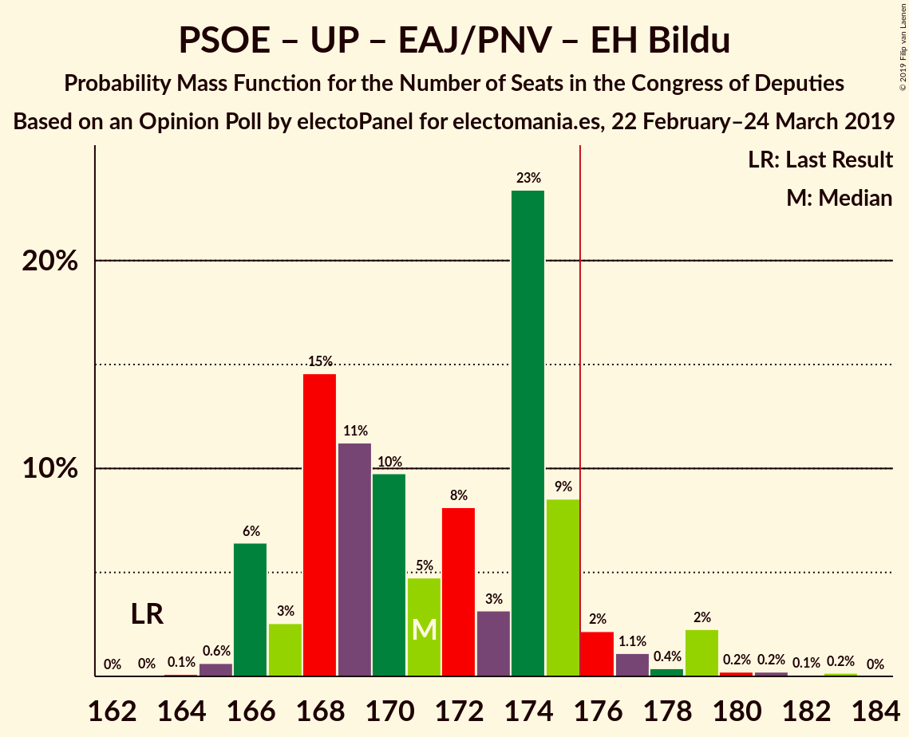
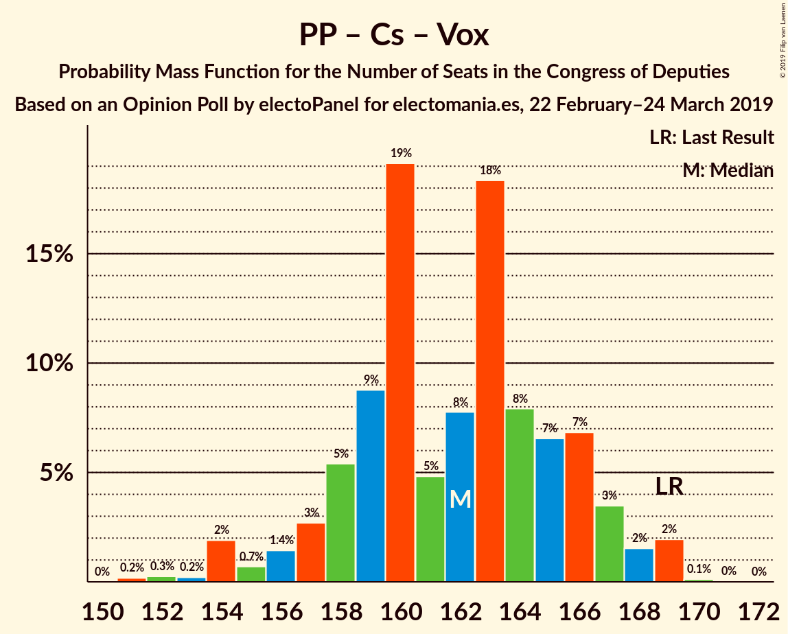
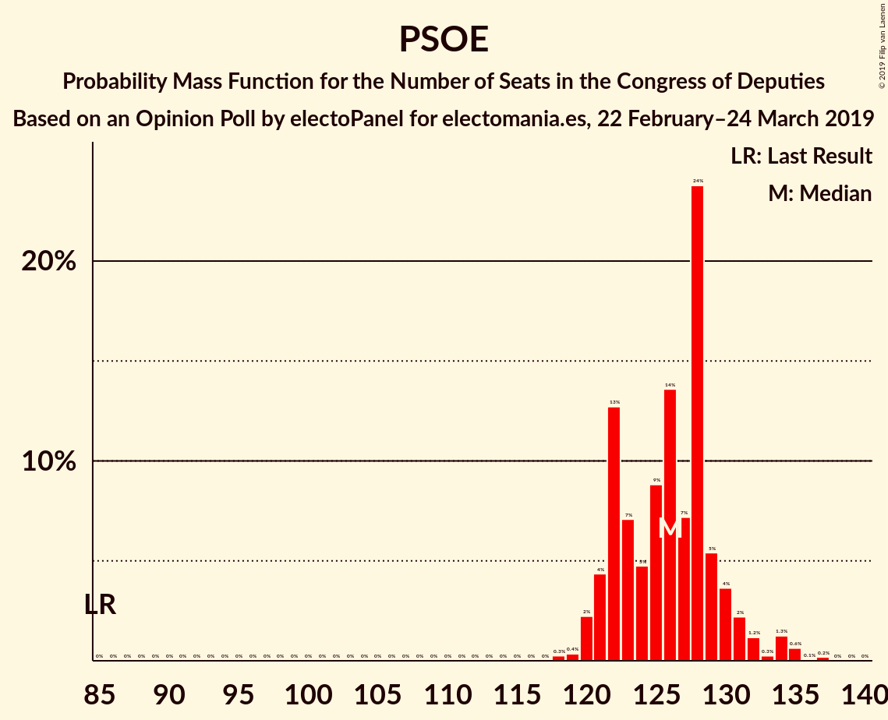

# Opinion Poll by electoPanel for electomania.es, 22 February–24 March 2019

<a href="#voting-intentions">Voting Intentions</a> | <a href="#seats">Seats</a> | <a href="#coalitions">Coalitions</a> | <a href="#technical-information">Technical Information</a>

## Voting Intentions

### Confidence Intervals

| Party | Last Result | Poll Result | 80% Confidence Interval | 90% Confidence Interval | 95% Confidence Interval | 99% Confidence Interval |
|:-----:|:-----------:|:-----------:|:-----------------------:|:-----------------------:|:-----------------------:|:-----------------------:|
| Partido Socialista Obrero Español | 22.6% | 28.6% | 28.0–29.2% |27.8–29.4% |27.6–29.6% |27.3–29.9% |
| Partido Popular | 33.0% | 20.1% | 19.5–20.7% |19.4–20.9% |19.2–21.0% |19.0–21.3% |
| Ciudadanos–Partido de la Ciudadanía | 13.1% | 16.3% | 15.8–16.8% |15.6–17.0% |15.5–17.1% |15.3–17.4% |
| Unidos Podemos | 21.2% | 11.1% | 10.7–11.6% |10.5–11.7% |10.4–11.8% |10.2–12.0% |
| Vox | 0.2% | 10.5% | 10.1–11.0% |10.0–11.1% |9.8–11.2% |9.6–11.4% |
| Esquerra Republicana de Catalunya–Catalunya Sí | 2.7% | 2.4% | 2.2–2.6% |2.1–2.7% |2.1–2.8% |2.0–2.9% |
| Partit Demòcrata Europeu Català | 2.0% | 1.3% | 1.1–1.5% |1.1–1.5% |1.1–1.6% |1.0–1.7% |
| Euzko Alderdi Jeltzalea/Partido Nacionalista Vasco | 1.2% | 1.3% | 1.1–1.5% |1.1–1.5% |1.1–1.6% |1.0–1.7% |
| Partido Animalista Contra el Maltrato Animal | 1.2% | 1.1% | 1.0–1.3% |0.9–1.3% |0.9–1.4% |0.8–1.4% |
| Euskal Herria Bildu | 0.8% | 0.9% | 0.8–1.1% |0.7–1.1% |0.7–1.1% |0.7–1.2% |
| Coalición Canaria–Partido Nacionalista Canario | 0.3% | 0.2% | 0.1–0.3% |0.1–0.3% |0.1–0.3% |0.1–0.4% |

*Note:* The poll result column reflects the actual value used in the calculations. Published results may vary slightly, and in addition be rounded to fewer digits.

## Seats

### Confidence Intervals

| Party | Last Result | Median | 80% Confidence Interval | 90% Confidence Interval | 95% Confidence Interval | 99% Confidence Interval |
|:-----:|:-----------:|:------:|:-----------------------:|:-----------------------:|:-----------------------:|:-----------------------:|
| <a href="#partido-socialista-obrero-español">Partido Socialista Obrero Español</a> | 85 | 127 | 124–131 |123–133 |123–135 |121–135 |
| <a href="#partido-popular">Partido Popular</a> | 137 | 83 | 80–85 |79–86 |78–86 |74–88 |
| <a href="#ciudadanos–partido-de-la-ciudadanía">Ciudadanos–Partido de la Ciudadanía</a> | 32 | 58 | 54–62 |53–62 |53–62 |52–63 |
| <a href="#unidos-podemos">Unidos Podemos</a> | 71 | 28 | 26–32 |25–33 |24–33 |24–33 |
| <a href="#vox">Vox</a> | 0 | 26 | 25–27 |24–27 |23–28 |22–29 |
| <a href="#esquerra-republicana-de-catalunya–catalunya-sí">Esquerra Republicana de Catalunya–Catalunya Sí</a> | 9 | 11 | 10–12 |10–13 |10–13 |10–14 |
| <a href="#partit-demòcrata-europeu-català">Partit Demòcrata Europeu Català</a> | 8 | 5 | 5–6 |4–7 |4–8 |4–8 |
| <a href="#euzko-alderdi-jeltzalea/partido-nacionalista-vasco">Euzko Alderdi Jeltzalea/Partido Nacionalista Vasco</a> | 5 | 6 | 6–7 |6–7 |6–8 |6–8 |
| <a href="#partido-animalista-contra-el-maltrato-animal">Partido Animalista Contra el Maltrato Animal</a> | 0 | 0 | 0 |0 |0 |0 |
| <a href="#euskal-herria-bildu">Euskal Herria Bildu</a> | 2 | 4 | 2–5 |2–5 |2–5 |2–6 |
| <a href="#coalición-canaria–partido-nacionalista-canario">Coalición Canaria–Partido Nacionalista Canario</a> | 1 | 1 | 0–1 |0–1 |0–1 |0–1 |

### Partido Socialista Obrero Español

*For a full overview of the results for this party, see the [Partido Socialista Obrero Español](party-partidosocialistaobreroespañol.html) page.*

| Number of Seats | Probability | Accumulated | Special Marks |
|:---------------:|:-----------:|:-----------:|:-------------:|
| 85 | 0% | 100% | Last Result |
| 86 | 0% | 100% |  |
| 87 | 0% | 100% |  |
| 88 | 0% | 100% |  |
| 89 | 0% | 100% |  |
| 90 | 0% | 100% |  |
| 91 | 0% | 100% |  |
| 92 | 0% | 100% |  |
| 93 | 0% | 100% |  |
| 94 | 0% | 100% |  |
| 95 | 0% | 100% |  |
| 96 | 0% | 100% |  |
| 97 | 0% | 100% |  |
| 98 | 0% | 100% |  |
| 99 | 0% | 100% |  |
| 100 | 0% | 100% |  |
| 101 | 0% | 100% |  |
| 102 | 0% | 100% |  |
| 103 | 0% | 100% |  |
| 104 | 0% | 100% |  |
| 105 | 0% | 100% |  |
| 106 | 0% | 100% |  |
| 107 | 0% | 100% |  |
| 108 | 0% | 100% |  |
| 109 | 0% | 100% |  |
| 110 | 0% | 100% |  |
| 111 | 0% | 100% |  |
| 112 | 0% | 100% |  |
| 113 | 0% | 100% |  |
| 114 | 0% | 100% |  |
| 115 | 0% | 100% |  |
| 116 | 0% | 100% |  |
| 117 | 0% | 100% |  |
| 118 | 0% | 100% |  |
| 119 | 0% | 100% |  |
| 120 | 0% | 100% |  |
| 121 | 0.7% | 100% |  |
| 122 | 1.4% | 99.2% |  |
| 123 | 5% | 98% |  |
| 124 | 26% | 93% |  |
| 125 | 6% | 67% |  |
| 126 | 8% | 61% |  |
| 127 | 14% | 53% | Median |
| 128 | 13% | 38% |  |
| 129 | 5% | 26% |  |
| 130 | 5% | 21% |  |
| 131 | 7% | 16% |  |
| 132 | 3% | 10% |  |
| 133 | 2% | 7% |  |
| 134 | 0.4% | 5% |  |
| 135 | 4% | 4% |  |
| 136 | 0.2% | 0.4% |  |
| 137 | 0.1% | 0.2% |  |
| 138 | 0.1% | 0.1% |  |
| 139 | 0% | 0% |  |

### Partido Popular

*For a full overview of the results for this party, see the [Partido Popular](party-partidopopular.html) page.*

| Number of Seats | Probability | Accumulated | Special Marks |
|:---------------:|:-----------:|:-----------:|:-------------:|
| 72 | 0.1% | 100% |  |
| 73 | 0% | 99.9% |  |
| 74 | 1.1% | 99.8% |  |
| 75 | 0.3% | 98.7% |  |
| 76 | 0% | 98% |  |
| 77 | 0.2% | 98% |  |
| 78 | 1.3% | 98% |  |
| 79 | 5% | 97% |  |
| 80 | 3% | 92% |  |
| 81 | 13% | 88% |  |
| 82 | 22% | 76% |  |
| 83 | 16% | 53% | Median |
| 84 | 13% | 37% |  |
| 85 | 15% | 24% |  |
| 86 | 8% | 10% |  |
| 87 | 1.0% | 2% |  |
| 88 | 0.5% | 0.8% |  |
| 89 | 0.3% | 0.3% |  |
| 90 | 0% | 0% |  |
| 91 | 0% | 0% |  |
| 92 | 0% | 0% |  |
| 93 | 0% | 0% |  |
| 94 | 0% | 0% |  |
| 95 | 0% | 0% |  |
| 96 | 0% | 0% |  |
| 97 | 0% | 0% |  |
| 98 | 0% | 0% |  |
| 99 | 0% | 0% |  |
| 100 | 0% | 0% |  |
| 101 | 0% | 0% |  |
| 102 | 0% | 0% |  |
| 103 | 0% | 0% |  |
| 104 | 0% | 0% |  |
| 105 | 0% | 0% |  |
| 106 | 0% | 0% |  |
| 107 | 0% | 0% |  |
| 108 | 0% | 0% |  |
| 109 | 0% | 0% |  |
| 110 | 0% | 0% |  |
| 111 | 0% | 0% |  |
| 112 | 0% | 0% |  |
| 113 | 0% | 0% |  |
| 114 | 0% | 0% |  |
| 115 | 0% | 0% |  |
| 116 | 0% | 0% |  |
| 117 | 0% | 0% |  |
| 118 | 0% | 0% |  |
| 119 | 0% | 0% |  |
| 120 | 0% | 0% |  |
| 121 | 0% | 0% |  |
| 122 | 0% | 0% |  |
| 123 | 0% | 0% |  |
| 124 | 0% | 0% |  |
| 125 | 0% | 0% |  |
| 126 | 0% | 0% |  |
| 127 | 0% | 0% |  |
| 128 | 0% | 0% |  |
| 129 | 0% | 0% |  |
| 130 | 0% | 0% |  |
| 131 | 0% | 0% |  |
| 132 | 0% | 0% |  |
| 133 | 0% | 0% |  |
| 134 | 0% | 0% |  |
| 135 | 0% | 0% |  |
| 136 | 0% | 0% |  |
| 137 | 0% | 0% | Last Result |

### Ciudadanos–Partido de la Ciudadanía

*For a full overview of the results for this party, see the [Ciudadanos–Partido de la Ciudadanía](party-ciudadanos–partidodelaciudadanía.html) page.*

| Number of Seats | Probability | Accumulated | Special Marks |
|:---------------:|:-----------:|:-----------:|:-------------:|
| 32 | 0% | 100% | Last Result |
| 33 | 0% | 100% |  |
| 34 | 0% | 100% |  |
| 35 | 0% | 100% |  |
| 36 | 0% | 100% |  |
| 37 | 0% | 100% |  |
| 38 | 0% | 100% |  |
| 39 | 0% | 100% |  |
| 40 | 0% | 100% |  |
| 41 | 0% | 100% |  |
| 42 | 0% | 100% |  |
| 43 | 0% | 100% |  |
| 44 | 0% | 100% |  |
| 45 | 0% | 100% |  |
| 46 | 0% | 100% |  |
| 47 | 0% | 100% |  |
| 48 | 0% | 100% |  |
| 49 | 0% | 100% |  |
| 50 | 0% | 100% |  |
| 51 | 0.2% | 100% |  |
| 52 | 2% | 99.8% |  |
| 53 | 4% | 98% |  |
| 54 | 12% | 94% |  |
| 55 | 7% | 81% |  |
| 56 | 1.0% | 74% |  |
| 57 | 20% | 73% |  |
| 58 | 4% | 54% | Median |
| 59 | 2% | 49% |  |
| 60 | 8% | 48% |  |
| 61 | 17% | 40% |  |
| 62 | 22% | 23% |  |
| 63 | 1.5% | 2% |  |
| 64 | 0.2% | 0.2% |  |
| 65 | 0% | 0% |  |

### Unidos Podemos

*For a full overview of the results for this party, see the [Unidos Podemos](party-unidospodemos.html) page.*

| Number of Seats | Probability | Accumulated | Special Marks |
|:---------------:|:-----------:|:-----------:|:-------------:|
| 24 | 4% | 100% |  |
| 25 | 4% | 96% |  |
| 26 | 17% | 92% |  |
| 27 | 13% | 74% |  |
| 28 | 27% | 62% | Median |
| 29 | 10% | 34% |  |
| 30 | 4% | 25% |  |
| 31 | 4% | 20% |  |
| 32 | 7% | 17% |  |
| 33 | 9% | 9% |  |
| 34 | 0.3% | 0.4% |  |
| 35 | 0.1% | 0.1% |  |
| 36 | 0% | 0% |  |
| 37 | 0% | 0% |  |
| 38 | 0% | 0% |  |
| 39 | 0% | 0% |  |
| 40 | 0% | 0% |  |
| 41 | 0% | 0% |  |
| 42 | 0% | 0% |  |
| 43 | 0% | 0% |  |
| 44 | 0% | 0% |  |
| 45 | 0% | 0% |  |
| 46 | 0% | 0% |  |
| 47 | 0% | 0% |  |
| 48 | 0% | 0% |  |
| 49 | 0% | 0% |  |
| 50 | 0% | 0% |  |
| 51 | 0% | 0% |  |
| 52 | 0% | 0% |  |
| 53 | 0% | 0% |  |
| 54 | 0% | 0% |  |
| 55 | 0% | 0% |  |
| 56 | 0% | 0% |  |
| 57 | 0% | 0% |  |
| 58 | 0% | 0% |  |
| 59 | 0% | 0% |  |
| 60 | 0% | 0% |  |
| 61 | 0% | 0% |  |
| 62 | 0% | 0% |  |
| 63 | 0% | 0% |  |
| 64 | 0% | 0% |  |
| 65 | 0% | 0% |  |
| 66 | 0% | 0% |  |
| 67 | 0% | 0% |  |
| 68 | 0% | 0% |  |
| 69 | 0% | 0% |  |
| 70 | 0% | 0% |  |
| 71 | 0% | 0% | Last Result |

### Vox

*For a full overview of the results for this party, see the [Vox](party-vox.html) page.*

| Number of Seats | Probability | Accumulated | Special Marks |
|:---------------:|:-----------:|:-----------:|:-------------:|
| 0 | 0% | 100% | Last Result |
| 1 | 0% | 100% |  |
| 2 | 0% | 100% |  |
| 3 | 0% | 100% |  |
| 4 | 0% | 100% |  |
| 5 | 0% | 100% |  |
| 6 | 0% | 100% |  |
| 7 | 0% | 100% |  |
| 8 | 0% | 100% |  |
| 9 | 0% | 100% |  |
| 10 | 0% | 100% |  |
| 11 | 0% | 100% |  |
| 12 | 0% | 100% |  |
| 13 | 0% | 100% |  |
| 14 | 0% | 100% |  |
| 15 | 0% | 100% |  |
| 16 | 0% | 100% |  |
| 17 | 0% | 100% |  |
| 18 | 0% | 100% |  |
| 19 | 0% | 100% |  |
| 20 | 0% | 100% |  |
| 21 | 0% | 100% |  |
| 22 | 0.9% | 100% |  |
| 23 | 4% | 99.1% |  |
| 24 | 3% | 95% |  |
| 25 | 8% | 92% |  |
| 26 | 45% | 84% | Median |
| 27 | 35% | 40% |  |
| 28 | 2% | 5% |  |
| 29 | 2% | 2% |  |
| 30 | 0.3% | 0.4% |  |
| 31 | 0.1% | 0.1% |  |
| 32 | 0.1% | 0.1% |  |
| 33 | 0% | 0% |  |

### Esquerra Republicana de Catalunya–Catalunya Sí

*For a full overview of the results for this party, see the [Esquerra Republicana de Catalunya–Catalunya Sí](party-esquerrarepublicanadecatalunya–catalunyasí.html) page.*

| Number of Seats | Probability | Accumulated | Special Marks |
|:---------------:|:-----------:|:-----------:|:-------------:|
| 9 | 0.1% | 100% | Last Result |
| 10 | 23% | 99.8% |  |
| 11 | 40% | 77% | Median |
| 12 | 30% | 37% |  |
| 13 | 6% | 7% |  |
| 14 | 0.9% | 0.9% |  |
| 15 | 0% | 0% |  |

### Partit Demòcrata Europeu Català

*For a full overview of the results for this party, see the [Partit Demòcrata Europeu Català](party-partitdemòcrataeuropeucatalà.html) page.*

| Number of Seats | Probability | Accumulated | Special Marks |
|:---------------:|:-----------:|:-----------:|:-------------:|
| 4 | 6% | 100% |  |
| 5 | 44% | 94% | Median |
| 6 | 43% | 50% |  |
| 7 | 3% | 6% |  |
| 8 | 4% | 4% | Last Result |
| 9 | 0.1% | 0.1% |  |
| 10 | 0% | 0% |  |

### Euzko Alderdi Jeltzalea/Partido Nacionalista Vasco

*For a full overview of the results for this party, see the [Euzko Alderdi Jeltzalea/Partido Nacionalista Vasco](party-euzkoalderdijeltzaleapartidonacionalistavasco.html) page.*

| Number of Seats | Probability | Accumulated | Special Marks |
|:---------------:|:-----------:|:-----------:|:-------------:|
| 5 | 0.1% | 100% | Last Result |
| 6 | 64% | 99.9% | Median |
| 7 | 33% | 36% |  |
| 8 | 3% | 3% |  |
| 9 | 0% | 0% |  |

### Partido Animalista Contra el Maltrato Animal

*For a full overview of the results for this party, see the [Partido Animalista Contra el Maltrato Animal](party-partidoanimalistacontraelmaltratoanimal.html) page.*

| Number of Seats | Probability | Accumulated | Special Marks |
|:---------------:|:-----------:|:-----------:|:-------------:|
| 0 | 100% | 100% | Last Result, Median |

### Euskal Herria Bildu

*For a full overview of the results for this party, see the [Euskal Herria Bildu](party-euskalherriabildu.html) page.*

| Number of Seats | Probability | Accumulated | Special Marks |
|:---------------:|:-----------:|:-----------:|:-------------:|
| 2 | 10% | 100% | Last Result |
| 3 | 14% | 90% |  |
| 4 | 65% | 76% | Median |
| 5 | 9% | 11% |  |
| 6 | 1.3% | 1.3% |  |
| 7 | 0% | 0% |  |

### Coalición Canaria–Partido Nacionalista Canario

*For a full overview of the results for this party, see the [Coalición Canaria–Partido Nacionalista Canario](party-coalicióncanaria–partidonacionalistacanario.html) page.*

| Number of Seats | Probability | Accumulated | Special Marks |
|:---------------:|:-----------:|:-----------:|:-------------:|
| 0 | 46% | 100% |  |
| 1 | 54% | 54% | Last Result, Median |
| 2 | 0% | 0% |  |

## Coalitions

### Confidence Intervals

| Coalition | Last Result | Median | Majority? | 80% Confidence Interval | 90% Confidence Interval | 95% Confidence Interval | 99% Confidence Interval |
|:---------:|:-----------:|:------:|:---------:|:-----------------------:|:-----------------------:|:-----------------------:|:-----------------------:|
| Partido Socialista Obrero Español – Partido Popular – Ciudadanos–Partido de la Ciudadanía | 254 | 268 | 100% | 265–271 | 263–271 | 263–272 | 262–273 |
| Partido Socialista Obrero Español – Ciudadanos–Partido de la Ciudadanía – Unidos Podemos | 188 | 214 | 100% | 211–217 | 210–218 | 209–219 | 207–221 |
| Partido Socialista Obrero Español – Partido Popular | 222 | 210 | 100% | 206–214 | 205–215 | 204–216 | 202–218 |
| Partido Socialista Obrero Español – Unidos Podemos – Esquerra Republicana de Catalunya–Catalunya Sí – Euzko Alderdi Jeltzalea/Partido Nacionalista Vasco – Partit Demòcrata Europeu Català – Euskal Herria Bildu | 180 | 180 | 99.9% | 179–189 | 178–189 | 177–191 | 176–192 |
| Partido Socialista Obrero Español – Ciudadanos–Partido de la Ciudadanía | 117 | 186 | 100% | 181–188 | 180–189 | 180–190 | 180–192 |
| Partido Socialista Obrero Español – Unidos Podemos – Esquerra Republicana de Catalunya–Catalunya Sí – Partit Demòcrata Europeu Català | 173 | 171 | 17% | 169–178 | 167–179 | 167–180 | 166–181 |
| Partido Socialista Obrero Español – Unidos Podemos – Esquerra Republicana de Catalunya–Catalunya Sí – Euskal Herria Bildu | 167 | 169 | 13% | 167–176 | 166–177 | 165–177 | 165–181 |
| Partido Socialista Obrero Español – Unidos Podemos – Euzko Alderdi Jeltzalea/Partido Nacionalista Vasco – Euskal Herria Bildu | 163 | 164 | 0.6% | 162–172 | 161–173 | 160–173 | 159–176 |
| Partido Popular – Ciudadanos–Partido de la Ciudadanía – Vox | 169 | 169 | 0% | 161–170 | 161–171 | 159–173 | 157–173 |
| Partido Socialista Obrero Español – Unidos Podemos – Euzko Alderdi Jeltzalea/Partido Nacionalista Vasco | 161 | 161 | 0% | 158–167 | 157–169 | 157–169 | 155–171 |
| Partido Socialista Obrero Español – Unidos Podemos | 156 | 154 | 0% | 152–161 | 150–162 | 150–162 | 148–165 |
| Partido Popular – Ciudadanos–Partido de la Ciudadanía – Euzko Alderdi Jeltzalea/Partido Nacionalista Vasco | 174 | 148 | 0% | 141–151 | 140–152 | 140–153 | 138–153 |
| Partido Popular – Ciudadanos–Partido de la Ciudadanía – Coalición Canaria–Partido Nacionalista Canario | 170 | 143 | 0% | 135–145 | 134–146 | 134–146 | 131–147 |
| Partido Popular – Ciudadanos–Partido de la Ciudadanía | 169 | 142 | 0% | 135–144 | 134–146 | 133–146 | 131–147 |
| Partido Socialista Obrero Español | 85 | 127 | 0% | 124–131 | 123–133 | 123–135 | 121–135 |
| Partido Popular – Vox | 137 | 109 | 0% | 106–112 | 104–112 | 103–113 | 100–115 |
| Partido Popular | 137 | 83 | 0% | 80–85 | 79–86 | 78–86 | 74–88 |

### Partido Socialista Obrero Español – Partido Popular – Ciudadanos–Partido de la Ciudadanía

| Number of Seats | Probability | Accumulated | Special Marks |
|:---------------:|:-----------:|:-----------:|:-------------:|
| 254 | 0% | 100% | Last Result |
| 255 | 0% | 100% |  |
| 256 | 0% | 100% |  |
| 257 | 0% | 100% |  |
| 258 | 0% | 100% |  |
| 259 | 0% | 100% |  |
| 260 | 0.1% | 100% |  |
| 261 | 0.1% | 99.9% |  |
| 262 | 0.8% | 99.8% |  |
| 263 | 5% | 99.0% |  |
| 264 | 3% | 95% |  |
| 265 | 11% | 92% |  |
| 266 | 4% | 81% |  |
| 267 | 6% | 77% |  |
| 268 | 30% | 70% | Median |
| 269 | 8% | 40% |  |
| 270 | 15% | 32% |  |
| 271 | 14% | 17% |  |
| 272 | 1.1% | 3% |  |
| 273 | 1.2% | 2% |  |
| 274 | 0.3% | 0.4% |  |
| 275 | 0% | 0.1% |  |
| 276 | 0.1% | 0.1% |  |
| 277 | 0% | 0% |  |

### Partido Socialista Obrero Español – Ciudadanos–Partido de la Ciudadanía – Unidos Podemos

| Number of Seats | Probability | Accumulated | Special Marks |
|:---------------:|:-----------:|:-----------:|:-------------:|
| 188 | 0% | 100% | Last Result |
| 189 | 0% | 100% |  |
| 190 | 0% | 100% |  |
| 191 | 0% | 100% |  |
| 192 | 0% | 100% |  |
| 193 | 0% | 100% |  |
| 194 | 0% | 100% |  |
| 195 | 0% | 100% |  |
| 196 | 0% | 100% |  |
| 197 | 0% | 100% |  |
| 198 | 0% | 100% |  |
| 199 | 0% | 100% |  |
| 200 | 0% | 100% |  |
| 201 | 0% | 100% |  |
| 202 | 0% | 100% |  |
| 203 | 0% | 100% |  |
| 204 | 0% | 100% |  |
| 205 | 0% | 100% |  |
| 206 | 0.3% | 100% |  |
| 207 | 0.3% | 99.7% |  |
| 208 | 1.0% | 99.4% |  |
| 209 | 1.1% | 98% |  |
| 210 | 4% | 97% |  |
| 211 | 18% | 93% |  |
| 212 | 9% | 76% |  |
| 213 | 10% | 66% | Median |
| 214 | 30% | 56% |  |
| 215 | 4% | 26% |  |
| 216 | 8% | 22% |  |
| 217 | 6% | 14% |  |
| 218 | 5% | 8% |  |
| 219 | 2% | 3% |  |
| 220 | 0.1% | 2% |  |
| 221 | 1.3% | 1.5% |  |
| 222 | 0.1% | 0.2% |  |
| 223 | 0% | 0.1% |  |
| 224 | 0% | 0% |  |

### Partido Socialista Obrero Español – Partido Popular

| Number of Seats | Probability | Accumulated | Special Marks |
|:---------------:|:-----------:|:-----------:|:-------------:|
| 201 | 0.2% | 100% |  |
| 202 | 2% | 99.7% |  |
| 203 | 0.5% | 98% |  |
| 204 | 0.8% | 98% |  |
| 205 | 2% | 97% |  |
| 206 | 19% | 95% |  |
| 207 | 7% | 75% |  |
| 208 | 9% | 69% |  |
| 209 | 3% | 60% |  |
| 210 | 17% | 57% | Median |
| 211 | 8% | 40% |  |
| 212 | 4% | 32% |  |
| 213 | 13% | 27% |  |
| 214 | 9% | 14% |  |
| 215 | 2% | 5% |  |
| 216 | 2% | 3% |  |
| 217 | 0.3% | 0.9% |  |
| 218 | 0.3% | 0.6% |  |
| 219 | 0.2% | 0.2% |  |
| 220 | 0% | 0% |  |
| 221 | 0% | 0% |  |
| 222 | 0% | 0% | Last Result |

### Partido Socialista Obrero Español – Unidos Podemos – Esquerra Republicana de Catalunya–Catalunya Sí – Euzko Alderdi Jeltzalea/Partido Nacionalista Vasco – Partit Demòcrata Europeu Català – Euskal Herria Bildu

| Number of Seats | Probability | Accumulated | Special Marks |
|:---------------:|:-----------:|:-----------:|:-------------:|
| 175 | 0.1% | 100% |  |
| 176 | 0.9% | 99.9% | Majority |
| 177 | 3% | 99.0% |  |
| 178 | 2% | 96% |  |
| 179 | 19% | 94% |  |
| 180 | 28% | 75% | Last Result |
| 181 | 5% | 47% | Median |
| 182 | 6% | 42% |  |
| 183 | 6% | 37% |  |
| 184 | 4% | 31% |  |
| 185 | 4% | 27% |  |
| 186 | 8% | 24% |  |
| 187 | 3% | 16% |  |
| 188 | 2% | 13% |  |
| 189 | 7% | 10% |  |
| 190 | 0.8% | 3% |  |
| 191 | 2% | 3% |  |
| 192 | 0.3% | 0.8% |  |
| 193 | 0.2% | 0.4% |  |
| 194 | 0% | 0.2% |  |
| 195 | 0.2% | 0.2% |  |
| 196 | 0% | 0% |  |

### Partido Socialista Obrero Español – Ciudadanos–Partido de la Ciudadanía

| Number of Seats | Probability | Accumulated | Special Marks |
|:---------------:|:-----------:|:-----------:|:-------------:|
| 117 | 0% | 100% | Last Result |
| 118 | 0% | 100% |  |
| 119 | 0% | 100% |  |
| 120 | 0% | 100% |  |
| 121 | 0% | 100% |  |
| 122 | 0% | 100% |  |
| 123 | 0% | 100% |  |
| 124 | 0% | 100% |  |
| 125 | 0% | 100% |  |
| 126 | 0% | 100% |  |
| 127 | 0% | 100% |  |
| 128 | 0% | 100% |  |
| 129 | 0% | 100% |  |
| 130 | 0% | 100% |  |
| 131 | 0% | 100% |  |
| 132 | 0% | 100% |  |
| 133 | 0% | 100% |  |
| 134 | 0% | 100% |  |
| 135 | 0% | 100% |  |
| 136 | 0% | 100% |  |
| 137 | 0% | 100% |  |
| 138 | 0% | 100% |  |
| 139 | 0% | 100% |  |
| 140 | 0% | 100% |  |
| 141 | 0% | 100% |  |
| 142 | 0% | 100% |  |
| 143 | 0% | 100% |  |
| 144 | 0% | 100% |  |
| 145 | 0% | 100% |  |
| 146 | 0% | 100% |  |
| 147 | 0% | 100% |  |
| 148 | 0% | 100% |  |
| 149 | 0% | 100% |  |
| 150 | 0% | 100% |  |
| 151 | 0% | 100% |  |
| 152 | 0% | 100% |  |
| 153 | 0% | 100% |  |
| 154 | 0% | 100% |  |
| 155 | 0% | 100% |  |
| 156 | 0% | 100% |  |
| 157 | 0% | 100% |  |
| 158 | 0% | 100% |  |
| 159 | 0% | 100% |  |
| 160 | 0% | 100% |  |
| 161 | 0% | 100% |  |
| 162 | 0% | 100% |  |
| 163 | 0% | 100% |  |
| 164 | 0% | 100% |  |
| 165 | 0% | 100% |  |
| 166 | 0% | 100% |  |
| 167 | 0% | 100% |  |
| 168 | 0% | 100% |  |
| 169 | 0% | 100% |  |
| 170 | 0% | 100% |  |
| 171 | 0% | 100% |  |
| 172 | 0% | 100% |  |
| 173 | 0% | 100% |  |
| 174 | 0% | 100% |  |
| 175 | 0% | 100% |  |
| 176 | 0% | 100% | Majority |
| 177 | 0.1% | 100% |  |
| 178 | 0% | 99.9% |  |
| 179 | 0.1% | 99.9% |  |
| 180 | 5% | 99.7% |  |
| 181 | 7% | 95% |  |
| 182 | 7% | 88% |  |
| 183 | 2% | 81% |  |
| 184 | 7% | 79% |  |
| 185 | 19% | 72% | Median |
| 186 | 22% | 53% |  |
| 187 | 10% | 31% |  |
| 188 | 14% | 21% |  |
| 189 | 2% | 7% |  |
| 190 | 4% | 5% |  |
| 191 | 0.3% | 1.3% |  |
| 192 | 0.6% | 1.0% |  |
| 193 | 0% | 0.4% |  |
| 194 | 0.3% | 0.3% |  |
| 195 | 0% | 0% |  |

### Partido Socialista Obrero Español – Unidos Podemos – Esquerra Republicana de Catalunya–Catalunya Sí – Partit Demòcrata Europeu Català

| Number of Seats | Probability | Accumulated | Special Marks |
|:---------------:|:-----------:|:-----------:|:-------------:|
| 165 | 0.3% | 100% |  |
| 166 | 0.7% | 99.7% |  |
| 167 | 4% | 99.1% |  |
| 168 | 2% | 95% |  |
| 169 | 28% | 93% |  |
| 170 | 4% | 65% |  |
| 171 | 13% | 61% | Median |
| 172 | 12% | 48% |  |
| 173 | 5% | 36% | Last Result |
| 174 | 5% | 30% |  |
| 175 | 8% | 25% |  |
| 176 | 2% | 17% | Majority |
| 177 | 4% | 14% |  |
| 178 | 4% | 10% |  |
| 179 | 4% | 6% |  |
| 180 | 1.2% | 3% |  |
| 181 | 0.9% | 1.3% |  |
| 182 | 0.1% | 0.4% |  |
| 183 | 0% | 0.2% |  |
| 184 | 0.2% | 0.2% |  |
| 185 | 0% | 0% |  |

### Partido Socialista Obrero Español – Unidos Podemos – Esquerra Republicana de Catalunya–Catalunya Sí – Euskal Herria Bildu

| Number of Seats | Probability | Accumulated | Special Marks |
|:---------------:|:-----------:|:-----------:|:-------------:|
| 163 | 0.1% | 100% |  |
| 164 | 0.2% | 99.8% |  |
| 165 | 4% | 99.6% |  |
| 166 | 3% | 96% |  |
| 167 | 28% | 93% | Last Result |
| 168 | 2% | 65% |  |
| 169 | 19% | 63% |  |
| 170 | 5% | 44% | Median |
| 171 | 8% | 39% |  |
| 172 | 4% | 31% |  |
| 173 | 1.3% | 27% |  |
| 174 | 9% | 26% |  |
| 175 | 3% | 17% |  |
| 176 | 5% | 13% | Majority |
| 177 | 6% | 8% |  |
| 178 | 0.5% | 2% |  |
| 179 | 0.4% | 2% |  |
| 180 | 0.9% | 2% |  |
| 181 | 0.3% | 0.7% |  |
| 182 | 0.1% | 0.3% |  |
| 183 | 0% | 0.2% |  |
| 184 | 0.2% | 0.2% |  |
| 185 | 0% | 0% |  |

### Partido Socialista Obrero Español – Unidos Podemos – Euzko Alderdi Jeltzalea/Partido Nacionalista Vasco – Euskal Herria Bildu

| Number of Seats | Probability | Accumulated | Special Marks |
|:---------------:|:-----------:|:-----------:|:-------------:|
| 157 | 0.1% | 100% |  |
| 158 | 0.3% | 99.9% |  |
| 159 | 0.7% | 99.7% |  |
| 160 | 3% | 99.0% |  |
| 161 | 2% | 96% |  |
| 162 | 20% | 94% |  |
| 163 | 19% | 74% | Last Result |
| 164 | 12% | 56% |  |
| 165 | 6% | 44% | Median |
| 166 | 6% | 38% |  |
| 167 | 4% | 32% |  |
| 168 | 3% | 28% |  |
| 169 | 2% | 24% |  |
| 170 | 8% | 23% |  |
| 171 | 5% | 15% |  |
| 172 | 4% | 10% |  |
| 173 | 5% | 7% |  |
| 174 | 1.0% | 2% |  |
| 175 | 0.5% | 1.1% |  |
| 176 | 0.3% | 0.6% | Majority |
| 177 | 0.1% | 0.3% |  |
| 178 | 0.1% | 0.2% |  |
| 179 | 0% | 0.1% |  |
| 180 | 0% | 0% |  |

### Partido Popular – Ciudadanos–Partido de la Ciudadanía – Vox

| Number of Seats | Probability | Accumulated | Special Marks |
|:---------------:|:-----------:|:-----------:|:-------------:|
| 155 | 0.2% | 100% |  |
| 156 | 0% | 99.8% |  |
| 157 | 0.3% | 99.7% |  |
| 158 | 0.9% | 99.5% |  |
| 159 | 1.3% | 98.6% |  |
| 160 | 0.9% | 97% |  |
| 161 | 8% | 96% |  |
| 162 | 2% | 89% |  |
| 163 | 2% | 86% |  |
| 164 | 8% | 84% |  |
| 165 | 4% | 75% |  |
| 166 | 7% | 71% |  |
| 167 | 2% | 64% | Median |
| 168 | 6% | 62% |  |
| 169 | 23% | 56% | Last Result |
| 170 | 26% | 33% |  |
| 171 | 3% | 7% |  |
| 172 | 1.1% | 4% |  |
| 173 | 3% | 3% |  |
| 174 | 0.1% | 0.2% |  |
| 175 | 0.1% | 0.1% |  |
| 176 | 0% | 0% | Majority |

### Partido Socialista Obrero Español – Unidos Podemos – Euzko Alderdi Jeltzalea/Partido Nacionalista Vasco

| Number of Seats | Probability | Accumulated | Special Marks |
|:---------------:|:-----------:|:-----------:|:-------------:|
| 154 | 0.2% | 100% |  |
| 155 | 0.6% | 99.7% |  |
| 156 | 1.2% | 99.1% |  |
| 157 | 4% | 98% |  |
| 158 | 19% | 94% |  |
| 159 | 2% | 75% |  |
| 160 | 22% | 73% |  |
| 161 | 12% | 51% | Last Result, Median |
| 162 | 7% | 39% |  |
| 163 | 4% | 32% |  |
| 164 | 3% | 28% |  |
| 165 | 2% | 25% |  |
| 166 | 10% | 22% |  |
| 167 | 3% | 13% |  |
| 168 | 3% | 10% |  |
| 169 | 5% | 7% |  |
| 170 | 0.7% | 2% |  |
| 171 | 0.7% | 1.0% |  |
| 172 | 0.1% | 0.3% |  |
| 173 | 0.2% | 0.3% |  |
| 174 | 0% | 0.1% |  |
| 175 | 0% | 0% |  |

### Partido Socialista Obrero Español – Unidos Podemos

| Number of Seats | Probability | Accumulated | Special Marks |
|:---------------:|:-----------:|:-----------:|:-------------:|
| 147 | 0.2% | 100% |  |
| 148 | 0.6% | 99.8% |  |
| 149 | 0.2% | 99.2% |  |
| 150 | 4% | 99.0% |  |
| 151 | 3% | 95% |  |
| 152 | 20% | 92% |  |
| 153 | 10% | 73% |  |
| 154 | 13% | 63% |  |
| 155 | 13% | 49% | Median |
| 156 | 6% | 37% | Last Result |
| 157 | 5% | 31% |  |
| 158 | 4% | 26% |  |
| 159 | 7% | 22% |  |
| 160 | 4% | 16% |  |
| 161 | 2% | 12% |  |
| 162 | 7% | 9% |  |
| 163 | 0.3% | 2% |  |
| 164 | 1.2% | 2% |  |
| 165 | 0.2% | 0.5% |  |
| 166 | 0.1% | 0.3% |  |
| 167 | 0.2% | 0.2% |  |
| 168 | 0% | 0.1% |  |
| 169 | 0% | 0% |  |

### Partido Popular – Ciudadanos–Partido de la Ciudadanía – Euzko Alderdi Jeltzalea/Partido Nacionalista Vasco

| Number of Seats | Probability | Accumulated | Special Marks |
|:---------------:|:-----------:|:-----------:|:-------------:|
| 135 | 0.2% | 100% |  |
| 136 | 0.1% | 99.8% |  |
| 137 | 0.2% | 99.7% |  |
| 138 | 0.4% | 99.5% |  |
| 139 | 1.1% | 99.1% |  |
| 140 | 4% | 98% |  |
| 141 | 6% | 94% |  |
| 142 | 2% | 88% |  |
| 143 | 1.3% | 86% |  |
| 144 | 4% | 85% |  |
| 145 | 9% | 81% |  |
| 146 | 6% | 72% |  |
| 147 | 2% | 66% | Median |
| 148 | 15% | 64% |  |
| 149 | 7% | 49% |  |
| 150 | 26% | 41% |  |
| 151 | 7% | 15% |  |
| 152 | 5% | 8% |  |
| 153 | 3% | 3% |  |
| 154 | 0.2% | 0.4% |  |
| 155 | 0.1% | 0.2% |  |
| 156 | 0% | 0% |  |
| 157 | 0% | 0% |  |
| 158 | 0% | 0% |  |
| 159 | 0% | 0% |  |
| 160 | 0% | 0% |  |
| 161 | 0% | 0% |  |
| 162 | 0% | 0% |  |
| 163 | 0% | 0% |  |
| 164 | 0% | 0% |  |
| 165 | 0% | 0% |  |
| 166 | 0% | 0% |  |
| 167 | 0% | 0% |  |
| 168 | 0% | 0% |  |
| 169 | 0% | 0% |  |
| 170 | 0% | 0% |  |
| 171 | 0% | 0% |  |
| 172 | 0% | 0% |  |
| 173 | 0% | 0% |  |
| 174 | 0% | 0% | Last Result |

### Partido Popular – Ciudadanos–Partido de la Ciudadanía – Coalición Canaria–Partido Nacionalista Canario

| Number of Seats | Probability | Accumulated | Special Marks |
|:---------------:|:-----------:|:-----------:|:-------------:|
| 128 | 0% | 100% |  |
| 129 | 0.2% | 99.9% |  |
| 130 | 0.1% | 99.8% |  |
| 131 | 0.2% | 99.7% |  |
| 132 | 0.8% | 99.5% |  |
| 133 | 0.8% | 98.7% |  |
| 134 | 7% | 98% |  |
| 135 | 2% | 90% |  |
| 136 | 3% | 89% |  |
| 137 | 0.7% | 85% |  |
| 138 | 10% | 85% |  |
| 139 | 4% | 75% |  |
| 140 | 3% | 71% |  |
| 141 | 5% | 68% |  |
| 142 | 6% | 64% | Median |
| 143 | 16% | 57% |  |
| 144 | 11% | 41% |  |
| 145 | 22% | 30% |  |
| 146 | 7% | 8% |  |
| 147 | 0.7% | 1.1% |  |
| 148 | 0.1% | 0.4% |  |
| 149 | 0.2% | 0.2% |  |
| 150 | 0% | 0% |  |
| 151 | 0% | 0% |  |
| 152 | 0% | 0% |  |
| 153 | 0% | 0% |  |
| 154 | 0% | 0% |  |
| 155 | 0% | 0% |  |
| 156 | 0% | 0% |  |
| 157 | 0% | 0% |  |
| 158 | 0% | 0% |  |
| 159 | 0% | 0% |  |
| 160 | 0% | 0% |  |
| 161 | 0% | 0% |  |
| 162 | 0% | 0% |  |
| 163 | 0% | 0% |  |
| 164 | 0% | 0% |  |
| 165 | 0% | 0% |  |
| 166 | 0% | 0% |  |
| 167 | 0% | 0% |  |
| 168 | 0% | 0% |  |
| 169 | 0% | 0% |  |
| 170 | 0% | 0% | Last Result |

### Partido Popular – Ciudadanos–Partido de la Ciudadanía

| Number of Seats | Probability | Accumulated | Special Marks |
|:---------------:|:-----------:|:-----------:|:-------------:|
| 128 | 0% | 100% |  |
| 129 | 0.2% | 99.9% |  |
| 130 | 0.2% | 99.7% |  |
| 131 | 0.1% | 99.6% |  |
| 132 | 0.8% | 99.5% |  |
| 133 | 2% | 98.7% |  |
| 134 | 7% | 97% |  |
| 135 | 3% | 90% |  |
| 136 | 2% | 87% |  |
| 137 | 1.0% | 85% |  |
| 138 | 11% | 84% |  |
| 139 | 3% | 73% |  |
| 140 | 6% | 70% |  |
| 141 | 2% | 64% | Median |
| 142 | 20% | 62% |  |
| 143 | 3% | 42% |  |
| 144 | 30% | 39% |  |
| 145 | 2% | 9% |  |
| 146 | 6% | 6% |  |
| 147 | 0.3% | 0.5% |  |
| 148 | 0.1% | 0.3% |  |
| 149 | 0.1% | 0.2% |  |
| 150 | 0% | 0% |  |
| 151 | 0% | 0% |  |
| 152 | 0% | 0% |  |
| 153 | 0% | 0% |  |
| 154 | 0% | 0% |  |
| 155 | 0% | 0% |  |
| 156 | 0% | 0% |  |
| 157 | 0% | 0% |  |
| 158 | 0% | 0% |  |
| 159 | 0% | 0% |  |
| 160 | 0% | 0% |  |
| 161 | 0% | 0% |  |
| 162 | 0% | 0% |  |
| 163 | 0% | 0% |  |
| 164 | 0% | 0% |  |
| 165 | 0% | 0% |  |
| 166 | 0% | 0% |  |
| 167 | 0% | 0% |  |
| 168 | 0% | 0% |  |
| 169 | 0% | 0% | Last Result |

### Partido Socialista Obrero Español

| Number of Seats | Probability | Accumulated | Special Marks |
|:---------------:|:-----------:|:-----------:|:-------------:|
| 85 | 0% | 100% | Last Result |
| 86 | 0% | 100% |  |
| 87 | 0% | 100% |  |
| 88 | 0% | 100% |  |
| 89 | 0% | 100% |  |
| 90 | 0% | 100% |  |
| 91 | 0% | 100% |  |
| 92 | 0% | 100% |  |
| 93 | 0% | 100% |  |
| 94 | 0% | 100% |  |
| 95 | 0% | 100% |  |
| 96 | 0% | 100% |  |
| 97 | 0% | 100% |  |
| 98 | 0% | 100% |  |
| 99 | 0% | 100% |  |
| 100 | 0% | 100% |  |
| 101 | 0% | 100% |  |
| 102 | 0% | 100% |  |
| 103 | 0% | 100% |  |
| 104 | 0% | 100% |  |
| 105 | 0% | 100% |  |
| 106 | 0% | 100% |  |
| 107 | 0% | 100% |  |
| 108 | 0% | 100% |  |
| 109 | 0% | 100% |  |
| 110 | 0% | 100% |  |
| 111 | 0% | 100% |  |
| 112 | 0% | 100% |  |
| 113 | 0% | 100% |  |
| 114 | 0% | 100% |  |
| 115 | 0% | 100% |  |
| 116 | 0% | 100% |  |
| 117 | 0% | 100% |  |
| 118 | 0% | 100% |  |
| 119 | 0% | 100% |  |
| 120 | 0% | 100% |  |
| 121 | 0.7% | 100% |  |
| 122 | 1.4% | 99.2% |  |
| 123 | 5% | 98% |  |
| 124 | 26% | 93% |  |
| 125 | 6% | 67% |  |
| 126 | 8% | 61% |  |
| 127 | 14% | 53% | Median |
| 128 | 13% | 38% |  |
| 129 | 5% | 26% |  |
| 130 | 5% | 21% |  |
| 131 | 7% | 16% |  |
| 132 | 3% | 10% |  |
| 133 | 2% | 7% |  |
| 134 | 0.4% | 5% |  |
| 135 | 4% | 4% |  |
| 136 | 0.2% | 0.4% |  |
| 137 | 0.1% | 0.2% |  |
| 138 | 0.1% | 0.1% |  |
| 139 | 0% | 0% |  |

### Partido Popular – Vox

| Number of Seats | Probability | Accumulated | Special Marks |
|:---------------:|:-----------:|:-----------:|:-------------:|
| 99 | 0.1% | 100% |  |
| 100 | 1.1% | 99.8% |  |
| 101 | 0.2% | 98.7% |  |
| 102 | 0.2% | 98.5% |  |
| 103 | 1.3% | 98% |  |
| 104 | 3% | 97% |  |
| 105 | 2% | 94% |  |
| 106 | 6% | 93% |  |
| 107 | 3% | 86% |  |
| 108 | 29% | 83% |  |
| 109 | 16% | 54% | Median |
| 110 | 10% | 39% |  |
| 111 | 14% | 29% |  |
| 112 | 11% | 15% |  |
| 113 | 2% | 4% |  |
| 114 | 1.2% | 2% |  |
| 115 | 0.5% | 0.7% |  |
| 116 | 0.1% | 0.2% |  |
| 117 | 0.1% | 0.1% |  |
| 118 | 0% | 0% |  |
| 119 | 0% | 0% |  |
| 120 | 0% | 0% |  |
| 121 | 0% | 0% |  |
| 122 | 0% | 0% |  |
| 123 | 0% | 0% |  |
| 124 | 0% | 0% |  |
| 125 | 0% | 0% |  |
| 126 | 0% | 0% |  |
| 127 | 0% | 0% |  |
| 128 | 0% | 0% |  |
| 129 | 0% | 0% |  |
| 130 | 0% | 0% |  |
| 131 | 0% | 0% |  |
| 132 | 0% | 0% |  |
| 133 | 0% | 0% |  |
| 134 | 0% | 0% |  |
| 135 | 0% | 0% |  |
| 136 | 0% | 0% |  |
| 137 | 0% | 0% | Last Result |

### Partido Popular

| Number of Seats | Probability | Accumulated | Special Marks |
|:---------------:|:-----------:|:-----------:|:-------------:|
| 72 | 0.1% | 100% |  |
| 73 | 0% | 99.9% |  |
| 74 | 1.1% | 99.8% |  |
| 75 | 0.3% | 98.7% |  |
| 76 | 0% | 98% |  |
| 77 | 0.2% | 98% |  |
| 78 | 1.3% | 98% |  |
| 79 | 5% | 97% |  |
| 80 | 3% | 92% |  |
| 81 | 13% | 88% |  |
| 82 | 22% | 76% |  |
| 83 | 16% | 53% | Median |
| 84 | 13% | 37% |  |
| 85 | 15% | 24% |  |
| 86 | 8% | 10% |  |
| 87 | 1.0% | 2% |  |
| 88 | 0.5% | 0.8% |  |
| 89 | 0.3% | 0.3% |  |
| 90 | 0% | 0% |  |
| 91 | 0% | 0% |  |
| 92 | 0% | 0% |  |
| 93 | 0% | 0% |  |
| 94 | 0% | 0% |  |
| 95 | 0% | 0% |  |
| 96 | 0% | 0% |  |
| 97 | 0% | 0% |  |
| 98 | 0% | 0% |  |
| 99 | 0% | 0% |  |
| 100 | 0% | 0% |  |
| 101 | 0% | 0% |  |
| 102 | 0% | 0% |  |
| 103 | 0% | 0% |  |
| 104 | 0% | 0% |  |
| 105 | 0% | 0% |  |
| 106 | 0% | 0% |  |
| 107 | 0% | 0% |  |
| 108 | 0% | 0% |  |
| 109 | 0% | 0% |  |
| 110 | 0% | 0% |  |
| 111 | 0% | 0% |  |
| 112 | 0% | 0% |  |
| 113 | 0% | 0% |  |
| 114 | 0% | 0% |  |
| 115 | 0% | 0% |  |
| 116 | 0% | 0% |  |
| 117 | 0% | 0% |  |
| 118 | 0% | 0% |  |
| 119 | 0% | 0% |  |
| 120 | 0% | 0% |  |
| 121 | 0% | 0% |  |
| 122 | 0% | 0% |  |
| 123 | 0% | 0% |  |
| 124 | 0% | 0% |  |
| 125 | 0% | 0% |  |
| 126 | 0% | 0% |  |
| 127 | 0% | 0% |  |
| 128 | 0% | 0% |  |
| 129 | 0% | 0% |  |
| 130 | 0% | 0% |  |
| 131 | 0% | 0% |  |
| 132 | 0% | 0% |  |
| 133 | 0% | 0% |  |
| 134 | 0% | 0% |  |
| 135 | 0% | 0% |  |
| 136 | 0% | 0% |  |
| 137 | 0% | 0% | Last Result |

## Technical Information

### Opinion Poll

+ **Polling firm:** electoPanel
+ **Commissioner(s):** electomania.es
+ **Fieldwork period:** 22 February–24 March 2019

### Calculations

+ **Sample size:** 8200
+ **Simulations done:** 1,048,576
+ **Error estimate:** 0.64%

