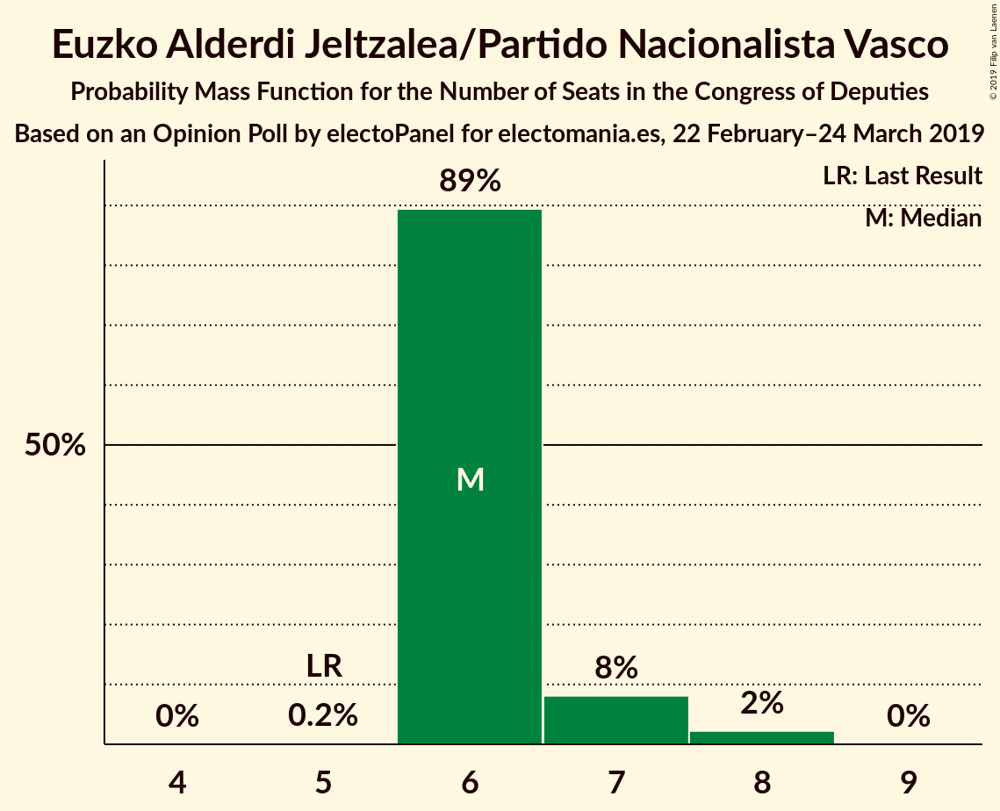
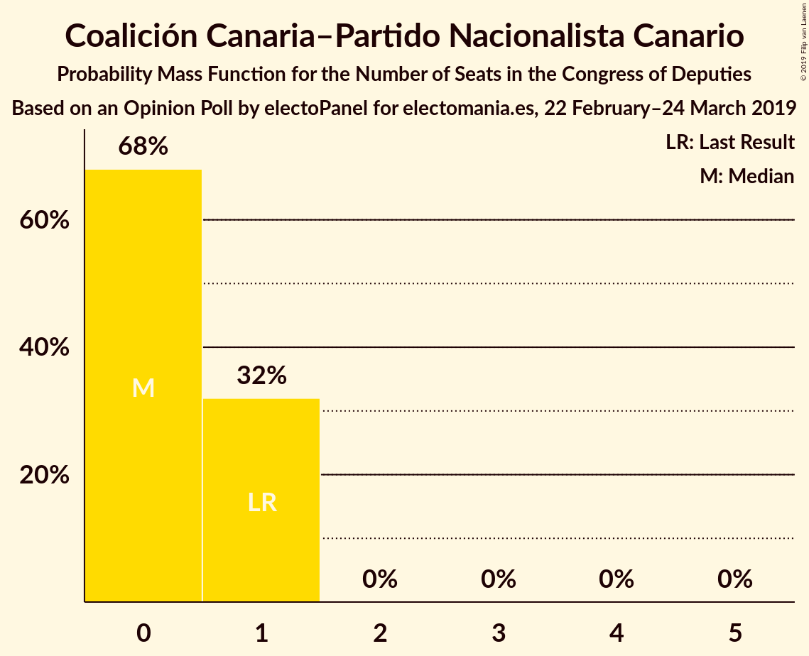
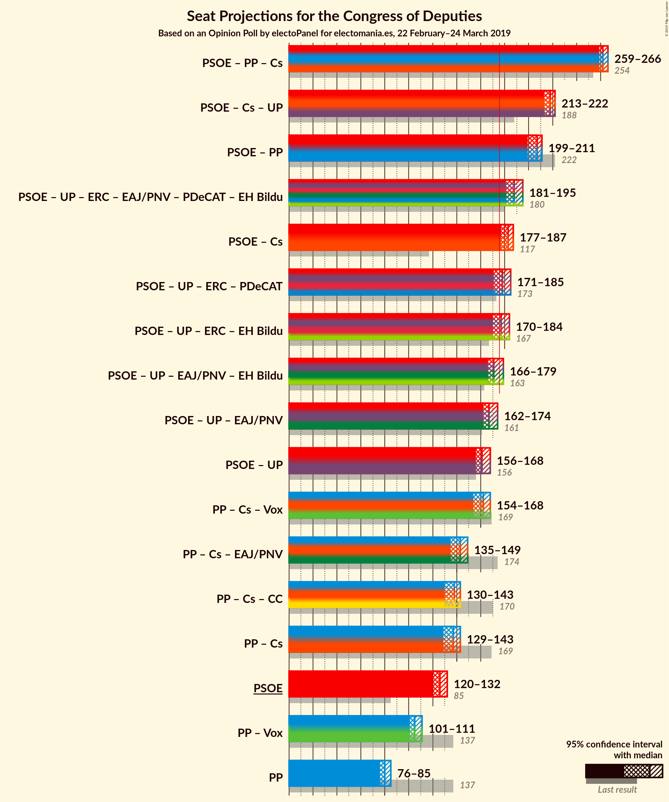
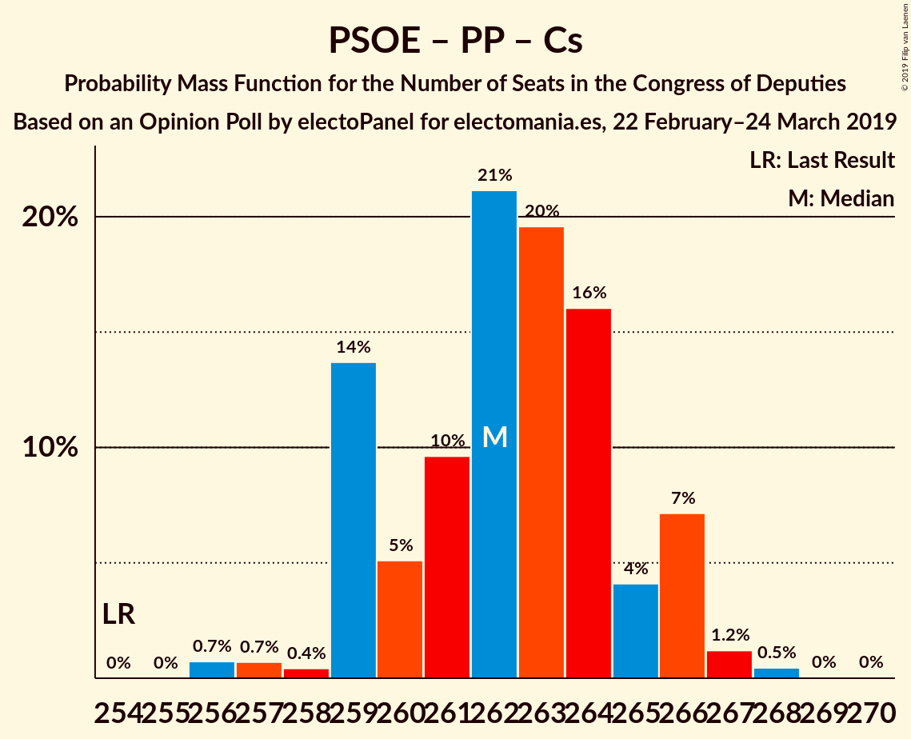

# Opinion Poll by electoPanel for electomania.es, 22 February–24 March 2019

<a href="#voting-intentions">Voting Intentions</a> | <a href="#seats">Seats</a> | <a href="#coalitions">Coalitions</a> | <a href="#technical-information">Technical Information</a>

## Voting Intentions

### Confidence Intervals

| Party | Last Result | Poll Result | 80% Confidence Interval | 90% Confidence Interval | 95% Confidence Interval | 99% Confidence Interval |
|:-----:|:-----------:|:-----------:|:-----------------------:|:-----------------------:|:-----------------------:|:-----------------------:|
| Partido Socialista Obrero Español | 22.6% | 28.6% | 28.0–29.2% |27.8–29.4% |27.6–29.6% |27.3–29.9% |
| Partido Popular | 33.0% | 20.1% | 19.5–20.7% |19.4–20.9% |19.2–21.0% |19.0–21.3% |
| Ciudadanos–Partido de la Ciudadanía | 13.1% | 16.3% | 15.8–16.8% |15.6–17.0% |15.5–17.1% |15.3–17.4% |
| Unidos Podemos | 21.2% | 12.9% | 12.4–13.4% |12.3–13.5% |12.2–13.7% |12.0–13.9% |
| Vox | 0.2% | 10.5% | 10.1–11.0% |10.0–11.1% |9.8–11.2% |9.6–11.4% |
| Esquerra Republicana de Catalunya–Catalunya Sí | 2.7% | 2.4% | 2.2–2.6% |2.1–2.7% |2.1–2.8% |2.0–2.9% |
| Partit Demòcrata Europeu Català | 2.0% | 1.3% | 1.1–1.5% |1.1–1.5% |1.1–1.6% |1.0–1.7% |
| Euzko Alderdi Jeltzalea/Partido Nacionalista Vasco | 1.2% | 1.3% | 1.1–1.5% |1.1–1.5% |1.1–1.6% |1.0–1.7% |
| Partido Animalista Contra el Maltrato Animal | 1.2% | 1.1% | 1.0–1.3% |0.9–1.3% |0.9–1.4% |0.8–1.4% |
| Euskal Herria Bildu | 0.8% | 0.9% | 0.8–1.1% |0.7–1.1% |0.7–1.1% |0.7–1.2% |
| Coalición Canaria–Partido Nacionalista Canario | 0.3% | 0.2% | 0.1–0.3% |0.1–0.3% |0.1–0.3% |0.1–0.4% |

*Note:* The poll result column reflects the actual value used in the calculations. Published results may vary slightly, and in addition be rounded to fewer digits.

## Seats

### Confidence Intervals

| Party | Last Result | Median | 80% Confidence Interval | 90% Confidence Interval | 95% Confidence Interval | 99% Confidence Interval |
|:-----:|:-----------:|:------:|:-----------------------:|:-----------------------:|:-----------------------:|:-----------------------:|
| <a href="#partido-socialista-obrero-español">Partido Socialista Obrero Español</a> | 85 | 125 | 122–131 |122–134 |121–135 |120–137 |
| <a href="#partido-popular">Partido Popular</a> | 137 | 80 | 76–82 |76–84 |76–86 |72–86 |
| <a href="#ciudadanos–partido-de-la-ciudadanía">Ciudadanos–Partido de la Ciudadanía</a> | 32 | 59 | 53–60 |52–62 |52–62 |52–62 |
| <a href="#unidos-podemos">Unidos Podemos</a> | 71 | 34 | 34–36 |32–38 |32–38 |32–38 |
| <a href="#vox">Vox</a> | 0 | 25 | 25–29 |24–29 |23–29 |23–32 |
| <a href="#esquerra-republicana-de-catalunya–catalunya-sí">Esquerra Republicana de Catalunya–Catalunya Sí</a> | 9 | 11 | 10–12 |10–12 |10–13 |9–13 |
| <a href="#partit-demòcrata-europeu-català">Partit Demòcrata Europeu Català</a> | 8 | 6 | 4–6 |4–6 |4–6 |4–6 |
| <a href="#euzko-alderdi-jeltzalea/partido-nacionalista-vasco">Euzko Alderdi Jeltzalea/Partido Nacionalista Vasco</a> | 5 | 6 | 6–7 |6–7 |6–7 |6–8 |
| <a href="#partido-animalista-contra-el-maltrato-animal">Partido Animalista Contra el Maltrato Animal</a> | 0 | 0 | 0 |0 |0 |0 |
| <a href="#euskal-herria-bildu">Euskal Herria Bildu</a> | 2 | 4 | 3–5 |3–5 |2–5 |2–5 |
| <a href="#coalición-canaria–partido-nacionalista-canario">Coalición Canaria–Partido Nacionalista Canario</a> | 1 | 0 | 0–1 |0–1 |0–1 |0–1 |

### Partido Socialista Obrero Español

*For a full overview of the results for this party, see the [Partido Socialista Obrero Español](party-partidosocialistaobreroespañol.html) page.*

| Number of Seats | Probability | Accumulated | Special Marks |
|:---------------:|:-----------:|:-----------:|:-------------:|
| 85 | 0% | 100% | Last Result |
| 86 | 0% | 100% |  |
| 87 | 0% | 100% |  |
| 88 | 0% | 100% |  |
| 89 | 0% | 100% |  |
| 90 | 0% | 100% |  |
| 91 | 0% | 100% |  |
| 92 | 0% | 100% |  |
| 93 | 0% | 100% |  |
| 94 | 0% | 100% |  |
| 95 | 0% | 100% |  |
| 96 | 0% | 100% |  |
| 97 | 0% | 100% |  |
| 98 | 0% | 100% |  |
| 99 | 0% | 100% |  |
| 100 | 0% | 100% |  |
| 101 | 0% | 100% |  |
| 102 | 0% | 100% |  |
| 103 | 0% | 100% |  |
| 104 | 0% | 100% |  |
| 105 | 0% | 100% |  |
| 106 | 0% | 100% |  |
| 107 | 0% | 100% |  |
| 108 | 0% | 100% |  |
| 109 | 0% | 100% |  |
| 110 | 0% | 100% |  |
| 111 | 0% | 100% |  |
| 112 | 0% | 100% |  |
| 113 | 0% | 100% |  |
| 114 | 0% | 100% |  |
| 115 | 0% | 100% |  |
| 116 | 0% | 100% |  |
| 117 | 0% | 100% |  |
| 118 | 0% | 100% |  |
| 119 | 0.4% | 100% |  |
| 120 | 0.8% | 99.6% |  |
| 121 | 2% | 98.8% |  |
| 122 | 12% | 96% |  |
| 123 | 15% | 85% |  |
| 124 | 16% | 70% |  |
| 125 | 32% | 54% | Median |
| 126 | 0.4% | 22% |  |
| 127 | 7% | 22% |  |
| 128 | 0.2% | 15% |  |
| 129 | 3% | 15% |  |
| 130 | 2% | 12% |  |
| 131 | 0.9% | 11% |  |
| 132 | 0.1% | 10% |  |
| 133 | 0% | 10% |  |
| 134 | 6% | 10% |  |
| 135 | 2% | 3% |  |
| 136 | 0% | 0.9% |  |
| 137 | 0.9% | 0.9% |  |
| 138 | 0% | 0% |  |

### Partido Popular

*For a full overview of the results for this party, see the [Partido Popular](party-partidopopular.html) page.*

| Number of Seats | Probability | Accumulated | Special Marks |
|:---------------:|:-----------:|:-----------:|:-------------:|
| 71 | 0.1% | 100% |  |
| 72 | 0.9% | 99.9% |  |
| 73 | 0% | 99.0% |  |
| 74 | 0% | 99.0% |  |
| 75 | 0% | 99.0% |  |
| 76 | 13% | 99.0% |  |
| 77 | 0.5% | 86% |  |
| 78 | 34% | 85% |  |
| 79 | 0.5% | 52% |  |
| 80 | 8% | 51% | Median |
| 81 | 15% | 43% |  |
| 82 | 20% | 28% |  |
| 83 | 0.5% | 8% |  |
| 84 | 3% | 8% |  |
| 85 | 1.3% | 4% |  |
| 86 | 3% | 3% |  |
| 87 | 0.1% | 0.1% |  |
| 88 | 0% | 0% |  |
| 89 | 0% | 0% |  |
| 90 | 0% | 0% |  |
| 91 | 0% | 0% |  |
| 92 | 0% | 0% |  |
| 93 | 0% | 0% |  |
| 94 | 0% | 0% |  |
| 95 | 0% | 0% |  |
| 96 | 0% | 0% |  |
| 97 | 0% | 0% |  |
| 98 | 0% | 0% |  |
| 99 | 0% | 0% |  |
| 100 | 0% | 0% |  |
| 101 | 0% | 0% |  |
| 102 | 0% | 0% |  |
| 103 | 0% | 0% |  |
| 104 | 0% | 0% |  |
| 105 | 0% | 0% |  |
| 106 | 0% | 0% |  |
| 107 | 0% | 0% |  |
| 108 | 0% | 0% |  |
| 109 | 0% | 0% |  |
| 110 | 0% | 0% |  |
| 111 | 0% | 0% |  |
| 112 | 0% | 0% |  |
| 113 | 0% | 0% |  |
| 114 | 0% | 0% |  |
| 115 | 0% | 0% |  |
| 116 | 0% | 0% |  |
| 117 | 0% | 0% |  |
| 118 | 0% | 0% |  |
| 119 | 0% | 0% |  |
| 120 | 0% | 0% |  |
| 121 | 0% | 0% |  |
| 122 | 0% | 0% |  |
| 123 | 0% | 0% |  |
| 124 | 0% | 0% |  |
| 125 | 0% | 0% |  |
| 126 | 0% | 0% |  |
| 127 | 0% | 0% |  |
| 128 | 0% | 0% |  |
| 129 | 0% | 0% |  |
| 130 | 0% | 0% |  |
| 131 | 0% | 0% |  |
| 132 | 0% | 0% |  |
| 133 | 0% | 0% |  |
| 134 | 0% | 0% |  |
| 135 | 0% | 0% |  |
| 136 | 0% | 0% |  |
| 137 | 0% | 0% | Last Result |

### Ciudadanos–Partido de la Ciudadanía

*For a full overview of the results for this party, see the [Ciudadanos–Partido de la Ciudadanía](party-ciudadanos–partidodelaciudadanía.html) page.*

| Number of Seats | Probability | Accumulated | Special Marks |
|:---------------:|:-----------:|:-----------:|:-------------:|
| 32 | 0% | 100% | Last Result |
| 33 | 0% | 100% |  |
| 34 | 0% | 100% |  |
| 35 | 0% | 100% |  |
| 36 | 0% | 100% |  |
| 37 | 0% | 100% |  |
| 38 | 0% | 100% |  |
| 39 | 0% | 100% |  |
| 40 | 0% | 100% |  |
| 41 | 0% | 100% |  |
| 42 | 0% | 100% |  |
| 43 | 0% | 100% |  |
| 44 | 0% | 100% |  |
| 45 | 0% | 100% |  |
| 46 | 0% | 100% |  |
| 47 | 0% | 100% |  |
| 48 | 0% | 100% |  |
| 49 | 0% | 100% |  |
| 50 | 0% | 100% |  |
| 51 | 0.1% | 100% |  |
| 52 | 6% | 99.9% |  |
| 53 | 17% | 94% |  |
| 54 | 0.7% | 77% |  |
| 55 | 0.1% | 76% |  |
| 56 | 6% | 76% |  |
| 57 | 2% | 69% |  |
| 58 | 10% | 67% |  |
| 59 | 17% | 57% | Median |
| 60 | 32% | 41% |  |
| 61 | 2% | 8% |  |
| 62 | 6% | 6% |  |
| 63 | 0% | 0.1% |  |
| 64 | 0% | 0% |  |

### Unidos Podemos

*For a full overview of the results for this party, see the [Unidos Podemos](party-unidospodemos.html) page.*

| Number of Seats | Probability | Accumulated | Special Marks |
|:---------------:|:-----------:|:-----------:|:-------------:|
| 30 | 0.4% | 100% |  |
| 31 | 0% | 99.6% |  |
| 32 | 6% | 99.6% |  |
| 33 | 0.9% | 93% |  |
| 34 | 60% | 93% | Median |
| 35 | 14% | 32% |  |
| 36 | 12% | 18% |  |
| 37 | 0.8% | 7% |  |
| 38 | 6% | 6% |  |
| 39 | 0% | 0.1% |  |
| 40 | 0% | 0% |  |
| 41 | 0% | 0% |  |
| 42 | 0% | 0% |  |
| 43 | 0% | 0% |  |
| 44 | 0% | 0% |  |
| 45 | 0% | 0% |  |
| 46 | 0% | 0% |  |
| 47 | 0% | 0% |  |
| 48 | 0% | 0% |  |
| 49 | 0% | 0% |  |
| 50 | 0% | 0% |  |
| 51 | 0% | 0% |  |
| 52 | 0% | 0% |  |
| 53 | 0% | 0% |  |
| 54 | 0% | 0% |  |
| 55 | 0% | 0% |  |
| 56 | 0% | 0% |  |
| 57 | 0% | 0% |  |
| 58 | 0% | 0% |  |
| 59 | 0% | 0% |  |
| 60 | 0% | 0% |  |
| 61 | 0% | 0% |  |
| 62 | 0% | 0% |  |
| 63 | 0% | 0% |  |
| 64 | 0% | 0% |  |
| 65 | 0% | 0% |  |
| 66 | 0% | 0% |  |
| 67 | 0% | 0% |  |
| 68 | 0% | 0% |  |
| 69 | 0% | 0% |  |
| 70 | 0% | 0% |  |
| 71 | 0% | 0% | Last Result |

### Vox

*For a full overview of the results for this party, see the [Vox](party-vox.html) page.*

| Number of Seats | Probability | Accumulated | Special Marks |
|:---------------:|:-----------:|:-----------:|:-------------:|
| 0 | 0% | 100% | Last Result |
| 1 | 0% | 100% |  |
| 2 | 0% | 100% |  |
| 3 | 0% | 100% |  |
| 4 | 0% | 100% |  |
| 5 | 0% | 100% |  |
| 6 | 0% | 100% |  |
| 7 | 0% | 100% |  |
| 8 | 0% | 100% |  |
| 9 | 0% | 100% |  |
| 10 | 0% | 100% |  |
| 11 | 0% | 100% |  |
| 12 | 0% | 100% |  |
| 13 | 0% | 100% |  |
| 14 | 0% | 100% |  |
| 15 | 0% | 100% |  |
| 16 | 0% | 100% |  |
| 17 | 0% | 100% |  |
| 18 | 0% | 100% |  |
| 19 | 0% | 100% |  |
| 20 | 0% | 100% |  |
| 21 | 0% | 100% |  |
| 22 | 0.3% | 100% |  |
| 23 | 4% | 99.7% |  |
| 24 | 3% | 95% |  |
| 25 | 53% | 93% | Median |
| 26 | 22% | 39% |  |
| 27 | 4% | 17% |  |
| 28 | 0.5% | 13% |  |
| 29 | 10% | 12% |  |
| 30 | 0% | 2% |  |
| 31 | 0% | 2% |  |
| 32 | 2% | 2% |  |
| 33 | 0% | 0% |  |

### Esquerra Republicana de Catalunya–Catalunya Sí

*For a full overview of the results for this party, see the [Esquerra Republicana de Catalunya–Catalunya Sí](party-esquerrarepublicanadecatalunya–catalunyasí.html) page.*

| Number of Seats | Probability | Accumulated | Special Marks |
|:---------------:|:-----------:|:-----------:|:-------------:|
| 8 | 0.1% | 100% |  |
| 9 | 2% | 99.9% | Last Result |
| 10 | 16% | 98% |  |
| 11 | 71% | 82% | Median |
| 12 | 8% | 11% |  |
| 13 | 3% | 3% |  |
| 14 | 0.5% | 0.5% |  |
| 15 | 0% | 0% |  |

### Partit Demòcrata Europeu Català

*For a full overview of the results for this party, see the [Partit Demòcrata Europeu Català](party-partitdemòcrataeuropeucatalà.html) page.*

| Number of Seats | Probability | Accumulated | Special Marks |
|:---------------:|:-----------:|:-----------:|:-------------:|
| 4 | 20% | 100% |  |
| 5 | 23% | 80% |  |
| 6 | 56% | 57% | Median |
| 7 | 0.2% | 0.2% |  |
| 8 | 0.1% | 0.1% | Last Result |
| 9 | 0% | 0% |  |

### Euzko Alderdi Jeltzalea/Partido Nacionalista Vasco

*For a full overview of the results for this party, see the [Euzko Alderdi Jeltzalea/Partido Nacionalista Vasco](party-euzkoalderdijeltzaleapartidonacionalistavasco.html) page.*

| Number of Seats | Probability | Accumulated | Special Marks |
|:---------------:|:-----------:|:-----------:|:-------------:|
| 5 | 0.1% | 100% | Last Result |
| 6 | 89% | 99.9% | Median |
| 7 | 10% | 11% |  |
| 8 | 0.9% | 0.9% |  |
| 9 | 0% | 0% |  |

### Partido Animalista Contra el Maltrato Animal

*For a full overview of the results for this party, see the [Partido Animalista Contra el Maltrato Animal](party-partidoanimalistacontraelmaltratoanimal.html) page.*

| Number of Seats | Probability | Accumulated | Special Marks |
|:---------------:|:-----------:|:-----------:|:-------------:|
| 0 | 100% | 100% | Last Result, Median |

### Euskal Herria Bildu

*For a full overview of the results for this party, see the [Euskal Herria Bildu](party-euskalherriabildu.html) page.*

| Number of Seats | Probability | Accumulated | Special Marks |
|:---------------:|:-----------:|:-----------:|:-------------:|
| 2 | 3% | 100% | Last Result |
| 3 | 16% | 97% |  |
| 4 | 35% | 81% | Median |
| 5 | 46% | 46% |  |
| 6 | 0.3% | 0.3% |  |
| 7 | 0% | 0% |  |

### Coalición Canaria–Partido Nacionalista Canario

*For a full overview of the results for this party, see the [Coalición Canaria–Partido Nacionalista Canario](party-coalicióncanaria–partidonacionalistacanario.html) page.*

| Number of Seats | Probability | Accumulated | Special Marks |
|:---------------:|:-----------:|:-----------:|:-------------:|
| 0 | 63% | 100% | Median |
| 1 | 37% | 37% | Last Result |
| 2 | 0% | 0% |  |

## Coalitions

### Confidence Intervals

| Coalition | Last Result | Median | Majority? | 80% Confidence Interval | 90% Confidence Interval | 95% Confidence Interval | 99% Confidence Interval |
|:---------:|:-----------:|:------:|:---------:|:-----------------------:|:-----------------------:|:-----------------------:|:-----------------------:|
| Partido Socialista Obrero Español – Partido Popular – Ciudadanos–Partido de la Ciudadanía | 254 | 263 | 100% | 261–266 | 259–266 | 256–267 | 256–268 |
| Partido Socialista Obrero Español – Ciudadanos–Partido de la Ciudadanía – Unidos Podemos | 188 | 218 | 100% | 214–222 | 214–222 | 213–223 | 211–224 |
| Partido Socialista Obrero Español – Partido Popular | 222 | 204 | 100% | 203–210 | 203–210 | 203–211 | 199–213 |
| Partido Socialista Obrero Español – Unidos Podemos – Esquerra Republicana de Catalunya–Catalunya Sí – Euzko Alderdi Jeltzalea/Partido Nacionalista Vasco – Partit Demòcrata Europeu Català – Euskal Herria Bildu | 180 | 187 | 100% | 181–195 | 181–195 | 181–195 | 181–199 |
| Partido Socialista Obrero Español – Ciudadanos–Partido de la Ciudadanía | 117 | 184 | 99.9% | 180–187 | 178–187 | 177–187 | 176–189 |
| Partido Socialista Obrero Español – Unidos Podemos – Esquerra Republicana de Catalunya–Catalunya Sí – Partit Demòcrata Europeu Català | 173 | 176 | 61% | 171–185 | 171–185 | 171–187 | 171–188 |
| Partido Socialista Obrero Español – Unidos Podemos – Esquerra Republicana de Catalunya–Catalunya Sí – Euskal Herria Bildu | 167 | 175 | 30% | 170–183 | 170–184 | 170–184 | 170–187 |
| Partido Socialista Obrero Español – Unidos Podemos – Euzko Alderdi Jeltzalea/Partido Nacionalista Vasco – Euskal Herria Bildu | 163 | 170 | 13% | 166–178 | 166–179 | 166–179 | 165–183 |
| Partido Socialista Obrero Español – Unidos Podemos – Euzko Alderdi Jeltzalea/Partido Nacionalista Vasco | 161 | 165 | 3% | 162–173 | 162–175 | 162–177 | 161–178 |
| Partido Socialista Obrero Español – Unidos Podemos | 156 | 159 | 0% | 156–167 | 156–169 | 156–171 | 155–172 |
| Partido Popular – Ciudadanos–Partido de la Ciudadanía – Vox | 169 | 163 | 0% | 155–168 | 154–169 | 154–169 | 151–169 |
| Partido Popular – Ciudadanos–Partido de la Ciudadanía – Euzko Alderdi Jeltzalea/Partido Nacionalista Vasco | 174 | 144 | 0% | 135–148 | 135–149 | 134–150 | 130–151 |
| Partido Popular – Ciudadanos–Partido de la Ciudadanía – Coalición Canaria–Partido Nacionalista Canario | 170 | 138 | 0% | 130–142 | 129–142 | 128–144 | 124–146 |
| Partido Popular – Ciudadanos–Partido de la Ciudadanía | 169 | 138 | 0% | 129–142 | 129–142 | 128–144 | 124–145 |
| Partido Socialista Obrero Español | 85 | 125 | 0% | 122–131 | 122–134 | 121–135 | 120–137 |
| Partido Popular – Vox | 137 | 105 | 0% | 103–111 | 101–111 | 101–111 | 99–111 |
| Partido Popular | 137 | 80 | 0% | 76–82 | 76–84 | 76–86 | 72–86 |

### Partido Socialista Obrero Español – Partido Popular – Ciudadanos–Partido de la Ciudadanía

| Number of Seats | Probability | Accumulated | Special Marks |
|:---------------:|:-----------:|:-----------:|:-------------:|
| 254 | 0% | 100% | Last Result |
| 255 | 0% | 100% |  |
| 256 | 3% | 100% |  |
| 257 | 0.1% | 97% |  |
| 258 | 0.2% | 97% |  |
| 259 | 4% | 97% |  |
| 260 | 1.3% | 93% |  |
| 261 | 7% | 92% |  |
| 262 | 17% | 85% |  |
| 263 | 55% | 68% |  |
| 264 | 0.7% | 13% | Median |
| 265 | 0.5% | 12% |  |
| 266 | 8% | 11% |  |
| 267 | 1.5% | 3% |  |
| 268 | 1.4% | 1.5% |  |
| 269 | 0% | 0% |  |

### Partido Socialista Obrero Español – Ciudadanos–Partido de la Ciudadanía – Unidos Podemos

| Number of Seats | Probability | Accumulated | Special Marks |
|:---------------:|:-----------:|:-----------:|:-------------:|
| 188 | 0% | 100% | Last Result |
| 189 | 0% | 100% |  |
| 190 | 0% | 100% |  |
| 191 | 0% | 100% |  |
| 192 | 0% | 100% |  |
| 193 | 0% | 100% |  |
| 194 | 0% | 100% |  |
| 195 | 0% | 100% |  |
| 196 | 0% | 100% |  |
| 197 | 0% | 100% |  |
| 198 | 0% | 100% |  |
| 199 | 0% | 100% |  |
| 200 | 0% | 100% |  |
| 201 | 0% | 100% |  |
| 202 | 0% | 100% |  |
| 203 | 0% | 100% |  |
| 204 | 0% | 100% |  |
| 205 | 0% | 100% |  |
| 206 | 0% | 100% |  |
| 207 | 0% | 100% |  |
| 208 | 0% | 100% |  |
| 209 | 0.1% | 100% |  |
| 210 | 0% | 99.9% |  |
| 211 | 0.8% | 99.9% |  |
| 212 | 0.3% | 99.2% |  |
| 213 | 2% | 98.9% |  |
| 214 | 10% | 96% |  |
| 215 | 9% | 87% |  |
| 216 | 20% | 78% |  |
| 217 | 5% | 58% |  |
| 218 | 9% | 53% | Median |
| 219 | 32% | 44% |  |
| 220 | 0.6% | 12% |  |
| 221 | 0.3% | 12% |  |
| 222 | 8% | 11% |  |
| 223 | 2% | 3% |  |
| 224 | 0.9% | 1.0% |  |
| 225 | 0% | 0.1% |  |
| 226 | 0.1% | 0.1% |  |
| 227 | 0% | 0% |  |

### Partido Socialista Obrero Español – Partido Popular

| Number of Seats | Probability | Accumulated | Special Marks |
|:---------------:|:-----------:|:-----------:|:-------------:|
| 198 | 0.3% | 100% |  |
| 199 | 0.3% | 99.6% |  |
| 200 | 0.2% | 99.3% |  |
| 201 | 0.2% | 99.2% |  |
| 202 | 0% | 99.0% |  |
| 203 | 34% | 99.0% |  |
| 204 | 32% | 65% |  |
| 205 | 0.1% | 33% | Median |
| 206 | 8% | 33% |  |
| 207 | 6% | 25% |  |
| 208 | 4% | 18% |  |
| 209 | 4% | 15% |  |
| 210 | 7% | 10% |  |
| 211 | 3% | 3% |  |
| 212 | 0% | 0.6% |  |
| 213 | 0.4% | 0.6% |  |
| 214 | 0.2% | 0.2% |  |
| 215 | 0% | 0% |  |
| 216 | 0% | 0% |  |
| 217 | 0% | 0% |  |
| 218 | 0% | 0% |  |
| 219 | 0% | 0% |  |
| 220 | 0% | 0% |  |
| 221 | 0% | 0% |  |
| 222 | 0% | 0% | Last Result |

### Partido Socialista Obrero Español – Unidos Podemos – Esquerra Republicana de Catalunya–Catalunya Sí – Euzko Alderdi Jeltzalea/Partido Nacionalista Vasco – Partit Demòcrata Europeu Català – Euskal Herria Bildu

| Number of Seats | Probability | Accumulated | Special Marks |
|:---------------:|:-----------:|:-----------:|:-------------:|
| 179 | 0.3% | 100% |  |
| 180 | 0.1% | 99.7% | Last Result |
| 181 | 12% | 99.7% |  |
| 182 | 1.0% | 88% |  |
| 183 | 21% | 87% |  |
| 184 | 3% | 67% |  |
| 185 | 2% | 63% |  |
| 186 | 6% | 62% | Median |
| 187 | 32% | 56% |  |
| 188 | 4% | 24% |  |
| 189 | 3% | 20% |  |
| 190 | 0.6% | 17% |  |
| 191 | 2% | 16% |  |
| 192 | 2% | 14% |  |
| 193 | 2% | 12% |  |
| 194 | 0.1% | 10% |  |
| 195 | 9% | 10% |  |
| 196 | 0.4% | 1.4% |  |
| 197 | 0.1% | 1.0% |  |
| 198 | 0% | 0.9% |  |
| 199 | 0.9% | 0.9% |  |
| 200 | 0% | 0% |  |

### Partido Socialista Obrero Español – Ciudadanos–Partido de la Ciudadanía

| Number of Seats | Probability | Accumulated | Special Marks |
|:---------------:|:-----------:|:-----------:|:-------------:|
| 117 | 0% | 100% | Last Result |
| 118 | 0% | 100% |  |
| 119 | 0% | 100% |  |
| 120 | 0% | 100% |  |
| 121 | 0% | 100% |  |
| 122 | 0% | 100% |  |
| 123 | 0% | 100% |  |
| 124 | 0% | 100% |  |
| 125 | 0% | 100% |  |
| 126 | 0% | 100% |  |
| 127 | 0% | 100% |  |
| 128 | 0% | 100% |  |
| 129 | 0% | 100% |  |
| 130 | 0% | 100% |  |
| 131 | 0% | 100% |  |
| 132 | 0% | 100% |  |
| 133 | 0% | 100% |  |
| 134 | 0% | 100% |  |
| 135 | 0% | 100% |  |
| 136 | 0% | 100% |  |
| 137 | 0% | 100% |  |
| 138 | 0% | 100% |  |
| 139 | 0% | 100% |  |
| 140 | 0% | 100% |  |
| 141 | 0% | 100% |  |
| 142 | 0% | 100% |  |
| 143 | 0% | 100% |  |
| 144 | 0% | 100% |  |
| 145 | 0% | 100% |  |
| 146 | 0% | 100% |  |
| 147 | 0% | 100% |  |
| 148 | 0% | 100% |  |
| 149 | 0% | 100% |  |
| 150 | 0% | 100% |  |
| 151 | 0% | 100% |  |
| 152 | 0% | 100% |  |
| 153 | 0% | 100% |  |
| 154 | 0% | 100% |  |
| 155 | 0% | 100% |  |
| 156 | 0% | 100% |  |
| 157 | 0% | 100% |  |
| 158 | 0% | 100% |  |
| 159 | 0% | 100% |  |
| 160 | 0% | 100% |  |
| 161 | 0% | 100% |  |
| 162 | 0% | 100% |  |
| 163 | 0% | 100% |  |
| 164 | 0% | 100% |  |
| 165 | 0% | 100% |  |
| 166 | 0% | 100% |  |
| 167 | 0% | 100% |  |
| 168 | 0% | 100% |  |
| 169 | 0% | 100% |  |
| 170 | 0% | 100% |  |
| 171 | 0% | 100% |  |
| 172 | 0% | 100% |  |
| 173 | 0% | 100% |  |
| 174 | 0% | 100% |  |
| 175 | 0% | 100% |  |
| 176 | 0.8% | 99.9% | Majority |
| 177 | 4% | 99.1% |  |
| 178 | 0.7% | 95% |  |
| 179 | 3% | 95% |  |
| 180 | 21% | 92% |  |
| 181 | 2% | 71% |  |
| 182 | 16% | 69% |  |
| 183 | 2% | 52% |  |
| 184 | 0.4% | 50% | Median |
| 185 | 32% | 50% |  |
| 186 | 6% | 17% |  |
| 187 | 9% | 11% |  |
| 188 | 1.5% | 2% |  |
| 189 | 0.9% | 1.0% |  |
| 190 | 0% | 0.1% |  |
| 191 | 0% | 0.1% |  |
| 192 | 0% | 0.1% |  |
| 193 | 0.1% | 0.1% |  |
| 194 | 0% | 0% |  |

### Partido Socialista Obrero Español – Unidos Podemos – Esquerra Republicana de Catalunya–Catalunya Sí – Partit Demòcrata Europeu Català

| Number of Seats | Probability | Accumulated | Special Marks |
|:---------------:|:-----------:|:-----------:|:-------------:|
| 169 | 0.2% | 100% |  |
| 170 | 0.1% | 99.8% |  |
| 171 | 17% | 99.7% |  |
| 172 | 2% | 83% |  |
| 173 | 3% | 81% | Last Result |
| 174 | 15% | 78% |  |
| 175 | 2% | 63% |  |
| 176 | 37% | 61% | Median, Majority |
| 177 | 4% | 25% |  |
| 178 | 0.7% | 21% |  |
| 179 | 4% | 20% |  |
| 180 | 2% | 16% |  |
| 181 | 1.4% | 14% |  |
| 182 | 0.7% | 13% |  |
| 183 | 2% | 12% |  |
| 184 | 0% | 10% |  |
| 185 | 7% | 10% |  |
| 186 | 0.1% | 3% |  |
| 187 | 2% | 3% |  |
| 188 | 0.9% | 0.9% |  |
| 189 | 0% | 0% |  |

### Partido Socialista Obrero Español – Unidos Podemos – Esquerra Republicana de Catalunya–Catalunya Sí – Euskal Herria Bildu

| Number of Seats | Probability | Accumulated | Special Marks |
|:---------------:|:-----------:|:-----------:|:-------------:|
| 166 | 0.2% | 100% |  |
| 167 | 0% | 99.8% | Last Result |
| 168 | 0% | 99.8% |  |
| 169 | 0.1% | 99.7% |  |
| 170 | 11% | 99.7% |  |
| 171 | 16% | 89% |  |
| 172 | 9% | 73% |  |
| 173 | 0.9% | 64% |  |
| 174 | 0.4% | 63% | Median |
| 175 | 33% | 63% |  |
| 176 | 6% | 30% | Majority |
| 177 | 6% | 23% |  |
| 178 | 1.1% | 18% |  |
| 179 | 0.3% | 16% |  |
| 180 | 1.4% | 16% |  |
| 181 | 2% | 15% |  |
| 182 | 2% | 13% |  |
| 183 | 2% | 10% |  |
| 184 | 7% | 8% |  |
| 185 | 0.1% | 1.4% |  |
| 186 | 0.4% | 1.3% |  |
| 187 | 0.9% | 0.9% |  |
| 188 | 0% | 0% |  |

### Partido Socialista Obrero Español – Unidos Podemos – Euzko Alderdi Jeltzalea/Partido Nacionalista Vasco – Euskal Herria Bildu

| Number of Seats | Probability | Accumulated | Special Marks |
|:---------------:|:-----------:|:-----------:|:-------------:|
| 163 | 0% | 100% | Last Result |
| 164 | 0.2% | 100% |  |
| 165 | 0.8% | 99.7% |  |
| 166 | 25% | 98.9% |  |
| 167 | 3% | 74% |  |
| 168 | 7% | 71% |  |
| 169 | 0.4% | 64% | Median |
| 170 | 38% | 63% |  |
| 171 | 2% | 26% |  |
| 172 | 3% | 23% |  |
| 173 | 4% | 21% |  |
| 174 | 0.3% | 17% |  |
| 175 | 4% | 16% |  |
| 176 | 3% | 13% | Majority |
| 177 | 0.1% | 10% |  |
| 178 | 0.5% | 10% |  |
| 179 | 9% | 10% |  |
| 180 | 0.1% | 1.0% |  |
| 181 | 0% | 0.9% |  |
| 182 | 0% | 0.9% |  |
| 183 | 0.9% | 0.9% |  |
| 184 | 0% | 0% |  |

### Partido Socialista Obrero Español – Unidos Podemos – Euzko Alderdi Jeltzalea/Partido Nacionalista Vasco

| Number of Seats | Probability | Accumulated | Special Marks |
|:---------------:|:-----------:|:-----------:|:-------------:|
| 161 | 0.8% | 100% | Last Result |
| 162 | 13% | 99.1% |  |
| 163 | 21% | 86% |  |
| 164 | 0.2% | 64% |  |
| 165 | 32% | 64% | Median |
| 166 | 6% | 32% |  |
| 167 | 2% | 26% |  |
| 168 | 3% | 23% |  |
| 169 | 3% | 21% |  |
| 170 | 2% | 17% |  |
| 171 | 5% | 15% |  |
| 172 | 0.2% | 10% |  |
| 173 | 0.4% | 10% |  |
| 174 | 0.1% | 10% |  |
| 175 | 7% | 10% |  |
| 176 | 0% | 3% | Majority |
| 177 | 2% | 3% |  |
| 178 | 0.9% | 0.9% |  |
| 179 | 0% | 0% |  |

### Partido Socialista Obrero Español – Unidos Podemos

| Number of Seats | Probability | Accumulated | Special Marks |
|:---------------:|:-----------:|:-----------:|:-------------:|
| 154 | 0.2% | 100% |  |
| 155 | 0.9% | 99.7% |  |
| 156 | 19% | 98.9% | Last Result |
| 157 | 15% | 80% |  |
| 158 | 0.4% | 64% |  |
| 159 | 32% | 64% | Median |
| 160 | 6% | 32% |  |
| 161 | 2% | 26% |  |
| 162 | 6% | 23% |  |
| 163 | 0.2% | 17% |  |
| 164 | 2% | 17% |  |
| 165 | 5% | 15% |  |
| 166 | 0.1% | 10% |  |
| 167 | 0.4% | 10% |  |
| 168 | 0.1% | 10% |  |
| 169 | 7% | 10% |  |
| 170 | 0% | 3% |  |
| 171 | 2% | 3% |  |
| 172 | 0.9% | 0.9% |  |
| 173 | 0% | 0% |  |

### Partido Popular – Ciudadanos–Partido de la Ciudadanía – Vox

| Number of Seats | Probability | Accumulated | Special Marks |
|:---------------:|:-----------:|:-----------:|:-------------:|
| 151 | 0.9% | 100% |  |
| 152 | 0.1% | 99.1% |  |
| 153 | 0% | 99.0% |  |
| 154 | 7% | 99.0% |  |
| 155 | 2% | 92% |  |
| 156 | 2% | 90% |  |
| 157 | 0.4% | 88% |  |
| 158 | 2% | 88% |  |
| 159 | 2% | 86% |  |
| 160 | 0.6% | 84% |  |
| 161 | 3% | 83% |  |
| 162 | 4% | 80% |  |
| 163 | 37% | 76% |  |
| 164 | 2% | 39% | Median |
| 165 | 3% | 37% |  |
| 166 | 15% | 34% |  |
| 167 | 7% | 19% |  |
| 168 | 2% | 12% |  |
| 169 | 9% | 10% | Last Result |
| 170 | 0.3% | 0.3% |  |
| 171 | 0% | 0% |  |

### Partido Popular – Ciudadanos–Partido de la Ciudadanía – Euzko Alderdi Jeltzalea/Partido Nacionalista Vasco

| Number of Seats | Probability | Accumulated | Special Marks |
|:---------------:|:-----------:|:-----------:|:-------------:|
| 130 | 1.0% | 100% |  |
| 131 | 0% | 99.0% |  |
| 132 | 0% | 99.0% |  |
| 133 | 0% | 99.0% |  |
| 134 | 3% | 99.0% |  |
| 135 | 10% | 96% |  |
| 136 | 2% | 86% |  |
| 137 | 0.4% | 84% |  |
| 138 | 0.2% | 84% |  |
| 139 | 0.3% | 84% |  |
| 140 | 0.3% | 83% |  |
| 141 | 3% | 83% |  |
| 142 | 0.8% | 80% |  |
| 143 | 0.6% | 79% |  |
| 144 | 41% | 79% |  |
| 145 | 3% | 38% | Median |
| 146 | 23% | 35% |  |
| 147 | 2% | 12% |  |
| 148 | 0.8% | 10% |  |
| 149 | 7% | 10% |  |
| 150 | 0.1% | 3% |  |
| 151 | 2% | 2% |  |
| 152 | 0.2% | 0.2% |  |
| 153 | 0% | 0% |  |
| 154 | 0% | 0% |  |
| 155 | 0% | 0% |  |
| 156 | 0% | 0% |  |
| 157 | 0% | 0% |  |
| 158 | 0% | 0% |  |
| 159 | 0% | 0% |  |
| 160 | 0% | 0% |  |
| 161 | 0% | 0% |  |
| 162 | 0% | 0% |  |
| 163 | 0% | 0% |  |
| 164 | 0% | 0% |  |
| 165 | 0% | 0% |  |
| 166 | 0% | 0% |  |
| 167 | 0% | 0% |  |
| 168 | 0% | 0% |  |
| 169 | 0% | 0% |  |
| 170 | 0% | 0% |  |
| 171 | 0% | 0% |  |
| 172 | 0% | 0% |  |
| 173 | 0% | 0% |  |
| 174 | 0% | 0% | Last Result |

### Partido Popular – Ciudadanos–Partido de la Ciudadanía – Coalición Canaria–Partido Nacionalista Canario

| Number of Seats | Probability | Accumulated | Special Marks |
|:---------------:|:-----------:|:-----------:|:-------------:|
| 124 | 0.9% | 100% |  |
| 125 | 0.1% | 99.1% |  |
| 126 | 0% | 99.0% |  |
| 127 | 0% | 99.0% |  |
| 128 | 3% | 99.0% |  |
| 129 | 4% | 96% |  |
| 130 | 7% | 93% |  |
| 131 | 2% | 86% |  |
| 132 | 0.2% | 84% |  |
| 133 | 0.5% | 84% |  |
| 134 | 0.2% | 83% |  |
| 135 | 3% | 83% |  |
| 136 | 1.0% | 80% |  |
| 137 | 3% | 79% |  |
| 138 | 32% | 76% |  |
| 139 | 6% | 44% | Median |
| 140 | 11% | 38% |  |
| 141 | 15% | 26% |  |
| 142 | 8% | 12% |  |
| 143 | 2% | 4% |  |
| 144 | 0.1% | 3% |  |
| 145 | 0.3% | 2% |  |
| 146 | 2% | 2% |  |
| 147 | 0% | 0% |  |
| 148 | 0% | 0% |  |
| 149 | 0% | 0% |  |
| 150 | 0% | 0% |  |
| 151 | 0% | 0% |  |
| 152 | 0% | 0% |  |
| 153 | 0% | 0% |  |
| 154 | 0% | 0% |  |
| 155 | 0% | 0% |  |
| 156 | 0% | 0% |  |
| 157 | 0% | 0% |  |
| 158 | 0% | 0% |  |
| 159 | 0% | 0% |  |
| 160 | 0% | 0% |  |
| 161 | 0% | 0% |  |
| 162 | 0% | 0% |  |
| 163 | 0% | 0% |  |
| 164 | 0% | 0% |  |
| 165 | 0% | 0% |  |
| 166 | 0% | 0% |  |
| 167 | 0% | 0% |  |
| 168 | 0% | 0% |  |
| 169 | 0% | 0% |  |
| 170 | 0% | 0% | Last Result |

### Partido Popular – Ciudadanos–Partido de la Ciudadanía

| Number of Seats | Probability | Accumulated | Special Marks |
|:---------------:|:-----------:|:-----------:|:-------------:|
| 124 | 1.0% | 100% |  |
| 125 | 0% | 99.0% |  |
| 126 | 0% | 99.0% |  |
| 127 | 0% | 99.0% |  |
| 128 | 3% | 99.0% |  |
| 129 | 10% | 96% |  |
| 130 | 2% | 86% |  |
| 131 | 0.4% | 84% |  |
| 132 | 0.3% | 84% |  |
| 133 | 0.5% | 84% |  |
| 134 | 0.2% | 83% |  |
| 135 | 3% | 83% |  |
| 136 | 1.0% | 80% |  |
| 137 | 4% | 79% |  |
| 138 | 38% | 75% |  |
| 139 | 2% | 38% | Median |
| 140 | 23% | 35% |  |
| 141 | 2% | 12% |  |
| 142 | 7% | 10% |  |
| 143 | 0.8% | 3% |  |
| 144 | 0.3% | 3% |  |
| 145 | 2% | 2% |  |
| 146 | 0% | 0% |  |
| 147 | 0% | 0% |  |
| 148 | 0% | 0% |  |
| 149 | 0% | 0% |  |
| 150 | 0% | 0% |  |
| 151 | 0% | 0% |  |
| 152 | 0% | 0% |  |
| 153 | 0% | 0% |  |
| 154 | 0% | 0% |  |
| 155 | 0% | 0% |  |
| 156 | 0% | 0% |  |
| 157 | 0% | 0% |  |
| 158 | 0% | 0% |  |
| 159 | 0% | 0% |  |
| 160 | 0% | 0% |  |
| 161 | 0% | 0% |  |
| 162 | 0% | 0% |  |
| 163 | 0% | 0% |  |
| 164 | 0% | 0% |  |
| 165 | 0% | 0% |  |
| 166 | 0% | 0% |  |
| 167 | 0% | 0% |  |
| 168 | 0% | 0% |  |
| 169 | 0% | 0% | Last Result |

### Partido Socialista Obrero Español

| Number of Seats | Probability | Accumulated | Special Marks |
|:---------------:|:-----------:|:-----------:|:-------------:|
| 85 | 0% | 100% | Last Result |
| 86 | 0% | 100% |  |
| 87 | 0% | 100% |  |
| 88 | 0% | 100% |  |
| 89 | 0% | 100% |  |
| 90 | 0% | 100% |  |
| 91 | 0% | 100% |  |
| 92 | 0% | 100% |  |
| 93 | 0% | 100% |  |
| 94 | 0% | 100% |  |
| 95 | 0% | 100% |  |
| 96 | 0% | 100% |  |
| 97 | 0% | 100% |  |
| 98 | 0% | 100% |  |
| 99 | 0% | 100% |  |
| 100 | 0% | 100% |  |
| 101 | 0% | 100% |  |
| 102 | 0% | 100% |  |
| 103 | 0% | 100% |  |
| 104 | 0% | 100% |  |
| 105 | 0% | 100% |  |
| 106 | 0% | 100% |  |
| 107 | 0% | 100% |  |
| 108 | 0% | 100% |  |
| 109 | 0% | 100% |  |
| 110 | 0% | 100% |  |
| 111 | 0% | 100% |  |
| 112 | 0% | 100% |  |
| 113 | 0% | 100% |  |
| 114 | 0% | 100% |  |
| 115 | 0% | 100% |  |
| 116 | 0% | 100% |  |
| 117 | 0% | 100% |  |
| 118 | 0% | 100% |  |
| 119 | 0.4% | 100% |  |
| 120 | 0.8% | 99.6% |  |
| 121 | 2% | 98.8% |  |
| 122 | 12% | 96% |  |
| 123 | 15% | 85% |  |
| 124 | 16% | 70% |  |
| 125 | 32% | 54% | Median |
| 126 | 0.4% | 22% |  |
| 127 | 7% | 22% |  |
| 128 | 0.2% | 15% |  |
| 129 | 3% | 15% |  |
| 130 | 2% | 12% |  |
| 131 | 0.9% | 11% |  |
| 132 | 0.1% | 10% |  |
| 133 | 0% | 10% |  |
| 134 | 6% | 10% |  |
| 135 | 2% | 3% |  |
| 136 | 0% | 0.9% |  |
| 137 | 0.9% | 0.9% |  |
| 138 | 0% | 0% |  |

### Partido Popular – Vox

| Number of Seats | Probability | Accumulated | Special Marks |
|:---------------:|:-----------:|:-----------:|:-------------:|
| 95 | 0.1% | 100% |  |
| 96 | 0% | 99.9% |  |
| 97 | 0% | 99.9% |  |
| 98 | 0% | 99.9% |  |
| 99 | 1.0% | 99.9% |  |
| 100 | 0% | 99.0% |  |
| 101 | 6% | 99.0% |  |
| 102 | 1.1% | 92% |  |
| 103 | 35% | 91% |  |
| 104 | 2% | 56% |  |
| 105 | 8% | 54% | Median |
| 106 | 3% | 46% |  |
| 107 | 21% | 43% |  |
| 108 | 6% | 23% |  |
| 109 | 6% | 17% |  |
| 110 | 0.4% | 11% |  |
| 111 | 10% | 10% |  |
| 112 | 0.1% | 0.2% |  |
| 113 | 0.1% | 0.1% |  |
| 114 | 0% | 0% |  |
| 115 | 0% | 0% |  |
| 116 | 0% | 0% |  |
| 117 | 0% | 0% |  |
| 118 | 0% | 0% |  |
| 119 | 0% | 0% |  |
| 120 | 0% | 0% |  |
| 121 | 0% | 0% |  |
| 122 | 0% | 0% |  |
| 123 | 0% | 0% |  |
| 124 | 0% | 0% |  |
| 125 | 0% | 0% |  |
| 126 | 0% | 0% |  |
| 127 | 0% | 0% |  |
| 128 | 0% | 0% |  |
| 129 | 0% | 0% |  |
| 130 | 0% | 0% |  |
| 131 | 0% | 0% |  |
| 132 | 0% | 0% |  |
| 133 | 0% | 0% |  |
| 134 | 0% | 0% |  |
| 135 | 0% | 0% |  |
| 136 | 0% | 0% |  |
| 137 | 0% | 0% | Last Result |

### Partido Popular

| Number of Seats | Probability | Accumulated | Special Marks |
|:---------------:|:-----------:|:-----------:|:-------------:|
| 71 | 0.1% | 100% |  |
| 72 | 0.9% | 99.9% |  |
| 73 | 0% | 99.0% |  |
| 74 | 0% | 99.0% |  |
| 75 | 0% | 99.0% |  |
| 76 | 13% | 99.0% |  |
| 77 | 0.5% | 86% |  |
| 78 | 34% | 85% |  |
| 79 | 0.5% | 52% |  |
| 80 | 8% | 51% | Median |
| 81 | 15% | 43% |  |
| 82 | 20% | 28% |  |
| 83 | 0.5% | 8% |  |
| 84 | 3% | 8% |  |
| 85 | 1.3% | 4% |  |
| 86 | 3% | 3% |  |
| 87 | 0.1% | 0.1% |  |
| 88 | 0% | 0% |  |
| 89 | 0% | 0% |  |
| 90 | 0% | 0% |  |
| 91 | 0% | 0% |  |
| 92 | 0% | 0% |  |
| 93 | 0% | 0% |  |
| 94 | 0% | 0% |  |
| 95 | 0% | 0% |  |
| 96 | 0% | 0% |  |
| 97 | 0% | 0% |  |
| 98 | 0% | 0% |  |
| 99 | 0% | 0% |  |
| 100 | 0% | 0% |  |
| 101 | 0% | 0% |  |
| 102 | 0% | 0% |  |
| 103 | 0% | 0% |  |
| 104 | 0% | 0% |  |
| 105 | 0% | 0% |  |
| 106 | 0% | 0% |  |
| 107 | 0% | 0% |  |
| 108 | 0% | 0% |  |
| 109 | 0% | 0% |  |
| 110 | 0% | 0% |  |
| 111 | 0% | 0% |  |
| 112 | 0% | 0% |  |
| 113 | 0% | 0% |  |
| 114 | 0% | 0% |  |
| 115 | 0% | 0% |  |
| 116 | 0% | 0% |  |
| 117 | 0% | 0% |  |
| 118 | 0% | 0% |  |
| 119 | 0% | 0% |  |
| 120 | 0% | 0% |  |
| 121 | 0% | 0% |  |
| 122 | 0% | 0% |  |
| 123 | 0% | 0% |  |
| 124 | 0% | 0% |  |
| 125 | 0% | 0% |  |
| 126 | 0% | 0% |  |
| 127 | 0% | 0% |  |
| 128 | 0% | 0% |  |
| 129 | 0% | 0% |  |
| 130 | 0% | 0% |  |
| 131 | 0% | 0% |  |
| 132 | 0% | 0% |  |
| 133 | 0% | 0% |  |
| 134 | 0% | 0% |  |
| 135 | 0% | 0% |  |
| 136 | 0% | 0% |  |
| 137 | 0% | 0% | Last Result |

## Technical Information

### Opinion Poll

+ **Polling firm:** electoPanel
+ **Commissioner(s):** electomania.es
+ **Fieldwork period:** 22 February–24 March 2019

### Calculations

+ **Sample size:** 8200
+ **Simulations done:** 131,072
+ **Error estimate:** 1.48%

