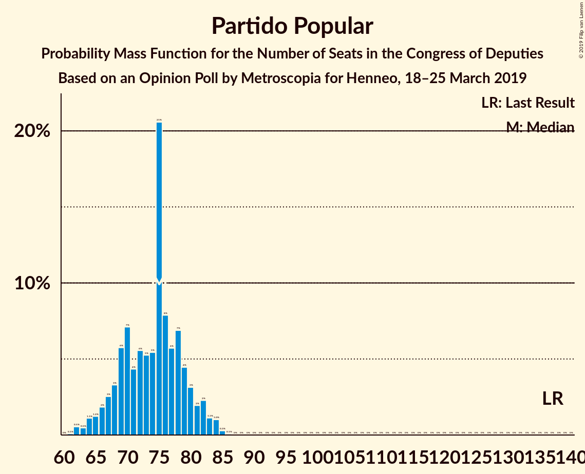
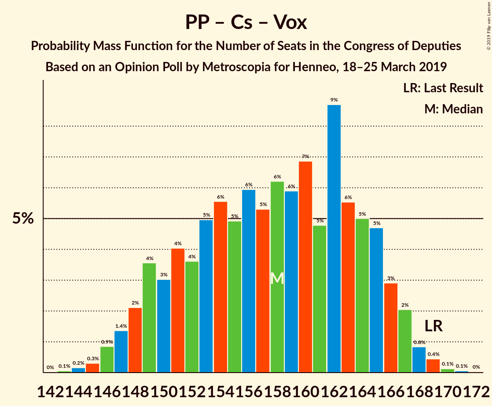

# Opinion Poll by Metroscopia for Henneo, 18–25 March 2019

<a href="#voting-intentions">Voting Intentions</a> | <a href="#seats">Seats</a> | <a href="#coalitions">Coalitions</a> | <a href="#technical-information">Technical Information</a>

## Voting Intentions

### Confidence Intervals

| Party | Last Result | Poll Result | 80% Confidence Interval | 90% Confidence Interval | 95% Confidence Interval | 99% Confidence Interval |
|:-----:|:-----------:|:-----------:|:-----------------------:|:-----------------------:|:-----------------------:|:-----------------------:|
| Partido Socialista Obrero Español | 22.6% | 28.7% | 27.6–29.8% |27.3–30.1% |27.0–30.4% |26.5–31.0% |
| Partido Popular | 33.0% | 19.0% | 18.0–20.0% |17.8–20.3% |17.6–20.5% |17.1–21.0% |
| Ciudadanos–Partido de la Ciudadanía | 13.1% | 16.3% | 15.4–17.3% |15.2–17.5% |15.0–17.8% |14.6–18.2% |
| Unidos Podemos | 21.2% | 14.0% | 13.2–14.9% |12.9–15.1% |12.7–15.4% |12.3–15.8% |
| Vox | 0.2% | 11.7% | 10.9–12.5% |10.7–12.7% |10.5–13.0% |10.2–13.4% |

*Note:* The poll result column reflects the actual value used in the calculations. Published results may vary slightly, and in addition be rounded to fewer digits.

## Seats

### Confidence Intervals

| Party | Last Result | Median | 80% Confidence Interval | 90% Confidence Interval | 95% Confidence Interval | 99% Confidence Interval |
|:-----:|:-----------:|:------:|:-----------------------:|:-----------------------:|:-----------------------:|:-----------------------:|
| <a href="#partido-socialista-obrero-español">Partido Socialista Obrero Español</a> | 85 | 133 | 117–137 |114–137 |114–137 |112–137 |
| <a href="#partido-popular">Partido Popular</a> | 137 | 70 | 63–79 |63–81 |63–81 |63–85 |
| <a href="#ciudadanos–partido-de-la-ciudadanía">Ciudadanos–Partido de la Ciudadanía</a> | 32 | 54 | 50–59 |50–61 |48–61 |46–61 |
| <a href="#unidos-podemos">Unidos Podemos</a> | 71 | 38 | 35–43 |33–43 |32–44 |32–47 |
| <a href="#vox">Vox</a> | 0 | 29 | 25–34 |25–35 |25–35 |23–36 |

### Partido Socialista Obrero Español

*For a full overview of the results for this party, see the [Partido Socialista Obrero Español](party-partidosocialistaobreroespañol.html) page.*

| Number of Seats | Probability | Accumulated | Special Marks |
|:---------------:|:-----------:|:-----------:|:-------------:|
| 85 | 0% | 100% | Last Result |
| 86 | 0% | 100% |  |
| 87 | 0% | 100% |  |
| 88 | 0% | 100% |  |
| 89 | 0% | 100% |  |
| 90 | 0% | 100% |  |
| 91 | 0% | 100% |  |
| 92 | 0% | 100% |  |
| 93 | 0% | 100% |  |
| 94 | 0% | 100% |  |
| 95 | 0% | 100% |  |
| 96 | 0% | 100% |  |
| 97 | 0% | 100% |  |
| 98 | 0% | 100% |  |
| 99 | 0% | 100% |  |
| 100 | 0% | 100% |  |
| 101 | 0% | 100% |  |
| 102 | 0% | 100% |  |
| 103 | 0% | 100% |  |
| 104 | 0% | 100% |  |
| 105 | 0% | 100% |  |
| 106 | 0% | 100% |  |
| 107 | 0% | 100% |  |
| 108 | 0% | 100% |  |
| 109 | 0.2% | 100% |  |
| 110 | 0% | 99.8% |  |
| 111 | 0% | 99.8% |  |
| 112 | 0.9% | 99.8% |  |
| 113 | 0.2% | 98.9% |  |
| 114 | 8% | 98.7% |  |
| 115 | 0% | 91% |  |
| 116 | 0% | 91% |  |
| 117 | 9% | 91% |  |
| 118 | 0% | 82% |  |
| 119 | 0% | 82% |  |
| 120 | 8% | 82% |  |
| 121 | 5% | 74% |  |
| 122 | 0.4% | 69% |  |
| 123 | 1.1% | 69% |  |
| 124 | 0.7% | 67% |  |
| 125 | 0% | 67% |  |
| 126 | 0% | 67% |  |
| 127 | 0.1% | 67% |  |
| 128 | 0.1% | 67% |  |
| 129 | 0.1% | 66% |  |
| 130 | 4% | 66% |  |
| 131 | 0% | 63% |  |
| 132 | 11% | 63% |  |
| 133 | 8% | 51% | Median |
| 134 | 4% | 43% |  |
| 135 | 13% | 39% |  |
| 136 | 10% | 26% |  |
| 137 | 15% | 16% |  |
| 138 | 0% | 0.4% |  |
| 139 | 0.3% | 0.4% |  |
| 140 | 0.1% | 0.2% |  |
| 141 | 0% | 0% |  |

### Partido Popular

*For a full overview of the results for this party, see the [Partido Popular](party-partidopopular.html) page.*

| Number of Seats | Probability | Accumulated | Special Marks |
|:---------------:|:-----------:|:-----------:|:-------------:|
| 61 | 0.1% | 100% |  |
| 62 | 0% | 99.9% |  |
| 63 | 12% | 99.9% |  |
| 64 | 9% | 87% |  |
| 65 | 15% | 79% |  |
| 66 | 0.3% | 64% |  |
| 67 | 1.0% | 64% |  |
| 68 | 0% | 63% |  |
| 69 | 0% | 63% |  |
| 70 | 16% | 63% | Median |
| 71 | 10% | 46% |  |
| 72 | 0.2% | 36% |  |
| 73 | 1.1% | 36% |  |
| 74 | 13% | 35% |  |
| 75 | 2% | 21% |  |
| 76 | 0.2% | 20% |  |
| 77 | 0.4% | 19% |  |
| 78 | 4% | 19% |  |
| 79 | 8% | 15% |  |
| 80 | 0.4% | 7% |  |
| 81 | 5% | 6% |  |
| 82 | 0% | 2% |  |
| 83 | 0% | 2% |  |
| 84 | 0% | 2% |  |
| 85 | 1.2% | 2% |  |
| 86 | 0.1% | 0.3% |  |
| 87 | 0.2% | 0.2% |  |
| 88 | 0% | 0% |  |
| 89 | 0% | 0% |  |
| 90 | 0% | 0% |  |
| 91 | 0% | 0% |  |
| 92 | 0% | 0% |  |
| 93 | 0% | 0% |  |
| 94 | 0% | 0% |  |
| 95 | 0% | 0% |  |
| 96 | 0% | 0% |  |
| 97 | 0% | 0% |  |
| 98 | 0% | 0% |  |
| 99 | 0% | 0% |  |
| 100 | 0% | 0% |  |
| 101 | 0% | 0% |  |
| 102 | 0% | 0% |  |
| 103 | 0% | 0% |  |
| 104 | 0% | 0% |  |
| 105 | 0% | 0% |  |
| 106 | 0% | 0% |  |
| 107 | 0% | 0% |  |
| 108 | 0% | 0% |  |
| 109 | 0% | 0% |  |
| 110 | 0% | 0% |  |
| 111 | 0% | 0% |  |
| 112 | 0% | 0% |  |
| 113 | 0% | 0% |  |
| 114 | 0% | 0% |  |
| 115 | 0% | 0% |  |
| 116 | 0% | 0% |  |
| 117 | 0% | 0% |  |
| 118 | 0% | 0% |  |
| 119 | 0% | 0% |  |
| 120 | 0% | 0% |  |
| 121 | 0% | 0% |  |
| 122 | 0% | 0% |  |
| 123 | 0% | 0% |  |
| 124 | 0% | 0% |  |
| 125 | 0% | 0% |  |
| 126 | 0% | 0% |  |
| 127 | 0% | 0% |  |
| 128 | 0% | 0% |  |
| 129 | 0% | 0% |  |
| 130 | 0% | 0% |  |
| 131 | 0% | 0% |  |
| 132 | 0% | 0% |  |
| 133 | 0% | 0% |  |
| 134 | 0% | 0% |  |
| 135 | 0% | 0% |  |
| 136 | 0% | 0% |  |
| 137 | 0% | 0% | Last Result |

### Ciudadanos–Partido de la Ciudadanía

*For a full overview of the results for this party, see the [Ciudadanos–Partido de la Ciudadanía](party-ciudadanos–partidodelaciudadanía.html) page.*

| Number of Seats | Probability | Accumulated | Special Marks |
|:---------------:|:-----------:|:-----------:|:-------------:|
| 32 | 0% | 100% | Last Result |
| 33 | 0% | 100% |  |
| 34 | 0% | 100% |  |
| 35 | 0% | 100% |  |
| 36 | 0% | 100% |  |
| 37 | 0% | 100% |  |
| 38 | 0% | 100% |  |
| 39 | 0% | 100% |  |
| 40 | 0% | 100% |  |
| 41 | 0% | 100% |  |
| 42 | 0.3% | 100% |  |
| 43 | 0% | 99.7% |  |
| 44 | 0% | 99.7% |  |
| 45 | 0.1% | 99.7% |  |
| 46 | 0.1% | 99.6% |  |
| 47 | 0% | 99.5% |  |
| 48 | 4% | 99.5% |  |
| 49 | 0% | 96% |  |
| 50 | 23% | 96% |  |
| 51 | 0% | 73% |  |
| 52 | 20% | 73% |  |
| 53 | 0.2% | 53% |  |
| 54 | 21% | 52% | Median |
| 55 | 8% | 32% |  |
| 56 | 4% | 24% |  |
| 57 | 1.3% | 19% |  |
| 58 | 0.2% | 18% |  |
| 59 | 8% | 18% |  |
| 60 | 2% | 10% |  |
| 61 | 8% | 8% |  |
| 62 | 0% | 0.4% |  |
| 63 | 0% | 0.3% |  |
| 64 | 0.3% | 0.3% |  |
| 65 | 0% | 0% |  |

### Unidos Podemos

*For a full overview of the results for this party, see the [Unidos Podemos](party-unidospodemos.html) page.*

| Number of Seats | Probability | Accumulated | Special Marks |
|:---------------:|:-----------:|:-----------:|:-------------:|
| 28 | 0.1% | 100% |  |
| 29 | 0% | 99.9% |  |
| 30 | 0% | 99.9% |  |
| 31 | 0.1% | 99.9% |  |
| 32 | 4% | 99.8% |  |
| 33 | 0.9% | 96% |  |
| 34 | 0% | 95% |  |
| 35 | 9% | 95% |  |
| 36 | 32% | 86% |  |
| 37 | 1.4% | 53% |  |
| 38 | 8% | 52% | Median |
| 39 | 0.4% | 44% |  |
| 40 | 20% | 44% |  |
| 41 | 12% | 23% |  |
| 42 | 0.7% | 12% |  |
| 43 | 8% | 11% |  |
| 44 | 0.8% | 3% |  |
| 45 | 0.1% | 2% |  |
| 46 | 0.9% | 2% |  |
| 47 | 0.8% | 0.9% |  |
| 48 | 0% | 0.1% |  |
| 49 | 0% | 0% |  |
| 50 | 0% | 0% |  |
| 51 | 0% | 0% |  |
| 52 | 0% | 0% |  |
| 53 | 0% | 0% |  |
| 54 | 0% | 0% |  |
| 55 | 0% | 0% |  |
| 56 | 0% | 0% |  |
| 57 | 0% | 0% |  |
| 58 | 0% | 0% |  |
| 59 | 0% | 0% |  |
| 60 | 0% | 0% |  |
| 61 | 0% | 0% |  |
| 62 | 0% | 0% |  |
| 63 | 0% | 0% |  |
| 64 | 0% | 0% |  |
| 65 | 0% | 0% |  |
| 66 | 0% | 0% |  |
| 67 | 0% | 0% |  |
| 68 | 0% | 0% |  |
| 69 | 0% | 0% |  |
| 70 | 0% | 0% |  |
| 71 | 0% | 0% | Last Result |

### Vox

*For a full overview of the results for this party, see the [Vox](party-vox.html) page.*

| Number of Seats | Probability | Accumulated | Special Marks |
|:---------------:|:-----------:|:-----------:|:-------------:|
| 0 | 0% | 100% | Last Result |
| 1 | 0% | 100% |  |
| 2 | 0% | 100% |  |
| 3 | 0% | 100% |  |
| 4 | 0% | 100% |  |
| 5 | 0% | 100% |  |
| 6 | 0% | 100% |  |
| 7 | 0% | 100% |  |
| 8 | 0% | 100% |  |
| 9 | 0% | 100% |  |
| 10 | 0% | 100% |  |
| 11 | 0% | 100% |  |
| 12 | 0% | 100% |  |
| 13 | 0% | 100% |  |
| 14 | 0% | 100% |  |
| 15 | 0% | 100% |  |
| 16 | 0% | 100% |  |
| 17 | 0% | 100% |  |
| 18 | 0% | 100% |  |
| 19 | 0% | 100% |  |
| 20 | 0% | 100% |  |
| 21 | 0% | 100% |  |
| 22 | 0% | 100% |  |
| 23 | 2% | 100% |  |
| 24 | 0% | 98% |  |
| 25 | 13% | 98% |  |
| 26 | 10% | 85% |  |
| 27 | 16% | 75% |  |
| 28 | 9% | 59% |  |
| 29 | 2% | 51% | Median |
| 30 | 5% | 49% |  |
| 31 | 0.2% | 44% |  |
| 32 | 26% | 44% |  |
| 33 | 3% | 17% |  |
| 34 | 7% | 15% |  |
| 35 | 7% | 8% |  |
| 36 | 1.0% | 1.1% |  |
| 37 | 0% | 0.1% |  |
| 38 | 0% | 0.1% |  |
| 39 | 0.1% | 0.1% |  |
| 40 | 0% | 0% |  |

## Coalitions

### Confidence Intervals

| Coalition | Last Result | Median | Majority? | 80% Confidence Interval | 90% Confidence Interval | 95% Confidence Interval | 99% Confidence Interval |
|:---------:|:-----------:|:------:|:---------:|:-----------------------:|:-----------------------:|:-----------------------:|:-----------------------:|
| Partido Socialista Obrero Español – Partido Popular – Ciudadanos–Partido de la Ciudadanía | 254 | 252 | 100% | 248–257 | 247–258 | 247–259 | 246–259 |
| Partido Socialista Obrero Español – Ciudadanos–Partido de la Ciudadanía – Unidos Podemos | 188 | 223 | 100% | 210–227 | 209–230 | 209–230 | 206–231 |
| Partido Socialista Obrero Español – Partido Popular | 222 | 202 | 100% | 190–207 | 188–207 | 188–208 | 187–209 |
| Partido Socialista Obrero Español – Ciudadanos–Partido de la Ciudadanía | 117 | 186 | 80% | 173–187 | 173–187 | 172–188 | 169–193 |
| Partido Socialista Obrero Español – Unidos Podemos | 156 | 173 | 8% | 153–175 | 152–176 | 152–176 | 151–176 |
| Partido Popular – Ciudadanos–Partido de la Ciudadanía – Vox | 169 | 149 | 0% | 147–167 | 146–167 | 146–167 | 146–169 |
| Partido Popular – Ciudadanos–Partido de la Ciudadanía | 169 | 122 | 0% | 115–137 | 115–140 | 115–140 | 115–140 |
| Partido Socialista Obrero Español | 85 | 133 | 0% | 117–137 | 114–137 | 114–137 | 112–137 |
| Partido Popular – Vox | 137 | 97 | 0% | 94–109 | 92–111 | 92–111 | 90–114 |
| Partido Popular | 137 | 70 | 0% | 63–79 | 63–81 | 63–81 | 63–85 |

### Partido Socialista Obrero Español – Partido Popular – Ciudadanos–Partido de la Ciudadanía

| Number of Seats | Probability | Accumulated | Special Marks |
|:---------------:|:-----------:|:-----------:|:-------------:|
| 243 | 0.1% | 100% |  |
| 244 | 0.1% | 99.9% |  |
| 245 | 0% | 99.7% |  |
| 246 | 0.2% | 99.7% |  |
| 247 | 8% | 99.5% |  |
| 248 | 3% | 92% |  |
| 249 | 18% | 89% |  |
| 250 | 0% | 71% |  |
| 251 | 9% | 71% |  |
| 252 | 14% | 61% |  |
| 253 | 0.6% | 47% |  |
| 254 | 2% | 46% | Last Result |
| 255 | 0.4% | 44% |  |
| 256 | 9% | 44% |  |
| 257 | 27% | 35% | Median |
| 258 | 4% | 8% |  |
| 259 | 4% | 4% |  |
| 260 | 0% | 0.2% |  |
| 261 | 0.2% | 0.2% |  |
| 262 | 0% | 0.1% |  |
| 263 | 0% | 0.1% |  |
| 264 | 0% | 0.1% |  |
| 265 | 0% | 0% |  |

### Partido Socialista Obrero Español – Ciudadanos–Partido de la Ciudadanía – Unidos Podemos

| Number of Seats | Probability | Accumulated | Special Marks |
|:---------------:|:-----------:|:-----------:|:-------------:|
| 188 | 0% | 100% | Last Result |
| 189 | 0% | 100% |  |
| 190 | 0% | 100% |  |
| 191 | 0% | 100% |  |
| 192 | 0% | 100% |  |
| 193 | 0% | 100% |  |
| 194 | 0% | 100% |  |
| 195 | 0% | 100% |  |
| 196 | 0% | 100% |  |
| 197 | 0% | 100% |  |
| 198 | 0% | 100% |  |
| 199 | 0% | 100% |  |
| 200 | 0% | 100% |  |
| 201 | 0% | 100% |  |
| 202 | 0% | 100% |  |
| 203 | 0% | 100% |  |
| 204 | 0.1% | 100% |  |
| 205 | 0% | 99.9% |  |
| 206 | 1.5% | 99.9% |  |
| 207 | 0% | 98% |  |
| 208 | 0.1% | 98% |  |
| 209 | 4% | 98% |  |
| 210 | 8% | 94% |  |
| 211 | 9% | 87% |  |
| 212 | 0.3% | 77% |  |
| 213 | 0.3% | 77% |  |
| 214 | 8% | 77% |  |
| 215 | 0% | 69% |  |
| 216 | 0% | 69% |  |
| 217 | 0.2% | 69% |  |
| 218 | 4% | 69% |  |
| 219 | 0.6% | 65% |  |
| 220 | 0.4% | 64% |  |
| 221 | 0% | 64% |  |
| 222 | 7% | 64% |  |
| 223 | 14% | 57% |  |
| 224 | 4% | 42% |  |
| 225 | 0% | 39% | Median |
| 226 | 4% | 39% |  |
| 227 | 25% | 35% |  |
| 228 | 0.1% | 10% |  |
| 229 | 0.5% | 10% |  |
| 230 | 8% | 9% |  |
| 231 | 0.8% | 0.9% |  |
| 232 | 0% | 0.2% |  |
| 233 | 0% | 0.2% |  |
| 234 | 0.1% | 0.1% |  |
| 235 | 0% | 0% |  |

### Partido Socialista Obrero Español – Partido Popular

| Number of Seats | Probability | Accumulated | Special Marks |
|:---------------:|:-----------:|:-----------:|:-------------:|
| 184 | 0.1% | 100% |  |
| 185 | 0.1% | 99.9% |  |
| 186 | 0.1% | 99.8% |  |
| 187 | 1.0% | 99.7% |  |
| 188 | 7% | 98.7% |  |
| 189 | 2% | 92% |  |
| 190 | 0.7% | 91% |  |
| 191 | 0% | 90% |  |
| 192 | 0% | 90% |  |
| 193 | 1.2% | 90% |  |
| 194 | 7% | 89% |  |
| 195 | 11% | 81% |  |
| 196 | 8% | 70% |  |
| 197 | 8% | 62% |  |
| 198 | 0.2% | 54% |  |
| 199 | 0% | 53% |  |
| 200 | 0.8% | 53% |  |
| 201 | 1.4% | 53% |  |
| 202 | 20% | 51% |  |
| 203 | 0.1% | 32% | Median |
| 204 | 5% | 32% |  |
| 205 | 13% | 27% |  |
| 206 | 0% | 14% |  |
| 207 | 10% | 14% |  |
| 208 | 3% | 4% |  |
| 209 | 0.1% | 0.6% |  |
| 210 | 0% | 0.5% |  |
| 211 | 0.1% | 0.5% |  |
| 212 | 0% | 0.3% |  |
| 213 | 0% | 0.3% |  |
| 214 | 0.3% | 0.3% |  |
| 215 | 0% | 0% |  |
| 216 | 0% | 0% |  |
| 217 | 0% | 0% |  |
| 218 | 0% | 0% |  |
| 219 | 0% | 0% |  |
| 220 | 0% | 0% |  |
| 221 | 0% | 0% |  |
| 222 | 0% | 0% | Last Result |

### Partido Socialista Obrero Español – Ciudadanos–Partido de la Ciudadanía

| Number of Seats | Probability | Accumulated | Special Marks |
|:---------------:|:-----------:|:-----------:|:-------------:|
| 117 | 0% | 100% | Last Result |
| 118 | 0% | 100% |  |
| 119 | 0% | 100% |  |
| 120 | 0% | 100% |  |
| 121 | 0% | 100% |  |
| 122 | 0% | 100% |  |
| 123 | 0% | 100% |  |
| 124 | 0% | 100% |  |
| 125 | 0% | 100% |  |
| 126 | 0% | 100% |  |
| 127 | 0% | 100% |  |
| 128 | 0% | 100% |  |
| 129 | 0% | 100% |  |
| 130 | 0% | 100% |  |
| 131 | 0% | 100% |  |
| 132 | 0% | 100% |  |
| 133 | 0% | 100% |  |
| 134 | 0% | 100% |  |
| 135 | 0% | 100% |  |
| 136 | 0% | 100% |  |
| 137 | 0% | 100% |  |
| 138 | 0% | 100% |  |
| 139 | 0% | 100% |  |
| 140 | 0% | 100% |  |
| 141 | 0% | 100% |  |
| 142 | 0% | 100% |  |
| 143 | 0% | 100% |  |
| 144 | 0% | 100% |  |
| 145 | 0% | 100% |  |
| 146 | 0% | 100% |  |
| 147 | 0% | 100% |  |
| 148 | 0% | 100% |  |
| 149 | 0% | 100% |  |
| 150 | 0% | 100% |  |
| 151 | 0% | 100% |  |
| 152 | 0% | 100% |  |
| 153 | 0% | 100% |  |
| 154 | 0% | 100% |  |
| 155 | 0% | 100% |  |
| 156 | 0% | 100% |  |
| 157 | 0% | 100% |  |
| 158 | 0% | 100% |  |
| 159 | 0% | 100% |  |
| 160 | 0% | 100% |  |
| 161 | 0% | 100% |  |
| 162 | 0% | 100% |  |
| 163 | 0% | 100% |  |
| 164 | 0% | 100% |  |
| 165 | 0% | 100% |  |
| 166 | 0% | 100% |  |
| 167 | 0.2% | 100% |  |
| 168 | 0.2% | 99.8% |  |
| 169 | 0.8% | 99.6% |  |
| 170 | 0% | 98.8% |  |
| 171 | 1.2% | 98.8% |  |
| 172 | 0.1% | 98% |  |
| 173 | 9% | 97% |  |
| 174 | 0.3% | 89% |  |
| 175 | 8% | 88% |  |
| 176 | 0.3% | 80% | Majority |
| 177 | 4% | 80% |  |
| 178 | 12% | 76% |  |
| 179 | 0% | 64% |  |
| 180 | 0% | 64% |  |
| 181 | 0% | 64% |  |
| 182 | 0% | 64% |  |
| 183 | 0.8% | 64% |  |
| 184 | 0.7% | 63% |  |
| 185 | 0% | 63% |  |
| 186 | 23% | 63% |  |
| 187 | 36% | 40% | Median |
| 188 | 3% | 4% |  |
| 189 | 0% | 0.9% |  |
| 190 | 0.1% | 0.9% |  |
| 191 | 0% | 0.8% |  |
| 192 | 0% | 0.8% |  |
| 193 | 0.5% | 0.7% |  |
| 194 | 0.2% | 0.3% |  |
| 195 | 0% | 0% |  |

### Partido Socialista Obrero Español – Unidos Podemos

| Number of Seats | Probability | Accumulated | Special Marks |
|:---------------:|:-----------:|:-----------:|:-------------:|
| 148 | 0.2% | 100% |  |
| 149 | 0% | 99.8% |  |
| 150 | 0.1% | 99.8% |  |
| 151 | 0.2% | 99.7% |  |
| 152 | 9% | 99.4% |  |
| 153 | 11% | 90% |  |
| 154 | 2% | 79% |  |
| 155 | 8% | 77% |  |
| 156 | 0.2% | 69% | Last Result |
| 157 | 0% | 69% |  |
| 158 | 0.1% | 69% |  |
| 159 | 0% | 69% |  |
| 160 | 0% | 69% |  |
| 161 | 0% | 69% |  |
| 162 | 0% | 69% |  |
| 163 | 0% | 69% |  |
| 164 | 0% | 69% |  |
| 165 | 0% | 69% |  |
| 166 | 0% | 69% |  |
| 167 | 1.4% | 69% |  |
| 168 | 0.4% | 68% |  |
| 169 | 0.2% | 67% |  |
| 170 | 4% | 67% |  |
| 171 | 1.0% | 64% | Median |
| 172 | 10% | 63% |  |
| 173 | 26% | 52% |  |
| 174 | 5% | 26% |  |
| 175 | 13% | 21% |  |
| 176 | 8% | 8% | Majority |
| 177 | 0% | 0% |  |

### Partido Popular – Ciudadanos–Partido de la Ciudadanía – Vox

| Number of Seats | Probability | Accumulated | Special Marks |
|:---------------:|:-----------:|:-----------:|:-------------:|
| 146 | 8% | 100% |  |
| 147 | 28% | 92% |  |
| 148 | 11% | 64% |  |
| 149 | 15% | 52% |  |
| 150 | 1.0% | 38% |  |
| 151 | 0.1% | 36% |  |
| 152 | 4% | 36% |  |
| 153 | 0.3% | 33% | Median |
| 154 | 2% | 33% |  |
| 155 | 0.1% | 31% |  |
| 156 | 0% | 31% |  |
| 157 | 0% | 31% |  |
| 158 | 0% | 31% |  |
| 159 | 0% | 31% |  |
| 160 | 0% | 31% |  |
| 161 | 0% | 31% |  |
| 162 | 0% | 31% |  |
| 163 | 0.2% | 31% |  |
| 164 | 8% | 31% |  |
| 165 | 0.1% | 23% |  |
| 166 | 0.1% | 23% |  |
| 167 | 21% | 23% |  |
| 168 | 1.3% | 2% |  |
| 169 | 0.4% | 0.6% | Last Result |
| 170 | 0% | 0.2% |  |
| 171 | 0% | 0.2% |  |
| 172 | 0.2% | 0.2% |  |
| 173 | 0% | 0% |  |

### Partido Popular – Ciudadanos–Partido de la Ciudadanía

| Number of Seats | Probability | Accumulated | Special Marks |
|:---------------:|:-----------:|:-----------:|:-------------:|
| 114 | 0.2% | 100% |  |
| 115 | 15% | 99.8% |  |
| 116 | 0.1% | 85% |  |
| 117 | 12% | 85% |  |
| 118 | 8% | 73% |  |
| 119 | 0% | 64% |  |
| 120 | 0.6% | 64% |  |
| 121 | 7% | 64% |  |
| 122 | 17% | 57% |  |
| 123 | 4% | 40% |  |
| 124 | 0.2% | 36% | Median |
| 125 | 0.4% | 36% |  |
| 126 | 3% | 36% |  |
| 127 | 0.1% | 32% |  |
| 128 | 1.2% | 32% |  |
| 129 | 7% | 31% |  |
| 130 | 0% | 25% |  |
| 131 | 2% | 24% |  |
| 132 | 0.1% | 23% |  |
| 133 | 7% | 23% |  |
| 134 | 2% | 16% |  |
| 135 | 0.8% | 15% |  |
| 136 | 0.3% | 14% |  |
| 137 | 4% | 13% |  |
| 138 | 0.6% | 10% |  |
| 139 | 1.2% | 9% |  |
| 140 | 7% | 8% |  |
| 141 | 0% | 0.4% |  |
| 142 | 0.2% | 0.4% |  |
| 143 | 0% | 0.2% |  |
| 144 | 0% | 0.2% |  |
| 145 | 0.2% | 0.2% |  |
| 146 | 0% | 0% |  |
| 147 | 0% | 0% |  |
| 148 | 0% | 0% |  |
| 149 | 0% | 0% |  |
| 150 | 0% | 0% |  |
| 151 | 0% | 0% |  |
| 152 | 0% | 0% |  |
| 153 | 0% | 0% |  |
| 154 | 0% | 0% |  |
| 155 | 0% | 0% |  |
| 156 | 0% | 0% |  |
| 157 | 0% | 0% |  |
| 158 | 0% | 0% |  |
| 159 | 0% | 0% |  |
| 160 | 0% | 0% |  |
| 161 | 0% | 0% |  |
| 162 | 0% | 0% |  |
| 163 | 0% | 0% |  |
| 164 | 0% | 0% |  |
| 165 | 0% | 0% |  |
| 166 | 0% | 0% |  |
| 167 | 0% | 0% |  |
| 168 | 0% | 0% |  |
| 169 | 0% | 0% | Last Result |

### Partido Socialista Obrero Español

| Number of Seats | Probability | Accumulated | Special Marks |
|:---------------:|:-----------:|:-----------:|:-------------:|
| 85 | 0% | 100% | Last Result |
| 86 | 0% | 100% |  |
| 87 | 0% | 100% |  |
| 88 | 0% | 100% |  |
| 89 | 0% | 100% |  |
| 90 | 0% | 100% |  |
| 91 | 0% | 100% |  |
| 92 | 0% | 100% |  |
| 93 | 0% | 100% |  |
| 94 | 0% | 100% |  |
| 95 | 0% | 100% |  |
| 96 | 0% | 100% |  |
| 97 | 0% | 100% |  |
| 98 | 0% | 100% |  |
| 99 | 0% | 100% |  |
| 100 | 0% | 100% |  |
| 101 | 0% | 100% |  |
| 102 | 0% | 100% |  |
| 103 | 0% | 100% |  |
| 104 | 0% | 100% |  |
| 105 | 0% | 100% |  |
| 106 | 0% | 100% |  |
| 107 | 0% | 100% |  |
| 108 | 0% | 100% |  |
| 109 | 0.2% | 100% |  |
| 110 | 0% | 99.8% |  |
| 111 | 0% | 99.8% |  |
| 112 | 0.9% | 99.8% |  |
| 113 | 0.2% | 98.9% |  |
| 114 | 8% | 98.7% |  |
| 115 | 0% | 91% |  |
| 116 | 0% | 91% |  |
| 117 | 9% | 91% |  |
| 118 | 0% | 82% |  |
| 119 | 0% | 82% |  |
| 120 | 8% | 82% |  |
| 121 | 5% | 74% |  |
| 122 | 0.4% | 69% |  |
| 123 | 1.1% | 69% |  |
| 124 | 0.7% | 67% |  |
| 125 | 0% | 67% |  |
| 126 | 0% | 67% |  |
| 127 | 0.1% | 67% |  |
| 128 | 0.1% | 67% |  |
| 129 | 0.1% | 66% |  |
| 130 | 4% | 66% |  |
| 131 | 0% | 63% |  |
| 132 | 11% | 63% |  |
| 133 | 8% | 51% | Median |
| 134 | 4% | 43% |  |
| 135 | 13% | 39% |  |
| 136 | 10% | 26% |  |
| 137 | 15% | 16% |  |
| 138 | 0% | 0.4% |  |
| 139 | 0.3% | 0.4% |  |
| 140 | 0.1% | 0.2% |  |
| 141 | 0% | 0% |  |

### Partido Popular – Vox

| Number of Seats | Probability | Accumulated | Special Marks |
|:---------------:|:-----------:|:-----------:|:-------------:|
| 88 | 0.1% | 100% |  |
| 89 | 0% | 99.9% |  |
| 90 | 0.8% | 99.9% |  |
| 91 | 0.6% | 99.0% |  |
| 92 | 8% | 98% |  |
| 93 | 0.1% | 90% |  |
| 94 | 0.6% | 90% |  |
| 95 | 24% | 90% |  |
| 96 | 4% | 65% |  |
| 97 | 18% | 61% |  |
| 98 | 8% | 44% |  |
| 99 | 0.2% | 36% | Median |
| 100 | 0% | 36% |  |
| 101 | 0% | 36% |  |
| 102 | 0.9% | 36% |  |
| 103 | 0.2% | 35% |  |
| 104 | 4% | 35% |  |
| 105 | 0.2% | 31% |  |
| 106 | 7% | 31% |  |
| 107 | 0.2% | 24% |  |
| 108 | 9% | 23% |  |
| 109 | 8% | 15% |  |
| 110 | 1.3% | 7% |  |
| 111 | 4% | 6% |  |
| 112 | 0% | 2% |  |
| 113 | 0.1% | 2% |  |
| 114 | 1.4% | 2% |  |
| 115 | 0% | 0.2% |  |
| 116 | 0.1% | 0.1% |  |
| 117 | 0% | 0% |  |
| 118 | 0% | 0% |  |
| 119 | 0% | 0% |  |
| 120 | 0% | 0% |  |
| 121 | 0% | 0% |  |
| 122 | 0% | 0% |  |
| 123 | 0% | 0% |  |
| 124 | 0% | 0% |  |
| 125 | 0% | 0% |  |
| 126 | 0% | 0% |  |
| 127 | 0% | 0% |  |
| 128 | 0% | 0% |  |
| 129 | 0% | 0% |  |
| 130 | 0% | 0% |  |
| 131 | 0% | 0% |  |
| 132 | 0% | 0% |  |
| 133 | 0% | 0% |  |
| 134 | 0% | 0% |  |
| 135 | 0% | 0% |  |
| 136 | 0% | 0% |  |
| 137 | 0% | 0% | Last Result |

### Partido Popular

| Number of Seats | Probability | Accumulated | Special Marks |
|:---------------:|:-----------:|:-----------:|:-------------:|
| 61 | 0.1% | 100% |  |
| 62 | 0% | 99.9% |  |
| 63 | 12% | 99.9% |  |
| 64 | 9% | 87% |  |
| 65 | 15% | 79% |  |
| 66 | 0.3% | 64% |  |
| 67 | 1.0% | 64% |  |
| 68 | 0% | 63% |  |
| 69 | 0% | 63% |  |
| 70 | 16% | 63% | Median |
| 71 | 10% | 46% |  |
| 72 | 0.2% | 36% |  |
| 73 | 1.1% | 36% |  |
| 74 | 13% | 35% |  |
| 75 | 2% | 21% |  |
| 76 | 0.2% | 20% |  |
| 77 | 0.4% | 19% |  |
| 78 | 4% | 19% |  |
| 79 | 8% | 15% |  |
| 80 | 0.4% | 7% |  |
| 81 | 5% | 6% |  |
| 82 | 0% | 2% |  |
| 83 | 0% | 2% |  |
| 84 | 0% | 2% |  |
| 85 | 1.2% | 2% |  |
| 86 | 0.1% | 0.3% |  |
| 87 | 0.2% | 0.2% |  |
| 88 | 0% | 0% |  |
| 89 | 0% | 0% |  |
| 90 | 0% | 0% |  |
| 91 | 0% | 0% |  |
| 92 | 0% | 0% |  |
| 93 | 0% | 0% |  |
| 94 | 0% | 0% |  |
| 95 | 0% | 0% |  |
| 96 | 0% | 0% |  |
| 97 | 0% | 0% |  |
| 98 | 0% | 0% |  |
| 99 | 0% | 0% |  |
| 100 | 0% | 0% |  |
| 101 | 0% | 0% |  |
| 102 | 0% | 0% |  |
| 103 | 0% | 0% |  |
| 104 | 0% | 0% |  |
| 105 | 0% | 0% |  |
| 106 | 0% | 0% |  |
| 107 | 0% | 0% |  |
| 108 | 0% | 0% |  |
| 109 | 0% | 0% |  |
| 110 | 0% | 0% |  |
| 111 | 0% | 0% |  |
| 112 | 0% | 0% |  |
| 113 | 0% | 0% |  |
| 114 | 0% | 0% |  |
| 115 | 0% | 0% |  |
| 116 | 0% | 0% |  |
| 117 | 0% | 0% |  |
| 118 | 0% | 0% |  |
| 119 | 0% | 0% |  |
| 120 | 0% | 0% |  |
| 121 | 0% | 0% |  |
| 122 | 0% | 0% |  |
| 123 | 0% | 0% |  |
| 124 | 0% | 0% |  |
| 125 | 0% | 0% |  |
| 126 | 0% | 0% |  |
| 127 | 0% | 0% |  |
| 128 | 0% | 0% |  |
| 129 | 0% | 0% |  |
| 130 | 0% | 0% |  |
| 131 | 0% | 0% |  |
| 132 | 0% | 0% |  |
| 133 | 0% | 0% |  |
| 134 | 0% | 0% |  |
| 135 | 0% | 0% |  |
| 136 | 0% | 0% |  |
| 137 | 0% | 0% | Last Result |

## Technical Information

### Opinion Poll

+ **Polling firm:** Metroscopia
+ **Commissioner(s):** Henneo
+ **Fieldwork period:** 18–25 March 2019

### Calculations

+ **Sample size:** 2722
+ **Simulations done:** 1,024
+ **Error estimate:** 1.59%

