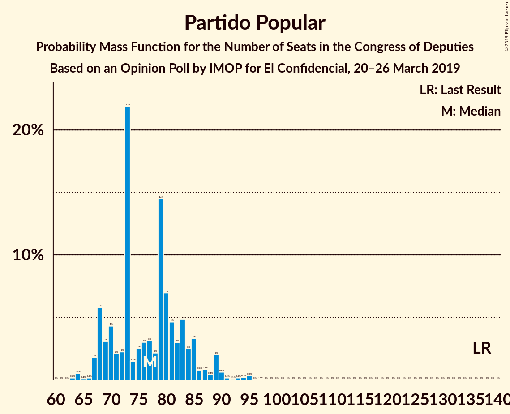
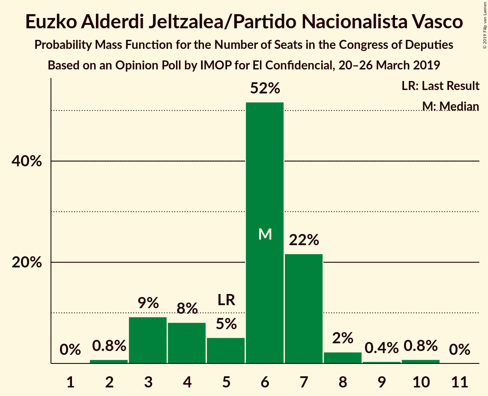
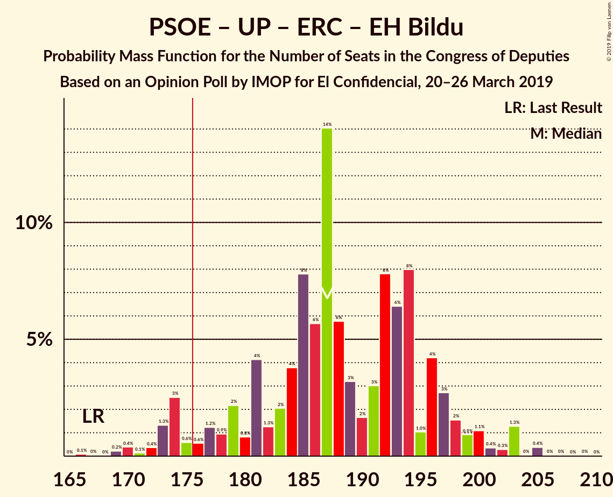
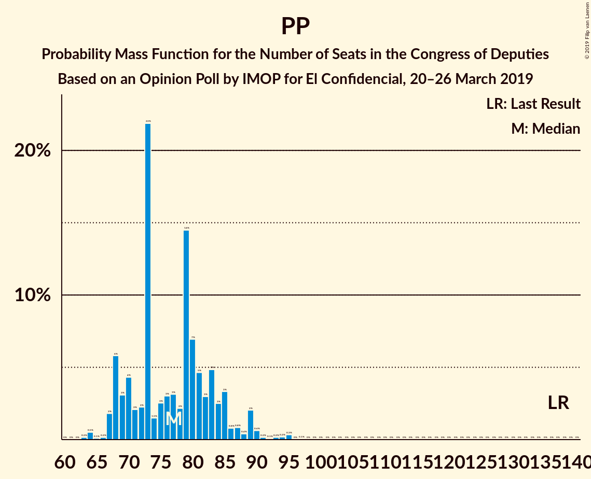

# Opinion Poll by IMOP for El Confidencial, 20–26 March 2019

<a href="#voting-intentions">Voting Intentions</a> | <a href="#seats">Seats</a> | <a href="#coalitions">Coalitions</a> | <a href="#technical-information">Technical Information</a>

## Voting Intentions

### Confidence Intervals

| Party | Last Result | Poll Result | 80% Confidence Interval | 90% Confidence Interval | 95% Confidence Interval | 99% Confidence Interval |
|:-----:|:-----------:|:-----------:|:-----------------------:|:-----------------------:|:-----------------------:|:-----------------------:|
| Partido Socialista Obrero Español | 22.6% | 31.0% | 29.4–32.6% |29.0–33.1% |28.6–33.5% |27.9–34.3% |
| Partido Popular | 33.0% | 20.0% | 18.7–21.4% |18.3–21.8% |18.0–22.2% |17.4–22.9% |
| Ciudadanos–Partido de la Ciudadanía | 13.1% | 14.9% | 13.8–16.2% |13.4–16.6% |13.2–16.9% |12.6–17.5% |
| Unidos Podemos | 21.2% | 12.6% | 11.6–13.9% |11.3–14.2% |11.0–14.5% |10.5–15.1% |
| Vox | 0.2% | 10.1% | 9.1–11.2% |8.8–11.5% |8.6–11.8% |8.2–12.3% |
| Esquerra Republicana de Catalunya–Catalunya Sí | 2.7% | 3.3% | 2.7–4.0% |2.6–4.2% |2.5–4.4% |2.2–4.7% |
| Partido Animalista Contra el Maltrato Animal | 1.2% | 2.0% | 1.6–2.6% |1.5–2.7% |1.4–2.9% |1.2–3.2% |
| Partit Demòcrata Europeu Català | 2.0% | 1.3% | 1.0–1.8% |0.9–1.9% |0.8–2.0% |0.7–2.3% |
| Euzko Alderdi Jeltzalea/Partido Nacionalista Vasco | 1.2% | 1.2% | 0.9–1.7% |0.8–1.8% |0.8–1.9% |0.6–2.2% |
| Euskal Herria Bildu | 0.8% | 1.1% | 0.8–1.5% |0.7–1.6% |0.6–1.8% |0.5–2.0% |

*Note:* The poll result column reflects the actual value used in the calculations. Published results may vary slightly, and in addition be rounded to fewer digits.

## Seats

### Confidence Intervals

| Party | Last Result | Median | 80% Confidence Interval | 90% Confidence Interval | 95% Confidence Interval | 99% Confidence Interval |
|:-----:|:-----------:|:------:|:-----------------------:|:-----------------------:|:-----------------------:|:-----------------------:|
| <a href="#partido-socialista-obrero-español">Partido Socialista Obrero Español</a> | 85 | 136 | 129–144 |125–147 |124–147 |117–150 |
| <a href="#partido-popular">Partido Popular</a> | 137 | 77 | 69–84 |68–86 |67–89 |64–94 |
| <a href="#ciudadanos–partido-de-la-ciudadanía">Ciudadanos–Partido de la Ciudadanía</a> | 32 | 49 | 42–53 |39–55 |38–56 |36–60 |
| <a href="#unidos-podemos">Unidos Podemos</a> | 71 | 33 | 28–37 |27–38 |25–39 |23–42 |
| <a href="#vox">Vox</a> | 0 | 24 | 19–29 |17–30 |17–30 |16–34 |
| <a href="#esquerra-republicana-de-catalunya–catalunya-sí">Esquerra Republicana de Catalunya–Catalunya Sí</a> | 9 | 14 | 12–16 |11–17 |11–17 |10–20 |
| <a href="#partido-animalista-contra-el-maltrato-animal">Partido Animalista Contra el Maltrato Animal</a> | 0 | 1 | 0–1 |0–1 |0–1 |0–1 |
| <a href="#partit-demòcrata-europeu-català">Partit Demòcrata Europeu Català</a> | 8 | 5 | 4–7 |3–8 |2–8 |1–9 |
| <a href="#euzko-alderdi-jeltzalea/partido-nacionalista-vasco">Euzko Alderdi Jeltzalea/Partido Nacionalista Vasco</a> | 5 | 6 | 3–7 |3–7 |3–8 |2–10 |
| <a href="#euskal-herria-bildu">Euskal Herria Bildu</a> | 2 | 5 | 3–7 |3–7 |2–7 |1–9 |

### Partido Socialista Obrero Español

*For a full overview of the results for this party, see the [Partido Socialista Obrero Español](party-partidosocialistaobreroespañol.html) page.*

| Number of Seats | Probability | Accumulated | Special Marks |
|:---------------:|:-----------:|:-----------:|:-------------:|
| 85 | 0% | 100% | Last Result |
| 86 | 0% | 100% |  |
| 87 | 0% | 100% |  |
| 88 | 0% | 100% |  |
| 89 | 0% | 100% |  |
| 90 | 0% | 100% |  |
| 91 | 0% | 100% |  |
| 92 | 0% | 100% |  |
| 93 | 0% | 100% |  |
| 94 | 0% | 100% |  |
| 95 | 0% | 100% |  |
| 96 | 0% | 100% |  |
| 97 | 0% | 100% |  |
| 98 | 0% | 100% |  |
| 99 | 0% | 100% |  |
| 100 | 0% | 100% |  |
| 101 | 0% | 100% |  |
| 102 | 0% | 100% |  |
| 103 | 0% | 100% |  |
| 104 | 0% | 100% |  |
| 105 | 0% | 100% |  |
| 106 | 0% | 100% |  |
| 107 | 0% | 100% |  |
| 108 | 0% | 100% |  |
| 109 | 0% | 100% |  |
| 110 | 0% | 100% |  |
| 111 | 0% | 100% |  |
| 112 | 0% | 100% |  |
| 113 | 0% | 100% |  |
| 114 | 0% | 100% |  |
| 115 | 0% | 100% |  |
| 116 | 0% | 100% |  |
| 117 | 0.5% | 99.9% |  |
| 118 | 0% | 99.5% |  |
| 119 | 0.1% | 99.4% |  |
| 120 | 0.1% | 99.4% |  |
| 121 | 0.4% | 99.3% |  |
| 122 | 0.5% | 98.9% |  |
| 123 | 0.4% | 98% |  |
| 124 | 1.1% | 98% |  |
| 125 | 3% | 97% |  |
| 126 | 0.7% | 94% |  |
| 127 | 0.9% | 94% |  |
| 128 | 2% | 93% |  |
| 129 | 3% | 90% |  |
| 130 | 1.4% | 87% |  |
| 131 | 6% | 86% |  |
| 132 | 3% | 79% |  |
| 133 | 8% | 76% |  |
| 134 | 9% | 68% |  |
| 135 | 2% | 59% |  |
| 136 | 12% | 57% | Median |
| 137 | 8% | 45% |  |
| 138 | 3% | 37% |  |
| 139 | 4% | 34% |  |
| 140 | 4% | 31% |  |
| 141 | 10% | 26% |  |
| 142 | 6% | 16% |  |
| 143 | 0.6% | 11% |  |
| 144 | 2% | 10% |  |
| 145 | 0.7% | 9% |  |
| 146 | 1.0% | 8% |  |
| 147 | 5% | 7% |  |
| 148 | 0.5% | 1.3% |  |
| 149 | 0.3% | 0.9% |  |
| 150 | 0.1% | 0.5% |  |
| 151 | 0.3% | 0.4% |  |
| 152 | 0.1% | 0.1% |  |
| 153 | 0% | 0.1% |  |
| 154 | 0% | 0.1% |  |
| 155 | 0% | 0% |  |

### Partido Popular

*For a full overview of the results for this party, see the [Partido Popular](party-partidopopular.html) page.*

| Number of Seats | Probability | Accumulated | Special Marks |
|:---------------:|:-----------:|:-----------:|:-------------:|
| 63 | 0.2% | 100% |  |
| 64 | 0.5% | 99.8% |  |
| 65 | 0.1% | 99.3% |  |
| 66 | 0.2% | 99.2% |  |
| 67 | 2% | 99.0% |  |
| 68 | 6% | 97% |  |
| 69 | 3% | 91% |  |
| 70 | 4% | 88% |  |
| 71 | 2% | 84% |  |
| 72 | 2% | 82% |  |
| 73 | 22% | 80% |  |
| 74 | 1.5% | 58% |  |
| 75 | 3% | 56% |  |
| 76 | 3% | 54% |  |
| 77 | 3% | 51% | Median |
| 78 | 2% | 48% |  |
| 79 | 14% | 45% |  |
| 80 | 7% | 31% |  |
| 81 | 5% | 24% |  |
| 82 | 3% | 19% |  |
| 83 | 5% | 16% |  |
| 84 | 3% | 12% |  |
| 85 | 3% | 9% |  |
| 86 | 0.8% | 6% |  |
| 87 | 0.8% | 5% |  |
| 88 | 0.4% | 4% |  |
| 89 | 2% | 4% |  |
| 90 | 0.6% | 2% |  |
| 91 | 0.2% | 1.1% |  |
| 92 | 0.1% | 0.9% |  |
| 93 | 0.2% | 0.8% |  |
| 94 | 0.2% | 0.7% |  |
| 95 | 0.3% | 0.5% |  |
| 96 | 0% | 0.1% |  |
| 97 | 0.1% | 0.1% |  |
| 98 | 0% | 0% |  |
| 99 | 0% | 0% |  |
| 100 | 0% | 0% |  |
| 101 | 0% | 0% |  |
| 102 | 0% | 0% |  |
| 103 | 0% | 0% |  |
| 104 | 0% | 0% |  |
| 105 | 0% | 0% |  |
| 106 | 0% | 0% |  |
| 107 | 0% | 0% |  |
| 108 | 0% | 0% |  |
| 109 | 0% | 0% |  |
| 110 | 0% | 0% |  |
| 111 | 0% | 0% |  |
| 112 | 0% | 0% |  |
| 113 | 0% | 0% |  |
| 114 | 0% | 0% |  |
| 115 | 0% | 0% |  |
| 116 | 0% | 0% |  |
| 117 | 0% | 0% |  |
| 118 | 0% | 0% |  |
| 119 | 0% | 0% |  |
| 120 | 0% | 0% |  |
| 121 | 0% | 0% |  |
| 122 | 0% | 0% |  |
| 123 | 0% | 0% |  |
| 124 | 0% | 0% |  |
| 125 | 0% | 0% |  |
| 126 | 0% | 0% |  |
| 127 | 0% | 0% |  |
| 128 | 0% | 0% |  |
| 129 | 0% | 0% |  |
| 130 | 0% | 0% |  |
| 131 | 0% | 0% |  |
| 132 | 0% | 0% |  |
| 133 | 0% | 0% |  |
| 134 | 0% | 0% |  |
| 135 | 0% | 0% |  |
| 136 | 0% | 0% |  |
| 137 | 0% | 0% | Last Result |

### Ciudadanos–Partido de la Ciudadanía

*For a full overview of the results for this party, see the [Ciudadanos–Partido de la Ciudadanía](party-ciudadanos–partidodelaciudadanía.html) page.*

| Number of Seats | Probability | Accumulated | Special Marks |
|:---------------:|:-----------:|:-----------:|:-------------:|
| 31 | 0.1% | 100% |  |
| 32 | 0% | 99.9% | Last Result |
| 33 | 0% | 99.8% |  |
| 34 | 0.1% | 99.8% |  |
| 35 | 0.2% | 99.7% |  |
| 36 | 0.5% | 99.5% |  |
| 37 | 0.1% | 99.0% |  |
| 38 | 3% | 99.0% |  |
| 39 | 2% | 96% |  |
| 40 | 1.3% | 95% |  |
| 41 | 3% | 93% |  |
| 42 | 6% | 90% |  |
| 43 | 1.0% | 84% |  |
| 44 | 7% | 83% |  |
| 45 | 3% | 75% |  |
| 46 | 4% | 73% |  |
| 47 | 5% | 69% |  |
| 48 | 10% | 64% |  |
| 49 | 5% | 54% | Median |
| 50 | 15% | 50% |  |
| 51 | 7% | 34% |  |
| 52 | 5% | 27% |  |
| 53 | 15% | 22% |  |
| 54 | 1.4% | 7% |  |
| 55 | 0.7% | 5% |  |
| 56 | 3% | 4% |  |
| 57 | 0.3% | 2% |  |
| 58 | 0.2% | 1.4% |  |
| 59 | 0.6% | 1.2% |  |
| 60 | 0.2% | 0.6% |  |
| 61 | 0.1% | 0.4% |  |
| 62 | 0.2% | 0.3% |  |
| 63 | 0% | 0.1% |  |
| 64 | 0% | 0% |  |

### Unidos Podemos

*For a full overview of the results for this party, see the [Unidos Podemos](party-unidospodemos.html) page.*

| Number of Seats | Probability | Accumulated | Special Marks |
|:---------------:|:-----------:|:-----------:|:-------------:|
| 22 | 0.1% | 100% |  |
| 23 | 1.2% | 99.9% |  |
| 24 | 0.7% | 98.7% |  |
| 25 | 0.9% | 98% |  |
| 26 | 1.3% | 97% |  |
| 27 | 1.3% | 96% |  |
| 28 | 5% | 94% |  |
| 29 | 8% | 90% |  |
| 30 | 3% | 81% |  |
| 31 | 10% | 78% |  |
| 32 | 4% | 68% |  |
| 33 | 19% | 64% | Median |
| 34 | 7% | 45% |  |
| 35 | 17% | 38% |  |
| 36 | 8% | 21% |  |
| 37 | 6% | 14% |  |
| 38 | 4% | 8% |  |
| 39 | 2% | 4% |  |
| 40 | 1.2% | 2% |  |
| 41 | 0.2% | 1.2% |  |
| 42 | 0.8% | 1.0% |  |
| 43 | 0% | 0.2% |  |
| 44 | 0.1% | 0.1% |  |
| 45 | 0% | 0.1% |  |
| 46 | 0% | 0% |  |
| 47 | 0% | 0% |  |
| 48 | 0% | 0% |  |
| 49 | 0% | 0% |  |
| 50 | 0% | 0% |  |
| 51 | 0% | 0% |  |
| 52 | 0% | 0% |  |
| 53 | 0% | 0% |  |
| 54 | 0% | 0% |  |
| 55 | 0% | 0% |  |
| 56 | 0% | 0% |  |
| 57 | 0% | 0% |  |
| 58 | 0% | 0% |  |
| 59 | 0% | 0% |  |
| 60 | 0% | 0% |  |
| 61 | 0% | 0% |  |
| 62 | 0% | 0% |  |
| 63 | 0% | 0% |  |
| 64 | 0% | 0% |  |
| 65 | 0% | 0% |  |
| 66 | 0% | 0% |  |
| 67 | 0% | 0% |  |
| 68 | 0% | 0% |  |
| 69 | 0% | 0% |  |
| 70 | 0% | 0% |  |
| 71 | 0% | 0% | Last Result |

### Vox

*For a full overview of the results for this party, see the [Vox](party-vox.html) page.*

| Number of Seats | Probability | Accumulated | Special Marks |
|:---------------:|:-----------:|:-----------:|:-------------:|
| 0 | 0% | 100% | Last Result |
| 1 | 0% | 100% |  |
| 2 | 0% | 100% |  |
| 3 | 0% | 100% |  |
| 4 | 0% | 100% |  |
| 5 | 0% | 100% |  |
| 6 | 0% | 100% |  |
| 7 | 0% | 100% |  |
| 8 | 0% | 100% |  |
| 9 | 0% | 100% |  |
| 10 | 0% | 100% |  |
| 11 | 0% | 100% |  |
| 12 | 0% | 100% |  |
| 13 | 0% | 100% |  |
| 14 | 0.1% | 100% |  |
| 15 | 0.3% | 99.9% |  |
| 16 | 0.8% | 99.6% |  |
| 17 | 4% | 98.8% |  |
| 18 | 0.7% | 95% |  |
| 19 | 5% | 94% |  |
| 20 | 2% | 89% |  |
| 21 | 6% | 87% |  |
| 22 | 14% | 81% |  |
| 23 | 8% | 67% |  |
| 24 | 13% | 59% | Median |
| 25 | 7% | 46% |  |
| 26 | 7% | 39% |  |
| 27 | 13% | 32% |  |
| 28 | 7% | 20% |  |
| 29 | 6% | 13% |  |
| 30 | 5% | 7% |  |
| 31 | 0.3% | 2% |  |
| 32 | 0.4% | 2% |  |
| 33 | 0.5% | 1.1% |  |
| 34 | 0.5% | 0.6% |  |
| 35 | 0.1% | 0.1% |  |
| 36 | 0% | 0% |  |

### Esquerra Republicana de Catalunya–Catalunya Sí

*For a full overview of the results for this party, see the [Esquerra Republicana de Catalunya–Catalunya Sí](party-esquerrarepublicanadecatalunya–catalunyasí.html) page.*

| Number of Seats | Probability | Accumulated | Special Marks |
|:---------------:|:-----------:|:-----------:|:-------------:|
| 9 | 0.1% | 100% | Last Result |
| 10 | 1.0% | 99.8% |  |
| 11 | 4% | 98.8% |  |
| 12 | 20% | 95% |  |
| 13 | 8% | 75% |  |
| 14 | 31% | 67% | Median |
| 15 | 17% | 36% |  |
| 16 | 8% | 18% |  |
| 17 | 8% | 10% |  |
| 18 | 1.0% | 2% |  |
| 19 | 0.6% | 1.2% |  |
| 20 | 0.6% | 0.6% |  |
| 21 | 0% | 0% |  |

### Partido Animalista Contra el Maltrato Animal

*For a full overview of the results for this party, see the [Partido Animalista Contra el Maltrato Animal](party-partidoanimalistacontraelmaltratoanimal.html) page.*

| Number of Seats | Probability | Accumulated | Special Marks |
|:---------------:|:-----------:|:-----------:|:-------------:|
| 0 | 28% | 100% | Last Result |
| 1 | 72% | 72% | Median |
| 2 | 0% | 0.1% |  |
| 3 | 0.1% | 0.1% |  |
| 4 | 0% | 0% |  |

### Partit Demòcrata Europeu Català

*For a full overview of the results for this party, see the [Partit Demòcrata Europeu Català](party-partitdemòcrataeuropeucatalà.html) page.*

| Number of Seats | Probability | Accumulated | Special Marks |
|:---------------:|:-----------:|:-----------:|:-------------:|
| 1 | 2% | 100% |  |
| 2 | 3% | 98% |  |
| 3 | 5% | 95% |  |
| 4 | 25% | 91% |  |
| 5 | 39% | 66% | Median |
| 6 | 8% | 26% |  |
| 7 | 11% | 18% |  |
| 8 | 6% | 7% | Last Result |
| 9 | 0.8% | 0.9% |  |
| 10 | 0.1% | 0.1% |  |
| 11 | 0% | 0% |  |

### Euzko Alderdi Jeltzalea/Partido Nacionalista Vasco

*For a full overview of the results for this party, see the [Euzko Alderdi Jeltzalea/Partido Nacionalista Vasco](party-euzkoalderdijeltzaleapartidonacionalistavasco.html) page.*

| Number of Seats | Probability | Accumulated | Special Marks |
|:---------------:|:-----------:|:-----------:|:-------------:|
| 2 | 0.8% | 100% |  |
| 3 | 9% | 99.2% |  |
| 4 | 8% | 90% |  |
| 5 | 5% | 82% | Last Result |
| 6 | 52% | 77% | Median |
| 7 | 22% | 25% |  |
| 8 | 2% | 3% |  |
| 9 | 0.4% | 1.2% |  |
| 10 | 0.8% | 0.8% |  |
| 11 | 0% | 0% |  |

### Euskal Herria Bildu

*For a full overview of the results for this party, see the [Euskal Herria Bildu](party-euskalherriabildu.html) page.*

| Number of Seats | Probability | Accumulated | Special Marks |
|:---------------:|:-----------:|:-----------:|:-------------:|
| 1 | 0.5% | 100% |  |
| 2 | 3% | 99.5% | Last Result |
| 3 | 12% | 96% |  |
| 4 | 22% | 85% |  |
| 5 | 21% | 63% | Median |
| 6 | 27% | 42% |  |
| 7 | 15% | 16% |  |
| 8 | 0.4% | 1.0% |  |
| 9 | 0.5% | 0.6% |  |
| 10 | 0% | 0% |  |

## Coalitions

### Confidence Intervals

| Coalition | Last Result | Median | Majority? | 80% Confidence Interval | 90% Confidence Interval | 95% Confidence Interval | 99% Confidence Interval |
|:---------:|:-----------:|:------:|:---------:|:-----------------------:|:-----------------------:|:-----------------------:|:-----------------------:|
| Partido Socialista Obrero Español – Partido Popular – Ciudadanos–Partido de la Ciudadanía | 254 | 262 | 100% | 255–268 | 253–270 | 253–270 | 250–274 |
| Partido Socialista Obrero Español – Ciudadanos–Partido de la Ciudadanía – Unidos Podemos | 188 | 218 | 100% | 208–224 | 204–226 | 204–229 | 201–234 |
| Partido Socialista Obrero Español – Partido Popular | 222 | 212 | 100% | 206–221 | 205–221 | 204–222 | 200–228 |
| Partido Socialista Obrero Español – Unidos Podemos – Esquerra Republicana de Catalunya–Catalunya Sí – Partit Demòcrata Europeu Català – Euzko Alderdi Jeltzalea/Partido Nacionalista Vasco – Euskal Herria Bildu | 180 | 198 | 100% | 189–205 | 187–208 | 186–211 | 180–214 |
| Partido Socialista Obrero Español – Unidos Podemos – Esquerra Republicana de Catalunya–Catalunya Sí – Partit Demòcrata Europeu Català | 173 | 187 | 98% | 179–196 | 177–198 | 176–200 | 170–204 |
| Partido Socialista Obrero Español – Unidos Podemos – Esquerra Republicana de Catalunya–Catalunya Sí – Euskal Herria Bildu | 167 | 187 | 94% | 179–196 | 174–198 | 173–200 | 170–205 |
| Partido Socialista Obrero Español – Ciudadanos–Partido de la Ciudadanía | 117 | 184 | 91% | 176–192 | 172–195 | 170–195 | 167–198 |
| Partido Socialista Obrero Español – Unidos Podemos – Euzko Alderdi Jeltzalea/Partido Nacionalista Vasco – Euskal Herria Bildu | 163 | 181 | 80% | 171–187 | 167–190 | 167–193 | 162–195 |
| Partido Socialista Obrero Español – Unidos Podemos – Euzko Alderdi Jeltzalea/Partido Nacionalista Vasco | 161 | 175 | 39% | 166–183 | 164–185 | 162–188 | 157–190 |
| Partido Socialista Obrero Español – Unidos Podemos | 156 | 169 | 15% | 161–176 | 157–179 | 156–182 | 151–184 |
| Partido Popular – Ciudadanos–Partido de la Ciudadanía – Vox | 169 | 150 | 0% | 143–159 | 140–162 | 138–162 | 134–168 |
| Partido Socialista Obrero Español | 85 | 136 | 0% | 129–144 | 125–147 | 124–147 | 117–150 |
| Partido Popular – Ciudadanos–Partido de la Ciudadanía – Euzko Alderdi Jeltzalea/Partido Nacionalista Vasco | 174 | 129 | 0% | 123–140 | 120–143 | 117–145 | 115–151 |
| Partido Popular – Ciudadanos–Partido de la Ciudadanía | 169 | 124 | 0% | 118–134 | 116–137 | 112–139 | 110–145 |
| Partido Popular – Vox | 137 | 100 | 0% | 95–110 | 92–114 | 89–115 | 88–118 |
| Partido Popular | 137 | 77 | 0% | 69–84 | 68–86 | 67–89 | 64–94 |

### Partido Socialista Obrero Español – Partido Popular – Ciudadanos–Partido de la Ciudadanía

| Number of Seats | Probability | Accumulated | Special Marks |
|:---------------:|:-----------:|:-----------:|:-------------:|
| 246 | 0% | 100% |  |
| 247 | 0.1% | 99.9% |  |
| 248 | 0.1% | 99.9% |  |
| 249 | 0.1% | 99.8% |  |
| 250 | 0.2% | 99.7% |  |
| 251 | 0.4% | 99.5% |  |
| 252 | 1.2% | 99.1% |  |
| 253 | 4% | 98% |  |
| 254 | 3% | 94% | Last Result |
| 255 | 2% | 91% |  |
| 256 | 10% | 89% |  |
| 257 | 6% | 79% |  |
| 258 | 6% | 73% |  |
| 259 | 3% | 67% |  |
| 260 | 4% | 64% |  |
| 261 | 8% | 60% |  |
| 262 | 13% | 52% | Median |
| 263 | 12% | 38% |  |
| 264 | 6% | 26% |  |
| 265 | 6% | 21% |  |
| 266 | 2% | 15% |  |
| 267 | 0.9% | 13% |  |
| 268 | 5% | 12% |  |
| 269 | 1.4% | 7% |  |
| 270 | 3% | 5% |  |
| 271 | 1.0% | 2% |  |
| 272 | 0.2% | 1.3% |  |
| 273 | 0.5% | 1.2% |  |
| 274 | 0.3% | 0.7% |  |
| 275 | 0.2% | 0.4% |  |
| 276 | 0% | 0.2% |  |
| 277 | 0.1% | 0.2% |  |
| 278 | 0% | 0.1% |  |
| 279 | 0% | 0% |  |

### Partido Socialista Obrero Español – Ciudadanos–Partido de la Ciudadanía – Unidos Podemos

| Number of Seats | Probability | Accumulated | Special Marks |
|:---------------:|:-----------:|:-----------:|:-------------:|
| 188 | 0% | 100% | Last Result |
| 189 | 0% | 100% |  |
| 190 | 0% | 100% |  |
| 191 | 0% | 100% |  |
| 192 | 0% | 100% |  |
| 193 | 0% | 100% |  |
| 194 | 0% | 100% |  |
| 195 | 0% | 100% |  |
| 196 | 0.1% | 99.9% |  |
| 197 | 0% | 99.9% |  |
| 198 | 0.1% | 99.8% |  |
| 199 | 0.2% | 99.8% |  |
| 200 | 0.1% | 99.6% |  |
| 201 | 0.4% | 99.5% |  |
| 202 | 0.6% | 99.1% |  |
| 203 | 0.4% | 98% |  |
| 204 | 3% | 98% |  |
| 205 | 1.1% | 95% |  |
| 206 | 1.3% | 94% |  |
| 207 | 1.1% | 92% |  |
| 208 | 2% | 91% |  |
| 209 | 4% | 90% |  |
| 210 | 3% | 85% |  |
| 211 | 3% | 83% |  |
| 212 | 1.5% | 79% |  |
| 213 | 1.5% | 78% |  |
| 214 | 2% | 76% |  |
| 215 | 5% | 74% |  |
| 216 | 7% | 69% |  |
| 217 | 3% | 62% |  |
| 218 | 12% | 60% | Median |
| 219 | 9% | 48% |  |
| 220 | 6% | 39% |  |
| 221 | 1.2% | 33% |  |
| 222 | 15% | 32% |  |
| 223 | 1.5% | 17% |  |
| 224 | 6% | 15% |  |
| 225 | 4% | 9% |  |
| 226 | 0.6% | 5% |  |
| 227 | 0.5% | 5% |  |
| 228 | 0.9% | 4% |  |
| 229 | 2% | 3% |  |
| 230 | 0.3% | 2% |  |
| 231 | 0.2% | 1.4% |  |
| 232 | 0.5% | 1.1% |  |
| 233 | 0.1% | 0.7% |  |
| 234 | 0.4% | 0.6% |  |
| 235 | 0.2% | 0.2% |  |
| 236 | 0% | 0% |  |

### Partido Socialista Obrero Español – Partido Popular

| Number of Seats | Probability | Accumulated | Special Marks |
|:---------------:|:-----------:|:-----------:|:-------------:|
| 195 | 0% | 100% |  |
| 196 | 0% | 99.9% |  |
| 197 | 0% | 99.9% |  |
| 198 | 0.1% | 99.9% |  |
| 199 | 0.1% | 99.8% |  |
| 200 | 0.4% | 99.7% |  |
| 201 | 0.9% | 99.3% |  |
| 202 | 0.3% | 98% |  |
| 203 | 0.5% | 98% |  |
| 204 | 2% | 98% |  |
| 205 | 4% | 96% |  |
| 206 | 8% | 92% |  |
| 207 | 3% | 84% |  |
| 208 | 3% | 80% |  |
| 209 | 13% | 78% |  |
| 210 | 5% | 64% |  |
| 211 | 6% | 59% |  |
| 212 | 3% | 53% |  |
| 213 | 8% | 50% | Median |
| 214 | 7% | 41% |  |
| 215 | 3% | 35% |  |
| 216 | 4% | 32% |  |
| 217 | 3% | 28% |  |
| 218 | 5% | 26% |  |
| 219 | 1.3% | 21% |  |
| 220 | 6% | 20% |  |
| 221 | 10% | 13% |  |
| 222 | 1.4% | 4% | Last Result |
| 223 | 0.3% | 2% |  |
| 224 | 0.4% | 2% |  |
| 225 | 0.2% | 2% |  |
| 226 | 0.1% | 1.4% |  |
| 227 | 0.6% | 1.3% |  |
| 228 | 0.3% | 0.7% |  |
| 229 | 0.1% | 0.4% |  |
| 230 | 0.2% | 0.3% |  |
| 231 | 0% | 0.2% |  |
| 232 | 0% | 0.1% |  |
| 233 | 0.1% | 0.1% |  |
| 234 | 0% | 0% |  |

### Partido Socialista Obrero Español – Unidos Podemos – Esquerra Republicana de Catalunya–Catalunya Sí – Partit Demòcrata Europeu Català – Euzko Alderdi Jeltzalea/Partido Nacionalista Vasco – Euskal Herria Bildu

| Number of Seats | Probability | Accumulated | Special Marks |
|:---------------:|:-----------:|:-----------:|:-------------:|
| 177 | 0.1% | 100% |  |
| 178 | 0.1% | 99.9% |  |
| 179 | 0.1% | 99.9% |  |
| 180 | 0.3% | 99.7% | Last Result |
| 181 | 0.1% | 99.4% |  |
| 182 | 0.1% | 99.3% |  |
| 183 | 0.2% | 99.2% |  |
| 184 | 0.5% | 98.9% |  |
| 185 | 0.3% | 98% |  |
| 186 | 3% | 98% |  |
| 187 | 3% | 96% |  |
| 188 | 1.1% | 93% |  |
| 189 | 2% | 92% |  |
| 190 | 0.8% | 90% |  |
| 191 | 0.4% | 89% |  |
| 192 | 3% | 89% |  |
| 193 | 0.7% | 86% |  |
| 194 | 2% | 85% |  |
| 195 | 8% | 83% |  |
| 196 | 5% | 74% |  |
| 197 | 1.5% | 69% |  |
| 198 | 18% | 67% |  |
| 199 | 7% | 49% | Median |
| 200 | 3% | 42% |  |
| 201 | 3% | 40% |  |
| 202 | 4% | 37% |  |
| 203 | 3% | 33% |  |
| 204 | 13% | 31% |  |
| 205 | 8% | 17% |  |
| 206 | 1.1% | 10% |  |
| 207 | 2% | 9% |  |
| 208 | 2% | 6% |  |
| 209 | 0.8% | 5% |  |
| 210 | 1.1% | 4% |  |
| 211 | 0.5% | 3% |  |
| 212 | 0.9% | 2% |  |
| 213 | 0.1% | 1.3% |  |
| 214 | 0.7% | 1.2% |  |
| 215 | 0.3% | 0.5% |  |
| 216 | 0.1% | 0.2% |  |
| 217 | 0% | 0.1% |  |
| 218 | 0% | 0.1% |  |
| 219 | 0% | 0% |  |

### Partido Socialista Obrero Español – Unidos Podemos – Esquerra Republicana de Catalunya–Catalunya Sí – Partit Demòcrata Europeu Català

| Number of Seats | Probability | Accumulated | Special Marks |
|:---------------:|:-----------:|:-----------:|:-------------:|
| 167 | 0% | 100% |  |
| 168 | 0.1% | 99.9% |  |
| 169 | 0.2% | 99.9% |  |
| 170 | 0.3% | 99.7% |  |
| 171 | 0% | 99.3% |  |
| 172 | 0.2% | 99.3% |  |
| 173 | 0.4% | 99.1% | Last Result |
| 174 | 0.4% | 98.7% |  |
| 175 | 0.3% | 98% |  |
| 176 | 3% | 98% | Majority |
| 177 | 3% | 95% |  |
| 178 | 2% | 92% |  |
| 179 | 0.9% | 90% |  |
| 180 | 3% | 89% |  |
| 181 | 0.8% | 87% |  |
| 182 | 0.7% | 86% |  |
| 183 | 3% | 85% |  |
| 184 | 5% | 82% |  |
| 185 | 3% | 77% |  |
| 186 | 16% | 74% |  |
| 187 | 12% | 58% |  |
| 188 | 4% | 46% | Median |
| 189 | 2% | 42% |  |
| 190 | 2% | 40% |  |
| 191 | 4% | 38% |  |
| 192 | 2% | 34% |  |
| 193 | 11% | 32% |  |
| 194 | 2% | 20% |  |
| 195 | 8% | 19% |  |
| 196 | 3% | 11% |  |
| 197 | 2% | 7% |  |
| 198 | 1.0% | 5% |  |
| 199 | 2% | 4% |  |
| 200 | 0.3% | 3% |  |
| 201 | 0.8% | 2% |  |
| 202 | 0.2% | 2% |  |
| 203 | 0.8% | 1.4% |  |
| 204 | 0.4% | 0.5% |  |
| 205 | 0% | 0.2% |  |
| 206 | 0% | 0.1% |  |
| 207 | 0% | 0.1% |  |
| 208 | 0% | 0% |  |

### Partido Socialista Obrero Español – Unidos Podemos – Esquerra Republicana de Catalunya–Catalunya Sí – Euskal Herria Bildu

| Number of Seats | Probability | Accumulated | Special Marks |
|:---------------:|:-----------:|:-----------:|:-------------:|
| 166 | 0.1% | 100% |  |
| 167 | 0% | 99.9% | Last Result |
| 168 | 0% | 99.9% |  |
| 169 | 0.2% | 99.8% |  |
| 170 | 0.4% | 99.6% |  |
| 171 | 0.1% | 99.2% |  |
| 172 | 0.4% | 99.1% |  |
| 173 | 1.3% | 98.7% |  |
| 174 | 3% | 97% |  |
| 175 | 0.6% | 95% |  |
| 176 | 0.6% | 94% | Majority |
| 177 | 1.2% | 94% |  |
| 178 | 0.9% | 93% |  |
| 179 | 2% | 92% |  |
| 180 | 0.8% | 89% |  |
| 181 | 4% | 89% |  |
| 182 | 1.3% | 84% |  |
| 183 | 2% | 83% |  |
| 184 | 4% | 81% |  |
| 185 | 8% | 77% |  |
| 186 | 6% | 70% |  |
| 187 | 14% | 64% |  |
| 188 | 6% | 50% | Median |
| 189 | 3% | 44% |  |
| 190 | 2% | 41% |  |
| 191 | 3% | 39% |  |
| 192 | 8% | 36% |  |
| 193 | 6% | 28% |  |
| 194 | 8% | 22% |  |
| 195 | 1.0% | 14% |  |
| 196 | 4% | 13% |  |
| 197 | 3% | 9% |  |
| 198 | 2% | 6% |  |
| 199 | 0.9% | 4% |  |
| 200 | 1.1% | 4% |  |
| 201 | 0.4% | 2% |  |
| 202 | 0.3% | 2% |  |
| 203 | 1.3% | 2% |  |
| 204 | 0% | 0.6% |  |
| 205 | 0.4% | 0.5% |  |
| 206 | 0% | 0.1% |  |
| 207 | 0% | 0.1% |  |
| 208 | 0% | 0.1% |  |
| 209 | 0% | 0.1% |  |
| 210 | 0% | 0% |  |

### Partido Socialista Obrero Español – Ciudadanos–Partido de la Ciudadanía

| Number of Seats | Probability | Accumulated | Special Marks |
|:---------------:|:-----------:|:-----------:|:-------------:|
| 117 | 0% | 100% | Last Result |
| 118 | 0% | 100% |  |
| 119 | 0% | 100% |  |
| 120 | 0% | 100% |  |
| 121 | 0% | 100% |  |
| 122 | 0% | 100% |  |
| 123 | 0% | 100% |  |
| 124 | 0% | 100% |  |
| 125 | 0% | 100% |  |
| 126 | 0% | 100% |  |
| 127 | 0% | 100% |  |
| 128 | 0% | 100% |  |
| 129 | 0% | 100% |  |
| 130 | 0% | 100% |  |
| 131 | 0% | 100% |  |
| 132 | 0% | 100% |  |
| 133 | 0% | 100% |  |
| 134 | 0% | 100% |  |
| 135 | 0% | 100% |  |
| 136 | 0% | 100% |  |
| 137 | 0% | 100% |  |
| 138 | 0% | 100% |  |
| 139 | 0% | 100% |  |
| 140 | 0% | 100% |  |
| 141 | 0% | 100% |  |
| 142 | 0% | 100% |  |
| 143 | 0% | 100% |  |
| 144 | 0% | 100% |  |
| 145 | 0% | 100% |  |
| 146 | 0% | 100% |  |
| 147 | 0% | 100% |  |
| 148 | 0% | 100% |  |
| 149 | 0% | 100% |  |
| 150 | 0% | 100% |  |
| 151 | 0% | 100% |  |
| 152 | 0% | 100% |  |
| 153 | 0% | 100% |  |
| 154 | 0% | 100% |  |
| 155 | 0% | 100% |  |
| 156 | 0% | 100% |  |
| 157 | 0% | 100% |  |
| 158 | 0% | 100% |  |
| 159 | 0% | 100% |  |
| 160 | 0% | 100% |  |
| 161 | 0% | 100% |  |
| 162 | 0% | 99.9% |  |
| 163 | 0% | 99.9% |  |
| 164 | 0% | 99.9% |  |
| 165 | 0% | 99.9% |  |
| 166 | 0% | 99.9% |  |
| 167 | 0.5% | 99.8% |  |
| 168 | 0.1% | 99.3% |  |
| 169 | 0.8% | 99.2% |  |
| 170 | 1.2% | 98% |  |
| 171 | 1.0% | 97% |  |
| 172 | 2% | 96% |  |
| 173 | 1.4% | 95% |  |
| 174 | 0.5% | 93% |  |
| 175 | 2% | 93% |  |
| 176 | 3% | 91% | Majority |
| 177 | 1.2% | 87% |  |
| 178 | 5% | 86% |  |
| 179 | 3% | 81% |  |
| 180 | 3% | 78% |  |
| 181 | 1.3% | 75% |  |
| 182 | 3% | 74% |  |
| 183 | 15% | 72% |  |
| 184 | 7% | 56% |  |
| 185 | 8% | 49% | Median |
| 186 | 5% | 42% |  |
| 187 | 4% | 37% |  |
| 188 | 0.8% | 33% |  |
| 189 | 12% | 32% |  |
| 190 | 5% | 20% |  |
| 191 | 4% | 15% |  |
| 192 | 2% | 11% |  |
| 193 | 2% | 9% |  |
| 194 | 0.7% | 8% |  |
| 195 | 5% | 7% |  |
| 196 | 0.5% | 2% |  |
| 197 | 0.5% | 2% |  |
| 198 | 0.5% | 1.0% |  |
| 199 | 0.2% | 0.5% |  |
| 200 | 0.2% | 0.3% |  |
| 201 | 0.1% | 0.1% |  |
| 202 | 0% | 0.1% |  |
| 203 | 0% | 0% |  |

### Partido Socialista Obrero Español – Unidos Podemos – Euzko Alderdi Jeltzalea/Partido Nacionalista Vasco – Euskal Herria Bildu

| Number of Seats | Probability | Accumulated | Special Marks |
|:---------------:|:-----------:|:-----------:|:-------------:|
| 157 | 0.1% | 100% |  |
| 158 | 0% | 99.9% |  |
| 159 | 0% | 99.9% |  |
| 160 | 0.1% | 99.9% |  |
| 161 | 0.2% | 99.8% |  |
| 162 | 0.6% | 99.5% |  |
| 163 | 0.1% | 99.0% | Last Result |
| 164 | 0.2% | 98.8% |  |
| 165 | 0.4% | 98.6% |  |
| 166 | 0.4% | 98% |  |
| 167 | 4% | 98% |  |
| 168 | 1.0% | 94% |  |
| 169 | 0.7% | 93% |  |
| 170 | 1.2% | 92% |  |
| 171 | 1.4% | 91% |  |
| 172 | 2% | 90% |  |
| 173 | 2% | 88% |  |
| 174 | 4% | 86% |  |
| 175 | 1.4% | 82% |  |
| 176 | 7% | 80% | Majority |
| 177 | 4% | 74% |  |
| 178 | 4% | 69% |  |
| 179 | 8% | 66% |  |
| 180 | 6% | 57% | Median |
| 181 | 13% | 51% |  |
| 182 | 7% | 39% |  |
| 183 | 3% | 31% |  |
| 184 | 0.8% | 29% |  |
| 185 | 10% | 28% |  |
| 186 | 7% | 18% |  |
| 187 | 3% | 11% |  |
| 188 | 2% | 8% |  |
| 189 | 0.7% | 6% |  |
| 190 | 1.0% | 6% |  |
| 191 | 1.4% | 5% |  |
| 192 | 0.5% | 3% |  |
| 193 | 1.3% | 3% |  |
| 194 | 0.3% | 1.2% |  |
| 195 | 0.7% | 1.0% |  |
| 196 | 0.1% | 0.3% |  |
| 197 | 0.1% | 0.2% |  |
| 198 | 0.1% | 0.1% |  |
| 199 | 0% | 0.1% |  |
| 200 | 0% | 0.1% |  |
| 201 | 0% | 0% |  |

### Partido Socialista Obrero Español – Unidos Podemos – Euzko Alderdi Jeltzalea/Partido Nacionalista Vasco

| Number of Seats | Probability | Accumulated | Special Marks |
|:---------------:|:-----------:|:-----------:|:-------------:|
| 154 | 0.2% | 100% |  |
| 155 | 0.1% | 99.7% |  |
| 156 | 0.1% | 99.6% |  |
| 157 | 0.1% | 99.5% |  |
| 158 | 0.5% | 99.4% |  |
| 159 | 0.3% | 98.9% |  |
| 160 | 0.4% | 98.6% |  |
| 161 | 0.4% | 98% | Last Result |
| 162 | 0.5% | 98% |  |
| 163 | 2% | 97% |  |
| 164 | 3% | 95% |  |
| 165 | 1.3% | 93% |  |
| 166 | 2% | 91% |  |
| 167 | 2% | 89% |  |
| 168 | 2% | 87% |  |
| 169 | 2% | 84% |  |
| 170 | 2% | 83% |  |
| 171 | 5% | 81% |  |
| 172 | 6% | 75% |  |
| 173 | 2% | 70% |  |
| 174 | 16% | 68% |  |
| 175 | 13% | 52% | Median |
| 176 | 4% | 39% | Majority |
| 177 | 1.5% | 34% |  |
| 178 | 6% | 33% |  |
| 179 | 2% | 27% |  |
| 180 | 3% | 25% |  |
| 181 | 8% | 22% |  |
| 182 | 1.0% | 14% |  |
| 183 | 6% | 13% |  |
| 184 | 0.9% | 7% |  |
| 185 | 1.2% | 6% |  |
| 186 | 1.5% | 5% |  |
| 187 | 0.3% | 3% |  |
| 188 | 2% | 3% |  |
| 189 | 0.4% | 1.2% |  |
| 190 | 0.5% | 0.8% |  |
| 191 | 0.1% | 0.3% |  |
| 192 | 0.1% | 0.2% |  |
| 193 | 0.1% | 0.1% |  |
| 194 | 0% | 0.1% |  |
| 195 | 0% | 0.1% |  |
| 196 | 0% | 0% |  |

### Partido Socialista Obrero Español – Unidos Podemos

| Number of Seats | Probability | Accumulated | Special Marks |
|:---------------:|:-----------:|:-----------:|:-------------:|
| 148 | 0.1% | 100% |  |
| 149 | 0.1% | 99.9% |  |
| 150 | 0.1% | 99.8% |  |
| 151 | 0.3% | 99.7% |  |
| 152 | 0.5% | 99.5% |  |
| 153 | 0.2% | 98.9% |  |
| 154 | 0.1% | 98.8% |  |
| 155 | 0.4% | 98.6% |  |
| 156 | 1.1% | 98% | Last Result |
| 157 | 4% | 97% |  |
| 158 | 1.3% | 93% |  |
| 159 | 0.9% | 92% |  |
| 160 | 1.1% | 91% |  |
| 161 | 3% | 90% |  |
| 162 | 2% | 88% |  |
| 163 | 3% | 85% |  |
| 164 | 1.5% | 82% |  |
| 165 | 6% | 81% |  |
| 166 | 5% | 75% |  |
| 167 | 2% | 70% |  |
| 168 | 15% | 68% |  |
| 169 | 12% | 54% | Median |
| 170 | 4% | 42% |  |
| 171 | 1.0% | 38% |  |
| 172 | 4% | 37% |  |
| 173 | 4% | 33% |  |
| 174 | 9% | 29% |  |
| 175 | 4% | 19% |  |
| 176 | 6% | 15% | Majority |
| 177 | 2% | 9% |  |
| 178 | 1.1% | 7% |  |
| 179 | 2% | 6% |  |
| 180 | 1.1% | 4% |  |
| 181 | 0.2% | 3% |  |
| 182 | 1.5% | 3% |  |
| 183 | 0.5% | 2% |  |
| 184 | 0.7% | 1.1% |  |
| 185 | 0.1% | 0.3% |  |
| 186 | 0.1% | 0.2% |  |
| 187 | 0% | 0.1% |  |
| 188 | 0% | 0.1% |  |
| 189 | 0% | 0.1% |  |
| 190 | 0% | 0% |  |

### Partido Popular – Ciudadanos–Partido de la Ciudadanía – Vox

| Number of Seats | Probability | Accumulated | Special Marks |
|:---------------:|:-----------:|:-----------:|:-------------:|
| 130 | 0% | 100% |  |
| 131 | 0% | 99.9% |  |
| 132 | 0.1% | 99.9% |  |
| 133 | 0.1% | 99.8% |  |
| 134 | 0.7% | 99.8% |  |
| 135 | 0.4% | 99.1% |  |
| 136 | 0.9% | 98.7% |  |
| 137 | 0.2% | 98% |  |
| 138 | 1.2% | 98% |  |
| 139 | 0.8% | 96% |  |
| 140 | 1.4% | 96% |  |
| 141 | 3% | 94% |  |
| 142 | 0.6% | 91% |  |
| 143 | 3% | 91% |  |
| 144 | 13% | 87% |  |
| 145 | 7% | 75% |  |
| 146 | 4% | 68% |  |
| 147 | 3% | 64% |  |
| 148 | 2% | 61% |  |
| 149 | 6% | 59% |  |
| 150 | 19% | 52% | Median |
| 151 | 1.5% | 33% |  |
| 152 | 2% | 31% |  |
| 153 | 10% | 29% |  |
| 154 | 4% | 19% |  |
| 155 | 1.4% | 16% |  |
| 156 | 3% | 14% |  |
| 157 | 0.8% | 12% |  |
| 158 | 0.8% | 11% |  |
| 159 | 2% | 10% |  |
| 160 | 1.1% | 8% |  |
| 161 | 2% | 7% |  |
| 162 | 3% | 5% |  |
| 163 | 0.5% | 2% |  |
| 164 | 0.3% | 2% |  |
| 165 | 0.3% | 1.3% |  |
| 166 | 0.2% | 1.0% |  |
| 167 | 0.1% | 0.8% |  |
| 168 | 0.4% | 0.7% |  |
| 169 | 0% | 0.3% | Last Result |
| 170 | 0.2% | 0.3% |  |
| 171 | 0.1% | 0.1% |  |
| 172 | 0% | 0% |  |

### Partido Socialista Obrero Español

| Number of Seats | Probability | Accumulated | Special Marks |
|:---------------:|:-----------:|:-----------:|:-------------:|
| 85 | 0% | 100% | Last Result |
| 86 | 0% | 100% |  |
| 87 | 0% | 100% |  |
| 88 | 0% | 100% |  |
| 89 | 0% | 100% |  |
| 90 | 0% | 100% |  |
| 91 | 0% | 100% |  |
| 92 | 0% | 100% |  |
| 93 | 0% | 100% |  |
| 94 | 0% | 100% |  |
| 95 | 0% | 100% |  |
| 96 | 0% | 100% |  |
| 97 | 0% | 100% |  |
| 98 | 0% | 100% |  |
| 99 | 0% | 100% |  |
| 100 | 0% | 100% |  |
| 101 | 0% | 100% |  |
| 102 | 0% | 100% |  |
| 103 | 0% | 100% |  |
| 104 | 0% | 100% |  |
| 105 | 0% | 100% |  |
| 106 | 0% | 100% |  |
| 107 | 0% | 100% |  |
| 108 | 0% | 100% |  |
| 109 | 0% | 100% |  |
| 110 | 0% | 100% |  |
| 111 | 0% | 100% |  |
| 112 | 0% | 100% |  |
| 113 | 0% | 100% |  |
| 114 | 0% | 100% |  |
| 115 | 0% | 100% |  |
| 116 | 0% | 100% |  |
| 117 | 0.5% | 99.9% |  |
| 118 | 0% | 99.5% |  |
| 119 | 0.1% | 99.4% |  |
| 120 | 0.1% | 99.4% |  |
| 121 | 0.4% | 99.3% |  |
| 122 | 0.5% | 98.9% |  |
| 123 | 0.4% | 98% |  |
| 124 | 1.1% | 98% |  |
| 125 | 3% | 97% |  |
| 126 | 0.7% | 94% |  |
| 127 | 0.9% | 94% |  |
| 128 | 2% | 93% |  |
| 129 | 3% | 90% |  |
| 130 | 1.4% | 87% |  |
| 131 | 6% | 86% |  |
| 132 | 3% | 79% |  |
| 133 | 8% | 76% |  |
| 134 | 9% | 68% |  |
| 135 | 2% | 59% |  |
| 136 | 12% | 57% | Median |
| 137 | 8% | 45% |  |
| 138 | 3% | 37% |  |
| 139 | 4% | 34% |  |
| 140 | 4% | 31% |  |
| 141 | 10% | 26% |  |
| 142 | 6% | 16% |  |
| 143 | 0.6% | 11% |  |
| 144 | 2% | 10% |  |
| 145 | 0.7% | 9% |  |
| 146 | 1.0% | 8% |  |
| 147 | 5% | 7% |  |
| 148 | 0.5% | 1.3% |  |
| 149 | 0.3% | 0.9% |  |
| 150 | 0.1% | 0.5% |  |
| 151 | 0.3% | 0.4% |  |
| 152 | 0.1% | 0.1% |  |
| 153 | 0% | 0.1% |  |
| 154 | 0% | 0.1% |  |
| 155 | 0% | 0% |  |

### Partido Popular – Ciudadanos–Partido de la Ciudadanía – Euzko Alderdi Jeltzalea/Partido Nacionalista Vasco

| Number of Seats | Probability | Accumulated | Special Marks |
|:---------------:|:-----------:|:-----------:|:-------------:|
| 111 | 0% | 100% |  |
| 112 | 0% | 99.9% |  |
| 113 | 0.1% | 99.9% |  |
| 114 | 0.3% | 99.9% |  |
| 115 | 0.1% | 99.5% |  |
| 116 | 1.0% | 99.4% |  |
| 117 | 1.1% | 98% |  |
| 118 | 0.4% | 97% |  |
| 119 | 0.5% | 97% |  |
| 120 | 3% | 96% |  |
| 121 | 0.6% | 94% |  |
| 122 | 3% | 93% |  |
| 123 | 1.3% | 90% |  |
| 124 | 6% | 89% |  |
| 125 | 3% | 83% |  |
| 126 | 5% | 80% |  |
| 127 | 3% | 75% |  |
| 128 | 6% | 72% |  |
| 129 | 16% | 66% |  |
| 130 | 2% | 50% |  |
| 131 | 2% | 48% |  |
| 132 | 14% | 46% | Median |
| 133 | 2% | 32% |  |
| 134 | 5% | 30% |  |
| 135 | 2% | 25% |  |
| 136 | 5% | 23% |  |
| 137 | 2% | 18% |  |
| 138 | 3% | 16% |  |
| 139 | 2% | 13% |  |
| 140 | 2% | 10% |  |
| 141 | 2% | 8% |  |
| 142 | 0.3% | 6% |  |
| 143 | 0.8% | 6% |  |
| 144 | 0.4% | 5% |  |
| 145 | 3% | 4% |  |
| 146 | 0.3% | 2% |  |
| 147 | 0.2% | 1.4% |  |
| 148 | 0.3% | 1.2% |  |
| 149 | 0.2% | 0.9% |  |
| 150 | 0.1% | 0.7% |  |
| 151 | 0.4% | 0.6% |  |
| 152 | 0.1% | 0.2% |  |
| 153 | 0.1% | 0.1% |  |
| 154 | 0% | 0% |  |
| 155 | 0% | 0% |  |
| 156 | 0% | 0% |  |
| 157 | 0% | 0% |  |
| 158 | 0% | 0% |  |
| 159 | 0% | 0% |  |
| 160 | 0% | 0% |  |
| 161 | 0% | 0% |  |
| 162 | 0% | 0% |  |
| 163 | 0% | 0% |  |
| 164 | 0% | 0% |  |
| 165 | 0% | 0% |  |
| 166 | 0% | 0% |  |
| 167 | 0% | 0% |  |
| 168 | 0% | 0% |  |
| 169 | 0% | 0% |  |
| 170 | 0% | 0% |  |
| 171 | 0% | 0% |  |
| 172 | 0% | 0% |  |
| 173 | 0% | 0% |  |
| 174 | 0% | 0% | Last Result |

### Partido Popular – Ciudadanos–Partido de la Ciudadanía

| Number of Seats | Probability | Accumulated | Special Marks |
|:---------------:|:-----------:|:-----------:|:-------------:|
| 107 | 0% | 100% |  |
| 108 | 0.1% | 99.9% |  |
| 109 | 0.1% | 99.8% |  |
| 110 | 1.4% | 99.7% |  |
| 111 | 0.2% | 98% |  |
| 112 | 1.1% | 98% |  |
| 113 | 0.5% | 97% |  |
| 114 | 0.1% | 97% |  |
| 115 | 0.7% | 96% |  |
| 116 | 3% | 96% |  |
| 117 | 1.2% | 93% |  |
| 118 | 5% | 92% |  |
| 119 | 3% | 87% |  |
| 120 | 5% | 84% |  |
| 121 | 8% | 79% |  |
| 122 | 8% | 71% |  |
| 123 | 13% | 64% |  |
| 124 | 2% | 51% |  |
| 125 | 5% | 48% |  |
| 126 | 12% | 43% | Median |
| 127 | 2% | 32% |  |
| 128 | 3% | 29% |  |
| 129 | 3% | 26% |  |
| 130 | 5% | 23% |  |
| 131 | 2% | 18% |  |
| 132 | 6% | 17% |  |
| 133 | 0.6% | 11% |  |
| 134 | 1.5% | 10% |  |
| 135 | 2% | 9% |  |
| 136 | 0.6% | 7% |  |
| 137 | 1.3% | 6% |  |
| 138 | 0.4% | 5% |  |
| 139 | 3% | 4% |  |
| 140 | 0.1% | 2% |  |
| 141 | 0.2% | 1.4% |  |
| 142 | 0.3% | 1.2% |  |
| 143 | 0.2% | 0.9% |  |
| 144 | 0.2% | 0.8% |  |
| 145 | 0.4% | 0.6% |  |
| 146 | 0.1% | 0.2% |  |
| 147 | 0.1% | 0.1% |  |
| 148 | 0% | 0% |  |
| 149 | 0% | 0% |  |
| 150 | 0% | 0% |  |
| 151 | 0% | 0% |  |
| 152 | 0% | 0% |  |
| 153 | 0% | 0% |  |
| 154 | 0% | 0% |  |
| 155 | 0% | 0% |  |
| 156 | 0% | 0% |  |
| 157 | 0% | 0% |  |
| 158 | 0% | 0% |  |
| 159 | 0% | 0% |  |
| 160 | 0% | 0% |  |
| 161 | 0% | 0% |  |
| 162 | 0% | 0% |  |
| 163 | 0% | 0% |  |
| 164 | 0% | 0% |  |
| 165 | 0% | 0% |  |
| 166 | 0% | 0% |  |
| 167 | 0% | 0% |  |
| 168 | 0% | 0% |  |
| 169 | 0% | 0% | Last Result |

### Partido Popular – Vox

| Number of Seats | Probability | Accumulated | Special Marks |
|:---------------:|:-----------:|:-----------:|:-------------:|
| 85 | 0.1% | 100% |  |
| 86 | 0.1% | 99.9% |  |
| 87 | 0.2% | 99.8% |  |
| 88 | 0.6% | 99.6% |  |
| 89 | 2% | 99.0% |  |
| 90 | 0.8% | 97% |  |
| 91 | 0.6% | 96% |  |
| 92 | 0.7% | 96% |  |
| 93 | 2% | 95% |  |
| 94 | 2% | 93% |  |
| 95 | 3% | 91% |  |
| 96 | 8% | 88% |  |
| 97 | 15% | 80% |  |
| 98 | 8% | 65% |  |
| 99 | 2% | 57% |  |
| 100 | 12% | 55% |  |
| 101 | 6% | 43% | Median |
| 102 | 8% | 37% |  |
| 103 | 3% | 29% |  |
| 104 | 0.9% | 27% |  |
| 105 | 2% | 26% |  |
| 106 | 1.4% | 24% |  |
| 107 | 5% | 22% |  |
| 108 | 4% | 18% |  |
| 109 | 3% | 14% |  |
| 110 | 2% | 11% |  |
| 111 | 0.9% | 9% |  |
| 112 | 2% | 8% |  |
| 113 | 0.7% | 6% |  |
| 114 | 1.0% | 6% |  |
| 115 | 3% | 5% |  |
| 116 | 1.1% | 2% |  |
| 117 | 0.2% | 1.0% |  |
| 118 | 0.4% | 0.7% |  |
| 119 | 0% | 0.3% |  |
| 120 | 0% | 0.3% |  |
| 121 | 0.2% | 0.2% |  |
| 122 | 0% | 0.1% |  |
| 123 | 0% | 0.1% |  |
| 124 | 0% | 0% |  |
| 125 | 0% | 0% |  |
| 126 | 0% | 0% |  |
| 127 | 0% | 0% |  |
| 128 | 0% | 0% |  |
| 129 | 0% | 0% |  |
| 130 | 0% | 0% |  |
| 131 | 0% | 0% |  |
| 132 | 0% | 0% |  |
| 133 | 0% | 0% |  |
| 134 | 0% | 0% |  |
| 135 | 0% | 0% |  |
| 136 | 0% | 0% |  |
| 137 | 0% | 0% | Last Result |

### Partido Popular

| Number of Seats | Probability | Accumulated | Special Marks |
|:---------------:|:-----------:|:-----------:|:-------------:|
| 63 | 0.2% | 100% |  |
| 64 | 0.5% | 99.8% |  |
| 65 | 0.1% | 99.3% |  |
| 66 | 0.2% | 99.2% |  |
| 67 | 2% | 99.0% |  |
| 68 | 6% | 97% |  |
| 69 | 3% | 91% |  |
| 70 | 4% | 88% |  |
| 71 | 2% | 84% |  |
| 72 | 2% | 82% |  |
| 73 | 22% | 80% |  |
| 74 | 1.5% | 58% |  |
| 75 | 3% | 56% |  |
| 76 | 3% | 54% |  |
| 77 | 3% | 51% | Median |
| 78 | 2% | 48% |  |
| 79 | 14% | 45% |  |
| 80 | 7% | 31% |  |
| 81 | 5% | 24% |  |
| 82 | 3% | 19% |  |
| 83 | 5% | 16% |  |
| 84 | 3% | 12% |  |
| 85 | 3% | 9% |  |
| 86 | 0.8% | 6% |  |
| 87 | 0.8% | 5% |  |
| 88 | 0.4% | 4% |  |
| 89 | 2% | 4% |  |
| 90 | 0.6% | 2% |  |
| 91 | 0.2% | 1.1% |  |
| 92 | 0.1% | 0.9% |  |
| 93 | 0.2% | 0.8% |  |
| 94 | 0.2% | 0.7% |  |
| 95 | 0.3% | 0.5% |  |
| 96 | 0% | 0.1% |  |
| 97 | 0.1% | 0.1% |  |
| 98 | 0% | 0% |  |
| 99 | 0% | 0% |  |
| 100 | 0% | 0% |  |
| 101 | 0% | 0% |  |
| 102 | 0% | 0% |  |
| 103 | 0% | 0% |  |
| 104 | 0% | 0% |  |
| 105 | 0% | 0% |  |
| 106 | 0% | 0% |  |
| 107 | 0% | 0% |  |
| 108 | 0% | 0% |  |
| 109 | 0% | 0% |  |
| 110 | 0% | 0% |  |
| 111 | 0% | 0% |  |
| 112 | 0% | 0% |  |
| 113 | 0% | 0% |  |
| 114 | 0% | 0% |  |
| 115 | 0% | 0% |  |
| 116 | 0% | 0% |  |
| 117 | 0% | 0% |  |
| 118 | 0% | 0% |  |
| 119 | 0% | 0% |  |
| 120 | 0% | 0% |  |
| 121 | 0% | 0% |  |
| 122 | 0% | 0% |  |
| 123 | 0% | 0% |  |
| 124 | 0% | 0% |  |
| 125 | 0% | 0% |  |
| 126 | 0% | 0% |  |
| 127 | 0% | 0% |  |
| 128 | 0% | 0% |  |
| 129 | 0% | 0% |  |
| 130 | 0% | 0% |  |
| 131 | 0% | 0% |  |
| 132 | 0% | 0% |  |
| 133 | 0% | 0% |  |
| 134 | 0% | 0% |  |
| 135 | 0% | 0% |  |
| 136 | 0% | 0% |  |
| 137 | 0% | 0% | Last Result |

## Technical Information

### Opinion Poll

+ **Polling firm:** IMOP
+ **Commissioner(s):** El Confidencial
+ **Fieldwork period:** 20–26 March 2019

### Calculations

+ **Sample size:** 1400
+ **Simulations done:** 1,048,576
+ **Error estimate:** 2.26%

