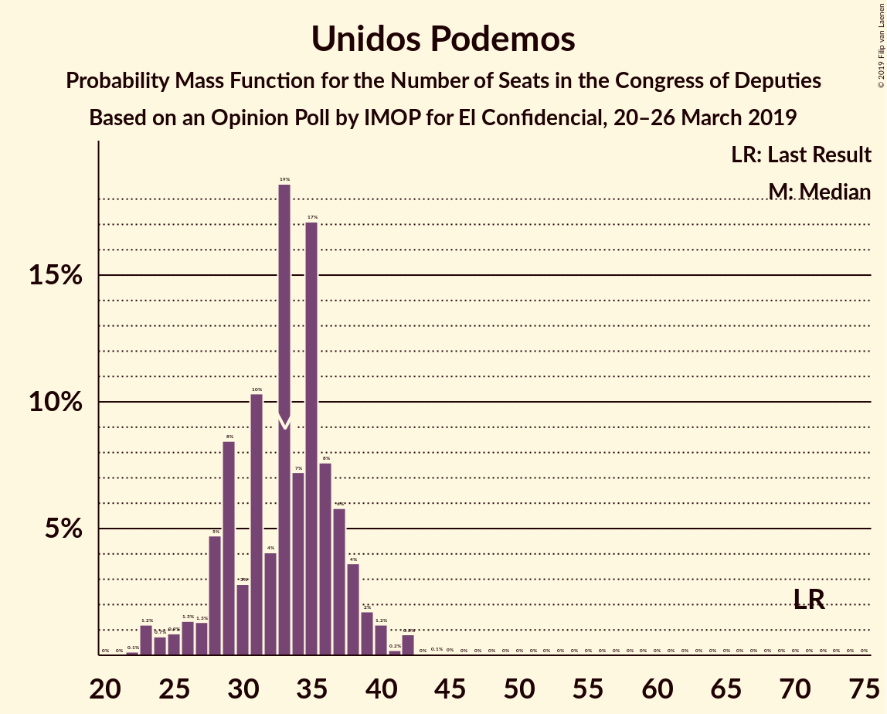
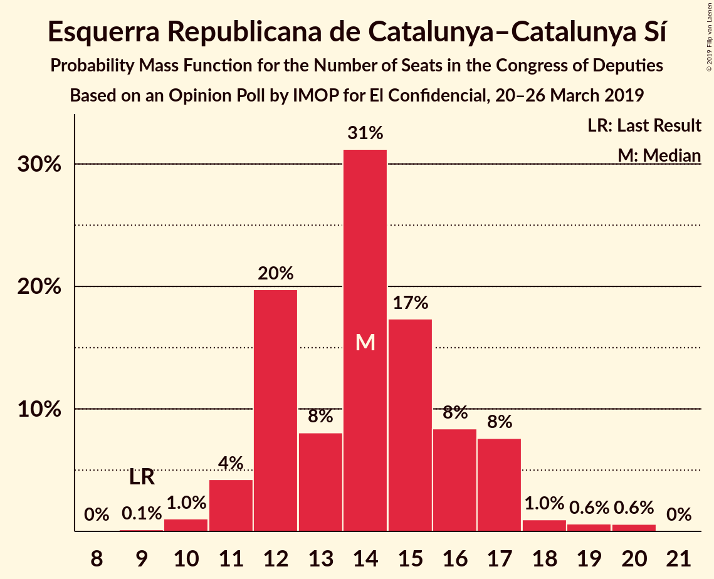
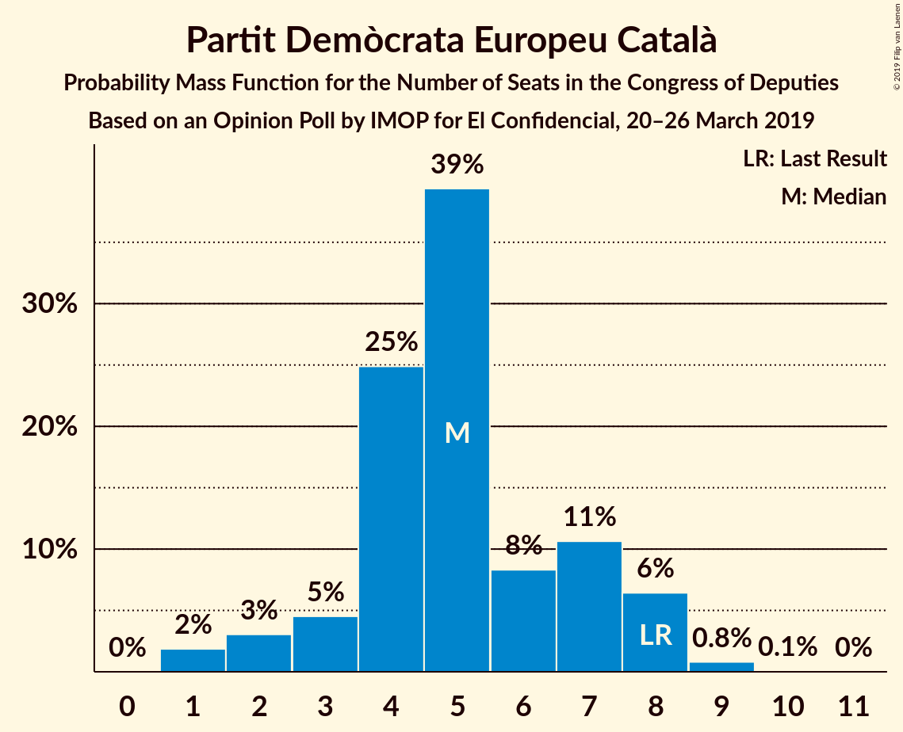
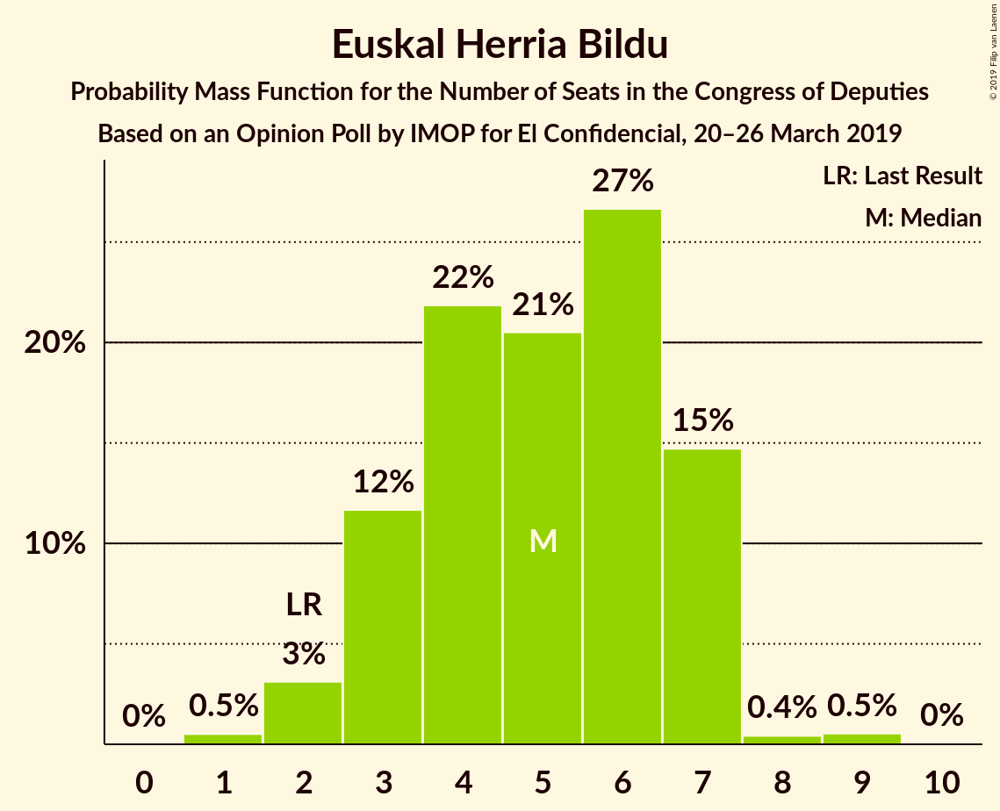

# Opinion Poll by IMOP for El Confidencial, 20–26 March 2019

<a href="#voting-intentions">Voting Intentions</a> | <a href="#seats">Seats</a> | <a href="#coalitions">Coalitions</a> | <a href="#technical-information">Technical Information</a>

## Voting Intentions

### Confidence Intervals

| Party | Last Result | Poll Result | 80% Confidence Interval | 90% Confidence Interval | 95% Confidence Interval | 99% Confidence Interval |
|:-----:|:-----------:|:-----------:|:-----------------------:|:-----------------------:|:-----------------------:|:-----------------------:|
| Partido Socialista Obrero Español | 22.6% | 31.0% | 29.4–32.6% |29.0–33.1% |28.6–33.5% |27.9–34.3% |
| Partido Popular | 33.0% | 20.0% | 18.7–21.4% |18.3–21.8% |18.0–22.2% |17.4–22.9% |
| Ciudadanos–Partido de la Ciudadanía | 13.1% | 14.9% | 13.8–16.2% |13.4–16.6% |13.2–16.9% |12.6–17.5% |
| Unidos Podemos | 21.2% | 12.6% | 11.6–13.9% |11.3–14.2% |11.0–14.5% |10.5–15.1% |
| Vox | 0.2% | 10.1% | 9.1–11.2% |8.8–11.5% |8.6–11.8% |8.2–12.3% |
| Esquerra Republicana de Catalunya–Catalunya Sí | 2.7% | 3.3% | 2.7–4.0% |2.6–4.2% |2.5–4.4% |2.2–4.7% |
| Partido Animalista Contra el Maltrato Animal | 1.2% | 2.0% | 1.6–2.6% |1.5–2.7% |1.4–2.9% |1.2–3.2% |
| Partit Demòcrata Europeu Català | 2.0% | 1.3% | 1.0–1.8% |0.9–1.9% |0.8–2.0% |0.7–2.3% |
| Euzko Alderdi Jeltzalea/Partido Nacionalista Vasco | 1.2% | 1.2% | 0.9–1.7% |0.8–1.8% |0.8–1.9% |0.6–2.2% |
| Euskal Herria Bildu | 0.8% | 1.1% | 0.8–1.5% |0.7–1.6% |0.6–1.8% |0.5–2.0% |

*Note:* The poll result column reflects the actual value used in the calculations. Published results may vary slightly, and in addition be rounded to fewer digits.

## Seats

### Confidence Intervals

| Party | Last Result | Median | 80% Confidence Interval | 90% Confidence Interval | 95% Confidence Interval | 99% Confidence Interval |
|:-----:|:-----------:|:------:|:-----------------------:|:-----------------------:|:-----------------------:|:-----------------------:|
| <a href="#partido-socialista-obrero-español">Partido Socialista Obrero Español</a> | 85 | 136 | 136–148 |136–148 |134–148 |122–148 |
| <a href="#partido-popular">Partido Popular</a> | 137 | 71 | 66–72 |66–74 |66–80 |66–90 |
| <a href="#ciudadanos–partido-de-la-ciudadanía">Ciudadanos–Partido de la Ciudadanía</a> | 32 | 47 | 46–53 |46–57 |46–57 |28–57 |
| <a href="#unidos-podemos">Unidos Podemos</a> | 71 | 34 | 28–37 |28–37 |28–37 |22–37 |
| <a href="#vox">Vox</a> | 0 | 23 | 15–39 |15–39 |14–39 |13–39 |
| <a href="#esquerra-republicana-de-catalunya–catalunya-sí">Esquerra Republicana de Catalunya–Catalunya Sí</a> | 9 | 15 | 12–15 |12–16 |11–17 |11–20 |
| <a href="#partido-animalista-contra-el-maltrato-animal">Partido Animalista Contra el Maltrato Animal</a> | 0 | 1 | 1 |0–1 |0–1 |0–1 |
| <a href="#partit-demòcrata-europeu-català">Partit Demòcrata Europeu Català</a> | 8 | 5 | 1–6 |1–6 |1–6 |1–8 |
| <a href="#euzko-alderdi-jeltzalea/partido-nacionalista-vasco">Euzko Alderdi Jeltzalea/Partido Nacionalista Vasco</a> | 5 | 6 | 5–6 |4–6 |4–9 |2–10 |
| <a href="#euskal-herria-bildu">Euskal Herria Bildu</a> | 2 | 6 | 5–6 |5–7 |4–7 |3–7 |

### Partido Socialista Obrero Español

*For a full overview of the results for this party, see the [Partido Socialista Obrero Español](party-partidosocialistaobreroespañol.html) page.*

| Number of Seats | Probability | Accumulated | Special Marks |
|:---------------:|:-----------:|:-----------:|:-------------:|
| 85 | 0% | 100% | Last Result |
| 86 | 0% | 100% |  |
| 87 | 0% | 100% |  |
| 88 | 0% | 100% |  |
| 89 | 0% | 100% |  |
| 90 | 0% | 100% |  |
| 91 | 0% | 100% |  |
| 92 | 0% | 100% |  |
| 93 | 0% | 100% |  |
| 94 | 0% | 100% |  |
| 95 | 0% | 100% |  |
| 96 | 0% | 100% |  |
| 97 | 0% | 100% |  |
| 98 | 0% | 100% |  |
| 99 | 0% | 100% |  |
| 100 | 0% | 100% |  |
| 101 | 0% | 100% |  |
| 102 | 0% | 100% |  |
| 103 | 0% | 100% |  |
| 104 | 0% | 100% |  |
| 105 | 0% | 100% |  |
| 106 | 0% | 100% |  |
| 107 | 0% | 100% |  |
| 108 | 0.1% | 100% |  |
| 109 | 0% | 99.9% |  |
| 110 | 0% | 99.9% |  |
| 111 | 0% | 99.9% |  |
| 112 | 0% | 99.9% |  |
| 113 | 0% | 99.9% |  |
| 114 | 0% | 99.9% |  |
| 115 | 0% | 99.9% |  |
| 116 | 0% | 99.9% |  |
| 117 | 0.1% | 99.9% |  |
| 118 | 0% | 99.9% |  |
| 119 | 0% | 99.9% |  |
| 120 | 0% | 99.9% |  |
| 121 | 0.1% | 99.8% |  |
| 122 | 0.9% | 99.8% |  |
| 123 | 0% | 98.8% |  |
| 124 | 0% | 98.8% |  |
| 125 | 0% | 98.8% |  |
| 126 | 0% | 98.8% |  |
| 127 | 0% | 98.8% |  |
| 128 | 0% | 98.8% |  |
| 129 | 0.8% | 98.8% |  |
| 130 | 0% | 98% |  |
| 131 | 0% | 98% |  |
| 132 | 0% | 98% |  |
| 133 | 0% | 98% |  |
| 134 | 2% | 98% |  |
| 135 | 0.3% | 96% |  |
| 136 | 47% | 95% | Median |
| 137 | 0.9% | 48% |  |
| 138 | 0% | 47% |  |
| 139 | 0.6% | 47% |  |
| 140 | 0% | 47% |  |
| 141 | 0% | 47% |  |
| 142 | 0.1% | 47% |  |
| 143 | 5% | 47% |  |
| 144 | 0% | 42% |  |
| 145 | 0% | 42% |  |
| 146 | 0% | 42% |  |
| 147 | 0% | 42% |  |
| 148 | 41% | 42% |  |
| 149 | 0% | 0.2% |  |
| 150 | 0% | 0.2% |  |
| 151 | 0% | 0.2% |  |
| 152 | 0.1% | 0.2% |  |
| 153 | 0% | 0.1% |  |
| 154 | 0% | 0.1% |  |
| 155 | 0% | 0.1% |  |
| 156 | 0% | 0.1% |  |
| 157 | 0.1% | 0.1% |  |
| 158 | 0% | 0% |  |

### Partido Popular

*For a full overview of the results for this party, see the [Partido Popular](party-partidopopular.html) page.*

| Number of Seats | Probability | Accumulated | Special Marks |
|:---------------:|:-----------:|:-----------:|:-------------:|
| 66 | 47% | 100% |  |
| 67 | 0% | 53% |  |
| 68 | 0.1% | 53% |  |
| 69 | 0% | 53% |  |
| 70 | 0% | 53% |  |
| 71 | 5% | 53% | Median |
| 72 | 42% | 48% |  |
| 73 | 0.4% | 6% |  |
| 74 | 2% | 6% |  |
| 75 | 0.1% | 4% |  |
| 76 | 0% | 4% |  |
| 77 | 0.1% | 4% |  |
| 78 | 0% | 4% |  |
| 79 | 0.7% | 4% |  |
| 80 | 0.7% | 3% |  |
| 81 | 0.1% | 2% |  |
| 82 | 0.2% | 2% |  |
| 83 | 0.2% | 2% |  |
| 84 | 0.6% | 2% |  |
| 85 | 0.2% | 1.2% |  |
| 86 | 0% | 1.0% |  |
| 87 | 0.1% | 1.0% |  |
| 88 | 0% | 0.9% |  |
| 89 | 0.1% | 0.9% |  |
| 90 | 0.5% | 0.9% |  |
| 91 | 0% | 0.4% |  |
| 92 | 0% | 0.4% |  |
| 93 | 0% | 0.3% |  |
| 94 | 0% | 0.3% |  |
| 95 | 0% | 0.3% |  |
| 96 | 0% | 0.3% |  |
| 97 | 0% | 0.3% |  |
| 98 | 0% | 0.3% |  |
| 99 | 0% | 0.3% |  |
| 100 | 0% | 0.3% |  |
| 101 | 0% | 0.3% |  |
| 102 | 0.3% | 0.3% |  |
| 103 | 0% | 0% |  |
| 104 | 0% | 0% |  |
| 105 | 0% | 0% |  |
| 106 | 0% | 0% |  |
| 107 | 0% | 0% |  |
| 108 | 0% | 0% |  |
| 109 | 0% | 0% |  |
| 110 | 0% | 0% |  |
| 111 | 0% | 0% |  |
| 112 | 0% | 0% |  |
| 113 | 0% | 0% |  |
| 114 | 0% | 0% |  |
| 115 | 0% | 0% |  |
| 116 | 0% | 0% |  |
| 117 | 0% | 0% |  |
| 118 | 0% | 0% |  |
| 119 | 0% | 0% |  |
| 120 | 0% | 0% |  |
| 121 | 0% | 0% |  |
| 122 | 0% | 0% |  |
| 123 | 0% | 0% |  |
| 124 | 0% | 0% |  |
| 125 | 0% | 0% |  |
| 126 | 0% | 0% |  |
| 127 | 0% | 0% |  |
| 128 | 0% | 0% |  |
| 129 | 0% | 0% |  |
| 130 | 0% | 0% |  |
| 131 | 0% | 0% |  |
| 132 | 0% | 0% |  |
| 133 | 0% | 0% |  |
| 134 | 0% | 0% |  |
| 135 | 0% | 0% |  |
| 136 | 0% | 0% |  |
| 137 | 0% | 0% | Last Result |

### Ciudadanos–Partido de la Ciudadanía

*For a full overview of the results for this party, see the [Ciudadanos–Partido de la Ciudadanía](party-ciudadanos–partidodelaciudadanía.html) page.*

| Number of Seats | Probability | Accumulated | Special Marks |
|:---------------:|:-----------:|:-----------:|:-------------:|
| 23 | 0.1% | 100% |  |
| 24 | 0% | 99.9% |  |
| 25 | 0% | 99.9% |  |
| 26 | 0% | 99.9% |  |
| 27 | 0% | 99.9% |  |
| 28 | 0.5% | 99.9% |  |
| 29 | 0% | 99.4% |  |
| 30 | 0% | 99.4% |  |
| 31 | 0% | 99.4% |  |
| 32 | 0% | 99.4% | Last Result |
| 33 | 0% | 99.4% |  |
| 34 | 0% | 99.4% |  |
| 35 | 0% | 99.4% |  |
| 36 | 0% | 99.4% |  |
| 37 | 0.1% | 99.4% |  |
| 38 | 0% | 99.3% |  |
| 39 | 0.4% | 99.3% |  |
| 40 | 0% | 98.9% |  |
| 41 | 0.7% | 98.9% |  |
| 42 | 0% | 98% |  |
| 43 | 0.3% | 98% |  |
| 44 | 0% | 98% |  |
| 45 | 0% | 98% |  |
| 46 | 47% | 98% |  |
| 47 | 0.6% | 50% | Median |
| 48 | 0% | 50% |  |
| 49 | 0.8% | 50% |  |
| 50 | 0% | 49% |  |
| 51 | 0.3% | 49% |  |
| 52 | 0.1% | 49% |  |
| 53 | 42% | 49% |  |
| 54 | 0.1% | 7% |  |
| 55 | 0% | 7% |  |
| 56 | 0.1% | 7% |  |
| 57 | 7% | 7% |  |
| 58 | 0.2% | 0.2% |  |
| 59 | 0% | 0% |  |

### Unidos Podemos

*For a full overview of the results for this party, see the [Unidos Podemos](party-unidospodemos.html) page.*

| Number of Seats | Probability | Accumulated | Special Marks |
|:---------------:|:-----------:|:-----------:|:-------------:|
| 22 | 0.6% | 100% |  |
| 23 | 0% | 99.4% |  |
| 24 | 0% | 99.3% |  |
| 25 | 0% | 99.3% |  |
| 26 | 0% | 99.3% |  |
| 27 | 0% | 99.3% |  |
| 28 | 47% | 99.3% |  |
| 29 | 0.4% | 52% |  |
| 30 | 0.8% | 52% |  |
| 31 | 0.5% | 51% |  |
| 32 | 0.2% | 50% |  |
| 33 | 0% | 50% |  |
| 34 | 1.3% | 50% | Median |
| 35 | 2% | 49% |  |
| 36 | 5% | 47% |  |
| 37 | 41% | 42% |  |
| 38 | 0.1% | 0.3% |  |
| 39 | 0% | 0.2% |  |
| 40 | 0% | 0.2% |  |
| 41 | 0% | 0.2% |  |
| 42 | 0% | 0.2% |  |
| 43 | 0% | 0.2% |  |
| 44 | 0% | 0.1% |  |
| 45 | 0% | 0.1% |  |
| 46 | 0.1% | 0.1% |  |
| 47 | 0% | 0.1% |  |
| 48 | 0% | 0.1% |  |
| 49 | 0% | 0% |  |
| 50 | 0% | 0% |  |
| 51 | 0% | 0% |  |
| 52 | 0% | 0% |  |
| 53 | 0% | 0% |  |
| 54 | 0% | 0% |  |
| 55 | 0% | 0% |  |
| 56 | 0% | 0% |  |
| 57 | 0% | 0% |  |
| 58 | 0% | 0% |  |
| 59 | 0% | 0% |  |
| 60 | 0% | 0% |  |
| 61 | 0% | 0% |  |
| 62 | 0% | 0% |  |
| 63 | 0% | 0% |  |
| 64 | 0% | 0% |  |
| 65 | 0% | 0% |  |
| 66 | 0% | 0% |  |
| 67 | 0% | 0% |  |
| 68 | 0% | 0% |  |
| 69 | 0% | 0% |  |
| 70 | 0% | 0% |  |
| 71 | 0% | 0% | Last Result |

### Vox

*For a full overview of the results for this party, see the [Vox](party-vox.html) page.*

| Number of Seats | Probability | Accumulated | Special Marks |
|:---------------:|:-----------:|:-----------:|:-------------:|
| 0 | 0% | 100% | Last Result |
| 1 | 0% | 100% |  |
| 2 | 0% | 100% |  |
| 3 | 0% | 100% |  |
| 4 | 0% | 100% |  |
| 5 | 0% | 100% |  |
| 6 | 0% | 100% |  |
| 7 | 0% | 100% |  |
| 8 | 0% | 100% |  |
| 9 | 0% | 100% |  |
| 10 | 0% | 100% |  |
| 11 | 0% | 100% |  |
| 12 | 0% | 100% |  |
| 13 | 0.6% | 100% |  |
| 14 | 2% | 99.4% |  |
| 15 | 41% | 97% |  |
| 16 | 5% | 56% |  |
| 17 | 0.3% | 51% |  |
| 18 | 0% | 50% |  |
| 19 | 0.1% | 50% |  |
| 20 | 0% | 50% |  |
| 21 | 0.1% | 50% |  |
| 22 | 0.2% | 50% |  |
| 23 | 0.3% | 50% | Median |
| 24 | 0% | 50% |  |
| 25 | 0% | 50% |  |
| 26 | 0% | 50% |  |
| 27 | 0% | 50% |  |
| 28 | 0.5% | 50% |  |
| 29 | 0.1% | 49% |  |
| 30 | 0% | 49% |  |
| 31 | 0.8% | 49% |  |
| 32 | 0% | 48% |  |
| 33 | 0.1% | 48% |  |
| 34 | 0.7% | 48% |  |
| 35 | 0.4% | 48% |  |
| 36 | 0% | 47% |  |
| 37 | 0% | 47% |  |
| 38 | 0% | 47% |  |
| 39 | 47% | 47% |  |
| 40 | 0% | 0% |  |

### Esquerra Republicana de Catalunya–Catalunya Sí

*For a full overview of the results for this party, see the [Esquerra Republicana de Catalunya–Catalunya Sí](party-esquerrarepublicanadecatalunya–catalunyasí.html) page.*

| Number of Seats | Probability | Accumulated | Special Marks |
|:---------------:|:-----------:|:-----------:|:-------------:|
| 9 | 0.1% | 100% | Last Result |
| 10 | 0% | 99.9% |  |
| 11 | 5% | 99.9% |  |
| 12 | 42% | 95% |  |
| 13 | 0% | 53% |  |
| 14 | 0.5% | 53% |  |
| 15 | 47% | 53% | Median |
| 16 | 0.5% | 5% |  |
| 17 | 3% | 5% |  |
| 18 | 0.3% | 2% |  |
| 19 | 0.9% | 2% |  |
| 20 | 0.8% | 0.8% |  |
| 21 | 0.1% | 0.1% |  |
| 22 | 0% | 0% |  |

### Partido Animalista Contra el Maltrato Animal

*For a full overview of the results for this party, see the [Partido Animalista Contra el Maltrato Animal](party-partidoanimalistacontraelmaltratoanimal.html) page.*

| Number of Seats | Probability | Accumulated | Special Marks |
|:---------------:|:-----------:|:-----------:|:-------------:|
| 0 | 8% | 100% | Last Result |
| 1 | 92% | 92% | Median |
| 2 | 0.2% | 0.2% |  |
| 3 | 0% | 0% |  |

### Partit Demòcrata Europeu Català

*For a full overview of the results for this party, see the [Partit Demòcrata Europeu Català](party-partitdemòcrataeuropeucatalà.html) page.*

| Number of Seats | Probability | Accumulated | Special Marks |
|:---------------:|:-----------:|:-----------:|:-------------:|
| 1 | 42% | 100% |  |
| 2 | 0.1% | 58% |  |
| 3 | 1.0% | 58% |  |
| 4 | 7% | 57% |  |
| 5 | 0.9% | 50% | Median |
| 6 | 48% | 49% |  |
| 7 | 0.7% | 2% |  |
| 8 | 0.5% | 0.8% | Last Result |
| 9 | 0.2% | 0.4% |  |
| 10 | 0.1% | 0.2% |  |
| 11 | 0% | 0% |  |

### Euzko Alderdi Jeltzalea/Partido Nacionalista Vasco

*For a full overview of the results for this party, see the [Euzko Alderdi Jeltzalea/Partido Nacionalista Vasco](party-euzkoalderdijeltzaleapartidonacionalistavasco.html) page.*

| Number of Seats | Probability | Accumulated | Special Marks |
|:---------------:|:-----------:|:-----------:|:-------------:|
| 1 | 0.1% | 100% |  |
| 2 | 0.6% | 99.9% |  |
| 3 | 1.2% | 99.3% |  |
| 4 | 5% | 98% |  |
| 5 | 42% | 93% | Last Result |
| 6 | 48% | 52% | Median |
| 7 | 0.5% | 4% |  |
| 8 | 0% | 3% |  |
| 9 | 3% | 3% |  |
| 10 | 0.5% | 0.5% |  |
| 11 | 0% | 0% |  |

### Euskal Herria Bildu

*For a full overview of the results for this party, see the [Euskal Herria Bildu](party-euskalherriabildu.html) page.*

| Number of Seats | Probability | Accumulated | Special Marks |
|:---------------:|:-----------:|:-----------:|:-------------:|
| 2 | 0.2% | 100% | Last Result |
| 3 | 0.8% | 99.8% |  |
| 4 | 3% | 99.1% |  |
| 5 | 42% | 96% |  |
| 6 | 49% | 55% | Median |
| 7 | 6% | 6% |  |
| 8 | 0.2% | 0.4% |  |
| 9 | 0.1% | 0.1% |  |
| 10 | 0% | 0% |  |

## Coalitions

### Confidence Intervals

| Coalition | Last Result | Median | Majority? | 80% Confidence Interval | 90% Confidence Interval | 95% Confidence Interval | 99% Confidence Interval |
|:---------:|:-----------:|:------:|:---------:|:-----------------------:|:-----------------------:|:-----------------------:|:-----------------------:|
| Partido Socialista Obrero Español – Partido Popular – Ciudadanos–Partido de la Ciudadanía | 254 | 256 | 100% | 248–273 | 248–273 | 248–273 | 248–275 |
| Partido Socialista Obrero Español – Ciudadanos–Partido de la Ciudadanía – Unidos Podemos | 188 | 210 | 100% | 210–238 | 210–238 | 205–238 | 196–238 |
| Partido Socialista Obrero Español – Partido Popular | 222 | 208 | 100% | 202–220 | 202–220 | 202–220 | 201–227 |
| Partido Socialista Obrero Español – Unidos Podemos – Esquerra Republicana de Catalunya–Catalunya Sí – Partit Demòcrata Europeu Català – Euzko Alderdi Jeltzalea/Partido Nacionalista Vasco – Euskal Herria Bildu | 180 | 202 | 100% | 197–208 | 197–208 | 194–208 | 188–208 |
| Partido Socialista Obrero Español – Unidos Podemos – Esquerra Republicana de Catalunya–Catalunya Sí – Euskal Herria Bildu | 167 | 186 | 99.8% | 185–202 | 185–202 | 182–202 | 180–202 |
| Partido Socialista Obrero Español – Ciudadanos–Partido de la Ciudadanía | 117 | 182 | 98% | 182–201 | 182–201 | 176–201 | 165–201 |
| Partido Socialista Obrero Español – Unidos Podemos – Esquerra Republicana de Catalunya–Catalunya Sí – Partit Demòcrata Europeu Català | 173 | 188 | 99.7% | 185–198 | 185–198 | 182–198 | 177–198 |
| Partido Socialista Obrero Español – Unidos Podemos – Euzko Alderdi Jeltzalea/Partido Nacionalista Vasco – Euskal Herria Bildu | 163 | 178 | 97% | 176–195 | 176–195 | 171–195 | 165–195 |
| Partido Socialista Obrero Español – Unidos Podemos – Euzko Alderdi Jeltzalea/Partido Nacionalista Vasco | 161 | 172 | 49% | 170–190 | 170–190 | 168–190 | 159–190 |
| Partido Socialista Obrero Español – Unidos Podemos | 156 | 166 | 47% | 164–185 | 164–185 | 159–185 | 156–185 |
| Partido Popular – Ciudadanos–Partido de la Ciudadanía – Vox | 169 | 147 | 0% | 140–151 | 140–151 | 140–155 | 140–161 |
| Partido Socialista Obrero Español | 85 | 136 | 0% | 136–148 | 136–148 | 134–148 | 122–148 |
| Partido Popular – Ciudadanos–Partido de la Ciudadanía – Euzko Alderdi Jeltzalea/Partido Nacionalista Vasco | 174 | 130 | 0% | 118–130 | 118–132 | 118–140 | 118–147 |
| Partido Popular – Ciudadanos–Partido de la Ciudadanía | 169 | 125 | 0% | 112–125 | 112–128 | 112–131 | 112–140 |
| Partido Popular – Vox | 137 | 105 | 0% | 87–105 | 87–105 | 87–110 | 87–118 |
| Partido Popular | 137 | 71 | 0% | 66–72 | 66–74 | 66–80 | 66–90 |

### Partido Socialista Obrero Español – Partido Popular – Ciudadanos–Partido de la Ciudadanía

| Number of Seats | Probability | Accumulated | Special Marks |
|:---------------:|:-----------:|:-----------:|:-------------:|
| 246 | 0.1% | 100% |  |
| 247 | 0% | 99.9% |  |
| 248 | 47% | 99.9% |  |
| 249 | 0.4% | 53% |  |
| 250 | 1.5% | 52% |  |
| 251 | 0% | 51% |  |
| 252 | 0% | 51% |  |
| 253 | 0% | 51% |  |
| 254 | 0.1% | 51% | Last Result, Median |
| 255 | 0.5% | 51% |  |
| 256 | 0.3% | 50% |  |
| 257 | 0% | 50% |  |
| 258 | 0% | 50% |  |
| 259 | 0% | 50% |  |
| 260 | 0.1% | 50% |  |
| 261 | 0% | 50% |  |
| 262 | 0% | 50% |  |
| 263 | 0% | 50% |  |
| 264 | 0% | 50% |  |
| 265 | 2% | 50% |  |
| 266 | 0.3% | 48% |  |
| 267 | 0% | 48% |  |
| 268 | 0% | 48% |  |
| 269 | 0.2% | 48% |  |
| 270 | 0.6% | 47% |  |
| 271 | 5% | 47% |  |
| 272 | 0% | 42% |  |
| 273 | 41% | 42% |  |
| 274 | 0% | 0.5% |  |
| 275 | 0.2% | 0.5% |  |
| 276 | 0% | 0.3% |  |
| 277 | 0% | 0.3% |  |
| 278 | 0% | 0.3% |  |
| 279 | 0.3% | 0.3% |  |
| 280 | 0% | 0% |  |

### Partido Socialista Obrero Español – Ciudadanos–Partido de la Ciudadanía – Unidos Podemos

| Number of Seats | Probability | Accumulated | Special Marks |
|:---------------:|:-----------:|:-----------:|:-------------:|
| 188 | 0% | 100% | Last Result |
| 189 | 0% | 100% |  |
| 190 | 0% | 100% |  |
| 191 | 0% | 100% |  |
| 192 | 0% | 100% |  |
| 193 | 0% | 100% |  |
| 194 | 0% | 100% |  |
| 195 | 0% | 100% |  |
| 196 | 0.5% | 100% |  |
| 197 | 0% | 99.5% |  |
| 198 | 0% | 99.5% |  |
| 199 | 0.4% | 99.5% |  |
| 200 | 0.7% | 99.1% |  |
| 201 | 0% | 98% |  |
| 202 | 0% | 98% |  |
| 203 | 0.1% | 98% |  |
| 204 | 0% | 98% |  |
| 205 | 1.3% | 98% |  |
| 206 | 0.1% | 97% |  |
| 207 | 0% | 97% |  |
| 208 | 0% | 97% |  |
| 209 | 0% | 97% |  |
| 210 | 47% | 97% |  |
| 211 | 0.1% | 50% |  |
| 212 | 0% | 50% |  |
| 213 | 0% | 50% |  |
| 214 | 0% | 50% |  |
| 215 | 0.2% | 50% |  |
| 216 | 0% | 49% |  |
| 217 | 0% | 49% | Median |
| 218 | 0% | 49% |  |
| 219 | 0% | 49% |  |
| 220 | 0.7% | 49% |  |
| 221 | 0% | 49% |  |
| 222 | 0% | 49% |  |
| 223 | 0% | 49% |  |
| 224 | 0.1% | 49% |  |
| 225 | 0% | 48% |  |
| 226 | 2% | 48% |  |
| 227 | 0.1% | 46% |  |
| 228 | 0% | 46% |  |
| 229 | 0.1% | 46% |  |
| 230 | 0% | 46% |  |
| 231 | 0% | 46% |  |
| 232 | 0% | 46% |  |
| 233 | 0% | 46% |  |
| 234 | 0% | 46% |  |
| 235 | 0% | 46% |  |
| 236 | 5% | 46% |  |
| 237 | 0% | 41% |  |
| 238 | 41% | 41% |  |
| 239 | 0% | 0% |  |

### Partido Socialista Obrero Español – Partido Popular

| Number of Seats | Probability | Accumulated | Special Marks |
|:---------------:|:-----------:|:-----------:|:-------------:|
| 194 | 0.1% | 100% |  |
| 195 | 0.1% | 99.9% |  |
| 196 | 0% | 99.9% |  |
| 197 | 0% | 99.9% |  |
| 198 | 0% | 99.9% |  |
| 199 | 0% | 99.8% |  |
| 200 | 0% | 99.8% |  |
| 201 | 0.7% | 99.8% |  |
| 202 | 47% | 99.1% |  |
| 203 | 0% | 52% |  |
| 204 | 0% | 52% |  |
| 205 | 0.2% | 52% |  |
| 206 | 0.1% | 52% |  |
| 207 | 0% | 52% | Median |
| 208 | 2% | 52% |  |
| 209 | 0.7% | 50% |  |
| 210 | 0.5% | 49% |  |
| 211 | 0% | 48% |  |
| 212 | 0% | 48% |  |
| 213 | 0% | 48% |  |
| 214 | 5% | 48% |  |
| 215 | 0% | 44% |  |
| 216 | 0% | 44% |  |
| 217 | 0.2% | 44% |  |
| 218 | 0.1% | 43% |  |
| 219 | 0% | 43% |  |
| 220 | 42% | 43% |  |
| 221 | 0% | 2% |  |
| 222 | 0% | 2% | Last Result |
| 223 | 0.6% | 2% |  |
| 224 | 0% | 1.0% |  |
| 225 | 0% | 1.0% |  |
| 226 | 0% | 1.0% |  |
| 227 | 0.5% | 1.0% |  |
| 228 | 0% | 0.5% |  |
| 229 | 0.1% | 0.5% |  |
| 230 | 0% | 0.4% |  |
| 231 | 0.1% | 0.4% |  |
| 232 | 0% | 0.3% |  |
| 233 | 0% | 0.3% |  |
| 234 | 0% | 0.3% |  |
| 235 | 0% | 0.3% |  |
| 236 | 0.3% | 0.3% |  |
| 237 | 0% | 0% |  |

### Partido Socialista Obrero Español – Unidos Podemos – Esquerra Republicana de Catalunya–Catalunya Sí – Partit Demòcrata Europeu Català – Euzko Alderdi Jeltzalea/Partido Nacionalista Vasco – Euskal Herria Bildu

| Number of Seats | Probability | Accumulated | Special Marks |
|:---------------:|:-----------:|:-----------:|:-------------:|
| 176 | 0.1% | 100% | Majority |
| 177 | 0% | 99.9% |  |
| 178 | 0% | 99.9% |  |
| 179 | 0% | 99.9% |  |
| 180 | 0% | 99.9% | Last Result |
| 181 | 0% | 99.9% |  |
| 182 | 0% | 99.9% |  |
| 183 | 0% | 99.9% |  |
| 184 | 0% | 99.9% |  |
| 185 | 0.2% | 99.9% |  |
| 186 | 0% | 99.7% |  |
| 187 | 0% | 99.7% |  |
| 188 | 0.3% | 99.7% |  |
| 189 | 0% | 99.4% |  |
| 190 | 0.7% | 99.4% |  |
| 191 | 0.2% | 98.7% |  |
| 192 | 0.2% | 98% |  |
| 193 | 0.1% | 98% |  |
| 194 | 0.8% | 98% |  |
| 195 | 0% | 97% |  |
| 196 | 0% | 97% |  |
| 197 | 47% | 97% |  |
| 198 | 0% | 50% |  |
| 199 | 0% | 50% |  |
| 200 | 0% | 50% |  |
| 201 | 0% | 50% |  |
| 202 | 0.9% | 50% | Median |
| 203 | 2% | 49% |  |
| 204 | 0% | 47% |  |
| 205 | 5% | 47% |  |
| 206 | 0% | 42% |  |
| 207 | 0% | 42% |  |
| 208 | 41% | 42% |  |
| 209 | 0% | 0.3% |  |
| 210 | 0% | 0.3% |  |
| 211 | 0.1% | 0.3% |  |
| 212 | 0% | 0.2% |  |
| 213 | 0% | 0.2% |  |
| 214 | 0% | 0.2% |  |
| 215 | 0% | 0.1% |  |
| 216 | 0% | 0.1% |  |
| 217 | 0% | 0.1% |  |
| 218 | 0.1% | 0.1% |  |
| 219 | 0.1% | 0.1% |  |
| 220 | 0% | 0% |  |

### Partido Socialista Obrero Español – Unidos Podemos – Esquerra Republicana de Catalunya–Catalunya Sí – Euskal Herria Bildu

| Number of Seats | Probability | Accumulated | Special Marks |
|:---------------:|:-----------:|:-----------:|:-------------:|
| 167 | 0% | 100% | Last Result |
| 168 | 0% | 100% |  |
| 169 | 0.1% | 100% |  |
| 170 | 0% | 99.9% |  |
| 171 | 0% | 99.9% |  |
| 172 | 0% | 99.9% |  |
| 173 | 0% | 99.9% |  |
| 174 | 0% | 99.9% |  |
| 175 | 0.1% | 99.9% |  |
| 176 | 0.2% | 99.8% | Majority |
| 177 | 0.1% | 99.6% |  |
| 178 | 0% | 99.5% |  |
| 179 | 0% | 99.5% |  |
| 180 | 1.0% | 99.5% |  |
| 181 | 0.3% | 98% |  |
| 182 | 0.7% | 98% |  |
| 183 | 0% | 97% |  |
| 184 | 0% | 97% |  |
| 185 | 47% | 97% |  |
| 186 | 0.5% | 50% |  |
| 187 | 0% | 50% |  |
| 188 | 0.4% | 50% |  |
| 189 | 0% | 49% |  |
| 190 | 2% | 49% |  |
| 191 | 0% | 47% | Median |
| 192 | 0% | 47% |  |
| 193 | 0% | 47% |  |
| 194 | 0% | 47% |  |
| 195 | 0% | 47% |  |
| 196 | 0% | 47% |  |
| 197 | 5% | 47% |  |
| 198 | 0.6% | 42% |  |
| 199 | 0% | 42% |  |
| 200 | 0% | 42% |  |
| 201 | 0% | 42% |  |
| 202 | 42% | 42% |  |
| 203 | 0.1% | 0.3% |  |
| 204 | 0% | 0.2% |  |
| 205 | 0% | 0.2% |  |
| 206 | 0% | 0.2% |  |
| 207 | 0% | 0.2% |  |
| 208 | 0% | 0.2% |  |
| 209 | 0% | 0.2% |  |
| 210 | 0.1% | 0.1% |  |
| 211 | 0% | 0% |  |

### Partido Socialista Obrero Español – Ciudadanos–Partido de la Ciudadanía

| Number of Seats | Probability | Accumulated | Special Marks |
|:---------------:|:-----------:|:-----------:|:-------------:|
| 117 | 0% | 100% | Last Result |
| 118 | 0% | 100% |  |
| 119 | 0% | 100% |  |
| 120 | 0% | 100% |  |
| 121 | 0% | 100% |  |
| 122 | 0% | 100% |  |
| 123 | 0% | 100% |  |
| 124 | 0% | 100% |  |
| 125 | 0% | 100% |  |
| 126 | 0% | 100% |  |
| 127 | 0% | 100% |  |
| 128 | 0% | 100% |  |
| 129 | 0% | 100% |  |
| 130 | 0% | 100% |  |
| 131 | 0% | 100% |  |
| 132 | 0% | 100% |  |
| 133 | 0% | 100% |  |
| 134 | 0% | 100% |  |
| 135 | 0% | 100% |  |
| 136 | 0% | 100% |  |
| 137 | 0% | 100% |  |
| 138 | 0% | 100% |  |
| 139 | 0% | 100% |  |
| 140 | 0% | 100% |  |
| 141 | 0% | 100% |  |
| 142 | 0% | 100% |  |
| 143 | 0% | 100% |  |
| 144 | 0% | 100% |  |
| 145 | 0% | 100% |  |
| 146 | 0% | 100% |  |
| 147 | 0% | 100% |  |
| 148 | 0% | 100% |  |
| 149 | 0% | 100% |  |
| 150 | 0% | 100% |  |
| 151 | 0% | 100% |  |
| 152 | 0% | 100% |  |
| 153 | 0% | 100% |  |
| 154 | 0% | 100% |  |
| 155 | 0% | 100% |  |
| 156 | 0% | 100% |  |
| 157 | 0% | 100% |  |
| 158 | 0% | 100% |  |
| 159 | 0% | 100% |  |
| 160 | 0% | 100% |  |
| 161 | 0.1% | 100% |  |
| 162 | 0% | 99.9% |  |
| 163 | 0% | 99.9% |  |
| 164 | 0% | 99.9% |  |
| 165 | 0.6% | 99.9% |  |
| 166 | 0% | 99.4% |  |
| 167 | 0% | 99.4% |  |
| 168 | 0% | 99.4% |  |
| 169 | 0.1% | 99.4% |  |
| 170 | 0.7% | 99.3% |  |
| 171 | 0.7% | 98.6% |  |
| 172 | 0% | 98% |  |
| 173 | 0.2% | 98% |  |
| 174 | 0% | 98% |  |
| 175 | 0.1% | 98% |  |
| 176 | 0.4% | 98% | Majority |
| 177 | 0.4% | 97% |  |
| 178 | 0% | 97% |  |
| 179 | 0% | 97% |  |
| 180 | 0% | 97% |  |
| 181 | 0% | 97% |  |
| 182 | 47% | 97% |  |
| 183 | 0% | 49% | Median |
| 184 | 0.1% | 49% |  |
| 185 | 0.1% | 49% |  |
| 186 | 0.6% | 49% |  |
| 187 | 0% | 49% |  |
| 188 | 0% | 49% |  |
| 189 | 0% | 49% |  |
| 190 | 0% | 49% |  |
| 191 | 2% | 49% |  |
| 192 | 0% | 47% |  |
| 193 | 0.2% | 47% |  |
| 194 | 0.1% | 47% |  |
| 195 | 0% | 46% |  |
| 196 | 0% | 46% |  |
| 197 | 0% | 46% |  |
| 198 | 0.1% | 46% |  |
| 199 | 0% | 46% |  |
| 200 | 5% | 46% |  |
| 201 | 41% | 41% |  |
| 202 | 0% | 0% |  |

### Partido Socialista Obrero Español – Unidos Podemos – Esquerra Republicana de Catalunya–Catalunya Sí – Partit Demòcrata Europeu Català

| Number of Seats | Probability | Accumulated | Special Marks |
|:---------------:|:-----------:|:-----------:|:-------------:|
| 166 | 0.1% | 100% |  |
| 167 | 0% | 99.9% |  |
| 168 | 0% | 99.9% |  |
| 169 | 0% | 99.9% |  |
| 170 | 0% | 99.9% |  |
| 171 | 0% | 99.9% |  |
| 172 | 0% | 99.9% |  |
| 173 | 0% | 99.9% | Last Result |
| 174 | 0.2% | 99.9% |  |
| 175 | 0% | 99.7% |  |
| 176 | 0.2% | 99.7% | Majority |
| 177 | 0% | 99.5% |  |
| 178 | 0.2% | 99.5% |  |
| 179 | 0.3% | 99.3% |  |
| 180 | 0.8% | 99.0% |  |
| 181 | 0% | 98% |  |
| 182 | 0.7% | 98% |  |
| 183 | 0% | 97% |  |
| 184 | 0% | 97% |  |
| 185 | 47% | 97% |  |
| 186 | 0% | 50% |  |
| 187 | 0% | 50% |  |
| 188 | 0.5% | 50% |  |
| 189 | 0.1% | 50% |  |
| 190 | 2% | 50% | Median |
| 191 | 0% | 47% |  |
| 192 | 0% | 47% |  |
| 193 | 0% | 47% |  |
| 194 | 5% | 47% |  |
| 195 | 0% | 43% |  |
| 196 | 0% | 42% |  |
| 197 | 0.6% | 42% |  |
| 198 | 41% | 42% |  |
| 199 | 0% | 0.4% |  |
| 200 | 0.1% | 0.4% |  |
| 201 | 0.1% | 0.3% |  |
| 202 | 0% | 0.2% |  |
| 203 | 0% | 0.2% |  |
| 204 | 0% | 0.2% |  |
| 205 | 0% | 0.2% |  |
| 206 | 0.1% | 0.2% |  |
| 207 | 0.1% | 0.1% |  |
| 208 | 0% | 0.1% |  |
| 209 | 0% | 0.1% |  |
| 210 | 0% | 0.1% |  |
| 211 | 0.1% | 0.1% |  |
| 212 | 0% | 0% |  |

### Partido Socialista Obrero Español – Unidos Podemos – Euzko Alderdi Jeltzalea/Partido Nacionalista Vasco – Euskal Herria Bildu

| Number of Seats | Probability | Accumulated | Special Marks |
|:---------------:|:-----------:|:-----------:|:-------------:|
| 156 | 0.1% | 100% |  |
| 157 | 0% | 99.9% |  |
| 158 | 0% | 99.9% |  |
| 159 | 0% | 99.9% |  |
| 160 | 0% | 99.9% |  |
| 161 | 0% | 99.9% |  |
| 162 | 0.1% | 99.9% |  |
| 163 | 0% | 99.9% | Last Result |
| 164 | 0% | 99.9% |  |
| 165 | 0.4% | 99.9% |  |
| 166 | 0.7% | 99.5% |  |
| 167 | 0% | 98.8% |  |
| 168 | 0.1% | 98.8% |  |
| 169 | 0.3% | 98.7% |  |
| 170 | 0.1% | 98% |  |
| 171 | 0.9% | 98% |  |
| 172 | 0% | 97% |  |
| 173 | 0% | 97% |  |
| 174 | 0% | 97% |  |
| 175 | 0% | 97% |  |
| 176 | 47% | 97% | Majority |
| 177 | 0% | 50% |  |
| 178 | 0.4% | 50% |  |
| 179 | 0% | 50% |  |
| 180 | 0% | 50% |  |
| 181 | 0.6% | 50% |  |
| 182 | 3% | 49% | Median |
| 183 | 0.1% | 47% |  |
| 184 | 0% | 47% |  |
| 185 | 0% | 47% |  |
| 186 | 0% | 47% |  |
| 187 | 0% | 47% |  |
| 188 | 0% | 47% |  |
| 189 | 0% | 47% |  |
| 190 | 5% | 47% |  |
| 191 | 0% | 42% |  |
| 192 | 0.1% | 42% |  |
| 193 | 0% | 42% |  |
| 194 | 0% | 42% |  |
| 195 | 42% | 42% |  |
| 196 | 0% | 0.1% |  |
| 197 | 0% | 0.1% |  |
| 198 | 0% | 0.1% |  |
| 199 | 0.1% | 0.1% |  |
| 200 | 0% | 0.1% |  |
| 201 | 0% | 0% |  |

### Partido Socialista Obrero Español – Unidos Podemos – Euzko Alderdi Jeltzalea/Partido Nacionalista Vasco

| Number of Seats | Probability | Accumulated | Special Marks |
|:---------------:|:-----------:|:-----------:|:-------------:|
| 152 | 0.1% | 100% |  |
| 153 | 0.1% | 99.9% |  |
| 154 | 0% | 99.9% |  |
| 155 | 0% | 99.9% |  |
| 156 | 0% | 99.9% |  |
| 157 | 0% | 99.9% |  |
| 158 | 0% | 99.9% |  |
| 159 | 1.0% | 99.8% |  |
| 160 | 0% | 98.8% |  |
| 161 | 0.3% | 98.8% | Last Result |
| 162 | 0% | 98% |  |
| 163 | 0% | 98% |  |
| 164 | 0.3% | 98% |  |
| 165 | 0% | 98% |  |
| 166 | 0% | 98% |  |
| 167 | 0.1% | 98% |  |
| 168 | 0.7% | 98% |  |
| 169 | 0% | 97% |  |
| 170 | 47% | 97% |  |
| 171 | 0% | 50% |  |
| 172 | 0.4% | 50% |  |
| 173 | 0% | 50% |  |
| 174 | 0% | 50% |  |
| 175 | 0.6% | 50% |  |
| 176 | 0% | 49% | Median, Majority |
| 177 | 0% | 49% |  |
| 178 | 3% | 49% |  |
| 179 | 0.1% | 47% |  |
| 180 | 0% | 47% |  |
| 181 | 0% | 47% |  |
| 182 | 0% | 47% |  |
| 183 | 5% | 47% |  |
| 184 | 0.1% | 42% |  |
| 185 | 0% | 42% |  |
| 186 | 0% | 42% |  |
| 187 | 0% | 42% |  |
| 188 | 0% | 42% |  |
| 189 | 0% | 42% |  |
| 190 | 42% | 42% |  |
| 191 | 0% | 0.2% |  |
| 192 | 0.1% | 0.2% |  |
| 193 | 0.1% | 0.1% |  |
| 194 | 0% | 0.1% |  |
| 195 | 0% | 0.1% |  |
| 196 | 0% | 0% |  |

### Partido Socialista Obrero Español – Unidos Podemos

| Number of Seats | Probability | Accumulated | Special Marks |
|:---------------:|:-----------:|:-----------:|:-------------:|
| 146 | 0.1% | 100% |  |
| 147 | 0% | 99.9% |  |
| 148 | 0% | 99.9% |  |
| 149 | 0% | 99.9% |  |
| 150 | 0% | 99.9% |  |
| 151 | 0.1% | 99.9% |  |
| 152 | 0% | 99.9% |  |
| 153 | 0% | 99.9% |  |
| 154 | 0.2% | 99.9% |  |
| 155 | 0% | 99.6% |  |
| 156 | 1.0% | 99.6% | Last Result |
| 157 | 0.4% | 98.6% |  |
| 158 | 0% | 98% |  |
| 159 | 0.7% | 98% |  |
| 160 | 0% | 97% |  |
| 161 | 0% | 97% |  |
| 162 | 0% | 97% |  |
| 163 | 0% | 97% |  |
| 164 | 47% | 97% |  |
| 165 | 0% | 50% |  |
| 166 | 0.4% | 50% |  |
| 167 | 0% | 50% |  |
| 168 | 0.5% | 50% |  |
| 169 | 2% | 49% |  |
| 170 | 0% | 47% | Median |
| 171 | 0% | 47% |  |
| 172 | 0% | 47% |  |
| 173 | 0.6% | 47% |  |
| 174 | 0% | 47% |  |
| 175 | 0% | 47% |  |
| 176 | 0% | 47% | Majority |
| 177 | 0% | 47% |  |
| 178 | 0.1% | 47% |  |
| 179 | 5% | 47% |  |
| 180 | 0.1% | 42% |  |
| 181 | 0% | 42% |  |
| 182 | 0% | 42% |  |
| 183 | 0% | 42% |  |
| 184 | 0% | 42% |  |
| 185 | 41% | 42% |  |
| 186 | 0% | 0.2% |  |
| 187 | 0.1% | 0.2% |  |
| 188 | 0.1% | 0.1% |  |
| 189 | 0% | 0.1% |  |
| 190 | 0% | 0% |  |

### Partido Popular – Ciudadanos–Partido de la Ciudadanía – Vox

| Number of Seats | Probability | Accumulated | Special Marks |
|:---------------:|:-----------:|:-----------:|:-------------:|
| 130 | 0.1% | 100% |  |
| 131 | 0.1% | 99.9% |  |
| 132 | 0% | 99.9% |  |
| 133 | 0% | 99.9% |  |
| 134 | 0% | 99.9% |  |
| 135 | 0% | 99.8% |  |
| 136 | 0.1% | 99.8% |  |
| 137 | 0% | 99.7% |  |
| 138 | 0% | 99.7% |  |
| 139 | 0% | 99.7% |  |
| 140 | 41% | 99.7% |  |
| 141 | 0% | 58% | Median |
| 142 | 0% | 58% |  |
| 143 | 0.1% | 58% |  |
| 144 | 5% | 58% |  |
| 145 | 2% | 53% |  |
| 146 | 0.5% | 51% |  |
| 147 | 0.4% | 50% |  |
| 148 | 0% | 50% |  |
| 149 | 0% | 50% |  |
| 150 | 0% | 50% |  |
| 151 | 47% | 50% |  |
| 152 | 0% | 3% |  |
| 153 | 0% | 3% |  |
| 154 | 0.1% | 3% |  |
| 155 | 0.8% | 3% |  |
| 156 | 0% | 2% |  |
| 157 | 0.4% | 2% |  |
| 158 | 0% | 1.3% |  |
| 159 | 0.7% | 1.3% |  |
| 160 | 0% | 0.6% |  |
| 161 | 0.3% | 0.6% |  |
| 162 | 0.1% | 0.3% |  |
| 163 | 0.1% | 0.2% |  |
| 164 | 0% | 0.1% |  |
| 165 | 0% | 0.1% |  |
| 166 | 0% | 0.1% |  |
| 167 | 0% | 0.1% |  |
| 168 | 0% | 0.1% |  |
| 169 | 0% | 0.1% | Last Result |
| 170 | 0% | 0.1% |  |
| 171 | 0.1% | 0.1% |  |
| 172 | 0% | 0% |  |

### Partido Socialista Obrero Español

| Number of Seats | Probability | Accumulated | Special Marks |
|:---------------:|:-----------:|:-----------:|:-------------:|
| 85 | 0% | 100% | Last Result |
| 86 | 0% | 100% |  |
| 87 | 0% | 100% |  |
| 88 | 0% | 100% |  |
| 89 | 0% | 100% |  |
| 90 | 0% | 100% |  |
| 91 | 0% | 100% |  |
| 92 | 0% | 100% |  |
| 93 | 0% | 100% |  |
| 94 | 0% | 100% |  |
| 95 | 0% | 100% |  |
| 96 | 0% | 100% |  |
| 97 | 0% | 100% |  |
| 98 | 0% | 100% |  |
| 99 | 0% | 100% |  |
| 100 | 0% | 100% |  |
| 101 | 0% | 100% |  |
| 102 | 0% | 100% |  |
| 103 | 0% | 100% |  |
| 104 | 0% | 100% |  |
| 105 | 0% | 100% |  |
| 106 | 0% | 100% |  |
| 107 | 0% | 100% |  |
| 108 | 0.1% | 100% |  |
| 109 | 0% | 99.9% |  |
| 110 | 0% | 99.9% |  |
| 111 | 0% | 99.9% |  |
| 112 | 0% | 99.9% |  |
| 113 | 0% | 99.9% |  |
| 114 | 0% | 99.9% |  |
| 115 | 0% | 99.9% |  |
| 116 | 0% | 99.9% |  |
| 117 | 0.1% | 99.9% |  |
| 118 | 0% | 99.9% |  |
| 119 | 0% | 99.9% |  |
| 120 | 0% | 99.9% |  |
| 121 | 0.1% | 99.8% |  |
| 122 | 0.9% | 99.8% |  |
| 123 | 0% | 98.8% |  |
| 124 | 0% | 98.8% |  |
| 125 | 0% | 98.8% |  |
| 126 | 0% | 98.8% |  |
| 127 | 0% | 98.8% |  |
| 128 | 0% | 98.8% |  |
| 129 | 0.8% | 98.8% |  |
| 130 | 0% | 98% |  |
| 131 | 0% | 98% |  |
| 132 | 0% | 98% |  |
| 133 | 0% | 98% |  |
| 134 | 2% | 98% |  |
| 135 | 0.3% | 96% |  |
| 136 | 47% | 95% | Median |
| 137 | 0.9% | 48% |  |
| 138 | 0% | 47% |  |
| 139 | 0.6% | 47% |  |
| 140 | 0% | 47% |  |
| 141 | 0% | 47% |  |
| 142 | 0.1% | 47% |  |
| 143 | 5% | 47% |  |
| 144 | 0% | 42% |  |
| 145 | 0% | 42% |  |
| 146 | 0% | 42% |  |
| 147 | 0% | 42% |  |
| 148 | 41% | 42% |  |
| 149 | 0% | 0.2% |  |
| 150 | 0% | 0.2% |  |
| 151 | 0% | 0.2% |  |
| 152 | 0.1% | 0.2% |  |
| 153 | 0% | 0.1% |  |
| 154 | 0% | 0.1% |  |
| 155 | 0% | 0.1% |  |
| 156 | 0% | 0.1% |  |
| 157 | 0.1% | 0.1% |  |
| 158 | 0% | 0% |  |

### Partido Popular – Ciudadanos–Partido de la Ciudadanía – Euzko Alderdi Jeltzalea/Partido Nacionalista Vasco

| Number of Seats | Probability | Accumulated | Special Marks |
|:---------------:|:-----------:|:-----------:|:-------------:|
| 115 | 0.1% | 100% |  |
| 116 | 0.1% | 99.9% |  |
| 117 | 0% | 99.8% |  |
| 118 | 48% | 99.8% |  |
| 119 | 0% | 52% |  |
| 120 | 0% | 52% |  |
| 121 | 0% | 52% |  |
| 122 | 0% | 52% |  |
| 123 | 0% | 52% |  |
| 124 | 0% | 52% | Median |
| 125 | 0% | 52% |  |
| 126 | 0% | 52% |  |
| 127 | 0.1% | 52% |  |
| 128 | 0.5% | 52% |  |
| 129 | 0% | 51% |  |
| 130 | 42% | 51% |  |
| 131 | 0.8% | 9% |  |
| 132 | 5% | 8% |  |
| 133 | 0.6% | 4% |  |
| 134 | 0% | 3% |  |
| 135 | 0% | 3% |  |
| 136 | 0% | 3% |  |
| 137 | 0% | 3% |  |
| 138 | 0% | 3% |  |
| 139 | 0% | 3% |  |
| 140 | 2% | 3% |  |
| 141 | 0.3% | 1.1% |  |
| 142 | 0% | 0.7% |  |
| 143 | 0.1% | 0.7% |  |
| 144 | 0% | 0.7% |  |
| 145 | 0% | 0.6% |  |
| 146 | 0.1% | 0.6% |  |
| 147 | 0.2% | 0.6% |  |
| 148 | 0.3% | 0.4% |  |
| 149 | 0% | 0.1% |  |
| 150 | 0% | 0% |  |
| 151 | 0% | 0% |  |
| 152 | 0% | 0% |  |
| 153 | 0% | 0% |  |
| 154 | 0% | 0% |  |
| 155 | 0% | 0% |  |
| 156 | 0% | 0% |  |
| 157 | 0% | 0% |  |
| 158 | 0% | 0% |  |
| 159 | 0% | 0% |  |
| 160 | 0% | 0% |  |
| 161 | 0% | 0% |  |
| 162 | 0% | 0% |  |
| 163 | 0% | 0% |  |
| 164 | 0% | 0% |  |
| 165 | 0% | 0% |  |
| 166 | 0% | 0% |  |
| 167 | 0% | 0% |  |
| 168 | 0% | 0% |  |
| 169 | 0% | 0% |  |
| 170 | 0% | 0% |  |
| 171 | 0% | 0% |  |
| 172 | 0% | 0% |  |
| 173 | 0% | 0% |  |
| 174 | 0% | 0% | Last Result |

### Partido Popular – Ciudadanos–Partido de la Ciudadanía

| Number of Seats | Probability | Accumulated | Special Marks |
|:---------------:|:-----------:|:-----------:|:-------------:|
| 109 | 0.1% | 100% |  |
| 110 | 0% | 99.9% |  |
| 111 | 0% | 99.9% |  |
| 112 | 48% | 99.9% |  |
| 113 | 0% | 52% |  |
| 114 | 0.1% | 52% |  |
| 115 | 0% | 52% |  |
| 116 | 0% | 52% |  |
| 117 | 0% | 52% |  |
| 118 | 0.5% | 52% | Median |
| 119 | 0% | 52% |  |
| 120 | 0% | 52% |  |
| 121 | 0.7% | 52% |  |
| 122 | 0% | 51% |  |
| 123 | 0% | 51% |  |
| 124 | 0% | 51% |  |
| 125 | 41% | 51% |  |
| 126 | 0.1% | 9% |  |
| 127 | 0% | 9% |  |
| 128 | 5% | 9% |  |
| 129 | 0.1% | 4% |  |
| 130 | 0% | 4% |  |
| 131 | 3% | 4% |  |
| 132 | 0% | 1.1% |  |
| 133 | 0% | 1.1% |  |
| 134 | 0.3% | 1.1% |  |
| 135 | 0% | 0.8% |  |
| 136 | 0% | 0.8% |  |
| 137 | 0.1% | 0.8% |  |
| 138 | 0% | 0.7% |  |
| 139 | 0.1% | 0.7% |  |
| 140 | 0.3% | 0.6% |  |
| 141 | 0% | 0.4% |  |
| 142 | 0% | 0.4% |  |
| 143 | 0% | 0.4% |  |
| 144 | 0% | 0.4% |  |
| 145 | 0.3% | 0.4% |  |
| 146 | 0% | 0.1% |  |
| 147 | 0% | 0% |  |
| 148 | 0% | 0% |  |
| 149 | 0% | 0% |  |
| 150 | 0% | 0% |  |
| 151 | 0% | 0% |  |
| 152 | 0% | 0% |  |
| 153 | 0% | 0% |  |
| 154 | 0% | 0% |  |
| 155 | 0% | 0% |  |
| 156 | 0% | 0% |  |
| 157 | 0% | 0% |  |
| 158 | 0% | 0% |  |
| 159 | 0% | 0% |  |
| 160 | 0% | 0% |  |
| 161 | 0% | 0% |  |
| 162 | 0% | 0% |  |
| 163 | 0% | 0% |  |
| 164 | 0% | 0% |  |
| 165 | 0% | 0% |  |
| 166 | 0% | 0% |  |
| 167 | 0% | 0% |  |
| 168 | 0% | 0% |  |
| 169 | 0% | 0% | Last Result |

### Partido Popular – Vox

| Number of Seats | Probability | Accumulated | Special Marks |
|:---------------:|:-----------:|:-----------:|:-------------:|
| 87 | 46% | 100% |  |
| 88 | 2% | 54% |  |
| 89 | 0% | 52% |  |
| 90 | 0.1% | 52% |  |
| 91 | 0% | 52% |  |
| 92 | 0.1% | 52% |  |
| 93 | 0.1% | 52% |  |
| 94 | 0% | 51% | Median |
| 95 | 0% | 51% |  |
| 96 | 0% | 51% |  |
| 97 | 0.6% | 51% |  |
| 98 | 0.1% | 51% |  |
| 99 | 0.2% | 51% |  |
| 100 | 0% | 51% |  |
| 101 | 0.1% | 51% |  |
| 102 | 0% | 50% |  |
| 103 | 0% | 50% |  |
| 104 | 0% | 50% |  |
| 105 | 47% | 50% |  |
| 106 | 0.2% | 3% |  |
| 107 | 0% | 3% |  |
| 108 | 0.5% | 3% |  |
| 109 | 0% | 3% |  |
| 110 | 0.8% | 3% |  |
| 111 | 0% | 2% |  |
| 112 | 0% | 2% |  |
| 113 | 0% | 2% |  |
| 114 | 0.8% | 2% |  |
| 115 | 0% | 0.9% |  |
| 116 | 0% | 0.9% |  |
| 117 | 0% | 0.9% |  |
| 118 | 0.9% | 0.9% |  |
| 119 | 0% | 0% |  |
| 120 | 0% | 0% |  |
| 121 | 0% | 0% |  |
| 122 | 0% | 0% |  |
| 123 | 0% | 0% |  |
| 124 | 0% | 0% |  |
| 125 | 0% | 0% |  |
| 126 | 0% | 0% |  |
| 127 | 0% | 0% |  |
| 128 | 0% | 0% |  |
| 129 | 0% | 0% |  |
| 130 | 0% | 0% |  |
| 131 | 0% | 0% |  |
| 132 | 0% | 0% |  |
| 133 | 0% | 0% |  |
| 134 | 0% | 0% |  |
| 135 | 0% | 0% |  |
| 136 | 0% | 0% |  |
| 137 | 0% | 0% | Last Result |

### Partido Popular

| Number of Seats | Probability | Accumulated | Special Marks |
|:---------------:|:-----------:|:-----------:|:-------------:|
| 66 | 47% | 100% |  |
| 67 | 0% | 53% |  |
| 68 | 0.1% | 53% |  |
| 69 | 0% | 53% |  |
| 70 | 0% | 53% |  |
| 71 | 5% | 53% | Median |
| 72 | 42% | 48% |  |
| 73 | 0.4% | 6% |  |
| 74 | 2% | 6% |  |
| 75 | 0.1% | 4% |  |
| 76 | 0% | 4% |  |
| 77 | 0.1% | 4% |  |
| 78 | 0% | 4% |  |
| 79 | 0.7% | 4% |  |
| 80 | 0.7% | 3% |  |
| 81 | 0.1% | 2% |  |
| 82 | 0.2% | 2% |  |
| 83 | 0.2% | 2% |  |
| 84 | 0.6% | 2% |  |
| 85 | 0.2% | 1.2% |  |
| 86 | 0% | 1.0% |  |
| 87 | 0.1% | 1.0% |  |
| 88 | 0% | 0.9% |  |
| 89 | 0.1% | 0.9% |  |
| 90 | 0.5% | 0.9% |  |
| 91 | 0% | 0.4% |  |
| 92 | 0% | 0.4% |  |
| 93 | 0% | 0.3% |  |
| 94 | 0% | 0.3% |  |
| 95 | 0% | 0.3% |  |
| 96 | 0% | 0.3% |  |
| 97 | 0% | 0.3% |  |
| 98 | 0% | 0.3% |  |
| 99 | 0% | 0.3% |  |
| 100 | 0% | 0.3% |  |
| 101 | 0% | 0.3% |  |
| 102 | 0.3% | 0.3% |  |
| 103 | 0% | 0% |  |
| 104 | 0% | 0% |  |
| 105 | 0% | 0% |  |
| 106 | 0% | 0% |  |
| 107 | 0% | 0% |  |
| 108 | 0% | 0% |  |
| 109 | 0% | 0% |  |
| 110 | 0% | 0% |  |
| 111 | 0% | 0% |  |
| 112 | 0% | 0% |  |
| 113 | 0% | 0% |  |
| 114 | 0% | 0% |  |
| 115 | 0% | 0% |  |
| 116 | 0% | 0% |  |
| 117 | 0% | 0% |  |
| 118 | 0% | 0% |  |
| 119 | 0% | 0% |  |
| 120 | 0% | 0% |  |
| 121 | 0% | 0% |  |
| 122 | 0% | 0% |  |
| 123 | 0% | 0% |  |
| 124 | 0% | 0% |  |
| 125 | 0% | 0% |  |
| 126 | 0% | 0% |  |
| 127 | 0% | 0% |  |
| 128 | 0% | 0% |  |
| 129 | 0% | 0% |  |
| 130 | 0% | 0% |  |
| 131 | 0% | 0% |  |
| 132 | 0% | 0% |  |
| 133 | 0% | 0% |  |
| 134 | 0% | 0% |  |
| 135 | 0% | 0% |  |
| 136 | 0% | 0% |  |
| 137 | 0% | 0% | Last Result |

## Technical Information

### Opinion Poll

+ **Polling firm:** IMOP
+ **Commissioner(s):** El Confidencial
+ **Fieldwork period:** 20–26 March 2019

### Calculations

+ **Sample size:** 1400
+ **Simulations done:** 1,024
+ **Error estimate:** 5.17%

