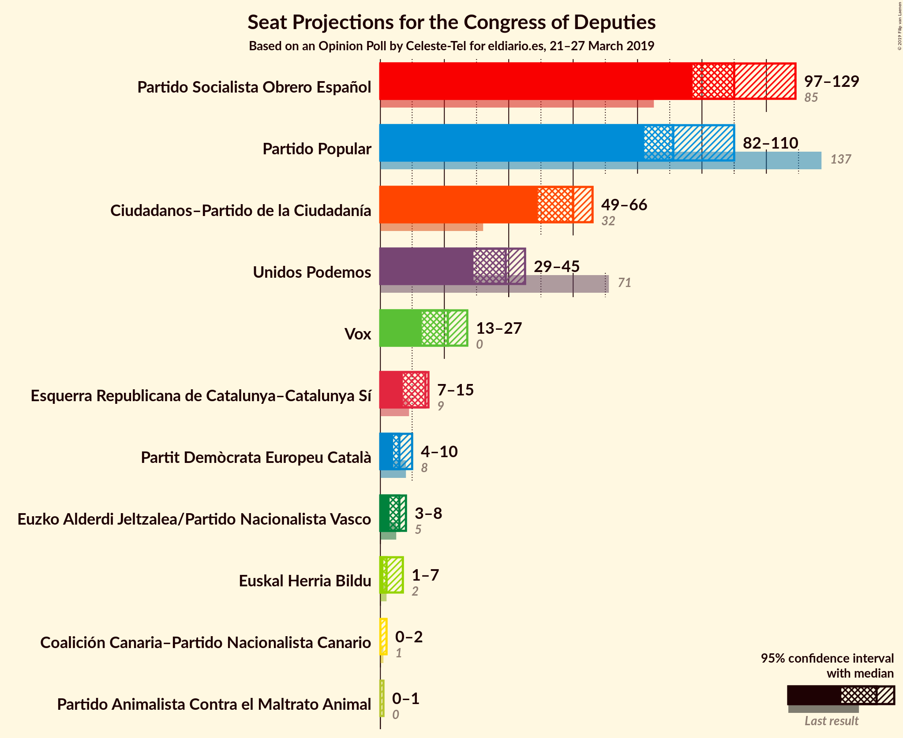
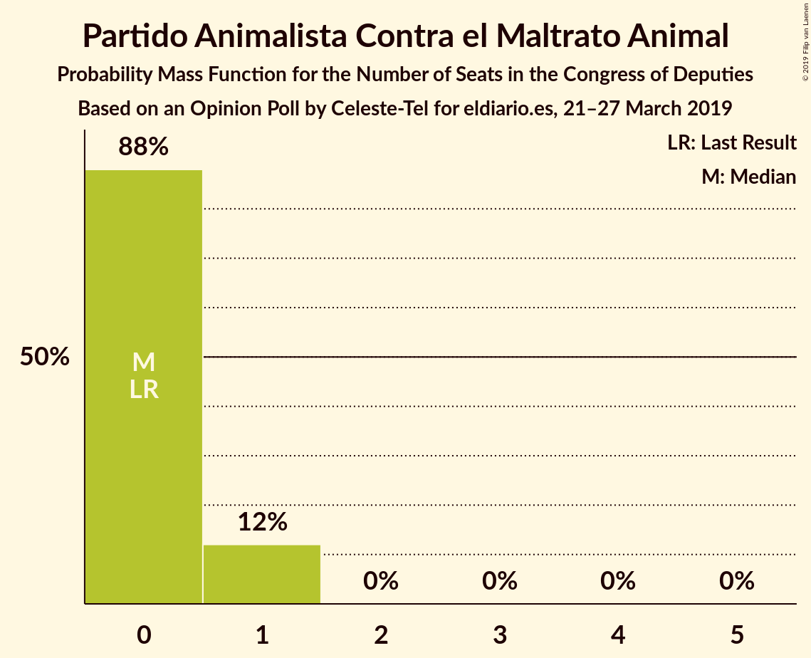
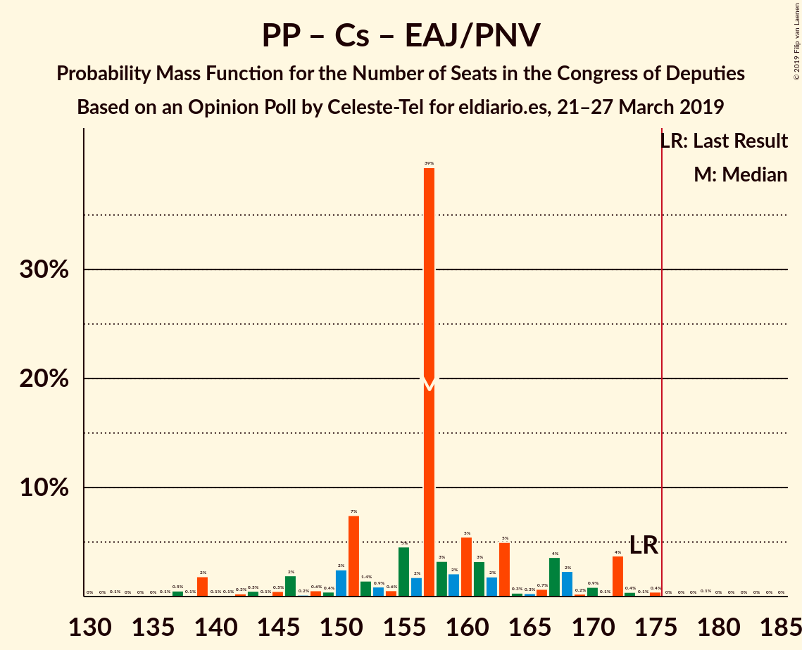

# Opinion Poll by Celeste-Tel for eldiario.es, 21–27 March 2019

<a href="#voting-intentions">Voting Intentions</a> | <a href="#seats">Seats</a> | <a href="#coalitions">Coalitions</a> | <a href="#technical-information">Technical Information</a>

## Voting Intentions

### Confidence Intervals

| Party | Last Result | Poll Result | 80% Confidence Interval | 90% Confidence Interval | 95% Confidence Interval | 99% Confidence Interval |
|:-----:|:-----------:|:-----------:|:-----------------------:|:-----------------------:|:-----------------------:|:-----------------------:|
| Partido Socialista Obrero Español | 22.6% | 27.0% | 25.3–28.8% |24.9–29.3% |24.4–29.7% |23.7–30.6% |
| Partido Popular | 33.0% | 22.9% | 21.3–24.6% |20.9–25.1% |20.5–25.5% |19.8–26.3% |
| Ciudadanos–Partido de la Ciudadanía | 13.1% | 16.7% | 15.3–18.2% |15.0–18.7% |14.6–19.1% |14.0–19.8% |
| Unidos Podemos | 21.2% | 13.7% | 12.5–15.2% |12.1–15.5% |11.8–15.9% |11.2–16.6% |
| Vox | 0.2% | 9.1% | 8.1–10.3% |7.8–10.6% |7.5–10.9% |7.1–11.6% |
| Esquerra Republicana de Catalunya–Catalunya Sí | 2.7% | 2.8% | 2.3–3.6% |2.1–3.8% |2.0–4.0% |1.8–4.4% |
| Partit Demòcrata Europeu Català | 2.0% | 1.7% | 1.3–2.3% |1.2–2.5% |1.1–2.7% |0.9–3.0% |
| Partido Animalista Contra el Maltrato Animal | 1.2% | 1.4% | 1.0–1.9% |0.9–2.1% |0.8–2.2% |0.7–2.5% |
| Euzko Alderdi Jeltzalea/Partido Nacionalista Vasco | 1.2% | 1.2% | 0.9–1.7% |0.8–1.9% |0.7–2.0% |0.6–2.3% |
| Euskal Herria Bildu | 0.8% | 0.7% | 0.5–1.2% |0.4–1.3% |0.4–1.4% |0.3–1.7% |
| Coalición Canaria–Partido Nacionalista Canario | 0.3% | 0.3% | 0.2–0.6% |0.1–0.7% |0.1–0.8% |0.1–1.0% |

*Note:* The poll result column reflects the actual value used in the calculations. Published results may vary slightly, and in addition be rounded to fewer digits.

## Seats

### Confidence Intervals

| Party | Last Result | Median | 80% Confidence Interval | 90% Confidence Interval | 95% Confidence Interval | 99% Confidence Interval |
|:-----:|:-----------:|:------:|:-----------------------:|:-----------------------:|:-----------------------:|:-----------------------:|
| <a href="#partido-socialista-obrero-español">Partido Socialista Obrero Español</a> | 85 | 110 | 103–121 |101–124 |97–129 |95–130 |
| <a href="#partido-popular">Partido Popular</a> | 137 | 91 | 86–106 |84–110 |82–110 |79–113 |
| <a href="#ciudadanos–partido-de-la-ciudadanía">Ciudadanos–Partido de la Ciudadanía</a> | 32 | 60 | 52–62 |49–63 |49–66 |44–68 |
| <a href="#unidos-podemos">Unidos Podemos</a> | 71 | 39 | 32–42 |31–43 |29–45 |26–48 |
| <a href="#vox">Vox</a> | 0 | 21 | 17–23 |15–25 |13–27 |12–30 |
| <a href="#esquerra-republicana-de-catalunya–catalunya-sí">Esquerra Republicana de Catalunya–Catalunya Sí</a> | 9 | 14 | 9–15 |9–15 |7–15 |7–16 |
| <a href="#partit-demòcrata-europeu-català">Partit Demòcrata Europeu Català</a> | 8 | 6 | 5–10 |4–10 |4–10 |3–12 |
| <a href="#partido-animalista-contra-el-maltrato-animal">Partido Animalista Contra el Maltrato Animal</a> | 0 | 0 | 0–1 |0–1 |0–1 |0–1 |
| <a href="#euzko-alderdi-jeltzalea/partido-nacionalista-vasco">Euzko Alderdi Jeltzalea/Partido Nacionalista Vasco</a> | 5 | 6 | 4–7 |3–8 |3–8 |2–10 |
| <a href="#euskal-herria-bildu">Euskal Herria Bildu</a> | 2 | 2 | 2–6 |1–7 |1–7 |0–7 |
| <a href="#coalición-canaria–partido-nacionalista-canario">Coalición Canaria–Partido Nacionalista Canario</a> | 1 | 0 | 0–1 |0–2 |0–2 |0–4 |

### Partido Socialista Obrero Español

*For a full overview of the results for this party, see the [Partido Socialista Obrero Español](party-partidosocialistaobreroespañol.html) page.*

| Number of Seats | Probability | Accumulated | Special Marks |
|:---------------:|:-----------:|:-----------:|:-------------:|
| 85 | 0% | 100% | Last Result |
| 86 | 0% | 100% |  |
| 87 | 0% | 100% |  |
| 88 | 0% | 100% |  |
| 89 | 0% | 100% |  |
| 90 | 0% | 100% |  |
| 91 | 0.1% | 100% |  |
| 92 | 0% | 99.9% |  |
| 93 | 0% | 99.8% |  |
| 94 | 0% | 99.8% |  |
| 95 | 0.7% | 99.8% |  |
| 96 | 0% | 99.1% |  |
| 97 | 3% | 99.1% |  |
| 98 | 0.2% | 96% |  |
| 99 | 0.1% | 96% |  |
| 100 | 0.2% | 95% |  |
| 101 | 0.8% | 95% |  |
| 102 | 1.2% | 94% |  |
| 103 | 4% | 93% |  |
| 104 | 1.0% | 89% |  |
| 105 | 3% | 88% |  |
| 106 | 3% | 85% |  |
| 107 | 0.2% | 82% |  |
| 108 | 3% | 82% |  |
| 109 | 3% | 79% |  |
| 110 | 41% | 76% | Median |
| 111 | 2% | 35% |  |
| 112 | 1.3% | 33% |  |
| 113 | 11% | 31% |  |
| 114 | 1.2% | 20% |  |
| 115 | 4% | 19% |  |
| 116 | 0.4% | 15% |  |
| 117 | 1.5% | 15% |  |
| 118 | 0.9% | 14% |  |
| 119 | 0.3% | 13% |  |
| 120 | 0.6% | 12% |  |
| 121 | 3% | 12% |  |
| 122 | 2% | 9% |  |
| 123 | 1.3% | 7% |  |
| 124 | 1.2% | 6% |  |
| 125 | 1.0% | 4% |  |
| 126 | 0.2% | 3% |  |
| 127 | 0.2% | 3% |  |
| 128 | 0.5% | 3% |  |
| 129 | 2% | 3% |  |
| 130 | 0.3% | 0.6% |  |
| 131 | 0.1% | 0.3% |  |
| 132 | 0.1% | 0.3% |  |
| 133 | 0% | 0.2% |  |
| 134 | 0.1% | 0.2% |  |
| 135 | 0% | 0.1% |  |
| 136 | 0% | 0% |  |

### Partido Popular

*For a full overview of the results for this party, see the [Partido Popular](party-partidopopular.html) page.*

| Number of Seats | Probability | Accumulated | Special Marks |
|:---------------:|:-----------:|:-----------:|:-------------:|
| 71 | 0.1% | 100% |  |
| 72 | 0% | 99.9% |  |
| 73 | 0% | 99.9% |  |
| 74 | 0% | 99.9% |  |
| 75 | 0% | 99.9% |  |
| 76 | 0% | 99.9% |  |
| 77 | 0% | 99.8% |  |
| 78 | 0.1% | 99.8% |  |
| 79 | 0.2% | 99.7% |  |
| 80 | 0.3% | 99.4% |  |
| 81 | 0.9% | 99.1% |  |
| 82 | 1.3% | 98% |  |
| 83 | 0.5% | 97% |  |
| 84 | 2% | 96% |  |
| 85 | 0.5% | 94% |  |
| 86 | 7% | 93% |  |
| 87 | 3% | 86% |  |
| 88 | 0.3% | 83% |  |
| 89 | 2% | 83% |  |
| 90 | 3% | 81% |  |
| 91 | 41% | 78% | Median |
| 92 | 2% | 37% |  |
| 93 | 0.9% | 35% |  |
| 94 | 7% | 34% |  |
| 95 | 2% | 27% |  |
| 96 | 2% | 26% |  |
| 97 | 3% | 24% |  |
| 98 | 3% | 21% |  |
| 99 | 1.1% | 19% |  |
| 100 | 0.2% | 18% |  |
| 101 | 0.6% | 17% |  |
| 102 | 1.3% | 17% |  |
| 103 | 0.4% | 15% |  |
| 104 | 0.7% | 15% |  |
| 105 | 4% | 14% |  |
| 106 | 2% | 11% |  |
| 107 | 0.2% | 8% |  |
| 108 | 2% | 8% |  |
| 109 | 0.2% | 6% |  |
| 110 | 4% | 6% |  |
| 111 | 0.4% | 1.3% |  |
| 112 | 0.4% | 0.9% |  |
| 113 | 0.2% | 0.5% |  |
| 114 | 0% | 0.3% |  |
| 115 | 0% | 0.3% |  |
| 116 | 0% | 0.3% |  |
| 117 | 0.1% | 0.3% |  |
| 118 | 0% | 0.2% |  |
| 119 | 0% | 0.2% |  |
| 120 | 0% | 0.2% |  |
| 121 | 0.2% | 0.2% |  |
| 122 | 0% | 0% |  |
| 123 | 0% | 0% |  |
| 124 | 0% | 0% |  |
| 125 | 0% | 0% |  |
| 126 | 0% | 0% |  |
| 127 | 0% | 0% |  |
| 128 | 0% | 0% |  |
| 129 | 0% | 0% |  |
| 130 | 0% | 0% |  |
| 131 | 0% | 0% |  |
| 132 | 0% | 0% |  |
| 133 | 0% | 0% |  |
| 134 | 0% | 0% |  |
| 135 | 0% | 0% |  |
| 136 | 0% | 0% |  |
| 137 | 0% | 0% | Last Result |

### Ciudadanos–Partido de la Ciudadanía

*For a full overview of the results for this party, see the [Ciudadanos–Partido de la Ciudadanía](party-ciudadanos–partidodelaciudadanía.html) page.*

| Number of Seats | Probability | Accumulated | Special Marks |
|:---------------:|:-----------:|:-----------:|:-------------:|
| 32 | 0% | 100% | Last Result |
| 33 | 0% | 100% |  |
| 34 | 0% | 100% |  |
| 35 | 0% | 100% |  |
| 36 | 0% | 100% |  |
| 37 | 0.1% | 100% |  |
| 38 | 0% | 99.9% |  |
| 39 | 0.1% | 99.9% |  |
| 40 | 0% | 99.7% |  |
| 41 | 0% | 99.7% |  |
| 42 | 0.1% | 99.7% |  |
| 43 | 0.1% | 99.6% |  |
| 44 | 0.4% | 99.5% |  |
| 45 | 0.1% | 99.1% |  |
| 46 | 0.3% | 99.1% |  |
| 47 | 0.3% | 98.8% |  |
| 48 | 0.8% | 98% |  |
| 49 | 4% | 98% |  |
| 50 | 0.9% | 94% |  |
| 51 | 2% | 93% |  |
| 52 | 5% | 91% |  |
| 53 | 1.2% | 85% |  |
| 54 | 3% | 84% |  |
| 55 | 3% | 82% |  |
| 56 | 6% | 78% |  |
| 57 | 4% | 72% |  |
| 58 | 5% | 69% |  |
| 59 | 1.5% | 64% |  |
| 60 | 50% | 63% | Median |
| 61 | 2% | 12% |  |
| 62 | 3% | 10% |  |
| 63 | 3% | 7% |  |
| 64 | 1.0% | 4% |  |
| 65 | 0.6% | 3% |  |
| 66 | 0.8% | 3% |  |
| 67 | 1.4% | 2% |  |
| 68 | 0.1% | 0.6% |  |
| 69 | 0.2% | 0.5% |  |
| 70 | 0.2% | 0.2% |  |
| 71 | 0% | 0.1% |  |
| 72 | 0% | 0% |  |

### Unidos Podemos

*For a full overview of the results for this party, see the [Unidos Podemos](party-unidospodemos.html) page.*

| Number of Seats | Probability | Accumulated | Special Marks |
|:---------------:|:-----------:|:-----------:|:-------------:|
| 24 | 0.1% | 100% |  |
| 25 | 0.4% | 99.9% |  |
| 26 | 0.1% | 99.5% |  |
| 27 | 0.8% | 99.4% |  |
| 28 | 0.8% | 98.6% |  |
| 29 | 0.3% | 98% |  |
| 30 | 0.6% | 97% |  |
| 31 | 2% | 97% |  |
| 32 | 5% | 94% |  |
| 33 | 4% | 90% |  |
| 34 | 1.4% | 86% |  |
| 35 | 3% | 85% |  |
| 36 | 8% | 81% |  |
| 37 | 3% | 73% |  |
| 38 | 10% | 71% |  |
| 39 | 42% | 61% | Median |
| 40 | 4% | 18% |  |
| 41 | 3% | 14% |  |
| 42 | 5% | 12% |  |
| 43 | 3% | 6% |  |
| 44 | 0.5% | 3% |  |
| 45 | 0.6% | 3% |  |
| 46 | 0.9% | 2% |  |
| 47 | 0.7% | 1.4% |  |
| 48 | 0.3% | 0.7% |  |
| 49 | 0.1% | 0.5% |  |
| 50 | 0% | 0.4% |  |
| 51 | 0.2% | 0.4% |  |
| 52 | 0.1% | 0.1% |  |
| 53 | 0% | 0% |  |
| 54 | 0% | 0% |  |
| 55 | 0% | 0% |  |
| 56 | 0% | 0% |  |
| 57 | 0% | 0% |  |
| 58 | 0% | 0% |  |
| 59 | 0% | 0% |  |
| 60 | 0% | 0% |  |
| 61 | 0% | 0% |  |
| 62 | 0% | 0% |  |
| 63 | 0% | 0% |  |
| 64 | 0% | 0% |  |
| 65 | 0% | 0% |  |
| 66 | 0% | 0% |  |
| 67 | 0% | 0% |  |
| 68 | 0% | 0% |  |
| 69 | 0% | 0% |  |
| 70 | 0% | 0% |  |
| 71 | 0% | 0% | Last Result |

### Vox

*For a full overview of the results for this party, see the [Vox](party-vox.html) page.*

| Number of Seats | Probability | Accumulated | Special Marks |
|:---------------:|:-----------:|:-----------:|:-------------:|
| 0 | 0% | 100% | Last Result |
| 1 | 0% | 100% |  |
| 2 | 0% | 100% |  |
| 3 | 0% | 100% |  |
| 4 | 0% | 100% |  |
| 5 | 0% | 100% |  |
| 6 | 0% | 100% |  |
| 7 | 0% | 100% |  |
| 8 | 0% | 100% |  |
| 9 | 0% | 100% |  |
| 10 | 0.1% | 100% |  |
| 11 | 0.3% | 99.9% |  |
| 12 | 0.5% | 99.6% |  |
| 13 | 2% | 99.1% |  |
| 14 | 0.8% | 97% |  |
| 15 | 2% | 96% |  |
| 16 | 3% | 94% |  |
| 17 | 10% | 92% |  |
| 18 | 13% | 82% |  |
| 19 | 1.0% | 69% |  |
| 20 | 7% | 68% |  |
| 21 | 47% | 61% | Median |
| 22 | 3% | 14% |  |
| 23 | 3% | 11% |  |
| 24 | 3% | 8% |  |
| 25 | 1.1% | 5% |  |
| 26 | 2% | 4% |  |
| 27 | 0.3% | 3% |  |
| 28 | 1.3% | 2% |  |
| 29 | 0.3% | 1.0% |  |
| 30 | 0.7% | 0.7% |  |
| 31 | 0% | 0.1% |  |
| 32 | 0% | 0% |  |

### Esquerra Republicana de Catalunya–Catalunya Sí

*For a full overview of the results for this party, see the [Esquerra Republicana de Catalunya–Catalunya Sí](party-esquerrarepublicanadecatalunya–catalunyasí.html) page.*

| Number of Seats | Probability | Accumulated | Special Marks |
|:---------------:|:-----------:|:-----------:|:-------------:|
| 7 | 4% | 100% |  |
| 8 | 0.5% | 96% |  |
| 9 | 7% | 95% | Last Result |
| 10 | 8% | 89% |  |
| 11 | 6% | 81% |  |
| 12 | 11% | 75% |  |
| 13 | 9% | 64% |  |
| 14 | 7% | 55% | Median |
| 15 | 47% | 47% |  |
| 16 | 0.6% | 0.9% |  |
| 17 | 0.2% | 0.3% |  |
| 18 | 0% | 0.1% |  |
| 19 | 0% | 0.1% |  |
| 20 | 0% | 0% |  |

### Partit Demòcrata Europeu Català

*For a full overview of the results for this party, see the [Partit Demòcrata Europeu Català](party-partitdemòcrataeuropeucatalà.html) page.*

| Number of Seats | Probability | Accumulated | Special Marks |
|:---------------:|:-----------:|:-----------:|:-------------:|
| 2 | 0% | 100% |  |
| 3 | 0.7% | 99.9% |  |
| 4 | 7% | 99.2% |  |
| 5 | 5% | 92% |  |
| 6 | 47% | 87% | Median |
| 7 | 4% | 40% |  |
| 8 | 21% | 36% | Last Result |
| 9 | 2% | 15% |  |
| 10 | 12% | 13% |  |
| 11 | 1.2% | 2% |  |
| 12 | 0.3% | 0.5% |  |
| 13 | 0.2% | 0.2% |  |
| 14 | 0% | 0.1% |  |
| 15 | 0% | 0% |  |

### Partido Animalista Contra el Maltrato Animal

*For a full overview of the results for this party, see the [Partido Animalista Contra el Maltrato Animal](party-partidoanimalistacontraelmaltratoanimal.html) page.*

| Number of Seats | Probability | Accumulated | Special Marks |
|:---------------:|:-----------:|:-----------:|:-------------:|
| 0 | 88% | 100% | Last Result, Median |
| 1 | 12% | 12% |  |
| 2 | 0% | 0% |  |

### Euzko Alderdi Jeltzalea/Partido Nacionalista Vasco

*For a full overview of the results for this party, see the [Euzko Alderdi Jeltzalea/Partido Nacionalista Vasco](party-euzkoalderdijeltzaleapartidonacionalistavasco.html) page.*

| Number of Seats | Probability | Accumulated | Special Marks |
|:---------------:|:-----------:|:-----------:|:-------------:|
| 2 | 0.6% | 100% |  |
| 3 | 7% | 99.4% |  |
| 4 | 3% | 92% |  |
| 5 | 6% | 89% | Last Result |
| 6 | 67% | 83% | Median |
| 7 | 7% | 16% |  |
| 8 | 7% | 9% |  |
| 9 | 0.4% | 2% |  |
| 10 | 1.2% | 2% |  |
| 11 | 0.3% | 0.3% |  |
| 12 | 0% | 0% |  |

### Euskal Herria Bildu

*For a full overview of the results for this party, see the [Euskal Herria Bildu](party-euskalherriabildu.html) page.*

| Number of Seats | Probability | Accumulated | Special Marks |
|:---------------:|:-----------:|:-----------:|:-------------:|
| 0 | 1.3% | 100% |  |
| 1 | 6% | 98.7% |  |
| 2 | 57% | 93% | Last Result, Median |
| 3 | 11% | 36% |  |
| 4 | 9% | 24% |  |
| 5 | 5% | 15% |  |
| 6 | 2% | 10% |  |
| 7 | 8% | 8% |  |
| 8 | 0% | 0.1% |  |
| 9 | 0% | 0.1% |  |
| 10 | 0% | 0% |  |

### Coalición Canaria–Partido Nacionalista Canario

*For a full overview of the results for this party, see the [Coalición Canaria–Partido Nacionalista Canario](party-coalicióncanaria–partidonacionalistacanario.html) page.*

| Number of Seats | Probability | Accumulated | Special Marks |
|:---------------:|:-----------:|:-----------:|:-------------:|
| 0 | 58% | 100% | Median |
| 1 | 33% | 42% | Last Result |
| 2 | 7% | 10% |  |
| 3 | 2% | 2% |  |
| 4 | 0.7% | 0.7% |  |
| 5 | 0% | 0% |  |

## Coalitions

### Confidence Intervals

| Coalition | Last Result | Median | Majority? | 80% Confidence Interval | 90% Confidence Interval | 95% Confidence Interval | 99% Confidence Interval |
|:---------:|:-----------:|:------:|:---------:|:-----------------------:|:-----------------------:|:-----------------------:|:-----------------------:|
| Partido Socialista Obrero Español – Partido Popular – Ciudadanos–Partido de la Ciudadanía | 254 | 261 | 100% | 257–271 | 255–273 | 253–274 | 252–278 |
| Partido Socialista Obrero Español – Ciudadanos–Partido de la Ciudadanía – Unidos Podemos | 188 | 209 | 100% | 195–215 | 191–220 | 190–221 | 182–227 |
| Partido Socialista Obrero Español – Partido Popular | 222 | 201 | 100% | 199–215 | 197–218 | 197–220 | 193–222 |
| Partido Socialista Obrero Español – Unidos Podemos – Esquerra Republicana de Catalunya–Catalunya Sí – Partit Demòcrata Europeu Català – Euzko Alderdi Jeltzalea/Partido Nacionalista Vasco – Euskal Herria Bildu | 180 | 178 | 71% | 168–184 | 166–188 | 166–193 | 161–198 |
| Partido Socialista Obrero Español – Unidos Podemos – Esquerra Republicana de Catalunya–Catalunya Sí – Partit Demòcrata Europeu Català | 173 | 170 | 11% | 160–177 | 156–180 | 156–184 | 151–190 |
| Partido Socialista Obrero Español – Ciudadanos–Partido de la Ciudadanía | 117 | 170 | 14% | 160–179 | 153–182 | 153–184 | 147–189 |
| Partido Popular – Ciudadanos–Partido de la Ciudadanía – Vox | 169 | 172 | 19% | 164–180 | 161–183 | 155–183 | 150–188 |
| Partido Socialista Obrero Español – Unidos Podemos – Esquerra Republicana de Catalunya–Catalunya Sí – Euskal Herria Bildu | 167 | 166 | 6% | 157–171 | 152–178 | 152–181 | 148–184 |
| Partido Socialista Obrero Español – Unidos Podemos – Euzko Alderdi Jeltzalea/Partido Nacionalista Vasco – Euskal Herria Bildu | 163 | 157 | 2% | 149–165 | 145–170 | 145–175 | 140–178 |
| Partido Socialista Obrero Español – Unidos Podemos – Euzko Alderdi Jeltzalea/Partido Nacionalista Vasco | 161 | 155 | 2% | 145–163 | 141–168 | 141–173 | 136–176 |
| Partido Popular – Ciudadanos–Partido de la Ciudadanía – Euzko Alderdi Jeltzalea/Partido Nacionalista Vasco | 174 | 157 | 0.3% | 151–167 | 146–171 | 139–172 | 137–175 |
| Partido Popular – Ciudadanos–Partido de la Ciudadanía – Coalición Canaria–Partido Nacionalista Canario | 170 | 151 | 0% | 145–162 | 140–165 | 135–167 | 133–169 |
| Partido Socialista Obrero Español – Unidos Podemos | 156 | 149 | 0% | 140–157 | 135–162 | 135–166 | 130–170 |
| Partido Popular – Ciudadanos–Partido de la Ciudadanía | 169 | 151 | 0% | 145–162 | 139–164 | 133–166 | 131–168 |
| Partido Popular – Vox | 137 | 112 | 0% | 105–126 | 103–127 | 101–129 | 97–136 |
| Partido Socialista Obrero Español | 85 | 110 | 0% | 103–121 | 101–124 | 97–129 | 95–130 |
| Partido Popular | 137 | 91 | 0% | 86–106 | 84–110 | 82–110 | 79–113 |

### Partido Socialista Obrero Español – Partido Popular – Ciudadanos–Partido de la Ciudadanía

| Number of Seats | Probability | Accumulated | Special Marks |
|:---------------:|:-----------:|:-----------:|:-------------:|
| 245 | 0% | 100% |  |
| 246 | 0% | 99.9% |  |
| 247 | 0% | 99.9% |  |
| 248 | 0.1% | 99.9% |  |
| 249 | 0.1% | 99.9% |  |
| 250 | 0% | 99.8% |  |
| 251 | 0.1% | 99.7% |  |
| 252 | 2% | 99.7% |  |
| 253 | 0.4% | 98% |  |
| 254 | 0.4% | 97% | Last Result |
| 255 | 3% | 97% |  |
| 256 | 2% | 94% |  |
| 257 | 5% | 92% |  |
| 258 | 0.2% | 87% |  |
| 259 | 8% | 87% |  |
| 260 | 0.7% | 79% |  |
| 261 | 41% | 78% | Median |
| 262 | 4% | 37% |  |
| 263 | 4% | 33% |  |
| 264 | 2% | 29% |  |
| 265 | 0.7% | 27% |  |
| 266 | 3% | 26% |  |
| 267 | 4% | 23% |  |
| 268 | 2% | 18% |  |
| 269 | 2% | 17% |  |
| 270 | 1.2% | 15% |  |
| 271 | 4% | 14% |  |
| 272 | 4% | 10% |  |
| 273 | 3% | 6% |  |
| 274 | 1.4% | 3% |  |
| 275 | 0.1% | 1.4% |  |
| 276 | 0.2% | 1.3% |  |
| 277 | 0.1% | 1.0% |  |
| 278 | 0.8% | 0.9% |  |
| 279 | 0% | 0.1% |  |
| 280 | 0% | 0.1% |  |
| 281 | 0% | 0.1% |  |
| 282 | 0% | 0% |  |

### Partido Socialista Obrero Español – Ciudadanos–Partido de la Ciudadanía – Unidos Podemos

| Number of Seats | Probability | Accumulated | Special Marks |
|:---------------:|:-----------:|:-----------:|:-------------:|
| 181 | 0% | 100% |  |
| 182 | 0.6% | 99.9% |  |
| 183 | 0.1% | 99.4% |  |
| 184 | 0% | 99.2% |  |
| 185 | 0.1% | 99.2% |  |
| 186 | 0.4% | 99.1% |  |
| 187 | 0% | 98.8% |  |
| 188 | 0.7% | 98.8% | Last Result |
| 189 | 0.1% | 98% |  |
| 190 | 1.4% | 98% |  |
| 191 | 4% | 97% |  |
| 192 | 0.4% | 93% |  |
| 193 | 0.1% | 93% |  |
| 194 | 0.2% | 92% |  |
| 195 | 2% | 92% |  |
| 196 | 1.5% | 90% |  |
| 197 | 2% | 88% |  |
| 198 | 0.7% | 86% |  |
| 199 | 2% | 85% |  |
| 200 | 0.3% | 84% |  |
| 201 | 0.8% | 84% |  |
| 202 | 0.7% | 83% |  |
| 203 | 5% | 82% |  |
| 204 | 0.5% | 77% |  |
| 205 | 8% | 77% |  |
| 206 | 2% | 69% |  |
| 207 | 1.3% | 67% |  |
| 208 | 2% | 66% |  |
| 209 | 39% | 64% | Median |
| 210 | 0.7% | 25% |  |
| 211 | 6% | 24% |  |
| 212 | 4% | 18% |  |
| 213 | 0.8% | 14% |  |
| 214 | 3% | 13% |  |
| 215 | 1.0% | 10% |  |
| 216 | 1.1% | 9% |  |
| 217 | 0.5% | 8% |  |
| 218 | 0.2% | 8% |  |
| 219 | 2% | 7% |  |
| 220 | 3% | 5% |  |
| 221 | 1.0% | 3% |  |
| 222 | 0.3% | 2% |  |
| 223 | 0.4% | 1.4% |  |
| 224 | 0.2% | 1.0% |  |
| 225 | 0.2% | 0.8% |  |
| 226 | 0% | 0.6% |  |
| 227 | 0.3% | 0.5% |  |
| 228 | 0.1% | 0.2% |  |
| 229 | 0.1% | 0.1% |  |
| 230 | 0% | 0% |  |

### Partido Socialista Obrero Español – Partido Popular

| Number of Seats | Probability | Accumulated | Special Marks |
|:---------------:|:-----------:|:-----------:|:-------------:|
| 188 | 0% | 100% |  |
| 189 | 0.1% | 99.9% |  |
| 190 | 0.1% | 99.9% |  |
| 191 | 0.2% | 99.8% |  |
| 192 | 0.1% | 99.6% |  |
| 193 | 0.3% | 99.5% |  |
| 194 | 0.5% | 99.2% |  |
| 195 | 0.2% | 98.7% |  |
| 196 | 0.5% | 98.5% |  |
| 197 | 4% | 98% |  |
| 198 | 0.5% | 94% |  |
| 199 | 8% | 94% |  |
| 200 | 0.5% | 85% |  |
| 201 | 40% | 85% | Median |
| 202 | 2% | 45% |  |
| 203 | 2% | 43% |  |
| 204 | 5% | 40% |  |
| 205 | 2% | 35% |  |
| 206 | 2% | 32% |  |
| 207 | 5% | 31% |  |
| 208 | 3% | 26% |  |
| 209 | 2% | 23% |  |
| 210 | 0.8% | 21% |  |
| 211 | 2% | 21% |  |
| 212 | 2% | 18% |  |
| 213 | 3% | 16% |  |
| 214 | 2% | 14% |  |
| 215 | 3% | 12% |  |
| 216 | 2% | 9% |  |
| 217 | 1.3% | 7% |  |
| 218 | 0.5% | 5% |  |
| 219 | 0.3% | 5% |  |
| 220 | 4% | 5% |  |
| 221 | 0.3% | 0.8% |  |
| 222 | 0.3% | 0.6% | Last Result |
| 223 | 0.1% | 0.3% |  |
| 224 | 0% | 0.2% |  |
| 225 | 0% | 0.2% |  |
| 226 | 0.1% | 0.2% |  |
| 227 | 0% | 0.1% |  |
| 228 | 0% | 0.1% |  |
| 229 | 0% | 0.1% |  |
| 230 | 0% | 0% |  |

### Partido Socialista Obrero Español – Unidos Podemos – Esquerra Republicana de Catalunya–Catalunya Sí – Partit Demòcrata Europeu Català – Euzko Alderdi Jeltzalea/Partido Nacionalista Vasco – Euskal Herria Bildu

| Number of Seats | Probability | Accumulated | Special Marks |
|:---------------:|:-----------:|:-----------:|:-------------:|
| 155 | 0% | 100% |  |
| 156 | 0% | 99.9% |  |
| 157 | 0% | 99.9% |  |
| 158 | 0% | 99.9% |  |
| 159 | 0.1% | 99.9% |  |
| 160 | 0% | 99.8% |  |
| 161 | 0.8% | 99.8% |  |
| 162 | 0.3% | 99.0% |  |
| 163 | 0.4% | 98.7% |  |
| 164 | 0.3% | 98% |  |
| 165 | 0.4% | 98% |  |
| 166 | 4% | 98% |  |
| 167 | 3% | 94% |  |
| 168 | 1.3% | 91% |  |
| 169 | 0.4% | 90% |  |
| 170 | 2% | 89% |  |
| 171 | 3% | 87% |  |
| 172 | 2% | 84% |  |
| 173 | 2% | 83% |  |
| 174 | 2% | 81% |  |
| 175 | 8% | 79% |  |
| 176 | 2% | 71% | Majority |
| 177 | 0.5% | 69% | Median |
| 178 | 42% | 68% |  |
| 179 | 3% | 26% |  |
| 180 | 1.0% | 23% | Last Result |
| 181 | 0.8% | 22% |  |
| 182 | 3% | 21% |  |
| 183 | 6% | 19% |  |
| 184 | 3% | 13% |  |
| 185 | 0.2% | 10% |  |
| 186 | 3% | 10% |  |
| 187 | 0.5% | 7% |  |
| 188 | 2% | 6% |  |
| 189 | 0.1% | 5% |  |
| 190 | 0.6% | 5% |  |
| 191 | 0.9% | 4% |  |
| 192 | 0.2% | 3% |  |
| 193 | 0.3% | 3% |  |
| 194 | 0.2% | 2% |  |
| 195 | 0.1% | 2% |  |
| 196 | 0.3% | 2% |  |
| 197 | 0% | 2% |  |
| 198 | 2% | 2% |  |
| 199 | 0% | 0.2% |  |
| 200 | 0.1% | 0.1% |  |
| 201 | 0% | 0.1% |  |
| 202 | 0% | 0% |  |

### Partido Socialista Obrero Español – Unidos Podemos – Esquerra Republicana de Catalunya–Catalunya Sí – Partit Demòcrata Europeu Català

| Number of Seats | Probability | Accumulated | Special Marks |
|:---------------:|:-----------:|:-----------:|:-------------:|
| 145 | 0% | 100% |  |
| 146 | 0% | 99.9% |  |
| 147 | 0% | 99.9% |  |
| 148 | 0.1% | 99.9% |  |
| 149 | 0% | 99.9% |  |
| 150 | 0% | 99.9% |  |
| 151 | 0.7% | 99.8% |  |
| 152 | 0.3% | 99.1% |  |
| 153 | 0.4% | 98.8% |  |
| 154 | 0.7% | 98% |  |
| 155 | 0.1% | 98% |  |
| 156 | 4% | 98% |  |
| 157 | 1.0% | 94% |  |
| 158 | 2% | 93% |  |
| 159 | 0.8% | 91% |  |
| 160 | 4% | 90% |  |
| 161 | 0.8% | 86% |  |
| 162 | 3% | 86% |  |
| 163 | 0.7% | 83% |  |
| 164 | 1.2% | 82% |  |
| 165 | 0.8% | 81% |  |
| 166 | 7% | 80% |  |
| 167 | 5% | 73% |  |
| 168 | 0.4% | 68% |  |
| 169 | 0.7% | 68% | Median |
| 170 | 41% | 67% |  |
| 171 | 6% | 26% |  |
| 172 | 2% | 20% |  |
| 173 | 5% | 17% | Last Result |
| 174 | 1.3% | 13% |  |
| 175 | 0.6% | 11% |  |
| 176 | 0.5% | 11% | Majority |
| 177 | 3% | 10% |  |
| 178 | 0.2% | 7% |  |
| 179 | 0.9% | 7% |  |
| 180 | 2% | 6% |  |
| 181 | 0.8% | 4% |  |
| 182 | 0.2% | 3% |  |
| 183 | 0.5% | 3% |  |
| 184 | 0.3% | 3% |  |
| 185 | 0.1% | 2% |  |
| 186 | 0.2% | 2% |  |
| 187 | 0.2% | 2% |  |
| 188 | 0% | 2% |  |
| 189 | 0% | 2% |  |
| 190 | 2% | 2% |  |
| 191 | 0% | 0.1% |  |
| 192 | 0% | 0.1% |  |
| 193 | 0% | 0.1% |  |
| 194 | 0% | 0% |  |

### Partido Socialista Obrero Español – Ciudadanos–Partido de la Ciudadanía

| Number of Seats | Probability | Accumulated | Special Marks |
|:---------------:|:-----------:|:-----------:|:-------------:|
| 117 | 0% | 100% | Last Result |
| 118 | 0% | 100% |  |
| 119 | 0% | 100% |  |
| 120 | 0% | 100% |  |
| 121 | 0% | 100% |  |
| 122 | 0% | 100% |  |
| 123 | 0% | 100% |  |
| 124 | 0% | 100% |  |
| 125 | 0% | 100% |  |
| 126 | 0% | 100% |  |
| 127 | 0% | 100% |  |
| 128 | 0% | 100% |  |
| 129 | 0% | 100% |  |
| 130 | 0% | 100% |  |
| 131 | 0% | 100% |  |
| 132 | 0% | 100% |  |
| 133 | 0% | 100% |  |
| 134 | 0% | 100% |  |
| 135 | 0% | 100% |  |
| 136 | 0% | 100% |  |
| 137 | 0% | 100% |  |
| 138 | 0% | 100% |  |
| 139 | 0% | 100% |  |
| 140 | 0% | 100% |  |
| 141 | 0% | 100% |  |
| 142 | 0% | 100% |  |
| 143 | 0% | 100% |  |
| 144 | 0% | 100% |  |
| 145 | 0% | 99.9% |  |
| 146 | 0% | 99.9% |  |
| 147 | 0.6% | 99.9% |  |
| 148 | 0.1% | 99.2% |  |
| 149 | 0% | 99.2% |  |
| 150 | 0.2% | 99.2% |  |
| 151 | 0.3% | 98.9% |  |
| 152 | 0.2% | 98.6% |  |
| 153 | 4% | 98% |  |
| 154 | 0.1% | 95% |  |
| 155 | 0.2% | 95% |  |
| 156 | 0.5% | 94% |  |
| 157 | 2% | 94% |  |
| 158 | 0.6% | 92% |  |
| 159 | 1.0% | 92% |  |
| 160 | 1.1% | 91% |  |
| 161 | 2% | 90% |  |
| 162 | 3% | 88% |  |
| 163 | 7% | 85% |  |
| 164 | 1.1% | 78% |  |
| 165 | 0.8% | 77% |  |
| 166 | 2% | 76% |  |
| 167 | 4% | 74% |  |
| 168 | 0.9% | 70% |  |
| 169 | 2% | 69% |  |
| 170 | 41% | 68% | Median |
| 171 | 0.5% | 27% |  |
| 172 | 2% | 26% |  |
| 173 | 7% | 25% |  |
| 174 | 1.3% | 18% |  |
| 175 | 2% | 17% |  |
| 176 | 0.4% | 14% | Majority |
| 177 | 1.2% | 14% |  |
| 178 | 2% | 13% |  |
| 179 | 3% | 11% |  |
| 180 | 2% | 8% |  |
| 181 | 0.8% | 6% |  |
| 182 | 0.6% | 5% |  |
| 183 | 0.2% | 5% |  |
| 184 | 2% | 4% |  |
| 185 | 0.8% | 2% |  |
| 186 | 0.6% | 2% |  |
| 187 | 0.3% | 0.9% |  |
| 188 | 0% | 0.6% |  |
| 189 | 0.1% | 0.5% |  |
| 190 | 0% | 0.4% |  |
| 191 | 0.3% | 0.4% |  |
| 192 | 0% | 0.1% |  |
| 193 | 0% | 0.1% |  |
| 194 | 0% | 0.1% |  |
| 195 | 0.1% | 0.1% |  |
| 196 | 0% | 0% |  |

### Partido Popular – Ciudadanos–Partido de la Ciudadanía – Vox

| Number of Seats | Probability | Accumulated | Special Marks |
|:---------------:|:-----------:|:-----------:|:-------------:|
| 147 | 0% | 100% |  |
| 148 | 0% | 99.9% |  |
| 149 | 0% | 99.9% |  |
| 150 | 2% | 99.9% |  |
| 151 | 0% | 98% |  |
| 152 | 0.1% | 98% |  |
| 153 | 0.1% | 98% |  |
| 154 | 0.1% | 98% |  |
| 155 | 0.4% | 98% |  |
| 156 | 0.5% | 97% |  |
| 157 | 0.6% | 97% |  |
| 158 | 0.2% | 96% |  |
| 159 | 0.4% | 96% |  |
| 160 | 0.5% | 96% |  |
| 161 | 0.2% | 95% |  |
| 162 | 2% | 95% |  |
| 163 | 3% | 93% |  |
| 164 | 0.5% | 90% |  |
| 165 | 1.2% | 90% |  |
| 166 | 4% | 89% |  |
| 167 | 6% | 84% |  |
| 168 | 0.5% | 78% |  |
| 169 | 1.2% | 78% | Last Result |
| 170 | 5% | 76% |  |
| 171 | 0.9% | 71% |  |
| 172 | 39% | 70% | Median |
| 173 | 2% | 31% |  |
| 174 | 6% | 29% |  |
| 175 | 4% | 23% |  |
| 176 | 2% | 19% | Majority |
| 177 | 4% | 17% |  |
| 178 | 1.2% | 14% |  |
| 179 | 0.3% | 12% |  |
| 180 | 3% | 12% |  |
| 181 | 2% | 9% |  |
| 182 | 0.6% | 7% |  |
| 183 | 4% | 6% |  |
| 184 | 0.4% | 2% |  |
| 185 | 0.5% | 2% |  |
| 186 | 0.3% | 1.4% |  |
| 187 | 0.2% | 1.1% |  |
| 188 | 0.7% | 0.9% |  |
| 189 | 0% | 0.2% |  |
| 190 | 0% | 0.1% |  |
| 191 | 0% | 0.1% |  |
| 192 | 0% | 0.1% |  |
| 193 | 0% | 0.1% |  |
| 194 | 0% | 0% |  |

### Partido Socialista Obrero Español – Unidos Podemos – Esquerra Republicana de Catalunya–Catalunya Sí – Euskal Herria Bildu

| Number of Seats | Probability | Accumulated | Special Marks |
|:---------------:|:-----------:|:-----------:|:-------------:|
| 141 | 0% | 100% |  |
| 142 | 0% | 99.9% |  |
| 143 | 0% | 99.9% |  |
| 144 | 0% | 99.9% |  |
| 145 | 0% | 99.9% |  |
| 146 | 0% | 99.9% |  |
| 147 | 0.1% | 99.8% |  |
| 148 | 0.8% | 99.7% |  |
| 149 | 0.8% | 98.9% |  |
| 150 | 0.1% | 98% |  |
| 151 | 0.4% | 98% |  |
| 152 | 4% | 98% |  |
| 153 | 0.2% | 94% |  |
| 154 | 0.9% | 94% |  |
| 155 | 0.9% | 93% |  |
| 156 | 0.6% | 92% |  |
| 157 | 4% | 91% |  |
| 158 | 1.0% | 87% |  |
| 159 | 5% | 86% |  |
| 160 | 3% | 81% |  |
| 161 | 4% | 78% |  |
| 162 | 1.0% | 74% |  |
| 163 | 4% | 73% |  |
| 164 | 3% | 68% |  |
| 165 | 1.2% | 65% | Median |
| 166 | 39% | 64% |  |
| 167 | 0.9% | 25% | Last Result |
| 168 | 9% | 24% |  |
| 169 | 1.4% | 15% |  |
| 170 | 0.7% | 14% |  |
| 171 | 3% | 13% |  |
| 172 | 1.3% | 10% |  |
| 173 | 0.5% | 8% |  |
| 174 | 2% | 8% |  |
| 175 | 0.8% | 6% |  |
| 176 | 0.3% | 6% | Majority |
| 177 | 0.1% | 5% |  |
| 178 | 1.5% | 5% |  |
| 179 | 0.5% | 4% |  |
| 180 | 0.6% | 3% |  |
| 181 | 0.4% | 3% |  |
| 182 | 0.1% | 2% |  |
| 183 | 0.1% | 2% |  |
| 184 | 2% | 2% |  |
| 185 | 0% | 0.2% |  |
| 186 | 0.1% | 0.2% |  |
| 187 | 0% | 0.1% |  |
| 188 | 0% | 0.1% |  |
| 189 | 0% | 0.1% |  |
| 190 | 0% | 0.1% |  |
| 191 | 0% | 0% |  |

### Partido Socialista Obrero Español – Unidos Podemos – Euzko Alderdi Jeltzalea/Partido Nacionalista Vasco – Euskal Herria Bildu

| Number of Seats | Probability | Accumulated | Special Marks |
|:---------------:|:-----------:|:-----------:|:-------------:|
| 136 | 0% | 100% |  |
| 137 | 0% | 99.9% |  |
| 138 | 0% | 99.9% |  |
| 139 | 0% | 99.9% |  |
| 140 | 0.6% | 99.8% |  |
| 141 | 0% | 99.3% |  |
| 142 | 0.1% | 99.2% |  |
| 143 | 0.7% | 99.1% |  |
| 144 | 0.7% | 98% |  |
| 145 | 4% | 98% |  |
| 146 | 0.4% | 94% |  |
| 147 | 0.4% | 94% |  |
| 148 | 2% | 93% |  |
| 149 | 3% | 92% |  |
| 150 | 1.0% | 89% |  |
| 151 | 3% | 88% |  |
| 152 | 1.3% | 85% |  |
| 153 | 5% | 84% |  |
| 154 | 0.5% | 80% |  |
| 155 | 3% | 79% |  |
| 156 | 1.4% | 76% |  |
| 157 | 42% | 75% | Median |
| 158 | 0.8% | 33% |  |
| 159 | 0.4% | 32% |  |
| 160 | 7% | 32% |  |
| 161 | 2% | 25% |  |
| 162 | 2% | 23% |  |
| 163 | 6% | 21% | Last Result |
| 164 | 2% | 15% |  |
| 165 | 3% | 13% |  |
| 166 | 0.8% | 9% |  |
| 167 | 0.3% | 8% |  |
| 168 | 1.1% | 8% |  |
| 169 | 1.2% | 7% |  |
| 170 | 2% | 6% |  |
| 171 | 0.2% | 4% |  |
| 172 | 0.9% | 4% |  |
| 173 | 0.1% | 3% |  |
| 174 | 0.1% | 3% |  |
| 175 | 0.3% | 3% |  |
| 176 | 0.1% | 2% | Majority |
| 177 | 0.1% | 2% |  |
| 178 | 2% | 2% |  |
| 179 | 0.1% | 0.2% |  |
| 180 | 0% | 0.1% |  |
| 181 | 0.1% | 0.1% |  |
| 182 | 0% | 0.1% |  |
| 183 | 0% | 0% |  |

### Partido Socialista Obrero Español – Unidos Podemos – Euzko Alderdi Jeltzalea/Partido Nacionalista Vasco

| Number of Seats | Probability | Accumulated | Special Marks |
|:---------------:|:-----------:|:-----------:|:-------------:|
| 131 | 0% | 100% |  |
| 132 | 0% | 99.9% |  |
| 133 | 0% | 99.9% |  |
| 134 | 0% | 99.9% |  |
| 135 | 0% | 99.9% |  |
| 136 | 0.6% | 99.9% |  |
| 137 | 0.1% | 99.3% |  |
| 138 | 0.2% | 99.2% |  |
| 139 | 0.1% | 99.0% |  |
| 140 | 0.6% | 98.9% |  |
| 141 | 4% | 98% |  |
| 142 | 0.1% | 94% |  |
| 143 | 0.6% | 94% |  |
| 144 | 3% | 93% |  |
| 145 | 2% | 91% |  |
| 146 | 0.6% | 89% |  |
| 147 | 2% | 88% |  |
| 148 | 0.3% | 86% |  |
| 149 | 2% | 85% |  |
| 150 | 3% | 84% |  |
| 151 | 4% | 81% |  |
| 152 | 0.8% | 76% |  |
| 153 | 1.2% | 76% |  |
| 154 | 0.4% | 74% |  |
| 155 | 41% | 74% | Median |
| 156 | 7% | 33% |  |
| 157 | 6% | 26% |  |
| 158 | 1.1% | 20% |  |
| 159 | 2% | 19% |  |
| 160 | 2% | 17% |  |
| 161 | 0.7% | 15% | Last Result |
| 162 | 3% | 14% |  |
| 163 | 3% | 11% |  |
| 164 | 1.0% | 9% |  |
| 165 | 0.7% | 8% |  |
| 166 | 0.2% | 7% |  |
| 167 | 2% | 7% |  |
| 168 | 1.5% | 5% |  |
| 169 | 0.6% | 4% |  |
| 170 | 0.4% | 3% |  |
| 171 | 0.1% | 3% |  |
| 172 | 0.1% | 3% |  |
| 173 | 0.4% | 3% |  |
| 174 | 0.1% | 2% |  |
| 175 | 0.1% | 2% |  |
| 176 | 2% | 2% | Majority |
| 177 | 0% | 0.1% |  |
| 178 | 0% | 0.1% |  |
| 179 | 0% | 0.1% |  |
| 180 | 0% | 0% |  |

### Partido Popular – Ciudadanos–Partido de la Ciudadanía – Euzko Alderdi Jeltzalea/Partido Nacionalista Vasco

| Number of Seats | Probability | Accumulated | Special Marks |
|:---------------:|:-----------:|:-----------:|:-------------:|
| 132 | 0.1% | 100% |  |
| 133 | 0% | 99.9% |  |
| 134 | 0% | 99.9% |  |
| 135 | 0% | 99.8% |  |
| 136 | 0.1% | 99.8% |  |
| 137 | 0.5% | 99.8% |  |
| 138 | 0.1% | 99.2% |  |
| 139 | 2% | 99.2% |  |
| 140 | 0.1% | 97% |  |
| 141 | 0.1% | 97% |  |
| 142 | 0.3% | 97% |  |
| 143 | 0.5% | 97% |  |
| 144 | 0.1% | 96% |  |
| 145 | 0.5% | 96% |  |
| 146 | 2% | 96% |  |
| 147 | 0.2% | 94% |  |
| 148 | 0.6% | 94% |  |
| 149 | 0.4% | 93% |  |
| 150 | 2% | 93% |  |
| 151 | 7% | 90% |  |
| 152 | 1.4% | 83% |  |
| 153 | 0.9% | 81% |  |
| 154 | 0.6% | 80% |  |
| 155 | 5% | 80% |  |
| 156 | 2% | 75% |  |
| 157 | 39% | 74% | Median |
| 158 | 3% | 34% |  |
| 159 | 2% | 31% |  |
| 160 | 5% | 29% |  |
| 161 | 3% | 23% |  |
| 162 | 2% | 20% |  |
| 163 | 5% | 18% |  |
| 164 | 0.3% | 13% |  |
| 165 | 0.3% | 13% |  |
| 166 | 0.7% | 13% |  |
| 167 | 4% | 12% |  |
| 168 | 2% | 8% |  |
| 169 | 0.2% | 6% |  |
| 170 | 0.9% | 6% |  |
| 171 | 0.1% | 5% |  |
| 172 | 4% | 5% |  |
| 173 | 0.4% | 1.2% |  |
| 174 | 0.1% | 0.8% | Last Result |
| 175 | 0.4% | 0.7% |  |
| 176 | 0% | 0.3% | Majority |
| 177 | 0% | 0.3% |  |
| 178 | 0% | 0.3% |  |
| 179 | 0.1% | 0.2% |  |
| 180 | 0% | 0.1% |  |
| 181 | 0% | 0% |  |

### Partido Popular – Ciudadanos–Partido de la Ciudadanía – Coalición Canaria–Partido Nacionalista Canario

| Number of Seats | Probability | Accumulated | Special Marks |
|:---------------:|:-----------:|:-----------:|:-------------:|
| 126 | 0.1% | 100% |  |
| 127 | 0% | 99.9% |  |
| 128 | 0% | 99.9% |  |
| 129 | 0% | 99.9% |  |
| 130 | 0.1% | 99.9% |  |
| 131 | 0% | 99.8% |  |
| 132 | 0.1% | 99.8% |  |
| 133 | 0.4% | 99.7% |  |
| 134 | 0% | 99.3% |  |
| 135 | 2% | 99.2% |  |
| 136 | 0.1% | 97% |  |
| 137 | 0.2% | 97% |  |
| 138 | 0.2% | 97% |  |
| 139 | 0.8% | 97% |  |
| 140 | 2% | 96% |  |
| 141 | 0.2% | 94% |  |
| 142 | 0.6% | 94% |  |
| 143 | 0.6% | 94% |  |
| 144 | 2% | 93% |  |
| 145 | 2% | 91% |  |
| 146 | 7% | 89% |  |
| 147 | 2% | 83% |  |
| 148 | 1.0% | 81% |  |
| 149 | 0.2% | 80% |  |
| 150 | 3% | 80% |  |
| 151 | 40% | 77% | Median |
| 152 | 3% | 36% |  |
| 153 | 3% | 33% |  |
| 154 | 4% | 30% |  |
| 155 | 4% | 26% |  |
| 156 | 0.5% | 22% |  |
| 157 | 4% | 22% |  |
| 158 | 0.9% | 17% |  |
| 159 | 1.1% | 16% |  |
| 160 | 2% | 15% |  |
| 161 | 2% | 13% |  |
| 162 | 2% | 11% |  |
| 163 | 1.5% | 9% |  |
| 164 | 0.6% | 8% |  |
| 165 | 2% | 7% |  |
| 166 | 0.4% | 5% |  |
| 167 | 3% | 4% |  |
| 168 | 0.5% | 1.0% |  |
| 169 | 0.2% | 0.5% |  |
| 170 | 0% | 0.3% | Last Result |
| 171 | 0% | 0.3% |  |
| 172 | 0% | 0.3% |  |
| 173 | 0% | 0.3% |  |
| 174 | 0.2% | 0.2% |  |
| 175 | 0% | 0% |  |

### Partido Socialista Obrero Español – Unidos Podemos

| Number of Seats | Probability | Accumulated | Special Marks |
|:---------------:|:-----------:|:-----------:|:-------------:|
| 125 | 0% | 100% |  |
| 126 | 0% | 99.9% |  |
| 127 | 0% | 99.9% |  |
| 128 | 0% | 99.9% |  |
| 129 | 0% | 99.9% |  |
| 130 | 0.6% | 99.9% |  |
| 131 | 0.1% | 99.3% |  |
| 132 | 0.1% | 99.2% |  |
| 133 | 0.7% | 99.1% |  |
| 134 | 0.6% | 98% |  |
| 135 | 3% | 98% |  |
| 136 | 0.3% | 94% |  |
| 137 | 0.6% | 94% |  |
| 138 | 0.2% | 93% |  |
| 139 | 2% | 93% |  |
| 140 | 3% | 91% |  |
| 141 | 3% | 89% |  |
| 142 | 2% | 86% |  |
| 143 | 0.8% | 84% |  |
| 144 | 1.0% | 83% |  |
| 145 | 4% | 82% |  |
| 146 | 0.8% | 78% |  |
| 147 | 3% | 77% |  |
| 148 | 0.9% | 75% |  |
| 149 | 41% | 74% | Median |
| 150 | 2% | 33% |  |
| 151 | 9% | 31% |  |
| 152 | 3% | 22% |  |
| 153 | 1.2% | 18% |  |
| 154 | 2% | 17% |  |
| 155 | 2% | 15% |  |
| 156 | 3% | 13% | Last Result |
| 157 | 1.4% | 10% |  |
| 158 | 1.0% | 9% |  |
| 159 | 2% | 8% |  |
| 160 | 0.2% | 6% |  |
| 161 | 0.7% | 6% |  |
| 162 | 2% | 5% |  |
| 163 | 0.5% | 4% |  |
| 164 | 0.4% | 3% |  |
| 165 | 0.1% | 3% |  |
| 166 | 0.2% | 3% |  |
| 167 | 0.2% | 2% |  |
| 168 | 0.1% | 2% |  |
| 169 | 0.1% | 2% |  |
| 170 | 2% | 2% |  |
| 171 | 0% | 0.1% |  |
| 172 | 0% | 0.1% |  |
| 173 | 0% | 0.1% |  |
| 174 | 0% | 0.1% |  |
| 175 | 0% | 0% |  |

### Partido Popular – Ciudadanos–Partido de la Ciudadanía

| Number of Seats | Probability | Accumulated | Special Marks |
|:---------------:|:-----------:|:-----------:|:-------------:|
| 126 | 0.1% | 100% |  |
| 127 | 0% | 99.9% |  |
| 128 | 0% | 99.9% |  |
| 129 | 0% | 99.8% |  |
| 130 | 0% | 99.8% |  |
| 131 | 0.3% | 99.8% |  |
| 132 | 0.1% | 99.4% |  |
| 133 | 2% | 99.3% |  |
| 134 | 0.2% | 97% |  |
| 135 | 0.1% | 97% |  |
| 136 | 0.3% | 97% |  |
| 137 | 0.3% | 97% |  |
| 138 | 0.2% | 96% |  |
| 139 | 2% | 96% |  |
| 140 | 0.3% | 94% |  |
| 141 | 0.5% | 94% |  |
| 142 | 0.4% | 94% |  |
| 143 | 2% | 93% |  |
| 144 | 0.8% | 91% |  |
| 145 | 3% | 91% |  |
| 146 | 7% | 87% |  |
| 147 | 0.9% | 81% |  |
| 148 | 0.7% | 80% |  |
| 149 | 2% | 79% |  |
| 150 | 3% | 77% |  |
| 151 | 39% | 75% | Median |
| 152 | 5% | 35% |  |
| 153 | 5% | 30% |  |
| 154 | 4% | 26% |  |
| 155 | 0.4% | 22% |  |
| 156 | 0.9% | 21% |  |
| 157 | 4% | 20% |  |
| 158 | 1.0% | 16% |  |
| 159 | 1.3% | 15% |  |
| 160 | 3% | 14% |  |
| 161 | 0.1% | 11% |  |
| 162 | 3% | 11% |  |
| 163 | 2% | 8% |  |
| 164 | 0.7% | 6% |  |
| 165 | 0.6% | 5% |  |
| 166 | 3% | 4% |  |
| 167 | 0.4% | 1.0% |  |
| 168 | 0.2% | 0.6% |  |
| 169 | 0% | 0.3% | Last Result |
| 170 | 0% | 0.3% |  |
| 171 | 0% | 0.3% |  |
| 172 | 0.1% | 0.2% |  |
| 173 | 0.1% | 0.2% |  |
| 174 | 0% | 0% |  |

### Partido Popular – Vox

| Number of Seats | Probability | Accumulated | Special Marks |
|:---------------:|:-----------:|:-----------:|:-------------:|
| 93 | 0.2% | 100% |  |
| 94 | 0% | 99.8% |  |
| 95 | 0.1% | 99.8% |  |
| 96 | 0.1% | 99.7% |  |
| 97 | 0.5% | 99.6% |  |
| 98 | 0.2% | 99.1% |  |
| 99 | 0.1% | 98.9% |  |
| 100 | 0.4% | 98.8% |  |
| 101 | 3% | 98% |  |
| 102 | 0.6% | 96% |  |
| 103 | 2% | 95% |  |
| 104 | 2% | 93% |  |
| 105 | 2% | 91% |  |
| 106 | 0.4% | 90% |  |
| 107 | 7% | 89% |  |
| 108 | 0.8% | 83% |  |
| 109 | 2% | 82% |  |
| 110 | 1.2% | 80% |  |
| 111 | 3% | 78% |  |
| 112 | 41% | 76% | Median |
| 113 | 4% | 35% |  |
| 114 | 5% | 31% |  |
| 115 | 0.4% | 26% |  |
| 116 | 2% | 25% |  |
| 117 | 1.1% | 23% |  |
| 118 | 1.4% | 22% |  |
| 119 | 1.5% | 21% |  |
| 120 | 0.4% | 19% |  |
| 121 | 1.1% | 19% |  |
| 122 | 2% | 18% |  |
| 123 | 4% | 16% |  |
| 124 | 2% | 12% |  |
| 125 | 0.3% | 11% |  |
| 126 | 3% | 10% |  |
| 127 | 3% | 7% |  |
| 128 | 0.4% | 3% |  |
| 129 | 0.5% | 3% |  |
| 130 | 0.3% | 2% |  |
| 131 | 0.8% | 2% |  |
| 132 | 0% | 1.3% |  |
| 133 | 0.3% | 1.3% |  |
| 134 | 0.1% | 1.0% |  |
| 135 | 0% | 0.8% |  |
| 136 | 0.7% | 0.8% |  |
| 137 | 0.1% | 0.1% | Last Result |
| 138 | 0% | 0.1% |  |
| 139 | 0% | 0% |  |

### Partido Socialista Obrero Español

| Number of Seats | Probability | Accumulated | Special Marks |
|:---------------:|:-----------:|:-----------:|:-------------:|
| 85 | 0% | 100% | Last Result |
| 86 | 0% | 100% |  |
| 87 | 0% | 100% |  |
| 88 | 0% | 100% |  |
| 89 | 0% | 100% |  |
| 90 | 0% | 100% |  |
| 91 | 0.1% | 100% |  |
| 92 | 0% | 99.9% |  |
| 93 | 0% | 99.8% |  |
| 94 | 0% | 99.8% |  |
| 95 | 0.7% | 99.8% |  |
| 96 | 0% | 99.1% |  |
| 97 | 3% | 99.1% |  |
| 98 | 0.2% | 96% |  |
| 99 | 0.1% | 96% |  |
| 100 | 0.2% | 95% |  |
| 101 | 0.8% | 95% |  |
| 102 | 1.2% | 94% |  |
| 103 | 4% | 93% |  |
| 104 | 1.0% | 89% |  |
| 105 | 3% | 88% |  |
| 106 | 3% | 85% |  |
| 107 | 0.2% | 82% |  |
| 108 | 3% | 82% |  |
| 109 | 3% | 79% |  |
| 110 | 41% | 76% | Median |
| 111 | 2% | 35% |  |
| 112 | 1.3% | 33% |  |
| 113 | 11% | 31% |  |
| 114 | 1.2% | 20% |  |
| 115 | 4% | 19% |  |
| 116 | 0.4% | 15% |  |
| 117 | 1.5% | 15% |  |
| 118 | 0.9% | 14% |  |
| 119 | 0.3% | 13% |  |
| 120 | 0.6% | 12% |  |
| 121 | 3% | 12% |  |
| 122 | 2% | 9% |  |
| 123 | 1.3% | 7% |  |
| 124 | 1.2% | 6% |  |
| 125 | 1.0% | 4% |  |
| 126 | 0.2% | 3% |  |
| 127 | 0.2% | 3% |  |
| 128 | 0.5% | 3% |  |
| 129 | 2% | 3% |  |
| 130 | 0.3% | 0.6% |  |
| 131 | 0.1% | 0.3% |  |
| 132 | 0.1% | 0.3% |  |
| 133 | 0% | 0.2% |  |
| 134 | 0.1% | 0.2% |  |
| 135 | 0% | 0.1% |  |
| 136 | 0% | 0% |  |

### Partido Popular

| Number of Seats | Probability | Accumulated | Special Marks |
|:---------------:|:-----------:|:-----------:|:-------------:|
| 71 | 0.1% | 100% |  |
| 72 | 0% | 99.9% |  |
| 73 | 0% | 99.9% |  |
| 74 | 0% | 99.9% |  |
| 75 | 0% | 99.9% |  |
| 76 | 0% | 99.9% |  |
| 77 | 0% | 99.8% |  |
| 78 | 0.1% | 99.8% |  |
| 79 | 0.2% | 99.7% |  |
| 80 | 0.3% | 99.4% |  |
| 81 | 0.9% | 99.1% |  |
| 82 | 1.3% | 98% |  |
| 83 | 0.5% | 97% |  |
| 84 | 2% | 96% |  |
| 85 | 0.5% | 94% |  |
| 86 | 7% | 93% |  |
| 87 | 3% | 86% |  |
| 88 | 0.3% | 83% |  |
| 89 | 2% | 83% |  |
| 90 | 3% | 81% |  |
| 91 | 41% | 78% | Median |
| 92 | 2% | 37% |  |
| 93 | 0.9% | 35% |  |
| 94 | 7% | 34% |  |
| 95 | 2% | 27% |  |
| 96 | 2% | 26% |  |
| 97 | 3% | 24% |  |
| 98 | 3% | 21% |  |
| 99 | 1.1% | 19% |  |
| 100 | 0.2% | 18% |  |
| 101 | 0.6% | 17% |  |
| 102 | 1.3% | 17% |  |
| 103 | 0.4% | 15% |  |
| 104 | 0.7% | 15% |  |
| 105 | 4% | 14% |  |
| 106 | 2% | 11% |  |
| 107 | 0.2% | 8% |  |
| 108 | 2% | 8% |  |
| 109 | 0.2% | 6% |  |
| 110 | 4% | 6% |  |
| 111 | 0.4% | 1.3% |  |
| 112 | 0.4% | 0.9% |  |
| 113 | 0.2% | 0.5% |  |
| 114 | 0% | 0.3% |  |
| 115 | 0% | 0.3% |  |
| 116 | 0% | 0.3% |  |
| 117 | 0.1% | 0.3% |  |
| 118 | 0% | 0.2% |  |
| 119 | 0% | 0.2% |  |
| 120 | 0% | 0.2% |  |
| 121 | 0.2% | 0.2% |  |
| 122 | 0% | 0% |  |
| 123 | 0% | 0% |  |
| 124 | 0% | 0% |  |
| 125 | 0% | 0% |  |
| 126 | 0% | 0% |  |
| 127 | 0% | 0% |  |
| 128 | 0% | 0% |  |
| 129 | 0% | 0% |  |
| 130 | 0% | 0% |  |
| 131 | 0% | 0% |  |
| 132 | 0% | 0% |  |
| 133 | 0% | 0% |  |
| 134 | 0% | 0% |  |
| 135 | 0% | 0% |  |
| 136 | 0% | 0% |  |
| 137 | 0% | 0% | Last Result |

## Technical Information

### Opinion Poll

+ **Polling firm:** Celeste-Tel
+ **Commissioner(s):** eldiario.es
+ **Fieldwork period:** 21–27 March 2019

### Calculations

+ **Sample size:** 1100
+ **Simulations done:** 1,048,576
+ **Error estimate:** 2.65%

