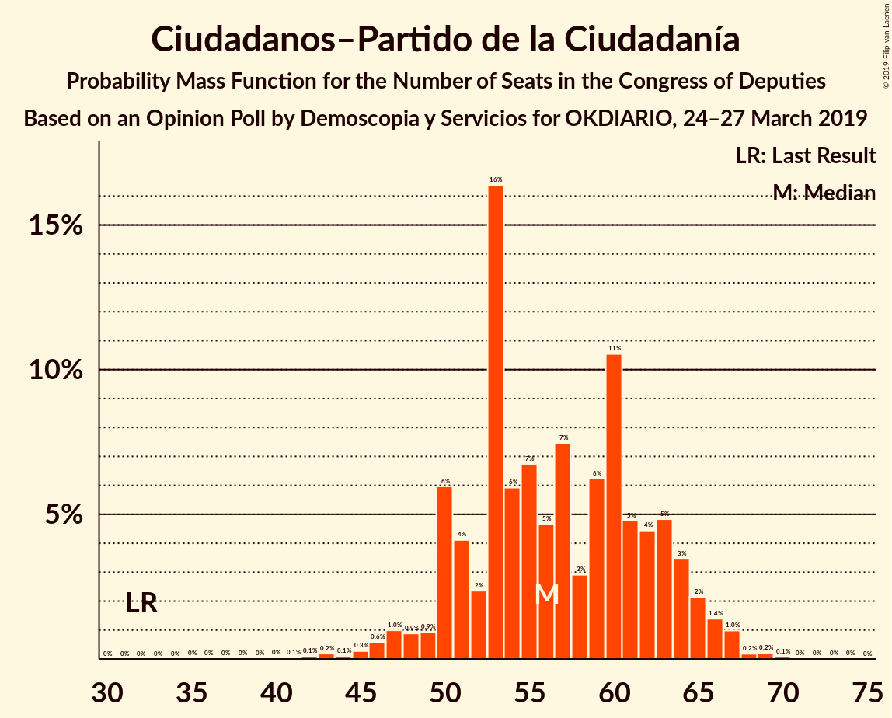
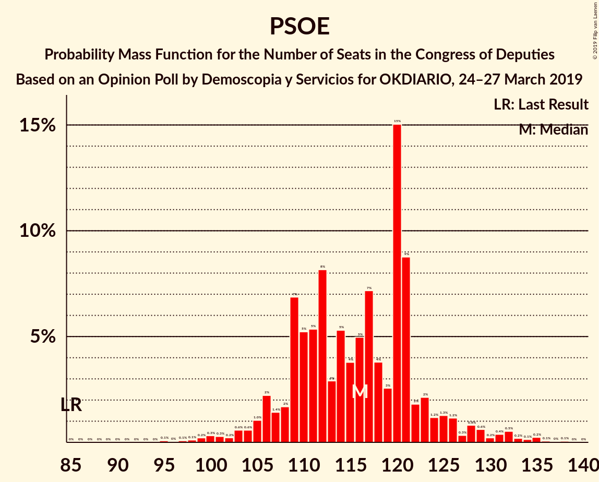

# Opinion Poll by Demoscopia y Servicios for OKDIARIO, 24–27 March 2019

<a href="#voting-intentions">Voting Intentions</a> | <a href="#seats">Seats</a> | <a href="#coalitions">Coalitions</a> | <a href="#technical-information">Technical Information</a>

## Voting Intentions

### Confidence Intervals

| Party | Last Result | Poll Result | 80% Confidence Interval | 90% Confidence Interval | 95% Confidence Interval | 99% Confidence Interval |
|:-----:|:-----------:|:-----------:|:-----------------------:|:-----------------------:|:-----------------------:|:-----------------------:|
| Partido Socialista Obrero Español | 22.6% | 27.7% | 26.0–29.4% |25.6–29.9% |25.2–30.3% |24.4–31.1% |
| Partido Popular | 33.0% | 21.0% | 19.6–22.6% |19.1–23.1% |18.8–23.5% |18.1–24.2% |
| Ciudadanos–Partido de la Ciudadanía | 13.1% | 16.9% | 15.6–18.4% |15.2–18.8% |14.9–19.2% |14.3–19.9% |
| Unidos Podemos | 21.2% | 14.7% | 13.5–16.1% |13.1–16.5% |12.8–16.9% |12.2–17.6% |
| Vox | 0.2% | 11.2% | 10.1–12.5% |9.8–12.9% |9.5–13.2% |9.0–13.8% |
| Esquerra Republicana de Catalunya–Catalunya Sí | 2.7% | 2.1% | 1.7–2.8% |1.5–3.0% |1.4–3.1% |1.2–3.5% |
| Euzko Alderdi Jeltzalea/Partido Nacionalista Vasco | 1.2% | 1.5% | 1.2–2.1% |1.1–2.3% |1.0–2.4% |0.8–2.7% |
| Partit Demòcrata Europeu Català | 2.0% | 1.4% | 1.0–1.9% |0.9–2.1% |0.8–2.2% |0.7–2.5% |
| Euskal Herria Bildu | 0.8% | 1.0% | 0.7–1.5% |0.6–1.7% |0.6–1.8% |0.5–2.1% |

*Note:* The poll result column reflects the actual value used in the calculations. Published results may vary slightly, and in addition be rounded to fewer digits.

## Seats

### Confidence Intervals

| Party | Last Result | Median | 80% Confidence Interval | 90% Confidence Interval | 95% Confidence Interval | 99% Confidence Interval |
|:-----:|:-----------:|:------:|:-----------------------:|:-----------------------:|:-----------------------:|:-----------------------:|
| <a href="#partido-socialista-obrero-español">Partido Socialista Obrero Español</a> | 85 | 116 | 106–122 |105–126 |103–129 |101–133 |
| <a href="#partido-popular">Partido Popular</a> | 137 | 87 | 79–90 |76–94 |72–97 |68–102 |
| <a href="#ciudadanos–partido-de-la-ciudadanía">Ciudadanos–Partido de la Ciudadanía</a> | 32 | 59 | 50–64 |50–65 |48–66 |45–67 |
| <a href="#unidos-podemos">Unidos Podemos</a> | 71 | 37 | 35–41 |33–43 |32–45 |30–54 |
| <a href="#vox">Vox</a> | 0 | 26 | 22–30 |22–33 |20–34 |19–38 |
| <a href="#esquerra-republicana-de-catalunya–catalunya-sí">Esquerra Republicana de Catalunya–Catalunya Sí</a> | 9 | 11 | 7–13 |7–13 |6–14 |6–15 |
| <a href="#euzko-alderdi-jeltzalea/partido-nacionalista-vasco">Euzko Alderdi Jeltzalea/Partido Nacionalista Vasco</a> | 5 | 7 | 6–9 |5–10 |4–10 |3–10 |
| <a href="#partit-demòcrata-europeu-català">Partit Demòcrata Europeu Català</a> | 8 | 4 | 4–8 |3–9 |3–10 |1–10 |
| <a href="#euskal-herria-bildu">Euskal Herria Bildu</a> | 2 | 5 | 2–6 |2–7 |2–7 |1–9 |

### Partido Socialista Obrero Español

*For a full overview of the results for this party, see the [Partido Socialista Obrero Español](party-partidosocialistaobreroespañol.html) page.*

| Number of Seats | Probability | Accumulated | Special Marks |
|:---------------:|:-----------:|:-----------:|:-------------:|
| 85 | 0% | 100% | Last Result |
| 86 | 0% | 100% |  |
| 87 | 0% | 100% |  |
| 88 | 0% | 100% |  |
| 89 | 0% | 100% |  |
| 90 | 0% | 100% |  |
| 91 | 0% | 100% |  |
| 92 | 0% | 100% |  |
| 93 | 0% | 100% |  |
| 94 | 0% | 100% |  |
| 95 | 0% | 100% |  |
| 96 | 0.1% | 99.9% |  |
| 97 | 0.1% | 99.9% |  |
| 98 | 0.1% | 99.8% |  |
| 99 | 0.1% | 99.7% |  |
| 100 | 0.1% | 99.7% |  |
| 101 | 0.2% | 99.6% |  |
| 102 | 0.4% | 99.4% |  |
| 103 | 2% | 98.9% |  |
| 104 | 1.0% | 97% |  |
| 105 | 2% | 96% |  |
| 106 | 5% | 94% |  |
| 107 | 1.5% | 89% |  |
| 108 | 5% | 88% |  |
| 109 | 2% | 83% |  |
| 110 | 2% | 82% |  |
| 111 | 0.5% | 79% |  |
| 112 | 13% | 79% |  |
| 113 | 2% | 66% |  |
| 114 | 0.8% | 64% |  |
| 115 | 1.3% | 64% |  |
| 116 | 37% | 62% | Median |
| 117 | 3% | 25% |  |
| 118 | 4% | 22% |  |
| 119 | 4% | 18% |  |
| 120 | 2% | 14% |  |
| 121 | 1.1% | 13% |  |
| 122 | 4% | 12% |  |
| 123 | 0.8% | 8% |  |
| 124 | 1.3% | 7% |  |
| 125 | 0.3% | 5% |  |
| 126 | 1.1% | 5% |  |
| 127 | 0.2% | 4% |  |
| 128 | 0.3% | 4% |  |
| 129 | 2% | 3% |  |
| 130 | 0.3% | 2% |  |
| 131 | 0.6% | 2% |  |
| 132 | 0.1% | 1.0% |  |
| 133 | 0.4% | 0.9% |  |
| 134 | 0.3% | 0.4% |  |
| 135 | 0% | 0.2% |  |
| 136 | 0.1% | 0.2% |  |
| 137 | 0% | 0.1% |  |
| 138 | 0% | 0% |  |

### Partido Popular

*For a full overview of the results for this party, see the [Partido Popular](party-partidopopular.html) page.*

| Number of Seats | Probability | Accumulated | Special Marks |
|:---------------:|:-----------:|:-----------:|:-------------:|
| 62 | 0.1% | 100% |  |
| 63 | 0.1% | 99.9% |  |
| 64 | 0.2% | 99.8% |  |
| 65 | 0% | 99.6% |  |
| 66 | 0.1% | 99.6% |  |
| 67 | 0% | 99.5% |  |
| 68 | 0.2% | 99.5% |  |
| 69 | 1.3% | 99.4% |  |
| 70 | 0.1% | 98% |  |
| 71 | 0.3% | 98% |  |
| 72 | 0.4% | 98% |  |
| 73 | 0.7% | 97% |  |
| 74 | 0.5% | 97% |  |
| 75 | 0.2% | 96% |  |
| 76 | 1.1% | 96% |  |
| 77 | 3% | 95% |  |
| 78 | 0.5% | 92% |  |
| 79 | 9% | 92% |  |
| 80 | 2% | 82% |  |
| 81 | 2% | 80% |  |
| 82 | 4% | 78% |  |
| 83 | 7% | 74% |  |
| 84 | 5% | 67% |  |
| 85 | 2% | 62% |  |
| 86 | 3% | 59% |  |
| 87 | 29% | 56% | Median |
| 88 | 4% | 27% |  |
| 89 | 0.4% | 23% |  |
| 90 | 13% | 22% |  |
| 91 | 3% | 10% |  |
| 92 | 0.6% | 7% |  |
| 93 | 0.9% | 6% |  |
| 94 | 0.5% | 5% |  |
| 95 | 1.4% | 5% |  |
| 96 | 0.4% | 3% |  |
| 97 | 0.4% | 3% |  |
| 98 | 0.5% | 2% |  |
| 99 | 0.2% | 2% |  |
| 100 | 0.2% | 2% |  |
| 101 | 1.0% | 2% |  |
| 102 | 0.2% | 0.5% |  |
| 103 | 0.1% | 0.4% |  |
| 104 | 0.2% | 0.2% |  |
| 105 | 0% | 0.1% |  |
| 106 | 0% | 0.1% |  |
| 107 | 0% | 0% |  |
| 108 | 0% | 0% |  |
| 109 | 0% | 0% |  |
| 110 | 0% | 0% |  |
| 111 | 0% | 0% |  |
| 112 | 0% | 0% |  |
| 113 | 0% | 0% |  |
| 114 | 0% | 0% |  |
| 115 | 0% | 0% |  |
| 116 | 0% | 0% |  |
| 117 | 0% | 0% |  |
| 118 | 0% | 0% |  |
| 119 | 0% | 0% |  |
| 120 | 0% | 0% |  |
| 121 | 0% | 0% |  |
| 122 | 0% | 0% |  |
| 123 | 0% | 0% |  |
| 124 | 0% | 0% |  |
| 125 | 0% | 0% |  |
| 126 | 0% | 0% |  |
| 127 | 0% | 0% |  |
| 128 | 0% | 0% |  |
| 129 | 0% | 0% |  |
| 130 | 0% | 0% |  |
| 131 | 0% | 0% |  |
| 132 | 0% | 0% |  |
| 133 | 0% | 0% |  |
| 134 | 0% | 0% |  |
| 135 | 0% | 0% |  |
| 136 | 0% | 0% |  |
| 137 | 0% | 0% | Last Result |

### Ciudadanos–Partido de la Ciudadanía

*For a full overview of the results for this party, see the [Ciudadanos–Partido de la Ciudadanía](party-ciudadanos–partidodelaciudadanía.html) page.*

| Number of Seats | Probability | Accumulated | Special Marks |
|:---------------:|:-----------:|:-----------:|:-------------:|
| 32 | 0% | 100% | Last Result |
| 33 | 0% | 100% |  |
| 34 | 0% | 100% |  |
| 35 | 0% | 100% |  |
| 36 | 0% | 100% |  |
| 37 | 0% | 100% |  |
| 38 | 0% | 100% |  |
| 39 | 0% | 100% |  |
| 40 | 0.1% | 100% |  |
| 41 | 0.1% | 99.8% |  |
| 42 | 0% | 99.8% |  |
| 43 | 0% | 99.7% |  |
| 44 | 0.1% | 99.7% |  |
| 45 | 0.5% | 99.6% |  |
| 46 | 0.3% | 99.1% |  |
| 47 | 0.5% | 98.8% |  |
| 48 | 0.8% | 98% |  |
| 49 | 1.0% | 97% |  |
| 50 | 7% | 96% |  |
| 51 | 3% | 90% |  |
| 52 | 2% | 87% |  |
| 53 | 4% | 85% |  |
| 54 | 5% | 81% |  |
| 55 | 2% | 76% |  |
| 56 | 14% | 74% |  |
| 57 | 9% | 61% |  |
| 58 | 1.2% | 52% |  |
| 59 | 1.2% | 51% | Median |
| 60 | 1.3% | 49% |  |
| 61 | 26% | 48% |  |
| 62 | 4% | 22% |  |
| 63 | 7% | 18% |  |
| 64 | 3% | 10% |  |
| 65 | 2% | 7% |  |
| 66 | 4% | 5% |  |
| 67 | 0.7% | 1.2% |  |
| 68 | 0.1% | 0.5% |  |
| 69 | 0.1% | 0.4% |  |
| 70 | 0.2% | 0.3% |  |
| 71 | 0% | 0.1% |  |
| 72 | 0% | 0.1% |  |
| 73 | 0% | 0% |  |

### Unidos Podemos

*For a full overview of the results for this party, see the [Unidos Podemos](party-unidospodemos.html) page.*

| Number of Seats | Probability | Accumulated | Special Marks |
|:---------------:|:-----------:|:-----------:|:-------------:|
| 26 | 0% | 100% |  |
| 27 | 0% | 99.9% |  |
| 28 | 0% | 99.9% |  |
| 29 | 0.1% | 99.9% |  |
| 30 | 1.1% | 99.8% |  |
| 31 | 0.6% | 98.6% |  |
| 32 | 3% | 98% |  |
| 33 | 2% | 95% |  |
| 34 | 1.0% | 93% |  |
| 35 | 33% | 92% |  |
| 36 | 4% | 59% |  |
| 37 | 5% | 54% | Median |
| 38 | 8% | 49% |  |
| 39 | 6% | 41% |  |
| 40 | 15% | 35% |  |
| 41 | 11% | 20% |  |
| 42 | 2% | 9% |  |
| 43 | 3% | 7% |  |
| 44 | 1.3% | 4% |  |
| 45 | 0.1% | 3% |  |
| 46 | 0.1% | 2% |  |
| 47 | 0.1% | 2% |  |
| 48 | 0.2% | 2% |  |
| 49 | 1.3% | 2% |  |
| 50 | 0.1% | 0.8% |  |
| 51 | 0.1% | 0.7% |  |
| 52 | 0% | 0.6% |  |
| 53 | 0% | 0.6% |  |
| 54 | 0.2% | 0.6% |  |
| 55 | 0.1% | 0.4% |  |
| 56 | 0.2% | 0.3% |  |
| 57 | 0% | 0.2% |  |
| 58 | 0% | 0.2% |  |
| 59 | 0.1% | 0.2% |  |
| 60 | 0% | 0.1% |  |
| 61 | 0% | 0% |  |
| 62 | 0% | 0% |  |
| 63 | 0% | 0% |  |
| 64 | 0% | 0% |  |
| 65 | 0% | 0% |  |
| 66 | 0% | 0% |  |
| 67 | 0% | 0% |  |
| 68 | 0% | 0% |  |
| 69 | 0% | 0% |  |
| 70 | 0% | 0% |  |
| 71 | 0% | 0% | Last Result |

### Vox

*For a full overview of the results for this party, see the [Vox](party-vox.html) page.*

| Number of Seats | Probability | Accumulated | Special Marks |
|:---------------:|:-----------:|:-----------:|:-------------:|
| 0 | 0% | 100% | Last Result |
| 1 | 0% | 100% |  |
| 2 | 0% | 100% |  |
| 3 | 0% | 100% |  |
| 4 | 0% | 100% |  |
| 5 | 0% | 100% |  |
| 6 | 0% | 100% |  |
| 7 | 0% | 100% |  |
| 8 | 0% | 100% |  |
| 9 | 0% | 100% |  |
| 10 | 0% | 100% |  |
| 11 | 0% | 100% |  |
| 12 | 0% | 100% |  |
| 13 | 0% | 100% |  |
| 14 | 0% | 100% |  |
| 15 | 0% | 100% |  |
| 16 | 0% | 100% |  |
| 17 | 0% | 99.9% |  |
| 18 | 0.2% | 99.9% |  |
| 19 | 2% | 99.7% |  |
| 20 | 0.4% | 98% |  |
| 21 | 2% | 97% |  |
| 22 | 27% | 96% |  |
| 23 | 4% | 69% |  |
| 24 | 7% | 64% |  |
| 25 | 2% | 57% |  |
| 26 | 6% | 55% | Median |
| 27 | 25% | 50% |  |
| 28 | 2% | 24% |  |
| 29 | 5% | 22% |  |
| 30 | 9% | 17% |  |
| 31 | 3% | 9% |  |
| 32 | 0.6% | 6% |  |
| 33 | 2% | 6% |  |
| 34 | 0.9% | 3% |  |
| 35 | 1.0% | 2% |  |
| 36 | 0.1% | 1.3% |  |
| 37 | 0.1% | 1.3% |  |
| 38 | 1.0% | 1.2% |  |
| 39 | 0% | 0.2% |  |
| 40 | 0.1% | 0.2% |  |
| 41 | 0% | 0.2% |  |
| 42 | 0.1% | 0.1% |  |
| 43 | 0% | 0% |  |

### Esquerra Republicana de Catalunya–Catalunya Sí

*For a full overview of the results for this party, see the [Esquerra Republicana de Catalunya–Catalunya Sí](party-esquerrarepublicanadecatalunya–catalunyasí.html) page.*

| Number of Seats | Probability | Accumulated | Special Marks |
|:---------------:|:-----------:|:-----------:|:-------------:|
| 3 | 0.1% | 100% |  |
| 4 | 0% | 99.9% |  |
| 5 | 0% | 99.9% |  |
| 6 | 3% | 99.9% |  |
| 7 | 8% | 97% |  |
| 8 | 7% | 89% |  |
| 9 | 13% | 82% | Last Result |
| 10 | 8% | 69% |  |
| 11 | 30% | 61% | Median |
| 12 | 15% | 31% |  |
| 13 | 12% | 16% |  |
| 14 | 3% | 4% |  |
| 15 | 0.6% | 0.7% |  |
| 16 | 0.1% | 0.1% |  |
| 17 | 0% | 0% |  |

### Euzko Alderdi Jeltzalea/Partido Nacionalista Vasco

*For a full overview of the results for this party, see the [Euzko Alderdi Jeltzalea/Partido Nacionalista Vasco](party-euzkoalderdijeltzaleapartidonacionalistavasco.html) page.*

| Number of Seats | Probability | Accumulated | Special Marks |
|:---------------:|:-----------:|:-----------:|:-------------:|
| 3 | 1.3% | 100% |  |
| 4 | 1.2% | 98.7% |  |
| 5 | 4% | 97% | Last Result |
| 6 | 28% | 93% |  |
| 7 | 45% | 65% | Median |
| 8 | 8% | 20% |  |
| 9 | 6% | 12% |  |
| 10 | 6% | 7% |  |
| 11 | 0.1% | 0.1% |  |
| 12 | 0% | 0% |  |

### Partit Demòcrata Europeu Català

*For a full overview of the results for this party, see the [Partit Demòcrata Europeu Català](party-partitdemòcrataeuropeucatalà.html) page.*

| Number of Seats | Probability | Accumulated | Special Marks |
|:---------------:|:-----------:|:-----------:|:-------------:|
| 1 | 0.6% | 100% |  |
| 2 | 0.1% | 99.4% |  |
| 3 | 9% | 99.3% |  |
| 4 | 46% | 91% | Median |
| 5 | 12% | 45% |  |
| 6 | 7% | 33% |  |
| 7 | 4% | 26% |  |
| 8 | 15% | 22% | Last Result |
| 9 | 2% | 7% |  |
| 10 | 5% | 5% |  |
| 11 | 0.1% | 0.3% |  |
| 12 | 0.1% | 0.1% |  |
| 13 | 0% | 0% |  |

### Euskal Herria Bildu

*For a full overview of the results for this party, see the [Euskal Herria Bildu](party-euskalherriabildu.html) page.*

| Number of Seats | Probability | Accumulated | Special Marks |
|:---------------:|:-----------:|:-----------:|:-------------:|
| 0 | 0.1% | 100% |  |
| 1 | 2% | 99.9% |  |
| 2 | 17% | 98% | Last Result |
| 3 | 13% | 81% |  |
| 4 | 12% | 68% |  |
| 5 | 12% | 56% | Median |
| 6 | 39% | 45% |  |
| 7 | 4% | 5% |  |
| 8 | 0.9% | 1.4% |  |
| 9 | 0.5% | 0.5% |  |
| 10 | 0% | 0.1% |  |
| 11 | 0% | 0% |  |

## Coalitions

### Confidence Intervals

| Coalition | Last Result | Median | Majority? | 80% Confidence Interval | 90% Confidence Interval | 95% Confidence Interval | 99% Confidence Interval |
|:---------:|:-----------:|:------:|:---------:|:-----------------------:|:-----------------------:|:-----------------------:|:-----------------------:|
| Partido Socialista Obrero Español – Partido Popular – Ciudadanos–Partido de la Ciudadanía | 254 | 258 | 100% | 249–264 | 249–264 | 246–265 | 241–269 |
| Partido Socialista Obrero Español – Ciudadanos–Partido de la Ciudadanía – Unidos Podemos | 188 | 212 | 100% | 204–218 | 201–222 | 196–225 | 191–230 |
| Partido Socialista Obrero Español – Partido Popular | 222 | 202 | 99.9% | 193–204 | 190–209 | 186–212 | 182–214 |
| Partido Socialista Obrero Español – Unidos Podemos – Esquerra Republicana de Catalunya–Catalunya Sí – Euzko Alderdi Jeltzalea/Partido Nacionalista Vasco – Partit Demòcrata Europeu Català – Euskal Herria Bildu | 180 | 179 | 87% | 174–186 | 171–190 | 168–194 | 166–201 |
| Partido Socialista Obrero Español – Ciudadanos–Partido de la Ciudadanía | 117 | 176 | 50% | 164–180 | 162–184 | 159–185 | 153–188 |
| Partido Socialista Obrero Español – Unidos Podemos – Esquerra Republicana de Catalunya–Catalunya Sí – Partit Demòcrata Europeu Català | 173 | 168 | 8% | 162–174 | 160–179 | 156–183 | 154–190 |
| Partido Popular – Ciudadanos–Partido de la Ciudadanía – Vox | 169 | 170 | 9% | 163–175 | 159–178 | 155–181 | 148–183 |
| Partido Socialista Obrero Español – Unidos Podemos – Esquerra Republicana de Catalunya–Catalunya Sí – Euskal Herria Bildu | 167 | 168 | 7% | 160–172 | 157–178 | 155–180 | 152–188 |
| Partido Socialista Obrero Español – Unidos Podemos – Euzko Alderdi Jeltzalea/Partido Nacionalista Vasco – Euskal Herria Bildu | 163 | 164 | 5% | 157–170 | 154–175 | 152–177 | 149–185 |
| Partido Socialista Obrero Español – Unidos Podemos – Euzko Alderdi Jeltzalea/Partido Nacionalista Vasco | 161 | 158 | 1.4% | 152–167 | 150–171 | 149–174 | 145–181 |
| Partido Socialista Obrero Español – Unidos Podemos | 156 | 152 | 0.5% | 146–159 | 144–165 | 140–165 | 139–175 |
| Partido Popular – Ciudadanos–Partido de la Ciudadanía – Euzko Alderdi Jeltzalea/Partido Nacionalista Vasco | 174 | 152 | 0% | 140–156 | 138–158 | 137–161 | 128–166 |
| Partido Popular – Ciudadanos–Partido de la Ciudadanía | 169 | 146 | 0% | 133–148 | 132–152 | 130–154 | 122–157 |
| Partido Socialista Obrero Español | 85 | 116 | 0% | 106–122 | 105–126 | 103–129 | 101–133 |
| Partido Popular – Vox | 137 | 110 | 0% | 103–117 | 101–122 | 96–124 | 94–131 |
| Partido Popular | 137 | 87 | 0% | 79–90 | 76–94 | 72–97 | 68–102 |

### Partido Socialista Obrero Español – Partido Popular – Ciudadanos–Partido de la Ciudadanía

| Number of Seats | Probability | Accumulated | Special Marks |
|:---------------:|:-----------:|:-----------:|:-------------:|
| 231 | 0% | 100% |  |
| 232 | 0% | 99.9% |  |
| 233 | 0% | 99.9% |  |
| 234 | 0% | 99.9% |  |
| 235 | 0% | 99.9% |  |
| 236 | 0% | 99.9% |  |
| 237 | 0.2% | 99.9% |  |
| 238 | 0% | 99.7% |  |
| 239 | 0.1% | 99.7% |  |
| 240 | 0% | 99.6% |  |
| 241 | 0.3% | 99.5% |  |
| 242 | 0.1% | 99.2% |  |
| 243 | 0.9% | 99.1% |  |
| 244 | 0.1% | 98% |  |
| 245 | 0.1% | 98% |  |
| 246 | 0.5% | 98% |  |
| 247 | 0.3% | 97% |  |
| 248 | 0.5% | 97% |  |
| 249 | 7% | 97% |  |
| 250 | 5% | 90% |  |
| 251 | 0.4% | 85% |  |
| 252 | 4% | 85% |  |
| 253 | 1.1% | 81% |  |
| 254 | 2% | 80% | Last Result |
| 255 | 5% | 77% |  |
| 256 | 2% | 72% |  |
| 257 | 2% | 70% |  |
| 258 | 21% | 68% |  |
| 259 | 3% | 47% |  |
| 260 | 4% | 44% |  |
| 261 | 4% | 40% |  |
| 262 | 5% | 36% | Median |
| 263 | 0.5% | 31% |  |
| 264 | 26% | 30% |  |
| 265 | 2% | 4% |  |
| 266 | 0.9% | 2% |  |
| 267 | 0% | 1.2% |  |
| 268 | 0.1% | 1.1% |  |
| 269 | 0.6% | 1.0% |  |
| 270 | 0.2% | 0.4% |  |
| 271 | 0% | 0.2% |  |
| 272 | 0% | 0.2% |  |
| 273 | 0.1% | 0.2% |  |
| 274 | 0% | 0.1% |  |
| 275 | 0.1% | 0.1% |  |
| 276 | 0% | 0% |  |

### Partido Socialista Obrero Español – Ciudadanos–Partido de la Ciudadanía – Unidos Podemos

| Number of Seats | Probability | Accumulated | Special Marks |
|:---------------:|:-----------:|:-----------:|:-------------:|
| 188 | 0% | 100% | Last Result |
| 189 | 0% | 99.9% |  |
| 190 | 0.3% | 99.9% |  |
| 191 | 0.7% | 99.6% |  |
| 192 | 0.1% | 98.9% |  |
| 193 | 0.1% | 98.7% |  |
| 194 | 0% | 98.7% |  |
| 195 | 0.7% | 98.6% |  |
| 196 | 1.2% | 98% |  |
| 197 | 0.2% | 97% |  |
| 198 | 0.1% | 97% |  |
| 199 | 1.0% | 96% |  |
| 200 | 0.3% | 95% |  |
| 201 | 1.1% | 95% |  |
| 202 | 0.3% | 94% |  |
| 203 | 4% | 94% |  |
| 204 | 2% | 90% |  |
| 205 | 3% | 88% |  |
| 206 | 2% | 85% |  |
| 207 | 11% | 83% |  |
| 208 | 15% | 73% |  |
| 209 | 2% | 57% |  |
| 210 | 4% | 55% |  |
| 211 | 1.0% | 51% |  |
| 212 | 25% | 50% | Median |
| 213 | 0.1% | 25% |  |
| 214 | 4% | 25% |  |
| 215 | 0.7% | 21% |  |
| 216 | 0.5% | 20% |  |
| 217 | 8% | 20% |  |
| 218 | 2% | 11% |  |
| 219 | 0.2% | 10% |  |
| 220 | 3% | 9% |  |
| 221 | 0.9% | 6% |  |
| 222 | 2% | 6% |  |
| 223 | 0.1% | 3% |  |
| 224 | 0% | 3% |  |
| 225 | 0.7% | 3% |  |
| 226 | 0.1% | 2% |  |
| 227 | 0.2% | 2% |  |
| 228 | 0% | 2% |  |
| 229 | 1.3% | 2% |  |
| 230 | 0.3% | 0.6% |  |
| 231 | 0.2% | 0.3% |  |
| 232 | 0% | 0.1% |  |
| 233 | 0% | 0% |  |

### Partido Socialista Obrero Español – Partido Popular

| Number of Seats | Probability | Accumulated | Special Marks |
|:---------------:|:-----------:|:-----------:|:-------------:|
| 174 | 0% | 100% |  |
| 175 | 0% | 99.9% |  |
| 176 | 0% | 99.9% | Majority |
| 177 | 0.2% | 99.9% |  |
| 178 | 0% | 99.7% |  |
| 179 | 0% | 99.7% |  |
| 180 | 0.1% | 99.7% |  |
| 181 | 0% | 99.6% |  |
| 182 | 0.1% | 99.5% |  |
| 183 | 0% | 99.5% |  |
| 184 | 0.1% | 99.5% |  |
| 185 | 2% | 99.4% |  |
| 186 | 0.9% | 98% |  |
| 187 | 0.1% | 97% |  |
| 188 | 0.3% | 97% |  |
| 189 | 0.7% | 97% |  |
| 190 | 3% | 96% |  |
| 191 | 1.4% | 93% |  |
| 192 | 0.1% | 91% |  |
| 193 | 2% | 91% |  |
| 194 | 1.0% | 89% |  |
| 195 | 8% | 88% |  |
| 196 | 7% | 80% |  |
| 197 | 2% | 72% |  |
| 198 | 1.5% | 71% |  |
| 199 | 7% | 69% |  |
| 200 | 3% | 62% |  |
| 201 | 0.5% | 60% |  |
| 202 | 15% | 59% |  |
| 203 | 27% | 44% | Median |
| 204 | 7% | 17% |  |
| 205 | 0.5% | 10% |  |
| 206 | 0.9% | 9% |  |
| 207 | 0.5% | 8% |  |
| 208 | 2% | 8% |  |
| 209 | 1.0% | 6% |  |
| 210 | 0.3% | 5% |  |
| 211 | 2% | 5% |  |
| 212 | 1.1% | 3% |  |
| 213 | 1.1% | 2% |  |
| 214 | 0.3% | 0.6% |  |
| 215 | 0% | 0.2% |  |
| 216 | 0.1% | 0.2% |  |
| 217 | 0% | 0.2% |  |
| 218 | 0% | 0.1% |  |
| 219 | 0.1% | 0.1% |  |
| 220 | 0% | 0% |  |
| 221 | 0% | 0% |  |
| 222 | 0% | 0% | Last Result |

### Partido Socialista Obrero Español – Unidos Podemos – Esquerra Republicana de Catalunya–Catalunya Sí – Euzko Alderdi Jeltzalea/Partido Nacionalista Vasco – Partit Demòcrata Europeu Català – Euskal Herria Bildu

| Number of Seats | Probability | Accumulated | Special Marks |
|:---------------:|:-----------:|:-----------:|:-------------:|
| 160 | 0% | 100% |  |
| 161 | 0% | 99.9% |  |
| 162 | 0% | 99.9% |  |
| 163 | 0% | 99.9% |  |
| 164 | 0.1% | 99.9% |  |
| 165 | 0.2% | 99.8% |  |
| 166 | 2% | 99.6% |  |
| 167 | 0.1% | 98% |  |
| 168 | 0.3% | 98% |  |
| 169 | 1.3% | 97% |  |
| 170 | 0.4% | 96% |  |
| 171 | 0.7% | 96% |  |
| 172 | 2% | 95% |  |
| 173 | 2% | 93% |  |
| 174 | 3% | 91% |  |
| 175 | 1.1% | 88% |  |
| 176 | 16% | 87% | Majority |
| 177 | 1.2% | 71% |  |
| 178 | 3% | 69% |  |
| 179 | 26% | 66% |  |
| 180 | 9% | 39% | Last Result, Median |
| 181 | 1.5% | 31% |  |
| 182 | 2% | 29% |  |
| 183 | 4% | 28% |  |
| 184 | 5% | 24% |  |
| 185 | 1.4% | 19% |  |
| 186 | 8% | 18% |  |
| 187 | 1.1% | 9% |  |
| 188 | 1.2% | 8% |  |
| 189 | 1.2% | 7% |  |
| 190 | 1.3% | 6% |  |
| 191 | 0.2% | 4% |  |
| 192 | 0.3% | 4% |  |
| 193 | 0.8% | 4% |  |
| 194 | 2% | 3% |  |
| 195 | 0.2% | 1.1% |  |
| 196 | 0.2% | 0.9% |  |
| 197 | 0.1% | 0.7% |  |
| 198 | 0% | 0.7% |  |
| 199 | 0.1% | 0.6% |  |
| 200 | 0% | 0.5% |  |
| 201 | 0.4% | 0.5% |  |
| 202 | 0% | 0.2% |  |
| 203 | 0% | 0.1% |  |
| 204 | 0.1% | 0.1% |  |
| 205 | 0% | 0.1% |  |
| 206 | 0% | 0% |  |

### Partido Socialista Obrero Español – Ciudadanos–Partido de la Ciudadanía

| Number of Seats | Probability | Accumulated | Special Marks |
|:---------------:|:-----------:|:-----------:|:-------------:|
| 117 | 0% | 100% | Last Result |
| 118 | 0% | 100% |  |
| 119 | 0% | 100% |  |
| 120 | 0% | 100% |  |
| 121 | 0% | 100% |  |
| 122 | 0% | 100% |  |
| 123 | 0% | 100% |  |
| 124 | 0% | 100% |  |
| 125 | 0% | 100% |  |
| 126 | 0% | 100% |  |
| 127 | 0% | 100% |  |
| 128 | 0% | 100% |  |
| 129 | 0% | 100% |  |
| 130 | 0% | 100% |  |
| 131 | 0% | 100% |  |
| 132 | 0% | 100% |  |
| 133 | 0% | 100% |  |
| 134 | 0% | 100% |  |
| 135 | 0% | 100% |  |
| 136 | 0% | 100% |  |
| 137 | 0% | 100% |  |
| 138 | 0% | 100% |  |
| 139 | 0% | 100% |  |
| 140 | 0% | 100% |  |
| 141 | 0% | 100% |  |
| 142 | 0% | 100% |  |
| 143 | 0% | 100% |  |
| 144 | 0% | 100% |  |
| 145 | 0% | 100% |  |
| 146 | 0% | 100% |  |
| 147 | 0% | 100% |  |
| 148 | 0% | 99.9% |  |
| 149 | 0% | 99.9% |  |
| 150 | 0% | 99.9% |  |
| 151 | 0.1% | 99.9% |  |
| 152 | 0.1% | 99.8% |  |
| 153 | 0.3% | 99.7% |  |
| 154 | 0.1% | 99.4% |  |
| 155 | 0.1% | 99.3% |  |
| 156 | 0.5% | 99.2% |  |
| 157 | 0.6% | 98.7% |  |
| 158 | 0.4% | 98% |  |
| 159 | 0.3% | 98% |  |
| 160 | 0.1% | 97% |  |
| 161 | 0.3% | 97% |  |
| 162 | 3% | 97% |  |
| 163 | 3% | 94% |  |
| 164 | 2% | 90% |  |
| 165 | 0.7% | 88% |  |
| 166 | 6% | 87% |  |
| 167 | 2% | 82% |  |
| 168 | 18% | 79% |  |
| 169 | 0.6% | 61% |  |
| 170 | 2% | 60% |  |
| 171 | 3% | 59% |  |
| 172 | 0.4% | 56% |  |
| 173 | 2% | 55% |  |
| 174 | 1.1% | 54% |  |
| 175 | 2% | 52% | Median |
| 176 | 1.4% | 50% | Majority |
| 177 | 27% | 49% |  |
| 178 | 0.2% | 22% |  |
| 179 | 10% | 21% |  |
| 180 | 2% | 12% |  |
| 181 | 3% | 10% |  |
| 182 | 0.2% | 7% |  |
| 183 | 2% | 7% |  |
| 184 | 2% | 6% |  |
| 185 | 2% | 4% |  |
| 186 | 0.4% | 2% |  |
| 187 | 0.4% | 1.3% |  |
| 188 | 0.6% | 0.9% |  |
| 189 | 0% | 0.3% |  |
| 190 | 0.1% | 0.3% |  |
| 191 | 0% | 0.1% |  |
| 192 | 0% | 0.1% |  |
| 193 | 0% | 0.1% |  |
| 194 | 0% | 0.1% |  |
| 195 | 0% | 0.1% |  |
| 196 | 0% | 0.1% |  |
| 197 | 0% | 0% |  |

### Partido Socialista Obrero Español – Unidos Podemos – Esquerra Republicana de Catalunya–Catalunya Sí – Partit Demòcrata Europeu Català

| Number of Seats | Probability | Accumulated | Special Marks |
|:---------------:|:-----------:|:-----------:|:-------------:|
| 149 | 0% | 100% |  |
| 150 | 0% | 99.9% |  |
| 151 | 0% | 99.9% |  |
| 152 | 0.1% | 99.9% |  |
| 153 | 0.1% | 99.8% |  |
| 154 | 2% | 99.8% |  |
| 155 | 0.2% | 98% |  |
| 156 | 2% | 98% |  |
| 157 | 0.2% | 96% |  |
| 158 | 0.2% | 96% |  |
| 159 | 0.4% | 96% |  |
| 160 | 1.3% | 96% |  |
| 161 | 2% | 94% |  |
| 162 | 3% | 92% |  |
| 163 | 2% | 89% |  |
| 164 | 4% | 87% |  |
| 165 | 0.4% | 83% |  |
| 166 | 25% | 82% |  |
| 167 | 4% | 57% |  |
| 168 | 14% | 53% | Median |
| 169 | 2% | 39% |  |
| 170 | 10% | 37% |  |
| 171 | 2% | 27% |  |
| 172 | 5% | 25% |  |
| 173 | 9% | 20% | Last Result |
| 174 | 0.7% | 11% |  |
| 175 | 1.5% | 10% |  |
| 176 | 1.4% | 8% | Majority |
| 177 | 0.1% | 7% |  |
| 178 | 1.4% | 7% |  |
| 179 | 1.0% | 5% |  |
| 180 | 0.2% | 4% |  |
| 181 | 0.2% | 4% |  |
| 182 | 0.7% | 4% |  |
| 183 | 2% | 3% |  |
| 184 | 0.1% | 0.9% |  |
| 185 | 0.1% | 0.8% |  |
| 186 | 0% | 0.7% |  |
| 187 | 0% | 0.7% |  |
| 188 | 0.1% | 0.7% |  |
| 189 | 0.1% | 0.6% |  |
| 190 | 0.2% | 0.6% |  |
| 191 | 0.2% | 0.3% |  |
| 192 | 0.1% | 0.1% |  |
| 193 | 0% | 0.1% |  |
| 194 | 0% | 0% |  |

### Partido Popular – Ciudadanos–Partido de la Ciudadanía – Vox

| Number of Seats | Probability | Accumulated | Special Marks |
|:---------------:|:-----------:|:-----------:|:-------------:|
| 144 | 0% | 100% |  |
| 145 | 0.1% | 99.9% |  |
| 146 | 0% | 99.9% |  |
| 147 | 0% | 99.9% |  |
| 148 | 0.4% | 99.8% |  |
| 149 | 0% | 99.5% |  |
| 150 | 0.1% | 99.5% |  |
| 151 | 0% | 99.4% |  |
| 152 | 0.1% | 99.3% |  |
| 153 | 0.2% | 99.3% |  |
| 154 | 0.2% | 99.1% |  |
| 155 | 2% | 98.9% |  |
| 156 | 0.8% | 97% |  |
| 157 | 0.3% | 96% |  |
| 158 | 0.2% | 96% |  |
| 159 | 1.3% | 96% |  |
| 160 | 1.2% | 94% |  |
| 161 | 1.2% | 93% |  |
| 162 | 1.1% | 92% |  |
| 163 | 8% | 91% |  |
| 164 | 1.4% | 82% |  |
| 165 | 5% | 81% |  |
| 166 | 4% | 76% |  |
| 167 | 2% | 72% |  |
| 168 | 1.5% | 71% |  |
| 169 | 9% | 69% | Last Result |
| 170 | 26% | 61% |  |
| 171 | 3% | 34% |  |
| 172 | 1.2% | 31% | Median |
| 173 | 16% | 29% |  |
| 174 | 1.1% | 13% |  |
| 175 | 3% | 12% |  |
| 176 | 2% | 9% | Majority |
| 177 | 2% | 7% |  |
| 178 | 0.7% | 5% |  |
| 179 | 0.4% | 4% |  |
| 180 | 1.3% | 4% |  |
| 181 | 0.3% | 3% |  |
| 182 | 0.1% | 2% |  |
| 183 | 2% | 2% |  |
| 184 | 0.2% | 0.4% |  |
| 185 | 0.1% | 0.2% |  |
| 186 | 0% | 0.1% |  |
| 187 | 0% | 0.1% |  |
| 188 | 0% | 0.1% |  |
| 189 | 0% | 0.1% |  |
| 190 | 0% | 0% |  |

### Partido Socialista Obrero Español – Unidos Podemos – Esquerra Republicana de Catalunya–Catalunya Sí – Euskal Herria Bildu

| Number of Seats | Probability | Accumulated | Special Marks |
|:---------------:|:-----------:|:-----------:|:-------------:|
| 146 | 0% | 100% |  |
| 147 | 0% | 99.9% |  |
| 148 | 0% | 99.9% |  |
| 149 | 0% | 99.9% |  |
| 150 | 0.2% | 99.9% |  |
| 151 | 0.1% | 99.7% |  |
| 152 | 2% | 99.6% |  |
| 153 | 0% | 98% |  |
| 154 | 0.1% | 98% |  |
| 155 | 0.5% | 98% |  |
| 156 | 2% | 97% |  |
| 157 | 2% | 96% |  |
| 158 | 0.3% | 94% |  |
| 159 | 2% | 93% |  |
| 160 | 5% | 91% |  |
| 161 | 0.5% | 86% |  |
| 162 | 3% | 85% |  |
| 163 | 2% | 82% |  |
| 164 | 1.0% | 81% |  |
| 165 | 4% | 80% |  |
| 166 | 13% | 75% |  |
| 167 | 1.5% | 63% | Last Result |
| 168 | 24% | 61% |  |
| 169 | 1.1% | 37% | Median |
| 170 | 3% | 36% |  |
| 171 | 17% | 32% |  |
| 172 | 5% | 15% |  |
| 173 | 1.1% | 10% |  |
| 174 | 0.6% | 9% |  |
| 175 | 1.1% | 8% |  |
| 176 | 0.2% | 7% | Majority |
| 177 | 2% | 7% |  |
| 178 | 0.9% | 5% |  |
| 179 | 0.6% | 4% |  |
| 180 | 1.5% | 4% |  |
| 181 | 0% | 2% |  |
| 182 | 0.2% | 2% |  |
| 183 | 0.4% | 2% |  |
| 184 | 0.6% | 1.5% |  |
| 185 | 0% | 0.9% |  |
| 186 | 0.3% | 0.8% |  |
| 187 | 0% | 0.6% |  |
| 188 | 0.1% | 0.5% |  |
| 189 | 0.1% | 0.4% |  |
| 190 | 0% | 0.4% |  |
| 191 | 0% | 0.3% |  |
| 192 | 0% | 0.3% |  |
| 193 | 0% | 0.3% |  |
| 194 | 0.3% | 0.3% |  |
| 195 | 0% | 0% |  |

### Partido Socialista Obrero Español – Unidos Podemos – Euzko Alderdi Jeltzalea/Partido Nacionalista Vasco – Euskal Herria Bildu

| Number of Seats | Probability | Accumulated | Special Marks |
|:---------------:|:-----------:|:-----------:|:-------------:|
| 145 | 0% | 100% |  |
| 146 | 0% | 99.9% |  |
| 147 | 0% | 99.9% |  |
| 148 | 0.1% | 99.9% |  |
| 149 | 0.5% | 99.8% |  |
| 150 | 0.2% | 99.3% |  |
| 151 | 0.3% | 99.1% |  |
| 152 | 1.5% | 98.7% |  |
| 153 | 2% | 97% |  |
| 154 | 0.5% | 95% |  |
| 155 | 0.7% | 95% |  |
| 156 | 0.9% | 94% |  |
| 157 | 3% | 93% |  |
| 158 | 4% | 90% |  |
| 159 | 3% | 86% |  |
| 160 | 16% | 83% |  |
| 161 | 0.8% | 67% |  |
| 162 | 0.6% | 66% |  |
| 163 | 1.2% | 66% | Last Result |
| 164 | 33% | 64% |  |
| 165 | 1.1% | 31% | Median |
| 166 | 2% | 30% |  |
| 167 | 4% | 28% |  |
| 168 | 1.1% | 24% |  |
| 169 | 4% | 23% |  |
| 170 | 10% | 20% |  |
| 171 | 0.4% | 9% |  |
| 172 | 2% | 9% |  |
| 173 | 0.3% | 7% |  |
| 174 | 0.4% | 7% |  |
| 175 | 1.4% | 6% |  |
| 176 | 2% | 5% | Majority |
| 177 | 1.4% | 3% |  |
| 178 | 0.1% | 2% |  |
| 179 | 0.5% | 1.4% |  |
| 180 | 0.1% | 1.0% |  |
| 181 | 0.1% | 0.9% |  |
| 182 | 0.1% | 0.7% |  |
| 183 | 0.1% | 0.7% |  |
| 184 | 0% | 0.6% |  |
| 185 | 0% | 0.5% |  |
| 186 | 0% | 0.5% |  |
| 187 | 0% | 0.5% |  |
| 188 | 0.4% | 0.5% |  |
| 189 | 0.1% | 0.1% |  |
| 190 | 0% | 0% |  |

### Partido Socialista Obrero Español – Unidos Podemos – Euzko Alderdi Jeltzalea/Partido Nacionalista Vasco

| Number of Seats | Probability | Accumulated | Special Marks |
|:---------------:|:-----------:|:-----------:|:-------------:|
| 139 | 0% | 100% |  |
| 140 | 0% | 99.9% |  |
| 141 | 0% | 99.9% |  |
| 142 | 0.1% | 99.9% |  |
| 143 | 0% | 99.8% |  |
| 144 | 0.1% | 99.8% |  |
| 145 | 0.5% | 99.7% |  |
| 146 | 0.2% | 99.2% |  |
| 147 | 1.1% | 99.0% |  |
| 148 | 0.2% | 98% |  |
| 149 | 2% | 98% |  |
| 150 | 1.0% | 95% |  |
| 151 | 4% | 94% |  |
| 152 | 2% | 90% |  |
| 153 | 1.4% | 89% |  |
| 154 | 2% | 87% |  |
| 155 | 1.4% | 85% |  |
| 156 | 2% | 84% |  |
| 157 | 3% | 82% |  |
| 158 | 37% | 78% |  |
| 159 | 0.8% | 41% |  |
| 160 | 7% | 40% | Median |
| 161 | 4% | 33% | Last Result |
| 162 | 4% | 28% |  |
| 163 | 1.4% | 24% |  |
| 164 | 9% | 23% |  |
| 165 | 0.5% | 14% |  |
| 166 | 0.7% | 13% |  |
| 167 | 5% | 13% |  |
| 168 | 1.0% | 8% |  |
| 169 | 0.7% | 7% |  |
| 170 | 0.2% | 6% |  |
| 171 | 3% | 6% |  |
| 172 | 0.1% | 3% |  |
| 173 | 0% | 3% |  |
| 174 | 1.3% | 3% |  |
| 175 | 0.2% | 2% |  |
| 176 | 0.1% | 1.4% | Majority |
| 177 | 0.4% | 1.2% |  |
| 178 | 0.1% | 0.8% |  |
| 179 | 0.1% | 0.8% |  |
| 180 | 0.1% | 0.6% |  |
| 181 | 0.3% | 0.5% |  |
| 182 | 0% | 0.3% |  |
| 183 | 0.1% | 0.3% |  |
| 184 | 0.1% | 0.2% |  |
| 185 | 0% | 0% |  |

### Partido Socialista Obrero Español – Unidos Podemos

| Number of Seats | Probability | Accumulated | Special Marks |
|:---------------:|:-----------:|:-----------:|:-------------:|
| 133 | 0% | 100% |  |
| 134 | 0% | 99.9% |  |
| 135 | 0% | 99.9% |  |
| 136 | 0% | 99.9% |  |
| 137 | 0.1% | 99.8% |  |
| 138 | 0.1% | 99.7% |  |
| 139 | 0.6% | 99.6% |  |
| 140 | 3% | 99.0% |  |
| 141 | 0.2% | 96% |  |
| 142 | 0.7% | 96% |  |
| 143 | 0.3% | 95% |  |
| 144 | 1.2% | 95% |  |
| 145 | 4% | 94% |  |
| 146 | 4% | 90% |  |
| 147 | 2% | 86% |  |
| 148 | 2% | 84% |  |
| 149 | 4% | 82% |  |
| 150 | 1.2% | 79% |  |
| 151 | 26% | 78% |  |
| 152 | 13% | 51% |  |
| 153 | 0.8% | 39% | Median |
| 154 | 10% | 38% |  |
| 155 | 2% | 28% |  |
| 156 | 1.5% | 26% | Last Result |
| 157 | 13% | 25% |  |
| 158 | 1.3% | 12% |  |
| 159 | 1.1% | 11% |  |
| 160 | 2% | 10% |  |
| 161 | 0.2% | 7% |  |
| 162 | 0.3% | 7% |  |
| 163 | 0.4% | 7% |  |
| 164 | 0.4% | 6% |  |
| 165 | 4% | 6% |  |
| 166 | 0.1% | 2% |  |
| 167 | 0.1% | 2% |  |
| 168 | 0.2% | 1.4% |  |
| 169 | 0.4% | 1.2% |  |
| 170 | 0% | 0.8% |  |
| 171 | 0% | 0.8% |  |
| 172 | 0.1% | 0.8% |  |
| 173 | 0.1% | 0.6% |  |
| 174 | 0.1% | 0.6% |  |
| 175 | 0% | 0.5% |  |
| 176 | 0% | 0.5% | Majority |
| 177 | 0.3% | 0.5% |  |
| 178 | 0.1% | 0.2% |  |
| 179 | 0% | 0% |  |

### Partido Popular – Ciudadanos–Partido de la Ciudadanía – Euzko Alderdi Jeltzalea/Partido Nacionalista Vasco

| Number of Seats | Probability | Accumulated | Special Marks |
|:---------------:|:-----------:|:-----------:|:-------------:|
| 123 | 0.2% | 100% |  |
| 124 | 0% | 99.8% |  |
| 125 | 0% | 99.8% |  |
| 126 | 0.1% | 99.8% |  |
| 127 | 0.1% | 99.7% |  |
| 128 | 0.5% | 99.6% |  |
| 129 | 0.1% | 99.1% |  |
| 130 | 0% | 99.0% |  |
| 131 | 0.2% | 98.9% |  |
| 132 | 0.1% | 98.8% |  |
| 133 | 0.1% | 98.7% |  |
| 134 | 0.3% | 98.6% |  |
| 135 | 0.5% | 98% |  |
| 136 | 0.3% | 98% |  |
| 137 | 2% | 98% |  |
| 138 | 1.0% | 96% |  |
| 139 | 0.2% | 95% |  |
| 140 | 6% | 94% |  |
| 141 | 2% | 89% |  |
| 142 | 3% | 87% |  |
| 143 | 4% | 84% |  |
| 144 | 2% | 80% |  |
| 145 | 0.3% | 78% |  |
| 146 | 0.4% | 78% |  |
| 147 | 1.4% | 78% |  |
| 148 | 8% | 76% |  |
| 149 | 5% | 68% |  |
| 150 | 5% | 63% |  |
| 151 | 2% | 58% |  |
| 152 | 16% | 56% |  |
| 153 | 3% | 41% | Median |
| 154 | 2% | 38% |  |
| 155 | 26% | 36% |  |
| 156 | 2% | 11% |  |
| 157 | 1.4% | 9% |  |
| 158 | 3% | 7% |  |
| 159 | 0.9% | 5% |  |
| 160 | 0.3% | 4% |  |
| 161 | 1.3% | 4% |  |
| 162 | 0.1% | 2% |  |
| 163 | 0.2% | 2% |  |
| 164 | 0% | 2% |  |
| 165 | 0.2% | 2% |  |
| 166 | 1.5% | 2% |  |
| 167 | 0% | 0.3% |  |
| 168 | 0.2% | 0.2% |  |
| 169 | 0% | 0.1% |  |
| 170 | 0% | 0% |  |
| 171 | 0% | 0% |  |
| 172 | 0% | 0% |  |
| 173 | 0% | 0% |  |
| 174 | 0% | 0% | Last Result |

### Partido Popular – Ciudadanos–Partido de la Ciudadanía

| Number of Seats | Probability | Accumulated | Special Marks |
|:---------------:|:-----------:|:-----------:|:-------------:|
| 116 | 0% | 100% |  |
| 117 | 0.2% | 99.9% |  |
| 118 | 0% | 99.8% |  |
| 119 | 0% | 99.8% |  |
| 120 | 0.1% | 99.8% |  |
| 121 | 0% | 99.7% |  |
| 122 | 0.4% | 99.7% |  |
| 123 | 0.2% | 99.3% |  |
| 124 | 0.4% | 99.1% |  |
| 125 | 0.1% | 98.8% |  |
| 126 | 0% | 98.7% |  |
| 127 | 0.2% | 98.6% |  |
| 128 | 0.4% | 98% |  |
| 129 | 0.5% | 98% |  |
| 130 | 0.3% | 98% |  |
| 131 | 2% | 97% |  |
| 132 | 0.7% | 95% |  |
| 133 | 7% | 94% |  |
| 134 | 0.5% | 87% |  |
| 135 | 2% | 86% |  |
| 136 | 2% | 85% |  |
| 137 | 0.6% | 83% |  |
| 138 | 4% | 82% |  |
| 139 | 4% | 79% |  |
| 140 | 2% | 74% |  |
| 141 | 2% | 73% |  |
| 142 | 10% | 70% |  |
| 143 | 2% | 60% |  |
| 144 | 3% | 58% |  |
| 145 | 0.3% | 54% |  |
| 146 | 15% | 54% | Median |
| 147 | 3% | 38% |  |
| 148 | 26% | 36% |  |
| 149 | 2% | 10% |  |
| 150 | 0.9% | 8% |  |
| 151 | 1.4% | 7% |  |
| 152 | 1.5% | 6% |  |
| 153 | 0.8% | 4% |  |
| 154 | 1.1% | 4% |  |
| 155 | 0.5% | 2% |  |
| 156 | 0.1% | 2% |  |
| 157 | 2% | 2% |  |
| 158 | 0% | 0.3% |  |
| 159 | 0.2% | 0.3% |  |
| 160 | 0% | 0.1% |  |
| 161 | 0% | 0.1% |  |
| 162 | 0% | 0.1% |  |
| 163 | 0% | 0% |  |
| 164 | 0% | 0% |  |
| 165 | 0% | 0% |  |
| 166 | 0% | 0% |  |
| 167 | 0% | 0% |  |
| 168 | 0% | 0% |  |
| 169 | 0% | 0% | Last Result |

### Partido Socialista Obrero Español

| Number of Seats | Probability | Accumulated | Special Marks |
|:---------------:|:-----------:|:-----------:|:-------------:|
| 85 | 0% | 100% | Last Result |
| 86 | 0% | 100% |  |
| 87 | 0% | 100% |  |
| 88 | 0% | 100% |  |
| 89 | 0% | 100% |  |
| 90 | 0% | 100% |  |
| 91 | 0% | 100% |  |
| 92 | 0% | 100% |  |
| 93 | 0% | 100% |  |
| 94 | 0% | 100% |  |
| 95 | 0% | 100% |  |
| 96 | 0.1% | 99.9% |  |
| 97 | 0.1% | 99.9% |  |
| 98 | 0.1% | 99.8% |  |
| 99 | 0.1% | 99.7% |  |
| 100 | 0.1% | 99.7% |  |
| 101 | 0.2% | 99.6% |  |
| 102 | 0.4% | 99.4% |  |
| 103 | 2% | 98.9% |  |
| 104 | 1.0% | 97% |  |
| 105 | 2% | 96% |  |
| 106 | 5% | 94% |  |
| 107 | 1.5% | 89% |  |
| 108 | 5% | 88% |  |
| 109 | 2% | 83% |  |
| 110 | 2% | 82% |  |
| 111 | 0.5% | 79% |  |
| 112 | 13% | 79% |  |
| 113 | 2% | 66% |  |
| 114 | 0.8% | 64% |  |
| 115 | 1.3% | 64% |  |
| 116 | 37% | 62% | Median |
| 117 | 3% | 25% |  |
| 118 | 4% | 22% |  |
| 119 | 4% | 18% |  |
| 120 | 2% | 14% |  |
| 121 | 1.1% | 13% |  |
| 122 | 4% | 12% |  |
| 123 | 0.8% | 8% |  |
| 124 | 1.3% | 7% |  |
| 125 | 0.3% | 5% |  |
| 126 | 1.1% | 5% |  |
| 127 | 0.2% | 4% |  |
| 128 | 0.3% | 4% |  |
| 129 | 2% | 3% |  |
| 130 | 0.3% | 2% |  |
| 131 | 0.6% | 2% |  |
| 132 | 0.1% | 1.0% |  |
| 133 | 0.4% | 0.9% |  |
| 134 | 0.3% | 0.4% |  |
| 135 | 0% | 0.2% |  |
| 136 | 0.1% | 0.2% |  |
| 137 | 0% | 0.1% |  |
| 138 | 0% | 0% |  |

### Partido Popular – Vox

| Number of Seats | Probability | Accumulated | Special Marks |
|:---------------:|:-----------:|:-----------:|:-------------:|
| 91 | 0.1% | 100% |  |
| 92 | 0.1% | 99.9% |  |
| 93 | 0% | 99.8% |  |
| 94 | 0.3% | 99.8% |  |
| 95 | 2% | 99.4% |  |
| 96 | 0.4% | 98% |  |
| 97 | 0.1% | 97% |  |
| 98 | 0.2% | 97% |  |
| 99 | 0.1% | 97% |  |
| 100 | 2% | 97% |  |
| 101 | 2% | 95% |  |
| 102 | 1.0% | 93% |  |
| 103 | 2% | 92% |  |
| 104 | 0.6% | 90% |  |
| 105 | 0.6% | 89% |  |
| 106 | 9% | 88% |  |
| 107 | 1.3% | 79% |  |
| 108 | 1.4% | 78% |  |
| 109 | 25% | 76% |  |
| 110 | 3% | 52% |  |
| 111 | 5% | 49% |  |
| 112 | 4% | 43% |  |
| 113 | 7% | 40% | Median |
| 114 | 4% | 33% |  |
| 115 | 2% | 29% |  |
| 116 | 2% | 27% |  |
| 117 | 17% | 26% |  |
| 118 | 2% | 9% |  |
| 119 | 0.3% | 6% |  |
| 120 | 0.9% | 6% |  |
| 121 | 0.1% | 5% |  |
| 122 | 0.5% | 5% |  |
| 123 | 0.2% | 5% |  |
| 124 | 2% | 4% |  |
| 125 | 0.1% | 2% |  |
| 126 | 0.3% | 2% |  |
| 127 | 0.3% | 2% |  |
| 128 | 0.2% | 1.3% |  |
| 129 | 0.3% | 1.1% |  |
| 130 | 0.2% | 0.8% |  |
| 131 | 0.5% | 0.6% |  |
| 132 | 0% | 0.1% |  |
| 133 | 0% | 0.1% |  |
| 134 | 0% | 0.1% |  |
| 135 | 0% | 0% |  |
| 136 | 0% | 0% |  |
| 137 | 0% | 0% | Last Result |

### Partido Popular

| Number of Seats | Probability | Accumulated | Special Marks |
|:---------------:|:-----------:|:-----------:|:-------------:|
| 62 | 0.1% | 100% |  |
| 63 | 0.1% | 99.9% |  |
| 64 | 0.2% | 99.8% |  |
| 65 | 0% | 99.6% |  |
| 66 | 0.1% | 99.6% |  |
| 67 | 0% | 99.5% |  |
| 68 | 0.2% | 99.5% |  |
| 69 | 1.3% | 99.4% |  |
| 70 | 0.1% | 98% |  |
| 71 | 0.3% | 98% |  |
| 72 | 0.4% | 98% |  |
| 73 | 0.7% | 97% |  |
| 74 | 0.5% | 97% |  |
| 75 | 0.2% | 96% |  |
| 76 | 1.1% | 96% |  |
| 77 | 3% | 95% |  |
| 78 | 0.5% | 92% |  |
| 79 | 9% | 92% |  |
| 80 | 2% | 82% |  |
| 81 | 2% | 80% |  |
| 82 | 4% | 78% |  |
| 83 | 7% | 74% |  |
| 84 | 5% | 67% |  |
| 85 | 2% | 62% |  |
| 86 | 3% | 59% |  |
| 87 | 29% | 56% | Median |
| 88 | 4% | 27% |  |
| 89 | 0.4% | 23% |  |
| 90 | 13% | 22% |  |
| 91 | 3% | 10% |  |
| 92 | 0.6% | 7% |  |
| 93 | 0.9% | 6% |  |
| 94 | 0.5% | 5% |  |
| 95 | 1.4% | 5% |  |
| 96 | 0.4% | 3% |  |
| 97 | 0.4% | 3% |  |
| 98 | 0.5% | 2% |  |
| 99 | 0.2% | 2% |  |
| 100 | 0.2% | 2% |  |
| 101 | 1.0% | 2% |  |
| 102 | 0.2% | 0.5% |  |
| 103 | 0.1% | 0.4% |  |
| 104 | 0.2% | 0.2% |  |
| 105 | 0% | 0.1% |  |
| 106 | 0% | 0.1% |  |
| 107 | 0% | 0% |  |
| 108 | 0% | 0% |  |
| 109 | 0% | 0% |  |
| 110 | 0% | 0% |  |
| 111 | 0% | 0% |  |
| 112 | 0% | 0% |  |
| 113 | 0% | 0% |  |
| 114 | 0% | 0% |  |
| 115 | 0% | 0% |  |
| 116 | 0% | 0% |  |
| 117 | 0% | 0% |  |
| 118 | 0% | 0% |  |
| 119 | 0% | 0% |  |
| 120 | 0% | 0% |  |
| 121 | 0% | 0% |  |
| 122 | 0% | 0% |  |
| 123 | 0% | 0% |  |
| 124 | 0% | 0% |  |
| 125 | 0% | 0% |  |
| 126 | 0% | 0% |  |
| 127 | 0% | 0% |  |
| 128 | 0% | 0% |  |
| 129 | 0% | 0% |  |
| 130 | 0% | 0% |  |
| 131 | 0% | 0% |  |
| 132 | 0% | 0% |  |
| 133 | 0% | 0% |  |
| 134 | 0% | 0% |  |
| 135 | 0% | 0% |  |
| 136 | 0% | 0% |  |
| 137 | 0% | 0% | Last Result |

## Technical Information

### Opinion Poll

+ **Polling firm:** Demoscopia y Servicios
+ **Commissioner(s):** OKDIARIO
+ **Fieldwork period:** 24–27 March 2019

### Calculations

+ **Sample size:** 1175
+ **Simulations done:** 131,072
+ **Error estimate:** 4.48%

