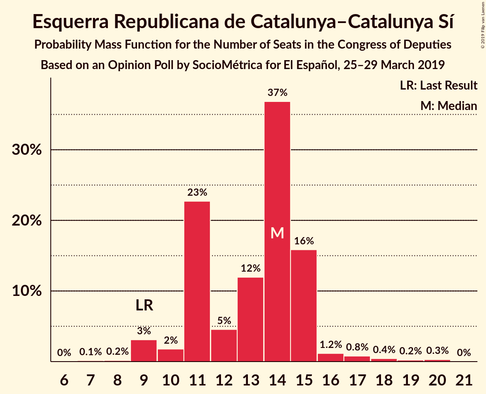
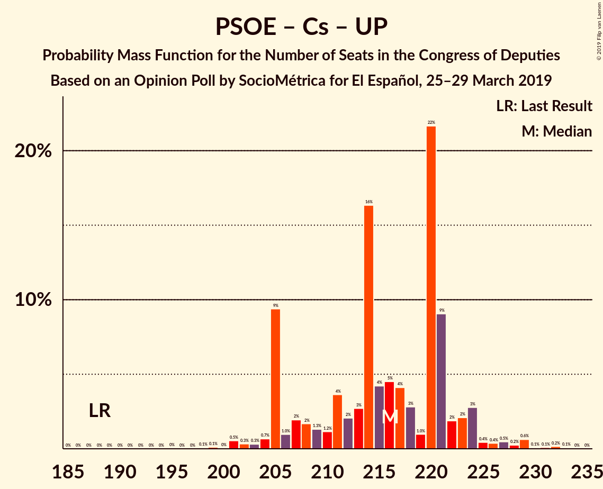
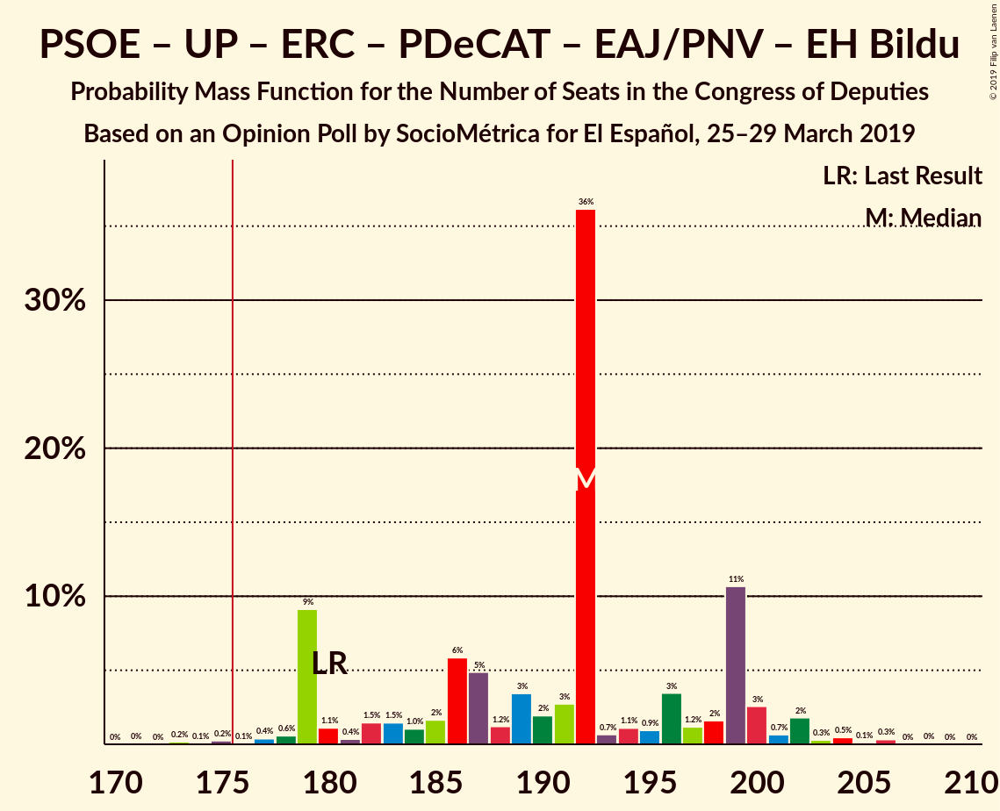

# Opinion Poll by SocioMétrica for El Español, 25–29 March 2019

<a href="#voting-intentions">Voting Intentions</a> | <a href="#seats">Seats</a> | <a href="#coalitions">Coalitions</a> | <a href="#technical-information">Technical Information</a>

## Voting Intentions

### Confidence Intervals

| Party | Last Result | Poll Result | 80% Confidence Interval | 90% Confidence Interval | 95% Confidence Interval | 99% Confidence Interval |
|:-----:|:-----------:|:-----------:|:-----------------------:|:-----------------------:|:-----------------------:|:-----------------------:|
| Partido Socialista Obrero Español | 22.6% | 29.0% | 27.6–30.5% |27.2–30.9% |26.8–31.3% |26.2–32.0% |
| Partido Popular | 33.0% | 18.8% | 17.6–20.1% |17.3–20.5% |17.0–20.8% |16.4–21.4% |
| Ciudadanos–Partido de la Ciudadanía | 13.1% | 16.1% | 15.0–17.4% |14.7–17.7% |14.4–18.0% |13.9–18.6% |
| Unidos Podemos | 21.2% | 13.1% | 12.1–14.3% |11.8–14.6% |11.6–14.9% |11.1–15.4% |
| Vox | 0.2% | 11.9% | 10.9–13.0% |10.6–13.3% |10.4–13.6% |9.9–14.1% |
| Esquerra Republicana de Catalunya–Catalunya Sí | 2.7% | 3.0% | 2.5–3.6% |2.4–3.8% |2.3–4.0% |2.1–4.3% |
| Partit Demòcrata Europeu Català | 2.0% | 1.3% | 1.0–1.8% |0.9–1.9% |0.9–2.0% |0.7–2.2% |
| Euzko Alderdi Jeltzalea/Partido Nacionalista Vasco | 1.2% | 1.2% | 0.9–1.6% |0.8–1.7% |0.8–1.9% |0.6–2.1% |
| Partido Animalista Contra el Maltrato Animal | 1.2% | 1.2% | 0.9–1.6% |0.8–1.7% |0.8–1.9% |0.6–2.1% |
| Euskal Herria Bildu | 0.8% | 0.9% | 0.6–1.3% |0.6–1.4% |0.5–1.5% |0.4–1.7% |
| Coalición Canaria–Partido Nacionalista Canario | 0.3% | 0.3% | 0.2–0.6% |0.2–0.7% |0.1–0.7% |0.1–0.9% |

*Note:* The poll result column reflects the actual value used in the calculations. Published results may vary slightly, and in addition be rounded to fewer digits.

## Seats

### Confidence Intervals

| Party | Last Result | Median | 80% Confidence Interval | 90% Confidence Interval | 95% Confidence Interval | 99% Confidence Interval |
|:-----:|:-----------:|:------:|:-----------------------:|:-----------------------:|:-----------------------:|:-----------------------:|
| <a href="#partido-socialista-obrero-español">Partido Socialista Obrero Español</a> | 85 | 127 | 125–136 |122–136 |122–136 |116–138 |
| <a href="#partido-popular">Partido Popular</a> | 137 | 73 | 66–73 |66–80 |63–83 |62–83 |
| <a href="#ciudadanos–partido-de-la-ciudadanía">Ciudadanos–Partido de la Ciudadanía</a> | 32 | 55 | 51–55 |49–55 |46–61 |44–63 |
| <a href="#unidos-podemos">Unidos Podemos</a> | 71 | 38 | 32–38 |31–38 |27–38 |26–41 |
| <a href="#vox">Vox</a> | 0 | 30 | 30–33 |29–35 |27–43 |24–43 |
| <a href="#esquerra-republicana-de-catalunya–catalunya-sí">Esquerra Republicana de Catalunya–Catalunya Sí</a> | 9 | 11 | 11–14 |11–14 |9–15 |9–17 |
| <a href="#partit-demòcrata-europeu-català">Partit Demòcrata Europeu Català</a> | 8 | 8 | 5–8 |5–8 |4–8 |3–9 |
| <a href="#euzko-alderdi-jeltzalea/partido-nacionalista-vasco">Euzko Alderdi Jeltzalea/Partido Nacionalista Vasco</a> | 5 | 6 | 4–6 |4–7 |3–7 |3–8 |
| <a href="#partido-animalista-contra-el-maltrato-animal">Partido Animalista Contra el Maltrato Animal</a> | 0 | 0 | 0 |0 |0–1 |0–1 |
| <a href="#euskal-herria-bildu">Euskal Herria Bildu</a> | 2 | 2 | 2–6 |2–6 |2–7 |1–7 |
| <a href="#coalición-canaria–partido-nacionalista-canario">Coalición Canaria–Partido Nacionalista Canario</a> | 1 | 0 | 0–1 |0–1 |0–2 |0–2 |

### Partido Socialista Obrero Español

*For a full overview of the results for this party, see the [Partido Socialista Obrero Español](party-partidosocialistaobreroespañol.html) page.*

| Number of Seats | Probability | Accumulated | Special Marks |
|:---------------:|:-----------:|:-----------:|:-------------:|
| 85 | 0% | 100% | Last Result |
| 86 | 0% | 100% |  |
| 87 | 0% | 100% |  |
| 88 | 0% | 100% |  |
| 89 | 0% | 100% |  |
| 90 | 0% | 100% |  |
| 91 | 0% | 100% |  |
| 92 | 0% | 100% |  |
| 93 | 0% | 100% |  |
| 94 | 0% | 100% |  |
| 95 | 0% | 100% |  |
| 96 | 0% | 100% |  |
| 97 | 0% | 100% |  |
| 98 | 0% | 100% |  |
| 99 | 0% | 100% |  |
| 100 | 0% | 100% |  |
| 101 | 0% | 100% |  |
| 102 | 0% | 100% |  |
| 103 | 0% | 100% |  |
| 104 | 0% | 100% |  |
| 105 | 0% | 100% |  |
| 106 | 0% | 100% |  |
| 107 | 0% | 100% |  |
| 108 | 0% | 100% |  |
| 109 | 0% | 100% |  |
| 110 | 0.1% | 100% |  |
| 111 | 0% | 99.9% |  |
| 112 | 0% | 99.9% |  |
| 113 | 0.1% | 99.9% |  |
| 114 | 0% | 99.8% |  |
| 115 | 0.3% | 99.8% |  |
| 116 | 0.6% | 99.5% |  |
| 117 | 0% | 98.9% |  |
| 118 | 0.2% | 98.9% |  |
| 119 | 0% | 98.7% |  |
| 120 | 0% | 98.7% |  |
| 121 | 0.1% | 98.7% |  |
| 122 | 4% | 98.6% |  |
| 123 | 3% | 94% |  |
| 124 | 1.3% | 92% |  |
| 125 | 0.5% | 90% |  |
| 126 | 0.3% | 90% |  |
| 127 | 73% | 90% | Median |
| 128 | 2% | 17% |  |
| 129 | 0.1% | 14% |  |
| 130 | 0.6% | 14% |  |
| 131 | 3% | 14% |  |
| 132 | 0.2% | 11% |  |
| 133 | 0.2% | 11% |  |
| 134 | 0.3% | 11% |  |
| 135 | 0.1% | 11% |  |
| 136 | 8% | 10% |  |
| 137 | 2% | 2% |  |
| 138 | 0.4% | 0.5% |  |
| 139 | 0.1% | 0.2% |  |
| 140 | 0% | 0.1% |  |
| 141 | 0.1% | 0.1% |  |
| 142 | 0% | 0% |  |

### Partido Popular

*For a full overview of the results for this party, see the [Partido Popular](party-partidopopular.html) page.*

| Number of Seats | Probability | Accumulated | Special Marks |
|:---------------:|:-----------:|:-----------:|:-------------:|
| 59 | 0.1% | 100% |  |
| 60 | 0% | 99.9% |  |
| 61 | 0.1% | 99.9% |  |
| 62 | 0.4% | 99.8% |  |
| 63 | 2% | 99.4% |  |
| 64 | 0% | 97% |  |
| 65 | 2% | 97% |  |
| 66 | 6% | 96% |  |
| 67 | 3% | 90% |  |
| 68 | 0.8% | 87% |  |
| 69 | 0.4% | 86% |  |
| 70 | 0.3% | 86% |  |
| 71 | 1.5% | 85% |  |
| 72 | 0.1% | 84% |  |
| 73 | 74% | 84% | Median |
| 74 | 0.2% | 10% |  |
| 75 | 0.2% | 10% |  |
| 76 | 2% | 10% |  |
| 77 | 0.6% | 7% |  |
| 78 | 0.8% | 7% |  |
| 79 | 0.1% | 6% |  |
| 80 | 3% | 6% |  |
| 81 | 0.3% | 3% |  |
| 82 | 0.1% | 3% |  |
| 83 | 3% | 3% |  |
| 84 | 0% | 0.1% |  |
| 85 | 0% | 0.1% |  |
| 86 | 0% | 0.1% |  |
| 87 | 0.1% | 0.1% |  |
| 88 | 0% | 0% |  |
| 89 | 0% | 0% |  |
| 90 | 0% | 0% |  |
| 91 | 0% | 0% |  |
| 92 | 0% | 0% |  |
| 93 | 0% | 0% |  |
| 94 | 0% | 0% |  |
| 95 | 0% | 0% |  |
| 96 | 0% | 0% |  |
| 97 | 0% | 0% |  |
| 98 | 0% | 0% |  |
| 99 | 0% | 0% |  |
| 100 | 0% | 0% |  |
| 101 | 0% | 0% |  |
| 102 | 0% | 0% |  |
| 103 | 0% | 0% |  |
| 104 | 0% | 0% |  |
| 105 | 0% | 0% |  |
| 106 | 0% | 0% |  |
| 107 | 0% | 0% |  |
| 108 | 0% | 0% |  |
| 109 | 0% | 0% |  |
| 110 | 0% | 0% |  |
| 111 | 0% | 0% |  |
| 112 | 0% | 0% |  |
| 113 | 0% | 0% |  |
| 114 | 0% | 0% |  |
| 115 | 0% | 0% |  |
| 116 | 0% | 0% |  |
| 117 | 0% | 0% |  |
| 118 | 0% | 0% |  |
| 119 | 0% | 0% |  |
| 120 | 0% | 0% |  |
| 121 | 0% | 0% |  |
| 122 | 0% | 0% |  |
| 123 | 0% | 0% |  |
| 124 | 0% | 0% |  |
| 125 | 0% | 0% |  |
| 126 | 0% | 0% |  |
| 127 | 0% | 0% |  |
| 128 | 0% | 0% |  |
| 129 | 0% | 0% |  |
| 130 | 0% | 0% |  |
| 131 | 0% | 0% |  |
| 132 | 0% | 0% |  |
| 133 | 0% | 0% |  |
| 134 | 0% | 0% |  |
| 135 | 0% | 0% |  |
| 136 | 0% | 0% |  |
| 137 | 0% | 0% | Last Result |

### Ciudadanos–Partido de la Ciudadanía

*For a full overview of the results for this party, see the [Ciudadanos–Partido de la Ciudadanía](party-ciudadanos–partidodelaciudadanía.html) page.*

| Number of Seats | Probability | Accumulated | Special Marks |
|:---------------:|:-----------:|:-----------:|:-------------:|
| 32 | 0% | 100% | Last Result |
| 33 | 0% | 100% |  |
| 34 | 0% | 100% |  |
| 35 | 0% | 100% |  |
| 36 | 0% | 100% |  |
| 37 | 0% | 100% |  |
| 38 | 0% | 100% |  |
| 39 | 0% | 100% |  |
| 40 | 0% | 100% |  |
| 41 | 0% | 100% |  |
| 42 | 0% | 100% |  |
| 43 | 0.3% | 100% |  |
| 44 | 0.2% | 99.7% |  |
| 45 | 2% | 99.5% |  |
| 46 | 0.4% | 98% |  |
| 47 | 0.1% | 97% |  |
| 48 | 0% | 97% |  |
| 49 | 3% | 97% |  |
| 50 | 3% | 94% |  |
| 51 | 8% | 91% |  |
| 52 | 2% | 83% |  |
| 53 | 0.1% | 81% |  |
| 54 | 0.1% | 81% |  |
| 55 | 76% | 81% | Median |
| 56 | 0.4% | 5% |  |
| 57 | 0.2% | 4% |  |
| 58 | 0% | 4% |  |
| 59 | 0.3% | 4% |  |
| 60 | 0.1% | 4% |  |
| 61 | 2% | 4% |  |
| 62 | 0.6% | 2% |  |
| 63 | 1.0% | 1.3% |  |
| 64 | 0% | 0.3% |  |
| 65 | 0% | 0.3% |  |
| 66 | 0.2% | 0.3% |  |
| 67 | 0% | 0% |  |

### Unidos Podemos

*For a full overview of the results for this party, see the [Unidos Podemos](party-unidospodemos.html) page.*

| Number of Seats | Probability | Accumulated | Special Marks |
|:---------------:|:-----------:|:-----------:|:-------------:|
| 25 | 0% | 100% |  |
| 26 | 1.2% | 99.9% |  |
| 27 | 1.4% | 98.7% |  |
| 28 | 0.8% | 97% |  |
| 29 | 0.1% | 96% |  |
| 30 | 0.1% | 96% |  |
| 31 | 5% | 96% |  |
| 32 | 2% | 91% |  |
| 33 | 2% | 89% |  |
| 34 | 2% | 87% |  |
| 35 | 1.3% | 85% |  |
| 36 | 3% | 84% |  |
| 37 | 4% | 80% |  |
| 38 | 75% | 76% | Median |
| 39 | 0.4% | 1.2% |  |
| 40 | 0.1% | 0.8% |  |
| 41 | 0.5% | 0.7% |  |
| 42 | 0% | 0.1% |  |
| 43 | 0.1% | 0.1% |  |
| 44 | 0% | 0.1% |  |
| 45 | 0% | 0% |  |
| 46 | 0% | 0% |  |
| 47 | 0% | 0% |  |
| 48 | 0% | 0% |  |
| 49 | 0% | 0% |  |
| 50 | 0% | 0% |  |
| 51 | 0% | 0% |  |
| 52 | 0% | 0% |  |
| 53 | 0% | 0% |  |
| 54 | 0% | 0% |  |
| 55 | 0% | 0% |  |
| 56 | 0% | 0% |  |
| 57 | 0% | 0% |  |
| 58 | 0% | 0% |  |
| 59 | 0% | 0% |  |
| 60 | 0% | 0% |  |
| 61 | 0% | 0% |  |
| 62 | 0% | 0% |  |
| 63 | 0% | 0% |  |
| 64 | 0% | 0% |  |
| 65 | 0% | 0% |  |
| 66 | 0% | 0% |  |
| 67 | 0% | 0% |  |
| 68 | 0% | 0% |  |
| 69 | 0% | 0% |  |
| 70 | 0% | 0% |  |
| 71 | 0% | 0% | Last Result |

### Vox

*For a full overview of the results for this party, see the [Vox](party-vox.html) page.*

| Number of Seats | Probability | Accumulated | Special Marks |
|:---------------:|:-----------:|:-----------:|:-------------:|
| 0 | 0% | 100% | Last Result |
| 1 | 0% | 100% |  |
| 2 | 0% | 100% |  |
| 3 | 0% | 100% |  |
| 4 | 0% | 100% |  |
| 5 | 0% | 100% |  |
| 6 | 0% | 100% |  |
| 7 | 0% | 100% |  |
| 8 | 0% | 100% |  |
| 9 | 0% | 100% |  |
| 10 | 0% | 100% |  |
| 11 | 0% | 100% |  |
| 12 | 0% | 100% |  |
| 13 | 0% | 100% |  |
| 14 | 0% | 100% |  |
| 15 | 0% | 100% |  |
| 16 | 0% | 100% |  |
| 17 | 0% | 100% |  |
| 18 | 0% | 100% |  |
| 19 | 0% | 100% |  |
| 20 | 0% | 100% |  |
| 21 | 0.2% | 100% |  |
| 22 | 0.1% | 99.8% |  |
| 23 | 0.1% | 99.7% |  |
| 24 | 0.5% | 99.6% |  |
| 25 | 0% | 99.1% |  |
| 26 | 0.5% | 99.1% |  |
| 27 | 1.3% | 98.6% |  |
| 28 | 0.8% | 97% |  |
| 29 | 2% | 96% |  |
| 30 | 75% | 95% | Median |
| 31 | 2% | 20% |  |
| 32 | 1.0% | 18% |  |
| 33 | 10% | 17% |  |
| 34 | 0.3% | 7% |  |
| 35 | 2% | 7% |  |
| 36 | 0% | 5% |  |
| 37 | 0.6% | 5% |  |
| 38 | 0.6% | 4% |  |
| 39 | 0% | 3% |  |
| 40 | 0% | 3% |  |
| 41 | 0% | 3% |  |
| 42 | 0.4% | 3% |  |
| 43 | 3% | 3% |  |
| 44 | 0% | 0.1% |  |
| 45 | 0% | 0% |  |

### Esquerra Republicana de Catalunya–Catalunya Sí

*For a full overview of the results for this party, see the [Esquerra Republicana de Catalunya–Catalunya Sí](party-esquerrarepublicanadecatalunya–catalunyasí.html) page.*

| Number of Seats | Probability | Accumulated | Special Marks |
|:---------------:|:-----------:|:-----------:|:-------------:|
| 8 | 0.1% | 100% |  |
| 9 | 3% | 99.9% | Last Result |
| 10 | 2% | 97% |  |
| 11 | 73% | 95% | Median |
| 12 | 7% | 22% |  |
| 13 | 3% | 15% |  |
| 14 | 10% | 13% |  |
| 15 | 2% | 3% |  |
| 16 | 0.2% | 0.8% |  |
| 17 | 0.2% | 0.5% |  |
| 18 | 0% | 0.3% |  |
| 19 | 0.2% | 0.3% |  |
| 20 | 0.1% | 0.1% |  |
| 21 | 0% | 0% |  |

### Partit Demòcrata Europeu Català

*For a full overview of the results for this party, see the [Partit Demòcrata Europeu Català](party-partitdemòcrataeuropeucatalà.html) page.*

| Number of Seats | Probability | Accumulated | Special Marks |
|:---------------:|:-----------:|:-----------:|:-------------:|
| 1 | 0.3% | 100% |  |
| 2 | 0.1% | 99.7% |  |
| 3 | 0.2% | 99.6% |  |
| 4 | 2% | 99.4% |  |
| 5 | 8% | 97% |  |
| 6 | 1.2% | 89% |  |
| 7 | 0.1% | 88% |  |
| 8 | 87% | 88% | Last Result, Median |
| 9 | 0.8% | 0.9% |  |
| 10 | 0.2% | 0.2% |  |
| 11 | 0% | 0% |  |

### Euzko Alderdi Jeltzalea/Partido Nacionalista Vasco

*For a full overview of the results for this party, see the [Euzko Alderdi Jeltzalea/Partido Nacionalista Vasco](party-euzkoalderdijeltzaleapartidonacionalistavasco.html) page.*

| Number of Seats | Probability | Accumulated | Special Marks |
|:---------------:|:-----------:|:-----------:|:-------------:|
| 3 | 4% | 100% |  |
| 4 | 6% | 96% |  |
| 5 | 0.7% | 90% | Last Result |
| 6 | 82% | 89% | Median |
| 7 | 5% | 7% |  |
| 8 | 2% | 2% |  |
| 9 | 0.2% | 0.5% |  |
| 10 | 0.3% | 0.3% |  |
| 11 | 0% | 0% |  |

### Partido Animalista Contra el Maltrato Animal

*For a full overview of the results for this party, see the [Partido Animalista Contra el Maltrato Animal](party-partidoanimalistacontraelmaltratoanimal.html) page.*

| Number of Seats | Probability | Accumulated | Special Marks |
|:---------------:|:-----------:|:-----------:|:-------------:|
| 0 | 97% | 100% | Last Result, Median |
| 1 | 3% | 3% |  |
| 2 | 0% | 0% |  |

### Euskal Herria Bildu

*For a full overview of the results for this party, see the [Euskal Herria Bildu](party-euskalherriabildu.html) page.*

| Number of Seats | Probability | Accumulated | Special Marks |
|:---------------:|:-----------:|:-----------:|:-------------:|
| 1 | 2% | 100% |  |
| 2 | 75% | 98% | Last Result, Median |
| 3 | 1.3% | 23% |  |
| 4 | 8% | 22% |  |
| 5 | 3% | 14% |  |
| 6 | 6% | 10% |  |
| 7 | 4% | 4% |  |
| 8 | 0% | 0% |  |

### Coalición Canaria–Partido Nacionalista Canario

*For a full overview of the results for this party, see the [Coalición Canaria–Partido Nacionalista Canario](party-coalicióncanaria–partidonacionalistacanario.html) page.*

| Number of Seats | Probability | Accumulated | Special Marks |
|:---------------:|:-----------:|:-----------:|:-------------:|
| 0 | 80% | 100% | Median |
| 1 | 16% | 20% | Last Result |
| 2 | 4% | 4% |  |
| 3 | 0% | 0.2% |  |
| 4 | 0.1% | 0.1% |  |
| 5 | 0% | 0% |  |

## Coalitions

### Confidence Intervals

| Coalition | Last Result | Median | Majority? | 80% Confidence Interval | 90% Confidence Interval | 95% Confidence Interval | 99% Confidence Interval |
|:---------:|:-----------:|:------:|:---------:|:-----------------------:|:-----------------------:|:-----------------------:|:-----------------------:|
| Partido Socialista Obrero Español – Partido Popular – Ciudadanos–Partido de la Ciudadanía | 254 | 255 | 100% | 252–255 | 248–258 | 240–262 | 240–268 |
| Partido Socialista Obrero Español – Ciudadanos–Partido de la Ciudadanía – Unidos Podemos | 188 | 220 | 100% | 212–220 | 209–220 | 208–224 | 203–228 |
| Partido Socialista Obrero Español – Partido Popular | 222 | 200 | 100% | 200–202 | 194–207 | 190–207 | 186–211 |
| Partido Socialista Obrero Español – Unidos Podemos – Esquerra Republicana de Catalunya–Catalunya Sí – Partit Demòcrata Europeu Català – Euzko Alderdi Jeltzalea/Partido Nacionalista Vasco – Euskal Herria Bildu | 180 | 192 | 99.9% | 189–197 | 186–199 | 183–199 | 178–203 |
| Partido Socialista Obrero Español – Ciudadanos–Partido de la Ciudadanía | 117 | 182 | 93% | 178–187 | 173–188 | 171–191 | 170–192 |
| Partido Socialista Obrero Español – Unidos Podemos – Esquerra Republicana de Catalunya–Catalunya Sí – Partit Demòcrata Europeu Català | 173 | 184 | 97% | 179–187 | 176–189 | 173–189 | 168–192 |
| Partido Socialista Obrero Español – Unidos Podemos – Esquerra Republicana de Catalunya–Catalunya Sí – Euskal Herria Bildu | 167 | 178 | 89% | 175–185 | 172–187 | 171–189 | 166–192 |
| Partido Socialista Obrero Español – Unidos Podemos – Euzko Alderdi Jeltzalea/Partido Nacionalista Vasco – Euskal Herria Bildu | 163 | 173 | 13% | 171–177 | 169–177 | 163–180 | 158–184 |
| Partido Socialista Obrero Español – Unidos Podemos – Euzko Alderdi Jeltzalea/Partido Nacionalista Vasco | 161 | 171 | 3% | 166–171 | 165–173 | 160–176 | 155–180 |
| Partido Socialista Obrero Español – Unidos Podemos | 156 | 165 | 0.1% | 160–167 | 159–169 | 154–170 | 150–174 |
| Partido Popular – Ciudadanos–Partido de la Ciudadanía – Vox | 169 | 158 | 0% | 152–160 | 150–163 | 149–167 | 146–171 |
| Partido Popular – Ciudadanos–Partido de la Ciudadanía – Euzko Alderdi Jeltzalea/Partido Nacionalista Vasco | 174 | 134 | 0% | 123–134 | 121–137 | 121–143 | 120–148 |
| Partido Popular – Ciudadanos–Partido de la Ciudadanía – Coalición Canaria–Partido Nacionalista Canario | 170 | 128 | 0% | 118–128 | 118–132 | 118–138 | 116–145 |
| Partido Socialista Obrero Español | 85 | 127 | 0% | 125–136 | 122–136 | 122–136 | 116–138 |
| Partido Popular – Ciudadanos–Partido de la Ciudadanía | 169 | 128 | 0% | 117–128 | 117–130 | 117–136 | 115–144 |
| Partido Popular – Vox | 137 | 103 | 0% | 100–108 | 99–110 | 94–113 | 93–113 |
| Partido Popular | 137 | 73 | 0% | 66–73 | 66–80 | 63–83 | 62–83 |

### Partido Socialista Obrero Español – Partido Popular – Ciudadanos–Partido de la Ciudadanía

| Number of Seats | Probability | Accumulated | Special Marks |
|:---------------:|:-----------:|:-----------:|:-------------:|
| 239 | 0.4% | 100% |  |
| 240 | 3% | 99.6% |  |
| 241 | 0% | 97% |  |
| 242 | 0% | 97% |  |
| 243 | 0.2% | 97% |  |
| 244 | 0.3% | 97% |  |
| 245 | 0.5% | 96% |  |
| 246 | 0.5% | 96% |  |
| 247 | 0% | 95% |  |
| 248 | 0.6% | 95% |  |
| 249 | 0% | 95% |  |
| 250 | 0.1% | 95% |  |
| 251 | 3% | 94% |  |
| 252 | 2% | 92% |  |
| 253 | 7% | 89% |  |
| 254 | 0.1% | 83% | Last Result |
| 255 | 75% | 82% | Median |
| 256 | 0.9% | 8% |  |
| 257 | 0.8% | 7% |  |
| 258 | 1.1% | 6% |  |
| 259 | 0% | 5% |  |
| 260 | 0.3% | 5% |  |
| 261 | 0.1% | 4% |  |
| 262 | 3% | 4% |  |
| 263 | 0% | 1.4% |  |
| 264 | 0.2% | 1.4% |  |
| 265 | 0% | 1.2% |  |
| 266 | 0% | 1.2% |  |
| 267 | 0% | 1.2% |  |
| 268 | 0.9% | 1.1% |  |
| 269 | 0.2% | 0.2% |  |
| 270 | 0% | 0% |  |

### Partido Socialista Obrero Español – Ciudadanos–Partido de la Ciudadanía – Unidos Podemos

| Number of Seats | Probability | Accumulated | Special Marks |
|:---------------:|:-----------:|:-----------:|:-------------:|
| 188 | 0% | 100% | Last Result |
| 189 | 0% | 100% |  |
| 190 | 0% | 100% |  |
| 191 | 0% | 100% |  |
| 192 | 0% | 100% |  |
| 193 | 0% | 100% |  |
| 194 | 0% | 100% |  |
| 195 | 0% | 100% |  |
| 196 | 0% | 100% |  |
| 197 | 0% | 100% |  |
| 198 | 0% | 100% |  |
| 199 | 0% | 99.9% |  |
| 200 | 0% | 99.9% |  |
| 201 | 0% | 99.9% |  |
| 202 | 0.3% | 99.9% |  |
| 203 | 0.3% | 99.6% |  |
| 204 | 0% | 99.2% |  |
| 205 | 0% | 99.2% |  |
| 206 | 0.5% | 99.2% |  |
| 207 | 0.1% | 98.8% |  |
| 208 | 3% | 98.7% |  |
| 209 | 3% | 96% |  |
| 210 | 0.2% | 93% |  |
| 211 | 0.3% | 93% |  |
| 212 | 3% | 93% |  |
| 213 | 1.3% | 90% |  |
| 214 | 2% | 89% |  |
| 215 | 0.3% | 87% |  |
| 216 | 0.2% | 86% |  |
| 217 | 2% | 86% |  |
| 218 | 6% | 85% |  |
| 219 | 0.8% | 79% |  |
| 220 | 73% | 78% | Median |
| 221 | 0.1% | 5% |  |
| 222 | 2% | 5% |  |
| 223 | 0.2% | 3% |  |
| 224 | 2% | 3% |  |
| 225 | 0% | 1.4% |  |
| 226 | 0.1% | 1.3% |  |
| 227 | 0.3% | 1.3% |  |
| 228 | 0.5% | 1.0% |  |
| 229 | 0.1% | 0.5% |  |
| 230 | 0% | 0.4% |  |
| 231 | 0.2% | 0.3% |  |
| 232 | 0.1% | 0.1% |  |
| 233 | 0% | 0% |  |

### Partido Socialista Obrero Español – Partido Popular

| Number of Seats | Probability | Accumulated | Special Marks |
|:---------------:|:-----------:|:-----------:|:-------------:|
| 182 | 0% | 100% |  |
| 183 | 0% | 99.9% |  |
| 184 | 0.2% | 99.9% |  |
| 185 | 0% | 99.7% |  |
| 186 | 0.2% | 99.7% |  |
| 187 | 0.1% | 99.5% |  |
| 188 | 0% | 99.4% |  |
| 189 | 0.1% | 99.4% |  |
| 190 | 3% | 99.2% |  |
| 191 | 0.1% | 96% |  |
| 192 | 0.2% | 96% |  |
| 193 | 0.1% | 96% |  |
| 194 | 1.1% | 96% |  |
| 195 | 0.8% | 95% |  |
| 196 | 0.6% | 94% |  |
| 197 | 0.1% | 93% |  |
| 198 | 0.4% | 93% |  |
| 199 | 0.3% | 93% |  |
| 200 | 75% | 93% | Median |
| 201 | 2% | 18% |  |
| 202 | 8% | 16% |  |
| 203 | 0.3% | 8% |  |
| 204 | 0.7% | 8% |  |
| 205 | 0.6% | 7% |  |
| 206 | 0.1% | 6% |  |
| 207 | 4% | 6% |  |
| 208 | 0% | 2% |  |
| 209 | 0.3% | 2% |  |
| 210 | 0.1% | 2% |  |
| 211 | 2% | 2% |  |
| 212 | 0% | 0.1% |  |
| 213 | 0% | 0% |  |
| 214 | 0% | 0% |  |
| 215 | 0% | 0% |  |
| 216 | 0% | 0% |  |
| 217 | 0% | 0% |  |
| 218 | 0% | 0% |  |
| 219 | 0% | 0% |  |
| 220 | 0% | 0% |  |
| 221 | 0% | 0% |  |
| 222 | 0% | 0% | Last Result |

### Partido Socialista Obrero Español – Unidos Podemos – Esquerra Republicana de Catalunya–Catalunya Sí – Partit Demòcrata Europeu Català – Euzko Alderdi Jeltzalea/Partido Nacionalista Vasco – Euskal Herria Bildu

| Number of Seats | Probability | Accumulated | Special Marks |
|:---------------:|:-----------:|:-----------:|:-------------:|
| 175 | 0% | 100% |  |
| 176 | 0% | 99.9% | Majority |
| 177 | 0% | 99.9% |  |
| 178 | 1.0% | 99.9% |  |
| 179 | 0% | 98.9% |  |
| 180 | 0.9% | 98.8% | Last Result |
| 181 | 0.3% | 98% |  |
| 182 | 0.1% | 98% |  |
| 183 | 0.2% | 98% |  |
| 184 | 0.1% | 97% |  |
| 185 | 0.5% | 97% |  |
| 186 | 2% | 97% |  |
| 187 | 3% | 95% |  |
| 188 | 0.1% | 92% |  |
| 189 | 3% | 92% |  |
| 190 | 1.2% | 89% |  |
| 191 | 1.2% | 88% |  |
| 192 | 74% | 87% | Median |
| 193 | 0.4% | 13% |  |
| 194 | 0.3% | 13% |  |
| 195 | 1.1% | 13% |  |
| 196 | 0.3% | 12% |  |
| 197 | 2% | 11% |  |
| 198 | 2% | 9% |  |
| 199 | 5% | 8% |  |
| 200 | 2% | 2% |  |
| 201 | 0.1% | 0.7% |  |
| 202 | 0.1% | 0.6% |  |
| 203 | 0.1% | 0.5% |  |
| 204 | 0.3% | 0.4% |  |
| 205 | 0.1% | 0.1% |  |
| 206 | 0% | 0.1% |  |
| 207 | 0% | 0% |  |

### Partido Socialista Obrero Español – Ciudadanos–Partido de la Ciudadanía

| Number of Seats | Probability | Accumulated | Special Marks |
|:---------------:|:-----------:|:-----------:|:-------------:|
| 117 | 0% | 100% | Last Result |
| 118 | 0% | 100% |  |
| 119 | 0% | 100% |  |
| 120 | 0% | 100% |  |
| 121 | 0% | 100% |  |
| 122 | 0% | 100% |  |
| 123 | 0% | 100% |  |
| 124 | 0% | 100% |  |
| 125 | 0% | 100% |  |
| 126 | 0% | 100% |  |
| 127 | 0% | 100% |  |
| 128 | 0% | 100% |  |
| 129 | 0% | 100% |  |
| 130 | 0% | 100% |  |
| 131 | 0% | 100% |  |
| 132 | 0% | 100% |  |
| 133 | 0% | 100% |  |
| 134 | 0% | 100% |  |
| 135 | 0% | 100% |  |
| 136 | 0% | 100% |  |
| 137 | 0% | 100% |  |
| 138 | 0% | 100% |  |
| 139 | 0% | 100% |  |
| 140 | 0% | 100% |  |
| 141 | 0% | 100% |  |
| 142 | 0% | 100% |  |
| 143 | 0% | 100% |  |
| 144 | 0% | 100% |  |
| 145 | 0% | 100% |  |
| 146 | 0% | 100% |  |
| 147 | 0% | 100% |  |
| 148 | 0% | 100% |  |
| 149 | 0% | 100% |  |
| 150 | 0% | 100% |  |
| 151 | 0% | 100% |  |
| 152 | 0% | 100% |  |
| 153 | 0% | 100% |  |
| 154 | 0% | 100% |  |
| 155 | 0% | 100% |  |
| 156 | 0% | 100% |  |
| 157 | 0% | 100% |  |
| 158 | 0% | 100% |  |
| 159 | 0% | 100% |  |
| 160 | 0% | 100% |  |
| 161 | 0% | 100% |  |
| 162 | 0% | 100% |  |
| 163 | 0% | 100% |  |
| 164 | 0% | 100% |  |
| 165 | 0.1% | 100% |  |
| 166 | 0% | 99.9% |  |
| 167 | 0.1% | 99.9% |  |
| 168 | 0.3% | 99.8% |  |
| 169 | 0.1% | 99.6% |  |
| 170 | 0% | 99.5% |  |
| 171 | 3% | 99.5% |  |
| 172 | 0.1% | 97% |  |
| 173 | 3% | 97% |  |
| 174 | 0.2% | 94% |  |
| 175 | 0.3% | 94% |  |
| 176 | 2% | 93% | Majority |
| 177 | 0.4% | 91% |  |
| 178 | 0.7% | 91% |  |
| 179 | 2% | 90% |  |
| 180 | 0.3% | 88% |  |
| 181 | 0.2% | 87% |  |
| 182 | 73% | 87% | Median |
| 183 | 0.6% | 14% |  |
| 184 | 0.1% | 13% |  |
| 185 | 2% | 13% |  |
| 186 | 0% | 12% |  |
| 187 | 6% | 12% |  |
| 188 | 2% | 6% |  |
| 189 | 0.1% | 4% |  |
| 190 | 0.3% | 4% |  |
| 191 | 2% | 4% |  |
| 192 | 2% | 2% |  |
| 193 | 0.1% | 0.4% |  |
| 194 | 0% | 0.3% |  |
| 195 | 0.3% | 0.3% |  |
| 196 | 0% | 0.1% |  |
| 197 | 0% | 0% |  |

### Partido Socialista Obrero Español – Unidos Podemos – Esquerra Republicana de Catalunya–Catalunya Sí – Partit Demòcrata Europeu Català

| Number of Seats | Probability | Accumulated | Special Marks |
|:---------------:|:-----------:|:-----------:|:-------------:|
| 163 | 0% | 100% |  |
| 164 | 0% | 99.9% |  |
| 165 | 0% | 99.9% |  |
| 166 | 0.1% | 99.9% |  |
| 167 | 0% | 99.8% |  |
| 168 | 0.8% | 99.8% |  |
| 169 | 0.1% | 99.0% |  |
| 170 | 0% | 98.9% |  |
| 171 | 1.2% | 98.8% |  |
| 172 | 0.1% | 98% |  |
| 173 | 0.1% | 98% | Last Result |
| 174 | 0.1% | 97% |  |
| 175 | 0.3% | 97% |  |
| 176 | 4% | 97% | Majority |
| 177 | 0.5% | 93% |  |
| 178 | 0.5% | 92% |  |
| 179 | 3% | 92% |  |
| 180 | 1.0% | 89% |  |
| 181 | 2% | 88% |  |
| 182 | 0.2% | 86% |  |
| 183 | 0.1% | 86% |  |
| 184 | 74% | 86% | Median |
| 185 | 1.1% | 13% |  |
| 186 | 0.1% | 11% |  |
| 187 | 2% | 11% |  |
| 188 | 0.2% | 9% |  |
| 189 | 7% | 9% |  |
| 190 | 2% | 2% |  |
| 191 | 0.1% | 0.6% |  |
| 192 | 0.1% | 0.6% |  |
| 193 | 0.3% | 0.4% |  |
| 194 | 0.1% | 0.1% |  |
| 195 | 0% | 0.1% |  |
| 196 | 0% | 0.1% |  |
| 197 | 0% | 0.1% |  |
| 198 | 0% | 0% |  |

### Partido Socialista Obrero Español – Unidos Podemos – Esquerra Republicana de Catalunya–Catalunya Sí – Euskal Herria Bildu

| Number of Seats | Probability | Accumulated | Special Marks |
|:---------------:|:-----------:|:-----------:|:-------------:|
| 162 | 0% | 100% |  |
| 163 | 0.1% | 99.9% |  |
| 164 | 0.1% | 99.9% |  |
| 165 | 0% | 99.8% |  |
| 166 | 0.9% | 99.8% |  |
| 167 | 0% | 98.9% | Last Result |
| 168 | 0.9% | 98.8% |  |
| 169 | 0.3% | 98% |  |
| 170 | 0.1% | 98% |  |
| 171 | 0.3% | 98% |  |
| 172 | 3% | 97% |  |
| 173 | 0.4% | 95% |  |
| 174 | 0.6% | 94% |  |
| 175 | 5% | 94% |  |
| 176 | 0% | 89% | Majority |
| 177 | 0.4% | 89% |  |
| 178 | 73% | 89% | Median |
| 179 | 0.1% | 15% |  |
| 180 | 0.2% | 15% |  |
| 181 | 1.0% | 15% |  |
| 182 | 0.1% | 14% |  |
| 183 | 3% | 14% |  |
| 184 | 0.7% | 11% |  |
| 185 | 0.6% | 10% |  |
| 186 | 0% | 10% |  |
| 187 | 6% | 10% |  |
| 188 | 0% | 4% |  |
| 189 | 3% | 4% |  |
| 190 | 0.2% | 0.9% |  |
| 191 | 0% | 0.7% |  |
| 192 | 0.3% | 0.7% |  |
| 193 | 0.3% | 0.4% |  |
| 194 | 0% | 0.1% |  |
| 195 | 0% | 0.1% |  |
| 196 | 0% | 0% |  |

### Partido Socialista Obrero Español – Unidos Podemos – Euzko Alderdi Jeltzalea/Partido Nacionalista Vasco – Euskal Herria Bildu

| Number of Seats | Probability | Accumulated | Special Marks |
|:---------------:|:-----------:|:-----------:|:-------------:|
| 157 | 0% | 100% |  |
| 158 | 1.0% | 99.9% |  |
| 159 | 0% | 98.9% |  |
| 160 | 0% | 98.9% |  |
| 161 | 0.2% | 98.9% |  |
| 162 | 1.0% | 98.7% |  |
| 163 | 0.3% | 98% | Last Result |
| 164 | 0.1% | 97% |  |
| 165 | 0.6% | 97% |  |
| 166 | 0.1% | 97% |  |
| 167 | 0.8% | 97% |  |
| 168 | 0% | 96% |  |
| 169 | 3% | 96% |  |
| 170 | 3% | 93% |  |
| 171 | 2% | 90% |  |
| 172 | 1.4% | 88% |  |
| 173 | 73% | 87% | Median |
| 174 | 0.5% | 14% |  |
| 175 | 0.1% | 13% |  |
| 176 | 0.6% | 13% | Majority |
| 177 | 8% | 12% |  |
| 178 | 0.2% | 5% |  |
| 179 | 0.4% | 5% |  |
| 180 | 3% | 4% |  |
| 181 | 0.1% | 0.9% |  |
| 182 | 0% | 0.9% |  |
| 183 | 0.1% | 0.8% |  |
| 184 | 0.2% | 0.7% |  |
| 185 | 0.4% | 0.5% |  |
| 186 | 0.1% | 0.1% |  |
| 187 | 0% | 0.1% |  |
| 188 | 0% | 0.1% |  |
| 189 | 0% | 0% |  |

### Partido Socialista Obrero Español – Unidos Podemos – Euzko Alderdi Jeltzalea/Partido Nacionalista Vasco

| Number of Seats | Probability | Accumulated | Special Marks |
|:---------------:|:-----------:|:-----------:|:-------------:|
| 152 | 0.1% | 100% |  |
| 153 | 0% | 99.9% |  |
| 154 | 0% | 99.8% |  |
| 155 | 0.9% | 99.8% |  |
| 156 | 0.1% | 98.9% |  |
| 157 | 0.1% | 98.8% |  |
| 158 | 0.9% | 98.7% |  |
| 159 | 0% | 98% |  |
| 160 | 0.8% | 98% |  |
| 161 | 0.3% | 97% | Last Result |
| 162 | 0.1% | 97% |  |
| 163 | 0.1% | 97% |  |
| 164 | 0.5% | 97% |  |
| 165 | 5% | 96% |  |
| 166 | 3% | 91% |  |
| 167 | 2% | 89% |  |
| 168 | 0.1% | 86% |  |
| 169 | 0.1% | 86% |  |
| 170 | 0.5% | 86% |  |
| 171 | 78% | 86% | Median |
| 172 | 0.6% | 7% |  |
| 173 | 2% | 7% |  |
| 174 | 0.1% | 5% |  |
| 175 | 2% | 5% |  |
| 176 | 2% | 3% | Majority |
| 177 | 0.3% | 1.2% |  |
| 178 | 0.4% | 0.9% |  |
| 179 | 0% | 0.6% |  |
| 180 | 0.4% | 0.5% |  |
| 181 | 0.1% | 0.2% |  |
| 182 | 0% | 0.1% |  |
| 183 | 0% | 0.1% |  |
| 184 | 0% | 0% |  |

### Partido Socialista Obrero Español – Unidos Podemos

| Number of Seats | Probability | Accumulated | Special Marks |
|:---------------:|:-----------:|:-----------:|:-------------:|
| 146 | 0.1% | 100% |  |
| 147 | 0% | 99.9% |  |
| 148 | 0% | 99.8% |  |
| 149 | 0% | 99.8% |  |
| 150 | 0.9% | 99.8% |  |
| 151 | 1.0% | 98.9% |  |
| 152 | 0.1% | 98% |  |
| 153 | 0.3% | 98% |  |
| 154 | 0.3% | 98% |  |
| 155 | 0.1% | 97% |  |
| 156 | 0% | 97% | Last Result |
| 157 | 1.2% | 97% |  |
| 158 | 0.3% | 96% |  |
| 159 | 5% | 96% |  |
| 160 | 0.5% | 90% |  |
| 161 | 2% | 90% |  |
| 162 | 2% | 88% |  |
| 163 | 0.1% | 86% |  |
| 164 | 0% | 86% |  |
| 165 | 73% | 86% | Median |
| 166 | 0.6% | 13% |  |
| 167 | 6% | 12% |  |
| 168 | 0% | 6% |  |
| 169 | 3% | 6% |  |
| 170 | 2% | 3% |  |
| 171 | 0.3% | 1.2% |  |
| 172 | 0.3% | 0.9% |  |
| 173 | 0.1% | 0.6% |  |
| 174 | 0.4% | 0.5% |  |
| 175 | 0.1% | 0.1% |  |
| 176 | 0% | 0.1% | Majority |
| 177 | 0% | 0.1% |  |
| 178 | 0% | 0% |  |

### Partido Popular – Ciudadanos–Partido de la Ciudadanía – Vox

| Number of Seats | Probability | Accumulated | Special Marks |
|:---------------:|:-----------:|:-----------:|:-------------:|
| 143 | 0% | 100% |  |
| 144 | 0% | 99.9% |  |
| 145 | 0.1% | 99.9% |  |
| 146 | 0.3% | 99.8% |  |
| 147 | 0.1% | 99.5% |  |
| 148 | 2% | 99.4% |  |
| 149 | 0.4% | 98% |  |
| 150 | 5% | 97% |  |
| 151 | 0.1% | 92% |  |
| 152 | 4% | 92% |  |
| 153 | 0.5% | 89% |  |
| 154 | 0.4% | 88% |  |
| 155 | 0.7% | 88% |  |
| 156 | 0.6% | 87% |  |
| 157 | 0.4% | 86% |  |
| 158 | 73% | 86% | Median |
| 159 | 2% | 13% |  |
| 160 | 3% | 11% |  |
| 161 | 0.1% | 8% |  |
| 162 | 3% | 8% |  |
| 163 | 2% | 5% |  |
| 164 | 0.5% | 3% |  |
| 165 | 0% | 3% |  |
| 166 | 0.1% | 3% |  |
| 167 | 0.3% | 3% |  |
| 168 | 1.1% | 2% |  |
| 169 | 0.1% | 1.2% | Last Result |
| 170 | 0% | 1.1% |  |
| 171 | 1.0% | 1.1% |  |
| 172 | 0% | 0.1% |  |
| 173 | 0% | 0.1% |  |
| 174 | 0% | 0% |  |

### Partido Popular – Ciudadanos–Partido de la Ciudadanía – Euzko Alderdi Jeltzalea/Partido Nacionalista Vasco

| Number of Seats | Probability | Accumulated | Special Marks |
|:---------------:|:-----------:|:-----------:|:-------------:|
| 115 | 0.1% | 100% |  |
| 116 | 0% | 99.9% |  |
| 117 | 0.3% | 99.8% |  |
| 118 | 0% | 99.6% |  |
| 119 | 0% | 99.6% |  |
| 120 | 2% | 99.5% |  |
| 121 | 6% | 98% |  |
| 122 | 0% | 92% |  |
| 123 | 3% | 92% |  |
| 124 | 2% | 89% |  |
| 125 | 0.5% | 88% |  |
| 126 | 0.6% | 87% |  |
| 127 | 0.3% | 87% |  |
| 128 | 2% | 86% |  |
| 129 | 1.4% | 85% |  |
| 130 | 0.9% | 83% |  |
| 131 | 0% | 82% |  |
| 132 | 1.0% | 82% |  |
| 133 | 0% | 81% |  |
| 134 | 73% | 81% | Median |
| 135 | 0.1% | 8% |  |
| 136 | 3% | 8% |  |
| 137 | 0.1% | 5% |  |
| 138 | 0% | 5% |  |
| 139 | 0.2% | 5% |  |
| 140 | 2% | 5% |  |
| 141 | 0.2% | 3% |  |
| 142 | 0% | 3% |  |
| 143 | 0.6% | 3% |  |
| 144 | 0.8% | 2% |  |
| 145 | 0% | 1.4% |  |
| 146 | 0.1% | 1.4% |  |
| 147 | 0% | 1.2% |  |
| 148 | 0.9% | 1.2% |  |
| 149 | 0% | 0.3% |  |
| 150 | 0% | 0.3% |  |
| 151 | 0% | 0.3% |  |
| 152 | 0% | 0.2% |  |
| 153 | 0% | 0.2% |  |
| 154 | 0% | 0.2% |  |
| 155 | 0.2% | 0.2% |  |
| 156 | 0% | 0% |  |
| 157 | 0% | 0% |  |
| 158 | 0% | 0% |  |
| 159 | 0% | 0% |  |
| 160 | 0% | 0% |  |
| 161 | 0% | 0% |  |
| 162 | 0% | 0% |  |
| 163 | 0% | 0% |  |
| 164 | 0% | 0% |  |
| 165 | 0% | 0% |  |
| 166 | 0% | 0% |  |
| 167 | 0% | 0% |  |
| 168 | 0% | 0% |  |
| 169 | 0% | 0% |  |
| 170 | 0% | 0% |  |
| 171 | 0% | 0% |  |
| 172 | 0% | 0% |  |
| 173 | 0% | 0% |  |
| 174 | 0% | 0% | Last Result |

### Partido Popular – Ciudadanos–Partido de la Ciudadanía – Coalición Canaria–Partido Nacionalista Canario

| Number of Seats | Probability | Accumulated | Special Marks |
|:---------------:|:-----------:|:-----------:|:-------------:|
| 111 | 0.3% | 100% |  |
| 112 | 0% | 99.7% |  |
| 113 | 0% | 99.7% |  |
| 114 | 0.1% | 99.7% |  |
| 115 | 0% | 99.6% |  |
| 116 | 0.8% | 99.6% |  |
| 117 | 0% | 98.8% |  |
| 118 | 10% | 98.8% |  |
| 119 | 0.1% | 89% |  |
| 120 | 2% | 89% |  |
| 121 | 2% | 87% |  |
| 122 | 0.1% | 85% |  |
| 123 | 0.3% | 85% |  |
| 124 | 0.2% | 84% |  |
| 125 | 0% | 84% |  |
| 126 | 1.4% | 84% |  |
| 127 | 0.9% | 83% |  |
| 128 | 73% | 82% | Median |
| 129 | 0.3% | 9% |  |
| 130 | 3% | 8% |  |
| 131 | 0.3% | 5% |  |
| 132 | 0.2% | 5% |  |
| 133 | 0% | 5% |  |
| 134 | 2% | 5% |  |
| 135 | 0.1% | 3% |  |
| 136 | 0.1% | 3% |  |
| 137 | 0% | 3% |  |
| 138 | 0.8% | 3% |  |
| 139 | 0% | 2% |  |
| 140 | 0.1% | 2% |  |
| 141 | 0.5% | 2% |  |
| 142 | 0% | 1.2% |  |
| 143 | 0% | 1.2% |  |
| 144 | 0% | 1.2% |  |
| 145 | 0.9% | 1.2% |  |
| 146 | 0% | 0.3% |  |
| 147 | 0% | 0.2% |  |
| 148 | 0.2% | 0.2% |  |
| 149 | 0% | 0% |  |
| 150 | 0% | 0% |  |
| 151 | 0% | 0% |  |
| 152 | 0% | 0% |  |
| 153 | 0% | 0% |  |
| 154 | 0% | 0% |  |
| 155 | 0% | 0% |  |
| 156 | 0% | 0% |  |
| 157 | 0% | 0% |  |
| 158 | 0% | 0% |  |
| 159 | 0% | 0% |  |
| 160 | 0% | 0% |  |
| 161 | 0% | 0% |  |
| 162 | 0% | 0% |  |
| 163 | 0% | 0% |  |
| 164 | 0% | 0% |  |
| 165 | 0% | 0% |  |
| 166 | 0% | 0% |  |
| 167 | 0% | 0% |  |
| 168 | 0% | 0% |  |
| 169 | 0% | 0% |  |
| 170 | 0% | 0% | Last Result |

### Partido Socialista Obrero Español

| Number of Seats | Probability | Accumulated | Special Marks |
|:---------------:|:-----------:|:-----------:|:-------------:|
| 85 | 0% | 100% | Last Result |
| 86 | 0% | 100% |  |
| 87 | 0% | 100% |  |
| 88 | 0% | 100% |  |
| 89 | 0% | 100% |  |
| 90 | 0% | 100% |  |
| 91 | 0% | 100% |  |
| 92 | 0% | 100% |  |
| 93 | 0% | 100% |  |
| 94 | 0% | 100% |  |
| 95 | 0% | 100% |  |
| 96 | 0% | 100% |  |
| 97 | 0% | 100% |  |
| 98 | 0% | 100% |  |
| 99 | 0% | 100% |  |
| 100 | 0% | 100% |  |
| 101 | 0% | 100% |  |
| 102 | 0% | 100% |  |
| 103 | 0% | 100% |  |
| 104 | 0% | 100% |  |
| 105 | 0% | 100% |  |
| 106 | 0% | 100% |  |
| 107 | 0% | 100% |  |
| 108 | 0% | 100% |  |
| 109 | 0% | 100% |  |
| 110 | 0.1% | 100% |  |
| 111 | 0% | 99.9% |  |
| 112 | 0% | 99.9% |  |
| 113 | 0.1% | 99.9% |  |
| 114 | 0% | 99.8% |  |
| 115 | 0.3% | 99.8% |  |
| 116 | 0.6% | 99.5% |  |
| 117 | 0% | 98.9% |  |
| 118 | 0.2% | 98.9% |  |
| 119 | 0% | 98.7% |  |
| 120 | 0% | 98.7% |  |
| 121 | 0.1% | 98.7% |  |
| 122 | 4% | 98.6% |  |
| 123 | 3% | 94% |  |
| 124 | 1.3% | 92% |  |
| 125 | 0.5% | 90% |  |
| 126 | 0.3% | 90% |  |
| 127 | 73% | 90% | Median |
| 128 | 2% | 17% |  |
| 129 | 0.1% | 14% |  |
| 130 | 0.6% | 14% |  |
| 131 | 3% | 14% |  |
| 132 | 0.2% | 11% |  |
| 133 | 0.2% | 11% |  |
| 134 | 0.3% | 11% |  |
| 135 | 0.1% | 11% |  |
| 136 | 8% | 10% |  |
| 137 | 2% | 2% |  |
| 138 | 0.4% | 0.5% |  |
| 139 | 0.1% | 0.2% |  |
| 140 | 0% | 0.1% |  |
| 141 | 0.1% | 0.1% |  |
| 142 | 0% | 0% |  |

### Partido Popular – Ciudadanos–Partido de la Ciudadanía

| Number of Seats | Probability | Accumulated | Special Marks |
|:---------------:|:-----------:|:-----------:|:-------------:|
| 111 | 0.3% | 100% |  |
| 112 | 0.1% | 99.7% |  |
| 113 | 0.1% | 99.6% |  |
| 114 | 0% | 99.5% |  |
| 115 | 0.7% | 99.5% |  |
| 116 | 0% | 98.8% |  |
| 117 | 10% | 98.8% |  |
| 118 | 2% | 89% |  |
| 119 | 0.2% | 87% |  |
| 120 | 0.7% | 87% |  |
| 121 | 2% | 86% |  |
| 122 | 0% | 84% |  |
| 123 | 0.3% | 84% |  |
| 124 | 0% | 84% |  |
| 125 | 0% | 84% |  |
| 126 | 1.4% | 84% |  |
| 127 | 0.9% | 83% |  |
| 128 | 73% | 82% | Median |
| 129 | 3% | 8% |  |
| 130 | 0.5% | 5% |  |
| 131 | 0% | 5% |  |
| 132 | 0.1% | 5% |  |
| 133 | 0.2% | 5% |  |
| 134 | 2% | 5% |  |
| 135 | 0.1% | 3% |  |
| 136 | 0.8% | 3% |  |
| 137 | 0% | 2% |  |
| 138 | 0% | 2% |  |
| 139 | 0% | 2% |  |
| 140 | 0.6% | 2% |  |
| 141 | 0% | 1.2% |  |
| 142 | 0% | 1.2% |  |
| 143 | 0% | 1.2% |  |
| 144 | 0.9% | 1.2% |  |
| 145 | 0% | 0.2% |  |
| 146 | 0% | 0.2% |  |
| 147 | 0.2% | 0.2% |  |
| 148 | 0% | 0% |  |
| 149 | 0% | 0% |  |
| 150 | 0% | 0% |  |
| 151 | 0% | 0% |  |
| 152 | 0% | 0% |  |
| 153 | 0% | 0% |  |
| 154 | 0% | 0% |  |
| 155 | 0% | 0% |  |
| 156 | 0% | 0% |  |
| 157 | 0% | 0% |  |
| 158 | 0% | 0% |  |
| 159 | 0% | 0% |  |
| 160 | 0% | 0% |  |
| 161 | 0% | 0% |  |
| 162 | 0% | 0% |  |
| 163 | 0% | 0% |  |
| 164 | 0% | 0% |  |
| 165 | 0% | 0% |  |
| 166 | 0% | 0% |  |
| 167 | 0% | 0% |  |
| 168 | 0% | 0% |  |
| 169 | 0% | 0% | Last Result |

### Partido Popular – Vox

| Number of Seats | Probability | Accumulated | Special Marks |
|:---------------:|:-----------:|:-----------:|:-------------:|
| 89 | 0.1% | 100% |  |
| 90 | 0.3% | 99.9% |  |
| 91 | 0% | 99.6% |  |
| 92 | 0% | 99.6% |  |
| 93 | 2% | 99.6% |  |
| 94 | 0.6% | 98% |  |
| 95 | 0% | 97% |  |
| 96 | 0.5% | 97% |  |
| 97 | 0.1% | 97% |  |
| 98 | 0% | 97% |  |
| 99 | 5% | 97% |  |
| 100 | 2% | 92% |  |
| 101 | 0.6% | 90% |  |
| 102 | 0.8% | 89% |  |
| 103 | 74% | 88% | Median |
| 104 | 1.2% | 15% |  |
| 105 | 1.4% | 14% |  |
| 106 | 0.5% | 12% |  |
| 107 | 2% | 12% |  |
| 108 | 0.4% | 10% |  |
| 109 | 0.4% | 10% |  |
| 110 | 4% | 9% |  |
| 111 | 0% | 5% |  |
| 112 | 2% | 5% |  |
| 113 | 3% | 3% |  |
| 114 | 0.1% | 0.3% |  |
| 115 | 0% | 0.2% |  |
| 116 | 0.1% | 0.2% |  |
| 117 | 0.1% | 0.1% |  |
| 118 | 0% | 0.1% |  |
| 119 | 0% | 0.1% |  |
| 120 | 0% | 0.1% |  |
| 121 | 0% | 0% |  |
| 122 | 0% | 0% |  |
| 123 | 0% | 0% |  |
| 124 | 0% | 0% |  |
| 125 | 0% | 0% |  |
| 126 | 0% | 0% |  |
| 127 | 0% | 0% |  |
| 128 | 0% | 0% |  |
| 129 | 0% | 0% |  |
| 130 | 0% | 0% |  |
| 131 | 0% | 0% |  |
| 132 | 0% | 0% |  |
| 133 | 0% | 0% |  |
| 134 | 0% | 0% |  |
| 135 | 0% | 0% |  |
| 136 | 0% | 0% |  |
| 137 | 0% | 0% | Last Result |

### Partido Popular

| Number of Seats | Probability | Accumulated | Special Marks |
|:---------------:|:-----------:|:-----------:|:-------------:|
| 59 | 0.1% | 100% |  |
| 60 | 0% | 99.9% |  |
| 61 | 0.1% | 99.9% |  |
| 62 | 0.4% | 99.8% |  |
| 63 | 2% | 99.4% |  |
| 64 | 0% | 97% |  |
| 65 | 2% | 97% |  |
| 66 | 6% | 96% |  |
| 67 | 3% | 90% |  |
| 68 | 0.8% | 87% |  |
| 69 | 0.4% | 86% |  |
| 70 | 0.3% | 86% |  |
| 71 | 1.5% | 85% |  |
| 72 | 0.1% | 84% |  |
| 73 | 74% | 84% | Median |
| 74 | 0.2% | 10% |  |
| 75 | 0.2% | 10% |  |
| 76 | 2% | 10% |  |
| 77 | 0.6% | 7% |  |
| 78 | 0.8% | 7% |  |
| 79 | 0.1% | 6% |  |
| 80 | 3% | 6% |  |
| 81 | 0.3% | 3% |  |
| 82 | 0.1% | 3% |  |
| 83 | 3% | 3% |  |
| 84 | 0% | 0.1% |  |
| 85 | 0% | 0.1% |  |
| 86 | 0% | 0.1% |  |
| 87 | 0.1% | 0.1% |  |
| 88 | 0% | 0% |  |
| 89 | 0% | 0% |  |
| 90 | 0% | 0% |  |
| 91 | 0% | 0% |  |
| 92 | 0% | 0% |  |
| 93 | 0% | 0% |  |
| 94 | 0% | 0% |  |
| 95 | 0% | 0% |  |
| 96 | 0% | 0% |  |
| 97 | 0% | 0% |  |
| 98 | 0% | 0% |  |
| 99 | 0% | 0% |  |
| 100 | 0% | 0% |  |
| 101 | 0% | 0% |  |
| 102 | 0% | 0% |  |
| 103 | 0% | 0% |  |
| 104 | 0% | 0% |  |
| 105 | 0% | 0% |  |
| 106 | 0% | 0% |  |
| 107 | 0% | 0% |  |
| 108 | 0% | 0% |  |
| 109 | 0% | 0% |  |
| 110 | 0% | 0% |  |
| 111 | 0% | 0% |  |
| 112 | 0% | 0% |  |
| 113 | 0% | 0% |  |
| 114 | 0% | 0% |  |
| 115 | 0% | 0% |  |
| 116 | 0% | 0% |  |
| 117 | 0% | 0% |  |
| 118 | 0% | 0% |  |
| 119 | 0% | 0% |  |
| 120 | 0% | 0% |  |
| 121 | 0% | 0% |  |
| 122 | 0% | 0% |  |
| 123 | 0% | 0% |  |
| 124 | 0% | 0% |  |
| 125 | 0% | 0% |  |
| 126 | 0% | 0% |  |
| 127 | 0% | 0% |  |
| 128 | 0% | 0% |  |
| 129 | 0% | 0% |  |
| 130 | 0% | 0% |  |
| 131 | 0% | 0% |  |
| 132 | 0% | 0% |  |
| 133 | 0% | 0% |  |
| 134 | 0% | 0% |  |
| 135 | 0% | 0% |  |
| 136 | 0% | 0% |  |
| 137 | 0% | 0% | Last Result |

## Technical Information

### Opinion Poll

+ **Polling firm:** SocioMétrica
+ **Commissioner(s):** El Español
+ **Fieldwork period:** 25–29 March 2019

### Calculations

+ **Sample size:** 1600
+ **Simulations done:** 131,072
+ **Error estimate:** 2.76%

