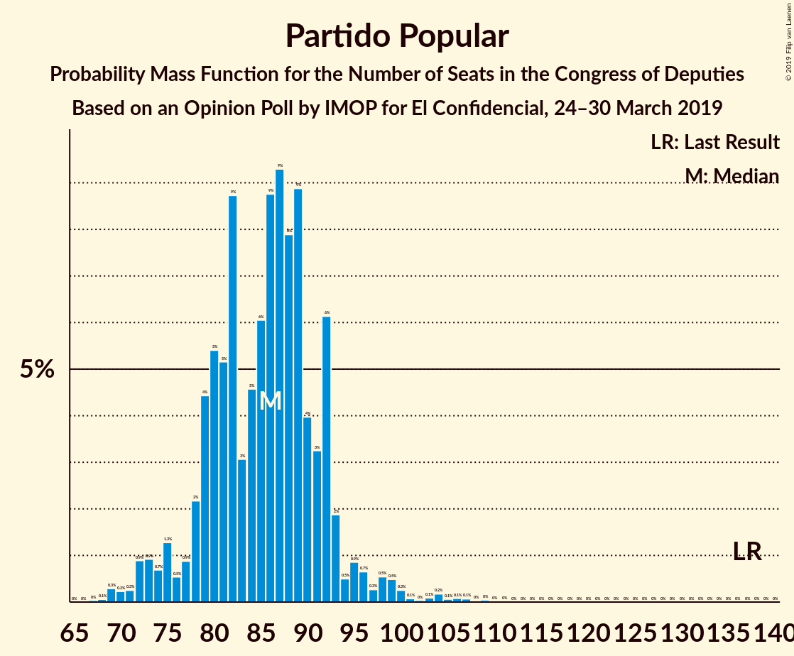
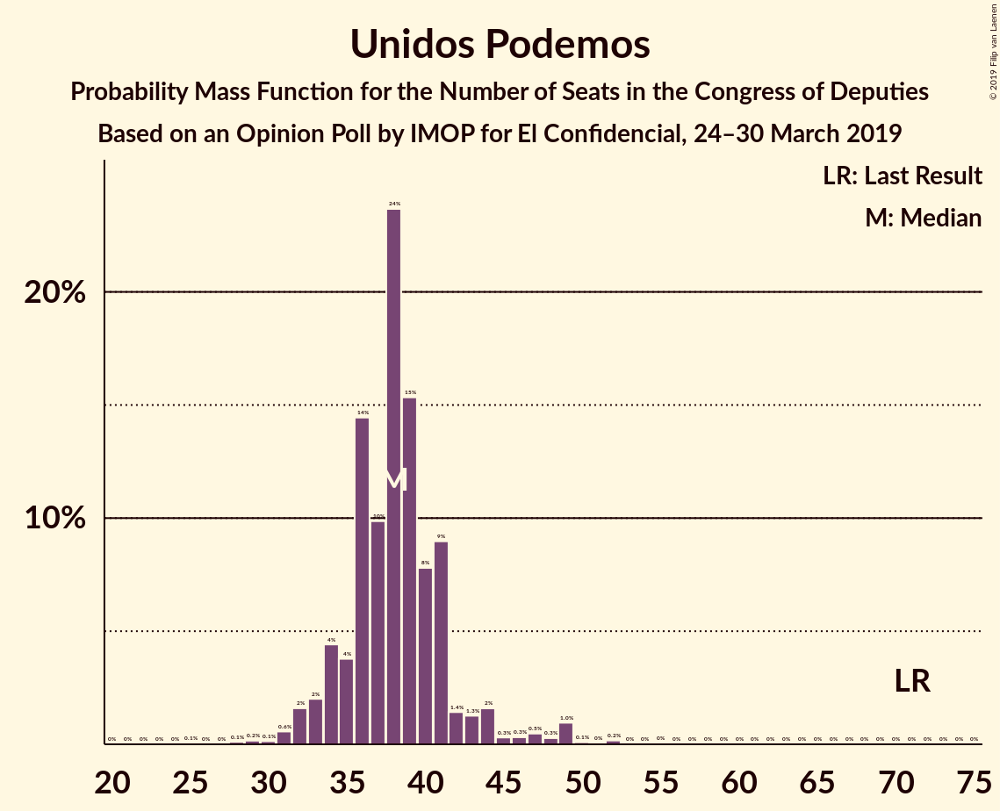
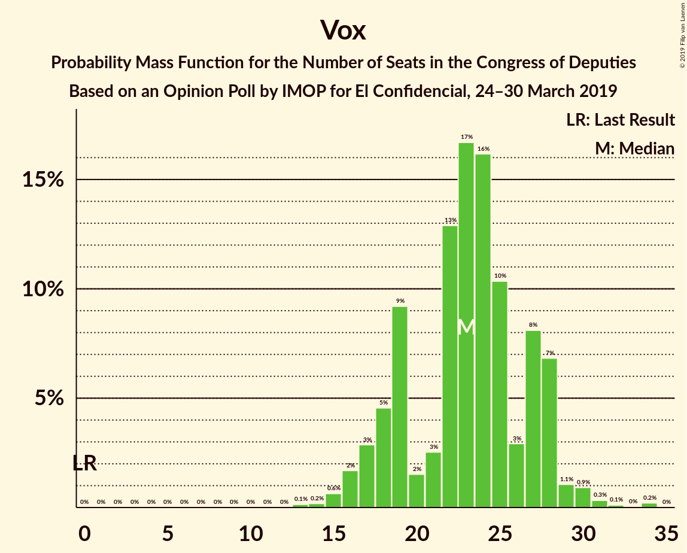
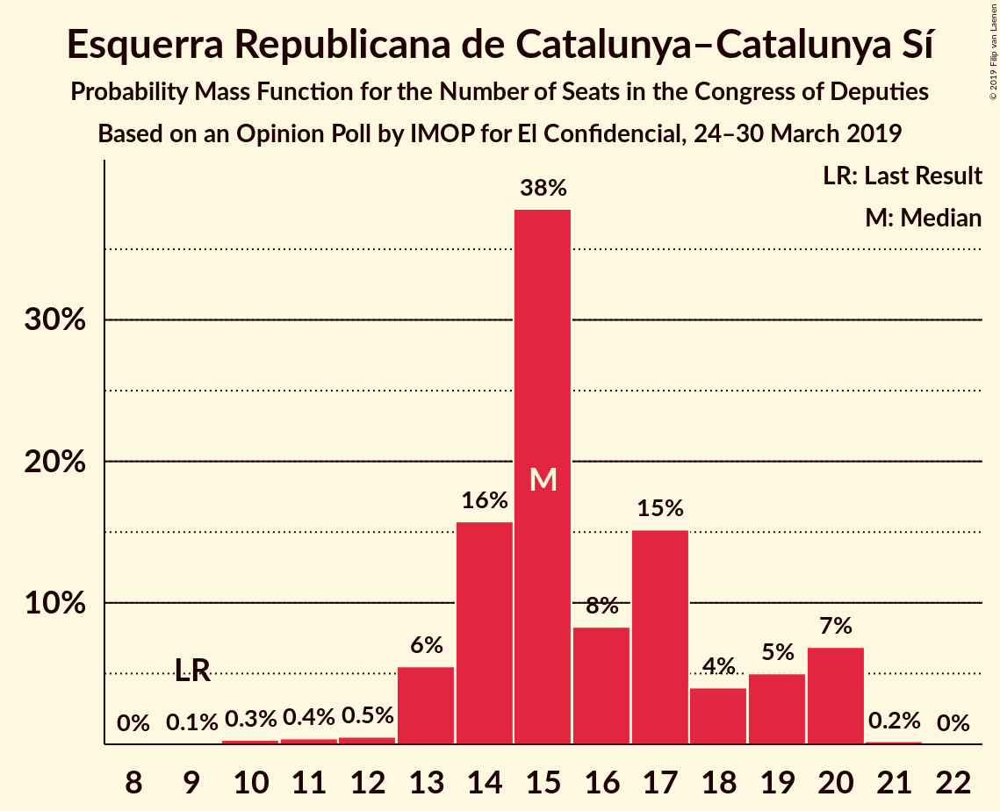
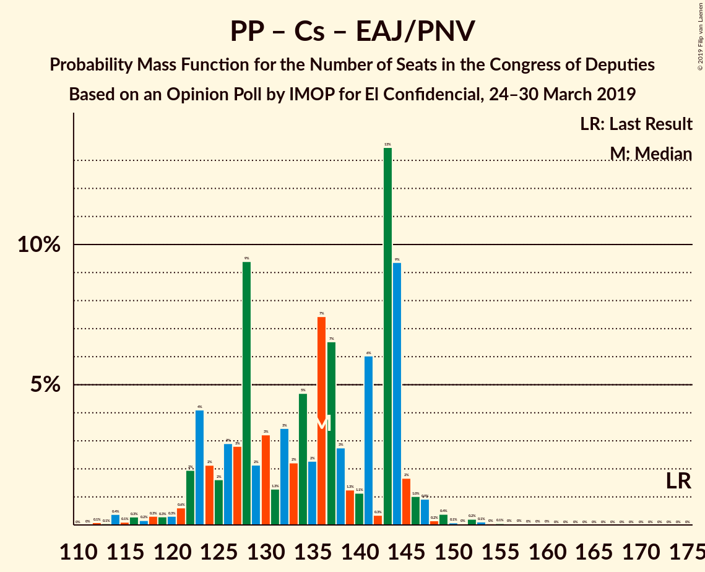

# Opinion Poll by IMOP for El Confidencial, 24–30 March 2019

<a href="#voting-intentions">Voting Intentions</a> | <a href="#seats">Seats</a> | <a href="#coalitions">Coalitions</a> | <a href="#technical-information">Technical Information</a>

## Voting Intentions

### Confidence Intervals

| Party | Last Result | Poll Result | 80% Confidence Interval | 90% Confidence Interval | 95% Confidence Interval | 99% Confidence Interval |
|:-----:|:-----------:|:-----------:|:-----------------------:|:-----------------------:|:-----------------------:|:-----------------------:|
| Partido Socialista Obrero Español | 22.6% | 30.0% | 28.5–31.6% |28.1–32.1% |27.7–32.5% |27.0–33.2% |
| Partido Popular | 33.0% | 21.6% | 20.3–23.1% |19.9–23.5% |19.6–23.9% |18.9–24.6% |
| Unidos Podemos | 21.2% | 14.2% | 13.0–15.4% |12.7–15.8% |12.4–16.1% |11.9–16.7% |
| Ciudadanos–Partido de la Ciudadanía | 13.1% | 14.0% | 12.9–15.3% |12.6–15.6% |12.3–15.9% |11.8–16.6% |
| Vox | 0.2% | 9.5% | 8.6–10.6% |8.3–10.9% |8.1–11.2% |7.7–11.7% |
| Esquerra Republicana de Catalunya–Catalunya Sí | 2.7% | 3.5% | 3.0–4.2% |2.8–4.5% |2.7–4.6% |2.4–5.0% |
| Partido Animalista Contra el Maltrato Animal | 1.2% | 1.8% | 1.4–2.4% |1.3–2.5% |1.2–2.7% |1.1–3.0% |
| Partit Demòcrata Europeu Català | 2.0% | 1.1% | 0.8–1.6% |0.8–1.7% |0.7–1.8% |0.6–2.1% |
| Euzko Alderdi Jeltzalea/Partido Nacionalista Vasco | 1.2% | 1.1% | 0.8–1.6% |0.8–1.7% |0.7–1.8% |0.6–2.1% |
| Euskal Herria Bildu | 0.8% | 1.0% | 0.7–1.4% |0.6–1.5% |0.6–1.7% |0.5–1.9% |

*Note:* The poll result column reflects the actual value used in the calculations. Published results may vary slightly, and in addition be rounded to fewer digits.

## Seats

### Confidence Intervals

| Party | Last Result | Median | 80% Confidence Interval | 90% Confidence Interval | 95% Confidence Interval | 99% Confidence Interval |
|:-----:|:-----------:|:------:|:-----------------------:|:-----------------------:|:-----------------------:|:-----------------------:|
| <a href="#partido-socialista-obrero-español">Partido Socialista Obrero Español</a> | 85 | 130 | 117–138 |117–139 |115–140 |111–145 |
| <a href="#partido-popular">Partido Popular</a> | 137 | 82 | 78–92 |78–94 |73–95 |70–105 |
| <a href="#unidos-podemos">Unidos Podemos</a> | 71 | 39 | 36–42 |34–42 |33–44 |29–49 |
| <a href="#ciudadanos–partido-de-la-ciudadanía">Ciudadanos–Partido de la Ciudadanía</a> | 32 | 44 | 36–51 |36–51 |35–51 |29–54 |
| <a href="#vox">Vox</a> | 0 | 23 | 18–27 |17–28 |16–30 |14–30 |
| <a href="#esquerra-republicana-de-catalunya–catalunya-sí">Esquerra Republicana de Catalunya–Catalunya Sí</a> | 9 | 15 | 14–19 |14–20 |12–20 |10–20 |
| <a href="#partido-animalista-contra-el-maltrato-animal">Partido Animalista Contra el Maltrato Animal</a> | 0 | 1 | 0–1 |0–1 |0–1 |0–1 |
| <a href="#partit-demòcrata-europeu-català">Partit Demòcrata Europeu Català</a> | 8 | 4 | 1–6 |1–6 |1–7 |1–7 |
| <a href="#euzko-alderdi-jeltzalea/partido-nacionalista-vasco">Euzko Alderdi Jeltzalea/Partido Nacionalista Vasco</a> | 5 | 6 | 3–7 |3–7 |3–8 |2–10 |
| <a href="#euskal-herria-bildu">Euskal Herria Bildu</a> | 2 | 6 | 3–7 |2–7 |2–7 |1–8 |

### Partido Socialista Obrero Español

*For a full overview of the results for this party, see the [Partido Socialista Obrero Español](party-partidosocialistaobreroespañol.html) page.*

| Number of Seats | Probability | Accumulated | Special Marks |
|:---------------:|:-----------:|:-----------:|:-------------:|
| 85 | 0% | 100% | Last Result |
| 86 | 0% | 100% |  |
| 87 | 0% | 100% |  |
| 88 | 0% | 100% |  |
| 89 | 0% | 100% |  |
| 90 | 0% | 100% |  |
| 91 | 0% | 100% |  |
| 92 | 0% | 100% |  |
| 93 | 0% | 100% |  |
| 94 | 0% | 100% |  |
| 95 | 0% | 100% |  |
| 96 | 0% | 100% |  |
| 97 | 0% | 100% |  |
| 98 | 0% | 100% |  |
| 99 | 0% | 100% |  |
| 100 | 0% | 100% |  |
| 101 | 0% | 100% |  |
| 102 | 0% | 100% |  |
| 103 | 0% | 100% |  |
| 104 | 0% | 100% |  |
| 105 | 0% | 100% |  |
| 106 | 0% | 100% |  |
| 107 | 0.1% | 100% |  |
| 108 | 0.2% | 99.9% |  |
| 109 | 0% | 99.8% |  |
| 110 | 0.1% | 99.8% |  |
| 111 | 0.5% | 99.6% |  |
| 112 | 0.3% | 99.2% |  |
| 113 | 0.2% | 98.9% |  |
| 114 | 0.3% | 98.6% |  |
| 115 | 2% | 98% |  |
| 116 | 0.1% | 96% |  |
| 117 | 7% | 96% |  |
| 118 | 0.2% | 89% |  |
| 119 | 1.2% | 89% |  |
| 120 | 0.3% | 88% |  |
| 121 | 4% | 87% |  |
| 122 | 0.5% | 83% |  |
| 123 | 13% | 83% |  |
| 124 | 1.4% | 70% |  |
| 125 | 6% | 69% |  |
| 126 | 9% | 63% |  |
| 127 | 0.6% | 54% |  |
| 128 | 0.2% | 54% |  |
| 129 | 1.2% | 53% |  |
| 130 | 4% | 52% | Median |
| 131 | 0.6% | 49% |  |
| 132 | 5% | 48% |  |
| 133 | 7% | 43% |  |
| 134 | 5% | 36% |  |
| 135 | 0.7% | 30% |  |
| 136 | 1.1% | 30% |  |
| 137 | 2% | 29% |  |
| 138 | 17% | 27% |  |
| 139 | 6% | 9% |  |
| 140 | 1.4% | 3% |  |
| 141 | 0.2% | 2% |  |
| 142 | 1.1% | 2% |  |
| 143 | 0% | 0.7% |  |
| 144 | 0.1% | 0.7% |  |
| 145 | 0.5% | 0.6% |  |
| 146 | 0% | 0.2% |  |
| 147 | 0% | 0.2% |  |
| 148 | 0% | 0.2% |  |
| 149 | 0% | 0.1% |  |
| 150 | 0% | 0.1% |  |
| 151 | 0.1% | 0.1% |  |
| 152 | 0% | 0% |  |

### Partido Popular

*For a full overview of the results for this party, see the [Partido Popular](party-partidopopular.html) page.*

| Number of Seats | Probability | Accumulated | Special Marks |
|:---------------:|:-----------:|:-----------:|:-------------:|
| 67 | 0% | 100% |  |
| 68 | 0% | 99.9% |  |
| 69 | 0.1% | 99.9% |  |
| 70 | 0.9% | 99.8% |  |
| 71 | 0.5% | 98.9% |  |
| 72 | 0.4% | 98% |  |
| 73 | 1.2% | 98% |  |
| 74 | 0.2% | 97% |  |
| 75 | 0.3% | 97% |  |
| 76 | 0.1% | 96% |  |
| 77 | 0.7% | 96% |  |
| 78 | 6% | 95% |  |
| 79 | 0.5% | 90% |  |
| 80 | 20% | 89% |  |
| 81 | 17% | 69% |  |
| 82 | 7% | 52% | Median |
| 83 | 0.4% | 45% |  |
| 84 | 4% | 45% |  |
| 85 | 15% | 40% |  |
| 86 | 2% | 26% |  |
| 87 | 7% | 24% |  |
| 88 | 4% | 17% |  |
| 89 | 0.3% | 13% |  |
| 90 | 0.2% | 13% |  |
| 91 | 0% | 13% |  |
| 92 | 7% | 12% |  |
| 93 | 0.3% | 6% |  |
| 94 | 0.9% | 5% |  |
| 95 | 2% | 5% |  |
| 96 | 0.2% | 2% |  |
| 97 | 0.4% | 2% |  |
| 98 | 0% | 1.4% |  |
| 99 | 0.3% | 1.4% |  |
| 100 | 0% | 1.1% |  |
| 101 | 0% | 1.1% |  |
| 102 | 0.1% | 1.1% |  |
| 103 | 0.2% | 0.9% |  |
| 104 | 0.2% | 0.8% |  |
| 105 | 0.3% | 0.6% |  |
| 106 | 0.2% | 0.4% |  |
| 107 | 0% | 0.1% |  |
| 108 | 0% | 0.1% |  |
| 109 | 0% | 0.1% |  |
| 110 | 0% | 0.1% |  |
| 111 | 0.1% | 0.1% |  |
| 112 | 0% | 0% |  |
| 113 | 0% | 0% |  |
| 114 | 0% | 0% |  |
| 115 | 0% | 0% |  |
| 116 | 0% | 0% |  |
| 117 | 0% | 0% |  |
| 118 | 0% | 0% |  |
| 119 | 0% | 0% |  |
| 120 | 0% | 0% |  |
| 121 | 0% | 0% |  |
| 122 | 0% | 0% |  |
| 123 | 0% | 0% |  |
| 124 | 0% | 0% |  |
| 125 | 0% | 0% |  |
| 126 | 0% | 0% |  |
| 127 | 0% | 0% |  |
| 128 | 0% | 0% |  |
| 129 | 0% | 0% |  |
| 130 | 0% | 0% |  |
| 131 | 0% | 0% |  |
| 132 | 0% | 0% |  |
| 133 | 0% | 0% |  |
| 134 | 0% | 0% |  |
| 135 | 0% | 0% |  |
| 136 | 0% | 0% |  |
| 137 | 0% | 0% | Last Result |

### Unidos Podemos

*For a full overview of the results for this party, see the [Unidos Podemos](party-unidospodemos.html) page.*

| Number of Seats | Probability | Accumulated | Special Marks |
|:---------------:|:-----------:|:-----------:|:-------------:|
| 27 | 0% | 100% |  |
| 28 | 0.1% | 99.9% |  |
| 29 | 0.7% | 99.8% |  |
| 30 | 0.2% | 99.1% |  |
| 31 | 0.2% | 98.8% |  |
| 32 | 0.5% | 98.6% |  |
| 33 | 0.8% | 98% |  |
| 34 | 2% | 97% |  |
| 35 | 3% | 95% |  |
| 36 | 11% | 92% |  |
| 37 | 10% | 82% |  |
| 38 | 14% | 72% |  |
| 39 | 22% | 59% | Median |
| 40 | 17% | 37% |  |
| 41 | 9% | 20% |  |
| 42 | 8% | 11% |  |
| 43 | 0.4% | 3% |  |
| 44 | 0.5% | 3% |  |
| 45 | 0.2% | 2% |  |
| 46 | 0.3% | 2% |  |
| 47 | 0.4% | 2% |  |
| 48 | 0.3% | 1.3% |  |
| 49 | 0.7% | 1.0% |  |
| 50 | 0.1% | 0.3% |  |
| 51 | 0% | 0.2% |  |
| 52 | 0% | 0.2% |  |
| 53 | 0% | 0.1% |  |
| 54 | 0% | 0.1% |  |
| 55 | 0.1% | 0.1% |  |
| 56 | 0% | 0% |  |
| 57 | 0% | 0% |  |
| 58 | 0% | 0% |  |
| 59 | 0% | 0% |  |
| 60 | 0% | 0% |  |
| 61 | 0% | 0% |  |
| 62 | 0% | 0% |  |
| 63 | 0% | 0% |  |
| 64 | 0% | 0% |  |
| 65 | 0% | 0% |  |
| 66 | 0% | 0% |  |
| 67 | 0% | 0% |  |
| 68 | 0% | 0% |  |
| 69 | 0% | 0% |  |
| 70 | 0% | 0% |  |
| 71 | 0% | 0% | Last Result |

### Ciudadanos–Partido de la Ciudadanía

*For a full overview of the results for this party, see the [Ciudadanos–Partido de la Ciudadanía](party-ciudadanos–partidodelaciudadanía.html) page.*

| Number of Seats | Probability | Accumulated | Special Marks |
|:---------------:|:-----------:|:-----------:|:-------------:|
| 26 | 0.1% | 100% |  |
| 27 | 0% | 99.9% |  |
| 28 | 0.1% | 99.9% |  |
| 29 | 0.4% | 99.7% |  |
| 30 | 0.2% | 99.3% |  |
| 31 | 0.1% | 99.1% |  |
| 32 | 0.2% | 99.0% | Last Result |
| 33 | 0.4% | 98.8% |  |
| 34 | 0.4% | 98% |  |
| 35 | 1.0% | 98% |  |
| 36 | 7% | 97% |  |
| 37 | 6% | 90% |  |
| 38 | 18% | 84% |  |
| 39 | 1.0% | 66% |  |
| 40 | 0.3% | 65% |  |
| 41 | 7% | 65% |  |
| 42 | 6% | 58% |  |
| 43 | 1.0% | 52% |  |
| 44 | 1.2% | 51% | Median |
| 45 | 1.5% | 50% |  |
| 46 | 6% | 48% |  |
| 47 | 3% | 42% |  |
| 48 | 12% | 39% |  |
| 49 | 7% | 27% |  |
| 50 | 3% | 20% |  |
| 51 | 15% | 17% |  |
| 52 | 1.0% | 2% |  |
| 53 | 0.5% | 1.0% |  |
| 54 | 0% | 0.5% |  |
| 55 | 0.1% | 0.5% |  |
| 56 | 0.2% | 0.4% |  |
| 57 | 0% | 0.2% |  |
| 58 | 0% | 0.1% |  |
| 59 | 0% | 0.1% |  |
| 60 | 0% | 0.1% |  |
| 61 | 0% | 0.1% |  |
| 62 | 0.1% | 0.1% |  |
| 63 | 0% | 0% |  |

### Vox

*For a full overview of the results for this party, see the [Vox](party-vox.html) page.*

| Number of Seats | Probability | Accumulated | Special Marks |
|:---------------:|:-----------:|:-----------:|:-------------:|
| 0 | 0% | 100% | Last Result |
| 1 | 0% | 100% |  |
| 2 | 0% | 100% |  |
| 3 | 0% | 100% |  |
| 4 | 0% | 100% |  |
| 5 | 0% | 100% |  |
| 6 | 0% | 100% |  |
| 7 | 0% | 100% |  |
| 8 | 0% | 100% |  |
| 9 | 0% | 100% |  |
| 10 | 0% | 100% |  |
| 11 | 0% | 100% |  |
| 12 | 0% | 100% |  |
| 13 | 0.3% | 100% |  |
| 14 | 0.2% | 99.7% |  |
| 15 | 0.2% | 99.5% |  |
| 16 | 4% | 99.2% |  |
| 17 | 0.5% | 95% |  |
| 18 | 7% | 95% |  |
| 19 | 1.3% | 88% |  |
| 20 | 0.4% | 86% |  |
| 21 | 4% | 86% |  |
| 22 | 16% | 83% |  |
| 23 | 19% | 66% | Median |
| 24 | 29% | 48% |  |
| 25 | 3% | 19% |  |
| 26 | 2% | 16% |  |
| 27 | 7% | 13% |  |
| 28 | 3% | 6% |  |
| 29 | 0.5% | 3% |  |
| 30 | 2% | 3% |  |
| 31 | 0.2% | 0.3% |  |
| 32 | 0% | 0.1% |  |
| 33 | 0% | 0% |  |

### Esquerra Republicana de Catalunya–Catalunya Sí

*For a full overview of the results for this party, see the [Esquerra Republicana de Catalunya–Catalunya Sí](party-esquerrarepublicanadecatalunya–catalunyasí.html) page.*

| Number of Seats | Probability | Accumulated | Special Marks |
|:---------------:|:-----------:|:-----------:|:-------------:|
| 9 | 0.1% | 100% | Last Result |
| 10 | 2% | 99.9% |  |
| 11 | 0.2% | 98% |  |
| 12 | 0.7% | 98% |  |
| 13 | 0.8% | 97% |  |
| 14 | 24% | 96% |  |
| 15 | 33% | 72% | Median |
| 16 | 14% | 39% |  |
| 17 | 8% | 26% |  |
| 18 | 2% | 18% |  |
| 19 | 8% | 15% |  |
| 20 | 7% | 7% |  |
| 21 | 0.1% | 0.1% |  |
| 22 | 0% | 0% |  |

### Partido Animalista Contra el Maltrato Animal

*For a full overview of the results for this party, see the [Partido Animalista Contra el Maltrato Animal](party-partidoanimalistacontraelmaltratoanimal.html) page.*

| Number of Seats | Probability | Accumulated | Special Marks |
|:---------------:|:-----------:|:-----------:|:-------------:|
| 0 | 47% | 100% | Last Result |
| 1 | 53% | 53% | Median |
| 2 | 0% | 0% |  |

### Partit Demòcrata Europeu Català

*For a full overview of the results for this party, see the [Partit Demòcrata Europeu Català](party-partitdemòcrataeuropeucatalà.html) page.*

| Number of Seats | Probability | Accumulated | Special Marks |
|:---------------:|:-----------:|:-----------:|:-------------:|
| 0 | 0.1% | 100% |  |
| 1 | 17% | 99.9% |  |
| 2 | 11% | 83% |  |
| 3 | 15% | 72% |  |
| 4 | 32% | 57% | Median |
| 5 | 10% | 25% |  |
| 6 | 12% | 15% |  |
| 7 | 3% | 3% |  |
| 8 | 0.3% | 0.3% | Last Result |
| 9 | 0% | 0% |  |

### Euzko Alderdi Jeltzalea/Partido Nacionalista Vasco

*For a full overview of the results for this party, see the [Euzko Alderdi Jeltzalea/Partido Nacionalista Vasco](party-euzkoalderdijeltzaleapartidonacionalistavasco.html) page.*

| Number of Seats | Probability | Accumulated | Special Marks |
|:---------------:|:-----------:|:-----------:|:-------------:|
| 1 | 0.1% | 100% |  |
| 2 | 0.7% | 99.9% |  |
| 3 | 9% | 99.2% |  |
| 4 | 32% | 90% |  |
| 5 | 5% | 58% | Last Result |
| 6 | 36% | 53% | Median |
| 7 | 13% | 17% |  |
| 8 | 3% | 5% |  |
| 9 | 0.1% | 2% |  |
| 10 | 2% | 2% |  |
| 11 | 0% | 0% |  |

### Euskal Herria Bildu

*For a full overview of the results for this party, see the [Euskal Herria Bildu](party-euskalherriabildu.html) page.*

| Number of Seats | Probability | Accumulated | Special Marks |
|:---------------:|:-----------:|:-----------:|:-------------:|
| 1 | 0.6% | 100% |  |
| 2 | 5% | 99.4% | Last Result |
| 3 | 5% | 94% |  |
| 4 | 8% | 89% |  |
| 5 | 25% | 82% |  |
| 6 | 14% | 57% | Median |
| 7 | 42% | 43% |  |
| 8 | 0.8% | 1.0% |  |
| 9 | 0.2% | 0.2% |  |
| 10 | 0% | 0% |  |

## Coalitions

### Confidence Intervals

| Coalition | Last Result | Median | Majority? | 80% Confidence Interval | 90% Confidence Interval | 95% Confidence Interval | 99% Confidence Interval |
|:---------:|:-----------:|:------:|:---------:|:-----------------------:|:-----------------------:|:-----------------------:|:-----------------------:|
| Partido Socialista Obrero Español – Partido Popular – Ciudadanos–Partido de la Ciudadanía | 254 | 256 | 100% | 252–260 | 250–265 | 249–266 | 243–272 |
| Partido Socialista Obrero Español – Partido Popular | 222 | 212 | 100% | 204–221 | 201–221 | 199–225 | 199–230 |
| Partido Socialista Obrero Español – Unidos Podemos – Ciudadanos–Partido de la Ciudadanía | 188 | 212 | 100% | 206–216 | 204–220 | 200–222 | 191–226 |
| Partido Socialista Obrero Español – Unidos Podemos – Esquerra Republicana de Catalunya–Catalunya Sí – Euzko Alderdi Jeltzalea/Partido Nacionalista Vasco – Partit Demòcrata Europeu Català – Euskal Herria Bildu | 180 | 198 | 100% | 189–207 | 186–207 | 185–212 | 179–214 |
| Partido Socialista Obrero Español – Unidos Podemos – Esquerra Republicana de Catalunya–Catalunya Sí – Euskal Herria Bildu | 167 | 187 | 98% | 182–199 | 179–199 | 177–201 | 169–206 |
| Partido Socialista Obrero Español – Unidos Podemos – Esquerra Republicana de Catalunya–Catalunya Sí – Partit Demòcrata Europeu Català | 173 | 188 | 96% | 177–196 | 176–196 | 175–200 | 168–203 |
| Partido Socialista Obrero Español – Unidos Podemos – Euzko Alderdi Jeltzalea/Partido Nacionalista Vasco – Euskal Herria Bildu | 163 | 178 | 62% | 169–188 | 167–188 | 166–193 | 159–194 |
| Partido Socialista Obrero Español – Unidos Podemos – Euzko Alderdi Jeltzalea/Partido Nacionalista Vasco | 161 | 174 | 43% | 163–181 | 161–181 | 160–187 | 154–189 |
| Partido Socialista Obrero Español – Ciudadanos–Partido de la Ciudadanía | 117 | 174 | 28% | 166–177 | 164–180 | 162–183 | 154–188 |
| Partido Socialista Obrero Español – Unidos Podemos | 156 | 167 | 23% | 157–177 | 157–178 | 155–181 | 147–183 |
| Partido Popular – Ciudadanos–Partido de la Ciudadanía – Vox | 169 | 150 | 0% | 142–159 | 142–163 | 136–163 | 135–170 |
| Partido Popular – Ciudadanos–Partido de la Ciudadanía – Euzko Alderdi Jeltzalea/Partido Nacionalista Vasco | 174 | 134 | 0% | 122–145 | 122–147 | 121–147 | 112–154 |
| Partido Popular – Ciudadanos–Partido de la Ciudadanía | 169 | 128 | 0% | 118–141 | 118–141 | 115–142 | 108–150 |
| Partido Socialista Obrero Español | 85 | 130 | 0% | 117–138 | 117–139 | 115–140 | 111–145 |
| Partido Popular – Vox | 137 | 106 | 0% | 103–111 | 101–115 | 98–119 | 91–127 |
| Partido Popular | 137 | 82 | 0% | 78–92 | 78–94 | 73–95 | 70–105 |

### Partido Socialista Obrero Español – Partido Popular – Ciudadanos–Partido de la Ciudadanía

| Number of Seats | Probability | Accumulated | Special Marks |
|:---------------:|:-----------:|:-----------:|:-------------:|
| 239 | 0.1% | 100% |  |
| 240 | 0% | 99.9% |  |
| 241 | 0% | 99.9% |  |
| 242 | 0% | 99.9% |  |
| 243 | 0.7% | 99.9% |  |
| 244 | 0.1% | 99.2% |  |
| 245 | 0% | 99.1% |  |
| 246 | 0.1% | 99.0% |  |
| 247 | 0% | 99.0% |  |
| 248 | 0.2% | 99.0% |  |
| 249 | 1.5% | 98.7% |  |
| 250 | 6% | 97% |  |
| 251 | 0.9% | 92% |  |
| 252 | 4% | 91% |  |
| 253 | 0.8% | 86% |  |
| 254 | 5% | 86% | Last Result |
| 255 | 12% | 80% |  |
| 256 | 23% | 68% | Median |
| 257 | 10% | 46% |  |
| 258 | 14% | 36% |  |
| 259 | 8% | 22% |  |
| 260 | 5% | 14% |  |
| 261 | 0.9% | 9% |  |
| 262 | 2% | 8% |  |
| 263 | 0.4% | 6% |  |
| 264 | 0.3% | 5% |  |
| 265 | 2% | 5% |  |
| 266 | 1.2% | 3% |  |
| 267 | 0.3% | 2% |  |
| 268 | 0.2% | 1.3% |  |
| 269 | 0.2% | 1.1% |  |
| 270 | 0.2% | 0.9% |  |
| 271 | 0.2% | 0.7% |  |
| 272 | 0.3% | 0.6% |  |
| 273 | 0% | 0.3% |  |
| 274 | 0.1% | 0.3% |  |
| 275 | 0% | 0.2% |  |
| 276 | 0.1% | 0.2% |  |
| 277 | 0.1% | 0.2% |  |
| 278 | 0% | 0% |  |

### Partido Socialista Obrero Español – Partido Popular

| Number of Seats | Probability | Accumulated | Special Marks |
|:---------------:|:-----------:|:-----------:|:-------------:|
| 195 | 0.1% | 100% |  |
| 196 | 0% | 99.8% |  |
| 197 | 0.1% | 99.8% |  |
| 198 | 0.1% | 99.8% |  |
| 199 | 4% | 99.7% |  |
| 200 | 0.2% | 96% |  |
| 201 | 0.8% | 96% |  |
| 202 | 0.2% | 95% |  |
| 203 | 2% | 95% |  |
| 204 | 10% | 93% |  |
| 205 | 0.8% | 83% |  |
| 206 | 0.6% | 82% |  |
| 207 | 1.3% | 81% |  |
| 208 | 0.4% | 80% |  |
| 209 | 7% | 80% |  |
| 210 | 6% | 73% |  |
| 211 | 12% | 67% |  |
| 212 | 7% | 54% | Median |
| 213 | 0.1% | 47% |  |
| 214 | 0.4% | 47% |  |
| 215 | 6% | 47% |  |
| 216 | 1.1% | 41% |  |
| 217 | 7% | 40% |  |
| 218 | 21% | 33% |  |
| 219 | 0.5% | 12% |  |
| 220 | 0.8% | 11% |  |
| 221 | 6% | 11% |  |
| 222 | 0.4% | 4% | Last Result |
| 223 | 0.2% | 4% |  |
| 224 | 0.7% | 4% |  |
| 225 | 2% | 3% |  |
| 226 | 0.1% | 1.2% |  |
| 227 | 0.1% | 1.0% |  |
| 228 | 0.1% | 0.9% |  |
| 229 | 0.1% | 0.8% |  |
| 230 | 0.3% | 0.7% |  |
| 231 | 0.1% | 0.4% |  |
| 232 | 0% | 0.3% |  |
| 233 | 0.1% | 0.3% |  |
| 234 | 0% | 0.2% |  |
| 235 | 0% | 0.1% |  |
| 236 | 0% | 0.1% |  |
| 237 | 0% | 0.1% |  |
| 238 | 0% | 0.1% |  |
| 239 | 0% | 0.1% |  |
| 240 | 0% | 0.1% |  |
| 241 | 0.1% | 0.1% |  |
| 242 | 0% | 0% |  |

### Partido Socialista Obrero Español – Unidos Podemos – Ciudadanos–Partido de la Ciudadanía

| Number of Seats | Probability | Accumulated | Special Marks |
|:---------------:|:-----------:|:-----------:|:-------------:|
| 185 | 0.1% | 100% |  |
| 186 | 0% | 99.8% |  |
| 187 | 0.1% | 99.8% |  |
| 188 | 0% | 99.7% | Last Result |
| 189 | 0% | 99.7% |  |
| 190 | 0.1% | 99.6% |  |
| 191 | 0% | 99.5% |  |
| 192 | 0.3% | 99.5% |  |
| 193 | 0% | 99.2% |  |
| 194 | 0.1% | 99.2% |  |
| 195 | 0.5% | 99.1% |  |
| 196 | 0.4% | 98.6% |  |
| 197 | 0.5% | 98% |  |
| 198 | 0.1% | 98% |  |
| 199 | 0.1% | 98% |  |
| 200 | 0.3% | 98% |  |
| 201 | 0.4% | 97% |  |
| 202 | 0.8% | 97% |  |
| 203 | 0.1% | 96% |  |
| 204 | 3% | 96% |  |
| 205 | 0.3% | 93% |  |
| 206 | 8% | 93% |  |
| 207 | 1.2% | 85% |  |
| 208 | 10% | 83% |  |
| 209 | 4% | 73% |  |
| 210 | 0.5% | 69% |  |
| 211 | 11% | 68% |  |
| 212 | 10% | 57% |  |
| 213 | 0.1% | 47% | Median |
| 214 | 12% | 47% |  |
| 215 | 21% | 35% |  |
| 216 | 5% | 14% |  |
| 217 | 2% | 9% |  |
| 218 | 1.0% | 7% |  |
| 219 | 0.5% | 6% |  |
| 220 | 0.3% | 5% |  |
| 221 | 0.8% | 5% |  |
| 222 | 2% | 4% |  |
| 223 | 0.1% | 2% |  |
| 224 | 0.1% | 2% |  |
| 225 | 0.3% | 2% |  |
| 226 | 0.9% | 1.3% |  |
| 227 | 0% | 0.3% |  |
| 228 | 0.1% | 0.3% |  |
| 229 | 0.1% | 0.2% |  |
| 230 | 0% | 0.2% |  |
| 231 | 0.1% | 0.1% |  |
| 232 | 0% | 0% |  |

### Partido Socialista Obrero Español – Unidos Podemos – Esquerra Republicana de Catalunya–Catalunya Sí – Euzko Alderdi Jeltzalea/Partido Nacionalista Vasco – Partit Demòcrata Europeu Català – Euskal Herria Bildu

| Number of Seats | Probability | Accumulated | Special Marks |
|:---------------:|:-----------:|:-----------:|:-------------:|
| 176 | 0.4% | 100% | Majority |
| 177 | 0% | 99.6% |  |
| 178 | 0% | 99.5% |  |
| 179 | 0.2% | 99.5% |  |
| 180 | 0% | 99.4% | Last Result |
| 181 | 0.2% | 99.3% |  |
| 182 | 0.3% | 99.1% |  |
| 183 | 1.0% | 98.8% |  |
| 184 | 0.1% | 98% |  |
| 185 | 1.2% | 98% |  |
| 186 | 2% | 97% |  |
| 187 | 0.2% | 95% |  |
| 188 | 1.5% | 95% |  |
| 189 | 8% | 93% |  |
| 190 | 0.4% | 85% |  |
| 191 | 1.4% | 85% |  |
| 192 | 6% | 83% |  |
| 193 | 22% | 77% |  |
| 194 | 0.2% | 55% |  |
| 195 | 0.4% | 54% |  |
| 196 | 3% | 54% |  |
| 197 | 0.6% | 51% |  |
| 198 | 0.6% | 50% |  |
| 199 | 2% | 50% |  |
| 200 | 6% | 47% | Median |
| 201 | 2% | 41% |  |
| 202 | 5% | 39% |  |
| 203 | 0.9% | 34% |  |
| 204 | 0.6% | 33% |  |
| 205 | 0.4% | 32% |  |
| 206 | 5% | 32% |  |
| 207 | 24% | 27% |  |
| 208 | 0.1% | 3% |  |
| 209 | 0.1% | 3% |  |
| 210 | 0% | 3% |  |
| 211 | 0.3% | 3% |  |
| 212 | 1.0% | 3% |  |
| 213 | 0.3% | 2% |  |
| 214 | 1.2% | 1.3% |  |
| 215 | 0% | 0.1% |  |
| 216 | 0% | 0.1% |  |
| 217 | 0% | 0.1% |  |
| 218 | 0% | 0.1% |  |
| 219 | 0% | 0% |  |

### Partido Socialista Obrero Español – Unidos Podemos – Esquerra Republicana de Catalunya–Catalunya Sí – Euskal Herria Bildu

| Number of Seats | Probability | Accumulated | Special Marks |
|:---------------:|:-----------:|:-----------:|:-------------:|
| 166 | 0.1% | 100% |  |
| 167 | 0% | 99.9% | Last Result |
| 168 | 0.1% | 99.9% |  |
| 169 | 0.5% | 99.8% |  |
| 170 | 0.3% | 99.3% |  |
| 171 | 0.1% | 99.0% |  |
| 172 | 0.1% | 98.8% |  |
| 173 | 0.2% | 98.8% |  |
| 174 | 0.6% | 98.5% |  |
| 175 | 0.1% | 98% |  |
| 176 | 0.1% | 98% | Majority |
| 177 | 2% | 98% |  |
| 178 | 1.0% | 96% |  |
| 179 | 0.4% | 95% |  |
| 180 | 0.7% | 95% |  |
| 181 | 4% | 94% |  |
| 182 | 16% | 90% |  |
| 183 | 10% | 74% |  |
| 184 | 0.1% | 64% |  |
| 185 | 9% | 64% |  |
| 186 | 4% | 55% |  |
| 187 | 2% | 51% |  |
| 188 | 0.7% | 49% |  |
| 189 | 0.8% | 48% |  |
| 190 | 1.3% | 48% | Median |
| 191 | 6% | 46% |  |
| 192 | 0.9% | 41% |  |
| 193 | 1.3% | 40% |  |
| 194 | 2% | 38% |  |
| 195 | 4% | 36% |  |
| 196 | 6% | 32% |  |
| 197 | 0.2% | 26% |  |
| 198 | 1.3% | 26% |  |
| 199 | 21% | 24% |  |
| 200 | 0.1% | 3% |  |
| 201 | 1.4% | 3% |  |
| 202 | 0.1% | 2% |  |
| 203 | 0.1% | 2% |  |
| 204 | 0.3% | 2% |  |
| 205 | 0.4% | 1.5% |  |
| 206 | 0.9% | 1.1% |  |
| 207 | 0.1% | 0.2% |  |
| 208 | 0% | 0.1% |  |
| 209 | 0% | 0.1% |  |
| 210 | 0% | 0.1% |  |
| 211 | 0% | 0.1% |  |
| 212 | 0% | 0.1% |  |
| 213 | 0% | 0% |  |

### Partido Socialista Obrero Español – Unidos Podemos – Esquerra Republicana de Catalunya–Catalunya Sí – Partit Demòcrata Europeu Català

| Number of Seats | Probability | Accumulated | Special Marks |
|:---------------:|:-----------:|:-----------:|:-------------:|
| 166 | 0.4% | 100% |  |
| 167 | 0% | 99.6% |  |
| 168 | 0.1% | 99.5% |  |
| 169 | 0.1% | 99.4% |  |
| 170 | 0.2% | 99.3% |  |
| 171 | 0.2% | 99.1% |  |
| 172 | 0.2% | 98.9% |  |
| 173 | 0.8% | 98.7% | Last Result |
| 174 | 0.2% | 98% |  |
| 175 | 1.3% | 98% |  |
| 176 | 3% | 96% | Majority |
| 177 | 7% | 94% |  |
| 178 | 2% | 87% |  |
| 179 | 0.2% | 85% |  |
| 180 | 0.5% | 85% |  |
| 181 | 11% | 85% |  |
| 182 | 18% | 74% |  |
| 183 | 1.0% | 55% |  |
| 184 | 0.3% | 54% |  |
| 185 | 2% | 54% |  |
| 186 | 0.7% | 52% |  |
| 187 | 1.0% | 51% |  |
| 188 | 4% | 50% | Median |
| 189 | 3% | 46% |  |
| 190 | 4% | 43% |  |
| 191 | 2% | 38% |  |
| 192 | 0.3% | 36% |  |
| 193 | 2% | 36% |  |
| 194 | 2% | 34% |  |
| 195 | 4% | 33% |  |
| 196 | 25% | 29% |  |
| 197 | 0.2% | 4% |  |
| 198 | 0.4% | 3% |  |
| 199 | 0.3% | 3% |  |
| 200 | 1.0% | 3% |  |
| 201 | 0.2% | 2% |  |
| 202 | 0.1% | 2% |  |
| 203 | 1.2% | 1.5% |  |
| 204 | 0.1% | 0.3% |  |
| 205 | 0% | 0.2% |  |
| 206 | 0% | 0.2% |  |
| 207 | 0.1% | 0.2% |  |
| 208 | 0.1% | 0.2% |  |
| 209 | 0% | 0% |  |

### Partido Socialista Obrero Español – Unidos Podemos – Euzko Alderdi Jeltzalea/Partido Nacionalista Vasco – Euskal Herria Bildu

| Number of Seats | Probability | Accumulated | Special Marks |
|:---------------:|:-----------:|:-----------:|:-------------:|
| 155 | 0.3% | 100% |  |
| 156 | 0% | 99.7% |  |
| 157 | 0.1% | 99.7% |  |
| 158 | 0.1% | 99.6% |  |
| 159 | 0.1% | 99.5% |  |
| 160 | 0.2% | 99.4% |  |
| 161 | 0.6% | 99.2% |  |
| 162 | 0% | 98.6% |  |
| 163 | 0.3% | 98.5% | Last Result |
| 164 | 0.3% | 98% |  |
| 165 | 0.1% | 98% |  |
| 166 | 2% | 98% |  |
| 167 | 3% | 96% |  |
| 168 | 0% | 93% |  |
| 169 | 7% | 93% |  |
| 170 | 1.0% | 86% |  |
| 171 | 0.3% | 85% |  |
| 172 | 10% | 85% |  |
| 173 | 7% | 75% |  |
| 174 | 0.8% | 68% |  |
| 175 | 5% | 67% |  |
| 176 | 0.4% | 62% | Majority |
| 177 | 11% | 62% |  |
| 178 | 3% | 51% |  |
| 179 | 0.3% | 48% |  |
| 180 | 0.7% | 47% |  |
| 181 | 5% | 47% | Median |
| 182 | 3% | 42% |  |
| 183 | 6% | 39% |  |
| 184 | 1.1% | 34% |  |
| 185 | 1.0% | 33% |  |
| 186 | 6% | 32% |  |
| 187 | 4% | 25% |  |
| 188 | 17% | 21% |  |
| 189 | 0.2% | 3% |  |
| 190 | 0.1% | 3% |  |
| 191 | 0.1% | 3% |  |
| 192 | 0.2% | 3% |  |
| 193 | 0.9% | 3% |  |
| 194 | 1.4% | 2% |  |
| 195 | 0.1% | 0.4% |  |
| 196 | 0.1% | 0.3% |  |
| 197 | 0% | 0.1% |  |
| 198 | 0% | 0.1% |  |
| 199 | 0% | 0% |  |

### Partido Socialista Obrero Español – Unidos Podemos – Euzko Alderdi Jeltzalea/Partido Nacionalista Vasco

| Number of Seats | Probability | Accumulated | Special Marks |
|:---------------:|:-----------:|:-----------:|:-------------:|
| 148 | 0.3% | 100% |  |
| 149 | 0% | 99.7% |  |
| 150 | 0% | 99.7% |  |
| 151 | 0% | 99.7% |  |
| 152 | 0% | 99.7% |  |
| 153 | 0.1% | 99.7% |  |
| 154 | 0.1% | 99.5% |  |
| 155 | 0.2% | 99.4% |  |
| 156 | 0.1% | 99.2% |  |
| 157 | 0.6% | 99.1% |  |
| 158 | 0.2% | 98.5% |  |
| 159 | 0.4% | 98% |  |
| 160 | 3% | 98% |  |
| 161 | 1.3% | 95% | Last Result |
| 162 | 0.8% | 94% |  |
| 163 | 7% | 93% |  |
| 164 | 0.8% | 86% |  |
| 165 | 10% | 85% |  |
| 166 | 0.9% | 76% |  |
| 167 | 0.2% | 75% |  |
| 168 | 2% | 75% |  |
| 169 | 6% | 73% |  |
| 170 | 5% | 67% |  |
| 171 | 0.9% | 62% |  |
| 172 | 10% | 61% |  |
| 173 | 0.2% | 51% |  |
| 174 | 5% | 50% |  |
| 175 | 3% | 46% | Median |
| 176 | 4% | 43% | Majority |
| 177 | 1.2% | 39% |  |
| 178 | 0.2% | 38% |  |
| 179 | 2% | 38% |  |
| 180 | 3% | 36% |  |
| 181 | 29% | 33% |  |
| 182 | 0.6% | 4% |  |
| 183 | 0.1% | 4% |  |
| 184 | 0.2% | 3% |  |
| 185 | 0.1% | 3% |  |
| 186 | 0.1% | 3% |  |
| 187 | 2% | 3% |  |
| 188 | 0.3% | 1.1% |  |
| 189 | 0.5% | 0.8% |  |
| 190 | 0.2% | 0.3% |  |
| 191 | 0.1% | 0.2% |  |
| 192 | 0% | 0.1% |  |
| 193 | 0% | 0.1% |  |
| 194 | 0% | 0.1% |  |
| 195 | 0% | 0% |  |

### Partido Socialista Obrero Español – Ciudadanos–Partido de la Ciudadanía

| Number of Seats | Probability | Accumulated | Special Marks |
|:---------------:|:-----------:|:-----------:|:-------------:|
| 117 | 0% | 100% | Last Result |
| 118 | 0% | 100% |  |
| 119 | 0% | 100% |  |
| 120 | 0% | 100% |  |
| 121 | 0% | 100% |  |
| 122 | 0% | 100% |  |
| 123 | 0% | 100% |  |
| 124 | 0% | 100% |  |
| 125 | 0% | 100% |  |
| 126 | 0% | 100% |  |
| 127 | 0% | 100% |  |
| 128 | 0% | 100% |  |
| 129 | 0% | 100% |  |
| 130 | 0% | 100% |  |
| 131 | 0% | 100% |  |
| 132 | 0% | 100% |  |
| 133 | 0% | 100% |  |
| 134 | 0% | 100% |  |
| 135 | 0% | 100% |  |
| 136 | 0% | 100% |  |
| 137 | 0% | 100% |  |
| 138 | 0% | 100% |  |
| 139 | 0% | 100% |  |
| 140 | 0% | 100% |  |
| 141 | 0% | 100% |  |
| 142 | 0% | 100% |  |
| 143 | 0% | 100% |  |
| 144 | 0.1% | 100% |  |
| 145 | 0% | 99.9% |  |
| 146 | 0% | 99.9% |  |
| 147 | 0% | 99.9% |  |
| 148 | 0% | 99.9% |  |
| 149 | 0% | 99.8% |  |
| 150 | 0% | 99.8% |  |
| 151 | 0% | 99.8% |  |
| 152 | 0.2% | 99.8% |  |
| 153 | 0% | 99.6% |  |
| 154 | 0.5% | 99.5% |  |
| 155 | 0.6% | 99.0% |  |
| 156 | 0% | 98% |  |
| 157 | 0.1% | 98% |  |
| 158 | 0.1% | 98% |  |
| 159 | 0.3% | 98% |  |
| 160 | 0.1% | 98% |  |
| 161 | 0.3% | 98% |  |
| 162 | 2% | 98% |  |
| 163 | 0.6% | 96% |  |
| 164 | 1.0% | 95% |  |
| 165 | 0.2% | 94% |  |
| 166 | 8% | 94% |  |
| 167 | 0.4% | 86% |  |
| 168 | 1.0% | 86% |  |
| 169 | 1.3% | 85% |  |
| 170 | 4% | 83% |  |
| 171 | 10% | 79% |  |
| 172 | 5% | 69% |  |
| 173 | 0.4% | 65% |  |
| 174 | 23% | 65% | Median |
| 175 | 14% | 42% |  |
| 176 | 17% | 28% | Majority |
| 177 | 1.4% | 10% |  |
| 178 | 0.6% | 9% |  |
| 179 | 2% | 8% |  |
| 180 | 3% | 7% |  |
| 181 | 0.4% | 4% |  |
| 182 | 0.2% | 3% |  |
| 183 | 0.8% | 3% |  |
| 184 | 0.2% | 2% |  |
| 185 | 1.2% | 2% |  |
| 186 | 0.1% | 0.9% |  |
| 187 | 0.1% | 0.8% |  |
| 188 | 0.2% | 0.6% |  |
| 189 | 0% | 0.4% |  |
| 190 | 0.2% | 0.4% |  |
| 191 | 0% | 0.2% |  |
| 192 | 0% | 0.1% |  |
| 193 | 0% | 0.1% |  |
| 194 | 0.1% | 0.1% |  |
| 195 | 0% | 0% |  |

### Partido Socialista Obrero Español – Unidos Podemos

| Number of Seats | Probability | Accumulated | Special Marks |
|:---------------:|:-----------:|:-----------:|:-------------:|
| 145 | 0.3% | 100% |  |
| 146 | 0% | 99.7% |  |
| 147 | 0.1% | 99.6% |  |
| 148 | 0.2% | 99.5% |  |
| 149 | 0% | 99.3% |  |
| 150 | 0.1% | 99.2% |  |
| 151 | 0.5% | 99.1% |  |
| 152 | 0.1% | 98.6% |  |
| 153 | 0.4% | 98.6% |  |
| 154 | 0.1% | 98% |  |
| 155 | 0.7% | 98% |  |
| 156 | 0.4% | 97% | Last Result |
| 157 | 10% | 97% |  |
| 158 | 2% | 87% |  |
| 159 | 0.2% | 85% |  |
| 160 | 1.3% | 85% |  |
| 161 | 10% | 84% |  |
| 162 | 6% | 74% |  |
| 163 | 4% | 68% |  |
| 164 | 0.6% | 64% |  |
| 165 | 2% | 63% |  |
| 166 | 10% | 62% |  |
| 167 | 3% | 51% |  |
| 168 | 1.4% | 49% |  |
| 169 | 4% | 47% | Median |
| 170 | 0.5% | 43% |  |
| 171 | 0.5% | 43% |  |
| 172 | 4% | 42% |  |
| 173 | 2% | 38% |  |
| 174 | 3% | 36% |  |
| 175 | 10% | 34% |  |
| 176 | 0.7% | 23% | Majority |
| 177 | 18% | 23% |  |
| 178 | 2% | 5% |  |
| 179 | 0.1% | 3% |  |
| 180 | 0.1% | 3% |  |
| 181 | 0.9% | 3% |  |
| 182 | 0.3% | 2% |  |
| 183 | 1.3% | 2% |  |
| 184 | 0.2% | 0.5% |  |
| 185 | 0% | 0.3% |  |
| 186 | 0.1% | 0.3% |  |
| 187 | 0.1% | 0.2% |  |
| 188 | 0% | 0.1% |  |
| 189 | 0% | 0% |  |

### Partido Popular – Ciudadanos–Partido de la Ciudadanía – Vox

| Number of Seats | Probability | Accumulated | Special Marks |
|:---------------:|:-----------:|:-----------:|:-------------:|
| 130 | 0% | 100% |  |
| 131 | 0% | 99.9% |  |
| 132 | 0% | 99.9% |  |
| 133 | 0% | 99.9% |  |
| 134 | 0.4% | 99.9% |  |
| 135 | 0.9% | 99.5% |  |
| 136 | 1.2% | 98.6% |  |
| 137 | 0.1% | 97% |  |
| 138 | 0.2% | 97% |  |
| 139 | 0.1% | 97% |  |
| 140 | 0.2% | 97% |  |
| 141 | 0.3% | 97% |  |
| 142 | 24% | 97% |  |
| 143 | 5% | 73% |  |
| 144 | 0.4% | 68% |  |
| 145 | 1.4% | 68% |  |
| 146 | 5% | 66% |  |
| 147 | 0.6% | 62% |  |
| 148 | 5% | 61% |  |
| 149 | 6% | 57% | Median |
| 150 | 0.7% | 50% |  |
| 151 | 0.6% | 50% |  |
| 152 | 3% | 49% |  |
| 153 | 0.4% | 46% |  |
| 154 | 0.2% | 46% |  |
| 155 | 18% | 45% |  |
| 156 | 10% | 27% |  |
| 157 | 2% | 17% |  |
| 158 | 0.3% | 15% |  |
| 159 | 7% | 15% |  |
| 160 | 3% | 8% |  |
| 161 | 0.2% | 5% |  |
| 162 | 0.1% | 5% |  |
| 163 | 3% | 5% |  |
| 164 | 0.1% | 2% |  |
| 165 | 0.5% | 2% |  |
| 166 | 0.5% | 2% |  |
| 167 | 0.3% | 1.2% |  |
| 168 | 0.2% | 0.8% |  |
| 169 | 0% | 0.7% | Last Result |
| 170 | 0.1% | 0.6% |  |
| 171 | 0% | 0.5% |  |
| 172 | 0.1% | 0.4% |  |
| 173 | 0.3% | 0.4% |  |
| 174 | 0% | 0% |  |

### Partido Popular – Ciudadanos–Partido de la Ciudadanía – Euzko Alderdi Jeltzalea/Partido Nacionalista Vasco

| Number of Seats | Probability | Accumulated | Special Marks |
|:---------------:|:-----------:|:-----------:|:-------------:|
| 112 | 0.8% | 100% |  |
| 113 | 0% | 99.1% |  |
| 114 | 0% | 99.1% |  |
| 115 | 0.3% | 99.1% |  |
| 116 | 0% | 98.7% |  |
| 117 | 0% | 98.7% |  |
| 118 | 0% | 98.7% |  |
| 119 | 0% | 98.6% |  |
| 120 | 0.2% | 98.6% |  |
| 121 | 1.1% | 98% |  |
| 122 | 18% | 97% |  |
| 123 | 0.4% | 79% |  |
| 124 | 7% | 79% |  |
| 125 | 4% | 72% |  |
| 126 | 2% | 68% |  |
| 127 | 2% | 66% |  |
| 128 | 6% | 64% |  |
| 129 | 0.2% | 58% |  |
| 130 | 3% | 58% |  |
| 131 | 0.3% | 54% |  |
| 132 | 4% | 54% | Median |
| 133 | 0.3% | 50% |  |
| 134 | 0.9% | 50% |  |
| 135 | 0.2% | 49% |  |
| 136 | 14% | 49% |  |
| 137 | 0.5% | 35% |  |
| 138 | 2% | 34% |  |
| 139 | 11% | 32% |  |
| 140 | 6% | 21% |  |
| 141 | 3% | 15% |  |
| 142 | 0.4% | 12% |  |
| 143 | 0.1% | 12% |  |
| 144 | 0.3% | 11% |  |
| 145 | 2% | 11% |  |
| 146 | 0.1% | 9% |  |
| 147 | 7% | 9% |  |
| 148 | 0.6% | 2% |  |
| 149 | 0.2% | 1.5% |  |
| 150 | 0.1% | 1.3% |  |
| 151 | 0% | 1.2% |  |
| 152 | 0.2% | 1.1% |  |
| 153 | 0.4% | 0.9% |  |
| 154 | 0.1% | 0.5% |  |
| 155 | 0.2% | 0.5% |  |
| 156 | 0% | 0.3% |  |
| 157 | 0% | 0.3% |  |
| 158 | 0.1% | 0.3% |  |
| 159 | 0.1% | 0.1% |  |
| 160 | 0% | 0% |  |
| 161 | 0% | 0% |  |
| 162 | 0% | 0% |  |
| 163 | 0% | 0% |  |
| 164 | 0% | 0% |  |
| 165 | 0% | 0% |  |
| 166 | 0% | 0% |  |
| 167 | 0% | 0% |  |
| 168 | 0% | 0% |  |
| 169 | 0% | 0% |  |
| 170 | 0% | 0% |  |
| 171 | 0% | 0% |  |
| 172 | 0% | 0% |  |
| 173 | 0% | 0% |  |
| 174 | 0% | 0% | Last Result |

### Partido Popular – Ciudadanos–Partido de la Ciudadanía

| Number of Seats | Probability | Accumulated | Special Marks |
|:---------------:|:-----------:|:-----------:|:-------------:|
| 108 | 0.9% | 100% |  |
| 109 | 0.4% | 99.1% |  |
| 110 | 0% | 98.7% |  |
| 111 | 0% | 98.7% |  |
| 112 | 0.1% | 98.7% |  |
| 113 | 0% | 98.6% |  |
| 114 | 0% | 98.6% |  |
| 115 | 1.5% | 98.6% |  |
| 116 | 0.2% | 97% |  |
| 117 | 0.5% | 97% |  |
| 118 | 24% | 96% |  |
| 119 | 1.3% | 73% |  |
| 120 | 2% | 71% |  |
| 121 | 4% | 69% |  |
| 122 | 6% | 65% |  |
| 123 | 0.7% | 59% |  |
| 124 | 2% | 58% |  |
| 125 | 2% | 56% |  |
| 126 | 0.3% | 54% | Median |
| 127 | 4% | 54% |  |
| 128 | 0.6% | 50% |  |
| 129 | 4% | 50% |  |
| 130 | 0.7% | 45% |  |
| 131 | 1.3% | 45% |  |
| 132 | 11% | 43% |  |
| 133 | 17% | 32% |  |
| 134 | 0.2% | 16% |  |
| 135 | 1.4% | 16% |  |
| 136 | 1.5% | 14% |  |
| 137 | 0.2% | 13% |  |
| 138 | 1.3% | 12% |  |
| 139 | 0.6% | 11% |  |
| 140 | 0.1% | 11% |  |
| 141 | 7% | 10% |  |
| 142 | 2% | 3% |  |
| 143 | 0.2% | 2% |  |
| 144 | 0.1% | 1.4% |  |
| 145 | 0.2% | 1.2% |  |
| 146 | 0.1% | 1.0% |  |
| 147 | 0.1% | 0.9% |  |
| 148 | 0.1% | 0.8% |  |
| 149 | 0.1% | 0.7% |  |
| 150 | 0.4% | 0.7% |  |
| 151 | 0.2% | 0.3% |  |
| 152 | 0% | 0.1% |  |
| 153 | 0% | 0.1% |  |
| 154 | 0.1% | 0.1% |  |
| 155 | 0% | 0% |  |
| 156 | 0% | 0% |  |
| 157 | 0% | 0% |  |
| 158 | 0% | 0% |  |
| 159 | 0% | 0% |  |
| 160 | 0% | 0% |  |
| 161 | 0% | 0% |  |
| 162 | 0% | 0% |  |
| 163 | 0% | 0% |  |
| 164 | 0% | 0% |  |
| 165 | 0% | 0% |  |
| 166 | 0% | 0% |  |
| 167 | 0% | 0% |  |
| 168 | 0% | 0% |  |
| 169 | 0% | 0% | Last Result |

### Partido Socialista Obrero Español

| Number of Seats | Probability | Accumulated | Special Marks |
|:---------------:|:-----------:|:-----------:|:-------------:|
| 85 | 0% | 100% | Last Result |
| 86 | 0% | 100% |  |
| 87 | 0% | 100% |  |
| 88 | 0% | 100% |  |
| 89 | 0% | 100% |  |
| 90 | 0% | 100% |  |
| 91 | 0% | 100% |  |
| 92 | 0% | 100% |  |
| 93 | 0% | 100% |  |
| 94 | 0% | 100% |  |
| 95 | 0% | 100% |  |
| 96 | 0% | 100% |  |
| 97 | 0% | 100% |  |
| 98 | 0% | 100% |  |
| 99 | 0% | 100% |  |
| 100 | 0% | 100% |  |
| 101 | 0% | 100% |  |
| 102 | 0% | 100% |  |
| 103 | 0% | 100% |  |
| 104 | 0% | 100% |  |
| 105 | 0% | 100% |  |
| 106 | 0% | 100% |  |
| 107 | 0.1% | 100% |  |
| 108 | 0.2% | 99.9% |  |
| 109 | 0% | 99.8% |  |
| 110 | 0.1% | 99.8% |  |
| 111 | 0.5% | 99.6% |  |
| 112 | 0.3% | 99.2% |  |
| 113 | 0.2% | 98.9% |  |
| 114 | 0.3% | 98.6% |  |
| 115 | 2% | 98% |  |
| 116 | 0.1% | 96% |  |
| 117 | 7% | 96% |  |
| 118 | 0.2% | 89% |  |
| 119 | 1.2% | 89% |  |
| 120 | 0.3% | 88% |  |
| 121 | 4% | 87% |  |
| 122 | 0.5% | 83% |  |
| 123 | 13% | 83% |  |
| 124 | 1.4% | 70% |  |
| 125 | 6% | 69% |  |
| 126 | 9% | 63% |  |
| 127 | 0.6% | 54% |  |
| 128 | 0.2% | 54% |  |
| 129 | 1.2% | 53% |  |
| 130 | 4% | 52% | Median |
| 131 | 0.6% | 49% |  |
| 132 | 5% | 48% |  |
| 133 | 7% | 43% |  |
| 134 | 5% | 36% |  |
| 135 | 0.7% | 30% |  |
| 136 | 1.1% | 30% |  |
| 137 | 2% | 29% |  |
| 138 | 17% | 27% |  |
| 139 | 6% | 9% |  |
| 140 | 1.4% | 3% |  |
| 141 | 0.2% | 2% |  |
| 142 | 1.1% | 2% |  |
| 143 | 0% | 0.7% |  |
| 144 | 0.1% | 0.7% |  |
| 145 | 0.5% | 0.6% |  |
| 146 | 0% | 0.2% |  |
| 147 | 0% | 0.2% |  |
| 148 | 0% | 0.2% |  |
| 149 | 0% | 0.1% |  |
| 150 | 0% | 0.1% |  |
| 151 | 0.1% | 0.1% |  |
| 152 | 0% | 0% |  |

### Partido Popular – Vox

| Number of Seats | Probability | Accumulated | Special Marks |
|:---------------:|:-----------:|:-----------:|:-------------:|
| 87 | 0% | 100% |  |
| 88 | 0% | 99.9% |  |
| 89 | 0.1% | 99.9% |  |
| 90 | 0% | 99.8% |  |
| 91 | 0.9% | 99.8% |  |
| 92 | 0.1% | 98.9% |  |
| 93 | 0.3% | 98.8% |  |
| 94 | 0% | 98.6% |  |
| 95 | 0.1% | 98.5% |  |
| 96 | 0.4% | 98% |  |
| 97 | 0% | 98% |  |
| 98 | 0.7% | 98% |  |
| 99 | 1.0% | 97% |  |
| 100 | 1.2% | 96% |  |
| 101 | 2% | 95% |  |
| 102 | 2% | 93% |  |
| 103 | 2% | 91% |  |
| 104 | 28% | 89% |  |
| 105 | 8% | 62% | Median |
| 106 | 13% | 53% |  |
| 107 | 12% | 40% |  |
| 108 | 0.5% | 28% |  |
| 109 | 0.2% | 28% |  |
| 110 | 13% | 28% |  |
| 111 | 5% | 14% |  |
| 112 | 2% | 10% |  |
| 113 | 2% | 8% |  |
| 114 | 0.5% | 6% |  |
| 115 | 0.6% | 6% |  |
| 116 | 2% | 5% |  |
| 117 | 0.2% | 3% |  |
| 118 | 0.4% | 3% |  |
| 119 | 0.2% | 3% |  |
| 120 | 0.1% | 2% |  |
| 121 | 0.2% | 2% |  |
| 122 | 0.9% | 2% |  |
| 123 | 0% | 1.2% |  |
| 124 | 0.3% | 1.2% |  |
| 125 | 0.1% | 0.9% |  |
| 126 | 0.2% | 0.8% |  |
| 127 | 0.1% | 0.5% |  |
| 128 | 0% | 0.4% |  |
| 129 | 0% | 0.3% |  |
| 130 | 0.3% | 0.3% |  |
| 131 | 0% | 0% |  |
| 132 | 0% | 0% |  |
| 133 | 0% | 0% |  |
| 134 | 0% | 0% |  |
| 135 | 0% | 0% |  |
| 136 | 0% | 0% |  |
| 137 | 0% | 0% | Last Result |

### Partido Popular

| Number of Seats | Probability | Accumulated | Special Marks |
|:---------------:|:-----------:|:-----------:|:-------------:|
| 67 | 0% | 100% |  |
| 68 | 0% | 99.9% |  |
| 69 | 0.1% | 99.9% |  |
| 70 | 0.9% | 99.8% |  |
| 71 | 0.5% | 98.9% |  |
| 72 | 0.4% | 98% |  |
| 73 | 1.2% | 98% |  |
| 74 | 0.2% | 97% |  |
| 75 | 0.3% | 97% |  |
| 76 | 0.1% | 96% |  |
| 77 | 0.7% | 96% |  |
| 78 | 6% | 95% |  |
| 79 | 0.5% | 90% |  |
| 80 | 20% | 89% |  |
| 81 | 17% | 69% |  |
| 82 | 7% | 52% | Median |
| 83 | 0.4% | 45% |  |
| 84 | 4% | 45% |  |
| 85 | 15% | 40% |  |
| 86 | 2% | 26% |  |
| 87 | 7% | 24% |  |
| 88 | 4% | 17% |  |
| 89 | 0.3% | 13% |  |
| 90 | 0.2% | 13% |  |
| 91 | 0% | 13% |  |
| 92 | 7% | 12% |  |
| 93 | 0.3% | 6% |  |
| 94 | 0.9% | 5% |  |
| 95 | 2% | 5% |  |
| 96 | 0.2% | 2% |  |
| 97 | 0.4% | 2% |  |
| 98 | 0% | 1.4% |  |
| 99 | 0.3% | 1.4% |  |
| 100 | 0% | 1.1% |  |
| 101 | 0% | 1.1% |  |
| 102 | 0.1% | 1.1% |  |
| 103 | 0.2% | 0.9% |  |
| 104 | 0.2% | 0.8% |  |
| 105 | 0.3% | 0.6% |  |
| 106 | 0.2% | 0.4% |  |
| 107 | 0% | 0.1% |  |
| 108 | 0% | 0.1% |  |
| 109 | 0% | 0.1% |  |
| 110 | 0% | 0.1% |  |
| 111 | 0.1% | 0.1% |  |
| 112 | 0% | 0% |  |
| 113 | 0% | 0% |  |
| 114 | 0% | 0% |  |
| 115 | 0% | 0% |  |
| 116 | 0% | 0% |  |
| 117 | 0% | 0% |  |
| 118 | 0% | 0% |  |
| 119 | 0% | 0% |  |
| 120 | 0% | 0% |  |
| 121 | 0% | 0% |  |
| 122 | 0% | 0% |  |
| 123 | 0% | 0% |  |
| 124 | 0% | 0% |  |
| 125 | 0% | 0% |  |
| 126 | 0% | 0% |  |
| 127 | 0% | 0% |  |
| 128 | 0% | 0% |  |
| 129 | 0% | 0% |  |
| 130 | 0% | 0% |  |
| 131 | 0% | 0% |  |
| 132 | 0% | 0% |  |
| 133 | 0% | 0% |  |
| 134 | 0% | 0% |  |
| 135 | 0% | 0% |  |
| 136 | 0% | 0% |  |
| 137 | 0% | 0% | Last Result |

## Technical Information

### Opinion Poll

+ **Polling firm:** IMOP
+ **Commissioner(s):** El Confidencial
+ **Fieldwork period:** 24–30 March 2019

### Calculations

+ **Sample size:** 1419
+ **Simulations done:** 131,072
+ **Error estimate:** 2.76%

